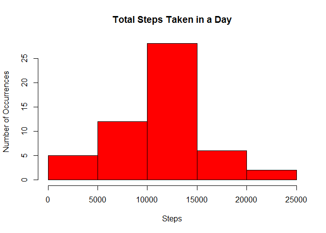
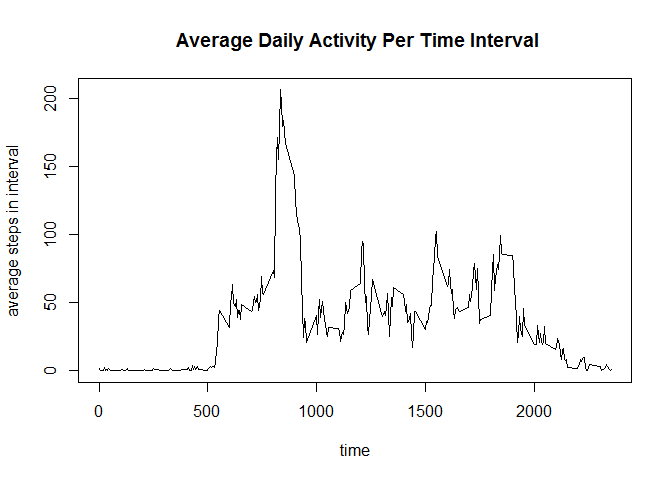
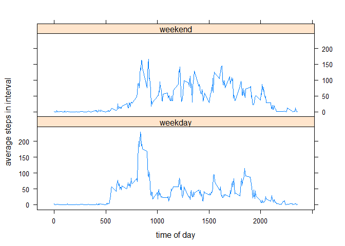

# Reproducible Research: Peer Assessment 1
##Assignment

This assignment will be described in multiple parts. You will need to write a report that answers the questions detailed below. Ultimately, you will need to complete the entire assignment in a **single R markdown document** that can be processed by **knitr** and be transformed into an HTML file.

Throughout your report make sure you always include the code that you used to generate the output you present. When writing code chunks in the R markdown document, always use *echo = TRUE* so that someone else will be able to read the code. **This assignment will be evaluated via peer assessment so it is essential that your peer evaluators be able to review the code for your analysis.**

For the plotting aspects of this assignment, feel free to use any plotting system in R (i.e., base, lattice, ggplot2)

Fork/clone the GitHub repository created for this assignment. You will submit this assignment by pushing your completed files into your forked repository on GitHub. The assignment submission will consist of the URL to your GitHub repository and the SHA-1 commit ID for your repository state.

NOTE: The GitHub repository also contains the dataset for the assignment so you do not have to download the data separately.

###Loading and preprocessing the data

Show any code that is needed to

1. Load the data (i.e. read.csv())


```r
## first read in the data
input_data <- read.csv("activity.csv")
```

2. Process/transform the data (if necessary) into a format suitable for your analysis


```r
## now separate out the rows that have NA values - only use complete rows
complete_rows <- input_data[complete.cases(input_data),]
## now create the array of total steps by date
index <- 1
stepcount_by_date <- 0
first_time <- TRUE
working_date <- as.character(complete_rows[index,"date"])
while (index < dim(complete_rows)[1]){
  steptotal <- -1
  while (complete_rows[index,"date"]==working_date){
    steptotal <- steptotal+ as.numeric(complete_rows[index,"steps"])
    index <- index +1
    if (index > dim(complete_rows)[1]){
      break
    }
  }
if (first_time == TRUE){
  stepcount_by_date <- c(as.numeric(steptotal),working_date) 
  first_time <- FALSE
}
  else stepcount_by_date <- rbind(stepcount_by_date,c(as.numeric(steptotal),working_date))
if (index < dim(complete_rows)[1])
  working_date <- as.character(complete_rows[index,"date"])
}
colnames(stepcount_by_date) <- c("steps","date")
## We also get the list of all intervals which will be necessary for calculating the average daily activity pattern
interval_index <- 1
while (interval_index < dim(complete_rows)[1]){  
  if (interval_index==1){
    interval_list <- as.numeric(complete_rows[interval_index,"interval"])
  }
  else
    if (!match(as.numeric(complete_rows[interval_index,"interval"]),interval_list,nomatch=0)){
      interval_list <- cbind(interval_list,as.numeric(complete_rows[interval_index,"interval"]))
    }
  interval_index <- interval_index + 1
}
```
###What is mean total number of steps taken per day?

For this part of the assignment, you can ignore the missing values in the dataset.

1. Make a histogram of the total number of steps taken each day

```r
## now create the histogram of total steps by date
hist(as.numeric(stepcount_by_date[,1]),col="Red",main="Total Steps Taken in a Day",xlab="Steps",ylab="Number of Occurrences")
```

 

2. Calculate and report the mean and median total number of steps taken per day

```r
## now calculate the mean taken per day
mean_value <- mean(as.numeric(stepcount_by_date[,1]))
median_value <- median(as.numeric(stepcount_by_date[,1]))
cat(sprintf ("Mean value is %6.4f, median value is %5d", mean_value,median_value))
```

```
## Mean value is 10765.1887, median value is 10764
```
### What is the average daily activity pattern?

Make a time series plot (i.e. type = "l") of the 5-minute interval (x-axis) and the average number of steps taken, averaged across all days (y-axis)

Which 5-minute interval, on average across all the days in the dataset, contains the maximum number of steps?

```r
## now we get the mean daily activity pattern
##now we go through and add to the step total and number of days being measured for each interval
## there are a total of 12*24 (every 5 minutes or 12 per hour, 24 hours) = 288 intervals in each day
index_counter <- 1
stepcount_byinterval <- array(0,dim=c(288,3))
stepcount_byinterval[,1] <- (interval_list[1,])
while (index_counter <= dim(complete_rows)[1]){
  
  stepcount_byinterval[match(complete_rows[index_counter,"interval"],interval_list),2] <- stepcount_byinterval[match(complete_rows[index_counter,"interval"],interval_list),2] + complete_rows[index_counter,"steps"]
  stepcount_byinterval[match(complete_rows[index_counter,"interval"],interval_list),3] <- stepcount_byinterval[match(complete_rows[index_counter,"interval"],interval_list),3] + 1
  index_counter <- index_counter+1
}
mean_activity <- stepcount_byinterval[,2] / stepcount_byinterval[,3]
mean_array <- array(0.0,dim=c(288,2))
mean_array[,2] <- mean_activity
mean_array[,1] <- stepcount_byinterval[,1]

plot(mean_array[,1],mean_array[,2],type="l",main=" Average Daily Activity Per Time Interval",xlab="time",ylab="average steps in interval")
```

 

###Imputing missing values

Note that there are a number of days/intervals where there are missing values (coded as NA). The presence of missing days may introduce bias into some calculations or summaries of the data.

1. Calculate and report the total number of missing values in the dataset (i.e. the total number of rows with NAs)

```r
cat (sprintf("The number of rows with NAs is %5d",dim(input_data)[1]-dim(complete_rows)[1]))
```

```
## The number of rows with NAs is  2304
```

2. Devise a strategy for filling in all of the missing values in the dataset. The strategy does not need to be sophisticated. For example, you could use the mean/median for that day, or the mean for that 5-minute interval, etc.

- **The strategy I will use will be to replace the NAs with the means for the appropriate 5-minute interval.**

3. Create a new dataset that is equal to the original dataset but with the missing data filled in.


```r
index <- 1
modified_input_data <- input_data
while (index <=dim(modified_input_data)[1]){
  if (is.na(modified_input_data[index,1])){
    ## the row numbers can be converted to interval start times using this formula
    if (index == as.integer(index/288)*288) {
      interval_used <- 2355
    }
    else {
      index2 <- index-as.integer(index/288)*288   
      if (index2 == as.integer(index2/12)*12) {
        interval_used <- as.integer(index2/12)*100 + (index2 - as.integer(index2/12)*12-1)*5-40
      }
      else{
        interval_used <- as.integer(index2/12)*100 + (index2 - as.integer(index2/12)*12-1)*5
      }
    }
    ## end of formula
    row_to_use <- match(as.character(interval_used),interval_list)     
    modified_input_data[index,1] <- mean_array[row_to_use,2]
  }
  index <- index+1
}
##print (modified_input_data)
```
4. Make a histogram of the total number of steps taken each day and Calculate and report the mean and median total number of steps taken per day. Do these values differ from the estimates from the first part of the assignment? What is the impact of imputing missing data on the estimates of the total daily number of steps?

```r
## now create the array of total steps by date
mod_index <- 1
mod_stepcount_by_date <- 0
mod_first_time <- TRUE
mod_working_date <- as.character(modified_input_data[mod_index,"date"])
while (mod_index < dim(modified_input_data)[1]){
  mod_steptotal <- -1
  while (modified_input_data[mod_index,"date"]==mod_working_date){
    mod_steptotal <- mod_steptotal+ as.numeric(modified_input_data[mod_index,"steps"])
    mod_index <- mod_index +1
    if (mod_index > dim(modified_input_data)[1]){
      break
    }
  }
if (mod_first_time == TRUE){
  mod_stepcount_by_date <- c(as.numeric(mod_steptotal),mod_working_date) 
  mod_first_time <- FALSE
}
  else mod_stepcount_by_date <- rbind(mod_stepcount_by_date,c(as.numeric(mod_steptotal),mod_working_date))
if (mod_index < dim(modified_input_data)[1])
  mod_working_date <- as.character(modified_input_data[mod_index,"date"])
}
colnames(mod_stepcount_by_date) <- c("steps","date")
hist(as.numeric(mod_stepcount_by_date[,1]),col="Red",main="Total Steps Taken in a Day",xlab="Steps",ylab="Number of Occurrences")
```

 

```r
mod_mean_value <- mean(as.numeric(mod_stepcount_by_date[,1]))
mod_median_value <- median(as.numeric(mod_stepcount_by_date[,1]))
cat(sprintf ("Mean value is %6.4f, median value is %6.4f", mod_mean_value,mod_median_value))
```

```
## Mean value is 10765.1887, median value is 10765.1887
```
**The mean is unchanged and the median is only slightly changed.**
**The effect on the estimated measures by replacing the NAs with imputed values using the scheme I selected is negligible.**


###Are there differences in activity patterns between weekdays and weekends?

For this part the weekdays() function may be of some help here. Use the dataset with the filled-in missing values for this part.

1. Create a new factor variable in the dataset with two levels – “weekday” and “weekend” indicating whether a given date is a weekday or weekend day.


```r
xx <- (dim(modified_input_data)[1])
modified_input_data <- cbind(modified_input_data, c(rep(0,xx)))                
colnames(modified_input_data)[4] <- "Weekday/Weekend"
## use the chron package for the weekend function
library(chron)
## use the lubridate package for easy conversion to POSIX format via the mdy function
library(lubridate)
mod_index <- 1
while (mod_index <= dim(modified_input_data)[1]){
  test_date <- mdy(modified_input_data[mod_index,2])
  if (is.weekend(test_date)) modified_input_data[mod_index,4] <-"weekend" else modified_input_data[mod_index,4] <- "weekday"
  mod_index <- mod_index+1
  }
##print(modified_input_data)
```

2. Make a panel plot containing a time series plot (i.e. type = "l") of the 5-minute interval (x-axis) and the average number of steps taken, averaged across all weekday days or weekend days (y-axis). 

```r
panel_plot_data <- data.frame(matrix(rep(0,1152),576,2),c(rep("weekend",288),rep("weekday",288)))
index <- 1
while (index<=576){
  if (index == as.integer(index/288)*288) {
      interval_used <- 2355
      }
  else {
      index2 <- index-as.integer(index/288)*288   
      if (index2 == as.integer(index2/12)*12) {
        interval_used <- as.integer(index2/12)*100 + (index2 - as.integer(index2/12)*12-1)*5-40
        }
      else{
        interval_used <- as.integer(index2/12)*100 + (index2 - as.integer(index2/12)*12-1)*5
        }
      }
  panel_plot_data[index,1] <- interval_used
  index <- index + 1
  }

weekday_count <- 0
weekend_count <- 0
index <- 1
while (index<=dim(modified_input_data)[1]){  
    modulo_288 <- index - as.integer(index/288)*288
    if (modulo_288 == 0) modulo_288 <- 288
    if (modified_input_data[index,4] == "weekday") {
      modulo_288 <- modulo_288 + 288
      weekday_count <- weekday_count + 1
      }
    else weekend_count <- weekend_count + 1
    panel_plot_data[modulo_288,2] <- as.numeric(panel_plot_data[modulo_288,2]) + as.numeric(modified_input_data[index,"steps"])
    index <- index + 1
    }

weekday_count <- weekday_count / 288
weekend_count <- weekend_count / 288
index <- 1
while (index<=dim(panel_plot_data)[1]){  
  if (index <= 288) panel_plot_data[index,2] <- panel_plot_data[index,2] / weekend_count 
  else panel_plot_data[index,2] <- panel_plot_data[index,2] / weekday_count 
  index <- index + 1
  }
##print (panel_plot_data)
library(lattice)
xyplot(panel_plot_data[,2] ~ panel_plot_data[,1]|panel_plot_data[,3],type="l", layout=c(1,2),xlab="time of day", ylab="average steps in interval" )
```

 

**Yes, there is a difference in the activity patterns on weekdays versus weekend days.  The activity is spread out over the entire day much more evenly on weekends whereas there are pre-work-hours and post-work-hours spikes in activity on weekdays**
