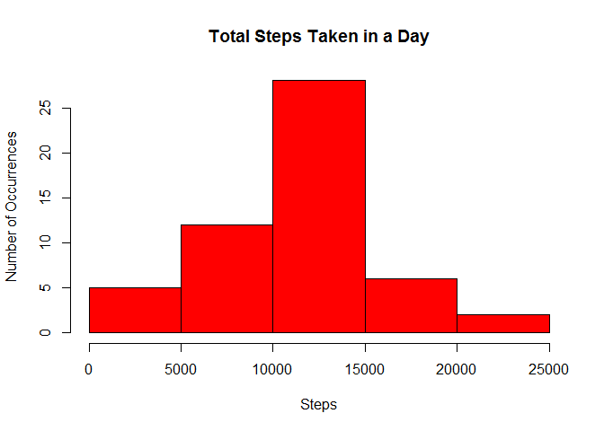
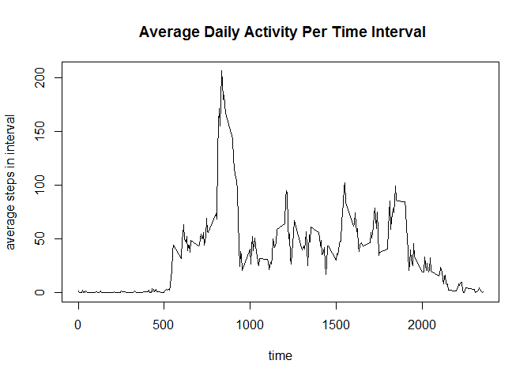
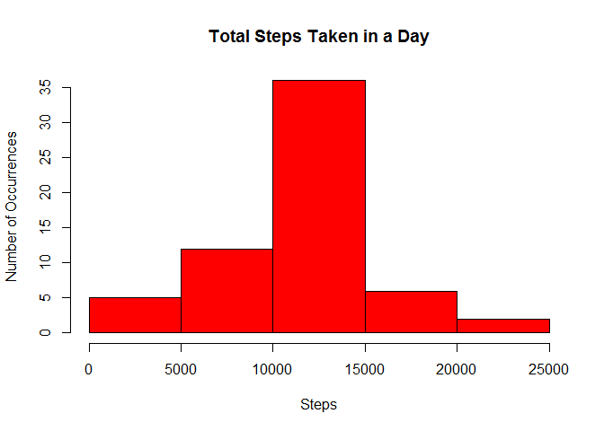

# Reproducible Research: Peer Assessment 1
##Assignment

This assignment will be described in multiple parts. You will need to write a report that answers the questions detailed below. Ultimately, you will need to complete the entire assignment in a **single R markdown document** that can be processed by **knitr** and be transformed into an HTML file.

Throughout your report make sure you always include the code that you used to generate the output you present. When writing code chunks in the R markdown document, always use *echo = TRUE* so that someone else will be able to read the code. **This assignment will be evaluated via peer assessment so it is essential that your peer evaluators be able to review the code for your analysis.**

For the plotting aspects of this assignment, feel free to use any plotting system in R (i.e., base, lattice, ggplot2)

Fork/clone the GitHub repository created for this assignment. You will submit this assignment by pushing your completed files into your forked repository on GitHub. The assignment submission will consist of the URL to your GitHub repository and the SHA-1 commit ID for your repository state.

NOTE: The GitHub repository also contains the dataset for the assignment so you do not have to download the data separately.

###Loading and preprocessing the data

Show any code that is needed to

1. Load the data (i.e. read.csv())


```r
## first read in the data
input_data <- read.csv("activity.csv")
```

2. Process/transform the data (if necessary) into a format suitable for your analysis


```r
## now separate out the rows that have NA values - only use complete rows
complete_rows <- input_data[complete.cases(input_data),]
## now create the array of total steps by date
index <- 1
stepcount_by_date <- 0
first_time <- TRUE
working_date <- as.character(complete_rows[index,"date"])
while (index < dim(complete_rows)[1]){
  steptotal <- -1
  while (complete_rows[index,"date"]==working_date){
    steptotal <- steptotal+ as.numeric(complete_rows[index,"steps"])
    index <- index +1
    if (index > dim(complete_rows)[1]){
      break
    }
  }
if (first_time == TRUE){
  stepcount_by_date <- c(as.numeric(steptotal),working_date) 
  first_time <- FALSE
}
  else stepcount_by_date <- rbind(stepcount_by_date,c(as.numeric(steptotal),working_date))
if (index < dim(complete_rows)[1])
  working_date <- as.character(complete_rows[index,"date"])
}
colnames(stepcount_by_date) <- c("steps","date")
## We also get the list of all intervals which will be necessary for calculating the average daily activity pattern
interval_index <- 1
while (interval_index < dim(complete_rows)[1]){  
  if (interval_index==1){
    interval_list <- as.numeric(complete_rows[interval_index,"interval"])
  }
  else
    if (!match(as.numeric(complete_rows[interval_index,"interval"]),interval_list,nomatch=0)){
      interval_list <- cbind(interval_list,as.numeric(complete_rows[interval_index,"interval"]))
    }
  interval_index <- interval_index + 1
}
```
###What is mean total number of steps taken per day?

For this part of the assignment, you can ignore the missing values in the dataset.

1. Make a histogram of the total number of steps taken each day

```r
## now create the histogram of total steps by date
hist(as.numeric(stepcount_by_date[,1]),col="Red",main="Total Steps Taken in a Day",xlab="Steps",ylab="Number of Occurrences")
```

 

2. Calculate and report the mean and median total number of steps taken per day

```r
## now calculate the mean taken per day
mean_value <- mean(as.numeric(stepcount_by_date[,1]))
median_value <- median(as.numeric(stepcount_by_date[,1]))
cat(sprintf ("Mean value is %6.4f, median value is %5d", mean_value,median_value))
```

```
## Mean value is 10765.1887, median value is 10764
```
### What is the average daily activity pattern?

Make a time series plot (i.e. type = "l") of the 5-minute interval (x-axis) and the average number of steps taken, averaged across all days (y-axis)

Which 5-minute interval, on average across all the days in the dataset, contains the maximum number of steps?

```r
## now we get the mean daily activity pattern
##now we go through and add to the step total and number of days being measured for each interval
## there are a total of 12*24 (every 5 minutes or 12 per hour, 24 hours) = 288 intervals in each day
index_counter <- 1
stepcount_byinterval <- array(0,dim=c(288,3))
stepcount_byinterval[,1] <- (interval_list[1,])
while (index_counter <= dim(complete_rows)[1]){
  
  stepcount_byinterval[match(complete_rows[index_counter,"interval"],interval_list),2] <- stepcount_byinterval[match(complete_rows[index_counter,"interval"],interval_list),2] + complete_rows[index_counter,"steps"]
  stepcount_byinterval[match(complete_rows[index_counter,"interval"],interval_list),3] <- stepcount_byinterval[match(complete_rows[index_counter,"interval"],interval_list),3] + 1
  index_counter <- index_counter+1
}
mean_activity <- stepcount_byinterval[,2] / stepcount_byinterval[,3]
mean_array <- array(0.0,dim=c(288,2))
mean_array[,2] <- mean_activity
mean_array[,1] <- stepcount_byinterval[,1]

plot(mean_array[,1],mean_array[,2],type="l",main=" Average Daily Activity Per Time Interval",xlab="time",ylab="average steps in interval")
```

 

###Imputing missing values

Note that there are a number of days/intervals where there are missing values (coded as NA). The presence of missing days may introduce bias into some calculations or summaries of the data.

1. Calculate and report the total number of missing values in the dataset (i.e. the total number of rows with NAs)

```r
cat (sprintf("The number of rows with NAs is %5d",dim(input_data)[1]-dim(complete_rows)[1]))
```

```
## The number of rows with NAs is  2304
```

2. Devise a strategy for filling in all of the missing values in the dataset. The strategy does not need to be sophisticated. For example, you could use the mean/median for that day, or the mean for that 5-minute interval, etc.

- **The strategy I will use will be to replace the NAs with the means for the appropriate 5-minute interval.**

3. Create a new dataset that is equal to the original dataset but with the missing data filled in.


```r
index <- 1
modified_input_data <- input_data
while (index <=dim(modified_input_data)[1]){
  if (is.na(modified_input_data[index,1])){
    ## the row numbers can be converted to interval start times using this formula
    if (index == as.integer(index/288)*288) {
      interval_used <- 2355
    }
    else {
      index2 <- index-as.integer(index/288)*288   
      if (index2 == as.integer(index2/12)*12) {
        interval_used <- as.integer(index2/12)*100 + (index2 - as.integer(index2/12)*12-1)*5-40
      }
      else{
        interval_used <- as.integer(index2/12)*100 + (index2 - as.integer(index2/12)*12-1)*5
      }
    }
    ## end of formula
    row_to_use <- match(as.character(interval_used),interval_list)     
    modified_input_data[index,1] <- mean_array[row_to_use,2]
  }
  index <- index+1
}
print (modified_input_data)
```

```
##           steps       date interval
## 1       1.71698  10/1/2012        0
## 2       0.33962  10/1/2012        5
## 3       0.13208  10/1/2012       10
## 4       0.15094  10/1/2012       15
## 5       0.07547  10/1/2012       20
## 6       2.09434  10/1/2012       25
## 7       0.52830  10/1/2012       30
## 8       0.86792  10/1/2012       35
## 9       0.00000  10/1/2012       40
## 10      1.47170  10/1/2012       45
## 11      0.30189  10/1/2012       50
## 12      0.13208  10/1/2012       55
## 13      0.32075  10/1/2012      100
## 14      0.67925  10/1/2012      105
## 15      0.15094  10/1/2012      110
## 16      0.33962  10/1/2012      115
## 17      0.00000  10/1/2012      120
## 18      1.11321  10/1/2012      125
## 19      1.83019  10/1/2012      130
## 20      0.16981  10/1/2012      135
## 21      0.16981  10/1/2012      140
## 22      0.37736  10/1/2012      145
## 23      0.26415  10/1/2012      150
## 24      0.00000  10/1/2012      155
## 25      0.00000  10/1/2012      200
## 26      0.00000  10/1/2012      205
## 27      1.13208  10/1/2012      210
## 28      0.00000  10/1/2012      215
## 29      0.00000  10/1/2012      220
## 30      0.13208  10/1/2012      225
## 31      0.00000  10/1/2012      230
## 32      0.22642  10/1/2012      235
## 33      0.00000  10/1/2012      240
## 34      0.00000  10/1/2012      245
## 35      1.54717  10/1/2012      250
## 36      0.94340  10/1/2012      255
## 37      0.00000  10/1/2012      300
## 38      0.00000  10/1/2012      305
## 39      0.00000  10/1/2012      310
## 40      0.00000  10/1/2012      315
## 41      0.20755  10/1/2012      320
## 42      0.62264  10/1/2012      325
## 43      1.62264  10/1/2012      330
## 44      0.58491  10/1/2012      335
## 45      0.49057  10/1/2012      340
## 46      0.07547  10/1/2012      345
## 47      0.00000  10/1/2012      350
## 48      0.00000  10/1/2012      355
## 49      1.18868  10/1/2012      400
## 50      0.94340  10/1/2012      405
## 51      2.56604  10/1/2012      410
## 52      0.00000  10/1/2012      415
## 53      0.33962  10/1/2012      420
## 54      0.35849  10/1/2012      425
## 55      4.11321  10/1/2012      430
## 56      0.66038  10/1/2012      435
## 57      3.49057  10/1/2012      440
## 58      0.83019  10/1/2012      445
## 59      3.11321  10/1/2012      450
## 60      1.11321  10/1/2012      455
## 61      0.00000  10/1/2012      500
## 62      1.56604  10/1/2012      505
## 63      3.00000  10/1/2012      510
## 64      2.24528  10/1/2012      515
## 65      3.32075  10/1/2012      520
## 66      2.96226  10/1/2012      525
## 67      2.09434  10/1/2012      530
## 68      6.05660  10/1/2012      535
## 69     16.01887  10/1/2012      540
## 70     18.33962  10/1/2012      545
## 71     39.45283  10/1/2012      550
## 72     44.49057  10/1/2012      555
## 73     31.49057  10/1/2012      600
## 74     49.26415  10/1/2012      605
## 75     53.77358  10/1/2012      610
## 76     63.45283  10/1/2012      615
## 77     49.96226  10/1/2012      620
## 78     47.07547  10/1/2012      625
## 79     52.15094  10/1/2012      630
## 80     39.33962  10/1/2012      635
## 81     44.01887  10/1/2012      640
## 82     44.16981  10/1/2012      645
## 83     37.35849  10/1/2012      650
## 84     49.03774  10/1/2012      655
## 85     43.81132  10/1/2012      700
## 86     44.37736  10/1/2012      705
## 87     50.50943  10/1/2012      710
## 88     54.50943  10/1/2012      715
## 89     49.92453  10/1/2012      720
## 90     50.98113  10/1/2012      725
## 91     55.67925  10/1/2012      730
## 92     44.32075  10/1/2012      735
## 93     52.26415  10/1/2012      740
## 94     69.54717  10/1/2012      745
## 95     57.84906  10/1/2012      750
## 96     56.15094  10/1/2012      755
## 97     73.37736  10/1/2012      800
## 98     68.20755  10/1/2012      805
## 99    129.43396  10/1/2012      810
## 100   157.52830  10/1/2012      815
## 101   171.15094  10/1/2012      820
## 102   155.39623  10/1/2012      825
## 103   177.30189  10/1/2012      830
## 104   206.16981  10/1/2012      835
## 105   195.92453  10/1/2012      840
## 106   179.56604  10/1/2012      845
## 107   183.39623  10/1/2012      850
## 108   167.01887  10/1/2012      855
## 109   143.45283  10/1/2012      900
## 110   124.03774  10/1/2012      905
## 111   109.11321  10/1/2012      910
## 112   108.11321  10/1/2012      915
## 113   103.71698  10/1/2012      920
## 114    95.96226  10/1/2012      925
## 115    66.20755  10/1/2012      930
## 116    45.22642  10/1/2012      935
## 117    24.79245  10/1/2012      940
## 118    38.75472  10/1/2012      945
## 119    34.98113  10/1/2012      950
## 120    21.05660  10/1/2012      955
## 121    40.56604  10/1/2012     1000
## 122    26.98113  10/1/2012     1005
## 123    42.41509  10/1/2012     1010
## 124    52.66038  10/1/2012     1015
## 125    38.92453  10/1/2012     1020
## 126    50.79245  10/1/2012     1025
## 127    44.28302  10/1/2012     1030
## 128    37.41509  10/1/2012     1035
## 129    34.69811  10/1/2012     1040
## 130    28.33962  10/1/2012     1045
## 131    25.09434  10/1/2012     1050
## 132    31.94340  10/1/2012     1055
## 133    31.35849  10/1/2012     1100
## 134    29.67925  10/1/2012     1105
## 135    21.32075  10/1/2012     1110
## 136    25.54717  10/1/2012     1115
## 137    28.37736  10/1/2012     1120
## 138    26.47170  10/1/2012     1125
## 139    33.43396  10/1/2012     1130
## 140    49.98113  10/1/2012     1135
## 141    42.03774  10/1/2012     1140
## 142    44.60377  10/1/2012     1145
## 143    46.03774  10/1/2012     1150
## 144    59.18868  10/1/2012     1155
## 145    63.86792  10/1/2012     1200
## 146    87.69811  10/1/2012     1205
## 147    94.84906  10/1/2012     1210
## 148    92.77358  10/1/2012     1215
## 149    63.39623  10/1/2012     1220
## 150    50.16981  10/1/2012     1225
## 151    54.47170  10/1/2012     1230
## 152    32.41509  10/1/2012     1235
## 153    26.52830  10/1/2012     1240
## 154    37.73585  10/1/2012     1245
## 155    45.05660  10/1/2012     1250
## 156    67.28302  10/1/2012     1255
## 157    42.33962  10/1/2012     1300
## 158    39.88679  10/1/2012     1305
## 159    43.26415  10/1/2012     1310
## 160    40.98113  10/1/2012     1315
## 161    46.24528  10/1/2012     1320
## 162    56.43396  10/1/2012     1325
## 163    42.75472  10/1/2012     1330
## 164    25.13208  10/1/2012     1335
## 165    39.96226  10/1/2012     1340
## 166    53.54717  10/1/2012     1345
## 167    47.32075  10/1/2012     1350
## 168    60.81132  10/1/2012     1355
## 169    55.75472  10/1/2012     1400
## 170    51.96226  10/1/2012     1405
## 171    43.58491  10/1/2012     1410
## 172    48.69811  10/1/2012     1415
## 173    35.47170  10/1/2012     1420
## 174    37.54717  10/1/2012     1425
## 175    41.84906  10/1/2012     1430
## 176    27.50943  10/1/2012     1435
## 177    17.11321  10/1/2012     1440
## 178    26.07547  10/1/2012     1445
## 179    43.62264  10/1/2012     1450
## 180    43.77358  10/1/2012     1455
## 181    30.01887  10/1/2012     1500
## 182    36.07547  10/1/2012     1505
## 183    35.49057  10/1/2012     1510
## 184    38.84906  10/1/2012     1515
## 185    45.96226  10/1/2012     1520
## 186    47.75472  10/1/2012     1525
## 187    48.13208  10/1/2012     1530
## 188    65.32075  10/1/2012     1535
## 189    82.90566  10/1/2012     1540
## 190    98.66038  10/1/2012     1545
## 191   102.11321  10/1/2012     1550
## 192    83.96226  10/1/2012     1555
## 193    62.13208  10/1/2012     1600
## 194    64.13208  10/1/2012     1605
## 195    74.54717  10/1/2012     1610
## 196    63.16981  10/1/2012     1615
## 197    56.90566  10/1/2012     1620
## 198    59.77358  10/1/2012     1625
## 199    43.86792  10/1/2012     1630
## 200    38.56604  10/1/2012     1635
## 201    44.66038  10/1/2012     1640
## 202    45.45283  10/1/2012     1645
## 203    46.20755  10/1/2012     1650
## 204    43.67925  10/1/2012     1655
## 205    46.62264  10/1/2012     1700
## 206    56.30189  10/1/2012     1705
## 207    50.71698  10/1/2012     1710
## 208    61.22642  10/1/2012     1715
## 209    72.71698  10/1/2012     1720
## 210    78.94340  10/1/2012     1725
## 211    68.94340  10/1/2012     1730
## 212    59.66038  10/1/2012     1735
## 213    75.09434  10/1/2012     1740
## 214    56.50943  10/1/2012     1745
## 215    34.77358  10/1/2012     1750
## 216    37.45283  10/1/2012     1755
## 217    40.67925  10/1/2012     1800
## 218    58.01887  10/1/2012     1805
## 219    74.69811  10/1/2012     1810
## 220    85.32075  10/1/2012     1815
## 221    59.26415  10/1/2012     1820
## 222    67.77358  10/1/2012     1825
## 223    77.69811  10/1/2012     1830
## 224    74.24528  10/1/2012     1835
## 225    85.33962  10/1/2012     1840
## 226    99.45283  10/1/2012     1845
## 227    86.58491  10/1/2012     1850
## 228    85.60377  10/1/2012     1855
## 229    84.86792  10/1/2012     1900
## 230    77.83019  10/1/2012     1905
## 231    58.03774  10/1/2012     1910
## 232    53.35849  10/1/2012     1915
## 233    36.32075  10/1/2012     1920
## 234    20.71698  10/1/2012     1925
## 235    27.39623  10/1/2012     1930
## 236    40.01887  10/1/2012     1935
## 237    30.20755  10/1/2012     1940
## 238    25.54717  10/1/2012     1945
## 239    45.66038  10/1/2012     1950
## 240    33.52830  10/1/2012     1955
## 241    19.62264  10/1/2012     2000
## 242    19.01887  10/1/2012     2005
## 243    19.33962  10/1/2012     2010
## 244    33.33962  10/1/2012     2015
## 245    26.81132  10/1/2012     2020
## 246    21.16981  10/1/2012     2025
## 247    27.30189  10/1/2012     2030
## 248    21.33962  10/1/2012     2035
## 249    19.54717  10/1/2012     2040
## 250    21.32075  10/1/2012     2045
## 251    32.30189  10/1/2012     2050
## 252    20.15094  10/1/2012     2055
## 253    15.94340  10/1/2012     2100
## 254    17.22642  10/1/2012     2105
## 255    23.45283  10/1/2012     2110
## 256    19.24528  10/1/2012     2115
## 257    12.45283  10/1/2012     2120
## 258     8.01887  10/1/2012     2125
## 259    14.66038  10/1/2012     2130
## 260    16.30189  10/1/2012     2135
## 261     8.67925  10/1/2012     2140
## 262     7.79245  10/1/2012     2145
## 263     8.13208  10/1/2012     2150
## 264     2.62264  10/1/2012     2155
## 265     1.45283  10/1/2012     2200
## 266     3.67925  10/1/2012     2205
## 267     4.81132  10/1/2012     2210
## 268     8.50943  10/1/2012     2215
## 269     7.07547  10/1/2012     2220
## 270     8.69811  10/1/2012     2225
## 271     9.75472  10/1/2012     2230
## 272     2.20755  10/1/2012     2235
## 273     0.32075  10/1/2012     2240
## 274     0.11321  10/1/2012     2245
## 275     1.60377  10/1/2012     2250
## 276     4.60377  10/1/2012     2255
## 277     3.30189  10/1/2012     2300
## 278     2.84906  10/1/2012     2305
## 279     0.00000  10/1/2012     2310
## 280     0.83019  10/1/2012     2315
## 281     0.96226  10/1/2012     2320
## 282     1.58491  10/1/2012     2325
## 283     2.60377  10/1/2012     2330
## 284     4.69811  10/1/2012     2335
## 285     3.30189  10/1/2012     2340
## 286     0.64151  10/1/2012     2345
## 287     0.22642  10/1/2012     2350
## 288     1.07547  10/1/2012     2355
## 289     0.00000  10/2/2012        0
## 290     0.00000  10/2/2012        5
## 291     0.00000  10/2/2012       10
## 292     0.00000  10/2/2012       15
## 293     0.00000  10/2/2012       20
## 294     0.00000  10/2/2012       25
## 295     0.00000  10/2/2012       30
## 296     0.00000  10/2/2012       35
## 297     0.00000  10/2/2012       40
## 298     0.00000  10/2/2012       45
## 299     0.00000  10/2/2012       50
## 300     0.00000  10/2/2012       55
## 301     0.00000  10/2/2012      100
## 302     0.00000  10/2/2012      105
## 303     0.00000  10/2/2012      110
## 304     0.00000  10/2/2012      115
## 305     0.00000  10/2/2012      120
## 306     0.00000  10/2/2012      125
## 307     0.00000  10/2/2012      130
## 308     0.00000  10/2/2012      135
## 309     0.00000  10/2/2012      140
## 310     0.00000  10/2/2012      145
## 311     0.00000  10/2/2012      150
## 312     0.00000  10/2/2012      155
## 313     0.00000  10/2/2012      200
## 314     0.00000  10/2/2012      205
## 315     0.00000  10/2/2012      210
## 316     0.00000  10/2/2012      215
## 317     0.00000  10/2/2012      220
## 318     0.00000  10/2/2012      225
## 319     0.00000  10/2/2012      230
## 320     0.00000  10/2/2012      235
## 321     0.00000  10/2/2012      240
## 322     0.00000  10/2/2012      245
## 323     0.00000  10/2/2012      250
## 324     0.00000  10/2/2012      255
## 325     0.00000  10/2/2012      300
## 326     0.00000  10/2/2012      305
## 327     0.00000  10/2/2012      310
## 328     0.00000  10/2/2012      315
## 329     0.00000  10/2/2012      320
## 330     0.00000  10/2/2012      325
## 331     0.00000  10/2/2012      330
## 332     0.00000  10/2/2012      335
## 333     0.00000  10/2/2012      340
## 334     0.00000  10/2/2012      345
## 335     0.00000  10/2/2012      350
## 336     0.00000  10/2/2012      355
## 337     0.00000  10/2/2012      400
## 338     0.00000  10/2/2012      405
## 339     0.00000  10/2/2012      410
## 340     0.00000  10/2/2012      415
## 341     0.00000  10/2/2012      420
## 342     0.00000  10/2/2012      425
## 343     0.00000  10/2/2012      430
## 344     0.00000  10/2/2012      435
## 345     0.00000  10/2/2012      440
## 346     0.00000  10/2/2012      445
## 347     0.00000  10/2/2012      450
## 348     0.00000  10/2/2012      455
## 349     0.00000  10/2/2012      500
## 350     0.00000  10/2/2012      505
## 351     0.00000  10/2/2012      510
## 352     0.00000  10/2/2012      515
## 353     0.00000  10/2/2012      520
## 354     0.00000  10/2/2012      525
## 355     0.00000  10/2/2012      530
## 356     0.00000  10/2/2012      535
## 357     0.00000  10/2/2012      540
## 358     0.00000  10/2/2012      545
## 359     0.00000  10/2/2012      550
## 360     0.00000  10/2/2012      555
## 361     0.00000  10/2/2012      600
## 362     0.00000  10/2/2012      605
## 363     0.00000  10/2/2012      610
## 364     0.00000  10/2/2012      615
## 365     0.00000  10/2/2012      620
## 366     0.00000  10/2/2012      625
## 367     0.00000  10/2/2012      630
## 368     0.00000  10/2/2012      635
## 369     0.00000  10/2/2012      640
## 370     0.00000  10/2/2012      645
## 371     0.00000  10/2/2012      650
## 372     0.00000  10/2/2012      655
## 373     0.00000  10/2/2012      700
## 374     0.00000  10/2/2012      705
## 375     0.00000  10/2/2012      710
## 376     0.00000  10/2/2012      715
## 377     0.00000  10/2/2012      720
## 378     0.00000  10/2/2012      725
## 379     0.00000  10/2/2012      730
## 380     0.00000  10/2/2012      735
## 381     0.00000  10/2/2012      740
## 382     0.00000  10/2/2012      745
## 383     0.00000  10/2/2012      750
## 384     0.00000  10/2/2012      755
## 385     0.00000  10/2/2012      800
## 386     0.00000  10/2/2012      805
## 387     0.00000  10/2/2012      810
## 388     0.00000  10/2/2012      815
## 389     0.00000  10/2/2012      820
## 390     0.00000  10/2/2012      825
## 391     0.00000  10/2/2012      830
## 392     0.00000  10/2/2012      835
## 393     0.00000  10/2/2012      840
## 394     0.00000  10/2/2012      845
## 395     0.00000  10/2/2012      850
## 396     0.00000  10/2/2012      855
## 397     0.00000  10/2/2012      900
## 398     0.00000  10/2/2012      905
## 399     0.00000  10/2/2012      910
## 400     0.00000  10/2/2012      915
## 401     0.00000  10/2/2012      920
## 402     0.00000  10/2/2012      925
## 403     0.00000  10/2/2012      930
## 404     0.00000  10/2/2012      935
## 405     0.00000  10/2/2012      940
## 406     0.00000  10/2/2012      945
## 407     0.00000  10/2/2012      950
## 408     0.00000  10/2/2012      955
## 409     0.00000  10/2/2012     1000
## 410     0.00000  10/2/2012     1005
## 411     0.00000  10/2/2012     1010
## 412     0.00000  10/2/2012     1015
## 413     0.00000  10/2/2012     1020
## 414     0.00000  10/2/2012     1025
## 415     0.00000  10/2/2012     1030
## 416     0.00000  10/2/2012     1035
## 417     0.00000  10/2/2012     1040
## 418     0.00000  10/2/2012     1045
## 419     0.00000  10/2/2012     1050
## 420     0.00000  10/2/2012     1055
## 421     0.00000  10/2/2012     1100
## 422     0.00000  10/2/2012     1105
## 423     0.00000  10/2/2012     1110
## 424     0.00000  10/2/2012     1115
## 425     0.00000  10/2/2012     1120
## 426     0.00000  10/2/2012     1125
## 427     0.00000  10/2/2012     1130
## 428     0.00000  10/2/2012     1135
## 429     0.00000  10/2/2012     1140
## 430     0.00000  10/2/2012     1145
## 431     0.00000  10/2/2012     1150
## 432     0.00000  10/2/2012     1155
## 433     0.00000  10/2/2012     1200
## 434     0.00000  10/2/2012     1205
## 435     0.00000  10/2/2012     1210
## 436     0.00000  10/2/2012     1215
## 437     0.00000  10/2/2012     1220
## 438     0.00000  10/2/2012     1225
## 439     0.00000  10/2/2012     1230
## 440     0.00000  10/2/2012     1235
## 441     0.00000  10/2/2012     1240
## 442     0.00000  10/2/2012     1245
## 443     0.00000  10/2/2012     1250
## 444     0.00000  10/2/2012     1255
## 445     0.00000  10/2/2012     1300
## 446     0.00000  10/2/2012     1305
## 447     0.00000  10/2/2012     1310
## 448     0.00000  10/2/2012     1315
## 449     0.00000  10/2/2012     1320
## 450     0.00000  10/2/2012     1325
## 451     0.00000  10/2/2012     1330
## 452     0.00000  10/2/2012     1335
## 453     0.00000  10/2/2012     1340
## 454     0.00000  10/2/2012     1345
## 455     0.00000  10/2/2012     1350
## 456     0.00000  10/2/2012     1355
## 457     0.00000  10/2/2012     1400
## 458     0.00000  10/2/2012     1405
## 459     0.00000  10/2/2012     1410
## 460     0.00000  10/2/2012     1415
## 461     0.00000  10/2/2012     1420
## 462     0.00000  10/2/2012     1425
## 463     0.00000  10/2/2012     1430
## 464     0.00000  10/2/2012     1435
## 465     0.00000  10/2/2012     1440
## 466     0.00000  10/2/2012     1445
## 467     0.00000  10/2/2012     1450
## 468     0.00000  10/2/2012     1455
## 469     0.00000  10/2/2012     1500
## 470     0.00000  10/2/2012     1505
## 471     0.00000  10/2/2012     1510
## 472     0.00000  10/2/2012     1515
## 473     0.00000  10/2/2012     1520
## 474     0.00000  10/2/2012     1525
## 475     0.00000  10/2/2012     1530
## 476     0.00000  10/2/2012     1535
## 477     0.00000  10/2/2012     1540
## 478     0.00000  10/2/2012     1545
## 479     0.00000  10/2/2012     1550
## 480     0.00000  10/2/2012     1555
## 481     0.00000  10/2/2012     1600
## 482     0.00000  10/2/2012     1605
## 483     0.00000  10/2/2012     1610
## 484     0.00000  10/2/2012     1615
## 485     0.00000  10/2/2012     1620
## 486     0.00000  10/2/2012     1625
## 487     0.00000  10/2/2012     1630
## 488     0.00000  10/2/2012     1635
## 489     0.00000  10/2/2012     1640
## 490     0.00000  10/2/2012     1645
## 491     0.00000  10/2/2012     1650
## 492     0.00000  10/2/2012     1655
## 493     0.00000  10/2/2012     1700
## 494     0.00000  10/2/2012     1705
## 495     0.00000  10/2/2012     1710
## 496     0.00000  10/2/2012     1715
## 497     0.00000  10/2/2012     1720
## 498     0.00000  10/2/2012     1725
## 499     0.00000  10/2/2012     1730
## 500     0.00000  10/2/2012     1735
## 501     0.00000  10/2/2012     1740
## 502     0.00000  10/2/2012     1745
## 503     0.00000  10/2/2012     1750
## 504     0.00000  10/2/2012     1755
## 505     0.00000  10/2/2012     1800
## 506     0.00000  10/2/2012     1805
## 507     0.00000  10/2/2012     1810
## 508     0.00000  10/2/2012     1815
## 509     0.00000  10/2/2012     1820
## 510     0.00000  10/2/2012     1825
## 511     0.00000  10/2/2012     1830
## 512     0.00000  10/2/2012     1835
## 513     0.00000  10/2/2012     1840
## 514     0.00000  10/2/2012     1845
## 515     0.00000  10/2/2012     1850
## 516     0.00000  10/2/2012     1855
## 517     0.00000  10/2/2012     1900
## 518     0.00000  10/2/2012     1905
## 519     0.00000  10/2/2012     1910
## 520     0.00000  10/2/2012     1915
## 521     0.00000  10/2/2012     1920
## 522     0.00000  10/2/2012     1925
## 523     0.00000  10/2/2012     1930
## 524     0.00000  10/2/2012     1935
## 525     0.00000  10/2/2012     1940
## 526     0.00000  10/2/2012     1945
## 527     0.00000  10/2/2012     1950
## 528     0.00000  10/2/2012     1955
## 529     0.00000  10/2/2012     2000
## 530     0.00000  10/2/2012     2005
## 531     0.00000  10/2/2012     2010
## 532     0.00000  10/2/2012     2015
## 533     0.00000  10/2/2012     2020
## 534     0.00000  10/2/2012     2025
## 535     0.00000  10/2/2012     2030
## 536     0.00000  10/2/2012     2035
## 537     0.00000  10/2/2012     2040
## 538     0.00000  10/2/2012     2045
## 539     0.00000  10/2/2012     2050
## 540     0.00000  10/2/2012     2055
## 541     0.00000  10/2/2012     2100
## 542     0.00000  10/2/2012     2105
## 543     0.00000  10/2/2012     2110
## 544     0.00000  10/2/2012     2115
## 545     0.00000  10/2/2012     2120
## 546     0.00000  10/2/2012     2125
## 547     0.00000  10/2/2012     2130
## 548     0.00000  10/2/2012     2135
## 549     0.00000  10/2/2012     2140
## 550     0.00000  10/2/2012     2145
## 551     0.00000  10/2/2012     2150
## 552     0.00000  10/2/2012     2155
## 553     0.00000  10/2/2012     2200
## 554     0.00000  10/2/2012     2205
## 555   117.00000  10/2/2012     2210
## 556     9.00000  10/2/2012     2215
## 557     0.00000  10/2/2012     2220
## 558     0.00000  10/2/2012     2225
## 559     0.00000  10/2/2012     2230
## 560     0.00000  10/2/2012     2235
## 561     0.00000  10/2/2012     2240
## 562     0.00000  10/2/2012     2245
## 563     0.00000  10/2/2012     2250
## 564     0.00000  10/2/2012     2255
## 565     0.00000  10/2/2012     2300
## 566     0.00000  10/2/2012     2305
## 567     0.00000  10/2/2012     2310
## 568     0.00000  10/2/2012     2315
## 569     0.00000  10/2/2012     2320
## 570     0.00000  10/2/2012     2325
## 571     0.00000  10/2/2012     2330
## 572     0.00000  10/2/2012     2335
## 573     0.00000  10/2/2012     2340
## 574     0.00000  10/2/2012     2345
## 575     0.00000  10/2/2012     2350
## 576     0.00000  10/2/2012     2355
## 577     0.00000  10/3/2012        0
## 578     0.00000  10/3/2012        5
## 579     0.00000  10/3/2012       10
## 580     0.00000  10/3/2012       15
## 581     0.00000  10/3/2012       20
## 582     0.00000  10/3/2012       25
## 583     0.00000  10/3/2012       30
## 584     0.00000  10/3/2012       35
## 585     0.00000  10/3/2012       40
## 586     0.00000  10/3/2012       45
## 587     0.00000  10/3/2012       50
## 588     0.00000  10/3/2012       55
## 589     0.00000  10/3/2012      100
## 590     0.00000  10/3/2012      105
## 591     0.00000  10/3/2012      110
## 592     0.00000  10/3/2012      115
## 593     0.00000  10/3/2012      120
## 594     0.00000  10/3/2012      125
## 595     0.00000  10/3/2012      130
## 596     0.00000  10/3/2012      135
## 597     0.00000  10/3/2012      140
## 598     0.00000  10/3/2012      145
## 599     0.00000  10/3/2012      150
## 600     0.00000  10/3/2012      155
## 601     0.00000  10/3/2012      200
## 602     0.00000  10/3/2012      205
## 603     0.00000  10/3/2012      210
## 604     0.00000  10/3/2012      215
## 605     0.00000  10/3/2012      220
## 606     0.00000  10/3/2012      225
## 607     0.00000  10/3/2012      230
## 608     0.00000  10/3/2012      235
## 609     0.00000  10/3/2012      240
## 610     0.00000  10/3/2012      245
## 611     0.00000  10/3/2012      250
## 612     0.00000  10/3/2012      255
## 613     0.00000  10/3/2012      300
## 614     0.00000  10/3/2012      305
## 615     0.00000  10/3/2012      310
## 616     0.00000  10/3/2012      315
## 617     0.00000  10/3/2012      320
## 618     0.00000  10/3/2012      325
## 619     0.00000  10/3/2012      330
## 620     0.00000  10/3/2012      335
## 621     0.00000  10/3/2012      340
## 622     0.00000  10/3/2012      345
## 623     0.00000  10/3/2012      350
## 624     0.00000  10/3/2012      355
## 625     0.00000  10/3/2012      400
## 626     0.00000  10/3/2012      405
## 627     4.00000  10/3/2012      410
## 628     0.00000  10/3/2012      415
## 629     0.00000  10/3/2012      420
## 630     0.00000  10/3/2012      425
## 631    36.00000  10/3/2012      430
## 632     0.00000  10/3/2012      435
## 633     0.00000  10/3/2012      440
## 634     0.00000  10/3/2012      445
## 635     0.00000  10/3/2012      450
## 636     0.00000  10/3/2012      455
## 637     0.00000  10/3/2012      500
## 638     0.00000  10/3/2012      505
## 639     0.00000  10/3/2012      510
## 640     0.00000  10/3/2012      515
## 641     0.00000  10/3/2012      520
## 642     0.00000  10/3/2012      525
## 643     0.00000  10/3/2012      530
## 644    25.00000  10/3/2012      535
## 645     0.00000  10/3/2012      540
## 646     0.00000  10/3/2012      545
## 647    90.00000  10/3/2012      550
## 648   411.00000  10/3/2012      555
## 649   413.00000  10/3/2012      600
## 650   415.00000  10/3/2012      605
## 651   519.00000  10/3/2012      610
## 652   529.00000  10/3/2012      615
## 653   613.00000  10/3/2012      620
## 654   562.00000  10/3/2012      625
## 655   612.00000  10/3/2012      630
## 656   534.00000  10/3/2012      635
## 657   323.00000  10/3/2012      640
## 658   600.00000  10/3/2012      645
## 659   533.00000  10/3/2012      650
## 660   251.00000  10/3/2012      655
## 661    56.00000  10/3/2012      700
## 662     0.00000  10/3/2012      705
## 663    32.00000  10/3/2012      710
## 664    80.00000  10/3/2012      715
## 665    10.00000  10/3/2012      720
## 666     9.00000  10/3/2012      725
## 667   145.00000  10/3/2012      730
## 668    46.00000  10/3/2012      735
## 669     0.00000  10/3/2012      740
## 670    44.00000  10/3/2012      745
## 671   126.00000  10/3/2012      750
## 672    42.00000  10/3/2012      755
## 673   138.00000  10/3/2012      800
## 674    53.00000  10/3/2012      805
## 675     0.00000  10/3/2012      810
## 676     0.00000  10/3/2012      815
## 677    22.00000  10/3/2012      820
## 678    57.00000  10/3/2012      825
## 679   161.00000  10/3/2012      830
## 680    19.00000  10/3/2012      835
## 681    15.00000  10/3/2012      840
## 682     0.00000  10/3/2012      845
## 683    16.00000  10/3/2012      850
## 684     0.00000  10/3/2012      855
## 685     0.00000  10/3/2012      900
## 686     8.00000  10/3/2012      905
## 687     0.00000  10/3/2012      910
## 688    51.00000  10/3/2012      915
## 689   516.00000  10/3/2012      920
## 690   245.00000  10/3/2012      925
## 691     0.00000  10/3/2012      930
## 692   161.00000  10/3/2012      935
## 693     7.00000  10/3/2012      940
## 694     0.00000  10/3/2012      945
## 695     0.00000  10/3/2012      950
## 696     0.00000  10/3/2012      955
## 697     0.00000  10/3/2012     1000
## 698     0.00000  10/3/2012     1005
## 699     0.00000  10/3/2012     1010
## 700     0.00000  10/3/2012     1015
## 701     0.00000  10/3/2012     1020
## 702     0.00000  10/3/2012     1025
## 703     0.00000  10/3/2012     1030
## 704     0.00000  10/3/2012     1035
## 705     0.00000  10/3/2012     1040
## 706     0.00000  10/3/2012     1045
## 707     0.00000  10/3/2012     1050
## 708     0.00000  10/3/2012     1055
## 709     0.00000  10/3/2012     1100
## 710     0.00000  10/3/2012     1105
## 711     0.00000  10/3/2012     1110
## 712     0.00000  10/3/2012     1115
## 713     0.00000  10/3/2012     1120
## 714     0.00000  10/3/2012     1125
## 715     0.00000  10/3/2012     1130
## 716    72.00000  10/3/2012     1135
## 717    73.00000  10/3/2012     1140
## 718     0.00000  10/3/2012     1145
## 719     0.00000  10/3/2012     1150
## 720   116.00000  10/3/2012     1155
## 721    97.00000  10/3/2012     1200
## 722     0.00000  10/3/2012     1205
## 723     0.00000  10/3/2012     1210
## 724     0.00000  10/3/2012     1215
## 725     0.00000  10/3/2012     1220
## 726     0.00000  10/3/2012     1225
## 727    15.00000  10/3/2012     1230
## 728     0.00000  10/3/2012     1235
## 729     0.00000  10/3/2012     1240
## 730     0.00000  10/3/2012     1245
## 731     0.00000  10/3/2012     1250
## 732     0.00000  10/3/2012     1255
## 733    80.00000  10/3/2012     1300
## 734    69.00000  10/3/2012     1305
## 735     0.00000  10/3/2012     1310
## 736     0.00000  10/3/2012     1315
## 737     0.00000  10/3/2012     1320
## 738     0.00000  10/3/2012     1325
## 739     0.00000  10/3/2012     1330
## 740     0.00000  10/3/2012     1335
## 741     0.00000  10/3/2012     1340
## 742    99.00000  10/3/2012     1345
## 743   100.00000  10/3/2012     1350
## 744     0.00000  10/3/2012     1355
## 745     0.00000  10/3/2012     1400
## 746    33.00000  10/3/2012     1405
## 747     0.00000  10/3/2012     1410
## 748     0.00000  10/3/2012     1415
## 749     7.00000  10/3/2012     1420
## 750     0.00000  10/3/2012     1425
## 751     0.00000  10/3/2012     1430
## 752     0.00000  10/3/2012     1435
## 753     0.00000  10/3/2012     1440
## 754     0.00000  10/3/2012     1445
## 755     0.00000  10/3/2012     1450
## 756     0.00000  10/3/2012     1455
## 757     0.00000  10/3/2012     1500
## 758     0.00000  10/3/2012     1505
## 759     0.00000  10/3/2012     1510
## 760     0.00000  10/3/2012     1515
## 761     0.00000  10/3/2012     1520
## 762     0.00000  10/3/2012     1525
## 763     0.00000  10/3/2012     1530
## 764     0.00000  10/3/2012     1535
## 765     0.00000  10/3/2012     1540
## 766    88.00000  10/3/2012     1545
## 767   154.00000  10/3/2012     1550
## 768     0.00000  10/3/2012     1555
## 769    20.00000  10/3/2012     1600
## 770     0.00000  10/3/2012     1605
## 771     0.00000  10/3/2012     1610
## 772     0.00000  10/3/2012     1615
## 773     0.00000  10/3/2012     1620
## 774     0.00000  10/3/2012     1625
## 775     0.00000  10/3/2012     1630
## 776     0.00000  10/3/2012     1635
## 777     0.00000  10/3/2012     1640
## 778     0.00000  10/3/2012     1645
## 779     0.00000  10/3/2012     1650
## 780     0.00000  10/3/2012     1655
## 781     0.00000  10/3/2012     1700
## 782     0.00000  10/3/2012     1705
## 783   198.00000  10/3/2012     1710
## 784    61.00000  10/3/2012     1715
## 785    75.00000  10/3/2012     1720
## 786     0.00000  10/3/2012     1725
## 787     0.00000  10/3/2012     1730
## 788   193.00000  10/3/2012     1735
## 789   298.00000  10/3/2012     1740
## 790     0.00000  10/3/2012     1745
## 791    15.00000  10/3/2012     1750
## 792    21.00000  10/3/2012     1755
## 793     0.00000  10/3/2012     1800
## 794     0.00000  10/3/2012     1805
## 795     0.00000  10/3/2012     1810
## 796     0.00000  10/3/2012     1815
## 797    51.00000  10/3/2012     1820
## 798    36.00000  10/3/2012     1825
## 799     0.00000  10/3/2012     1830
## 800    26.00000  10/3/2012     1835
## 801    22.00000  10/3/2012     1840
## 802     0.00000  10/3/2012     1845
## 803    39.00000  10/3/2012     1850
## 804    52.00000  10/3/2012     1855
## 805    15.00000  10/3/2012     1900
## 806    41.00000  10/3/2012     1905
## 807     0.00000  10/3/2012     1910
## 808    42.00000  10/3/2012     1915
## 809     0.00000  10/3/2012     1920
## 810     0.00000  10/3/2012     1925
## 811   159.00000  10/3/2012     1930
## 812    32.00000  10/3/2012     1935
## 813     0.00000  10/3/2012     1940
## 814     0.00000  10/3/2012     1945
## 815     0.00000  10/3/2012     1950
## 816     0.00000  10/3/2012     1955
## 817    34.00000  10/3/2012     2000
## 818     0.00000  10/3/2012     2005
## 819     0.00000  10/3/2012     2010
## 820     0.00000  10/3/2012     2015
## 821     0.00000  10/3/2012     2020
## 822    36.00000  10/3/2012     2025
## 823    73.00000  10/3/2012     2030
## 824     9.00000  10/3/2012     2035
## 825     0.00000  10/3/2012     2040
## 826     0.00000  10/3/2012     2045
## 827     0.00000  10/3/2012     2050
## 828     0.00000  10/3/2012     2055
## 829     0.00000  10/3/2012     2100
## 830     0.00000  10/3/2012     2105
## 831     0.00000  10/3/2012     2110
## 832     0.00000  10/3/2012     2115
## 833     0.00000  10/3/2012     2120
## 834     0.00000  10/3/2012     2125
## 835    90.00000  10/3/2012     2130
## 836   128.00000  10/3/2012     2135
## 837    46.00000  10/3/2012     2140
## 838     0.00000  10/3/2012     2145
## 839     0.00000  10/3/2012     2150
## 840     0.00000  10/3/2012     2155
## 841     0.00000  10/3/2012     2200
## 842     0.00000  10/3/2012     2205
## 843     0.00000  10/3/2012     2210
## 844     0.00000  10/3/2012     2215
## 845     0.00000  10/3/2012     2220
## 846     0.00000  10/3/2012     2225
## 847     0.00000  10/3/2012     2230
## 848     0.00000  10/3/2012     2235
## 849     0.00000  10/3/2012     2240
## 850     0.00000  10/3/2012     2245
## 851     0.00000  10/3/2012     2250
## 852     0.00000  10/3/2012     2255
## 853     0.00000  10/3/2012     2300
## 854     0.00000  10/3/2012     2305
## 855     0.00000  10/3/2012     2310
## 856     0.00000  10/3/2012     2315
## 857     0.00000  10/3/2012     2320
## 858     0.00000  10/3/2012     2325
## 859     0.00000  10/3/2012     2330
## 860     0.00000  10/3/2012     2335
## 861     0.00000  10/3/2012     2340
## 862     8.00000  10/3/2012     2345
## 863     0.00000  10/3/2012     2350
## 864     0.00000  10/3/2012     2355
## 865    47.00000  10/4/2012        0
## 866     0.00000  10/4/2012        5
## 867     0.00000  10/4/2012       10
## 868     0.00000  10/4/2012       15
## 869     0.00000  10/4/2012       20
## 870     0.00000  10/4/2012       25
## 871     0.00000  10/4/2012       30
## 872     0.00000  10/4/2012       35
## 873     0.00000  10/4/2012       40
## 874     0.00000  10/4/2012       45
## 875     0.00000  10/4/2012       50
## 876     0.00000  10/4/2012       55
## 877     0.00000  10/4/2012      100
## 878     0.00000  10/4/2012      105
## 879     0.00000  10/4/2012      110
## 880     0.00000  10/4/2012      115
## 881     0.00000  10/4/2012      120
## 882     0.00000  10/4/2012      125
## 883     0.00000  10/4/2012      130
## 884     0.00000  10/4/2012      135
## 885     0.00000  10/4/2012      140
## 886     0.00000  10/4/2012      145
## 887     0.00000  10/4/2012      150
## 888     0.00000  10/4/2012      155
## 889     0.00000  10/4/2012      200
## 890     0.00000  10/4/2012      205
## 891     0.00000  10/4/2012      210
## 892     0.00000  10/4/2012      215
## 893     0.00000  10/4/2012      220
## 894     0.00000  10/4/2012      225
## 895     0.00000  10/4/2012      230
## 896     0.00000  10/4/2012      235
## 897     0.00000  10/4/2012      240
## 898     0.00000  10/4/2012      245
## 899     0.00000  10/4/2012      250
## 900     0.00000  10/4/2012      255
## 901     0.00000  10/4/2012      300
## 902     0.00000  10/4/2012      305
## 903     0.00000  10/4/2012      310
## 904     0.00000  10/4/2012      315
## 905     0.00000  10/4/2012      320
## 906     0.00000  10/4/2012      325
## 907     0.00000  10/4/2012      330
## 908     0.00000  10/4/2012      335
## 909     0.00000  10/4/2012      340
## 910     0.00000  10/4/2012      345
## 911     0.00000  10/4/2012      350
## 912     0.00000  10/4/2012      355
## 913     0.00000  10/4/2012      400
## 914     0.00000  10/4/2012      405
## 915     0.00000  10/4/2012      410
## 916     0.00000  10/4/2012      415
## 917     0.00000  10/4/2012      420
## 918     0.00000  10/4/2012      425
## 919     0.00000  10/4/2012      430
## 920     0.00000  10/4/2012      435
## 921     0.00000  10/4/2012      440
## 922     0.00000  10/4/2012      445
## 923     0.00000  10/4/2012      450
## 924     0.00000  10/4/2012      455
## 925     0.00000  10/4/2012      500
## 926     0.00000  10/4/2012      505
## 927     7.00000  10/4/2012      510
## 928    18.00000  10/4/2012      515
## 929    57.00000  10/4/2012      520
## 930    40.00000  10/4/2012      525
## 931     0.00000  10/4/2012      530
## 932     0.00000  10/4/2012      535
## 933     0.00000  10/4/2012      540
## 934     0.00000  10/4/2012      545
## 935    16.00000  10/4/2012      550
## 936     1.00000  10/4/2012      555
## 937     0.00000  10/4/2012      600
## 938    18.00000  10/4/2012      605
## 939    20.00000  10/4/2012      610
## 940    40.00000  10/4/2012      615
## 941    36.00000  10/4/2012      620
## 942    17.00000  10/4/2012      625
## 943    49.00000  10/4/2012      630
## 944    86.00000  10/4/2012      635
## 945    49.00000  10/4/2012      640
## 946     0.00000  10/4/2012      645
## 947    29.00000  10/4/2012      650
## 948    59.00000  10/4/2012      655
## 949     7.00000  10/4/2012      700
## 950    25.00000  10/4/2012      705
## 951    30.00000  10/4/2012      710
## 952    31.00000  10/4/2012      715
## 953     7.00000  10/4/2012      720
## 954    18.00000  10/4/2012      725
## 955   113.00000  10/4/2012      730
## 956   181.00000  10/4/2012      735
## 957    87.00000  10/4/2012      740
## 958     0.00000  10/4/2012      745
## 959     0.00000  10/4/2012      750
## 960     0.00000  10/4/2012      755
## 961    57.00000  10/4/2012      800
## 962    99.00000  10/4/2012      805
## 963   507.00000  10/4/2012      810
## 964   522.00000  10/4/2012      815
## 965   510.00000  10/4/2012      820
## 966   519.00000  10/4/2012      825
## 967   508.00000  10/4/2012      830
## 968   423.00000  10/4/2012      835
## 969   499.00000  10/4/2012      840
## 970   259.00000  10/4/2012      845
## 971    31.00000  10/4/2012      850
## 972    17.00000  10/4/2012      855
## 973     0.00000  10/4/2012      900
## 974     0.00000  10/4/2012      905
## 975     0.00000  10/4/2012      910
## 976     0.00000  10/4/2012      915
## 977     0.00000  10/4/2012      920
## 978    17.00000  10/4/2012      925
## 979     0.00000  10/4/2012      930
## 980   145.00000  10/4/2012      935
## 981   453.00000  10/4/2012      940
## 982   229.00000  10/4/2012      945
## 983   144.00000  10/4/2012      950
## 984     0.00000  10/4/2012      955
## 985     0.00000  10/4/2012     1000
## 986     0.00000  10/4/2012     1005
## 987    82.00000  10/4/2012     1010
## 988     0.00000  10/4/2012     1015
## 989     0.00000  10/4/2012     1020
## 990     0.00000  10/4/2012     1025
## 991     0.00000  10/4/2012     1030
## 992     0.00000  10/4/2012     1035
## 993     0.00000  10/4/2012     1040
## 994     0.00000  10/4/2012     1045
## 995     0.00000  10/4/2012     1050
## 996     0.00000  10/4/2012     1055
## 997     0.00000  10/4/2012     1100
## 998     0.00000  10/4/2012     1105
## 999     0.00000  10/4/2012     1110
## 1000    0.00000  10/4/2012     1115
## 1001    0.00000  10/4/2012     1120
## 1002  180.00000  10/4/2012     1125
## 1003   21.00000  10/4/2012     1130
## 1004    0.00000  10/4/2012     1135
## 1005    0.00000  10/4/2012     1140
## 1006    0.00000  10/4/2012     1145
## 1007    0.00000  10/4/2012     1150
## 1008    0.00000  10/4/2012     1155
## 1009  160.00000  10/4/2012     1200
## 1010   79.00000  10/4/2012     1205
## 1011    0.00000  10/4/2012     1210
## 1012    0.00000  10/4/2012     1215
## 1013    0.00000  10/4/2012     1220
## 1014   46.00000  10/4/2012     1225
## 1015   66.00000  10/4/2012     1230
## 1016  127.00000  10/4/2012     1235
## 1017    0.00000  10/4/2012     1240
## 1018    0.00000  10/4/2012     1245
## 1019    0.00000  10/4/2012     1250
## 1020    0.00000  10/4/2012     1255
## 1021    0.00000  10/4/2012     1300
## 1022    0.00000  10/4/2012     1305
## 1023   31.00000  10/4/2012     1310
## 1024    0.00000  10/4/2012     1315
## 1025    0.00000  10/4/2012     1320
## 1026    0.00000  10/4/2012     1325
## 1027    0.00000  10/4/2012     1330
## 1028    0.00000  10/4/2012     1335
## 1029   28.00000  10/4/2012     1340
## 1030  496.00000  10/4/2012     1345
## 1031   78.00000  10/4/2012     1350
## 1032    0.00000  10/4/2012     1355
## 1033    0.00000  10/4/2012     1400
## 1034    0.00000  10/4/2012     1405
## 1035    0.00000  10/4/2012     1410
## 1036    0.00000  10/4/2012     1415
## 1037    0.00000  10/4/2012     1420
## 1038    0.00000  10/4/2012     1425
## 1039    0.00000  10/4/2012     1430
## 1040   77.00000  10/4/2012     1435
## 1041   20.00000  10/4/2012     1440
## 1042    7.00000  10/4/2012     1445
## 1043    1.00000  10/4/2012     1450
## 1044  128.00000  10/4/2012     1455
## 1045  354.00000  10/4/2012     1500
## 1046  310.00000  10/4/2012     1505
## 1047    0.00000  10/4/2012     1510
## 1048    0.00000  10/4/2012     1515
## 1049   25.00000  10/4/2012     1520
## 1050   15.00000  10/4/2012     1525
## 1051    0.00000  10/4/2012     1530
## 1052    0.00000  10/4/2012     1535
## 1053    0.00000  10/4/2012     1540
## 1054    0.00000  10/4/2012     1545
## 1055   33.00000  10/4/2012     1550
## 1056   33.00000  10/4/2012     1555
## 1057   32.00000  10/4/2012     1600
## 1058   66.00000  10/4/2012     1605
## 1059   77.00000  10/4/2012     1610
## 1060    0.00000  10/4/2012     1615
## 1061   44.00000  10/4/2012     1620
## 1062    0.00000  10/4/2012     1625
## 1063    0.00000  10/4/2012     1630
## 1064    0.00000  10/4/2012     1635
## 1065    0.00000  10/4/2012     1640
## 1066    0.00000  10/4/2012     1645
## 1067    0.00000  10/4/2012     1650
## 1068    0.00000  10/4/2012     1655
## 1069    0.00000  10/4/2012     1700
## 1070    0.00000  10/4/2012     1705
## 1071    0.00000  10/4/2012     1710
## 1072    0.00000  10/4/2012     1715
## 1073    0.00000  10/4/2012     1720
## 1074   40.00000  10/4/2012     1725
## 1075    0.00000  10/4/2012     1730
## 1076   37.00000  10/4/2012     1735
## 1077   90.00000  10/4/2012     1740
## 1078   53.00000  10/4/2012     1745
## 1079   73.00000  10/4/2012     1750
## 1080   92.00000  10/4/2012     1755
## 1081  285.00000  10/4/2012     1800
## 1082  527.00000  10/4/2012     1805
## 1083  531.00000  10/4/2012     1810
## 1084  547.00000  10/4/2012     1815
## 1085  175.00000  10/4/2012     1820
## 1086  114.00000  10/4/2012     1825
## 1087   62.00000  10/4/2012     1830
## 1088    0.00000  10/4/2012     1835
## 1089   59.00000  10/4/2012     1840
## 1090   65.00000  10/4/2012     1845
## 1091    0.00000  10/4/2012     1850
## 1092  101.00000  10/4/2012     1855
## 1093   43.00000  10/4/2012     1900
## 1094    0.00000  10/4/2012     1905
## 1095    0.00000  10/4/2012     1910
## 1096    0.00000  10/4/2012     1915
## 1097   49.00000  10/4/2012     1920
## 1098   21.00000  10/4/2012     1925
## 1099    0.00000  10/4/2012     1930
## 1100   16.00000  10/4/2012     1935
## 1101   56.00000  10/4/2012     1940
## 1102    0.00000  10/4/2012     1945
## 1103    0.00000  10/4/2012     1950
## 1104    0.00000  10/4/2012     1955
## 1105    0.00000  10/4/2012     2000
## 1106    0.00000  10/4/2012     2005
## 1107    0.00000  10/4/2012     2010
## 1108    0.00000  10/4/2012     2015
## 1109    0.00000  10/4/2012     2020
## 1110    0.00000  10/4/2012     2025
## 1111    0.00000  10/4/2012     2030
## 1112    0.00000  10/4/2012     2035
## 1113   17.00000  10/4/2012     2040
## 1114   15.00000  10/4/2012     2045
## 1115    0.00000  10/4/2012     2050
## 1116    0.00000  10/4/2012     2055
## 1117   27.00000  10/4/2012     2100
## 1118  106.00000  10/4/2012     2105
## 1119  122.00000  10/4/2012     2110
## 1120   41.00000  10/4/2012     2115
## 1121   35.00000  10/4/2012     2120
## 1122    6.00000  10/4/2012     2125
## 1123    0.00000  10/4/2012     2130
## 1124    0.00000  10/4/2012     2135
## 1125   68.00000  10/4/2012     2140
## 1126    0.00000  10/4/2012     2145
## 1127    0.00000  10/4/2012     2150
## 1128    0.00000  10/4/2012     2155
## 1129    0.00000  10/4/2012     2200
## 1130    0.00000  10/4/2012     2205
## 1131    0.00000  10/4/2012     2210
## 1132    0.00000  10/4/2012     2215
## 1133    0.00000  10/4/2012     2220
## 1134    0.00000  10/4/2012     2225
## 1135    0.00000  10/4/2012     2230
## 1136    0.00000  10/4/2012     2235
## 1137    0.00000  10/4/2012     2240
## 1138    0.00000  10/4/2012     2245
## 1139    0.00000  10/4/2012     2250
## 1140    0.00000  10/4/2012     2255
## 1141    0.00000  10/4/2012     2300
## 1142    0.00000  10/4/2012     2305
## 1143    0.00000  10/4/2012     2310
## 1144    0.00000  10/4/2012     2315
## 1145    0.00000  10/4/2012     2320
## 1146    0.00000  10/4/2012     2325
## 1147    0.00000  10/4/2012     2330
## 1148    0.00000  10/4/2012     2335
## 1149    0.00000  10/4/2012     2340
## 1150    0.00000  10/4/2012     2345
## 1151    0.00000  10/4/2012     2350
## 1152    0.00000  10/4/2012     2355
## 1153    0.00000  10/5/2012        0
## 1154    0.00000  10/5/2012        5
## 1155    0.00000  10/5/2012       10
## 1156    0.00000  10/5/2012       15
## 1157    0.00000  10/5/2012       20
## 1158    0.00000  10/5/2012       25
## 1159    0.00000  10/5/2012       30
## 1160    0.00000  10/5/2012       35
## 1161    0.00000  10/5/2012       40
## 1162    0.00000  10/5/2012       45
## 1163    0.00000  10/5/2012       50
## 1164    0.00000  10/5/2012       55
## 1165    0.00000  10/5/2012      100
## 1166    0.00000  10/5/2012      105
## 1167    0.00000  10/5/2012      110
## 1168    0.00000  10/5/2012      115
## 1169    0.00000  10/5/2012      120
## 1170    0.00000  10/5/2012      125
## 1171    0.00000  10/5/2012      130
## 1172    0.00000  10/5/2012      135
## 1173    0.00000  10/5/2012      140
## 1174    9.00000  10/5/2012      145
## 1175   14.00000  10/5/2012      150
## 1176    0.00000  10/5/2012      155
## 1177    0.00000  10/5/2012      200
## 1178    0.00000  10/5/2012      205
## 1179    0.00000  10/5/2012      210
## 1180    0.00000  10/5/2012      215
## 1181    0.00000  10/5/2012      220
## 1182    7.00000  10/5/2012      225
## 1183    0.00000  10/5/2012      230
## 1184    0.00000  10/5/2012      235
## 1185    0.00000  10/5/2012      240
## 1186    0.00000  10/5/2012      245
## 1187   27.00000  10/5/2012      250
## 1188    0.00000  10/5/2012      255
## 1189    0.00000  10/5/2012      300
## 1190    0.00000  10/5/2012      305
## 1191    0.00000  10/5/2012      310
## 1192    0.00000  10/5/2012      315
## 1193    0.00000  10/5/2012      320
## 1194    0.00000  10/5/2012      325
## 1195    0.00000  10/5/2012      330
## 1196    0.00000  10/5/2012      335
## 1197    0.00000  10/5/2012      340
## 1198    0.00000  10/5/2012      345
## 1199    0.00000  10/5/2012      350
## 1200    0.00000  10/5/2012      355
## 1201    0.00000  10/5/2012      400
## 1202   39.00000  10/5/2012      405
## 1203    0.00000  10/5/2012      410
## 1204    0.00000  10/5/2012      415
## 1205    0.00000  10/5/2012      420
## 1206    0.00000  10/5/2012      425
## 1207    0.00000  10/5/2012      430
## 1208    0.00000  10/5/2012      435
## 1209    0.00000  10/5/2012      440
## 1210    0.00000  10/5/2012      445
## 1211    0.00000  10/5/2012      450
## 1212    0.00000  10/5/2012      455
## 1213    0.00000  10/5/2012      500
## 1214   27.00000  10/5/2012      505
## 1215    0.00000  10/5/2012      510
## 1216    0.00000  10/5/2012      515
## 1217    0.00000  10/5/2012      520
## 1218    0.00000  10/5/2012      525
## 1219    0.00000  10/5/2012      530
## 1220    0.00000  10/5/2012      535
## 1221    0.00000  10/5/2012      540
## 1222    0.00000  10/5/2012      545
## 1223    0.00000  10/5/2012      550
## 1224   52.00000  10/5/2012      555
## 1225   36.00000  10/5/2012      600
## 1226    0.00000  10/5/2012      605
## 1227    0.00000  10/5/2012      610
## 1228   28.00000  10/5/2012      615
## 1229   67.00000  10/5/2012      620
## 1230  119.00000  10/5/2012      625
## 1231    7.00000  10/5/2012      630
## 1232   21.00000  10/5/2012      635
## 1233   29.00000  10/5/2012      640
## 1234   68.00000  10/5/2012      645
## 1235   29.00000  10/5/2012      650
## 1236    0.00000  10/5/2012      655
## 1237   11.00000  10/5/2012      700
## 1238   19.00000  10/5/2012      705
## 1239   84.00000  10/5/2012      710
## 1240   50.00000  10/5/2012      715
## 1241    2.00000  10/5/2012      720
## 1242   43.00000  10/5/2012      725
## 1243  126.00000  10/5/2012      730
## 1244   30.00000  10/5/2012      735
## 1245   19.00000  10/5/2012      740
## 1246    8.00000  10/5/2012      745
## 1247  171.00000  10/5/2012      750
## 1248   68.00000  10/5/2012      755
## 1249  114.00000  10/5/2012      800
## 1250    0.00000  10/5/2012      805
## 1251    9.00000  10/5/2012      810
## 1252  122.00000  10/5/2012      815
## 1253  400.00000  10/5/2012      820
## 1254  451.00000  10/5/2012      825
## 1255  371.00000  10/5/2012      830
## 1256  470.00000  10/5/2012      835
## 1257  473.00000  10/5/2012      840
## 1258  512.00000  10/5/2012      845
## 1259  449.00000  10/5/2012      850
## 1260  496.00000  10/5/2012      855
## 1261  530.00000  10/5/2012      900
## 1262  509.00000  10/5/2012      905
## 1263  252.00000  10/5/2012      910
## 1264   84.00000  10/5/2012      915
## 1265   16.00000  10/5/2012      920
## 1266    0.00000  10/5/2012      925
## 1267    6.00000  10/5/2012      930
## 1268   46.00000  10/5/2012      935
## 1269   39.00000  10/5/2012      940
## 1270    0.00000  10/5/2012      945
## 1271    0.00000  10/5/2012      950
## 1272    0.00000  10/5/2012      955
## 1273    0.00000  10/5/2012     1000
## 1274    0.00000  10/5/2012     1005
## 1275    0.00000  10/5/2012     1010
## 1276    0.00000  10/5/2012     1015
## 1277    0.00000  10/5/2012     1020
## 1278    0.00000  10/5/2012     1025
## 1279    0.00000  10/5/2012     1030
## 1280    0.00000  10/5/2012     1035
## 1281    0.00000  10/5/2012     1040
## 1282    0.00000  10/5/2012     1045
## 1283    0.00000  10/5/2012     1050
## 1284    0.00000  10/5/2012     1055
## 1285    0.00000  10/5/2012     1100
## 1286    0.00000  10/5/2012     1105
## 1287    0.00000  10/5/2012     1110
## 1288    0.00000  10/5/2012     1115
## 1289    0.00000  10/5/2012     1120
## 1290    0.00000  10/5/2012     1125
## 1291    0.00000  10/5/2012     1130
## 1292    0.00000  10/5/2012     1135
## 1293    0.00000  10/5/2012     1140
## 1294    0.00000  10/5/2012     1145
## 1295    0.00000  10/5/2012     1150
## 1296    0.00000  10/5/2012     1155
## 1297  138.00000  10/5/2012     1200
## 1298  541.00000  10/5/2012     1205
## 1299  555.00000  10/5/2012     1210
## 1300  345.00000  10/5/2012     1215
## 1301  345.00000  10/5/2012     1220
## 1302   10.00000  10/5/2012     1225
## 1303  485.00000  10/5/2012     1230
## 1304  515.00000  10/5/2012     1235
## 1305  168.00000  10/5/2012     1240
## 1306    0.00000  10/5/2012     1245
## 1307    0.00000  10/5/2012     1250
## 1308    0.00000  10/5/2012     1255
## 1309    0.00000  10/5/2012     1300
## 1310    0.00000  10/5/2012     1305
## 1311    0.00000  10/5/2012     1310
## 1312    0.00000  10/5/2012     1315
## 1313  349.00000  10/5/2012     1320
## 1314  341.00000  10/5/2012     1325
## 1315    0.00000  10/5/2012     1330
## 1316    0.00000  10/5/2012     1335
## 1317    0.00000  10/5/2012     1340
## 1318    0.00000  10/5/2012     1345
## 1319    0.00000  10/5/2012     1350
## 1320  158.00000  10/5/2012     1355
## 1321  545.00000  10/5/2012     1400
## 1322   82.00000  10/5/2012     1405
## 1323    0.00000  10/5/2012     1410
## 1324  105.00000  10/5/2012     1415
## 1325    0.00000  10/5/2012     1420
## 1326    0.00000  10/5/2012     1425
## 1327    0.00000  10/5/2012     1430
## 1328    0.00000  10/5/2012     1435
## 1329    0.00000  10/5/2012     1440
## 1330    0.00000  10/5/2012     1445
## 1331    0.00000  10/5/2012     1450
## 1332    0.00000  10/5/2012     1455
## 1333    0.00000  10/5/2012     1500
## 1334    0.00000  10/5/2012     1505
## 1335    0.00000  10/5/2012     1510
## 1336    0.00000  10/5/2012     1515
## 1337    0.00000  10/5/2012     1520
## 1338    0.00000  10/5/2012     1525
## 1339    0.00000  10/5/2012     1530
## 1340    0.00000  10/5/2012     1535
## 1341  326.00000  10/5/2012     1540
## 1342  172.00000  10/5/2012     1545
## 1343  332.00000  10/5/2012     1550
## 1344  402.00000  10/5/2012     1555
## 1345   70.00000  10/5/2012     1600
## 1346    0.00000  10/5/2012     1605
## 1347    0.00000  10/5/2012     1610
## 1348    0.00000  10/5/2012     1615
## 1349    0.00000  10/5/2012     1620
## 1350    0.00000  10/5/2012     1625
## 1351    0.00000  10/5/2012     1630
## 1352    0.00000  10/5/2012     1635
## 1353    0.00000  10/5/2012     1640
## 1354    0.00000  10/5/2012     1645
## 1355    0.00000  10/5/2012     1650
## 1356    0.00000  10/5/2012     1655
## 1357    0.00000  10/5/2012     1700
## 1358    0.00000  10/5/2012     1705
## 1359    0.00000  10/5/2012     1710
## 1360   53.00000  10/5/2012     1715
## 1361    0.00000  10/5/2012     1720
## 1362    0.00000  10/5/2012     1725
## 1363    0.00000  10/5/2012     1730
## 1364    0.00000  10/5/2012     1735
## 1365    0.00000  10/5/2012     1740
## 1366    0.00000  10/5/2012     1745
## 1367    7.00000  10/5/2012     1750
## 1368   10.00000  10/5/2012     1755
## 1369   65.00000  10/5/2012     1800
## 1370   40.00000  10/5/2012     1805
## 1371   15.00000  10/5/2012     1810
## 1372   29.00000  10/5/2012     1815
## 1373    0.00000  10/5/2012     1820
## 1374   20.00000  10/5/2012     1825
## 1375   35.00000  10/5/2012     1830
## 1376   69.00000  10/5/2012     1835
## 1377   25.00000  10/5/2012     1840
## 1378   46.00000  10/5/2012     1845
## 1379   15.00000  10/5/2012     1850
## 1380   26.00000  10/5/2012     1855
## 1381   33.00000  10/5/2012     1900
## 1382   58.00000  10/5/2012     1905
## 1383   75.00000  10/5/2012     1910
## 1384   59.00000  10/5/2012     1915
## 1385    0.00000  10/5/2012     1920
## 1386    0.00000  10/5/2012     1925
## 1387    0.00000  10/5/2012     1930
## 1388    0.00000  10/5/2012     1935
## 1389    0.00000  10/5/2012     1940
## 1390    0.00000  10/5/2012     1945
## 1391    0.00000  10/5/2012     1950
## 1392    0.00000  10/5/2012     1955
## 1393    0.00000  10/5/2012     2000
## 1394    0.00000  10/5/2012     2005
## 1395    0.00000  10/5/2012     2010
## 1396    0.00000  10/5/2012     2015
## 1397    0.00000  10/5/2012     2020
## 1398    0.00000  10/5/2012     2025
## 1399    0.00000  10/5/2012     2030
## 1400   71.00000  10/5/2012     2035
## 1401    0.00000  10/5/2012     2040
## 1402    0.00000  10/5/2012     2045
## 1403    0.00000  10/5/2012     2050
## 1404    0.00000  10/5/2012     2055
## 1405    0.00000  10/5/2012     2100
## 1406    0.00000  10/5/2012     2105
## 1407    0.00000  10/5/2012     2110
## 1408    0.00000  10/5/2012     2115
## 1409    0.00000  10/5/2012     2120
## 1410    0.00000  10/5/2012     2125
## 1411    0.00000  10/5/2012     2130
## 1412    0.00000  10/5/2012     2135
## 1413    0.00000  10/5/2012     2140
## 1414    0.00000  10/5/2012     2145
## 1415    0.00000  10/5/2012     2150
## 1416    0.00000  10/5/2012     2155
## 1417    0.00000  10/5/2012     2200
## 1418    0.00000  10/5/2012     2205
## 1419    0.00000  10/5/2012     2210
## 1420    0.00000  10/5/2012     2215
## 1421    0.00000  10/5/2012     2220
## 1422    0.00000  10/5/2012     2225
## 1423    0.00000  10/5/2012     2230
## 1424    0.00000  10/5/2012     2235
## 1425    0.00000  10/5/2012     2240
## 1426    0.00000  10/5/2012     2245
## 1427    0.00000  10/5/2012     2250
## 1428    0.00000  10/5/2012     2255
## 1429    0.00000  10/5/2012     2300
## 1430    0.00000  10/5/2012     2305
## 1431    0.00000  10/5/2012     2310
## 1432    0.00000  10/5/2012     2315
## 1433    0.00000  10/5/2012     2320
## 1434    0.00000  10/5/2012     2325
## 1435    0.00000  10/5/2012     2330
## 1436    0.00000  10/5/2012     2335
## 1437    0.00000  10/5/2012     2340
## 1438    0.00000  10/5/2012     2345
## 1439    0.00000  10/5/2012     2350
## 1440    0.00000  10/5/2012     2355
## 1441    0.00000  10/6/2012        0
## 1442    0.00000  10/6/2012        5
## 1443    0.00000  10/6/2012       10
## 1444    0.00000  10/6/2012       15
## 1445    0.00000  10/6/2012       20
## 1446    0.00000  10/6/2012       25
## 1447    0.00000  10/6/2012       30
## 1448    0.00000  10/6/2012       35
## 1449    0.00000  10/6/2012       40
## 1450    0.00000  10/6/2012       45
## 1451    0.00000  10/6/2012       50
## 1452    0.00000  10/6/2012       55
## 1453    0.00000  10/6/2012      100
## 1454    0.00000  10/6/2012      105
## 1455    0.00000  10/6/2012      110
## 1456    0.00000  10/6/2012      115
## 1457    0.00000  10/6/2012      120
## 1458    0.00000  10/6/2012      125
## 1459    0.00000  10/6/2012      130
## 1460    0.00000  10/6/2012      135
## 1461    0.00000  10/6/2012      140
## 1462    0.00000  10/6/2012      145
## 1463    0.00000  10/6/2012      150
## 1464    0.00000  10/6/2012      155
## 1465    0.00000  10/6/2012      200
## 1466    0.00000  10/6/2012      205
## 1467    0.00000  10/6/2012      210
## 1468    0.00000  10/6/2012      215
## 1469    0.00000  10/6/2012      220
## 1470    0.00000  10/6/2012      225
## 1471    0.00000  10/6/2012      230
## 1472    0.00000  10/6/2012      235
## 1473    0.00000  10/6/2012      240
## 1474    0.00000  10/6/2012      245
## 1475    0.00000  10/6/2012      250
## 1476    0.00000  10/6/2012      255
## 1477    0.00000  10/6/2012      300
## 1478    0.00000  10/6/2012      305
## 1479    0.00000  10/6/2012      310
## 1480    0.00000  10/6/2012      315
## 1481    0.00000  10/6/2012      320
## 1482    0.00000  10/6/2012      325
## 1483   40.00000  10/6/2012      330
## 1484   11.00000  10/6/2012      335
## 1485    0.00000  10/6/2012      340
## 1486    0.00000  10/6/2012      345
## 1487    0.00000  10/6/2012      350
## 1488    0.00000  10/6/2012      355
## 1489    0.00000  10/6/2012      400
## 1490    0.00000  10/6/2012      405
## 1491    0.00000  10/6/2012      410
## 1492    0.00000  10/6/2012      415
## 1493    0.00000  10/6/2012      420
## 1494   19.00000  10/6/2012      425
## 1495   67.00000  10/6/2012      430
## 1496    0.00000  10/6/2012      435
## 1497    0.00000  10/6/2012      440
## 1498    0.00000  10/6/2012      445
## 1499    0.00000  10/6/2012      450
## 1500    0.00000  10/6/2012      455
## 1501    0.00000  10/6/2012      500
## 1502    0.00000  10/6/2012      505
## 1503    0.00000  10/6/2012      510
## 1504    0.00000  10/6/2012      515
## 1505    0.00000  10/6/2012      520
## 1506    0.00000  10/6/2012      525
## 1507    0.00000  10/6/2012      530
## 1508    0.00000  10/6/2012      535
## 1509   27.00000  10/6/2012      540
## 1510    0.00000  10/6/2012      545
## 1511    0.00000  10/6/2012      550
## 1512    0.00000  10/6/2012      555
## 1513    0.00000  10/6/2012      600
## 1514    0.00000  10/6/2012      605
## 1515    0.00000  10/6/2012      610
## 1516   36.00000  10/6/2012      615
## 1517   50.00000  10/6/2012      620
## 1518   38.00000  10/6/2012      625
## 1519    0.00000  10/6/2012      630
## 1520    4.00000  10/6/2012      635
## 1521   42.00000  10/6/2012      640
## 1522   14.00000  10/6/2012      645
## 1523    8.00000  10/6/2012      650
## 1524  135.00000  10/6/2012      655
## 1525  172.00000  10/6/2012      700
## 1526  124.00000  10/6/2012      705
## 1527   31.00000  10/6/2012      710
## 1528   52.00000  10/6/2012      715
## 1529    0.00000  10/6/2012      720
## 1530  104.00000  10/6/2012      725
## 1531  170.00000  10/6/2012      730
## 1532   58.00000  10/6/2012      735
## 1533    0.00000  10/6/2012      740
## 1534    0.00000  10/6/2012      745
## 1535   75.00000  10/6/2012      750
## 1536    0.00000  10/6/2012      755
## 1537    0.00000  10/6/2012      800
## 1538  211.00000  10/6/2012      805
## 1539  321.00000  10/6/2012      810
## 1540  149.00000  10/6/2012      815
## 1541    0.00000  10/6/2012      820
## 1542   82.00000  10/6/2012      825
## 1543   94.00000  10/6/2012      830
## 1544  225.00000  10/6/2012      835
## 1545  216.00000  10/6/2012      840
## 1546  199.00000  10/6/2012      845
## 1547   50.00000  10/6/2012      850
## 1548  187.00000  10/6/2012      855
## 1549   30.00000  10/6/2012      900
## 1550    0.00000  10/6/2012      905
## 1551   65.00000  10/6/2012      910
## 1552  173.00000  10/6/2012      915
## 1553   43.00000  10/6/2012      920
## 1554    0.00000  10/6/2012      925
## 1555    0.00000  10/6/2012      930
## 1556    0.00000  10/6/2012      935
## 1557    0.00000  10/6/2012      940
## 1558    0.00000  10/6/2012      945
## 1559    0.00000  10/6/2012      950
## 1560    0.00000  10/6/2012      955
## 1561   16.00000  10/6/2012     1000
## 1562   26.00000  10/6/2012     1005
## 1563    0.00000  10/6/2012     1010
## 1564    0.00000  10/6/2012     1015
## 1565    0.00000  10/6/2012     1020
## 1566    0.00000  10/6/2012     1025
## 1567    0.00000  10/6/2012     1030
## 1568    0.00000  10/6/2012     1035
## 1569    0.00000  10/6/2012     1040
## 1570    0.00000  10/6/2012     1045
## 1571    0.00000  10/6/2012     1050
## 1572    0.00000  10/6/2012     1055
## 1573    0.00000  10/6/2012     1100
## 1574    0.00000  10/6/2012     1105
## 1575    0.00000  10/6/2012     1110
## 1576    0.00000  10/6/2012     1115
## 1577    0.00000  10/6/2012     1120
## 1578    0.00000  10/6/2012     1125
## 1579    0.00000  10/6/2012     1130
## 1580   95.00000  10/6/2012     1135
## 1581   64.00000  10/6/2012     1140
## 1582    7.00000  10/6/2012     1145
## 1583   33.00000  10/6/2012     1150
## 1584   72.00000  10/6/2012     1155
## 1585  221.00000  10/6/2012     1200
## 1586  439.00000  10/6/2012     1205
## 1587  519.00000  10/6/2012     1210
## 1588  440.00000  10/6/2012     1215
## 1589  394.00000  10/6/2012     1220
## 1590   97.00000  10/6/2012     1225
## 1591   71.00000  10/6/2012     1230
## 1592   10.00000  10/6/2012     1235
## 1593   87.00000  10/6/2012     1240
## 1594  443.00000  10/6/2012     1245
## 1595  500.00000  10/6/2012     1250
## 1596  465.00000  10/6/2012     1255
## 1597  485.00000  10/6/2012     1300
## 1598  351.00000  10/6/2012     1305
## 1599  515.00000  10/6/2012     1310
## 1600  511.00000  10/6/2012     1315
## 1601  506.00000  10/6/2012     1320
## 1602  486.00000  10/6/2012     1325
## 1603  171.00000  10/6/2012     1330
## 1604   12.00000  10/6/2012     1335
## 1605   24.00000  10/6/2012     1340
## 1606   42.00000  10/6/2012     1345
## 1607  140.00000  10/6/2012     1350
## 1608   15.00000  10/6/2012     1355
## 1609    0.00000  10/6/2012     1400
## 1610   43.00000  10/6/2012     1405
## 1611   67.00000  10/6/2012     1410
## 1612   48.00000  10/6/2012     1415
## 1613    0.00000  10/6/2012     1420
## 1614    0.00000  10/6/2012     1425
## 1615    9.00000  10/6/2012     1430
## 1616   31.00000  10/6/2012     1435
## 1617   30.00000  10/6/2012     1440
## 1618   64.00000  10/6/2012     1445
## 1619  115.00000  10/6/2012     1450
## 1620   25.00000  10/6/2012     1455
## 1621    0.00000  10/6/2012     1500
## 1622   27.00000  10/6/2012     1505
## 1623    0.00000  10/6/2012     1510
## 1624    0.00000  10/6/2012     1515
## 1625    0.00000  10/6/2012     1520
## 1626    0.00000  10/6/2012     1525
## 1627    0.00000  10/6/2012     1530
## 1628    0.00000  10/6/2012     1535
## 1629    0.00000  10/6/2012     1540
## 1630    0.00000  10/6/2012     1545
## 1631    0.00000  10/6/2012     1550
## 1632    0.00000  10/6/2012     1555
## 1633   27.00000  10/6/2012     1600
## 1634   27.00000  10/6/2012     1605
## 1635    0.00000  10/6/2012     1610
## 1636    0.00000  10/6/2012     1615
## 1637    9.00000  10/6/2012     1620
## 1638    0.00000  10/6/2012     1625
## 1639    0.00000  10/6/2012     1630
## 1640   54.00000  10/6/2012     1635
## 1641   35.00000  10/6/2012     1640
## 1642    0.00000  10/6/2012     1645
## 1643   49.00000  10/6/2012     1650
## 1644    0.00000  10/6/2012     1655
## 1645    0.00000  10/6/2012     1700
## 1646    0.00000  10/6/2012     1705
## 1647    0.00000  10/6/2012     1710
## 1648   93.00000  10/6/2012     1715
## 1649    0.00000  10/6/2012     1720
## 1650    0.00000  10/6/2012     1725
## 1651   13.00000  10/6/2012     1730
## 1652    0.00000  10/6/2012     1735
## 1653    6.00000  10/6/2012     1740
## 1654   12.00000  10/6/2012     1745
## 1655    0.00000  10/6/2012     1750
## 1656    0.00000  10/6/2012     1755
## 1657   34.00000  10/6/2012     1800
## 1658   77.00000  10/6/2012     1805
## 1659  173.00000  10/6/2012     1810
## 1660  370.00000  10/6/2012     1815
## 1661  402.00000  10/6/2012     1820
## 1662  504.00000  10/6/2012     1825
## 1663  485.00000  10/6/2012     1830
## 1664  437.00000  10/6/2012     1835
## 1665  526.00000  10/6/2012     1840
## 1666  264.00000  10/6/2012     1845
## 1667    0.00000  10/6/2012     1850
## 1668   35.00000  10/6/2012     1855
## 1669  124.00000  10/6/2012     1900
## 1670   93.00000  10/6/2012     1905
## 1671    0.00000  10/6/2012     1910
## 1672    0.00000  10/6/2012     1915
## 1673    0.00000  10/6/2012     1920
## 1674    0.00000  10/6/2012     1925
## 1675    0.00000  10/6/2012     1930
## 1676    0.00000  10/6/2012     1935
## 1677    0.00000  10/6/2012     1940
## 1678    0.00000  10/6/2012     1945
## 1679    0.00000  10/6/2012     1950
## 1680    0.00000  10/6/2012     1955
## 1681    0.00000  10/6/2012     2000
## 1682    0.00000  10/6/2012     2005
## 1683   33.00000  10/6/2012     2010
## 1684  118.00000  10/6/2012     2015
## 1685    0.00000  10/6/2012     2020
## 1686    6.00000  10/6/2012     2025
## 1687    0.00000  10/6/2012     2030
## 1688  262.00000  10/6/2012     2035
## 1689   33.00000  10/6/2012     2040
## 1690   46.00000  10/6/2012     2045
## 1691   35.00000  10/6/2012     2050
## 1692    0.00000  10/6/2012     2055
## 1693    0.00000  10/6/2012     2100
## 1694    0.00000  10/6/2012     2105
## 1695    0.00000  10/6/2012     2110
## 1696    0.00000  10/6/2012     2115
## 1697    0.00000  10/6/2012     2120
## 1698    0.00000  10/6/2012     2125
## 1699    0.00000  10/6/2012     2130
## 1700    0.00000  10/6/2012     2135
## 1701    0.00000  10/6/2012     2140
## 1702    0.00000  10/6/2012     2145
## 1703    0.00000  10/6/2012     2150
## 1704    0.00000  10/6/2012     2155
## 1705    0.00000  10/6/2012     2200
## 1706    0.00000  10/6/2012     2205
## 1707    0.00000  10/6/2012     2210
## 1708    0.00000  10/6/2012     2215
## 1709    0.00000  10/6/2012     2220
## 1710    0.00000  10/6/2012     2225
## 1711    0.00000  10/6/2012     2230
## 1712    0.00000  10/6/2012     2235
## 1713    0.00000  10/6/2012     2240
## 1714    0.00000  10/6/2012     2245
## 1715    0.00000  10/6/2012     2250
## 1716    0.00000  10/6/2012     2255
## 1717    0.00000  10/6/2012     2300
## 1718    0.00000  10/6/2012     2305
## 1719    0.00000  10/6/2012     2310
## 1720    0.00000  10/6/2012     2315
## 1721    0.00000  10/6/2012     2320
## 1722    0.00000  10/6/2012     2325
## 1723    0.00000  10/6/2012     2330
## 1724    0.00000  10/6/2012     2335
## 1725    0.00000  10/6/2012     2340
## 1726    0.00000  10/6/2012     2345
## 1727    0.00000  10/6/2012     2350
## 1728    0.00000  10/6/2012     2355
## 1729    0.00000  10/7/2012        0
## 1730    0.00000  10/7/2012        5
## 1731    0.00000  10/7/2012       10
## 1732    0.00000  10/7/2012       15
## 1733    0.00000  10/7/2012       20
## 1734    0.00000  10/7/2012       25
## 1735    0.00000  10/7/2012       30
## 1736    0.00000  10/7/2012       35
## 1737    0.00000  10/7/2012       40
## 1738    0.00000  10/7/2012       45
## 1739    0.00000  10/7/2012       50
## 1740    7.00000  10/7/2012       55
## 1741    0.00000  10/7/2012      100
## 1742   36.00000  10/7/2012      105
## 1743    0.00000  10/7/2012      110
## 1744    0.00000  10/7/2012      115
## 1745    0.00000  10/7/2012      120
## 1746    0.00000  10/7/2012      125
## 1747    8.00000  10/7/2012      130
## 1748    0.00000  10/7/2012      135
## 1749    0.00000  10/7/2012      140
## 1750   11.00000  10/7/2012      145
## 1751    0.00000  10/7/2012      150
## 1752    0.00000  10/7/2012      155
## 1753    0.00000  10/7/2012      200
## 1754    0.00000  10/7/2012      205
## 1755    0.00000  10/7/2012      210
## 1756    0.00000  10/7/2012      215
## 1757    0.00000  10/7/2012      220
## 1758    0.00000  10/7/2012      225
## 1759    0.00000  10/7/2012      230
## 1760    0.00000  10/7/2012      235
## 1761    0.00000  10/7/2012      240
## 1762    0.00000  10/7/2012      245
## 1763    0.00000  10/7/2012      250
## 1764    0.00000  10/7/2012      255
## 1765    0.00000  10/7/2012      300
## 1766    0.00000  10/7/2012      305
## 1767    0.00000  10/7/2012      310
## 1768    0.00000  10/7/2012      315
## 1769    0.00000  10/7/2012      320
## 1770    0.00000  10/7/2012      325
## 1771    0.00000  10/7/2012      330
## 1772    0.00000  10/7/2012      335
## 1773    0.00000  10/7/2012      340
## 1774    0.00000  10/7/2012      345
## 1775    0.00000  10/7/2012      350
## 1776    0.00000  10/7/2012      355
## 1777    0.00000  10/7/2012      400
## 1778    0.00000  10/7/2012      405
## 1779    0.00000  10/7/2012      410
## 1780    0.00000  10/7/2012      415
## 1781    0.00000  10/7/2012      420
## 1782    0.00000  10/7/2012      425
## 1783    0.00000  10/7/2012      430
## 1784    0.00000  10/7/2012      435
## 1785   36.00000  10/7/2012      440
## 1786    0.00000  10/7/2012      445
## 1787    0.00000  10/7/2012      450
## 1788    0.00000  10/7/2012      455
## 1789    0.00000  10/7/2012      500
## 1790    0.00000  10/7/2012      505
## 1791    0.00000  10/7/2012      510
## 1792    0.00000  10/7/2012      515
## 1793    0.00000  10/7/2012      520
## 1794    0.00000  10/7/2012      525
## 1795    0.00000  10/7/2012      530
## 1796    0.00000  10/7/2012      535
## 1797    0.00000  10/7/2012      540
## 1798    0.00000  10/7/2012      545
## 1799    0.00000  10/7/2012      550
## 1800    0.00000  10/7/2012      555
## 1801    0.00000  10/7/2012      600
## 1802    0.00000  10/7/2012      605
## 1803    0.00000  10/7/2012      610
## 1804   34.00000  10/7/2012      615
## 1805   13.00000  10/7/2012      620
## 1806    7.00000  10/7/2012      625
## 1807   71.00000  10/7/2012      630
## 1808    0.00000  10/7/2012      635
## 1809    0.00000  10/7/2012      640
## 1810   10.00000  10/7/2012      645
## 1811   29.00000  10/7/2012      650
## 1812   19.00000  10/7/2012      655
## 1813   30.00000  10/7/2012      700
## 1814    0.00000  10/7/2012      705
## 1815   43.00000  10/7/2012      710
## 1816    0.00000  10/7/2012      715
## 1817   99.00000  10/7/2012      720
## 1818   66.00000  10/7/2012      725
## 1819    0.00000  10/7/2012      730
## 1820    0.00000  10/7/2012      735
## 1821   43.00000  10/7/2012      740
## 1822   40.00000  10/7/2012      745
## 1823   19.00000  10/7/2012      750
## 1824   74.00000  10/7/2012      755
## 1825  121.00000  10/7/2012      800
## 1826   73.00000  10/7/2012      805
## 1827    0.00000  10/7/2012      810
## 1828   27.00000  10/7/2012      815
## 1829   99.00000  10/7/2012      820
## 1830   58.00000  10/7/2012      825
## 1831   62.00000  10/7/2012      830
## 1832    0.00000  10/7/2012      835
## 1833    0.00000  10/7/2012      840
## 1834    0.00000  10/7/2012      845
## 1835    0.00000  10/7/2012      850
## 1836    0.00000  10/7/2012      855
## 1837   23.00000  10/7/2012      900
## 1838    0.00000  10/7/2012      905
## 1839  223.00000  10/7/2012      910
## 1840  312.00000  10/7/2012      915
## 1841  106.00000  10/7/2012      920
## 1842  284.00000  10/7/2012      925
## 1843   88.00000  10/7/2012      930
## 1844  124.00000  10/7/2012      935
## 1845  102.00000  10/7/2012      940
## 1846  230.00000  10/7/2012      945
## 1847   78.00000  10/7/2012      950
## 1848  207.00000  10/7/2012      955
## 1849  281.00000  10/7/2012     1000
## 1850  247.00000  10/7/2012     1005
## 1851  235.00000  10/7/2012     1010
## 1852  334.00000  10/7/2012     1015
## 1853  389.00000  10/7/2012     1020
## 1854  414.00000  10/7/2012     1025
## 1855   88.00000  10/7/2012     1030
## 1856    0.00000  10/7/2012     1035
## 1857    0.00000  10/7/2012     1040
## 1858    0.00000  10/7/2012     1045
## 1859    0.00000  10/7/2012     1050
## 1860   19.00000  10/7/2012     1055
## 1861    0.00000  10/7/2012     1100
## 1862   16.00000  10/7/2012     1105
## 1863    0.00000  10/7/2012     1110
## 1864    0.00000  10/7/2012     1115
## 1865    0.00000  10/7/2012     1120
## 1866   68.00000  10/7/2012     1125
## 1867   64.00000  10/7/2012     1130
## 1868    0.00000  10/7/2012     1135
## 1869  118.00000  10/7/2012     1140
## 1870   26.00000  10/7/2012     1145
## 1871    0.00000  10/7/2012     1150
## 1872   34.00000  10/7/2012     1155
## 1873   18.00000  10/7/2012     1200
## 1874   34.00000  10/7/2012     1205
## 1875   28.00000  10/7/2012     1210
## 1876    0.00000  10/7/2012     1215
## 1877    0.00000  10/7/2012     1220
## 1878    0.00000  10/7/2012     1225
## 1879   37.00000  10/7/2012     1230
## 1880   40.00000  10/7/2012     1235
## 1881   35.00000  10/7/2012     1240
## 1882   53.00000  10/7/2012     1245
## 1883   15.00000  10/7/2012     1250
## 1884   12.00000  10/7/2012     1255
## 1885    0.00000  10/7/2012     1300
## 1886    0.00000  10/7/2012     1305
## 1887   16.00000  10/7/2012     1310
## 1888    0.00000  10/7/2012     1315
## 1889    0.00000  10/7/2012     1320
## 1890    0.00000  10/7/2012     1325
## 1891   44.00000  10/7/2012     1330
## 1892    0.00000  10/7/2012     1335
## 1893    0.00000  10/7/2012     1340
## 1894    0.00000  10/7/2012     1345
## 1895    0.00000  10/7/2012     1350
## 1896    0.00000  10/7/2012     1355
## 1897    0.00000  10/7/2012     1400
## 1898    0.00000  10/7/2012     1405
## 1899    0.00000  10/7/2012     1410
## 1900    0.00000  10/7/2012     1415
## 1901    0.00000  10/7/2012     1420
## 1902   11.00000  10/7/2012     1425
## 1903   11.00000  10/7/2012     1430
## 1904    0.00000  10/7/2012     1435
## 1905    0.00000  10/7/2012     1440
## 1906    0.00000  10/7/2012     1445
## 1907    0.00000  10/7/2012     1450
## 1908    0.00000  10/7/2012     1455
## 1909    0.00000  10/7/2012     1500
## 1910    0.00000  10/7/2012     1505
## 1911    0.00000  10/7/2012     1510
## 1912    0.00000  10/7/2012     1515
## 1913    0.00000  10/7/2012     1520
## 1914    0.00000  10/7/2012     1525
## 1915    0.00000  10/7/2012     1530
## 1916    0.00000  10/7/2012     1535
## 1917    0.00000  10/7/2012     1540
## 1918   80.00000  10/7/2012     1545
## 1919    0.00000  10/7/2012     1550
## 1920    0.00000  10/7/2012     1555
## 1921    0.00000  10/7/2012     1600
## 1922    0.00000  10/7/2012     1605
## 1923   12.00000  10/7/2012     1610
## 1924   25.00000  10/7/2012     1615
## 1925   30.00000  10/7/2012     1620
## 1926   50.00000  10/7/2012     1625
## 1927    0.00000  10/7/2012     1630
## 1928   83.00000  10/7/2012     1635
## 1929   13.00000  10/7/2012     1640
## 1930  146.00000  10/7/2012     1645
## 1931  422.00000  10/7/2012     1650
## 1932  453.00000  10/7/2012     1655
## 1933  411.00000  10/7/2012     1700
## 1934  439.00000  10/7/2012     1705
## 1935  523.00000  10/7/2012     1710
## 1936  413.00000  10/7/2012     1715
## 1937   13.00000  10/7/2012     1720
## 1938  165.00000  10/7/2012     1725
## 1939    0.00000  10/7/2012     1730
## 1940   79.00000  10/7/2012     1735
## 1941    7.00000  10/7/2012     1740
## 1942  142.00000  10/7/2012     1745
## 1943  107.00000  10/7/2012     1750
## 1944    0.00000  10/7/2012     1755
## 1945   90.00000  10/7/2012     1800
## 1946   17.00000  10/7/2012     1805
## 1947   18.00000  10/7/2012     1810
## 1948   61.00000  10/7/2012     1815
## 1949    0.00000  10/7/2012     1820
## 1950    0.00000  10/7/2012     1825
## 1951    0.00000  10/7/2012     1830
## 1952   80.00000  10/7/2012     1835
## 1953  190.00000  10/7/2012     1840
## 1954   82.00000  10/7/2012     1845
## 1955   51.00000  10/7/2012     1850
## 1956   30.00000  10/7/2012     1855
## 1957   23.00000  10/7/2012     1900
## 1958   51.00000  10/7/2012     1905
## 1959   31.00000  10/7/2012     1910
## 1960    0.00000  10/7/2012     1915
## 1961    7.00000  10/7/2012     1920
## 1962   49.00000  10/7/2012     1925
## 1963    0.00000  10/7/2012     1930
## 1964    0.00000  10/7/2012     1935
## 1965    0.00000  10/7/2012     1940
## 1966    0.00000  10/7/2012     1945
## 1967    0.00000  10/7/2012     1950
## 1968    0.00000  10/7/2012     1955
## 1969    0.00000  10/7/2012     2000
## 1970    0.00000  10/7/2012     2005
## 1971   42.00000  10/7/2012     2010
## 1972  175.00000  10/7/2012     2015
## 1973  170.00000  10/7/2012     2020
## 1974    0.00000  10/7/2012     2025
## 1975  290.00000  10/7/2012     2030
## 1976    0.00000  10/7/2012     2035
## 1977    0.00000  10/7/2012     2040
## 1978    0.00000  10/7/2012     2045
## 1979   36.00000  10/7/2012     2050
## 1980    0.00000  10/7/2012     2055
## 1981  117.00000  10/7/2012     2100
## 1982   72.00000  10/7/2012     2105
## 1983   52.00000  10/7/2012     2110
## 1984    8.00000  10/7/2012     2115
## 1985    0.00000  10/7/2012     2120
## 1986    0.00000  10/7/2012     2125
## 1987    0.00000  10/7/2012     2130
## 1988    0.00000  10/7/2012     2135
## 1989    0.00000  10/7/2012     2140
## 1990   61.00000  10/7/2012     2145
## 1991    0.00000  10/7/2012     2150
## 1992    0.00000  10/7/2012     2155
## 1993    0.00000  10/7/2012     2200
## 1994    0.00000  10/7/2012     2205
## 1995    0.00000  10/7/2012     2210
## 1996    0.00000  10/7/2012     2215
## 1997    0.00000  10/7/2012     2220
## 1998    0.00000  10/7/2012     2225
## 1999    0.00000  10/7/2012     2230
## 2000    0.00000  10/7/2012     2235
## 2001    0.00000  10/7/2012     2240
## 2002    0.00000  10/7/2012     2245
## 2003    0.00000  10/7/2012     2250
## 2004    0.00000  10/7/2012     2255
## 2005    0.00000  10/7/2012     2300
## 2006    0.00000  10/7/2012     2305
## 2007    0.00000  10/7/2012     2310
## 2008    0.00000  10/7/2012     2315
## 2009    0.00000  10/7/2012     2320
## 2010    0.00000  10/7/2012     2325
## 2011    0.00000  10/7/2012     2330
## 2012    0.00000  10/7/2012     2335
## 2013    0.00000  10/7/2012     2340
## 2014    0.00000  10/7/2012     2345
## 2015    0.00000  10/7/2012     2350
## 2016    0.00000  10/7/2012     2355
## 2017    1.71698  10/8/2012        0
## 2018    0.33962  10/8/2012        5
## 2019    0.13208  10/8/2012       10
## 2020    0.15094  10/8/2012       15
## 2021    0.07547  10/8/2012       20
## 2022    2.09434  10/8/2012       25
## 2023    0.52830  10/8/2012       30
## 2024    0.86792  10/8/2012       35
## 2025    0.00000  10/8/2012       40
## 2026    1.47170  10/8/2012       45
## 2027    0.30189  10/8/2012       50
## 2028    0.13208  10/8/2012       55
## 2029    0.32075  10/8/2012      100
## 2030    0.67925  10/8/2012      105
## 2031    0.15094  10/8/2012      110
## 2032    0.33962  10/8/2012      115
## 2033    0.00000  10/8/2012      120
## 2034    1.11321  10/8/2012      125
## 2035    1.83019  10/8/2012      130
## 2036    0.16981  10/8/2012      135
## 2037    0.16981  10/8/2012      140
## 2038    0.37736  10/8/2012      145
## 2039    0.26415  10/8/2012      150
## 2040    0.00000  10/8/2012      155
## 2041    0.00000  10/8/2012      200
## 2042    0.00000  10/8/2012      205
## 2043    1.13208  10/8/2012      210
## 2044    0.00000  10/8/2012      215
## 2045    0.00000  10/8/2012      220
## 2046    0.13208  10/8/2012      225
## 2047    0.00000  10/8/2012      230
## 2048    0.22642  10/8/2012      235
## 2049    0.00000  10/8/2012      240
## 2050    0.00000  10/8/2012      245
## 2051    1.54717  10/8/2012      250
## 2052    0.94340  10/8/2012      255
## 2053    0.00000  10/8/2012      300
## 2054    0.00000  10/8/2012      305
## 2055    0.00000  10/8/2012      310
## 2056    0.00000  10/8/2012      315
## 2057    0.20755  10/8/2012      320
## 2058    0.62264  10/8/2012      325
## 2059    1.62264  10/8/2012      330
## 2060    0.58491  10/8/2012      335
## 2061    0.49057  10/8/2012      340
## 2062    0.07547  10/8/2012      345
## 2063    0.00000  10/8/2012      350
## 2064    0.00000  10/8/2012      355
## 2065    1.18868  10/8/2012      400
## 2066    0.94340  10/8/2012      405
## 2067    2.56604  10/8/2012      410
## 2068    0.00000  10/8/2012      415
## 2069    0.33962  10/8/2012      420
## 2070    0.35849  10/8/2012      425
## 2071    4.11321  10/8/2012      430
## 2072    0.66038  10/8/2012      435
## 2073    3.49057  10/8/2012      440
## 2074    0.83019  10/8/2012      445
## 2075    3.11321  10/8/2012      450
## 2076    1.11321  10/8/2012      455
## 2077    0.00000  10/8/2012      500
## 2078    1.56604  10/8/2012      505
## 2079    3.00000  10/8/2012      510
## 2080    2.24528  10/8/2012      515
## 2081    3.32075  10/8/2012      520
## 2082    2.96226  10/8/2012      525
## 2083    2.09434  10/8/2012      530
## 2084    6.05660  10/8/2012      535
## 2085   16.01887  10/8/2012      540
## 2086   18.33962  10/8/2012      545
## 2087   39.45283  10/8/2012      550
## 2088   44.49057  10/8/2012      555
## 2089   31.49057  10/8/2012      600
## 2090   49.26415  10/8/2012      605
## 2091   53.77358  10/8/2012      610
## 2092   63.45283  10/8/2012      615
## 2093   49.96226  10/8/2012      620
## 2094   47.07547  10/8/2012      625
## 2095   52.15094  10/8/2012      630
## 2096   39.33962  10/8/2012      635
## 2097   44.01887  10/8/2012      640
## 2098   44.16981  10/8/2012      645
## 2099   37.35849  10/8/2012      650
## 2100   49.03774  10/8/2012      655
## 2101   43.81132  10/8/2012      700
## 2102   44.37736  10/8/2012      705
## 2103   50.50943  10/8/2012      710
## 2104   54.50943  10/8/2012      715
## 2105   49.92453  10/8/2012      720
## 2106   50.98113  10/8/2012      725
## 2107   55.67925  10/8/2012      730
## 2108   44.32075  10/8/2012      735
## 2109   52.26415  10/8/2012      740
## 2110   69.54717  10/8/2012      745
## 2111   57.84906  10/8/2012      750
## 2112   56.15094  10/8/2012      755
## 2113   73.37736  10/8/2012      800
## 2114   68.20755  10/8/2012      805
## 2115  129.43396  10/8/2012      810
## 2116  157.52830  10/8/2012      815
## 2117  171.15094  10/8/2012      820
## 2118  155.39623  10/8/2012      825
## 2119  177.30189  10/8/2012      830
## 2120  206.16981  10/8/2012      835
## 2121  195.92453  10/8/2012      840
## 2122  179.56604  10/8/2012      845
## 2123  183.39623  10/8/2012      850
## 2124  167.01887  10/8/2012      855
## 2125  143.45283  10/8/2012      900
## 2126  124.03774  10/8/2012      905
## 2127  109.11321  10/8/2012      910
## 2128  108.11321  10/8/2012      915
## 2129  103.71698  10/8/2012      920
## 2130   95.96226  10/8/2012      925
## 2131   66.20755  10/8/2012      930
## 2132   45.22642  10/8/2012      935
## 2133   24.79245  10/8/2012      940
## 2134   38.75472  10/8/2012      945
## 2135   34.98113  10/8/2012      950
## 2136   21.05660  10/8/2012      955
## 2137   40.56604  10/8/2012     1000
## 2138   26.98113  10/8/2012     1005
## 2139   42.41509  10/8/2012     1010
## 2140   52.66038  10/8/2012     1015
## 2141   38.92453  10/8/2012     1020
## 2142   50.79245  10/8/2012     1025
## 2143   44.28302  10/8/2012     1030
## 2144   37.41509  10/8/2012     1035
## 2145   34.69811  10/8/2012     1040
## 2146   28.33962  10/8/2012     1045
## 2147   25.09434  10/8/2012     1050
## 2148   31.94340  10/8/2012     1055
## 2149   31.35849  10/8/2012     1100
## 2150   29.67925  10/8/2012     1105
## 2151   21.32075  10/8/2012     1110
## 2152   25.54717  10/8/2012     1115
## 2153   28.37736  10/8/2012     1120
## 2154   26.47170  10/8/2012     1125
## 2155   33.43396  10/8/2012     1130
## 2156   49.98113  10/8/2012     1135
## 2157   42.03774  10/8/2012     1140
## 2158   44.60377  10/8/2012     1145
## 2159   46.03774  10/8/2012     1150
## 2160   59.18868  10/8/2012     1155
## 2161   63.86792  10/8/2012     1200
## 2162   87.69811  10/8/2012     1205
## 2163   94.84906  10/8/2012     1210
## 2164   92.77358  10/8/2012     1215
## 2165   63.39623  10/8/2012     1220
## 2166   50.16981  10/8/2012     1225
## 2167   54.47170  10/8/2012     1230
## 2168   32.41509  10/8/2012     1235
## 2169   26.52830  10/8/2012     1240
## 2170   37.73585  10/8/2012     1245
## 2171   45.05660  10/8/2012     1250
## 2172   67.28302  10/8/2012     1255
## 2173   42.33962  10/8/2012     1300
## 2174   39.88679  10/8/2012     1305
## 2175   43.26415  10/8/2012     1310
## 2176   40.98113  10/8/2012     1315
## 2177   46.24528  10/8/2012     1320
## 2178   56.43396  10/8/2012     1325
## 2179   42.75472  10/8/2012     1330
## 2180   25.13208  10/8/2012     1335
## 2181   39.96226  10/8/2012     1340
## 2182   53.54717  10/8/2012     1345
## 2183   47.32075  10/8/2012     1350
## 2184   60.81132  10/8/2012     1355
## 2185   55.75472  10/8/2012     1400
## 2186   51.96226  10/8/2012     1405
## 2187   43.58491  10/8/2012     1410
## 2188   48.69811  10/8/2012     1415
## 2189   35.47170  10/8/2012     1420
## 2190   37.54717  10/8/2012     1425
## 2191   41.84906  10/8/2012     1430
## 2192   27.50943  10/8/2012     1435
## 2193   17.11321  10/8/2012     1440
## 2194   26.07547  10/8/2012     1445
## 2195   43.62264  10/8/2012     1450
## 2196   43.77358  10/8/2012     1455
## 2197   30.01887  10/8/2012     1500
## 2198   36.07547  10/8/2012     1505
## 2199   35.49057  10/8/2012     1510
## 2200   38.84906  10/8/2012     1515
## 2201   45.96226  10/8/2012     1520
## 2202   47.75472  10/8/2012     1525
## 2203   48.13208  10/8/2012     1530
## 2204   65.32075  10/8/2012     1535
## 2205   82.90566  10/8/2012     1540
## 2206   98.66038  10/8/2012     1545
## 2207  102.11321  10/8/2012     1550
## 2208   83.96226  10/8/2012     1555
## 2209   62.13208  10/8/2012     1600
## 2210   64.13208  10/8/2012     1605
## 2211   74.54717  10/8/2012     1610
## 2212   63.16981  10/8/2012     1615
## 2213   56.90566  10/8/2012     1620
## 2214   59.77358  10/8/2012     1625
## 2215   43.86792  10/8/2012     1630
## 2216   38.56604  10/8/2012     1635
## 2217   44.66038  10/8/2012     1640
## 2218   45.45283  10/8/2012     1645
## 2219   46.20755  10/8/2012     1650
## 2220   43.67925  10/8/2012     1655
## 2221   46.62264  10/8/2012     1700
## 2222   56.30189  10/8/2012     1705
## 2223   50.71698  10/8/2012     1710
## 2224   61.22642  10/8/2012     1715
## 2225   72.71698  10/8/2012     1720
## 2226   78.94340  10/8/2012     1725
## 2227   68.94340  10/8/2012     1730
## 2228   59.66038  10/8/2012     1735
## 2229   75.09434  10/8/2012     1740
## 2230   56.50943  10/8/2012     1745
## 2231   34.77358  10/8/2012     1750
## 2232   37.45283  10/8/2012     1755
## 2233   40.67925  10/8/2012     1800
## 2234   58.01887  10/8/2012     1805
## 2235   74.69811  10/8/2012     1810
## 2236   85.32075  10/8/2012     1815
## 2237   59.26415  10/8/2012     1820
## 2238   67.77358  10/8/2012     1825
## 2239   77.69811  10/8/2012     1830
## 2240   74.24528  10/8/2012     1835
## 2241   85.33962  10/8/2012     1840
## 2242   99.45283  10/8/2012     1845
## 2243   86.58491  10/8/2012     1850
## 2244   85.60377  10/8/2012     1855
## 2245   84.86792  10/8/2012     1900
## 2246   77.83019  10/8/2012     1905
## 2247   58.03774  10/8/2012     1910
## 2248   53.35849  10/8/2012     1915
## 2249   36.32075  10/8/2012     1920
## 2250   20.71698  10/8/2012     1925
## 2251   27.39623  10/8/2012     1930
## 2252   40.01887  10/8/2012     1935
## 2253   30.20755  10/8/2012     1940
## 2254   25.54717  10/8/2012     1945
## 2255   45.66038  10/8/2012     1950
## 2256   33.52830  10/8/2012     1955
## 2257   19.62264  10/8/2012     2000
## 2258   19.01887  10/8/2012     2005
## 2259   19.33962  10/8/2012     2010
## 2260   33.33962  10/8/2012     2015
## 2261   26.81132  10/8/2012     2020
## 2262   21.16981  10/8/2012     2025
## 2263   27.30189  10/8/2012     2030
## 2264   21.33962  10/8/2012     2035
## 2265   19.54717  10/8/2012     2040
## 2266   21.32075  10/8/2012     2045
## 2267   32.30189  10/8/2012     2050
## 2268   20.15094  10/8/2012     2055
## 2269   15.94340  10/8/2012     2100
## 2270   17.22642  10/8/2012     2105
## 2271   23.45283  10/8/2012     2110
## 2272   19.24528  10/8/2012     2115
## 2273   12.45283  10/8/2012     2120
## 2274    8.01887  10/8/2012     2125
## 2275   14.66038  10/8/2012     2130
## 2276   16.30189  10/8/2012     2135
## 2277    8.67925  10/8/2012     2140
## 2278    7.79245  10/8/2012     2145
## 2279    8.13208  10/8/2012     2150
## 2280    2.62264  10/8/2012     2155
## 2281    1.45283  10/8/2012     2200
## 2282    3.67925  10/8/2012     2205
## 2283    4.81132  10/8/2012     2210
## 2284    8.50943  10/8/2012     2215
## 2285    7.07547  10/8/2012     2220
## 2286    8.69811  10/8/2012     2225
## 2287    9.75472  10/8/2012     2230
## 2288    2.20755  10/8/2012     2235
## 2289    0.32075  10/8/2012     2240
## 2290    0.11321  10/8/2012     2245
## 2291    1.60377  10/8/2012     2250
## 2292    4.60377  10/8/2012     2255
## 2293    3.30189  10/8/2012     2300
## 2294    2.84906  10/8/2012     2305
## 2295    0.00000  10/8/2012     2310
## 2296    0.83019  10/8/2012     2315
## 2297    0.96226  10/8/2012     2320
## 2298    1.58491  10/8/2012     2325
## 2299    2.60377  10/8/2012     2330
## 2300    4.69811  10/8/2012     2335
## 2301    3.30189  10/8/2012     2340
## 2302    0.64151  10/8/2012     2345
## 2303    0.22642  10/8/2012     2350
## 2304    1.07547  10/8/2012     2355
## 2305    0.00000  10/9/2012        0
## 2306    0.00000  10/9/2012        5
## 2307    0.00000  10/9/2012       10
## 2308    0.00000  10/9/2012       15
## 2309    0.00000  10/9/2012       20
## 2310   13.00000  10/9/2012       25
## 2311   28.00000  10/9/2012       30
## 2312    0.00000  10/9/2012       35
## 2313    0.00000  10/9/2012       40
## 2314    0.00000  10/9/2012       45
## 2315    0.00000  10/9/2012       50
## 2316    0.00000  10/9/2012       55
## 2317    0.00000  10/9/2012      100
## 2318    0.00000  10/9/2012      105
## 2319    0.00000  10/9/2012      110
## 2320    0.00000  10/9/2012      115
## 2321    0.00000  10/9/2012      120
## 2322    0.00000  10/9/2012      125
## 2323    0.00000  10/9/2012      130
## 2324    0.00000  10/9/2012      135
## 2325    0.00000  10/9/2012      140
## 2326    0.00000  10/9/2012      145
## 2327    0.00000  10/9/2012      150
## 2328    0.00000  10/9/2012      155
## 2329    0.00000  10/9/2012      200
## 2330    0.00000  10/9/2012      205
## 2331   56.00000  10/9/2012      210
## 2332    0.00000  10/9/2012      215
## 2333    0.00000  10/9/2012      220
## 2334    0.00000  10/9/2012      225
## 2335    0.00000  10/9/2012      230
## 2336    0.00000  10/9/2012      235
## 2337    0.00000  10/9/2012      240
## 2338    0.00000  10/9/2012      245
## 2339    0.00000  10/9/2012      250
## 2340   50.00000  10/9/2012      255
## 2341    0.00000  10/9/2012      300
## 2342    0.00000  10/9/2012      305
## 2343    0.00000  10/9/2012      310
## 2344    0.00000  10/9/2012      315
## 2345    0.00000  10/9/2012      320
## 2346    0.00000  10/9/2012      325
## 2347    0.00000  10/9/2012      330
## 2348    0.00000  10/9/2012      335
## 2349    0.00000  10/9/2012      340
## 2350    0.00000  10/9/2012      345
## 2351    0.00000  10/9/2012      350
## 2352    0.00000  10/9/2012      355
## 2353    0.00000  10/9/2012      400
## 2354    0.00000  10/9/2012      405
## 2355   57.00000  10/9/2012      410
## 2356    0.00000  10/9/2012      415
## 2357    0.00000  10/9/2012      420
## 2358    0.00000  10/9/2012      425
## 2359    0.00000  10/9/2012      430
## 2360    0.00000  10/9/2012      435
## 2361    0.00000  10/9/2012      440
## 2362    0.00000  10/9/2012      445
## 2363    0.00000  10/9/2012      450
## 2364    0.00000  10/9/2012      455
## 2365    0.00000  10/9/2012      500
## 2366    0.00000  10/9/2012      505
## 2367    0.00000  10/9/2012      510
## 2368    0.00000  10/9/2012      515
## 2369    0.00000  10/9/2012      520
## 2370    0.00000  10/9/2012      525
## 2371    0.00000  10/9/2012      530
## 2372    0.00000  10/9/2012      535
## 2373    0.00000  10/9/2012      540
## 2374    4.00000  10/9/2012      545
## 2375    0.00000  10/9/2012      550
## 2376    0.00000  10/9/2012      555
## 2377    0.00000  10/9/2012      600
## 2378    0.00000  10/9/2012      605
## 2379    0.00000  10/9/2012      610
## 2380    8.00000  10/9/2012      615
## 2381    0.00000  10/9/2012      620
## 2382   13.00000  10/9/2012      625
## 2383   45.00000  10/9/2012      630
## 2384   25.00000  10/9/2012      635
## 2385   28.00000  10/9/2012      640
## 2386   15.00000  10/9/2012      645
## 2387   34.00000  10/9/2012      650
## 2388   63.00000  10/9/2012      655
## 2389   18.00000  10/9/2012      700
## 2390   62.00000  10/9/2012      705
## 2391   22.00000  10/9/2012      710
## 2392    0.00000  10/9/2012      715
## 2393   26.00000  10/9/2012      720
## 2394   19.00000  10/9/2012      725
## 2395    0.00000  10/9/2012      730
## 2396   10.00000  10/9/2012      735
## 2397   22.00000  10/9/2012      740
## 2398   18.00000  10/9/2012      745
## 2399  161.00000  10/9/2012      750
## 2400  146.00000  10/9/2012      755
## 2401   26.00000  10/9/2012      800
## 2402  257.00000  10/9/2012      805
## 2403  748.00000  10/9/2012      810
## 2404  743.00000  10/9/2012      815
## 2405  727.00000  10/9/2012      820
## 2406  393.00000  10/9/2012      825
## 2407  667.00000  10/9/2012      830
## 2408  635.00000  10/9/2012      835
## 2409  732.00000  10/9/2012      840
## 2410  613.00000  10/9/2012      845
## 2411  530.00000  10/9/2012      850
## 2412  655.00000  10/9/2012      855
## 2413  134.00000  10/9/2012      900
## 2414    0.00000  10/9/2012      905
## 2415    0.00000  10/9/2012      910
## 2416   32.00000  10/9/2012      915
## 2417   75.00000  10/9/2012      920
## 2418  182.00000  10/9/2012      925
## 2419    0.00000  10/9/2012      930
## 2420    6.00000  10/9/2012      935
## 2421    0.00000  10/9/2012      940
## 2422   41.00000  10/9/2012      945
## 2423    0.00000  10/9/2012      950
## 2424    0.00000  10/9/2012      955
## 2425   23.00000  10/9/2012     1000
## 2426    0.00000  10/9/2012     1005
## 2427   35.00000  10/9/2012     1010
## 2428  526.00000  10/9/2012     1015
## 2429    0.00000  10/9/2012     1020
## 2430    0.00000  10/9/2012     1025
## 2431  133.00000  10/9/2012     1030
## 2432   45.00000  10/9/2012     1035
## 2433    0.00000  10/9/2012     1040
## 2434    0.00000  10/9/2012     1045
## 2435    0.00000  10/9/2012     1050
## 2436   57.00000  10/9/2012     1055
## 2437    0.00000  10/9/2012     1100
## 2438    0.00000  10/9/2012     1105
## 2439    0.00000  10/9/2012     1110
## 2440    0.00000  10/9/2012     1115
## 2441    0.00000  10/9/2012     1120
## 2442    0.00000  10/9/2012     1125
## 2443    0.00000  10/9/2012     1130
## 2444    0.00000  10/9/2012     1135
## 2445    0.00000  10/9/2012     1140
## 2446    0.00000  10/9/2012     1145
## 2447    0.00000  10/9/2012     1150
## 2448   38.00000  10/9/2012     1155
## 2449  211.00000  10/9/2012     1200
## 2450  279.00000  10/9/2012     1205
## 2451   19.00000  10/9/2012     1210
## 2452   20.00000  10/9/2012     1215
## 2453   19.00000  10/9/2012     1220
## 2454    0.00000  10/9/2012     1225
## 2455    0.00000  10/9/2012     1230
## 2456    0.00000  10/9/2012     1235
## 2457    0.00000  10/9/2012     1240
## 2458    0.00000  10/9/2012     1245
## 2459    0.00000  10/9/2012     1250
## 2460    0.00000  10/9/2012     1255
## 2461    0.00000  10/9/2012     1300
## 2462    0.00000  10/9/2012     1305
## 2463    0.00000  10/9/2012     1310
## 2464    0.00000  10/9/2012     1315
## 2465    0.00000  10/9/2012     1320
## 2466    0.00000  10/9/2012     1325
## 2467  247.00000  10/9/2012     1330
## 2468  196.00000  10/9/2012     1335
## 2469  108.00000  10/9/2012     1340
## 2470  137.00000  10/9/2012     1345
## 2471    0.00000  10/9/2012     1350
## 2472    0.00000  10/9/2012     1355
## 2473    0.00000  10/9/2012     1400
## 2474   10.00000  10/9/2012     1405
## 2475    0.00000  10/9/2012     1410
## 2476    0.00000  10/9/2012     1415
## 2477    0.00000  10/9/2012     1420
## 2478    0.00000  10/9/2012     1425
## 2479    0.00000  10/9/2012     1430
## 2480    0.00000  10/9/2012     1435
## 2481    0.00000  10/9/2012     1440
## 2482    0.00000  10/9/2012     1445
## 2483    0.00000  10/9/2012     1450
## 2484    0.00000  10/9/2012     1455
## 2485    0.00000  10/9/2012     1500
## 2486    0.00000  10/9/2012     1505
## 2487    0.00000  10/9/2012     1510
## 2488    0.00000  10/9/2012     1515
## 2489    0.00000  10/9/2012     1520
## 2490    0.00000  10/9/2012     1525
## 2491    0.00000  10/9/2012     1530
## 2492    0.00000  10/9/2012     1535
## 2493    0.00000  10/9/2012     1540
## 2494   76.00000  10/9/2012     1545
## 2495    0.00000  10/9/2012     1550
## 2496    0.00000  10/9/2012     1555
## 2497    0.00000  10/9/2012     1600
## 2498   61.00000  10/9/2012     1605
## 2499   58.00000  10/9/2012     1610
## 2500    0.00000  10/9/2012     1615
## 2501    0.00000  10/9/2012     1620
## 2502    0.00000  10/9/2012     1625
## 2503    0.00000  10/9/2012     1630
## 2504    0.00000  10/9/2012     1635
## 2505    0.00000  10/9/2012     1640
## 2506    0.00000  10/9/2012     1645
## 2507   43.00000  10/9/2012     1650
## 2508    3.00000  10/9/2012     1655
## 2509    0.00000  10/9/2012     1700
## 2510    7.00000  10/9/2012     1705
## 2511   34.00000  10/9/2012     1710
## 2512   46.00000  10/9/2012     1715
## 2513  336.00000  10/9/2012     1720
## 2514  283.00000  10/9/2012     1725
## 2515    0.00000  10/9/2012     1730
## 2516    7.00000  10/9/2012     1735
## 2517    0.00000  10/9/2012     1740
## 2518    0.00000  10/9/2012     1745
## 2519    0.00000  10/9/2012     1750
## 2520    0.00000  10/9/2012     1755
## 2521    0.00000  10/9/2012     1800
## 2522    0.00000  10/9/2012     1805
## 2523   75.00000  10/9/2012     1810
## 2524   82.00000  10/9/2012     1815
## 2525    0.00000  10/9/2012     1820
## 2526   33.00000  10/9/2012     1825
## 2527   24.00000  10/9/2012     1830
## 2528   61.00000  10/9/2012     1835
## 2529   16.00000  10/9/2012     1840
## 2530   76.00000  10/9/2012     1845
## 2531   33.00000  10/9/2012     1850
## 2532    0.00000  10/9/2012     1855
## 2533    0.00000  10/9/2012     1900
## 2534   57.00000  10/9/2012     1905
## 2535    0.00000  10/9/2012     1910
## 2536    0.00000  10/9/2012     1915
## 2537    0.00000  10/9/2012     1920
## 2538    0.00000  10/9/2012     1925
## 2539    0.00000  10/9/2012     1930
## 2540    0.00000  10/9/2012     1935
## 2541    0.00000  10/9/2012     1940
## 2542    0.00000  10/9/2012     1945
## 2543    0.00000  10/9/2012     1950
## 2544    0.00000  10/9/2012     1955
## 2545    0.00000  10/9/2012     2000
## 2546    0.00000  10/9/2012     2005
## 2547    0.00000  10/9/2012     2010
## 2548   81.00000  10/9/2012     2015
## 2549   48.00000  10/9/2012     2020
## 2550    0.00000  10/9/2012     2025
## 2551    0.00000  10/9/2012     2030
## 2552    0.00000  10/9/2012     2035
## 2553    0.00000  10/9/2012     2040
## 2554    0.00000  10/9/2012     2045
## 2555    0.00000  10/9/2012     2050
## 2556    0.00000  10/9/2012     2055
## 2557   31.00000  10/9/2012     2100
## 2558   15.00000  10/9/2012     2105
## 2559  138.00000  10/9/2012     2110
## 2560   88.00000  10/9/2012     2115
## 2561    0.00000  10/9/2012     2120
## 2562   14.00000  10/9/2012     2125
## 2563   36.00000  10/9/2012     2130
## 2564  102.00000  10/9/2012     2135
## 2565   14.00000  10/9/2012     2140
## 2566  279.00000  10/9/2012     2145
## 2567  153.00000  10/9/2012     2150
## 2568    0.00000  10/9/2012     2155
## 2569    0.00000  10/9/2012     2200
## 2570  109.00000  10/9/2012     2205
## 2571    0.00000  10/9/2012     2210
## 2572    0.00000  10/9/2012     2215
## 2573    0.00000  10/9/2012     2220
## 2574   14.00000  10/9/2012     2225
## 2575   16.00000  10/9/2012     2230
## 2576    0.00000  10/9/2012     2235
## 2577    0.00000  10/9/2012     2240
## 2578    0.00000  10/9/2012     2245
## 2579    0.00000  10/9/2012     2250
## 2580    0.00000  10/9/2012     2255
## 2581    0.00000  10/9/2012     2300
## 2582    0.00000  10/9/2012     2305
## 2583    0.00000  10/9/2012     2310
## 2584    0.00000  10/9/2012     2315
## 2585    0.00000  10/9/2012     2320
## 2586    0.00000  10/9/2012     2325
## 2587    0.00000  10/9/2012     2330
## 2588    0.00000  10/9/2012     2335
## 2589    0.00000  10/9/2012     2340
## 2590    0.00000  10/9/2012     2345
## 2591    0.00000  10/9/2012     2350
## 2592   20.00000  10/9/2012     2355
## 2593   34.00000 10/10/2012        0
## 2594   18.00000 10/10/2012        5
## 2595    7.00000 10/10/2012       10
## 2596    0.00000 10/10/2012       15
## 2597    0.00000 10/10/2012       20
## 2598    0.00000 10/10/2012       25
## 2599    0.00000 10/10/2012       30
## 2600    0.00000 10/10/2012       35
## 2601    0.00000 10/10/2012       40
## 2602    0.00000 10/10/2012       45
## 2603    0.00000 10/10/2012       50
## 2604    0.00000 10/10/2012       55
## 2605    0.00000 10/10/2012      100
## 2606    0.00000 10/10/2012      105
## 2607    0.00000 10/10/2012      110
## 2608    0.00000 10/10/2012      115
## 2609    0.00000 10/10/2012      120
## 2610    0.00000 10/10/2012      125
## 2611    0.00000 10/10/2012      130
## 2612    0.00000 10/10/2012      135
## 2613    0.00000 10/10/2012      140
## 2614    0.00000 10/10/2012      145
## 2615    0.00000 10/10/2012      150
## 2616    0.00000 10/10/2012      155
## 2617    0.00000 10/10/2012      200
## 2618    0.00000 10/10/2012      205
## 2619    0.00000 10/10/2012      210
## 2620    0.00000 10/10/2012      215
## 2621    0.00000 10/10/2012      220
## 2622    0.00000 10/10/2012      225
## 2623    0.00000 10/10/2012      230
## 2624    0.00000 10/10/2012      235
## 2625    0.00000 10/10/2012      240
## 2626    0.00000 10/10/2012      245
## 2627    0.00000 10/10/2012      250
## 2628    0.00000 10/10/2012      255
## 2629    0.00000 10/10/2012      300
## 2630    0.00000 10/10/2012      305
## 2631    0.00000 10/10/2012      310
## 2632    0.00000 10/10/2012      315
## 2633    0.00000 10/10/2012      320
## 2634    0.00000 10/10/2012      325
## 2635    0.00000 10/10/2012      330
## 2636    0.00000 10/10/2012      335
## 2637    0.00000 10/10/2012      340
## 2638    0.00000 10/10/2012      345
## 2639    0.00000 10/10/2012      350
## 2640    0.00000 10/10/2012      355
## 2641    0.00000 10/10/2012      400
## 2642    0.00000 10/10/2012      405
## 2643    0.00000 10/10/2012      410
## 2644    0.00000 10/10/2012      415
## 2645    0.00000 10/10/2012      420
## 2646    0.00000 10/10/2012      425
## 2647    0.00000 10/10/2012      430
## 2648    0.00000 10/10/2012      435
## 2649    0.00000 10/10/2012      440
## 2650    0.00000 10/10/2012      445
## 2651    0.00000 10/10/2012      450
## 2652    0.00000 10/10/2012      455
## 2653    0.00000 10/10/2012      500
## 2654   34.00000 10/10/2012      505
## 2655    0.00000 10/10/2012      510
## 2656    0.00000 10/10/2012      515
## 2657    0.00000 10/10/2012      520
## 2658    0.00000 10/10/2012      525
## 2659    0.00000 10/10/2012      530
## 2660    0.00000 10/10/2012      535
## 2661    0.00000 10/10/2012      540
## 2662    0.00000 10/10/2012      545
## 2663    0.00000 10/10/2012      550
## 2664    0.00000 10/10/2012      555
## 2665    0.00000 10/10/2012      600
## 2666    7.00000 10/10/2012      605
## 2667    9.00000 10/10/2012      610
## 2668   36.00000 10/10/2012      615
## 2669    0.00000 10/10/2012      620
## 2670   47.00000 10/10/2012      625
## 2671   67.00000 10/10/2012      630
## 2672    0.00000 10/10/2012      635
## 2673   49.00000 10/10/2012      640
## 2674   23.00000 10/10/2012      645
## 2675   15.00000 10/10/2012      650
## 2676   29.00000 10/10/2012      655
## 2677   42.00000 10/10/2012      700
## 2678   49.00000 10/10/2012      705
## 2679   92.00000 10/10/2012      710
## 2680   28.00000 10/10/2012      715
## 2681   33.00000 10/10/2012      720
## 2682   63.00000 10/10/2012      725
## 2683   97.00000 10/10/2012      730
## 2684   90.00000 10/10/2012      735
## 2685  101.00000 10/10/2012      740
## 2686   55.00000 10/10/2012      745
## 2687   75.00000 10/10/2012      750
## 2688   40.00000 10/10/2012      755
## 2689   47.00000 10/10/2012      800
## 2690   22.00000 10/10/2012      805
## 2691   61.00000 10/10/2012      810
## 2692    0.00000 10/10/2012      815
## 2693    0.00000 10/10/2012      820
## 2694    0.00000 10/10/2012      825
## 2695    0.00000 10/10/2012      830
## 2696    0.00000 10/10/2012      835
## 2697    0.00000 10/10/2012      840
## 2698   60.00000 10/10/2012      845
## 2699   54.00000 10/10/2012      850
## 2700   16.00000 10/10/2012      855
## 2701  135.00000 10/10/2012      900
## 2702   61.00000 10/10/2012      905
## 2703   69.00000 10/10/2012      910
## 2704   32.00000 10/10/2012      915
## 2705    0.00000 10/10/2012      920
## 2706    0.00000 10/10/2012      925
## 2707   17.00000 10/10/2012      930
## 2708    0.00000 10/10/2012      935
## 2709    0.00000 10/10/2012      940
## 2710   69.00000 10/10/2012      945
## 2711    0.00000 10/10/2012      950
## 2712   20.00000 10/10/2012      955
## 2713  400.00000 10/10/2012     1000
## 2714  105.00000 10/10/2012     1005
## 2715  292.00000 10/10/2012     1010
## 2716  291.00000 10/10/2012     1015
## 2717   30.00000 10/10/2012     1020
## 2718    0.00000 10/10/2012     1025
## 2719    0.00000 10/10/2012     1030
## 2720   40.00000 10/10/2012     1035
## 2721   38.00000 10/10/2012     1040
## 2722    0.00000 10/10/2012     1045
## 2723    0.00000 10/10/2012     1050
## 2724    0.00000 10/10/2012     1055
## 2725    0.00000 10/10/2012     1100
## 2726    0.00000 10/10/2012     1105
## 2727    0.00000 10/10/2012     1110
## 2728   72.00000 10/10/2012     1115
## 2729   37.00000 10/10/2012     1120
## 2730    0.00000 10/10/2012     1125
## 2731    0.00000 10/10/2012     1130
## 2732   25.00000 10/10/2012     1135
## 2733   17.00000 10/10/2012     1140
## 2734    0.00000 10/10/2012     1145
## 2735    0.00000 10/10/2012     1150
## 2736   88.00000 10/10/2012     1155
## 2737    7.00000 10/10/2012     1200
## 2738  413.00000 10/10/2012     1205
## 2739  326.00000 10/10/2012     1210
## 2740   93.00000 10/10/2012     1215
## 2741  334.00000 10/10/2012     1220
## 2742  317.00000 10/10/2012     1225
## 2743    0.00000 10/10/2012     1230
## 2744    0.00000 10/10/2012     1235
## 2745    0.00000 10/10/2012     1240
## 2746    0.00000 10/10/2012     1245
## 2747   68.00000 10/10/2012     1250
## 2748  129.00000 10/10/2012     1255
## 2749    0.00000 10/10/2012     1300
## 2750    0.00000 10/10/2012     1305
## 2751    0.00000 10/10/2012     1310
## 2752    0.00000 10/10/2012     1315
## 2753    0.00000 10/10/2012     1320
## 2754    0.00000 10/10/2012     1325
## 2755    0.00000 10/10/2012     1330
## 2756    0.00000 10/10/2012     1335
## 2757    0.00000 10/10/2012     1340
## 2758    0.00000 10/10/2012     1345
## 2759    0.00000 10/10/2012     1350
## 2760    0.00000 10/10/2012     1355
## 2761    0.00000 10/10/2012     1400
## 2762    0.00000 10/10/2012     1405
## 2763  103.00000 10/10/2012     1410
## 2764  119.00000 10/10/2012     1415
## 2765    0.00000 10/10/2012     1420
## 2766    0.00000 10/10/2012     1425
## 2767    0.00000 10/10/2012     1430
## 2768   70.00000 10/10/2012     1435
## 2769  125.00000 10/10/2012     1440
## 2770    0.00000 10/10/2012     1445
## 2771    0.00000 10/10/2012     1450
## 2772    0.00000 10/10/2012     1455
## 2773    0.00000 10/10/2012     1500
## 2774    0.00000 10/10/2012     1505
## 2775    0.00000 10/10/2012     1510
## 2776    0.00000 10/10/2012     1515
## 2777    0.00000 10/10/2012     1520
## 2778    0.00000 10/10/2012     1525
## 2779  176.00000 10/10/2012     1530
## 2780   71.00000 10/10/2012     1535
## 2781   43.00000 10/10/2012     1540
## 2782  340.00000 10/10/2012     1545
## 2783    7.00000 10/10/2012     1550
## 2784   13.00000 10/10/2012     1555
## 2785   15.00000 10/10/2012     1600
## 2786    0.00000 10/10/2012     1605
## 2787    0.00000 10/10/2012     1610
## 2788    0.00000 10/10/2012     1615
## 2789    0.00000 10/10/2012     1620
## 2790    0.00000 10/10/2012     1625
## 2791    0.00000 10/10/2012     1630
## 2792    0.00000 10/10/2012     1635
## 2793    0.00000 10/10/2012     1640
## 2794    0.00000 10/10/2012     1645
## 2795    0.00000 10/10/2012     1650
## 2796   15.00000 10/10/2012     1655
## 2797   50.00000 10/10/2012     1700
## 2798  271.00000 10/10/2012     1705
## 2799  106.00000 10/10/2012     1710
## 2800  272.00000 10/10/2012     1715
## 2801  308.00000 10/10/2012     1720
## 2802    0.00000 10/10/2012     1725
## 2803    0.00000 10/10/2012     1730
## 2804  111.00000 10/10/2012     1735
## 2805  281.00000 10/10/2012     1740
## 2806   11.00000 10/10/2012     1745
## 2807  139.00000 10/10/2012     1750
## 2808   36.00000 10/10/2012     1755
## 2809    0.00000 10/10/2012     1800
## 2810    0.00000 10/10/2012     1805
## 2811    0.00000 10/10/2012     1810
## 2812    0.00000 10/10/2012     1815
## 2813    0.00000 10/10/2012     1820
## 2814    0.00000 10/10/2012     1825
## 2815   58.00000 10/10/2012     1830
## 2816   63.00000 10/10/2012     1835
## 2817  260.00000 10/10/2012     1840
## 2818   82.00000 10/10/2012     1845
## 2819  310.00000 10/10/2012     1850
## 2820    0.00000 10/10/2012     1855
## 2821    0.00000 10/10/2012     1900
## 2822    0.00000 10/10/2012     1905
## 2823    8.00000 10/10/2012     1910
## 2824   12.00000 10/10/2012     1915
## 2825  364.00000 10/10/2012     1920
## 2826  219.00000 10/10/2012     1925
## 2827    0.00000 10/10/2012     1930
## 2828    0.00000 10/10/2012     1935
## 2829    0.00000 10/10/2012     1940
## 2830  174.00000 10/10/2012     1945
## 2831  205.00000 10/10/2012     1950
## 2832   12.00000 10/10/2012     1955
## 2833    0.00000 10/10/2012     2000
## 2834    0.00000 10/10/2012     2005
## 2835   11.00000 10/10/2012     2010
## 2836   17.00000 10/10/2012     2015
## 2837    0.00000 10/10/2012     2020
## 2838    0.00000 10/10/2012     2025
## 2839   37.00000 10/10/2012     2030
## 2840    0.00000 10/10/2012     2035
## 2841    0.00000 10/10/2012     2040
## 2842  105.00000 10/10/2012     2045
## 2843   34.00000 10/10/2012     2050
## 2844    0.00000 10/10/2012     2055
## 2845  152.00000 10/10/2012     2100
## 2846    0.00000 10/10/2012     2105
## 2847    0.00000 10/10/2012     2110
## 2848    0.00000 10/10/2012     2115
## 2849    0.00000 10/10/2012     2120
## 2850    0.00000 10/10/2012     2125
## 2851    0.00000 10/10/2012     2130
## 2852    0.00000 10/10/2012     2135
## 2853    0.00000 10/10/2012     2140
## 2854    0.00000 10/10/2012     2145
## 2855    0.00000 10/10/2012     2150
## 2856    0.00000 10/10/2012     2155
## 2857    0.00000 10/10/2012     2200
## 2858    0.00000 10/10/2012     2205
## 2859    0.00000 10/10/2012     2210
## 2860  112.00000 10/10/2012     2215
## 2861   23.00000 10/10/2012     2220
## 2862   12.00000 10/10/2012     2225
## 2863    8.00000 10/10/2012     2230
## 2864    0.00000 10/10/2012     2235
## 2865    0.00000 10/10/2012     2240
## 2866    0.00000 10/10/2012     2245
## 2867    0.00000 10/10/2012     2250
## 2868    0.00000 10/10/2012     2255
## 2869    7.00000 10/10/2012     2300
## 2870    0.00000 10/10/2012     2305
## 2871    0.00000 10/10/2012     2310
## 2872    0.00000 10/10/2012     2315
## 2873    0.00000 10/10/2012     2320
## 2874    0.00000 10/10/2012     2325
## 2875    0.00000 10/10/2012     2330
## 2876    0.00000 10/10/2012     2335
## 2877    0.00000 10/10/2012     2340
## 2878    0.00000 10/10/2012     2345
## 2879    8.00000 10/10/2012     2350
## 2880    0.00000 10/10/2012     2355
## 2881    0.00000 10/11/2012        0
## 2882    0.00000 10/11/2012        5
## 2883    0.00000 10/11/2012       10
## 2884    8.00000 10/11/2012       15
## 2885    0.00000 10/11/2012       20
## 2886    0.00000 10/11/2012       25
## 2887    0.00000 10/11/2012       30
## 2888    0.00000 10/11/2012       35
## 2889    0.00000 10/11/2012       40
## 2890    0.00000 10/11/2012       45
## 2891    0.00000 10/11/2012       50
## 2892    0.00000 10/11/2012       55
## 2893    0.00000 10/11/2012      100
## 2894    0.00000 10/11/2012      105
## 2895    8.00000 10/11/2012      110
## 2896    0.00000 10/11/2012      115
## 2897    0.00000 10/11/2012      120
## 2898    0.00000 10/11/2012      125
## 2899    0.00000 10/11/2012      130
## 2900    0.00000 10/11/2012      135
## 2901    0.00000 10/11/2012      140
## 2902    0.00000 10/11/2012      145
## 2903    0.00000 10/11/2012      150
## 2904    0.00000 10/11/2012      155
## 2905    0.00000 10/11/2012      200
## 2906    0.00000 10/11/2012      205
## 2907    0.00000 10/11/2012      210
## 2908    0.00000 10/11/2012      215
## 2909    0.00000 10/11/2012      220
## 2910    0.00000 10/11/2012      225
## 2911    0.00000 10/11/2012      230
## 2912    0.00000 10/11/2012      235
## 2913    0.00000 10/11/2012      240
## 2914    0.00000 10/11/2012      245
## 2915    0.00000 10/11/2012      250
## 2916    0.00000 10/11/2012      255
## 2917    0.00000 10/11/2012      300
## 2918    0.00000 10/11/2012      305
## 2919    0.00000 10/11/2012      310
## 2920    0.00000 10/11/2012      315
## 2921    0.00000 10/11/2012      320
## 2922    0.00000 10/11/2012      325
## 2923    0.00000 10/11/2012      330
## 2924    0.00000 10/11/2012      335
## 2925    0.00000 10/11/2012      340
## 2926    0.00000 10/11/2012      345
## 2927    0.00000 10/11/2012      350
## 2928    0.00000 10/11/2012      355
## 2929    0.00000 10/11/2012      400
## 2930    0.00000 10/11/2012      405
## 2931    0.00000 10/11/2012      410
## 2932    0.00000 10/11/2012      415
## 2933    0.00000 10/11/2012      420
## 2934    0.00000 10/11/2012      425
## 2935    0.00000 10/11/2012      430
## 2936    0.00000 10/11/2012      435
## 2937  139.00000 10/11/2012      440
## 2938   15.00000 10/11/2012      445
## 2939    0.00000 10/11/2012      450
## 2940    0.00000 10/11/2012      455
## 2941    0.00000 10/11/2012      500
## 2942    0.00000 10/11/2012      505
## 2943    0.00000 10/11/2012      510
## 2944    0.00000 10/11/2012      515
## 2945    0.00000 10/11/2012      520
## 2946    0.00000 10/11/2012      525
## 2947    0.00000 10/11/2012      530
## 2948    0.00000 10/11/2012      535
## 2949    0.00000 10/11/2012      540
## 2950    0.00000 10/11/2012      545
## 2951    0.00000 10/11/2012      550
## 2952   11.00000 10/11/2012      555
## 2953    0.00000 10/11/2012      600
## 2954   10.00000 10/11/2012      605
## 2955   40.00000 10/11/2012      610
## 2956    0.00000 10/11/2012      615
## 2957    0.00000 10/11/2012      620
## 2958   32.00000 10/11/2012      625
## 2959   34.00000 10/11/2012      630
## 2960  105.00000 10/11/2012      635
## 2961   33.00000 10/11/2012      640
## 2962    8.00000 10/11/2012      645
## 2963   16.00000 10/11/2012      650
## 2964   18.00000 10/11/2012      655
## 2965    0.00000 10/11/2012      700
## 2966    9.00000 10/11/2012      705
## 2967    0.00000 10/11/2012      710
## 2968    0.00000 10/11/2012      715
## 2969   27.00000 10/11/2012      720
## 2970   22.00000 10/11/2012      725
## 2971    0.00000 10/11/2012      730
## 2972   50.00000 10/11/2012      735
## 2973    0.00000 10/11/2012      740
## 2974    0.00000 10/11/2012      745
## 2975    0.00000 10/11/2012      750
## 2976   23.00000 10/11/2012      755
## 2977   43.00000 10/11/2012      800
## 2978   70.00000 10/11/2012      805
## 2979  619.00000 10/11/2012      810
## 2980  743.00000 10/11/2012      815
## 2981  446.00000 10/11/2012      820
## 2982  748.00000 10/11/2012      825
## 2983  424.00000 10/11/2012      830
## 2984  747.00000 10/11/2012      835
## 2985  739.00000 10/11/2012      840
## 2986  741.00000 10/11/2012      845
## 2987  726.00000 10/11/2012      850
## 2988  166.00000 10/11/2012      855
## 2989  548.00000 10/11/2012      900
## 2990  343.00000 10/11/2012      905
## 2991   13.00000 10/11/2012      910
## 2992   26.00000 10/11/2012      915
## 2993   64.00000 10/11/2012      920
## 2994    0.00000 10/11/2012      925
## 2995    0.00000 10/11/2012      930
## 2996    0.00000 10/11/2012      935
## 2997    0.00000 10/11/2012      940
## 2998    0.00000 10/11/2012      945
## 2999    0.00000 10/11/2012      950
## 3000    0.00000 10/11/2012      955
## 3001    0.00000 10/11/2012     1000
## 3002    0.00000 10/11/2012     1005
## 3003    0.00000 10/11/2012     1010
## 3004    0.00000 10/11/2012     1015
## 3005    0.00000 10/11/2012     1020
## 3006    0.00000 10/11/2012     1025
## 3007    0.00000 10/11/2012     1030
## 3008    0.00000 10/11/2012     1035
## 3009    0.00000 10/11/2012     1040
## 3010    0.00000 10/11/2012     1045
## 3011    0.00000 10/11/2012     1050
## 3012    0.00000 10/11/2012     1055
## 3013    0.00000 10/11/2012     1100
## 3014    0.00000 10/11/2012     1105
## 3015    0.00000 10/11/2012     1110
## 3016    0.00000 10/11/2012     1115
## 3017    0.00000 10/11/2012     1120
## 3018    7.00000 10/11/2012     1125
## 3019   46.00000 10/11/2012     1130
## 3020    0.00000 10/11/2012     1135
## 3021    0.00000 10/11/2012     1140
## 3022    0.00000 10/11/2012     1145
## 3023    0.00000 10/11/2012     1150
## 3024    0.00000 10/11/2012     1155
## 3025    0.00000 10/11/2012     1200
## 3026    0.00000 10/11/2012     1205
## 3027    0.00000 10/11/2012     1210
## 3028   31.00000 10/11/2012     1215
## 3029   45.00000 10/11/2012     1220
## 3030    0.00000 10/11/2012     1225
## 3031    0.00000 10/11/2012     1230
## 3032    0.00000 10/11/2012     1235
## 3033    0.00000 10/11/2012     1240
## 3034    0.00000 10/11/2012     1245
## 3035    0.00000 10/11/2012     1250
## 3036    0.00000 10/11/2012     1255
## 3037    0.00000 10/11/2012     1300
## 3038    0.00000 10/11/2012     1305
## 3039    0.00000 10/11/2012     1310
## 3040    0.00000 10/11/2012     1315
## 3041    0.00000 10/11/2012     1320
## 3042    0.00000 10/11/2012     1325
## 3043    0.00000 10/11/2012     1330
## 3044    0.00000 10/11/2012     1335
## 3045    0.00000 10/11/2012     1340
## 3046    0.00000 10/11/2012     1345
## 3047    0.00000 10/11/2012     1350
## 3048    0.00000 10/11/2012     1355
## 3049    0.00000 10/11/2012     1400
## 3050    0.00000 10/11/2012     1405
## 3051    0.00000 10/11/2012     1410
## 3052    0.00000 10/11/2012     1415
## 3053    0.00000 10/11/2012     1420
## 3054    0.00000 10/11/2012     1425
## 3055   22.00000 10/11/2012     1430
## 3056   27.00000 10/11/2012     1435
## 3057    0.00000 10/11/2012     1440
## 3058    0.00000 10/11/2012     1445
## 3059    0.00000 10/11/2012     1450
## 3060    0.00000 10/11/2012     1455
## 3061    0.00000 10/11/2012     1500
## 3062    0.00000 10/11/2012     1505
## 3063    0.00000 10/11/2012     1510
## 3064    0.00000 10/11/2012     1515
## 3065    0.00000 10/11/2012     1520
## 3066    0.00000 10/11/2012     1525
## 3067   75.00000 10/11/2012     1530
## 3068  119.00000 10/11/2012     1535
## 3069  395.00000 10/11/2012     1540
## 3070   78.00000 10/11/2012     1545
## 3071  292.00000 10/11/2012     1550
## 3072  416.00000 10/11/2012     1555
## 3073   35.00000 10/11/2012     1600
## 3074    0.00000 10/11/2012     1605
## 3075    0.00000 10/11/2012     1610
## 3076   27.00000 10/11/2012     1615
## 3077   32.00000 10/11/2012     1620
## 3078    0.00000 10/11/2012     1625
## 3079    0.00000 10/11/2012     1630
## 3080    0.00000 10/11/2012     1635
## 3081    0.00000 10/11/2012     1640
## 3082    0.00000 10/11/2012     1645
## 3083   49.00000 10/11/2012     1650
## 3084   57.00000 10/11/2012     1655
## 3085   34.00000 10/11/2012     1700
## 3086    0.00000 10/11/2012     1705
## 3087    0.00000 10/11/2012     1710
## 3088    0.00000 10/11/2012     1715
## 3089    0.00000 10/11/2012     1720
## 3090    0.00000 10/11/2012     1725
## 3091   39.00000 10/11/2012     1730
## 3092   30.00000 10/11/2012     1735
## 3093    9.00000 10/11/2012     1740
## 3094   41.00000 10/11/2012     1745
## 3095    7.00000 10/11/2012     1750
## 3096    0.00000 10/11/2012     1755
## 3097    0.00000 10/11/2012     1800
## 3098   40.00000 10/11/2012     1805
## 3099   22.00000 10/11/2012     1810
## 3100   31.00000 10/11/2012     1815
## 3101   19.00000 10/11/2012     1820
## 3102    0.00000 10/11/2012     1825
## 3103    8.00000 10/11/2012     1830
## 3104   22.00000 10/11/2012     1835
## 3105   62.00000 10/11/2012     1840
## 3106   60.00000 10/11/2012     1845
## 3107    0.00000 10/11/2012     1850
## 3108    0.00000 10/11/2012     1855
## 3109    0.00000 10/11/2012     1900
## 3110    0.00000 10/11/2012     1905
## 3111    0.00000 10/11/2012     1910
## 3112    0.00000 10/11/2012     1915
## 3113    0.00000 10/11/2012     1920
## 3114    0.00000 10/11/2012     1925
## 3115    0.00000 10/11/2012     1930
## 3116    0.00000 10/11/2012     1935
## 3117    0.00000 10/11/2012     1940
## 3118    0.00000 10/11/2012     1945
## 3119    0.00000 10/11/2012     1950
## 3120    0.00000 10/11/2012     1955
## 3121    0.00000 10/11/2012     2000
## 3122    0.00000 10/11/2012     2005
## 3123    0.00000 10/11/2012     2010
## 3124    0.00000 10/11/2012     2015
## 3125    0.00000 10/11/2012     2020
## 3126    0.00000 10/11/2012     2025
## 3127    0.00000 10/11/2012     2030
## 3128    0.00000 10/11/2012     2035
## 3129    0.00000 10/11/2012     2040
## 3130    0.00000 10/11/2012     2045
## 3131    0.00000 10/11/2012     2050
## 3132    0.00000 10/11/2012     2055
## 3133    0.00000 10/11/2012     2100
## 3134    0.00000 10/11/2012     2105
## 3135   95.00000 10/11/2012     2110
## 3136    0.00000 10/11/2012     2115
## 3137   91.00000 10/11/2012     2120
## 3138   50.00000 10/11/2012     2125
## 3139   31.00000 10/11/2012     2130
## 3140    0.00000 10/11/2012     2135
## 3141    0.00000 10/11/2012     2140
## 3142    0.00000 10/11/2012     2145
## 3143   20.00000 10/11/2012     2150
## 3144   11.00000 10/11/2012     2155
## 3145    0.00000 10/11/2012     2200
## 3146    0.00000 10/11/2012     2205
## 3147    0.00000 10/11/2012     2210
## 3148    0.00000 10/11/2012     2215
## 3149    0.00000 10/11/2012     2220
## 3150    0.00000 10/11/2012     2225
## 3151    0.00000 10/11/2012     2230
## 3152    0.00000 10/11/2012     2235
## 3153    0.00000 10/11/2012     2240
## 3154    0.00000 10/11/2012     2245
## 3155    0.00000 10/11/2012     2250
## 3156    0.00000 10/11/2012     2255
## 3157   11.00000 10/11/2012     2300
## 3158    0.00000 10/11/2012     2305
## 3159    0.00000 10/11/2012     2310
## 3160    0.00000 10/11/2012     2315
## 3161    0.00000 10/11/2012     2320
## 3162    4.00000 10/11/2012     2325
## 3163    0.00000 10/11/2012     2330
## 3164    0.00000 10/11/2012     2335
## 3165    0.00000 10/11/2012     2340
## 3166    0.00000 10/11/2012     2345
## 3167    0.00000 10/11/2012     2350
## 3168    0.00000 10/11/2012     2355
## 3169    0.00000 10/12/2012        0
## 3170    0.00000 10/12/2012        5
## 3171    0.00000 10/12/2012       10
## 3172    0.00000 10/12/2012       15
## 3173    0.00000 10/12/2012       20
## 3174    0.00000 10/12/2012       25
## 3175    0.00000 10/12/2012       30
## 3176    0.00000 10/12/2012       35
## 3177    0.00000 10/12/2012       40
## 3178    0.00000 10/12/2012       45
## 3179    0.00000 10/12/2012       50
## 3180    0.00000 10/12/2012       55
## 3181    0.00000 10/12/2012      100
## 3182    0.00000 10/12/2012      105
## 3183    0.00000 10/12/2012      110
## 3184    0.00000 10/12/2012      115
## 3185    0.00000 10/12/2012      120
## 3186    0.00000 10/12/2012      125
## 3187   38.00000 10/12/2012      130
## 3188    0.00000 10/12/2012      135
## 3189    0.00000 10/12/2012      140
## 3190    0.00000 10/12/2012      145
## 3191    0.00000 10/12/2012      150
## 3192    0.00000 10/12/2012      155
## 3193    0.00000 10/12/2012      200
## 3194    0.00000 10/12/2012      205
## 3195    0.00000 10/12/2012      210
## 3196    0.00000 10/12/2012      215
## 3197    0.00000 10/12/2012      220
## 3198    0.00000 10/12/2012      225
## 3199    0.00000 10/12/2012      230
## 3200    0.00000 10/12/2012      235
## 3201    0.00000 10/12/2012      240
## 3202    0.00000 10/12/2012      245
## 3203    7.00000 10/12/2012      250
## 3204    0.00000 10/12/2012      255
## 3205    0.00000 10/12/2012      300
## 3206    0.00000 10/12/2012      305
## 3207    0.00000 10/12/2012      310
## 3208    0.00000 10/12/2012      315
## 3209    0.00000 10/12/2012      320
## 3210    0.00000 10/12/2012      325
## 3211    0.00000 10/12/2012      330
## 3212    0.00000 10/12/2012      335
## 3213    0.00000 10/12/2012      340
## 3214    0.00000 10/12/2012      345
## 3215    0.00000 10/12/2012      350
## 3216    0.00000 10/12/2012      355
## 3217    0.00000 10/12/2012      400
## 3218    0.00000 10/12/2012      405
## 3219    0.00000 10/12/2012      410
## 3220    0.00000 10/12/2012      415
## 3221    0.00000 10/12/2012      420
## 3222    0.00000 10/12/2012      425
## 3223   48.00000 10/12/2012      430
## 3224    0.00000 10/12/2012      435
## 3225    0.00000 10/12/2012      440
## 3226    0.00000 10/12/2012      445
## 3227    0.00000 10/12/2012      450
## 3228    0.00000 10/12/2012      455
## 3229    0.00000 10/12/2012      500
## 3230    0.00000 10/12/2012      505
## 3231    0.00000 10/12/2012      510
## 3232    0.00000 10/12/2012      515
## 3233    0.00000 10/12/2012      520
## 3234    0.00000 10/12/2012      525
## 3235    0.00000 10/12/2012      530
## 3236    0.00000 10/12/2012      535
## 3237   30.00000 10/12/2012      540
## 3238   92.00000 10/12/2012      545
## 3239    0.00000 10/12/2012      550
## 3240   11.00000 10/12/2012      555
## 3241    0.00000 10/12/2012      600
## 3242   10.00000 10/12/2012      605
## 3243   19.00000 10/12/2012      610
## 3244  111.00000 10/12/2012      615
## 3245   38.00000 10/12/2012      620
## 3246   16.00000 10/12/2012      625
## 3247   29.00000 10/12/2012      630
## 3248    9.00000 10/12/2012      635
## 3249   45.00000 10/12/2012      640
## 3250   35.00000 10/12/2012      645
## 3251   53.00000 10/12/2012      650
## 3252   43.00000 10/12/2012      655
## 3253    8.00000 10/12/2012      700
## 3254   40.00000 10/12/2012      705
## 3255    0.00000 10/12/2012      710
## 3256   32.00000 10/12/2012      715
## 3257   57.00000 10/12/2012      720
## 3258   35.00000 10/12/2012      725
## 3259  117.00000 10/12/2012      730
## 3260  117.00000 10/12/2012      735
## 3261   25.00000 10/12/2012      740
## 3262   95.00000 10/12/2012      745
## 3263   29.00000 10/12/2012      750
## 3264  141.00000 10/12/2012      755
## 3265   51.00000 10/12/2012      800
## 3266  123.00000 10/12/2012      805
## 3267  440.00000 10/12/2012      810
## 3268  687.00000 10/12/2012      815
## 3269  614.00000 10/12/2012      820
## 3270  474.00000 10/12/2012      825
## 3271  750.00000 10/12/2012      830
## 3272  742.00000 10/12/2012      835
## 3273  770.00000 10/12/2012      840
## 3274  735.00000 10/12/2012      845
## 3275  746.00000 10/12/2012      850
## 3276  748.00000 10/12/2012      855
## 3277  802.00000 10/12/2012      900
## 3278  280.00000 10/12/2012      905
## 3279   31.00000 10/12/2012      910
## 3280    0.00000 10/12/2012      915
## 3281    0.00000 10/12/2012      920
## 3282    0.00000 10/12/2012      925
## 3283    0.00000 10/12/2012      930
## 3284    0.00000 10/12/2012      935
## 3285    0.00000 10/12/2012      940
## 3286    7.00000 10/12/2012      945
## 3287   92.00000 10/12/2012      950
## 3288    0.00000 10/12/2012      955
## 3289    0.00000 10/12/2012     1000
## 3290    0.00000 10/12/2012     1005
## 3291    0.00000 10/12/2012     1010
## 3292    0.00000 10/12/2012     1015
## 3293   46.00000 10/12/2012     1020
## 3294    7.00000 10/12/2012     1025
## 3295    0.00000 10/12/2012     1030
## 3296  328.00000 10/12/2012     1035
## 3297  156.00000 10/12/2012     1040
## 3298    0.00000 10/12/2012     1045
## 3299    0.00000 10/12/2012     1050
## 3300    0.00000 10/12/2012     1055
## 3301  129.00000 10/12/2012     1100
## 3302  339.00000 10/12/2012     1105
## 3303  150.00000 10/12/2012     1110
## 3304    0.00000 10/12/2012     1115
## 3305    0.00000 10/12/2012     1120
## 3306    0.00000 10/12/2012     1125
## 3307   70.00000 10/12/2012     1130
## 3308    0.00000 10/12/2012     1135
## 3309    9.00000 10/12/2012     1140
## 3310    0.00000 10/12/2012     1145
## 3311    0.00000 10/12/2012     1150
## 3312    0.00000 10/12/2012     1155
## 3313   70.00000 10/12/2012     1200
## 3314    0.00000 10/12/2012     1205
## 3315    0.00000 10/12/2012     1210
## 3316    0.00000 10/12/2012     1215
## 3317    0.00000 10/12/2012     1220
## 3318    0.00000 10/12/2012     1225
## 3319    0.00000 10/12/2012     1230
## 3320    0.00000 10/12/2012     1235
## 3321   18.00000 10/12/2012     1240
## 3322   91.00000 10/12/2012     1245
## 3323    0.00000 10/12/2012     1250
## 3324    0.00000 10/12/2012     1255
## 3325    0.00000 10/12/2012     1300
## 3326   75.00000 10/12/2012     1305
## 3327    0.00000 10/12/2012     1310
## 3328    0.00000 10/12/2012     1315
## 3329    0.00000 10/12/2012     1320
## 3330    0.00000 10/12/2012     1325
## 3331   99.00000 10/12/2012     1330
## 3332    0.00000 10/12/2012     1335
## 3333    0.00000 10/12/2012     1340
## 3334    0.00000 10/12/2012     1345
## 3335    0.00000 10/12/2012     1350
## 3336   96.00000 10/12/2012     1355
## 3337   16.00000 10/12/2012     1400
## 3338   20.00000 10/12/2012     1405
## 3339  144.00000 10/12/2012     1410
## 3340  321.00000 10/12/2012     1415
## 3341  267.00000 10/12/2012     1420
## 3342    0.00000 10/12/2012     1425
## 3343    0.00000 10/12/2012     1430
## 3344    0.00000 10/12/2012     1435
## 3345    0.00000 10/12/2012     1440
## 3346    0.00000 10/12/2012     1445
## 3347    9.00000 10/12/2012     1450
## 3348    0.00000 10/12/2012     1455
## 3349    0.00000 10/12/2012     1500
## 3350   24.00000 10/12/2012     1505
## 3351   78.00000 10/12/2012     1510
## 3352    0.00000 10/12/2012     1515
## 3353   26.00000 10/12/2012     1520
## 3354   35.00000 10/12/2012     1525
## 3355    0.00000 10/12/2012     1530
## 3356    0.00000 10/12/2012     1535
## 3357    0.00000 10/12/2012     1540
## 3358  365.00000 10/12/2012     1545
## 3359   90.00000 10/12/2012     1550
## 3360  432.00000 10/12/2012     1555
## 3361  275.00000 10/12/2012     1600
## 3362   34.00000 10/12/2012     1605
## 3363    0.00000 10/12/2012     1610
## 3364   92.00000 10/12/2012     1615
## 3365   15.00000 10/12/2012     1620
## 3366    0.00000 10/12/2012     1625
## 3367    0.00000 10/12/2012     1630
## 3368    0.00000 10/12/2012     1635
## 3369    0.00000 10/12/2012     1640
## 3370   20.00000 10/12/2012     1645
## 3371   10.00000 10/12/2012     1650
## 3372    9.00000 10/12/2012     1655
## 3373    0.00000 10/12/2012     1700
## 3374    0.00000 10/12/2012     1705
## 3375   32.00000 10/12/2012     1710
## 3376   24.00000 10/12/2012     1715
## 3377    0.00000 10/12/2012     1720
## 3378    0.00000 10/12/2012     1725
## 3379   38.00000 10/12/2012     1730
## 3380   40.00000 10/12/2012     1735
## 3381   19.00000 10/12/2012     1740
## 3382   71.00000 10/12/2012     1745
## 3383    2.00000 10/12/2012     1750
## 3384   21.00000 10/12/2012     1755
## 3385    0.00000 10/12/2012     1800
## 3386  433.00000 10/12/2012     1805
## 3387  463.00000 10/12/2012     1810
## 3388  511.00000 10/12/2012     1815
## 3389  298.00000 10/12/2012     1820
## 3390  500.00000 10/12/2012     1825
## 3391  473.00000 10/12/2012     1830
## 3392  506.00000 10/12/2012     1835
## 3393   24.00000 10/12/2012     1840
## 3394   35.00000 10/12/2012     1845
## 3395   41.00000 10/12/2012     1850
## 3396   46.00000 10/12/2012     1855
## 3397    0.00000 10/12/2012     1900
## 3398    0.00000 10/12/2012     1905
## 3399    0.00000 10/12/2012     1910
## 3400   16.00000 10/12/2012     1915
## 3401   23.00000 10/12/2012     1920
## 3402    0.00000 10/12/2012     1925
## 3403    0.00000 10/12/2012     1930
## 3404    0.00000 10/12/2012     1935
## 3405   18.00000 10/12/2012     1940
## 3406   54.00000 10/12/2012     1945
## 3407   36.00000 10/12/2012     1950
## 3408    0.00000 10/12/2012     1955
## 3409    0.00000 10/12/2012     2000
## 3410    0.00000 10/12/2012     2005
## 3411    0.00000 10/12/2012     2010
## 3412    0.00000 10/12/2012     2015
## 3413    0.00000 10/12/2012     2020
## 3414    0.00000 10/12/2012     2025
## 3415    0.00000 10/12/2012     2030
## 3416    0.00000 10/12/2012     2035
## 3417    0.00000 10/12/2012     2040
## 3418   18.00000 10/12/2012     2045
## 3419   30.00000 10/12/2012     2050
## 3420   23.00000 10/12/2012     2055
## 3421   70.00000 10/12/2012     2100
## 3422  113.00000 10/12/2012     2105
## 3423    0.00000 10/12/2012     2110
## 3424    0.00000 10/12/2012     2115
## 3425    0.00000 10/12/2012     2120
## 3426    0.00000 10/12/2012     2125
## 3427    0.00000 10/12/2012     2130
## 3428    0.00000 10/12/2012     2135
## 3429    0.00000 10/12/2012     2140
## 3430    0.00000 10/12/2012     2145
## 3431    0.00000 10/12/2012     2150
## 3432    0.00000 10/12/2012     2155
## 3433    0.00000 10/12/2012     2200
## 3434    0.00000 10/12/2012     2205
## 3435    0.00000 10/12/2012     2210
## 3436    9.00000 10/12/2012     2215
## 3437    0.00000 10/12/2012     2220
## 3438    0.00000 10/12/2012     2225
## 3439    8.00000 10/12/2012     2230
## 3440    0.00000 10/12/2012     2235
## 3441    0.00000 10/12/2012     2240
## 3442    0.00000 10/12/2012     2245
## 3443    0.00000 10/12/2012     2250
## 3444    0.00000 10/12/2012     2255
## 3445    0.00000 10/12/2012     2300
## 3446    0.00000 10/12/2012     2305
## 3447    0.00000 10/12/2012     2310
## 3448    0.00000 10/12/2012     2315
## 3449    0.00000 10/12/2012     2320
## 3450    0.00000 10/12/2012     2325
## 3451    0.00000 10/12/2012     2330
## 3452    0.00000 10/12/2012     2335
## 3453    0.00000 10/12/2012     2340
## 3454    0.00000 10/12/2012     2345
## 3455    0.00000 10/12/2012     2350
## 3456    0.00000 10/12/2012     2355
## 3457    0.00000 10/13/2012        0
## 3458    0.00000 10/13/2012        5
## 3459    0.00000 10/13/2012       10
## 3460    0.00000 10/13/2012       15
## 3461    0.00000 10/13/2012       20
## 3462    0.00000 10/13/2012       25
## 3463    0.00000 10/13/2012       30
## 3464    0.00000 10/13/2012       35
## 3465    0.00000 10/13/2012       40
## 3466    0.00000 10/13/2012       45
## 3467    0.00000 10/13/2012       50
## 3468    0.00000 10/13/2012       55
## 3469    0.00000 10/13/2012      100
## 3470    0.00000 10/13/2012      105
## 3471    0.00000 10/13/2012      110
## 3472    0.00000 10/13/2012      115
## 3473    0.00000 10/13/2012      120
## 3474    0.00000 10/13/2012      125
## 3475    0.00000 10/13/2012      130
## 3476    0.00000 10/13/2012      135
## 3477    0.00000 10/13/2012      140
## 3478    0.00000 10/13/2012      145
## 3479    0.00000 10/13/2012      150
## 3480    0.00000 10/13/2012      155
## 3481    0.00000 10/13/2012      200
## 3482    0.00000 10/13/2012      205
## 3483    0.00000 10/13/2012      210
## 3484    0.00000 10/13/2012      215
## 3485    0.00000 10/13/2012      220
## 3486    0.00000 10/13/2012      225
## 3487    0.00000 10/13/2012      230
## 3488    0.00000 10/13/2012      235
## 3489    0.00000 10/13/2012      240
## 3490    0.00000 10/13/2012      245
## 3491    0.00000 10/13/2012      250
## 3492    0.00000 10/13/2012      255
## 3493    0.00000 10/13/2012      300
## 3494    0.00000 10/13/2012      305
## 3495    0.00000 10/13/2012      310
## 3496    0.00000 10/13/2012      315
## 3497    0.00000 10/13/2012      320
## 3498    0.00000 10/13/2012      325
## 3499    0.00000 10/13/2012      330
## 3500    0.00000 10/13/2012      335
## 3501   10.00000 10/13/2012      340
## 3502    0.00000 10/13/2012      345
## 3503    0.00000 10/13/2012      350
## 3504    0.00000 10/13/2012      355
## 3505    0.00000 10/13/2012      400
## 3506    0.00000 10/13/2012      405
## 3507    0.00000 10/13/2012      410
## 3508    0.00000 10/13/2012      415
## 3509    0.00000 10/13/2012      420
## 3510    0.00000 10/13/2012      425
## 3511   24.00000 10/13/2012      430
## 3512   29.00000 10/13/2012      435
## 3513    0.00000 10/13/2012      440
## 3514    9.00000 10/13/2012      445
## 3515   33.00000 10/13/2012      450
## 3516    0.00000 10/13/2012      455
## 3517    0.00000 10/13/2012      500
## 3518    0.00000 10/13/2012      505
## 3519    0.00000 10/13/2012      510
## 3520    0.00000 10/13/2012      515
## 3521    0.00000 10/13/2012      520
## 3522    0.00000 10/13/2012      525
## 3523    0.00000 10/13/2012      530
## 3524    0.00000 10/13/2012      535
## 3525    0.00000 10/13/2012      540
## 3526    0.00000 10/13/2012      545
## 3527    0.00000 10/13/2012      550
## 3528   39.00000 10/13/2012      555
## 3529    0.00000 10/13/2012      600
## 3530    0.00000 10/13/2012      605
## 3531    0.00000 10/13/2012      610
## 3532   55.00000 10/13/2012      615
## 3533    0.00000 10/13/2012      620
## 3534    0.00000 10/13/2012      625
## 3535    0.00000 10/13/2012      630
## 3536   69.00000 10/13/2012      635
## 3537   26.00000 10/13/2012      640
## 3538   12.00000 10/13/2012      645
## 3539   28.00000 10/13/2012      650
## 3540    0.00000 10/13/2012      655
## 3541    0.00000 10/13/2012      700
## 3542    0.00000 10/13/2012      705
## 3543   32.00000 10/13/2012      710
## 3544    0.00000 10/13/2012      715
## 3545    0.00000 10/13/2012      720
## 3546    6.00000 10/13/2012      725
## 3547   52.00000 10/13/2012      730
## 3548   32.00000 10/13/2012      735
## 3549    8.00000 10/13/2012      740
## 3550   88.00000 10/13/2012      745
## 3551    0.00000 10/13/2012      750
## 3552    0.00000 10/13/2012      755
## 3553   73.00000 10/13/2012      800
## 3554    0.00000 10/13/2012      805
## 3555    7.00000 10/13/2012      810
## 3556    0.00000 10/13/2012      815
## 3557   24.00000 10/13/2012      820
## 3558  103.00000 10/13/2012      825
## 3559   23.00000 10/13/2012      830
## 3560   67.00000 10/13/2012      835
## 3561  248.00000 10/13/2012      840
## 3562  512.00000 10/13/2012      845
## 3563  542.00000 10/13/2012      850
## 3564  265.00000 10/13/2012      855
## 3565   18.00000 10/13/2012      900
## 3566  497.00000 10/13/2012      905
## 3567  476.00000 10/13/2012      910
## 3568  479.00000 10/13/2012      915
## 3569  491.00000 10/13/2012      920
## 3570  504.00000 10/13/2012      925
## 3571  488.00000 10/13/2012      930
## 3572  498.00000 10/13/2012      935
## 3573   55.00000 10/13/2012      940
## 3574  120.00000 10/13/2012      945
## 3575   57.00000 10/13/2012      950
## 3576    0.00000 10/13/2012      955
## 3577    0.00000 10/13/2012     1000
## 3578    0.00000 10/13/2012     1005
## 3579    0.00000 10/13/2012     1010
## 3580    0.00000 10/13/2012     1015
## 3581   15.00000 10/13/2012     1020
## 3582   29.00000 10/13/2012     1025
## 3583   88.00000 10/13/2012     1030
## 3584    0.00000 10/13/2012     1035
## 3585    0.00000 10/13/2012     1040
## 3586   22.00000 10/13/2012     1045
## 3587    0.00000 10/13/2012     1050
## 3588   69.00000 10/13/2012     1055
## 3589   22.00000 10/13/2012     1100
## 3590    0.00000 10/13/2012     1105
## 3591   20.00000 10/13/2012     1110
## 3592   80.00000 10/13/2012     1115
## 3593    6.00000 10/13/2012     1120
## 3594   79.00000 10/13/2012     1125
## 3595    6.00000 10/13/2012     1130
## 3596   79.00000 10/13/2012     1135
## 3597    0.00000 10/13/2012     1140
## 3598    0.00000 10/13/2012     1145
## 3599    0.00000 10/13/2012     1150
## 3600    0.00000 10/13/2012     1155
## 3601   23.00000 10/13/2012     1200
## 3602   74.00000 10/13/2012     1205
## 3603  335.00000 10/13/2012     1210
## 3604  429.00000 10/13/2012     1215
## 3605   64.00000 10/13/2012     1220
## 3606    0.00000 10/13/2012     1225
## 3607    0.00000 10/13/2012     1230
## 3608    0.00000 10/13/2012     1235
## 3609    0.00000 10/13/2012     1240
## 3610   81.00000 10/13/2012     1245
## 3611   38.00000 10/13/2012     1250
## 3612    9.00000 10/13/2012     1255
## 3613    0.00000 10/13/2012     1300
## 3614    0.00000 10/13/2012     1305
## 3615    0.00000 10/13/2012     1310
## 3616    0.00000 10/13/2012     1315
## 3617    0.00000 10/13/2012     1320
## 3618    0.00000 10/13/2012     1325
## 3619    0.00000 10/13/2012     1330
## 3620   11.00000 10/13/2012     1335
## 3621   38.00000 10/13/2012     1340
## 3622  139.00000 10/13/2012     1345
## 3623  532.00000 10/13/2012     1350
## 3624  507.00000 10/13/2012     1355
## 3625  210.00000 10/13/2012     1400
## 3626  276.00000 10/13/2012     1405
## 3627  518.00000 10/13/2012     1410
## 3628  495.00000 10/13/2012     1415
## 3629  214.00000 10/13/2012     1420
## 3630   98.00000 10/13/2012     1425
## 3631  161.00000 10/13/2012     1430
## 3632    0.00000 10/13/2012     1435
## 3633    0.00000 10/13/2012     1440
## 3634    0.00000 10/13/2012     1445
## 3635   12.00000 10/13/2012     1450
## 3636  120.00000 10/13/2012     1455
## 3637  194.00000 10/13/2012     1500
## 3638    0.00000 10/13/2012     1505
## 3639    0.00000 10/13/2012     1510
## 3640  114.00000 10/13/2012     1515
## 3641    7.00000 10/13/2012     1520
## 3642    0.00000 10/13/2012     1525
## 3643   34.00000 10/13/2012     1530
## 3644    0.00000 10/13/2012     1535
## 3645    0.00000 10/13/2012     1540
## 3646   18.00000 10/13/2012     1545
## 3647   31.00000 10/13/2012     1550
## 3648   15.00000 10/13/2012     1555
## 3649    0.00000 10/13/2012     1600
## 3650    0.00000 10/13/2012     1605
## 3651   18.00000 10/13/2012     1610
## 3652   39.00000 10/13/2012     1615
## 3653   66.00000 10/13/2012     1620
## 3654  111.00000 10/13/2012     1625
## 3655    7.00000 10/13/2012     1630
## 3656    0.00000 10/13/2012     1635
## 3657    0.00000 10/13/2012     1640
## 3658   71.00000 10/13/2012     1645
## 3659   41.00000 10/13/2012     1650
## 3660    0.00000 10/13/2012     1655
## 3661    0.00000 10/13/2012     1700
## 3662    0.00000 10/13/2012     1705
## 3663    0.00000 10/13/2012     1710
## 3664    0.00000 10/13/2012     1715
## 3665    0.00000 10/13/2012     1720
## 3666    0.00000 10/13/2012     1725
## 3667    0.00000 10/13/2012     1730
## 3668    0.00000 10/13/2012     1735
## 3669    0.00000 10/13/2012     1740
## 3670    0.00000 10/13/2012     1745
## 3671    0.00000 10/13/2012     1750
## 3672   20.00000 10/13/2012     1755
## 3673   43.00000 10/13/2012     1800
## 3674   23.00000 10/13/2012     1805
## 3675    0.00000 10/13/2012     1810
## 3676   25.00000 10/13/2012     1815
## 3677   54.00000 10/13/2012     1820
## 3678    0.00000 10/13/2012     1825
## 3679   19.00000 10/13/2012     1830
## 3680    0.00000 10/13/2012     1835
## 3681    0.00000 10/13/2012     1840
## 3682    0.00000 10/13/2012     1845
## 3683    0.00000 10/13/2012     1850
## 3684    0.00000 10/13/2012     1855
## 3685    9.00000 10/13/2012     1900
## 3686   28.00000 10/13/2012     1905
## 3687    8.00000 10/13/2012     1910
## 3688    0.00000 10/13/2012     1915
## 3689   48.00000 10/13/2012     1920
## 3690   64.00000 10/13/2012     1925
## 3691    0.00000 10/13/2012     1930
## 3692    0.00000 10/13/2012     1935
## 3693   67.00000 10/13/2012     1940
## 3694   29.00000 10/13/2012     1945
## 3695    0.00000 10/13/2012     1950
## 3696    0.00000 10/13/2012     1955
## 3697    0.00000 10/13/2012     2000
## 3698    0.00000 10/13/2012     2005
## 3699    0.00000 10/13/2012     2010
## 3700   36.00000 10/13/2012     2015
## 3701   22.00000 10/13/2012     2020
## 3702    0.00000 10/13/2012     2025
## 3703    9.00000 10/13/2012     2030
## 3704    0.00000 10/13/2012     2035
## 3705    0.00000 10/13/2012     2040
## 3706    0.00000 10/13/2012     2045
## 3707   29.00000 10/13/2012     2050
## 3708  129.00000 10/13/2012     2055
## 3709    0.00000 10/13/2012     2100
## 3710    0.00000 10/13/2012     2105
## 3711    0.00000 10/13/2012     2110
## 3712    0.00000 10/13/2012     2115
## 3713    0.00000 10/13/2012     2120
## 3714    0.00000 10/13/2012     2125
## 3715    0.00000 10/13/2012     2130
## 3716    0.00000 10/13/2012     2135
## 3717    0.00000 10/13/2012     2140
## 3718    0.00000 10/13/2012     2145
## 3719    0.00000 10/13/2012     2150
## 3720    0.00000 10/13/2012     2155
## 3721    0.00000 10/13/2012     2200
## 3722    0.00000 10/13/2012     2205
## 3723    0.00000 10/13/2012     2210
## 3724    0.00000 10/13/2012     2215
## 3725    0.00000 10/13/2012     2220
## 3726    0.00000 10/13/2012     2225
## 3727    0.00000 10/13/2012     2230
## 3728    0.00000 10/13/2012     2235
## 3729    0.00000 10/13/2012     2240
## 3730    0.00000 10/13/2012     2245
## 3731    0.00000 10/13/2012     2250
## 3732    0.00000 10/13/2012     2255
## 3733    0.00000 10/13/2012     2300
## 3734    0.00000 10/13/2012     2305
## 3735    0.00000 10/13/2012     2310
## 3736    0.00000 10/13/2012     2315
## 3737    0.00000 10/13/2012     2320
## 3738    0.00000 10/13/2012     2325
## 3739    0.00000 10/13/2012     2330
## 3740    0.00000 10/13/2012     2335
## 3741    0.00000 10/13/2012     2340
## 3742    0.00000 10/13/2012     2345
## 3743    0.00000 10/13/2012     2350
## 3744    0.00000 10/13/2012     2355
## 3745    0.00000 10/14/2012        0
## 3746    0.00000 10/14/2012        5
## 3747    0.00000 10/14/2012       10
## 3748    0.00000 10/14/2012       15
## 3749    0.00000 10/14/2012       20
## 3750   52.00000 10/14/2012       25
## 3751    0.00000 10/14/2012       30
## 3752    0.00000 10/14/2012       35
## 3753    0.00000 10/14/2012       40
## 3754    0.00000 10/14/2012       45
## 3755    0.00000 10/14/2012       50
## 3756    0.00000 10/14/2012       55
## 3757    0.00000 10/14/2012      100
## 3758    0.00000 10/14/2012      105
## 3759    0.00000 10/14/2012      110
## 3760    0.00000 10/14/2012      115
## 3761    0.00000 10/14/2012      120
## 3762    0.00000 10/14/2012      125
## 3763    0.00000 10/14/2012      130
## 3764    9.00000 10/14/2012      135
## 3765    0.00000 10/14/2012      140
## 3766    0.00000 10/14/2012      145
## 3767    0.00000 10/14/2012      150
## 3768    0.00000 10/14/2012      155
## 3769    0.00000 10/14/2012      200
## 3770    0.00000 10/14/2012      205
## 3771    4.00000 10/14/2012      210
## 3772    0.00000 10/14/2012      215
## 3773    0.00000 10/14/2012      220
## 3774    0.00000 10/14/2012      225
## 3775    0.00000 10/14/2012      230
## 3776    0.00000 10/14/2012      235
## 3777    0.00000 10/14/2012      240
## 3778    0.00000 10/14/2012      245
## 3779    0.00000 10/14/2012      250
## 3780    0.00000 10/14/2012      255
## 3781    0.00000 10/14/2012      300
## 3782    0.00000 10/14/2012      305
## 3783    0.00000 10/14/2012      310
## 3784    0.00000 10/14/2012      315
## 3785    0.00000 10/14/2012      320
## 3786    0.00000 10/14/2012      325
## 3787    0.00000 10/14/2012      330
## 3788    0.00000 10/14/2012      335
## 3789    0.00000 10/14/2012      340
## 3790    0.00000 10/14/2012      345
## 3791    0.00000 10/14/2012      350
## 3792    0.00000 10/14/2012      355
## 3793    0.00000 10/14/2012      400
## 3794    0.00000 10/14/2012      405
## 3795    0.00000 10/14/2012      410
## 3796    0.00000 10/14/2012      415
## 3797    0.00000 10/14/2012      420
## 3798    0.00000 10/14/2012      425
## 3799    0.00000 10/14/2012      430
## 3800    0.00000 10/14/2012      435
## 3801    0.00000 10/14/2012      440
## 3802    0.00000 10/14/2012      445
## 3803   45.00000 10/14/2012      450
## 3804    0.00000 10/14/2012      455
## 3805    0.00000 10/14/2012      500
## 3806    0.00000 10/14/2012      505
## 3807    0.00000 10/14/2012      510
## 3808    0.00000 10/14/2012      515
## 3809    0.00000 10/14/2012      520
## 3810    0.00000 10/14/2012      525
## 3811    0.00000 10/14/2012      530
## 3812    0.00000 10/14/2012      535
## 3813    0.00000 10/14/2012      540
## 3814    0.00000 10/14/2012      545
## 3815   18.00000 10/14/2012      550
## 3816   41.00000 10/14/2012      555
## 3817    0.00000 10/14/2012      600
## 3818    0.00000 10/14/2012      605
## 3819    0.00000 10/14/2012      610
## 3820    0.00000 10/14/2012      615
## 3821    0.00000 10/14/2012      620
## 3822   20.00000 10/14/2012      625
## 3823   16.00000 10/14/2012      630
## 3824   37.00000 10/14/2012      635
## 3825    0.00000 10/14/2012      640
## 3826    0.00000 10/14/2012      645
## 3827    0.00000 10/14/2012      650
## 3828   13.00000 10/14/2012      655
## 3829    0.00000 10/14/2012      700
## 3830    0.00000 10/14/2012      705
## 3831   14.00000 10/14/2012      710
## 3832   21.00000 10/14/2012      715
## 3833    0.00000 10/14/2012      720
## 3834   59.00000 10/14/2012      725
## 3835    0.00000 10/14/2012      730
## 3836   28.00000 10/14/2012      735
## 3837   62.00000 10/14/2012      740
## 3838   28.00000 10/14/2012      745
## 3839   15.00000 10/14/2012      750
## 3840    0.00000 10/14/2012      755
## 3841    0.00000 10/14/2012      800
## 3842    0.00000 10/14/2012      805
## 3843    0.00000 10/14/2012      810
## 3844   25.00000 10/14/2012      815
## 3845   63.00000 10/14/2012      820
## 3846    0.00000 10/14/2012      825
## 3847    0.00000 10/14/2012      830
## 3848   52.00000 10/14/2012      835
## 3849   23.00000 10/14/2012      840
## 3850    0.00000 10/14/2012      845
## 3851    0.00000 10/14/2012      850
## 3852   87.00000 10/14/2012      855
## 3853   15.00000 10/14/2012      900
## 3854    0.00000 10/14/2012      905
## 3855   59.00000 10/14/2012      910
## 3856   15.00000 10/14/2012      915
## 3857    0.00000 10/14/2012      920
## 3858    0.00000 10/14/2012      925
## 3859    0.00000 10/14/2012      930
## 3860   19.00000 10/14/2012      935
## 3861    0.00000 10/14/2012      940
## 3862   59.00000 10/14/2012      945
## 3863   78.00000 10/14/2012      950
## 3864  221.00000 10/14/2012      955
## 3865  392.00000 10/14/2012     1000
## 3866  468.00000 10/14/2012     1005
## 3867  475.00000 10/14/2012     1010
## 3868  524.00000 10/14/2012     1015
## 3869  507.00000 10/14/2012     1020
## 3870  528.00000 10/14/2012     1025
## 3871  533.00000 10/14/2012     1030
## 3872  540.00000 10/14/2012     1035
## 3873  540.00000 10/14/2012     1040
## 3874   65.00000 10/14/2012     1045
## 3875   48.00000 10/14/2012     1050
## 3876   46.00000 10/14/2012     1055
## 3877  143.00000 10/14/2012     1100
## 3878    0.00000 10/14/2012     1105
## 3879   79.00000 10/14/2012     1110
## 3880    0.00000 10/14/2012     1115
## 3881    0.00000 10/14/2012     1120
## 3882    0.00000 10/14/2012     1125
## 3883    0.00000 10/14/2012     1130
## 3884    0.00000 10/14/2012     1135
## 3885    0.00000 10/14/2012     1140
## 3886    0.00000 10/14/2012     1145
## 3887    0.00000 10/14/2012     1150
## 3888    0.00000 10/14/2012     1155
## 3889    0.00000 10/14/2012     1200
## 3890    0.00000 10/14/2012     1205
## 3891    0.00000 10/14/2012     1210
## 3892    0.00000 10/14/2012     1215
## 3893    0.00000 10/14/2012     1220
## 3894    0.00000 10/14/2012     1225
## 3895    0.00000 10/14/2012     1230
## 3896    0.00000 10/14/2012     1235
## 3897    0.00000 10/14/2012     1240
## 3898    0.00000 10/14/2012     1245
## 3899    0.00000 10/14/2012     1250
## 3900    0.00000 10/14/2012     1255
## 3901   17.00000 10/14/2012     1300
## 3902    0.00000 10/14/2012     1305
## 3903    0.00000 10/14/2012     1310
## 3904    0.00000 10/14/2012     1315
## 3905    0.00000 10/14/2012     1320
## 3906    0.00000 10/14/2012     1325
## 3907    0.00000 10/14/2012     1330
## 3908    0.00000 10/14/2012     1335
## 3909    0.00000 10/14/2012     1340
## 3910    0.00000 10/14/2012     1345
## 3911    0.00000 10/14/2012     1350
## 3912    0.00000 10/14/2012     1355
## 3913   44.00000 10/14/2012     1400
## 3914   32.00000 10/14/2012     1405
## 3915    0.00000 10/14/2012     1410
## 3916    0.00000 10/14/2012     1415
## 3917   38.00000 10/14/2012     1420
## 3918   17.00000 10/14/2012     1425
## 3919    4.00000 10/14/2012     1430
## 3920   59.00000 10/14/2012     1435
## 3921   78.00000 10/14/2012     1440
## 3922    0.00000 10/14/2012     1445
## 3923    0.00000 10/14/2012     1450
## 3924    8.00000 10/14/2012     1455
## 3925   10.00000 10/14/2012     1500
## 3926   82.00000 10/14/2012     1505
## 3927  120.00000 10/14/2012     1510
## 3928  232.00000 10/14/2012     1515
## 3929  505.00000 10/14/2012     1520
## 3930  498.00000 10/14/2012     1525
## 3931  298.00000 10/14/2012     1530
## 3932  330.00000 10/14/2012     1535
## 3933  486.00000 10/14/2012     1540
## 3934  533.00000 10/14/2012     1545
## 3935  298.00000 10/14/2012     1550
## 3936  285.00000 10/14/2012     1555
## 3937  250.00000 10/14/2012     1600
## 3938  223.00000 10/14/2012     1605
## 3939  302.00000 10/14/2012     1610
## 3940  465.00000 10/14/2012     1615
## 3941  520.00000 10/14/2012     1620
## 3942  526.00000 10/14/2012     1625
## 3943  535.00000 10/14/2012     1630
## 3944  247.00000 10/14/2012     1635
## 3945  400.00000 10/14/2012     1640
## 3946   72.00000 10/14/2012     1645
## 3947    0.00000 10/14/2012     1650
## 3948    0.00000 10/14/2012     1655
## 3949    0.00000 10/14/2012     1700
## 3950    0.00000 10/14/2012     1705
## 3951    0.00000 10/14/2012     1710
## 3952    0.00000 10/14/2012     1715
## 3953  432.00000 10/14/2012     1720
## 3954   85.00000 10/14/2012     1725
## 3955   39.00000 10/14/2012     1730
## 3956   55.00000 10/14/2012     1735
## 3957    0.00000 10/14/2012     1740
## 3958   17.00000 10/14/2012     1745
## 3959   30.00000 10/14/2012     1750
## 3960   43.00000 10/14/2012     1755
## 3961    0.00000 10/14/2012     1800
## 3962    0.00000 10/14/2012     1805
## 3963    0.00000 10/14/2012     1810
## 3964    0.00000 10/14/2012     1815
## 3965   63.00000 10/14/2012     1820
## 3966   58.00000 10/14/2012     1825
## 3967   49.00000 10/14/2012     1830
## 3968   16.00000 10/14/2012     1835
## 3969    0.00000 10/14/2012     1840
## 3970   65.00000 10/14/2012     1845
## 3971    0.00000 10/14/2012     1850
## 3972  153.00000 10/14/2012     1855
## 3973   73.00000 10/14/2012     1900
## 3974    1.00000 10/14/2012     1905
## 3975    0.00000 10/14/2012     1910
## 3976    0.00000 10/14/2012     1915
## 3977    0.00000 10/14/2012     1920
## 3978    0.00000 10/14/2012     1925
## 3979    0.00000 10/14/2012     1930
## 3980    0.00000 10/14/2012     1935
## 3981    0.00000 10/14/2012     1940
## 3982    0.00000 10/14/2012     1945
## 3983    0.00000 10/14/2012     1950
## 3984    0.00000 10/14/2012     1955
## 3985    0.00000 10/14/2012     2000
## 3986    0.00000 10/14/2012     2005
## 3987    0.00000 10/14/2012     2010
## 3988    0.00000 10/14/2012     2015
## 3989    0.00000 10/14/2012     2020
## 3990    0.00000 10/14/2012     2025
## 3991    0.00000 10/14/2012     2030
## 3992    0.00000 10/14/2012     2035
## 3993    0.00000 10/14/2012     2040
## 3994    0.00000 10/14/2012     2045
## 3995    8.00000 10/14/2012     2050
## 3996   95.00000 10/14/2012     2055
## 3997  157.00000 10/14/2012     2100
## 3998   22.00000 10/14/2012     2105
## 3999    0.00000 10/14/2012     2110
## 4000    0.00000 10/14/2012     2115
## 4001    0.00000 10/14/2012     2120
## 4002    0.00000 10/14/2012     2125
## 4003   37.00000 10/14/2012     2130
## 4004    0.00000 10/14/2012     2135
## 4005    0.00000 10/14/2012     2140
## 4006    0.00000 10/14/2012     2145
## 4007    0.00000 10/14/2012     2150
## 4008    0.00000 10/14/2012     2155
## 4009    0.00000 10/14/2012     2200
## 4010    0.00000 10/14/2012     2205
## 4011    0.00000 10/14/2012     2210
## 4012    0.00000 10/14/2012     2215
## 4013    0.00000 10/14/2012     2220
## 4014    0.00000 10/14/2012     2225
## 4015    0.00000 10/14/2012     2230
## 4016    0.00000 10/14/2012     2235
## 4017    0.00000 10/14/2012     2240
## 4018    0.00000 10/14/2012     2245
## 4019    0.00000 10/14/2012     2250
## 4020    0.00000 10/14/2012     2255
## 4021    0.00000 10/14/2012     2300
## 4022    0.00000 10/14/2012     2305
## 4023    0.00000 10/14/2012     2310
## 4024    0.00000 10/14/2012     2315
## 4025    0.00000 10/14/2012     2320
## 4026    0.00000 10/14/2012     2325
## 4027    0.00000 10/14/2012     2330
## 4028    0.00000 10/14/2012     2335
## 4029    0.00000 10/14/2012     2340
## 4030    0.00000 10/14/2012     2345
## 4031    0.00000 10/14/2012     2350
## 4032    0.00000 10/14/2012     2355
## 4033    0.00000 10/15/2012        0
## 4034    0.00000 10/15/2012        5
## 4035    0.00000 10/15/2012       10
## 4036    0.00000 10/15/2012       15
## 4037    0.00000 10/15/2012       20
## 4038   35.00000 10/15/2012       25
## 4039    0.00000 10/15/2012       30
## 4040    0.00000 10/15/2012       35
## 4041    0.00000 10/15/2012       40
## 4042    0.00000 10/15/2012       45
## 4043    0.00000 10/15/2012       50
## 4044    0.00000 10/15/2012       55
## 4045    0.00000 10/15/2012      100
## 4046    0.00000 10/15/2012      105
## 4047    0.00000 10/15/2012      110
## 4048    0.00000 10/15/2012      115
## 4049    0.00000 10/15/2012      120
## 4050    0.00000 10/15/2012      125
## 4051    0.00000 10/15/2012      130
## 4052    0.00000 10/15/2012      135
## 4053    0.00000 10/15/2012      140
## 4054    0.00000 10/15/2012      145
## 4055    0.00000 10/15/2012      150
## 4056    0.00000 10/15/2012      155
## 4057    0.00000 10/15/2012      200
## 4058    0.00000 10/15/2012      205
## 4059    0.00000 10/15/2012      210
## 4060    0.00000 10/15/2012      215
## 4061    0.00000 10/15/2012      220
## 4062    0.00000 10/15/2012      225
## 4063    0.00000 10/15/2012      230
## 4064    0.00000 10/15/2012      235
## 4065    0.00000 10/15/2012      240
## 4066    0.00000 10/15/2012      245
## 4067    0.00000 10/15/2012      250
## 4068    0.00000 10/15/2012      255
## 4069    0.00000 10/15/2012      300
## 4070    0.00000 10/15/2012      305
## 4071    0.00000 10/15/2012      310
## 4072    0.00000 10/15/2012      315
## 4073    0.00000 10/15/2012      320
## 4074    0.00000 10/15/2012      325
## 4075    0.00000 10/15/2012      330
## 4076    0.00000 10/15/2012      335
## 4077   16.00000 10/15/2012      340
## 4078    0.00000 10/15/2012      345
## 4079    0.00000 10/15/2012      350
## 4080    0.00000 10/15/2012      355
## 4081    0.00000 10/15/2012      400
## 4082   11.00000 10/15/2012      405
## 4083   24.00000 10/15/2012      410
## 4084    0.00000 10/15/2012      415
## 4085    0.00000 10/15/2012      420
## 4086    0.00000 10/15/2012      425
## 4087    0.00000 10/15/2012      430
## 4088    0.00000 10/15/2012      435
## 4089    0.00000 10/15/2012      440
## 4090    0.00000 10/15/2012      445
## 4091    0.00000 10/15/2012      450
## 4092    0.00000 10/15/2012      455
## 4093    0.00000 10/15/2012      500
## 4094    0.00000 10/15/2012      505
## 4095    0.00000 10/15/2012      510
## 4096    0.00000 10/15/2012      515
## 4097    0.00000 10/15/2012      520
## 4098    0.00000 10/15/2012      525
## 4099    0.00000 10/15/2012      530
## 4100    0.00000 10/15/2012      535
## 4101    0.00000 10/15/2012      540
## 4102    0.00000 10/15/2012      545
## 4103    0.00000 10/15/2012      550
## 4104    0.00000 10/15/2012      555
## 4105   10.00000 10/15/2012      600
## 4106    0.00000 10/15/2012      605
## 4107    0.00000 10/15/2012      610
## 4108    0.00000 10/15/2012      615
## 4109   54.00000 10/15/2012      620
## 4110    0.00000 10/15/2012      625
## 4111   20.00000 10/15/2012      630
## 4112    0.00000 10/15/2012      635
## 4113   90.00000 10/15/2012      640
## 4114    0.00000 10/15/2012      645
## 4115    7.00000 10/15/2012      650
## 4116    0.00000 10/15/2012      655
## 4117   54.00000 10/15/2012      700
## 4118   20.00000 10/15/2012      705
## 4119    0.00000 10/15/2012      710
## 4120    0.00000 10/15/2012      715
## 4121    0.00000 10/15/2012      720
## 4122   64.00000 10/15/2012      725
## 4123   24.00000 10/15/2012      730
## 4124    0.00000 10/15/2012      735
## 4125   68.00000 10/15/2012      740
## 4126   43.00000 10/15/2012      745
## 4127   43.00000 10/15/2012      750
## 4128   81.00000 10/15/2012      755
## 4129   35.00000 10/15/2012      800
## 4130  133.00000 10/15/2012      805
## 4131   99.00000 10/15/2012      810
## 4132   22.00000 10/15/2012      815
## 4133   75.00000 10/15/2012      820
## 4134   72.00000 10/15/2012      825
## 4135  224.00000 10/15/2012      830
## 4136  786.00000 10/15/2012      835
## 4137  315.00000 10/15/2012      840
## 4138  264.00000 10/15/2012      845
## 4139  781.00000 10/15/2012      850
## 4140  757.00000 10/15/2012      855
## 4141  732.00000 10/15/2012      900
## 4142  686.00000 10/15/2012      905
## 4143  592.00000 10/15/2012      910
## 4144  119.00000 10/15/2012      915
## 4145  127.00000 10/15/2012      920
## 4146   21.00000 10/15/2012      925
## 4147   35.00000 10/15/2012      930
## 4148    0.00000 10/15/2012      935
## 4149    0.00000 10/15/2012      940
## 4150   78.00000 10/15/2012      945
## 4151    2.00000 10/15/2012      950
## 4152    0.00000 10/15/2012      955
## 4153    0.00000 10/15/2012     1000
## 4154    0.00000 10/15/2012     1005
## 4155    0.00000 10/15/2012     1010
## 4156    0.00000 10/15/2012     1015
## 4157    0.00000 10/15/2012     1020
## 4158    0.00000 10/15/2012     1025
## 4159    0.00000 10/15/2012     1030
## 4160    0.00000 10/15/2012     1035
## 4161    0.00000 10/15/2012     1040
## 4162    0.00000 10/15/2012     1045
## 4163    0.00000 10/15/2012     1050
## 4164    0.00000 10/15/2012     1055
## 4165    0.00000 10/15/2012     1100
## 4166    0.00000 10/15/2012     1105
## 4167    0.00000 10/15/2012     1110
## 4168    0.00000 10/15/2012     1115
## 4169    0.00000 10/15/2012     1120
## 4170    0.00000 10/15/2012     1125
## 4171    0.00000 10/15/2012     1130
## 4172   38.00000 10/15/2012     1135
## 4173   37.00000 10/15/2012     1140
## 4174  193.00000 10/15/2012     1145
## 4175   25.00000 10/15/2012     1150
## 4176    0.00000 10/15/2012     1155
## 4177    0.00000 10/15/2012     1200
## 4178    0.00000 10/15/2012     1205
## 4179   29.00000 10/15/2012     1210
## 4180   71.00000 10/15/2012     1215
## 4181   73.00000 10/15/2012     1220
## 4182    8.00000 10/15/2012     1225
## 4183    6.00000 10/15/2012     1230
## 4184   38.00000 10/15/2012     1235
## 4185    0.00000 10/15/2012     1240
## 4186    0.00000 10/15/2012     1245
## 4187    0.00000 10/15/2012     1250
## 4188    0.00000 10/15/2012     1255
## 4189    0.00000 10/15/2012     1300
## 4190    0.00000 10/15/2012     1305
## 4191    0.00000 10/15/2012     1310
## 4192    0.00000 10/15/2012     1315
## 4193    0.00000 10/15/2012     1320
## 4194    0.00000 10/15/2012     1325
## 4195    0.00000 10/15/2012     1330
## 4196    0.00000 10/15/2012     1335
## 4197    0.00000 10/15/2012     1340
## 4198    0.00000 10/15/2012     1345
## 4199    0.00000 10/15/2012     1350
## 4200    0.00000 10/15/2012     1355
## 4201    0.00000 10/15/2012     1400
## 4202    0.00000 10/15/2012     1405
## 4203    0.00000 10/15/2012     1410
## 4204    0.00000 10/15/2012     1415
## 4205    0.00000 10/15/2012     1420
## 4206    0.00000 10/15/2012     1425
## 4207    0.00000 10/15/2012     1430
## 4208    0.00000 10/15/2012     1435
## 4209    0.00000 10/15/2012     1440
## 4210    0.00000 10/15/2012     1445
## 4211    0.00000 10/15/2012     1450
## 4212    0.00000 10/15/2012     1455
## 4213    0.00000 10/15/2012     1500
## 4214   64.00000 10/15/2012     1505
## 4215   82.00000 10/15/2012     1510
## 4216    0.00000 10/15/2012     1515
## 4217    0.00000 10/15/2012     1520
## 4218    4.00000 10/15/2012     1525
## 4219    0.00000 10/15/2012     1530
## 4220    0.00000 10/15/2012     1535
## 4221    0.00000 10/15/2012     1540
## 4222    0.00000 10/15/2012     1545
## 4223    0.00000 10/15/2012     1550
## 4224   19.00000 10/15/2012     1555
## 4225    0.00000 10/15/2012     1600
## 4226    0.00000 10/15/2012     1605
## 4227   58.00000 10/15/2012     1610
## 4228   94.00000 10/15/2012     1615
## 4229    0.00000 10/15/2012     1620
## 4230    0.00000 10/15/2012     1625
## 4231    0.00000 10/15/2012     1630
## 4232    0.00000 10/15/2012     1635
## 4233    0.00000 10/15/2012     1640
## 4234    0.00000 10/15/2012     1645
## 4235    0.00000 10/15/2012     1650
## 4236    0.00000 10/15/2012     1655
## 4237    0.00000 10/15/2012     1700
## 4238    0.00000 10/15/2012     1705
## 4239    0.00000 10/15/2012     1710
## 4240    0.00000 10/15/2012     1715
## 4241    0.00000 10/15/2012     1720
## 4242    0.00000 10/15/2012     1725
## 4243    0.00000 10/15/2012     1730
## 4244    0.00000 10/15/2012     1735
## 4245    0.00000 10/15/2012     1740
## 4246    4.00000 10/15/2012     1745
## 4247    0.00000 10/15/2012     1750
## 4248    0.00000 10/15/2012     1755
## 4249   30.00000 10/15/2012     1800
## 4250    0.00000 10/15/2012     1805
## 4251    7.00000 10/15/2012     1810
## 4252    0.00000 10/15/2012     1815
## 4253   32.00000 10/15/2012     1820
## 4254   54.00000 10/15/2012     1825
## 4255   83.00000 10/15/2012     1830
## 4256    0.00000 10/15/2012     1835
## 4257  203.00000 10/15/2012     1840
## 4258  581.00000 10/15/2012     1845
## 4259   55.00000 10/15/2012     1850
## 4260  310.00000 10/15/2012     1855
## 4261  437.00000 10/15/2012     1900
## 4262    0.00000 10/15/2012     1905
## 4263   46.00000 10/15/2012     1910
## 4264    0.00000 10/15/2012     1915
## 4265    0.00000 10/15/2012     1920
## 4266   50.00000 10/15/2012     1925
## 4267    0.00000 10/15/2012     1930
## 4268    0.00000 10/15/2012     1935
## 4269    0.00000 10/15/2012     1940
## 4270    0.00000 10/15/2012     1945
## 4271    0.00000 10/15/2012     1950
## 4272    0.00000 10/15/2012     1955
## 4273    0.00000 10/15/2012     2000
## 4274    0.00000 10/15/2012     2005
## 4275    0.00000 10/15/2012     2010
## 4276   65.00000 10/15/2012     2015
## 4277    0.00000 10/15/2012     2020
## 4278    0.00000 10/15/2012     2025
## 4279    0.00000 10/15/2012     2030
## 4280    0.00000 10/15/2012     2035
## 4281    0.00000 10/15/2012     2040
## 4282    0.00000 10/15/2012     2045
## 4283    0.00000 10/15/2012     2050
## 4284    0.00000 10/15/2012     2055
## 4285   22.00000 10/15/2012     2100
## 4286    8.00000 10/15/2012     2105
## 4287    0.00000 10/15/2012     2110
## 4288    9.00000 10/15/2012     2115
## 4289    0.00000 10/15/2012     2120
## 4290    0.00000 10/15/2012     2125
## 4291  152.00000 10/15/2012     2130
## 4292  406.00000 10/15/2012     2135
## 4293   86.00000 10/15/2012     2140
## 4294    0.00000 10/15/2012     2145
## 4295    8.00000 10/15/2012     2150
## 4296   17.00000 10/15/2012     2155
## 4297    0.00000 10/15/2012     2200
## 4298    0.00000 10/15/2012     2205
## 4299    0.00000 10/15/2012     2210
## 4300    0.00000 10/15/2012     2215
## 4301    0.00000 10/15/2012     2220
## 4302    0.00000 10/15/2012     2225
## 4303    0.00000 10/15/2012     2230
## 4304    0.00000 10/15/2012     2235
## 4305    0.00000 10/15/2012     2240
## 4306    0.00000 10/15/2012     2245
## 4307    0.00000 10/15/2012     2250
## 4308    0.00000 10/15/2012     2255
## 4309    0.00000 10/15/2012     2300
## 4310   16.00000 10/15/2012     2305
## 4311    0.00000 10/15/2012     2310
## 4312    0.00000 10/15/2012     2315
## 4313    0.00000 10/15/2012     2320
## 4314    0.00000 10/15/2012     2325
## 4315    0.00000 10/15/2012     2330
## 4316    0.00000 10/15/2012     2335
## 4317    0.00000 10/15/2012     2340
## 4318    0.00000 10/15/2012     2345
## 4319    0.00000 10/15/2012     2350
## 4320    0.00000 10/15/2012     2355
## 4321    0.00000 10/16/2012        0
## 4322    0.00000 10/16/2012        5
## 4323    0.00000 10/16/2012       10
## 4324    0.00000 10/16/2012       15
## 4325    0.00000 10/16/2012       20
## 4326    0.00000 10/16/2012       25
## 4327    0.00000 10/16/2012       30
## 4328    0.00000 10/16/2012       35
## 4329    0.00000 10/16/2012       40
## 4330    0.00000 10/16/2012       45
## 4331    0.00000 10/16/2012       50
## 4332    0.00000 10/16/2012       55
## 4333    0.00000 10/16/2012      100
## 4334    0.00000 10/16/2012      105
## 4335    0.00000 10/16/2012      110
## 4336    0.00000 10/16/2012      115
## 4337    0.00000 10/16/2012      120
## 4338    0.00000 10/16/2012      125
## 4339    0.00000 10/16/2012      130
## 4340    0.00000 10/16/2012      135
## 4341    4.00000 10/16/2012      140
## 4342    0.00000 10/16/2012      145
## 4343    0.00000 10/16/2012      150
## 4344    0.00000 10/16/2012      155
## 4345    0.00000 10/16/2012      200
## 4346    0.00000 10/16/2012      205
## 4347    0.00000 10/16/2012      210
## 4348    0.00000 10/16/2012      215
## 4349    0.00000 10/16/2012      220
## 4350    0.00000 10/16/2012      225
## 4351    0.00000 10/16/2012      230
## 4352   12.00000 10/16/2012      235
## 4353    0.00000 10/16/2012      240
## 4354    0.00000 10/16/2012      245
## 4355    0.00000 10/16/2012      250
## 4356    0.00000 10/16/2012      255
## 4357    0.00000 10/16/2012      300
## 4358    0.00000 10/16/2012      305
## 4359    0.00000 10/16/2012      310
## 4360    0.00000 10/16/2012      315
## 4361    0.00000 10/16/2012      320
## 4362    0.00000 10/16/2012      325
## 4363    0.00000 10/16/2012      330
## 4364    0.00000 10/16/2012      335
## 4365    0.00000 10/16/2012      340
## 4366    0.00000 10/16/2012      345
## 4367    0.00000 10/16/2012      350
## 4368    0.00000 10/16/2012      355
## 4369    0.00000 10/16/2012      400
## 4370    0.00000 10/16/2012      405
## 4371    0.00000 10/16/2012      410
## 4372    0.00000 10/16/2012      415
## 4373    0.00000 10/16/2012      420
## 4374    0.00000 10/16/2012      425
## 4375    0.00000 10/16/2012      430
## 4376    0.00000 10/16/2012      435
## 4377    0.00000 10/16/2012      440
## 4378    0.00000 10/16/2012      445
## 4379    0.00000 10/16/2012      450
## 4380    0.00000 10/16/2012      455
## 4381    0.00000 10/16/2012      500
## 4382    0.00000 10/16/2012      505
## 4383   12.00000 10/16/2012      510
## 4384    0.00000 10/16/2012      515
## 4385    0.00000 10/16/2012      520
## 4386    0.00000 10/16/2012      525
## 4387    0.00000 10/16/2012      530
## 4388    0.00000 10/16/2012      535
## 4389    0.00000 10/16/2012      540
## 4390    0.00000 10/16/2012      545
## 4391   12.00000 10/16/2012      550
## 4392    0.00000 10/16/2012      555
## 4393    0.00000 10/16/2012      600
## 4394   17.00000 10/16/2012      605
## 4395    0.00000 10/16/2012      610
## 4396    0.00000 10/16/2012      615
## 4397    0.00000 10/16/2012      620
## 4398    0.00000 10/16/2012      625
## 4399   58.00000 10/16/2012      630
## 4400  178.00000 10/16/2012      635
## 4401   15.00000 10/16/2012      640
## 4402   55.00000 10/16/2012      645
## 4403   55.00000 10/16/2012      650
## 4404   83.00000 10/16/2012      655
## 4405   29.00000 10/16/2012      700
## 4406   57.00000 10/16/2012      705
## 4407   13.00000 10/16/2012      710
## 4408   38.00000 10/16/2012      715
## 4409  166.00000 10/16/2012      720
## 4410   65.00000 10/16/2012      725
## 4411   86.00000 10/16/2012      730
## 4412   58.00000 10/16/2012      735
## 4413  135.00000 10/16/2012      740
## 4414  119.00000 10/16/2012      745
## 4415    0.00000 10/16/2012      750
## 4416   80.00000 10/16/2012      755
## 4417  146.00000 10/16/2012      800
## 4418   89.00000 10/16/2012      805
## 4419  317.00000 10/16/2012      810
## 4420  758.00000 10/16/2012      815
## 4421  750.00000 10/16/2012      820
## 4422  721.00000 10/16/2012      825
## 4423  697.00000 10/16/2012      830
## 4424  743.00000 10/16/2012      835
## 4425  755.00000 10/16/2012      840
## 4426  737.00000 10/16/2012      845
## 4427  495.00000 10/16/2012      850
## 4428  385.00000 10/16/2012      855
## 4429   36.00000 10/16/2012      900
## 4430   31.00000 10/16/2012      905
## 4431   71.00000 10/16/2012      910
## 4432    0.00000 10/16/2012      915
## 4433   56.00000 10/16/2012      920
## 4434  100.00000 10/16/2012      925
## 4435    0.00000 10/16/2012      930
## 4436    0.00000 10/16/2012      935
## 4437    0.00000 10/16/2012      940
## 4438   29.00000 10/16/2012      945
## 4439    0.00000 10/16/2012      950
## 4440    0.00000 10/16/2012      955
## 4441    0.00000 10/16/2012     1000
## 4442    0.00000 10/16/2012     1005
## 4443   16.00000 10/16/2012     1010
## 4444  433.00000 10/16/2012     1015
## 4445  143.00000 10/16/2012     1020
## 4446    7.00000 10/16/2012     1025
## 4447  232.00000 10/16/2012     1030
## 4448    0.00000 10/16/2012     1035
## 4449    0.00000 10/16/2012     1040
## 4450    0.00000 10/16/2012     1045
## 4451    0.00000 10/16/2012     1050
## 4452   46.00000 10/16/2012     1055
## 4453    0.00000 10/16/2012     1100
## 4454    0.00000 10/16/2012     1105
## 4455    0.00000 10/16/2012     1110
## 4456    0.00000 10/16/2012     1115
## 4457    0.00000 10/16/2012     1120
## 4458    0.00000 10/16/2012     1125
## 4459    0.00000 10/16/2012     1130
## 4460    0.00000 10/16/2012     1135
## 4461    0.00000 10/16/2012     1140
## 4462    0.00000 10/16/2012     1145
## 4463    0.00000 10/16/2012     1150
## 4464    0.00000 10/16/2012     1155
## 4465    0.00000 10/16/2012     1200
## 4466    0.00000 10/16/2012     1205
## 4467   36.00000 10/16/2012     1210
## 4468    0.00000 10/16/2012     1215
## 4469   16.00000 10/16/2012     1220
## 4470   92.00000 10/16/2012     1225
## 4471   96.00000 10/16/2012     1230
## 4472    0.00000 10/16/2012     1235
## 4473   56.00000 10/16/2012     1240
## 4474    0.00000 10/16/2012     1245
## 4475   21.00000 10/16/2012     1250
## 4476  308.00000 10/16/2012     1255
## 4477  120.00000 10/16/2012     1300
## 4478    0.00000 10/16/2012     1305
## 4479    0.00000 10/16/2012     1310
## 4480    0.00000 10/16/2012     1315
## 4481    0.00000 10/16/2012     1320
## 4482   81.00000 10/16/2012     1325
## 4483   11.00000 10/16/2012     1330
## 4484   57.00000 10/16/2012     1335
## 4485    0.00000 10/16/2012     1340
## 4486    0.00000 10/16/2012     1345
## 4487    0.00000 10/16/2012     1350
## 4488    0.00000 10/16/2012     1355
## 4489    0.00000 10/16/2012     1400
## 4490    0.00000 10/16/2012     1405
## 4491   28.00000 10/16/2012     1410
## 4492   41.00000 10/16/2012     1415
## 4493  179.00000 10/16/2012     1420
## 4494  143.00000 10/16/2012     1425
## 4495   13.00000 10/16/2012     1430
## 4496    0.00000 10/16/2012     1435
## 4497    0.00000 10/16/2012     1440
## 4498    0.00000 10/16/2012     1445
## 4499    0.00000 10/16/2012     1450
## 4500    0.00000 10/16/2012     1455
## 4501    0.00000 10/16/2012     1500
## 4502  211.00000 10/16/2012     1505
## 4503    0.00000 10/16/2012     1510
## 4504  168.00000 10/16/2012     1515
## 4505    0.00000 10/16/2012     1520
## 4506    8.00000 10/16/2012     1525
## 4507    0.00000 10/16/2012     1530
## 4508    0.00000 10/16/2012     1535
## 4509    0.00000 10/16/2012     1540
## 4510    0.00000 10/16/2012     1545
## 4511    0.00000 10/16/2012     1550
## 4512    0.00000 10/16/2012     1555
## 4513    0.00000 10/16/2012     1600
## 4514    0.00000 10/16/2012     1605
## 4515    0.00000 10/16/2012     1610
## 4516    0.00000 10/16/2012     1615
## 4517    0.00000 10/16/2012     1620
## 4518    0.00000 10/16/2012     1625
## 4519    0.00000 10/16/2012     1630
## 4520    0.00000 10/16/2012     1635
## 4521   10.00000 10/16/2012     1640
## 4522    0.00000 10/16/2012     1645
## 4523    0.00000 10/16/2012     1650
## 4524    0.00000 10/16/2012     1655
## 4525  260.00000 10/16/2012     1700
## 4526  464.00000 10/16/2012     1705
## 4527    0.00000 10/16/2012     1710
## 4528   15.00000 10/16/2012     1715
## 4529    7.00000 10/16/2012     1720
## 4530   20.00000 10/16/2012     1725
## 4531    0.00000 10/16/2012     1730
## 4532    0.00000 10/16/2012     1735
## 4533   15.00000 10/16/2012     1740
## 4534    0.00000 10/16/2012     1745
## 4535    0.00000 10/16/2012     1750
## 4536    0.00000 10/16/2012     1755
## 4537   86.00000 10/16/2012     1800
## 4538   24.00000 10/16/2012     1805
## 4539   26.00000 10/16/2012     1810
## 4540   19.00000 10/16/2012     1815
## 4541   17.00000 10/16/2012     1820
## 4542    0.00000 10/16/2012     1825
## 4543   26.00000 10/16/2012     1830
## 4544  107.00000 10/16/2012     1835
## 4545  513.00000 10/16/2012     1840
## 4546  318.00000 10/16/2012     1845
## 4547  325.00000 10/16/2012     1850
## 4548  467.00000 10/16/2012     1855
## 4549  494.00000 10/16/2012     1900
## 4550  426.00000 10/16/2012     1905
## 4551   70.00000 10/16/2012     1910
## 4552   67.00000 10/16/2012     1915
## 4553   45.00000 10/16/2012     1920
## 4554   39.00000 10/16/2012     1925
## 4555   60.00000 10/16/2012     1930
## 4556   19.00000 10/16/2012     1935
## 4557   63.00000 10/16/2012     1940
## 4558   39.00000 10/16/2012     1945
## 4559    0.00000 10/16/2012     1950
## 4560    0.00000 10/16/2012     1955
## 4561    0.00000 10/16/2012     2000
## 4562    0.00000 10/16/2012     2005
## 4563    0.00000 10/16/2012     2010
## 4564    0.00000 10/16/2012     2015
## 4565    0.00000 10/16/2012     2020
## 4566    0.00000 10/16/2012     2025
## 4567    0.00000 10/16/2012     2030
## 4568    0.00000 10/16/2012     2035
## 4569    0.00000 10/16/2012     2040
## 4570    0.00000 10/16/2012     2045
## 4571   88.00000 10/16/2012     2050
## 4572    0.00000 10/16/2012     2055
## 4573    0.00000 10/16/2012     2100
## 4574    0.00000 10/16/2012     2105
## 4575    0.00000 10/16/2012     2110
## 4576    0.00000 10/16/2012     2115
## 4577    0.00000 10/16/2012     2120
## 4578    0.00000 10/16/2012     2125
## 4579    0.00000 10/16/2012     2130
## 4580    0.00000 10/16/2012     2135
## 4581    0.00000 10/16/2012     2140
## 4582    0.00000 10/16/2012     2145
## 4583    0.00000 10/16/2012     2150
## 4584    0.00000 10/16/2012     2155
## 4585    0.00000 10/16/2012     2200
## 4586    0.00000 10/16/2012     2205
## 4587    0.00000 10/16/2012     2210
## 4588    0.00000 10/16/2012     2215
## 4589   74.00000 10/16/2012     2220
## 4590    0.00000 10/16/2012     2225
## 4591    0.00000 10/16/2012     2230
## 4592    0.00000 10/16/2012     2235
## 4593    0.00000 10/16/2012     2240
## 4594    0.00000 10/16/2012     2245
## 4595    0.00000 10/16/2012     2250
## 4596    0.00000 10/16/2012     2255
## 4597    0.00000 10/16/2012     2300
## 4598    0.00000 10/16/2012     2305
## 4599    0.00000 10/16/2012     2310
## 4600    0.00000 10/16/2012     2315
## 4601    0.00000 10/16/2012     2320
## 4602    0.00000 10/16/2012     2325
## 4603   56.00000 10/16/2012     2330
## 4604    0.00000 10/16/2012     2335
## 4605    0.00000 10/16/2012     2340
## 4606    0.00000 10/16/2012     2345
## 4607    0.00000 10/16/2012     2350
## 4608    0.00000 10/16/2012     2355
## 4609    0.00000 10/17/2012        0
## 4610    0.00000 10/17/2012        5
## 4611    0.00000 10/17/2012       10
## 4612    0.00000 10/17/2012       15
## 4613    0.00000 10/17/2012       20
## 4614    0.00000 10/17/2012       25
## 4615    0.00000 10/17/2012       30
## 4616    0.00000 10/17/2012       35
## 4617    0.00000 10/17/2012       40
## 4618   72.00000 10/17/2012       45
## 4619    8.00000 10/17/2012       50
## 4620    0.00000 10/17/2012       55
## 4621   17.00000 10/17/2012      100
## 4622    0.00000 10/17/2012      105
## 4623    0.00000 10/17/2012      110
## 4624    0.00000 10/17/2012      115
## 4625    0.00000 10/17/2012      120
## 4626    0.00000 10/17/2012      125
## 4627    0.00000 10/17/2012      130
## 4628    0.00000 10/17/2012      135
## 4629    0.00000 10/17/2012      140
## 4630    0.00000 10/17/2012      145
## 4631    0.00000 10/17/2012      150
## 4632    0.00000 10/17/2012      155
## 4633    0.00000 10/17/2012      200
## 4634    0.00000 10/17/2012      205
## 4635    0.00000 10/17/2012      210
## 4636    0.00000 10/17/2012      215
## 4637    0.00000 10/17/2012      220
## 4638    0.00000 10/17/2012      225
## 4639    0.00000 10/17/2012      230
## 4640    0.00000 10/17/2012      235
## 4641    0.00000 10/17/2012      240
## 4642    0.00000 10/17/2012      245
## 4643    0.00000 10/17/2012      250
## 4644    0.00000 10/17/2012      255
## 4645    0.00000 10/17/2012      300
## 4646    0.00000 10/17/2012      305
## 4647    0.00000 10/17/2012      310
## 4648    0.00000 10/17/2012      315
## 4649    0.00000 10/17/2012      320
## 4650    0.00000 10/17/2012      325
## 4651    0.00000 10/17/2012      330
## 4652    8.00000 10/17/2012      335
## 4653    0.00000 10/17/2012      340
## 4654    4.00000 10/17/2012      345
## 4655    0.00000 10/17/2012      350
## 4656    0.00000 10/17/2012      355
## 4657    5.00000 10/17/2012      400
## 4658    0.00000 10/17/2012      405
## 4659    0.00000 10/17/2012      410
## 4660    0.00000 10/17/2012      415
## 4661    0.00000 10/17/2012      420
## 4662    0.00000 10/17/2012      425
## 4663   43.00000 10/17/2012      430
## 4664    0.00000 10/17/2012      435
## 4665    0.00000 10/17/2012      440
## 4666    0.00000 10/17/2012      445
## 4667    0.00000 10/17/2012      450
## 4668    0.00000 10/17/2012      455
## 4669    0.00000 10/17/2012      500
## 4670    9.00000 10/17/2012      505
## 4671   39.00000 10/17/2012      510
## 4672    0.00000 10/17/2012      515
## 4673    0.00000 10/17/2012      520
## 4674    0.00000 10/17/2012      525
## 4675    0.00000 10/17/2012      530
## 4676    0.00000 10/17/2012      535
## 4677    0.00000 10/17/2012      540
## 4678    0.00000 10/17/2012      545
## 4679    0.00000 10/17/2012      550
## 4680    0.00000 10/17/2012      555
## 4681    0.00000 10/17/2012      600
## 4682    0.00000 10/17/2012      605
## 4683    0.00000 10/17/2012      610
## 4684    8.00000 10/17/2012      615
## 4685   43.00000 10/17/2012      620
## 4686    0.00000 10/17/2012      625
## 4687    0.00000 10/17/2012      630
## 4688    0.00000 10/17/2012      635
## 4689   33.00000 10/17/2012      640
## 4690    0.00000 10/17/2012      645
## 4691   17.00000 10/17/2012      650
## 4692   31.00000 10/17/2012      655
## 4693   45.00000 10/17/2012      700
## 4694   23.00000 10/17/2012      705
## 4695   35.00000 10/17/2012      710
## 4696    0.00000 10/17/2012      715
## 4697   37.00000 10/17/2012      720
## 4698  127.00000 10/17/2012      725
## 4699    7.00000 10/17/2012      730
## 4700   10.00000 10/17/2012      735
## 4701    0.00000 10/17/2012      740
## 4702   26.00000 10/17/2012      745
## 4703   66.00000 10/17/2012      750
## 4704   74.00000 10/17/2012      755
## 4705  540.00000 10/17/2012      800
## 4706  364.00000 10/17/2012      805
## 4707  344.00000 10/17/2012      810
## 4708  652.00000 10/17/2012      815
## 4709  680.00000 10/17/2012      820
## 4710  680.00000 10/17/2012      825
## 4711  744.00000 10/17/2012      830
## 4712  720.00000 10/17/2012      835
## 4713  701.00000 10/17/2012      840
## 4714  266.00000 10/17/2012      845
## 4715    0.00000 10/17/2012      850
## 4716  103.00000 10/17/2012      855
## 4717  668.00000 10/17/2012      900
## 4718  101.00000 10/17/2012      905
## 4719    0.00000 10/17/2012      910
## 4720    0.00000 10/17/2012      915
## 4721    0.00000 10/17/2012      920
## 4722    0.00000 10/17/2012      925
## 4723    0.00000 10/17/2012      930
## 4724    0.00000 10/17/2012      935
## 4725    0.00000 10/17/2012      940
## 4726    0.00000 10/17/2012      945
## 4727    0.00000 10/17/2012      950
## 4728    0.00000 10/17/2012      955
## 4729   92.00000 10/17/2012     1000
## 4730    0.00000 10/17/2012     1005
## 4731    0.00000 10/17/2012     1010
## 4732    0.00000 10/17/2012     1015
## 4733    0.00000 10/17/2012     1020
## 4734   16.00000 10/17/2012     1025
## 4735    0.00000 10/17/2012     1030
## 4736    0.00000 10/17/2012     1035
## 4737    0.00000 10/17/2012     1040
## 4738    0.00000 10/17/2012     1045
## 4739    0.00000 10/17/2012     1050
## 4740    0.00000 10/17/2012     1055
## 4741    0.00000 10/17/2012     1100
## 4742   16.00000 10/17/2012     1105
## 4743   17.00000 10/17/2012     1110
## 4744  199.00000 10/17/2012     1115
## 4745  429.00000 10/17/2012     1120
## 4746    0.00000 10/17/2012     1125
## 4747  186.00000 10/17/2012     1130
## 4748  160.00000 10/17/2012     1135
## 4749    0.00000 10/17/2012     1140
## 4750    0.00000 10/17/2012     1145
## 4751    0.00000 10/17/2012     1150
## 4752    0.00000 10/17/2012     1155
## 4753    0.00000 10/17/2012     1200
## 4754    0.00000 10/17/2012     1205
## 4755    0.00000 10/17/2012     1210
## 4756    0.00000 10/17/2012     1215
## 4757    0.00000 10/17/2012     1220
## 4758  143.00000 10/17/2012     1225
## 4759   86.00000 10/17/2012     1230
## 4760    0.00000 10/17/2012     1235
## 4761    0.00000 10/17/2012     1240
## 4762    0.00000 10/17/2012     1245
## 4763    0.00000 10/17/2012     1250
## 4764    0.00000 10/17/2012     1255
## 4765   30.00000 10/17/2012     1300
## 4766    0.00000 10/17/2012     1305
## 4767    0.00000 10/17/2012     1310
## 4768    8.00000 10/17/2012     1315
## 4769    0.00000 10/17/2012     1320
## 4770  285.00000 10/17/2012     1325
## 4771  146.00000 10/17/2012     1330
## 4772    3.00000 10/17/2012     1335
## 4773    0.00000 10/17/2012     1340
## 4774    0.00000 10/17/2012     1345
## 4775    0.00000 10/17/2012     1350
## 4776    0.00000 10/17/2012     1355
## 4777    0.00000 10/17/2012     1400
## 4778    0.00000 10/17/2012     1405
## 4779    0.00000 10/17/2012     1410
## 4780    0.00000 10/17/2012     1415
## 4781    0.00000 10/17/2012     1420
## 4782    0.00000 10/17/2012     1425
## 4783    0.00000 10/17/2012     1430
## 4784    0.00000 10/17/2012     1435
## 4785    0.00000 10/17/2012     1440
## 4786    0.00000 10/17/2012     1445
## 4787  241.00000 10/17/2012     1450
## 4788   11.00000 10/17/2012     1455
## 4789    0.00000 10/17/2012     1500
## 4790    0.00000 10/17/2012     1505
## 4791    0.00000 10/17/2012     1510
## 4792    0.00000 10/17/2012     1515
## 4793    0.00000 10/17/2012     1520
## 4794   80.00000 10/17/2012     1525
## 4795    0.00000 10/17/2012     1530
## 4796    0.00000 10/17/2012     1535
## 4797    0.00000 10/17/2012     1540
## 4798    0.00000 10/17/2012     1545
## 4799   86.00000 10/17/2012     1550
## 4800   48.00000 10/17/2012     1555
## 4801   28.00000 10/17/2012     1600
## 4802    0.00000 10/17/2012     1605
## 4803    0.00000 10/17/2012     1610
## 4804    0.00000 10/17/2012     1615
## 4805    0.00000 10/17/2012     1620
## 4806    0.00000 10/17/2012     1625
## 4807    0.00000 10/17/2012     1630
## 4808    0.00000 10/17/2012     1635
## 4809    0.00000 10/17/2012     1640
## 4810    0.00000 10/17/2012     1645
## 4811    0.00000 10/17/2012     1650
## 4812  137.00000 10/17/2012     1655
## 4813   40.00000 10/17/2012     1700
## 4814    0.00000 10/17/2012     1705
## 4815    0.00000 10/17/2012     1710
## 4816   63.00000 10/17/2012     1715
## 4817  163.00000 10/17/2012     1720
## 4818  408.00000 10/17/2012     1725
## 4819  153.00000 10/17/2012     1730
## 4820    0.00000 10/17/2012     1735
## 4821   12.00000 10/17/2012     1740
## 4822    0.00000 10/17/2012     1745
## 4823    8.00000 10/17/2012     1750
## 4824    0.00000 10/17/2012     1755
## 4825    0.00000 10/17/2012     1800
## 4826    0.00000 10/17/2012     1805
## 4827    0.00000 10/17/2012     1810
## 4828  115.00000 10/17/2012     1815
## 4829   31.00000 10/17/2012     1820
## 4830   52.00000 10/17/2012     1825
## 4831   60.00000 10/17/2012     1830
## 4832    0.00000 10/17/2012     1835
## 4833    0.00000 10/17/2012     1840
## 4834   42.00000 10/17/2012     1845
## 4835  178.00000 10/17/2012     1850
## 4836  479.00000 10/17/2012     1855
## 4837  297.00000 10/17/2012     1900
## 4838  371.00000 10/17/2012     1905
## 4839  483.00000 10/17/2012     1910
## 4840  319.00000 10/17/2012     1915
## 4841   26.00000 10/17/2012     1920
## 4842   14.00000 10/17/2012     1925
## 4843   79.00000 10/17/2012     1930
## 4844    0.00000 10/17/2012     1935
## 4845    0.00000 10/17/2012     1940
## 4846    0.00000 10/17/2012     1945
## 4847   47.00000 10/17/2012     1950
## 4848    0.00000 10/17/2012     1955
## 4849    0.00000 10/17/2012     2000
## 4850    0.00000 10/17/2012     2005
## 4851    0.00000 10/17/2012     2010
## 4852    0.00000 10/17/2012     2015
## 4853    0.00000 10/17/2012     2020
## 4854    0.00000 10/17/2012     2025
## 4855    0.00000 10/17/2012     2030
## 4856    0.00000 10/17/2012     2035
## 4857    0.00000 10/17/2012     2040
## 4858    0.00000 10/17/2012     2045
## 4859    0.00000 10/17/2012     2050
## 4860    0.00000 10/17/2012     2055
## 4861    0.00000 10/17/2012     2100
## 4862   88.00000 10/17/2012     2105
## 4863   68.00000 10/17/2012     2110
## 4864    6.00000 10/17/2012     2115
## 4865    0.00000 10/17/2012     2120
## 4866    0.00000 10/17/2012     2125
## 4867    0.00000 10/17/2012     2130
## 4868    0.00000 10/17/2012     2135
## 4869    0.00000 10/17/2012     2140
## 4870    8.00000 10/17/2012     2145
## 4871    0.00000 10/17/2012     2150
## 4872    0.00000 10/17/2012     2155
## 4873    0.00000 10/17/2012     2200
## 4874    0.00000 10/17/2012     2205
## 4875    0.00000 10/17/2012     2210
## 4876    0.00000 10/17/2012     2215
## 4877    8.00000 10/17/2012     2220
## 4878    0.00000 10/17/2012     2225
## 4879    8.00000 10/17/2012     2230
## 4880    0.00000 10/17/2012     2235
## 4881    0.00000 10/17/2012     2240
## 4882    0.00000 10/17/2012     2245
## 4883    0.00000 10/17/2012     2250
## 4884    0.00000 10/17/2012     2255
## 4885    0.00000 10/17/2012     2300
## 4886    0.00000 10/17/2012     2305
## 4887    0.00000 10/17/2012     2310
## 4888    0.00000 10/17/2012     2315
## 4889    0.00000 10/17/2012     2320
## 4890    0.00000 10/17/2012     2325
## 4891    0.00000 10/17/2012     2330
## 4892    0.00000 10/17/2012     2335
## 4893    0.00000 10/17/2012     2340
## 4894    0.00000 10/17/2012     2345
## 4895    0.00000 10/17/2012     2350
## 4896   29.00000 10/17/2012     2355
## 4897    0.00000 10/18/2012        0
## 4898    0.00000 10/18/2012        5
## 4899    0.00000 10/18/2012       10
## 4900    0.00000 10/18/2012       15
## 4901    0.00000 10/18/2012       20
## 4902   11.00000 10/18/2012       25
## 4903    0.00000 10/18/2012       30
## 4904    0.00000 10/18/2012       35
## 4905    0.00000 10/18/2012       40
## 4906    0.00000 10/18/2012       45
## 4907    0.00000 10/18/2012       50
## 4908    0.00000 10/18/2012       55
## 4909    0.00000 10/18/2012      100
## 4910    0.00000 10/18/2012      105
## 4911    0.00000 10/18/2012      110
## 4912    0.00000 10/18/2012      115
## 4913    0.00000 10/18/2012      120
## 4914    0.00000 10/18/2012      125
## 4915   42.00000 10/18/2012      130
## 4916    0.00000 10/18/2012      135
## 4917    0.00000 10/18/2012      140
## 4918    0.00000 10/18/2012      145
## 4919    0.00000 10/18/2012      150
## 4920    0.00000 10/18/2012      155
## 4921    0.00000 10/18/2012      200
## 4922    0.00000 10/18/2012      205
## 4923    0.00000 10/18/2012      210
## 4924    0.00000 10/18/2012      215
## 4925    0.00000 10/18/2012      220
## 4926    0.00000 10/18/2012      225
## 4927    0.00000 10/18/2012      230
## 4928    0.00000 10/18/2012      235
## 4929    0.00000 10/18/2012      240
## 4930    0.00000 10/18/2012      245
## 4931    0.00000 10/18/2012      250
## 4932    0.00000 10/18/2012      255
## 4933    0.00000 10/18/2012      300
## 4934    0.00000 10/18/2012      305
## 4935    0.00000 10/18/2012      310
## 4936    0.00000 10/18/2012      315
## 4937    0.00000 10/18/2012      320
## 4938    0.00000 10/18/2012      325
## 4939    0.00000 10/18/2012      330
## 4940   12.00000 10/18/2012      335
## 4941    0.00000 10/18/2012      340
## 4942    0.00000 10/18/2012      345
## 4943    0.00000 10/18/2012      350
## 4944    0.00000 10/18/2012      355
## 4945    0.00000 10/18/2012      400
## 4946    0.00000 10/18/2012      405
## 4947    0.00000 10/18/2012      410
## 4948    0.00000 10/18/2012      415
## 4949    9.00000 10/18/2012      420
## 4950    0.00000 10/18/2012      425
## 4951    0.00000 10/18/2012      430
## 4952    0.00000 10/18/2012      435
## 4953    0.00000 10/18/2012      440
## 4954    0.00000 10/18/2012      445
## 4955   68.00000 10/18/2012      450
## 4956    0.00000 10/18/2012      455
## 4957    0.00000 10/18/2012      500
## 4958    0.00000 10/18/2012      505
## 4959    0.00000 10/18/2012      510
## 4960    0.00000 10/18/2012      515
## 4961    0.00000 10/18/2012      520
## 4962    8.00000 10/18/2012      525
## 4963    0.00000 10/18/2012      530
## 4964    0.00000 10/18/2012      535
## 4965    0.00000 10/18/2012      540
## 4966    0.00000 10/18/2012      545
## 4967    0.00000 10/18/2012      550
## 4968   11.00000 10/18/2012      555
## 4969    0.00000 10/18/2012      600
## 4970    0.00000 10/18/2012      605
## 4971    0.00000 10/18/2012      610
## 4972   20.00000 10/18/2012      615
## 4973    0.00000 10/18/2012      620
## 4974   65.00000 10/18/2012      625
## 4975   22.00000 10/18/2012      630
## 4976    0.00000 10/18/2012      635
## 4977    0.00000 10/18/2012      640
## 4978   33.00000 10/18/2012      645
## 4979   32.00000 10/18/2012      650
## 4980   81.00000 10/18/2012      655
## 4981   62.00000 10/18/2012      700
## 4982    0.00000 10/18/2012      705
## 4983   12.00000 10/18/2012      710
## 4984   68.00000 10/18/2012      715
## 4985    0.00000 10/18/2012      720
## 4986    0.00000 10/18/2012      725
## 4987  114.00000 10/18/2012      730
## 4988   20.00000 10/18/2012      735
## 4989    0.00000 10/18/2012      740
## 4990    0.00000 10/18/2012      745
## 4991    0.00000 10/18/2012      750
## 4992    0.00000 10/18/2012      755
## 4993  105.00000 10/18/2012      800
## 4994   48.00000 10/18/2012      805
## 4995  619.00000 10/18/2012      810
## 4996  759.00000 10/18/2012      815
## 4997  735.00000 10/18/2012      820
## 4998  618.00000 10/18/2012      825
## 4999  446.00000 10/18/2012      830
## 5000  757.00000 10/18/2012      835
## 5001  608.00000 10/18/2012      840
## 5002  568.00000 10/18/2012      845
## 5003  571.00000 10/18/2012      850
## 5004  355.00000 10/18/2012      855
## 5005   55.00000 10/18/2012      900
## 5006   32.00000 10/18/2012      905
## 5007   79.00000 10/18/2012      910
## 5008   49.00000 10/18/2012      915
## 5009    0.00000 10/18/2012      920
## 5010    0.00000 10/18/2012      925
## 5011    0.00000 10/18/2012      930
## 5012    0.00000 10/18/2012      935
## 5013    0.00000 10/18/2012      940
## 5014    0.00000 10/18/2012      945
## 5015    0.00000 10/18/2012      950
## 5016    0.00000 10/18/2012      955
## 5017    0.00000 10/18/2012     1000
## 5018    0.00000 10/18/2012     1005
## 5019    0.00000 10/18/2012     1010
## 5020    0.00000 10/18/2012     1015
## 5021    0.00000 10/18/2012     1020
## 5022    0.00000 10/18/2012     1025
## 5023    0.00000 10/18/2012     1030
## 5024    0.00000 10/18/2012     1035
## 5025    0.00000 10/18/2012     1040
## 5026    0.00000 10/18/2012     1045
## 5027    0.00000 10/18/2012     1050
## 5028    0.00000 10/18/2012     1055
## 5029    0.00000 10/18/2012     1100
## 5030    0.00000 10/18/2012     1105
## 5031    0.00000 10/18/2012     1110
## 5032    0.00000 10/18/2012     1115
## 5033    0.00000 10/18/2012     1120
## 5034    0.00000 10/18/2012     1125
## 5035    0.00000 10/18/2012     1130
## 5036    0.00000 10/18/2012     1135
## 5037    0.00000 10/18/2012     1140
## 5038    0.00000 10/18/2012     1145
## 5039    0.00000 10/18/2012     1150
## 5040    0.00000 10/18/2012     1155
## 5041    0.00000 10/18/2012     1200
## 5042    0.00000 10/18/2012     1205
## 5043    0.00000 10/18/2012     1210
## 5044  193.00000 10/18/2012     1215
## 5045   37.00000 10/18/2012     1220
## 5046    0.00000 10/18/2012     1225
## 5047    0.00000 10/18/2012     1230
## 5048    0.00000 10/18/2012     1235
## 5049    0.00000 10/18/2012     1240
## 5050    0.00000 10/18/2012     1245
## 5051    0.00000 10/18/2012     1250
## 5052    0.00000 10/18/2012     1255
## 5053    0.00000 10/18/2012     1300
## 5054    0.00000 10/18/2012     1305
## 5055    0.00000 10/18/2012     1310
## 5056    0.00000 10/18/2012     1315
## 5057    0.00000 10/18/2012     1320
## 5058    0.00000 10/18/2012     1325
## 5059    0.00000 10/18/2012     1330
## 5060    0.00000 10/18/2012     1335
## 5061    0.00000 10/18/2012     1340
## 5062    0.00000 10/18/2012     1345
## 5063    0.00000 10/18/2012     1350
## 5064    0.00000 10/18/2012     1355
## 5065    0.00000 10/18/2012     1400
## 5066    0.00000 10/18/2012     1405
## 5067    0.00000 10/18/2012     1410
## 5068    0.00000 10/18/2012     1415
## 5069    0.00000 10/18/2012     1420
## 5070    0.00000 10/18/2012     1425
## 5071    0.00000 10/18/2012     1430
## 5072   63.00000 10/18/2012     1435
## 5073    4.00000 10/18/2012     1440
## 5074    0.00000 10/18/2012     1445
## 5075    0.00000 10/18/2012     1450
## 5076    0.00000 10/18/2012     1455
## 5077    0.00000 10/18/2012     1500
## 5078    0.00000 10/18/2012     1505
## 5079    0.00000 10/18/2012     1510
## 5080    0.00000 10/18/2012     1515
## 5081    0.00000 10/18/2012     1520
## 5082    0.00000 10/18/2012     1525
## 5083    0.00000 10/18/2012     1530
## 5084   64.00000 10/18/2012     1535
## 5085  468.00000 10/18/2012     1540
## 5086  127.00000 10/18/2012     1545
## 5087  504.00000 10/18/2012     1550
## 5088  286.00000 10/18/2012     1555
## 5089   44.00000 10/18/2012     1600
## 5090   61.00000 10/18/2012     1605
## 5091   27.00000 10/18/2012     1610
## 5092    0.00000 10/18/2012     1615
## 5093    0.00000 10/18/2012     1620
## 5094    0.00000 10/18/2012     1625
## 5095    0.00000 10/18/2012     1630
## 5096    0.00000 10/18/2012     1635
## 5097    0.00000 10/18/2012     1640
## 5098    0.00000 10/18/2012     1645
## 5099    0.00000 10/18/2012     1650
## 5100    0.00000 10/18/2012     1655
## 5101    0.00000 10/18/2012     1700
## 5102    0.00000 10/18/2012     1705
## 5103    0.00000 10/18/2012     1710
## 5104    0.00000 10/18/2012     1715
## 5105    0.00000 10/18/2012     1720
## 5106    0.00000 10/18/2012     1725
## 5107    0.00000 10/18/2012     1730
## 5108    0.00000 10/18/2012     1735
## 5109    0.00000 10/18/2012     1740
## 5110   21.00000 10/18/2012     1745
## 5111  106.00000 10/18/2012     1750
## 5112    0.00000 10/18/2012     1755
## 5113    0.00000 10/18/2012     1800
## 5114  163.00000 10/18/2012     1805
## 5115    0.00000 10/18/2012     1810
## 5116  168.00000 10/18/2012     1815
## 5117    0.00000 10/18/2012     1820
## 5118  111.00000 10/18/2012     1825
## 5119    8.00000 10/18/2012     1830
## 5120    8.00000 10/18/2012     1835
## 5121   26.00000 10/18/2012     1840
## 5122   20.00000 10/18/2012     1845
## 5123    0.00000 10/18/2012     1850
## 5124   21.00000 10/18/2012     1855
## 5125    0.00000 10/18/2012     1900
## 5126  168.00000 10/18/2012     1905
## 5127   42.00000 10/18/2012     1910
## 5128    0.00000 10/18/2012     1915
## 5129    0.00000 10/18/2012     1920
## 5130    0.00000 10/18/2012     1925
## 5131    0.00000 10/18/2012     1930
## 5132    0.00000 10/18/2012     1935
## 5133    5.00000 10/18/2012     1940
## 5134    0.00000 10/18/2012     1945
## 5135   62.00000 10/18/2012     1950
## 5136   17.00000 10/18/2012     1955
## 5137    0.00000 10/18/2012     2000
## 5138    0.00000 10/18/2012     2005
## 5139    0.00000 10/18/2012     2010
## 5140    0.00000 10/18/2012     2015
## 5141    0.00000 10/18/2012     2020
## 5142    0.00000 10/18/2012     2025
## 5143    0.00000 10/18/2012     2030
## 5144    0.00000 10/18/2012     2035
## 5145    0.00000 10/18/2012     2040
## 5146    0.00000 10/18/2012     2045
## 5147    0.00000 10/18/2012     2050
## 5148    0.00000 10/18/2012     2055
## 5149    0.00000 10/18/2012     2100
## 5150    0.00000 10/18/2012     2105
## 5151    0.00000 10/18/2012     2110
## 5152    0.00000 10/18/2012     2115
## 5153    0.00000 10/18/2012     2120
## 5154   23.00000 10/18/2012     2125
## 5155   43.00000 10/18/2012     2130
## 5156    0.00000 10/18/2012     2135
## 5157    0.00000 10/18/2012     2140
## 5158    0.00000 10/18/2012     2145
## 5159    0.00000 10/18/2012     2150
## 5160    0.00000 10/18/2012     2155
## 5161   50.00000 10/18/2012     2200
## 5162    0.00000 10/18/2012     2205
## 5163   17.00000 10/18/2012     2210
## 5164    5.00000 10/18/2012     2215
## 5165    0.00000 10/18/2012     2220
## 5166    0.00000 10/18/2012     2225
## 5167    0.00000 10/18/2012     2230
## 5168    0.00000 10/18/2012     2235
## 5169    0.00000 10/18/2012     2240
## 5170    0.00000 10/18/2012     2245
## 5171    0.00000 10/18/2012     2250
## 5172    0.00000 10/18/2012     2255
## 5173    0.00000 10/18/2012     2300
## 5174    0.00000 10/18/2012     2305
## 5175    0.00000 10/18/2012     2310
## 5176    0.00000 10/18/2012     2315
## 5177    0.00000 10/18/2012     2320
## 5178    0.00000 10/18/2012     2325
## 5179    0.00000 10/18/2012     2330
## 5180    0.00000 10/18/2012     2335
## 5181    0.00000 10/18/2012     2340
## 5182    0.00000 10/18/2012     2345
## 5183    0.00000 10/18/2012     2350
## 5184    0.00000 10/18/2012     2355
## 5185    0.00000 10/19/2012        0
## 5186    0.00000 10/19/2012        5
## 5187    0.00000 10/19/2012       10
## 5188    0.00000 10/19/2012       15
## 5189    0.00000 10/19/2012       20
## 5190    0.00000 10/19/2012       25
## 5191    0.00000 10/19/2012       30
## 5192    0.00000 10/19/2012       35
## 5193    0.00000 10/19/2012       40
## 5194    0.00000 10/19/2012       45
## 5195    8.00000 10/19/2012       50
## 5196    0.00000 10/19/2012       55
## 5197    0.00000 10/19/2012      100
## 5198    0.00000 10/19/2012      105
## 5199    0.00000 10/19/2012      110
## 5200    0.00000 10/19/2012      115
## 5201    0.00000 10/19/2012      120
## 5202    0.00000 10/19/2012      125
## 5203    0.00000 10/19/2012      130
## 5204    0.00000 10/19/2012      135
## 5205    0.00000 10/19/2012      140
## 5206    0.00000 10/19/2012      145
## 5207    0.00000 10/19/2012      150
## 5208    0.00000 10/19/2012      155
## 5209    0.00000 10/19/2012      200
## 5210    0.00000 10/19/2012      205
## 5211    0.00000 10/19/2012      210
## 5212    0.00000 10/19/2012      215
## 5213    0.00000 10/19/2012      220
## 5214    0.00000 10/19/2012      225
## 5215    0.00000 10/19/2012      230
## 5216    0.00000 10/19/2012      235
## 5217    0.00000 10/19/2012      240
## 5218    0.00000 10/19/2012      245
## 5219    0.00000 10/19/2012      250
## 5220    0.00000 10/19/2012      255
## 5221    0.00000 10/19/2012      300
## 5222    0.00000 10/19/2012      305
## 5223    0.00000 10/19/2012      310
## 5224    0.00000 10/19/2012      315
## 5225    0.00000 10/19/2012      320
## 5226    0.00000 10/19/2012      325
## 5227    0.00000 10/19/2012      330
## 5228    0.00000 10/19/2012      335
## 5229    0.00000 10/19/2012      340
## 5230    0.00000 10/19/2012      345
## 5231    0.00000 10/19/2012      350
## 5232    0.00000 10/19/2012      355
## 5233    0.00000 10/19/2012      400
## 5234    0.00000 10/19/2012      405
## 5235    0.00000 10/19/2012      410
## 5236    0.00000 10/19/2012      415
## 5237    9.00000 10/19/2012      420
## 5238    0.00000 10/19/2012      425
## 5239    0.00000 10/19/2012      430
## 5240    0.00000 10/19/2012      435
## 5241    0.00000 10/19/2012      440
## 5242    0.00000 10/19/2012      445
## 5243    5.00000 10/19/2012      450
## 5244    7.00000 10/19/2012      455
## 5245    0.00000 10/19/2012      500
## 5246    0.00000 10/19/2012      505
## 5247    0.00000 10/19/2012      510
## 5248    0.00000 10/19/2012      515
## 5249    0.00000 10/19/2012      520
## 5250    0.00000 10/19/2012      525
## 5251    0.00000 10/19/2012      530
## 5252    0.00000 10/19/2012      535
## 5253    0.00000 10/19/2012      540
## 5254    0.00000 10/19/2012      545
## 5255    0.00000 10/19/2012      550
## 5256    0.00000 10/19/2012      555
## 5257    0.00000 10/19/2012      600
## 5258    0.00000 10/19/2012      605
## 5259   20.00000 10/19/2012      610
## 5260    0.00000 10/19/2012      615
## 5261    0.00000 10/19/2012      620
## 5262    0.00000 10/19/2012      625
## 5263   16.00000 10/19/2012      630
## 5264    0.00000 10/19/2012      635
## 5265  149.00000 10/19/2012      640
## 5266    0.00000 10/19/2012      645
## 5267    0.00000 10/19/2012      650
## 5268   31.00000 10/19/2012      655
## 5269   17.00000 10/19/2012      700
## 5270    0.00000 10/19/2012      705
## 5271    0.00000 10/19/2012      710
## 5272    0.00000 10/19/2012      715
## 5273   20.00000 10/19/2012      720
## 5274    0.00000 10/19/2012      725
## 5275    0.00000 10/19/2012      730
## 5276   62.00000 10/19/2012      735
## 5277  182.00000 10/19/2012      740
## 5278   15.00000 10/19/2012      745
## 5279   54.00000 10/19/2012      750
## 5280    6.00000 10/19/2012      755
## 5281   66.00000 10/19/2012      800
## 5282   12.00000 10/19/2012      805
## 5283  156.00000 10/19/2012      810
## 5284    0.00000 10/19/2012      815
## 5285   32.00000 10/19/2012      820
## 5286  158.00000 10/19/2012      825
## 5287   33.00000 10/19/2012      830
## 5288    0.00000 10/19/2012      835
## 5289    0.00000 10/19/2012      840
## 5290    0.00000 10/19/2012      845
## 5291    0.00000 10/19/2012      850
## 5292    0.00000 10/19/2012      855
## 5293   15.00000 10/19/2012      900
## 5294    0.00000 10/19/2012      905
## 5295   95.00000 10/19/2012      910
## 5296  511.00000 10/19/2012      915
## 5297  186.00000 10/19/2012      920
## 5298    0.00000 10/19/2012      925
## 5299    0.00000 10/19/2012      930
## 5300    0.00000 10/19/2012      935
## 5301    0.00000 10/19/2012      940
## 5302  193.00000 10/19/2012      945
## 5303  108.00000 10/19/2012      950
## 5304    0.00000 10/19/2012      955
## 5305    0.00000 10/19/2012     1000
## 5306    0.00000 10/19/2012     1005
## 5307    0.00000 10/19/2012     1010
## 5308    0.00000 10/19/2012     1015
## 5309    0.00000 10/19/2012     1020
## 5310    0.00000 10/19/2012     1025
## 5311    0.00000 10/19/2012     1030
## 5312    0.00000 10/19/2012     1035
## 5313  160.00000 10/19/2012     1040
## 5314   43.00000 10/19/2012     1045
## 5315  257.00000 10/19/2012     1050
## 5316   31.00000 10/19/2012     1055
## 5317    0.00000 10/19/2012     1100
## 5318    0.00000 10/19/2012     1105
## 5319    0.00000 10/19/2012     1110
## 5320    0.00000 10/19/2012     1115
## 5321  152.00000 10/19/2012     1120
## 5322  362.00000 10/19/2012     1125
## 5323  167.00000 10/19/2012     1130
## 5324  290.00000 10/19/2012     1135
## 5325    0.00000 10/19/2012     1140
## 5326    0.00000 10/19/2012     1145
## 5327    0.00000 10/19/2012     1150
## 5328    0.00000 10/19/2012     1155
## 5329    0.00000 10/19/2012     1200
## 5330  121.00000 10/19/2012     1205
## 5331  303.00000 10/19/2012     1210
## 5332   52.00000 10/19/2012     1215
## 5333   11.00000 10/19/2012     1220
## 5334  260.00000 10/19/2012     1225
## 5335   77.00000 10/19/2012     1230
## 5336    0.00000 10/19/2012     1235
## 5337    0.00000 10/19/2012     1240
## 5338   77.00000 10/19/2012     1245
## 5339  137.00000 10/19/2012     1250
## 5340    0.00000 10/19/2012     1255
## 5341    0.00000 10/19/2012     1300
## 5342    0.00000 10/19/2012     1305
## 5343    0.00000 10/19/2012     1310
## 5344    0.00000 10/19/2012     1315
## 5345  146.00000 10/19/2012     1320
## 5346  428.00000 10/19/2012     1325
## 5347    0.00000 10/19/2012     1330
## 5348    0.00000 10/19/2012     1335
## 5349    0.00000 10/19/2012     1340
## 5350  143.00000 10/19/2012     1345
## 5351    0.00000 10/19/2012     1350
## 5352   74.00000 10/19/2012     1355
## 5353    0.00000 10/19/2012     1400
## 5354    0.00000 10/19/2012     1405
## 5355    0.00000 10/19/2012     1410
## 5356    0.00000 10/19/2012     1415
## 5357    0.00000 10/19/2012     1420
## 5358    0.00000 10/19/2012     1425
## 5359    0.00000 10/19/2012     1430
## 5360    0.00000 10/19/2012     1435
## 5361    0.00000 10/19/2012     1440
## 5362    0.00000 10/19/2012     1445
## 5363    0.00000 10/19/2012     1450
## 5364    0.00000 10/19/2012     1455
## 5365    0.00000 10/19/2012     1500
## 5366    0.00000 10/19/2012     1505
## 5367    0.00000 10/19/2012     1510
## 5368   86.00000 10/19/2012     1515
## 5369    0.00000 10/19/2012     1520
## 5370    0.00000 10/19/2012     1525
## 5371  351.00000 10/19/2012     1530
## 5372  236.00000 10/19/2012     1535
## 5373  128.00000 10/19/2012     1540
## 5374   80.00000 10/19/2012     1545
## 5375    0.00000 10/19/2012     1550
## 5376   62.00000 10/19/2012     1555
## 5377    0.00000 10/19/2012     1600
## 5378  258.00000 10/19/2012     1605
## 5379  311.00000 10/19/2012     1610
## 5380    0.00000 10/19/2012     1615
## 5381    0.00000 10/19/2012     1620
## 5382    0.00000 10/19/2012     1625
## 5383   30.00000 10/19/2012     1630
## 5384    9.00000 10/19/2012     1635
## 5385  282.00000 10/19/2012     1640
## 5386  476.00000 10/19/2012     1645
## 5387  168.00000 10/19/2012     1650
## 5388  415.00000 10/19/2012     1655
## 5389   88.00000 10/19/2012     1700
## 5390    0.00000 10/19/2012     1705
## 5391   19.00000 10/19/2012     1710
## 5392    0.00000 10/19/2012     1715
## 5393    0.00000 10/19/2012     1720
## 5394    0.00000 10/19/2012     1725
## 5395    0.00000 10/19/2012     1730
## 5396    0.00000 10/19/2012     1735
## 5397   85.00000 10/19/2012     1740
## 5398    0.00000 10/19/2012     1745
## 5399   28.00000 10/19/2012     1750
## 5400   71.00000 10/19/2012     1755
## 5401   28.00000 10/19/2012     1800
## 5402   19.00000 10/19/2012     1805
## 5403  391.00000 10/19/2012     1810
## 5404  494.00000 10/19/2012     1815
## 5405  299.00000 10/19/2012     1820
## 5406  512.00000 10/19/2012     1825
## 5407  482.00000 10/19/2012     1830
## 5408   74.00000 10/19/2012     1835
## 5409   56.00000 10/19/2012     1840
## 5410    0.00000 10/19/2012     1845
## 5411    9.00000 10/19/2012     1850
## 5412    0.00000 10/19/2012     1855
## 5413    7.00000 10/19/2012     1900
## 5414   25.00000 10/19/2012     1905
## 5415    0.00000 10/19/2012     1910
## 5416    0.00000 10/19/2012     1915
## 5417    0.00000 10/19/2012     1920
## 5418    0.00000 10/19/2012     1925
## 5419   46.00000 10/19/2012     1930
## 5420   66.00000 10/19/2012     1935
## 5421   62.00000 10/19/2012     1940
## 5422    1.00000 10/19/2012     1945
## 5423  200.00000 10/19/2012     1950
## 5424   86.00000 10/19/2012     1955
## 5425   51.00000 10/19/2012     2000
## 5426   58.00000 10/19/2012     2005
## 5427    0.00000 10/19/2012     2010
## 5428    0.00000 10/19/2012     2015
## 5429   24.00000 10/19/2012     2020
## 5430    0.00000 10/19/2012     2025
## 5431   33.00000 10/19/2012     2030
## 5432    0.00000 10/19/2012     2035
## 5433    0.00000 10/19/2012     2040
## 5434    0.00000 10/19/2012     2045
## 5435    0.00000 10/19/2012     2050
## 5436    0.00000 10/19/2012     2055
## 5437    0.00000 10/19/2012     2100
## 5438    0.00000 10/19/2012     2105
## 5439    0.00000 10/19/2012     2110
## 5440    0.00000 10/19/2012     2115
## 5441    0.00000 10/19/2012     2120
## 5442    0.00000 10/19/2012     2125
## 5443    0.00000 10/19/2012     2130
## 5444    0.00000 10/19/2012     2135
## 5445    0.00000 10/19/2012     2140
## 5446    0.00000 10/19/2012     2145
## 5447    0.00000 10/19/2012     2150
## 5448    0.00000 10/19/2012     2155
## 5449   10.00000 10/19/2012     2200
## 5450   30.00000 10/19/2012     2205
## 5451   97.00000 10/19/2012     2210
## 5452    0.00000 10/19/2012     2215
## 5453    0.00000 10/19/2012     2220
## 5454   21.00000 10/19/2012     2225
## 5455    0.00000 10/19/2012     2230
## 5456    0.00000 10/19/2012     2235
## 5457    0.00000 10/19/2012     2240
## 5458    0.00000 10/19/2012     2245
## 5459    0.00000 10/19/2012     2250
## 5460    0.00000 10/19/2012     2255
## 5461    0.00000 10/19/2012     2300
## 5462    0.00000 10/19/2012     2305
## 5463    0.00000 10/19/2012     2310
## 5464    0.00000 10/19/2012     2315
## 5465    0.00000 10/19/2012     2320
## 5466    0.00000 10/19/2012     2325
## 5467    0.00000 10/19/2012     2330
## 5468    0.00000 10/19/2012     2335
## 5469    0.00000 10/19/2012     2340
## 5470    0.00000 10/19/2012     2345
## 5471    0.00000 10/19/2012     2350
## 5472    8.00000 10/19/2012     2355
## 5473    0.00000 10/20/2012        0
## 5474    0.00000 10/20/2012        5
## 5475    0.00000 10/20/2012       10
## 5476    0.00000 10/20/2012       15
## 5477    0.00000 10/20/2012       20
## 5478    0.00000 10/20/2012       25
## 5479    0.00000 10/20/2012       30
## 5480    0.00000 10/20/2012       35
## 5481    0.00000 10/20/2012       40
## 5482    6.00000 10/20/2012       45
## 5483    0.00000 10/20/2012       50
## 5484    0.00000 10/20/2012       55
## 5485    0.00000 10/20/2012      100
## 5486    0.00000 10/20/2012      105
## 5487    0.00000 10/20/2012      110
## 5488    0.00000 10/20/2012      115
## 5489    0.00000 10/20/2012      120
## 5490    0.00000 10/20/2012      125
## 5491    0.00000 10/20/2012      130
## 5492    0.00000 10/20/2012      135
## 5493    0.00000 10/20/2012      140
## 5494    0.00000 10/20/2012      145
## 5495    0.00000 10/20/2012      150
## 5496    0.00000 10/20/2012      155
## 5497    0.00000 10/20/2012      200
## 5498    0.00000 10/20/2012      205
## 5499    0.00000 10/20/2012      210
## 5500    0.00000 10/20/2012      215
## 5501    0.00000 10/20/2012      220
## 5502    0.00000 10/20/2012      225
## 5503    0.00000 10/20/2012      230
## 5504    0.00000 10/20/2012      235
## 5505    0.00000 10/20/2012      240
## 5506    0.00000 10/20/2012      245
## 5507    0.00000 10/20/2012      250
## 5508    0.00000 10/20/2012      255
## 5509    0.00000 10/20/2012      300
## 5510    0.00000 10/20/2012      305
## 5511    0.00000 10/20/2012      310
## 5512    0.00000 10/20/2012      315
## 5513    0.00000 10/20/2012      320
## 5514    0.00000 10/20/2012      325
## 5515    0.00000 10/20/2012      330
## 5516    0.00000 10/20/2012      335
## 5517    0.00000 10/20/2012      340
## 5518    0.00000 10/20/2012      345
## 5519    0.00000 10/20/2012      350
## 5520    0.00000 10/20/2012      355
## 5521    0.00000 10/20/2012      400
## 5522    0.00000 10/20/2012      405
## 5523   51.00000 10/20/2012      410
## 5524    0.00000 10/20/2012      415
## 5525    0.00000 10/20/2012      420
## 5526    0.00000 10/20/2012      425
## 5527    0.00000 10/20/2012      430
## 5528    0.00000 10/20/2012      435
## 5529    0.00000 10/20/2012      440
## 5530    0.00000 10/20/2012      445
## 5531    0.00000 10/20/2012      450
## 5532    9.00000 10/20/2012      455
## 5533    0.00000 10/20/2012      500
## 5534    0.00000 10/20/2012      505
## 5535    0.00000 10/20/2012      510
## 5536    0.00000 10/20/2012      515
## 5537    0.00000 10/20/2012      520
## 5538   53.00000 10/20/2012      525
## 5539    0.00000 10/20/2012      530
## 5540    0.00000 10/20/2012      535
## 5541    0.00000 10/20/2012      540
## 5542    0.00000 10/20/2012      545
## 5543    0.00000 10/20/2012      550
## 5544    7.00000 10/20/2012      555
## 5545    0.00000 10/20/2012      600
## 5546    0.00000 10/20/2012      605
## 5547    0.00000 10/20/2012      610
## 5548   73.00000 10/20/2012      615
## 5549    7.00000 10/20/2012      620
## 5550    0.00000 10/20/2012      625
## 5551    0.00000 10/20/2012      630
## 5552    4.00000 10/20/2012      635
## 5553    0.00000 10/20/2012      640
## 5554    0.00000 10/20/2012      645
## 5555    0.00000 10/20/2012      650
## 5556    0.00000 10/20/2012      655
## 5557    0.00000 10/20/2012      700
## 5558    0.00000 10/20/2012      705
## 5559    0.00000 10/20/2012      710
## 5560    0.00000 10/20/2012      715
## 5561    0.00000 10/20/2012      720
## 5562    0.00000 10/20/2012      725
## 5563    0.00000 10/20/2012      730
## 5564    0.00000 10/20/2012      735
## 5565    0.00000 10/20/2012      740
## 5566    0.00000 10/20/2012      745
## 5567    0.00000 10/20/2012      750
## 5568    0.00000 10/20/2012      755
## 5569    0.00000 10/20/2012      800
## 5570    0.00000 10/20/2012      805
## 5571    0.00000 10/20/2012      810
## 5572    0.00000 10/20/2012      815
## 5573    0.00000 10/20/2012      820
## 5574    0.00000 10/20/2012      825
## 5575    0.00000 10/20/2012      830
## 5576    0.00000 10/20/2012      835
## 5577    0.00000 10/20/2012      840
## 5578    0.00000 10/20/2012      845
## 5579    0.00000 10/20/2012      850
## 5580    0.00000 10/20/2012      855
## 5581    0.00000 10/20/2012      900
## 5582    0.00000 10/20/2012      905
## 5583   33.00000 10/20/2012      910
## 5584   61.00000 10/20/2012      915
## 5585    0.00000 10/20/2012      920
## 5586    0.00000 10/20/2012      925
## 5587   24.00000 10/20/2012      930
## 5588   48.00000 10/20/2012      935
## 5589    0.00000 10/20/2012      940
## 5590    0.00000 10/20/2012      945
## 5591   42.00000 10/20/2012      950
## 5592   21.00000 10/20/2012      955
## 5593    0.00000 10/20/2012     1000
## 5594    0.00000 10/20/2012     1005
## 5595    0.00000 10/20/2012     1010
## 5596    0.00000 10/20/2012     1015
## 5597    0.00000 10/20/2012     1020
## 5598    0.00000 10/20/2012     1025
## 5599    0.00000 10/20/2012     1030
## 5600    0.00000 10/20/2012     1035
## 5601   85.00000 10/20/2012     1040
## 5602   30.00000 10/20/2012     1045
## 5603    0.00000 10/20/2012     1050
## 5604    0.00000 10/20/2012     1055
## 5605    0.00000 10/20/2012     1100
## 5606   13.00000 10/20/2012     1105
## 5607    0.00000 10/20/2012     1110
## 5608    0.00000 10/20/2012     1115
## 5609   22.00000 10/20/2012     1120
## 5610   11.00000 10/20/2012     1125
## 5611    0.00000 10/20/2012     1130
## 5612   69.00000 10/20/2012     1135
## 5613   75.00000 10/20/2012     1140
## 5614  128.00000 10/20/2012     1145
## 5615    6.00000 10/20/2012     1150
## 5616    0.00000 10/20/2012     1155
## 5617    0.00000 10/20/2012     1200
## 5618    0.00000 10/20/2012     1205
## 5619    0.00000 10/20/2012     1210
## 5620  129.00000 10/20/2012     1215
## 5621   63.00000 10/20/2012     1220
## 5622  133.00000 10/20/2012     1225
## 5623   49.00000 10/20/2012     1230
## 5624   13.00000 10/20/2012     1235
## 5625    0.00000 10/20/2012     1240
## 5626    0.00000 10/20/2012     1245
## 5627    0.00000 10/20/2012     1250
## 5628   53.00000 10/20/2012     1255
## 5629   21.00000 10/20/2012     1300
## 5630    0.00000 10/20/2012     1305
## 5631    0.00000 10/20/2012     1310
## 5632    0.00000 10/20/2012     1315
## 5633    0.00000 10/20/2012     1320
## 5634   19.00000 10/20/2012     1325
## 5635   71.00000 10/20/2012     1330
## 5636    0.00000 10/20/2012     1335
## 5637    0.00000 10/20/2012     1340
## 5638    0.00000 10/20/2012     1345
## 5639    0.00000 10/20/2012     1350
## 5640    0.00000 10/20/2012     1355
## 5641    0.00000 10/20/2012     1400
## 5642    0.00000 10/20/2012     1405
## 5643    0.00000 10/20/2012     1410
## 5644   44.00000 10/20/2012     1415
## 5645   35.00000 10/20/2012     1420
## 5646   44.00000 10/20/2012     1425
## 5647    0.00000 10/20/2012     1430
## 5648  137.00000 10/20/2012     1435
## 5649    0.00000 10/20/2012     1440
## 5650    0.00000 10/20/2012     1445
## 5651    0.00000 10/20/2012     1450
## 5652    0.00000 10/20/2012     1455
## 5653    0.00000 10/20/2012     1500
## 5654    0.00000 10/20/2012     1505
## 5655    0.00000 10/20/2012     1510
## 5656    0.00000 10/20/2012     1515
## 5657    0.00000 10/20/2012     1520
## 5658    0.00000 10/20/2012     1525
## 5659    0.00000 10/20/2012     1530
## 5660    0.00000 10/20/2012     1535
## 5661    0.00000 10/20/2012     1540
## 5662    0.00000 10/20/2012     1545
## 5663   28.00000 10/20/2012     1550
## 5664   87.00000 10/20/2012     1555
## 5665   53.00000 10/20/2012     1600
## 5666    0.00000 10/20/2012     1605
## 5667    0.00000 10/20/2012     1610
## 5668   32.00000 10/20/2012     1615
## 5669   26.00000 10/20/2012     1620
## 5670    0.00000 10/20/2012     1625
## 5671    5.00000 10/20/2012     1630
## 5672   30.00000 10/20/2012     1635
## 5673  122.00000 10/20/2012     1640
## 5674   92.00000 10/20/2012     1645
## 5675    0.00000 10/20/2012     1650
## 5676   19.00000 10/20/2012     1655
## 5677    0.00000 10/20/2012     1700
## 5678    0.00000 10/20/2012     1705
## 5679    0.00000 10/20/2012     1710
## 5680    0.00000 10/20/2012     1715
## 5681    0.00000 10/20/2012     1720
## 5682    0.00000 10/20/2012     1725
## 5683    0.00000 10/20/2012     1730
## 5684    0.00000 10/20/2012     1735
## 5685   38.00000 10/20/2012     1740
## 5686    0.00000 10/20/2012     1745
## 5687    0.00000 10/20/2012     1750
## 5688    0.00000 10/20/2012     1755
## 5689    0.00000 10/20/2012     1800
## 5690  135.00000 10/20/2012     1805
## 5691  142.00000 10/20/2012     1810
## 5692   16.00000 10/20/2012     1815
## 5693    0.00000 10/20/2012     1820
## 5694    0.00000 10/20/2012     1825
## 5695   16.00000 10/20/2012     1830
## 5696   38.00000 10/20/2012     1835
## 5697   78.00000 10/20/2012     1840
## 5698   12.00000 10/20/2012     1845
## 5699   75.00000 10/20/2012     1850
## 5700   34.00000 10/20/2012     1855
## 5701  112.00000 10/20/2012     1900
## 5702  119.00000 10/20/2012     1905
## 5703   43.00000 10/20/2012     1910
## 5704    0.00000 10/20/2012     1915
## 5705   53.00000 10/20/2012     1920
## 5706   36.00000 10/20/2012     1925
## 5707   19.00000 10/20/2012     1930
## 5708    0.00000 10/20/2012     1935
## 5709   32.00000 10/20/2012     1940
## 5710  508.00000 10/20/2012     1945
## 5711  439.00000 10/20/2012     1950
## 5712  529.00000 10/20/2012     1955
## 5713  489.00000 10/20/2012     2000
## 5714  528.00000 10/20/2012     2005
## 5715  473.00000 10/20/2012     2010
## 5716  516.00000 10/20/2012     2015
## 5717  480.00000 10/20/2012     2020
## 5718  532.00000 10/20/2012     2025
## 5719  529.00000 10/20/2012     2030
## 5720  529.00000 10/20/2012     2035
## 5721  517.00000 10/20/2012     2040
## 5722  489.00000 10/20/2012     2045
## 5723  453.00000 10/20/2012     2050
## 5724   56.00000 10/20/2012     2055
## 5725   38.00000 10/20/2012     2100
## 5726   52.00000 10/20/2012     2105
## 5727    0.00000 10/20/2012     2110
## 5728    0.00000 10/20/2012     2115
## 5729    0.00000 10/20/2012     2120
## 5730    0.00000 10/20/2012     2125
## 5731    0.00000 10/20/2012     2130
## 5732   23.00000 10/20/2012     2135
## 5733    9.00000 10/20/2012     2140
## 5734    0.00000 10/20/2012     2145
## 5735    0.00000 10/20/2012     2150
## 5736    0.00000 10/20/2012     2155
## 5737    0.00000 10/20/2012     2200
## 5738    0.00000 10/20/2012     2205
## 5739    0.00000 10/20/2012     2210
## 5740    0.00000 10/20/2012     2215
## 5741    0.00000 10/20/2012     2220
## 5742   25.00000 10/20/2012     2225
## 5743    0.00000 10/20/2012     2230
## 5744    0.00000 10/20/2012     2235
## 5745    0.00000 10/20/2012     2240
## 5746    0.00000 10/20/2012     2245
## 5747    0.00000 10/20/2012     2250
## 5748    0.00000 10/20/2012     2255
## 5749    0.00000 10/20/2012     2300
## 5750    0.00000 10/20/2012     2305
## 5751    0.00000 10/20/2012     2310
## 5752    0.00000 10/20/2012     2315
## 5753    0.00000 10/20/2012     2320
## 5754    0.00000 10/20/2012     2325
## 5755    0.00000 10/20/2012     2330
## 5756    0.00000 10/20/2012     2335
## 5757    0.00000 10/20/2012     2340
## 5758    0.00000 10/20/2012     2345
## 5759    0.00000 10/20/2012     2350
## 5760    0.00000 10/20/2012     2355
## 5761    0.00000 10/21/2012        0
## 5762    0.00000 10/21/2012        5
## 5763    0.00000 10/21/2012       10
## 5764    0.00000 10/21/2012       15
## 5765    0.00000 10/21/2012       20
## 5766    0.00000 10/21/2012       25
## 5767    0.00000 10/21/2012       30
## 5768    0.00000 10/21/2012       35
## 5769    0.00000 10/21/2012       40
## 5770    0.00000 10/21/2012       45
## 5771    0.00000 10/21/2012       50
## 5772    0.00000 10/21/2012       55
## 5773    0.00000 10/21/2012      100
## 5774    0.00000 10/21/2012      105
## 5775    0.00000 10/21/2012      110
## 5776    0.00000 10/21/2012      115
## 5777    0.00000 10/21/2012      120
## 5778    0.00000 10/21/2012      125
## 5779    0.00000 10/21/2012      130
## 5780    0.00000 10/21/2012      135
## 5781    0.00000 10/21/2012      140
## 5782    0.00000 10/21/2012      145
## 5783    0.00000 10/21/2012      150
## 5784    0.00000 10/21/2012      155
## 5785    0.00000 10/21/2012      200
## 5786    0.00000 10/21/2012      205
## 5787    0.00000 10/21/2012      210
## 5788    0.00000 10/21/2012      215
## 5789    0.00000 10/21/2012      220
## 5790    0.00000 10/21/2012      225
## 5791    0.00000 10/21/2012      230
## 5792    0.00000 10/21/2012      235
## 5793    0.00000 10/21/2012      240
## 5794    0.00000 10/21/2012      245
## 5795    0.00000 10/21/2012      250
## 5796    0.00000 10/21/2012      255
## 5797    0.00000 10/21/2012      300
## 5798    0.00000 10/21/2012      305
## 5799    0.00000 10/21/2012      310
## 5800    0.00000 10/21/2012      315
## 5801    0.00000 10/21/2012      320
## 5802    0.00000 10/21/2012      325
## 5803    0.00000 10/21/2012      330
## 5804    0.00000 10/21/2012      335
## 5805    0.00000 10/21/2012      340
## 5806    0.00000 10/21/2012      345
## 5807    0.00000 10/21/2012      350
## 5808    0.00000 10/21/2012      355
## 5809   58.00000 10/21/2012      400
## 5810    0.00000 10/21/2012      405
## 5811    0.00000 10/21/2012      410
## 5812    0.00000 10/21/2012      415
## 5813    0.00000 10/21/2012      420
## 5814    0.00000 10/21/2012      425
## 5815    0.00000 10/21/2012      430
## 5816    0.00000 10/21/2012      435
## 5817    0.00000 10/21/2012      440
## 5818    0.00000 10/21/2012      445
## 5819    0.00000 10/21/2012      450
## 5820    8.00000 10/21/2012      455
## 5821    0.00000 10/21/2012      500
## 5822    0.00000 10/21/2012      505
## 5823    0.00000 10/21/2012      510
## 5824   34.00000 10/21/2012      515
## 5825    0.00000 10/21/2012      520
## 5826    0.00000 10/21/2012      525
## 5827    0.00000 10/21/2012      530
## 5828    0.00000 10/21/2012      535
## 5829    0.00000 10/21/2012      540
## 5830    0.00000 10/21/2012      545
## 5831    0.00000 10/21/2012      550
## 5832    0.00000 10/21/2012      555
## 5833    0.00000 10/21/2012      600
## 5834    0.00000 10/21/2012      605
## 5835   19.00000 10/21/2012      610
## 5836   74.00000 10/21/2012      615
## 5837    1.00000 10/21/2012      620
## 5838   11.00000 10/21/2012      625
## 5839    0.00000 10/21/2012      630
## 5840   48.00000 10/21/2012      635
## 5841   24.00000 10/21/2012      640
## 5842   16.00000 10/21/2012      645
## 5843    0.00000 10/21/2012      650
## 5844    7.00000 10/21/2012      655
## 5845   15.00000 10/21/2012      700
## 5846   77.00000 10/21/2012      705
## 5847   52.00000 10/21/2012      710
## 5848   23.00000 10/21/2012      715
## 5849    0.00000 10/21/2012      720
## 5850   49.00000 10/21/2012      725
## 5851    0.00000 10/21/2012      730
## 5852   51.00000 10/21/2012      735
## 5853    0.00000 10/21/2012      740
## 5854    0.00000 10/21/2012      745
## 5855    0.00000 10/21/2012      750
## 5856    0.00000 10/21/2012      755
## 5857    0.00000 10/21/2012      800
## 5858    0.00000 10/21/2012      805
## 5859    0.00000 10/21/2012      810
## 5860    0.00000 10/21/2012      815
## 5861   25.00000 10/21/2012      820
## 5862    8.00000 10/21/2012      825
## 5863   32.00000 10/21/2012      830
## 5864   14.00000 10/21/2012      835
## 5865   85.00000 10/21/2012      840
## 5866    0.00000 10/21/2012      845
## 5867   21.00000 10/21/2012      850
## 5868    0.00000 10/21/2012      855
## 5869    0.00000 10/21/2012      900
## 5870    0.00000 10/21/2012      905
## 5871    0.00000 10/21/2012      910
## 5872    0.00000 10/21/2012      915
## 5873   75.00000 10/21/2012      920
## 5874   56.00000 10/21/2012      925
## 5875  132.00000 10/21/2012      930
## 5876    0.00000 10/21/2012      935
## 5877    0.00000 10/21/2012      940
## 5878    0.00000 10/21/2012      945
## 5879    0.00000 10/21/2012      950
## 5880    0.00000 10/21/2012      955
## 5881    0.00000 10/21/2012     1000
## 5882    0.00000 10/21/2012     1005
## 5883    0.00000 10/21/2012     1010
## 5884    0.00000 10/21/2012     1015
## 5885    0.00000 10/21/2012     1020
## 5886    0.00000 10/21/2012     1025
## 5887    0.00000 10/21/2012     1030
## 5888    0.00000 10/21/2012     1035
## 5889    0.00000 10/21/2012     1040
## 5890    0.00000 10/21/2012     1045
## 5891   49.00000 10/21/2012     1050
## 5892   17.00000 10/21/2012     1055
## 5893   98.00000 10/21/2012     1100
## 5894  122.00000 10/21/2012     1105
## 5895   35.00000 10/21/2012     1110
## 5896   59.00000 10/21/2012     1115
## 5897  179.00000 10/21/2012     1120
## 5898  203.00000 10/21/2012     1125
## 5899  117.00000 10/21/2012     1130
## 5900    0.00000 10/21/2012     1135
## 5901   43.00000 10/21/2012     1140
## 5902    6.00000 10/21/2012     1145
## 5903   91.00000 10/21/2012     1150
## 5904   88.00000 10/21/2012     1155
## 5905   61.00000 10/21/2012     1200
## 5906   64.00000 10/21/2012     1205
## 5907   18.00000 10/21/2012     1210
## 5908    0.00000 10/21/2012     1215
## 5909    0.00000 10/21/2012     1220
## 5910    0.00000 10/21/2012     1225
## 5911    0.00000 10/21/2012     1230
## 5912   54.00000 10/21/2012     1235
## 5913    0.00000 10/21/2012     1240
## 5914   46.00000 10/21/2012     1245
## 5915  184.00000 10/21/2012     1250
## 5916    0.00000 10/21/2012     1255
## 5917    0.00000 10/21/2012     1300
## 5918    0.00000 10/21/2012     1305
## 5919    0.00000 10/21/2012     1310
## 5920    0.00000 10/21/2012     1315
## 5921   36.00000 10/21/2012     1320
## 5922    0.00000 10/21/2012     1325
## 5923    0.00000 10/21/2012     1330
## 5924    0.00000 10/21/2012     1335
## 5925    0.00000 10/21/2012     1340
## 5926   18.00000 10/21/2012     1345
## 5927   14.00000 10/21/2012     1350
## 5928  309.00000 10/21/2012     1355
## 5929  119.00000 10/21/2012     1400
## 5930    0.00000 10/21/2012     1405
## 5931    0.00000 10/21/2012     1410
## 5932    0.00000 10/21/2012     1415
## 5933    0.00000 10/21/2012     1420
## 5934    0.00000 10/21/2012     1425
## 5935    0.00000 10/21/2012     1430
## 5936    0.00000 10/21/2012     1435
## 5937    0.00000 10/21/2012     1440
## 5938  188.00000 10/21/2012     1445
## 5939  361.00000 10/21/2012     1450
## 5940    0.00000 10/21/2012     1455
## 5941   19.00000 10/21/2012     1500
## 5942  305.00000 10/21/2012     1505
## 5943  462.00000 10/21/2012     1510
## 5944  384.00000 10/21/2012     1515
## 5945  395.00000 10/21/2012     1520
## 5946  451.00000 10/21/2012     1525
## 5947  223.00000 10/21/2012     1530
## 5948  260.00000 10/21/2012     1535
## 5949   14.00000 10/21/2012     1540
## 5950    0.00000 10/21/2012     1545
## 5951    0.00000 10/21/2012     1550
## 5952    0.00000 10/21/2012     1555
## 5953   30.00000 10/21/2012     1600
## 5954    7.00000 10/21/2012     1605
## 5955    0.00000 10/21/2012     1610
## 5956    0.00000 10/21/2012     1615
## 5957    0.00000 10/21/2012     1620
## 5958    0.00000 10/21/2012     1625
## 5959   16.00000 10/21/2012     1630
## 5960    0.00000 10/21/2012     1635
## 5961    0.00000 10/21/2012     1640
## 5962    0.00000 10/21/2012     1645
## 5963   74.00000 10/21/2012     1650
## 5964   22.00000 10/21/2012     1655
## 5965  110.00000 10/21/2012     1700
## 5966    7.00000 10/21/2012     1705
## 5967    0.00000 10/21/2012     1710
## 5968    0.00000 10/21/2012     1715
## 5969   25.00000 10/21/2012     1720
## 5970   48.00000 10/21/2012     1725
## 5971   69.00000 10/21/2012     1730
## 5972   62.00000 10/21/2012     1735
## 5973   40.00000 10/21/2012     1740
## 5974    0.00000 10/21/2012     1745
## 5975    0.00000 10/21/2012     1750
## 5976    0.00000 10/21/2012     1755
## 5977    0.00000 10/21/2012     1800
## 5978   31.00000 10/21/2012     1805
## 5979    0.00000 10/21/2012     1810
## 5980   51.00000 10/21/2012     1815
## 5981   24.00000 10/21/2012     1820
## 5982   33.00000 10/21/2012     1825
## 5983    0.00000 10/21/2012     1830
## 5984   41.00000 10/21/2012     1835
## 5985    0.00000 10/21/2012     1840
## 5986    0.00000 10/21/2012     1845
## 5987    0.00000 10/21/2012     1850
## 5988    0.00000 10/21/2012     1855
## 5989    0.00000 10/21/2012     1900
## 5990    0.00000 10/21/2012     1905
## 5991    0.00000 10/21/2012     1910
## 5992    0.00000 10/21/2012     1915
## 5993    0.00000 10/21/2012     1920
## 5994    0.00000 10/21/2012     1925
## 5995    0.00000 10/21/2012     1930
## 5996    0.00000 10/21/2012     1935
## 5997    0.00000 10/21/2012     1940
## 5998    0.00000 10/21/2012     1945
## 5999    0.00000 10/21/2012     1950
## 6000    6.00000 10/21/2012     1955
## 6001   12.00000 10/21/2012     2000
## 6002  219.00000 10/21/2012     2005
## 6003   94.00000 10/21/2012     2010
## 6004  457.00000 10/21/2012     2015
## 6005  501.00000 10/21/2012     2020
## 6006  454.00000 10/21/2012     2025
## 6007  184.00000 10/21/2012     2030
## 6008   20.00000 10/21/2012     2035
## 6009   35.00000 10/21/2012     2040
## 6010   18.00000 10/21/2012     2045
## 6011   15.00000 10/21/2012     2050
## 6012    0.00000 10/21/2012     2055
## 6013    0.00000 10/21/2012     2100
## 6014    0.00000 10/21/2012     2105
## 6015    0.00000 10/21/2012     2110
## 6016    0.00000 10/21/2012     2115
## 6017    0.00000 10/21/2012     2120
## 6018    0.00000 10/21/2012     2125
## 6019    0.00000 10/21/2012     2130
## 6020    0.00000 10/21/2012     2135
## 6021    0.00000 10/21/2012     2140
## 6022    0.00000 10/21/2012     2145
## 6023    0.00000 10/21/2012     2150
## 6024    0.00000 10/21/2012     2155
## 6025    0.00000 10/21/2012     2200
## 6026    0.00000 10/21/2012     2205
## 6027    0.00000 10/21/2012     2210
## 6028    0.00000 10/21/2012     2215
## 6029    0.00000 10/21/2012     2220
## 6030    0.00000 10/21/2012     2225
## 6031    0.00000 10/21/2012     2230
## 6032    0.00000 10/21/2012     2235
## 6033    0.00000 10/21/2012     2240
## 6034    0.00000 10/21/2012     2245
## 6035    0.00000 10/21/2012     2250
## 6036    0.00000 10/21/2012     2255
## 6037    0.00000 10/21/2012     2300
## 6038    0.00000 10/21/2012     2305
## 6039    0.00000 10/21/2012     2310
## 6040    0.00000 10/21/2012     2315
## 6041    0.00000 10/21/2012     2320
## 6042    9.00000 10/21/2012     2325
## 6043    0.00000 10/21/2012     2330
## 6044    0.00000 10/21/2012     2335
## 6045    0.00000 10/21/2012     2340
## 6046    0.00000 10/21/2012     2345
## 6047    0.00000 10/21/2012     2350
## 6048    0.00000 10/21/2012     2355
## 6049   10.00000 10/22/2012        0
## 6050    0.00000 10/22/2012        5
## 6051    0.00000 10/22/2012       10
## 6052    0.00000 10/22/2012       15
## 6053    0.00000 10/22/2012       20
## 6054    0.00000 10/22/2012       25
## 6055    0.00000 10/22/2012       30
## 6056    0.00000 10/22/2012       35
## 6057    0.00000 10/22/2012       40
## 6058    0.00000 10/22/2012       45
## 6059    0.00000 10/22/2012       50
## 6060    0.00000 10/22/2012       55
## 6061    0.00000 10/22/2012      100
## 6062    0.00000 10/22/2012      105
## 6063    0.00000 10/22/2012      110
## 6064    0.00000 10/22/2012      115
## 6065    0.00000 10/22/2012      120
## 6066    0.00000 10/22/2012      125
## 6067    0.00000 10/22/2012      130
## 6068    0.00000 10/22/2012      135
## 6069    0.00000 10/22/2012      140
## 6070    0.00000 10/22/2012      145
## 6071    0.00000 10/22/2012      150
## 6072    0.00000 10/22/2012      155
## 6073    0.00000 10/22/2012      200
## 6074    0.00000 10/22/2012      205
## 6075    0.00000 10/22/2012      210
## 6076    0.00000 10/22/2012      215
## 6077    0.00000 10/22/2012      220
## 6078    0.00000 10/22/2012      225
## 6079    0.00000 10/22/2012      230
## 6080    0.00000 10/22/2012      235
## 6081    0.00000 10/22/2012      240
## 6082    0.00000 10/22/2012      245
## 6083   38.00000 10/22/2012      250
## 6084    0.00000 10/22/2012      255
## 6085    0.00000 10/22/2012      300
## 6086    0.00000 10/22/2012      305
## 6087    0.00000 10/22/2012      310
## 6088    0.00000 10/22/2012      315
## 6089    0.00000 10/22/2012      320
## 6090    0.00000 10/22/2012      325
## 6091   38.00000 10/22/2012      330
## 6092    0.00000 10/22/2012      335
## 6093    0.00000 10/22/2012      340
## 6094    0.00000 10/22/2012      345
## 6095    0.00000 10/22/2012      350
## 6096    0.00000 10/22/2012      355
## 6097    0.00000 10/22/2012      400
## 6098    0.00000 10/22/2012      405
## 6099    0.00000 10/22/2012      410
## 6100    0.00000 10/22/2012      415
## 6101    0.00000 10/22/2012      420
## 6102    0.00000 10/22/2012      425
## 6103    0.00000 10/22/2012      430
## 6104    0.00000 10/22/2012      435
## 6105    0.00000 10/22/2012      440
## 6106    0.00000 10/22/2012      445
## 6107    0.00000 10/22/2012      450
## 6108    0.00000 10/22/2012      455
## 6109    0.00000 10/22/2012      500
## 6110    0.00000 10/22/2012      505
## 6111    0.00000 10/22/2012      510
## 6112    0.00000 10/22/2012      515
## 6113    0.00000 10/22/2012      520
## 6114    0.00000 10/22/2012      525
## 6115   13.00000 10/22/2012      530
## 6116    0.00000 10/22/2012      535
## 6117    0.00000 10/22/2012      540
## 6118    0.00000 10/22/2012      545
## 6119    0.00000 10/22/2012      550
## 6120   70.00000 10/22/2012      555
## 6121   19.00000 10/22/2012      600
## 6122    0.00000 10/22/2012      605
## 6123    0.00000 10/22/2012      610
## 6124   32.00000 10/22/2012      615
## 6125  102.00000 10/22/2012      620
## 6126    0.00000 10/22/2012      625
## 6127    0.00000 10/22/2012      630
## 6128    0.00000 10/22/2012      635
## 6129   38.00000 10/22/2012      640
## 6130    0.00000 10/22/2012      645
## 6131   76.00000 10/22/2012      650
## 6132   43.00000 10/22/2012      655
## 6133    0.00000 10/22/2012      700
## 6134   14.00000 10/22/2012      705
## 6135   33.00000 10/22/2012      710
## 6136   16.00000 10/22/2012      715
## 6137   23.00000 10/22/2012      720
## 6138    8.00000 10/22/2012      725
## 6139   16.00000 10/22/2012      730
## 6140    0.00000 10/22/2012      735
## 6141    0.00000 10/22/2012      740
## 6142   49.00000 10/22/2012      745
## 6143   34.00000 10/22/2012      750
## 6144   29.00000 10/22/2012      755
## 6145   48.00000 10/22/2012      800
## 6146   47.00000 10/22/2012      805
## 6147  122.00000 10/22/2012      810
## 6148   13.00000 10/22/2012      815
## 6149  255.00000 10/22/2012      820
## 6150    0.00000 10/22/2012      825
## 6151   64.00000 10/22/2012      830
## 6152   25.00000 10/22/2012      835
## 6153  162.00000 10/22/2012      840
## 6154   31.00000 10/22/2012      845
## 6155   63.00000 10/22/2012      850
## 6156    0.00000 10/22/2012      855
## 6157   71.00000 10/22/2012      900
## 6158    3.00000 10/22/2012      905
## 6159    0.00000 10/22/2012      910
## 6160    0.00000 10/22/2012      915
## 6161   18.00000 10/22/2012      920
## 6162  540.00000 10/22/2012      925
## 6163   38.00000 10/22/2012      930
## 6164    0.00000 10/22/2012      935
## 6165    0.00000 10/22/2012      940
## 6166    0.00000 10/22/2012      945
## 6167    0.00000 10/22/2012      950
## 6168    0.00000 10/22/2012      955
## 6169    0.00000 10/22/2012     1000
## 6170    0.00000 10/22/2012     1005
## 6171    0.00000 10/22/2012     1010
## 6172    0.00000 10/22/2012     1015
## 6173    0.00000 10/22/2012     1020
## 6174    0.00000 10/22/2012     1025
## 6175    0.00000 10/22/2012     1030
## 6176    0.00000 10/22/2012     1035
## 6177    0.00000 10/22/2012     1040
## 6178    0.00000 10/22/2012     1045
## 6179    0.00000 10/22/2012     1050
## 6180    0.00000 10/22/2012     1055
## 6181   95.00000 10/22/2012     1100
## 6182   29.00000 10/22/2012     1105
## 6183   96.00000 10/22/2012     1110
## 6184  107.00000 10/22/2012     1115
## 6185   45.00000 10/22/2012     1120
## 6186   52.00000 10/22/2012     1125
## 6187  527.00000 10/22/2012     1130
## 6188  729.00000 10/22/2012     1135
## 6189  783.00000 10/22/2012     1140
## 6190  756.00000 10/22/2012     1145
## 6191  715.00000 10/22/2012     1150
## 6192  713.00000 10/22/2012     1155
## 6193  283.00000 10/22/2012     1200
## 6194   81.00000 10/22/2012     1205
## 6195   85.00000 10/22/2012     1210
## 6196  489.00000 10/22/2012     1215
## 6197  136.00000 10/22/2012     1220
## 6198  141.00000 10/22/2012     1225
## 6199  519.00000 10/22/2012     1230
## 6200    7.00000 10/22/2012     1235
## 6201    8.00000 10/22/2012     1240
## 6202  109.00000 10/22/2012     1245
## 6203    0.00000 10/22/2012     1250
## 6204    0.00000 10/22/2012     1255
## 6205    0.00000 10/22/2012     1300
## 6206    0.00000 10/22/2012     1305
## 6207    0.00000 10/22/2012     1310
## 6208    0.00000 10/22/2012     1315
## 6209    0.00000 10/22/2012     1320
## 6210    0.00000 10/22/2012     1325
## 6211    0.00000 10/22/2012     1330
## 6212    0.00000 10/22/2012     1335
## 6213    0.00000 10/22/2012     1340
## 6214    0.00000 10/22/2012     1345
## 6215    0.00000 10/22/2012     1350
## 6216    0.00000 10/22/2012     1355
## 6217    0.00000 10/22/2012     1400
## 6218    0.00000 10/22/2012     1405
## 6219    0.00000 10/22/2012     1410
## 6220    0.00000 10/22/2012     1415
## 6221    0.00000 10/22/2012     1420
## 6222    0.00000 10/22/2012     1425
## 6223    0.00000 10/22/2012     1430
## 6224    0.00000 10/22/2012     1435
## 6225    0.00000 10/22/2012     1440
## 6226    0.00000 10/22/2012     1445
## 6227    0.00000 10/22/2012     1450
## 6228    0.00000 10/22/2012     1455
## 6229    0.00000 10/22/2012     1500
## 6230    0.00000 10/22/2012     1505
## 6231    0.00000 10/22/2012     1510
## 6232    0.00000 10/22/2012     1515
## 6233    0.00000 10/22/2012     1520
## 6234    0.00000 10/22/2012     1525
## 6235    0.00000 10/22/2012     1530
## 6236    0.00000 10/22/2012     1535
## 6237    0.00000 10/22/2012     1540
## 6238    0.00000 10/22/2012     1545
## 6239    0.00000 10/22/2012     1550
## 6240    0.00000 10/22/2012     1555
## 6241    0.00000 10/22/2012     1600
## 6242    0.00000 10/22/2012     1605
## 6243    0.00000 10/22/2012     1610
## 6244    0.00000 10/22/2012     1615
## 6245    0.00000 10/22/2012     1620
## 6246    0.00000 10/22/2012     1625
## 6247    0.00000 10/22/2012     1630
## 6248    0.00000 10/22/2012     1635
## 6249    0.00000 10/22/2012     1640
## 6250    0.00000 10/22/2012     1645
## 6251    0.00000 10/22/2012     1650
## 6252    0.00000 10/22/2012     1655
## 6253    0.00000 10/22/2012     1700
## 6254    0.00000 10/22/2012     1705
## 6255    7.00000 10/22/2012     1710
## 6256   80.00000 10/22/2012     1715
## 6257  160.00000 10/22/2012     1720
## 6258  403.00000 10/22/2012     1725
## 6259  263.00000 10/22/2012     1730
## 6260  411.00000 10/22/2012     1735
## 6261  375.00000 10/22/2012     1740
## 6262  465.00000 10/22/2012     1745
## 6263  472.00000 10/22/2012     1750
## 6264  487.00000 10/22/2012     1755
## 6265   27.00000 10/22/2012     1800
## 6266    0.00000 10/22/2012     1805
## 6267    0.00000 10/22/2012     1810
## 6268   39.00000 10/22/2012     1815
## 6269   24.00000 10/22/2012     1820
## 6270    0.00000 10/22/2012     1825
## 6271   33.00000 10/22/2012     1830
## 6272   32.00000 10/22/2012     1835
## 6273   33.00000 10/22/2012     1840
## 6274   10.00000 10/22/2012     1845
## 6275  136.00000 10/22/2012     1850
## 6276   38.00000 10/22/2012     1855
## 6277    0.00000 10/22/2012     1900
## 6278    0.00000 10/22/2012     1905
## 6279   14.00000 10/22/2012     1910
## 6280   41.00000 10/22/2012     1915
## 6281    0.00000 10/22/2012     1920
## 6282    0.00000 10/22/2012     1925
## 6283    0.00000 10/22/2012     1930
## 6284    0.00000 10/22/2012     1935
## 6285    0.00000 10/22/2012     1940
## 6286    0.00000 10/22/2012     1945
## 6287    0.00000 10/22/2012     1950
## 6288   19.00000 10/22/2012     1955
## 6289   23.00000 10/22/2012     2000
## 6290    0.00000 10/22/2012     2005
## 6291    0.00000 10/22/2012     2010
## 6292    0.00000 10/22/2012     2015
## 6293    0.00000 10/22/2012     2020
## 6294    0.00000 10/22/2012     2025
## 6295    0.00000 10/22/2012     2030
## 6296    0.00000 10/22/2012     2035
## 6297    0.00000 10/22/2012     2040
## 6298    0.00000 10/22/2012     2045
## 6299    0.00000 10/22/2012     2050
## 6300    0.00000 10/22/2012     2055
## 6301    0.00000 10/22/2012     2100
## 6302    0.00000 10/22/2012     2105
## 6303    0.00000 10/22/2012     2110
## 6304    0.00000 10/22/2012     2115
## 6305    0.00000 10/22/2012     2120
## 6306    0.00000 10/22/2012     2125
## 6307    0.00000 10/22/2012     2130
## 6308    0.00000 10/22/2012     2135
## 6309    0.00000 10/22/2012     2140
## 6310    0.00000 10/22/2012     2145
## 6311    0.00000 10/22/2012     2150
## 6312    0.00000 10/22/2012     2155
## 6313    0.00000 10/22/2012     2200
## 6314    0.00000 10/22/2012     2205
## 6315    0.00000 10/22/2012     2210
## 6316   77.00000 10/22/2012     2215
## 6317  174.00000 10/22/2012     2220
## 6318  389.00000 10/22/2012     2225
## 6319  396.00000 10/22/2012     2230
## 6320   62.00000 10/22/2012     2235
## 6321    0.00000 10/22/2012     2240
## 6322    6.00000 10/22/2012     2245
## 6323   58.00000 10/22/2012     2250
## 6324    0.00000 10/22/2012     2255
## 6325    0.00000 10/22/2012     2300
## 6326    0.00000 10/22/2012     2305
## 6327    0.00000 10/22/2012     2310
## 6328    0.00000 10/22/2012     2315
## 6329    0.00000 10/22/2012     2320
## 6330    0.00000 10/22/2012     2325
## 6331    0.00000 10/22/2012     2330
## 6332    0.00000 10/22/2012     2335
## 6333    0.00000 10/22/2012     2340
## 6334    0.00000 10/22/2012     2345
## 6335    0.00000 10/22/2012     2350
## 6336    0.00000 10/22/2012     2355
## 6337    0.00000 10/23/2012        0
## 6338    0.00000 10/23/2012        5
## 6339    0.00000 10/23/2012       10
## 6340    0.00000 10/23/2012       15
## 6341    4.00000 10/23/2012       20
## 6342    0.00000 10/23/2012       25
## 6343    0.00000 10/23/2012       30
## 6344    0.00000 10/23/2012       35
## 6345    0.00000 10/23/2012       40
## 6346    0.00000 10/23/2012       45
## 6347    0.00000 10/23/2012       50
## 6348    0.00000 10/23/2012       55
## 6349    0.00000 10/23/2012      100
## 6350    0.00000 10/23/2012      105
## 6351    0.00000 10/23/2012      110
## 6352    0.00000 10/23/2012      115
## 6353    0.00000 10/23/2012      120
## 6354    0.00000 10/23/2012      125
## 6355    0.00000 10/23/2012      130
## 6356    0.00000 10/23/2012      135
## 6357    5.00000 10/23/2012      140
## 6358    0.00000 10/23/2012      145
## 6359    0.00000 10/23/2012      150
## 6360    0.00000 10/23/2012      155
## 6361    0.00000 10/23/2012      200
## 6362    0.00000 10/23/2012      205
## 6363    0.00000 10/23/2012      210
## 6364    0.00000 10/23/2012      215
## 6365    0.00000 10/23/2012      220
## 6366    0.00000 10/23/2012      225
## 6367    0.00000 10/23/2012      230
## 6368    0.00000 10/23/2012      235
## 6369    0.00000 10/23/2012      240
## 6370    0.00000 10/23/2012      245
## 6371   10.00000 10/23/2012      250
## 6372    0.00000 10/23/2012      255
## 6373    0.00000 10/23/2012      300
## 6374    0.00000 10/23/2012      305
## 6375    0.00000 10/23/2012      310
## 6376    0.00000 10/23/2012      315
## 6377    0.00000 10/23/2012      320
## 6378    0.00000 10/23/2012      325
## 6379    0.00000 10/23/2012      330
## 6380    0.00000 10/23/2012      335
## 6381    0.00000 10/23/2012      340
## 6382    0.00000 10/23/2012      345
## 6383    0.00000 10/23/2012      350
## 6384    0.00000 10/23/2012      355
## 6385    0.00000 10/23/2012      400
## 6386    0.00000 10/23/2012      405
## 6387    0.00000 10/23/2012      410
## 6388    0.00000 10/23/2012      415
## 6389    0.00000 10/23/2012      420
## 6390    0.00000 10/23/2012      425
## 6391    0.00000 10/23/2012      430
## 6392    0.00000 10/23/2012      435
## 6393    0.00000 10/23/2012      440
## 6394    0.00000 10/23/2012      445
## 6395    0.00000 10/23/2012      450
## 6396    0.00000 10/23/2012      455
## 6397    0.00000 10/23/2012      500
## 6398    0.00000 10/23/2012      505
## 6399    0.00000 10/23/2012      510
## 6400    0.00000 10/23/2012      515
## 6401    0.00000 10/23/2012      520
## 6402    0.00000 10/23/2012      525
## 6403    0.00000 10/23/2012      530
## 6404    0.00000 10/23/2012      535
## 6405    0.00000 10/23/2012      540
## 6406    0.00000 10/23/2012      545
## 6407    0.00000 10/23/2012      550
## 6408    0.00000 10/23/2012      555
## 6409    7.00000 10/23/2012      600
## 6410    0.00000 10/23/2012      605
## 6411    0.00000 10/23/2012      610
## 6412    0.00000 10/23/2012      615
## 6413    0.00000 10/23/2012      620
## 6414    0.00000 10/23/2012      625
## 6415    0.00000 10/23/2012      630
## 6416    0.00000 10/23/2012      635
## 6417    0.00000 10/23/2012      640
## 6418    0.00000 10/23/2012      645
## 6419   10.00000 10/23/2012      650
## 6420   12.00000 10/23/2012      655
## 6421   38.00000 10/23/2012      700
## 6422    0.00000 10/23/2012      705
## 6423   27.00000 10/23/2012      710
## 6424   18.00000 10/23/2012      715
## 6425   56.00000 10/23/2012      720
## 6426   12.00000 10/23/2012      725
## 6427   96.00000 10/23/2012      730
## 6428    7.00000 10/23/2012      735
## 6429   27.00000 10/23/2012      740
## 6430    4.00000 10/23/2012      745
## 6431   40.00000 10/23/2012      750
## 6432   84.00000 10/23/2012      755
## 6433    0.00000 10/23/2012      800
## 6434  190.00000 10/23/2012      805
## 6435   79.00000 10/23/2012      810
## 6436   15.00000 10/23/2012      815
## 6437    0.00000 10/23/2012      820
## 6438    0.00000 10/23/2012      825
## 6439   19.00000 10/23/2012      830
## 6440    0.00000 10/23/2012      835
## 6441   28.00000 10/23/2012      840
## 6442   20.00000 10/23/2012      845
## 6443    0.00000 10/23/2012      850
## 6444   62.00000 10/23/2012      855
## 6445  400.00000 10/23/2012      900
## 6446  189.00000 10/23/2012      905
## 6447    9.00000 10/23/2012      910
## 6448  192.00000 10/23/2012      915
## 6449   42.00000 10/23/2012      920
## 6450    0.00000 10/23/2012      925
## 6451    0.00000 10/23/2012      930
## 6452    0.00000 10/23/2012      935
## 6453    0.00000 10/23/2012      940
## 6454   27.00000 10/23/2012      945
## 6455   70.00000 10/23/2012      950
## 6456    0.00000 10/23/2012      955
## 6457    0.00000 10/23/2012     1000
## 6458    0.00000 10/23/2012     1005
## 6459    0.00000 10/23/2012     1010
## 6460    0.00000 10/23/2012     1015
## 6461    0.00000 10/23/2012     1020
## 6462    0.00000 10/23/2012     1025
## 6463    0.00000 10/23/2012     1030
## 6464    0.00000 10/23/2012     1035
## 6465    0.00000 10/23/2012     1040
## 6466    0.00000 10/23/2012     1045
## 6467    0.00000 10/23/2012     1050
## 6468    0.00000 10/23/2012     1055
## 6469  260.00000 10/23/2012     1100
## 6470  182.00000 10/23/2012     1105
## 6471    8.00000 10/23/2012     1110
## 6472   66.00000 10/23/2012     1115
## 6473    0.00000 10/23/2012     1120
## 6474    0.00000 10/23/2012     1125
## 6475   62.00000 10/23/2012     1130
## 6476  114.00000 10/23/2012     1135
## 6477   20.00000 10/23/2012     1140
## 6478   19.00000 10/23/2012     1145
## 6479    0.00000 10/23/2012     1150
## 6480  156.00000 10/23/2012     1155
## 6481  499.00000 10/23/2012     1200
## 6482   64.00000 10/23/2012     1205
## 6483  376.00000 10/23/2012     1210
## 6484  209.00000 10/23/2012     1215
## 6485    0.00000 10/23/2012     1220
## 6486    0.00000 10/23/2012     1225
## 6487    0.00000 10/23/2012     1230
## 6488    0.00000 10/23/2012     1235
## 6489    0.00000 10/23/2012     1240
## 6490    0.00000 10/23/2012     1245
## 6491   13.00000 10/23/2012     1250
## 6492  346.00000 10/23/2012     1255
## 6493   50.00000 10/23/2012     1300
## 6494   40.00000 10/23/2012     1305
## 6495    0.00000 10/23/2012     1310
## 6496    0.00000 10/23/2012     1315
## 6497    0.00000 10/23/2012     1320
## 6498    0.00000 10/23/2012     1325
## 6499   17.00000 10/23/2012     1330
## 6500    7.00000 10/23/2012     1335
## 6501    0.00000 10/23/2012     1340
## 6502    0.00000 10/23/2012     1345
## 6503   79.00000 10/23/2012     1350
## 6504   95.00000 10/23/2012     1355
## 6505   50.00000 10/23/2012     1400
## 6506   71.00000 10/23/2012     1405
## 6507    0.00000 10/23/2012     1410
## 6508    0.00000 10/23/2012     1415
## 6509    0.00000 10/23/2012     1420
## 6510    0.00000 10/23/2012     1425
## 6511    0.00000 10/23/2012     1430
## 6512   16.00000 10/23/2012     1435
## 6513  124.00000 10/23/2012     1440
## 6514    0.00000 10/23/2012     1445
## 6515    0.00000 10/23/2012     1450
## 6516    0.00000 10/23/2012     1455
## 6517  109.00000 10/23/2012     1500
## 6518    0.00000 10/23/2012     1505
## 6519    0.00000 10/23/2012     1510
## 6520    0.00000 10/23/2012     1515
## 6521  139.00000 10/23/2012     1520
## 6522   56.00000 10/23/2012     1525
## 6523  110.00000 10/23/2012     1530
## 6524    0.00000 10/23/2012     1535
## 6525   75.00000 10/23/2012     1540
## 6526  276.00000 10/23/2012     1545
## 6527    0.00000 10/23/2012     1550
## 6528    0.00000 10/23/2012     1555
## 6529  154.00000 10/23/2012     1600
## 6530    0.00000 10/23/2012     1605
## 6531    0.00000 10/23/2012     1610
## 6532    0.00000 10/23/2012     1615
## 6533    0.00000 10/23/2012     1620
## 6534    0.00000 10/23/2012     1625
## 6535    0.00000 10/23/2012     1630
## 6536    0.00000 10/23/2012     1635
## 6537    0.00000 10/23/2012     1640
## 6538    0.00000 10/23/2012     1645
## 6539   36.00000 10/23/2012     1650
## 6540  116.00000 10/23/2012     1655
## 6541   11.00000 10/23/2012     1700
## 6542    0.00000 10/23/2012     1705
## 6543    8.00000 10/23/2012     1710
## 6544  120.00000 10/23/2012     1715
## 6545    0.00000 10/23/2012     1720
## 6546    0.00000 10/23/2012     1725
## 6547  237.00000 10/23/2012     1730
## 6548  198.00000 10/23/2012     1735
## 6549  304.00000 10/23/2012     1740
## 6550    0.00000 10/23/2012     1745
## 6551    0.00000 10/23/2012     1750
## 6552  154.00000 10/23/2012     1755
## 6553    0.00000 10/23/2012     1800
## 6554    0.00000 10/23/2012     1805
## 6555    0.00000 10/23/2012     1810
## 6556    0.00000 10/23/2012     1815
## 6557    0.00000 10/23/2012     1820
## 6558    0.00000 10/23/2012     1825
## 6559    0.00000 10/23/2012     1830
## 6560    0.00000 10/23/2012     1835
## 6561    0.00000 10/23/2012     1840
## 6562    0.00000 10/23/2012     1845
## 6563    0.00000 10/23/2012     1850
## 6564    0.00000 10/23/2012     1855
## 6565    0.00000 10/23/2012     1900
## 6566    0.00000 10/23/2012     1905
## 6567    0.00000 10/23/2012     1910
## 6568    0.00000 10/23/2012     1915
## 6569    0.00000 10/23/2012     1920
## 6570    0.00000 10/23/2012     1925
## 6571   33.00000 10/23/2012     1930
## 6572  451.00000 10/23/2012     1935
## 6573  432.00000 10/23/2012     1940
## 6574  146.00000 10/23/2012     1945
## 6575  483.00000 10/23/2012     1950
## 6576  201.00000 10/23/2012     1955
## 6577    0.00000 10/23/2012     2000
## 6578    0.00000 10/23/2012     2005
## 6579   46.00000 10/23/2012     2010
## 6580    7.00000 10/23/2012     2015
## 6581    0.00000 10/23/2012     2020
## 6582    0.00000 10/23/2012     2025
## 6583    0.00000 10/23/2012     2030
## 6584   17.00000 10/23/2012     2035
## 6585   61.00000 10/23/2012     2040
## 6586    0.00000 10/23/2012     2045
## 6587    0.00000 10/23/2012     2050
## 6588    0.00000 10/23/2012     2055
## 6589    0.00000 10/23/2012     2100
## 6590    0.00000 10/23/2012     2105
## 6591   62.00000 10/23/2012     2110
## 6592   28.00000 10/23/2012     2115
## 6593    0.00000 10/23/2012     2120
## 6594    0.00000 10/23/2012     2125
## 6595    0.00000 10/23/2012     2130
## 6596    0.00000 10/23/2012     2135
## 6597    0.00000 10/23/2012     2140
## 6598    0.00000 10/23/2012     2145
## 6599    0.00000 10/23/2012     2150
## 6600    0.00000 10/23/2012     2155
## 6601    0.00000 10/23/2012     2200
## 6602    0.00000 10/23/2012     2205
## 6603    0.00000 10/23/2012     2210
## 6604    0.00000 10/23/2012     2215
## 6605   18.00000 10/23/2012     2220
## 6606    0.00000 10/23/2012     2225
## 6607   26.00000 10/23/2012     2230
## 6608   55.00000 10/23/2012     2235
## 6609    0.00000 10/23/2012     2240
## 6610    0.00000 10/23/2012     2245
## 6611    0.00000 10/23/2012     2250
## 6612    0.00000 10/23/2012     2255
## 6613    7.00000 10/23/2012     2300
## 6614    0.00000 10/23/2012     2305
## 6615    0.00000 10/23/2012     2310
## 6616    0.00000 10/23/2012     2315
## 6617    0.00000 10/23/2012     2320
## 6618    0.00000 10/23/2012     2325
## 6619    0.00000 10/23/2012     2330
## 6620    0.00000 10/23/2012     2335
## 6621    0.00000 10/23/2012     2340
## 6622    0.00000 10/23/2012     2345
## 6623    0.00000 10/23/2012     2350
## 6624    0.00000 10/23/2012     2355
## 6625    0.00000 10/24/2012        0
## 6626    0.00000 10/24/2012        5
## 6627    0.00000 10/24/2012       10
## 6628    0.00000 10/24/2012       15
## 6629    0.00000 10/24/2012       20
## 6630    0.00000 10/24/2012       25
## 6631    0.00000 10/24/2012       30
## 6632    0.00000 10/24/2012       35
## 6633    0.00000 10/24/2012       40
## 6634    0.00000 10/24/2012       45
## 6635    0.00000 10/24/2012       50
## 6636    0.00000 10/24/2012       55
## 6637    0.00000 10/24/2012      100
## 6638    0.00000 10/24/2012      105
## 6639    0.00000 10/24/2012      110
## 6640    0.00000 10/24/2012      115
## 6641    0.00000 10/24/2012      120
## 6642    0.00000 10/24/2012      125
## 6643    0.00000 10/24/2012      130
## 6644    0.00000 10/24/2012      135
## 6645    0.00000 10/24/2012      140
## 6646    0.00000 10/24/2012      145
## 6647    0.00000 10/24/2012      150
## 6648    0.00000 10/24/2012      155
## 6649    0.00000 10/24/2012      200
## 6650    0.00000 10/24/2012      205
## 6651    0.00000 10/24/2012      210
## 6652    0.00000 10/24/2012      215
## 6653    0.00000 10/24/2012      220
## 6654    0.00000 10/24/2012      225
## 6655    0.00000 10/24/2012      230
## 6656    0.00000 10/24/2012      235
## 6657    0.00000 10/24/2012      240
## 6658    0.00000 10/24/2012      245
## 6659    0.00000 10/24/2012      250
## 6660    0.00000 10/24/2012      255
## 6661    0.00000 10/24/2012      300
## 6662    0.00000 10/24/2012      305
## 6663    0.00000 10/24/2012      310
## 6664    0.00000 10/24/2012      315
## 6665    0.00000 10/24/2012      320
## 6666    0.00000 10/24/2012      325
## 6667    0.00000 10/24/2012      330
## 6668    0.00000 10/24/2012      335
## 6669    0.00000 10/24/2012      340
## 6670    0.00000 10/24/2012      345
## 6671    0.00000 10/24/2012      350
## 6672    0.00000 10/24/2012      355
## 6673    0.00000 10/24/2012      400
## 6674    0.00000 10/24/2012      405
## 6675    0.00000 10/24/2012      410
## 6676    0.00000 10/24/2012      415
## 6677    0.00000 10/24/2012      420
## 6678    0.00000 10/24/2012      425
## 6679    0.00000 10/24/2012      430
## 6680    0.00000 10/24/2012      435
## 6681    0.00000 10/24/2012      440
## 6682    0.00000 10/24/2012      445
## 6683    0.00000 10/24/2012      450
## 6684    0.00000 10/24/2012      455
## 6685    0.00000 10/24/2012      500
## 6686    0.00000 10/24/2012      505
## 6687    0.00000 10/24/2012      510
## 6688    0.00000 10/24/2012      515
## 6689    0.00000 10/24/2012      520
## 6690    0.00000 10/24/2012      525
## 6691    0.00000 10/24/2012      530
## 6692    0.00000 10/24/2012      535
## 6693    0.00000 10/24/2012      540
## 6694    0.00000 10/24/2012      545
## 6695    0.00000 10/24/2012      550
## 6696    0.00000 10/24/2012      555
## 6697    0.00000 10/24/2012      600
## 6698    0.00000 10/24/2012      605
## 6699    0.00000 10/24/2012      610
## 6700    0.00000 10/24/2012      615
## 6701    0.00000 10/24/2012      620
## 6702    0.00000 10/24/2012      625
## 6703    0.00000 10/24/2012      630
## 6704    0.00000 10/24/2012      635
## 6705    0.00000 10/24/2012      640
## 6706    0.00000 10/24/2012      645
## 6707    0.00000 10/24/2012      650
## 6708   83.00000 10/24/2012      655
## 6709    0.00000 10/24/2012      700
## 6710   32.00000 10/24/2012      705
## 6711   18.00000 10/24/2012      710
## 6712    0.00000 10/24/2012      715
## 6713   60.00000 10/24/2012      720
## 6714    0.00000 10/24/2012      725
## 6715    0.00000 10/24/2012      730
## 6716    0.00000 10/24/2012      735
## 6717  105.00000 10/24/2012      740
## 6718   29.00000 10/24/2012      745
## 6719   15.00000 10/24/2012      750
## 6720   49.00000 10/24/2012      755
## 6721   43.00000 10/24/2012      800
## 6722    4.00000 10/24/2012      805
## 6723  111.00000 10/24/2012      810
## 6724    0.00000 10/24/2012      815
## 6725    0.00000 10/24/2012      820
## 6726    0.00000 10/24/2012      825
## 6727    0.00000 10/24/2012      830
## 6728    0.00000 10/24/2012      835
## 6729    0.00000 10/24/2012      840
## 6730    0.00000 10/24/2012      845
## 6731    0.00000 10/24/2012      850
## 6732    0.00000 10/24/2012      855
## 6733    0.00000 10/24/2012      900
## 6734    0.00000 10/24/2012      905
## 6735   90.00000 10/24/2012      910
## 6736   18.00000 10/24/2012      915
## 6737    0.00000 10/24/2012      920
## 6738    0.00000 10/24/2012      925
## 6739   19.00000 10/24/2012      930
## 6740   16.00000 10/24/2012      935
## 6741    0.00000 10/24/2012      940
## 6742    0.00000 10/24/2012      945
## 6743   14.00000 10/24/2012      950
## 6744    0.00000 10/24/2012      955
## 6745    0.00000 10/24/2012     1000
## 6746    0.00000 10/24/2012     1005
## 6747    0.00000 10/24/2012     1010
## 6748    0.00000 10/24/2012     1015
## 6749  137.00000 10/24/2012     1020
## 6750  323.00000 10/24/2012     1025
## 6751  286.00000 10/24/2012     1030
## 6752    0.00000 10/24/2012     1035
## 6753    0.00000 10/24/2012     1040
## 6754  171.00000 10/24/2012     1045
## 6755  173.00000 10/24/2012     1050
## 6756   84.00000 10/24/2012     1055
## 6757    5.00000 10/24/2012     1100
## 6758    0.00000 10/24/2012     1105
## 6759    0.00000 10/24/2012     1110
## 6760    0.00000 10/24/2012     1115
## 6761    0.00000 10/24/2012     1120
## 6762    0.00000 10/24/2012     1125
## 6763    0.00000 10/24/2012     1130
## 6764    0.00000 10/24/2012     1135
## 6765    0.00000 10/24/2012     1140
## 6766    0.00000 10/24/2012     1145
## 6767    7.00000 10/24/2012     1150
## 6768    0.00000 10/24/2012     1155
## 6769    0.00000 10/24/2012     1200
## 6770  124.00000 10/24/2012     1205
## 6771  135.00000 10/24/2012     1210
## 6772    0.00000 10/24/2012     1215
## 6773    0.00000 10/24/2012     1220
## 6774    0.00000 10/24/2012     1225
## 6775    0.00000 10/24/2012     1230
## 6776    0.00000 10/24/2012     1235
## 6777    0.00000 10/24/2012     1240
## 6778    0.00000 10/24/2012     1245
## 6779    7.00000 10/24/2012     1250
## 6780  261.00000 10/24/2012     1255
## 6781    0.00000 10/24/2012     1300
## 6782    0.00000 10/24/2012     1305
## 6783    0.00000 10/24/2012     1310
## 6784    0.00000 10/24/2012     1315
## 6785    8.00000 10/24/2012     1320
## 6786    0.00000 10/24/2012     1325
## 6787    0.00000 10/24/2012     1330
## 6788    0.00000 10/24/2012     1335
## 6789    0.00000 10/24/2012     1340
## 6790    0.00000 10/24/2012     1345
## 6791    0.00000 10/24/2012     1350
## 6792    0.00000 10/24/2012     1355
## 6793    0.00000 10/24/2012     1400
## 6794    0.00000 10/24/2012     1405
## 6795  159.00000 10/24/2012     1410
## 6796    0.00000 10/24/2012     1415
## 6797   26.00000 10/24/2012     1420
## 6798  350.00000 10/24/2012     1425
## 6799  274.00000 10/24/2012     1430
## 6800    0.00000 10/24/2012     1435
## 6801    0.00000 10/24/2012     1440
## 6802   19.00000 10/24/2012     1445
## 6803   82.00000 10/24/2012     1450
## 6804    0.00000 10/24/2012     1455
## 6805    9.00000 10/24/2012     1500
## 6806    0.00000 10/24/2012     1505
## 6807    0.00000 10/24/2012     1510
## 6808   52.00000 10/24/2012     1515
## 6809   51.00000 10/24/2012     1520
## 6810    0.00000 10/24/2012     1525
## 6811   20.00000 10/24/2012     1530
## 6812  130.00000 10/24/2012     1535
## 6813  334.00000 10/24/2012     1540
## 6814  156.00000 10/24/2012     1545
## 6815  506.00000 10/24/2012     1550
## 6816   59.00000 10/24/2012     1555
## 6817    0.00000 10/24/2012     1600
## 6818    0.00000 10/24/2012     1605
## 6819    0.00000 10/24/2012     1610
## 6820   25.00000 10/24/2012     1615
## 6821   21.00000 10/24/2012     1620
## 6822    0.00000 10/24/2012     1625
## 6823    0.00000 10/24/2012     1630
## 6824    0.00000 10/24/2012     1635
## 6825    0.00000 10/24/2012     1640
## 6826    0.00000 10/24/2012     1645
## 6827    0.00000 10/24/2012     1650
## 6828  117.00000 10/24/2012     1655
## 6829    0.00000 10/24/2012     1700
## 6830    0.00000 10/24/2012     1705
## 6831   18.00000 10/24/2012     1710
## 6832   26.00000 10/24/2012     1715
## 6833    0.00000 10/24/2012     1720
## 6834    0.00000 10/24/2012     1725
## 6835    0.00000 10/24/2012     1730
## 6836    0.00000 10/24/2012     1735
## 6837    0.00000 10/24/2012     1740
## 6838    0.00000 10/24/2012     1745
## 6839    9.00000 10/24/2012     1750
## 6840   42.00000 10/24/2012     1755
## 6841   42.00000 10/24/2012     1800
## 6842   44.00000 10/24/2012     1805
## 6843   94.00000 10/24/2012     1810
## 6844   80.00000 10/24/2012     1815
## 6845    0.00000 10/24/2012     1820
## 6846   53.00000 10/24/2012     1825
## 6847  103.00000 10/24/2012     1830
## 6848   70.00000 10/24/2012     1835
## 6849   93.00000 10/24/2012     1840
## 6850  413.00000 10/24/2012     1845
## 6851  524.00000 10/24/2012     1850
## 6852  410.00000 10/24/2012     1855
## 6853  533.00000 10/24/2012     1900
## 6854  311.00000 10/24/2012     1905
## 6855   38.00000 10/24/2012     1910
## 6856   46.00000 10/24/2012     1915
## 6857   77.00000 10/24/2012     1920
## 6858   58.00000 10/24/2012     1925
## 6859    0.00000 10/24/2012     1930
## 6860    0.00000 10/24/2012     1935
## 6861   48.00000 10/24/2012     1940
## 6862    0.00000 10/24/2012     1945
## 6863   38.00000 10/24/2012     1950
## 6864    0.00000 10/24/2012     1955
## 6865   40.00000 10/24/2012     2000
## 6866   15.00000 10/24/2012     2005
## 6867    0.00000 10/24/2012     2010
## 6868   37.00000 10/24/2012     2015
## 6869    0.00000 10/24/2012     2020
## 6870    0.00000 10/24/2012     2025
## 6871    0.00000 10/24/2012     2030
## 6872    0.00000 10/24/2012     2035
## 6873    0.00000 10/24/2012     2040
## 6874    0.00000 10/24/2012     2045
## 6875    0.00000 10/24/2012     2050
## 6876    0.00000 10/24/2012     2055
## 6877    0.00000 10/24/2012     2100
## 6878   42.00000 10/24/2012     2105
## 6879   23.00000 10/24/2012     2110
## 6880   74.00000 10/24/2012     2115
## 6881    0.00000 10/24/2012     2120
## 6882    0.00000 10/24/2012     2125
## 6883   21.00000 10/24/2012     2130
## 6884    0.00000 10/24/2012     2135
## 6885    0.00000 10/24/2012     2140
## 6886    0.00000 10/24/2012     2145
## 6887    0.00000 10/24/2012     2150
## 6888    0.00000 10/24/2012     2155
## 6889    0.00000 10/24/2012     2200
## 6890    0.00000 10/24/2012     2205
## 6891    0.00000 10/24/2012     2210
## 6892   62.00000 10/24/2012     2215
## 6893    0.00000 10/24/2012     2220
## 6894    0.00000 10/24/2012     2225
## 6895    0.00000 10/24/2012     2230
## 6896    0.00000 10/24/2012     2235
## 6897    0.00000 10/24/2012     2240
## 6898    0.00000 10/24/2012     2245
## 6899    0.00000 10/24/2012     2250
## 6900    0.00000 10/24/2012     2255
## 6901    0.00000 10/24/2012     2300
## 6902    0.00000 10/24/2012     2305
## 6903    0.00000 10/24/2012     2310
## 6904    0.00000 10/24/2012     2315
## 6905    0.00000 10/24/2012     2320
## 6906    0.00000 10/24/2012     2325
## 6907   27.00000 10/24/2012     2330
## 6908   27.00000 10/24/2012     2335
## 6909    0.00000 10/24/2012     2340
## 6910    0.00000 10/24/2012     2345
## 6911    0.00000 10/24/2012     2350
## 6912    0.00000 10/24/2012     2355
## 6913    0.00000 10/25/2012        0
## 6914    0.00000 10/25/2012        5
## 6915    0.00000 10/25/2012       10
## 6916    0.00000 10/25/2012       15
## 6917    0.00000 10/25/2012       20
## 6918    0.00000 10/25/2012       25
## 6919    0.00000 10/25/2012       30
## 6920   46.00000 10/25/2012       35
## 6921    0.00000 10/25/2012       40
## 6922    0.00000 10/25/2012       45
## 6923    0.00000 10/25/2012       50
## 6924    0.00000 10/25/2012       55
## 6925    0.00000 10/25/2012      100
## 6926    0.00000 10/25/2012      105
## 6927    0.00000 10/25/2012      110
## 6928    0.00000 10/25/2012      115
## 6929    0.00000 10/25/2012      120
## 6930   59.00000 10/25/2012      125
## 6931    9.00000 10/25/2012      130
## 6932    0.00000 10/25/2012      135
## 6933    0.00000 10/25/2012      140
## 6934    0.00000 10/25/2012      145
## 6935    0.00000 10/25/2012      150
## 6936    0.00000 10/25/2012      155
## 6937    0.00000 10/25/2012      200
## 6938    0.00000 10/25/2012      205
## 6939    0.00000 10/25/2012      210
## 6940    0.00000 10/25/2012      215
## 6941    0.00000 10/25/2012      220
## 6942    0.00000 10/25/2012      225
## 6943    0.00000 10/25/2012      230
## 6944    0.00000 10/25/2012      235
## 6945    0.00000 10/25/2012      240
## 6946    0.00000 10/25/2012      245
## 6947    0.00000 10/25/2012      250
## 6948    0.00000 10/25/2012      255
## 6949    0.00000 10/25/2012      300
## 6950    0.00000 10/25/2012      305
## 6951    0.00000 10/25/2012      310
## 6952    0.00000 10/25/2012      315
## 6953    0.00000 10/25/2012      320
## 6954    0.00000 10/25/2012      325
## 6955    0.00000 10/25/2012      330
## 6956    0.00000 10/25/2012      335
## 6957    0.00000 10/25/2012      340
## 6958    0.00000 10/25/2012      345
## 6959    0.00000 10/25/2012      350
## 6960    0.00000 10/25/2012      355
## 6961    0.00000 10/25/2012      400
## 6962    0.00000 10/25/2012      405
## 6963    0.00000 10/25/2012      410
## 6964    0.00000 10/25/2012      415
## 6965    0.00000 10/25/2012      420
## 6966    0.00000 10/25/2012      425
## 6967    0.00000 10/25/2012      430
## 6968    0.00000 10/25/2012      435
## 6969    0.00000 10/25/2012      440
## 6970    0.00000 10/25/2012      445
## 6971    0.00000 10/25/2012      450
## 6972    0.00000 10/25/2012      455
## 6973    0.00000 10/25/2012      500
## 6974    0.00000 10/25/2012      505
## 6975    0.00000 10/25/2012      510
## 6976    0.00000 10/25/2012      515
## 6977    0.00000 10/25/2012      520
## 6978    0.00000 10/25/2012      525
## 6979    0.00000 10/25/2012      530
## 6980    0.00000 10/25/2012      535
## 6981    0.00000 10/25/2012      540
## 6982    0.00000 10/25/2012      545
## 6983    0.00000 10/25/2012      550
## 6984    0.00000 10/25/2012      555
## 6985    0.00000 10/25/2012      600
## 6986    0.00000 10/25/2012      605
## 6987    0.00000 10/25/2012      610
## 6988    0.00000 10/25/2012      615
## 6989    0.00000 10/25/2012      620
## 6990    0.00000 10/25/2012      625
## 6991    0.00000 10/25/2012      630
## 6992    0.00000 10/25/2012      635
## 6993    0.00000 10/25/2012      640
## 6994    0.00000 10/25/2012      645
## 6995    0.00000 10/25/2012      650
## 6996    0.00000 10/25/2012      655
## 6997    0.00000 10/25/2012      700
## 6998    0.00000 10/25/2012      705
## 6999    0.00000 10/25/2012      710
## 7000    0.00000 10/25/2012      715
## 7001    0.00000 10/25/2012      720
## 7002    0.00000 10/25/2012      725
## 7003    0.00000 10/25/2012      730
## 7004    0.00000 10/25/2012      735
## 7005    0.00000 10/25/2012      740
## 7006   11.00000 10/25/2012      745
## 7007  109.00000 10/25/2012      750
## 7008   25.00000 10/25/2012      755
## 7009    0.00000 10/25/2012      800
## 7010    0.00000 10/25/2012      805
## 7011    0.00000 10/25/2012      810
## 7012    0.00000 10/25/2012      815
## 7013   78.00000 10/25/2012      820
## 7014    8.00000 10/25/2012      825
## 7015    0.00000 10/25/2012      830
## 7016    0.00000 10/25/2012      835
## 7017    4.00000 10/25/2012      840
## 7018    0.00000 10/25/2012      845
## 7019    0.00000 10/25/2012      850
## 7020    0.00000 10/25/2012      855
## 7021    0.00000 10/25/2012      900
## 7022    0.00000 10/25/2012      905
## 7023    0.00000 10/25/2012      910
## 7024    0.00000 10/25/2012      915
## 7025    0.00000 10/25/2012      920
## 7026    0.00000 10/25/2012      925
## 7027    0.00000 10/25/2012      930
## 7028    0.00000 10/25/2012      935
## 7029    0.00000 10/25/2012      940
## 7030    0.00000 10/25/2012      945
## 7031    0.00000 10/25/2012      950
## 7032    0.00000 10/25/2012      955
## 7033    0.00000 10/25/2012     1000
## 7034    0.00000 10/25/2012     1005
## 7035    0.00000 10/25/2012     1010
## 7036    0.00000 10/25/2012     1015
## 7037    0.00000 10/25/2012     1020
## 7038   48.00000 10/25/2012     1025
## 7039    0.00000 10/25/2012     1030
## 7040    0.00000 10/25/2012     1035
## 7041    0.00000 10/25/2012     1040
## 7042    0.00000 10/25/2012     1045
## 7043    0.00000 10/25/2012     1050
## 7044    0.00000 10/25/2012     1055
## 7045    7.00000 10/25/2012     1100
## 7046    0.00000 10/25/2012     1105
## 7047   51.00000 10/25/2012     1110
## 7048    0.00000 10/25/2012     1115
## 7049   52.00000 10/25/2012     1120
## 7050    0.00000 10/25/2012     1125
## 7051    0.00000 10/25/2012     1130
## 7052    0.00000 10/25/2012     1135
## 7053    0.00000 10/25/2012     1140
## 7054    0.00000 10/25/2012     1145
## 7055    0.00000 10/25/2012     1150
## 7056    0.00000 10/25/2012     1155
## 7057    0.00000 10/25/2012     1200
## 7058    0.00000 10/25/2012     1205
## 7059    0.00000 10/25/2012     1210
## 7060    0.00000 10/25/2012     1215
## 7061    0.00000 10/25/2012     1220
## 7062    0.00000 10/25/2012     1225
## 7063    0.00000 10/25/2012     1230
## 7064    0.00000 10/25/2012     1235
## 7065    0.00000 10/25/2012     1240
## 7066    0.00000 10/25/2012     1245
## 7067    0.00000 10/25/2012     1250
## 7068    0.00000 10/25/2012     1255
## 7069    0.00000 10/25/2012     1300
## 7070    0.00000 10/25/2012     1305
## 7071    0.00000 10/25/2012     1310
## 7072    0.00000 10/25/2012     1315
## 7073  103.00000 10/25/2012     1320
## 7074    0.00000 10/25/2012     1325
## 7075    0.00000 10/25/2012     1330
## 7076    0.00000 10/25/2012     1335
## 7077   59.00000 10/25/2012     1340
## 7078   26.00000 10/25/2012     1345
## 7079    0.00000 10/25/2012     1350
## 7080    0.00000 10/25/2012     1355
## 7081    0.00000 10/25/2012     1400
## 7082    0.00000 10/25/2012     1405
## 7083    0.00000 10/25/2012     1410
## 7084    0.00000 10/25/2012     1415
## 7085    0.00000 10/25/2012     1420
## 7086    0.00000 10/25/2012     1425
## 7087    0.00000 10/25/2012     1430
## 7088    0.00000 10/25/2012     1435
## 7089    0.00000 10/25/2012     1440
## 7090    0.00000 10/25/2012     1445
## 7091    0.00000 10/25/2012     1450
## 7092    0.00000 10/25/2012     1455
## 7093    0.00000 10/25/2012     1500
## 7094    0.00000 10/25/2012     1505
## 7095    0.00000 10/25/2012     1510
## 7096    0.00000 10/25/2012     1515
## 7097    0.00000 10/25/2012     1520
## 7098    0.00000 10/25/2012     1525
## 7099    0.00000 10/25/2012     1530
## 7100    0.00000 10/25/2012     1535
## 7101    0.00000 10/25/2012     1540
## 7102    0.00000 10/25/2012     1545
## 7103    0.00000 10/25/2012     1550
## 7104    0.00000 10/25/2012     1555
## 7105    0.00000 10/25/2012     1600
## 7106    0.00000 10/25/2012     1605
## 7107    0.00000 10/25/2012     1610
## 7108    0.00000 10/25/2012     1615
## 7109   31.00000 10/25/2012     1620
## 7110   25.00000 10/25/2012     1625
## 7111   31.00000 10/25/2012     1630
## 7112    0.00000 10/25/2012     1635
## 7113    0.00000 10/25/2012     1640
## 7114    0.00000 10/25/2012     1645
## 7115    0.00000 10/25/2012     1650
## 7116    0.00000 10/25/2012     1655
## 7117    0.00000 10/25/2012     1700
## 7118    0.00000 10/25/2012     1705
## 7119    0.00000 10/25/2012     1710
## 7120    0.00000 10/25/2012     1715
## 7121    0.00000 10/25/2012     1720
## 7122    0.00000 10/25/2012     1725
## 7123    0.00000 10/25/2012     1730
## 7124    0.00000 10/25/2012     1735
## 7125    0.00000 10/25/2012     1740
## 7126   21.00000 10/25/2012     1745
## 7127    0.00000 10/25/2012     1750
## 7128   10.00000 10/25/2012     1755
## 7129    0.00000 10/25/2012     1800
## 7130    0.00000 10/25/2012     1805
## 7131    0.00000 10/25/2012     1810
## 7132    0.00000 10/25/2012     1815
## 7133    0.00000 10/25/2012     1820
## 7134    0.00000 10/25/2012     1825
## 7135   39.00000 10/25/2012     1830
## 7136    0.00000 10/25/2012     1835
## 7137   81.00000 10/25/2012     1840
## 7138   76.00000 10/25/2012     1845
## 7139   24.00000 10/25/2012     1850
## 7140   45.00000 10/25/2012     1855
## 7141   47.00000 10/25/2012     1900
## 7142   28.00000 10/25/2012     1905
## 7143    9.00000 10/25/2012     1910
## 7144    0.00000 10/25/2012     1915
## 7145   20.00000 10/25/2012     1920
## 7146   52.00000 10/25/2012     1925
## 7147   18.00000 10/25/2012     1930
## 7148    0.00000 10/25/2012     1935
## 7149    0.00000 10/25/2012     1940
## 7150   54.00000 10/25/2012     1945
## 7151  443.00000 10/25/2012     1950
## 7152  399.00000 10/25/2012     1955
## 7153   22.00000 10/25/2012     2000
## 7154    0.00000 10/25/2012     2005
## 7155    0.00000 10/25/2012     2010
## 7156   41.00000 10/25/2012     2015
## 7157    0.00000 10/25/2012     2020
## 7158    0.00000 10/25/2012     2025
## 7159   68.00000 10/25/2012     2030
## 7160    0.00000 10/25/2012     2035
## 7161    0.00000 10/25/2012     2040
## 7162    0.00000 10/25/2012     2045
## 7163    0.00000 10/25/2012     2050
## 7164    0.00000 10/25/2012     2055
## 7165    0.00000 10/25/2012     2100
## 7166    0.00000 10/25/2012     2105
## 7167    0.00000 10/25/2012     2110
## 7168    0.00000 10/25/2012     2115
## 7169    0.00000 10/25/2012     2120
## 7170    0.00000 10/25/2012     2125
## 7171    0.00000 10/25/2012     2130
## 7172    0.00000 10/25/2012     2135
## 7173    0.00000 10/25/2012     2140
## 7174    0.00000 10/25/2012     2145
## 7175    0.00000 10/25/2012     2150
## 7176    0.00000 10/25/2012     2155
## 7177    0.00000 10/25/2012     2200
## 7178    0.00000 10/25/2012     2205
## 7179    0.00000 10/25/2012     2210
## 7180    0.00000 10/25/2012     2215
## 7181    0.00000 10/25/2012     2220
## 7182    0.00000 10/25/2012     2225
## 7183    0.00000 10/25/2012     2230
## 7184    0.00000 10/25/2012     2235
## 7185    0.00000 10/25/2012     2240
## 7186    0.00000 10/25/2012     2245
## 7187    0.00000 10/25/2012     2250
## 7188    0.00000 10/25/2012     2255
## 7189    0.00000 10/25/2012     2300
## 7190  101.00000 10/25/2012     2305
## 7191    0.00000 10/25/2012     2310
## 7192   24.00000 10/25/2012     2315
## 7193   51.00000 10/25/2012     2320
## 7194   16.00000 10/25/2012     2325
## 7195    0.00000 10/25/2012     2330
## 7196    0.00000 10/25/2012     2335
## 7197   17.00000 10/25/2012     2340
## 7198    0.00000 10/25/2012     2345
## 7199    4.00000 10/25/2012     2350
## 7200    0.00000 10/25/2012     2355
## 7201    0.00000 10/26/2012        0
## 7202    0.00000 10/26/2012        5
## 7203    0.00000 10/26/2012       10
## 7204    0.00000 10/26/2012       15
## 7205    0.00000 10/26/2012       20
## 7206    0.00000 10/26/2012       25
## 7207    0.00000 10/26/2012       30
## 7208    0.00000 10/26/2012       35
## 7209    0.00000 10/26/2012       40
## 7210    0.00000 10/26/2012       45
## 7211    0.00000 10/26/2012       50
## 7212    0.00000 10/26/2012       55
## 7213    0.00000 10/26/2012      100
## 7214    0.00000 10/26/2012      105
## 7215    0.00000 10/26/2012      110
## 7216    0.00000 10/26/2012      115
## 7217    0.00000 10/26/2012      120
## 7218    0.00000 10/26/2012      125
## 7219    0.00000 10/26/2012      130
## 7220    0.00000 10/26/2012      135
## 7221    0.00000 10/26/2012      140
## 7222    0.00000 10/26/2012      145
## 7223    0.00000 10/26/2012      150
## 7224    0.00000 10/26/2012      155
## 7225    0.00000 10/26/2012      200
## 7226    0.00000 10/26/2012      205
## 7227    0.00000 10/26/2012      210
## 7228    0.00000 10/26/2012      215
## 7229    0.00000 10/26/2012      220
## 7230    0.00000 10/26/2012      225
## 7231    0.00000 10/26/2012      230
## 7232    0.00000 10/26/2012      235
## 7233    0.00000 10/26/2012      240
## 7234    0.00000 10/26/2012      245
## 7235    0.00000 10/26/2012      250
## 7236    0.00000 10/26/2012      255
## 7237    0.00000 10/26/2012      300
## 7238    0.00000 10/26/2012      305
## 7239    0.00000 10/26/2012      310
## 7240    0.00000 10/26/2012      315
## 7241    0.00000 10/26/2012      320
## 7242    0.00000 10/26/2012      325
## 7243    0.00000 10/26/2012      330
## 7244    0.00000 10/26/2012      335
## 7245    0.00000 10/26/2012      340
## 7246    0.00000 10/26/2012      345
## 7247    0.00000 10/26/2012      350
## 7248    0.00000 10/26/2012      355
## 7249    0.00000 10/26/2012      400
## 7250    0.00000 10/26/2012      405
## 7251    0.00000 10/26/2012      410
## 7252    0.00000 10/26/2012      415
## 7253    0.00000 10/26/2012      420
## 7254    0.00000 10/26/2012      425
## 7255    0.00000 10/26/2012      430
## 7256    6.00000 10/26/2012      435
## 7257   10.00000 10/26/2012      440
## 7258   20.00000 10/26/2012      445
## 7259   14.00000 10/26/2012      450
## 7260    0.00000 10/26/2012      455
## 7261    0.00000 10/26/2012      500
## 7262   13.00000 10/26/2012      505
## 7263  101.00000 10/26/2012      510
## 7264   67.00000 10/26/2012      515
## 7265   37.00000 10/26/2012      520
## 7266    0.00000 10/26/2012      525
## 7267    0.00000 10/26/2012      530
## 7268   15.00000 10/26/2012      535
## 7269   27.00000 10/26/2012      540
## 7270   40.00000 10/26/2012      545
## 7271    0.00000 10/26/2012      550
## 7272    0.00000 10/26/2012      555
## 7273   55.00000 10/26/2012      600
## 7274   23.00000 10/26/2012      605
## 7275   69.00000 10/26/2012      610
## 7276   30.00000 10/26/2012      615
## 7277    0.00000 10/26/2012      620
## 7278    0.00000 10/26/2012      625
## 7279   10.00000 10/26/2012      630
## 7280    0.00000 10/26/2012      635
## 7281    0.00000 10/26/2012      640
## 7282   32.00000 10/26/2012      645
## 7283   14.00000 10/26/2012      650
## 7284   54.00000 10/26/2012      655
## 7285    0.00000 10/26/2012      700
## 7286   14.00000 10/26/2012      705
## 7287   12.00000 10/26/2012      710
## 7288   11.00000 10/26/2012      715
## 7289    0.00000 10/26/2012      720
## 7290    0.00000 10/26/2012      725
## 7291    0.00000 10/26/2012      730
## 7292    0.00000 10/26/2012      735
## 7293  134.00000 10/26/2012      740
## 7294  170.00000 10/26/2012      745
## 7295  153.00000 10/26/2012      750
## 7296  167.00000 10/26/2012      755
## 7297   78.00000 10/26/2012      800
## 7298   34.00000 10/26/2012      805
## 7299    0.00000 10/26/2012      810
## 7300    0.00000 10/26/2012      815
## 7301    8.00000 10/26/2012      820
## 7302   13.00000 10/26/2012      825
## 7303   15.00000 10/26/2012      830
## 7304   34.00000 10/26/2012      835
## 7305   16.00000 10/26/2012      840
## 7306  203.00000 10/26/2012      845
## 7307  440.00000 10/26/2012      850
## 7308   56.00000 10/26/2012      855
## 7309  164.00000 10/26/2012      900
## 7310  159.00000 10/26/2012      905
## 7311    0.00000 10/26/2012      910
## 7312    0.00000 10/26/2012      915
## 7313    0.00000 10/26/2012      920
## 7314    0.00000 10/26/2012      925
## 7315    0.00000 10/26/2012      930
## 7316    0.00000 10/26/2012      935
## 7317    0.00000 10/26/2012      940
## 7318    0.00000 10/26/2012      945
## 7319    0.00000 10/26/2012      950
## 7320    0.00000 10/26/2012      955
## 7321    0.00000 10/26/2012     1000
## 7322    0.00000 10/26/2012     1005
## 7323    0.00000 10/26/2012     1010
## 7324   55.00000 10/26/2012     1015
## 7325   22.00000 10/26/2012     1020
## 7326    0.00000 10/26/2012     1025
## 7327    0.00000 10/26/2012     1030
## 7328    0.00000 10/26/2012     1035
## 7329    0.00000 10/26/2012     1040
## 7330   41.00000 10/26/2012     1045
## 7331   17.00000 10/26/2012     1050
## 7332  306.00000 10/26/2012     1055
## 7333    0.00000 10/26/2012     1100
## 7334    0.00000 10/26/2012     1105
## 7335    0.00000 10/26/2012     1110
## 7336    0.00000 10/26/2012     1115
## 7337    0.00000 10/26/2012     1120
## 7338    0.00000 10/26/2012     1125
## 7339   46.00000 10/26/2012     1130
## 7340  313.00000 10/26/2012     1135
## 7341   20.00000 10/26/2012     1140
## 7342    0.00000 10/26/2012     1145
## 7343    0.00000 10/26/2012     1150
## 7344    0.00000 10/26/2012     1155
## 7345    0.00000 10/26/2012     1200
## 7346    0.00000 10/26/2012     1205
## 7347   28.00000 10/26/2012     1210
## 7348  225.00000 10/26/2012     1215
## 7349    0.00000 10/26/2012     1220
## 7350    0.00000 10/26/2012     1225
## 7351    0.00000 10/26/2012     1230
## 7352   21.00000 10/26/2012     1235
## 7353    0.00000 10/26/2012     1240
## 7354    0.00000 10/26/2012     1245
## 7355    0.00000 10/26/2012     1250
## 7356    0.00000 10/26/2012     1255
## 7357    0.00000 10/26/2012     1300
## 7358    0.00000 10/26/2012     1305
## 7359    0.00000 10/26/2012     1310
## 7360   11.00000 10/26/2012     1315
## 7361    0.00000 10/26/2012     1320
## 7362    0.00000 10/26/2012     1325
## 7363  131.00000 10/26/2012     1330
## 7364   80.00000 10/26/2012     1335
## 7365   39.00000 10/26/2012     1340
## 7366    0.00000 10/26/2012     1345
## 7367   77.00000 10/26/2012     1350
## 7368  111.00000 10/26/2012     1355
## 7369  412.00000 10/26/2012     1400
## 7370  194.00000 10/26/2012     1405
## 7371    0.00000 10/26/2012     1410
## 7372   15.00000 10/26/2012     1415
## 7373   17.00000 10/26/2012     1420
## 7374    0.00000 10/26/2012     1425
## 7375   22.00000 10/26/2012     1430
## 7376    0.00000 10/26/2012     1435
## 7377    0.00000 10/26/2012     1440
## 7378  242.00000 10/26/2012     1445
## 7379  128.00000 10/26/2012     1450
## 7380    0.00000 10/26/2012     1455
## 7381  110.00000 10/26/2012     1500
## 7382   39.00000 10/26/2012     1505
## 7383    0.00000 10/26/2012     1510
## 7384   31.00000 10/26/2012     1515
## 7385  105.00000 10/26/2012     1520
## 7386    0.00000 10/26/2012     1525
## 7387    0.00000 10/26/2012     1530
## 7388    0.00000 10/26/2012     1535
## 7389    0.00000 10/26/2012     1540
## 7390    0.00000 10/26/2012     1545
## 7391    0.00000 10/26/2012     1550
## 7392    0.00000 10/26/2012     1555
## 7393    0.00000 10/26/2012     1600
## 7394   19.00000 10/26/2012     1605
## 7395    0.00000 10/26/2012     1610
## 7396    0.00000 10/26/2012     1615
## 7397    0.00000 10/26/2012     1620
## 7398    0.00000 10/26/2012     1625
## 7399    0.00000 10/26/2012     1630
## 7400    0.00000 10/26/2012     1635
## 7401    0.00000 10/26/2012     1640
## 7402    0.00000 10/26/2012     1645
## 7403    0.00000 10/26/2012     1650
## 7404    0.00000 10/26/2012     1655
## 7405    0.00000 10/26/2012     1700
## 7406    0.00000 10/26/2012     1705
## 7407    0.00000 10/26/2012     1710
## 7408    0.00000 10/26/2012     1715
## 7409    0.00000 10/26/2012     1720
## 7410    0.00000 10/26/2012     1725
## 7411   25.00000 10/26/2012     1730
## 7412    0.00000 10/26/2012     1735
## 7413    0.00000 10/26/2012     1740
## 7414    0.00000 10/26/2012     1745
## 7415    0.00000 10/26/2012     1750
## 7416    0.00000 10/26/2012     1755
## 7417    0.00000 10/26/2012     1800
## 7418    0.00000 10/26/2012     1805
## 7419   28.00000 10/26/2012     1810
## 7420   19.00000 10/26/2012     1815
## 7421   51.00000 10/26/2012     1820
## 7422    9.00000 10/26/2012     1825
## 7423    0.00000 10/26/2012     1830
## 7424  257.00000 10/26/2012     1835
## 7425  112.00000 10/26/2012     1840
## 7426  357.00000 10/26/2012     1845
## 7427   60.00000 10/26/2012     1850
## 7428   15.00000 10/26/2012     1855
## 7429   74.00000 10/26/2012     1900
## 7430   76.00000 10/26/2012     1905
## 7431    0.00000 10/26/2012     1910
## 7432   35.00000 10/26/2012     1915
## 7433   32.00000 10/26/2012     1920
## 7434   29.00000 10/26/2012     1925
## 7435    0.00000 10/26/2012     1930
## 7436    0.00000 10/26/2012     1935
## 7437    0.00000 10/26/2012     1940
## 7438    0.00000 10/26/2012     1945
## 7439    0.00000 10/26/2012     1950
## 7440    0.00000 10/26/2012     1955
## 7441   36.00000 10/26/2012     2000
## 7442    0.00000 10/26/2012     2005
## 7443    7.00000 10/26/2012     2010
## 7444   65.00000 10/26/2012     2015
## 7445    0.00000 10/26/2012     2020
## 7446    0.00000 10/26/2012     2025
## 7447    0.00000 10/26/2012     2030
## 7448    0.00000 10/26/2012     2035
## 7449    0.00000 10/26/2012     2040
## 7450    0.00000 10/26/2012     2045
## 7451    0.00000 10/26/2012     2050
## 7452    0.00000 10/26/2012     2055
## 7453    0.00000 10/26/2012     2100
## 7454    0.00000 10/26/2012     2105
## 7455    0.00000 10/26/2012     2110
## 7456    0.00000 10/26/2012     2115
## 7457    0.00000 10/26/2012     2120
## 7458    0.00000 10/26/2012     2125
## 7459    0.00000 10/26/2012     2130
## 7460    0.00000 10/26/2012     2135
## 7461    0.00000 10/26/2012     2140
## 7462    0.00000 10/26/2012     2145
## 7463    0.00000 10/26/2012     2150
## 7464    0.00000 10/26/2012     2155
## 7465    0.00000 10/26/2012     2200
## 7466    0.00000 10/26/2012     2205
## 7467    0.00000 10/26/2012     2210
## 7468    0.00000 10/26/2012     2215
## 7469    0.00000 10/26/2012     2220
## 7470    0.00000 10/26/2012     2225
## 7471    0.00000 10/26/2012     2230
## 7472    0.00000 10/26/2012     2235
## 7473    0.00000 10/26/2012     2240
## 7474    0.00000 10/26/2012     2245
## 7475   18.00000 10/26/2012     2250
## 7476   63.00000 10/26/2012     2255
## 7477   15.00000 10/26/2012     2300
## 7478    0.00000 10/26/2012     2305
## 7479    0.00000 10/26/2012     2310
## 7480    0.00000 10/26/2012     2315
## 7481    0.00000 10/26/2012     2320
## 7482    0.00000 10/26/2012     2325
## 7483    0.00000 10/26/2012     2330
## 7484    0.00000 10/26/2012     2335
## 7485    0.00000 10/26/2012     2340
## 7486    0.00000 10/26/2012     2345
## 7487    0.00000 10/26/2012     2350
## 7488    0.00000 10/26/2012     2355
## 7489    0.00000 10/27/2012        0
## 7490    0.00000 10/27/2012        5
## 7491    0.00000 10/27/2012       10
## 7492    0.00000 10/27/2012       15
## 7493    0.00000 10/27/2012       20
## 7494    0.00000 10/27/2012       25
## 7495    0.00000 10/27/2012       30
## 7496    0.00000 10/27/2012       35
## 7497    0.00000 10/27/2012       40
## 7498    0.00000 10/27/2012       45
## 7499    0.00000 10/27/2012       50
## 7500    0.00000 10/27/2012       55
## 7501    0.00000 10/27/2012      100
## 7502    0.00000 10/27/2012      105
## 7503    0.00000 10/27/2012      110
## 7504    0.00000 10/27/2012      115
## 7505    0.00000 10/27/2012      120
## 7506    0.00000 10/27/2012      125
## 7507    0.00000 10/27/2012      130
## 7508    0.00000 10/27/2012      135
## 7509    0.00000 10/27/2012      140
## 7510    0.00000 10/27/2012      145
## 7511    0.00000 10/27/2012      150
## 7512    0.00000 10/27/2012      155
## 7513    0.00000 10/27/2012      200
## 7514    0.00000 10/27/2012      205
## 7515    0.00000 10/27/2012      210
## 7516    0.00000 10/27/2012      215
## 7517    0.00000 10/27/2012      220
## 7518    0.00000 10/27/2012      225
## 7519    0.00000 10/27/2012      230
## 7520    0.00000 10/27/2012      235
## 7521    0.00000 10/27/2012      240
## 7522    0.00000 10/27/2012      245
## 7523    0.00000 10/27/2012      250
## 7524    0.00000 10/27/2012      255
## 7525    0.00000 10/27/2012      300
## 7526    0.00000 10/27/2012      305
## 7527    0.00000 10/27/2012      310
## 7528    0.00000 10/27/2012      315
## 7529   11.00000 10/27/2012      320
## 7530    0.00000 10/27/2012      325
## 7531    0.00000 10/27/2012      330
## 7532    0.00000 10/27/2012      335
## 7533    0.00000 10/27/2012      340
## 7534    0.00000 10/27/2012      345
## 7535    0.00000 10/27/2012      350
## 7536    0.00000 10/27/2012      355
## 7537    0.00000 10/27/2012      400
## 7538    0.00000 10/27/2012      405
## 7539    0.00000 10/27/2012      410
## 7540    0.00000 10/27/2012      415
## 7541    0.00000 10/27/2012      420
## 7542    0.00000 10/27/2012      425
## 7543    0.00000 10/27/2012      430
## 7544    0.00000 10/27/2012      435
## 7545    0.00000 10/27/2012      440
## 7546    0.00000 10/27/2012      445
## 7547    0.00000 10/27/2012      450
## 7548   16.00000 10/27/2012      455
## 7549    0.00000 10/27/2012      500
## 7550    0.00000 10/27/2012      505
## 7551    0.00000 10/27/2012      510
## 7552    0.00000 10/27/2012      515
## 7553    6.00000 10/27/2012      520
## 7554    0.00000 10/27/2012      525
## 7555    0.00000 10/27/2012      530
## 7556    0.00000 10/27/2012      535
## 7557    0.00000 10/27/2012      540
## 7558    0.00000 10/27/2012      545
## 7559    0.00000 10/27/2012      550
## 7560    0.00000 10/27/2012      555
## 7561    0.00000 10/27/2012      600
## 7562    0.00000 10/27/2012      605
## 7563    0.00000 10/27/2012      610
## 7564    0.00000 10/27/2012      615
## 7565    0.00000 10/27/2012      620
## 7566    0.00000 10/27/2012      625
## 7567    0.00000 10/27/2012      630
## 7568    0.00000 10/27/2012      635
## 7569    0.00000 10/27/2012      640
## 7570    0.00000 10/27/2012      645
## 7571    0.00000 10/27/2012      650
## 7572    0.00000 10/27/2012      655
## 7573    0.00000 10/27/2012      700
## 7574    0.00000 10/27/2012      705
## 7575    0.00000 10/27/2012      710
## 7576    0.00000 10/27/2012      715
## 7577    0.00000 10/27/2012      720
## 7578    0.00000 10/27/2012      725
## 7579    0.00000 10/27/2012      730
## 7580    0.00000 10/27/2012      735
## 7581    0.00000 10/27/2012      740
## 7582   19.00000 10/27/2012      745
## 7583   50.00000 10/27/2012      750
## 7584   11.00000 10/27/2012      755
## 7585   56.00000 10/27/2012      800
## 7586    0.00000 10/27/2012      805
## 7587    0.00000 10/27/2012      810
## 7588   62.00000 10/27/2012      815
## 7589   40.00000 10/27/2012      820
## 7590  132.00000 10/27/2012      825
## 7591  505.00000 10/27/2012      830
## 7592  544.00000 10/27/2012      835
## 7593  345.00000 10/27/2012      840
## 7594  446.00000 10/27/2012      845
## 7595  366.00000 10/27/2012      850
## 7596  527.00000 10/27/2012      855
## 7597  519.00000 10/27/2012      900
## 7598  489.00000 10/27/2012      905
## 7599  549.00000 10/27/2012      910
## 7600  555.00000 10/27/2012      915
## 7601  179.00000 10/27/2012      920
## 7602    0.00000 10/27/2012      925
## 7603    0.00000 10/27/2012      930
## 7604    0.00000 10/27/2012      935
## 7605   10.00000 10/27/2012      940
## 7606   19.00000 10/27/2012      945
## 7607    2.00000 10/27/2012      950
## 7608    0.00000 10/27/2012      955
## 7609    0.00000 10/27/2012     1000
## 7610   31.00000 10/27/2012     1005
## 7611    0.00000 10/27/2012     1010
## 7612    0.00000 10/27/2012     1015
## 7613    0.00000 10/27/2012     1020
## 7614    0.00000 10/27/2012     1025
## 7615    0.00000 10/27/2012     1030
## 7616    0.00000 10/27/2012     1035
## 7617    0.00000 10/27/2012     1040
## 7618    0.00000 10/27/2012     1045
## 7619    0.00000 10/27/2012     1050
## 7620    0.00000 10/27/2012     1055
## 7621    0.00000 10/27/2012     1100
## 7622    0.00000 10/27/2012     1105
## 7623    0.00000 10/27/2012     1110
## 7624    0.00000 10/27/2012     1115
## 7625   39.00000 10/27/2012     1120
## 7626    0.00000 10/27/2012     1125
## 7627    0.00000 10/27/2012     1130
## 7628    0.00000 10/27/2012     1135
## 7629    0.00000 10/27/2012     1140
## 7630    0.00000 10/27/2012     1145
## 7631   34.00000 10/27/2012     1150
## 7632   47.00000 10/27/2012     1155
## 7633   40.00000 10/27/2012     1200
## 7634   42.00000 10/27/2012     1205
## 7635    6.00000 10/27/2012     1210
## 7636   22.00000 10/27/2012     1215
## 7637   78.00000 10/27/2012     1220
## 7638   41.00000 10/27/2012     1225
## 7639   54.00000 10/27/2012     1230
## 7640   38.00000 10/27/2012     1235
## 7641    0.00000 10/27/2012     1240
## 7642    0.00000 10/27/2012     1245
## 7643   74.00000 10/27/2012     1250
## 7644  314.00000 10/27/2012     1255
## 7645   98.00000 10/27/2012     1300
## 7646  107.00000 10/27/2012     1305
## 7647    0.00000 10/27/2012     1310
## 7648  180.00000 10/27/2012     1315
## 7649  114.00000 10/27/2012     1320
## 7650   16.00000 10/27/2012     1325
## 7651    0.00000 10/27/2012     1330
## 7652    0.00000 10/27/2012     1335
## 7653    0.00000 10/27/2012     1340
## 7654   72.00000 10/27/2012     1345
## 7655  155.00000 10/27/2012     1350
## 7656  135.00000 10/27/2012     1355
## 7657  136.00000 10/27/2012     1400
## 7658  120.00000 10/27/2012     1405
## 7659   30.00000 10/27/2012     1410
## 7660    0.00000 10/27/2012     1415
## 7661  150.00000 10/27/2012     1420
## 7662  149.00000 10/27/2012     1425
## 7663  373.00000 10/27/2012     1430
## 7664  166.00000 10/27/2012     1435
## 7665    0.00000 10/27/2012     1440
## 7666    0.00000 10/27/2012     1445
## 7667    0.00000 10/27/2012     1450
## 7668  108.00000 10/27/2012     1455
## 7669    0.00000 10/27/2012     1500
## 7670    0.00000 10/27/2012     1505
## 7671   66.00000 10/27/2012     1510
## 7672    0.00000 10/27/2012     1515
## 7673    0.00000 10/27/2012     1520
## 7674    0.00000 10/27/2012     1525
## 7675    0.00000 10/27/2012     1530
## 7676    0.00000 10/27/2012     1535
## 7677    0.00000 10/27/2012     1540
## 7678    0.00000 10/27/2012     1545
## 7679    0.00000 10/27/2012     1550
## 7680    0.00000 10/27/2012     1555
## 7681    0.00000 10/27/2012     1600
## 7682    0.00000 10/27/2012     1605
## 7683    0.00000 10/27/2012     1610
## 7684    0.00000 10/27/2012     1615
## 7685    0.00000 10/27/2012     1620
## 7686    0.00000 10/27/2012     1625
## 7687    0.00000 10/27/2012     1630
## 7688    0.00000 10/27/2012     1635
## 7689    0.00000 10/27/2012     1640
## 7690    0.00000 10/27/2012     1645
## 7691    0.00000 10/27/2012     1650
## 7692    0.00000 10/27/2012     1655
## 7693    0.00000 10/27/2012     1700
## 7694    0.00000 10/27/2012     1705
## 7695    0.00000 10/27/2012     1710
## 7696    0.00000 10/27/2012     1715
## 7697    0.00000 10/27/2012     1720
## 7698    0.00000 10/27/2012     1725
## 7699    0.00000 10/27/2012     1730
## 7700   46.00000 10/27/2012     1735
## 7701  148.00000 10/27/2012     1740
## 7702   60.00000 10/27/2012     1745
## 7703    0.00000 10/27/2012     1750
## 7704   76.00000 10/27/2012     1755
## 7705  183.00000 10/27/2012     1800
## 7706  185.00000 10/27/2012     1805
## 7707   47.00000 10/27/2012     1810
## 7708  178.00000 10/27/2012     1815
## 7709   22.00000 10/27/2012     1820
## 7710    0.00000 10/27/2012     1825
## 7711   74.00000 10/27/2012     1830
## 7712   72.00000 10/27/2012     1835
## 7713   60.00000 10/27/2012     1840
## 7714   38.00000 10/27/2012     1845
## 7715    6.00000 10/27/2012     1850
## 7716    0.00000 10/27/2012     1855
## 7717    0.00000 10/27/2012     1900
## 7718   43.00000 10/27/2012     1905
## 7719    0.00000 10/27/2012     1910
## 7720    0.00000 10/27/2012     1915
## 7721    0.00000 10/27/2012     1920
## 7722    0.00000 10/27/2012     1925
## 7723    0.00000 10/27/2012     1930
## 7724    0.00000 10/27/2012     1935
## 7725    0.00000 10/27/2012     1940
## 7726    0.00000 10/27/2012     1945
## 7727    0.00000 10/27/2012     1950
## 7728   48.00000 10/27/2012     1955
## 7729    0.00000 10/27/2012     2000
## 7730    0.00000 10/27/2012     2005
## 7731    0.00000 10/27/2012     2010
## 7732    0.00000 10/27/2012     2015
## 7733    0.00000 10/27/2012     2020
## 7734    0.00000 10/27/2012     2025
## 7735    0.00000 10/27/2012     2030
## 7736    0.00000 10/27/2012     2035
## 7737    0.00000 10/27/2012     2040
## 7738    0.00000 10/27/2012     2045
## 7739    0.00000 10/27/2012     2050
## 7740    0.00000 10/27/2012     2055
## 7741    0.00000 10/27/2012     2100
## 7742    0.00000 10/27/2012     2105
## 7743    0.00000 10/27/2012     2110
## 7744    0.00000 10/27/2012     2115
## 7745    0.00000 10/27/2012     2120
## 7746    0.00000 10/27/2012     2125
## 7747   42.00000 10/27/2012     2130
## 7748   82.00000 10/27/2012     2135
## 7749  108.00000 10/27/2012     2140
## 7750    0.00000 10/27/2012     2145
## 7751  108.00000 10/27/2012     2150
## 7752    0.00000 10/27/2012     2155
## 7753    0.00000 10/27/2012     2200
## 7754    0.00000 10/27/2012     2205
## 7755    0.00000 10/27/2012     2210
## 7756    0.00000 10/27/2012     2215
## 7757    0.00000 10/27/2012     2220
## 7758    0.00000 10/27/2012     2225
## 7759    0.00000 10/27/2012     2230
## 7760    0.00000 10/27/2012     2235
## 7761    0.00000 10/27/2012     2240
## 7762    0.00000 10/27/2012     2245
## 7763    0.00000 10/27/2012     2250
## 7764    0.00000 10/27/2012     2255
## 7765    0.00000 10/27/2012     2300
## 7766    0.00000 10/27/2012     2305
## 7767    0.00000 10/27/2012     2310
## 7768    0.00000 10/27/2012     2315
## 7769    0.00000 10/27/2012     2320
## 7770    0.00000 10/27/2012     2325
## 7771    0.00000 10/27/2012     2330
## 7772    0.00000 10/27/2012     2335
## 7773    0.00000 10/27/2012     2340
## 7774    0.00000 10/27/2012     2345
## 7775    0.00000 10/27/2012     2350
## 7776    0.00000 10/27/2012     2355
## 7777    0.00000 10/28/2012        0
## 7778    0.00000 10/28/2012        5
## 7779    0.00000 10/28/2012       10
## 7780    0.00000 10/28/2012       15
## 7781    0.00000 10/28/2012       20
## 7782    0.00000 10/28/2012       25
## 7783    0.00000 10/28/2012       30
## 7784    0.00000 10/28/2012       35
## 7785    0.00000 10/28/2012       40
## 7786    0.00000 10/28/2012       45
## 7787    0.00000 10/28/2012       50
## 7788    0.00000 10/28/2012       55
## 7789    0.00000 10/28/2012      100
## 7790    0.00000 10/28/2012      105
## 7791    0.00000 10/28/2012      110
## 7792    0.00000 10/28/2012      115
## 7793    0.00000 10/28/2012      120
## 7794    0.00000 10/28/2012      125
## 7795    0.00000 10/28/2012      130
## 7796    0.00000 10/28/2012      135
## 7797    0.00000 10/28/2012      140
## 7798    0.00000 10/28/2012      145
## 7799    0.00000 10/28/2012      150
## 7800    0.00000 10/28/2012      155
## 7801    0.00000 10/28/2012      200
## 7802    0.00000 10/28/2012      205
## 7803    0.00000 10/28/2012      210
## 7804    0.00000 10/28/2012      215
## 7805    0.00000 10/28/2012      220
## 7806    0.00000 10/28/2012      225
## 7807    0.00000 10/28/2012      230
## 7808    0.00000 10/28/2012      235
## 7809    0.00000 10/28/2012      240
## 7810    0.00000 10/28/2012      245
## 7811    0.00000 10/28/2012      250
## 7812    0.00000 10/28/2012      255
## 7813    0.00000 10/28/2012      300
## 7814    0.00000 10/28/2012      305
## 7815    0.00000 10/28/2012      310
## 7816    0.00000 10/28/2012      315
## 7817    0.00000 10/28/2012      320
## 7818    0.00000 10/28/2012      325
## 7819    0.00000 10/28/2012      330
## 7820    0.00000 10/28/2012      335
## 7821    0.00000 10/28/2012      340
## 7822    0.00000 10/28/2012      345
## 7823    0.00000 10/28/2012      350
## 7824    0.00000 10/28/2012      355
## 7825    0.00000 10/28/2012      400
## 7826    0.00000 10/28/2012      405
## 7827    0.00000 10/28/2012      410
## 7828    0.00000 10/28/2012      415
## 7829    0.00000 10/28/2012      420
## 7830    0.00000 10/28/2012      425
## 7831    0.00000 10/28/2012      430
## 7832    0.00000 10/28/2012      435
## 7833    0.00000 10/28/2012      440
## 7834    0.00000 10/28/2012      445
## 7835    0.00000 10/28/2012      450
## 7836    0.00000 10/28/2012      455
## 7837    0.00000 10/28/2012      500
## 7838    0.00000 10/28/2012      505
## 7839    0.00000 10/28/2012      510
## 7840    0.00000 10/28/2012      515
## 7841    0.00000 10/28/2012      520
## 7842    0.00000 10/28/2012      525
## 7843    0.00000 10/28/2012      530
## 7844    0.00000 10/28/2012      535
## 7845    0.00000 10/28/2012      540
## 7846    0.00000 10/28/2012      545
## 7847    0.00000 10/28/2012      550
## 7848    0.00000 10/28/2012      555
## 7849    0.00000 10/28/2012      600
## 7850    0.00000 10/28/2012      605
## 7851    0.00000 10/28/2012      610
## 7852    0.00000 10/28/2012      615
## 7853    0.00000 10/28/2012      620
## 7854    0.00000 10/28/2012      625
## 7855    0.00000 10/28/2012      630
## 7856    0.00000 10/28/2012      635
## 7857    0.00000 10/28/2012      640
## 7858    0.00000 10/28/2012      645
## 7859    0.00000 10/28/2012      650
## 7860    0.00000 10/28/2012      655
## 7861    0.00000 10/28/2012      700
## 7862    0.00000 10/28/2012      705
## 7863    0.00000 10/28/2012      710
## 7864    0.00000 10/28/2012      715
## 7865    0.00000 10/28/2012      720
## 7866    0.00000 10/28/2012      725
## 7867    0.00000 10/28/2012      730
## 7868    0.00000 10/28/2012      735
## 7869    0.00000 10/28/2012      740
## 7870    0.00000 10/28/2012      745
## 7871    9.00000 10/28/2012      750
## 7872  109.00000 10/28/2012      755
## 7873  208.00000 10/28/2012      800
## 7874  203.00000 10/28/2012      805
## 7875  472.00000 10/28/2012      810
## 7876  533.00000 10/28/2012      815
## 7877  380.00000 10/28/2012      820
## 7878  156.00000 10/28/2012      825
## 7879  475.00000 10/28/2012      830
## 7880  489.00000 10/28/2012      835
## 7881  406.00000 10/28/2012      840
## 7882  513.00000 10/28/2012      845
## 7883  522.00000 10/28/2012      850
## 7884   92.00000 10/28/2012      855
## 7885   23.00000 10/28/2012      900
## 7886   67.00000 10/28/2012      905
## 7887  148.00000 10/28/2012      910
## 7888    0.00000 10/28/2012      915
## 7889    0.00000 10/28/2012      920
## 7890    0.00000 10/28/2012      925
## 7891    0.00000 10/28/2012      930
## 7892    0.00000 10/28/2012      935
## 7893    0.00000 10/28/2012      940
## 7894    0.00000 10/28/2012      945
## 7895   46.00000 10/28/2012      950
## 7896    0.00000 10/28/2012      955
## 7897    0.00000 10/28/2012     1000
## 7898    0.00000 10/28/2012     1005
## 7899    0.00000 10/28/2012     1010
## 7900    0.00000 10/28/2012     1015
## 7901    0.00000 10/28/2012     1020
## 7902    0.00000 10/28/2012     1025
## 7903    0.00000 10/28/2012     1030
## 7904    0.00000 10/28/2012     1035
## 7905    0.00000 10/28/2012     1040
## 7906    0.00000 10/28/2012     1045
## 7907    0.00000 10/28/2012     1050
## 7908    0.00000 10/28/2012     1055
## 7909    0.00000 10/28/2012     1100
## 7910    5.00000 10/28/2012     1105
## 7911  100.00000 10/28/2012     1110
## 7912  149.00000 10/28/2012     1115
## 7913    0.00000 10/28/2012     1120
## 7914    0.00000 10/28/2012     1125
## 7915    0.00000 10/28/2012     1130
## 7916   86.00000 10/28/2012     1135
## 7917   48.00000 10/28/2012     1140
## 7918   89.00000 10/28/2012     1145
## 7919   79.00000 10/28/2012     1150
## 7920   51.00000 10/28/2012     1155
## 7921   57.00000 10/28/2012     1200
## 7922   96.00000 10/28/2012     1205
## 7923   20.00000 10/28/2012     1210
## 7924  144.00000 10/28/2012     1215
## 7925  128.00000 10/28/2012     1220
## 7926   22.00000 10/28/2012     1225
## 7927    0.00000 10/28/2012     1230
## 7928   60.00000 10/28/2012     1235
## 7929    0.00000 10/28/2012     1240
## 7930   52.00000 10/28/2012     1245
## 7931   32.00000 10/28/2012     1250
## 7932   58.00000 10/28/2012     1255
## 7933   56.00000 10/28/2012     1300
## 7934   65.00000 10/28/2012     1305
## 7935   55.00000 10/28/2012     1310
## 7936   48.00000 10/28/2012     1315
## 7937   50.00000 10/28/2012     1320
## 7938  137.00000 10/28/2012     1325
## 7939    0.00000 10/28/2012     1330
## 7940    0.00000 10/28/2012     1335
## 7941  204.00000 10/28/2012     1340
## 7942  289.00000 10/28/2012     1345
## 7943  115.00000 10/28/2012     1350
## 7944  174.00000 10/28/2012     1355
## 7945    0.00000 10/28/2012     1400
## 7946  208.00000 10/28/2012     1405
## 7947  100.00000 10/28/2012     1410
## 7948  148.00000 10/28/2012     1415
## 7949    0.00000 10/28/2012     1420
## 7950   46.00000 10/28/2012     1425
## 7951   23.00000 10/28/2012     1430
## 7952  154.00000 10/28/2012     1435
## 7953   55.00000 10/28/2012     1440
## 7954    0.00000 10/28/2012     1445
## 7955   22.00000 10/28/2012     1450
## 7956    0.00000 10/28/2012     1455
## 7957    0.00000 10/28/2012     1500
## 7958    0.00000 10/28/2012     1505
## 7959    0.00000 10/28/2012     1510
## 7960    0.00000 10/28/2012     1515
## 7961    0.00000 10/28/2012     1520
## 7962    0.00000 10/28/2012     1525
## 7963    0.00000 10/28/2012     1530
## 7964    0.00000 10/28/2012     1535
## 7965    0.00000 10/28/2012     1540
## 7966    0.00000 10/28/2012     1545
## 7967    0.00000 10/28/2012     1550
## 7968    0.00000 10/28/2012     1555
## 7969    0.00000 10/28/2012     1600
## 7970    0.00000 10/28/2012     1605
## 7971    0.00000 10/28/2012     1610
## 7972    0.00000 10/28/2012     1615
## 7973    0.00000 10/28/2012     1620
## 7974    0.00000 10/28/2012     1625
## 7975    0.00000 10/28/2012     1630
## 7976    0.00000 10/28/2012     1635
## 7977    0.00000 10/28/2012     1640
## 7978    0.00000 10/28/2012     1645
## 7979    0.00000 10/28/2012     1650
## 7980    0.00000 10/28/2012     1655
## 7981    0.00000 10/28/2012     1700
## 7982   62.00000 10/28/2012     1705
## 7983    0.00000 10/28/2012     1710
## 7984   39.00000 10/28/2012     1715
## 7985   79.00000 10/28/2012     1720
## 7986   71.00000 10/28/2012     1725
## 7987  501.00000 10/28/2012     1730
## 7988  158.00000 10/28/2012     1735
## 7989   50.00000 10/28/2012     1740
## 7990   24.00000 10/28/2012     1745
## 7991    0.00000 10/28/2012     1750
## 7992    0.00000 10/28/2012     1755
## 7993   69.00000 10/28/2012     1800
## 7994   47.00000 10/28/2012     1805
## 7995   53.00000 10/28/2012     1810
## 7996    0.00000 10/28/2012     1815
## 7997   36.00000 10/28/2012     1820
## 7998   67.00000 10/28/2012     1825
## 7999   60.00000 10/28/2012     1830
## 8000    5.00000 10/28/2012     1835
## 8001    0.00000 10/28/2012     1840
## 8002   76.00000 10/28/2012     1845
## 8003    8.00000 10/28/2012     1850
## 8004   91.00000 10/28/2012     1855
## 8005   21.00000 10/28/2012     1900
## 8006   24.00000 10/28/2012     1905
## 8007   35.00000 10/28/2012     1910
## 8008  135.00000 10/28/2012     1915
## 8009  166.00000 10/28/2012     1920
## 8010    0.00000 10/28/2012     1925
## 8011   32.00000 10/28/2012     1930
## 8012  171.00000 10/28/2012     1935
## 8013   10.00000 10/28/2012     1940
## 8014   17.00000 10/28/2012     1945
## 8015   21.00000 10/28/2012     1950
## 8016   31.00000 10/28/2012     1955
## 8017   25.00000 10/28/2012     2000
## 8018   38.00000 10/28/2012     2005
## 8019   22.00000 10/28/2012     2010
## 8020   30.00000 10/28/2012     2015
## 8021   17.00000 10/28/2012     2020
## 8022    0.00000 10/28/2012     2025
## 8023   75.00000 10/28/2012     2030
## 8024   44.00000 10/28/2012     2035
## 8025  138.00000 10/28/2012     2040
## 8026   81.00000 10/28/2012     2045
## 8027   27.00000 10/28/2012     2050
## 8028    0.00000 10/28/2012     2055
## 8029    0.00000 10/28/2012     2100
## 8030    5.00000 10/28/2012     2105
## 8031    2.00000 10/28/2012     2110
## 8032  172.00000 10/28/2012     2115
## 8033   16.00000 10/28/2012     2120
## 8034   18.00000 10/28/2012     2125
## 8035  148.00000 10/28/2012     2130
## 8036  101.00000 10/28/2012     2135
## 8037    0.00000 10/28/2012     2140
## 8038   57.00000 10/28/2012     2145
## 8039    0.00000 10/28/2012     2150
## 8040    0.00000 10/28/2012     2155
## 8041    0.00000 10/28/2012     2200
## 8042    0.00000 10/28/2012     2205
## 8043    0.00000 10/28/2012     2210
## 8044    0.00000 10/28/2012     2215
## 8045    0.00000 10/28/2012     2220
## 8046    0.00000 10/28/2012     2225
## 8047    0.00000 10/28/2012     2230
## 8048    0.00000 10/28/2012     2235
## 8049   17.00000 10/28/2012     2240
## 8050    0.00000 10/28/2012     2245
## 8051    9.00000 10/28/2012     2250
## 8052  181.00000 10/28/2012     2255
## 8053    0.00000 10/28/2012     2300
## 8054    0.00000 10/28/2012     2305
## 8055    0.00000 10/28/2012     2310
## 8056    0.00000 10/28/2012     2315
## 8057    0.00000 10/28/2012     2320
## 8058    0.00000 10/28/2012     2325
## 8059    0.00000 10/28/2012     2330
## 8060    0.00000 10/28/2012     2335
## 8061    0.00000 10/28/2012     2340
## 8062    0.00000 10/28/2012     2345
## 8063    0.00000 10/28/2012     2350
## 8064    0.00000 10/28/2012     2355
## 8065    0.00000 10/29/2012        0
## 8066    0.00000 10/29/2012        5
## 8067    0.00000 10/29/2012       10
## 8068    0.00000 10/29/2012       15
## 8069    0.00000 10/29/2012       20
## 8070    0.00000 10/29/2012       25
## 8071    0.00000 10/29/2012       30
## 8072    0.00000 10/29/2012       35
## 8073    0.00000 10/29/2012       40
## 8074    0.00000 10/29/2012       45
## 8075    0.00000 10/29/2012       50
## 8076    0.00000 10/29/2012       55
## 8077    0.00000 10/29/2012      100
## 8078    0.00000 10/29/2012      105
## 8079    0.00000 10/29/2012      110
## 8080    0.00000 10/29/2012      115
## 8081    0.00000 10/29/2012      120
## 8082    0.00000 10/29/2012      125
## 8083    0.00000 10/29/2012      130
## 8084    0.00000 10/29/2012      135
## 8085    0.00000 10/29/2012      140
## 8086    0.00000 10/29/2012      145
## 8087    0.00000 10/29/2012      150
## 8088    0.00000 10/29/2012      155
## 8089    0.00000 10/29/2012      200
## 8090    0.00000 10/29/2012      205
## 8091    0.00000 10/29/2012      210
## 8092    0.00000 10/29/2012      215
## 8093    0.00000 10/29/2012      220
## 8094    0.00000 10/29/2012      225
## 8095    0.00000 10/29/2012      230
## 8096    0.00000 10/29/2012      235
## 8097    0.00000 10/29/2012      240
## 8098    0.00000 10/29/2012      245
## 8099    0.00000 10/29/2012      250
## 8100    0.00000 10/29/2012      255
## 8101    0.00000 10/29/2012      300
## 8102    0.00000 10/29/2012      305
## 8103    0.00000 10/29/2012      310
## 8104    0.00000 10/29/2012      315
## 8105    0.00000 10/29/2012      320
## 8106    0.00000 10/29/2012      325
## 8107    0.00000 10/29/2012      330
## 8108    0.00000 10/29/2012      335
## 8109    0.00000 10/29/2012      340
## 8110    0.00000 10/29/2012      345
## 8111    0.00000 10/29/2012      350
## 8112    0.00000 10/29/2012      355
## 8113    0.00000 10/29/2012      400
## 8114    0.00000 10/29/2012      405
## 8115    0.00000 10/29/2012      410
## 8116    0.00000 10/29/2012      415
## 8117    0.00000 10/29/2012      420
## 8118    0.00000 10/29/2012      425
## 8119    0.00000 10/29/2012      430
## 8120    0.00000 10/29/2012      435
## 8121    0.00000 10/29/2012      440
## 8122    0.00000 10/29/2012      445
## 8123    0.00000 10/29/2012      450
## 8124    0.00000 10/29/2012      455
## 8125    0.00000 10/29/2012      500
## 8126    0.00000 10/29/2012      505
## 8127    0.00000 10/29/2012      510
## 8128    0.00000 10/29/2012      515
## 8129    0.00000 10/29/2012      520
## 8130    0.00000 10/29/2012      525
## 8131    0.00000 10/29/2012      530
## 8132    0.00000 10/29/2012      535
## 8133    0.00000 10/29/2012      540
## 8134    0.00000 10/29/2012      545
## 8135    0.00000 10/29/2012      550
## 8136    0.00000 10/29/2012      555
## 8137    0.00000 10/29/2012      600
## 8138    0.00000 10/29/2012      605
## 8139    0.00000 10/29/2012      610
## 8140    0.00000 10/29/2012      615
## 8141    0.00000 10/29/2012      620
## 8142    0.00000 10/29/2012      625
## 8143    0.00000 10/29/2012      630
## 8144    0.00000 10/29/2012      635
## 8145    0.00000 10/29/2012      640
## 8146    0.00000 10/29/2012      645
## 8147    0.00000 10/29/2012      650
## 8148    0.00000 10/29/2012      655
## 8149    0.00000 10/29/2012      700
## 8150   13.00000 10/29/2012      705
## 8151   14.00000 10/29/2012      710
## 8152   51.00000 10/29/2012      715
## 8153    0.00000 10/29/2012      720
## 8154    0.00000 10/29/2012      725
## 8155   76.00000 10/29/2012      730
## 8156  167.00000 10/29/2012      735
## 8157  401.00000 10/29/2012      740
## 8158  397.00000 10/29/2012      745
## 8159   35.00000 10/29/2012      750
## 8160   36.00000 10/29/2012      755
## 8161   12.00000 10/29/2012      800
## 8162   16.00000 10/29/2012      805
## 8163   32.00000 10/29/2012      810
## 8164   23.00000 10/29/2012      815
## 8165   67.00000 10/29/2012      820
## 8166    0.00000 10/29/2012      825
## 8167   40.00000 10/29/2012      830
## 8168   56.00000 10/29/2012      835
## 8169   64.00000 10/29/2012      840
## 8170  117.00000 10/29/2012      845
## 8171    0.00000 10/29/2012      850
## 8172    0.00000 10/29/2012      855
## 8173    4.00000 10/29/2012      900
## 8174    0.00000 10/29/2012      905
## 8175    0.00000 10/29/2012      910
## 8176    0.00000 10/29/2012      915
## 8177    0.00000 10/29/2012      920
## 8178    0.00000 10/29/2012      925
## 8179    0.00000 10/29/2012      930
## 8180    0.00000 10/29/2012      935
## 8181    0.00000 10/29/2012      940
## 8182    0.00000 10/29/2012      945
## 8183    0.00000 10/29/2012      950
## 8184  129.00000 10/29/2012      955
## 8185  104.00000 10/29/2012     1000
## 8186    0.00000 10/29/2012     1005
## 8187    0.00000 10/29/2012     1010
## 8188    0.00000 10/29/2012     1015
## 8189    0.00000 10/29/2012     1020
## 8190    0.00000 10/29/2012     1025
## 8191    0.00000 10/29/2012     1030
## 8192    0.00000 10/29/2012     1035
## 8193    0.00000 10/29/2012     1040
## 8194    0.00000 10/29/2012     1045
## 8195    0.00000 10/29/2012     1050
## 8196    0.00000 10/29/2012     1055
## 8197    0.00000 10/29/2012     1100
## 8198    0.00000 10/29/2012     1105
## 8199    7.00000 10/29/2012     1110
## 8200    0.00000 10/29/2012     1115
## 8201    0.00000 10/29/2012     1120
## 8202    0.00000 10/29/2012     1125
## 8203    0.00000 10/29/2012     1130
## 8204    0.00000 10/29/2012     1135
## 8205    0.00000 10/29/2012     1140
## 8206   13.00000 10/29/2012     1145
## 8207   20.00000 10/29/2012     1150
## 8208    0.00000 10/29/2012     1155
## 8209    0.00000 10/29/2012     1200
## 8210    0.00000 10/29/2012     1205
## 8211    0.00000 10/29/2012     1210
## 8212   59.00000 10/29/2012     1215
## 8213    0.00000 10/29/2012     1220
## 8214    0.00000 10/29/2012     1225
## 8215    0.00000 10/29/2012     1230
## 8216    0.00000 10/29/2012     1235
## 8217    0.00000 10/29/2012     1240
## 8218   13.00000 10/29/2012     1245
## 8219    0.00000 10/29/2012     1250
## 8220    0.00000 10/29/2012     1255
## 8221    0.00000 10/29/2012     1300
## 8222    0.00000 10/29/2012     1305
## 8223    0.00000 10/29/2012     1310
## 8224    0.00000 10/29/2012     1315
## 8225   25.00000 10/29/2012     1320
## 8226    0.00000 10/29/2012     1325
## 8227    0.00000 10/29/2012     1330
## 8228    0.00000 10/29/2012     1335
## 8229    0.00000 10/29/2012     1340
## 8230    0.00000 10/29/2012     1345
## 8231    0.00000 10/29/2012     1350
## 8232    0.00000 10/29/2012     1355
## 8233  104.00000 10/29/2012     1400
## 8234   59.00000 10/29/2012     1405
## 8235    0.00000 10/29/2012     1410
## 8236    0.00000 10/29/2012     1415
## 8237    0.00000 10/29/2012     1420
## 8238    0.00000 10/29/2012     1425
## 8239    0.00000 10/29/2012     1430
## 8240   20.00000 10/29/2012     1435
## 8241    0.00000 10/29/2012     1440
## 8242    0.00000 10/29/2012     1445
## 8243    0.00000 10/29/2012     1450
## 8244    0.00000 10/29/2012     1455
## 8245    0.00000 10/29/2012     1500
## 8246    0.00000 10/29/2012     1505
## 8247    0.00000 10/29/2012     1510
## 8248    0.00000 10/29/2012     1515
## 8249    0.00000 10/29/2012     1520
## 8250    0.00000 10/29/2012     1525
## 8251    0.00000 10/29/2012     1530
## 8252   56.00000 10/29/2012     1535
## 8253    0.00000 10/29/2012     1540
## 8254    0.00000 10/29/2012     1545
## 8255    0.00000 10/29/2012     1550
## 8256    0.00000 10/29/2012     1555
## 8257    0.00000 10/29/2012     1600
## 8258    0.00000 10/29/2012     1605
## 8259    0.00000 10/29/2012     1610
## 8260    0.00000 10/29/2012     1615
## 8261    0.00000 10/29/2012     1620
## 8262   44.00000 10/29/2012     1625
## 8263    0.00000 10/29/2012     1630
## 8264    0.00000 10/29/2012     1635
## 8265    0.00000 10/29/2012     1640
## 8266    0.00000 10/29/2012     1645
## 8267    0.00000 10/29/2012     1650
## 8268    0.00000 10/29/2012     1655
## 8269    0.00000 10/29/2012     1700
## 8270    0.00000 10/29/2012     1705
## 8271    0.00000 10/29/2012     1710
## 8272    7.00000 10/29/2012     1715
## 8273   49.00000 10/29/2012     1720
## 8274   53.00000 10/29/2012     1725
## 8275   20.00000 10/29/2012     1730
## 8276  113.00000 10/29/2012     1735
## 8277   13.00000 10/29/2012     1740
## 8278   79.00000 10/29/2012     1745
## 8279  128.00000 10/29/2012     1750
## 8280  108.00000 10/29/2012     1755
## 8281   62.00000 10/29/2012     1800
## 8282    8.00000 10/29/2012     1805
## 8283   39.00000 10/29/2012     1810
## 8284   60.00000 10/29/2012     1815
## 8285   75.00000 10/29/2012     1820
## 8286  174.00000 10/29/2012     1825
## 8287   60.00000 10/29/2012     1830
## 8288   59.00000 10/29/2012     1835
## 8289   82.00000 10/29/2012     1840
## 8290   37.00000 10/29/2012     1845
## 8291    0.00000 10/29/2012     1850
## 8292    0.00000 10/29/2012     1855
## 8293    0.00000 10/29/2012     1900
## 8294   78.00000 10/29/2012     1905
## 8295    0.00000 10/29/2012     1910
## 8296    0.00000 10/29/2012     1915
## 8297    0.00000 10/29/2012     1920
## 8298    0.00000 10/29/2012     1925
## 8299    0.00000 10/29/2012     1930
## 8300    0.00000 10/29/2012     1935
## 8301    0.00000 10/29/2012     1940
## 8302    0.00000 10/29/2012     1945
## 8303    0.00000 10/29/2012     1950
## 8304    0.00000 10/29/2012     1955
## 8305    0.00000 10/29/2012     2000
## 8306    0.00000 10/29/2012     2005
## 8307    0.00000 10/29/2012     2010
## 8308    0.00000 10/29/2012     2015
## 8309    0.00000 10/29/2012     2020
## 8310    0.00000 10/29/2012     2025
## 8311    0.00000 10/29/2012     2030
## 8312    0.00000 10/29/2012     2035
## 8313   59.00000 10/29/2012     2040
## 8314  194.00000 10/29/2012     2045
## 8315  591.00000 10/29/2012     2050
## 8316  349.00000 10/29/2012     2055
## 8317   44.00000 10/29/2012     2100
## 8318    0.00000 10/29/2012     2105
## 8319   64.00000 10/29/2012     2110
## 8320   32.00000 10/29/2012     2115
## 8321   45.00000 10/29/2012     2120
## 8322   18.00000 10/29/2012     2125
## 8323    0.00000 10/29/2012     2130
## 8324    0.00000 10/29/2012     2135
## 8325    0.00000 10/29/2012     2140
## 8326    0.00000 10/29/2012     2145
## 8327    0.00000 10/29/2012     2150
## 8328   44.00000 10/29/2012     2155
## 8329    0.00000 10/29/2012     2200
## 8330    0.00000 10/29/2012     2205
## 8331    0.00000 10/29/2012     2210
## 8332    0.00000 10/29/2012     2215
## 8333    0.00000 10/29/2012     2220
## 8334    0.00000 10/29/2012     2225
## 8335    0.00000 10/29/2012     2230
## 8336    0.00000 10/29/2012     2235
## 8337    0.00000 10/29/2012     2240
## 8338    0.00000 10/29/2012     2245
## 8339    0.00000 10/29/2012     2250
## 8340    0.00000 10/29/2012     2255
## 8341    0.00000 10/29/2012     2300
## 8342    0.00000 10/29/2012     2305
## 8343    0.00000 10/29/2012     2310
## 8344    0.00000 10/29/2012     2315
## 8345    0.00000 10/29/2012     2320
## 8346    0.00000 10/29/2012     2325
## 8347    0.00000 10/29/2012     2330
## 8348    0.00000 10/29/2012     2335
## 8349    0.00000 10/29/2012     2340
## 8350    0.00000 10/29/2012     2345
## 8351    0.00000 10/29/2012     2350
## 8352    0.00000 10/29/2012     2355
## 8353    0.00000 10/30/2012        0
## 8354    0.00000 10/30/2012        5
## 8355    0.00000 10/30/2012       10
## 8356    0.00000 10/30/2012       15
## 8357    0.00000 10/30/2012       20
## 8358    0.00000 10/30/2012       25
## 8359    0.00000 10/30/2012       30
## 8360    0.00000 10/30/2012       35
## 8361    0.00000 10/30/2012       40
## 8362    0.00000 10/30/2012       45
## 8363    0.00000 10/30/2012       50
## 8364    0.00000 10/30/2012       55
## 8365    0.00000 10/30/2012      100
## 8366    0.00000 10/30/2012      105
## 8367    0.00000 10/30/2012      110
## 8368    0.00000 10/30/2012      115
## 8369    0.00000 10/30/2012      120
## 8370    0.00000 10/30/2012      125
## 8371    0.00000 10/30/2012      130
## 8372    0.00000 10/30/2012      135
## 8373    0.00000 10/30/2012      140
## 8374    0.00000 10/30/2012      145
## 8375    0.00000 10/30/2012      150
## 8376    0.00000 10/30/2012      155
## 8377    0.00000 10/30/2012      200
## 8378    0.00000 10/30/2012      205
## 8379    0.00000 10/30/2012      210
## 8380    0.00000 10/30/2012      215
## 8381    0.00000 10/30/2012      220
## 8382    0.00000 10/30/2012      225
## 8383    0.00000 10/30/2012      230
## 8384    0.00000 10/30/2012      235
## 8385    0.00000 10/30/2012      240
## 8386    0.00000 10/30/2012      245
## 8387    0.00000 10/30/2012      250
## 8388    0.00000 10/30/2012      255
## 8389    0.00000 10/30/2012      300
## 8390    0.00000 10/30/2012      305
## 8391    0.00000 10/30/2012      310
## 8392    0.00000 10/30/2012      315
## 8393    0.00000 10/30/2012      320
## 8394    0.00000 10/30/2012      325
## 8395    0.00000 10/30/2012      330
## 8396    0.00000 10/30/2012      335
## 8397    0.00000 10/30/2012      340
## 8398    0.00000 10/30/2012      345
## 8399    0.00000 10/30/2012      350
## 8400    0.00000 10/30/2012      355
## 8401    0.00000 10/30/2012      400
## 8402    0.00000 10/30/2012      405
## 8403    0.00000 10/30/2012      410
## 8404    0.00000 10/30/2012      415
## 8405    0.00000 10/30/2012      420
## 8406    0.00000 10/30/2012      425
## 8407    0.00000 10/30/2012      430
## 8408    0.00000 10/30/2012      435
## 8409    0.00000 10/30/2012      440
## 8410    0.00000 10/30/2012      445
## 8411    0.00000 10/30/2012      450
## 8412    0.00000 10/30/2012      455
## 8413    0.00000 10/30/2012      500
## 8414    0.00000 10/30/2012      505
## 8415    0.00000 10/30/2012      510
## 8416    0.00000 10/30/2012      515
## 8417    0.00000 10/30/2012      520
## 8418    0.00000 10/30/2012      525
## 8419    0.00000 10/30/2012      530
## 8420    0.00000 10/30/2012      535
## 8421    0.00000 10/30/2012      540
## 8422    0.00000 10/30/2012      545
## 8423    0.00000 10/30/2012      550
## 8424    0.00000 10/30/2012      555
## 8425    0.00000 10/30/2012      600
## 8426    0.00000 10/30/2012      605
## 8427    6.00000 10/30/2012      610
## 8428   41.00000 10/30/2012      615
## 8429    0.00000 10/30/2012      620
## 8430   33.00000 10/30/2012      625
## 8431   61.00000 10/30/2012      630
## 8432    0.00000 10/30/2012      635
## 8433   54.00000 10/30/2012      640
## 8434   69.00000 10/30/2012      645
## 8435    0.00000 10/30/2012      650
## 8436    0.00000 10/30/2012      655
## 8437   11.00000 10/30/2012      700
## 8438   81.00000 10/30/2012      705
## 8439   39.00000 10/30/2012      710
## 8440   22.00000 10/30/2012      715
## 8441    0.00000 10/30/2012      720
## 8442   31.00000 10/30/2012      725
## 8443    0.00000 10/30/2012      730
## 8444  178.00000 10/30/2012      735
## 8445   33.00000 10/30/2012      740
## 8446  137.00000 10/30/2012      745
## 8447   25.00000 10/30/2012      750
## 8448   28.00000 10/30/2012      755
## 8449   15.00000 10/30/2012      800
## 8450   25.00000 10/30/2012      805
## 8451    0.00000 10/30/2012      810
## 8452   75.00000 10/30/2012      815
## 8453    0.00000 10/30/2012      820
## 8454    0.00000 10/30/2012      825
## 8455    0.00000 10/30/2012      830
## 8456    0.00000 10/30/2012      835
## 8457    0.00000 10/30/2012      840
## 8458    0.00000 10/30/2012      845
## 8459    5.00000 10/30/2012      850
## 8460    0.00000 10/30/2012      855
## 8461    0.00000 10/30/2012      900
## 8462    0.00000 10/30/2012      905
## 8463    0.00000 10/30/2012      910
## 8464    0.00000 10/30/2012      915
## 8465    0.00000 10/30/2012      920
## 8466    0.00000 10/30/2012      925
## 8467    0.00000 10/30/2012      930
## 8468    0.00000 10/30/2012      935
## 8469    0.00000 10/30/2012      940
## 8470    0.00000 10/30/2012      945
## 8471    0.00000 10/30/2012      950
## 8472    0.00000 10/30/2012      955
## 8473    0.00000 10/30/2012     1000
## 8474    0.00000 10/30/2012     1005
## 8475    0.00000 10/30/2012     1010
## 8476    0.00000 10/30/2012     1015
## 8477    0.00000 10/30/2012     1020
## 8478    0.00000 10/30/2012     1025
## 8479    0.00000 10/30/2012     1030
## 8480    0.00000 10/30/2012     1035
## 8481    0.00000 10/30/2012     1040
## 8482    0.00000 10/30/2012     1045
## 8483    0.00000 10/30/2012     1050
## 8484    0.00000 10/30/2012     1055
## 8485    0.00000 10/30/2012     1100
## 8486    0.00000 10/30/2012     1105
## 8487    0.00000 10/30/2012     1110
## 8488    4.00000 10/30/2012     1115
## 8489   21.00000 10/30/2012     1120
## 8490   27.00000 10/30/2012     1125
## 8491    0.00000 10/30/2012     1130
## 8492    0.00000 10/30/2012     1135
## 8493    0.00000 10/30/2012     1140
## 8494    0.00000 10/30/2012     1145
## 8495    0.00000 10/30/2012     1150
## 8496    0.00000 10/30/2012     1155
## 8497    0.00000 10/30/2012     1200
## 8498    0.00000 10/30/2012     1205
## 8499   58.00000 10/30/2012     1210
## 8500    0.00000 10/30/2012     1215
## 8501    0.00000 10/30/2012     1220
## 8502    0.00000 10/30/2012     1225
## 8503    0.00000 10/30/2012     1230
## 8504    0.00000 10/30/2012     1235
## 8505    0.00000 10/30/2012     1240
## 8506    0.00000 10/30/2012     1245
## 8507   29.00000 10/30/2012     1250
## 8508   13.00000 10/30/2012     1255
## 8509   17.00000 10/30/2012     1300
## 8510   35.00000 10/30/2012     1305
## 8511  105.00000 10/30/2012     1310
## 8512   28.00000 10/30/2012     1315
## 8513   20.00000 10/30/2012     1320
## 8514   66.00000 10/30/2012     1325
## 8515   10.00000 10/30/2012     1330
## 8516  100.00000 10/30/2012     1335
## 8517   48.00000 10/30/2012     1340
## 8518   32.00000 10/30/2012     1345
## 8519    0.00000 10/30/2012     1350
## 8520   56.00000 10/30/2012     1355
## 8521  137.00000 10/30/2012     1400
## 8522  364.00000 10/30/2012     1405
## 8523  477.00000 10/30/2012     1410
## 8524  509.00000 10/30/2012     1415
## 8525  213.00000 10/30/2012     1420
## 8526  281.00000 10/30/2012     1425
## 8527    0.00000 10/30/2012     1430
## 8528    0.00000 10/30/2012     1435
## 8529   22.00000 10/30/2012     1440
## 8530  440.00000 10/30/2012     1445
## 8531  468.00000 10/30/2012     1450
## 8532  432.00000 10/30/2012     1455
## 8533   50.00000 10/30/2012     1500
## 8534    0.00000 10/30/2012     1505
## 8535   22.00000 10/30/2012     1510
## 8536    0.00000 10/30/2012     1515
## 8537   37.00000 10/30/2012     1520
## 8538   60.00000 10/30/2012     1525
## 8539   12.00000 10/30/2012     1530
## 8540    0.00000 10/30/2012     1535
## 8541   40.00000 10/30/2012     1540
## 8542   33.00000 10/30/2012     1545
## 8543    0.00000 10/30/2012     1550
## 8544    0.00000 10/30/2012     1555
## 8545    0.00000 10/30/2012     1600
## 8546    0.00000 10/30/2012     1605
## 8547    0.00000 10/30/2012     1610
## 8548    0.00000 10/30/2012     1615
## 8549    0.00000 10/30/2012     1620
## 8550    0.00000 10/30/2012     1625
## 8551    0.00000 10/30/2012     1630
## 8552    0.00000 10/30/2012     1635
## 8553    0.00000 10/30/2012     1640
## 8554    0.00000 10/30/2012     1645
## 8555    0.00000 10/30/2012     1650
## 8556    0.00000 10/30/2012     1655
## 8557   32.00000 10/30/2012     1700
## 8558    0.00000 10/30/2012     1705
## 8559    0.00000 10/30/2012     1710
## 8560   24.00000 10/30/2012     1715
## 8561   60.00000 10/30/2012     1720
## 8562   27.00000 10/30/2012     1725
## 8563   96.00000 10/30/2012     1730
## 8564   35.00000 10/30/2012     1735
## 8565   78.00000 10/30/2012     1740
## 8566    0.00000 10/30/2012     1745
## 8567   37.00000 10/30/2012     1750
## 8568    9.00000 10/30/2012     1755
## 8569    0.00000 10/30/2012     1800
## 8570   17.00000 10/30/2012     1805
## 8571   37.00000 10/30/2012     1810
## 8572   48.00000 10/30/2012     1815
## 8573   39.00000 10/30/2012     1820
## 8574  119.00000 10/30/2012     1825
## 8575  515.00000 10/30/2012     1830
## 8576  523.00000 10/30/2012     1835
## 8577  488.00000 10/30/2012     1840
## 8578  425.00000 10/30/2012     1845
## 8579  495.00000 10/30/2012     1850
## 8580  129.00000 10/30/2012     1855
## 8581   72.00000 10/30/2012     1900
## 8582   71.00000 10/30/2012     1905
## 8583   20.00000 10/30/2012     1910
## 8584    0.00000 10/30/2012     1915
## 8585   65.00000 10/30/2012     1920
## 8586    0.00000 10/30/2012     1925
## 8587    0.00000 10/30/2012     1930
## 8588   35.00000 10/30/2012     1935
## 8589   25.00000 10/30/2012     1940
## 8590   31.00000 10/30/2012     1945
## 8591    0.00000 10/30/2012     1950
## 8592    0.00000 10/30/2012     1955
## 8593    0.00000 10/30/2012     2000
## 8594    0.00000 10/30/2012     2005
## 8595    0.00000 10/30/2012     2010
## 8596    0.00000 10/30/2012     2015
## 8597    0.00000 10/30/2012     2020
## 8598    0.00000 10/30/2012     2025
## 8599    0.00000 10/30/2012     2030
## 8600   51.00000 10/30/2012     2035
## 8601    0.00000 10/30/2012     2040
## 8602    0.00000 10/30/2012     2045
## 8603    0.00000 10/30/2012     2050
## 8604    0.00000 10/30/2012     2055
## 8605   34.00000 10/30/2012     2100
## 8606  349.00000 10/30/2012     2105
## 8607  272.00000 10/30/2012     2110
## 8608  154.00000 10/30/2012     2115
## 8609  142.00000 10/30/2012     2120
## 8610   16.00000 10/30/2012     2125
## 8611    0.00000 10/30/2012     2130
## 8612    0.00000 10/30/2012     2135
## 8613   14.00000 10/30/2012     2140
## 8614    0.00000 10/30/2012     2145
## 8615    0.00000 10/30/2012     2150
## 8616    0.00000 10/30/2012     2155
## 8617    0.00000 10/30/2012     2200
## 8618    0.00000 10/30/2012     2205
## 8619    0.00000 10/30/2012     2210
## 8620    0.00000 10/30/2012     2215
## 8621    0.00000 10/30/2012     2220
## 8622    0.00000 10/30/2012     2225
## 8623    0.00000 10/30/2012     2230
## 8624    0.00000 10/30/2012     2235
## 8625    0.00000 10/30/2012     2240
## 8626    0.00000 10/30/2012     2245
## 8627    0.00000 10/30/2012     2250
## 8628    0.00000 10/30/2012     2255
## 8629    0.00000 10/30/2012     2300
## 8630    0.00000 10/30/2012     2305
## 8631    0.00000 10/30/2012     2310
## 8632    0.00000 10/30/2012     2315
## 8633    0.00000 10/30/2012     2320
## 8634    0.00000 10/30/2012     2325
## 8635    0.00000 10/30/2012     2330
## 8636    0.00000 10/30/2012     2335
## 8637    0.00000 10/30/2012     2340
## 8638    0.00000 10/30/2012     2345
## 8639    0.00000 10/30/2012     2350
## 8640    0.00000 10/30/2012     2355
## 8641    0.00000 10/31/2012        0
## 8642    0.00000 10/31/2012        5
## 8643    0.00000 10/31/2012       10
## 8644    0.00000 10/31/2012       15
## 8645    0.00000 10/31/2012       20
## 8646    0.00000 10/31/2012       25
## 8647    0.00000 10/31/2012       30
## 8648    0.00000 10/31/2012       35
## 8649    0.00000 10/31/2012       40
## 8650    0.00000 10/31/2012       45
## 8651    0.00000 10/31/2012       50
## 8652    0.00000 10/31/2012       55
## 8653    0.00000 10/31/2012      100
## 8654    0.00000 10/31/2012      105
## 8655    0.00000 10/31/2012      110
## 8656    0.00000 10/31/2012      115
## 8657    0.00000 10/31/2012      120
## 8658    0.00000 10/31/2012      125
## 8659    0.00000 10/31/2012      130
## 8660    0.00000 10/31/2012      135
## 8661    0.00000 10/31/2012      140
## 8662    0.00000 10/31/2012      145
## 8663    0.00000 10/31/2012      150
## 8664    0.00000 10/31/2012      155
## 8665    0.00000 10/31/2012      200
## 8666    0.00000 10/31/2012      205
## 8667    0.00000 10/31/2012      210
## 8668    0.00000 10/31/2012      215
## 8669    0.00000 10/31/2012      220
## 8670    0.00000 10/31/2012      225
## 8671    0.00000 10/31/2012      230
## 8672    0.00000 10/31/2012      235
## 8673    0.00000 10/31/2012      240
## 8674    0.00000 10/31/2012      245
## 8675    0.00000 10/31/2012      250
## 8676    0.00000 10/31/2012      255
## 8677    0.00000 10/31/2012      300
## 8678    0.00000 10/31/2012      305
## 8679    0.00000 10/31/2012      310
## 8680    0.00000 10/31/2012      315
## 8681    0.00000 10/31/2012      320
## 8682    0.00000 10/31/2012      325
## 8683    0.00000 10/31/2012      330
## 8684    0.00000 10/31/2012      335
## 8685    0.00000 10/31/2012      340
## 8686    0.00000 10/31/2012      345
## 8687    0.00000 10/31/2012      350
## 8688    0.00000 10/31/2012      355
## 8689    0.00000 10/31/2012      400
## 8690    0.00000 10/31/2012      405
## 8691    0.00000 10/31/2012      410
## 8692    0.00000 10/31/2012      415
## 8693    0.00000 10/31/2012      420
## 8694    0.00000 10/31/2012      425
## 8695    0.00000 10/31/2012      430
## 8696    0.00000 10/31/2012      435
## 8697    0.00000 10/31/2012      440
## 8698    0.00000 10/31/2012      445
## 8699    0.00000 10/31/2012      450
## 8700    0.00000 10/31/2012      455
## 8701    0.00000 10/31/2012      500
## 8702    0.00000 10/31/2012      505
## 8703    0.00000 10/31/2012      510
## 8704    0.00000 10/31/2012      515
## 8705    0.00000 10/31/2012      520
## 8706    0.00000 10/31/2012      525
## 8707    0.00000 10/31/2012      530
## 8708    0.00000 10/31/2012      535
## 8709    0.00000 10/31/2012      540
## 8710    0.00000 10/31/2012      545
## 8711    0.00000 10/31/2012      550
## 8712    0.00000 10/31/2012      555
## 8713    0.00000 10/31/2012      600
## 8714    0.00000 10/31/2012      605
## 8715    0.00000 10/31/2012      610
## 8716    0.00000 10/31/2012      615
## 8717    0.00000 10/31/2012      620
## 8718    0.00000 10/31/2012      625
## 8719   22.00000 10/31/2012      630
## 8720   63.00000 10/31/2012      635
## 8721   36.00000 10/31/2012      640
## 8722   65.00000 10/31/2012      645
## 8723   84.00000 10/31/2012      650
## 8724  436.00000 10/31/2012      655
## 8725  594.00000 10/31/2012      700
## 8726  443.00000 10/31/2012      705
## 8727  749.00000 10/31/2012      710
## 8728  717.00000 10/31/2012      715
## 8729  751.00000 10/31/2012      720
## 8730  747.00000 10/31/2012      725
## 8731  757.00000 10/31/2012      730
## 8732  714.00000 10/31/2012      735
## 8733  301.00000 10/31/2012      740
## 8734  584.00000 10/31/2012      745
## 8735  358.00000 10/31/2012      750
## 8736    0.00000 10/31/2012      755
## 8737   32.00000 10/31/2012      800
## 8738    0.00000 10/31/2012      805
## 8739    0.00000 10/31/2012      810
## 8740    0.00000 10/31/2012      815
## 8741   15.00000 10/31/2012      820
## 8742   85.00000 10/31/2012      825
## 8743  146.00000 10/31/2012      830
## 8744    0.00000 10/31/2012      835
## 8745    0.00000 10/31/2012      840
## 8746    0.00000 10/31/2012      845
## 8747   18.00000 10/31/2012      850
## 8748   18.00000 10/31/2012      855
## 8749    0.00000 10/31/2012      900
## 8750   23.00000 10/31/2012      905
## 8751    0.00000 10/31/2012      910
## 8752  143.00000 10/31/2012      915
## 8753  463.00000 10/31/2012      920
## 8754    0.00000 10/31/2012      925
## 8755  103.00000 10/31/2012      930
## 8756    0.00000 10/31/2012      935
## 8757    0.00000 10/31/2012      940
## 8758    0.00000 10/31/2012      945
## 8759  123.00000 10/31/2012      950
## 8760  260.00000 10/31/2012      955
## 8761  122.00000 10/31/2012     1000
## 8762    0.00000 10/31/2012     1005
## 8763    0.00000 10/31/2012     1010
## 8764    0.00000 10/31/2012     1015
## 8765    0.00000 10/31/2012     1020
## 8766    0.00000 10/31/2012     1025
## 8767  206.00000 10/31/2012     1030
## 8768  128.00000 10/31/2012     1035
## 8769   67.00000 10/31/2012     1040
## 8770    8.00000 10/31/2012     1045
## 8771    0.00000 10/31/2012     1050
## 8772   15.00000 10/31/2012     1055
## 8773   20.00000 10/31/2012     1100
## 8774    0.00000 10/31/2012     1105
## 8775    0.00000 10/31/2012     1110
## 8776    0.00000 10/31/2012     1115
## 8777    0.00000 10/31/2012     1120
## 8778    0.00000 10/31/2012     1125
## 8779    0.00000 10/31/2012     1130
## 8780    0.00000 10/31/2012     1135
## 8781    0.00000 10/31/2012     1140
## 8782    0.00000 10/31/2012     1145
## 8783    0.00000 10/31/2012     1150
## 8784    0.00000 10/31/2012     1155
## 8785    0.00000 10/31/2012     1200
## 8786    0.00000 10/31/2012     1205
## 8787    0.00000 10/31/2012     1210
## 8788    0.00000 10/31/2012     1215
## 8789  286.00000 10/31/2012     1220
## 8790  136.00000 10/31/2012     1225
## 8791  170.00000 10/31/2012     1230
## 8792    0.00000 10/31/2012     1235
## 8793    0.00000 10/31/2012     1240
## 8794    0.00000 10/31/2012     1245
## 8795    0.00000 10/31/2012     1250
## 8796  157.00000 10/31/2012     1255
## 8797    0.00000 10/31/2012     1300
## 8798    0.00000 10/31/2012     1305
## 8799    7.00000 10/31/2012     1310
## 8800    0.00000 10/31/2012     1315
## 8801    0.00000 10/31/2012     1320
## 8802    0.00000 10/31/2012     1325
## 8803    0.00000 10/31/2012     1330
## 8804    0.00000 10/31/2012     1335
## 8805   65.00000 10/31/2012     1340
## 8806    0.00000 10/31/2012     1345
## 8807    0.00000 10/31/2012     1350
## 8808    0.00000 10/31/2012     1355
## 8809   55.00000 10/31/2012     1400
## 8810    0.00000 10/31/2012     1405
## 8811    0.00000 10/31/2012     1410
## 8812    0.00000 10/31/2012     1415
## 8813   82.00000 10/31/2012     1420
## 8814  112.00000 10/31/2012     1425
## 8815   83.00000 10/31/2012     1430
## 8816   17.00000 10/31/2012     1435
## 8817    0.00000 10/31/2012     1440
## 8818    0.00000 10/31/2012     1445
## 8819    0.00000 10/31/2012     1450
## 8820    0.00000 10/31/2012     1455
## 8821    0.00000 10/31/2012     1500
## 8822    0.00000 10/31/2012     1505
## 8823    0.00000 10/31/2012     1510
## 8824    0.00000 10/31/2012     1515
## 8825    0.00000 10/31/2012     1520
## 8826    0.00000 10/31/2012     1525
## 8827    0.00000 10/31/2012     1530
## 8828    6.00000 10/31/2012     1535
## 8829   18.00000 10/31/2012     1540
## 8830    0.00000 10/31/2012     1545
## 8831    0.00000 10/31/2012     1550
## 8832    0.00000 10/31/2012     1555
## 8833    0.00000 10/31/2012     1600
## 8834  148.00000 10/31/2012     1605
## 8835  492.00000 10/31/2012     1610
## 8836  191.00000 10/31/2012     1615
## 8837    0.00000 10/31/2012     1620
## 8838    0.00000 10/31/2012     1625
## 8839   59.00000 10/31/2012     1630
## 8840   17.00000 10/31/2012     1635
## 8841   27.00000 10/31/2012     1640
## 8842    0.00000 10/31/2012     1645
## 8843    0.00000 10/31/2012     1650
## 8844    0.00000 10/31/2012     1655
## 8845   48.00000 10/31/2012     1700
## 8846   58.00000 10/31/2012     1705
## 8847   89.00000 10/31/2012     1710
## 8848   24.00000 10/31/2012     1715
## 8849  180.00000 10/31/2012     1720
## 8850  414.00000 10/31/2012     1725
## 8851  148.00000 10/31/2012     1730
## 8852  306.00000 10/31/2012     1735
## 8853  111.00000 10/31/2012     1740
## 8854  314.00000 10/31/2012     1745
## 8855   63.00000 10/31/2012     1750
## 8856   68.00000 10/31/2012     1755
## 8857   53.00000 10/31/2012     1800
## 8858   63.00000 10/31/2012     1805
## 8859   12.00000 10/31/2012     1810
## 8860    0.00000 10/31/2012     1815
## 8861   29.00000 10/31/2012     1820
## 8862  171.00000 10/31/2012     1825
## 8863   11.00000 10/31/2012     1830
## 8864   77.00000 10/31/2012     1835
## 8865   36.00000 10/31/2012     1840
## 8866   42.00000 10/31/2012     1845
## 8867   64.00000 10/31/2012     1850
## 8868    0.00000 10/31/2012     1855
## 8869   82.00000 10/31/2012     1900
## 8870   48.00000 10/31/2012     1905
## 8871  457.00000 10/31/2012     1910
## 8872  503.00000 10/31/2012     1915
## 8873  140.00000 10/31/2012     1920
## 8874   40.00000 10/31/2012     1925
## 8875   51.00000 10/31/2012     1930
## 8876    0.00000 10/31/2012     1935
## 8877    0.00000 10/31/2012     1940
## 8878    0.00000 10/31/2012     1945
## 8879    0.00000 10/31/2012     1950
## 8880    0.00000 10/31/2012     1955
## 8881    0.00000 10/31/2012     2000
## 8882    0.00000 10/31/2012     2005
## 8883    0.00000 10/31/2012     2010
## 8884    0.00000 10/31/2012     2015
## 8885    0.00000 10/31/2012     2020
## 8886    0.00000 10/31/2012     2025
## 8887    0.00000 10/31/2012     2030
## 8888    0.00000 10/31/2012     2035
## 8889    0.00000 10/31/2012     2040
## 8890    0.00000 10/31/2012     2045
## 8891    0.00000 10/31/2012     2050
## 8892    0.00000 10/31/2012     2055
## 8893    0.00000 10/31/2012     2100
## 8894    0.00000 10/31/2012     2105
## 8895    0.00000 10/31/2012     2110
## 8896    0.00000 10/31/2012     2115
## 8897    0.00000 10/31/2012     2120
## 8898    0.00000 10/31/2012     2125
## 8899    0.00000 10/31/2012     2130
## 8900    0.00000 10/31/2012     2135
## 8901    0.00000 10/31/2012     2140
## 8902    0.00000 10/31/2012     2145
## 8903    0.00000 10/31/2012     2150
## 8904    0.00000 10/31/2012     2155
## 8905    0.00000 10/31/2012     2200
## 8906    0.00000 10/31/2012     2205
## 8907    0.00000 10/31/2012     2210
## 8908   90.00000 10/31/2012     2215
## 8909   78.00000 10/31/2012     2220
## 8910    0.00000 10/31/2012     2225
## 8911    0.00000 10/31/2012     2230
## 8912    0.00000 10/31/2012     2235
## 8913    0.00000 10/31/2012     2240
## 8914    0.00000 10/31/2012     2245
## 8915    0.00000 10/31/2012     2250
## 8916    0.00000 10/31/2012     2255
## 8917    0.00000 10/31/2012     2300
## 8918    0.00000 10/31/2012     2305
## 8919    0.00000 10/31/2012     2310
## 8920    0.00000 10/31/2012     2315
## 8921    0.00000 10/31/2012     2320
## 8922    0.00000 10/31/2012     2325
## 8923    0.00000 10/31/2012     2330
## 8924    0.00000 10/31/2012     2335
## 8925    0.00000 10/31/2012     2340
## 8926    0.00000 10/31/2012     2345
## 8927    0.00000 10/31/2012     2350
## 8928    0.00000 10/31/2012     2355
## 8929    1.71698  11/1/2012        0
## 8930    0.33962  11/1/2012        5
## 8931    0.13208  11/1/2012       10
## 8932    0.15094  11/1/2012       15
## 8933    0.07547  11/1/2012       20
## 8934    2.09434  11/1/2012       25
## 8935    0.52830  11/1/2012       30
## 8936    0.86792  11/1/2012       35
## 8937    0.00000  11/1/2012       40
## 8938    1.47170  11/1/2012       45
## 8939    0.30189  11/1/2012       50
## 8940    0.13208  11/1/2012       55
## 8941    0.32075  11/1/2012      100
## 8942    0.67925  11/1/2012      105
## 8943    0.15094  11/1/2012      110
## 8944    0.33962  11/1/2012      115
## 8945    0.00000  11/1/2012      120
## 8946    1.11321  11/1/2012      125
## 8947    1.83019  11/1/2012      130
## 8948    0.16981  11/1/2012      135
## 8949    0.16981  11/1/2012      140
## 8950    0.37736  11/1/2012      145
## 8951    0.26415  11/1/2012      150
## 8952    0.00000  11/1/2012      155
## 8953    0.00000  11/1/2012      200
## 8954    0.00000  11/1/2012      205
## 8955    1.13208  11/1/2012      210
## 8956    0.00000  11/1/2012      215
## 8957    0.00000  11/1/2012      220
## 8958    0.13208  11/1/2012      225
## 8959    0.00000  11/1/2012      230
## 8960    0.22642  11/1/2012      235
## 8961    0.00000  11/1/2012      240
## 8962    0.00000  11/1/2012      245
## 8963    1.54717  11/1/2012      250
## 8964    0.94340  11/1/2012      255
## 8965    0.00000  11/1/2012      300
## 8966    0.00000  11/1/2012      305
## 8967    0.00000  11/1/2012      310
## 8968    0.00000  11/1/2012      315
## 8969    0.20755  11/1/2012      320
## 8970    0.62264  11/1/2012      325
## 8971    1.62264  11/1/2012      330
## 8972    0.58491  11/1/2012      335
## 8973    0.49057  11/1/2012      340
## 8974    0.07547  11/1/2012      345
## 8975    0.00000  11/1/2012      350
## 8976    0.00000  11/1/2012      355
## 8977    1.18868  11/1/2012      400
## 8978    0.94340  11/1/2012      405
## 8979    2.56604  11/1/2012      410
## 8980    0.00000  11/1/2012      415
## 8981    0.33962  11/1/2012      420
## 8982    0.35849  11/1/2012      425
## 8983    4.11321  11/1/2012      430
## 8984    0.66038  11/1/2012      435
## 8985    3.49057  11/1/2012      440
## 8986    0.83019  11/1/2012      445
## 8987    3.11321  11/1/2012      450
## 8988    1.11321  11/1/2012      455
## 8989    0.00000  11/1/2012      500
## 8990    1.56604  11/1/2012      505
## 8991    3.00000  11/1/2012      510
## 8992    2.24528  11/1/2012      515
## 8993    3.32075  11/1/2012      520
## 8994    2.96226  11/1/2012      525
## 8995    2.09434  11/1/2012      530
## 8996    6.05660  11/1/2012      535
## 8997   16.01887  11/1/2012      540
## 8998   18.33962  11/1/2012      545
## 8999   39.45283  11/1/2012      550
## 9000   44.49057  11/1/2012      555
## 9001   31.49057  11/1/2012      600
## 9002   49.26415  11/1/2012      605
## 9003   53.77358  11/1/2012      610
## 9004   63.45283  11/1/2012      615
## 9005   49.96226  11/1/2012      620
## 9006   47.07547  11/1/2012      625
## 9007   52.15094  11/1/2012      630
## 9008   39.33962  11/1/2012      635
## 9009   44.01887  11/1/2012      640
## 9010   44.16981  11/1/2012      645
## 9011   37.35849  11/1/2012      650
## 9012   49.03774  11/1/2012      655
## 9013   43.81132  11/1/2012      700
## 9014   44.37736  11/1/2012      705
## 9015   50.50943  11/1/2012      710
## 9016   54.50943  11/1/2012      715
## 9017   49.92453  11/1/2012      720
## 9018   50.98113  11/1/2012      725
## 9019   55.67925  11/1/2012      730
## 9020   44.32075  11/1/2012      735
## 9021   52.26415  11/1/2012      740
## 9022   69.54717  11/1/2012      745
## 9023   57.84906  11/1/2012      750
## 9024   56.15094  11/1/2012      755
## 9025   73.37736  11/1/2012      800
## 9026   68.20755  11/1/2012      805
## 9027  129.43396  11/1/2012      810
## 9028  157.52830  11/1/2012      815
## 9029  171.15094  11/1/2012      820
## 9030  155.39623  11/1/2012      825
## 9031  177.30189  11/1/2012      830
## 9032  206.16981  11/1/2012      835
## 9033  195.92453  11/1/2012      840
## 9034  179.56604  11/1/2012      845
## 9035  183.39623  11/1/2012      850
## 9036  167.01887  11/1/2012      855
## 9037  143.45283  11/1/2012      900
## 9038  124.03774  11/1/2012      905
## 9039  109.11321  11/1/2012      910
## 9040  108.11321  11/1/2012      915
## 9041  103.71698  11/1/2012      920
## 9042   95.96226  11/1/2012      925
## 9043   66.20755  11/1/2012      930
## 9044   45.22642  11/1/2012      935
## 9045   24.79245  11/1/2012      940
## 9046   38.75472  11/1/2012      945
## 9047   34.98113  11/1/2012      950
## 9048   21.05660  11/1/2012      955
## 9049   40.56604  11/1/2012     1000
## 9050   26.98113  11/1/2012     1005
## 9051   42.41509  11/1/2012     1010
## 9052   52.66038  11/1/2012     1015
## 9053   38.92453  11/1/2012     1020
## 9054   50.79245  11/1/2012     1025
## 9055   44.28302  11/1/2012     1030
## 9056   37.41509  11/1/2012     1035
## 9057   34.69811  11/1/2012     1040
## 9058   28.33962  11/1/2012     1045
## 9059   25.09434  11/1/2012     1050
## 9060   31.94340  11/1/2012     1055
## 9061   31.35849  11/1/2012     1100
## 9062   29.67925  11/1/2012     1105
## 9063   21.32075  11/1/2012     1110
## 9064   25.54717  11/1/2012     1115
## 9065   28.37736  11/1/2012     1120
## 9066   26.47170  11/1/2012     1125
## 9067   33.43396  11/1/2012     1130
## 9068   49.98113  11/1/2012     1135
## 9069   42.03774  11/1/2012     1140
## 9070   44.60377  11/1/2012     1145
## 9071   46.03774  11/1/2012     1150
## 9072   59.18868  11/1/2012     1155
## 9073   63.86792  11/1/2012     1200
## 9074   87.69811  11/1/2012     1205
## 9075   94.84906  11/1/2012     1210
## 9076   92.77358  11/1/2012     1215
## 9077   63.39623  11/1/2012     1220
## 9078   50.16981  11/1/2012     1225
## 9079   54.47170  11/1/2012     1230
## 9080   32.41509  11/1/2012     1235
## 9081   26.52830  11/1/2012     1240
## 9082   37.73585  11/1/2012     1245
## 9083   45.05660  11/1/2012     1250
## 9084   67.28302  11/1/2012     1255
## 9085   42.33962  11/1/2012     1300
## 9086   39.88679  11/1/2012     1305
## 9087   43.26415  11/1/2012     1310
## 9088   40.98113  11/1/2012     1315
## 9089   46.24528  11/1/2012     1320
## 9090   56.43396  11/1/2012     1325
## 9091   42.75472  11/1/2012     1330
## 9092   25.13208  11/1/2012     1335
## 9093   39.96226  11/1/2012     1340
## 9094   53.54717  11/1/2012     1345
## 9095   47.32075  11/1/2012     1350
## 9096   60.81132  11/1/2012     1355
## 9097   55.75472  11/1/2012     1400
## 9098   51.96226  11/1/2012     1405
## 9099   43.58491  11/1/2012     1410
## 9100   48.69811  11/1/2012     1415
## 9101   35.47170  11/1/2012     1420
## 9102   37.54717  11/1/2012     1425
## 9103   41.84906  11/1/2012     1430
## 9104   27.50943  11/1/2012     1435
## 9105   17.11321  11/1/2012     1440
## 9106   26.07547  11/1/2012     1445
## 9107   43.62264  11/1/2012     1450
## 9108   43.77358  11/1/2012     1455
## 9109   30.01887  11/1/2012     1500
## 9110   36.07547  11/1/2012     1505
## 9111   35.49057  11/1/2012     1510
## 9112   38.84906  11/1/2012     1515
## 9113   45.96226  11/1/2012     1520
## 9114   47.75472  11/1/2012     1525
## 9115   48.13208  11/1/2012     1530
## 9116   65.32075  11/1/2012     1535
## 9117   82.90566  11/1/2012     1540
## 9118   98.66038  11/1/2012     1545
## 9119  102.11321  11/1/2012     1550
## 9120   83.96226  11/1/2012     1555
## 9121   62.13208  11/1/2012     1600
## 9122   64.13208  11/1/2012     1605
## 9123   74.54717  11/1/2012     1610
## 9124   63.16981  11/1/2012     1615
## 9125   56.90566  11/1/2012     1620
## 9126   59.77358  11/1/2012     1625
## 9127   43.86792  11/1/2012     1630
## 9128   38.56604  11/1/2012     1635
## 9129   44.66038  11/1/2012     1640
## 9130   45.45283  11/1/2012     1645
## 9131   46.20755  11/1/2012     1650
## 9132   43.67925  11/1/2012     1655
## 9133   46.62264  11/1/2012     1700
## 9134   56.30189  11/1/2012     1705
## 9135   50.71698  11/1/2012     1710
## 9136   61.22642  11/1/2012     1715
## 9137   72.71698  11/1/2012     1720
## 9138   78.94340  11/1/2012     1725
## 9139   68.94340  11/1/2012     1730
## 9140   59.66038  11/1/2012     1735
## 9141   75.09434  11/1/2012     1740
## 9142   56.50943  11/1/2012     1745
## 9143   34.77358  11/1/2012     1750
## 9144   37.45283  11/1/2012     1755
## 9145   40.67925  11/1/2012     1800
## 9146   58.01887  11/1/2012     1805
## 9147   74.69811  11/1/2012     1810
## 9148   85.32075  11/1/2012     1815
## 9149   59.26415  11/1/2012     1820
## 9150   67.77358  11/1/2012     1825
## 9151   77.69811  11/1/2012     1830
## 9152   74.24528  11/1/2012     1835
## 9153   85.33962  11/1/2012     1840
## 9154   99.45283  11/1/2012     1845
## 9155   86.58491  11/1/2012     1850
## 9156   85.60377  11/1/2012     1855
## 9157   84.86792  11/1/2012     1900
## 9158   77.83019  11/1/2012     1905
## 9159   58.03774  11/1/2012     1910
## 9160   53.35849  11/1/2012     1915
## 9161   36.32075  11/1/2012     1920
## 9162   20.71698  11/1/2012     1925
## 9163   27.39623  11/1/2012     1930
## 9164   40.01887  11/1/2012     1935
## 9165   30.20755  11/1/2012     1940
## 9166   25.54717  11/1/2012     1945
## 9167   45.66038  11/1/2012     1950
## 9168   33.52830  11/1/2012     1955
## 9169   19.62264  11/1/2012     2000
## 9170   19.01887  11/1/2012     2005
## 9171   19.33962  11/1/2012     2010
## 9172   33.33962  11/1/2012     2015
## 9173   26.81132  11/1/2012     2020
## 9174   21.16981  11/1/2012     2025
## 9175   27.30189  11/1/2012     2030
## 9176   21.33962  11/1/2012     2035
## 9177   19.54717  11/1/2012     2040
## 9178   21.32075  11/1/2012     2045
## 9179   32.30189  11/1/2012     2050
## 9180   20.15094  11/1/2012     2055
## 9181   15.94340  11/1/2012     2100
## 9182   17.22642  11/1/2012     2105
## 9183   23.45283  11/1/2012     2110
## 9184   19.24528  11/1/2012     2115
## 9185   12.45283  11/1/2012     2120
## 9186    8.01887  11/1/2012     2125
## 9187   14.66038  11/1/2012     2130
## 9188   16.30189  11/1/2012     2135
## 9189    8.67925  11/1/2012     2140
## 9190    7.79245  11/1/2012     2145
## 9191    8.13208  11/1/2012     2150
## 9192    2.62264  11/1/2012     2155
## 9193    1.45283  11/1/2012     2200
## 9194    3.67925  11/1/2012     2205
## 9195    4.81132  11/1/2012     2210
## 9196    8.50943  11/1/2012     2215
## 9197    7.07547  11/1/2012     2220
## 9198    8.69811  11/1/2012     2225
## 9199    9.75472  11/1/2012     2230
## 9200    2.20755  11/1/2012     2235
## 9201    0.32075  11/1/2012     2240
## 9202    0.11321  11/1/2012     2245
## 9203    1.60377  11/1/2012     2250
## 9204    4.60377  11/1/2012     2255
## 9205    3.30189  11/1/2012     2300
## 9206    2.84906  11/1/2012     2305
## 9207    0.00000  11/1/2012     2310
## 9208    0.83019  11/1/2012     2315
## 9209    0.96226  11/1/2012     2320
## 9210    1.58491  11/1/2012     2325
## 9211    2.60377  11/1/2012     2330
## 9212    4.69811  11/1/2012     2335
## 9213    3.30189  11/1/2012     2340
## 9214    0.64151  11/1/2012     2345
## 9215    0.22642  11/1/2012     2350
## 9216    1.07547  11/1/2012     2355
## 9217    0.00000  11/2/2012        0
## 9218    0.00000  11/2/2012        5
## 9219    0.00000  11/2/2012       10
## 9220    0.00000  11/2/2012       15
## 9221    0.00000  11/2/2012       20
## 9222    0.00000  11/2/2012       25
## 9223    0.00000  11/2/2012       30
## 9224    0.00000  11/2/2012       35
## 9225    0.00000  11/2/2012       40
## 9226    0.00000  11/2/2012       45
## 9227    0.00000  11/2/2012       50
## 9228    0.00000  11/2/2012       55
## 9229    0.00000  11/2/2012      100
## 9230    0.00000  11/2/2012      105
## 9231    0.00000  11/2/2012      110
## 9232    0.00000  11/2/2012      115
## 9233    0.00000  11/2/2012      120
## 9234    0.00000  11/2/2012      125
## 9235    0.00000  11/2/2012      130
## 9236    0.00000  11/2/2012      135
## 9237    0.00000  11/2/2012      140
## 9238    0.00000  11/2/2012      145
## 9239    0.00000  11/2/2012      150
## 9240    0.00000  11/2/2012      155
## 9241    0.00000  11/2/2012      200
## 9242    0.00000  11/2/2012      205
## 9243    0.00000  11/2/2012      210
## 9244    0.00000  11/2/2012      215
## 9245    0.00000  11/2/2012      220
## 9246    0.00000  11/2/2012      225
## 9247    0.00000  11/2/2012      230
## 9248    0.00000  11/2/2012      235
## 9249    0.00000  11/2/2012      240
## 9250    0.00000  11/2/2012      245
## 9251    0.00000  11/2/2012      250
## 9252    0.00000  11/2/2012      255
## 9253    0.00000  11/2/2012      300
## 9254    0.00000  11/2/2012      305
## 9255    0.00000  11/2/2012      310
## 9256    0.00000  11/2/2012      315
## 9257    0.00000  11/2/2012      320
## 9258    0.00000  11/2/2012      325
## 9259    0.00000  11/2/2012      330
## 9260    0.00000  11/2/2012      335
## 9261    0.00000  11/2/2012      340
## 9262    0.00000  11/2/2012      345
## 9263    0.00000  11/2/2012      350
## 9264    0.00000  11/2/2012      355
## 9265    0.00000  11/2/2012      400
## 9266    0.00000  11/2/2012      405
## 9267    0.00000  11/2/2012      410
## 9268    0.00000  11/2/2012      415
## 9269    0.00000  11/2/2012      420
## 9270    0.00000  11/2/2012      425
## 9271    0.00000  11/2/2012      430
## 9272    0.00000  11/2/2012      435
## 9273    0.00000  11/2/2012      440
## 9274    0.00000  11/2/2012      445
## 9275    0.00000  11/2/2012      450
## 9276    0.00000  11/2/2012      455
## 9277    0.00000  11/2/2012      500
## 9278    0.00000  11/2/2012      505
## 9279    0.00000  11/2/2012      510
## 9280    0.00000  11/2/2012      515
## 9281    0.00000  11/2/2012      520
## 9282    0.00000  11/2/2012      525
## 9283    0.00000  11/2/2012      530
## 9284    0.00000  11/2/2012      535
## 9285    0.00000  11/2/2012      540
## 9286    0.00000  11/2/2012      545
## 9287    0.00000  11/2/2012      550
## 9288    0.00000  11/2/2012      555
## 9289    0.00000  11/2/2012      600
## 9290    0.00000  11/2/2012      605
## 9291    0.00000  11/2/2012      610
## 9292    0.00000  11/2/2012      615
## 9293    0.00000  11/2/2012      620
## 9294    0.00000  11/2/2012      625
## 9295    0.00000  11/2/2012      630
## 9296    0.00000  11/2/2012      635
## 9297    0.00000  11/2/2012      640
## 9298    0.00000  11/2/2012      645
## 9299    0.00000  11/2/2012      650
## 9300    0.00000  11/2/2012      655
## 9301    0.00000  11/2/2012      700
## 9302    0.00000  11/2/2012      705
## 9303    0.00000  11/2/2012      710
## 9304  117.00000  11/2/2012      715
## 9305    0.00000  11/2/2012      720
## 9306   34.00000  11/2/2012      725
## 9307  121.00000  11/2/2012      730
## 9308   27.00000  11/2/2012      735
## 9309   70.00000  11/2/2012      740
## 9310   45.00000  11/2/2012      745
## 9311    9.00000  11/2/2012      750
## 9312   80.00000  11/2/2012      755
## 9313  138.00000  11/2/2012      800
## 9314   95.00000  11/2/2012      805
## 9315  556.00000  11/2/2012      810
## 9316  753.00000  11/2/2012      815
## 9317  747.00000  11/2/2012      820
## 9318  731.00000  11/2/2012      825
## 9319  748.00000  11/2/2012      830
## 9320  708.00000  11/2/2012      835
## 9321  377.00000  11/2/2012      840
## 9322  190.00000  11/2/2012      845
## 9323  665.00000  11/2/2012      850
## 9324   47.00000  11/2/2012      855
## 9325   16.00000  11/2/2012      900
## 9326    0.00000  11/2/2012      905
## 9327   42.00000  11/2/2012      910
## 9328   60.00000  11/2/2012      915
## 9329   17.00000  11/2/2012      920
## 9330    0.00000  11/2/2012      925
## 9331    0.00000  11/2/2012      930
## 9332    0.00000  11/2/2012      935
## 9333   10.00000  11/2/2012      940
## 9334   27.00000  11/2/2012      945
## 9335    0.00000  11/2/2012      950
## 9336   46.00000  11/2/2012      955
## 9337  487.00000  11/2/2012     1000
## 9338  356.00000  11/2/2012     1005
## 9339  146.00000  11/2/2012     1010
## 9340    0.00000  11/2/2012     1015
## 9341    0.00000  11/2/2012     1020
## 9342    0.00000  11/2/2012     1025
## 9343    8.00000  11/2/2012     1030
## 9344   80.00000  11/2/2012     1035
## 9345    0.00000  11/2/2012     1040
## 9346    0.00000  11/2/2012     1045
## 9347    0.00000  11/2/2012     1050
## 9348    0.00000  11/2/2012     1055
## 9349    0.00000  11/2/2012     1100
## 9350    0.00000  11/2/2012     1105
## 9351    0.00000  11/2/2012     1110
## 9352    0.00000  11/2/2012     1115
## 9353    0.00000  11/2/2012     1120
## 9354    0.00000  11/2/2012     1125
## 9355    0.00000  11/2/2012     1130
## 9356    0.00000  11/2/2012     1135
## 9357  415.00000  11/2/2012     1140
## 9358  270.00000  11/2/2012     1145
## 9359   17.00000  11/2/2012     1150
## 9360    0.00000  11/2/2012     1155
## 9361    0.00000  11/2/2012     1200
## 9362    0.00000  11/2/2012     1205
## 9363  328.00000  11/2/2012     1210
## 9364   28.00000  11/2/2012     1215
## 9365    0.00000  11/2/2012     1220
## 9366   49.00000  11/2/2012     1225
## 9367    0.00000  11/2/2012     1230
## 9368    0.00000  11/2/2012     1235
## 9369    0.00000  11/2/2012     1240
## 9370    0.00000  11/2/2012     1245
## 9371    0.00000  11/2/2012     1250
## 9372    0.00000  11/2/2012     1255
## 9373    0.00000  11/2/2012     1300
## 9374    0.00000  11/2/2012     1305
## 9375   95.00000  11/2/2012     1310
## 9376    0.00000  11/2/2012     1315
## 9377    0.00000  11/2/2012     1320
## 9378    0.00000  11/2/2012     1325
## 9379    0.00000  11/2/2012     1330
## 9380    0.00000  11/2/2012     1335
## 9381    0.00000  11/2/2012     1340
## 9382    0.00000  11/2/2012     1345
## 9383    0.00000  11/2/2012     1350
## 9384    0.00000  11/2/2012     1355
## 9385    0.00000  11/2/2012     1400
## 9386   17.00000  11/2/2012     1405
## 9387   11.00000  11/2/2012     1410
## 9388   20.00000  11/2/2012     1415
## 9389    0.00000  11/2/2012     1420
## 9390    0.00000  11/2/2012     1425
## 9391    0.00000  11/2/2012     1430
## 9392   46.00000  11/2/2012     1435
## 9393    0.00000  11/2/2012     1440
## 9394    0.00000  11/2/2012     1445
## 9395   94.00000  11/2/2012     1450
## 9396    0.00000  11/2/2012     1455
## 9397    0.00000  11/2/2012     1500
## 9398   72.00000  11/2/2012     1505
## 9399   89.00000  11/2/2012     1510
## 9400    0.00000  11/2/2012     1515
## 9401    0.00000  11/2/2012     1520
## 9402    0.00000  11/2/2012     1525
## 9403    0.00000  11/2/2012     1530
## 9404    0.00000  11/2/2012     1535
## 9405    0.00000  11/2/2012     1540
## 9406    0.00000  11/2/2012     1545
## 9407    0.00000  11/2/2012     1550
## 9408    0.00000  11/2/2012     1555
## 9409    0.00000  11/2/2012     1600
## 9410    0.00000  11/2/2012     1605
## 9411    0.00000  11/2/2012     1610
## 9412   14.00000  11/2/2012     1615
## 9413  112.00000  11/2/2012     1620
## 9414  124.00000  11/2/2012     1625
## 9415   97.00000  11/2/2012     1630
## 9416    0.00000  11/2/2012     1635
## 9417   15.00000  11/2/2012     1640
## 9418    0.00000  11/2/2012     1645
## 9419    0.00000  11/2/2012     1650
## 9420    0.00000  11/2/2012     1655
## 9421   17.00000  11/2/2012     1700
## 9422    0.00000  11/2/2012     1705
## 9423    0.00000  11/2/2012     1710
## 9424    0.00000  11/2/2012     1715
## 9425    0.00000  11/2/2012     1720
## 9426    0.00000  11/2/2012     1725
## 9427    0.00000  11/2/2012     1730
## 9428    0.00000  11/2/2012     1735
## 9429   54.00000  11/2/2012     1740
## 9430  130.00000  11/2/2012     1745
## 9431    6.00000  11/2/2012     1750
## 9432   57.00000  11/2/2012     1755
## 9433   27.00000  11/2/2012     1800
## 9434    0.00000  11/2/2012     1805
## 9435   38.00000  11/2/2012     1810
## 9436   52.00000  11/2/2012     1815
## 9437   93.00000  11/2/2012     1820
## 9438   53.00000  11/2/2012     1825
## 9439    0.00000  11/2/2012     1830
## 9440   55.00000  11/2/2012     1835
## 9441    0.00000  11/2/2012     1840
## 9442   74.00000  11/2/2012     1845
## 9443   14.00000  11/2/2012     1850
## 9444    0.00000  11/2/2012     1855
## 9445    0.00000  11/2/2012     1900
## 9446    0.00000  11/2/2012     1905
## 9447    0.00000  11/2/2012     1910
## 9448    0.00000  11/2/2012     1915
## 9449   98.00000  11/2/2012     1920
## 9450   56.00000  11/2/2012     1925
## 9451   54.00000  11/2/2012     1930
## 9452   50.00000  11/2/2012     1935
## 9453    0.00000  11/2/2012     1940
## 9454   40.00000  11/2/2012     1945
## 9455   15.00000  11/2/2012     1950
## 9456   15.00000  11/2/2012     1955
## 9457   35.00000  11/2/2012     2000
## 9458    0.00000  11/2/2012     2005
## 9459    0.00000  11/2/2012     2010
## 9460    0.00000  11/2/2012     2015
## 9461    0.00000  11/2/2012     2020
## 9462    0.00000  11/2/2012     2025
## 9463    0.00000  11/2/2012     2030
## 9464    0.00000  11/2/2012     2035
## 9465    0.00000  11/2/2012     2040
## 9466   24.00000  11/2/2012     2045
## 9467    0.00000  11/2/2012     2050
## 9468    0.00000  11/2/2012     2055
## 9469    0.00000  11/2/2012     2100
## 9470    0.00000  11/2/2012     2105
## 9471   77.00000  11/2/2012     2110
## 9472    0.00000  11/2/2012     2115
## 9473    0.00000  11/2/2012     2120
## 9474    0.00000  11/2/2012     2125
## 9475    0.00000  11/2/2012     2130
## 9476    0.00000  11/2/2012     2135
## 9477    0.00000  11/2/2012     2140
## 9478    0.00000  11/2/2012     2145
## 9479    0.00000  11/2/2012     2150
## 9480    0.00000  11/2/2012     2155
## 9481    0.00000  11/2/2012     2200
## 9482    0.00000  11/2/2012     2205
## 9483    0.00000  11/2/2012     2210
## 9484    0.00000  11/2/2012     2215
## 9485    0.00000  11/2/2012     2220
## 9486    0.00000  11/2/2012     2225
## 9487    0.00000  11/2/2012     2230
## 9488    0.00000  11/2/2012     2235
## 9489    0.00000  11/2/2012     2240
## 9490    0.00000  11/2/2012     2245
## 9491    0.00000  11/2/2012     2250
## 9492    0.00000  11/2/2012     2255
## 9493    0.00000  11/2/2012     2300
## 9494    0.00000  11/2/2012     2305
## 9495    0.00000  11/2/2012     2310
## 9496    0.00000  11/2/2012     2315
## 9497    0.00000  11/2/2012     2320
## 9498    0.00000  11/2/2012     2325
## 9499    0.00000  11/2/2012     2330
## 9500    0.00000  11/2/2012     2335
## 9501    0.00000  11/2/2012     2340
## 9502    0.00000  11/2/2012     2345
## 9503    0.00000  11/2/2012     2350
## 9504    0.00000  11/2/2012     2355
## 9505    0.00000  11/3/2012        0
## 9506    0.00000  11/3/2012        5
## 9507    0.00000  11/3/2012       10
## 9508    0.00000  11/3/2012       15
## 9509    0.00000  11/3/2012       20
## 9510    0.00000  11/3/2012       25
## 9511    0.00000  11/3/2012       30
## 9512    0.00000  11/3/2012       35
## 9513    0.00000  11/3/2012       40
## 9514    0.00000  11/3/2012       45
## 9515    0.00000  11/3/2012       50
## 9516    0.00000  11/3/2012       55
## 9517    0.00000  11/3/2012      100
## 9518    0.00000  11/3/2012      105
## 9519    0.00000  11/3/2012      110
## 9520    0.00000  11/3/2012      115
## 9521    0.00000  11/3/2012      120
## 9522    0.00000  11/3/2012      125
## 9523    0.00000  11/3/2012      130
## 9524    0.00000  11/3/2012      135
## 9525    0.00000  11/3/2012      140
## 9526    0.00000  11/3/2012      145
## 9527    0.00000  11/3/2012      150
## 9528    0.00000  11/3/2012      155
## 9529    0.00000  11/3/2012      200
## 9530    0.00000  11/3/2012      205
## 9531    0.00000  11/3/2012      210
## 9532    0.00000  11/3/2012      215
## 9533    0.00000  11/3/2012      220
## 9534    0.00000  11/3/2012      225
## 9535    0.00000  11/3/2012      230
## 9536    0.00000  11/3/2012      235
## 9537    0.00000  11/3/2012      240
## 9538    0.00000  11/3/2012      245
## 9539    0.00000  11/3/2012      250
## 9540    0.00000  11/3/2012      255
## 9541    0.00000  11/3/2012      300
## 9542    0.00000  11/3/2012      305
## 9543    0.00000  11/3/2012      310
## 9544    0.00000  11/3/2012      315
## 9545    0.00000  11/3/2012      320
## 9546    0.00000  11/3/2012      325
## 9547    0.00000  11/3/2012      330
## 9548    0.00000  11/3/2012      335
## 9549    0.00000  11/3/2012      340
## 9550    0.00000  11/3/2012      345
## 9551    0.00000  11/3/2012      350
## 9552    0.00000  11/3/2012      355
## 9553    0.00000  11/3/2012      400
## 9554    0.00000  11/3/2012      405
## 9555    0.00000  11/3/2012      410
## 9556    0.00000  11/3/2012      415
## 9557    0.00000  11/3/2012      420
## 9558    0.00000  11/3/2012      425
## 9559    0.00000  11/3/2012      430
## 9560    0.00000  11/3/2012      435
## 9561    0.00000  11/3/2012      440
## 9562    0.00000  11/3/2012      445
## 9563    0.00000  11/3/2012      450
## 9564    0.00000  11/3/2012      455
## 9565    0.00000  11/3/2012      500
## 9566    0.00000  11/3/2012      505
## 9567    0.00000  11/3/2012      510
## 9568    0.00000  11/3/2012      515
## 9569    0.00000  11/3/2012      520
## 9570    0.00000  11/3/2012      525
## 9571    0.00000  11/3/2012      530
## 9572    0.00000  11/3/2012      535
## 9573    0.00000  11/3/2012      540
## 9574    0.00000  11/3/2012      545
## 9575    0.00000  11/3/2012      550
## 9576    0.00000  11/3/2012      555
## 9577    0.00000  11/3/2012      600
## 9578    0.00000  11/3/2012      605
## 9579    0.00000  11/3/2012      610
## 9580    0.00000  11/3/2012      615
## 9581    0.00000  11/3/2012      620
## 9582    0.00000  11/3/2012      625
## 9583    0.00000  11/3/2012      630
## 9584    0.00000  11/3/2012      635
## 9585    0.00000  11/3/2012      640
## 9586    0.00000  11/3/2012      645
## 9587    0.00000  11/3/2012      650
## 9588    0.00000  11/3/2012      655
## 9589   24.00000  11/3/2012      700
## 9590   57.00000  11/3/2012      705
## 9591    0.00000  11/3/2012      710
## 9592    0.00000  11/3/2012      715
## 9593    0.00000  11/3/2012      720
## 9594   40.00000  11/3/2012      725
## 9595   49.00000  11/3/2012      730
## 9596    0.00000  11/3/2012      735
## 9597   43.00000  11/3/2012      740
## 9598    9.00000  11/3/2012      745
## 9599    0.00000  11/3/2012      750
## 9600    7.00000  11/3/2012      755
## 9601   35.00000  11/3/2012      800
## 9602    9.00000  11/3/2012      805
## 9603   31.00000  11/3/2012      810
## 9604   32.00000  11/3/2012      815
## 9605   90.00000  11/3/2012      820
## 9606   27.00000  11/3/2012      825
## 9607   25.00000  11/3/2012      830
## 9608    0.00000  11/3/2012      835
## 9609   58.00000  11/3/2012      840
## 9610  241.00000  11/3/2012      845
## 9611  509.00000  11/3/2012      850
## 9612  508.00000  11/3/2012      855
## 9613  198.00000  11/3/2012      900
## 9614  450.00000  11/3/2012      905
## 9615  443.00000  11/3/2012      910
## 9616  494.00000  11/3/2012      915
## 9617  461.00000  11/3/2012      920
## 9618  533.00000  11/3/2012      925
## 9619  496.00000  11/3/2012      930
## 9620  319.00000  11/3/2012      935
## 9621   60.00000  11/3/2012      940
## 9622    0.00000  11/3/2012      945
## 9623    0.00000  11/3/2012      950
## 9624    0.00000  11/3/2012      955
## 9625    0.00000  11/3/2012     1000
## 9626    0.00000  11/3/2012     1005
## 9627    0.00000  11/3/2012     1010
## 9628   40.00000  11/3/2012     1015
## 9629    0.00000  11/3/2012     1020
## 9630    0.00000  11/3/2012     1025
## 9631    0.00000  11/3/2012     1030
## 9632    0.00000  11/3/2012     1035
## 9633    0.00000  11/3/2012     1040
## 9634    0.00000  11/3/2012     1045
## 9635    0.00000  11/3/2012     1050
## 9636    0.00000  11/3/2012     1055
## 9637    0.00000  11/3/2012     1100
## 9638    0.00000  11/3/2012     1105
## 9639    0.00000  11/3/2012     1110
## 9640    0.00000  11/3/2012     1115
## 9641    0.00000  11/3/2012     1120
## 9642   29.00000  11/3/2012     1125
## 9643   12.00000  11/3/2012     1130
## 9644   60.00000  11/3/2012     1135
## 9645    8.00000  11/3/2012     1140
## 9646   43.00000  11/3/2012     1145
## 9647   54.00000  11/3/2012     1150
## 9648   68.00000  11/3/2012     1155
## 9649  104.00000  11/3/2012     1200
## 9650    0.00000  11/3/2012     1205
## 9651    0.00000  11/3/2012     1210
## 9652   50.00000  11/3/2012     1215
## 9653  266.00000  11/3/2012     1220
## 9654   65.00000  11/3/2012     1225
## 9655    0.00000  11/3/2012     1230
## 9656    0.00000  11/3/2012     1235
## 9657   52.00000  11/3/2012     1240
## 9658    0.00000  11/3/2012     1245
## 9659   52.00000  11/3/2012     1250
## 9660   94.00000  11/3/2012     1255
## 9661  179.00000  11/3/2012     1300
## 9662    0.00000  11/3/2012     1305
## 9663    0.00000  11/3/2012     1310
## 9664  154.00000  11/3/2012     1315
## 9665   33.00000  11/3/2012     1320
## 9666   16.00000  11/3/2012     1325
## 9667   79.00000  11/3/2012     1330
## 9668  119.00000  11/3/2012     1335
## 9669    0.00000  11/3/2012     1340
## 9670    0.00000  11/3/2012     1345
## 9671   41.00000  11/3/2012     1350
## 9672   66.00000  11/3/2012     1355
## 9673    0.00000  11/3/2012     1400
## 9674   44.00000  11/3/2012     1405
## 9675   31.00000  11/3/2012     1410
## 9676   12.00000  11/3/2012     1415
## 9677   23.00000  11/3/2012     1420
## 9678   41.00000  11/3/2012     1425
## 9679   50.00000  11/3/2012     1430
## 9680    0.00000  11/3/2012     1435
## 9681    0.00000  11/3/2012     1440
## 9682    0.00000  11/3/2012     1445
## 9683   24.00000  11/3/2012     1450
## 9684   21.00000  11/3/2012     1455
## 9685    0.00000  11/3/2012     1500
## 9686    0.00000  11/3/2012     1505
## 9687    0.00000  11/3/2012     1510
## 9688    0.00000  11/3/2012     1515
## 9689    0.00000  11/3/2012     1520
## 9690    0.00000  11/3/2012     1525
## 9691    0.00000  11/3/2012     1530
## 9692  114.00000  11/3/2012     1535
## 9693    0.00000  11/3/2012     1540
## 9694    0.00000  11/3/2012     1545
## 9695    0.00000  11/3/2012     1550
## 9696    0.00000  11/3/2012     1555
## 9697    0.00000  11/3/2012     1600
## 9698    0.00000  11/3/2012     1605
## 9699    0.00000  11/3/2012     1610
## 9700    0.00000  11/3/2012     1615
## 9701    0.00000  11/3/2012     1620
## 9702    0.00000  11/3/2012     1625
## 9703   20.00000  11/3/2012     1630
## 9704   47.00000  11/3/2012     1635
## 9705   24.00000  11/3/2012     1640
## 9706   67.00000  11/3/2012     1645
## 9707    0.00000  11/3/2012     1650
## 9708    0.00000  11/3/2012     1655
## 9709    0.00000  11/3/2012     1700
## 9710    0.00000  11/3/2012     1705
## 9711   86.00000  11/3/2012     1710
## 9712  112.00000  11/3/2012     1715
## 9713  142.00000  11/3/2012     1720
## 9714   80.00000  11/3/2012     1725
## 9715    0.00000  11/3/2012     1730
## 9716    0.00000  11/3/2012     1735
## 9717  277.00000  11/3/2012     1740
## 9718  103.00000  11/3/2012     1745
## 9719  117.00000  11/3/2012     1750
## 9720  183.00000  11/3/2012     1755
## 9721  263.00000  11/3/2012     1800
## 9722  295.00000  11/3/2012     1805
## 9723  392.00000  11/3/2012     1810
## 9724  324.00000  11/3/2012     1815
## 9725    0.00000  11/3/2012     1820
## 9726    0.00000  11/3/2012     1825
## 9727  112.00000  11/3/2012     1830
## 9728    0.00000  11/3/2012     1835
## 9729    8.00000  11/3/2012     1840
## 9730    8.00000  11/3/2012     1845
## 9731    0.00000  11/3/2012     1850
## 9732   33.00000  11/3/2012     1855
## 9733   71.00000  11/3/2012     1900
## 9734   62.00000  11/3/2012     1905
## 9735    0.00000  11/3/2012     1910
## 9736   33.00000  11/3/2012     1915
## 9737    5.00000  11/3/2012     1920
## 9738    0.00000  11/3/2012     1925
## 9739   34.00000  11/3/2012     1930
## 9740   37.00000  11/3/2012     1935
## 9741   90.00000  11/3/2012     1940
## 9742   90.00000  11/3/2012     1945
## 9743    0.00000  11/3/2012     1950
## 9744    0.00000  11/3/2012     1955
## 9745    0.00000  11/3/2012     2000
## 9746    0.00000  11/3/2012     2005
## 9747    0.00000  11/3/2012     2010
## 9748    0.00000  11/3/2012     2015
## 9749    0.00000  11/3/2012     2020
## 9750    0.00000  11/3/2012     2025
## 9751    0.00000  11/3/2012     2030
## 9752    0.00000  11/3/2012     2035
## 9753    0.00000  11/3/2012     2040
## 9754    0.00000  11/3/2012     2045
## 9755   74.00000  11/3/2012     2050
## 9756   18.00000  11/3/2012     2055
## 9757   72.00000  11/3/2012     2100
## 9758    0.00000  11/3/2012     2105
## 9759    0.00000  11/3/2012     2110
## 9760    0.00000  11/3/2012     2115
## 9761    0.00000  11/3/2012     2120
## 9762    0.00000  11/3/2012     2125
## 9763    0.00000  11/3/2012     2130
## 9764    0.00000  11/3/2012     2135
## 9765    0.00000  11/3/2012     2140
## 9766    0.00000  11/3/2012     2145
## 9767    0.00000  11/3/2012     2150
## 9768    0.00000  11/3/2012     2155
## 9769    0.00000  11/3/2012     2200
## 9770    0.00000  11/3/2012     2205
## 9771    0.00000  11/3/2012     2210
## 9772    0.00000  11/3/2012     2215
## 9773    0.00000  11/3/2012     2220
## 9774    0.00000  11/3/2012     2225
## 9775    0.00000  11/3/2012     2230
## 9776    0.00000  11/3/2012     2235
## 9777    0.00000  11/3/2012     2240
## 9778    0.00000  11/3/2012     2245
## 9779    0.00000  11/3/2012     2250
## 9780    0.00000  11/3/2012     2255
## 9781    0.00000  11/3/2012     2300
## 9782    0.00000  11/3/2012     2305
## 9783    0.00000  11/3/2012     2310
## 9784    0.00000  11/3/2012     2315
## 9785    0.00000  11/3/2012     2320
## 9786    0.00000  11/3/2012     2325
## 9787    0.00000  11/3/2012     2330
## 9788    0.00000  11/3/2012     2335
## 9789    0.00000  11/3/2012     2340
## 9790    0.00000  11/3/2012     2345
## 9791    0.00000  11/3/2012     2350
## 9792    0.00000  11/3/2012     2355
## 9793    1.71698  11/4/2012        0
## 9794    0.33962  11/4/2012        5
## 9795    0.13208  11/4/2012       10
## 9796    0.15094  11/4/2012       15
## 9797    0.07547  11/4/2012       20
## 9798    2.09434  11/4/2012       25
## 9799    0.52830  11/4/2012       30
## 9800    0.86792  11/4/2012       35
## 9801    0.00000  11/4/2012       40
## 9802    1.47170  11/4/2012       45
## 9803    0.30189  11/4/2012       50
## 9804    0.13208  11/4/2012       55
## 9805    0.32075  11/4/2012      100
## 9806    0.67925  11/4/2012      105
## 9807    0.15094  11/4/2012      110
## 9808    0.33962  11/4/2012      115
## 9809    0.00000  11/4/2012      120
## 9810    1.11321  11/4/2012      125
## 9811    1.83019  11/4/2012      130
## 9812    0.16981  11/4/2012      135
## 9813    0.16981  11/4/2012      140
## 9814    0.37736  11/4/2012      145
## 9815    0.26415  11/4/2012      150
## 9816    0.00000  11/4/2012      155
## 9817    0.00000  11/4/2012      200
## 9818    0.00000  11/4/2012      205
## 9819    1.13208  11/4/2012      210
## 9820    0.00000  11/4/2012      215
## 9821    0.00000  11/4/2012      220
## 9822    0.13208  11/4/2012      225
## 9823    0.00000  11/4/2012      230
## 9824    0.22642  11/4/2012      235
## 9825    0.00000  11/4/2012      240
## 9826    0.00000  11/4/2012      245
## 9827    1.54717  11/4/2012      250
## 9828    0.94340  11/4/2012      255
## 9829    0.00000  11/4/2012      300
## 9830    0.00000  11/4/2012      305
## 9831    0.00000  11/4/2012      310
## 9832    0.00000  11/4/2012      315
## 9833    0.20755  11/4/2012      320
## 9834    0.62264  11/4/2012      325
## 9835    1.62264  11/4/2012      330
## 9836    0.58491  11/4/2012      335
## 9837    0.49057  11/4/2012      340
## 9838    0.07547  11/4/2012      345
## 9839    0.00000  11/4/2012      350
## 9840    0.00000  11/4/2012      355
## 9841    1.18868  11/4/2012      400
## 9842    0.94340  11/4/2012      405
## 9843    2.56604  11/4/2012      410
## 9844    0.00000  11/4/2012      415
## 9845    0.33962  11/4/2012      420
## 9846    0.35849  11/4/2012      425
## 9847    4.11321  11/4/2012      430
## 9848    0.66038  11/4/2012      435
## 9849    3.49057  11/4/2012      440
## 9850    0.83019  11/4/2012      445
## 9851    3.11321  11/4/2012      450
## 9852    1.11321  11/4/2012      455
## 9853    0.00000  11/4/2012      500
## 9854    1.56604  11/4/2012      505
## 9855    3.00000  11/4/2012      510
## 9856    2.24528  11/4/2012      515
## 9857    3.32075  11/4/2012      520
## 9858    2.96226  11/4/2012      525
## 9859    2.09434  11/4/2012      530
## 9860    6.05660  11/4/2012      535
## 9861   16.01887  11/4/2012      540
## 9862   18.33962  11/4/2012      545
## 9863   39.45283  11/4/2012      550
## 9864   44.49057  11/4/2012      555
## 9865   31.49057  11/4/2012      600
## 9866   49.26415  11/4/2012      605
## 9867   53.77358  11/4/2012      610
## 9868   63.45283  11/4/2012      615
## 9869   49.96226  11/4/2012      620
## 9870   47.07547  11/4/2012      625
## 9871   52.15094  11/4/2012      630
## 9872   39.33962  11/4/2012      635
## 9873   44.01887  11/4/2012      640
## 9874   44.16981  11/4/2012      645
## 9875   37.35849  11/4/2012      650
## 9876   49.03774  11/4/2012      655
## 9877   43.81132  11/4/2012      700
## 9878   44.37736  11/4/2012      705
## 9879   50.50943  11/4/2012      710
## 9880   54.50943  11/4/2012      715
## 9881   49.92453  11/4/2012      720
## 9882   50.98113  11/4/2012      725
## 9883   55.67925  11/4/2012      730
## 9884   44.32075  11/4/2012      735
## 9885   52.26415  11/4/2012      740
## 9886   69.54717  11/4/2012      745
## 9887   57.84906  11/4/2012      750
## 9888   56.15094  11/4/2012      755
## 9889   73.37736  11/4/2012      800
## 9890   68.20755  11/4/2012      805
## 9891  129.43396  11/4/2012      810
## 9892  157.52830  11/4/2012      815
## 9893  171.15094  11/4/2012      820
## 9894  155.39623  11/4/2012      825
## 9895  177.30189  11/4/2012      830
## 9896  206.16981  11/4/2012      835
## 9897  195.92453  11/4/2012      840
## 9898  179.56604  11/4/2012      845
## 9899  183.39623  11/4/2012      850
## 9900  167.01887  11/4/2012      855
## 9901  143.45283  11/4/2012      900
## 9902  124.03774  11/4/2012      905
## 9903  109.11321  11/4/2012      910
## 9904  108.11321  11/4/2012      915
## 9905  103.71698  11/4/2012      920
## 9906   95.96226  11/4/2012      925
## 9907   66.20755  11/4/2012      930
## 9908   45.22642  11/4/2012      935
## 9909   24.79245  11/4/2012      940
## 9910   38.75472  11/4/2012      945
## 9911   34.98113  11/4/2012      950
## 9912   21.05660  11/4/2012      955
## 9913   40.56604  11/4/2012     1000
## 9914   26.98113  11/4/2012     1005
## 9915   42.41509  11/4/2012     1010
## 9916   52.66038  11/4/2012     1015
## 9917   38.92453  11/4/2012     1020
## 9918   50.79245  11/4/2012     1025
## 9919   44.28302  11/4/2012     1030
## 9920   37.41509  11/4/2012     1035
## 9921   34.69811  11/4/2012     1040
## 9922   28.33962  11/4/2012     1045
## 9923   25.09434  11/4/2012     1050
## 9924   31.94340  11/4/2012     1055
## 9925   31.35849  11/4/2012     1100
## 9926   29.67925  11/4/2012     1105
## 9927   21.32075  11/4/2012     1110
## 9928   25.54717  11/4/2012     1115
## 9929   28.37736  11/4/2012     1120
## 9930   26.47170  11/4/2012     1125
## 9931   33.43396  11/4/2012     1130
## 9932   49.98113  11/4/2012     1135
## 9933   42.03774  11/4/2012     1140
## 9934   44.60377  11/4/2012     1145
## 9935   46.03774  11/4/2012     1150
## 9936   59.18868  11/4/2012     1155
## 9937   63.86792  11/4/2012     1200
## 9938   87.69811  11/4/2012     1205
## 9939   94.84906  11/4/2012     1210
## 9940   92.77358  11/4/2012     1215
## 9941   63.39623  11/4/2012     1220
## 9942   50.16981  11/4/2012     1225
## 9943   54.47170  11/4/2012     1230
## 9944   32.41509  11/4/2012     1235
## 9945   26.52830  11/4/2012     1240
## 9946   37.73585  11/4/2012     1245
## 9947   45.05660  11/4/2012     1250
## 9948   67.28302  11/4/2012     1255
## 9949   42.33962  11/4/2012     1300
## 9950   39.88679  11/4/2012     1305
## 9951   43.26415  11/4/2012     1310
## 9952   40.98113  11/4/2012     1315
## 9953   46.24528  11/4/2012     1320
## 9954   56.43396  11/4/2012     1325
## 9955   42.75472  11/4/2012     1330
## 9956   25.13208  11/4/2012     1335
## 9957   39.96226  11/4/2012     1340
## 9958   53.54717  11/4/2012     1345
## 9959   47.32075  11/4/2012     1350
## 9960   60.81132  11/4/2012     1355
## 9961   55.75472  11/4/2012     1400
## 9962   51.96226  11/4/2012     1405
## 9963   43.58491  11/4/2012     1410
## 9964   48.69811  11/4/2012     1415
## 9965   35.47170  11/4/2012     1420
## 9966   37.54717  11/4/2012     1425
## 9967   41.84906  11/4/2012     1430
## 9968   27.50943  11/4/2012     1435
## 9969   17.11321  11/4/2012     1440
## 9970   26.07547  11/4/2012     1445
## 9971   43.62264  11/4/2012     1450
## 9972   43.77358  11/4/2012     1455
## 9973   30.01887  11/4/2012     1500
## 9974   36.07547  11/4/2012     1505
## 9975   35.49057  11/4/2012     1510
## 9976   38.84906  11/4/2012     1515
## 9977   45.96226  11/4/2012     1520
## 9978   47.75472  11/4/2012     1525
## 9979   48.13208  11/4/2012     1530
## 9980   65.32075  11/4/2012     1535
## 9981   82.90566  11/4/2012     1540
## 9982   98.66038  11/4/2012     1545
## 9983  102.11321  11/4/2012     1550
## 9984   83.96226  11/4/2012     1555
## 9985   62.13208  11/4/2012     1600
## 9986   64.13208  11/4/2012     1605
## 9987   74.54717  11/4/2012     1610
## 9988   63.16981  11/4/2012     1615
## 9989   56.90566  11/4/2012     1620
## 9990   59.77358  11/4/2012     1625
## 9991   43.86792  11/4/2012     1630
## 9992   38.56604  11/4/2012     1635
## 9993   44.66038  11/4/2012     1640
## 9994   45.45283  11/4/2012     1645
## 9995   46.20755  11/4/2012     1650
## 9996   43.67925  11/4/2012     1655
## 9997   46.62264  11/4/2012     1700
## 9998   56.30189  11/4/2012     1705
## 9999   50.71698  11/4/2012     1710
## 10000  61.22642  11/4/2012     1715
## 10001  72.71698  11/4/2012     1720
## 10002  78.94340  11/4/2012     1725
## 10003  68.94340  11/4/2012     1730
## 10004  59.66038  11/4/2012     1735
## 10005  75.09434  11/4/2012     1740
## 10006  56.50943  11/4/2012     1745
## 10007  34.77358  11/4/2012     1750
## 10008  37.45283  11/4/2012     1755
## 10009  40.67925  11/4/2012     1800
## 10010  58.01887  11/4/2012     1805
## 10011  74.69811  11/4/2012     1810
## 10012  85.32075  11/4/2012     1815
## 10013  59.26415  11/4/2012     1820
## 10014  67.77358  11/4/2012     1825
## 10015  77.69811  11/4/2012     1830
## 10016  74.24528  11/4/2012     1835
## 10017  85.33962  11/4/2012     1840
## 10018  99.45283  11/4/2012     1845
## 10019  86.58491  11/4/2012     1850
## 10020  85.60377  11/4/2012     1855
## 10021  84.86792  11/4/2012     1900
## 10022  77.83019  11/4/2012     1905
## 10023  58.03774  11/4/2012     1910
## 10024  53.35849  11/4/2012     1915
## 10025  36.32075  11/4/2012     1920
## 10026  20.71698  11/4/2012     1925
## 10027  27.39623  11/4/2012     1930
## 10028  40.01887  11/4/2012     1935
## 10029  30.20755  11/4/2012     1940
## 10030  25.54717  11/4/2012     1945
## 10031  45.66038  11/4/2012     1950
## 10032  33.52830  11/4/2012     1955
## 10033  19.62264  11/4/2012     2000
## 10034  19.01887  11/4/2012     2005
## 10035  19.33962  11/4/2012     2010
## 10036  33.33962  11/4/2012     2015
## 10037  26.81132  11/4/2012     2020
## 10038  21.16981  11/4/2012     2025
## 10039  27.30189  11/4/2012     2030
## 10040  21.33962  11/4/2012     2035
## 10041  19.54717  11/4/2012     2040
## 10042  21.32075  11/4/2012     2045
## 10043  32.30189  11/4/2012     2050
## 10044  20.15094  11/4/2012     2055
## 10045  15.94340  11/4/2012     2100
## 10046  17.22642  11/4/2012     2105
## 10047  23.45283  11/4/2012     2110
## 10048  19.24528  11/4/2012     2115
## 10049  12.45283  11/4/2012     2120
## 10050   8.01887  11/4/2012     2125
## 10051  14.66038  11/4/2012     2130
## 10052  16.30189  11/4/2012     2135
## 10053   8.67925  11/4/2012     2140
## 10054   7.79245  11/4/2012     2145
## 10055   8.13208  11/4/2012     2150
## 10056   2.62264  11/4/2012     2155
## 10057   1.45283  11/4/2012     2200
## 10058   3.67925  11/4/2012     2205
## 10059   4.81132  11/4/2012     2210
## 10060   8.50943  11/4/2012     2215
## 10061   7.07547  11/4/2012     2220
## 10062   8.69811  11/4/2012     2225
## 10063   9.75472  11/4/2012     2230
## 10064   2.20755  11/4/2012     2235
## 10065   0.32075  11/4/2012     2240
## 10066   0.11321  11/4/2012     2245
## 10067   1.60377  11/4/2012     2250
## 10068   4.60377  11/4/2012     2255
## 10069   3.30189  11/4/2012     2300
## 10070   2.84906  11/4/2012     2305
## 10071   0.00000  11/4/2012     2310
## 10072   0.83019  11/4/2012     2315
## 10073   0.96226  11/4/2012     2320
## 10074   1.58491  11/4/2012     2325
## 10075   2.60377  11/4/2012     2330
## 10076   4.69811  11/4/2012     2335
## 10077   3.30189  11/4/2012     2340
## 10078   0.64151  11/4/2012     2345
## 10079   0.22642  11/4/2012     2350
## 10080   1.07547  11/4/2012     2355
## 10081   0.00000  11/5/2012        0
## 10082   0.00000  11/5/2012        5
## 10083   0.00000  11/5/2012       10
## 10084   0.00000  11/5/2012       15
## 10085   0.00000  11/5/2012       20
## 10086   0.00000  11/5/2012       25
## 10087   0.00000  11/5/2012       30
## 10088   0.00000  11/5/2012       35
## 10089   0.00000  11/5/2012       40
## 10090   0.00000  11/5/2012       45
## 10091   0.00000  11/5/2012       50
## 10092   0.00000  11/5/2012       55
## 10093   0.00000  11/5/2012      100
## 10094   0.00000  11/5/2012      105
## 10095   0.00000  11/5/2012      110
## 10096   0.00000  11/5/2012      115
## 10097   0.00000  11/5/2012      120
## 10098   0.00000  11/5/2012      125
## 10099   0.00000  11/5/2012      130
## 10100   0.00000  11/5/2012      135
## 10101   0.00000  11/5/2012      140
## 10102   0.00000  11/5/2012      145
## 10103   0.00000  11/5/2012      150
## 10104   0.00000  11/5/2012      155
## 10105   0.00000  11/5/2012      200
## 10106   0.00000  11/5/2012      205
## 10107   0.00000  11/5/2012      210
## 10108   0.00000  11/5/2012      215
## 10109   0.00000  11/5/2012      220
## 10110   0.00000  11/5/2012      225
## 10111   0.00000  11/5/2012      230
## 10112   0.00000  11/5/2012      235
## 10113   0.00000  11/5/2012      240
## 10114   0.00000  11/5/2012      245
## 10115   0.00000  11/5/2012      250
## 10116   0.00000  11/5/2012      255
## 10117   0.00000  11/5/2012      300
## 10118   0.00000  11/5/2012      305
## 10119   0.00000  11/5/2012      310
## 10120   0.00000  11/5/2012      315
## 10121   0.00000  11/5/2012      320
## 10122   0.00000  11/5/2012      325
## 10123   0.00000  11/5/2012      330
## 10124   0.00000  11/5/2012      335
## 10125   0.00000  11/5/2012      340
## 10126   0.00000  11/5/2012      345
## 10127   0.00000  11/5/2012      350
## 10128   0.00000  11/5/2012      355
## 10129   0.00000  11/5/2012      400
## 10130   0.00000  11/5/2012      405
## 10131   0.00000  11/5/2012      410
## 10132   0.00000  11/5/2012      415
## 10133   0.00000  11/5/2012      420
## 10134   0.00000  11/5/2012      425
## 10135   0.00000  11/5/2012      430
## 10136   0.00000  11/5/2012      435
## 10137   0.00000  11/5/2012      440
## 10138   0.00000  11/5/2012      445
## 10139   0.00000  11/5/2012      450
## 10140   0.00000  11/5/2012      455
## 10141   0.00000  11/5/2012      500
## 10142   0.00000  11/5/2012      505
## 10143   0.00000  11/5/2012      510
## 10144   0.00000  11/5/2012      515
## 10145   0.00000  11/5/2012      520
## 10146   0.00000  11/5/2012      525
## 10147   0.00000  11/5/2012      530
## 10148   0.00000  11/5/2012      535
## 10149   0.00000  11/5/2012      540
## 10150   0.00000  11/5/2012      545
## 10151   0.00000  11/5/2012      550
## 10152   0.00000  11/5/2012      555
## 10153   0.00000  11/5/2012      600
## 10154   0.00000  11/5/2012      605
## 10155   0.00000  11/5/2012      610
## 10156   0.00000  11/5/2012      615
## 10157   0.00000  11/5/2012      620
## 10158   0.00000  11/5/2012      625
## 10159   0.00000  11/5/2012      630
## 10160   0.00000  11/5/2012      635
## 10161   0.00000  11/5/2012      640
## 10162   0.00000  11/5/2012      645
## 10163   0.00000  11/5/2012      650
## 10164   0.00000  11/5/2012      655
## 10165   0.00000  11/5/2012      700
## 10166   0.00000  11/5/2012      705
## 10167   0.00000  11/5/2012      710
## 10168 111.00000  11/5/2012      715
## 10169  44.00000  11/5/2012      720
## 10170   7.00000  11/5/2012      725
## 10171   0.00000  11/5/2012      730
## 10172   0.00000  11/5/2012      735
## 10173   7.00000  11/5/2012      740
## 10174  25.00000  11/5/2012      745
## 10175  37.00000  11/5/2012      750
## 10176  24.00000  11/5/2012      755
## 10177   0.00000  11/5/2012      800
## 10178  36.00000  11/5/2012      805
## 10179  19.00000  11/5/2012      810
## 10180   7.00000  11/5/2012      815
## 10181 183.00000  11/5/2012      820
## 10182  42.00000  11/5/2012      825
## 10183 114.00000  11/5/2012      830
## 10184 131.00000  11/5/2012      835
## 10185  51.00000  11/5/2012      840
## 10186  82.00000  11/5/2012      845
## 10187 127.00000  11/5/2012      850
## 10188  80.00000  11/5/2012      855
## 10189 363.00000  11/5/2012      900
## 10190 625.00000  11/5/2012      905
## 10191 682.00000  11/5/2012      910
## 10192 706.00000  11/5/2012      915
## 10193 602.00000  11/5/2012      920
## 10194 785.00000  11/5/2012      925
## 10195 754.00000  11/5/2012      930
## 10196 638.00000  11/5/2012      935
## 10197 112.00000  11/5/2012      940
## 10198 606.00000  11/5/2012      945
## 10199 508.00000  11/5/2012      950
## 10200 101.00000  11/5/2012      955
## 10201   0.00000  11/5/2012     1000
## 10202   0.00000  11/5/2012     1005
## 10203   0.00000  11/5/2012     1010
## 10204   0.00000  11/5/2012     1015
## 10205 168.00000  11/5/2012     1020
## 10206   0.00000  11/5/2012     1025
## 10207   0.00000  11/5/2012     1030
## 10208   0.00000  11/5/2012     1035
## 10209   0.00000  11/5/2012     1040
## 10210   0.00000  11/5/2012     1045
## 10211   0.00000  11/5/2012     1050
## 10212   0.00000  11/5/2012     1055
## 10213   0.00000  11/5/2012     1100
## 10214   0.00000  11/5/2012     1105
## 10215   0.00000  11/5/2012     1110
## 10216   0.00000  11/5/2012     1115
## 10217   0.00000  11/5/2012     1120
## 10218   0.00000  11/5/2012     1125
## 10219   0.00000  11/5/2012     1130
## 10220   0.00000  11/5/2012     1135
## 10221   0.00000  11/5/2012     1140
## 10222   0.00000  11/5/2012     1145
## 10223   0.00000  11/5/2012     1150
## 10224   0.00000  11/5/2012     1155
## 10225   0.00000  11/5/2012     1200
## 10226 145.00000  11/5/2012     1205
## 10227  64.00000  11/5/2012     1210
## 10228  51.00000  11/5/2012     1215
## 10229  38.00000  11/5/2012     1220
## 10230  14.00000  11/5/2012     1225
## 10231  69.00000  11/5/2012     1230
## 10232   0.00000  11/5/2012     1235
## 10233   0.00000  11/5/2012     1240
## 10234  50.00000  11/5/2012     1245
## 10235  12.00000  11/5/2012     1250
## 10236   0.00000  11/5/2012     1255
## 10237   0.00000  11/5/2012     1300
## 10238   0.00000  11/5/2012     1305
## 10239   0.00000  11/5/2012     1310
## 10240   0.00000  11/5/2012     1315
## 10241   0.00000  11/5/2012     1320
## 10242   0.00000  11/5/2012     1325
## 10243   0.00000  11/5/2012     1330
## 10244   0.00000  11/5/2012     1335
## 10245   0.00000  11/5/2012     1340
## 10246   0.00000  11/5/2012     1345
## 10247   0.00000  11/5/2012     1350
## 10248   0.00000  11/5/2012     1355
## 10249   0.00000  11/5/2012     1400
## 10250   0.00000  11/5/2012     1405
## 10251   0.00000  11/5/2012     1410
## 10252   0.00000  11/5/2012     1415
## 10253   0.00000  11/5/2012     1420
## 10254   0.00000  11/5/2012     1425
## 10255   0.00000  11/5/2012     1430
## 10256   0.00000  11/5/2012     1435
## 10257   0.00000  11/5/2012     1440
## 10258   0.00000  11/5/2012     1445
## 10259   0.00000  11/5/2012     1450
## 10260   0.00000  11/5/2012     1455
## 10261   0.00000  11/5/2012     1500
## 10262   0.00000  11/5/2012     1505
## 10263   0.00000  11/5/2012     1510
## 10264   0.00000  11/5/2012     1515
## 10265   0.00000  11/5/2012     1520
## 10266   0.00000  11/5/2012     1525
## 10267   0.00000  11/5/2012     1530
## 10268   0.00000  11/5/2012     1535
## 10269   0.00000  11/5/2012     1540
## 10270   0.00000  11/5/2012     1545
## 10271   0.00000  11/5/2012     1550
## 10272   0.00000  11/5/2012     1555
## 10273  27.00000  11/5/2012     1600
## 10274  27.00000  11/5/2012     1605
## 10275   0.00000  11/5/2012     1610
## 10276   0.00000  11/5/2012     1615
## 10277   0.00000  11/5/2012     1620
## 10278  22.00000  11/5/2012     1625
## 10279   0.00000  11/5/2012     1630
## 10280   0.00000  11/5/2012     1635
## 10281   0.00000  11/5/2012     1640
## 10282  16.00000  11/5/2012     1645
## 10283  19.00000  11/5/2012     1650
## 10284   0.00000  11/5/2012     1655
## 10285  30.00000  11/5/2012     1700
## 10286  57.00000  11/5/2012     1705
## 10287  76.00000  11/5/2012     1710
## 10288 204.00000  11/5/2012     1715
## 10289 128.00000  11/5/2012     1720
## 10290 109.00000  11/5/2012     1725
## 10291 170.00000  11/5/2012     1730
## 10292  84.00000  11/5/2012     1735
## 10293  12.00000  11/5/2012     1740
## 10294  10.00000  11/5/2012     1745
## 10295  85.00000  11/5/2012     1750
## 10296   0.00000  11/5/2012     1755
## 10297   0.00000  11/5/2012     1800
## 10298   0.00000  11/5/2012     1805
## 10299  63.00000  11/5/2012     1810
## 10300   0.00000  11/5/2012     1815
## 10301  41.00000  11/5/2012     1820
## 10302  20.00000  11/5/2012     1825
## 10303  84.00000  11/5/2012     1830
## 10304  69.00000  11/5/2012     1835
## 10305  31.00000  11/5/2012     1840
## 10306  69.00000  11/5/2012     1845
## 10307  55.00000  11/5/2012     1850
## 10308   0.00000  11/5/2012     1855
## 10309  39.00000  11/5/2012     1900
## 10310   0.00000  11/5/2012     1905
## 10311   0.00000  11/5/2012     1910
## 10312  46.00000  11/5/2012     1915
## 10313   0.00000  11/5/2012     1920
## 10314   9.00000  11/5/2012     1925
## 10315   0.00000  11/5/2012     1930
## 10316 146.00000  11/5/2012     1935
## 10317   0.00000  11/5/2012     1940
## 10318   0.00000  11/5/2012     1945
## 10319   0.00000  11/5/2012     1950
## 10320   0.00000  11/5/2012     1955
## 10321   0.00000  11/5/2012     2000
## 10322   0.00000  11/5/2012     2005
## 10323   0.00000  11/5/2012     2010
## 10324   0.00000  11/5/2012     2015
## 10325   0.00000  11/5/2012     2020
## 10326   0.00000  11/5/2012     2025
## 10327   0.00000  11/5/2012     2030
## 10328   0.00000  11/5/2012     2035
## 10329   0.00000  11/5/2012     2040
## 10330   0.00000  11/5/2012     2045
## 10331  33.00000  11/5/2012     2050
## 10332  66.00000  11/5/2012     2055
## 10333   0.00000  11/5/2012     2100
## 10334   0.00000  11/5/2012     2105
## 10335  66.00000  11/5/2012     2110
## 10336  55.00000  11/5/2012     2115
## 10337  70.00000  11/5/2012     2120
## 10338 102.00000  11/5/2012     2125
## 10339  79.00000  11/5/2012     2130
## 10340   0.00000  11/5/2012     2135
## 10341   0.00000  11/5/2012     2140
## 10342   0.00000  11/5/2012     2145
## 10343   0.00000  11/5/2012     2150
## 10344   0.00000  11/5/2012     2155
## 10345   0.00000  11/5/2012     2200
## 10346   0.00000  11/5/2012     2205
## 10347   0.00000  11/5/2012     2210
## 10348   0.00000  11/5/2012     2215
## 10349   0.00000  11/5/2012     2220
## 10350   0.00000  11/5/2012     2225
## 10351   0.00000  11/5/2012     2230
## 10352   0.00000  11/5/2012     2235
## 10353   0.00000  11/5/2012     2240
## 10354   0.00000  11/5/2012     2245
## 10355   0.00000  11/5/2012     2250
## 10356   0.00000  11/5/2012     2255
## 10357   0.00000  11/5/2012     2300
## 10358   0.00000  11/5/2012     2305
## 10359   0.00000  11/5/2012     2310
## 10360   0.00000  11/5/2012     2315
## 10361   0.00000  11/5/2012     2320
## 10362   0.00000  11/5/2012     2325
## 10363   0.00000  11/5/2012     2330
## 10364   0.00000  11/5/2012     2335
## 10365   0.00000  11/5/2012     2340
## 10366   0.00000  11/5/2012     2345
## 10367   0.00000  11/5/2012     2350
## 10368   0.00000  11/5/2012     2355
## 10369   0.00000  11/6/2012        0
## 10370   0.00000  11/6/2012        5
## 10371   0.00000  11/6/2012       10
## 10372   0.00000  11/6/2012       15
## 10373   0.00000  11/6/2012       20
## 10374   0.00000  11/6/2012       25
## 10375   0.00000  11/6/2012       30
## 10376   0.00000  11/6/2012       35
## 10377   0.00000  11/6/2012       40
## 10378   0.00000  11/6/2012       45
## 10379   0.00000  11/6/2012       50
## 10380   0.00000  11/6/2012       55
## 10381   0.00000  11/6/2012      100
## 10382   0.00000  11/6/2012      105
## 10383   0.00000  11/6/2012      110
## 10384   0.00000  11/6/2012      115
## 10385   0.00000  11/6/2012      120
## 10386   0.00000  11/6/2012      125
## 10387   0.00000  11/6/2012      130
## 10388   0.00000  11/6/2012      135
## 10389   0.00000  11/6/2012      140
## 10390   0.00000  11/6/2012      145
## 10391   0.00000  11/6/2012      150
## 10392   0.00000  11/6/2012      155
## 10393   0.00000  11/6/2012      200
## 10394   0.00000  11/6/2012      205
## 10395   0.00000  11/6/2012      210
## 10396   0.00000  11/6/2012      215
## 10397   0.00000  11/6/2012      220
## 10398   0.00000  11/6/2012      225
## 10399   0.00000  11/6/2012      230
## 10400   0.00000  11/6/2012      235
## 10401   0.00000  11/6/2012      240
## 10402   0.00000  11/6/2012      245
## 10403   0.00000  11/6/2012      250
## 10404   0.00000  11/6/2012      255
## 10405   0.00000  11/6/2012      300
## 10406   0.00000  11/6/2012      305
## 10407   0.00000  11/6/2012      310
## 10408   0.00000  11/6/2012      315
## 10409   0.00000  11/6/2012      320
## 10410   0.00000  11/6/2012      325
## 10411   0.00000  11/6/2012      330
## 10412   0.00000  11/6/2012      335
## 10413   0.00000  11/6/2012      340
## 10414   0.00000  11/6/2012      345
## 10415   0.00000  11/6/2012      350
## 10416   0.00000  11/6/2012      355
## 10417   0.00000  11/6/2012      400
## 10418   0.00000  11/6/2012      405
## 10419   0.00000  11/6/2012      410
## 10420   0.00000  11/6/2012      415
## 10421   0.00000  11/6/2012      420
## 10422   0.00000  11/6/2012      425
## 10423   0.00000  11/6/2012      430
## 10424   0.00000  11/6/2012      435
## 10425   0.00000  11/6/2012      440
## 10426   0.00000  11/6/2012      445
## 10427   0.00000  11/6/2012      450
## 10428   0.00000  11/6/2012      455
## 10429   0.00000  11/6/2012      500
## 10430   0.00000  11/6/2012      505
## 10431   0.00000  11/6/2012      510
## 10432   0.00000  11/6/2012      515
## 10433   0.00000  11/6/2012      520
## 10434   0.00000  11/6/2012      525
## 10435   0.00000  11/6/2012      530
## 10436   0.00000  11/6/2012      535
## 10437   0.00000  11/6/2012      540
## 10438   0.00000  11/6/2012      545
## 10439   0.00000  11/6/2012      550
## 10440   0.00000  11/6/2012      555
## 10441   0.00000  11/6/2012      600
## 10442   0.00000  11/6/2012      605
## 10443   0.00000  11/6/2012      610
## 10444   0.00000  11/6/2012      615
## 10445  21.00000  11/6/2012      620
## 10446  48.00000  11/6/2012      625
## 10447   0.00000  11/6/2012      630
## 10448  15.00000  11/6/2012      635
## 10449  24.00000  11/6/2012      640
## 10450  37.00000  11/6/2012      645
## 10451 190.00000  11/6/2012      650
## 10452  14.00000  11/6/2012      655
## 10453 404.00000  11/6/2012      700
## 10454 123.00000  11/6/2012      705
## 10455   0.00000  11/6/2012      710
## 10456   0.00000  11/6/2012      715
## 10457   0.00000  11/6/2012      720
## 10458   0.00000  11/6/2012      725
## 10459  23.00000  11/6/2012      730
## 10460   0.00000  11/6/2012      735
## 10461  17.00000  11/6/2012      740
## 10462 511.00000  11/6/2012      745
## 10463 630.00000  11/6/2012      750
## 10464 372.00000  11/6/2012      755
## 10465  32.00000  11/6/2012      800
## 10466  68.00000  11/6/2012      805
## 10467 119.00000  11/6/2012      810
## 10468   0.00000  11/6/2012      815
## 10469   0.00000  11/6/2012      820
## 10470   0.00000  11/6/2012      825
## 10471  12.00000  11/6/2012      830
## 10472   0.00000  11/6/2012      835
## 10473  49.00000  11/6/2012      840
## 10474  37.00000  11/6/2012      845
## 10475   0.00000  11/6/2012      850
## 10476 195.00000  11/6/2012      855
## 10477 433.00000  11/6/2012      900
## 10478 165.00000  11/6/2012      905
## 10479   0.00000  11/6/2012      910
## 10480   0.00000  11/6/2012      915
## 10481   0.00000  11/6/2012      920
## 10482   0.00000  11/6/2012      925
## 10483   0.00000  11/6/2012      930
## 10484   0.00000  11/6/2012      935
## 10485   0.00000  11/6/2012      940
## 10486   0.00000  11/6/2012      945
## 10487   9.00000  11/6/2012      950
## 10488   0.00000  11/6/2012      955
## 10489   0.00000  11/6/2012     1000
## 10490   0.00000  11/6/2012     1005
## 10491 238.00000  11/6/2012     1010
## 10492  24.00000  11/6/2012     1015
## 10493 149.00000  11/6/2012     1020
## 10494 135.00000  11/6/2012     1025
## 10495   0.00000  11/6/2012     1030
## 10496   0.00000  11/6/2012     1035
## 10497   0.00000  11/6/2012     1040
## 10498   0.00000  11/6/2012     1045
## 10499   0.00000  11/6/2012     1050
## 10500   0.00000  11/6/2012     1055
## 10501   0.00000  11/6/2012     1100
## 10502   0.00000  11/6/2012     1105
## 10503   6.00000  11/6/2012     1110
## 10504  11.00000  11/6/2012     1115
## 10505   0.00000  11/6/2012     1120
## 10506   0.00000  11/6/2012     1125
## 10507   0.00000  11/6/2012     1130
## 10508   0.00000  11/6/2012     1135
## 10509  18.00000  11/6/2012     1140
## 10510   0.00000  11/6/2012     1145
## 10511   0.00000  11/6/2012     1150
## 10512   0.00000  11/6/2012     1155
## 10513   0.00000  11/6/2012     1200
## 10514 101.00000  11/6/2012     1205
## 10515 351.00000  11/6/2012     1210
## 10516  32.00000  11/6/2012     1215
## 10517   6.00000  11/6/2012     1220
## 10518  24.00000  11/6/2012     1225
## 10519   0.00000  11/6/2012     1230
## 10520   0.00000  11/6/2012     1235
## 10521   0.00000  11/6/2012     1240
## 10522   9.00000  11/6/2012     1245
## 10523  12.00000  11/6/2012     1250
## 10524   0.00000  11/6/2012     1255
## 10525   0.00000  11/6/2012     1300
## 10526   0.00000  11/6/2012     1305
## 10527   0.00000  11/6/2012     1310
## 10528   0.00000  11/6/2012     1315
## 10529 294.00000  11/6/2012     1320
## 10530 168.00000  11/6/2012     1325
## 10531 154.00000  11/6/2012     1330
## 10532   0.00000  11/6/2012     1335
## 10533   0.00000  11/6/2012     1340
## 10534   6.00000  11/6/2012     1345
## 10535   5.00000  11/6/2012     1350
## 10536   0.00000  11/6/2012     1355
## 10537   0.00000  11/6/2012     1400
## 10538   0.00000  11/6/2012     1405
## 10539   0.00000  11/6/2012     1410
## 10540  83.00000  11/6/2012     1415
## 10541   0.00000  11/6/2012     1420
## 10542  10.00000  11/6/2012     1425
## 10543   0.00000  11/6/2012     1430
## 10544   0.00000  11/6/2012     1435
## 10545   0.00000  11/6/2012     1440
## 10546   0.00000  11/6/2012     1445
## 10547   0.00000  11/6/2012     1450
## 10548   0.00000  11/6/2012     1455
## 10549   0.00000  11/6/2012     1500
## 10550  76.00000  11/6/2012     1505
## 10551   0.00000  11/6/2012     1510
## 10552   0.00000  11/6/2012     1515
## 10553 188.00000  11/6/2012     1520
## 10554  94.00000  11/6/2012     1525
## 10555   0.00000  11/6/2012     1530
## 10556 101.00000  11/6/2012     1535
## 10557   0.00000  11/6/2012     1540
## 10558   0.00000  11/6/2012     1545
## 10559   0.00000  11/6/2012     1550
## 10560   0.00000  11/6/2012     1555
## 10561   0.00000  11/6/2012     1600
## 10562   0.00000  11/6/2012     1605
## 10563   0.00000  11/6/2012     1610
## 10564   0.00000  11/6/2012     1615
## 10565   0.00000  11/6/2012     1620
## 10566 118.00000  11/6/2012     1625
## 10567   8.00000  11/6/2012     1630
## 10568 149.00000  11/6/2012     1635
## 10569   0.00000  11/6/2012     1640
## 10570   0.00000  11/6/2012     1645
## 10571 387.00000  11/6/2012     1650
## 10572 197.00000  11/6/2012     1655
## 10573   0.00000  11/6/2012     1700
## 10574   0.00000  11/6/2012     1705
## 10575   0.00000  11/6/2012     1710
## 10576   0.00000  11/6/2012     1715
## 10577   0.00000  11/6/2012     1720
## 10578   0.00000  11/6/2012     1725
## 10579   0.00000  11/6/2012     1730
## 10580   0.00000  11/6/2012     1735
## 10581  67.00000  11/6/2012     1740
## 10582  68.00000  11/6/2012     1745
## 10583   0.00000  11/6/2012     1750
## 10584  30.00000  11/6/2012     1755
## 10585  52.00000  11/6/2012     1800
## 10586  29.00000  11/6/2012     1805
## 10587  32.00000  11/6/2012     1810
## 10588  52.00000  11/6/2012     1815
## 10589 144.00000  11/6/2012     1820
## 10590  70.00000  11/6/2012     1825
## 10591  48.00000  11/6/2012     1830
## 10592   7.00000  11/6/2012     1835
## 10593  11.00000  11/6/2012     1840
## 10594  55.00000  11/6/2012     1845
## 10595 110.00000  11/6/2012     1850
## 10596  63.00000  11/6/2012     1855
## 10597  20.00000  11/6/2012     1900
## 10598  62.00000  11/6/2012     1905
## 10599  99.00000  11/6/2012     1910
## 10600   0.00000  11/6/2012     1915
## 10601   0.00000  11/6/2012     1920
## 10602  28.00000  11/6/2012     1925
## 10603  55.00000  11/6/2012     1930
## 10604 123.00000  11/6/2012     1935
## 10605 104.00000  11/6/2012     1940
## 10606  39.00000  11/6/2012     1945
## 10607   0.00000  11/6/2012     1950
## 10608   0.00000  11/6/2012     1955
## 10609   0.00000  11/6/2012     2000
## 10610   0.00000  11/6/2012     2005
## 10611   0.00000  11/6/2012     2010
## 10612   0.00000  11/6/2012     2015
## 10613   0.00000  11/6/2012     2020
## 10614   0.00000  11/6/2012     2025
## 10615   0.00000  11/6/2012     2030
## 10616   0.00000  11/6/2012     2035
## 10617   0.00000  11/6/2012     2040
## 10618   0.00000  11/6/2012     2045
## 10619   0.00000  11/6/2012     2050
## 10620  39.00000  11/6/2012     2055
## 10621   0.00000  11/6/2012     2100
## 10622   0.00000  11/6/2012     2105
## 10623   0.00000  11/6/2012     2110
## 10624   0.00000  11/6/2012     2115
## 10625   0.00000  11/6/2012     2120
## 10626   0.00000  11/6/2012     2125
## 10627   0.00000  11/6/2012     2130
## 10628   0.00000  11/6/2012     2135
## 10629   0.00000  11/6/2012     2140
## 10630   0.00000  11/6/2012     2145
## 10631   0.00000  11/6/2012     2150
## 10632   0.00000  11/6/2012     2155
## 10633   0.00000  11/6/2012     2200
## 10634   0.00000  11/6/2012     2205
## 10635   0.00000  11/6/2012     2210
## 10636   0.00000  11/6/2012     2215
## 10637   0.00000  11/6/2012     2220
## 10638   0.00000  11/6/2012     2225
## 10639   0.00000  11/6/2012     2230
## 10640   0.00000  11/6/2012     2235
## 10641   0.00000  11/6/2012     2240
## 10642   0.00000  11/6/2012     2245
## 10643   0.00000  11/6/2012     2250
## 10644   0.00000  11/6/2012     2255
## 10645   0.00000  11/6/2012     2300
## 10646  34.00000  11/6/2012     2305
## 10647   0.00000  11/6/2012     2310
## 10648   0.00000  11/6/2012     2315
## 10649   0.00000  11/6/2012     2320
## 10650  43.00000  11/6/2012     2325
## 10651  38.00000  11/6/2012     2330
## 10652  46.00000  11/6/2012     2335
## 10653  64.00000  11/6/2012     2340
## 10654   0.00000  11/6/2012     2345
## 10655   0.00000  11/6/2012     2350
## 10656   0.00000  11/6/2012     2355
## 10657   0.00000  11/7/2012        0
## 10658   0.00000  11/7/2012        5
## 10659   0.00000  11/7/2012       10
## 10660   0.00000  11/7/2012       15
## 10661   0.00000  11/7/2012       20
## 10662   0.00000  11/7/2012       25
## 10663   0.00000  11/7/2012       30
## 10664   0.00000  11/7/2012       35
## 10665   0.00000  11/7/2012       40
## 10666   0.00000  11/7/2012       45
## 10667   0.00000  11/7/2012       50
## 10668   0.00000  11/7/2012       55
## 10669   0.00000  11/7/2012      100
## 10670   0.00000  11/7/2012      105
## 10671   0.00000  11/7/2012      110
## 10672   0.00000  11/7/2012      115
## 10673   0.00000  11/7/2012      120
## 10674   0.00000  11/7/2012      125
## 10675   0.00000  11/7/2012      130
## 10676   0.00000  11/7/2012      135
## 10677   0.00000  11/7/2012      140
## 10678   0.00000  11/7/2012      145
## 10679   0.00000  11/7/2012      150
## 10680   0.00000  11/7/2012      155
## 10681   0.00000  11/7/2012      200
## 10682   0.00000  11/7/2012      205
## 10683   0.00000  11/7/2012      210
## 10684   0.00000  11/7/2012      215
## 10685   0.00000  11/7/2012      220
## 10686   0.00000  11/7/2012      225
## 10687   0.00000  11/7/2012      230
## 10688   0.00000  11/7/2012      235
## 10689   0.00000  11/7/2012      240
## 10690   0.00000  11/7/2012      245
## 10691   0.00000  11/7/2012      250
## 10692   0.00000  11/7/2012      255
## 10693   0.00000  11/7/2012      300
## 10694   0.00000  11/7/2012      305
## 10695   0.00000  11/7/2012      310
## 10696   0.00000  11/7/2012      315
## 10697   0.00000  11/7/2012      320
## 10698   0.00000  11/7/2012      325
## 10699   0.00000  11/7/2012      330
## 10700   0.00000  11/7/2012      335
## 10701   0.00000  11/7/2012      340
## 10702   0.00000  11/7/2012      345
## 10703   0.00000  11/7/2012      350
## 10704   0.00000  11/7/2012      355
## 10705   0.00000  11/7/2012      400
## 10706   0.00000  11/7/2012      405
## 10707   0.00000  11/7/2012      410
## 10708   0.00000  11/7/2012      415
## 10709   0.00000  11/7/2012      420
## 10710   0.00000  11/7/2012      425
## 10711   0.00000  11/7/2012      430
## 10712   0.00000  11/7/2012      435
## 10713   0.00000  11/7/2012      440
## 10714   0.00000  11/7/2012      445
## 10715   0.00000  11/7/2012      450
## 10716   0.00000  11/7/2012      455
## 10717   0.00000  11/7/2012      500
## 10718   0.00000  11/7/2012      505
## 10719   0.00000  11/7/2012      510
## 10720   0.00000  11/7/2012      515
## 10721   0.00000  11/7/2012      520
## 10722   0.00000  11/7/2012      525
## 10723   0.00000  11/7/2012      530
## 10724   0.00000  11/7/2012      535
## 10725   0.00000  11/7/2012      540
## 10726   0.00000  11/7/2012      545
## 10727   0.00000  11/7/2012      550
## 10728   0.00000  11/7/2012      555
## 10729   0.00000  11/7/2012      600
## 10730   0.00000  11/7/2012      605
## 10731  15.00000  11/7/2012      610
## 10732  44.00000  11/7/2012      615
## 10733   0.00000  11/7/2012      620
## 10734   0.00000  11/7/2012      625
## 10735 120.00000  11/7/2012      630
## 10736  31.00000  11/7/2012      635
## 10737  13.00000  11/7/2012      640
## 10738  44.00000  11/7/2012      645
## 10739  38.00000  11/7/2012      650
## 10740 113.00000  11/7/2012      655
## 10741  72.00000  11/7/2012      700
## 10742  65.00000  11/7/2012      705
## 10743  40.00000  11/7/2012      710
## 10744   0.00000  11/7/2012      715
## 10745  63.00000  11/7/2012      720
## 10746   0.00000  11/7/2012      725
## 10747   0.00000  11/7/2012      730
## 10748  10.00000  11/7/2012      735
## 10749  38.00000  11/7/2012      740
## 10750 102.00000  11/7/2012      745
## 10751 100.00000  11/7/2012      750
## 10752 243.00000  11/7/2012      755
## 10753 186.00000  11/7/2012      800
## 10754  39.00000  11/7/2012      805
## 10755   1.00000  11/7/2012      810
## 10756 393.00000  11/7/2012      815
## 10757 643.00000  11/7/2012      820
## 10758 573.00000  11/7/2012      825
## 10759 403.00000  11/7/2012      830
## 10760 690.00000  11/7/2012      835
## 10761 745.00000  11/7/2012      840
## 10762 698.00000  11/7/2012      845
## 10763 766.00000  11/7/2012      850
## 10764 507.00000  11/7/2012      855
## 10765  28.00000  11/7/2012      900
## 10766   0.00000  11/7/2012      905
## 10767  26.00000  11/7/2012      910
## 10768 144.00000  11/7/2012      915
## 10769 175.00000  11/7/2012      920
## 10770  18.00000  11/7/2012      925
## 10771   0.00000  11/7/2012      930
## 10772   0.00000  11/7/2012      935
## 10773  11.00000  11/7/2012      940
## 10774  44.00000  11/7/2012      945
## 10775  11.00000  11/7/2012      950
## 10776  66.00000  11/7/2012      955
## 10777   8.00000  11/7/2012     1000
## 10778 174.00000  11/7/2012     1005
## 10779 483.00000  11/7/2012     1010
## 10780 237.00000  11/7/2012     1015
## 10781 174.00000  11/7/2012     1020
## 10782   0.00000  11/7/2012     1025
## 10783  68.00000  11/7/2012     1030
## 10784  34.00000  11/7/2012     1035
## 10785   0.00000  11/7/2012     1040
## 10786   0.00000  11/7/2012     1045
## 10787   0.00000  11/7/2012     1050
## 10788   0.00000  11/7/2012     1055
## 10789   0.00000  11/7/2012     1100
## 10790   0.00000  11/7/2012     1105
## 10791   0.00000  11/7/2012     1110
## 10792   0.00000  11/7/2012     1115
## 10793   0.00000  11/7/2012     1120
## 10794   0.00000  11/7/2012     1125
## 10795   0.00000  11/7/2012     1130
## 10796   0.00000  11/7/2012     1135
## 10797   0.00000  11/7/2012     1140
## 10798   0.00000  11/7/2012     1145
## 10799 131.00000  11/7/2012     1150
## 10800   0.00000  11/7/2012     1155
## 10801  84.00000  11/7/2012     1200
## 10802   0.00000  11/7/2012     1205
## 10803  27.00000  11/7/2012     1210
## 10804 403.00000  11/7/2012     1215
## 10805 242.00000  11/7/2012     1220
## 10806 156.00000  11/7/2012     1225
## 10807 466.00000  11/7/2012     1230
## 10808  35.00000  11/7/2012     1235
## 10809   0.00000  11/7/2012     1240
## 10810   0.00000  11/7/2012     1245
## 10811   0.00000  11/7/2012     1250
## 10812   0.00000  11/7/2012     1255
## 10813  76.00000  11/7/2012     1300
## 10814 147.00000  11/7/2012     1305
## 10815 155.00000  11/7/2012     1310
## 10816   7.00000  11/7/2012     1315
## 10817   0.00000  11/7/2012     1320
## 10818  98.00000  11/7/2012     1325
## 10819  12.00000  11/7/2012     1330
## 10820   0.00000  11/7/2012     1335
## 10821   0.00000  11/7/2012     1340
## 10822   0.00000  11/7/2012     1345
## 10823   0.00000  11/7/2012     1350
## 10824  22.00000  11/7/2012     1355
## 10825  16.00000  11/7/2012     1400
## 10826   0.00000  11/7/2012     1405
## 10827   0.00000  11/7/2012     1410
## 10828   0.00000  11/7/2012     1415
## 10829   0.00000  11/7/2012     1420
## 10830   0.00000  11/7/2012     1425
## 10831   0.00000  11/7/2012     1430
## 10832   0.00000  11/7/2012     1435
## 10833   0.00000  11/7/2012     1440
## 10834   0.00000  11/7/2012     1445
## 10835   0.00000  11/7/2012     1450
## 10836   0.00000  11/7/2012     1455
## 10837   0.00000  11/7/2012     1500
## 10838   0.00000  11/7/2012     1505
## 10839  65.00000  11/7/2012     1510
## 10840   7.00000  11/7/2012     1515
## 10841 143.00000  11/7/2012     1520
## 10842  60.00000  11/7/2012     1525
## 10843  17.00000  11/7/2012     1530
## 10844   0.00000  11/7/2012     1535
## 10845   0.00000  11/7/2012     1540
## 10846 266.00000  11/7/2012     1545
## 10847   0.00000  11/7/2012     1550
## 10848   0.00000  11/7/2012     1555
## 10849   0.00000  11/7/2012     1600
## 10850   0.00000  11/7/2012     1605
## 10851   0.00000  11/7/2012     1610
## 10852   0.00000  11/7/2012     1615
## 10853   0.00000  11/7/2012     1620
## 10854   0.00000  11/7/2012     1625
## 10855   0.00000  11/7/2012     1630
## 10856   0.00000  11/7/2012     1635
## 10857   0.00000  11/7/2012     1640
## 10858   0.00000  11/7/2012     1645
## 10859   0.00000  11/7/2012     1650
## 10860   0.00000  11/7/2012     1655
## 10861   0.00000  11/7/2012     1700
## 10862  79.00000  11/7/2012     1705
## 10863 115.00000  11/7/2012     1710
## 10864   0.00000  11/7/2012     1715
## 10865   7.00000  11/7/2012     1720
## 10866   0.00000  11/7/2012     1725
## 10867   0.00000  11/7/2012     1730
## 10868   0.00000  11/7/2012     1735
## 10869 260.00000  11/7/2012     1740
## 10870 491.00000  11/7/2012     1745
## 10871   0.00000  11/7/2012     1750
## 10872   0.00000  11/7/2012     1755
## 10873   7.00000  11/7/2012     1800
## 10874  13.00000  11/7/2012     1805
## 10875   0.00000  11/7/2012     1810
## 10876  16.00000  11/7/2012     1815
## 10877   0.00000  11/7/2012     1820
## 10878   0.00000  11/7/2012     1825
## 10879   0.00000  11/7/2012     1830
## 10880  58.00000  11/7/2012     1835
## 10881  35.00000  11/7/2012     1840
## 10882   0.00000  11/7/2012     1845
## 10883   7.00000  11/7/2012     1850
## 10884   0.00000  11/7/2012     1855
## 10885   0.00000  11/7/2012     1900
## 10886  53.00000  11/7/2012     1905
## 10887 104.00000  11/7/2012     1910
## 10888  37.00000  11/7/2012     1915
## 10889   0.00000  11/7/2012     1920
## 10890  39.00000  11/7/2012     1925
## 10891  52.00000  11/7/2012     1930
## 10892  60.00000  11/7/2012     1935
## 10893   0.00000  11/7/2012     1940
## 10894   0.00000  11/7/2012     1945
## 10895   0.00000  11/7/2012     1950
## 10896  27.00000  11/7/2012     1955
## 10897  66.00000  11/7/2012     2000
## 10898  33.00000  11/7/2012     2005
## 10899   0.00000  11/7/2012     2010
## 10900  36.00000  11/7/2012     2015
## 10901   0.00000  11/7/2012     2020
## 10902   0.00000  11/7/2012     2025
## 10903   0.00000  11/7/2012     2030
## 10904   0.00000  11/7/2012     2035
## 10905   0.00000  11/7/2012     2040
## 10906  17.00000  11/7/2012     2045
## 10907  19.00000  11/7/2012     2050
## 10908   0.00000  11/7/2012     2055
## 10909   0.00000  11/7/2012     2100
## 10910   0.00000  11/7/2012     2105
## 10911   0.00000  11/7/2012     2110
## 10912  42.00000  11/7/2012     2115
## 10913  39.00000  11/7/2012     2120
## 10914   0.00000  11/7/2012     2125
## 10915   0.00000  11/7/2012     2130
## 10916   0.00000  11/7/2012     2135
## 10917   0.00000  11/7/2012     2140
## 10918   8.00000  11/7/2012     2145
## 10919   0.00000  11/7/2012     2150
## 10920   0.00000  11/7/2012     2155
## 10921   0.00000  11/7/2012     2200
## 10922   0.00000  11/7/2012     2205
## 10923   0.00000  11/7/2012     2210
## 10924   0.00000  11/7/2012     2215
## 10925   0.00000  11/7/2012     2220
## 10926   0.00000  11/7/2012     2225
## 10927   0.00000  11/7/2012     2230
## 10928   0.00000  11/7/2012     2235
## 10929   0.00000  11/7/2012     2240
## 10930   0.00000  11/7/2012     2245
## 10931   0.00000  11/7/2012     2250
## 10932   0.00000  11/7/2012     2255
## 10933   0.00000  11/7/2012     2300
## 10934   0.00000  11/7/2012     2305
## 10935   0.00000  11/7/2012     2310
## 10936  20.00000  11/7/2012     2315
## 10937   0.00000  11/7/2012     2320
## 10938  12.00000  11/7/2012     2325
## 10939   0.00000  11/7/2012     2330
## 10940   0.00000  11/7/2012     2335
## 10941   0.00000  11/7/2012     2340
## 10942   0.00000  11/7/2012     2345
## 10943   0.00000  11/7/2012     2350
## 10944   0.00000  11/7/2012     2355
## 10945   0.00000  11/8/2012        0
## 10946   0.00000  11/8/2012        5
## 10947   0.00000  11/8/2012       10
## 10948   0.00000  11/8/2012       15
## 10949   0.00000  11/8/2012       20
## 10950   0.00000  11/8/2012       25
## 10951   0.00000  11/8/2012       30
## 10952   0.00000  11/8/2012       35
## 10953   0.00000  11/8/2012       40
## 10954   0.00000  11/8/2012       45
## 10955   0.00000  11/8/2012       50
## 10956   0.00000  11/8/2012       55
## 10957   0.00000  11/8/2012      100
## 10958   0.00000  11/8/2012      105
## 10959   0.00000  11/8/2012      110
## 10960   0.00000  11/8/2012      115
## 10961   0.00000  11/8/2012      120
## 10962   0.00000  11/8/2012      125
## 10963   0.00000  11/8/2012      130
## 10964   0.00000  11/8/2012      135
## 10965   0.00000  11/8/2012      140
## 10966   0.00000  11/8/2012      145
## 10967   0.00000  11/8/2012      150
## 10968   0.00000  11/8/2012      155
## 10969   0.00000  11/8/2012      200
## 10970   0.00000  11/8/2012      205
## 10971   0.00000  11/8/2012      210
## 10972   0.00000  11/8/2012      215
## 10973   0.00000  11/8/2012      220
## 10974   0.00000  11/8/2012      225
## 10975   0.00000  11/8/2012      230
## 10976   0.00000  11/8/2012      235
## 10977   0.00000  11/8/2012      240
## 10978   0.00000  11/8/2012      245
## 10979   0.00000  11/8/2012      250
## 10980   0.00000  11/8/2012      255
## 10981   0.00000  11/8/2012      300
## 10982   0.00000  11/8/2012      305
## 10983   0.00000  11/8/2012      310
## 10984   0.00000  11/8/2012      315
## 10985   0.00000  11/8/2012      320
## 10986   0.00000  11/8/2012      325
## 10987   0.00000  11/8/2012      330
## 10988   0.00000  11/8/2012      335
## 10989   0.00000  11/8/2012      340
## 10990   0.00000  11/8/2012      345
## 10991   0.00000  11/8/2012      350
## 10992   0.00000  11/8/2012      355
## 10993   0.00000  11/8/2012      400
## 10994   0.00000  11/8/2012      405
## 10995   0.00000  11/8/2012      410
## 10996   0.00000  11/8/2012      415
## 10997   0.00000  11/8/2012      420
## 10998   0.00000  11/8/2012      425
## 10999   0.00000  11/8/2012      430
## 11000   0.00000  11/8/2012      435
## 11001   0.00000  11/8/2012      440
## 11002   0.00000  11/8/2012      445
## 11003   0.00000  11/8/2012      450
## 11004   0.00000  11/8/2012      455
## 11005   0.00000  11/8/2012      500
## 11006   0.00000  11/8/2012      505
## 11007   0.00000  11/8/2012      510
## 11008   0.00000  11/8/2012      515
## 11009   0.00000  11/8/2012      520
## 11010   0.00000  11/8/2012      525
## 11011   0.00000  11/8/2012      530
## 11012   0.00000  11/8/2012      535
## 11013   0.00000  11/8/2012      540
## 11014   0.00000  11/8/2012      545
## 11015   0.00000  11/8/2012      550
## 11016   0.00000  11/8/2012      555
## 11017   0.00000  11/8/2012      600
## 11018   0.00000  11/8/2012      605
## 11019   0.00000  11/8/2012      610
## 11020   0.00000  11/8/2012      615
## 11021   0.00000  11/8/2012      620
## 11022   0.00000  11/8/2012      625
## 11023   0.00000  11/8/2012      630
## 11024  10.00000  11/8/2012      635
## 11025  47.00000  11/8/2012      640
## 11026   0.00000  11/8/2012      645
## 11027   0.00000  11/8/2012      650
## 11028  13.00000  11/8/2012      655
## 11029  13.00000  11/8/2012      700
## 11030   7.00000  11/8/2012      705
## 11031  41.00000  11/8/2012      710
## 11032  50.00000  11/8/2012      715
## 11033  58.00000  11/8/2012      720
## 11034  17.00000  11/8/2012      725
## 11035   0.00000  11/8/2012      730
## 11036   9.00000  11/8/2012      735
## 11037  63.00000  11/8/2012      740
## 11038 185.00000  11/8/2012      745
## 11039  55.00000  11/8/2012      750
## 11040  24.00000  11/8/2012      755
## 11041 102.00000  11/8/2012      800
## 11042   0.00000  11/8/2012      805
## 11043   0.00000  11/8/2012      810
## 11044   0.00000  11/8/2012      815
## 11045   0.00000  11/8/2012      820
## 11046   0.00000  11/8/2012      825
## 11047   0.00000  11/8/2012      830
## 11048  12.00000  11/8/2012      835
## 11049   0.00000  11/8/2012      840
## 11050   0.00000  11/8/2012      845
## 11051   0.00000  11/8/2012      850
## 11052   0.00000  11/8/2012      855
## 11053   0.00000  11/8/2012      900
## 11054   0.00000  11/8/2012      905
## 11055   0.00000  11/8/2012      910
## 11056   0.00000  11/8/2012      915
## 11057  50.00000  11/8/2012      920
## 11058   0.00000  11/8/2012      925
## 11059   0.00000  11/8/2012      930
## 11060   0.00000  11/8/2012      935
## 11061   0.00000  11/8/2012      940
## 11062   0.00000  11/8/2012      945
## 11063   0.00000  11/8/2012      950
## 11064   0.00000  11/8/2012      955
## 11065   0.00000  11/8/2012     1000
## 11066   0.00000  11/8/2012     1005
## 11067   0.00000  11/8/2012     1010
## 11068   0.00000  11/8/2012     1015
## 11069   0.00000  11/8/2012     1020
## 11070   0.00000  11/8/2012     1025
## 11071   0.00000  11/8/2012     1030
## 11072   0.00000  11/8/2012     1035
## 11073   0.00000  11/8/2012     1040
## 11074   0.00000  11/8/2012     1045
## 11075   0.00000  11/8/2012     1050
## 11076   0.00000  11/8/2012     1055
## 11077   0.00000  11/8/2012     1100
## 11078   0.00000  11/8/2012     1105
## 11079   0.00000  11/8/2012     1110
## 11080   0.00000  11/8/2012     1115
## 11081   0.00000  11/8/2012     1120
## 11082   0.00000  11/8/2012     1125
## 11083   0.00000  11/8/2012     1130
## 11084   0.00000  11/8/2012     1135
## 11085   0.00000  11/8/2012     1140
## 11086   0.00000  11/8/2012     1145
## 11087   0.00000  11/8/2012     1150
## 11088   0.00000  11/8/2012     1155
## 11089   0.00000  11/8/2012     1200
## 11090   0.00000  11/8/2012     1205
## 11091   0.00000  11/8/2012     1210
## 11092   0.00000  11/8/2012     1215
## 11093   0.00000  11/8/2012     1220
## 11094   0.00000  11/8/2012     1225
## 11095   0.00000  11/8/2012     1230
## 11096   0.00000  11/8/2012     1235
## 11097  61.00000  11/8/2012     1240
## 11098   0.00000  11/8/2012     1245
## 11099   0.00000  11/8/2012     1250
## 11100   0.00000  11/8/2012     1255
## 11101   0.00000  11/8/2012     1300
## 11102   0.00000  11/8/2012     1305
## 11103   0.00000  11/8/2012     1310
## 11104   0.00000  11/8/2012     1315
## 11105   0.00000  11/8/2012     1320
## 11106   0.00000  11/8/2012     1325
## 11107   0.00000  11/8/2012     1330
## 11108   0.00000  11/8/2012     1335
## 11109   0.00000  11/8/2012     1340
## 11110   0.00000  11/8/2012     1345
## 11111   0.00000  11/8/2012     1350
## 11112   0.00000  11/8/2012     1355
## 11113   0.00000  11/8/2012     1400
## 11114   0.00000  11/8/2012     1405
## 11115   0.00000  11/8/2012     1410
## 11116   0.00000  11/8/2012     1415
## 11117   0.00000  11/8/2012     1420
## 11118   0.00000  11/8/2012     1425
## 11119  24.00000  11/8/2012     1430
## 11120  39.00000  11/8/2012     1435
## 11121   0.00000  11/8/2012     1440
## 11122   0.00000  11/8/2012     1445
## 11123   0.00000  11/8/2012     1450
## 11124   0.00000  11/8/2012     1455
## 11125   0.00000  11/8/2012     1500
## 11126   0.00000  11/8/2012     1505
## 11127   0.00000  11/8/2012     1510
## 11128   0.00000  11/8/2012     1515
## 11129   0.00000  11/8/2012     1520
## 11130   0.00000  11/8/2012     1525
## 11131   0.00000  11/8/2012     1530
## 11132  28.00000  11/8/2012     1535
## 11133 152.00000  11/8/2012     1540
## 11134 322.00000  11/8/2012     1545
## 11135 359.00000  11/8/2012     1550
## 11136 230.00000  11/8/2012     1555
## 11137  33.00000  11/8/2012     1600
## 11138   0.00000  11/8/2012     1605
## 11139   0.00000  11/8/2012     1610
## 11140   0.00000  11/8/2012     1615
## 11141  45.00000  11/8/2012     1620
## 11142   0.00000  11/8/2012     1625
## 11143   0.00000  11/8/2012     1630
## 11144   0.00000  11/8/2012     1635
## 11145   0.00000  11/8/2012     1640
## 11146  28.00000  11/8/2012     1645
## 11147   0.00000  11/8/2012     1650
## 11148   0.00000  11/8/2012     1655
## 11149   0.00000  11/8/2012     1700
## 11150  71.00000  11/8/2012     1705
## 11151   0.00000  11/8/2012     1710
## 11152   0.00000  11/8/2012     1715
## 11153   0.00000  11/8/2012     1720
## 11154   0.00000  11/8/2012     1725
## 11155  44.00000  11/8/2012     1730
## 11156   0.00000  11/8/2012     1735
## 11157  63.00000  11/8/2012     1740
## 11158   0.00000  11/8/2012     1745
## 11159  61.00000  11/8/2012     1750
## 11160  44.00000  11/8/2012     1755
## 11161  15.00000  11/8/2012     1800
## 11162   0.00000  11/8/2012     1805
## 11163   9.00000  11/8/2012     1810
## 11164   0.00000  11/8/2012     1815
## 11165   0.00000  11/8/2012     1820
## 11166  64.00000  11/8/2012     1825
## 11167  72.00000  11/8/2012     1830
## 11168   0.00000  11/8/2012     1835
## 11169   0.00000  11/8/2012     1840
## 11170  23.00000  11/8/2012     1845
## 11171  38.00000  11/8/2012     1850
## 11172  40.00000  11/8/2012     1855
## 11173  55.00000  11/8/2012     1900
## 11174  17.00000  11/8/2012     1905
## 11175   0.00000  11/8/2012     1910
## 11176   0.00000  11/8/2012     1915
## 11177   0.00000  11/8/2012     1920
## 11178   0.00000  11/8/2012     1925
## 11179   0.00000  11/8/2012     1930
## 11180   0.00000  11/8/2012     1935
## 11181   0.00000  11/8/2012     1940
## 11182   0.00000  11/8/2012     1945
## 11183   0.00000  11/8/2012     1950
## 11184   0.00000  11/8/2012     1955
## 11185   0.00000  11/8/2012     2000
## 11186  30.00000  11/8/2012     2005
## 11187  96.00000  11/8/2012     2010
## 11188   0.00000  11/8/2012     2015
## 11189   0.00000  11/8/2012     2020
## 11190   0.00000  11/8/2012     2025
## 11191   0.00000  11/8/2012     2030
## 11192   0.00000  11/8/2012     2035
## 11193   0.00000  11/8/2012     2040
## 11194  89.00000  11/8/2012     2045
## 11195  77.00000  11/8/2012     2050
## 11196  36.00000  11/8/2012     2055
## 11197   0.00000  11/8/2012     2100
## 11198   0.00000  11/8/2012     2105
## 11199   0.00000  11/8/2012     2110
## 11200   0.00000  11/8/2012     2115
## 11201   0.00000  11/8/2012     2120
## 11202  13.00000  11/8/2012     2125
## 11203  36.00000  11/8/2012     2130
## 11204   0.00000  11/8/2012     2135
## 11205   0.00000  11/8/2012     2140
## 11206   0.00000  11/8/2012     2145
## 11207   0.00000  11/8/2012     2150
## 11208   0.00000  11/8/2012     2155
## 11209   0.00000  11/8/2012     2200
## 11210  38.00000  11/8/2012     2205
## 11211  24.00000  11/8/2012     2210
## 11212  87.00000  11/8/2012     2215
## 11213   0.00000  11/8/2012     2220
## 11214   0.00000  11/8/2012     2225
## 11215   0.00000  11/8/2012     2230
## 11216   0.00000  11/8/2012     2235
## 11217   0.00000  11/8/2012     2240
## 11218   0.00000  11/8/2012     2245
## 11219   0.00000  11/8/2012     2250
## 11220   0.00000  11/8/2012     2255
## 11221   0.00000  11/8/2012     2300
## 11222   0.00000  11/8/2012     2305
## 11223   0.00000  11/8/2012     2310
## 11224   0.00000  11/8/2012     2315
## 11225   0.00000  11/8/2012     2320
## 11226   0.00000  11/8/2012     2325
## 11227   0.00000  11/8/2012     2330
## 11228   0.00000  11/8/2012     2335
## 11229   0.00000  11/8/2012     2340
## 11230   0.00000  11/8/2012     2345
## 11231   0.00000  11/8/2012     2350
## 11232   0.00000  11/8/2012     2355
## 11233   1.71698  11/9/2012        0
## 11234   0.33962  11/9/2012        5
## 11235   0.13208  11/9/2012       10
## 11236   0.15094  11/9/2012       15
## 11237   0.07547  11/9/2012       20
## 11238   2.09434  11/9/2012       25
## 11239   0.52830  11/9/2012       30
## 11240   0.86792  11/9/2012       35
## 11241   0.00000  11/9/2012       40
## 11242   1.47170  11/9/2012       45
## 11243   0.30189  11/9/2012       50
## 11244   0.13208  11/9/2012       55
## 11245   0.32075  11/9/2012      100
## 11246   0.67925  11/9/2012      105
## 11247   0.15094  11/9/2012      110
## 11248   0.33962  11/9/2012      115
## 11249   0.00000  11/9/2012      120
## 11250   1.11321  11/9/2012      125
## 11251   1.83019  11/9/2012      130
## 11252   0.16981  11/9/2012      135
## 11253   0.16981  11/9/2012      140
## 11254   0.37736  11/9/2012      145
## 11255   0.26415  11/9/2012      150
## 11256   0.00000  11/9/2012      155
## 11257   0.00000  11/9/2012      200
## 11258   0.00000  11/9/2012      205
## 11259   1.13208  11/9/2012      210
## 11260   0.00000  11/9/2012      215
## 11261   0.00000  11/9/2012      220
## 11262   0.13208  11/9/2012      225
## 11263   0.00000  11/9/2012      230
## 11264   0.22642  11/9/2012      235
## 11265   0.00000  11/9/2012      240
## 11266   0.00000  11/9/2012      245
## 11267   1.54717  11/9/2012      250
## 11268   0.94340  11/9/2012      255
## 11269   0.00000  11/9/2012      300
## 11270   0.00000  11/9/2012      305
## 11271   0.00000  11/9/2012      310
## 11272   0.00000  11/9/2012      315
## 11273   0.20755  11/9/2012      320
## 11274   0.62264  11/9/2012      325
## 11275   1.62264  11/9/2012      330
## 11276   0.58491  11/9/2012      335
## 11277   0.49057  11/9/2012      340
## 11278   0.07547  11/9/2012      345
## 11279   0.00000  11/9/2012      350
## 11280   0.00000  11/9/2012      355
## 11281   1.18868  11/9/2012      400
## 11282   0.94340  11/9/2012      405
## 11283   2.56604  11/9/2012      410
## 11284   0.00000  11/9/2012      415
## 11285   0.33962  11/9/2012      420
## 11286   0.35849  11/9/2012      425
## 11287   4.11321  11/9/2012      430
## 11288   0.66038  11/9/2012      435
## 11289   3.49057  11/9/2012      440
## 11290   0.83019  11/9/2012      445
## 11291   3.11321  11/9/2012      450
## 11292   1.11321  11/9/2012      455
## 11293   0.00000  11/9/2012      500
## 11294   1.56604  11/9/2012      505
## 11295   3.00000  11/9/2012      510
## 11296   2.24528  11/9/2012      515
## 11297   3.32075  11/9/2012      520
## 11298   2.96226  11/9/2012      525
## 11299   2.09434  11/9/2012      530
## 11300   6.05660  11/9/2012      535
## 11301  16.01887  11/9/2012      540
## 11302  18.33962  11/9/2012      545
## 11303  39.45283  11/9/2012      550
## 11304  44.49057  11/9/2012      555
## 11305  31.49057  11/9/2012      600
## 11306  49.26415  11/9/2012      605
## 11307  53.77358  11/9/2012      610
## 11308  63.45283  11/9/2012      615
## 11309  49.96226  11/9/2012      620
## 11310  47.07547  11/9/2012      625
## 11311  52.15094  11/9/2012      630
## 11312  39.33962  11/9/2012      635
## 11313  44.01887  11/9/2012      640
## 11314  44.16981  11/9/2012      645
## 11315  37.35849  11/9/2012      650
## 11316  49.03774  11/9/2012      655
## 11317  43.81132  11/9/2012      700
## 11318  44.37736  11/9/2012      705
## 11319  50.50943  11/9/2012      710
## 11320  54.50943  11/9/2012      715
## 11321  49.92453  11/9/2012      720
## 11322  50.98113  11/9/2012      725
## 11323  55.67925  11/9/2012      730
## 11324  44.32075  11/9/2012      735
## 11325  52.26415  11/9/2012      740
## 11326  69.54717  11/9/2012      745
## 11327  57.84906  11/9/2012      750
## 11328  56.15094  11/9/2012      755
## 11329  73.37736  11/9/2012      800
## 11330  68.20755  11/9/2012      805
## 11331 129.43396  11/9/2012      810
## 11332 157.52830  11/9/2012      815
## 11333 171.15094  11/9/2012      820
## 11334 155.39623  11/9/2012      825
## 11335 177.30189  11/9/2012      830
## 11336 206.16981  11/9/2012      835
## 11337 195.92453  11/9/2012      840
## 11338 179.56604  11/9/2012      845
## 11339 183.39623  11/9/2012      850
## 11340 167.01887  11/9/2012      855
## 11341 143.45283  11/9/2012      900
## 11342 124.03774  11/9/2012      905
## 11343 109.11321  11/9/2012      910
## 11344 108.11321  11/9/2012      915
## 11345 103.71698  11/9/2012      920
## 11346  95.96226  11/9/2012      925
## 11347  66.20755  11/9/2012      930
## 11348  45.22642  11/9/2012      935
## 11349  24.79245  11/9/2012      940
## 11350  38.75472  11/9/2012      945
## 11351  34.98113  11/9/2012      950
## 11352  21.05660  11/9/2012      955
## 11353  40.56604  11/9/2012     1000
## 11354  26.98113  11/9/2012     1005
## 11355  42.41509  11/9/2012     1010
## 11356  52.66038  11/9/2012     1015
## 11357  38.92453  11/9/2012     1020
## 11358  50.79245  11/9/2012     1025
## 11359  44.28302  11/9/2012     1030
## 11360  37.41509  11/9/2012     1035
## 11361  34.69811  11/9/2012     1040
## 11362  28.33962  11/9/2012     1045
## 11363  25.09434  11/9/2012     1050
## 11364  31.94340  11/9/2012     1055
## 11365  31.35849  11/9/2012     1100
## 11366  29.67925  11/9/2012     1105
## 11367  21.32075  11/9/2012     1110
## 11368  25.54717  11/9/2012     1115
## 11369  28.37736  11/9/2012     1120
## 11370  26.47170  11/9/2012     1125
## 11371  33.43396  11/9/2012     1130
## 11372  49.98113  11/9/2012     1135
## 11373  42.03774  11/9/2012     1140
## 11374  44.60377  11/9/2012     1145
## 11375  46.03774  11/9/2012     1150
## 11376  59.18868  11/9/2012     1155
## 11377  63.86792  11/9/2012     1200
## 11378  87.69811  11/9/2012     1205
## 11379  94.84906  11/9/2012     1210
## 11380  92.77358  11/9/2012     1215
## 11381  63.39623  11/9/2012     1220
## 11382  50.16981  11/9/2012     1225
## 11383  54.47170  11/9/2012     1230
## 11384  32.41509  11/9/2012     1235
## 11385  26.52830  11/9/2012     1240
## 11386  37.73585  11/9/2012     1245
## 11387  45.05660  11/9/2012     1250
## 11388  67.28302  11/9/2012     1255
## 11389  42.33962  11/9/2012     1300
## 11390  39.88679  11/9/2012     1305
## 11391  43.26415  11/9/2012     1310
## 11392  40.98113  11/9/2012     1315
## 11393  46.24528  11/9/2012     1320
## 11394  56.43396  11/9/2012     1325
## 11395  42.75472  11/9/2012     1330
## 11396  25.13208  11/9/2012     1335
## 11397  39.96226  11/9/2012     1340
## 11398  53.54717  11/9/2012     1345
## 11399  47.32075  11/9/2012     1350
## 11400  60.81132  11/9/2012     1355
## 11401  55.75472  11/9/2012     1400
## 11402  51.96226  11/9/2012     1405
## 11403  43.58491  11/9/2012     1410
## 11404  48.69811  11/9/2012     1415
## 11405  35.47170  11/9/2012     1420
## 11406  37.54717  11/9/2012     1425
## 11407  41.84906  11/9/2012     1430
## 11408  27.50943  11/9/2012     1435
## 11409  17.11321  11/9/2012     1440
## 11410  26.07547  11/9/2012     1445
## 11411  43.62264  11/9/2012     1450
## 11412  43.77358  11/9/2012     1455
## 11413  30.01887  11/9/2012     1500
## 11414  36.07547  11/9/2012     1505
## 11415  35.49057  11/9/2012     1510
## 11416  38.84906  11/9/2012     1515
## 11417  45.96226  11/9/2012     1520
## 11418  47.75472  11/9/2012     1525
## 11419  48.13208  11/9/2012     1530
## 11420  65.32075  11/9/2012     1535
## 11421  82.90566  11/9/2012     1540
## 11422  98.66038  11/9/2012     1545
## 11423 102.11321  11/9/2012     1550
## 11424  83.96226  11/9/2012     1555
## 11425  62.13208  11/9/2012     1600
## 11426  64.13208  11/9/2012     1605
## 11427  74.54717  11/9/2012     1610
## 11428  63.16981  11/9/2012     1615
## 11429  56.90566  11/9/2012     1620
## 11430  59.77358  11/9/2012     1625
## 11431  43.86792  11/9/2012     1630
## 11432  38.56604  11/9/2012     1635
## 11433  44.66038  11/9/2012     1640
## 11434  45.45283  11/9/2012     1645
## 11435  46.20755  11/9/2012     1650
## 11436  43.67925  11/9/2012     1655
## 11437  46.62264  11/9/2012     1700
## 11438  56.30189  11/9/2012     1705
## 11439  50.71698  11/9/2012     1710
## 11440  61.22642  11/9/2012     1715
## 11441  72.71698  11/9/2012     1720
## 11442  78.94340  11/9/2012     1725
## 11443  68.94340  11/9/2012     1730
## 11444  59.66038  11/9/2012     1735
## 11445  75.09434  11/9/2012     1740
## 11446  56.50943  11/9/2012     1745
## 11447  34.77358  11/9/2012     1750
## 11448  37.45283  11/9/2012     1755
## 11449  40.67925  11/9/2012     1800
## 11450  58.01887  11/9/2012     1805
## 11451  74.69811  11/9/2012     1810
## 11452  85.32075  11/9/2012     1815
## 11453  59.26415  11/9/2012     1820
## 11454  67.77358  11/9/2012     1825
## 11455  77.69811  11/9/2012     1830
## 11456  74.24528  11/9/2012     1835
## 11457  85.33962  11/9/2012     1840
## 11458  99.45283  11/9/2012     1845
## 11459  86.58491  11/9/2012     1850
## 11460  85.60377  11/9/2012     1855
## 11461  84.86792  11/9/2012     1900
## 11462  77.83019  11/9/2012     1905
## 11463  58.03774  11/9/2012     1910
## 11464  53.35849  11/9/2012     1915
## 11465  36.32075  11/9/2012     1920
## 11466  20.71698  11/9/2012     1925
## 11467  27.39623  11/9/2012     1930
## 11468  40.01887  11/9/2012     1935
## 11469  30.20755  11/9/2012     1940
## 11470  25.54717  11/9/2012     1945
## 11471  45.66038  11/9/2012     1950
## 11472  33.52830  11/9/2012     1955
## 11473  19.62264  11/9/2012     2000
## 11474  19.01887  11/9/2012     2005
## 11475  19.33962  11/9/2012     2010
## 11476  33.33962  11/9/2012     2015
## 11477  26.81132  11/9/2012     2020
## 11478  21.16981  11/9/2012     2025
## 11479  27.30189  11/9/2012     2030
## 11480  21.33962  11/9/2012     2035
## 11481  19.54717  11/9/2012     2040
## 11482  21.32075  11/9/2012     2045
## 11483  32.30189  11/9/2012     2050
## 11484  20.15094  11/9/2012     2055
## 11485  15.94340  11/9/2012     2100
## 11486  17.22642  11/9/2012     2105
## 11487  23.45283  11/9/2012     2110
## 11488  19.24528  11/9/2012     2115
## 11489  12.45283  11/9/2012     2120
## 11490   8.01887  11/9/2012     2125
## 11491  14.66038  11/9/2012     2130
## 11492  16.30189  11/9/2012     2135
## 11493   8.67925  11/9/2012     2140
## 11494   7.79245  11/9/2012     2145
## 11495   8.13208  11/9/2012     2150
## 11496   2.62264  11/9/2012     2155
## 11497   1.45283  11/9/2012     2200
## 11498   3.67925  11/9/2012     2205
## 11499   4.81132  11/9/2012     2210
## 11500   8.50943  11/9/2012     2215
## 11501   7.07547  11/9/2012     2220
## 11502   8.69811  11/9/2012     2225
## 11503   9.75472  11/9/2012     2230
## 11504   2.20755  11/9/2012     2235
## 11505   0.32075  11/9/2012     2240
## 11506   0.11321  11/9/2012     2245
## 11507   1.60377  11/9/2012     2250
## 11508   4.60377  11/9/2012     2255
## 11509   3.30189  11/9/2012     2300
## 11510   2.84906  11/9/2012     2305
## 11511   0.00000  11/9/2012     2310
## 11512   0.83019  11/9/2012     2315
## 11513   0.96226  11/9/2012     2320
## 11514   1.58491  11/9/2012     2325
## 11515   2.60377  11/9/2012     2330
## 11516   4.69811  11/9/2012     2335
## 11517   3.30189  11/9/2012     2340
## 11518   0.64151  11/9/2012     2345
## 11519   0.22642  11/9/2012     2350
## 11520   1.07547  11/9/2012     2355
## 11521   1.71698 11/10/2012        0
## 11522   0.33962 11/10/2012        5
## 11523   0.13208 11/10/2012       10
## 11524   0.15094 11/10/2012       15
## 11525   0.07547 11/10/2012       20
## 11526   2.09434 11/10/2012       25
## 11527   0.52830 11/10/2012       30
## 11528   0.86792 11/10/2012       35
## 11529   0.00000 11/10/2012       40
## 11530   1.47170 11/10/2012       45
## 11531   0.30189 11/10/2012       50
## 11532   0.13208 11/10/2012       55
## 11533   0.32075 11/10/2012      100
## 11534   0.67925 11/10/2012      105
## 11535   0.15094 11/10/2012      110
## 11536   0.33962 11/10/2012      115
## 11537   0.00000 11/10/2012      120
## 11538   1.11321 11/10/2012      125
## 11539   1.83019 11/10/2012      130
## 11540   0.16981 11/10/2012      135
## 11541   0.16981 11/10/2012      140
## 11542   0.37736 11/10/2012      145
## 11543   0.26415 11/10/2012      150
## 11544   0.00000 11/10/2012      155
## 11545   0.00000 11/10/2012      200
## 11546   0.00000 11/10/2012      205
## 11547   1.13208 11/10/2012      210
## 11548   0.00000 11/10/2012      215
## 11549   0.00000 11/10/2012      220
## 11550   0.13208 11/10/2012      225
## 11551   0.00000 11/10/2012      230
## 11552   0.22642 11/10/2012      235
## 11553   0.00000 11/10/2012      240
## 11554   0.00000 11/10/2012      245
## 11555   1.54717 11/10/2012      250
## 11556   0.94340 11/10/2012      255
## 11557   0.00000 11/10/2012      300
## 11558   0.00000 11/10/2012      305
## 11559   0.00000 11/10/2012      310
## 11560   0.00000 11/10/2012      315
## 11561   0.20755 11/10/2012      320
## 11562   0.62264 11/10/2012      325
## 11563   1.62264 11/10/2012      330
## 11564   0.58491 11/10/2012      335
## 11565   0.49057 11/10/2012      340
## 11566   0.07547 11/10/2012      345
## 11567   0.00000 11/10/2012      350
## 11568   0.00000 11/10/2012      355
## 11569   1.18868 11/10/2012      400
## 11570   0.94340 11/10/2012      405
## 11571   2.56604 11/10/2012      410
## 11572   0.00000 11/10/2012      415
## 11573   0.33962 11/10/2012      420
## 11574   0.35849 11/10/2012      425
## 11575   4.11321 11/10/2012      430
## 11576   0.66038 11/10/2012      435
## 11577   3.49057 11/10/2012      440
## 11578   0.83019 11/10/2012      445
## 11579   3.11321 11/10/2012      450
## 11580   1.11321 11/10/2012      455
## 11581   0.00000 11/10/2012      500
## 11582   1.56604 11/10/2012      505
## 11583   3.00000 11/10/2012      510
## 11584   2.24528 11/10/2012      515
## 11585   3.32075 11/10/2012      520
## 11586   2.96226 11/10/2012      525
## 11587   2.09434 11/10/2012      530
## 11588   6.05660 11/10/2012      535
## 11589  16.01887 11/10/2012      540
## 11590  18.33962 11/10/2012      545
## 11591  39.45283 11/10/2012      550
## 11592  44.49057 11/10/2012      555
## 11593  31.49057 11/10/2012      600
## 11594  49.26415 11/10/2012      605
## 11595  53.77358 11/10/2012      610
## 11596  63.45283 11/10/2012      615
## 11597  49.96226 11/10/2012      620
## 11598  47.07547 11/10/2012      625
## 11599  52.15094 11/10/2012      630
## 11600  39.33962 11/10/2012      635
## 11601  44.01887 11/10/2012      640
## 11602  44.16981 11/10/2012      645
## 11603  37.35849 11/10/2012      650
## 11604  49.03774 11/10/2012      655
## 11605  43.81132 11/10/2012      700
## 11606  44.37736 11/10/2012      705
## 11607  50.50943 11/10/2012      710
## 11608  54.50943 11/10/2012      715
## 11609  49.92453 11/10/2012      720
## 11610  50.98113 11/10/2012      725
## 11611  55.67925 11/10/2012      730
## 11612  44.32075 11/10/2012      735
## 11613  52.26415 11/10/2012      740
## 11614  69.54717 11/10/2012      745
## 11615  57.84906 11/10/2012      750
## 11616  56.15094 11/10/2012      755
## 11617  73.37736 11/10/2012      800
## 11618  68.20755 11/10/2012      805
## 11619 129.43396 11/10/2012      810
## 11620 157.52830 11/10/2012      815
## 11621 171.15094 11/10/2012      820
## 11622 155.39623 11/10/2012      825
## 11623 177.30189 11/10/2012      830
## 11624 206.16981 11/10/2012      835
## 11625 195.92453 11/10/2012      840
## 11626 179.56604 11/10/2012      845
## 11627 183.39623 11/10/2012      850
## 11628 167.01887 11/10/2012      855
## 11629 143.45283 11/10/2012      900
## 11630 124.03774 11/10/2012      905
## 11631 109.11321 11/10/2012      910
## 11632 108.11321 11/10/2012      915
## 11633 103.71698 11/10/2012      920
## 11634  95.96226 11/10/2012      925
## 11635  66.20755 11/10/2012      930
## 11636  45.22642 11/10/2012      935
## 11637  24.79245 11/10/2012      940
## 11638  38.75472 11/10/2012      945
## 11639  34.98113 11/10/2012      950
## 11640  21.05660 11/10/2012      955
## 11641  40.56604 11/10/2012     1000
## 11642  26.98113 11/10/2012     1005
## 11643  42.41509 11/10/2012     1010
## 11644  52.66038 11/10/2012     1015
## 11645  38.92453 11/10/2012     1020
## 11646  50.79245 11/10/2012     1025
## 11647  44.28302 11/10/2012     1030
## 11648  37.41509 11/10/2012     1035
## 11649  34.69811 11/10/2012     1040
## 11650  28.33962 11/10/2012     1045
## 11651  25.09434 11/10/2012     1050
## 11652  31.94340 11/10/2012     1055
## 11653  31.35849 11/10/2012     1100
## 11654  29.67925 11/10/2012     1105
## 11655  21.32075 11/10/2012     1110
## 11656  25.54717 11/10/2012     1115
## 11657  28.37736 11/10/2012     1120
## 11658  26.47170 11/10/2012     1125
## 11659  33.43396 11/10/2012     1130
## 11660  49.98113 11/10/2012     1135
## 11661  42.03774 11/10/2012     1140
## 11662  44.60377 11/10/2012     1145
## 11663  46.03774 11/10/2012     1150
## 11664  59.18868 11/10/2012     1155
## 11665  63.86792 11/10/2012     1200
## 11666  87.69811 11/10/2012     1205
## 11667  94.84906 11/10/2012     1210
## 11668  92.77358 11/10/2012     1215
## 11669  63.39623 11/10/2012     1220
## 11670  50.16981 11/10/2012     1225
## 11671  54.47170 11/10/2012     1230
## 11672  32.41509 11/10/2012     1235
## 11673  26.52830 11/10/2012     1240
## 11674  37.73585 11/10/2012     1245
## 11675  45.05660 11/10/2012     1250
## 11676  67.28302 11/10/2012     1255
## 11677  42.33962 11/10/2012     1300
## 11678  39.88679 11/10/2012     1305
## 11679  43.26415 11/10/2012     1310
## 11680  40.98113 11/10/2012     1315
## 11681  46.24528 11/10/2012     1320
## 11682  56.43396 11/10/2012     1325
## 11683  42.75472 11/10/2012     1330
## 11684  25.13208 11/10/2012     1335
## 11685  39.96226 11/10/2012     1340
## 11686  53.54717 11/10/2012     1345
## 11687  47.32075 11/10/2012     1350
## 11688  60.81132 11/10/2012     1355
## 11689  55.75472 11/10/2012     1400
## 11690  51.96226 11/10/2012     1405
## 11691  43.58491 11/10/2012     1410
## 11692  48.69811 11/10/2012     1415
## 11693  35.47170 11/10/2012     1420
## 11694  37.54717 11/10/2012     1425
## 11695  41.84906 11/10/2012     1430
## 11696  27.50943 11/10/2012     1435
## 11697  17.11321 11/10/2012     1440
## 11698  26.07547 11/10/2012     1445
## 11699  43.62264 11/10/2012     1450
## 11700  43.77358 11/10/2012     1455
## 11701  30.01887 11/10/2012     1500
## 11702  36.07547 11/10/2012     1505
## 11703  35.49057 11/10/2012     1510
## 11704  38.84906 11/10/2012     1515
## 11705  45.96226 11/10/2012     1520
## 11706  47.75472 11/10/2012     1525
## 11707  48.13208 11/10/2012     1530
## 11708  65.32075 11/10/2012     1535
## 11709  82.90566 11/10/2012     1540
## 11710  98.66038 11/10/2012     1545
## 11711 102.11321 11/10/2012     1550
## 11712  83.96226 11/10/2012     1555
## 11713  62.13208 11/10/2012     1600
## 11714  64.13208 11/10/2012     1605
## 11715  74.54717 11/10/2012     1610
## 11716  63.16981 11/10/2012     1615
## 11717  56.90566 11/10/2012     1620
## 11718  59.77358 11/10/2012     1625
## 11719  43.86792 11/10/2012     1630
## 11720  38.56604 11/10/2012     1635
## 11721  44.66038 11/10/2012     1640
## 11722  45.45283 11/10/2012     1645
## 11723  46.20755 11/10/2012     1650
## 11724  43.67925 11/10/2012     1655
## 11725  46.62264 11/10/2012     1700
## 11726  56.30189 11/10/2012     1705
## 11727  50.71698 11/10/2012     1710
## 11728  61.22642 11/10/2012     1715
## 11729  72.71698 11/10/2012     1720
## 11730  78.94340 11/10/2012     1725
## 11731  68.94340 11/10/2012     1730
## 11732  59.66038 11/10/2012     1735
## 11733  75.09434 11/10/2012     1740
## 11734  56.50943 11/10/2012     1745
## 11735  34.77358 11/10/2012     1750
## 11736  37.45283 11/10/2012     1755
## 11737  40.67925 11/10/2012     1800
## 11738  58.01887 11/10/2012     1805
## 11739  74.69811 11/10/2012     1810
## 11740  85.32075 11/10/2012     1815
## 11741  59.26415 11/10/2012     1820
## 11742  67.77358 11/10/2012     1825
## 11743  77.69811 11/10/2012     1830
## 11744  74.24528 11/10/2012     1835
## 11745  85.33962 11/10/2012     1840
## 11746  99.45283 11/10/2012     1845
## 11747  86.58491 11/10/2012     1850
## 11748  85.60377 11/10/2012     1855
## 11749  84.86792 11/10/2012     1900
## 11750  77.83019 11/10/2012     1905
## 11751  58.03774 11/10/2012     1910
## 11752  53.35849 11/10/2012     1915
## 11753  36.32075 11/10/2012     1920
## 11754  20.71698 11/10/2012     1925
## 11755  27.39623 11/10/2012     1930
## 11756  40.01887 11/10/2012     1935
## 11757  30.20755 11/10/2012     1940
## 11758  25.54717 11/10/2012     1945
## 11759  45.66038 11/10/2012     1950
## 11760  33.52830 11/10/2012     1955
## 11761  19.62264 11/10/2012     2000
## 11762  19.01887 11/10/2012     2005
## 11763  19.33962 11/10/2012     2010
## 11764  33.33962 11/10/2012     2015
## 11765  26.81132 11/10/2012     2020
## 11766  21.16981 11/10/2012     2025
## 11767  27.30189 11/10/2012     2030
## 11768  21.33962 11/10/2012     2035
## 11769  19.54717 11/10/2012     2040
## 11770  21.32075 11/10/2012     2045
## 11771  32.30189 11/10/2012     2050
## 11772  20.15094 11/10/2012     2055
## 11773  15.94340 11/10/2012     2100
## 11774  17.22642 11/10/2012     2105
## 11775  23.45283 11/10/2012     2110
## 11776  19.24528 11/10/2012     2115
## 11777  12.45283 11/10/2012     2120
## 11778   8.01887 11/10/2012     2125
## 11779  14.66038 11/10/2012     2130
## 11780  16.30189 11/10/2012     2135
## 11781   8.67925 11/10/2012     2140
## 11782   7.79245 11/10/2012     2145
## 11783   8.13208 11/10/2012     2150
## 11784   2.62264 11/10/2012     2155
## 11785   1.45283 11/10/2012     2200
## 11786   3.67925 11/10/2012     2205
## 11787   4.81132 11/10/2012     2210
## 11788   8.50943 11/10/2012     2215
## 11789   7.07547 11/10/2012     2220
## 11790   8.69811 11/10/2012     2225
## 11791   9.75472 11/10/2012     2230
## 11792   2.20755 11/10/2012     2235
## 11793   0.32075 11/10/2012     2240
## 11794   0.11321 11/10/2012     2245
## 11795   1.60377 11/10/2012     2250
## 11796   4.60377 11/10/2012     2255
## 11797   3.30189 11/10/2012     2300
## 11798   2.84906 11/10/2012     2305
## 11799   0.00000 11/10/2012     2310
## 11800   0.83019 11/10/2012     2315
## 11801   0.96226 11/10/2012     2320
## 11802   1.58491 11/10/2012     2325
## 11803   2.60377 11/10/2012     2330
## 11804   4.69811 11/10/2012     2335
## 11805   3.30189 11/10/2012     2340
## 11806   0.64151 11/10/2012     2345
## 11807   0.22642 11/10/2012     2350
## 11808   1.07547 11/10/2012     2355
## 11809   0.00000 11/11/2012        0
## 11810   0.00000 11/11/2012        5
## 11811   0.00000 11/11/2012       10
## 11812   0.00000 11/11/2012       15
## 11813   0.00000 11/11/2012       20
## 11814   0.00000 11/11/2012       25
## 11815   0.00000 11/11/2012       30
## 11816   0.00000 11/11/2012       35
## 11817   0.00000 11/11/2012       40
## 11818   0.00000 11/11/2012       45
## 11819   0.00000 11/11/2012       50
## 11820   0.00000 11/11/2012       55
## 11821   0.00000 11/11/2012      100
## 11822   0.00000 11/11/2012      105
## 11823   0.00000 11/11/2012      110
## 11824   0.00000 11/11/2012      115
## 11825   0.00000 11/11/2012      120
## 11826   0.00000 11/11/2012      125
## 11827   0.00000 11/11/2012      130
## 11828   0.00000 11/11/2012      135
## 11829   0.00000 11/11/2012      140
## 11830   0.00000 11/11/2012      145
## 11831   0.00000 11/11/2012      150
## 11832   0.00000 11/11/2012      155
## 11833   0.00000 11/11/2012      200
## 11834   0.00000 11/11/2012      205
## 11835   0.00000 11/11/2012      210
## 11836   0.00000 11/11/2012      215
## 11837   0.00000 11/11/2012      220
## 11838   0.00000 11/11/2012      225
## 11839   0.00000 11/11/2012      230
## 11840   0.00000 11/11/2012      235
## 11841   0.00000 11/11/2012      240
## 11842   0.00000 11/11/2012      245
## 11843   0.00000 11/11/2012      250
## 11844   0.00000 11/11/2012      255
## 11845   0.00000 11/11/2012      300
## 11846   0.00000 11/11/2012      305
## 11847   0.00000 11/11/2012      310
## 11848   0.00000 11/11/2012      315
## 11849   0.00000 11/11/2012      320
## 11850   0.00000 11/11/2012      325
## 11851   0.00000 11/11/2012      330
## 11852   0.00000 11/11/2012      335
## 11853   0.00000 11/11/2012      340
## 11854   0.00000 11/11/2012      345
## 11855   0.00000 11/11/2012      350
## 11856   0.00000 11/11/2012      355
## 11857   0.00000 11/11/2012      400
## 11858   0.00000 11/11/2012      405
## 11859   0.00000 11/11/2012      410
## 11860   0.00000 11/11/2012      415
## 11861   0.00000 11/11/2012      420
## 11862   0.00000 11/11/2012      425
## 11863   0.00000 11/11/2012      430
## 11864   0.00000 11/11/2012      435
## 11865   0.00000 11/11/2012      440
## 11866   0.00000 11/11/2012      445
## 11867   0.00000 11/11/2012      450
## 11868   0.00000 11/11/2012      455
## 11869   0.00000 11/11/2012      500
## 11870   0.00000 11/11/2012      505
## 11871   0.00000 11/11/2012      510
## 11872   0.00000 11/11/2012      515
## 11873   0.00000 11/11/2012      520
## 11874   0.00000 11/11/2012      525
## 11875   0.00000 11/11/2012      530
## 11876   0.00000 11/11/2012      535
## 11877   0.00000 11/11/2012      540
## 11878   0.00000 11/11/2012      545
## 11879   0.00000 11/11/2012      550
## 11880   0.00000 11/11/2012      555
## 11881   0.00000 11/11/2012      600
## 11882   0.00000 11/11/2012      605
## 11883   0.00000 11/11/2012      610
## 11884   0.00000 11/11/2012      615
## 11885   0.00000 11/11/2012      620
## 11886   0.00000 11/11/2012      625
## 11887   0.00000 11/11/2012      630
## 11888   0.00000 11/11/2012      635
## 11889   0.00000 11/11/2012      640
## 11890   0.00000 11/11/2012      645
## 11891   0.00000 11/11/2012      650
## 11892   0.00000 11/11/2012      655
## 11893   0.00000 11/11/2012      700
## 11894  44.00000 11/11/2012      705
## 11895   0.00000 11/11/2012      710
## 11896   0.00000 11/11/2012      715
## 11897   7.00000 11/11/2012      720
## 11898  24.00000 11/11/2012      725
## 11899  34.00000 11/11/2012      730
## 11900   0.00000 11/11/2012      735
## 11901   0.00000 11/11/2012      740
## 11902  14.00000 11/11/2012      745
## 11903  86.00000 11/11/2012      750
## 11904  55.00000 11/11/2012      755
## 11905   0.00000 11/11/2012      800
## 11906 129.00000 11/11/2012      805
## 11907 128.00000 11/11/2012      810
## 11908 179.00000 11/11/2012      815
## 11909  39.00000 11/11/2012      820
## 11910  74.00000 11/11/2012      825
## 11911  72.00000 11/11/2012      830
## 11912   0.00000 11/11/2012      835
## 11913  58.00000 11/11/2012      840
## 11914  65.00000 11/11/2012      845
## 11915  73.00000 11/11/2012      850
## 11916  43.00000 11/11/2012      855
## 11917   0.00000 11/11/2012      900
## 11918   0.00000 11/11/2012      905
## 11919  59.00000 11/11/2012      910
## 11920   0.00000 11/11/2012      915
## 11921  44.00000 11/11/2012      920
## 11922  39.00000 11/11/2012      925
## 11923   4.00000 11/11/2012      930
## 11924   0.00000 11/11/2012      935
## 11925   0.00000 11/11/2012      940
## 11926   0.00000 11/11/2012      945
## 11927   0.00000 11/11/2012      950
## 11928   0.00000 11/11/2012      955
## 11929   0.00000 11/11/2012     1000
## 11930   0.00000 11/11/2012     1005
## 11931   0.00000 11/11/2012     1010
## 11932   0.00000 11/11/2012     1015
## 11933   0.00000 11/11/2012     1020
## 11934   0.00000 11/11/2012     1025
## 11935  36.00000 11/11/2012     1030
## 11936  25.00000 11/11/2012     1035
## 11937   0.00000 11/11/2012     1040
## 11938  28.00000 11/11/2012     1045
## 11939  26.00000 11/11/2012     1050
## 11940  39.00000 11/11/2012     1055
## 11941  33.00000 11/11/2012     1100
## 11942  33.00000 11/11/2012     1105
## 11943   0.00000 11/11/2012     1110
## 11944   0.00000 11/11/2012     1115
## 11945   0.00000 11/11/2012     1120
## 11946   0.00000 11/11/2012     1125
## 11947  10.00000 11/11/2012     1130
## 11948   0.00000 11/11/2012     1135
## 11949   0.00000 11/11/2012     1140
## 11950   0.00000 11/11/2012     1145
## 11951  81.00000 11/11/2012     1150
## 11952 170.00000 11/11/2012     1155
## 11953 298.00000 11/11/2012     1200
## 11954 519.00000 11/11/2012     1205
## 11955 450.00000 11/11/2012     1210
## 11956 476.00000 11/11/2012     1215
## 11957 517.00000 11/11/2012     1220
## 11958 495.00000 11/11/2012     1225
## 11959 170.00000 11/11/2012     1230
## 11960 282.00000 11/11/2012     1235
## 11961 387.00000 11/11/2012     1240
## 11962 232.00000 11/11/2012     1245
## 11963 269.00000 11/11/2012     1250
## 11964 418.00000 11/11/2012     1255
## 11965 527.00000 11/11/2012     1300
## 11966 465.00000 11/11/2012     1305
## 11967 540.00000 11/11/2012     1310
## 11968 416.00000 11/11/2012     1315
## 11969  37.00000 11/11/2012     1320
## 11970  15.00000 11/11/2012     1325
## 11971   0.00000 11/11/2012     1330
## 11972   7.00000 11/11/2012     1335
## 11973   0.00000 11/11/2012     1340
## 11974  26.00000 11/11/2012     1345
## 11975  10.00000 11/11/2012     1350
## 11976  61.00000 11/11/2012     1355
## 11977  16.00000 11/11/2012     1400
## 11978   0.00000 11/11/2012     1405
## 11979  58.00000 11/11/2012     1410
## 11980   0.00000 11/11/2012     1415
## 11981   0.00000 11/11/2012     1420
## 11982   0.00000 11/11/2012     1425
## 11983  44.00000 11/11/2012     1430
## 11984  49.00000 11/11/2012     1435
## 11985  59.00000 11/11/2012     1440
## 11986  27.00000 11/11/2012     1445
## 11987   0.00000 11/11/2012     1450
## 11988 161.00000 11/11/2012     1455
## 11989  80.00000 11/11/2012     1500
## 11990   0.00000 11/11/2012     1505
## 11991  13.00000 11/11/2012     1510
## 11992   0.00000 11/11/2012     1515
## 11993   0.00000 11/11/2012     1520
## 11994   0.00000 11/11/2012     1525
## 11995   0.00000 11/11/2012     1530
## 11996   0.00000 11/11/2012     1535
## 11997   0.00000 11/11/2012     1540
## 11998  19.00000 11/11/2012     1545
## 11999   0.00000 11/11/2012     1550
## 12000   0.00000 11/11/2012     1555
## 12001   0.00000 11/11/2012     1600
## 12002   0.00000 11/11/2012     1605
## 12003   0.00000 11/11/2012     1610
## 12004   0.00000 11/11/2012     1615
## 12005   0.00000 11/11/2012     1620
## 12006   7.00000 11/11/2012     1625
## 12007  22.00000 11/11/2012     1630
## 12008   0.00000 11/11/2012     1635
## 12009   0.00000 11/11/2012     1640
## 12010   0.00000 11/11/2012     1645
## 12011   0.00000 11/11/2012     1650
## 12012   0.00000 11/11/2012     1655
## 12013  74.00000 11/11/2012     1700
## 12014   0.00000 11/11/2012     1705
## 12015  75.00000 11/11/2012     1710
## 12016   0.00000 11/11/2012     1715
## 12017   0.00000 11/11/2012     1720
## 12018  28.00000 11/11/2012     1725
## 12019  25.00000 11/11/2012     1730
## 12020   0.00000 11/11/2012     1735
## 12021  26.00000 11/11/2012     1740
## 12022  73.00000 11/11/2012     1745
## 12023   7.00000 11/11/2012     1750
## 12024  52.00000 11/11/2012     1755
## 12025  30.00000 11/11/2012     1800
## 12026   0.00000 11/11/2012     1805
## 12027  62.00000 11/11/2012     1810
## 12028   7.00000 11/11/2012     1815
## 12029   8.00000 11/11/2012     1820
## 12030   0.00000 11/11/2012     1825
## 12031   0.00000 11/11/2012     1830
## 12032   0.00000 11/11/2012     1835
## 12033   0.00000 11/11/2012     1840
## 12034  51.00000 11/11/2012     1845
## 12035 281.00000 11/11/2012     1850
## 12036 482.00000 11/11/2012     1855
## 12037 493.00000 11/11/2012     1900
## 12038 501.00000 11/11/2012     1905
## 12039 469.00000 11/11/2012     1910
## 12040 353.00000 11/11/2012     1915
## 12041  13.00000 11/11/2012     1920
## 12042  29.00000 11/11/2012     1925
## 12043  76.00000 11/11/2012     1930
## 12044  37.00000 11/11/2012     1935
## 12045   0.00000 11/11/2012     1940
## 12046   0.00000 11/11/2012     1945
## 12047 179.00000 11/11/2012     1950
## 12048  51.00000 11/11/2012     1955
## 12049  29.00000 11/11/2012     2000
## 12050  23.00000 11/11/2012     2005
## 12051  64.00000 11/11/2012     2010
## 12052   0.00000 11/11/2012     2015
## 12053   0.00000 11/11/2012     2020
## 12054   0.00000 11/11/2012     2025
## 12055   0.00000 11/11/2012     2030
## 12056   0.00000 11/11/2012     2035
## 12057   0.00000 11/11/2012     2040
## 12058   0.00000 11/11/2012     2045
## 12059   0.00000 11/11/2012     2050
## 12060   0.00000 11/11/2012     2055
## 12061   0.00000 11/11/2012     2100
## 12062   0.00000 11/11/2012     2105
## 12063   0.00000 11/11/2012     2110
## 12064   0.00000 11/11/2012     2115
## 12065   0.00000 11/11/2012     2120
## 12066   0.00000 11/11/2012     2125
## 12067   0.00000 11/11/2012     2130
## 12068  13.00000 11/11/2012     2135
## 12069  74.00000 11/11/2012     2140
## 12070   0.00000 11/11/2012     2145
## 12071   0.00000 11/11/2012     2150
## 12072   0.00000 11/11/2012     2155
## 12073   0.00000 11/11/2012     2200
## 12074   0.00000 11/11/2012     2205
## 12075   0.00000 11/11/2012     2210
## 12076   0.00000 11/11/2012     2215
## 12077   0.00000 11/11/2012     2220
## 12078   0.00000 11/11/2012     2225
## 12079   0.00000 11/11/2012     2230
## 12080   0.00000 11/11/2012     2235
## 12081   0.00000 11/11/2012     2240
## 12082   0.00000 11/11/2012     2245
## 12083   0.00000 11/11/2012     2250
## 12084   0.00000 11/11/2012     2255
## 12085   0.00000 11/11/2012     2300
## 12086   0.00000 11/11/2012     2305
## 12087   0.00000 11/11/2012     2310
## 12088   0.00000 11/11/2012     2315
## 12089   0.00000 11/11/2012     2320
## 12090   0.00000 11/11/2012     2325
## 12091   0.00000 11/11/2012     2330
## 12092   0.00000 11/11/2012     2335
## 12093   0.00000 11/11/2012     2340
## 12094   0.00000 11/11/2012     2345
## 12095   0.00000 11/11/2012     2350
## 12096   0.00000 11/11/2012     2355
## 12097   0.00000 11/12/2012        0
## 12098   0.00000 11/12/2012        5
## 12099   0.00000 11/12/2012       10
## 12100   0.00000 11/12/2012       15
## 12101   0.00000 11/12/2012       20
## 12102   0.00000 11/12/2012       25
## 12103   0.00000 11/12/2012       30
## 12104   0.00000 11/12/2012       35
## 12105   0.00000 11/12/2012       40
## 12106   0.00000 11/12/2012       45
## 12107   0.00000 11/12/2012       50
## 12108   0.00000 11/12/2012       55
## 12109   0.00000 11/12/2012      100
## 12110   0.00000 11/12/2012      105
## 12111   0.00000 11/12/2012      110
## 12112   0.00000 11/12/2012      115
## 12113   0.00000 11/12/2012      120
## 12114   0.00000 11/12/2012      125
## 12115   0.00000 11/12/2012      130
## 12116   0.00000 11/12/2012      135
## 12117   0.00000 11/12/2012      140
## 12118   0.00000 11/12/2012      145
## 12119   0.00000 11/12/2012      150
## 12120   0.00000 11/12/2012      155
## 12121   0.00000 11/12/2012      200
## 12122   0.00000 11/12/2012      205
## 12123   0.00000 11/12/2012      210
## 12124   0.00000 11/12/2012      215
## 12125   0.00000 11/12/2012      220
## 12126   0.00000 11/12/2012      225
## 12127   0.00000 11/12/2012      230
## 12128   0.00000 11/12/2012      235
## 12129   0.00000 11/12/2012      240
## 12130   0.00000 11/12/2012      245
## 12131   0.00000 11/12/2012      250
## 12132   0.00000 11/12/2012      255
## 12133   0.00000 11/12/2012      300
## 12134   0.00000 11/12/2012      305
## 12135   0.00000 11/12/2012      310
## 12136   0.00000 11/12/2012      315
## 12137   0.00000 11/12/2012      320
## 12138   0.00000 11/12/2012      325
## 12139   0.00000 11/12/2012      330
## 12140   0.00000 11/12/2012      335
## 12141   0.00000 11/12/2012      340
## 12142   0.00000 11/12/2012      345
## 12143   0.00000 11/12/2012      350
## 12144   0.00000 11/12/2012      355
## 12145   0.00000 11/12/2012      400
## 12146   0.00000 11/12/2012      405
## 12147   0.00000 11/12/2012      410
## 12148   0.00000 11/12/2012      415
## 12149   0.00000 11/12/2012      420
## 12150   0.00000 11/12/2012      425
## 12151   0.00000 11/12/2012      430
## 12152   0.00000 11/12/2012      435
## 12153   0.00000 11/12/2012      440
## 12154   0.00000 11/12/2012      445
## 12155   0.00000 11/12/2012      450
## 12156   0.00000 11/12/2012      455
## 12157   0.00000 11/12/2012      500
## 12158   0.00000 11/12/2012      505
## 12159   0.00000 11/12/2012      510
## 12160   0.00000 11/12/2012      515
## 12161   0.00000 11/12/2012      520
## 12162   0.00000 11/12/2012      525
## 12163   0.00000 11/12/2012      530
## 12164   0.00000 11/12/2012      535
## 12165   0.00000 11/12/2012      540
## 12166   0.00000 11/12/2012      545
## 12167   0.00000 11/12/2012      550
## 12168   0.00000 11/12/2012      555
## 12169   0.00000 11/12/2012      600
## 12170   0.00000 11/12/2012      605
## 12171   0.00000 11/12/2012      610
## 12172   0.00000 11/12/2012      615
## 12173   0.00000 11/12/2012      620
## 12174   0.00000 11/12/2012      625
## 12175   0.00000 11/12/2012      630
## 12176   0.00000 11/12/2012      635
## 12177   0.00000 11/12/2012      640
## 12178  19.00000 11/12/2012      645
## 12179  55.00000 11/12/2012      650
## 12180   0.00000 11/12/2012      655
## 12181  28.00000 11/12/2012      700
## 12182  20.00000 11/12/2012      705
## 12183 118.00000 11/12/2012      710
## 12184   0.00000 11/12/2012      715
## 12185   0.00000 11/12/2012      720
## 12186   0.00000 11/12/2012      725
## 12187   0.00000 11/12/2012      730
## 12188   0.00000 11/12/2012      735
## 12189   0.00000 11/12/2012      740
## 12190   0.00000 11/12/2012      745
## 12191   0.00000 11/12/2012      750
## 12192   0.00000 11/12/2012      755
## 12193   0.00000 11/12/2012      800
## 12194   0.00000 11/12/2012      805
## 12195   0.00000 11/12/2012      810
## 12196   0.00000 11/12/2012      815
## 12197  17.00000 11/12/2012      820
## 12198  33.00000 11/12/2012      825
## 12199 340.00000 11/12/2012      830
## 12200 534.00000 11/12/2012      835
## 12201 526.00000 11/12/2012      840
## 12202 497.00000 11/12/2012      845
## 12203 514.00000 11/12/2012      850
## 12204 542.00000 11/12/2012      855
## 12205 539.00000 11/12/2012      900
## 12206 536.00000 11/12/2012      905
## 12207 537.00000 11/12/2012      910
## 12208 536.00000 11/12/2012      915
## 12209 499.00000 11/12/2012      920
## 12210 275.00000 11/12/2012      925
## 12211 148.00000 11/12/2012      930
## 12212   8.00000 11/12/2012      935
## 12213   0.00000 11/12/2012      940
## 12214   0.00000 11/12/2012      945
## 12215   0.00000 11/12/2012      950
## 12216   0.00000 11/12/2012      955
## 12217   0.00000 11/12/2012     1000
## 12218   0.00000 11/12/2012     1005
## 12219   0.00000 11/12/2012     1010
## 12220   0.00000 11/12/2012     1015
## 12221   0.00000 11/12/2012     1020
## 12222   0.00000 11/12/2012     1025
## 12223   5.00000 11/12/2012     1030
## 12224  29.00000 11/12/2012     1035
## 12225  37.00000 11/12/2012     1040
## 12226  55.00000 11/12/2012     1045
## 12227  85.00000 11/12/2012     1050
## 12228  29.00000 11/12/2012     1055
## 12229  27.00000 11/12/2012     1100
## 12230  25.00000 11/12/2012     1105
## 12231  28.00000 11/12/2012     1110
## 12232   0.00000 11/12/2012     1115
## 12233   0.00000 11/12/2012     1120
## 12234   0.00000 11/12/2012     1125
## 12235  27.00000 11/12/2012     1130
## 12236  35.00000 11/12/2012     1135
## 12237  62.00000 11/12/2012     1140
## 12238  14.00000 11/12/2012     1145
## 12239   0.00000 11/12/2012     1150
## 12240   0.00000 11/12/2012     1155
## 12241   0.00000 11/12/2012     1200
## 12242   0.00000 11/12/2012     1205
## 12243   0.00000 11/12/2012     1210
## 12244   0.00000 11/12/2012     1215
## 12245  61.00000 11/12/2012     1220
## 12246   0.00000 11/12/2012     1225
## 12247   0.00000 11/12/2012     1230
## 12248  42.00000 11/12/2012     1235
## 12249  20.00000 11/12/2012     1240
## 12250  23.00000 11/12/2012     1245
## 12251   0.00000 11/12/2012     1250
## 12252   0.00000 11/12/2012     1255
## 12253   0.00000 11/12/2012     1300
## 12254   0.00000 11/12/2012     1305
## 12255   0.00000 11/12/2012     1310
## 12256   0.00000 11/12/2012     1315
## 12257   0.00000 11/12/2012     1320
## 12258   0.00000 11/12/2012     1325
## 12259   0.00000 11/12/2012     1330
## 12260   0.00000 11/12/2012     1335
## 12261   0.00000 11/12/2012     1340
## 12262   0.00000 11/12/2012     1345
## 12263   0.00000 11/12/2012     1350
## 12264   0.00000 11/12/2012     1355
## 12265   0.00000 11/12/2012     1400
## 12266   0.00000 11/12/2012     1405
## 12267   0.00000 11/12/2012     1410
## 12268   0.00000 11/12/2012     1415
## 12269   0.00000 11/12/2012     1420
## 12270   0.00000 11/12/2012     1425
## 12271   0.00000 11/12/2012     1430
## 12272   0.00000 11/12/2012     1435
## 12273   0.00000 11/12/2012     1440
## 12274   0.00000 11/12/2012     1445
## 12275   0.00000 11/12/2012     1450
## 12276   0.00000 11/12/2012     1455
## 12277   0.00000 11/12/2012     1500
## 12278   0.00000 11/12/2012     1505
## 12279   0.00000 11/12/2012     1510
## 12280   0.00000 11/12/2012     1515
## 12281   0.00000 11/12/2012     1520
## 12282   0.00000 11/12/2012     1525
## 12283   0.00000 11/12/2012     1530
## 12284   0.00000 11/12/2012     1535
## 12285   0.00000 11/12/2012     1540
## 12286   0.00000 11/12/2012     1545
## 12287   0.00000 11/12/2012     1550
## 12288   0.00000 11/12/2012     1555
## 12289   0.00000 11/12/2012     1600
## 12290   0.00000 11/12/2012     1605
## 12291   0.00000 11/12/2012     1610
## 12292   0.00000 11/12/2012     1615
## 12293   0.00000 11/12/2012     1620
## 12294   0.00000 11/12/2012     1625
## 12295   0.00000 11/12/2012     1630
## 12296   0.00000 11/12/2012     1635
## 12297   0.00000 11/12/2012     1640
## 12298   0.00000 11/12/2012     1645
## 12299   0.00000 11/12/2012     1650
## 12300   0.00000 11/12/2012     1655
## 12301   0.00000 11/12/2012     1700
## 12302   0.00000 11/12/2012     1705
## 12303   0.00000 11/12/2012     1710
## 12304   0.00000 11/12/2012     1715
## 12305  17.00000 11/12/2012     1720
## 12306  39.00000 11/12/2012     1725
## 12307   0.00000 11/12/2012     1730
## 12308   7.00000 11/12/2012     1735
## 12309  41.00000 11/12/2012     1740
## 12310   7.00000 11/12/2012     1745
## 12311   0.00000 11/12/2012     1750
## 12312   0.00000 11/12/2012     1755
## 12313  28.00000 11/12/2012     1800
## 12314  35.00000 11/12/2012     1805
## 12315 109.00000 11/12/2012     1810
## 12316 172.00000 11/12/2012     1815
## 12317  92.00000 11/12/2012     1820
## 12318 136.00000 11/12/2012     1825
## 12319 231.00000 11/12/2012     1830
## 12320 459.00000 11/12/2012     1835
## 12321 481.00000 11/12/2012     1840
## 12322 504.00000 11/12/2012     1845
## 12323 473.00000 11/12/2012     1850
## 12324 490.00000 11/12/2012     1855
## 12325 112.00000 11/12/2012     1900
## 12326  30.00000 11/12/2012     1905
## 12327  62.00000 11/12/2012     1910
## 12328   2.00000 11/12/2012     1915
## 12329   0.00000 11/12/2012     1920
## 12330  15.00000 11/12/2012     1925
## 12331  49.00000 11/12/2012     1930
## 12332   0.00000 11/12/2012     1935
## 12333  33.00000 11/12/2012     1940
## 12334  32.00000 11/12/2012     1945
## 12335  70.00000 11/12/2012     1950
## 12336   0.00000 11/12/2012     1955
## 12337   0.00000 11/12/2012     2000
## 12338   0.00000 11/12/2012     2005
## 12339   0.00000 11/12/2012     2010
## 12340   0.00000 11/12/2012     2015
## 12341   0.00000 11/12/2012     2020
## 12342   0.00000 11/12/2012     2025
## 12343   0.00000 11/12/2012     2030
## 12344   0.00000 11/12/2012     2035
## 12345   0.00000 11/12/2012     2040
## 12346   0.00000 11/12/2012     2045
## 12347   0.00000 11/12/2012     2050
## 12348   0.00000 11/12/2012     2055
## 12349   0.00000 11/12/2012     2100
## 12350   0.00000 11/12/2012     2105
## 12351   0.00000 11/12/2012     2110
## 12352   0.00000 11/12/2012     2115
## 12353  17.00000 11/12/2012     2120
## 12354  43.00000 11/12/2012     2125
## 12355   0.00000 11/12/2012     2130
## 12356   0.00000 11/12/2012     2135
## 12357  22.00000 11/12/2012     2140
## 12358   0.00000 11/12/2012     2145
## 12359  21.00000 11/12/2012     2150
## 12360  11.00000 11/12/2012     2155
## 12361   0.00000 11/12/2012     2200
## 12362   0.00000 11/12/2012     2205
## 12363   0.00000 11/12/2012     2210
## 12364   0.00000 11/12/2012     2215
## 12365   0.00000 11/12/2012     2220
## 12366   0.00000 11/12/2012     2225
## 12367   0.00000 11/12/2012     2230
## 12368   0.00000 11/12/2012     2235
## 12369   0.00000 11/12/2012     2240
## 12370   0.00000 11/12/2012     2245
## 12371   0.00000 11/12/2012     2250
## 12372   0.00000 11/12/2012     2255
## 12373   0.00000 11/12/2012     2300
## 12374   0.00000 11/12/2012     2305
## 12375   0.00000 11/12/2012     2310
## 12376   0.00000 11/12/2012     2315
## 12377   0.00000 11/12/2012     2320
## 12378   0.00000 11/12/2012     2325
## 12379   0.00000 11/12/2012     2330
## 12380   0.00000 11/12/2012     2335
## 12381   0.00000 11/12/2012     2340
## 12382   0.00000 11/12/2012     2345
## 12383   0.00000 11/12/2012     2350
## 12384   0.00000 11/12/2012     2355
## 12385   0.00000 11/13/2012        0
## 12386   0.00000 11/13/2012        5
## 12387   0.00000 11/13/2012       10
## 12388   0.00000 11/13/2012       15
## 12389   0.00000 11/13/2012       20
## 12390   0.00000 11/13/2012       25
## 12391   0.00000 11/13/2012       30
## 12392   0.00000 11/13/2012       35
## 12393   0.00000 11/13/2012       40
## 12394   0.00000 11/13/2012       45
## 12395   0.00000 11/13/2012       50
## 12396   0.00000 11/13/2012       55
## 12397   0.00000 11/13/2012      100
## 12398   0.00000 11/13/2012      105
## 12399   0.00000 11/13/2012      110
## 12400   0.00000 11/13/2012      115
## 12401   0.00000 11/13/2012      120
## 12402   0.00000 11/13/2012      125
## 12403   0.00000 11/13/2012      130
## 12404   0.00000 11/13/2012      135
## 12405   0.00000 11/13/2012      140
## 12406   0.00000 11/13/2012      145
## 12407   0.00000 11/13/2012      150
## 12408   0.00000 11/13/2012      155
## 12409   0.00000 11/13/2012      200
## 12410   0.00000 11/13/2012      205
## 12411   0.00000 11/13/2012      210
## 12412   0.00000 11/13/2012      215
## 12413   0.00000 11/13/2012      220
## 12414   0.00000 11/13/2012      225
## 12415   0.00000 11/13/2012      230
## 12416   0.00000 11/13/2012      235
## 12417   0.00000 11/13/2012      240
## 12418   0.00000 11/13/2012      245
## 12419   0.00000 11/13/2012      250
## 12420   0.00000 11/13/2012      255
## 12421   0.00000 11/13/2012      300
## 12422   0.00000 11/13/2012      305
## 12423   0.00000 11/13/2012      310
## 12424   0.00000 11/13/2012      315
## 12425   0.00000 11/13/2012      320
## 12426   0.00000 11/13/2012      325
## 12427   0.00000 11/13/2012      330
## 12428   0.00000 11/13/2012      335
## 12429   0.00000 11/13/2012      340
## 12430   0.00000 11/13/2012      345
## 12431   0.00000 11/13/2012      350
## 12432   0.00000 11/13/2012      355
## 12433   0.00000 11/13/2012      400
## 12434   0.00000 11/13/2012      405
## 12435   0.00000 11/13/2012      410
## 12436   0.00000 11/13/2012      415
## 12437   0.00000 11/13/2012      420
## 12438   0.00000 11/13/2012      425
## 12439   0.00000 11/13/2012      430
## 12440   0.00000 11/13/2012      435
## 12441   0.00000 11/13/2012      440
## 12442   0.00000 11/13/2012      445
## 12443   0.00000 11/13/2012      450
## 12444   0.00000 11/13/2012      455
## 12445   0.00000 11/13/2012      500
## 12446   0.00000 11/13/2012      505
## 12447   0.00000 11/13/2012      510
## 12448   0.00000 11/13/2012      515
## 12449   0.00000 11/13/2012      520
## 12450   0.00000 11/13/2012      525
## 12451   0.00000 11/13/2012      530
## 12452   0.00000 11/13/2012      535
## 12453   0.00000 11/13/2012      540
## 12454   0.00000 11/13/2012      545
## 12455   0.00000 11/13/2012      550
## 12456   0.00000 11/13/2012      555
## 12457   0.00000 11/13/2012      600
## 12458   0.00000 11/13/2012      605
## 12459   0.00000 11/13/2012      610
## 12460   0.00000 11/13/2012      615
## 12461   0.00000 11/13/2012      620
## 12462   0.00000 11/13/2012      625
## 12463  36.00000 11/13/2012      630
## 12464  33.00000 11/13/2012      635
## 12465   0.00000 11/13/2012      640
## 12466  27.00000 11/13/2012      645
## 12467 106.00000 11/13/2012      650
## 12468  92.00000 11/13/2012      655
## 12469  33.00000 11/13/2012      700
## 12470  37.00000 11/13/2012      705
## 12471  66.00000 11/13/2012      710
## 12472  79.00000 11/13/2012      715
## 12473 164.00000 11/13/2012      720
## 12474 124.00000 11/13/2012      725
## 12475   0.00000 11/13/2012      730
## 12476   0.00000 11/13/2012      735
## 12477   0.00000 11/13/2012      740
## 12478  13.00000 11/13/2012      745
## 12479   0.00000 11/13/2012      750
## 12480  30.00000 11/13/2012      755
## 12481  41.00000 11/13/2012      800
## 12482   0.00000 11/13/2012      805
## 12483  21.00000 11/13/2012      810
## 12484   0.00000 11/13/2012      815
## 12485  56.00000 11/13/2012      820
## 12486 152.00000 11/13/2012      825
## 12487  74.00000 11/13/2012      830
## 12488  16.00000 11/13/2012      835
## 12489   0.00000 11/13/2012      840
## 12490   0.00000 11/13/2012      845
## 12491   0.00000 11/13/2012      850
## 12492   0.00000 11/13/2012      855
## 12493   0.00000 11/13/2012      900
## 12494  16.00000 11/13/2012      905
## 12495  27.00000 11/13/2012      910
## 12496   0.00000 11/13/2012      915
## 12497   7.00000 11/13/2012      920
## 12498 205.00000 11/13/2012      925
## 12499 399.00000 11/13/2012      930
## 12500  40.00000 11/13/2012      935
## 12501 124.00000 11/13/2012      940
## 12502 151.00000 11/13/2012      945
## 12503 202.00000 11/13/2012      950
## 12504   0.00000 11/13/2012      955
## 12505   0.00000 11/13/2012     1000
## 12506   0.00000 11/13/2012     1005
## 12507   0.00000 11/13/2012     1010
## 12508 184.00000 11/13/2012     1015
## 12509 197.00000 11/13/2012     1020
## 12510 153.00000 11/13/2012     1025
## 12511   8.00000 11/13/2012     1030
## 12512   0.00000 11/13/2012     1035
## 12513   0.00000 11/13/2012     1040
## 12514   0.00000 11/13/2012     1045
## 12515   0.00000 11/13/2012     1050
## 12516  35.00000 11/13/2012     1055
## 12517   0.00000 11/13/2012     1100
## 12518   0.00000 11/13/2012     1105
## 12519   0.00000 11/13/2012     1110
## 12520   0.00000 11/13/2012     1115
## 12521   0.00000 11/13/2012     1120
## 12522   0.00000 11/13/2012     1125
## 12523   0.00000 11/13/2012     1130
## 12524   0.00000 11/13/2012     1135
## 12525   0.00000 11/13/2012     1140
## 12526   0.00000 11/13/2012     1145
## 12527   0.00000 11/13/2012     1150
## 12528   0.00000 11/13/2012     1155
## 12529  60.00000 11/13/2012     1200
## 12530   0.00000 11/13/2012     1205
## 12531  16.00000 11/13/2012     1210
## 12532 444.00000 11/13/2012     1215
## 12533 131.00000 11/13/2012     1220
## 12534 316.00000 11/13/2012     1225
## 12535 284.00000 11/13/2012     1230
## 12536   0.00000 11/13/2012     1235
## 12537   0.00000 11/13/2012     1240
## 12538   0.00000 11/13/2012     1245
## 12539 158.00000 11/13/2012     1250
## 12540  47.00000 11/13/2012     1255
## 12541   0.00000 11/13/2012     1300
## 12542   7.00000 11/13/2012     1305
## 12543   0.00000 11/13/2012     1310
## 12544   0.00000 11/13/2012     1315
## 12545   0.00000 11/13/2012     1320
## 12546   0.00000 11/13/2012     1325
## 12547   0.00000 11/13/2012     1330
## 12548   0.00000 11/13/2012     1335
## 12549   0.00000 11/13/2012     1340
## 12550   0.00000 11/13/2012     1345
## 12551   0.00000 11/13/2012     1350
## 12552  12.00000 11/13/2012     1355
## 12553   0.00000 11/13/2012     1400
## 12554  15.00000 11/13/2012     1405
## 12555   0.00000 11/13/2012     1410
## 12556  44.00000 11/13/2012     1415
## 12557   0.00000 11/13/2012     1420
## 12558   0.00000 11/13/2012     1425
## 12559   0.00000 11/13/2012     1430
## 12560   0.00000 11/13/2012     1435
## 12561   0.00000 11/13/2012     1440
## 12562   0.00000 11/13/2012     1445
## 12563  16.00000 11/13/2012     1450
## 12564 115.00000 11/13/2012     1455
## 12565   0.00000 11/13/2012     1500
## 12566   0.00000 11/13/2012     1505
## 12567   0.00000 11/13/2012     1510
## 12568  75.00000 11/13/2012     1515
## 12569   0.00000 11/13/2012     1520
## 12570  49.00000 11/13/2012     1525
## 12571   0.00000 11/13/2012     1530
## 12572  31.00000 11/13/2012     1535
## 12573   0.00000 11/13/2012     1540
## 12574   0.00000 11/13/2012     1545
## 12575   0.00000 11/13/2012     1550
## 12576   0.00000 11/13/2012     1555
## 12577 203.00000 11/13/2012     1600
## 12578 347.00000 11/13/2012     1605
## 12579   0.00000 11/13/2012     1610
## 12580   8.00000 11/13/2012     1615
## 12581  20.00000 11/13/2012     1620
## 12582   0.00000 11/13/2012     1625
## 12583  15.00000 11/13/2012     1630
## 12584   0.00000 11/13/2012     1635
## 12585   0.00000 11/13/2012     1640
## 12586   0.00000 11/13/2012     1645
## 12587  68.00000 11/13/2012     1650
## 12588   0.00000 11/13/2012     1655
## 12589  52.00000 11/13/2012     1700
## 12590   0.00000 11/13/2012     1705
## 12591  94.00000 11/13/2012     1710
## 12592  84.00000 11/13/2012     1715
## 12593  98.00000 11/13/2012     1720
## 12594  73.00000 11/13/2012     1725
## 12595 334.00000 11/13/2012     1730
## 12596 189.00000 11/13/2012     1735
## 12597 201.00000 11/13/2012     1740
## 12598   0.00000 11/13/2012     1745
## 12599   0.00000 11/13/2012     1750
## 12600   0.00000 11/13/2012     1755
## 12601   0.00000 11/13/2012     1800
## 12602   0.00000 11/13/2012     1805
## 12603  21.00000 11/13/2012     1810
## 12604  70.00000 11/13/2012     1815
## 12605  71.00000 11/13/2012     1820
## 12606   2.00000 11/13/2012     1825
## 12607   0.00000 11/13/2012     1830
## 12608  45.00000 11/13/2012     1835
## 12609  70.00000 11/13/2012     1840
## 12610  57.00000 11/13/2012     1845
## 12611  68.00000 11/13/2012     1850
## 12612  45.00000 11/13/2012     1855
## 12613   0.00000 11/13/2012     1900
## 12614   0.00000 11/13/2012     1905
## 12615  38.00000 11/13/2012     1910
## 12616   8.00000 11/13/2012     1915
## 12617  74.00000 11/13/2012     1920
## 12618   0.00000 11/13/2012     1925
## 12619  36.00000 11/13/2012     1930
## 12620   0.00000 11/13/2012     1935
## 12621   0.00000 11/13/2012     1940
## 12622   0.00000 11/13/2012     1945
## 12623  46.00000 11/13/2012     1950
## 12624   0.00000 11/13/2012     1955
## 12625   0.00000 11/13/2012     2000
## 12626   0.00000 11/13/2012     2005
## 12627   0.00000 11/13/2012     2010
## 12628   0.00000 11/13/2012     2015
## 12629   0.00000 11/13/2012     2020
## 12630   0.00000 11/13/2012     2025
## 12631   0.00000 11/13/2012     2030
## 12632   0.00000 11/13/2012     2035
## 12633   0.00000 11/13/2012     2040
## 12634   0.00000 11/13/2012     2045
## 12635   9.00000 11/13/2012     2050
## 12636   0.00000 11/13/2012     2055
## 12637   0.00000 11/13/2012     2100
## 12638   0.00000 11/13/2012     2105
## 12639   0.00000 11/13/2012     2110
## 12640   0.00000 11/13/2012     2115
## 12641  67.00000 11/13/2012     2120
## 12642   0.00000 11/13/2012     2125
## 12643   0.00000 11/13/2012     2130
## 12644   0.00000 11/13/2012     2135
## 12645   0.00000 11/13/2012     2140
## 12646   0.00000 11/13/2012     2145
## 12647   0.00000 11/13/2012     2150
## 12648   0.00000 11/13/2012     2155
## 12649   0.00000 11/13/2012     2200
## 12650   0.00000 11/13/2012     2205
## 12651   0.00000 11/13/2012     2210
## 12652   0.00000 11/13/2012     2215
## 12653   0.00000 11/13/2012     2220
## 12654   0.00000 11/13/2012     2225
## 12655  55.00000 11/13/2012     2230
## 12656   0.00000 11/13/2012     2235
## 12657   0.00000 11/13/2012     2240
## 12658   0.00000 11/13/2012     2245
## 12659   0.00000 11/13/2012     2250
## 12660   0.00000 11/13/2012     2255
## 12661   0.00000 11/13/2012     2300
## 12662   0.00000 11/13/2012     2305
## 12663   0.00000 11/13/2012     2310
## 12664   0.00000 11/13/2012     2315
## 12665   0.00000 11/13/2012     2320
## 12666   0.00000 11/13/2012     2325
## 12667   0.00000 11/13/2012     2330
## 12668   0.00000 11/13/2012     2335
## 12669   0.00000 11/13/2012     2340
## 12670   0.00000 11/13/2012     2345
## 12671   0.00000 11/13/2012     2350
## 12672   0.00000 11/13/2012     2355
## 12673   1.71698 11/14/2012        0
## 12674   0.33962 11/14/2012        5
## 12675   0.13208 11/14/2012       10
## 12676   0.15094 11/14/2012       15
## 12677   0.07547 11/14/2012       20
## 12678   2.09434 11/14/2012       25
## 12679   0.52830 11/14/2012       30
## 12680   0.86792 11/14/2012       35
## 12681   0.00000 11/14/2012       40
## 12682   1.47170 11/14/2012       45
## 12683   0.30189 11/14/2012       50
## 12684   0.13208 11/14/2012       55
## 12685   0.32075 11/14/2012      100
## 12686   0.67925 11/14/2012      105
## 12687   0.15094 11/14/2012      110
## 12688   0.33962 11/14/2012      115
## 12689   0.00000 11/14/2012      120
## 12690   1.11321 11/14/2012      125
## 12691   1.83019 11/14/2012      130
## 12692   0.16981 11/14/2012      135
## 12693   0.16981 11/14/2012      140
## 12694   0.37736 11/14/2012      145
## 12695   0.26415 11/14/2012      150
## 12696   0.00000 11/14/2012      155
## 12697   0.00000 11/14/2012      200
## 12698   0.00000 11/14/2012      205
## 12699   1.13208 11/14/2012      210
## 12700   0.00000 11/14/2012      215
## 12701   0.00000 11/14/2012      220
## 12702   0.13208 11/14/2012      225
## 12703   0.00000 11/14/2012      230
## 12704   0.22642 11/14/2012      235
## 12705   0.00000 11/14/2012      240
## 12706   0.00000 11/14/2012      245
## 12707   1.54717 11/14/2012      250
## 12708   0.94340 11/14/2012      255
## 12709   0.00000 11/14/2012      300
## 12710   0.00000 11/14/2012      305
## 12711   0.00000 11/14/2012      310
## 12712   0.00000 11/14/2012      315
## 12713   0.20755 11/14/2012      320
## 12714   0.62264 11/14/2012      325
## 12715   1.62264 11/14/2012      330
## 12716   0.58491 11/14/2012      335
## 12717   0.49057 11/14/2012      340
## 12718   0.07547 11/14/2012      345
## 12719   0.00000 11/14/2012      350
## 12720   0.00000 11/14/2012      355
## 12721   1.18868 11/14/2012      400
## 12722   0.94340 11/14/2012      405
## 12723   2.56604 11/14/2012      410
## 12724   0.00000 11/14/2012      415
## 12725   0.33962 11/14/2012      420
## 12726   0.35849 11/14/2012      425
## 12727   4.11321 11/14/2012      430
## 12728   0.66038 11/14/2012      435
## 12729   3.49057 11/14/2012      440
## 12730   0.83019 11/14/2012      445
## 12731   3.11321 11/14/2012      450
## 12732   1.11321 11/14/2012      455
## 12733   0.00000 11/14/2012      500
## 12734   1.56604 11/14/2012      505
## 12735   3.00000 11/14/2012      510
## 12736   2.24528 11/14/2012      515
## 12737   3.32075 11/14/2012      520
## 12738   2.96226 11/14/2012      525
## 12739   2.09434 11/14/2012      530
## 12740   6.05660 11/14/2012      535
## 12741  16.01887 11/14/2012      540
## 12742  18.33962 11/14/2012      545
## 12743  39.45283 11/14/2012      550
## 12744  44.49057 11/14/2012      555
## 12745  31.49057 11/14/2012      600
## 12746  49.26415 11/14/2012      605
## 12747  53.77358 11/14/2012      610
## 12748  63.45283 11/14/2012      615
## 12749  49.96226 11/14/2012      620
## 12750  47.07547 11/14/2012      625
## 12751  52.15094 11/14/2012      630
## 12752  39.33962 11/14/2012      635
## 12753  44.01887 11/14/2012      640
## 12754  44.16981 11/14/2012      645
## 12755  37.35849 11/14/2012      650
## 12756  49.03774 11/14/2012      655
## 12757  43.81132 11/14/2012      700
## 12758  44.37736 11/14/2012      705
## 12759  50.50943 11/14/2012      710
## 12760  54.50943 11/14/2012      715
## 12761  49.92453 11/14/2012      720
## 12762  50.98113 11/14/2012      725
## 12763  55.67925 11/14/2012      730
## 12764  44.32075 11/14/2012      735
## 12765  52.26415 11/14/2012      740
## 12766  69.54717 11/14/2012      745
## 12767  57.84906 11/14/2012      750
## 12768  56.15094 11/14/2012      755
## 12769  73.37736 11/14/2012      800
## 12770  68.20755 11/14/2012      805
## 12771 129.43396 11/14/2012      810
## 12772 157.52830 11/14/2012      815
## 12773 171.15094 11/14/2012      820
## 12774 155.39623 11/14/2012      825
## 12775 177.30189 11/14/2012      830
## 12776 206.16981 11/14/2012      835
## 12777 195.92453 11/14/2012      840
## 12778 179.56604 11/14/2012      845
## 12779 183.39623 11/14/2012      850
## 12780 167.01887 11/14/2012      855
## 12781 143.45283 11/14/2012      900
## 12782 124.03774 11/14/2012      905
## 12783 109.11321 11/14/2012      910
## 12784 108.11321 11/14/2012      915
## 12785 103.71698 11/14/2012      920
## 12786  95.96226 11/14/2012      925
## 12787  66.20755 11/14/2012      930
## 12788  45.22642 11/14/2012      935
## 12789  24.79245 11/14/2012      940
## 12790  38.75472 11/14/2012      945
## 12791  34.98113 11/14/2012      950
## 12792  21.05660 11/14/2012      955
## 12793  40.56604 11/14/2012     1000
## 12794  26.98113 11/14/2012     1005
## 12795  42.41509 11/14/2012     1010
## 12796  52.66038 11/14/2012     1015
## 12797  38.92453 11/14/2012     1020
## 12798  50.79245 11/14/2012     1025
## 12799  44.28302 11/14/2012     1030
## 12800  37.41509 11/14/2012     1035
## 12801  34.69811 11/14/2012     1040
## 12802  28.33962 11/14/2012     1045
## 12803  25.09434 11/14/2012     1050
## 12804  31.94340 11/14/2012     1055
## 12805  31.35849 11/14/2012     1100
## 12806  29.67925 11/14/2012     1105
## 12807  21.32075 11/14/2012     1110
## 12808  25.54717 11/14/2012     1115
## 12809  28.37736 11/14/2012     1120
## 12810  26.47170 11/14/2012     1125
## 12811  33.43396 11/14/2012     1130
## 12812  49.98113 11/14/2012     1135
## 12813  42.03774 11/14/2012     1140
## 12814  44.60377 11/14/2012     1145
## 12815  46.03774 11/14/2012     1150
## 12816  59.18868 11/14/2012     1155
## 12817  63.86792 11/14/2012     1200
## 12818  87.69811 11/14/2012     1205
## 12819  94.84906 11/14/2012     1210
## 12820  92.77358 11/14/2012     1215
## 12821  63.39623 11/14/2012     1220
## 12822  50.16981 11/14/2012     1225
## 12823  54.47170 11/14/2012     1230
## 12824  32.41509 11/14/2012     1235
## 12825  26.52830 11/14/2012     1240
## 12826  37.73585 11/14/2012     1245
## 12827  45.05660 11/14/2012     1250
## 12828  67.28302 11/14/2012     1255
## 12829  42.33962 11/14/2012     1300
## 12830  39.88679 11/14/2012     1305
## 12831  43.26415 11/14/2012     1310
## 12832  40.98113 11/14/2012     1315
## 12833  46.24528 11/14/2012     1320
## 12834  56.43396 11/14/2012     1325
## 12835  42.75472 11/14/2012     1330
## 12836  25.13208 11/14/2012     1335
## 12837  39.96226 11/14/2012     1340
## 12838  53.54717 11/14/2012     1345
## 12839  47.32075 11/14/2012     1350
## 12840  60.81132 11/14/2012     1355
## 12841  55.75472 11/14/2012     1400
## 12842  51.96226 11/14/2012     1405
## 12843  43.58491 11/14/2012     1410
## 12844  48.69811 11/14/2012     1415
## 12845  35.47170 11/14/2012     1420
## 12846  37.54717 11/14/2012     1425
## 12847  41.84906 11/14/2012     1430
## 12848  27.50943 11/14/2012     1435
## 12849  17.11321 11/14/2012     1440
## 12850  26.07547 11/14/2012     1445
## 12851  43.62264 11/14/2012     1450
## 12852  43.77358 11/14/2012     1455
## 12853  30.01887 11/14/2012     1500
## 12854  36.07547 11/14/2012     1505
## 12855  35.49057 11/14/2012     1510
## 12856  38.84906 11/14/2012     1515
## 12857  45.96226 11/14/2012     1520
## 12858  47.75472 11/14/2012     1525
## 12859  48.13208 11/14/2012     1530
## 12860  65.32075 11/14/2012     1535
## 12861  82.90566 11/14/2012     1540
## 12862  98.66038 11/14/2012     1545
## 12863 102.11321 11/14/2012     1550
## 12864  83.96226 11/14/2012     1555
## 12865  62.13208 11/14/2012     1600
## 12866  64.13208 11/14/2012     1605
## 12867  74.54717 11/14/2012     1610
## 12868  63.16981 11/14/2012     1615
## 12869  56.90566 11/14/2012     1620
## 12870  59.77358 11/14/2012     1625
## 12871  43.86792 11/14/2012     1630
## 12872  38.56604 11/14/2012     1635
## 12873  44.66038 11/14/2012     1640
## 12874  45.45283 11/14/2012     1645
## 12875  46.20755 11/14/2012     1650
## 12876  43.67925 11/14/2012     1655
## 12877  46.62264 11/14/2012     1700
## 12878  56.30189 11/14/2012     1705
## 12879  50.71698 11/14/2012     1710
## 12880  61.22642 11/14/2012     1715
## 12881  72.71698 11/14/2012     1720
## 12882  78.94340 11/14/2012     1725
## 12883  68.94340 11/14/2012     1730
## 12884  59.66038 11/14/2012     1735
## 12885  75.09434 11/14/2012     1740
## 12886  56.50943 11/14/2012     1745
## 12887  34.77358 11/14/2012     1750
## 12888  37.45283 11/14/2012     1755
## 12889  40.67925 11/14/2012     1800
## 12890  58.01887 11/14/2012     1805
## 12891  74.69811 11/14/2012     1810
## 12892  85.32075 11/14/2012     1815
## 12893  59.26415 11/14/2012     1820
## 12894  67.77358 11/14/2012     1825
## 12895  77.69811 11/14/2012     1830
## 12896  74.24528 11/14/2012     1835
## 12897  85.33962 11/14/2012     1840
## 12898  99.45283 11/14/2012     1845
## 12899  86.58491 11/14/2012     1850
## 12900  85.60377 11/14/2012     1855
## 12901  84.86792 11/14/2012     1900
## 12902  77.83019 11/14/2012     1905
## 12903  58.03774 11/14/2012     1910
## 12904  53.35849 11/14/2012     1915
## 12905  36.32075 11/14/2012     1920
## 12906  20.71698 11/14/2012     1925
## 12907  27.39623 11/14/2012     1930
## 12908  40.01887 11/14/2012     1935
## 12909  30.20755 11/14/2012     1940
## 12910  25.54717 11/14/2012     1945
## 12911  45.66038 11/14/2012     1950
## 12912  33.52830 11/14/2012     1955
## 12913  19.62264 11/14/2012     2000
## 12914  19.01887 11/14/2012     2005
## 12915  19.33962 11/14/2012     2010
## 12916  33.33962 11/14/2012     2015
## 12917  26.81132 11/14/2012     2020
## 12918  21.16981 11/14/2012     2025
## 12919  27.30189 11/14/2012     2030
## 12920  21.33962 11/14/2012     2035
## 12921  19.54717 11/14/2012     2040
## 12922  21.32075 11/14/2012     2045
## 12923  32.30189 11/14/2012     2050
## 12924  20.15094 11/14/2012     2055
## 12925  15.94340 11/14/2012     2100
## 12926  17.22642 11/14/2012     2105
## 12927  23.45283 11/14/2012     2110
## 12928  19.24528 11/14/2012     2115
## 12929  12.45283 11/14/2012     2120
## 12930   8.01887 11/14/2012     2125
## 12931  14.66038 11/14/2012     2130
## 12932  16.30189 11/14/2012     2135
## 12933   8.67925 11/14/2012     2140
## 12934   7.79245 11/14/2012     2145
## 12935   8.13208 11/14/2012     2150
## 12936   2.62264 11/14/2012     2155
## 12937   1.45283 11/14/2012     2200
## 12938   3.67925 11/14/2012     2205
## 12939   4.81132 11/14/2012     2210
## 12940   8.50943 11/14/2012     2215
## 12941   7.07547 11/14/2012     2220
## 12942   8.69811 11/14/2012     2225
## 12943   9.75472 11/14/2012     2230
## 12944   2.20755 11/14/2012     2235
## 12945   0.32075 11/14/2012     2240
## 12946   0.11321 11/14/2012     2245
## 12947   1.60377 11/14/2012     2250
## 12948   4.60377 11/14/2012     2255
## 12949   3.30189 11/14/2012     2300
## 12950   2.84906 11/14/2012     2305
## 12951   0.00000 11/14/2012     2310
## 12952   0.83019 11/14/2012     2315
## 12953   0.96226 11/14/2012     2320
## 12954   1.58491 11/14/2012     2325
## 12955   2.60377 11/14/2012     2330
## 12956   4.69811 11/14/2012     2335
## 12957   3.30189 11/14/2012     2340
## 12958   0.64151 11/14/2012     2345
## 12959   0.22642 11/14/2012     2350
## 12960   1.07547 11/14/2012     2355
## 12961   0.00000 11/15/2012        0
## 12962   0.00000 11/15/2012        5
## 12963   0.00000 11/15/2012       10
## 12964   0.00000 11/15/2012       15
## 12965   0.00000 11/15/2012       20
## 12966   0.00000 11/15/2012       25
## 12967   0.00000 11/15/2012       30
## 12968   0.00000 11/15/2012       35
## 12969   0.00000 11/15/2012       40
## 12970   0.00000 11/15/2012       45
## 12971   0.00000 11/15/2012       50
## 12972   0.00000 11/15/2012       55
## 12973   0.00000 11/15/2012      100
## 12974   0.00000 11/15/2012      105
## 12975   0.00000 11/15/2012      110
## 12976   0.00000 11/15/2012      115
## 12977   0.00000 11/15/2012      120
## 12978   0.00000 11/15/2012      125
## 12979   0.00000 11/15/2012      130
## 12980   0.00000 11/15/2012      135
## 12981   0.00000 11/15/2012      140
## 12982   0.00000 11/15/2012      145
## 12983   0.00000 11/15/2012      150
## 12984   0.00000 11/15/2012      155
## 12985   0.00000 11/15/2012      200
## 12986   0.00000 11/15/2012      205
## 12987   0.00000 11/15/2012      210
## 12988   0.00000 11/15/2012      215
## 12989   0.00000 11/15/2012      220
## 12990   0.00000 11/15/2012      225
## 12991   0.00000 11/15/2012      230
## 12992   0.00000 11/15/2012      235
## 12993   0.00000 11/15/2012      240
## 12994   0.00000 11/15/2012      245
## 12995   0.00000 11/15/2012      250
## 12996   0.00000 11/15/2012      255
## 12997   0.00000 11/15/2012      300
## 12998   0.00000 11/15/2012      305
## 12999   0.00000 11/15/2012      310
## 13000   0.00000 11/15/2012      315
## 13001   0.00000 11/15/2012      320
## 13002  33.00000 11/15/2012      325
## 13003   8.00000 11/15/2012      330
## 13004   0.00000 11/15/2012      335
## 13005   0.00000 11/15/2012      340
## 13006   0.00000 11/15/2012      345
## 13007   0.00000 11/15/2012      350
## 13008   0.00000 11/15/2012      355
## 13009   0.00000 11/15/2012      400
## 13010   0.00000 11/15/2012      405
## 13011   0.00000 11/15/2012      410
## 13012   0.00000 11/15/2012      415
## 13013   0.00000 11/15/2012      420
## 13014   0.00000 11/15/2012      425
## 13015   0.00000 11/15/2012      430
## 13016   0.00000 11/15/2012      435
## 13017   0.00000 11/15/2012      440
## 13018   0.00000 11/15/2012      445
## 13019   0.00000 11/15/2012      450
## 13020   0.00000 11/15/2012      455
## 13021   0.00000 11/15/2012      500
## 13022   0.00000 11/15/2012      505
## 13023   0.00000 11/15/2012      510
## 13024   0.00000 11/15/2012      515
## 13025   0.00000 11/15/2012      520
## 13026   0.00000 11/15/2012      525
## 13027   0.00000 11/15/2012      530
## 13028   0.00000 11/15/2012      535
## 13029   0.00000 11/15/2012      540
## 13030   0.00000 11/15/2012      545
## 13031   0.00000 11/15/2012      550
## 13032   0.00000 11/15/2012      555
## 13033   0.00000 11/15/2012      600
## 13034   0.00000 11/15/2012      605
## 13035   0.00000 11/15/2012      610
## 13036   0.00000 11/15/2012      615
## 13037   0.00000 11/15/2012      620
## 13038   0.00000 11/15/2012      625
## 13039   0.00000 11/15/2012      630
## 13040   0.00000 11/15/2012      635
## 13041   0.00000 11/15/2012      640
## 13042   0.00000 11/15/2012      645
## 13043   0.00000 11/15/2012      650
## 13044   0.00000 11/15/2012      655
## 13045   0.00000 11/15/2012      700
## 13046   0.00000 11/15/2012      705
## 13047   0.00000 11/15/2012      710
## 13048   0.00000 11/15/2012      715
## 13049   0.00000 11/15/2012      720
## 13050   0.00000 11/15/2012      725
## 13051   0.00000 11/15/2012      730
## 13052   0.00000 11/15/2012      735
## 13053   0.00000 11/15/2012      740
## 13054   0.00000 11/15/2012      745
## 13055   0.00000 11/15/2012      750
## 13056   0.00000 11/15/2012      755
## 13057   0.00000 11/15/2012      800
## 13058   0.00000 11/15/2012      805
## 13059   0.00000 11/15/2012      810
## 13060   0.00000 11/15/2012      815
## 13061   0.00000 11/15/2012      820
## 13062   0.00000 11/15/2012      825
## 13063   0.00000 11/15/2012      830
## 13064   0.00000 11/15/2012      835
## 13065   0.00000 11/15/2012      840
## 13066   0.00000 11/15/2012      845
## 13067   0.00000 11/15/2012      850
## 13068   0.00000 11/15/2012      855
## 13069   0.00000 11/15/2012      900
## 13070   0.00000 11/15/2012      905
## 13071   0.00000 11/15/2012      910
## 13072   0.00000 11/15/2012      915
## 13073   0.00000 11/15/2012      920
## 13074   0.00000 11/15/2012      925
## 13075   0.00000 11/15/2012      930
## 13076   0.00000 11/15/2012      935
## 13077   0.00000 11/15/2012      940
## 13078   0.00000 11/15/2012      945
## 13079   0.00000 11/15/2012      950
## 13080   0.00000 11/15/2012      955
## 13081   0.00000 11/15/2012     1000
## 13082   0.00000 11/15/2012     1005
## 13083   0.00000 11/15/2012     1010
## 13084   0.00000 11/15/2012     1015
## 13085   0.00000 11/15/2012     1020
## 13086   0.00000 11/15/2012     1025
## 13087   0.00000 11/15/2012     1030
## 13088   0.00000 11/15/2012     1035
## 13089   0.00000 11/15/2012     1040
## 13090   0.00000 11/15/2012     1045
## 13091   0.00000 11/15/2012     1050
## 13092   0.00000 11/15/2012     1055
## 13093   0.00000 11/15/2012     1100
## 13094   0.00000 11/15/2012     1105
## 13095   0.00000 11/15/2012     1110
## 13096   0.00000 11/15/2012     1115
## 13097   0.00000 11/15/2012     1120
## 13098   0.00000 11/15/2012     1125
## 13099   0.00000 11/15/2012     1130
## 13100   0.00000 11/15/2012     1135
## 13101   0.00000 11/15/2012     1140
## 13102   0.00000 11/15/2012     1145
## 13103   0.00000 11/15/2012     1150
## 13104   0.00000 11/15/2012     1155
## 13105   0.00000 11/15/2012     1200
## 13106   0.00000 11/15/2012     1205
## 13107   0.00000 11/15/2012     1210
## 13108   0.00000 11/15/2012     1215
## 13109   0.00000 11/15/2012     1220
## 13110   0.00000 11/15/2012     1225
## 13111   0.00000 11/15/2012     1230
## 13112   0.00000 11/15/2012     1235
## 13113   0.00000 11/15/2012     1240
## 13114   0.00000 11/15/2012     1245
## 13115   0.00000 11/15/2012     1250
## 13116   0.00000 11/15/2012     1255
## 13117   0.00000 11/15/2012     1300
## 13118   0.00000 11/15/2012     1305
## 13119   0.00000 11/15/2012     1310
## 13120   0.00000 11/15/2012     1315
## 13121   0.00000 11/15/2012     1320
## 13122   0.00000 11/15/2012     1325
## 13123   0.00000 11/15/2012     1330
## 13124   0.00000 11/15/2012     1335
## 13125   0.00000 11/15/2012     1340
## 13126   0.00000 11/15/2012     1345
## 13127   0.00000 11/15/2012     1350
## 13128   0.00000 11/15/2012     1355
## 13129   0.00000 11/15/2012     1400
## 13130   0.00000 11/15/2012     1405
## 13131   0.00000 11/15/2012     1410
## 13132   0.00000 11/15/2012     1415
## 13133   0.00000 11/15/2012     1420
## 13134   0.00000 11/15/2012     1425
## 13135   0.00000 11/15/2012     1430
## 13136   0.00000 11/15/2012     1435
## 13137   0.00000 11/15/2012     1440
## 13138   0.00000 11/15/2012     1445
## 13139   0.00000 11/15/2012     1450
## 13140   0.00000 11/15/2012     1455
## 13141   0.00000 11/15/2012     1500
## 13142   0.00000 11/15/2012     1505
## 13143   0.00000 11/15/2012     1510
## 13144   0.00000 11/15/2012     1515
## 13145   0.00000 11/15/2012     1520
## 13146   0.00000 11/15/2012     1525
## 13147   0.00000 11/15/2012     1530
## 13148   0.00000 11/15/2012     1535
## 13149   0.00000 11/15/2012     1540
## 13150   0.00000 11/15/2012     1545
## 13151   0.00000 11/15/2012     1550
## 13152   0.00000 11/15/2012     1555
## 13153   0.00000 11/15/2012     1600
## 13154   0.00000 11/15/2012     1605
## 13155   0.00000 11/15/2012     1610
## 13156   0.00000 11/15/2012     1615
## 13157   0.00000 11/15/2012     1620
## 13158   0.00000 11/15/2012     1625
## 13159   0.00000 11/15/2012     1630
## 13160   0.00000 11/15/2012     1635
## 13161   0.00000 11/15/2012     1640
## 13162   0.00000 11/15/2012     1645
## 13163   0.00000 11/15/2012     1650
## 13164   0.00000 11/15/2012     1655
## 13165   0.00000 11/15/2012     1700
## 13166   0.00000 11/15/2012     1705
## 13167   0.00000 11/15/2012     1710
## 13168   0.00000 11/15/2012     1715
## 13169   0.00000 11/15/2012     1720
## 13170   0.00000 11/15/2012     1725
## 13171   0.00000 11/15/2012     1730
## 13172   0.00000 11/15/2012     1735
## 13173   0.00000 11/15/2012     1740
## 13174   0.00000 11/15/2012     1745
## 13175   0.00000 11/15/2012     1750
## 13176   0.00000 11/15/2012     1755
## 13177   0.00000 11/15/2012     1800
## 13178   0.00000 11/15/2012     1805
## 13179   0.00000 11/15/2012     1810
## 13180   0.00000 11/15/2012     1815
## 13181   0.00000 11/15/2012     1820
## 13182   0.00000 11/15/2012     1825
## 13183   0.00000 11/15/2012     1830
## 13184   0.00000 11/15/2012     1835
## 13185   0.00000 11/15/2012     1840
## 13186   0.00000 11/15/2012     1845
## 13187   0.00000 11/15/2012     1850
## 13188   0.00000 11/15/2012     1855
## 13189   0.00000 11/15/2012     1900
## 13190   0.00000 11/15/2012     1905
## 13191   0.00000 11/15/2012     1910
## 13192   0.00000 11/15/2012     1915
## 13193   0.00000 11/15/2012     1920
## 13194   0.00000 11/15/2012     1925
## 13195   0.00000 11/15/2012     1930
## 13196   0.00000 11/15/2012     1935
## 13197   0.00000 11/15/2012     1940
## 13198   0.00000 11/15/2012     1945
## 13199   0.00000 11/15/2012     1950
## 13200   0.00000 11/15/2012     1955
## 13201   0.00000 11/15/2012     2000
## 13202   0.00000 11/15/2012     2005
## 13203   0.00000 11/15/2012     2010
## 13204   0.00000 11/15/2012     2015
## 13205   0.00000 11/15/2012     2020
## 13206   0.00000 11/15/2012     2025
## 13207   0.00000 11/15/2012     2030
## 13208   0.00000 11/15/2012     2035
## 13209   0.00000 11/15/2012     2040
## 13210   0.00000 11/15/2012     2045
## 13211   0.00000 11/15/2012     2050
## 13212   0.00000 11/15/2012     2055
## 13213   0.00000 11/15/2012     2100
## 13214   0.00000 11/15/2012     2105
## 13215   0.00000 11/15/2012     2110
## 13216   0.00000 11/15/2012     2115
## 13217   0.00000 11/15/2012     2120
## 13218   0.00000 11/15/2012     2125
## 13219   0.00000 11/15/2012     2130
## 13220   0.00000 11/15/2012     2135
## 13221   0.00000 11/15/2012     2140
## 13222   0.00000 11/15/2012     2145
## 13223   0.00000 11/15/2012     2150
## 13224   0.00000 11/15/2012     2155
## 13225   0.00000 11/15/2012     2200
## 13226   0.00000 11/15/2012     2205
## 13227   0.00000 11/15/2012     2210
## 13228   0.00000 11/15/2012     2215
## 13229   0.00000 11/15/2012     2220
## 13230   0.00000 11/15/2012     2225
## 13231   0.00000 11/15/2012     2230
## 13232   0.00000 11/15/2012     2235
## 13233   0.00000 11/15/2012     2240
## 13234   0.00000 11/15/2012     2245
## 13235   0.00000 11/15/2012     2250
## 13236   0.00000 11/15/2012     2255
## 13237   0.00000 11/15/2012     2300
## 13238   0.00000 11/15/2012     2305
## 13239   0.00000 11/15/2012     2310
## 13240   0.00000 11/15/2012     2315
## 13241   0.00000 11/15/2012     2320
## 13242   0.00000 11/15/2012     2325
## 13243   0.00000 11/15/2012     2330
## 13244   0.00000 11/15/2012     2335
## 13245   0.00000 11/15/2012     2340
## 13246   0.00000 11/15/2012     2345
## 13247   0.00000 11/15/2012     2350
## 13248   0.00000 11/15/2012     2355
## 13249   0.00000 11/16/2012        0
## 13250   0.00000 11/16/2012        5
## 13251   0.00000 11/16/2012       10
## 13252   0.00000 11/16/2012       15
## 13253   0.00000 11/16/2012       20
## 13254   0.00000 11/16/2012       25
## 13255   0.00000 11/16/2012       30
## 13256   0.00000 11/16/2012       35
## 13257   0.00000 11/16/2012       40
## 13258   0.00000 11/16/2012       45
## 13259   0.00000 11/16/2012       50
## 13260   0.00000 11/16/2012       55
## 13261   0.00000 11/16/2012      100
## 13262   0.00000 11/16/2012      105
## 13263   0.00000 11/16/2012      110
## 13264   0.00000 11/16/2012      115
## 13265   0.00000 11/16/2012      120
## 13266   0.00000 11/16/2012      125
## 13267   0.00000 11/16/2012      130
## 13268   0.00000 11/16/2012      135
## 13269   0.00000 11/16/2012      140
## 13270   0.00000 11/16/2012      145
## 13271   0.00000 11/16/2012      150
## 13272   0.00000 11/16/2012      155
## 13273   0.00000 11/16/2012      200
## 13274   0.00000 11/16/2012      205
## 13275   0.00000 11/16/2012      210
## 13276   0.00000 11/16/2012      215
## 13277   0.00000 11/16/2012      220
## 13278   0.00000 11/16/2012      225
## 13279   0.00000 11/16/2012      230
## 13280   0.00000 11/16/2012      235
## 13281   0.00000 11/16/2012      240
## 13282   0.00000 11/16/2012      245
## 13283   0.00000 11/16/2012      250
## 13284   0.00000 11/16/2012      255
## 13285   0.00000 11/16/2012      300
## 13286   0.00000 11/16/2012      305
## 13287   0.00000 11/16/2012      310
## 13288   0.00000 11/16/2012      315
## 13289   0.00000 11/16/2012      320
## 13290   0.00000 11/16/2012      325
## 13291   0.00000 11/16/2012      330
## 13292   0.00000 11/16/2012      335
## 13293   0.00000 11/16/2012      340
## 13294   0.00000 11/16/2012      345
## 13295   0.00000 11/16/2012      350
## 13296   0.00000 11/16/2012      355
## 13297   0.00000 11/16/2012      400
## 13298   0.00000 11/16/2012      405
## 13299   0.00000 11/16/2012      410
## 13300   0.00000 11/16/2012      415
## 13301   0.00000 11/16/2012      420
## 13302   0.00000 11/16/2012      425
## 13303   0.00000 11/16/2012      430
## 13304   0.00000 11/16/2012      435
## 13305   0.00000 11/16/2012      440
## 13306   0.00000 11/16/2012      445
## 13307   0.00000 11/16/2012      450
## 13308   0.00000 11/16/2012      455
## 13309   0.00000 11/16/2012      500
## 13310   0.00000 11/16/2012      505
## 13311   0.00000 11/16/2012      510
## 13312   0.00000 11/16/2012      515
## 13313   0.00000 11/16/2012      520
## 13314   0.00000 11/16/2012      525
## 13315   0.00000 11/16/2012      530
## 13316   0.00000 11/16/2012      535
## 13317   0.00000 11/16/2012      540
## 13318   0.00000 11/16/2012      545
## 13319   0.00000 11/16/2012      550
## 13320   0.00000 11/16/2012      555
## 13321   0.00000 11/16/2012      600
## 13322   0.00000 11/16/2012      605
## 13323   0.00000 11/16/2012      610
## 13324   0.00000 11/16/2012      615
## 13325   0.00000 11/16/2012      620
## 13326   0.00000 11/16/2012      625
## 13327   0.00000 11/16/2012      630
## 13328   0.00000 11/16/2012      635
## 13329   0.00000 11/16/2012      640
## 13330   0.00000 11/16/2012      645
## 13331   0.00000 11/16/2012      650
## 13332   0.00000 11/16/2012      655
## 13333   0.00000 11/16/2012      700
## 13334   0.00000 11/16/2012      705
## 13335   0.00000 11/16/2012      710
## 13336   0.00000 11/16/2012      715
## 13337   0.00000 11/16/2012      720
## 13338   0.00000 11/16/2012      725
## 13339   0.00000 11/16/2012      730
## 13340   0.00000 11/16/2012      735
## 13341   0.00000 11/16/2012      740
## 13342   0.00000 11/16/2012      745
## 13343   0.00000 11/16/2012      750
## 13344   0.00000 11/16/2012      755
## 13345   0.00000 11/16/2012      800
## 13346   0.00000 11/16/2012      805
## 13347   0.00000 11/16/2012      810
## 13348   0.00000 11/16/2012      815
## 13349   0.00000 11/16/2012      820
## 13350   0.00000 11/16/2012      825
## 13351   0.00000 11/16/2012      830
## 13352   0.00000 11/16/2012      835
## 13353   0.00000 11/16/2012      840
## 13354   0.00000 11/16/2012      845
## 13355   0.00000 11/16/2012      850
## 13356   0.00000 11/16/2012      855
## 13357   0.00000 11/16/2012      900
## 13358   0.00000 11/16/2012      905
## 13359   0.00000 11/16/2012      910
## 13360   0.00000 11/16/2012      915
## 13361   0.00000 11/16/2012      920
## 13362  14.00000 11/16/2012      925
## 13363  63.00000 11/16/2012      930
## 13364  93.00000 11/16/2012      935
## 13365  39.00000 11/16/2012      940
## 13366   9.00000 11/16/2012      945
## 13367   0.00000 11/16/2012      950
## 13368   0.00000 11/16/2012      955
## 13369  18.00000 11/16/2012     1000
## 13370  23.00000 11/16/2012     1005
## 13371  40.00000 11/16/2012     1010
## 13372   0.00000 11/16/2012     1015
## 13373  55.00000 11/16/2012     1020
## 13374 475.00000 11/16/2012     1025
## 13375 197.00000 11/16/2012     1030
## 13376 172.00000 11/16/2012     1035
## 13377 173.00000 11/16/2012     1040
## 13378  25.00000 11/16/2012     1045
## 13379   0.00000 11/16/2012     1050
## 13380   0.00000 11/16/2012     1055
## 13381   0.00000 11/16/2012     1100
## 13382   0.00000 11/16/2012     1105
## 13383   0.00000 11/16/2012     1110
## 13384   0.00000 11/16/2012     1115
## 13385   0.00000 11/16/2012     1120
## 13386   0.00000 11/16/2012     1125
## 13387   0.00000 11/16/2012     1130
## 13388  22.00000 11/16/2012     1135
## 13389   0.00000 11/16/2012     1140
## 13390   0.00000 11/16/2012     1145
## 13391  21.00000 11/16/2012     1150
## 13392 431.00000 11/16/2012     1155
## 13393 190.00000 11/16/2012     1200
## 13394 330.00000 11/16/2012     1205
## 13395 319.00000 11/16/2012     1210
## 13396   0.00000 11/16/2012     1215
## 13397   0.00000 11/16/2012     1220
## 13398   0.00000 11/16/2012     1225
## 13399   0.00000 11/16/2012     1230
## 13400   0.00000 11/16/2012     1235
## 13401   0.00000 11/16/2012     1240
## 13402 200.00000 11/16/2012     1245
## 13403 243.00000 11/16/2012     1250
## 13404 138.00000 11/16/2012     1255
## 13405   0.00000 11/16/2012     1300
## 13406   0.00000 11/16/2012     1305
## 13407   0.00000 11/16/2012     1310
## 13408   0.00000 11/16/2012     1315
## 13409  38.00000 11/16/2012     1320
## 13410  39.00000 11/16/2012     1325
## 13411   0.00000 11/16/2012     1330
## 13412   0.00000 11/16/2012     1335
## 13413   0.00000 11/16/2012     1340
## 13414   0.00000 11/16/2012     1345
## 13415  33.00000 11/16/2012     1350
## 13416 192.00000 11/16/2012     1355
## 13417   0.00000 11/16/2012     1400
## 13418   0.00000 11/16/2012     1405
## 13419   0.00000 11/16/2012     1410
## 13420   0.00000 11/16/2012     1415
## 13421   0.00000 11/16/2012     1420
## 13422   0.00000 11/16/2012     1425
## 13423   0.00000 11/16/2012     1430
## 13424  69.00000 11/16/2012     1435
## 13425   0.00000 11/16/2012     1440
## 13426   0.00000 11/16/2012     1445
## 13427   0.00000 11/16/2012     1450
## 13428   0.00000 11/16/2012     1455
## 13429   0.00000 11/16/2012     1500
## 13430   0.00000 11/16/2012     1505
## 13431   0.00000 11/16/2012     1510
## 13432   0.00000 11/16/2012     1515
## 13433   0.00000 11/16/2012     1520
## 13434   0.00000 11/16/2012     1525
## 13435   0.00000 11/16/2012     1530
## 13436   0.00000 11/16/2012     1535
## 13437   0.00000 11/16/2012     1540
## 13438   0.00000 11/16/2012     1545
## 13439  33.00000 11/16/2012     1550
## 13440  27.00000 11/16/2012     1555
## 13441  64.00000 11/16/2012     1600
## 13442  49.00000 11/16/2012     1605
## 13443 444.00000 11/16/2012     1610
## 13444 121.00000 11/16/2012     1615
## 13445   0.00000 11/16/2012     1620
## 13446   0.00000 11/16/2012     1625
## 13447   0.00000 11/16/2012     1630
## 13448   7.00000 11/16/2012     1635
## 13449   0.00000 11/16/2012     1640
## 13450   0.00000 11/16/2012     1645
## 13451   0.00000 11/16/2012     1650
## 13452   0.00000 11/16/2012     1655
## 13453   0.00000 11/16/2012     1700
## 13454  82.00000 11/16/2012     1705
## 13455   0.00000 11/16/2012     1710
## 13456   0.00000 11/16/2012     1715
## 13457   0.00000 11/16/2012     1720
## 13458   0.00000 11/16/2012     1725
## 13459  38.00000 11/16/2012     1730
## 13460  68.00000 11/16/2012     1735
## 13461  91.00000 11/16/2012     1740
## 13462  17.00000 11/16/2012     1745
## 13463  83.00000 11/16/2012     1750
## 13464  25.00000 11/16/2012     1755
## 13465  48.00000 11/16/2012     1800
## 13466  18.00000 11/16/2012     1805
## 13467   0.00000 11/16/2012     1810
## 13468   0.00000 11/16/2012     1815
## 13469  10.00000 11/16/2012     1820
## 13470  12.00000 11/16/2012     1825
## 13471  40.00000 11/16/2012     1830
## 13472  43.00000 11/16/2012     1835
## 13473   8.00000 11/16/2012     1840
## 13474  17.00000 11/16/2012     1845
## 13475  45.00000 11/16/2012     1850
## 13476 101.00000 11/16/2012     1855
## 13477  39.00000 11/16/2012     1900
## 13478   0.00000 11/16/2012     1905
## 13479   0.00000 11/16/2012     1910
## 13480  53.00000 11/16/2012     1915
## 13481  21.00000 11/16/2012     1920
## 13482  16.00000 11/16/2012     1925
## 13483  49.00000 11/16/2012     1930
## 13484   0.00000 11/16/2012     1935
## 13485   0.00000 11/16/2012     1940
## 13486   0.00000 11/16/2012     1945
## 13487   0.00000 11/16/2012     1950
## 13488   0.00000 11/16/2012     1955
## 13489   0.00000 11/16/2012     2000
## 13490   0.00000 11/16/2012     2005
## 13491   0.00000 11/16/2012     2010
## 13492   0.00000 11/16/2012     2015
## 13493   0.00000 11/16/2012     2020
## 13494   0.00000 11/16/2012     2025
## 13495   0.00000 11/16/2012     2030
## 13496   0.00000 11/16/2012     2035
## 13497   0.00000 11/16/2012     2040
## 13498   0.00000 11/16/2012     2045
## 13499   0.00000 11/16/2012     2050
## 13500  85.00000 11/16/2012     2055
## 13501   2.00000 11/16/2012     2100
## 13502  16.00000 11/16/2012     2105
## 13503   8.00000 11/16/2012     2110
## 13504   0.00000 11/16/2012     2115
## 13505   0.00000 11/16/2012     2120
## 13506   0.00000 11/16/2012     2125
## 13507   0.00000 11/16/2012     2130
## 13508   0.00000 11/16/2012     2135
## 13509   0.00000 11/16/2012     2140
## 13510   0.00000 11/16/2012     2145
## 13511   0.00000 11/16/2012     2150
## 13512   0.00000 11/16/2012     2155
## 13513   0.00000 11/16/2012     2200
## 13514   0.00000 11/16/2012     2205
## 13515   0.00000 11/16/2012     2210
## 13516   0.00000 11/16/2012     2215
## 13517   0.00000 11/16/2012     2220
## 13518   0.00000 11/16/2012     2225
## 13519   0.00000 11/16/2012     2230
## 13520   0.00000 11/16/2012     2235
## 13521   0.00000 11/16/2012     2240
## 13522   0.00000 11/16/2012     2245
## 13523   0.00000 11/16/2012     2250
## 13524   0.00000 11/16/2012     2255
## 13525   0.00000 11/16/2012     2300
## 13526   0.00000 11/16/2012     2305
## 13527   0.00000 11/16/2012     2310
## 13528   0.00000 11/16/2012     2315
## 13529   0.00000 11/16/2012     2320
## 13530   0.00000 11/16/2012     2325
## 13531   0.00000 11/16/2012     2330
## 13532   0.00000 11/16/2012     2335
## 13533   0.00000 11/16/2012     2340
## 13534   0.00000 11/16/2012     2345
## 13535   0.00000 11/16/2012     2350
## 13536   0.00000 11/16/2012     2355
## 13537   0.00000 11/17/2012        0
## 13538   0.00000 11/17/2012        5
## 13539   0.00000 11/17/2012       10
## 13540   0.00000 11/17/2012       15
## 13541   0.00000 11/17/2012       20
## 13542   0.00000 11/17/2012       25
## 13543   0.00000 11/17/2012       30
## 13544   0.00000 11/17/2012       35
## 13545   0.00000 11/17/2012       40
## 13546   0.00000 11/17/2012       45
## 13547   0.00000 11/17/2012       50
## 13548   0.00000 11/17/2012       55
## 13549   0.00000 11/17/2012      100
## 13550   0.00000 11/17/2012      105
## 13551   0.00000 11/17/2012      110
## 13552   0.00000 11/17/2012      115
## 13553   0.00000 11/17/2012      120
## 13554   0.00000 11/17/2012      125
## 13555   0.00000 11/17/2012      130
## 13556   0.00000 11/17/2012      135
## 13557   0.00000 11/17/2012      140
## 13558   0.00000 11/17/2012      145
## 13559   0.00000 11/17/2012      150
## 13560   0.00000 11/17/2012      155
## 13561   0.00000 11/17/2012      200
## 13562   0.00000 11/17/2012      205
## 13563   0.00000 11/17/2012      210
## 13564   0.00000 11/17/2012      215
## 13565   0.00000 11/17/2012      220
## 13566   0.00000 11/17/2012      225
## 13567   0.00000 11/17/2012      230
## 13568   0.00000 11/17/2012      235
## 13569   0.00000 11/17/2012      240
## 13570   0.00000 11/17/2012      245
## 13571   0.00000 11/17/2012      250
## 13572   0.00000 11/17/2012      255
## 13573   0.00000 11/17/2012      300
## 13574   0.00000 11/17/2012      305
## 13575   0.00000 11/17/2012      310
## 13576   0.00000 11/17/2012      315
## 13577   0.00000 11/17/2012      320
## 13578   0.00000 11/17/2012      325
## 13579   0.00000 11/17/2012      330
## 13580   0.00000 11/17/2012      335
## 13581   0.00000 11/17/2012      340
## 13582   0.00000 11/17/2012      345
## 13583   0.00000 11/17/2012      350
## 13584   0.00000 11/17/2012      355
## 13585   0.00000 11/17/2012      400
## 13586   0.00000 11/17/2012      405
## 13587   0.00000 11/17/2012      410
## 13588   0.00000 11/17/2012      415
## 13589   0.00000 11/17/2012      420
## 13590   0.00000 11/17/2012      425
## 13591   0.00000 11/17/2012      430
## 13592   0.00000 11/17/2012      435
## 13593   0.00000 11/17/2012      440
## 13594   0.00000 11/17/2012      445
## 13595   0.00000 11/17/2012      450
## 13596   0.00000 11/17/2012      455
## 13597   0.00000 11/17/2012      500
## 13598   0.00000 11/17/2012      505
## 13599   0.00000 11/17/2012      510
## 13600   0.00000 11/17/2012      515
## 13601   0.00000 11/17/2012      520
## 13602   0.00000 11/17/2012      525
## 13603   0.00000 11/17/2012      530
## 13604   0.00000 11/17/2012      535
## 13605   0.00000 11/17/2012      540
## 13606   0.00000 11/17/2012      545
## 13607   0.00000 11/17/2012      550
## 13608   0.00000 11/17/2012      555
## 13609   0.00000 11/17/2012      600
## 13610   0.00000 11/17/2012      605
## 13611   0.00000 11/17/2012      610
## 13612   0.00000 11/17/2012      615
## 13613   0.00000 11/17/2012      620
## 13614   0.00000 11/17/2012      625
## 13615   0.00000 11/17/2012      630
## 13616   0.00000 11/17/2012      635
## 13617   0.00000 11/17/2012      640
## 13618   0.00000 11/17/2012      645
## 13619   0.00000 11/17/2012      650
## 13620   0.00000 11/17/2012      655
## 13621   0.00000 11/17/2012      700
## 13622   0.00000 11/17/2012      705
## 13623   0.00000 11/17/2012      710
## 13624   0.00000 11/17/2012      715
## 13625   0.00000 11/17/2012      720
## 13626   0.00000 11/17/2012      725
## 13627   0.00000 11/17/2012      730
## 13628   0.00000 11/17/2012      735
## 13629   0.00000 11/17/2012      740
## 13630   0.00000 11/17/2012      745
## 13631   0.00000 11/17/2012      750
## 13632   0.00000 11/17/2012      755
## 13633   0.00000 11/17/2012      800
## 13634   0.00000 11/17/2012      805
## 13635   0.00000 11/17/2012      810
## 13636   0.00000 11/17/2012      815
## 13637   0.00000 11/17/2012      820
## 13638   0.00000 11/17/2012      825
## 13639   0.00000 11/17/2012      830
## 13640   0.00000 11/17/2012      835
## 13641   0.00000 11/17/2012      840
## 13642   0.00000 11/17/2012      845
## 13643   0.00000 11/17/2012      850
## 13644   0.00000 11/17/2012      855
## 13645  20.00000 11/17/2012      900
## 13646  61.00000 11/17/2012      905
## 13647 106.00000 11/17/2012      910
## 13648 171.00000 11/17/2012      915
## 13649  48.00000 11/17/2012      920
## 13650   0.00000 11/17/2012      925
## 13651   0.00000 11/17/2012      930
## 13652   0.00000 11/17/2012      935
## 13653   0.00000 11/17/2012      940
## 13654  20.00000 11/17/2012      945
## 13655   0.00000 11/17/2012      950
## 13656   0.00000 11/17/2012      955
## 13657   0.00000 11/17/2012     1000
## 13658   0.00000 11/17/2012     1005
## 13659   0.00000 11/17/2012     1010
## 13660   0.00000 11/17/2012     1015
## 13661   0.00000 11/17/2012     1020
## 13662   0.00000 11/17/2012     1025
## 13663   0.00000 11/17/2012     1030
## 13664   0.00000 11/17/2012     1035
## 13665   0.00000 11/17/2012     1040
## 13666   0.00000 11/17/2012     1045
## 13667   0.00000 11/17/2012     1050
## 13668 143.00000 11/17/2012     1055
## 13669 262.00000 11/17/2012     1100
## 13670 103.00000 11/17/2012     1105
## 13671 197.00000 11/17/2012     1110
## 13672 212.00000 11/17/2012     1115
## 13673  21.00000 11/17/2012     1120
## 13674   7.00000 11/17/2012     1125
## 13675  97.00000 11/17/2012     1130
## 13676  10.00000 11/17/2012     1135
## 13677   0.00000 11/17/2012     1140
## 13678   0.00000 11/17/2012     1145
## 13679   0.00000 11/17/2012     1150
## 13680  39.00000 11/17/2012     1155
## 13681   0.00000 11/17/2012     1200
## 13682   0.00000 11/17/2012     1205
## 13683   0.00000 11/17/2012     1210
## 13684   0.00000 11/17/2012     1215
## 13685   0.00000 11/17/2012     1220
## 13686   0.00000 11/17/2012     1225
## 13687   0.00000 11/17/2012     1230
## 13688   0.00000 11/17/2012     1235
## 13689  15.00000 11/17/2012     1240
## 13690   0.00000 11/17/2012     1245
## 13691   0.00000 11/17/2012     1250
## 13692   0.00000 11/17/2012     1255
## 13693   0.00000 11/17/2012     1300
## 13694   0.00000 11/17/2012     1305
## 13695   0.00000 11/17/2012     1310
## 13696   0.00000 11/17/2012     1315
## 13697  14.00000 11/17/2012     1320
## 13698 205.00000 11/17/2012     1325
## 13699 322.00000 11/17/2012     1330
## 13700 243.00000 11/17/2012     1335
## 13701 312.00000 11/17/2012     1340
## 13702 277.00000 11/17/2012     1345
## 13703 518.00000 11/17/2012     1350
## 13704 534.00000 11/17/2012     1355
## 13705 549.00000 11/17/2012     1400
## 13706 471.00000 11/17/2012     1405
## 13707 277.00000 11/17/2012     1410
## 13708   0.00000 11/17/2012     1415
## 13709  18.00000 11/17/2012     1420
## 13710   0.00000 11/17/2012     1425
## 13711   0.00000 11/17/2012     1430
## 13712   0.00000 11/17/2012     1435
## 13713  61.00000 11/17/2012     1440
## 13714  23.00000 11/17/2012     1445
## 13715   0.00000 11/17/2012     1450
## 13716  53.00000 11/17/2012     1455
## 13717  70.00000 11/17/2012     1500
## 13718   0.00000 11/17/2012     1505
## 13719   0.00000 11/17/2012     1510
## 13720  11.00000 11/17/2012     1515
## 13721   0.00000 11/17/2012     1520
## 13722   0.00000 11/17/2012     1525
## 13723   0.00000 11/17/2012     1530
## 13724   0.00000 11/17/2012     1535
## 13725   0.00000 11/17/2012     1540
## 13726   0.00000 11/17/2012     1545
## 13727   0.00000 11/17/2012     1550
## 13728   0.00000 11/17/2012     1555
## 13729   0.00000 11/17/2012     1600
## 13730   0.00000 11/17/2012     1605
## 13731   0.00000 11/17/2012     1610
## 13732  18.00000 11/17/2012     1615
## 13733  16.00000 11/17/2012     1620
## 13734   0.00000 11/17/2012     1625
## 13735  52.00000 11/17/2012     1630
## 13736  47.00000 11/17/2012     1635
## 13737 427.00000 11/17/2012     1640
## 13738 639.00000 11/17/2012     1645
## 13739 597.00000 11/17/2012     1650
## 13740 368.00000 11/17/2012     1655
## 13741 747.00000 11/17/2012     1700
## 13742 737.00000 11/17/2012     1705
## 13743 753.00000 11/17/2012     1710
## 13744 733.00000 11/17/2012     1715
## 13745 733.00000 11/17/2012     1720
## 13746 721.00000 11/17/2012     1725
## 13747 750.00000 11/17/2012     1730
## 13748 104.00000 11/17/2012     1735
## 13749  33.00000 11/17/2012     1740
## 13750  57.00000 11/17/2012     1745
## 13751  71.00000 11/17/2012     1750
## 13752  10.00000 11/17/2012     1755
## 13753  89.00000 11/17/2012     1800
## 13754  99.00000 11/17/2012     1805
## 13755  26.00000 11/17/2012     1810
## 13756  25.00000 11/17/2012     1815
## 13757   0.00000 11/17/2012     1820
## 13758   9.00000 11/17/2012     1825
## 13759  57.00000 11/17/2012     1830
## 13760  16.00000 11/17/2012     1835
## 13761  46.00000 11/17/2012     1840
## 13762  50.00000 11/17/2012     1845
## 13763  89.00000 11/17/2012     1850
## 13764  78.00000 11/17/2012     1855
## 13765   0.00000 11/17/2012     1900
## 13766   6.00000 11/17/2012     1905
## 13767   0.00000 11/17/2012     1910
## 13768   9.00000 11/17/2012     1915
## 13769  92.00000 11/17/2012     1920
## 13770  43.00000 11/17/2012     1925
## 13771  60.00000 11/17/2012     1930
## 13772   0.00000 11/17/2012     1935
## 13773  55.00000 11/17/2012     1940
## 13774   0.00000 11/17/2012     1945
## 13775  55.00000 11/17/2012     1950
## 13776  85.00000 11/17/2012     1955
## 13777   0.00000 11/17/2012     2000
## 13778   0.00000 11/17/2012     2005
## 13779  42.00000 11/17/2012     2010
## 13780   0.00000 11/17/2012     2015
## 13781   0.00000 11/17/2012     2020
## 13782   0.00000 11/17/2012     2025
## 13783  26.00000 11/17/2012     2030
## 13784   0.00000 11/17/2012     2035
## 13785   0.00000 11/17/2012     2040
## 13786   0.00000 11/17/2012     2045
## 13787  60.00000 11/17/2012     2050
## 13788  74.00000 11/17/2012     2055
## 13789  45.00000 11/17/2012     2100
## 13790   0.00000 11/17/2012     2105
## 13791   0.00000 11/17/2012     2110
## 13792   0.00000 11/17/2012     2115
## 13793   0.00000 11/17/2012     2120
## 13794   0.00000 11/17/2012     2125
## 13795   0.00000 11/17/2012     2130
## 13796   0.00000 11/17/2012     2135
## 13797   0.00000 11/17/2012     2140
## 13798   0.00000 11/17/2012     2145
## 13799   0.00000 11/17/2012     2150
## 13800   0.00000 11/17/2012     2155
## 13801   0.00000 11/17/2012     2200
## 13802   0.00000 11/17/2012     2205
## 13803   0.00000 11/17/2012     2210
## 13804   0.00000 11/17/2012     2215
## 13805   0.00000 11/17/2012     2220
## 13806   0.00000 11/17/2012     2225
## 13807   0.00000 11/17/2012     2230
## 13808   0.00000 11/17/2012     2235
## 13809   0.00000 11/17/2012     2240
## 13810   0.00000 11/17/2012     2245
## 13811   0.00000 11/17/2012     2250
## 13812   0.00000 11/17/2012     2255
## 13813   0.00000 11/17/2012     2300
## 13814   0.00000 11/17/2012     2305
## 13815   0.00000 11/17/2012     2310
## 13816   0.00000 11/17/2012     2315
## 13817   0.00000 11/17/2012     2320
## 13818   0.00000 11/17/2012     2325
## 13819   0.00000 11/17/2012     2330
## 13820   0.00000 11/17/2012     2335
## 13821   0.00000 11/17/2012     2340
## 13822   0.00000 11/17/2012     2345
## 13823   0.00000 11/17/2012     2350
## 13824   0.00000 11/17/2012     2355
## 13825   0.00000 11/18/2012        0
## 13826   0.00000 11/18/2012        5
## 13827   0.00000 11/18/2012       10
## 13828   0.00000 11/18/2012       15
## 13829   0.00000 11/18/2012       20
## 13830   0.00000 11/18/2012       25
## 13831   0.00000 11/18/2012       30
## 13832   0.00000 11/18/2012       35
## 13833   0.00000 11/18/2012       40
## 13834   0.00000 11/18/2012       45
## 13835   0.00000 11/18/2012       50
## 13836   0.00000 11/18/2012       55
## 13837   0.00000 11/18/2012      100
## 13838   0.00000 11/18/2012      105
## 13839   0.00000 11/18/2012      110
## 13840   0.00000 11/18/2012      115
## 13841   0.00000 11/18/2012      120
## 13842   0.00000 11/18/2012      125
## 13843   0.00000 11/18/2012      130
## 13844   0.00000 11/18/2012      135
## 13845   0.00000 11/18/2012      140
## 13846   0.00000 11/18/2012      145
## 13847   0.00000 11/18/2012      150
## 13848   0.00000 11/18/2012      155
## 13849   0.00000 11/18/2012      200
## 13850   0.00000 11/18/2012      205
## 13851   0.00000 11/18/2012      210
## 13852   0.00000 11/18/2012      215
## 13853   0.00000 11/18/2012      220
## 13854   0.00000 11/18/2012      225
## 13855   0.00000 11/18/2012      230
## 13856   0.00000 11/18/2012      235
## 13857   0.00000 11/18/2012      240
## 13858   0.00000 11/18/2012      245
## 13859   0.00000 11/18/2012      250
## 13860   0.00000 11/18/2012      255
## 13861   0.00000 11/18/2012      300
## 13862   0.00000 11/18/2012      305
## 13863   0.00000 11/18/2012      310
## 13864   0.00000 11/18/2012      315
## 13865   0.00000 11/18/2012      320
## 13866   0.00000 11/18/2012      325
## 13867   0.00000 11/18/2012      330
## 13868   0.00000 11/18/2012      335
## 13869   0.00000 11/18/2012      340
## 13870   0.00000 11/18/2012      345
## 13871   0.00000 11/18/2012      350
## 13872   0.00000 11/18/2012      355
## 13873   0.00000 11/18/2012      400
## 13874   0.00000 11/18/2012      405
## 13875   0.00000 11/18/2012      410
## 13876   0.00000 11/18/2012      415
## 13877   0.00000 11/18/2012      420
## 13878   0.00000 11/18/2012      425
## 13879   0.00000 11/18/2012      430
## 13880   0.00000 11/18/2012      435
## 13881   0.00000 11/18/2012      440
## 13882   0.00000 11/18/2012      445
## 13883   0.00000 11/18/2012      450
## 13884   0.00000 11/18/2012      455
## 13885   0.00000 11/18/2012      500
## 13886   0.00000 11/18/2012      505
## 13887   0.00000 11/18/2012      510
## 13888   0.00000 11/18/2012      515
## 13889   0.00000 11/18/2012      520
## 13890   0.00000 11/18/2012      525
## 13891   0.00000 11/18/2012      530
## 13892   0.00000 11/18/2012      535
## 13893   0.00000 11/18/2012      540
## 13894   0.00000 11/18/2012      545
## 13895   0.00000 11/18/2012      550
## 13896   0.00000 11/18/2012      555
## 13897   0.00000 11/18/2012      600
## 13898   0.00000 11/18/2012      605
## 13899   0.00000 11/18/2012      610
## 13900   0.00000 11/18/2012      615
## 13901   0.00000 11/18/2012      620
## 13902   0.00000 11/18/2012      625
## 13903   0.00000 11/18/2012      630
## 13904   0.00000 11/18/2012      635
## 13905   0.00000 11/18/2012      640
## 13906   0.00000 11/18/2012      645
## 13907   0.00000 11/18/2012      650
## 13908   0.00000 11/18/2012      655
## 13909   0.00000 11/18/2012      700
## 13910   0.00000 11/18/2012      705
## 13911   0.00000 11/18/2012      710
## 13912   0.00000 11/18/2012      715
## 13913   0.00000 11/18/2012      720
## 13914   0.00000 11/18/2012      725
## 13915   0.00000 11/18/2012      730
## 13916   0.00000 11/18/2012      735
## 13917   0.00000 11/18/2012      740
## 13918   0.00000 11/18/2012      745
## 13919   0.00000 11/18/2012      750
## 13920  35.00000 11/18/2012      755
## 13921  82.00000 11/18/2012      800
## 13922 137.00000 11/18/2012      805
## 13923 100.00000 11/18/2012      810
## 13924   0.00000 11/18/2012      815
## 13925 159.00000 11/18/2012      820
## 13926 163.00000 11/18/2012      825
## 13927 186.00000 11/18/2012      830
## 13928 153.00000 11/18/2012      835
## 13929 131.00000 11/18/2012      840
## 13930 152.00000 11/18/2012      845
## 13931 113.00000 11/18/2012      850
## 13932  13.00000 11/18/2012      855
## 13933  11.00000 11/18/2012      900
## 13934  94.00000 11/18/2012      905
## 13935   0.00000 11/18/2012      910
## 13936   0.00000 11/18/2012      915
## 13937  13.00000 11/18/2012      920
## 13938  16.00000 11/18/2012      925
## 13939   0.00000 11/18/2012      930
## 13940  47.00000 11/18/2012      935
## 13941   0.00000 11/18/2012      940
## 13942   0.00000 11/18/2012      945
## 13943   0.00000 11/18/2012      950
## 13944   0.00000 11/18/2012      955
## 13945   0.00000 11/18/2012     1000
## 13946   0.00000 11/18/2012     1005
## 13947   0.00000 11/18/2012     1010
## 13948   0.00000 11/18/2012     1015
## 13949   0.00000 11/18/2012     1020
## 13950   0.00000 11/18/2012     1025
## 13951   0.00000 11/18/2012     1030
## 13952   0.00000 11/18/2012     1035
## 13953   0.00000 11/18/2012     1040
## 13954   0.00000 11/18/2012     1045
## 13955  35.00000 11/18/2012     1050
## 13956 173.00000 11/18/2012     1055
## 13957  30.00000 11/18/2012     1100
## 13958  10.00000 11/18/2012     1105
## 13959   0.00000 11/18/2012     1110
## 13960   0.00000 11/18/2012     1115
## 13961   0.00000 11/18/2012     1120
## 13962   0.00000 11/18/2012     1125
## 13963  29.00000 11/18/2012     1130
## 13964  47.00000 11/18/2012     1135
## 13965   0.00000 11/18/2012     1140
## 13966   0.00000 11/18/2012     1145
## 13967   0.00000 11/18/2012     1150
## 13968  26.00000 11/18/2012     1155
## 13969  51.00000 11/18/2012     1200
## 13970 170.00000 11/18/2012     1205
## 13971   0.00000 11/18/2012     1210
## 13972   0.00000 11/18/2012     1215
## 13973   0.00000 11/18/2012     1220
## 13974   0.00000 11/18/2012     1225
## 13975   0.00000 11/18/2012     1230
## 13976   0.00000 11/18/2012     1235
## 13977   0.00000 11/18/2012     1240
## 13978   0.00000 11/18/2012     1245
## 13979  19.00000 11/18/2012     1250
## 13980   0.00000 11/18/2012     1255
## 13981   8.00000 11/18/2012     1300
## 13982 207.00000 11/18/2012     1305
## 13983 321.00000 11/18/2012     1310
## 13984 405.00000 11/18/2012     1315
## 13985 335.00000 11/18/2012     1320
## 13986 311.00000 11/18/2012     1325
## 13987 332.00000 11/18/2012     1330
## 13988   9.00000 11/18/2012     1335
## 13989 358.00000 11/18/2012     1340
## 13990  56.00000 11/18/2012     1345
## 13991   0.00000 11/18/2012     1350
## 13992  95.00000 11/18/2012     1355
## 13993  89.00000 11/18/2012     1400
## 13994   0.00000 11/18/2012     1405
## 13995   0.00000 11/18/2012     1410
## 13996  69.00000 11/18/2012     1415
## 13997   0.00000 11/18/2012     1420
## 13998   0.00000 11/18/2012     1425
## 13999   0.00000 11/18/2012     1430
## 14000   0.00000 11/18/2012     1435
## 14001  39.00000 11/18/2012     1440
## 14002  72.00000 11/18/2012     1445
## 14003  46.00000 11/18/2012     1450
## 14004   4.00000 11/18/2012     1455
## 14005   0.00000 11/18/2012     1500
## 14006   0.00000 11/18/2012     1505
## 14007  36.00000 11/18/2012     1510
## 14008   0.00000 11/18/2012     1515
## 14009   0.00000 11/18/2012     1520
## 14010   0.00000 11/18/2012     1525
## 14011   0.00000 11/18/2012     1530
## 14012 143.00000 11/18/2012     1535
## 14013   0.00000 11/18/2012     1540
## 14014 335.00000 11/18/2012     1545
## 14015 681.00000 11/18/2012     1550
## 14016 634.00000 11/18/2012     1555
## 14017 411.00000 11/18/2012     1600
## 14018 725.00000 11/18/2012     1605
## 14019 754.00000 11/18/2012     1610
## 14020 770.00000 11/18/2012     1615
## 14021 726.00000 11/18/2012     1620
## 14022 749.00000 11/18/2012     1625
## 14023 746.00000 11/18/2012     1630
## 14024 785.00000 11/18/2012     1635
## 14025 325.00000 11/18/2012     1640
## 14026  63.00000 11/18/2012     1645
## 14027  22.00000 11/18/2012     1650
## 14028   0.00000 11/18/2012     1655
## 14029  39.00000 11/18/2012     1700
## 14030   0.00000 11/18/2012     1705
## 14031   0.00000 11/18/2012     1710
## 14032   0.00000 11/18/2012     1715
## 14033  42.00000 11/18/2012     1720
## 14034  81.00000 11/18/2012     1725
## 14035 126.00000 11/18/2012     1730
## 14036  13.00000 11/18/2012     1735
## 14037   8.00000 11/18/2012     1740
## 14038 176.00000 11/18/2012     1745
## 14039 167.00000 11/18/2012     1750
## 14040  32.00000 11/18/2012     1755
## 14041  42.00000 11/18/2012     1800
## 14042 176.00000 11/18/2012     1805
## 14043 154.00000 11/18/2012     1810
## 14044   0.00000 11/18/2012     1815
## 14045  80.00000 11/18/2012     1820
## 14046  22.00000 11/18/2012     1825
## 14047   0.00000 11/18/2012     1830
## 14048   0.00000 11/18/2012     1835
## 14049   0.00000 11/18/2012     1840
## 14050   0.00000 11/18/2012     1845
## 14051   7.00000 11/18/2012     1850
## 14052   0.00000 11/18/2012     1855
## 14053  24.00000 11/18/2012     1900
## 14054 177.00000 11/18/2012     1905
## 14055   0.00000 11/18/2012     1910
## 14056  84.00000 11/18/2012     1915
## 14057   8.00000 11/18/2012     1920
## 14058  50.00000 11/18/2012     1925
## 14059  86.00000 11/18/2012     1930
## 14060  47.00000 11/18/2012     1935
## 14061 176.00000 11/18/2012     1940
## 14062  27.00000 11/18/2012     1945
## 14063   8.00000 11/18/2012     1950
## 14064   0.00000 11/18/2012     1955
## 14065   0.00000 11/18/2012     2000
## 14066  64.00000 11/18/2012     2005
## 14067  64.00000 11/18/2012     2010
## 14068   0.00000 11/18/2012     2015
## 14069   0.00000 11/18/2012     2020
## 14070   0.00000 11/18/2012     2025
## 14071  58.00000 11/18/2012     2030
## 14072  82.00000 11/18/2012     2035
## 14073  27.00000 11/18/2012     2040
## 14074  34.00000 11/18/2012     2045
## 14075   0.00000 11/18/2012     2050
## 14076  38.00000 11/18/2012     2055
## 14077   0.00000 11/18/2012     2100
## 14078   0.00000 11/18/2012     2105
## 14079   0.00000 11/18/2012     2110
## 14080   0.00000 11/18/2012     2115
## 14081   0.00000 11/18/2012     2120
## 14082   0.00000 11/18/2012     2125
## 14083   0.00000 11/18/2012     2130
## 14084   0.00000 11/18/2012     2135
## 14085   0.00000 11/18/2012     2140
## 14086   0.00000 11/18/2012     2145
## 14087   0.00000 11/18/2012     2150
## 14088   0.00000 11/18/2012     2155
## 14089   0.00000 11/18/2012     2200
## 14090   0.00000 11/18/2012     2205
## 14091   0.00000 11/18/2012     2210
## 14092   0.00000 11/18/2012     2215
## 14093   0.00000 11/18/2012     2220
## 14094   0.00000 11/18/2012     2225
## 14095   0.00000 11/18/2012     2230
## 14096   0.00000 11/18/2012     2235
## 14097   0.00000 11/18/2012     2240
## 14098   0.00000 11/18/2012     2245
## 14099   0.00000 11/18/2012     2250
## 14100   0.00000 11/18/2012     2255
## 14101  35.00000 11/18/2012     2300
## 14102   0.00000 11/18/2012     2305
## 14103   0.00000 11/18/2012     2310
## 14104   0.00000 11/18/2012     2315
## 14105   0.00000 11/18/2012     2320
## 14106   0.00000 11/18/2012     2325
## 14107   0.00000 11/18/2012     2330
## 14108   0.00000 11/18/2012     2335
## 14109   0.00000 11/18/2012     2340
## 14110   0.00000 11/18/2012     2345
## 14111   0.00000 11/18/2012     2350
## 14112   0.00000 11/18/2012     2355
## 14113   0.00000 11/19/2012        0
## 14114   0.00000 11/19/2012        5
## 14115   0.00000 11/19/2012       10
## 14116   0.00000 11/19/2012       15
## 14117   0.00000 11/19/2012       20
## 14118   0.00000 11/19/2012       25
## 14119   0.00000 11/19/2012       30
## 14120   0.00000 11/19/2012       35
## 14121   0.00000 11/19/2012       40
## 14122   0.00000 11/19/2012       45
## 14123   0.00000 11/19/2012       50
## 14124   0.00000 11/19/2012       55
## 14125   0.00000 11/19/2012      100
## 14126   0.00000 11/19/2012      105
## 14127   0.00000 11/19/2012      110
## 14128   0.00000 11/19/2012      115
## 14129   0.00000 11/19/2012      120
## 14130   0.00000 11/19/2012      125
## 14131   0.00000 11/19/2012      130
## 14132   0.00000 11/19/2012      135
## 14133   0.00000 11/19/2012      140
## 14134   0.00000 11/19/2012      145
## 14135   0.00000 11/19/2012      150
## 14136   0.00000 11/19/2012      155
## 14137   0.00000 11/19/2012      200
## 14138   0.00000 11/19/2012      205
## 14139   0.00000 11/19/2012      210
## 14140   0.00000 11/19/2012      215
## 14141   0.00000 11/19/2012      220
## 14142   0.00000 11/19/2012      225
## 14143   0.00000 11/19/2012      230
## 14144   0.00000 11/19/2012      235
## 14145   0.00000 11/19/2012      240
## 14146   0.00000 11/19/2012      245
## 14147   0.00000 11/19/2012      250
## 14148   0.00000 11/19/2012      255
## 14149   0.00000 11/19/2012      300
## 14150   0.00000 11/19/2012      305
## 14151   0.00000 11/19/2012      310
## 14152   0.00000 11/19/2012      315
## 14153   0.00000 11/19/2012      320
## 14154   0.00000 11/19/2012      325
## 14155   0.00000 11/19/2012      330
## 14156   0.00000 11/19/2012      335
## 14157   0.00000 11/19/2012      340
## 14158   0.00000 11/19/2012      345
## 14159   0.00000 11/19/2012      350
## 14160   0.00000 11/19/2012      355
## 14161   0.00000 11/19/2012      400
## 14162   0.00000 11/19/2012      405
## 14163   0.00000 11/19/2012      410
## 14164   0.00000 11/19/2012      415
## 14165   0.00000 11/19/2012      420
## 14166   0.00000 11/19/2012      425
## 14167   0.00000 11/19/2012      430
## 14168   0.00000 11/19/2012      435
## 14169   0.00000 11/19/2012      440
## 14170   0.00000 11/19/2012      445
## 14171   0.00000 11/19/2012      450
## 14172   0.00000 11/19/2012      455
## 14173   0.00000 11/19/2012      500
## 14174   0.00000 11/19/2012      505
## 14175   0.00000 11/19/2012      510
## 14176   0.00000 11/19/2012      515
## 14177   0.00000 11/19/2012      520
## 14178   0.00000 11/19/2012      525
## 14179   0.00000 11/19/2012      530
## 14180   0.00000 11/19/2012      535
## 14181   0.00000 11/19/2012      540
## 14182   0.00000 11/19/2012      545
## 14183   0.00000 11/19/2012      550
## 14184   0.00000 11/19/2012      555
## 14185   0.00000 11/19/2012      600
## 14186   0.00000 11/19/2012      605
## 14187   0.00000 11/19/2012      610
## 14188   0.00000 11/19/2012      615
## 14189   0.00000 11/19/2012      620
## 14190  37.00000 11/19/2012      625
## 14191  16.00000 11/19/2012      630
## 14192   0.00000 11/19/2012      635
## 14193  36.00000 11/19/2012      640
## 14194  54.00000 11/19/2012      645
## 14195 333.00000 11/19/2012      650
## 14196 652.00000 11/19/2012      655
## 14197 418.00000 11/19/2012      700
## 14198 718.00000 11/19/2012      705
## 14199 739.00000 11/19/2012      710
## 14200 738.00000 11/19/2012      715
## 14201 789.00000 11/19/2012      720
## 14202 756.00000 11/19/2012      725
## 14203 559.00000 11/19/2012      730
## 14204   9.00000 11/19/2012      735
## 14205 546.00000 11/19/2012      740
## 14206 416.00000 11/19/2012      745
## 14207   6.00000 11/19/2012      750
## 14208  27.00000 11/19/2012      755
## 14209  55.00000 11/19/2012      800
## 14210  15.00000 11/19/2012      805
## 14211  64.00000 11/19/2012      810
## 14212  13.00000 11/19/2012      815
## 14213  45.00000 11/19/2012      820
## 14214   0.00000 11/19/2012      825
## 14215  19.00000 11/19/2012      830
## 14216  44.00000 11/19/2012      835
## 14217  56.00000 11/19/2012      840
## 14218  12.00000 11/19/2012      845
## 14219   0.00000 11/19/2012      850
## 14220   0.00000 11/19/2012      855
## 14221   0.00000 11/19/2012      900
## 14222   0.00000 11/19/2012      905
## 14223   0.00000 11/19/2012      910
## 14224   0.00000 11/19/2012      915
## 14225  23.00000 11/19/2012      920
## 14226  39.00000 11/19/2012      925
## 14227  30.00000 11/19/2012      930
## 14228   0.00000 11/19/2012      935
## 14229   0.00000 11/19/2012      940
## 14230  17.00000 11/19/2012      945
## 14231   0.00000 11/19/2012      950
## 14232   0.00000 11/19/2012      955
## 14233   0.00000 11/19/2012     1000
## 14234   0.00000 11/19/2012     1005
## 14235   0.00000 11/19/2012     1010
## 14236   0.00000 11/19/2012     1015
## 14237   0.00000 11/19/2012     1020
## 14238   0.00000 11/19/2012     1025
## 14239   0.00000 11/19/2012     1030
## 14240   0.00000 11/19/2012     1035
## 14241   0.00000 11/19/2012     1040
## 14242   9.00000 11/19/2012     1045
## 14243   0.00000 11/19/2012     1050
## 14244   8.00000 11/19/2012     1055
## 14245   0.00000 11/19/2012     1100
## 14246  47.00000 11/19/2012     1105
## 14247   0.00000 11/19/2012     1110
## 14248   0.00000 11/19/2012     1115
## 14249   0.00000 11/19/2012     1120
## 14250   0.00000 11/19/2012     1125
## 14251   0.00000 11/19/2012     1130
## 14252   0.00000 11/19/2012     1135
## 14253   0.00000 11/19/2012     1140
## 14254   0.00000 11/19/2012     1145
## 14255  12.00000 11/19/2012     1150
## 14256  30.00000 11/19/2012     1155
## 14257   0.00000 11/19/2012     1200
## 14258  14.00000 11/19/2012     1205
## 14259  21.00000 11/19/2012     1210
## 14260   0.00000 11/19/2012     1215
## 14261   0.00000 11/19/2012     1220
## 14262   0.00000 11/19/2012     1225
## 14263   7.00000 11/19/2012     1230
## 14264  10.00000 11/19/2012     1235
## 14265   0.00000 11/19/2012     1240
## 14266   0.00000 11/19/2012     1245
## 14267   0.00000 11/19/2012     1250
## 14268   0.00000 11/19/2012     1255
## 14269   0.00000 11/19/2012     1300
## 14270  20.00000 11/19/2012     1305
## 14271   0.00000 11/19/2012     1310
## 14272   0.00000 11/19/2012     1315
## 14273   0.00000 11/19/2012     1320
## 14274   0.00000 11/19/2012     1325
## 14275   0.00000 11/19/2012     1330
## 14276   0.00000 11/19/2012     1335
## 14277   0.00000 11/19/2012     1340
## 14278   8.00000 11/19/2012     1345
## 14279   0.00000 11/19/2012     1350
## 14280   0.00000 11/19/2012     1355
## 14281   0.00000 11/19/2012     1400
## 14282   0.00000 11/19/2012     1405
## 14283   0.00000 11/19/2012     1410
## 14284   0.00000 11/19/2012     1415
## 14285   0.00000 11/19/2012     1420
## 14286   0.00000 11/19/2012     1425
## 14287   0.00000 11/19/2012     1430
## 14288   0.00000 11/19/2012     1435
## 14289  41.00000 11/19/2012     1440
## 14290   0.00000 11/19/2012     1445
## 14291  19.00000 11/19/2012     1450
## 14292   0.00000 11/19/2012     1455
## 14293   0.00000 11/19/2012     1500
## 14294   0.00000 11/19/2012     1505
## 14295  71.00000 11/19/2012     1510
## 14296  42.00000 11/19/2012     1515
## 14297   9.00000 11/19/2012     1520
## 14298 139.00000 11/19/2012     1525
## 14299  28.00000 11/19/2012     1530
## 14300   9.00000 11/19/2012     1535
## 14301   0.00000 11/19/2012     1540
## 14302  19.00000 11/19/2012     1545
## 14303   7.00000 11/19/2012     1550
## 14304   0.00000 11/19/2012     1555
## 14305   0.00000 11/19/2012     1600
## 14306   0.00000 11/19/2012     1605
## 14307  29.00000 11/19/2012     1610
## 14308 111.00000 11/19/2012     1615
## 14309   4.00000 11/19/2012     1620
## 14310  76.00000 11/19/2012     1625
## 14311   0.00000 11/19/2012     1630
## 14312  68.00000 11/19/2012     1635
## 14313   0.00000 11/19/2012     1640
## 14314  43.00000 11/19/2012     1645
## 14315  26.00000 11/19/2012     1650
## 14316   0.00000 11/19/2012     1655
## 14317   0.00000 11/19/2012     1700
## 14318   0.00000 11/19/2012     1705
## 14319   0.00000 11/19/2012     1710
## 14320   0.00000 11/19/2012     1715
## 14321   0.00000 11/19/2012     1720
## 14322   0.00000 11/19/2012     1725
## 14323   0.00000 11/19/2012     1730
## 14324   0.00000 11/19/2012     1735
## 14325   0.00000 11/19/2012     1740
## 14326   0.00000 11/19/2012     1745
## 14327   0.00000 11/19/2012     1750
## 14328   0.00000 11/19/2012     1755
## 14329   0.00000 11/19/2012     1800
## 14330   0.00000 11/19/2012     1805
## 14331   0.00000 11/19/2012     1810
## 14332   0.00000 11/19/2012     1815
## 14333   0.00000 11/19/2012     1820
## 14334   0.00000 11/19/2012     1825
## 14335  30.00000 11/19/2012     1830
## 14336  27.00000 11/19/2012     1835
## 14337  40.00000 11/19/2012     1840
## 14338  16.00000 11/19/2012     1845
## 14339   6.00000 11/19/2012     1850
## 14340  34.00000 11/19/2012     1855
## 14341   6.00000 11/19/2012     1900
## 14342  59.00000 11/19/2012     1905
## 14343   0.00000 11/19/2012     1910
## 14344  35.00000 11/19/2012     1915
## 14345  12.00000 11/19/2012     1920
## 14346   0.00000 11/19/2012     1925
## 14347  57.00000 11/19/2012     1930
## 14348  91.00000 11/19/2012     1935
## 14349   0.00000 11/19/2012     1940
## 14350   0.00000 11/19/2012     1945
## 14351   0.00000 11/19/2012     1950
## 14352 114.00000 11/19/2012     1955
## 14353   0.00000 11/19/2012     2000
## 14354   0.00000 11/19/2012     2005
## 14355   0.00000 11/19/2012     2010
## 14356   0.00000 11/19/2012     2015
## 14357   0.00000 11/19/2012     2020
## 14358  35.00000 11/19/2012     2025
## 14359  61.00000 11/19/2012     2030
## 14360   0.00000 11/19/2012     2035
## 14361   0.00000 11/19/2012     2040
## 14362   0.00000 11/19/2012     2045
## 14363   0.00000 11/19/2012     2050
## 14364   0.00000 11/19/2012     2055
## 14365  10.00000 11/19/2012     2100
## 14366   0.00000 11/19/2012     2105
## 14367   0.00000 11/19/2012     2110
## 14368   0.00000 11/19/2012     2115
## 14369   0.00000 11/19/2012     2120
## 14370   0.00000 11/19/2012     2125
## 14371   0.00000 11/19/2012     2130
## 14372   0.00000 11/19/2012     2135
## 14373   0.00000 11/19/2012     2140
## 14374   0.00000 11/19/2012     2145
## 14375   0.00000 11/19/2012     2150
## 14376   0.00000 11/19/2012     2155
## 14377   0.00000 11/19/2012     2200
## 14378   0.00000 11/19/2012     2205
## 14379   0.00000 11/19/2012     2210
## 14380   0.00000 11/19/2012     2215
## 14381   0.00000 11/19/2012     2220
## 14382   0.00000 11/19/2012     2225
## 14383   0.00000 11/19/2012     2230
## 14384   0.00000 11/19/2012     2235
## 14385   0.00000 11/19/2012     2240
## 14386   0.00000 11/19/2012     2245
## 14387   0.00000 11/19/2012     2250
## 14388   0.00000 11/19/2012     2255
## 14389   0.00000 11/19/2012     2300
## 14390   0.00000 11/19/2012     2305
## 14391   0.00000 11/19/2012     2310
## 14392   0.00000 11/19/2012     2315
## 14393   0.00000 11/19/2012     2320
## 14394   0.00000 11/19/2012     2325
## 14395   0.00000 11/19/2012     2330
## 14396   0.00000 11/19/2012     2335
## 14397   0.00000 11/19/2012     2340
## 14398   0.00000 11/19/2012     2345
## 14399   0.00000 11/19/2012     2350
## 14400   0.00000 11/19/2012     2355
## 14401   0.00000 11/20/2012        0
## 14402   0.00000 11/20/2012        5
## 14403   0.00000 11/20/2012       10
## 14404   0.00000 11/20/2012       15
## 14405   0.00000 11/20/2012       20
## 14406   0.00000 11/20/2012       25
## 14407   0.00000 11/20/2012       30
## 14408   0.00000 11/20/2012       35
## 14409   0.00000 11/20/2012       40
## 14410   0.00000 11/20/2012       45
## 14411   0.00000 11/20/2012       50
## 14412   0.00000 11/20/2012       55
## 14413   0.00000 11/20/2012      100
## 14414   0.00000 11/20/2012      105
## 14415   0.00000 11/20/2012      110
## 14416   0.00000 11/20/2012      115
## 14417   0.00000 11/20/2012      120
## 14418   0.00000 11/20/2012      125
## 14419   0.00000 11/20/2012      130
## 14420   0.00000 11/20/2012      135
## 14421   0.00000 11/20/2012      140
## 14422   0.00000 11/20/2012      145
## 14423   0.00000 11/20/2012      150
## 14424   0.00000 11/20/2012      155
## 14425   0.00000 11/20/2012      200
## 14426   0.00000 11/20/2012      205
## 14427   0.00000 11/20/2012      210
## 14428   0.00000 11/20/2012      215
## 14429   0.00000 11/20/2012      220
## 14430   0.00000 11/20/2012      225
## 14431   0.00000 11/20/2012      230
## 14432   0.00000 11/20/2012      235
## 14433   0.00000 11/20/2012      240
## 14434   0.00000 11/20/2012      245
## 14435   0.00000 11/20/2012      250
## 14436   0.00000 11/20/2012      255
## 14437   0.00000 11/20/2012      300
## 14438   0.00000 11/20/2012      305
## 14439   0.00000 11/20/2012      310
## 14440   0.00000 11/20/2012      315
## 14441   0.00000 11/20/2012      320
## 14442   0.00000 11/20/2012      325
## 14443   0.00000 11/20/2012      330
## 14444   0.00000 11/20/2012      335
## 14445   0.00000 11/20/2012      340
## 14446   0.00000 11/20/2012      345
## 14447   0.00000 11/20/2012      350
## 14448   0.00000 11/20/2012      355
## 14449   0.00000 11/20/2012      400
## 14450   0.00000 11/20/2012      405
## 14451   0.00000 11/20/2012      410
## 14452   0.00000 11/20/2012      415
## 14453   0.00000 11/20/2012      420
## 14454   0.00000 11/20/2012      425
## 14455   0.00000 11/20/2012      430
## 14456   0.00000 11/20/2012      435
## 14457   0.00000 11/20/2012      440
## 14458   0.00000 11/20/2012      445
## 14459   0.00000 11/20/2012      450
## 14460   0.00000 11/20/2012      455
## 14461   0.00000 11/20/2012      500
## 14462   0.00000 11/20/2012      505
## 14463   0.00000 11/20/2012      510
## 14464   0.00000 11/20/2012      515
## 14465   0.00000 11/20/2012      520
## 14466   0.00000 11/20/2012      525
## 14467   0.00000 11/20/2012      530
## 14468   0.00000 11/20/2012      535
## 14469   0.00000 11/20/2012      540
## 14470   0.00000 11/20/2012      545
## 14471   0.00000 11/20/2012      550
## 14472   0.00000 11/20/2012      555
## 14473   0.00000 11/20/2012      600
## 14474   0.00000 11/20/2012      605
## 14475   0.00000 11/20/2012      610
## 14476   0.00000 11/20/2012      615
## 14477   0.00000 11/20/2012      620
## 14478   0.00000 11/20/2012      625
## 14479   0.00000 11/20/2012      630
## 14480   0.00000 11/20/2012      635
## 14481   0.00000 11/20/2012      640
## 14482   0.00000 11/20/2012      645
## 14483   0.00000 11/20/2012      650
## 14484   0.00000 11/20/2012      655
## 14485   0.00000 11/20/2012      700
## 14486   0.00000 11/20/2012      705
## 14487   0.00000 11/20/2012      710
## 14488   0.00000 11/20/2012      715
## 14489   0.00000 11/20/2012      720
## 14490   0.00000 11/20/2012      725
## 14491   0.00000 11/20/2012      730
## 14492   0.00000 11/20/2012      735
## 14493   0.00000 11/20/2012      740
## 14494   0.00000 11/20/2012      745
## 14495   0.00000 11/20/2012      750
## 14496  57.00000 11/20/2012      755
## 14497 188.00000 11/20/2012      800
## 14498   0.00000 11/20/2012      805
## 14499   0.00000 11/20/2012      810
## 14500   0.00000 11/20/2012      815
## 14501   0.00000 11/20/2012      820
## 14502   0.00000 11/20/2012      825
## 14503   0.00000 11/20/2012      830
## 14504   0.00000 11/20/2012      835
## 14505  34.00000 11/20/2012      840
## 14506   0.00000 11/20/2012      845
## 14507   0.00000 11/20/2012      850
## 14508 500.00000 11/20/2012      855
## 14509 203.00000 11/20/2012      900
## 14510 131.00000 11/20/2012      905
## 14511 157.00000 11/20/2012      910
## 14512   0.00000 11/20/2012      915
## 14513   0.00000 11/20/2012      920
## 14514   0.00000 11/20/2012      925
## 14515   0.00000 11/20/2012      930
## 14516   0.00000 11/20/2012      935
## 14517 164.00000 11/20/2012      940
## 14518   0.00000 11/20/2012      945
## 14519 110.00000 11/20/2012      950
## 14520   0.00000 11/20/2012      955
## 14521   0.00000 11/20/2012     1000
## 14522   0.00000 11/20/2012     1005
## 14523   0.00000 11/20/2012     1010
## 14524   0.00000 11/20/2012     1015
## 14525   0.00000 11/20/2012     1020
## 14526   0.00000 11/20/2012     1025
## 14527   0.00000 11/20/2012     1030
## 14528   0.00000 11/20/2012     1035
## 14529   0.00000 11/20/2012     1040
## 14530   0.00000 11/20/2012     1045
## 14531  18.00000 11/20/2012     1050
## 14532  46.00000 11/20/2012     1055
## 14533   0.00000 11/20/2012     1100
## 14534   0.00000 11/20/2012     1105
## 14535   0.00000 11/20/2012     1110
## 14536   0.00000 11/20/2012     1115
## 14537   0.00000 11/20/2012     1120
## 14538   0.00000 11/20/2012     1125
## 14539   0.00000 11/20/2012     1130
## 14540  38.00000 11/20/2012     1135
## 14541   0.00000 11/20/2012     1140
## 14542  27.00000 11/20/2012     1145
## 14543 393.00000 11/20/2012     1150
## 14544 130.00000 11/20/2012     1155
## 14545   0.00000 11/20/2012     1200
## 14546   9.00000 11/20/2012     1205
## 14547   0.00000 11/20/2012     1210
## 14548   0.00000 11/20/2012     1215
## 14549   0.00000 11/20/2012     1220
## 14550   0.00000 11/20/2012     1225
## 14551   0.00000 11/20/2012     1230
## 14552   0.00000 11/20/2012     1235
## 14553   0.00000 11/20/2012     1240
## 14554   0.00000 11/20/2012     1245
## 14555   0.00000 11/20/2012     1250
## 14556 204.00000 11/20/2012     1255
## 14557  39.00000 11/20/2012     1300
## 14558   0.00000 11/20/2012     1305
## 14559   0.00000 11/20/2012     1310
## 14560   0.00000 11/20/2012     1315
## 14561   0.00000 11/20/2012     1320
## 14562   0.00000 11/20/2012     1325
## 14563   0.00000 11/20/2012     1330
## 14564 181.00000 11/20/2012     1335
## 14565  60.00000 11/20/2012     1340
## 14566  77.00000 11/20/2012     1345
## 14567   0.00000 11/20/2012     1350
## 14568   0.00000 11/20/2012     1355
## 14569   0.00000 11/20/2012     1400
## 14570   0.00000 11/20/2012     1405
## 14571   0.00000 11/20/2012     1410
## 14572   0.00000 11/20/2012     1415
## 14573   0.00000 11/20/2012     1420
## 14574   0.00000 11/20/2012     1425
## 14575   0.00000 11/20/2012     1430
## 14576   0.00000 11/20/2012     1435
## 14577   0.00000 11/20/2012     1440
## 14578   0.00000 11/20/2012     1445
## 14579   0.00000 11/20/2012     1450
## 14580  13.00000 11/20/2012     1455
## 14581   0.00000 11/20/2012     1500
## 14582   0.00000 11/20/2012     1505
## 14583   0.00000 11/20/2012     1510
## 14584   0.00000 11/20/2012     1515
## 14585   0.00000 11/20/2012     1520
## 14586   0.00000 11/20/2012     1525
## 14587   7.00000 11/20/2012     1530
## 14588   0.00000 11/20/2012     1535
## 14589   0.00000 11/20/2012     1540
## 14590   0.00000 11/20/2012     1545
## 14591   0.00000 11/20/2012     1550
## 14592   0.00000 11/20/2012     1555
## 14593 151.00000 11/20/2012     1600
## 14594   0.00000 11/20/2012     1605
## 14595   0.00000 11/20/2012     1610
## 14596   0.00000 11/20/2012     1615
## 14597   0.00000 11/20/2012     1620
## 14598   0.00000 11/20/2012     1625
## 14599   0.00000 11/20/2012     1630
## 14600   0.00000 11/20/2012     1635
## 14601   0.00000 11/20/2012     1640
## 14602   0.00000 11/20/2012     1645
## 14603   0.00000 11/20/2012     1650
## 14604   0.00000 11/20/2012     1655
## 14605   0.00000 11/20/2012     1700
## 14606  49.00000 11/20/2012     1705
## 14607 163.00000 11/20/2012     1710
## 14608 366.00000 11/20/2012     1715
## 14609  80.00000 11/20/2012     1720
## 14610   0.00000 11/20/2012     1725
## 14611  11.00000 11/20/2012     1730
## 14612   0.00000 11/20/2012     1735
## 14613   0.00000 11/20/2012     1740
## 14614   0.00000 11/20/2012     1745
## 14615  15.00000 11/20/2012     1750
## 14616   0.00000 11/20/2012     1755
## 14617   0.00000 11/20/2012     1800
## 14618  18.00000 11/20/2012     1805
## 14619  83.00000 11/20/2012     1810
## 14620  14.00000 11/20/2012     1815
## 14621  58.00000 11/20/2012     1820
## 14622   0.00000 11/20/2012     1825
## 14623   7.00000 11/20/2012     1830
## 14624   0.00000 11/20/2012     1835
## 14625   0.00000 11/20/2012     1840
## 14626   0.00000 11/20/2012     1845
## 14627  28.00000 11/20/2012     1850
## 14628   6.00000 11/20/2012     1855
## 14629  65.00000 11/20/2012     1900
## 14630  49.00000 11/20/2012     1905
## 14631 116.00000 11/20/2012     1910
## 14632  80.00000 11/20/2012     1915
## 14633  21.00000 11/20/2012     1920
## 14634  42.00000 11/20/2012     1925
## 14635  27.00000 11/20/2012     1930
## 14636  52.00000 11/20/2012     1935
## 14637   0.00000 11/20/2012     1940
## 14638   0.00000 11/20/2012     1945
## 14639   0.00000 11/20/2012     1950
## 14640  85.00000 11/20/2012     1955
## 14641   0.00000 11/20/2012     2000
## 14642   0.00000 11/20/2012     2005
## 14643   0.00000 11/20/2012     2010
## 14644   0.00000 11/20/2012     2015
## 14645   0.00000 11/20/2012     2020
## 14646   0.00000 11/20/2012     2025
## 14647   0.00000 11/20/2012     2030
## 14648   0.00000 11/20/2012     2035
## 14649   0.00000 11/20/2012     2040
## 14650   0.00000 11/20/2012     2045
## 14651   0.00000 11/20/2012     2050
## 14652   0.00000 11/20/2012     2055
## 14653   0.00000 11/20/2012     2100
## 14654   0.00000 11/20/2012     2105
## 14655   0.00000 11/20/2012     2110
## 14656   0.00000 11/20/2012     2115
## 14657   0.00000 11/20/2012     2120
## 14658   0.00000 11/20/2012     2125
## 14659   0.00000 11/20/2012     2130
## 14660   0.00000 11/20/2012     2135
## 14661   0.00000 11/20/2012     2140
## 14662   0.00000 11/20/2012     2145
## 14663   0.00000 11/20/2012     2150
## 14664   0.00000 11/20/2012     2155
## 14665   0.00000 11/20/2012     2200
## 14666   0.00000 11/20/2012     2205
## 14667   0.00000 11/20/2012     2210
## 14668   0.00000 11/20/2012     2215
## 14669   0.00000 11/20/2012     2220
## 14670   0.00000 11/20/2012     2225
## 14671   0.00000 11/20/2012     2230
## 14672   0.00000 11/20/2012     2235
## 14673   0.00000 11/20/2012     2240
## 14674   0.00000 11/20/2012     2245
## 14675   0.00000 11/20/2012     2250
## 14676   0.00000 11/20/2012     2255
## 14677 100.00000 11/20/2012     2300
## 14678   0.00000 11/20/2012     2305
## 14679   0.00000 11/20/2012     2310
## 14680   0.00000 11/20/2012     2315
## 14681   0.00000 11/20/2012     2320
## 14682   0.00000 11/20/2012     2325
## 14683   0.00000 11/20/2012     2330
## 14684   0.00000 11/20/2012     2335
## 14685   0.00000 11/20/2012     2340
## 14686   0.00000 11/20/2012     2345
## 14687   0.00000 11/20/2012     2350
## 14688   0.00000 11/20/2012     2355
## 14689   0.00000 11/21/2012        0
## 14690   0.00000 11/21/2012        5
## 14691   0.00000 11/21/2012       10
## 14692   0.00000 11/21/2012       15
## 14693   0.00000 11/21/2012       20
## 14694   0.00000 11/21/2012       25
## 14695   0.00000 11/21/2012       30
## 14696   0.00000 11/21/2012       35
## 14697   0.00000 11/21/2012       40
## 14698   0.00000 11/21/2012       45
## 14699   0.00000 11/21/2012       50
## 14700   0.00000 11/21/2012       55
## 14701   0.00000 11/21/2012      100
## 14702   0.00000 11/21/2012      105
## 14703   0.00000 11/21/2012      110
## 14704   0.00000 11/21/2012      115
## 14705   0.00000 11/21/2012      120
## 14706   0.00000 11/21/2012      125
## 14707   0.00000 11/21/2012      130
## 14708   0.00000 11/21/2012      135
## 14709   0.00000 11/21/2012      140
## 14710   0.00000 11/21/2012      145
## 14711   0.00000 11/21/2012      150
## 14712   0.00000 11/21/2012      155
## 14713   0.00000 11/21/2012      200
## 14714   0.00000 11/21/2012      205
## 14715   0.00000 11/21/2012      210
## 14716   0.00000 11/21/2012      215
## 14717   0.00000 11/21/2012      220
## 14718   0.00000 11/21/2012      225
## 14719   0.00000 11/21/2012      230
## 14720   0.00000 11/21/2012      235
## 14721   0.00000 11/21/2012      240
## 14722   0.00000 11/21/2012      245
## 14723   0.00000 11/21/2012      250
## 14724   0.00000 11/21/2012      255
## 14725   0.00000 11/21/2012      300
## 14726   0.00000 11/21/2012      305
## 14727   0.00000 11/21/2012      310
## 14728   0.00000 11/21/2012      315
## 14729   0.00000 11/21/2012      320
## 14730   0.00000 11/21/2012      325
## 14731   0.00000 11/21/2012      330
## 14732   0.00000 11/21/2012      335
## 14733   0.00000 11/21/2012      340
## 14734   0.00000 11/21/2012      345
## 14735   0.00000 11/21/2012      350
## 14736   0.00000 11/21/2012      355
## 14737   0.00000 11/21/2012      400
## 14738   0.00000 11/21/2012      405
## 14739   0.00000 11/21/2012      410
## 14740   0.00000 11/21/2012      415
## 14741   0.00000 11/21/2012      420
## 14742   0.00000 11/21/2012      425
## 14743   0.00000 11/21/2012      430
## 14744   0.00000 11/21/2012      435
## 14745   0.00000 11/21/2012      440
## 14746   0.00000 11/21/2012      445
## 14747   0.00000 11/21/2012      450
## 14748   0.00000 11/21/2012      455
## 14749   0.00000 11/21/2012      500
## 14750   0.00000 11/21/2012      505
## 14751   0.00000 11/21/2012      510
## 14752   0.00000 11/21/2012      515
## 14753   0.00000 11/21/2012      520
## 14754   0.00000 11/21/2012      525
## 14755   0.00000 11/21/2012      530
## 14756   0.00000 11/21/2012      535
## 14757   0.00000 11/21/2012      540
## 14758   0.00000 11/21/2012      545
## 14759   0.00000 11/21/2012      550
## 14760   0.00000 11/21/2012      555
## 14761   0.00000 11/21/2012      600
## 14762   0.00000 11/21/2012      605
## 14763   0.00000 11/21/2012      610
## 14764   0.00000 11/21/2012      615
## 14765   0.00000 11/21/2012      620
## 14766   0.00000 11/21/2012      625
## 14767   0.00000 11/21/2012      630
## 14768   0.00000 11/21/2012      635
## 14769   0.00000 11/21/2012      640
## 14770   0.00000 11/21/2012      645
## 14771  60.00000 11/21/2012      650
## 14772  31.00000 11/21/2012      655
## 14773  23.00000 11/21/2012      700
## 14774  22.00000 11/21/2012      705
## 14775 114.00000 11/21/2012      710
## 14776 327.00000 11/21/2012      715
## 14777  53.00000 11/21/2012      720
## 14778  16.00000 11/21/2012      725
## 14779  39.00000 11/21/2012      730
## 14780  73.00000 11/21/2012      735
## 14781  37.00000 11/21/2012      740
## 14782  98.00000 11/21/2012      745
## 14783 277.00000 11/21/2012      750
## 14784 503.00000 11/21/2012      755
## 14785 693.00000 11/21/2012      800
## 14786 522.00000 11/21/2012      805
## 14787 418.00000 11/21/2012      810
## 14788 679.00000 11/21/2012      815
## 14789 736.00000 11/21/2012      820
## 14790 733.00000 11/21/2012      825
## 14791 758.00000 11/21/2012      830
## 14792 755.00000 11/21/2012      835
## 14793 659.00000 11/21/2012      840
## 14794 187.00000 11/21/2012      845
## 14795  14.00000 11/21/2012      850
## 14796 734.00000 11/21/2012      855
## 14797 269.00000 11/21/2012      900
## 14798  31.00000 11/21/2012      905
## 14799  15.00000 11/21/2012      910
## 14800   0.00000 11/21/2012      915
## 14801   0.00000 11/21/2012      920
## 14802   0.00000 11/21/2012      925
## 14803  37.00000 11/21/2012      930
## 14804 111.00000 11/21/2012      935
## 14805   0.00000 11/21/2012      940
## 14806   0.00000 11/21/2012      945
## 14807   0.00000 11/21/2012      950
## 14808  45.00000 11/21/2012      955
## 14809   0.00000 11/21/2012     1000
## 14810   0.00000 11/21/2012     1005
## 14811   0.00000 11/21/2012     1010
## 14812   0.00000 11/21/2012     1015
## 14813   0.00000 11/21/2012     1020
## 14814   0.00000 11/21/2012     1025
## 14815   0.00000 11/21/2012     1030
## 14816   0.00000 11/21/2012     1035
## 14817   0.00000 11/21/2012     1040
## 14818   0.00000 11/21/2012     1045
## 14819   0.00000 11/21/2012     1050
## 14820   0.00000 11/21/2012     1055
## 14821   0.00000 11/21/2012     1100
## 14822   0.00000 11/21/2012     1105
## 14823   0.00000 11/21/2012     1110
## 14824   0.00000 11/21/2012     1115
## 14825   0.00000 11/21/2012     1120
## 14826   0.00000 11/21/2012     1125
## 14827   0.00000 11/21/2012     1130
## 14828   0.00000 11/21/2012     1135
## 14829   0.00000 11/21/2012     1140
## 14830   0.00000 11/21/2012     1145
## 14831   0.00000 11/21/2012     1150
## 14832   0.00000 11/21/2012     1155
## 14833   0.00000 11/21/2012     1200
## 14834   0.00000 11/21/2012     1205
## 14835   0.00000 11/21/2012     1210
## 14836   0.00000 11/21/2012     1215
## 14837   0.00000 11/21/2012     1220
## 14838  28.00000 11/21/2012     1225
## 14839  81.00000 11/21/2012     1230
## 14840  60.00000 11/21/2012     1235
## 14841   0.00000 11/21/2012     1240
## 14842   0.00000 11/21/2012     1245
## 14843   0.00000 11/21/2012     1250
## 14844   7.00000 11/21/2012     1255
## 14845   0.00000 11/21/2012     1300
## 14846   0.00000 11/21/2012     1305
## 14847   0.00000 11/21/2012     1310
## 14848   0.00000 11/21/2012     1315
## 14849   0.00000 11/21/2012     1320
## 14850   0.00000 11/21/2012     1325
## 14851   0.00000 11/21/2012     1330
## 14852   0.00000 11/21/2012     1335
## 14853   0.00000 11/21/2012     1340
## 14854   0.00000 11/21/2012     1345
## 14855   0.00000 11/21/2012     1350
## 14856   0.00000 11/21/2012     1355
## 14857   0.00000 11/21/2012     1400
## 14858   0.00000 11/21/2012     1405
## 14859   0.00000 11/21/2012     1410
## 14860   0.00000 11/21/2012     1415
## 14861   0.00000 11/21/2012     1420
## 14862   0.00000 11/21/2012     1425
## 14863  79.00000 11/21/2012     1430
## 14864  22.00000 11/21/2012     1435
## 14865   8.00000 11/21/2012     1440
## 14866   0.00000 11/21/2012     1445
## 14867   0.00000 11/21/2012     1450
## 14868   0.00000 11/21/2012     1455
## 14869   0.00000 11/21/2012     1500
## 14870  42.00000 11/21/2012     1505
## 14871  18.00000 11/21/2012     1510
## 14872   0.00000 11/21/2012     1515
## 14873  35.00000 11/21/2012     1520
## 14874  50.00000 11/21/2012     1525
## 14875  51.00000 11/21/2012     1530
## 14876   0.00000 11/21/2012     1535
## 14877   0.00000 11/21/2012     1540
## 14878   0.00000 11/21/2012     1545
## 14879   0.00000 11/21/2012     1550
## 14880   0.00000 11/21/2012     1555
## 14881   0.00000 11/21/2012     1600
## 14882   0.00000 11/21/2012     1605
## 14883   0.00000 11/21/2012     1610
## 14884   0.00000 11/21/2012     1615
## 14885   0.00000 11/21/2012     1620
## 14886   0.00000 11/21/2012     1625
## 14887   0.00000 11/21/2012     1630
## 14888   0.00000 11/21/2012     1635
## 14889   0.00000 11/21/2012     1640
## 14890   0.00000 11/21/2012     1645
## 14891   0.00000 11/21/2012     1650
## 14892  57.00000 11/21/2012     1655
## 14893  30.00000 11/21/2012     1700
## 14894   0.00000 11/21/2012     1705
## 14895  15.00000 11/21/2012     1710
## 14896 142.00000 11/21/2012     1715
## 14897 287.00000 11/21/2012     1720
## 14898 515.00000 11/21/2012     1725
## 14899 412.00000 11/21/2012     1730
## 14900 366.00000 11/21/2012     1735
## 14901 513.00000 11/21/2012     1740
## 14902 397.00000 11/21/2012     1745
## 14903   0.00000 11/21/2012     1750
## 14904  66.00000 11/21/2012     1755
## 14905   0.00000 11/21/2012     1800
## 14906   8.00000 11/21/2012     1805
## 14907  21.00000 11/21/2012     1810
## 14908  43.00000 11/21/2012     1815
## 14909   0.00000 11/21/2012     1820
## 14910   0.00000 11/21/2012     1825
## 14911   0.00000 11/21/2012     1830
## 14912   7.00000 11/21/2012     1835
## 14913  37.00000 11/21/2012     1840
## 14914 101.00000 11/21/2012     1845
## 14915   8.00000 11/21/2012     1850
## 14916   0.00000 11/21/2012     1855
## 14917  65.00000 11/21/2012     1900
## 14918  38.00000 11/21/2012     1905
## 14919   0.00000 11/21/2012     1910
## 14920   0.00000 11/21/2012     1915
## 14921   0.00000 11/21/2012     1920
## 14922   0.00000 11/21/2012     1925
## 14923   0.00000 11/21/2012     1930
## 14924   0.00000 11/21/2012     1935
## 14925   0.00000 11/21/2012     1940
## 14926   0.00000 11/21/2012     1945
## 14927   0.00000 11/21/2012     1950
## 14928   0.00000 11/21/2012     1955
## 14929   0.00000 11/21/2012     2000
## 14930   0.00000 11/21/2012     2005
## 14931  13.00000 11/21/2012     2010
## 14932  20.00000 11/21/2012     2015
## 14933   0.00000 11/21/2012     2020
## 14934   0.00000 11/21/2012     2025
## 14935   0.00000 11/21/2012     2030
## 14936   0.00000 11/21/2012     2035
## 14937  52.00000 11/21/2012     2040
## 14938   0.00000 11/21/2012     2045
## 14939   0.00000 11/21/2012     2050
## 14940   0.00000 11/21/2012     2055
## 14941  24.00000 11/21/2012     2100
## 14942   0.00000 11/21/2012     2105
## 14943   0.00000 11/21/2012     2110
## 14944   0.00000 11/21/2012     2115
## 14945   0.00000 11/21/2012     2120
## 14946   0.00000 11/21/2012     2125
## 14947   0.00000 11/21/2012     2130
## 14948   0.00000 11/21/2012     2135
## 14949   0.00000 11/21/2012     2140
## 14950   0.00000 11/21/2012     2145
## 14951   0.00000 11/21/2012     2150
## 14952   0.00000 11/21/2012     2155
## 14953   0.00000 11/21/2012     2200
## 14954   0.00000 11/21/2012     2205
## 14955   0.00000 11/21/2012     2210
## 14956   0.00000 11/21/2012     2215
## 14957   0.00000 11/21/2012     2220
## 14958   0.00000 11/21/2012     2225
## 14959   0.00000 11/21/2012     2230
## 14960   0.00000 11/21/2012     2235
## 14961   0.00000 11/21/2012     2240
## 14962   0.00000 11/21/2012     2245
## 14963   0.00000 11/21/2012     2250
## 14964   0.00000 11/21/2012     2255
## 14965   0.00000 11/21/2012     2300
## 14966   0.00000 11/21/2012     2305
## 14967   0.00000 11/21/2012     2310
## 14968   0.00000 11/21/2012     2315
## 14969   0.00000 11/21/2012     2320
## 14970   0.00000 11/21/2012     2325
## 14971   0.00000 11/21/2012     2330
## 14972   0.00000 11/21/2012     2335
## 14973   0.00000 11/21/2012     2340
## 14974   0.00000 11/21/2012     2345
## 14975   0.00000 11/21/2012     2350
## 14976   0.00000 11/21/2012     2355
## 14977   0.00000 11/22/2012        0
## 14978   0.00000 11/22/2012        5
## 14979   0.00000 11/22/2012       10
## 14980   0.00000 11/22/2012       15
## 14981   0.00000 11/22/2012       20
## 14982   0.00000 11/22/2012       25
## 14983   0.00000 11/22/2012       30
## 14984   0.00000 11/22/2012       35
## 14985   0.00000 11/22/2012       40
## 14986   0.00000 11/22/2012       45
## 14987   0.00000 11/22/2012       50
## 14988   0.00000 11/22/2012       55
## 14989   0.00000 11/22/2012      100
## 14990   0.00000 11/22/2012      105
## 14991   0.00000 11/22/2012      110
## 14992   0.00000 11/22/2012      115
## 14993   0.00000 11/22/2012      120
## 14994   0.00000 11/22/2012      125
## 14995   0.00000 11/22/2012      130
## 14996   0.00000 11/22/2012      135
## 14997   0.00000 11/22/2012      140
## 14998   0.00000 11/22/2012      145
## 14999   0.00000 11/22/2012      150
## 15000   0.00000 11/22/2012      155
## 15001   0.00000 11/22/2012      200
## 15002   0.00000 11/22/2012      205
## 15003   0.00000 11/22/2012      210
## 15004   0.00000 11/22/2012      215
## 15005   0.00000 11/22/2012      220
## 15006   0.00000 11/22/2012      225
## 15007   0.00000 11/22/2012      230
## 15008   0.00000 11/22/2012      235
## 15009   0.00000 11/22/2012      240
## 15010   0.00000 11/22/2012      245
## 15011   0.00000 11/22/2012      250
## 15012   0.00000 11/22/2012      255
## 15013   0.00000 11/22/2012      300
## 15014   0.00000 11/22/2012      305
## 15015   0.00000 11/22/2012      310
## 15016   0.00000 11/22/2012      315
## 15017   0.00000 11/22/2012      320
## 15018   0.00000 11/22/2012      325
## 15019   0.00000 11/22/2012      330
## 15020   0.00000 11/22/2012      335
## 15021   0.00000 11/22/2012      340
## 15022   0.00000 11/22/2012      345
## 15023   0.00000 11/22/2012      350
## 15024   0.00000 11/22/2012      355
## 15025   0.00000 11/22/2012      400
## 15026   0.00000 11/22/2012      405
## 15027   0.00000 11/22/2012      410
## 15028   0.00000 11/22/2012      415
## 15029   0.00000 11/22/2012      420
## 15030   0.00000 11/22/2012      425
## 15031   0.00000 11/22/2012      430
## 15032   0.00000 11/22/2012      435
## 15033   0.00000 11/22/2012      440
## 15034   0.00000 11/22/2012      445
## 15035   0.00000 11/22/2012      450
## 15036   0.00000 11/22/2012      455
## 15037   0.00000 11/22/2012      500
## 15038   0.00000 11/22/2012      505
## 15039   0.00000 11/22/2012      510
## 15040   0.00000 11/22/2012      515
## 15041   0.00000 11/22/2012      520
## 15042   0.00000 11/22/2012      525
## 15043   0.00000 11/22/2012      530
## 15044   0.00000 11/22/2012      535
## 15045   0.00000 11/22/2012      540
## 15046   0.00000 11/22/2012      545
## 15047   0.00000 11/22/2012      550
## 15048   0.00000 11/22/2012      555
## 15049   0.00000 11/22/2012      600
## 15050   0.00000 11/22/2012      605
## 15051   0.00000 11/22/2012      610
## 15052   0.00000 11/22/2012      615
## 15053   0.00000 11/22/2012      620
## 15054   0.00000 11/22/2012      625
## 15055   0.00000 11/22/2012      630
## 15056   0.00000 11/22/2012      635
## 15057  46.00000 11/22/2012      640
## 15058   9.00000 11/22/2012      645
## 15059  36.00000 11/22/2012      650
## 15060 107.00000 11/22/2012      655
## 15061   0.00000 11/22/2012      700
## 15062   0.00000 11/22/2012      705
## 15063  44.00000 11/22/2012      710
## 15064  20.00000 11/22/2012      715
## 15065  60.00000 11/22/2012      720
## 15066  33.00000 11/22/2012      725
## 15067   4.00000 11/22/2012      730
## 15068   0.00000 11/22/2012      735
## 15069  15.00000 11/22/2012      740
## 15070  21.00000 11/22/2012      745
## 15071  40.00000 11/22/2012      750
## 15072   1.00000 11/22/2012      755
## 15073   7.00000 11/22/2012      800
## 15074 159.00000 11/22/2012      805
## 15075  39.00000 11/22/2012      810
## 15076   0.00000 11/22/2012      815
## 15077  13.00000 11/22/2012      820
## 15078   8.00000 11/22/2012      825
## 15079  94.00000 11/22/2012      830
## 15080  78.00000 11/22/2012      835
## 15081 266.00000 11/22/2012      840
## 15082 362.00000 11/22/2012      845
## 15083 478.00000 11/22/2012      850
## 15084 528.00000 11/22/2012      855
## 15085 499.00000 11/22/2012      900
## 15086 513.00000 11/22/2012      905
## 15087 523.00000 11/22/2012      910
## 15088 469.00000 11/22/2012      915
## 15089 517.00000 11/22/2012      920
## 15090 544.00000 11/22/2012      925
## 15091  64.00000 11/22/2012      930
## 15092   0.00000 11/22/2012      935
## 15093   0.00000 11/22/2012      940
## 15094  53.00000 11/22/2012      945
## 15095 158.00000 11/22/2012      950
## 15096   0.00000 11/22/2012      955
## 15097   0.00000 11/22/2012     1000
## 15098   0.00000 11/22/2012     1005
## 15099   0.00000 11/22/2012     1010
## 15100   0.00000 11/22/2012     1015
## 15101   0.00000 11/22/2012     1020
## 15102  16.00000 11/22/2012     1025
## 15103  56.00000 11/22/2012     1030
## 15104   0.00000 11/22/2012     1035
## 15105   0.00000 11/22/2012     1040
## 15106  43.00000 11/22/2012     1045
## 15107  40.00000 11/22/2012     1050
## 15108 143.00000 11/22/2012     1055
## 15109 202.00000 11/22/2012     1100
## 15110 281.00000 11/22/2012     1105
## 15111  27.00000 11/22/2012     1110
## 15112  70.00000 11/22/2012     1115
## 15113 106.00000 11/22/2012     1120
## 15114 107.00000 11/22/2012     1125
## 15115   5.00000 11/22/2012     1130
## 15116   0.00000 11/22/2012     1135
## 15117  15.00000 11/22/2012     1140
## 15118  37.00000 11/22/2012     1145
## 15119 139.00000 11/22/2012     1150
## 15120 141.00000 11/22/2012     1155
## 15121  58.00000 11/22/2012     1200
## 15122  47.00000 11/22/2012     1205
## 15123   0.00000 11/22/2012     1210
## 15124  10.00000 11/22/2012     1215
## 15125  32.00000 11/22/2012     1220
## 15126  66.00000 11/22/2012     1225
## 15127   0.00000 11/22/2012     1230
## 15128   0.00000 11/22/2012     1235
## 15129   0.00000 11/22/2012     1240
## 15130   0.00000 11/22/2012     1245
## 15131   0.00000 11/22/2012     1250
## 15132   0.00000 11/22/2012     1255
## 15133   0.00000 11/22/2012     1300
## 15134   0.00000 11/22/2012     1305
## 15135   0.00000 11/22/2012     1310
## 15136   0.00000 11/22/2012     1315
## 15137   0.00000 11/22/2012     1320
## 15138   0.00000 11/22/2012     1325
## 15139  22.00000 11/22/2012     1330
## 15140   0.00000 11/22/2012     1335
## 15141   0.00000 11/22/2012     1340
## 15142   0.00000 11/22/2012     1345
## 15143  51.00000 11/22/2012     1350
## 15144   0.00000 11/22/2012     1355
## 15145  21.00000 11/22/2012     1400
## 15146  35.00000 11/22/2012     1405
## 15147   0.00000 11/22/2012     1410
## 15148  25.00000 11/22/2012     1415
## 15149  26.00000 11/22/2012     1420
## 15150  86.00000 11/22/2012     1425
## 15151  64.00000 11/22/2012     1430
## 15152  22.00000 11/22/2012     1435
## 15153   0.00000 11/22/2012     1440
## 15154  39.00000 11/22/2012     1445
## 15155  15.00000 11/22/2012     1450
## 15156  41.00000 11/22/2012     1455
## 15157   0.00000 11/22/2012     1500
## 15158   0.00000 11/22/2012     1505
## 15159   0.00000 11/22/2012     1510
## 15160   0.00000 11/22/2012     1515
## 15161   0.00000 11/22/2012     1520
## 15162   0.00000 11/22/2012     1525
## 15163   0.00000 11/22/2012     1530
## 15164 291.00000 11/22/2012     1535
## 15165 520.00000 11/22/2012     1540
## 15166 532.00000 11/22/2012     1545
## 15167 504.00000 11/22/2012     1550
## 15168 504.00000 11/22/2012     1555
## 15169 533.00000 11/22/2012     1600
## 15170 522.00000 11/22/2012     1605
## 15171 546.00000 11/22/2012     1610
## 15172 546.00000 11/22/2012     1615
## 15173 541.00000 11/22/2012     1620
## 15174 546.00000 11/22/2012     1625
## 15175 510.00000 11/22/2012     1630
## 15176 468.00000 11/22/2012     1635
## 15177 493.00000 11/22/2012     1640
## 15178 511.00000 11/22/2012     1645
## 15179 142.00000 11/22/2012     1650
## 15180  45.00000 11/22/2012     1655
## 15181  42.00000 11/22/2012     1700
## 15182  71.00000 11/22/2012     1705
## 15183  74.00000 11/22/2012     1710
## 15184  79.00000 11/22/2012     1715
## 15185 201.00000 11/22/2012     1720
## 15186  71.00000 11/22/2012     1725
## 15187  12.00000 11/22/2012     1730
## 15188   0.00000 11/22/2012     1735
## 15189  28.00000 11/22/2012     1740
## 15190  15.00000 11/22/2012     1745
## 15191   0.00000 11/22/2012     1750
## 15192   0.00000 11/22/2012     1755
## 15193   0.00000 11/22/2012     1800
## 15194  10.00000 11/22/2012     1805
## 15195  46.00000 11/22/2012     1810
## 15196  15.00000 11/22/2012     1815
## 15197  32.00000 11/22/2012     1820
## 15198   0.00000 11/22/2012     1825
## 15199   0.00000 11/22/2012     1830
## 15200  44.00000 11/22/2012     1835
## 15201 113.00000 11/22/2012     1840
## 15202 425.00000 11/22/2012     1845
## 15203 468.00000 11/22/2012     1850
## 15204 475.00000 11/22/2012     1855
## 15205 439.00000 11/22/2012     1900
## 15206 484.00000 11/22/2012     1905
## 15207 380.00000 11/22/2012     1910
## 15208  68.00000 11/22/2012     1915
## 15209  65.00000 11/22/2012     1920
## 15210  24.00000 11/22/2012     1925
## 15211 250.00000 11/22/2012     1930
## 15212 567.00000 11/22/2012     1935
## 15213 136.00000 11/22/2012     1940
## 15214  33.00000 11/22/2012     1945
## 15215   0.00000 11/22/2012     1950
## 15216  28.00000 11/22/2012     1955
## 15217   0.00000 11/22/2012     2000
## 15218   0.00000 11/22/2012     2005
## 15219   8.00000 11/22/2012     2010
## 15220  36.00000 11/22/2012     2015
## 15221   0.00000 11/22/2012     2020
## 15222   0.00000 11/22/2012     2025
## 15223   0.00000 11/22/2012     2030
## 15224   0.00000 11/22/2012     2035
## 15225  38.00000 11/22/2012     2040
## 15226   0.00000 11/22/2012     2045
## 15227   0.00000 11/22/2012     2050
## 15228   0.00000 11/22/2012     2055
## 15229   0.00000 11/22/2012     2100
## 15230   0.00000 11/22/2012     2105
## 15231   0.00000 11/22/2012     2110
## 15232   0.00000 11/22/2012     2115
## 15233   0.00000 11/22/2012     2120
## 15234   0.00000 11/22/2012     2125
## 15235   0.00000 11/22/2012     2130
## 15236   0.00000 11/22/2012     2135
## 15237   0.00000 11/22/2012     2140
## 15238   0.00000 11/22/2012     2145
## 15239   0.00000 11/22/2012     2150
## 15240   0.00000 11/22/2012     2155
## 15241   0.00000 11/22/2012     2200
## 15242   0.00000 11/22/2012     2205
## 15243   0.00000 11/22/2012     2210
## 15244   0.00000 11/22/2012     2215
## 15245   0.00000 11/22/2012     2220
## 15246   0.00000 11/22/2012     2225
## 15247   0.00000 11/22/2012     2230
## 15248   0.00000 11/22/2012     2235
## 15249   0.00000 11/22/2012     2240
## 15250   0.00000 11/22/2012     2245
## 15251   0.00000 11/22/2012     2250
## 15252   0.00000 11/22/2012     2255
## 15253   0.00000 11/22/2012     2300
## 15254   0.00000 11/22/2012     2305
## 15255   0.00000 11/22/2012     2310
## 15256   0.00000 11/22/2012     2315
## 15257   0.00000 11/22/2012     2320
## 15258   0.00000 11/22/2012     2325
## 15259   0.00000 11/22/2012     2330
## 15260   0.00000 11/22/2012     2335
## 15261   0.00000 11/22/2012     2340
## 15262   0.00000 11/22/2012     2345
## 15263   0.00000 11/22/2012     2350
## 15264   0.00000 11/22/2012     2355
## 15265   0.00000 11/23/2012        0
## 15266   0.00000 11/23/2012        5
## 15267   0.00000 11/23/2012       10
## 15268   0.00000 11/23/2012       15
## 15269   0.00000 11/23/2012       20
## 15270   0.00000 11/23/2012       25
## 15271   0.00000 11/23/2012       30
## 15272   0.00000 11/23/2012       35
## 15273   0.00000 11/23/2012       40
## 15274   0.00000 11/23/2012       45
## 15275   0.00000 11/23/2012       50
## 15276   0.00000 11/23/2012       55
## 15277   0.00000 11/23/2012      100
## 15278   0.00000 11/23/2012      105
## 15279   0.00000 11/23/2012      110
## 15280   0.00000 11/23/2012      115
## 15281   0.00000 11/23/2012      120
## 15282   0.00000 11/23/2012      125
## 15283   0.00000 11/23/2012      130
## 15284   0.00000 11/23/2012      135
## 15285   0.00000 11/23/2012      140
## 15286   0.00000 11/23/2012      145
## 15287   0.00000 11/23/2012      150
## 15288   0.00000 11/23/2012      155
## 15289   0.00000 11/23/2012      200
## 15290   0.00000 11/23/2012      205
## 15291   0.00000 11/23/2012      210
## 15292   0.00000 11/23/2012      215
## 15293   0.00000 11/23/2012      220
## 15294   0.00000 11/23/2012      225
## 15295   0.00000 11/23/2012      230
## 15296   0.00000 11/23/2012      235
## 15297   0.00000 11/23/2012      240
## 15298   0.00000 11/23/2012      245
## 15299   0.00000 11/23/2012      250
## 15300   0.00000 11/23/2012      255
## 15301   0.00000 11/23/2012      300
## 15302   0.00000 11/23/2012      305
## 15303   0.00000 11/23/2012      310
## 15304   0.00000 11/23/2012      315
## 15305   0.00000 11/23/2012      320
## 15306   0.00000 11/23/2012      325
## 15307   0.00000 11/23/2012      330
## 15308   0.00000 11/23/2012      335
## 15309   0.00000 11/23/2012      340
## 15310   0.00000 11/23/2012      345
## 15311   0.00000 11/23/2012      350
## 15312   0.00000 11/23/2012      355
## 15313   0.00000 11/23/2012      400
## 15314   0.00000 11/23/2012      405
## 15315   0.00000 11/23/2012      410
## 15316   0.00000 11/23/2012      415
## 15317   0.00000 11/23/2012      420
## 15318   0.00000 11/23/2012      425
## 15319   0.00000 11/23/2012      430
## 15320   0.00000 11/23/2012      435
## 15321   0.00000 11/23/2012      440
## 15322   0.00000 11/23/2012      445
## 15323   0.00000 11/23/2012      450
## 15324   0.00000 11/23/2012      455
## 15325   0.00000 11/23/2012      500
## 15326   0.00000 11/23/2012      505
## 15327   0.00000 11/23/2012      510
## 15328   0.00000 11/23/2012      515
## 15329   0.00000 11/23/2012      520
## 15330   0.00000 11/23/2012      525
## 15331   0.00000 11/23/2012      530
## 15332   0.00000 11/23/2012      535
## 15333   0.00000 11/23/2012      540
## 15334   0.00000 11/23/2012      545
## 15335   0.00000 11/23/2012      550
## 15336   0.00000 11/23/2012      555
## 15337   0.00000 11/23/2012      600
## 15338   0.00000 11/23/2012      605
## 15339   0.00000 11/23/2012      610
## 15340   0.00000 11/23/2012      615
## 15341   0.00000 11/23/2012      620
## 15342   0.00000 11/23/2012      625
## 15343   0.00000 11/23/2012      630
## 15344   0.00000 11/23/2012      635
## 15345   0.00000 11/23/2012      640
## 15346   0.00000 11/23/2012      645
## 15347   0.00000 11/23/2012      650
## 15348   0.00000 11/23/2012      655
## 15349   0.00000 11/23/2012      700
## 15350   0.00000 11/23/2012      705
## 15351   0.00000 11/23/2012      710
## 15352   0.00000 11/23/2012      715
## 15353   0.00000 11/23/2012      720
## 15354   0.00000 11/23/2012      725
## 15355   0.00000 11/23/2012      730
## 15356   0.00000 11/23/2012      735
## 15357   0.00000 11/23/2012      740
## 15358   0.00000 11/23/2012      745
## 15359   0.00000 11/23/2012      750
## 15360   0.00000 11/23/2012      755
## 15361   0.00000 11/23/2012      800
## 15362   0.00000 11/23/2012      805
## 15363   0.00000 11/23/2012      810
## 15364   0.00000 11/23/2012      815
## 15365   0.00000 11/23/2012      820
## 15366   0.00000 11/23/2012      825
## 15367   0.00000 11/23/2012      830
## 15368   0.00000 11/23/2012      835
## 15369   0.00000 11/23/2012      840
## 15370   0.00000 11/23/2012      845
## 15371   0.00000 11/23/2012      850
## 15372   0.00000 11/23/2012      855
## 15373   0.00000 11/23/2012      900
## 15374   0.00000 11/23/2012      905
## 15375   0.00000 11/23/2012      910
## 15376   0.00000 11/23/2012      915
## 15377   0.00000 11/23/2012      920
## 15378   0.00000 11/23/2012      925
## 15379   0.00000 11/23/2012      930
## 15380   0.00000 11/23/2012      935
## 15381   0.00000 11/23/2012      940
## 15382   0.00000 11/23/2012      945
## 15383   0.00000 11/23/2012      950
## 15384   0.00000 11/23/2012      955
## 15385   0.00000 11/23/2012     1000
## 15386   0.00000 11/23/2012     1005
## 15387   0.00000 11/23/2012     1010
## 15388   0.00000 11/23/2012     1015
## 15389   0.00000 11/23/2012     1020
## 15390  97.00000 11/23/2012     1025
## 15391  17.00000 11/23/2012     1030
## 15392   0.00000 11/23/2012     1035
## 15393   0.00000 11/23/2012     1040
## 15394   0.00000 11/23/2012     1045
## 15395   0.00000 11/23/2012     1050
## 15396   0.00000 11/23/2012     1055
## 15397  15.00000 11/23/2012     1100
## 15398   0.00000 11/23/2012     1105
## 15399   0.00000 11/23/2012     1110
## 15400   0.00000 11/23/2012     1115
## 15401   0.00000 11/23/2012     1120
## 15402  55.00000 11/23/2012     1125
## 15403  29.00000 11/23/2012     1130
## 15404  35.00000 11/23/2012     1135
## 15405   0.00000 11/23/2012     1140
## 15406   8.00000 11/23/2012     1145
## 15407  30.00000 11/23/2012     1150
## 15408  59.00000 11/23/2012     1155
## 15409   0.00000 11/23/2012     1200
## 15410   0.00000 11/23/2012     1205
## 15411   0.00000 11/23/2012     1210
## 15412   0.00000 11/23/2012     1215
## 15413   0.00000 11/23/2012     1220
## 15414   0.00000 11/23/2012     1225
## 15415  62.00000 11/23/2012     1230
## 15416 306.00000 11/23/2012     1235
## 15417 435.00000 11/23/2012     1240
## 15418 521.00000 11/23/2012     1245
## 15419 505.00000 11/23/2012     1250
## 15420 533.00000 11/23/2012     1255
## 15421 441.00000 11/23/2012     1300
## 15422 526.00000 11/23/2012     1305
## 15423 395.00000 11/23/2012     1310
## 15424 404.00000 11/23/2012     1315
## 15425 343.00000 11/23/2012     1320
## 15426 174.00000 11/23/2012     1325
## 15427 324.00000 11/23/2012     1330
## 15428 274.00000 11/23/2012     1335
## 15429 489.00000 11/23/2012     1340
## 15430 463.00000 11/23/2012     1345
## 15431 444.00000 11/23/2012     1350
## 15432 454.00000 11/23/2012     1355
## 15433 421.00000 11/23/2012     1400
## 15434 511.00000 11/23/2012     1405
## 15435 216.00000 11/23/2012     1410
## 15436  34.00000 11/23/2012     1415
## 15437   9.00000 11/23/2012     1420
## 15438  50.00000 11/23/2012     1425
## 15439 119.00000 11/23/2012     1430
## 15440   0.00000 11/23/2012     1435
## 15441  21.00000 11/23/2012     1440
## 15442  63.00000 11/23/2012     1445
## 15443 529.00000 11/23/2012     1450
## 15444 662.00000 11/23/2012     1455
## 15445 577.00000 11/23/2012     1500
## 15446 523.00000 11/23/2012     1505
## 15447 710.00000 11/23/2012     1510
## 15448 742.00000 11/23/2012     1515
## 15449 760.00000 11/23/2012     1520
## 15450 744.00000 11/23/2012     1525
## 15451 760.00000 11/23/2012     1530
## 15452 758.00000 11/23/2012     1535
## 15453 730.00000 11/23/2012     1540
## 15454 482.00000 11/23/2012     1545
## 15455 245.00000 11/23/2012     1550
## 15456  23.00000 11/23/2012     1555
## 15457   0.00000 11/23/2012     1600
## 15458  35.00000 11/23/2012     1605
## 15459  22.00000 11/23/2012     1610
## 15460   0.00000 11/23/2012     1615
## 15461   0.00000 11/23/2012     1620
## 15462   0.00000 11/23/2012     1625
## 15463   0.00000 11/23/2012     1630
## 15464   0.00000 11/23/2012     1635
## 15465  19.00000 11/23/2012     1640
## 15466  16.00000 11/23/2012     1645
## 15467  18.00000 11/23/2012     1650
## 15468  29.00000 11/23/2012     1655
## 15469  23.00000 11/23/2012     1700
## 15470   0.00000 11/23/2012     1705
## 15471   0.00000 11/23/2012     1710
## 15472  49.00000 11/23/2012     1715
## 15473  31.00000 11/23/2012     1720
## 15474  56.00000 11/23/2012     1725
## 15475  43.00000 11/23/2012     1730
## 15476 377.00000 11/23/2012     1735
## 15477 107.00000 11/23/2012     1740
## 15478   0.00000 11/23/2012     1745
## 15479   0.00000 11/23/2012     1750
## 15480   0.00000 11/23/2012     1755
## 15481   0.00000 11/23/2012     1800
## 15482   0.00000 11/23/2012     1805
## 15483   0.00000 11/23/2012     1810
## 15484  12.00000 11/23/2012     1815
## 15485 294.00000 11/23/2012     1820
## 15486 396.00000 11/23/2012     1825
## 15487 446.00000 11/23/2012     1830
## 15488 435.00000 11/23/2012     1835
## 15489 434.00000 11/23/2012     1840
## 15490 462.00000 11/23/2012     1845
## 15491 252.00000 11/23/2012     1850
## 15492  23.00000 11/23/2012     1855
## 15493  16.00000 11/23/2012     1900
## 15494   0.00000 11/23/2012     1905
## 15495  10.00000 11/23/2012     1910
## 15496  31.00000 11/23/2012     1915
## 15497  71.00000 11/23/2012     1920
## 15498   0.00000 11/23/2012     1925
## 15499   0.00000 11/23/2012     1930
## 15500  29.00000 11/23/2012     1935
## 15501  50.00000 11/23/2012     1940
## 15502   0.00000 11/23/2012     1945
## 15503  49.00000 11/23/2012     1950
## 15504  24.00000 11/23/2012     1955
## 15505   0.00000 11/23/2012     2000
## 15506   0.00000 11/23/2012     2005
## 15507   0.00000 11/23/2012     2010
## 15508   0.00000 11/23/2012     2015
## 15509  44.00000 11/23/2012     2020
## 15510  19.00000 11/23/2012     2025
## 15511   0.00000 11/23/2012     2030
## 15512   0.00000 11/23/2012     2035
## 15513   0.00000 11/23/2012     2040
## 15514   0.00000 11/23/2012     2045
## 15515   0.00000 11/23/2012     2050
## 15516   0.00000 11/23/2012     2055
## 15517   0.00000 11/23/2012     2100
## 15518   0.00000 11/23/2012     2105
## 15519  87.00000 11/23/2012     2110
## 15520  58.00000 11/23/2012     2115
## 15521   0.00000 11/23/2012     2120
## 15522   0.00000 11/23/2012     2125
## 15523   0.00000 11/23/2012     2130
## 15524   0.00000 11/23/2012     2135
## 15525   0.00000 11/23/2012     2140
## 15526   0.00000 11/23/2012     2145
## 15527   0.00000 11/23/2012     2150
## 15528   0.00000 11/23/2012     2155
## 15529   0.00000 11/23/2012     2200
## 15530   0.00000 11/23/2012     2205
## 15531   0.00000 11/23/2012     2210
## 15532   0.00000 11/23/2012     2215
## 15533   0.00000 11/23/2012     2220
## 15534   0.00000 11/23/2012     2225
## 15535   0.00000 11/23/2012     2230
## 15536   0.00000 11/23/2012     2235
## 15537   0.00000 11/23/2012     2240
## 15538   0.00000 11/23/2012     2245
## 15539   0.00000 11/23/2012     2250
## 15540   0.00000 11/23/2012     2255
## 15541   0.00000 11/23/2012     2300
## 15542   0.00000 11/23/2012     2305
## 15543   0.00000 11/23/2012     2310
## 15544   0.00000 11/23/2012     2315
## 15545   0.00000 11/23/2012     2320
## 15546   0.00000 11/23/2012     2325
## 15547   0.00000 11/23/2012     2330
## 15548   0.00000 11/23/2012     2335
## 15549   0.00000 11/23/2012     2340
## 15550   0.00000 11/23/2012     2345
## 15551   0.00000 11/23/2012     2350
## 15552   0.00000 11/23/2012     2355
## 15553   0.00000 11/24/2012        0
## 15554   0.00000 11/24/2012        5
## 15555   0.00000 11/24/2012       10
## 15556   0.00000 11/24/2012       15
## 15557   0.00000 11/24/2012       20
## 15558   0.00000 11/24/2012       25
## 15559   0.00000 11/24/2012       30
## 15560   0.00000 11/24/2012       35
## 15561   0.00000 11/24/2012       40
## 15562   0.00000 11/24/2012       45
## 15563   0.00000 11/24/2012       50
## 15564   0.00000 11/24/2012       55
## 15565   0.00000 11/24/2012      100
## 15566   0.00000 11/24/2012      105
## 15567   0.00000 11/24/2012      110
## 15568   0.00000 11/24/2012      115
## 15569   0.00000 11/24/2012      120
## 15570   0.00000 11/24/2012      125
## 15571   0.00000 11/24/2012      130
## 15572   0.00000 11/24/2012      135
## 15573   0.00000 11/24/2012      140
## 15574   0.00000 11/24/2012      145
## 15575   0.00000 11/24/2012      150
## 15576   0.00000 11/24/2012      155
## 15577   0.00000 11/24/2012      200
## 15578   0.00000 11/24/2012      205
## 15579   0.00000 11/24/2012      210
## 15580   0.00000 11/24/2012      215
## 15581   0.00000 11/24/2012      220
## 15582   0.00000 11/24/2012      225
## 15583   0.00000 11/24/2012      230
## 15584   0.00000 11/24/2012      235
## 15585   0.00000 11/24/2012      240
## 15586   0.00000 11/24/2012      245
## 15587   0.00000 11/24/2012      250
## 15588   0.00000 11/24/2012      255
## 15589   0.00000 11/24/2012      300
## 15590   0.00000 11/24/2012      305
## 15591   0.00000 11/24/2012      310
## 15592   0.00000 11/24/2012      315
## 15593   0.00000 11/24/2012      320
## 15594   0.00000 11/24/2012      325
## 15595   0.00000 11/24/2012      330
## 15596   0.00000 11/24/2012      335
## 15597   0.00000 11/24/2012      340
## 15598   0.00000 11/24/2012      345
## 15599   0.00000 11/24/2012      350
## 15600   0.00000 11/24/2012      355
## 15601   0.00000 11/24/2012      400
## 15602   0.00000 11/24/2012      405
## 15603   0.00000 11/24/2012      410
## 15604   0.00000 11/24/2012      415
## 15605   0.00000 11/24/2012      420
## 15606   0.00000 11/24/2012      425
## 15607   0.00000 11/24/2012      430
## 15608   0.00000 11/24/2012      435
## 15609   0.00000 11/24/2012      440
## 15610   0.00000 11/24/2012      445
## 15611   0.00000 11/24/2012      450
## 15612   0.00000 11/24/2012      455
## 15613   0.00000 11/24/2012      500
## 15614   0.00000 11/24/2012      505
## 15615   0.00000 11/24/2012      510
## 15616   0.00000 11/24/2012      515
## 15617   0.00000 11/24/2012      520
## 15618   0.00000 11/24/2012      525
## 15619   0.00000 11/24/2012      530
## 15620   0.00000 11/24/2012      535
## 15621   0.00000 11/24/2012      540
## 15622  18.00000 11/24/2012      545
## 15623  44.00000 11/24/2012      550
## 15624   6.00000 11/24/2012      555
## 15625   0.00000 11/24/2012      600
## 15626   0.00000 11/24/2012      605
## 15627   0.00000 11/24/2012      610
## 15628   0.00000 11/24/2012      615
## 15629   0.00000 11/24/2012      620
## 15630   0.00000 11/24/2012      625
## 15631   0.00000 11/24/2012      630
## 15632   0.00000 11/24/2012      635
## 15633   0.00000 11/24/2012      640
## 15634   0.00000 11/24/2012      645
## 15635   0.00000 11/24/2012      650
## 15636   0.00000 11/24/2012      655
## 15637   0.00000 11/24/2012      700
## 15638   0.00000 11/24/2012      705
## 15639   0.00000 11/24/2012      710
## 15640   0.00000 11/24/2012      715
## 15641   0.00000 11/24/2012      720
## 15642   0.00000 11/24/2012      725
## 15643   0.00000 11/24/2012      730
## 15644   0.00000 11/24/2012      735
## 15645   0.00000 11/24/2012      740
## 15646   0.00000 11/24/2012      745
## 15647   0.00000 11/24/2012      750
## 15648   0.00000 11/24/2012      755
## 15649   0.00000 11/24/2012      800
## 15650   0.00000 11/24/2012      805
## 15651   0.00000 11/24/2012      810
## 15652  28.00000 11/24/2012      815
## 15653  46.00000 11/24/2012      820
## 15654  85.00000 11/24/2012      825
## 15655   0.00000 11/24/2012      830
## 15656 253.00000 11/24/2012      835
## 15657 139.00000 11/24/2012      840
## 15658 112.00000 11/24/2012      845
## 15659   0.00000 11/24/2012      850
## 15660  55.00000 11/24/2012      855
## 15661   0.00000 11/24/2012      900
## 15662   0.00000 11/24/2012      905
## 15663   0.00000 11/24/2012      910
## 15664   0.00000 11/24/2012      915
## 15665   0.00000 11/24/2012      920
## 15666  69.00000 11/24/2012      925
## 15667  41.00000 11/24/2012      930
## 15668   0.00000 11/24/2012      935
## 15669   0.00000 11/24/2012      940
## 15670   0.00000 11/24/2012      945
## 15671   0.00000 11/24/2012      950
## 15672   0.00000 11/24/2012      955
## 15673   0.00000 11/24/2012     1000
## 15674   0.00000 11/24/2012     1005
## 15675  34.00000 11/24/2012     1010
## 15676  57.00000 11/24/2012     1015
## 15677   0.00000 11/24/2012     1020
## 15678   0.00000 11/24/2012     1025
## 15679   0.00000 11/24/2012     1030
## 15680   0.00000 11/24/2012     1035
## 15681   0.00000 11/24/2012     1040
## 15682   0.00000 11/24/2012     1045
## 15683   0.00000 11/24/2012     1050
## 15684   0.00000 11/24/2012     1055
## 15685   0.00000 11/24/2012     1100
## 15686   0.00000 11/24/2012     1105
## 15687   0.00000 11/24/2012     1110
## 15688   0.00000 11/24/2012     1115
## 15689   0.00000 11/24/2012     1120
## 15690   0.00000 11/24/2012     1125
## 15691   0.00000 11/24/2012     1130
## 15692   0.00000 11/24/2012     1135
## 15693   0.00000 11/24/2012     1140
## 15694   0.00000 11/24/2012     1145
## 15695   0.00000 11/24/2012     1150
## 15696   0.00000 11/24/2012     1155
## 15697   0.00000 11/24/2012     1200
## 15698   0.00000 11/24/2012     1205
## 15699   0.00000 11/24/2012     1210
## 15700  40.00000 11/24/2012     1215
## 15701  38.00000 11/24/2012     1220
## 15702   0.00000 11/24/2012     1225
## 15703  17.00000 11/24/2012     1230
## 15704  32.00000 11/24/2012     1235
## 15705   0.00000 11/24/2012     1240
## 15706   0.00000 11/24/2012     1245
## 15707   0.00000 11/24/2012     1250
## 15708   0.00000 11/24/2012     1255
## 15709   0.00000 11/24/2012     1300
## 15710   0.00000 11/24/2012     1305
## 15711   0.00000 11/24/2012     1310
## 15712   0.00000 11/24/2012     1315
## 15713   0.00000 11/24/2012     1320
## 15714   0.00000 11/24/2012     1325
## 15715   0.00000 11/24/2012     1330
## 15716   0.00000 11/24/2012     1335
## 15717   0.00000 11/24/2012     1340
## 15718  39.00000 11/24/2012     1345
## 15719  31.00000 11/24/2012     1350
## 15720  57.00000 11/24/2012     1355
## 15721  15.00000 11/24/2012     1400
## 15722  92.00000 11/24/2012     1405
## 15723  45.00000 11/24/2012     1410
## 15724  10.00000 11/24/2012     1415
## 15725 378.00000 11/24/2012     1420
## 15726 425.00000 11/24/2012     1425
## 15727 377.00000 11/24/2012     1430
## 15728 374.00000 11/24/2012     1435
## 15729 168.00000 11/24/2012     1440
## 15730 110.00000 11/24/2012     1445
## 15731 110.00000 11/24/2012     1450
## 15732 360.00000 11/24/2012     1455
## 15733   9.00000 11/24/2012     1500
## 15734  77.00000 11/24/2012     1505
## 15735  49.00000 11/24/2012     1510
## 15736  17.00000 11/24/2012     1515
## 15737  11.00000 11/24/2012     1520
## 15738 122.00000 11/24/2012     1525
## 15739 389.00000 11/24/2012     1530
## 15740 715.00000 11/24/2012     1535
## 15741 316.00000 11/24/2012     1540
## 15742 522.00000 11/24/2012     1545
## 15743 759.00000 11/24/2012     1550
## 15744 769.00000 11/24/2012     1555
## 15745 785.00000 11/24/2012     1600
## 15746 768.00000 11/24/2012     1605
## 15747 765.00000 11/24/2012     1610
## 15748 752.00000 11/24/2012     1615
## 15749 758.00000 11/24/2012     1620
## 15750 755.00000 11/24/2012     1625
## 15751 172.00000 11/24/2012     1630
## 15752   0.00000 11/24/2012     1635
## 15753  63.00000 11/24/2012     1640
## 15754  58.00000 11/24/2012     1645
## 15755  88.00000 11/24/2012     1650
## 15756   0.00000 11/24/2012     1655
## 15757  30.00000 11/24/2012     1700
## 15758   8.00000 11/24/2012     1705
## 15759  17.00000 11/24/2012     1710
## 15760  37.00000 11/24/2012     1715
## 15761  68.00000 11/24/2012     1720
## 15762 115.00000 11/24/2012     1725
## 15763   0.00000 11/24/2012     1730
## 15764  41.00000 11/24/2012     1735
## 15765  68.00000 11/24/2012     1740
## 15766   0.00000 11/24/2012     1745
## 15767   0.00000 11/24/2012     1750
## 15768 102.00000 11/24/2012     1755
## 15769 293.00000 11/24/2012     1800
## 15770 185.00000 11/24/2012     1805
## 15771 223.00000 11/24/2012     1810
## 15772 231.00000 11/24/2012     1815
## 15773   0.00000 11/24/2012     1820
## 15774   0.00000 11/24/2012     1825
## 15775 103.00000 11/24/2012     1830
## 15776   0.00000 11/24/2012     1835
## 15777   0.00000 11/24/2012     1840
## 15778  15.00000 11/24/2012     1845
## 15779   0.00000 11/24/2012     1850
## 15780  38.00000 11/24/2012     1855
## 15781   0.00000 11/24/2012     1900
## 15782  12.00000 11/24/2012     1905
## 15783  31.00000 11/24/2012     1910
## 15784  16.00000 11/24/2012     1915
## 15785  46.00000 11/24/2012     1920
## 15786  26.00000 11/24/2012     1925
## 15787   0.00000 11/24/2012     1930
## 15788   0.00000 11/24/2012     1935
## 15789   0.00000 11/24/2012     1940
## 15790   0.00000 11/24/2012     1945
## 15791   0.00000 11/24/2012     1950
## 15792   0.00000 11/24/2012     1955
## 15793   0.00000 11/24/2012     2000
## 15794   0.00000 11/24/2012     2005
## 15795   0.00000 11/24/2012     2010
## 15796   0.00000 11/24/2012     2015
## 15797   0.00000 11/24/2012     2020
## 15798   0.00000 11/24/2012     2025
## 15799   0.00000 11/24/2012     2030
## 15800   0.00000 11/24/2012     2035
## 15801   0.00000 11/24/2012     2040
## 15802   0.00000 11/24/2012     2045
## 15803   0.00000 11/24/2012     2050
## 15804   0.00000 11/24/2012     2055
## 15805   0.00000 11/24/2012     2100
## 15806  15.00000 11/24/2012     2105
## 15807  47.00000 11/24/2012     2110
## 15808 103.00000 11/24/2012     2115
## 15809  76.00000 11/24/2012     2120
## 15810  46.00000 11/24/2012     2125
## 15811  62.00000 11/24/2012     2130
## 15812   0.00000 11/24/2012     2135
## 15813   0.00000 11/24/2012     2140
## 15814   0.00000 11/24/2012     2145
## 15815   0.00000 11/24/2012     2150
## 15816   0.00000 11/24/2012     2155
## 15817   0.00000 11/24/2012     2200
## 15818   0.00000 11/24/2012     2205
## 15819   0.00000 11/24/2012     2210
## 15820   0.00000 11/24/2012     2215
## 15821   0.00000 11/24/2012     2220
## 15822   0.00000 11/24/2012     2225
## 15823   0.00000 11/24/2012     2230
## 15824   0.00000 11/24/2012     2235
## 15825   0.00000 11/24/2012     2240
## 15826   0.00000 11/24/2012     2245
## 15827   0.00000 11/24/2012     2250
## 15828   0.00000 11/24/2012     2255
## 15829   0.00000 11/24/2012     2300
## 15830   0.00000 11/24/2012     2305
## 15831   0.00000 11/24/2012     2310
## 15832   0.00000 11/24/2012     2315
## 15833   0.00000 11/24/2012     2320
## 15834   0.00000 11/24/2012     2325
## 15835   0.00000 11/24/2012     2330
## 15836   0.00000 11/24/2012     2335
## 15837   0.00000 11/24/2012     2340
## 15838   0.00000 11/24/2012     2345
## 15839   0.00000 11/24/2012     2350
## 15840   0.00000 11/24/2012     2355
## 15841   0.00000 11/25/2012        0
## 15842   0.00000 11/25/2012        5
## 15843   0.00000 11/25/2012       10
## 15844   0.00000 11/25/2012       15
## 15845   0.00000 11/25/2012       20
## 15846   0.00000 11/25/2012       25
## 15847   0.00000 11/25/2012       30
## 15848   0.00000 11/25/2012       35
## 15849   0.00000 11/25/2012       40
## 15850   0.00000 11/25/2012       45
## 15851   0.00000 11/25/2012       50
## 15852   0.00000 11/25/2012       55
## 15853   0.00000 11/25/2012      100
## 15854   0.00000 11/25/2012      105
## 15855   0.00000 11/25/2012      110
## 15856   0.00000 11/25/2012      115
## 15857   0.00000 11/25/2012      120
## 15858   0.00000 11/25/2012      125
## 15859   0.00000 11/25/2012      130
## 15860   0.00000 11/25/2012      135
## 15861   0.00000 11/25/2012      140
## 15862   0.00000 11/25/2012      145
## 15863   0.00000 11/25/2012      150
## 15864   0.00000 11/25/2012      155
## 15865   0.00000 11/25/2012      200
## 15866   0.00000 11/25/2012      205
## 15867   0.00000 11/25/2012      210
## 15868   0.00000 11/25/2012      215
## 15869   0.00000 11/25/2012      220
## 15870   0.00000 11/25/2012      225
## 15871   0.00000 11/25/2012      230
## 15872   0.00000 11/25/2012      235
## 15873   0.00000 11/25/2012      240
## 15874   0.00000 11/25/2012      245
## 15875   0.00000 11/25/2012      250
## 15876   0.00000 11/25/2012      255
## 15877   0.00000 11/25/2012      300
## 15878   0.00000 11/25/2012      305
## 15879   0.00000 11/25/2012      310
## 15880   0.00000 11/25/2012      315
## 15881   0.00000 11/25/2012      320
## 15882   0.00000 11/25/2012      325
## 15883   0.00000 11/25/2012      330
## 15884   0.00000 11/25/2012      335
## 15885   0.00000 11/25/2012      340
## 15886   0.00000 11/25/2012      345
## 15887   0.00000 11/25/2012      350
## 15888   0.00000 11/25/2012      355
## 15889   0.00000 11/25/2012      400
## 15890   0.00000 11/25/2012      405
## 15891   0.00000 11/25/2012      410
## 15892   0.00000 11/25/2012      415
## 15893   0.00000 11/25/2012      420
## 15894   0.00000 11/25/2012      425
## 15895   0.00000 11/25/2012      430
## 15896   0.00000 11/25/2012      435
## 15897   0.00000 11/25/2012      440
## 15898   0.00000 11/25/2012      445
## 15899   0.00000 11/25/2012      450
## 15900   0.00000 11/25/2012      455
## 15901   0.00000 11/25/2012      500
## 15902   0.00000 11/25/2012      505
## 15903   0.00000 11/25/2012      510
## 15904   0.00000 11/25/2012      515
## 15905   0.00000 11/25/2012      520
## 15906   0.00000 11/25/2012      525
## 15907   0.00000 11/25/2012      530
## 15908   0.00000 11/25/2012      535
## 15909   0.00000 11/25/2012      540
## 15910   0.00000 11/25/2012      545
## 15911   0.00000 11/25/2012      550
## 15912   0.00000 11/25/2012      555
## 15913   0.00000 11/25/2012      600
## 15914   0.00000 11/25/2012      605
## 15915   0.00000 11/25/2012      610
## 15916   0.00000 11/25/2012      615
## 15917   0.00000 11/25/2012      620
## 15918   0.00000 11/25/2012      625
## 15919   0.00000 11/25/2012      630
## 15920   0.00000 11/25/2012      635
## 15921   0.00000 11/25/2012      640
## 15922  85.00000 11/25/2012      645
## 15923  22.00000 11/25/2012      650
## 15924   0.00000 11/25/2012      655
## 15925  67.00000 11/25/2012      700
## 15926  29.00000 11/25/2012      705
## 15927  17.00000 11/25/2012      710
## 15928   0.00000 11/25/2012      715
## 15929   0.00000 11/25/2012      720
## 15930   0.00000 11/25/2012      725
## 15931   0.00000 11/25/2012      730
## 15932   0.00000 11/25/2012      735
## 15933 105.00000 11/25/2012      740
## 15934 153.00000 11/25/2012      745
## 15935 111.00000 11/25/2012      750
## 15936  26.00000 11/25/2012      755
## 15937  32.00000 11/25/2012      800
## 15938  24.00000 11/25/2012      805
## 15939  97.00000 11/25/2012      810
## 15940  70.00000 11/25/2012      815
## 15941 107.00000 11/25/2012      820
## 15942  18.00000 11/25/2012      825
## 15943  37.00000 11/25/2012      830
## 15944   0.00000 11/25/2012      835
## 15945   0.00000 11/25/2012      840
## 15946   0.00000 11/25/2012      845
## 15947  19.00000 11/25/2012      850
## 15948 108.00000 11/25/2012      855
## 15949  62.00000 11/25/2012      900
## 15950   0.00000 11/25/2012      905
## 15951  49.00000 11/25/2012      910
## 15952 190.00000 11/25/2012      915
## 15953   0.00000 11/25/2012      920
## 15954   0.00000 11/25/2012      925
## 15955   0.00000 11/25/2012      930
## 15956   0.00000 11/25/2012      935
## 15957   0.00000 11/25/2012      940
## 15958   0.00000 11/25/2012      945
## 15959   0.00000 11/25/2012      950
## 15960   0.00000 11/25/2012      955
## 15961   0.00000 11/25/2012     1000
## 15962   0.00000 11/25/2012     1005
## 15963   0.00000 11/25/2012     1010
## 15964   0.00000 11/25/2012     1015
## 15965  20.00000 11/25/2012     1020
## 15966 444.00000 11/25/2012     1025
## 15967 377.00000 11/25/2012     1030
## 15968 551.00000 11/25/2012     1035
## 15969 364.00000 11/25/2012     1040
## 15970 361.00000 11/25/2012     1045
## 15971 331.00000 11/25/2012     1050
## 15972 332.00000 11/25/2012     1055
## 15973 286.00000 11/25/2012     1100
## 15974 320.00000 11/25/2012     1105
## 15975 301.00000 11/25/2012     1110
## 15976 275.00000 11/25/2012     1115
## 15977 319.00000 11/25/2012     1120
## 15978  97.00000 11/25/2012     1125
## 15979 163.00000 11/25/2012     1130
## 15980 244.00000 11/25/2012     1135
## 15981 119.00000 11/25/2012     1140
## 15982 176.00000 11/25/2012     1145
## 15983  83.00000 11/25/2012     1150
## 15984 371.00000 11/25/2012     1155
## 15985 388.00000 11/25/2012     1200
## 15986 458.00000 11/25/2012     1205
## 15987 456.00000 11/25/2012     1210
## 15988 356.00000 11/25/2012     1215
## 15989   0.00000 11/25/2012     1220
## 15990   0.00000 11/25/2012     1225
## 15991   0.00000 11/25/2012     1230
## 15992   0.00000 11/25/2012     1235
## 15993   0.00000 11/25/2012     1240
## 15994   0.00000 11/25/2012     1245
## 15995   0.00000 11/25/2012     1250
## 15996   0.00000 11/25/2012     1255
## 15997   0.00000 11/25/2012     1300
## 15998   0.00000 11/25/2012     1305
## 15999   0.00000 11/25/2012     1310
## 16000   0.00000 11/25/2012     1315
## 16001   0.00000 11/25/2012     1320
## 16002 106.00000 11/25/2012     1325
## 16003  74.00000 11/25/2012     1330
## 16004  33.00000 11/25/2012     1335
## 16005 286.00000 11/25/2012     1340
## 16006 393.00000 11/25/2012     1345
## 16007  85.00000 11/25/2012     1350
## 16008   0.00000 11/25/2012     1355
## 16009   0.00000 11/25/2012     1400
## 16010   0.00000 11/25/2012     1405
## 16011   0.00000 11/25/2012     1410
## 16012  20.00000 11/25/2012     1415
## 16013   0.00000 11/25/2012     1420
## 16014   0.00000 11/25/2012     1425
## 16015   0.00000 11/25/2012     1430
## 16016   0.00000 11/25/2012     1435
## 16017   0.00000 11/25/2012     1440
## 16018  65.00000 11/25/2012     1445
## 16019   0.00000 11/25/2012     1450
## 16020   0.00000 11/25/2012     1455
## 16021   0.00000 11/25/2012     1500
## 16022  60.00000 11/25/2012     1505
## 16023   0.00000 11/25/2012     1510
## 16024  98.00000 11/25/2012     1515
## 16025   0.00000 11/25/2012     1520
## 16026  66.00000 11/25/2012     1525
## 16027   0.00000 11/25/2012     1530
## 16028   0.00000 11/25/2012     1535
## 16029   0.00000 11/25/2012     1540
## 16030   0.00000 11/25/2012     1545
## 16031   0.00000 11/25/2012     1550
## 16032   0.00000 11/25/2012     1555
## 16033   0.00000 11/25/2012     1600
## 16034   0.00000 11/25/2012     1605
## 16035   0.00000 11/25/2012     1610
## 16036   0.00000 11/25/2012     1615
## 16037   0.00000 11/25/2012     1620
## 16038   0.00000 11/25/2012     1625
## 16039   0.00000 11/25/2012     1630
## 16040   0.00000 11/25/2012     1635
## 16041  62.00000 11/25/2012     1640
## 16042  34.00000 11/25/2012     1645
## 16043 190.00000 11/25/2012     1650
## 16044 256.00000 11/25/2012     1655
## 16045 279.00000 11/25/2012     1700
## 16046  46.00000 11/25/2012     1705
## 16047   0.00000 11/25/2012     1710
## 16048  22.00000 11/25/2012     1715
## 16049  51.00000 11/25/2012     1720
## 16050   7.00000 11/25/2012     1725
## 16051  18.00000 11/25/2012     1730
## 16052   0.00000 11/25/2012     1735
## 16053   0.00000 11/25/2012     1740
## 16054   0.00000 11/25/2012     1745
## 16055   0.00000 11/25/2012     1750
## 16056   0.00000 11/25/2012     1755
## 16057  65.00000 11/25/2012     1800
## 16058  55.00000 11/25/2012     1805
## 16059  92.00000 11/25/2012     1810
## 16060  27.00000 11/25/2012     1815
## 16061  45.00000 11/25/2012     1820
## 16062   0.00000 11/25/2012     1825
## 16063  44.00000 11/25/2012     1830
## 16064   8.00000 11/25/2012     1835
## 16065   0.00000 11/25/2012     1840
## 16066  11.00000 11/25/2012     1845
## 16067  33.00000 11/25/2012     1850
## 16068   0.00000 11/25/2012     1855
## 16069 117.00000 11/25/2012     1900
## 16070   0.00000 11/25/2012     1905
## 16071   0.00000 11/25/2012     1910
## 16072  71.00000 11/25/2012     1915
## 16073   0.00000 11/25/2012     1920
## 16074   0.00000 11/25/2012     1925
## 16075   0.00000 11/25/2012     1930
## 16076   0.00000 11/25/2012     1935
## 16077   0.00000 11/25/2012     1940
## 16078   0.00000 11/25/2012     1945
## 16079   0.00000 11/25/2012     1950
## 16080   0.00000 11/25/2012     1955
## 16081   0.00000 11/25/2012     2000
## 16082   0.00000 11/25/2012     2005
## 16083   0.00000 11/25/2012     2010
## 16084   0.00000 11/25/2012     2015
## 16085   0.00000 11/25/2012     2020
## 16086   0.00000 11/25/2012     2025
## 16087   0.00000 11/25/2012     2030
## 16088   0.00000 11/25/2012     2035
## 16089   0.00000 11/25/2012     2040
## 16090   0.00000 11/25/2012     2045
## 16091   0.00000 11/25/2012     2050
## 16092   0.00000 11/25/2012     2055
## 16093   0.00000 11/25/2012     2100
## 16094   0.00000 11/25/2012     2105
## 16095   0.00000 11/25/2012     2110
## 16096   0.00000 11/25/2012     2115
## 16097   0.00000 11/25/2012     2120
## 16098  47.00000 11/25/2012     2125
## 16099   0.00000 11/25/2012     2130
## 16100   0.00000 11/25/2012     2135
## 16101   0.00000 11/25/2012     2140
## 16102   0.00000 11/25/2012     2145
## 16103   0.00000 11/25/2012     2150
## 16104   0.00000 11/25/2012     2155
## 16105  17.00000 11/25/2012     2200
## 16106  18.00000 11/25/2012     2205
## 16107   0.00000 11/25/2012     2210
## 16108   0.00000 11/25/2012     2215
## 16109   0.00000 11/25/2012     2220
## 16110   0.00000 11/25/2012     2225
## 16111   0.00000 11/25/2012     2230
## 16112   0.00000 11/25/2012     2235
## 16113   0.00000 11/25/2012     2240
## 16114   0.00000 11/25/2012     2245
## 16115   0.00000 11/25/2012     2250
## 16116   0.00000 11/25/2012     2255
## 16117   0.00000 11/25/2012     2300
## 16118   0.00000 11/25/2012     2305
## 16119   0.00000 11/25/2012     2310
## 16120   0.00000 11/25/2012     2315
## 16121   0.00000 11/25/2012     2320
## 16122   0.00000 11/25/2012     2325
## 16123  17.00000 11/25/2012     2330
## 16124 176.00000 11/25/2012     2335
## 16125  94.00000 11/25/2012     2340
## 16126  26.00000 11/25/2012     2345
## 16127   0.00000 11/25/2012     2350
## 16128   0.00000 11/25/2012     2355
## 16129   0.00000 11/26/2012        0
## 16130   0.00000 11/26/2012        5
## 16131   0.00000 11/26/2012       10
## 16132   0.00000 11/26/2012       15
## 16133   0.00000 11/26/2012       20
## 16134   0.00000 11/26/2012       25
## 16135   0.00000 11/26/2012       30
## 16136   0.00000 11/26/2012       35
## 16137   0.00000 11/26/2012       40
## 16138   0.00000 11/26/2012       45
## 16139   0.00000 11/26/2012       50
## 16140   0.00000 11/26/2012       55
## 16141   0.00000 11/26/2012      100
## 16142   0.00000 11/26/2012      105
## 16143   0.00000 11/26/2012      110
## 16144  18.00000 11/26/2012      115
## 16145   0.00000 11/26/2012      120
## 16146   0.00000 11/26/2012      125
## 16147   0.00000 11/26/2012      130
## 16148   0.00000 11/26/2012      135
## 16149   0.00000 11/26/2012      140
## 16150   0.00000 11/26/2012      145
## 16151   0.00000 11/26/2012      150
## 16152   0.00000 11/26/2012      155
## 16153   0.00000 11/26/2012      200
## 16154   0.00000 11/26/2012      205
## 16155   0.00000 11/26/2012      210
## 16156   0.00000 11/26/2012      215
## 16157   0.00000 11/26/2012      220
## 16158   0.00000 11/26/2012      225
## 16159   0.00000 11/26/2012      230
## 16160   0.00000 11/26/2012      235
## 16161   0.00000 11/26/2012      240
## 16162   0.00000 11/26/2012      245
## 16163   0.00000 11/26/2012      250
## 16164   0.00000 11/26/2012      255
## 16165   0.00000 11/26/2012      300
## 16166   0.00000 11/26/2012      305
## 16167   0.00000 11/26/2012      310
## 16168   0.00000 11/26/2012      315
## 16169   0.00000 11/26/2012      320
## 16170   0.00000 11/26/2012      325
## 16171   0.00000 11/26/2012      330
## 16172   0.00000 11/26/2012      335
## 16173   0.00000 11/26/2012      340
## 16174   0.00000 11/26/2012      345
## 16175   0.00000 11/26/2012      350
## 16176   0.00000 11/26/2012      355
## 16177   0.00000 11/26/2012      400
## 16178   0.00000 11/26/2012      405
## 16179   0.00000 11/26/2012      410
## 16180   0.00000 11/26/2012      415
## 16181   0.00000 11/26/2012      420
## 16182   0.00000 11/26/2012      425
## 16183   0.00000 11/26/2012      430
## 16184   0.00000 11/26/2012      435
## 16185   0.00000 11/26/2012      440
## 16186   0.00000 11/26/2012      445
## 16187   0.00000 11/26/2012      450
## 16188  19.00000 11/26/2012      455
## 16189   0.00000 11/26/2012      500
## 16190   0.00000 11/26/2012      505
## 16191   0.00000 11/26/2012      510
## 16192   0.00000 11/26/2012      515
## 16193  76.00000 11/26/2012      520
## 16194   0.00000 11/26/2012      525
## 16195  35.00000 11/26/2012      530
## 16196  25.00000 11/26/2012      535
## 16197   0.00000 11/26/2012      540
## 16198  24.00000 11/26/2012      545
## 16199 709.00000 11/26/2012      550
## 16200 293.00000 11/26/2012      555
## 16201  91.00000 11/26/2012      600
## 16202 613.00000 11/26/2012      605
## 16203 611.00000 11/26/2012      610
## 16204 637.00000 11/26/2012      615
## 16205 652.00000 11/26/2012      620
## 16206 659.00000 11/26/2012      625
## 16207 706.00000 11/26/2012      630
## 16208 413.00000 11/26/2012      635
## 16209 483.00000 11/26/2012      640
## 16210 442.00000 11/26/2012      645
## 16211  51.00000 11/26/2012      650
## 16212  33.00000 11/26/2012      655
## 16213  31.00000 11/26/2012      700
## 16214   0.00000 11/26/2012      705
## 16215  44.00000 11/26/2012      710
## 16216  20.00000 11/26/2012      715
## 16217   0.00000 11/26/2012      720
## 16218  17.00000 11/26/2012      725
## 16219  15.00000 11/26/2012      730
## 16220   0.00000 11/26/2012      735
## 16221  52.00000 11/26/2012      740
## 16222  64.00000 11/26/2012      745
## 16223   0.00000 11/26/2012      750
## 16224  81.00000 11/26/2012      755
## 16225  22.00000 11/26/2012      800
## 16226  47.00000 11/26/2012      805
## 16227  52.00000 11/26/2012      810
## 16228  25.00000 11/26/2012      815
## 16229  67.00000 11/26/2012      820
## 16230  61.00000 11/26/2012      825
## 16231   0.00000 11/26/2012      830
## 16232   5.00000 11/26/2012      835
## 16233  31.00000 11/26/2012      840
## 16234  86.00000 11/26/2012      845
## 16235   0.00000 11/26/2012      850
## 16236   0.00000 11/26/2012      855
## 16237  40.00000 11/26/2012      900
## 16238   8.00000 11/26/2012      905
## 16239  78.00000 11/26/2012      910
## 16240  14.00000 11/26/2012      915
## 16241   0.00000 11/26/2012      920
## 16242   0.00000 11/26/2012      925
## 16243   0.00000 11/26/2012      930
## 16244   0.00000 11/26/2012      935
## 16245   0.00000 11/26/2012      940
## 16246   0.00000 11/26/2012      945
## 16247   0.00000 11/26/2012      950
## 16248   0.00000 11/26/2012      955
## 16249   0.00000 11/26/2012     1000
## 16250   0.00000 11/26/2012     1005
## 16251   0.00000 11/26/2012     1010
## 16252  12.00000 11/26/2012     1015
## 16253   0.00000 11/26/2012     1020
## 16254   0.00000 11/26/2012     1025
## 16255   9.00000 11/26/2012     1030
## 16256  11.00000 11/26/2012     1035
## 16257  62.00000 11/26/2012     1040
## 16258 116.00000 11/26/2012     1045
## 16259 180.00000 11/26/2012     1050
## 16260   5.00000 11/26/2012     1055
## 16261  28.00000 11/26/2012     1100
## 16262  32.00000 11/26/2012     1105
## 16263   8.00000 11/26/2012     1110
## 16264  50.00000 11/26/2012     1115
## 16265  76.00000 11/26/2012     1120
## 16266  76.00000 11/26/2012     1125
## 16267  88.00000 11/26/2012     1130
## 16268  88.00000 11/26/2012     1135
## 16269 245.00000 11/26/2012     1140
## 16270 135.00000 11/26/2012     1145
## 16271 374.00000 11/26/2012     1150
## 16272 199.00000 11/26/2012     1155
## 16273 267.00000 11/26/2012     1200
## 16274 404.00000 11/26/2012     1205
## 16275 119.00000 11/26/2012     1210
## 16276  76.00000 11/26/2012     1215
## 16277   0.00000 11/26/2012     1220
## 16278   0.00000 11/26/2012     1225
## 16279   0.00000 11/26/2012     1230
## 16280   0.00000 11/26/2012     1235
## 16281  43.00000 11/26/2012     1240
## 16282   0.00000 11/26/2012     1245
## 16283   0.00000 11/26/2012     1250
## 16284   0.00000 11/26/2012     1255
## 16285   0.00000 11/26/2012     1300
## 16286   0.00000 11/26/2012     1305
## 16287  58.00000 11/26/2012     1310
## 16288   0.00000 11/26/2012     1315
## 16289   0.00000 11/26/2012     1320
## 16290   0.00000 11/26/2012     1325
## 16291   0.00000 11/26/2012     1330
## 16292   0.00000 11/26/2012     1335
## 16293   0.00000 11/26/2012     1340
## 16294   0.00000 11/26/2012     1345
## 16295   0.00000 11/26/2012     1350
## 16296   0.00000 11/26/2012     1355
## 16297   0.00000 11/26/2012     1400
## 16298   0.00000 11/26/2012     1405
## 16299   0.00000 11/26/2012     1410
## 16300   0.00000 11/26/2012     1415
## 16301   0.00000 11/26/2012     1420
## 16302   0.00000 11/26/2012     1425
## 16303   0.00000 11/26/2012     1430
## 16304   0.00000 11/26/2012     1435
## 16305   0.00000 11/26/2012     1440
## 16306   0.00000 11/26/2012     1445
## 16307  20.00000 11/26/2012     1450
## 16308  58.00000 11/26/2012     1455
## 16309   0.00000 11/26/2012     1500
## 16310   0.00000 11/26/2012     1505
## 16311   0.00000 11/26/2012     1510
## 16312   0.00000 11/26/2012     1515
## 16313   0.00000 11/26/2012     1520
## 16314   0.00000 11/26/2012     1525
## 16315   0.00000 11/26/2012     1530
## 16316   0.00000 11/26/2012     1535
## 16317   0.00000 11/26/2012     1540
## 16318   0.00000 11/26/2012     1545
## 16319   0.00000 11/26/2012     1550
## 16320   0.00000 11/26/2012     1555
## 16321   0.00000 11/26/2012     1600
## 16322   0.00000 11/26/2012     1605
## 16323   0.00000 11/26/2012     1610
## 16324   0.00000 11/26/2012     1615
## 16325   0.00000 11/26/2012     1620
## 16326   0.00000 11/26/2012     1625
## 16327   0.00000 11/26/2012     1630
## 16328   0.00000 11/26/2012     1635
## 16329   0.00000 11/26/2012     1640
## 16330   0.00000 11/26/2012     1645
## 16331   0.00000 11/26/2012     1650
## 16332   0.00000 11/26/2012     1655
## 16333   0.00000 11/26/2012     1700
## 16334   0.00000 11/26/2012     1705
## 16335   0.00000 11/26/2012     1710
## 16336   0.00000 11/26/2012     1715
## 16337   0.00000 11/26/2012     1720
## 16338   0.00000 11/26/2012     1725
## 16339   0.00000 11/26/2012     1730
## 16340   0.00000 11/26/2012     1735
## 16341   0.00000 11/26/2012     1740
## 16342   0.00000 11/26/2012     1745
## 16343   0.00000 11/26/2012     1750
## 16344  29.00000 11/26/2012     1755
## 16345  26.00000 11/26/2012     1800
## 16346  38.00000 11/26/2012     1805
## 16347  53.00000 11/26/2012     1810
## 16348   0.00000 11/26/2012     1815
## 16349  31.00000 11/26/2012     1820
## 16350   0.00000 11/26/2012     1825
## 16351   0.00000 11/26/2012     1830
## 16352   0.00000 11/26/2012     1835
## 16353  34.00000 11/26/2012     1840
## 16354  77.00000 11/26/2012     1845
## 16355  36.00000 11/26/2012     1850
## 16356  95.00000 11/26/2012     1855
## 16357  59.00000 11/26/2012     1900
## 16358  11.00000 11/26/2012     1905
## 16359  37.00000 11/26/2012     1910
## 16360   8.00000 11/26/2012     1915
## 16361   0.00000 11/26/2012     1920
## 16362   0.00000 11/26/2012     1925
## 16363   4.00000 11/26/2012     1930
## 16364   0.00000 11/26/2012     1935
## 16365   0.00000 11/26/2012     1940
## 16366   0.00000 11/26/2012     1945
## 16367   0.00000 11/26/2012     1950
## 16368   0.00000 11/26/2012     1955
## 16369 101.00000 11/26/2012     2000
## 16370   0.00000 11/26/2012     2005
## 16371   0.00000 11/26/2012     2010
## 16372   0.00000 11/26/2012     2015
## 16373   0.00000 11/26/2012     2020
## 16374   0.00000 11/26/2012     2025
## 16375   0.00000 11/26/2012     2030
## 16376   0.00000 11/26/2012     2035
## 16377   0.00000 11/26/2012     2040
## 16378   0.00000 11/26/2012     2045
## 16379   0.00000 11/26/2012     2050
## 16380  60.00000 11/26/2012     2055
## 16381   0.00000 11/26/2012     2100
## 16382  10.00000 11/26/2012     2105
## 16383  60.00000 11/26/2012     2110
## 16384 104.00000 11/26/2012     2115
## 16385   0.00000 11/26/2012     2120
## 16386   0.00000 11/26/2012     2125
## 16387   0.00000 11/26/2012     2130
## 16388   0.00000 11/26/2012     2135
## 16389   0.00000 11/26/2012     2140
## 16390   0.00000 11/26/2012     2145
## 16391   0.00000 11/26/2012     2150
## 16392   0.00000 11/26/2012     2155
## 16393   0.00000 11/26/2012     2200
## 16394   0.00000 11/26/2012     2205
## 16395   0.00000 11/26/2012     2210
## 16396   0.00000 11/26/2012     2215
## 16397   0.00000 11/26/2012     2220
## 16398   0.00000 11/26/2012     2225
## 16399   0.00000 11/26/2012     2230
## 16400   0.00000 11/26/2012     2235
## 16401   0.00000 11/26/2012     2240
## 16402   0.00000 11/26/2012     2245
## 16403   0.00000 11/26/2012     2250
## 16404   0.00000 11/26/2012     2255
## 16405   0.00000 11/26/2012     2300
## 16406   0.00000 11/26/2012     2305
## 16407   0.00000 11/26/2012     2310
## 16408   0.00000 11/26/2012     2315
## 16409   0.00000 11/26/2012     2320
## 16410   0.00000 11/26/2012     2325
## 16411   0.00000 11/26/2012     2330
## 16412   0.00000 11/26/2012     2335
## 16413   0.00000 11/26/2012     2340
## 16414   0.00000 11/26/2012     2345
## 16415   0.00000 11/26/2012     2350
## 16416   0.00000 11/26/2012     2355
## 16417   0.00000 11/27/2012        0
## 16418   0.00000 11/27/2012        5
## 16419   0.00000 11/27/2012       10
## 16420   0.00000 11/27/2012       15
## 16421   0.00000 11/27/2012       20
## 16422   0.00000 11/27/2012       25
## 16423   0.00000 11/27/2012       30
## 16424   0.00000 11/27/2012       35
## 16425   0.00000 11/27/2012       40
## 16426   0.00000 11/27/2012       45
## 16427   0.00000 11/27/2012       50
## 16428   0.00000 11/27/2012       55
## 16429   0.00000 11/27/2012      100
## 16430   0.00000 11/27/2012      105
## 16431   0.00000 11/27/2012      110
## 16432   0.00000 11/27/2012      115
## 16433   0.00000 11/27/2012      120
## 16434   0.00000 11/27/2012      125
## 16435   0.00000 11/27/2012      130
## 16436   0.00000 11/27/2012      135
## 16437   0.00000 11/27/2012      140
## 16438   0.00000 11/27/2012      145
## 16439   0.00000 11/27/2012      150
## 16440   0.00000 11/27/2012      155
## 16441   0.00000 11/27/2012      200
## 16442   0.00000 11/27/2012      205
## 16443   0.00000 11/27/2012      210
## 16444   0.00000 11/27/2012      215
## 16445   0.00000 11/27/2012      220
## 16446   0.00000 11/27/2012      225
## 16447   0.00000 11/27/2012      230
## 16448   0.00000 11/27/2012      235
## 16449   0.00000 11/27/2012      240
## 16450   0.00000 11/27/2012      245
## 16451   0.00000 11/27/2012      250
## 16452   0.00000 11/27/2012      255
## 16453   0.00000 11/27/2012      300
## 16454   0.00000 11/27/2012      305
## 16455   0.00000 11/27/2012      310
## 16456   0.00000 11/27/2012      315
## 16457   0.00000 11/27/2012      320
## 16458   0.00000 11/27/2012      325
## 16459   0.00000 11/27/2012      330
## 16460   0.00000 11/27/2012      335
## 16461   0.00000 11/27/2012      340
## 16462   0.00000 11/27/2012      345
## 16463   0.00000 11/27/2012      350
## 16464   0.00000 11/27/2012      355
## 16465   0.00000 11/27/2012      400
## 16466   0.00000 11/27/2012      405
## 16467   0.00000 11/27/2012      410
## 16468   0.00000 11/27/2012      415
## 16469   0.00000 11/27/2012      420
## 16470   0.00000 11/27/2012      425
## 16471   0.00000 11/27/2012      430
## 16472   0.00000 11/27/2012      435
## 16473   0.00000 11/27/2012      440
## 16474   0.00000 11/27/2012      445
## 16475   0.00000 11/27/2012      450
## 16476   0.00000 11/27/2012      455
## 16477   0.00000 11/27/2012      500
## 16478   0.00000 11/27/2012      505
## 16479   0.00000 11/27/2012      510
## 16480   0.00000 11/27/2012      515
## 16481   0.00000 11/27/2012      520
## 16482   0.00000 11/27/2012      525
## 16483  63.00000 11/27/2012      530
## 16484 197.00000 11/27/2012      535
## 16485 742.00000 11/27/2012      540
## 16486 757.00000 11/27/2012      545
## 16487 794.00000 11/27/2012      550
## 16488 777.00000 11/27/2012      555
## 16489 758.00000 11/27/2012      600
## 16490 767.00000 11/27/2012      605
## 16491 770.00000 11/27/2012      610
## 16492 806.00000 11/27/2012      615
## 16493 238.00000 11/27/2012      620
## 16494  40.00000 11/27/2012      625
## 16495  26.00000 11/27/2012      630
## 16496  42.00000 11/27/2012      635
## 16497  47.00000 11/27/2012      640
## 16498   0.00000 11/27/2012      645
## 16499   0.00000 11/27/2012      650
## 16500  25.00000 11/27/2012      655
## 16501   0.00000 11/27/2012      700
## 16502  59.00000 11/27/2012      705
## 16503  17.00000 11/27/2012      710
## 16504 109.00000 11/27/2012      715
## 16505  17.00000 11/27/2012      720
## 16506  28.00000 11/27/2012      725
## 16507  66.00000 11/27/2012      730
## 16508 189.00000 11/27/2012      735
## 16509   0.00000 11/27/2012      740
## 16510  43.00000 11/27/2012      745
## 16511  53.00000 11/27/2012      750
## 16512  13.00000 11/27/2012      755
## 16513  52.00000 11/27/2012      800
## 16514 173.00000 11/27/2012      805
## 16515  57.00000 11/27/2012      810
## 16516   0.00000 11/27/2012      815
## 16517   0.00000 11/27/2012      820
## 16518   0.00000 11/27/2012      825
## 16519   0.00000 11/27/2012      830
## 16520   0.00000 11/27/2012      835
## 16521   0.00000 11/27/2012      840
## 16522   0.00000 11/27/2012      845
## 16523  16.00000 11/27/2012      850
## 16524   0.00000 11/27/2012      855
## 16525   0.00000 11/27/2012      900
## 16526 466.00000 11/27/2012      905
## 16527 121.00000 11/27/2012      910
## 16528  21.00000 11/27/2012      915
## 16529 193.00000 11/27/2012      920
## 16530  32.00000 11/27/2012      925
## 16531  35.00000 11/27/2012      930
## 16532  10.00000 11/27/2012      935
## 16533  39.00000 11/27/2012      940
## 16534   0.00000 11/27/2012      945
## 16535   0.00000 11/27/2012      950
## 16536   0.00000 11/27/2012      955
## 16537 207.00000 11/27/2012     1000
## 16538   0.00000 11/27/2012     1005
## 16539 172.00000 11/27/2012     1010
## 16540  74.00000 11/27/2012     1015
## 16541  11.00000 11/27/2012     1020
## 16542   0.00000 11/27/2012     1025
## 16543   0.00000 11/27/2012     1030
## 16544   0.00000 11/27/2012     1035
## 16545 157.00000 11/27/2012     1040
## 16546 485.00000 11/27/2012     1045
## 16547  71.00000 11/27/2012     1050
## 16548  12.00000 11/27/2012     1055
## 16549   0.00000 11/27/2012     1100
## 16550   0.00000 11/27/2012     1105
## 16551   0.00000 11/27/2012     1110
## 16552   0.00000 11/27/2012     1115
## 16553   0.00000 11/27/2012     1120
## 16554   0.00000 11/27/2012     1125
## 16555   0.00000 11/27/2012     1130
## 16556   0.00000 11/27/2012     1135
## 16557   0.00000 11/27/2012     1140
## 16558 417.00000 11/27/2012     1145
## 16559  95.00000 11/27/2012     1150
## 16560  70.00000 11/27/2012     1155
## 16561   0.00000 11/27/2012     1200
## 16562   0.00000 11/27/2012     1205
## 16563   0.00000 11/27/2012     1210
## 16564   0.00000 11/27/2012     1215
## 16565   0.00000 11/27/2012     1220
## 16566   0.00000 11/27/2012     1225
## 16567   0.00000 11/27/2012     1230
## 16568   0.00000 11/27/2012     1235
## 16569   0.00000 11/27/2012     1240
## 16570   0.00000 11/27/2012     1245
## 16571   0.00000 11/27/2012     1250
## 16572   0.00000 11/27/2012     1255
## 16573   0.00000 11/27/2012     1300
## 16574   0.00000 11/27/2012     1305
## 16575   0.00000 11/27/2012     1310
## 16576   0.00000 11/27/2012     1315
## 16577   0.00000 11/27/2012     1320
## 16578   0.00000 11/27/2012     1325
## 16579   0.00000 11/27/2012     1330
## 16580   0.00000 11/27/2012     1335
## 16581   0.00000 11/27/2012     1340
## 16582   0.00000 11/27/2012     1345
## 16583   0.00000 11/27/2012     1350
## 16584   0.00000 11/27/2012     1355
## 16585   0.00000 11/27/2012     1400
## 16586   0.00000 11/27/2012     1405
## 16587  46.00000 11/27/2012     1410
## 16588 419.00000 11/27/2012     1415
## 16589 198.00000 11/27/2012     1420
## 16590 127.00000 11/27/2012     1425
## 16591 441.00000 11/27/2012     1430
## 16592   0.00000 11/27/2012     1435
## 16593   0.00000 11/27/2012     1440
## 16594   0.00000 11/27/2012     1445
## 16595   0.00000 11/27/2012     1450
## 16596   0.00000 11/27/2012     1455
## 16597   0.00000 11/27/2012     1500
## 16598   0.00000 11/27/2012     1505
## 16599   0.00000 11/27/2012     1510
## 16600   0.00000 11/27/2012     1515
## 16601   0.00000 11/27/2012     1520
## 16602   0.00000 11/27/2012     1525
## 16603   0.00000 11/27/2012     1530
## 16604   0.00000 11/27/2012     1535
## 16605   0.00000 11/27/2012     1540
## 16606   0.00000 11/27/2012     1545
## 16607   0.00000 11/27/2012     1550
## 16608   0.00000 11/27/2012     1555
## 16609   0.00000 11/27/2012     1600
## 16610   0.00000 11/27/2012     1605
## 16611   0.00000 11/27/2012     1610
## 16612   0.00000 11/27/2012     1615
## 16613   0.00000 11/27/2012     1620
## 16614   0.00000 11/27/2012     1625
## 16615   0.00000 11/27/2012     1630
## 16616   0.00000 11/27/2012     1635
## 16617  50.00000 11/27/2012     1640
## 16618  57.00000 11/27/2012     1645
## 16619   0.00000 11/27/2012     1650
## 16620   0.00000 11/27/2012     1655
## 16621  24.00000 11/27/2012     1700
## 16622 476.00000 11/27/2012     1705
## 16623 153.00000 11/27/2012     1710
## 16624   0.00000 11/27/2012     1715
## 16625   8.00000 11/27/2012     1720
## 16626   0.00000 11/27/2012     1725
## 16627   7.00000 11/27/2012     1730
## 16628   0.00000 11/27/2012     1735
## 16629  17.00000 11/27/2012     1740
## 16630   0.00000 11/27/2012     1745
## 16631   0.00000 11/27/2012     1750
## 16632  35.00000 11/27/2012     1755
## 16633   0.00000 11/27/2012     1800
## 16634  44.00000 11/27/2012     1805
## 16635  55.00000 11/27/2012     1810
## 16636   6.00000 11/27/2012     1815
## 16637   0.00000 11/27/2012     1820
## 16638   0.00000 11/27/2012     1825
## 16639  61.00000 11/27/2012     1830
## 16640  19.00000 11/27/2012     1835
## 16641  68.00000 11/27/2012     1840
## 16642  34.00000 11/27/2012     1845
## 16643 123.00000 11/27/2012     1850
## 16644  29.00000 11/27/2012     1855
## 16645  71.00000 11/27/2012     1900
## 16646  83.00000 11/27/2012     1905
## 16647  97.00000 11/27/2012     1910
## 16648  66.00000 11/27/2012     1915
## 16649   0.00000 11/27/2012     1920
## 16650  31.00000 11/27/2012     1925
## 16651   0.00000 11/27/2012     1930
## 16652  54.00000 11/27/2012     1935
## 16653  16.00000 11/27/2012     1940
## 16654   0.00000 11/27/2012     1945
## 16655   0.00000 11/27/2012     1950
## 16656   0.00000 11/27/2012     1955
## 16657   0.00000 11/27/2012     2000
## 16658   0.00000 11/27/2012     2005
## 16659  10.00000 11/27/2012     2010
## 16660  30.00000 11/27/2012     2015
## 16661   0.00000 11/27/2012     2020
## 16662   0.00000 11/27/2012     2025
## 16663   0.00000 11/27/2012     2030
## 16664  30.00000 11/27/2012     2035
## 16665  42.00000 11/27/2012     2040
## 16666   0.00000 11/27/2012     2045
## 16667   0.00000 11/27/2012     2050
## 16668   0.00000 11/27/2012     2055
## 16669   0.00000 11/27/2012     2100
## 16670   0.00000 11/27/2012     2105
## 16671   0.00000 11/27/2012     2110
## 16672   0.00000 11/27/2012     2115
## 16673   0.00000 11/27/2012     2120
## 16674  13.00000 11/27/2012     2125
## 16675   0.00000 11/27/2012     2130
## 16676   0.00000 11/27/2012     2135
## 16677   0.00000 11/27/2012     2140
## 16678   0.00000 11/27/2012     2145
## 16679 121.00000 11/27/2012     2150
## 16680  56.00000 11/27/2012     2155
## 16681   0.00000 11/27/2012     2200
## 16682   0.00000 11/27/2012     2205
## 16683   0.00000 11/27/2012     2210
## 16684   0.00000 11/27/2012     2215
## 16685   0.00000 11/27/2012     2220
## 16686   0.00000 11/27/2012     2225
## 16687   0.00000 11/27/2012     2230
## 16688   0.00000 11/27/2012     2235
## 16689   0.00000 11/27/2012     2240
## 16690   0.00000 11/27/2012     2245
## 16691   0.00000 11/27/2012     2250
## 16692   0.00000 11/27/2012     2255
## 16693   0.00000 11/27/2012     2300
## 16694   0.00000 11/27/2012     2305
## 16695   0.00000 11/27/2012     2310
## 16696   0.00000 11/27/2012     2315
## 16697   0.00000 11/27/2012     2320
## 16698   0.00000 11/27/2012     2325
## 16699   0.00000 11/27/2012     2330
## 16700   0.00000 11/27/2012     2335
## 16701   0.00000 11/27/2012     2340
## 16702   0.00000 11/27/2012     2345
## 16703   0.00000 11/27/2012     2350
## 16704   0.00000 11/27/2012     2355
## 16705   0.00000 11/28/2012        0
## 16706   0.00000 11/28/2012        5
## 16707   0.00000 11/28/2012       10
## 16708   0.00000 11/28/2012       15
## 16709   0.00000 11/28/2012       20
## 16710   0.00000 11/28/2012       25
## 16711   0.00000 11/28/2012       30
## 16712   0.00000 11/28/2012       35
## 16713   0.00000 11/28/2012       40
## 16714   0.00000 11/28/2012       45
## 16715   0.00000 11/28/2012       50
## 16716   0.00000 11/28/2012       55
## 16717   0.00000 11/28/2012      100
## 16718   0.00000 11/28/2012      105
## 16719   0.00000 11/28/2012      110
## 16720   0.00000 11/28/2012      115
## 16721   0.00000 11/28/2012      120
## 16722   0.00000 11/28/2012      125
## 16723   0.00000 11/28/2012      130
## 16724   0.00000 11/28/2012      135
## 16725   0.00000 11/28/2012      140
## 16726   0.00000 11/28/2012      145
## 16727   0.00000 11/28/2012      150
## 16728   0.00000 11/28/2012      155
## 16729   0.00000 11/28/2012      200
## 16730   0.00000 11/28/2012      205
## 16731   0.00000 11/28/2012      210
## 16732   0.00000 11/28/2012      215
## 16733   0.00000 11/28/2012      220
## 16734   0.00000 11/28/2012      225
## 16735   0.00000 11/28/2012      230
## 16736   0.00000 11/28/2012      235
## 16737   0.00000 11/28/2012      240
## 16738   0.00000 11/28/2012      245
## 16739   0.00000 11/28/2012      250
## 16740   0.00000 11/28/2012      255
## 16741   0.00000 11/28/2012      300
## 16742   0.00000 11/28/2012      305
## 16743   0.00000 11/28/2012      310
## 16744   0.00000 11/28/2012      315
## 16745   0.00000 11/28/2012      320
## 16746   0.00000 11/28/2012      325
## 16747   0.00000 11/28/2012      330
## 16748   0.00000 11/28/2012      335
## 16749   0.00000 11/28/2012      340
## 16750   0.00000 11/28/2012      345
## 16751   0.00000 11/28/2012      350
## 16752   0.00000 11/28/2012      355
## 16753   0.00000 11/28/2012      400
## 16754   0.00000 11/28/2012      405
## 16755   0.00000 11/28/2012      410
## 16756   0.00000 11/28/2012      415
## 16757   0.00000 11/28/2012      420
## 16758   0.00000 11/28/2012      425
## 16759   0.00000 11/28/2012      430
## 16760   0.00000 11/28/2012      435
## 16761   0.00000 11/28/2012      440
## 16762   0.00000 11/28/2012      445
## 16763   0.00000 11/28/2012      450
## 16764   0.00000 11/28/2012      455
## 16765   0.00000 11/28/2012      500
## 16766   0.00000 11/28/2012      505
## 16767   0.00000 11/28/2012      510
## 16768   0.00000 11/28/2012      515
## 16769   0.00000 11/28/2012      520
## 16770  56.00000 11/28/2012      525
## 16771   0.00000 11/28/2012      530
## 16772  59.00000 11/28/2012      535
## 16773  23.00000 11/28/2012      540
## 16774  37.00000 11/28/2012      545
## 16775 408.00000 11/28/2012      550
## 16776 628.00000 11/28/2012      555
## 16777 280.00000 11/28/2012      600
## 16778 731.00000 11/28/2012      605
## 16779 733.00000 11/28/2012      610
## 16780 721.00000 11/28/2012      615
## 16781 713.00000 11/28/2012      620
## 16782 731.00000 11/28/2012      625
## 16783 721.00000 11/28/2012      630
## 16784 358.00000 11/28/2012      635
## 16785 574.00000 11/28/2012      640
## 16786 569.00000 11/28/2012      645
## 16787  20.00000 11/28/2012      650
## 16788  28.00000 11/28/2012      655
## 16789   0.00000 11/28/2012      700
## 16790  69.00000 11/28/2012      705
## 16791  53.00000 11/28/2012      710
## 16792  60.00000 11/28/2012      715
## 16793  17.00000 11/28/2012      720
## 16794  59.00000 11/28/2012      725
## 16795  45.00000 11/28/2012      730
## 16796 123.00000 11/28/2012      735
## 16797   0.00000 11/28/2012      740
## 16798   0.00000 11/28/2012      745
## 16799   0.00000 11/28/2012      750
## 16800  34.00000 11/28/2012      755
## 16801 138.00000 11/28/2012      800
## 16802  71.00000 11/28/2012      805
## 16803   0.00000 11/28/2012      810
## 16804   0.00000 11/28/2012      815
## 16805   0.00000 11/28/2012      820
## 16806   0.00000 11/28/2012      825
## 16807   0.00000 11/28/2012      830
## 16808   0.00000 11/28/2012      835
## 16809   0.00000 11/28/2012      840
## 16810   0.00000 11/28/2012      845
## 16811   0.00000 11/28/2012      850
## 16812   0.00000 11/28/2012      855
## 16813   0.00000 11/28/2012      900
## 16814   0.00000 11/28/2012      905
## 16815   0.00000 11/28/2012      910
## 16816   0.00000 11/28/2012      915
## 16817   0.00000 11/28/2012      920
## 16818   0.00000 11/28/2012      925
## 16819   0.00000 11/28/2012      930
## 16820   0.00000 11/28/2012      935
## 16821   0.00000 11/28/2012      940
## 16822   0.00000 11/28/2012      945
## 16823   0.00000 11/28/2012      950
## 16824   0.00000 11/28/2012      955
## 16825   0.00000 11/28/2012     1000
## 16826   0.00000 11/28/2012     1005
## 16827   0.00000 11/28/2012     1010
## 16828   0.00000 11/28/2012     1015
## 16829   0.00000 11/28/2012     1020
## 16830   0.00000 11/28/2012     1025
## 16831   0.00000 11/28/2012     1030
## 16832   0.00000 11/28/2012     1035
## 16833   0.00000 11/28/2012     1040
## 16834   0.00000 11/28/2012     1045
## 16835   0.00000 11/28/2012     1050
## 16836   0.00000 11/28/2012     1055
## 16837   0.00000 11/28/2012     1100
## 16838   0.00000 11/28/2012     1105
## 16839   0.00000 11/28/2012     1110
## 16840   0.00000 11/28/2012     1115
## 16841   0.00000 11/28/2012     1120
## 16842   0.00000 11/28/2012     1125
## 16843   0.00000 11/28/2012     1130
## 16844   0.00000 11/28/2012     1135
## 16845   0.00000 11/28/2012     1140
## 16846   0.00000 11/28/2012     1145
## 16847   0.00000 11/28/2012     1150
## 16848   0.00000 11/28/2012     1155
## 16849   0.00000 11/28/2012     1200
## 16850   0.00000 11/28/2012     1205
## 16851   0.00000 11/28/2012     1210
## 16852   0.00000 11/28/2012     1215
## 16853   0.00000 11/28/2012     1220
## 16854   0.00000 11/28/2012     1225
## 16855   0.00000 11/28/2012     1230
## 16856   0.00000 11/28/2012     1235
## 16857   0.00000 11/28/2012     1240
## 16858   0.00000 11/28/2012     1245
## 16859   0.00000 11/28/2012     1250
## 16860   0.00000 11/28/2012     1255
## 16861   0.00000 11/28/2012     1300
## 16862   0.00000 11/28/2012     1305
## 16863   0.00000 11/28/2012     1310
## 16864   0.00000 11/28/2012     1315
## 16865   0.00000 11/28/2012     1320
## 16866   0.00000 11/28/2012     1325
## 16867   0.00000 11/28/2012     1330
## 16868   0.00000 11/28/2012     1335
## 16869   0.00000 11/28/2012     1340
## 16870   0.00000 11/28/2012     1345
## 16871   0.00000 11/28/2012     1350
## 16872   0.00000 11/28/2012     1355
## 16873   0.00000 11/28/2012     1400
## 16874   0.00000 11/28/2012     1405
## 16875   0.00000 11/28/2012     1410
## 16876   0.00000 11/28/2012     1415
## 16877   0.00000 11/28/2012     1420
## 16878   0.00000 11/28/2012     1425
## 16879   0.00000 11/28/2012     1430
## 16880   0.00000 11/28/2012     1435
## 16881   0.00000 11/28/2012     1440
## 16882   0.00000 11/28/2012     1445
## 16883   0.00000 11/28/2012     1450
## 16884   0.00000 11/28/2012     1455
## 16885   0.00000 11/28/2012     1500
## 16886   0.00000 11/28/2012     1505
## 16887   0.00000 11/28/2012     1510
## 16888   0.00000 11/28/2012     1515
## 16889   0.00000 11/28/2012     1520
## 16890   0.00000 11/28/2012     1525
## 16891   0.00000 11/28/2012     1530
## 16892   0.00000 11/28/2012     1535
## 16893   0.00000 11/28/2012     1540
## 16894   0.00000 11/28/2012     1545
## 16895   0.00000 11/28/2012     1550
## 16896   0.00000 11/28/2012     1555
## 16897   0.00000 11/28/2012     1600
## 16898   0.00000 11/28/2012     1605
## 16899   0.00000 11/28/2012     1610
## 16900   0.00000 11/28/2012     1615
## 16901   0.00000 11/28/2012     1620
## 16902   0.00000 11/28/2012     1625
## 16903   0.00000 11/28/2012     1630
## 16904   0.00000 11/28/2012     1635
## 16905   0.00000 11/28/2012     1640
## 16906   0.00000 11/28/2012     1645
## 16907   0.00000 11/28/2012     1650
## 16908   0.00000 11/28/2012     1655
## 16909   0.00000 11/28/2012     1700
## 16910   0.00000 11/28/2012     1705
## 16911  33.00000 11/28/2012     1710
## 16912  57.00000 11/28/2012     1715
## 16913  74.00000 11/28/2012     1720
## 16914 272.00000 11/28/2012     1725
## 16915   0.00000 11/28/2012     1730
## 16916  11.00000 11/28/2012     1735
## 16917 135.00000 11/28/2012     1740
## 16918 116.00000 11/28/2012     1745
## 16919   0.00000 11/28/2012     1750
## 16920   0.00000 11/28/2012     1755
## 16921   0.00000 11/28/2012     1800
## 16922   0.00000 11/28/2012     1805
## 16923   0.00000 11/28/2012     1810
## 16924 393.00000 11/28/2012     1815
## 16925 401.00000 11/28/2012     1820
## 16926 188.00000 11/28/2012     1825
## 16927   0.00000 11/28/2012     1830
## 16928   0.00000 11/28/2012     1835
## 16929  62.00000 11/28/2012     1840
## 16930   0.00000 11/28/2012     1845
## 16931   0.00000 11/28/2012     1850
## 16932  23.00000 11/28/2012     1855
## 16933  47.00000 11/28/2012     1900
## 16934  13.00000 11/28/2012     1905
## 16935   0.00000 11/28/2012     1910
## 16936   0.00000 11/28/2012     1915
## 16937  35.00000 11/28/2012     1920
## 16938   0.00000 11/28/2012     1925
## 16939   0.00000 11/28/2012     1930
## 16940   0.00000 11/28/2012     1935
## 16941   0.00000 11/28/2012     1940
## 16942   0.00000 11/28/2012     1945
## 16943   0.00000 11/28/2012     1950
## 16944   0.00000 11/28/2012     1955
## 16945  42.00000 11/28/2012     2000
## 16946   0.00000 11/28/2012     2005
## 16947   0.00000 11/28/2012     2010
## 16948   0.00000 11/28/2012     2015
## 16949  99.00000 11/28/2012     2020
## 16950  25.00000 11/28/2012     2025
## 16951   4.00000 11/28/2012     2030
## 16952   0.00000 11/28/2012     2035
## 16953   0.00000 11/28/2012     2040
## 16954   0.00000 11/28/2012     2045
## 16955  94.00000 11/28/2012     2050
## 16956   0.00000 11/28/2012     2055
## 16957   0.00000 11/28/2012     2100
## 16958   0.00000 11/28/2012     2105
## 16959   0.00000 11/28/2012     2110
## 16960   0.00000 11/28/2012     2115
## 16961   0.00000 11/28/2012     2120
## 16962   0.00000 11/28/2012     2125
## 16963   0.00000 11/28/2012     2130
## 16964   0.00000 11/28/2012     2135
## 16965   0.00000 11/28/2012     2140
## 16966   0.00000 11/28/2012     2145
## 16967   0.00000 11/28/2012     2150
## 16968   0.00000 11/28/2012     2155
## 16969   0.00000 11/28/2012     2200
## 16970   0.00000 11/28/2012     2205
## 16971   0.00000 11/28/2012     2210
## 16972   0.00000 11/28/2012     2215
## 16973   0.00000 11/28/2012     2220
## 16974   0.00000 11/28/2012     2225
## 16975   0.00000 11/28/2012     2230
## 16976   0.00000 11/28/2012     2235
## 16977   0.00000 11/28/2012     2240
## 16978   0.00000 11/28/2012     2245
## 16979   0.00000 11/28/2012     2250
## 16980   0.00000 11/28/2012     2255
## 16981   0.00000 11/28/2012     2300
## 16982   0.00000 11/28/2012     2305
## 16983   0.00000 11/28/2012     2310
## 16984   0.00000 11/28/2012     2315
## 16985   0.00000 11/28/2012     2320
## 16986   0.00000 11/28/2012     2325
## 16987   0.00000 11/28/2012     2330
## 16988   0.00000 11/28/2012     2335
## 16989   0.00000 11/28/2012     2340
## 16990   0.00000 11/28/2012     2345
## 16991   0.00000 11/28/2012     2350
## 16992   0.00000 11/28/2012     2355
## 16993   0.00000 11/29/2012        0
## 16994   0.00000 11/29/2012        5
## 16995   0.00000 11/29/2012       10
## 16996   0.00000 11/29/2012       15
## 16997   0.00000 11/29/2012       20
## 16998   0.00000 11/29/2012       25
## 16999   0.00000 11/29/2012       30
## 17000   0.00000 11/29/2012       35
## 17001   0.00000 11/29/2012       40
## 17002   0.00000 11/29/2012       45
## 17003   0.00000 11/29/2012       50
## 17004   0.00000 11/29/2012       55
## 17005   0.00000 11/29/2012      100
## 17006   0.00000 11/29/2012      105
## 17007   0.00000 11/29/2012      110
## 17008   0.00000 11/29/2012      115
## 17009   0.00000 11/29/2012      120
## 17010   0.00000 11/29/2012      125
## 17011   0.00000 11/29/2012      130
## 17012   0.00000 11/29/2012      135
## 17013   0.00000 11/29/2012      140
## 17014   0.00000 11/29/2012      145
## 17015   0.00000 11/29/2012      150
## 17016   0.00000 11/29/2012      155
## 17017   0.00000 11/29/2012      200
## 17018   0.00000 11/29/2012      205
## 17019   0.00000 11/29/2012      210
## 17020   0.00000 11/29/2012      215
## 17021   0.00000 11/29/2012      220
## 17022   0.00000 11/29/2012      225
## 17023   0.00000 11/29/2012      230
## 17024   0.00000 11/29/2012      235
## 17025   0.00000 11/29/2012      240
## 17026   0.00000 11/29/2012      245
## 17027   0.00000 11/29/2012      250
## 17028   0.00000 11/29/2012      255
## 17029   0.00000 11/29/2012      300
## 17030   0.00000 11/29/2012      305
## 17031   0.00000 11/29/2012      310
## 17032   0.00000 11/29/2012      315
## 17033   0.00000 11/29/2012      320
## 17034   0.00000 11/29/2012      325
## 17035   0.00000 11/29/2012      330
## 17036   0.00000 11/29/2012      335
## 17037   0.00000 11/29/2012      340
## 17038   0.00000 11/29/2012      345
## 17039   0.00000 11/29/2012      350
## 17040   0.00000 11/29/2012      355
## 17041   0.00000 11/29/2012      400
## 17042   0.00000 11/29/2012      405
## 17043   0.00000 11/29/2012      410
## 17044   0.00000 11/29/2012      415
## 17045   0.00000 11/29/2012      420
## 17046   0.00000 11/29/2012      425
## 17047   0.00000 11/29/2012      430
## 17048   0.00000 11/29/2012      435
## 17049   0.00000 11/29/2012      440
## 17050   0.00000 11/29/2012      445
## 17051   0.00000 11/29/2012      450
## 17052   0.00000 11/29/2012      455
## 17053   0.00000 11/29/2012      500
## 17054   0.00000 11/29/2012      505
## 17055   0.00000 11/29/2012      510
## 17056   0.00000 11/29/2012      515
## 17057   0.00000 11/29/2012      520
## 17058   0.00000 11/29/2012      525
## 17059   0.00000 11/29/2012      530
## 17060   0.00000 11/29/2012      535
## 17061   0.00000 11/29/2012      540
## 17062   0.00000 11/29/2012      545
## 17063   0.00000 11/29/2012      550
## 17064   0.00000 11/29/2012      555
## 17065   0.00000 11/29/2012      600
## 17066   0.00000 11/29/2012      605
## 17067   0.00000 11/29/2012      610
## 17068   0.00000 11/29/2012      615
## 17069   0.00000 11/29/2012      620
## 17070   0.00000 11/29/2012      625
## 17071   0.00000 11/29/2012      630
## 17072   0.00000 11/29/2012      635
## 17073   0.00000 11/29/2012      640
## 17074   0.00000 11/29/2012      645
## 17075   0.00000 11/29/2012      650
## 17076   0.00000 11/29/2012      655
## 17077   0.00000 11/29/2012      700
## 17078   0.00000 11/29/2012      705
## 17079   0.00000 11/29/2012      710
## 17080   0.00000 11/29/2012      715
## 17081   0.00000 11/29/2012      720
## 17082   0.00000 11/29/2012      725
## 17083   0.00000 11/29/2012      730
## 17084   0.00000 11/29/2012      735
## 17085  24.00000 11/29/2012      740
## 17086   8.00000 11/29/2012      745
## 17087   0.00000 11/29/2012      750
## 17088  51.00000 11/29/2012      755
## 17089  32.00000 11/29/2012      800
## 17090  18.00000 11/29/2012      805
## 17091  95.00000 11/29/2012      810
## 17092 240.00000 11/29/2012      815
## 17093  78.00000 11/29/2012      820
## 17094   0.00000 11/29/2012      825
## 17095  15.00000 11/29/2012      830
## 17096   0.00000 11/29/2012      835
## 17097   0.00000 11/29/2012      840
## 17098   0.00000 11/29/2012      845
## 17099   0.00000 11/29/2012      850
## 17100   0.00000 11/29/2012      855
## 17101   0.00000 11/29/2012      900
## 17102   0.00000 11/29/2012      905
## 17103  64.00000 11/29/2012      910
## 17104  73.00000 11/29/2012      915
## 17105 391.00000 11/29/2012      920
## 17106 568.00000 11/29/2012      925
## 17107 488.00000 11/29/2012      930
## 17108  68.00000 11/29/2012      935
## 17109  89.00000 11/29/2012      940
## 17110  26.00000 11/29/2012      945
## 17111   0.00000 11/29/2012      950
## 17112   0.00000 11/29/2012      955
## 17113   0.00000 11/29/2012     1000
## 17114   0.00000 11/29/2012     1005
## 17115   0.00000 11/29/2012     1010
## 17116   0.00000 11/29/2012     1015
## 17117   0.00000 11/29/2012     1020
## 17118   0.00000 11/29/2012     1025
## 17119   0.00000 11/29/2012     1030
## 17120   0.00000 11/29/2012     1035
## 17121   0.00000 11/29/2012     1040
## 17122   0.00000 11/29/2012     1045
## 17123   0.00000 11/29/2012     1050
## 17124  38.00000 11/29/2012     1055
## 17125   0.00000 11/29/2012     1100
## 17126   0.00000 11/29/2012     1105
## 17127   0.00000 11/29/2012     1110
## 17128   0.00000 11/29/2012     1115
## 17129   0.00000 11/29/2012     1120
## 17130  43.00000 11/29/2012     1125
## 17131   0.00000 11/29/2012     1130
## 17132   0.00000 11/29/2012     1135
## 17133  39.00000 11/29/2012     1140
## 17134   0.00000 11/29/2012     1145
## 17135   0.00000 11/29/2012     1150
## 17136   0.00000 11/29/2012     1155
## 17137   0.00000 11/29/2012     1200
## 17138   0.00000 11/29/2012     1205
## 17139   0.00000 11/29/2012     1210
## 17140   0.00000 11/29/2012     1215
## 17141   0.00000 11/29/2012     1220
## 17142   0.00000 11/29/2012     1225
## 17143   0.00000 11/29/2012     1230
## 17144  28.00000 11/29/2012     1235
## 17145  21.00000 11/29/2012     1240
## 17146   0.00000 11/29/2012     1245
## 17147   0.00000 11/29/2012     1250
## 17148   0.00000 11/29/2012     1255
## 17149   0.00000 11/29/2012     1300
## 17150   0.00000 11/29/2012     1305
## 17151   0.00000 11/29/2012     1310
## 17152   0.00000 11/29/2012     1315
## 17153   0.00000 11/29/2012     1320
## 17154   0.00000 11/29/2012     1325
## 17155   0.00000 11/29/2012     1330
## 17156   0.00000 11/29/2012     1335
## 17157   0.00000 11/29/2012     1340
## 17158   0.00000 11/29/2012     1345
## 17159   0.00000 11/29/2012     1350
## 17160   0.00000 11/29/2012     1355
## 17161   0.00000 11/29/2012     1400
## 17162  57.00000 11/29/2012     1405
## 17163   0.00000 11/29/2012     1410
## 17164   0.00000 11/29/2012     1415
## 17165   0.00000 11/29/2012     1420
## 17166   0.00000 11/29/2012     1425
## 17167  25.00000 11/29/2012     1430
## 17168   0.00000 11/29/2012     1435
## 17169  52.00000 11/29/2012     1440
## 17170  23.00000 11/29/2012     1445
## 17171   0.00000 11/29/2012     1450
## 17172   0.00000 11/29/2012     1455
## 17173   0.00000 11/29/2012     1500
## 17174   0.00000 11/29/2012     1505
## 17175   0.00000 11/29/2012     1510
## 17176   0.00000 11/29/2012     1515
## 17177   0.00000 11/29/2012     1520
## 17178   0.00000 11/29/2012     1525
## 17179   0.00000 11/29/2012     1530
## 17180   0.00000 11/29/2012     1535
## 17181 349.00000 11/29/2012     1540
## 17182 310.00000 11/29/2012     1545
## 17183 463.00000 11/29/2012     1550
## 17184 106.00000 11/29/2012     1555
## 17185  53.00000 11/29/2012     1600
## 17186  22.00000 11/29/2012     1605
## 17187  36.00000 11/29/2012     1610
## 17188  18.00000 11/29/2012     1615
## 17189   0.00000 11/29/2012     1620
## 17190  15.00000 11/29/2012     1625
## 17191   0.00000 11/29/2012     1630
## 17192  33.00000 11/29/2012     1635
## 17193   0.00000 11/29/2012     1640
## 17194   0.00000 11/29/2012     1645
## 17195   0.00000 11/29/2012     1650
## 17196   0.00000 11/29/2012     1655
## 17197   0.00000 11/29/2012     1700
## 17198   0.00000 11/29/2012     1705
## 17199   0.00000 11/29/2012     1710
## 17200   0.00000 11/29/2012     1715
## 17201   0.00000 11/29/2012     1720
## 17202   0.00000 11/29/2012     1725
## 17203  23.00000 11/29/2012     1730
## 17204  21.00000 11/29/2012     1735
## 17205   0.00000 11/29/2012     1740
## 17206   0.00000 11/29/2012     1745
## 17207   0.00000 11/29/2012     1750
## 17208  52.00000 11/29/2012     1755
## 17209  74.00000 11/29/2012     1800
## 17210 159.00000 11/29/2012     1805
## 17211 307.00000 11/29/2012     1810
## 17212 120.00000 11/29/2012     1815
## 17213   0.00000 11/29/2012     1820
## 17214   0.00000 11/29/2012     1825
## 17215   0.00000 11/29/2012     1830
## 17216   0.00000 11/29/2012     1835
## 17217   0.00000 11/29/2012     1840
## 17218   0.00000 11/29/2012     1845
## 17219   0.00000 11/29/2012     1850
## 17220   0.00000 11/29/2012     1855
## 17221 264.00000 11/29/2012     1900
## 17222 351.00000 11/29/2012     1905
## 17223 254.00000 11/29/2012     1910
## 17224 553.00000 11/29/2012     1915
## 17225 249.00000 11/29/2012     1920
## 17226  19.00000 11/29/2012     1925
## 17227  66.00000 11/29/2012     1930
## 17228  38.00000 11/29/2012     1935
## 17229 123.00000 11/29/2012     1940
## 17230  40.00000 11/29/2012     1945
## 17231  24.00000 11/29/2012     1950
## 17232   0.00000 11/29/2012     1955
## 17233  35.00000 11/29/2012     2000
## 17234   0.00000 11/29/2012     2005
## 17235   0.00000 11/29/2012     2010
## 17236   0.00000 11/29/2012     2015
## 17237  16.00000 11/29/2012     2020
## 17238  15.00000 11/29/2012     2025
## 17239   0.00000 11/29/2012     2030
## 17240  16.00000 11/29/2012     2035
## 17241  17.00000 11/29/2012     2040
## 17242   0.00000 11/29/2012     2045
## 17243   0.00000 11/29/2012     2050
## 17244   0.00000 11/29/2012     2055
## 17245   0.00000 11/29/2012     2100
## 17246   0.00000 11/29/2012     2105
## 17247   0.00000 11/29/2012     2110
## 17248  46.00000 11/29/2012     2115
## 17249  62.00000 11/29/2012     2120
## 17250  16.00000 11/29/2012     2125
## 17251   0.00000 11/29/2012     2130
## 17252   9.00000 11/29/2012     2135
## 17253  19.00000 11/29/2012     2140
## 17254   0.00000 11/29/2012     2145
## 17255   0.00000 11/29/2012     2150
## 17256   0.00000 11/29/2012     2155
## 17257   0.00000 11/29/2012     2200
## 17258   0.00000 11/29/2012     2205
## 17259   0.00000 11/29/2012     2210
## 17260   0.00000 11/29/2012     2215
## 17261   0.00000 11/29/2012     2220
## 17262   0.00000 11/29/2012     2225
## 17263   0.00000 11/29/2012     2230
## 17264   0.00000 11/29/2012     2235
## 17265   0.00000 11/29/2012     2240
## 17266   0.00000 11/29/2012     2245
## 17267   0.00000 11/29/2012     2250
## 17268   0.00000 11/29/2012     2255
## 17269   0.00000 11/29/2012     2300
## 17270   0.00000 11/29/2012     2305
## 17271   0.00000 11/29/2012     2310
## 17272   0.00000 11/29/2012     2315
## 17273   0.00000 11/29/2012     2320
## 17274   0.00000 11/29/2012     2325
## 17275   0.00000 11/29/2012     2330
## 17276   0.00000 11/29/2012     2335
## 17277   0.00000 11/29/2012     2340
## 17278   0.00000 11/29/2012     2345
## 17279   0.00000 11/29/2012     2350
## 17280   0.00000 11/29/2012     2355
## 17281   1.71698 11/30/2012        0
## 17282   0.33962 11/30/2012        5
## 17283   0.13208 11/30/2012       10
## 17284   0.15094 11/30/2012       15
## 17285   0.07547 11/30/2012       20
## 17286   2.09434 11/30/2012       25
## 17287   0.52830 11/30/2012       30
## 17288   0.86792 11/30/2012       35
## 17289   0.00000 11/30/2012       40
## 17290   1.47170 11/30/2012       45
## 17291   0.30189 11/30/2012       50
## 17292   0.13208 11/30/2012       55
## 17293   0.32075 11/30/2012      100
## 17294   0.67925 11/30/2012      105
## 17295   0.15094 11/30/2012      110
## 17296   0.33962 11/30/2012      115
## 17297   0.00000 11/30/2012      120
## 17298   1.11321 11/30/2012      125
## 17299   1.83019 11/30/2012      130
## 17300   0.16981 11/30/2012      135
## 17301   0.16981 11/30/2012      140
## 17302   0.37736 11/30/2012      145
## 17303   0.26415 11/30/2012      150
## 17304   0.00000 11/30/2012      155
## 17305   0.00000 11/30/2012      200
## 17306   0.00000 11/30/2012      205
## 17307   1.13208 11/30/2012      210
## 17308   0.00000 11/30/2012      215
## 17309   0.00000 11/30/2012      220
## 17310   0.13208 11/30/2012      225
## 17311   0.00000 11/30/2012      230
## 17312   0.22642 11/30/2012      235
## 17313   0.00000 11/30/2012      240
## 17314   0.00000 11/30/2012      245
## 17315   1.54717 11/30/2012      250
## 17316   0.94340 11/30/2012      255
## 17317   0.00000 11/30/2012      300
## 17318   0.00000 11/30/2012      305
## 17319   0.00000 11/30/2012      310
## 17320   0.00000 11/30/2012      315
## 17321   0.20755 11/30/2012      320
## 17322   0.62264 11/30/2012      325
## 17323   1.62264 11/30/2012      330
## 17324   0.58491 11/30/2012      335
## 17325   0.49057 11/30/2012      340
## 17326   0.07547 11/30/2012      345
## 17327   0.00000 11/30/2012      350
## 17328   0.00000 11/30/2012      355
## 17329   1.18868 11/30/2012      400
## 17330   0.94340 11/30/2012      405
## 17331   2.56604 11/30/2012      410
## 17332   0.00000 11/30/2012      415
## 17333   0.33962 11/30/2012      420
## 17334   0.35849 11/30/2012      425
## 17335   4.11321 11/30/2012      430
## 17336   0.66038 11/30/2012      435
## 17337   3.49057 11/30/2012      440
## 17338   0.83019 11/30/2012      445
## 17339   3.11321 11/30/2012      450
## 17340   1.11321 11/30/2012      455
## 17341   0.00000 11/30/2012      500
## 17342   1.56604 11/30/2012      505
## 17343   3.00000 11/30/2012      510
## 17344   2.24528 11/30/2012      515
## 17345   3.32075 11/30/2012      520
## 17346   2.96226 11/30/2012      525
## 17347   2.09434 11/30/2012      530
## 17348   6.05660 11/30/2012      535
## 17349  16.01887 11/30/2012      540
## 17350  18.33962 11/30/2012      545
## 17351  39.45283 11/30/2012      550
## 17352  44.49057 11/30/2012      555
## 17353  31.49057 11/30/2012      600
## 17354  49.26415 11/30/2012      605
## 17355  53.77358 11/30/2012      610
## 17356  63.45283 11/30/2012      615
## 17357  49.96226 11/30/2012      620
## 17358  47.07547 11/30/2012      625
## 17359  52.15094 11/30/2012      630
## 17360  39.33962 11/30/2012      635
## 17361  44.01887 11/30/2012      640
## 17362  44.16981 11/30/2012      645
## 17363  37.35849 11/30/2012      650
## 17364  49.03774 11/30/2012      655
## 17365  43.81132 11/30/2012      700
## 17366  44.37736 11/30/2012      705
## 17367  50.50943 11/30/2012      710
## 17368  54.50943 11/30/2012      715
## 17369  49.92453 11/30/2012      720
## 17370  50.98113 11/30/2012      725
## 17371  55.67925 11/30/2012      730
## 17372  44.32075 11/30/2012      735
## 17373  52.26415 11/30/2012      740
## 17374  69.54717 11/30/2012      745
## 17375  57.84906 11/30/2012      750
## 17376  56.15094 11/30/2012      755
## 17377  73.37736 11/30/2012      800
## 17378  68.20755 11/30/2012      805
## 17379 129.43396 11/30/2012      810
## 17380 157.52830 11/30/2012      815
## 17381 171.15094 11/30/2012      820
## 17382 155.39623 11/30/2012      825
## 17383 177.30189 11/30/2012      830
## 17384 206.16981 11/30/2012      835
## 17385 195.92453 11/30/2012      840
## 17386 179.56604 11/30/2012      845
## 17387 183.39623 11/30/2012      850
## 17388 167.01887 11/30/2012      855
## 17389 143.45283 11/30/2012      900
## 17390 124.03774 11/30/2012      905
## 17391 109.11321 11/30/2012      910
## 17392 108.11321 11/30/2012      915
## 17393 103.71698 11/30/2012      920
## 17394  95.96226 11/30/2012      925
## 17395  66.20755 11/30/2012      930
## 17396  45.22642 11/30/2012      935
## 17397  24.79245 11/30/2012      940
## 17398  38.75472 11/30/2012      945
## 17399  34.98113 11/30/2012      950
## 17400  21.05660 11/30/2012      955
## 17401  40.56604 11/30/2012     1000
## 17402  26.98113 11/30/2012     1005
## 17403  42.41509 11/30/2012     1010
## 17404  52.66038 11/30/2012     1015
## 17405  38.92453 11/30/2012     1020
## 17406  50.79245 11/30/2012     1025
## 17407  44.28302 11/30/2012     1030
## 17408  37.41509 11/30/2012     1035
## 17409  34.69811 11/30/2012     1040
## 17410  28.33962 11/30/2012     1045
## 17411  25.09434 11/30/2012     1050
## 17412  31.94340 11/30/2012     1055
## 17413  31.35849 11/30/2012     1100
## 17414  29.67925 11/30/2012     1105
## 17415  21.32075 11/30/2012     1110
## 17416  25.54717 11/30/2012     1115
## 17417  28.37736 11/30/2012     1120
## 17418  26.47170 11/30/2012     1125
## 17419  33.43396 11/30/2012     1130
## 17420  49.98113 11/30/2012     1135
## 17421  42.03774 11/30/2012     1140
## 17422  44.60377 11/30/2012     1145
## 17423  46.03774 11/30/2012     1150
## 17424  59.18868 11/30/2012     1155
## 17425  63.86792 11/30/2012     1200
## 17426  87.69811 11/30/2012     1205
## 17427  94.84906 11/30/2012     1210
## 17428  92.77358 11/30/2012     1215
## 17429  63.39623 11/30/2012     1220
## 17430  50.16981 11/30/2012     1225
## 17431  54.47170 11/30/2012     1230
## 17432  32.41509 11/30/2012     1235
## 17433  26.52830 11/30/2012     1240
## 17434  37.73585 11/30/2012     1245
## 17435  45.05660 11/30/2012     1250
## 17436  67.28302 11/30/2012     1255
## 17437  42.33962 11/30/2012     1300
## 17438  39.88679 11/30/2012     1305
## 17439  43.26415 11/30/2012     1310
## 17440  40.98113 11/30/2012     1315
## 17441  46.24528 11/30/2012     1320
## 17442  56.43396 11/30/2012     1325
## 17443  42.75472 11/30/2012     1330
## 17444  25.13208 11/30/2012     1335
## 17445  39.96226 11/30/2012     1340
## 17446  53.54717 11/30/2012     1345
## 17447  47.32075 11/30/2012     1350
## 17448  60.81132 11/30/2012     1355
## 17449  55.75472 11/30/2012     1400
## 17450  51.96226 11/30/2012     1405
## 17451  43.58491 11/30/2012     1410
## 17452  48.69811 11/30/2012     1415
## 17453  35.47170 11/30/2012     1420
## 17454  37.54717 11/30/2012     1425
## 17455  41.84906 11/30/2012     1430
## 17456  27.50943 11/30/2012     1435
## 17457  17.11321 11/30/2012     1440
## 17458  26.07547 11/30/2012     1445
## 17459  43.62264 11/30/2012     1450
## 17460  43.77358 11/30/2012     1455
## 17461  30.01887 11/30/2012     1500
## 17462  36.07547 11/30/2012     1505
## 17463  35.49057 11/30/2012     1510
## 17464  38.84906 11/30/2012     1515
## 17465  45.96226 11/30/2012     1520
## 17466  47.75472 11/30/2012     1525
## 17467  48.13208 11/30/2012     1530
## 17468  65.32075 11/30/2012     1535
## 17469  82.90566 11/30/2012     1540
## 17470  98.66038 11/30/2012     1545
## 17471 102.11321 11/30/2012     1550
## 17472  83.96226 11/30/2012     1555
## 17473  62.13208 11/30/2012     1600
## 17474  64.13208 11/30/2012     1605
## 17475  74.54717 11/30/2012     1610
## 17476  63.16981 11/30/2012     1615
## 17477  56.90566 11/30/2012     1620
## 17478  59.77358 11/30/2012     1625
## 17479  43.86792 11/30/2012     1630
## 17480  38.56604 11/30/2012     1635
## 17481  44.66038 11/30/2012     1640
## 17482  45.45283 11/30/2012     1645
## 17483  46.20755 11/30/2012     1650
## 17484  43.67925 11/30/2012     1655
## 17485  46.62264 11/30/2012     1700
## 17486  56.30189 11/30/2012     1705
## 17487  50.71698 11/30/2012     1710
## 17488  61.22642 11/30/2012     1715
## 17489  72.71698 11/30/2012     1720
## 17490  78.94340 11/30/2012     1725
## 17491  68.94340 11/30/2012     1730
## 17492  59.66038 11/30/2012     1735
## 17493  75.09434 11/30/2012     1740
## 17494  56.50943 11/30/2012     1745
## 17495  34.77358 11/30/2012     1750
## 17496  37.45283 11/30/2012     1755
## 17497  40.67925 11/30/2012     1800
## 17498  58.01887 11/30/2012     1805
## 17499  74.69811 11/30/2012     1810
## 17500  85.32075 11/30/2012     1815
## 17501  59.26415 11/30/2012     1820
## 17502  67.77358 11/30/2012     1825
## 17503  77.69811 11/30/2012     1830
## 17504  74.24528 11/30/2012     1835
## 17505  85.33962 11/30/2012     1840
## 17506  99.45283 11/30/2012     1845
## 17507  86.58491 11/30/2012     1850
## 17508  85.60377 11/30/2012     1855
## 17509  84.86792 11/30/2012     1900
## 17510  77.83019 11/30/2012     1905
## 17511  58.03774 11/30/2012     1910
## 17512  53.35849 11/30/2012     1915
## 17513  36.32075 11/30/2012     1920
## 17514  20.71698 11/30/2012     1925
## 17515  27.39623 11/30/2012     1930
## 17516  40.01887 11/30/2012     1935
## 17517  30.20755 11/30/2012     1940
## 17518  25.54717 11/30/2012     1945
## 17519  45.66038 11/30/2012     1950
## 17520  33.52830 11/30/2012     1955
## 17521  19.62264 11/30/2012     2000
## 17522  19.01887 11/30/2012     2005
## 17523  19.33962 11/30/2012     2010
## 17524  33.33962 11/30/2012     2015
## 17525  26.81132 11/30/2012     2020
## 17526  21.16981 11/30/2012     2025
## 17527  27.30189 11/30/2012     2030
## 17528  21.33962 11/30/2012     2035
## 17529  19.54717 11/30/2012     2040
## 17530  21.32075 11/30/2012     2045
## 17531  32.30189 11/30/2012     2050
## 17532  20.15094 11/30/2012     2055
## 17533  15.94340 11/30/2012     2100
## 17534  17.22642 11/30/2012     2105
## 17535  23.45283 11/30/2012     2110
## 17536  19.24528 11/30/2012     2115
## 17537  12.45283 11/30/2012     2120
## 17538   8.01887 11/30/2012     2125
## 17539  14.66038 11/30/2012     2130
## 17540  16.30189 11/30/2012     2135
## 17541   8.67925 11/30/2012     2140
## 17542   7.79245 11/30/2012     2145
## 17543   8.13208 11/30/2012     2150
## 17544   2.62264 11/30/2012     2155
## 17545   1.45283 11/30/2012     2200
## 17546   3.67925 11/30/2012     2205
## 17547   4.81132 11/30/2012     2210
## 17548   8.50943 11/30/2012     2215
## 17549   7.07547 11/30/2012     2220
## 17550   8.69811 11/30/2012     2225
## 17551   9.75472 11/30/2012     2230
## 17552   2.20755 11/30/2012     2235
## 17553   0.32075 11/30/2012     2240
## 17554   0.11321 11/30/2012     2245
## 17555   1.60377 11/30/2012     2250
## 17556   4.60377 11/30/2012     2255
## 17557   3.30189 11/30/2012     2300
## 17558   2.84906 11/30/2012     2305
## 17559   0.00000 11/30/2012     2310
## 17560   0.83019 11/30/2012     2315
## 17561   0.96226 11/30/2012     2320
## 17562   1.58491 11/30/2012     2325
## 17563   2.60377 11/30/2012     2330
## 17564   4.69811 11/30/2012     2335
## 17565   3.30189 11/30/2012     2340
## 17566   0.64151 11/30/2012     2345
## 17567   0.22642 11/30/2012     2350
## 17568   1.07547 11/30/2012     2355
```
4. Make a histogram of the total number of steps taken each day and Calculate and report the mean and median total number of steps taken per day. Do these values differ from the estimates from the first part of the assignment? What is the impact of imputing missing data on the estimates of the total daily number of steps?

```r
## now create the array of total steps by date
mod_index <- 1
mod_stepcount_by_date <- 0
mod_first_time <- TRUE
mod_working_date <- as.character(modified_input_data[mod_index,"date"])
while (mod_index < dim(modified_input_data)[1]){
  mod_steptotal <- -1
  while (modified_input_data[mod_index,"date"]==mod_working_date){
    mod_steptotal <- mod_steptotal+ as.numeric(modified_input_data[mod_index,"steps"])
    mod_index <- mod_index +1
    if (mod_index > dim(modified_input_data)[1]){
      break
    }
  }
if (mod_first_time == TRUE){
  mod_stepcount_by_date <- c(as.numeric(mod_steptotal),mod_working_date) 
  mod_first_time <- FALSE
}
  else mod_stepcount_by_date <- rbind(mod_stepcount_by_date,c(as.numeric(mod_steptotal),mod_working_date))
if (mod_index < dim(modified_input_data)[1])
  mod_working_date <- as.character(modified_input_data[mod_index,"date"])
}
colnames(mod_stepcount_by_date) <- c("steps","date")
hist(as.numeric(mod_stepcount_by_date[,1]),col="Red",main="Total Steps Taken in a Day",xlab="Steps",ylab="Number of Occurrences")
```

 

```r
mod_mean_value <- mean(as.numeric(mod_stepcount_by_date[,1]))
mod_median_value <- median(as.numeric(mod_stepcount_by_date[,1]))
cat(sprintf ("Mean value is %6.4f, median value is %6.4f", mod_mean_value,mod_median_value))
```

```
## Mean value is 10765.1887, median value is 10765.1887
```
**The mean is unchanged and the median is only slightly changed.**
**The effect on the estimated measures by replacing the NAs with imputed values using the scheme I selected is negligible.**


###Are there differences in activity patterns between weekdays and weekends?

For this part the weekdays() function may be of some help here. Use the dataset with the filled-in missing values for this part.

1. Create a new factor variable in the dataset with two levels – “weekday” and “weekend” indicating whether a given date is a weekday or weekend day.


```r
xx <- (dim(modified_input_data)[1])
modified_input_data <- cbind(modified_input_data, c(rep(0,xx)))                
colnames(modified_input_data)[4] <- "Weekday/Weekend"
## use the chron package for the weekend function
library(chron)
## use the lubridate package for easy conversion to POSIX format via the mdy function
library(lubridate)
mod_index <- 1
while (mod_index < dim(modified_input_data)[1]){
  test_date <- mdy(modified_input_data[mod_index,2])
  if (is.weekend(test_date)) modified_input_data[mod_index,4] <-"weekend" else modified_input_data[mod_index,4] <- "weekday"
  mod_index <- mod_index+1
  }
print(modified_input_data)
```

```
##           steps       date interval Weekday/Weekend
## 1       1.71698  10/1/2012        0         weekday
## 2       0.33962  10/1/2012        5         weekday
## 3       0.13208  10/1/2012       10         weekday
## 4       0.15094  10/1/2012       15         weekday
## 5       0.07547  10/1/2012       20         weekday
## 6       2.09434  10/1/2012       25         weekday
## 7       0.52830  10/1/2012       30         weekday
## 8       0.86792  10/1/2012       35         weekday
## 9       0.00000  10/1/2012       40         weekday
## 10      1.47170  10/1/2012       45         weekday
## 11      0.30189  10/1/2012       50         weekday
## 12      0.13208  10/1/2012       55         weekday
## 13      0.32075  10/1/2012      100         weekday
## 14      0.67925  10/1/2012      105         weekday
## 15      0.15094  10/1/2012      110         weekday
## 16      0.33962  10/1/2012      115         weekday
## 17      0.00000  10/1/2012      120         weekday
## 18      1.11321  10/1/2012      125         weekday
## 19      1.83019  10/1/2012      130         weekday
## 20      0.16981  10/1/2012      135         weekday
## 21      0.16981  10/1/2012      140         weekday
## 22      0.37736  10/1/2012      145         weekday
## 23      0.26415  10/1/2012      150         weekday
## 24      0.00000  10/1/2012      155         weekday
## 25      0.00000  10/1/2012      200         weekday
## 26      0.00000  10/1/2012      205         weekday
## 27      1.13208  10/1/2012      210         weekday
## 28      0.00000  10/1/2012      215         weekday
## 29      0.00000  10/1/2012      220         weekday
## 30      0.13208  10/1/2012      225         weekday
## 31      0.00000  10/1/2012      230         weekday
## 32      0.22642  10/1/2012      235         weekday
## 33      0.00000  10/1/2012      240         weekday
## 34      0.00000  10/1/2012      245         weekday
## 35      1.54717  10/1/2012      250         weekday
## 36      0.94340  10/1/2012      255         weekday
## 37      0.00000  10/1/2012      300         weekday
## 38      0.00000  10/1/2012      305         weekday
## 39      0.00000  10/1/2012      310         weekday
## 40      0.00000  10/1/2012      315         weekday
## 41      0.20755  10/1/2012      320         weekday
## 42      0.62264  10/1/2012      325         weekday
## 43      1.62264  10/1/2012      330         weekday
## 44      0.58491  10/1/2012      335         weekday
## 45      0.49057  10/1/2012      340         weekday
## 46      0.07547  10/1/2012      345         weekday
## 47      0.00000  10/1/2012      350         weekday
## 48      0.00000  10/1/2012      355         weekday
## 49      1.18868  10/1/2012      400         weekday
## 50      0.94340  10/1/2012      405         weekday
## 51      2.56604  10/1/2012      410         weekday
## 52      0.00000  10/1/2012      415         weekday
## 53      0.33962  10/1/2012      420         weekday
## 54      0.35849  10/1/2012      425         weekday
## 55      4.11321  10/1/2012      430         weekday
## 56      0.66038  10/1/2012      435         weekday
## 57      3.49057  10/1/2012      440         weekday
## 58      0.83019  10/1/2012      445         weekday
## 59      3.11321  10/1/2012      450         weekday
## 60      1.11321  10/1/2012      455         weekday
## 61      0.00000  10/1/2012      500         weekday
## 62      1.56604  10/1/2012      505         weekday
## 63      3.00000  10/1/2012      510         weekday
## 64      2.24528  10/1/2012      515         weekday
## 65      3.32075  10/1/2012      520         weekday
## 66      2.96226  10/1/2012      525         weekday
## 67      2.09434  10/1/2012      530         weekday
## 68      6.05660  10/1/2012      535         weekday
## 69     16.01887  10/1/2012      540         weekday
## 70     18.33962  10/1/2012      545         weekday
## 71     39.45283  10/1/2012      550         weekday
## 72     44.49057  10/1/2012      555         weekday
## 73     31.49057  10/1/2012      600         weekday
## 74     49.26415  10/1/2012      605         weekday
## 75     53.77358  10/1/2012      610         weekday
## 76     63.45283  10/1/2012      615         weekday
## 77     49.96226  10/1/2012      620         weekday
## 78     47.07547  10/1/2012      625         weekday
## 79     52.15094  10/1/2012      630         weekday
## 80     39.33962  10/1/2012      635         weekday
## 81     44.01887  10/1/2012      640         weekday
## 82     44.16981  10/1/2012      645         weekday
## 83     37.35849  10/1/2012      650         weekday
## 84     49.03774  10/1/2012      655         weekday
## 85     43.81132  10/1/2012      700         weekday
## 86     44.37736  10/1/2012      705         weekday
## 87     50.50943  10/1/2012      710         weekday
## 88     54.50943  10/1/2012      715         weekday
## 89     49.92453  10/1/2012      720         weekday
## 90     50.98113  10/1/2012      725         weekday
## 91     55.67925  10/1/2012      730         weekday
## 92     44.32075  10/1/2012      735         weekday
## 93     52.26415  10/1/2012      740         weekday
## 94     69.54717  10/1/2012      745         weekday
## 95     57.84906  10/1/2012      750         weekday
## 96     56.15094  10/1/2012      755         weekday
## 97     73.37736  10/1/2012      800         weekday
## 98     68.20755  10/1/2012      805         weekday
## 99    129.43396  10/1/2012      810         weekday
## 100   157.52830  10/1/2012      815         weekday
## 101   171.15094  10/1/2012      820         weekday
## 102   155.39623  10/1/2012      825         weekday
## 103   177.30189  10/1/2012      830         weekday
## 104   206.16981  10/1/2012      835         weekday
## 105   195.92453  10/1/2012      840         weekday
## 106   179.56604  10/1/2012      845         weekday
## 107   183.39623  10/1/2012      850         weekday
## 108   167.01887  10/1/2012      855         weekday
## 109   143.45283  10/1/2012      900         weekday
## 110   124.03774  10/1/2012      905         weekday
## 111   109.11321  10/1/2012      910         weekday
## 112   108.11321  10/1/2012      915         weekday
## 113   103.71698  10/1/2012      920         weekday
## 114    95.96226  10/1/2012      925         weekday
## 115    66.20755  10/1/2012      930         weekday
## 116    45.22642  10/1/2012      935         weekday
## 117    24.79245  10/1/2012      940         weekday
## 118    38.75472  10/1/2012      945         weekday
## 119    34.98113  10/1/2012      950         weekday
## 120    21.05660  10/1/2012      955         weekday
## 121    40.56604  10/1/2012     1000         weekday
## 122    26.98113  10/1/2012     1005         weekday
## 123    42.41509  10/1/2012     1010         weekday
## 124    52.66038  10/1/2012     1015         weekday
## 125    38.92453  10/1/2012     1020         weekday
## 126    50.79245  10/1/2012     1025         weekday
## 127    44.28302  10/1/2012     1030         weekday
## 128    37.41509  10/1/2012     1035         weekday
## 129    34.69811  10/1/2012     1040         weekday
## 130    28.33962  10/1/2012     1045         weekday
## 131    25.09434  10/1/2012     1050         weekday
## 132    31.94340  10/1/2012     1055         weekday
## 133    31.35849  10/1/2012     1100         weekday
## 134    29.67925  10/1/2012     1105         weekday
## 135    21.32075  10/1/2012     1110         weekday
## 136    25.54717  10/1/2012     1115         weekday
## 137    28.37736  10/1/2012     1120         weekday
## 138    26.47170  10/1/2012     1125         weekday
## 139    33.43396  10/1/2012     1130         weekday
## 140    49.98113  10/1/2012     1135         weekday
## 141    42.03774  10/1/2012     1140         weekday
## 142    44.60377  10/1/2012     1145         weekday
## 143    46.03774  10/1/2012     1150         weekday
## 144    59.18868  10/1/2012     1155         weekday
## 145    63.86792  10/1/2012     1200         weekday
## 146    87.69811  10/1/2012     1205         weekday
## 147    94.84906  10/1/2012     1210         weekday
## 148    92.77358  10/1/2012     1215         weekday
## 149    63.39623  10/1/2012     1220         weekday
## 150    50.16981  10/1/2012     1225         weekday
## 151    54.47170  10/1/2012     1230         weekday
## 152    32.41509  10/1/2012     1235         weekday
## 153    26.52830  10/1/2012     1240         weekday
## 154    37.73585  10/1/2012     1245         weekday
## 155    45.05660  10/1/2012     1250         weekday
## 156    67.28302  10/1/2012     1255         weekday
## 157    42.33962  10/1/2012     1300         weekday
## 158    39.88679  10/1/2012     1305         weekday
## 159    43.26415  10/1/2012     1310         weekday
## 160    40.98113  10/1/2012     1315         weekday
## 161    46.24528  10/1/2012     1320         weekday
## 162    56.43396  10/1/2012     1325         weekday
## 163    42.75472  10/1/2012     1330         weekday
## 164    25.13208  10/1/2012     1335         weekday
## 165    39.96226  10/1/2012     1340         weekday
## 166    53.54717  10/1/2012     1345         weekday
## 167    47.32075  10/1/2012     1350         weekday
## 168    60.81132  10/1/2012     1355         weekday
## 169    55.75472  10/1/2012     1400         weekday
## 170    51.96226  10/1/2012     1405         weekday
## 171    43.58491  10/1/2012     1410         weekday
## 172    48.69811  10/1/2012     1415         weekday
## 173    35.47170  10/1/2012     1420         weekday
## 174    37.54717  10/1/2012     1425         weekday
## 175    41.84906  10/1/2012     1430         weekday
## 176    27.50943  10/1/2012     1435         weekday
## 177    17.11321  10/1/2012     1440         weekday
## 178    26.07547  10/1/2012     1445         weekday
## 179    43.62264  10/1/2012     1450         weekday
## 180    43.77358  10/1/2012     1455         weekday
## 181    30.01887  10/1/2012     1500         weekday
## 182    36.07547  10/1/2012     1505         weekday
## 183    35.49057  10/1/2012     1510         weekday
## 184    38.84906  10/1/2012     1515         weekday
## 185    45.96226  10/1/2012     1520         weekday
## 186    47.75472  10/1/2012     1525         weekday
## 187    48.13208  10/1/2012     1530         weekday
## 188    65.32075  10/1/2012     1535         weekday
## 189    82.90566  10/1/2012     1540         weekday
## 190    98.66038  10/1/2012     1545         weekday
## 191   102.11321  10/1/2012     1550         weekday
## 192    83.96226  10/1/2012     1555         weekday
## 193    62.13208  10/1/2012     1600         weekday
## 194    64.13208  10/1/2012     1605         weekday
## 195    74.54717  10/1/2012     1610         weekday
## 196    63.16981  10/1/2012     1615         weekday
## 197    56.90566  10/1/2012     1620         weekday
## 198    59.77358  10/1/2012     1625         weekday
## 199    43.86792  10/1/2012     1630         weekday
## 200    38.56604  10/1/2012     1635         weekday
## 201    44.66038  10/1/2012     1640         weekday
## 202    45.45283  10/1/2012     1645         weekday
## 203    46.20755  10/1/2012     1650         weekday
## 204    43.67925  10/1/2012     1655         weekday
## 205    46.62264  10/1/2012     1700         weekday
## 206    56.30189  10/1/2012     1705         weekday
## 207    50.71698  10/1/2012     1710         weekday
## 208    61.22642  10/1/2012     1715         weekday
## 209    72.71698  10/1/2012     1720         weekday
## 210    78.94340  10/1/2012     1725         weekday
## 211    68.94340  10/1/2012     1730         weekday
## 212    59.66038  10/1/2012     1735         weekday
## 213    75.09434  10/1/2012     1740         weekday
## 214    56.50943  10/1/2012     1745         weekday
## 215    34.77358  10/1/2012     1750         weekday
## 216    37.45283  10/1/2012     1755         weekday
## 217    40.67925  10/1/2012     1800         weekday
## 218    58.01887  10/1/2012     1805         weekday
## 219    74.69811  10/1/2012     1810         weekday
## 220    85.32075  10/1/2012     1815         weekday
## 221    59.26415  10/1/2012     1820         weekday
## 222    67.77358  10/1/2012     1825         weekday
## 223    77.69811  10/1/2012     1830         weekday
## 224    74.24528  10/1/2012     1835         weekday
## 225    85.33962  10/1/2012     1840         weekday
## 226    99.45283  10/1/2012     1845         weekday
## 227    86.58491  10/1/2012     1850         weekday
## 228    85.60377  10/1/2012     1855         weekday
## 229    84.86792  10/1/2012     1900         weekday
## 230    77.83019  10/1/2012     1905         weekday
## 231    58.03774  10/1/2012     1910         weekday
## 232    53.35849  10/1/2012     1915         weekday
## 233    36.32075  10/1/2012     1920         weekday
## 234    20.71698  10/1/2012     1925         weekday
## 235    27.39623  10/1/2012     1930         weekday
## 236    40.01887  10/1/2012     1935         weekday
## 237    30.20755  10/1/2012     1940         weekday
## 238    25.54717  10/1/2012     1945         weekday
## 239    45.66038  10/1/2012     1950         weekday
## 240    33.52830  10/1/2012     1955         weekday
## 241    19.62264  10/1/2012     2000         weekday
## 242    19.01887  10/1/2012     2005         weekday
## 243    19.33962  10/1/2012     2010         weekday
## 244    33.33962  10/1/2012     2015         weekday
## 245    26.81132  10/1/2012     2020         weekday
## 246    21.16981  10/1/2012     2025         weekday
## 247    27.30189  10/1/2012     2030         weekday
## 248    21.33962  10/1/2012     2035         weekday
## 249    19.54717  10/1/2012     2040         weekday
## 250    21.32075  10/1/2012     2045         weekday
## 251    32.30189  10/1/2012     2050         weekday
## 252    20.15094  10/1/2012     2055         weekday
## 253    15.94340  10/1/2012     2100         weekday
## 254    17.22642  10/1/2012     2105         weekday
## 255    23.45283  10/1/2012     2110         weekday
## 256    19.24528  10/1/2012     2115         weekday
## 257    12.45283  10/1/2012     2120         weekday
## 258     8.01887  10/1/2012     2125         weekday
## 259    14.66038  10/1/2012     2130         weekday
## 260    16.30189  10/1/2012     2135         weekday
## 261     8.67925  10/1/2012     2140         weekday
## 262     7.79245  10/1/2012     2145         weekday
## 263     8.13208  10/1/2012     2150         weekday
## 264     2.62264  10/1/2012     2155         weekday
## 265     1.45283  10/1/2012     2200         weekday
## 266     3.67925  10/1/2012     2205         weekday
## 267     4.81132  10/1/2012     2210         weekday
## 268     8.50943  10/1/2012     2215         weekday
## 269     7.07547  10/1/2012     2220         weekday
## 270     8.69811  10/1/2012     2225         weekday
## 271     9.75472  10/1/2012     2230         weekday
## 272     2.20755  10/1/2012     2235         weekday
## 273     0.32075  10/1/2012     2240         weekday
## 274     0.11321  10/1/2012     2245         weekday
## 275     1.60377  10/1/2012     2250         weekday
## 276     4.60377  10/1/2012     2255         weekday
## 277     3.30189  10/1/2012     2300         weekday
## 278     2.84906  10/1/2012     2305         weekday
## 279     0.00000  10/1/2012     2310         weekday
## 280     0.83019  10/1/2012     2315         weekday
## 281     0.96226  10/1/2012     2320         weekday
## 282     1.58491  10/1/2012     2325         weekday
## 283     2.60377  10/1/2012     2330         weekday
## 284     4.69811  10/1/2012     2335         weekday
## 285     3.30189  10/1/2012     2340         weekday
## 286     0.64151  10/1/2012     2345         weekday
## 287     0.22642  10/1/2012     2350         weekday
## 288     1.07547  10/1/2012     2355         weekday
## 289     0.00000  10/2/2012        0         weekday
## 290     0.00000  10/2/2012        5         weekday
## 291     0.00000  10/2/2012       10         weekday
## 292     0.00000  10/2/2012       15         weekday
## 293     0.00000  10/2/2012       20         weekday
## 294     0.00000  10/2/2012       25         weekday
## 295     0.00000  10/2/2012       30         weekday
## 296     0.00000  10/2/2012       35         weekday
## 297     0.00000  10/2/2012       40         weekday
## 298     0.00000  10/2/2012       45         weekday
## 299     0.00000  10/2/2012       50         weekday
## 300     0.00000  10/2/2012       55         weekday
## 301     0.00000  10/2/2012      100         weekday
## 302     0.00000  10/2/2012      105         weekday
## 303     0.00000  10/2/2012      110         weekday
## 304     0.00000  10/2/2012      115         weekday
## 305     0.00000  10/2/2012      120         weekday
## 306     0.00000  10/2/2012      125         weekday
## 307     0.00000  10/2/2012      130         weekday
## 308     0.00000  10/2/2012      135         weekday
## 309     0.00000  10/2/2012      140         weekday
## 310     0.00000  10/2/2012      145         weekday
## 311     0.00000  10/2/2012      150         weekday
## 312     0.00000  10/2/2012      155         weekday
## 313     0.00000  10/2/2012      200         weekday
## 314     0.00000  10/2/2012      205         weekday
## 315     0.00000  10/2/2012      210         weekday
## 316     0.00000  10/2/2012      215         weekday
## 317     0.00000  10/2/2012      220         weekday
## 318     0.00000  10/2/2012      225         weekday
## 319     0.00000  10/2/2012      230         weekday
## 320     0.00000  10/2/2012      235         weekday
## 321     0.00000  10/2/2012      240         weekday
## 322     0.00000  10/2/2012      245         weekday
## 323     0.00000  10/2/2012      250         weekday
## 324     0.00000  10/2/2012      255         weekday
## 325     0.00000  10/2/2012      300         weekday
## 326     0.00000  10/2/2012      305         weekday
## 327     0.00000  10/2/2012      310         weekday
## 328     0.00000  10/2/2012      315         weekday
## 329     0.00000  10/2/2012      320         weekday
## 330     0.00000  10/2/2012      325         weekday
## 331     0.00000  10/2/2012      330         weekday
## 332     0.00000  10/2/2012      335         weekday
## 333     0.00000  10/2/2012      340         weekday
## 334     0.00000  10/2/2012      345         weekday
## 335     0.00000  10/2/2012      350         weekday
## 336     0.00000  10/2/2012      355         weekday
## 337     0.00000  10/2/2012      400         weekday
## 338     0.00000  10/2/2012      405         weekday
## 339     0.00000  10/2/2012      410         weekday
## 340     0.00000  10/2/2012      415         weekday
## 341     0.00000  10/2/2012      420         weekday
## 342     0.00000  10/2/2012      425         weekday
## 343     0.00000  10/2/2012      430         weekday
## 344     0.00000  10/2/2012      435         weekday
## 345     0.00000  10/2/2012      440         weekday
## 346     0.00000  10/2/2012      445         weekday
## 347     0.00000  10/2/2012      450         weekday
## 348     0.00000  10/2/2012      455         weekday
## 349     0.00000  10/2/2012      500         weekday
## 350     0.00000  10/2/2012      505         weekday
## 351     0.00000  10/2/2012      510         weekday
## 352     0.00000  10/2/2012      515         weekday
## 353     0.00000  10/2/2012      520         weekday
## 354     0.00000  10/2/2012      525         weekday
## 355     0.00000  10/2/2012      530         weekday
## 356     0.00000  10/2/2012      535         weekday
## 357     0.00000  10/2/2012      540         weekday
## 358     0.00000  10/2/2012      545         weekday
## 359     0.00000  10/2/2012      550         weekday
## 360     0.00000  10/2/2012      555         weekday
## 361     0.00000  10/2/2012      600         weekday
## 362     0.00000  10/2/2012      605         weekday
## 363     0.00000  10/2/2012      610         weekday
## 364     0.00000  10/2/2012      615         weekday
## 365     0.00000  10/2/2012      620         weekday
## 366     0.00000  10/2/2012      625         weekday
## 367     0.00000  10/2/2012      630         weekday
## 368     0.00000  10/2/2012      635         weekday
## 369     0.00000  10/2/2012      640         weekday
## 370     0.00000  10/2/2012      645         weekday
## 371     0.00000  10/2/2012      650         weekday
## 372     0.00000  10/2/2012      655         weekday
## 373     0.00000  10/2/2012      700         weekday
## 374     0.00000  10/2/2012      705         weekday
## 375     0.00000  10/2/2012      710         weekday
## 376     0.00000  10/2/2012      715         weekday
## 377     0.00000  10/2/2012      720         weekday
## 378     0.00000  10/2/2012      725         weekday
## 379     0.00000  10/2/2012      730         weekday
## 380     0.00000  10/2/2012      735         weekday
## 381     0.00000  10/2/2012      740         weekday
## 382     0.00000  10/2/2012      745         weekday
## 383     0.00000  10/2/2012      750         weekday
## 384     0.00000  10/2/2012      755         weekday
## 385     0.00000  10/2/2012      800         weekday
## 386     0.00000  10/2/2012      805         weekday
## 387     0.00000  10/2/2012      810         weekday
## 388     0.00000  10/2/2012      815         weekday
## 389     0.00000  10/2/2012      820         weekday
## 390     0.00000  10/2/2012      825         weekday
## 391     0.00000  10/2/2012      830         weekday
## 392     0.00000  10/2/2012      835         weekday
## 393     0.00000  10/2/2012      840         weekday
## 394     0.00000  10/2/2012      845         weekday
## 395     0.00000  10/2/2012      850         weekday
## 396     0.00000  10/2/2012      855         weekday
## 397     0.00000  10/2/2012      900         weekday
## 398     0.00000  10/2/2012      905         weekday
## 399     0.00000  10/2/2012      910         weekday
## 400     0.00000  10/2/2012      915         weekday
## 401     0.00000  10/2/2012      920         weekday
## 402     0.00000  10/2/2012      925         weekday
## 403     0.00000  10/2/2012      930         weekday
## 404     0.00000  10/2/2012      935         weekday
## 405     0.00000  10/2/2012      940         weekday
## 406     0.00000  10/2/2012      945         weekday
## 407     0.00000  10/2/2012      950         weekday
## 408     0.00000  10/2/2012      955         weekday
## 409     0.00000  10/2/2012     1000         weekday
## 410     0.00000  10/2/2012     1005         weekday
## 411     0.00000  10/2/2012     1010         weekday
## 412     0.00000  10/2/2012     1015         weekday
## 413     0.00000  10/2/2012     1020         weekday
## 414     0.00000  10/2/2012     1025         weekday
## 415     0.00000  10/2/2012     1030         weekday
## 416     0.00000  10/2/2012     1035         weekday
## 417     0.00000  10/2/2012     1040         weekday
## 418     0.00000  10/2/2012     1045         weekday
## 419     0.00000  10/2/2012     1050         weekday
## 420     0.00000  10/2/2012     1055         weekday
## 421     0.00000  10/2/2012     1100         weekday
## 422     0.00000  10/2/2012     1105         weekday
## 423     0.00000  10/2/2012     1110         weekday
## 424     0.00000  10/2/2012     1115         weekday
## 425     0.00000  10/2/2012     1120         weekday
## 426     0.00000  10/2/2012     1125         weekday
## 427     0.00000  10/2/2012     1130         weekday
## 428     0.00000  10/2/2012     1135         weekday
## 429     0.00000  10/2/2012     1140         weekday
## 430     0.00000  10/2/2012     1145         weekday
## 431     0.00000  10/2/2012     1150         weekday
## 432     0.00000  10/2/2012     1155         weekday
## 433     0.00000  10/2/2012     1200         weekday
## 434     0.00000  10/2/2012     1205         weekday
## 435     0.00000  10/2/2012     1210         weekday
## 436     0.00000  10/2/2012     1215         weekday
## 437     0.00000  10/2/2012     1220         weekday
## 438     0.00000  10/2/2012     1225         weekday
## 439     0.00000  10/2/2012     1230         weekday
## 440     0.00000  10/2/2012     1235         weekday
## 441     0.00000  10/2/2012     1240         weekday
## 442     0.00000  10/2/2012     1245         weekday
## 443     0.00000  10/2/2012     1250         weekday
## 444     0.00000  10/2/2012     1255         weekday
## 445     0.00000  10/2/2012     1300         weekday
## 446     0.00000  10/2/2012     1305         weekday
## 447     0.00000  10/2/2012     1310         weekday
## 448     0.00000  10/2/2012     1315         weekday
## 449     0.00000  10/2/2012     1320         weekday
## 450     0.00000  10/2/2012     1325         weekday
## 451     0.00000  10/2/2012     1330         weekday
## 452     0.00000  10/2/2012     1335         weekday
## 453     0.00000  10/2/2012     1340         weekday
## 454     0.00000  10/2/2012     1345         weekday
## 455     0.00000  10/2/2012     1350         weekday
## 456     0.00000  10/2/2012     1355         weekday
## 457     0.00000  10/2/2012     1400         weekday
## 458     0.00000  10/2/2012     1405         weekday
## 459     0.00000  10/2/2012     1410         weekday
## 460     0.00000  10/2/2012     1415         weekday
## 461     0.00000  10/2/2012     1420         weekday
## 462     0.00000  10/2/2012     1425         weekday
## 463     0.00000  10/2/2012     1430         weekday
## 464     0.00000  10/2/2012     1435         weekday
## 465     0.00000  10/2/2012     1440         weekday
## 466     0.00000  10/2/2012     1445         weekday
## 467     0.00000  10/2/2012     1450         weekday
## 468     0.00000  10/2/2012     1455         weekday
## 469     0.00000  10/2/2012     1500         weekday
## 470     0.00000  10/2/2012     1505         weekday
## 471     0.00000  10/2/2012     1510         weekday
## 472     0.00000  10/2/2012     1515         weekday
## 473     0.00000  10/2/2012     1520         weekday
## 474     0.00000  10/2/2012     1525         weekday
## 475     0.00000  10/2/2012     1530         weekday
## 476     0.00000  10/2/2012     1535         weekday
## 477     0.00000  10/2/2012     1540         weekday
## 478     0.00000  10/2/2012     1545         weekday
## 479     0.00000  10/2/2012     1550         weekday
## 480     0.00000  10/2/2012     1555         weekday
## 481     0.00000  10/2/2012     1600         weekday
## 482     0.00000  10/2/2012     1605         weekday
## 483     0.00000  10/2/2012     1610         weekday
## 484     0.00000  10/2/2012     1615         weekday
## 485     0.00000  10/2/2012     1620         weekday
## 486     0.00000  10/2/2012     1625         weekday
## 487     0.00000  10/2/2012     1630         weekday
## 488     0.00000  10/2/2012     1635         weekday
## 489     0.00000  10/2/2012     1640         weekday
## 490     0.00000  10/2/2012     1645         weekday
## 491     0.00000  10/2/2012     1650         weekday
## 492     0.00000  10/2/2012     1655         weekday
## 493     0.00000  10/2/2012     1700         weekday
## 494     0.00000  10/2/2012     1705         weekday
## 495     0.00000  10/2/2012     1710         weekday
## 496     0.00000  10/2/2012     1715         weekday
## 497     0.00000  10/2/2012     1720         weekday
## 498     0.00000  10/2/2012     1725         weekday
## 499     0.00000  10/2/2012     1730         weekday
## 500     0.00000  10/2/2012     1735         weekday
## 501     0.00000  10/2/2012     1740         weekday
## 502     0.00000  10/2/2012     1745         weekday
## 503     0.00000  10/2/2012     1750         weekday
## 504     0.00000  10/2/2012     1755         weekday
## 505     0.00000  10/2/2012     1800         weekday
## 506     0.00000  10/2/2012     1805         weekday
## 507     0.00000  10/2/2012     1810         weekday
## 508     0.00000  10/2/2012     1815         weekday
## 509     0.00000  10/2/2012     1820         weekday
## 510     0.00000  10/2/2012     1825         weekday
## 511     0.00000  10/2/2012     1830         weekday
## 512     0.00000  10/2/2012     1835         weekday
## 513     0.00000  10/2/2012     1840         weekday
## 514     0.00000  10/2/2012     1845         weekday
## 515     0.00000  10/2/2012     1850         weekday
## 516     0.00000  10/2/2012     1855         weekday
## 517     0.00000  10/2/2012     1900         weekday
## 518     0.00000  10/2/2012     1905         weekday
## 519     0.00000  10/2/2012     1910         weekday
## 520     0.00000  10/2/2012     1915         weekday
## 521     0.00000  10/2/2012     1920         weekday
## 522     0.00000  10/2/2012     1925         weekday
## 523     0.00000  10/2/2012     1930         weekday
## 524     0.00000  10/2/2012     1935         weekday
## 525     0.00000  10/2/2012     1940         weekday
## 526     0.00000  10/2/2012     1945         weekday
## 527     0.00000  10/2/2012     1950         weekday
## 528     0.00000  10/2/2012     1955         weekday
## 529     0.00000  10/2/2012     2000         weekday
## 530     0.00000  10/2/2012     2005         weekday
## 531     0.00000  10/2/2012     2010         weekday
## 532     0.00000  10/2/2012     2015         weekday
## 533     0.00000  10/2/2012     2020         weekday
## 534     0.00000  10/2/2012     2025         weekday
## 535     0.00000  10/2/2012     2030         weekday
## 536     0.00000  10/2/2012     2035         weekday
## 537     0.00000  10/2/2012     2040         weekday
## 538     0.00000  10/2/2012     2045         weekday
## 539     0.00000  10/2/2012     2050         weekday
## 540     0.00000  10/2/2012     2055         weekday
## 541     0.00000  10/2/2012     2100         weekday
## 542     0.00000  10/2/2012     2105         weekday
## 543     0.00000  10/2/2012     2110         weekday
## 544     0.00000  10/2/2012     2115         weekday
## 545     0.00000  10/2/2012     2120         weekday
## 546     0.00000  10/2/2012     2125         weekday
## 547     0.00000  10/2/2012     2130         weekday
## 548     0.00000  10/2/2012     2135         weekday
## 549     0.00000  10/2/2012     2140         weekday
## 550     0.00000  10/2/2012     2145         weekday
## 551     0.00000  10/2/2012     2150         weekday
## 552     0.00000  10/2/2012     2155         weekday
## 553     0.00000  10/2/2012     2200         weekday
## 554     0.00000  10/2/2012     2205         weekday
## 555   117.00000  10/2/2012     2210         weekday
## 556     9.00000  10/2/2012     2215         weekday
## 557     0.00000  10/2/2012     2220         weekday
## 558     0.00000  10/2/2012     2225         weekday
## 559     0.00000  10/2/2012     2230         weekday
## 560     0.00000  10/2/2012     2235         weekday
## 561     0.00000  10/2/2012     2240         weekday
## 562     0.00000  10/2/2012     2245         weekday
## 563     0.00000  10/2/2012     2250         weekday
## 564     0.00000  10/2/2012     2255         weekday
## 565     0.00000  10/2/2012     2300         weekday
## 566     0.00000  10/2/2012     2305         weekday
## 567     0.00000  10/2/2012     2310         weekday
## 568     0.00000  10/2/2012     2315         weekday
## 569     0.00000  10/2/2012     2320         weekday
## 570     0.00000  10/2/2012     2325         weekday
## 571     0.00000  10/2/2012     2330         weekday
## 572     0.00000  10/2/2012     2335         weekday
## 573     0.00000  10/2/2012     2340         weekday
## 574     0.00000  10/2/2012     2345         weekday
## 575     0.00000  10/2/2012     2350         weekday
## 576     0.00000  10/2/2012     2355         weekday
## 577     0.00000  10/3/2012        0         weekday
## 578     0.00000  10/3/2012        5         weekday
## 579     0.00000  10/3/2012       10         weekday
## 580     0.00000  10/3/2012       15         weekday
## 581     0.00000  10/3/2012       20         weekday
## 582     0.00000  10/3/2012       25         weekday
## 583     0.00000  10/3/2012       30         weekday
## 584     0.00000  10/3/2012       35         weekday
## 585     0.00000  10/3/2012       40         weekday
## 586     0.00000  10/3/2012       45         weekday
## 587     0.00000  10/3/2012       50         weekday
## 588     0.00000  10/3/2012       55         weekday
## 589     0.00000  10/3/2012      100         weekday
## 590     0.00000  10/3/2012      105         weekday
## 591     0.00000  10/3/2012      110         weekday
## 592     0.00000  10/3/2012      115         weekday
## 593     0.00000  10/3/2012      120         weekday
## 594     0.00000  10/3/2012      125         weekday
## 595     0.00000  10/3/2012      130         weekday
## 596     0.00000  10/3/2012      135         weekday
## 597     0.00000  10/3/2012      140         weekday
## 598     0.00000  10/3/2012      145         weekday
## 599     0.00000  10/3/2012      150         weekday
## 600     0.00000  10/3/2012      155         weekday
## 601     0.00000  10/3/2012      200         weekday
## 602     0.00000  10/3/2012      205         weekday
## 603     0.00000  10/3/2012      210         weekday
## 604     0.00000  10/3/2012      215         weekday
## 605     0.00000  10/3/2012      220         weekday
## 606     0.00000  10/3/2012      225         weekday
## 607     0.00000  10/3/2012      230         weekday
## 608     0.00000  10/3/2012      235         weekday
## 609     0.00000  10/3/2012      240         weekday
## 610     0.00000  10/3/2012      245         weekday
## 611     0.00000  10/3/2012      250         weekday
## 612     0.00000  10/3/2012      255         weekday
## 613     0.00000  10/3/2012      300         weekday
## 614     0.00000  10/3/2012      305         weekday
## 615     0.00000  10/3/2012      310         weekday
## 616     0.00000  10/3/2012      315         weekday
## 617     0.00000  10/3/2012      320         weekday
## 618     0.00000  10/3/2012      325         weekday
## 619     0.00000  10/3/2012      330         weekday
## 620     0.00000  10/3/2012      335         weekday
## 621     0.00000  10/3/2012      340         weekday
## 622     0.00000  10/3/2012      345         weekday
## 623     0.00000  10/3/2012      350         weekday
## 624     0.00000  10/3/2012      355         weekday
## 625     0.00000  10/3/2012      400         weekday
## 626     0.00000  10/3/2012      405         weekday
## 627     4.00000  10/3/2012      410         weekday
## 628     0.00000  10/3/2012      415         weekday
## 629     0.00000  10/3/2012      420         weekday
## 630     0.00000  10/3/2012      425         weekday
## 631    36.00000  10/3/2012      430         weekday
## 632     0.00000  10/3/2012      435         weekday
## 633     0.00000  10/3/2012      440         weekday
## 634     0.00000  10/3/2012      445         weekday
## 635     0.00000  10/3/2012      450         weekday
## 636     0.00000  10/3/2012      455         weekday
## 637     0.00000  10/3/2012      500         weekday
## 638     0.00000  10/3/2012      505         weekday
## 639     0.00000  10/3/2012      510         weekday
## 640     0.00000  10/3/2012      515         weekday
## 641     0.00000  10/3/2012      520         weekday
## 642     0.00000  10/3/2012      525         weekday
## 643     0.00000  10/3/2012      530         weekday
## 644    25.00000  10/3/2012      535         weekday
## 645     0.00000  10/3/2012      540         weekday
## 646     0.00000  10/3/2012      545         weekday
## 647    90.00000  10/3/2012      550         weekday
## 648   411.00000  10/3/2012      555         weekday
## 649   413.00000  10/3/2012      600         weekday
## 650   415.00000  10/3/2012      605         weekday
## 651   519.00000  10/3/2012      610         weekday
## 652   529.00000  10/3/2012      615         weekday
## 653   613.00000  10/3/2012      620         weekday
## 654   562.00000  10/3/2012      625         weekday
## 655   612.00000  10/3/2012      630         weekday
## 656   534.00000  10/3/2012      635         weekday
## 657   323.00000  10/3/2012      640         weekday
## 658   600.00000  10/3/2012      645         weekday
## 659   533.00000  10/3/2012      650         weekday
## 660   251.00000  10/3/2012      655         weekday
## 661    56.00000  10/3/2012      700         weekday
## 662     0.00000  10/3/2012      705         weekday
## 663    32.00000  10/3/2012      710         weekday
## 664    80.00000  10/3/2012      715         weekday
## 665    10.00000  10/3/2012      720         weekday
## 666     9.00000  10/3/2012      725         weekday
## 667   145.00000  10/3/2012      730         weekday
## 668    46.00000  10/3/2012      735         weekday
## 669     0.00000  10/3/2012      740         weekday
## 670    44.00000  10/3/2012      745         weekday
## 671   126.00000  10/3/2012      750         weekday
## 672    42.00000  10/3/2012      755         weekday
## 673   138.00000  10/3/2012      800         weekday
## 674    53.00000  10/3/2012      805         weekday
## 675     0.00000  10/3/2012      810         weekday
## 676     0.00000  10/3/2012      815         weekday
## 677    22.00000  10/3/2012      820         weekday
## 678    57.00000  10/3/2012      825         weekday
## 679   161.00000  10/3/2012      830         weekday
## 680    19.00000  10/3/2012      835         weekday
## 681    15.00000  10/3/2012      840         weekday
## 682     0.00000  10/3/2012      845         weekday
## 683    16.00000  10/3/2012      850         weekday
## 684     0.00000  10/3/2012      855         weekday
## 685     0.00000  10/3/2012      900         weekday
## 686     8.00000  10/3/2012      905         weekday
## 687     0.00000  10/3/2012      910         weekday
## 688    51.00000  10/3/2012      915         weekday
## 689   516.00000  10/3/2012      920         weekday
## 690   245.00000  10/3/2012      925         weekday
## 691     0.00000  10/3/2012      930         weekday
## 692   161.00000  10/3/2012      935         weekday
## 693     7.00000  10/3/2012      940         weekday
## 694     0.00000  10/3/2012      945         weekday
## 695     0.00000  10/3/2012      950         weekday
## 696     0.00000  10/3/2012      955         weekday
## 697     0.00000  10/3/2012     1000         weekday
## 698     0.00000  10/3/2012     1005         weekday
## 699     0.00000  10/3/2012     1010         weekday
## 700     0.00000  10/3/2012     1015         weekday
## 701     0.00000  10/3/2012     1020         weekday
## 702     0.00000  10/3/2012     1025         weekday
## 703     0.00000  10/3/2012     1030         weekday
## 704     0.00000  10/3/2012     1035         weekday
## 705     0.00000  10/3/2012     1040         weekday
## 706     0.00000  10/3/2012     1045         weekday
## 707     0.00000  10/3/2012     1050         weekday
## 708     0.00000  10/3/2012     1055         weekday
## 709     0.00000  10/3/2012     1100         weekday
## 710     0.00000  10/3/2012     1105         weekday
## 711     0.00000  10/3/2012     1110         weekday
## 712     0.00000  10/3/2012     1115         weekday
## 713     0.00000  10/3/2012     1120         weekday
## 714     0.00000  10/3/2012     1125         weekday
## 715     0.00000  10/3/2012     1130         weekday
## 716    72.00000  10/3/2012     1135         weekday
## 717    73.00000  10/3/2012     1140         weekday
## 718     0.00000  10/3/2012     1145         weekday
## 719     0.00000  10/3/2012     1150         weekday
## 720   116.00000  10/3/2012     1155         weekday
## 721    97.00000  10/3/2012     1200         weekday
## 722     0.00000  10/3/2012     1205         weekday
## 723     0.00000  10/3/2012     1210         weekday
## 724     0.00000  10/3/2012     1215         weekday
## 725     0.00000  10/3/2012     1220         weekday
## 726     0.00000  10/3/2012     1225         weekday
## 727    15.00000  10/3/2012     1230         weekday
## 728     0.00000  10/3/2012     1235         weekday
## 729     0.00000  10/3/2012     1240         weekday
## 730     0.00000  10/3/2012     1245         weekday
## 731     0.00000  10/3/2012     1250         weekday
## 732     0.00000  10/3/2012     1255         weekday
## 733    80.00000  10/3/2012     1300         weekday
## 734    69.00000  10/3/2012     1305         weekday
## 735     0.00000  10/3/2012     1310         weekday
## 736     0.00000  10/3/2012     1315         weekday
## 737     0.00000  10/3/2012     1320         weekday
## 738     0.00000  10/3/2012     1325         weekday
## 739     0.00000  10/3/2012     1330         weekday
## 740     0.00000  10/3/2012     1335         weekday
## 741     0.00000  10/3/2012     1340         weekday
## 742    99.00000  10/3/2012     1345         weekday
## 743   100.00000  10/3/2012     1350         weekday
## 744     0.00000  10/3/2012     1355         weekday
## 745     0.00000  10/3/2012     1400         weekday
## 746    33.00000  10/3/2012     1405         weekday
## 747     0.00000  10/3/2012     1410         weekday
## 748     0.00000  10/3/2012     1415         weekday
## 749     7.00000  10/3/2012     1420         weekday
## 750     0.00000  10/3/2012     1425         weekday
## 751     0.00000  10/3/2012     1430         weekday
## 752     0.00000  10/3/2012     1435         weekday
## 753     0.00000  10/3/2012     1440         weekday
## 754     0.00000  10/3/2012     1445         weekday
## 755     0.00000  10/3/2012     1450         weekday
## 756     0.00000  10/3/2012     1455         weekday
## 757     0.00000  10/3/2012     1500         weekday
## 758     0.00000  10/3/2012     1505         weekday
## 759     0.00000  10/3/2012     1510         weekday
## 760     0.00000  10/3/2012     1515         weekday
## 761     0.00000  10/3/2012     1520         weekday
## 762     0.00000  10/3/2012     1525         weekday
## 763     0.00000  10/3/2012     1530         weekday
## 764     0.00000  10/3/2012     1535         weekday
## 765     0.00000  10/3/2012     1540         weekday
## 766    88.00000  10/3/2012     1545         weekday
## 767   154.00000  10/3/2012     1550         weekday
## 768     0.00000  10/3/2012     1555         weekday
## 769    20.00000  10/3/2012     1600         weekday
## 770     0.00000  10/3/2012     1605         weekday
## 771     0.00000  10/3/2012     1610         weekday
## 772     0.00000  10/3/2012     1615         weekday
## 773     0.00000  10/3/2012     1620         weekday
## 774     0.00000  10/3/2012     1625         weekday
## 775     0.00000  10/3/2012     1630         weekday
## 776     0.00000  10/3/2012     1635         weekday
## 777     0.00000  10/3/2012     1640         weekday
## 778     0.00000  10/3/2012     1645         weekday
## 779     0.00000  10/3/2012     1650         weekday
## 780     0.00000  10/3/2012     1655         weekday
## 781     0.00000  10/3/2012     1700         weekday
## 782     0.00000  10/3/2012     1705         weekday
## 783   198.00000  10/3/2012     1710         weekday
## 784    61.00000  10/3/2012     1715         weekday
## 785    75.00000  10/3/2012     1720         weekday
## 786     0.00000  10/3/2012     1725         weekday
## 787     0.00000  10/3/2012     1730         weekday
## 788   193.00000  10/3/2012     1735         weekday
## 789   298.00000  10/3/2012     1740         weekday
## 790     0.00000  10/3/2012     1745         weekday
## 791    15.00000  10/3/2012     1750         weekday
## 792    21.00000  10/3/2012     1755         weekday
## 793     0.00000  10/3/2012     1800         weekday
## 794     0.00000  10/3/2012     1805         weekday
## 795     0.00000  10/3/2012     1810         weekday
## 796     0.00000  10/3/2012     1815         weekday
## 797    51.00000  10/3/2012     1820         weekday
## 798    36.00000  10/3/2012     1825         weekday
## 799     0.00000  10/3/2012     1830         weekday
## 800    26.00000  10/3/2012     1835         weekday
## 801    22.00000  10/3/2012     1840         weekday
## 802     0.00000  10/3/2012     1845         weekday
## 803    39.00000  10/3/2012     1850         weekday
## 804    52.00000  10/3/2012     1855         weekday
## 805    15.00000  10/3/2012     1900         weekday
## 806    41.00000  10/3/2012     1905         weekday
## 807     0.00000  10/3/2012     1910         weekday
## 808    42.00000  10/3/2012     1915         weekday
## 809     0.00000  10/3/2012     1920         weekday
## 810     0.00000  10/3/2012     1925         weekday
## 811   159.00000  10/3/2012     1930         weekday
## 812    32.00000  10/3/2012     1935         weekday
## 813     0.00000  10/3/2012     1940         weekday
## 814     0.00000  10/3/2012     1945         weekday
## 815     0.00000  10/3/2012     1950         weekday
## 816     0.00000  10/3/2012     1955         weekday
## 817    34.00000  10/3/2012     2000         weekday
## 818     0.00000  10/3/2012     2005         weekday
## 819     0.00000  10/3/2012     2010         weekday
## 820     0.00000  10/3/2012     2015         weekday
## 821     0.00000  10/3/2012     2020         weekday
## 822    36.00000  10/3/2012     2025         weekday
## 823    73.00000  10/3/2012     2030         weekday
## 824     9.00000  10/3/2012     2035         weekday
## 825     0.00000  10/3/2012     2040         weekday
## 826     0.00000  10/3/2012     2045         weekday
## 827     0.00000  10/3/2012     2050         weekday
## 828     0.00000  10/3/2012     2055         weekday
## 829     0.00000  10/3/2012     2100         weekday
## 830     0.00000  10/3/2012     2105         weekday
## 831     0.00000  10/3/2012     2110         weekday
## 832     0.00000  10/3/2012     2115         weekday
## 833     0.00000  10/3/2012     2120         weekday
## 834     0.00000  10/3/2012     2125         weekday
## 835    90.00000  10/3/2012     2130         weekday
## 836   128.00000  10/3/2012     2135         weekday
## 837    46.00000  10/3/2012     2140         weekday
## 838     0.00000  10/3/2012     2145         weekday
## 839     0.00000  10/3/2012     2150         weekday
## 840     0.00000  10/3/2012     2155         weekday
## 841     0.00000  10/3/2012     2200         weekday
## 842     0.00000  10/3/2012     2205         weekday
## 843     0.00000  10/3/2012     2210         weekday
## 844     0.00000  10/3/2012     2215         weekday
## 845     0.00000  10/3/2012     2220         weekday
## 846     0.00000  10/3/2012     2225         weekday
## 847     0.00000  10/3/2012     2230         weekday
## 848     0.00000  10/3/2012     2235         weekday
## 849     0.00000  10/3/2012     2240         weekday
## 850     0.00000  10/3/2012     2245         weekday
## 851     0.00000  10/3/2012     2250         weekday
## 852     0.00000  10/3/2012     2255         weekday
## 853     0.00000  10/3/2012     2300         weekday
## 854     0.00000  10/3/2012     2305         weekday
## 855     0.00000  10/3/2012     2310         weekday
## 856     0.00000  10/3/2012     2315         weekday
## 857     0.00000  10/3/2012     2320         weekday
## 858     0.00000  10/3/2012     2325         weekday
## 859     0.00000  10/3/2012     2330         weekday
## 860     0.00000  10/3/2012     2335         weekday
## 861     0.00000  10/3/2012     2340         weekday
## 862     8.00000  10/3/2012     2345         weekday
## 863     0.00000  10/3/2012     2350         weekday
## 864     0.00000  10/3/2012     2355         weekday
## 865    47.00000  10/4/2012        0         weekday
## 866     0.00000  10/4/2012        5         weekday
## 867     0.00000  10/4/2012       10         weekday
## 868     0.00000  10/4/2012       15         weekday
## 869     0.00000  10/4/2012       20         weekday
## 870     0.00000  10/4/2012       25         weekday
## 871     0.00000  10/4/2012       30         weekday
## 872     0.00000  10/4/2012       35         weekday
## 873     0.00000  10/4/2012       40         weekday
## 874     0.00000  10/4/2012       45         weekday
## 875     0.00000  10/4/2012       50         weekday
## 876     0.00000  10/4/2012       55         weekday
## 877     0.00000  10/4/2012      100         weekday
## 878     0.00000  10/4/2012      105         weekday
## 879     0.00000  10/4/2012      110         weekday
## 880     0.00000  10/4/2012      115         weekday
## 881     0.00000  10/4/2012      120         weekday
## 882     0.00000  10/4/2012      125         weekday
## 883     0.00000  10/4/2012      130         weekday
## 884     0.00000  10/4/2012      135         weekday
## 885     0.00000  10/4/2012      140         weekday
## 886     0.00000  10/4/2012      145         weekday
## 887     0.00000  10/4/2012      150         weekday
## 888     0.00000  10/4/2012      155         weekday
## 889     0.00000  10/4/2012      200         weekday
## 890     0.00000  10/4/2012      205         weekday
## 891     0.00000  10/4/2012      210         weekday
## 892     0.00000  10/4/2012      215         weekday
## 893     0.00000  10/4/2012      220         weekday
## 894     0.00000  10/4/2012      225         weekday
## 895     0.00000  10/4/2012      230         weekday
## 896     0.00000  10/4/2012      235         weekday
## 897     0.00000  10/4/2012      240         weekday
## 898     0.00000  10/4/2012      245         weekday
## 899     0.00000  10/4/2012      250         weekday
## 900     0.00000  10/4/2012      255         weekday
## 901     0.00000  10/4/2012      300         weekday
## 902     0.00000  10/4/2012      305         weekday
## 903     0.00000  10/4/2012      310         weekday
## 904     0.00000  10/4/2012      315         weekday
## 905     0.00000  10/4/2012      320         weekday
## 906     0.00000  10/4/2012      325         weekday
## 907     0.00000  10/4/2012      330         weekday
## 908     0.00000  10/4/2012      335         weekday
## 909     0.00000  10/4/2012      340         weekday
## 910     0.00000  10/4/2012      345         weekday
## 911     0.00000  10/4/2012      350         weekday
## 912     0.00000  10/4/2012      355         weekday
## 913     0.00000  10/4/2012      400         weekday
## 914     0.00000  10/4/2012      405         weekday
## 915     0.00000  10/4/2012      410         weekday
## 916     0.00000  10/4/2012      415         weekday
## 917     0.00000  10/4/2012      420         weekday
## 918     0.00000  10/4/2012      425         weekday
## 919     0.00000  10/4/2012      430         weekday
## 920     0.00000  10/4/2012      435         weekday
## 921     0.00000  10/4/2012      440         weekday
## 922     0.00000  10/4/2012      445         weekday
## 923     0.00000  10/4/2012      450         weekday
## 924     0.00000  10/4/2012      455         weekday
## 925     0.00000  10/4/2012      500         weekday
## 926     0.00000  10/4/2012      505         weekday
## 927     7.00000  10/4/2012      510         weekday
## 928    18.00000  10/4/2012      515         weekday
## 929    57.00000  10/4/2012      520         weekday
## 930    40.00000  10/4/2012      525         weekday
## 931     0.00000  10/4/2012      530         weekday
## 932     0.00000  10/4/2012      535         weekday
## 933     0.00000  10/4/2012      540         weekday
## 934     0.00000  10/4/2012      545         weekday
## 935    16.00000  10/4/2012      550         weekday
## 936     1.00000  10/4/2012      555         weekday
## 937     0.00000  10/4/2012      600         weekday
## 938    18.00000  10/4/2012      605         weekday
## 939    20.00000  10/4/2012      610         weekday
## 940    40.00000  10/4/2012      615         weekday
## 941    36.00000  10/4/2012      620         weekday
## 942    17.00000  10/4/2012      625         weekday
## 943    49.00000  10/4/2012      630         weekday
## 944    86.00000  10/4/2012      635         weekday
## 945    49.00000  10/4/2012      640         weekday
## 946     0.00000  10/4/2012      645         weekday
## 947    29.00000  10/4/2012      650         weekday
## 948    59.00000  10/4/2012      655         weekday
## 949     7.00000  10/4/2012      700         weekday
## 950    25.00000  10/4/2012      705         weekday
## 951    30.00000  10/4/2012      710         weekday
## 952    31.00000  10/4/2012      715         weekday
## 953     7.00000  10/4/2012      720         weekday
## 954    18.00000  10/4/2012      725         weekday
## 955   113.00000  10/4/2012      730         weekday
## 956   181.00000  10/4/2012      735         weekday
## 957    87.00000  10/4/2012      740         weekday
## 958     0.00000  10/4/2012      745         weekday
## 959     0.00000  10/4/2012      750         weekday
## 960     0.00000  10/4/2012      755         weekday
## 961    57.00000  10/4/2012      800         weekday
## 962    99.00000  10/4/2012      805         weekday
## 963   507.00000  10/4/2012      810         weekday
## 964   522.00000  10/4/2012      815         weekday
## 965   510.00000  10/4/2012      820         weekday
## 966   519.00000  10/4/2012      825         weekday
## 967   508.00000  10/4/2012      830         weekday
## 968   423.00000  10/4/2012      835         weekday
## 969   499.00000  10/4/2012      840         weekday
## 970   259.00000  10/4/2012      845         weekday
## 971    31.00000  10/4/2012      850         weekday
## 972    17.00000  10/4/2012      855         weekday
## 973     0.00000  10/4/2012      900         weekday
## 974     0.00000  10/4/2012      905         weekday
## 975     0.00000  10/4/2012      910         weekday
## 976     0.00000  10/4/2012      915         weekday
## 977     0.00000  10/4/2012      920         weekday
## 978    17.00000  10/4/2012      925         weekday
## 979     0.00000  10/4/2012      930         weekday
## 980   145.00000  10/4/2012      935         weekday
## 981   453.00000  10/4/2012      940         weekday
## 982   229.00000  10/4/2012      945         weekday
## 983   144.00000  10/4/2012      950         weekday
## 984     0.00000  10/4/2012      955         weekday
## 985     0.00000  10/4/2012     1000         weekday
## 986     0.00000  10/4/2012     1005         weekday
## 987    82.00000  10/4/2012     1010         weekday
## 988     0.00000  10/4/2012     1015         weekday
## 989     0.00000  10/4/2012     1020         weekday
## 990     0.00000  10/4/2012     1025         weekday
## 991     0.00000  10/4/2012     1030         weekday
## 992     0.00000  10/4/2012     1035         weekday
## 993     0.00000  10/4/2012     1040         weekday
## 994     0.00000  10/4/2012     1045         weekday
## 995     0.00000  10/4/2012     1050         weekday
## 996     0.00000  10/4/2012     1055         weekday
## 997     0.00000  10/4/2012     1100         weekday
## 998     0.00000  10/4/2012     1105         weekday
## 999     0.00000  10/4/2012     1110         weekday
## 1000    0.00000  10/4/2012     1115         weekday
## 1001    0.00000  10/4/2012     1120         weekday
## 1002  180.00000  10/4/2012     1125         weekday
## 1003   21.00000  10/4/2012     1130         weekday
## 1004    0.00000  10/4/2012     1135         weekday
## 1005    0.00000  10/4/2012     1140         weekday
## 1006    0.00000  10/4/2012     1145         weekday
## 1007    0.00000  10/4/2012     1150         weekday
## 1008    0.00000  10/4/2012     1155         weekday
## 1009  160.00000  10/4/2012     1200         weekday
## 1010   79.00000  10/4/2012     1205         weekday
## 1011    0.00000  10/4/2012     1210         weekday
## 1012    0.00000  10/4/2012     1215         weekday
## 1013    0.00000  10/4/2012     1220         weekday
## 1014   46.00000  10/4/2012     1225         weekday
## 1015   66.00000  10/4/2012     1230         weekday
## 1016  127.00000  10/4/2012     1235         weekday
## 1017    0.00000  10/4/2012     1240         weekday
## 1018    0.00000  10/4/2012     1245         weekday
## 1019    0.00000  10/4/2012     1250         weekday
## 1020    0.00000  10/4/2012     1255         weekday
## 1021    0.00000  10/4/2012     1300         weekday
## 1022    0.00000  10/4/2012     1305         weekday
## 1023   31.00000  10/4/2012     1310         weekday
## 1024    0.00000  10/4/2012     1315         weekday
## 1025    0.00000  10/4/2012     1320         weekday
## 1026    0.00000  10/4/2012     1325         weekday
## 1027    0.00000  10/4/2012     1330         weekday
## 1028    0.00000  10/4/2012     1335         weekday
## 1029   28.00000  10/4/2012     1340         weekday
## 1030  496.00000  10/4/2012     1345         weekday
## 1031   78.00000  10/4/2012     1350         weekday
## 1032    0.00000  10/4/2012     1355         weekday
## 1033    0.00000  10/4/2012     1400         weekday
## 1034    0.00000  10/4/2012     1405         weekday
## 1035    0.00000  10/4/2012     1410         weekday
## 1036    0.00000  10/4/2012     1415         weekday
## 1037    0.00000  10/4/2012     1420         weekday
## 1038    0.00000  10/4/2012     1425         weekday
## 1039    0.00000  10/4/2012     1430         weekday
## 1040   77.00000  10/4/2012     1435         weekday
## 1041   20.00000  10/4/2012     1440         weekday
## 1042    7.00000  10/4/2012     1445         weekday
## 1043    1.00000  10/4/2012     1450         weekday
## 1044  128.00000  10/4/2012     1455         weekday
## 1045  354.00000  10/4/2012     1500         weekday
## 1046  310.00000  10/4/2012     1505         weekday
## 1047    0.00000  10/4/2012     1510         weekday
## 1048    0.00000  10/4/2012     1515         weekday
## 1049   25.00000  10/4/2012     1520         weekday
## 1050   15.00000  10/4/2012     1525         weekday
## 1051    0.00000  10/4/2012     1530         weekday
## 1052    0.00000  10/4/2012     1535         weekday
## 1053    0.00000  10/4/2012     1540         weekday
## 1054    0.00000  10/4/2012     1545         weekday
## 1055   33.00000  10/4/2012     1550         weekday
## 1056   33.00000  10/4/2012     1555         weekday
## 1057   32.00000  10/4/2012     1600         weekday
## 1058   66.00000  10/4/2012     1605         weekday
## 1059   77.00000  10/4/2012     1610         weekday
## 1060    0.00000  10/4/2012     1615         weekday
## 1061   44.00000  10/4/2012     1620         weekday
## 1062    0.00000  10/4/2012     1625         weekday
## 1063    0.00000  10/4/2012     1630         weekday
## 1064    0.00000  10/4/2012     1635         weekday
## 1065    0.00000  10/4/2012     1640         weekday
## 1066    0.00000  10/4/2012     1645         weekday
## 1067    0.00000  10/4/2012     1650         weekday
## 1068    0.00000  10/4/2012     1655         weekday
## 1069    0.00000  10/4/2012     1700         weekday
## 1070    0.00000  10/4/2012     1705         weekday
## 1071    0.00000  10/4/2012     1710         weekday
## 1072    0.00000  10/4/2012     1715         weekday
## 1073    0.00000  10/4/2012     1720         weekday
## 1074   40.00000  10/4/2012     1725         weekday
## 1075    0.00000  10/4/2012     1730         weekday
## 1076   37.00000  10/4/2012     1735         weekday
## 1077   90.00000  10/4/2012     1740         weekday
## 1078   53.00000  10/4/2012     1745         weekday
## 1079   73.00000  10/4/2012     1750         weekday
## 1080   92.00000  10/4/2012     1755         weekday
## 1081  285.00000  10/4/2012     1800         weekday
## 1082  527.00000  10/4/2012     1805         weekday
## 1083  531.00000  10/4/2012     1810         weekday
## 1084  547.00000  10/4/2012     1815         weekday
## 1085  175.00000  10/4/2012     1820         weekday
## 1086  114.00000  10/4/2012     1825         weekday
## 1087   62.00000  10/4/2012     1830         weekday
## 1088    0.00000  10/4/2012     1835         weekday
## 1089   59.00000  10/4/2012     1840         weekday
## 1090   65.00000  10/4/2012     1845         weekday
## 1091    0.00000  10/4/2012     1850         weekday
## 1092  101.00000  10/4/2012     1855         weekday
## 1093   43.00000  10/4/2012     1900         weekday
## 1094    0.00000  10/4/2012     1905         weekday
## 1095    0.00000  10/4/2012     1910         weekday
## 1096    0.00000  10/4/2012     1915         weekday
## 1097   49.00000  10/4/2012     1920         weekday
## 1098   21.00000  10/4/2012     1925         weekday
## 1099    0.00000  10/4/2012     1930         weekday
## 1100   16.00000  10/4/2012     1935         weekday
## 1101   56.00000  10/4/2012     1940         weekday
## 1102    0.00000  10/4/2012     1945         weekday
## 1103    0.00000  10/4/2012     1950         weekday
## 1104    0.00000  10/4/2012     1955         weekday
## 1105    0.00000  10/4/2012     2000         weekday
## 1106    0.00000  10/4/2012     2005         weekday
## 1107    0.00000  10/4/2012     2010         weekday
## 1108    0.00000  10/4/2012     2015         weekday
## 1109    0.00000  10/4/2012     2020         weekday
## 1110    0.00000  10/4/2012     2025         weekday
## 1111    0.00000  10/4/2012     2030         weekday
## 1112    0.00000  10/4/2012     2035         weekday
## 1113   17.00000  10/4/2012     2040         weekday
## 1114   15.00000  10/4/2012     2045         weekday
## 1115    0.00000  10/4/2012     2050         weekday
## 1116    0.00000  10/4/2012     2055         weekday
## 1117   27.00000  10/4/2012     2100         weekday
## 1118  106.00000  10/4/2012     2105         weekday
## 1119  122.00000  10/4/2012     2110         weekday
## 1120   41.00000  10/4/2012     2115         weekday
## 1121   35.00000  10/4/2012     2120         weekday
## 1122    6.00000  10/4/2012     2125         weekday
## 1123    0.00000  10/4/2012     2130         weekday
## 1124    0.00000  10/4/2012     2135         weekday
## 1125   68.00000  10/4/2012     2140         weekday
## 1126    0.00000  10/4/2012     2145         weekday
## 1127    0.00000  10/4/2012     2150         weekday
## 1128    0.00000  10/4/2012     2155         weekday
## 1129    0.00000  10/4/2012     2200         weekday
## 1130    0.00000  10/4/2012     2205         weekday
## 1131    0.00000  10/4/2012     2210         weekday
## 1132    0.00000  10/4/2012     2215         weekday
## 1133    0.00000  10/4/2012     2220         weekday
## 1134    0.00000  10/4/2012     2225         weekday
## 1135    0.00000  10/4/2012     2230         weekday
## 1136    0.00000  10/4/2012     2235         weekday
## 1137    0.00000  10/4/2012     2240         weekday
## 1138    0.00000  10/4/2012     2245         weekday
## 1139    0.00000  10/4/2012     2250         weekday
## 1140    0.00000  10/4/2012     2255         weekday
## 1141    0.00000  10/4/2012     2300         weekday
## 1142    0.00000  10/4/2012     2305         weekday
## 1143    0.00000  10/4/2012     2310         weekday
## 1144    0.00000  10/4/2012     2315         weekday
## 1145    0.00000  10/4/2012     2320         weekday
## 1146    0.00000  10/4/2012     2325         weekday
## 1147    0.00000  10/4/2012     2330         weekday
## 1148    0.00000  10/4/2012     2335         weekday
## 1149    0.00000  10/4/2012     2340         weekday
## 1150    0.00000  10/4/2012     2345         weekday
## 1151    0.00000  10/4/2012     2350         weekday
## 1152    0.00000  10/4/2012     2355         weekday
## 1153    0.00000  10/5/2012        0         weekday
## 1154    0.00000  10/5/2012        5         weekday
## 1155    0.00000  10/5/2012       10         weekday
## 1156    0.00000  10/5/2012       15         weekday
## 1157    0.00000  10/5/2012       20         weekday
## 1158    0.00000  10/5/2012       25         weekday
## 1159    0.00000  10/5/2012       30         weekday
## 1160    0.00000  10/5/2012       35         weekday
## 1161    0.00000  10/5/2012       40         weekday
## 1162    0.00000  10/5/2012       45         weekday
## 1163    0.00000  10/5/2012       50         weekday
## 1164    0.00000  10/5/2012       55         weekday
## 1165    0.00000  10/5/2012      100         weekday
## 1166    0.00000  10/5/2012      105         weekday
## 1167    0.00000  10/5/2012      110         weekday
## 1168    0.00000  10/5/2012      115         weekday
## 1169    0.00000  10/5/2012      120         weekday
## 1170    0.00000  10/5/2012      125         weekday
## 1171    0.00000  10/5/2012      130         weekday
## 1172    0.00000  10/5/2012      135         weekday
## 1173    0.00000  10/5/2012      140         weekday
## 1174    9.00000  10/5/2012      145         weekday
## 1175   14.00000  10/5/2012      150         weekday
## 1176    0.00000  10/5/2012      155         weekday
## 1177    0.00000  10/5/2012      200         weekday
## 1178    0.00000  10/5/2012      205         weekday
## 1179    0.00000  10/5/2012      210         weekday
## 1180    0.00000  10/5/2012      215         weekday
## 1181    0.00000  10/5/2012      220         weekday
## 1182    7.00000  10/5/2012      225         weekday
## 1183    0.00000  10/5/2012      230         weekday
## 1184    0.00000  10/5/2012      235         weekday
## 1185    0.00000  10/5/2012      240         weekday
## 1186    0.00000  10/5/2012      245         weekday
## 1187   27.00000  10/5/2012      250         weekday
## 1188    0.00000  10/5/2012      255         weekday
## 1189    0.00000  10/5/2012      300         weekday
## 1190    0.00000  10/5/2012      305         weekday
## 1191    0.00000  10/5/2012      310         weekday
## 1192    0.00000  10/5/2012      315         weekday
## 1193    0.00000  10/5/2012      320         weekday
## 1194    0.00000  10/5/2012      325         weekday
## 1195    0.00000  10/5/2012      330         weekday
## 1196    0.00000  10/5/2012      335         weekday
## 1197    0.00000  10/5/2012      340         weekday
## 1198    0.00000  10/5/2012      345         weekday
## 1199    0.00000  10/5/2012      350         weekday
## 1200    0.00000  10/5/2012      355         weekday
## 1201    0.00000  10/5/2012      400         weekday
## 1202   39.00000  10/5/2012      405         weekday
## 1203    0.00000  10/5/2012      410         weekday
## 1204    0.00000  10/5/2012      415         weekday
## 1205    0.00000  10/5/2012      420         weekday
## 1206    0.00000  10/5/2012      425         weekday
## 1207    0.00000  10/5/2012      430         weekday
## 1208    0.00000  10/5/2012      435         weekday
## 1209    0.00000  10/5/2012      440         weekday
## 1210    0.00000  10/5/2012      445         weekday
## 1211    0.00000  10/5/2012      450         weekday
## 1212    0.00000  10/5/2012      455         weekday
## 1213    0.00000  10/5/2012      500         weekday
## 1214   27.00000  10/5/2012      505         weekday
## 1215    0.00000  10/5/2012      510         weekday
## 1216    0.00000  10/5/2012      515         weekday
## 1217    0.00000  10/5/2012      520         weekday
## 1218    0.00000  10/5/2012      525         weekday
## 1219    0.00000  10/5/2012      530         weekday
## 1220    0.00000  10/5/2012      535         weekday
## 1221    0.00000  10/5/2012      540         weekday
## 1222    0.00000  10/5/2012      545         weekday
## 1223    0.00000  10/5/2012      550         weekday
## 1224   52.00000  10/5/2012      555         weekday
## 1225   36.00000  10/5/2012      600         weekday
## 1226    0.00000  10/5/2012      605         weekday
## 1227    0.00000  10/5/2012      610         weekday
## 1228   28.00000  10/5/2012      615         weekday
## 1229   67.00000  10/5/2012      620         weekday
## 1230  119.00000  10/5/2012      625         weekday
## 1231    7.00000  10/5/2012      630         weekday
## 1232   21.00000  10/5/2012      635         weekday
## 1233   29.00000  10/5/2012      640         weekday
## 1234   68.00000  10/5/2012      645         weekday
## 1235   29.00000  10/5/2012      650         weekday
## 1236    0.00000  10/5/2012      655         weekday
## 1237   11.00000  10/5/2012      700         weekday
## 1238   19.00000  10/5/2012      705         weekday
## 1239   84.00000  10/5/2012      710         weekday
## 1240   50.00000  10/5/2012      715         weekday
## 1241    2.00000  10/5/2012      720         weekday
## 1242   43.00000  10/5/2012      725         weekday
## 1243  126.00000  10/5/2012      730         weekday
## 1244   30.00000  10/5/2012      735         weekday
## 1245   19.00000  10/5/2012      740         weekday
## 1246    8.00000  10/5/2012      745         weekday
## 1247  171.00000  10/5/2012      750         weekday
## 1248   68.00000  10/5/2012      755         weekday
## 1249  114.00000  10/5/2012      800         weekday
## 1250    0.00000  10/5/2012      805         weekday
## 1251    9.00000  10/5/2012      810         weekday
## 1252  122.00000  10/5/2012      815         weekday
## 1253  400.00000  10/5/2012      820         weekday
## 1254  451.00000  10/5/2012      825         weekday
## 1255  371.00000  10/5/2012      830         weekday
## 1256  470.00000  10/5/2012      835         weekday
## 1257  473.00000  10/5/2012      840         weekday
## 1258  512.00000  10/5/2012      845         weekday
## 1259  449.00000  10/5/2012      850         weekday
## 1260  496.00000  10/5/2012      855         weekday
## 1261  530.00000  10/5/2012      900         weekday
## 1262  509.00000  10/5/2012      905         weekday
## 1263  252.00000  10/5/2012      910         weekday
## 1264   84.00000  10/5/2012      915         weekday
## 1265   16.00000  10/5/2012      920         weekday
## 1266    0.00000  10/5/2012      925         weekday
## 1267    6.00000  10/5/2012      930         weekday
## 1268   46.00000  10/5/2012      935         weekday
## 1269   39.00000  10/5/2012      940         weekday
## 1270    0.00000  10/5/2012      945         weekday
## 1271    0.00000  10/5/2012      950         weekday
## 1272    0.00000  10/5/2012      955         weekday
## 1273    0.00000  10/5/2012     1000         weekday
## 1274    0.00000  10/5/2012     1005         weekday
## 1275    0.00000  10/5/2012     1010         weekday
## 1276    0.00000  10/5/2012     1015         weekday
## 1277    0.00000  10/5/2012     1020         weekday
## 1278    0.00000  10/5/2012     1025         weekday
## 1279    0.00000  10/5/2012     1030         weekday
## 1280    0.00000  10/5/2012     1035         weekday
## 1281    0.00000  10/5/2012     1040         weekday
## 1282    0.00000  10/5/2012     1045         weekday
## 1283    0.00000  10/5/2012     1050         weekday
## 1284    0.00000  10/5/2012     1055         weekday
## 1285    0.00000  10/5/2012     1100         weekday
## 1286    0.00000  10/5/2012     1105         weekday
## 1287    0.00000  10/5/2012     1110         weekday
## 1288    0.00000  10/5/2012     1115         weekday
## 1289    0.00000  10/5/2012     1120         weekday
## 1290    0.00000  10/5/2012     1125         weekday
## 1291    0.00000  10/5/2012     1130         weekday
## 1292    0.00000  10/5/2012     1135         weekday
## 1293    0.00000  10/5/2012     1140         weekday
## 1294    0.00000  10/5/2012     1145         weekday
## 1295    0.00000  10/5/2012     1150         weekday
## 1296    0.00000  10/5/2012     1155         weekday
## 1297  138.00000  10/5/2012     1200         weekday
## 1298  541.00000  10/5/2012     1205         weekday
## 1299  555.00000  10/5/2012     1210         weekday
## 1300  345.00000  10/5/2012     1215         weekday
## 1301  345.00000  10/5/2012     1220         weekday
## 1302   10.00000  10/5/2012     1225         weekday
## 1303  485.00000  10/5/2012     1230         weekday
## 1304  515.00000  10/5/2012     1235         weekday
## 1305  168.00000  10/5/2012     1240         weekday
## 1306    0.00000  10/5/2012     1245         weekday
## 1307    0.00000  10/5/2012     1250         weekday
## 1308    0.00000  10/5/2012     1255         weekday
## 1309    0.00000  10/5/2012     1300         weekday
## 1310    0.00000  10/5/2012     1305         weekday
## 1311    0.00000  10/5/2012     1310         weekday
## 1312    0.00000  10/5/2012     1315         weekday
## 1313  349.00000  10/5/2012     1320         weekday
## 1314  341.00000  10/5/2012     1325         weekday
## 1315    0.00000  10/5/2012     1330         weekday
## 1316    0.00000  10/5/2012     1335         weekday
## 1317    0.00000  10/5/2012     1340         weekday
## 1318    0.00000  10/5/2012     1345         weekday
## 1319    0.00000  10/5/2012     1350         weekday
## 1320  158.00000  10/5/2012     1355         weekday
## 1321  545.00000  10/5/2012     1400         weekday
## 1322   82.00000  10/5/2012     1405         weekday
## 1323    0.00000  10/5/2012     1410         weekday
## 1324  105.00000  10/5/2012     1415         weekday
## 1325    0.00000  10/5/2012     1420         weekday
## 1326    0.00000  10/5/2012     1425         weekday
## 1327    0.00000  10/5/2012     1430         weekday
## 1328    0.00000  10/5/2012     1435         weekday
## 1329    0.00000  10/5/2012     1440         weekday
## 1330    0.00000  10/5/2012     1445         weekday
## 1331    0.00000  10/5/2012     1450         weekday
## 1332    0.00000  10/5/2012     1455         weekday
## 1333    0.00000  10/5/2012     1500         weekday
## 1334    0.00000  10/5/2012     1505         weekday
## 1335    0.00000  10/5/2012     1510         weekday
## 1336    0.00000  10/5/2012     1515         weekday
## 1337    0.00000  10/5/2012     1520         weekday
## 1338    0.00000  10/5/2012     1525         weekday
## 1339    0.00000  10/5/2012     1530         weekday
## 1340    0.00000  10/5/2012     1535         weekday
## 1341  326.00000  10/5/2012     1540         weekday
## 1342  172.00000  10/5/2012     1545         weekday
## 1343  332.00000  10/5/2012     1550         weekday
## 1344  402.00000  10/5/2012     1555         weekday
## 1345   70.00000  10/5/2012     1600         weekday
## 1346    0.00000  10/5/2012     1605         weekday
## 1347    0.00000  10/5/2012     1610         weekday
## 1348    0.00000  10/5/2012     1615         weekday
## 1349    0.00000  10/5/2012     1620         weekday
## 1350    0.00000  10/5/2012     1625         weekday
## 1351    0.00000  10/5/2012     1630         weekday
## 1352    0.00000  10/5/2012     1635         weekday
## 1353    0.00000  10/5/2012     1640         weekday
## 1354    0.00000  10/5/2012     1645         weekday
## 1355    0.00000  10/5/2012     1650         weekday
## 1356    0.00000  10/5/2012     1655         weekday
## 1357    0.00000  10/5/2012     1700         weekday
## 1358    0.00000  10/5/2012     1705         weekday
## 1359    0.00000  10/5/2012     1710         weekday
## 1360   53.00000  10/5/2012     1715         weekday
## 1361    0.00000  10/5/2012     1720         weekday
## 1362    0.00000  10/5/2012     1725         weekday
## 1363    0.00000  10/5/2012     1730         weekday
## 1364    0.00000  10/5/2012     1735         weekday
## 1365    0.00000  10/5/2012     1740         weekday
## 1366    0.00000  10/5/2012     1745         weekday
## 1367    7.00000  10/5/2012     1750         weekday
## 1368   10.00000  10/5/2012     1755         weekday
## 1369   65.00000  10/5/2012     1800         weekday
## 1370   40.00000  10/5/2012     1805         weekday
## 1371   15.00000  10/5/2012     1810         weekday
## 1372   29.00000  10/5/2012     1815         weekday
## 1373    0.00000  10/5/2012     1820         weekday
## 1374   20.00000  10/5/2012     1825         weekday
## 1375   35.00000  10/5/2012     1830         weekday
## 1376   69.00000  10/5/2012     1835         weekday
## 1377   25.00000  10/5/2012     1840         weekday
## 1378   46.00000  10/5/2012     1845         weekday
## 1379   15.00000  10/5/2012     1850         weekday
## 1380   26.00000  10/5/2012     1855         weekday
## 1381   33.00000  10/5/2012     1900         weekday
## 1382   58.00000  10/5/2012     1905         weekday
## 1383   75.00000  10/5/2012     1910         weekday
## 1384   59.00000  10/5/2012     1915         weekday
## 1385    0.00000  10/5/2012     1920         weekday
## 1386    0.00000  10/5/2012     1925         weekday
## 1387    0.00000  10/5/2012     1930         weekday
## 1388    0.00000  10/5/2012     1935         weekday
## 1389    0.00000  10/5/2012     1940         weekday
## 1390    0.00000  10/5/2012     1945         weekday
## 1391    0.00000  10/5/2012     1950         weekday
## 1392    0.00000  10/5/2012     1955         weekday
## 1393    0.00000  10/5/2012     2000         weekday
## 1394    0.00000  10/5/2012     2005         weekday
## 1395    0.00000  10/5/2012     2010         weekday
## 1396    0.00000  10/5/2012     2015         weekday
## 1397    0.00000  10/5/2012     2020         weekday
## 1398    0.00000  10/5/2012     2025         weekday
## 1399    0.00000  10/5/2012     2030         weekday
## 1400   71.00000  10/5/2012     2035         weekday
## 1401    0.00000  10/5/2012     2040         weekday
## 1402    0.00000  10/5/2012     2045         weekday
## 1403    0.00000  10/5/2012     2050         weekday
## 1404    0.00000  10/5/2012     2055         weekday
## 1405    0.00000  10/5/2012     2100         weekday
## 1406    0.00000  10/5/2012     2105         weekday
## 1407    0.00000  10/5/2012     2110         weekday
## 1408    0.00000  10/5/2012     2115         weekday
## 1409    0.00000  10/5/2012     2120         weekday
## 1410    0.00000  10/5/2012     2125         weekday
## 1411    0.00000  10/5/2012     2130         weekday
## 1412    0.00000  10/5/2012     2135         weekday
## 1413    0.00000  10/5/2012     2140         weekday
## 1414    0.00000  10/5/2012     2145         weekday
## 1415    0.00000  10/5/2012     2150         weekday
## 1416    0.00000  10/5/2012     2155         weekday
## 1417    0.00000  10/5/2012     2200         weekday
## 1418    0.00000  10/5/2012     2205         weekday
## 1419    0.00000  10/5/2012     2210         weekday
## 1420    0.00000  10/5/2012     2215         weekday
## 1421    0.00000  10/5/2012     2220         weekday
## 1422    0.00000  10/5/2012     2225         weekday
## 1423    0.00000  10/5/2012     2230         weekday
## 1424    0.00000  10/5/2012     2235         weekday
## 1425    0.00000  10/5/2012     2240         weekday
## 1426    0.00000  10/5/2012     2245         weekday
## 1427    0.00000  10/5/2012     2250         weekday
## 1428    0.00000  10/5/2012     2255         weekday
## 1429    0.00000  10/5/2012     2300         weekday
## 1430    0.00000  10/5/2012     2305         weekday
## 1431    0.00000  10/5/2012     2310         weekday
## 1432    0.00000  10/5/2012     2315         weekday
## 1433    0.00000  10/5/2012     2320         weekday
## 1434    0.00000  10/5/2012     2325         weekday
## 1435    0.00000  10/5/2012     2330         weekday
## 1436    0.00000  10/5/2012     2335         weekday
## 1437    0.00000  10/5/2012     2340         weekday
## 1438    0.00000  10/5/2012     2345         weekday
## 1439    0.00000  10/5/2012     2350         weekday
## 1440    0.00000  10/5/2012     2355         weekday
## 1441    0.00000  10/6/2012        0         weekend
## 1442    0.00000  10/6/2012        5         weekend
## 1443    0.00000  10/6/2012       10         weekend
## 1444    0.00000  10/6/2012       15         weekend
## 1445    0.00000  10/6/2012       20         weekend
## 1446    0.00000  10/6/2012       25         weekend
## 1447    0.00000  10/6/2012       30         weekend
## 1448    0.00000  10/6/2012       35         weekend
## 1449    0.00000  10/6/2012       40         weekend
## 1450    0.00000  10/6/2012       45         weekend
## 1451    0.00000  10/6/2012       50         weekend
## 1452    0.00000  10/6/2012       55         weekend
## 1453    0.00000  10/6/2012      100         weekend
## 1454    0.00000  10/6/2012      105         weekend
## 1455    0.00000  10/6/2012      110         weekend
## 1456    0.00000  10/6/2012      115         weekend
## 1457    0.00000  10/6/2012      120         weekend
## 1458    0.00000  10/6/2012      125         weekend
## 1459    0.00000  10/6/2012      130         weekend
## 1460    0.00000  10/6/2012      135         weekend
## 1461    0.00000  10/6/2012      140         weekend
## 1462    0.00000  10/6/2012      145         weekend
## 1463    0.00000  10/6/2012      150         weekend
## 1464    0.00000  10/6/2012      155         weekend
## 1465    0.00000  10/6/2012      200         weekend
## 1466    0.00000  10/6/2012      205         weekend
## 1467    0.00000  10/6/2012      210         weekend
## 1468    0.00000  10/6/2012      215         weekend
## 1469    0.00000  10/6/2012      220         weekend
## 1470    0.00000  10/6/2012      225         weekend
## 1471    0.00000  10/6/2012      230         weekend
## 1472    0.00000  10/6/2012      235         weekend
## 1473    0.00000  10/6/2012      240         weekend
## 1474    0.00000  10/6/2012      245         weekend
## 1475    0.00000  10/6/2012      250         weekend
## 1476    0.00000  10/6/2012      255         weekend
## 1477    0.00000  10/6/2012      300         weekend
## 1478    0.00000  10/6/2012      305         weekend
## 1479    0.00000  10/6/2012      310         weekend
## 1480    0.00000  10/6/2012      315         weekend
## 1481    0.00000  10/6/2012      320         weekend
## 1482    0.00000  10/6/2012      325         weekend
## 1483   40.00000  10/6/2012      330         weekend
## 1484   11.00000  10/6/2012      335         weekend
## 1485    0.00000  10/6/2012      340         weekend
## 1486    0.00000  10/6/2012      345         weekend
## 1487    0.00000  10/6/2012      350         weekend
## 1488    0.00000  10/6/2012      355         weekend
## 1489    0.00000  10/6/2012      400         weekend
## 1490    0.00000  10/6/2012      405         weekend
## 1491    0.00000  10/6/2012      410         weekend
## 1492    0.00000  10/6/2012      415         weekend
## 1493    0.00000  10/6/2012      420         weekend
## 1494   19.00000  10/6/2012      425         weekend
## 1495   67.00000  10/6/2012      430         weekend
## 1496    0.00000  10/6/2012      435         weekend
## 1497    0.00000  10/6/2012      440         weekend
## 1498    0.00000  10/6/2012      445         weekend
## 1499    0.00000  10/6/2012      450         weekend
## 1500    0.00000  10/6/2012      455         weekend
## 1501    0.00000  10/6/2012      500         weekend
## 1502    0.00000  10/6/2012      505         weekend
## 1503    0.00000  10/6/2012      510         weekend
## 1504    0.00000  10/6/2012      515         weekend
## 1505    0.00000  10/6/2012      520         weekend
## 1506    0.00000  10/6/2012      525         weekend
## 1507    0.00000  10/6/2012      530         weekend
## 1508    0.00000  10/6/2012      535         weekend
## 1509   27.00000  10/6/2012      540         weekend
## 1510    0.00000  10/6/2012      545         weekend
## 1511    0.00000  10/6/2012      550         weekend
## 1512    0.00000  10/6/2012      555         weekend
## 1513    0.00000  10/6/2012      600         weekend
## 1514    0.00000  10/6/2012      605         weekend
## 1515    0.00000  10/6/2012      610         weekend
## 1516   36.00000  10/6/2012      615         weekend
## 1517   50.00000  10/6/2012      620         weekend
## 1518   38.00000  10/6/2012      625         weekend
## 1519    0.00000  10/6/2012      630         weekend
## 1520    4.00000  10/6/2012      635         weekend
## 1521   42.00000  10/6/2012      640         weekend
## 1522   14.00000  10/6/2012      645         weekend
## 1523    8.00000  10/6/2012      650         weekend
## 1524  135.00000  10/6/2012      655         weekend
## 1525  172.00000  10/6/2012      700         weekend
## 1526  124.00000  10/6/2012      705         weekend
## 1527   31.00000  10/6/2012      710         weekend
## 1528   52.00000  10/6/2012      715         weekend
## 1529    0.00000  10/6/2012      720         weekend
## 1530  104.00000  10/6/2012      725         weekend
## 1531  170.00000  10/6/2012      730         weekend
## 1532   58.00000  10/6/2012      735         weekend
## 1533    0.00000  10/6/2012      740         weekend
## 1534    0.00000  10/6/2012      745         weekend
## 1535   75.00000  10/6/2012      750         weekend
## 1536    0.00000  10/6/2012      755         weekend
## 1537    0.00000  10/6/2012      800         weekend
## 1538  211.00000  10/6/2012      805         weekend
## 1539  321.00000  10/6/2012      810         weekend
## 1540  149.00000  10/6/2012      815         weekend
## 1541    0.00000  10/6/2012      820         weekend
## 1542   82.00000  10/6/2012      825         weekend
## 1543   94.00000  10/6/2012      830         weekend
## 1544  225.00000  10/6/2012      835         weekend
## 1545  216.00000  10/6/2012      840         weekend
## 1546  199.00000  10/6/2012      845         weekend
## 1547   50.00000  10/6/2012      850         weekend
## 1548  187.00000  10/6/2012      855         weekend
## 1549   30.00000  10/6/2012      900         weekend
## 1550    0.00000  10/6/2012      905         weekend
## 1551   65.00000  10/6/2012      910         weekend
## 1552  173.00000  10/6/2012      915         weekend
## 1553   43.00000  10/6/2012      920         weekend
## 1554    0.00000  10/6/2012      925         weekend
## 1555    0.00000  10/6/2012      930         weekend
## 1556    0.00000  10/6/2012      935         weekend
## 1557    0.00000  10/6/2012      940         weekend
## 1558    0.00000  10/6/2012      945         weekend
## 1559    0.00000  10/6/2012      950         weekend
## 1560    0.00000  10/6/2012      955         weekend
## 1561   16.00000  10/6/2012     1000         weekend
## 1562   26.00000  10/6/2012     1005         weekend
## 1563    0.00000  10/6/2012     1010         weekend
## 1564    0.00000  10/6/2012     1015         weekend
## 1565    0.00000  10/6/2012     1020         weekend
## 1566    0.00000  10/6/2012     1025         weekend
## 1567    0.00000  10/6/2012     1030         weekend
## 1568    0.00000  10/6/2012     1035         weekend
## 1569    0.00000  10/6/2012     1040         weekend
## 1570    0.00000  10/6/2012     1045         weekend
## 1571    0.00000  10/6/2012     1050         weekend
## 1572    0.00000  10/6/2012     1055         weekend
## 1573    0.00000  10/6/2012     1100         weekend
## 1574    0.00000  10/6/2012     1105         weekend
## 1575    0.00000  10/6/2012     1110         weekend
## 1576    0.00000  10/6/2012     1115         weekend
## 1577    0.00000  10/6/2012     1120         weekend
## 1578    0.00000  10/6/2012     1125         weekend
## 1579    0.00000  10/6/2012     1130         weekend
## 1580   95.00000  10/6/2012     1135         weekend
## 1581   64.00000  10/6/2012     1140         weekend
## 1582    7.00000  10/6/2012     1145         weekend
## 1583   33.00000  10/6/2012     1150         weekend
## 1584   72.00000  10/6/2012     1155         weekend
## 1585  221.00000  10/6/2012     1200         weekend
## 1586  439.00000  10/6/2012     1205         weekend
## 1587  519.00000  10/6/2012     1210         weekend
## 1588  440.00000  10/6/2012     1215         weekend
## 1589  394.00000  10/6/2012     1220         weekend
## 1590   97.00000  10/6/2012     1225         weekend
## 1591   71.00000  10/6/2012     1230         weekend
## 1592   10.00000  10/6/2012     1235         weekend
## 1593   87.00000  10/6/2012     1240         weekend
## 1594  443.00000  10/6/2012     1245         weekend
## 1595  500.00000  10/6/2012     1250         weekend
## 1596  465.00000  10/6/2012     1255         weekend
## 1597  485.00000  10/6/2012     1300         weekend
## 1598  351.00000  10/6/2012     1305         weekend
## 1599  515.00000  10/6/2012     1310         weekend
## 1600  511.00000  10/6/2012     1315         weekend
## 1601  506.00000  10/6/2012     1320         weekend
## 1602  486.00000  10/6/2012     1325         weekend
## 1603  171.00000  10/6/2012     1330         weekend
## 1604   12.00000  10/6/2012     1335         weekend
## 1605   24.00000  10/6/2012     1340         weekend
## 1606   42.00000  10/6/2012     1345         weekend
## 1607  140.00000  10/6/2012     1350         weekend
## 1608   15.00000  10/6/2012     1355         weekend
## 1609    0.00000  10/6/2012     1400         weekend
## 1610   43.00000  10/6/2012     1405         weekend
## 1611   67.00000  10/6/2012     1410         weekend
## 1612   48.00000  10/6/2012     1415         weekend
## 1613    0.00000  10/6/2012     1420         weekend
## 1614    0.00000  10/6/2012     1425         weekend
## 1615    9.00000  10/6/2012     1430         weekend
## 1616   31.00000  10/6/2012     1435         weekend
## 1617   30.00000  10/6/2012     1440         weekend
## 1618   64.00000  10/6/2012     1445         weekend
## 1619  115.00000  10/6/2012     1450         weekend
## 1620   25.00000  10/6/2012     1455         weekend
## 1621    0.00000  10/6/2012     1500         weekend
## 1622   27.00000  10/6/2012     1505         weekend
## 1623    0.00000  10/6/2012     1510         weekend
## 1624    0.00000  10/6/2012     1515         weekend
## 1625    0.00000  10/6/2012     1520         weekend
## 1626    0.00000  10/6/2012     1525         weekend
## 1627    0.00000  10/6/2012     1530         weekend
## 1628    0.00000  10/6/2012     1535         weekend
## 1629    0.00000  10/6/2012     1540         weekend
## 1630    0.00000  10/6/2012     1545         weekend
## 1631    0.00000  10/6/2012     1550         weekend
## 1632    0.00000  10/6/2012     1555         weekend
## 1633   27.00000  10/6/2012     1600         weekend
## 1634   27.00000  10/6/2012     1605         weekend
## 1635    0.00000  10/6/2012     1610         weekend
## 1636    0.00000  10/6/2012     1615         weekend
## 1637    9.00000  10/6/2012     1620         weekend
## 1638    0.00000  10/6/2012     1625         weekend
## 1639    0.00000  10/6/2012     1630         weekend
## 1640   54.00000  10/6/2012     1635         weekend
## 1641   35.00000  10/6/2012     1640         weekend
## 1642    0.00000  10/6/2012     1645         weekend
## 1643   49.00000  10/6/2012     1650         weekend
## 1644    0.00000  10/6/2012     1655         weekend
## 1645    0.00000  10/6/2012     1700         weekend
## 1646    0.00000  10/6/2012     1705         weekend
## 1647    0.00000  10/6/2012     1710         weekend
## 1648   93.00000  10/6/2012     1715         weekend
## 1649    0.00000  10/6/2012     1720         weekend
## 1650    0.00000  10/6/2012     1725         weekend
## 1651   13.00000  10/6/2012     1730         weekend
## 1652    0.00000  10/6/2012     1735         weekend
## 1653    6.00000  10/6/2012     1740         weekend
## 1654   12.00000  10/6/2012     1745         weekend
## 1655    0.00000  10/6/2012     1750         weekend
## 1656    0.00000  10/6/2012     1755         weekend
## 1657   34.00000  10/6/2012     1800         weekend
## 1658   77.00000  10/6/2012     1805         weekend
## 1659  173.00000  10/6/2012     1810         weekend
## 1660  370.00000  10/6/2012     1815         weekend
## 1661  402.00000  10/6/2012     1820         weekend
## 1662  504.00000  10/6/2012     1825         weekend
## 1663  485.00000  10/6/2012     1830         weekend
## 1664  437.00000  10/6/2012     1835         weekend
## 1665  526.00000  10/6/2012     1840         weekend
## 1666  264.00000  10/6/2012     1845         weekend
## 1667    0.00000  10/6/2012     1850         weekend
## 1668   35.00000  10/6/2012     1855         weekend
## 1669  124.00000  10/6/2012     1900         weekend
## 1670   93.00000  10/6/2012     1905         weekend
## 1671    0.00000  10/6/2012     1910         weekend
## 1672    0.00000  10/6/2012     1915         weekend
## 1673    0.00000  10/6/2012     1920         weekend
## 1674    0.00000  10/6/2012     1925         weekend
## 1675    0.00000  10/6/2012     1930         weekend
## 1676    0.00000  10/6/2012     1935         weekend
## 1677    0.00000  10/6/2012     1940         weekend
## 1678    0.00000  10/6/2012     1945         weekend
## 1679    0.00000  10/6/2012     1950         weekend
## 1680    0.00000  10/6/2012     1955         weekend
## 1681    0.00000  10/6/2012     2000         weekend
## 1682    0.00000  10/6/2012     2005         weekend
## 1683   33.00000  10/6/2012     2010         weekend
## 1684  118.00000  10/6/2012     2015         weekend
## 1685    0.00000  10/6/2012     2020         weekend
## 1686    6.00000  10/6/2012     2025         weekend
## 1687    0.00000  10/6/2012     2030         weekend
## 1688  262.00000  10/6/2012     2035         weekend
## 1689   33.00000  10/6/2012     2040         weekend
## 1690   46.00000  10/6/2012     2045         weekend
## 1691   35.00000  10/6/2012     2050         weekend
## 1692    0.00000  10/6/2012     2055         weekend
## 1693    0.00000  10/6/2012     2100         weekend
## 1694    0.00000  10/6/2012     2105         weekend
## 1695    0.00000  10/6/2012     2110         weekend
## 1696    0.00000  10/6/2012     2115         weekend
## 1697    0.00000  10/6/2012     2120         weekend
## 1698    0.00000  10/6/2012     2125         weekend
## 1699    0.00000  10/6/2012     2130         weekend
## 1700    0.00000  10/6/2012     2135         weekend
## 1701    0.00000  10/6/2012     2140         weekend
## 1702    0.00000  10/6/2012     2145         weekend
## 1703    0.00000  10/6/2012     2150         weekend
## 1704    0.00000  10/6/2012     2155         weekend
## 1705    0.00000  10/6/2012     2200         weekend
## 1706    0.00000  10/6/2012     2205         weekend
## 1707    0.00000  10/6/2012     2210         weekend
## 1708    0.00000  10/6/2012     2215         weekend
## 1709    0.00000  10/6/2012     2220         weekend
## 1710    0.00000  10/6/2012     2225         weekend
## 1711    0.00000  10/6/2012     2230         weekend
## 1712    0.00000  10/6/2012     2235         weekend
## 1713    0.00000  10/6/2012     2240         weekend
## 1714    0.00000  10/6/2012     2245         weekend
## 1715    0.00000  10/6/2012     2250         weekend
## 1716    0.00000  10/6/2012     2255         weekend
## 1717    0.00000  10/6/2012     2300         weekend
## 1718    0.00000  10/6/2012     2305         weekend
## 1719    0.00000  10/6/2012     2310         weekend
## 1720    0.00000  10/6/2012     2315         weekend
## 1721    0.00000  10/6/2012     2320         weekend
## 1722    0.00000  10/6/2012     2325         weekend
## 1723    0.00000  10/6/2012     2330         weekend
## 1724    0.00000  10/6/2012     2335         weekend
## 1725    0.00000  10/6/2012     2340         weekend
## 1726    0.00000  10/6/2012     2345         weekend
## 1727    0.00000  10/6/2012     2350         weekend
## 1728    0.00000  10/6/2012     2355         weekend
## 1729    0.00000  10/7/2012        0         weekend
## 1730    0.00000  10/7/2012        5         weekend
## 1731    0.00000  10/7/2012       10         weekend
## 1732    0.00000  10/7/2012       15         weekend
## 1733    0.00000  10/7/2012       20         weekend
## 1734    0.00000  10/7/2012       25         weekend
## 1735    0.00000  10/7/2012       30         weekend
## 1736    0.00000  10/7/2012       35         weekend
## 1737    0.00000  10/7/2012       40         weekend
## 1738    0.00000  10/7/2012       45         weekend
## 1739    0.00000  10/7/2012       50         weekend
## 1740    7.00000  10/7/2012       55         weekend
## 1741    0.00000  10/7/2012      100         weekend
## 1742   36.00000  10/7/2012      105         weekend
## 1743    0.00000  10/7/2012      110         weekend
## 1744    0.00000  10/7/2012      115         weekend
## 1745    0.00000  10/7/2012      120         weekend
## 1746    0.00000  10/7/2012      125         weekend
## 1747    8.00000  10/7/2012      130         weekend
## 1748    0.00000  10/7/2012      135         weekend
## 1749    0.00000  10/7/2012      140         weekend
## 1750   11.00000  10/7/2012      145         weekend
## 1751    0.00000  10/7/2012      150         weekend
## 1752    0.00000  10/7/2012      155         weekend
## 1753    0.00000  10/7/2012      200         weekend
## 1754    0.00000  10/7/2012      205         weekend
## 1755    0.00000  10/7/2012      210         weekend
## 1756    0.00000  10/7/2012      215         weekend
## 1757    0.00000  10/7/2012      220         weekend
## 1758    0.00000  10/7/2012      225         weekend
## 1759    0.00000  10/7/2012      230         weekend
## 1760    0.00000  10/7/2012      235         weekend
## 1761    0.00000  10/7/2012      240         weekend
## 1762    0.00000  10/7/2012      245         weekend
## 1763    0.00000  10/7/2012      250         weekend
## 1764    0.00000  10/7/2012      255         weekend
## 1765    0.00000  10/7/2012      300         weekend
## 1766    0.00000  10/7/2012      305         weekend
## 1767    0.00000  10/7/2012      310         weekend
## 1768    0.00000  10/7/2012      315         weekend
## 1769    0.00000  10/7/2012      320         weekend
## 1770    0.00000  10/7/2012      325         weekend
## 1771    0.00000  10/7/2012      330         weekend
## 1772    0.00000  10/7/2012      335         weekend
## 1773    0.00000  10/7/2012      340         weekend
## 1774    0.00000  10/7/2012      345         weekend
## 1775    0.00000  10/7/2012      350         weekend
## 1776    0.00000  10/7/2012      355         weekend
## 1777    0.00000  10/7/2012      400         weekend
## 1778    0.00000  10/7/2012      405         weekend
## 1779    0.00000  10/7/2012      410         weekend
## 1780    0.00000  10/7/2012      415         weekend
## 1781    0.00000  10/7/2012      420         weekend
## 1782    0.00000  10/7/2012      425         weekend
## 1783    0.00000  10/7/2012      430         weekend
## 1784    0.00000  10/7/2012      435         weekend
## 1785   36.00000  10/7/2012      440         weekend
## 1786    0.00000  10/7/2012      445         weekend
## 1787    0.00000  10/7/2012      450         weekend
## 1788    0.00000  10/7/2012      455         weekend
## 1789    0.00000  10/7/2012      500         weekend
## 1790    0.00000  10/7/2012      505         weekend
## 1791    0.00000  10/7/2012      510         weekend
## 1792    0.00000  10/7/2012      515         weekend
## 1793    0.00000  10/7/2012      520         weekend
## 1794    0.00000  10/7/2012      525         weekend
## 1795    0.00000  10/7/2012      530         weekend
## 1796    0.00000  10/7/2012      535         weekend
## 1797    0.00000  10/7/2012      540         weekend
## 1798    0.00000  10/7/2012      545         weekend
## 1799    0.00000  10/7/2012      550         weekend
## 1800    0.00000  10/7/2012      555         weekend
## 1801    0.00000  10/7/2012      600         weekend
## 1802    0.00000  10/7/2012      605         weekend
## 1803    0.00000  10/7/2012      610         weekend
## 1804   34.00000  10/7/2012      615         weekend
## 1805   13.00000  10/7/2012      620         weekend
## 1806    7.00000  10/7/2012      625         weekend
## 1807   71.00000  10/7/2012      630         weekend
## 1808    0.00000  10/7/2012      635         weekend
## 1809    0.00000  10/7/2012      640         weekend
## 1810   10.00000  10/7/2012      645         weekend
## 1811   29.00000  10/7/2012      650         weekend
## 1812   19.00000  10/7/2012      655         weekend
## 1813   30.00000  10/7/2012      700         weekend
## 1814    0.00000  10/7/2012      705         weekend
## 1815   43.00000  10/7/2012      710         weekend
## 1816    0.00000  10/7/2012      715         weekend
## 1817   99.00000  10/7/2012      720         weekend
## 1818   66.00000  10/7/2012      725         weekend
## 1819    0.00000  10/7/2012      730         weekend
## 1820    0.00000  10/7/2012      735         weekend
## 1821   43.00000  10/7/2012      740         weekend
## 1822   40.00000  10/7/2012      745         weekend
## 1823   19.00000  10/7/2012      750         weekend
## 1824   74.00000  10/7/2012      755         weekend
## 1825  121.00000  10/7/2012      800         weekend
## 1826   73.00000  10/7/2012      805         weekend
## 1827    0.00000  10/7/2012      810         weekend
## 1828   27.00000  10/7/2012      815         weekend
## 1829   99.00000  10/7/2012      820         weekend
## 1830   58.00000  10/7/2012      825         weekend
## 1831   62.00000  10/7/2012      830         weekend
## 1832    0.00000  10/7/2012      835         weekend
## 1833    0.00000  10/7/2012      840         weekend
## 1834    0.00000  10/7/2012      845         weekend
## 1835    0.00000  10/7/2012      850         weekend
## 1836    0.00000  10/7/2012      855         weekend
## 1837   23.00000  10/7/2012      900         weekend
## 1838    0.00000  10/7/2012      905         weekend
## 1839  223.00000  10/7/2012      910         weekend
## 1840  312.00000  10/7/2012      915         weekend
## 1841  106.00000  10/7/2012      920         weekend
## 1842  284.00000  10/7/2012      925         weekend
## 1843   88.00000  10/7/2012      930         weekend
## 1844  124.00000  10/7/2012      935         weekend
## 1845  102.00000  10/7/2012      940         weekend
## 1846  230.00000  10/7/2012      945         weekend
## 1847   78.00000  10/7/2012      950         weekend
## 1848  207.00000  10/7/2012      955         weekend
## 1849  281.00000  10/7/2012     1000         weekend
## 1850  247.00000  10/7/2012     1005         weekend
## 1851  235.00000  10/7/2012     1010         weekend
## 1852  334.00000  10/7/2012     1015         weekend
## 1853  389.00000  10/7/2012     1020         weekend
## 1854  414.00000  10/7/2012     1025         weekend
## 1855   88.00000  10/7/2012     1030         weekend
## 1856    0.00000  10/7/2012     1035         weekend
## 1857    0.00000  10/7/2012     1040         weekend
## 1858    0.00000  10/7/2012     1045         weekend
## 1859    0.00000  10/7/2012     1050         weekend
## 1860   19.00000  10/7/2012     1055         weekend
## 1861    0.00000  10/7/2012     1100         weekend
## 1862   16.00000  10/7/2012     1105         weekend
## 1863    0.00000  10/7/2012     1110         weekend
## 1864    0.00000  10/7/2012     1115         weekend
## 1865    0.00000  10/7/2012     1120         weekend
## 1866   68.00000  10/7/2012     1125         weekend
## 1867   64.00000  10/7/2012     1130         weekend
## 1868    0.00000  10/7/2012     1135         weekend
## 1869  118.00000  10/7/2012     1140         weekend
## 1870   26.00000  10/7/2012     1145         weekend
## 1871    0.00000  10/7/2012     1150         weekend
## 1872   34.00000  10/7/2012     1155         weekend
## 1873   18.00000  10/7/2012     1200         weekend
## 1874   34.00000  10/7/2012     1205         weekend
## 1875   28.00000  10/7/2012     1210         weekend
## 1876    0.00000  10/7/2012     1215         weekend
## 1877    0.00000  10/7/2012     1220         weekend
## 1878    0.00000  10/7/2012     1225         weekend
## 1879   37.00000  10/7/2012     1230         weekend
## 1880   40.00000  10/7/2012     1235         weekend
## 1881   35.00000  10/7/2012     1240         weekend
## 1882   53.00000  10/7/2012     1245         weekend
## 1883   15.00000  10/7/2012     1250         weekend
## 1884   12.00000  10/7/2012     1255         weekend
## 1885    0.00000  10/7/2012     1300         weekend
## 1886    0.00000  10/7/2012     1305         weekend
## 1887   16.00000  10/7/2012     1310         weekend
## 1888    0.00000  10/7/2012     1315         weekend
## 1889    0.00000  10/7/2012     1320         weekend
## 1890    0.00000  10/7/2012     1325         weekend
## 1891   44.00000  10/7/2012     1330         weekend
## 1892    0.00000  10/7/2012     1335         weekend
## 1893    0.00000  10/7/2012     1340         weekend
## 1894    0.00000  10/7/2012     1345         weekend
## 1895    0.00000  10/7/2012     1350         weekend
## 1896    0.00000  10/7/2012     1355         weekend
## 1897    0.00000  10/7/2012     1400         weekend
## 1898    0.00000  10/7/2012     1405         weekend
## 1899    0.00000  10/7/2012     1410         weekend
## 1900    0.00000  10/7/2012     1415         weekend
## 1901    0.00000  10/7/2012     1420         weekend
## 1902   11.00000  10/7/2012     1425         weekend
## 1903   11.00000  10/7/2012     1430         weekend
## 1904    0.00000  10/7/2012     1435         weekend
## 1905    0.00000  10/7/2012     1440         weekend
## 1906    0.00000  10/7/2012     1445         weekend
## 1907    0.00000  10/7/2012     1450         weekend
## 1908    0.00000  10/7/2012     1455         weekend
## 1909    0.00000  10/7/2012     1500         weekend
## 1910    0.00000  10/7/2012     1505         weekend
## 1911    0.00000  10/7/2012     1510         weekend
## 1912    0.00000  10/7/2012     1515         weekend
## 1913    0.00000  10/7/2012     1520         weekend
## 1914    0.00000  10/7/2012     1525         weekend
## 1915    0.00000  10/7/2012     1530         weekend
## 1916    0.00000  10/7/2012     1535         weekend
## 1917    0.00000  10/7/2012     1540         weekend
## 1918   80.00000  10/7/2012     1545         weekend
## 1919    0.00000  10/7/2012     1550         weekend
## 1920    0.00000  10/7/2012     1555         weekend
## 1921    0.00000  10/7/2012     1600         weekend
## 1922    0.00000  10/7/2012     1605         weekend
## 1923   12.00000  10/7/2012     1610         weekend
## 1924   25.00000  10/7/2012     1615         weekend
## 1925   30.00000  10/7/2012     1620         weekend
## 1926   50.00000  10/7/2012     1625         weekend
## 1927    0.00000  10/7/2012     1630         weekend
## 1928   83.00000  10/7/2012     1635         weekend
## 1929   13.00000  10/7/2012     1640         weekend
## 1930  146.00000  10/7/2012     1645         weekend
## 1931  422.00000  10/7/2012     1650         weekend
## 1932  453.00000  10/7/2012     1655         weekend
## 1933  411.00000  10/7/2012     1700         weekend
## 1934  439.00000  10/7/2012     1705         weekend
## 1935  523.00000  10/7/2012     1710         weekend
## 1936  413.00000  10/7/2012     1715         weekend
## 1937   13.00000  10/7/2012     1720         weekend
## 1938  165.00000  10/7/2012     1725         weekend
## 1939    0.00000  10/7/2012     1730         weekend
## 1940   79.00000  10/7/2012     1735         weekend
## 1941    7.00000  10/7/2012     1740         weekend
## 1942  142.00000  10/7/2012     1745         weekend
## 1943  107.00000  10/7/2012     1750         weekend
## 1944    0.00000  10/7/2012     1755         weekend
## 1945   90.00000  10/7/2012     1800         weekend
## 1946   17.00000  10/7/2012     1805         weekend
## 1947   18.00000  10/7/2012     1810         weekend
## 1948   61.00000  10/7/2012     1815         weekend
## 1949    0.00000  10/7/2012     1820         weekend
## 1950    0.00000  10/7/2012     1825         weekend
## 1951    0.00000  10/7/2012     1830         weekend
## 1952   80.00000  10/7/2012     1835         weekend
## 1953  190.00000  10/7/2012     1840         weekend
## 1954   82.00000  10/7/2012     1845         weekend
## 1955   51.00000  10/7/2012     1850         weekend
## 1956   30.00000  10/7/2012     1855         weekend
## 1957   23.00000  10/7/2012     1900         weekend
## 1958   51.00000  10/7/2012     1905         weekend
## 1959   31.00000  10/7/2012     1910         weekend
## 1960    0.00000  10/7/2012     1915         weekend
## 1961    7.00000  10/7/2012     1920         weekend
## 1962   49.00000  10/7/2012     1925         weekend
## 1963    0.00000  10/7/2012     1930         weekend
## 1964    0.00000  10/7/2012     1935         weekend
## 1965    0.00000  10/7/2012     1940         weekend
## 1966    0.00000  10/7/2012     1945         weekend
## 1967    0.00000  10/7/2012     1950         weekend
## 1968    0.00000  10/7/2012     1955         weekend
## 1969    0.00000  10/7/2012     2000         weekend
## 1970    0.00000  10/7/2012     2005         weekend
## 1971   42.00000  10/7/2012     2010         weekend
## 1972  175.00000  10/7/2012     2015         weekend
## 1973  170.00000  10/7/2012     2020         weekend
## 1974    0.00000  10/7/2012     2025         weekend
## 1975  290.00000  10/7/2012     2030         weekend
## 1976    0.00000  10/7/2012     2035         weekend
## 1977    0.00000  10/7/2012     2040         weekend
## 1978    0.00000  10/7/2012     2045         weekend
## 1979   36.00000  10/7/2012     2050         weekend
## 1980    0.00000  10/7/2012     2055         weekend
## 1981  117.00000  10/7/2012     2100         weekend
## 1982   72.00000  10/7/2012     2105         weekend
## 1983   52.00000  10/7/2012     2110         weekend
## 1984    8.00000  10/7/2012     2115         weekend
## 1985    0.00000  10/7/2012     2120         weekend
## 1986    0.00000  10/7/2012     2125         weekend
## 1987    0.00000  10/7/2012     2130         weekend
## 1988    0.00000  10/7/2012     2135         weekend
## 1989    0.00000  10/7/2012     2140         weekend
## 1990   61.00000  10/7/2012     2145         weekend
## 1991    0.00000  10/7/2012     2150         weekend
## 1992    0.00000  10/7/2012     2155         weekend
## 1993    0.00000  10/7/2012     2200         weekend
## 1994    0.00000  10/7/2012     2205         weekend
## 1995    0.00000  10/7/2012     2210         weekend
## 1996    0.00000  10/7/2012     2215         weekend
## 1997    0.00000  10/7/2012     2220         weekend
## 1998    0.00000  10/7/2012     2225         weekend
## 1999    0.00000  10/7/2012     2230         weekend
## 2000    0.00000  10/7/2012     2235         weekend
## 2001    0.00000  10/7/2012     2240         weekend
## 2002    0.00000  10/7/2012     2245         weekend
## 2003    0.00000  10/7/2012     2250         weekend
## 2004    0.00000  10/7/2012     2255         weekend
## 2005    0.00000  10/7/2012     2300         weekend
## 2006    0.00000  10/7/2012     2305         weekend
## 2007    0.00000  10/7/2012     2310         weekend
## 2008    0.00000  10/7/2012     2315         weekend
## 2009    0.00000  10/7/2012     2320         weekend
## 2010    0.00000  10/7/2012     2325         weekend
## 2011    0.00000  10/7/2012     2330         weekend
## 2012    0.00000  10/7/2012     2335         weekend
## 2013    0.00000  10/7/2012     2340         weekend
## 2014    0.00000  10/7/2012     2345         weekend
## 2015    0.00000  10/7/2012     2350         weekend
## 2016    0.00000  10/7/2012     2355         weekend
## 2017    1.71698  10/8/2012        0         weekday
## 2018    0.33962  10/8/2012        5         weekday
## 2019    0.13208  10/8/2012       10         weekday
## 2020    0.15094  10/8/2012       15         weekday
## 2021    0.07547  10/8/2012       20         weekday
## 2022    2.09434  10/8/2012       25         weekday
## 2023    0.52830  10/8/2012       30         weekday
## 2024    0.86792  10/8/2012       35         weekday
## 2025    0.00000  10/8/2012       40         weekday
## 2026    1.47170  10/8/2012       45         weekday
## 2027    0.30189  10/8/2012       50         weekday
## 2028    0.13208  10/8/2012       55         weekday
## 2029    0.32075  10/8/2012      100         weekday
## 2030    0.67925  10/8/2012      105         weekday
## 2031    0.15094  10/8/2012      110         weekday
## 2032    0.33962  10/8/2012      115         weekday
## 2033    0.00000  10/8/2012      120         weekday
## 2034    1.11321  10/8/2012      125         weekday
## 2035    1.83019  10/8/2012      130         weekday
## 2036    0.16981  10/8/2012      135         weekday
## 2037    0.16981  10/8/2012      140         weekday
## 2038    0.37736  10/8/2012      145         weekday
## 2039    0.26415  10/8/2012      150         weekday
## 2040    0.00000  10/8/2012      155         weekday
## 2041    0.00000  10/8/2012      200         weekday
## 2042    0.00000  10/8/2012      205         weekday
## 2043    1.13208  10/8/2012      210         weekday
## 2044    0.00000  10/8/2012      215         weekday
## 2045    0.00000  10/8/2012      220         weekday
## 2046    0.13208  10/8/2012      225         weekday
## 2047    0.00000  10/8/2012      230         weekday
## 2048    0.22642  10/8/2012      235         weekday
## 2049    0.00000  10/8/2012      240         weekday
## 2050    0.00000  10/8/2012      245         weekday
## 2051    1.54717  10/8/2012      250         weekday
## 2052    0.94340  10/8/2012      255         weekday
## 2053    0.00000  10/8/2012      300         weekday
## 2054    0.00000  10/8/2012      305         weekday
## 2055    0.00000  10/8/2012      310         weekday
## 2056    0.00000  10/8/2012      315         weekday
## 2057    0.20755  10/8/2012      320         weekday
## 2058    0.62264  10/8/2012      325         weekday
## 2059    1.62264  10/8/2012      330         weekday
## 2060    0.58491  10/8/2012      335         weekday
## 2061    0.49057  10/8/2012      340         weekday
## 2062    0.07547  10/8/2012      345         weekday
## 2063    0.00000  10/8/2012      350         weekday
## 2064    0.00000  10/8/2012      355         weekday
## 2065    1.18868  10/8/2012      400         weekday
## 2066    0.94340  10/8/2012      405         weekday
## 2067    2.56604  10/8/2012      410         weekday
## 2068    0.00000  10/8/2012      415         weekday
## 2069    0.33962  10/8/2012      420         weekday
## 2070    0.35849  10/8/2012      425         weekday
## 2071    4.11321  10/8/2012      430         weekday
## 2072    0.66038  10/8/2012      435         weekday
## 2073    3.49057  10/8/2012      440         weekday
## 2074    0.83019  10/8/2012      445         weekday
## 2075    3.11321  10/8/2012      450         weekday
## 2076    1.11321  10/8/2012      455         weekday
## 2077    0.00000  10/8/2012      500         weekday
## 2078    1.56604  10/8/2012      505         weekday
## 2079    3.00000  10/8/2012      510         weekday
## 2080    2.24528  10/8/2012      515         weekday
## 2081    3.32075  10/8/2012      520         weekday
## 2082    2.96226  10/8/2012      525         weekday
## 2083    2.09434  10/8/2012      530         weekday
## 2084    6.05660  10/8/2012      535         weekday
## 2085   16.01887  10/8/2012      540         weekday
## 2086   18.33962  10/8/2012      545         weekday
## 2087   39.45283  10/8/2012      550         weekday
## 2088   44.49057  10/8/2012      555         weekday
## 2089   31.49057  10/8/2012      600         weekday
## 2090   49.26415  10/8/2012      605         weekday
## 2091   53.77358  10/8/2012      610         weekday
## 2092   63.45283  10/8/2012      615         weekday
## 2093   49.96226  10/8/2012      620         weekday
## 2094   47.07547  10/8/2012      625         weekday
## 2095   52.15094  10/8/2012      630         weekday
## 2096   39.33962  10/8/2012      635         weekday
## 2097   44.01887  10/8/2012      640         weekday
## 2098   44.16981  10/8/2012      645         weekday
## 2099   37.35849  10/8/2012      650         weekday
## 2100   49.03774  10/8/2012      655         weekday
## 2101   43.81132  10/8/2012      700         weekday
## 2102   44.37736  10/8/2012      705         weekday
## 2103   50.50943  10/8/2012      710         weekday
## 2104   54.50943  10/8/2012      715         weekday
## 2105   49.92453  10/8/2012      720         weekday
## 2106   50.98113  10/8/2012      725         weekday
## 2107   55.67925  10/8/2012      730         weekday
## 2108   44.32075  10/8/2012      735         weekday
## 2109   52.26415  10/8/2012      740         weekday
## 2110   69.54717  10/8/2012      745         weekday
## 2111   57.84906  10/8/2012      750         weekday
## 2112   56.15094  10/8/2012      755         weekday
## 2113   73.37736  10/8/2012      800         weekday
## 2114   68.20755  10/8/2012      805         weekday
## 2115  129.43396  10/8/2012      810         weekday
## 2116  157.52830  10/8/2012      815         weekday
## 2117  171.15094  10/8/2012      820         weekday
## 2118  155.39623  10/8/2012      825         weekday
## 2119  177.30189  10/8/2012      830         weekday
## 2120  206.16981  10/8/2012      835         weekday
## 2121  195.92453  10/8/2012      840         weekday
## 2122  179.56604  10/8/2012      845         weekday
## 2123  183.39623  10/8/2012      850         weekday
## 2124  167.01887  10/8/2012      855         weekday
## 2125  143.45283  10/8/2012      900         weekday
## 2126  124.03774  10/8/2012      905         weekday
## 2127  109.11321  10/8/2012      910         weekday
## 2128  108.11321  10/8/2012      915         weekday
## 2129  103.71698  10/8/2012      920         weekday
## 2130   95.96226  10/8/2012      925         weekday
## 2131   66.20755  10/8/2012      930         weekday
## 2132   45.22642  10/8/2012      935         weekday
## 2133   24.79245  10/8/2012      940         weekday
## 2134   38.75472  10/8/2012      945         weekday
## 2135   34.98113  10/8/2012      950         weekday
## 2136   21.05660  10/8/2012      955         weekday
## 2137   40.56604  10/8/2012     1000         weekday
## 2138   26.98113  10/8/2012     1005         weekday
## 2139   42.41509  10/8/2012     1010         weekday
## 2140   52.66038  10/8/2012     1015         weekday
## 2141   38.92453  10/8/2012     1020         weekday
## 2142   50.79245  10/8/2012     1025         weekday
## 2143   44.28302  10/8/2012     1030         weekday
## 2144   37.41509  10/8/2012     1035         weekday
## 2145   34.69811  10/8/2012     1040         weekday
## 2146   28.33962  10/8/2012     1045         weekday
## 2147   25.09434  10/8/2012     1050         weekday
## 2148   31.94340  10/8/2012     1055         weekday
## 2149   31.35849  10/8/2012     1100         weekday
## 2150   29.67925  10/8/2012     1105         weekday
## 2151   21.32075  10/8/2012     1110         weekday
## 2152   25.54717  10/8/2012     1115         weekday
## 2153   28.37736  10/8/2012     1120         weekday
## 2154   26.47170  10/8/2012     1125         weekday
## 2155   33.43396  10/8/2012     1130         weekday
## 2156   49.98113  10/8/2012     1135         weekday
## 2157   42.03774  10/8/2012     1140         weekday
## 2158   44.60377  10/8/2012     1145         weekday
## 2159   46.03774  10/8/2012     1150         weekday
## 2160   59.18868  10/8/2012     1155         weekday
## 2161   63.86792  10/8/2012     1200         weekday
## 2162   87.69811  10/8/2012     1205         weekday
## 2163   94.84906  10/8/2012     1210         weekday
## 2164   92.77358  10/8/2012     1215         weekday
## 2165   63.39623  10/8/2012     1220         weekday
## 2166   50.16981  10/8/2012     1225         weekday
## 2167   54.47170  10/8/2012     1230         weekday
## 2168   32.41509  10/8/2012     1235         weekday
## 2169   26.52830  10/8/2012     1240         weekday
## 2170   37.73585  10/8/2012     1245         weekday
## 2171   45.05660  10/8/2012     1250         weekday
## 2172   67.28302  10/8/2012     1255         weekday
## 2173   42.33962  10/8/2012     1300         weekday
## 2174   39.88679  10/8/2012     1305         weekday
## 2175   43.26415  10/8/2012     1310         weekday
## 2176   40.98113  10/8/2012     1315         weekday
## 2177   46.24528  10/8/2012     1320         weekday
## 2178   56.43396  10/8/2012     1325         weekday
## 2179   42.75472  10/8/2012     1330         weekday
## 2180   25.13208  10/8/2012     1335         weekday
## 2181   39.96226  10/8/2012     1340         weekday
## 2182   53.54717  10/8/2012     1345         weekday
## 2183   47.32075  10/8/2012     1350         weekday
## 2184   60.81132  10/8/2012     1355         weekday
## 2185   55.75472  10/8/2012     1400         weekday
## 2186   51.96226  10/8/2012     1405         weekday
## 2187   43.58491  10/8/2012     1410         weekday
## 2188   48.69811  10/8/2012     1415         weekday
## 2189   35.47170  10/8/2012     1420         weekday
## 2190   37.54717  10/8/2012     1425         weekday
## 2191   41.84906  10/8/2012     1430         weekday
## 2192   27.50943  10/8/2012     1435         weekday
## 2193   17.11321  10/8/2012     1440         weekday
## 2194   26.07547  10/8/2012     1445         weekday
## 2195   43.62264  10/8/2012     1450         weekday
## 2196   43.77358  10/8/2012     1455         weekday
## 2197   30.01887  10/8/2012     1500         weekday
## 2198   36.07547  10/8/2012     1505         weekday
## 2199   35.49057  10/8/2012     1510         weekday
## 2200   38.84906  10/8/2012     1515         weekday
## 2201   45.96226  10/8/2012     1520         weekday
## 2202   47.75472  10/8/2012     1525         weekday
## 2203   48.13208  10/8/2012     1530         weekday
## 2204   65.32075  10/8/2012     1535         weekday
## 2205   82.90566  10/8/2012     1540         weekday
## 2206   98.66038  10/8/2012     1545         weekday
## 2207  102.11321  10/8/2012     1550         weekday
## 2208   83.96226  10/8/2012     1555         weekday
## 2209   62.13208  10/8/2012     1600         weekday
## 2210   64.13208  10/8/2012     1605         weekday
## 2211   74.54717  10/8/2012     1610         weekday
## 2212   63.16981  10/8/2012     1615         weekday
## 2213   56.90566  10/8/2012     1620         weekday
## 2214   59.77358  10/8/2012     1625         weekday
## 2215   43.86792  10/8/2012     1630         weekday
## 2216   38.56604  10/8/2012     1635         weekday
## 2217   44.66038  10/8/2012     1640         weekday
## 2218   45.45283  10/8/2012     1645         weekday
## 2219   46.20755  10/8/2012     1650         weekday
## 2220   43.67925  10/8/2012     1655         weekday
## 2221   46.62264  10/8/2012     1700         weekday
## 2222   56.30189  10/8/2012     1705         weekday
## 2223   50.71698  10/8/2012     1710         weekday
## 2224   61.22642  10/8/2012     1715         weekday
## 2225   72.71698  10/8/2012     1720         weekday
## 2226   78.94340  10/8/2012     1725         weekday
## 2227   68.94340  10/8/2012     1730         weekday
## 2228   59.66038  10/8/2012     1735         weekday
## 2229   75.09434  10/8/2012     1740         weekday
## 2230   56.50943  10/8/2012     1745         weekday
## 2231   34.77358  10/8/2012     1750         weekday
## 2232   37.45283  10/8/2012     1755         weekday
## 2233   40.67925  10/8/2012     1800         weekday
## 2234   58.01887  10/8/2012     1805         weekday
## 2235   74.69811  10/8/2012     1810         weekday
## 2236   85.32075  10/8/2012     1815         weekday
## 2237   59.26415  10/8/2012     1820         weekday
## 2238   67.77358  10/8/2012     1825         weekday
## 2239   77.69811  10/8/2012     1830         weekday
## 2240   74.24528  10/8/2012     1835         weekday
## 2241   85.33962  10/8/2012     1840         weekday
## 2242   99.45283  10/8/2012     1845         weekday
## 2243   86.58491  10/8/2012     1850         weekday
## 2244   85.60377  10/8/2012     1855         weekday
## 2245   84.86792  10/8/2012     1900         weekday
## 2246   77.83019  10/8/2012     1905         weekday
## 2247   58.03774  10/8/2012     1910         weekday
## 2248   53.35849  10/8/2012     1915         weekday
## 2249   36.32075  10/8/2012     1920         weekday
## 2250   20.71698  10/8/2012     1925         weekday
## 2251   27.39623  10/8/2012     1930         weekday
## 2252   40.01887  10/8/2012     1935         weekday
## 2253   30.20755  10/8/2012     1940         weekday
## 2254   25.54717  10/8/2012     1945         weekday
## 2255   45.66038  10/8/2012     1950         weekday
## 2256   33.52830  10/8/2012     1955         weekday
## 2257   19.62264  10/8/2012     2000         weekday
## 2258   19.01887  10/8/2012     2005         weekday
## 2259   19.33962  10/8/2012     2010         weekday
## 2260   33.33962  10/8/2012     2015         weekday
## 2261   26.81132  10/8/2012     2020         weekday
## 2262   21.16981  10/8/2012     2025         weekday
## 2263   27.30189  10/8/2012     2030         weekday
## 2264   21.33962  10/8/2012     2035         weekday
## 2265   19.54717  10/8/2012     2040         weekday
## 2266   21.32075  10/8/2012     2045         weekday
## 2267   32.30189  10/8/2012     2050         weekday
## 2268   20.15094  10/8/2012     2055         weekday
## 2269   15.94340  10/8/2012     2100         weekday
## 2270   17.22642  10/8/2012     2105         weekday
## 2271   23.45283  10/8/2012     2110         weekday
## 2272   19.24528  10/8/2012     2115         weekday
## 2273   12.45283  10/8/2012     2120         weekday
## 2274    8.01887  10/8/2012     2125         weekday
## 2275   14.66038  10/8/2012     2130         weekday
## 2276   16.30189  10/8/2012     2135         weekday
## 2277    8.67925  10/8/2012     2140         weekday
## 2278    7.79245  10/8/2012     2145         weekday
## 2279    8.13208  10/8/2012     2150         weekday
## 2280    2.62264  10/8/2012     2155         weekday
## 2281    1.45283  10/8/2012     2200         weekday
## 2282    3.67925  10/8/2012     2205         weekday
## 2283    4.81132  10/8/2012     2210         weekday
## 2284    8.50943  10/8/2012     2215         weekday
## 2285    7.07547  10/8/2012     2220         weekday
## 2286    8.69811  10/8/2012     2225         weekday
## 2287    9.75472  10/8/2012     2230         weekday
## 2288    2.20755  10/8/2012     2235         weekday
## 2289    0.32075  10/8/2012     2240         weekday
## 2290    0.11321  10/8/2012     2245         weekday
## 2291    1.60377  10/8/2012     2250         weekday
## 2292    4.60377  10/8/2012     2255         weekday
## 2293    3.30189  10/8/2012     2300         weekday
## 2294    2.84906  10/8/2012     2305         weekday
## 2295    0.00000  10/8/2012     2310         weekday
## 2296    0.83019  10/8/2012     2315         weekday
## 2297    0.96226  10/8/2012     2320         weekday
## 2298    1.58491  10/8/2012     2325         weekday
## 2299    2.60377  10/8/2012     2330         weekday
## 2300    4.69811  10/8/2012     2335         weekday
## 2301    3.30189  10/8/2012     2340         weekday
## 2302    0.64151  10/8/2012     2345         weekday
## 2303    0.22642  10/8/2012     2350         weekday
## 2304    1.07547  10/8/2012     2355         weekday
## 2305    0.00000  10/9/2012        0         weekday
## 2306    0.00000  10/9/2012        5         weekday
## 2307    0.00000  10/9/2012       10         weekday
## 2308    0.00000  10/9/2012       15         weekday
## 2309    0.00000  10/9/2012       20         weekday
## 2310   13.00000  10/9/2012       25         weekday
## 2311   28.00000  10/9/2012       30         weekday
## 2312    0.00000  10/9/2012       35         weekday
## 2313    0.00000  10/9/2012       40         weekday
## 2314    0.00000  10/9/2012       45         weekday
## 2315    0.00000  10/9/2012       50         weekday
## 2316    0.00000  10/9/2012       55         weekday
## 2317    0.00000  10/9/2012      100         weekday
## 2318    0.00000  10/9/2012      105         weekday
## 2319    0.00000  10/9/2012      110         weekday
## 2320    0.00000  10/9/2012      115         weekday
## 2321    0.00000  10/9/2012      120         weekday
## 2322    0.00000  10/9/2012      125         weekday
## 2323    0.00000  10/9/2012      130         weekday
## 2324    0.00000  10/9/2012      135         weekday
## 2325    0.00000  10/9/2012      140         weekday
## 2326    0.00000  10/9/2012      145         weekday
## 2327    0.00000  10/9/2012      150         weekday
## 2328    0.00000  10/9/2012      155         weekday
## 2329    0.00000  10/9/2012      200         weekday
## 2330    0.00000  10/9/2012      205         weekday
## 2331   56.00000  10/9/2012      210         weekday
## 2332    0.00000  10/9/2012      215         weekday
## 2333    0.00000  10/9/2012      220         weekday
## 2334    0.00000  10/9/2012      225         weekday
## 2335    0.00000  10/9/2012      230         weekday
## 2336    0.00000  10/9/2012      235         weekday
## 2337    0.00000  10/9/2012      240         weekday
## 2338    0.00000  10/9/2012      245         weekday
## 2339    0.00000  10/9/2012      250         weekday
## 2340   50.00000  10/9/2012      255         weekday
## 2341    0.00000  10/9/2012      300         weekday
## 2342    0.00000  10/9/2012      305         weekday
## 2343    0.00000  10/9/2012      310         weekday
## 2344    0.00000  10/9/2012      315         weekday
## 2345    0.00000  10/9/2012      320         weekday
## 2346    0.00000  10/9/2012      325         weekday
## 2347    0.00000  10/9/2012      330         weekday
## 2348    0.00000  10/9/2012      335         weekday
## 2349    0.00000  10/9/2012      340         weekday
## 2350    0.00000  10/9/2012      345         weekday
## 2351    0.00000  10/9/2012      350         weekday
## 2352    0.00000  10/9/2012      355         weekday
## 2353    0.00000  10/9/2012      400         weekday
## 2354    0.00000  10/9/2012      405         weekday
## 2355   57.00000  10/9/2012      410         weekday
## 2356    0.00000  10/9/2012      415         weekday
## 2357    0.00000  10/9/2012      420         weekday
## 2358    0.00000  10/9/2012      425         weekday
## 2359    0.00000  10/9/2012      430         weekday
## 2360    0.00000  10/9/2012      435         weekday
## 2361    0.00000  10/9/2012      440         weekday
## 2362    0.00000  10/9/2012      445         weekday
## 2363    0.00000  10/9/2012      450         weekday
## 2364    0.00000  10/9/2012      455         weekday
## 2365    0.00000  10/9/2012      500         weekday
## 2366    0.00000  10/9/2012      505         weekday
## 2367    0.00000  10/9/2012      510         weekday
## 2368    0.00000  10/9/2012      515         weekday
## 2369    0.00000  10/9/2012      520         weekday
## 2370    0.00000  10/9/2012      525         weekday
## 2371    0.00000  10/9/2012      530         weekday
## 2372    0.00000  10/9/2012      535         weekday
## 2373    0.00000  10/9/2012      540         weekday
## 2374    4.00000  10/9/2012      545         weekday
## 2375    0.00000  10/9/2012      550         weekday
## 2376    0.00000  10/9/2012      555         weekday
## 2377    0.00000  10/9/2012      600         weekday
## 2378    0.00000  10/9/2012      605         weekday
## 2379    0.00000  10/9/2012      610         weekday
## 2380    8.00000  10/9/2012      615         weekday
## 2381    0.00000  10/9/2012      620         weekday
## 2382   13.00000  10/9/2012      625         weekday
## 2383   45.00000  10/9/2012      630         weekday
## 2384   25.00000  10/9/2012      635         weekday
## 2385   28.00000  10/9/2012      640         weekday
## 2386   15.00000  10/9/2012      645         weekday
## 2387   34.00000  10/9/2012      650         weekday
## 2388   63.00000  10/9/2012      655         weekday
## 2389   18.00000  10/9/2012      700         weekday
## 2390   62.00000  10/9/2012      705         weekday
## 2391   22.00000  10/9/2012      710         weekday
## 2392    0.00000  10/9/2012      715         weekday
## 2393   26.00000  10/9/2012      720         weekday
## 2394   19.00000  10/9/2012      725         weekday
## 2395    0.00000  10/9/2012      730         weekday
## 2396   10.00000  10/9/2012      735         weekday
## 2397   22.00000  10/9/2012      740         weekday
## 2398   18.00000  10/9/2012      745         weekday
## 2399  161.00000  10/9/2012      750         weekday
## 2400  146.00000  10/9/2012      755         weekday
## 2401   26.00000  10/9/2012      800         weekday
## 2402  257.00000  10/9/2012      805         weekday
## 2403  748.00000  10/9/2012      810         weekday
## 2404  743.00000  10/9/2012      815         weekday
## 2405  727.00000  10/9/2012      820         weekday
## 2406  393.00000  10/9/2012      825         weekday
## 2407  667.00000  10/9/2012      830         weekday
## 2408  635.00000  10/9/2012      835         weekday
## 2409  732.00000  10/9/2012      840         weekday
## 2410  613.00000  10/9/2012      845         weekday
## 2411  530.00000  10/9/2012      850         weekday
## 2412  655.00000  10/9/2012      855         weekday
## 2413  134.00000  10/9/2012      900         weekday
## 2414    0.00000  10/9/2012      905         weekday
## 2415    0.00000  10/9/2012      910         weekday
## 2416   32.00000  10/9/2012      915         weekday
## 2417   75.00000  10/9/2012      920         weekday
## 2418  182.00000  10/9/2012      925         weekday
## 2419    0.00000  10/9/2012      930         weekday
## 2420    6.00000  10/9/2012      935         weekday
## 2421    0.00000  10/9/2012      940         weekday
## 2422   41.00000  10/9/2012      945         weekday
## 2423    0.00000  10/9/2012      950         weekday
## 2424    0.00000  10/9/2012      955         weekday
## 2425   23.00000  10/9/2012     1000         weekday
## 2426    0.00000  10/9/2012     1005         weekday
## 2427   35.00000  10/9/2012     1010         weekday
## 2428  526.00000  10/9/2012     1015         weekday
## 2429    0.00000  10/9/2012     1020         weekday
## 2430    0.00000  10/9/2012     1025         weekday
## 2431  133.00000  10/9/2012     1030         weekday
## 2432   45.00000  10/9/2012     1035         weekday
## 2433    0.00000  10/9/2012     1040         weekday
## 2434    0.00000  10/9/2012     1045         weekday
## 2435    0.00000  10/9/2012     1050         weekday
## 2436   57.00000  10/9/2012     1055         weekday
## 2437    0.00000  10/9/2012     1100         weekday
## 2438    0.00000  10/9/2012     1105         weekday
## 2439    0.00000  10/9/2012     1110         weekday
## 2440    0.00000  10/9/2012     1115         weekday
## 2441    0.00000  10/9/2012     1120         weekday
## 2442    0.00000  10/9/2012     1125         weekday
## 2443    0.00000  10/9/2012     1130         weekday
## 2444    0.00000  10/9/2012     1135         weekday
## 2445    0.00000  10/9/2012     1140         weekday
## 2446    0.00000  10/9/2012     1145         weekday
## 2447    0.00000  10/9/2012     1150         weekday
## 2448   38.00000  10/9/2012     1155         weekday
## 2449  211.00000  10/9/2012     1200         weekday
## 2450  279.00000  10/9/2012     1205         weekday
## 2451   19.00000  10/9/2012     1210         weekday
## 2452   20.00000  10/9/2012     1215         weekday
## 2453   19.00000  10/9/2012     1220         weekday
## 2454    0.00000  10/9/2012     1225         weekday
## 2455    0.00000  10/9/2012     1230         weekday
## 2456    0.00000  10/9/2012     1235         weekday
## 2457    0.00000  10/9/2012     1240         weekday
## 2458    0.00000  10/9/2012     1245         weekday
## 2459    0.00000  10/9/2012     1250         weekday
## 2460    0.00000  10/9/2012     1255         weekday
## 2461    0.00000  10/9/2012     1300         weekday
## 2462    0.00000  10/9/2012     1305         weekday
## 2463    0.00000  10/9/2012     1310         weekday
## 2464    0.00000  10/9/2012     1315         weekday
## 2465    0.00000  10/9/2012     1320         weekday
## 2466    0.00000  10/9/2012     1325         weekday
## 2467  247.00000  10/9/2012     1330         weekday
## 2468  196.00000  10/9/2012     1335         weekday
## 2469  108.00000  10/9/2012     1340         weekday
## 2470  137.00000  10/9/2012     1345         weekday
## 2471    0.00000  10/9/2012     1350         weekday
## 2472    0.00000  10/9/2012     1355         weekday
## 2473    0.00000  10/9/2012     1400         weekday
## 2474   10.00000  10/9/2012     1405         weekday
## 2475    0.00000  10/9/2012     1410         weekday
## 2476    0.00000  10/9/2012     1415         weekday
## 2477    0.00000  10/9/2012     1420         weekday
## 2478    0.00000  10/9/2012     1425         weekday
## 2479    0.00000  10/9/2012     1430         weekday
## 2480    0.00000  10/9/2012     1435         weekday
## 2481    0.00000  10/9/2012     1440         weekday
## 2482    0.00000  10/9/2012     1445         weekday
## 2483    0.00000  10/9/2012     1450         weekday
## 2484    0.00000  10/9/2012     1455         weekday
## 2485    0.00000  10/9/2012     1500         weekday
## 2486    0.00000  10/9/2012     1505         weekday
## 2487    0.00000  10/9/2012     1510         weekday
## 2488    0.00000  10/9/2012     1515         weekday
## 2489    0.00000  10/9/2012     1520         weekday
## 2490    0.00000  10/9/2012     1525         weekday
## 2491    0.00000  10/9/2012     1530         weekday
## 2492    0.00000  10/9/2012     1535         weekday
## 2493    0.00000  10/9/2012     1540         weekday
## 2494   76.00000  10/9/2012     1545         weekday
## 2495    0.00000  10/9/2012     1550         weekday
## 2496    0.00000  10/9/2012     1555         weekday
## 2497    0.00000  10/9/2012     1600         weekday
## 2498   61.00000  10/9/2012     1605         weekday
## 2499   58.00000  10/9/2012     1610         weekday
## 2500    0.00000  10/9/2012     1615         weekday
## 2501    0.00000  10/9/2012     1620         weekday
## 2502    0.00000  10/9/2012     1625         weekday
## 2503    0.00000  10/9/2012     1630         weekday
## 2504    0.00000  10/9/2012     1635         weekday
## 2505    0.00000  10/9/2012     1640         weekday
## 2506    0.00000  10/9/2012     1645         weekday
## 2507   43.00000  10/9/2012     1650         weekday
## 2508    3.00000  10/9/2012     1655         weekday
## 2509    0.00000  10/9/2012     1700         weekday
## 2510    7.00000  10/9/2012     1705         weekday
## 2511   34.00000  10/9/2012     1710         weekday
## 2512   46.00000  10/9/2012     1715         weekday
## 2513  336.00000  10/9/2012     1720         weekday
## 2514  283.00000  10/9/2012     1725         weekday
## 2515    0.00000  10/9/2012     1730         weekday
## 2516    7.00000  10/9/2012     1735         weekday
## 2517    0.00000  10/9/2012     1740         weekday
## 2518    0.00000  10/9/2012     1745         weekday
## 2519    0.00000  10/9/2012     1750         weekday
## 2520    0.00000  10/9/2012     1755         weekday
## 2521    0.00000  10/9/2012     1800         weekday
## 2522    0.00000  10/9/2012     1805         weekday
## 2523   75.00000  10/9/2012     1810         weekday
## 2524   82.00000  10/9/2012     1815         weekday
## 2525    0.00000  10/9/2012     1820         weekday
## 2526   33.00000  10/9/2012     1825         weekday
## 2527   24.00000  10/9/2012     1830         weekday
## 2528   61.00000  10/9/2012     1835         weekday
## 2529   16.00000  10/9/2012     1840         weekday
## 2530   76.00000  10/9/2012     1845         weekday
## 2531   33.00000  10/9/2012     1850         weekday
## 2532    0.00000  10/9/2012     1855         weekday
## 2533    0.00000  10/9/2012     1900         weekday
## 2534   57.00000  10/9/2012     1905         weekday
## 2535    0.00000  10/9/2012     1910         weekday
## 2536    0.00000  10/9/2012     1915         weekday
## 2537    0.00000  10/9/2012     1920         weekday
## 2538    0.00000  10/9/2012     1925         weekday
## 2539    0.00000  10/9/2012     1930         weekday
## 2540    0.00000  10/9/2012     1935         weekday
## 2541    0.00000  10/9/2012     1940         weekday
## 2542    0.00000  10/9/2012     1945         weekday
## 2543    0.00000  10/9/2012     1950         weekday
## 2544    0.00000  10/9/2012     1955         weekday
## 2545    0.00000  10/9/2012     2000         weekday
## 2546    0.00000  10/9/2012     2005         weekday
## 2547    0.00000  10/9/2012     2010         weekday
## 2548   81.00000  10/9/2012     2015         weekday
## 2549   48.00000  10/9/2012     2020         weekday
## 2550    0.00000  10/9/2012     2025         weekday
## 2551    0.00000  10/9/2012     2030         weekday
## 2552    0.00000  10/9/2012     2035         weekday
## 2553    0.00000  10/9/2012     2040         weekday
## 2554    0.00000  10/9/2012     2045         weekday
## 2555    0.00000  10/9/2012     2050         weekday
## 2556    0.00000  10/9/2012     2055         weekday
## 2557   31.00000  10/9/2012     2100         weekday
## 2558   15.00000  10/9/2012     2105         weekday
## 2559  138.00000  10/9/2012     2110         weekday
## 2560   88.00000  10/9/2012     2115         weekday
## 2561    0.00000  10/9/2012     2120         weekday
## 2562   14.00000  10/9/2012     2125         weekday
## 2563   36.00000  10/9/2012     2130         weekday
## 2564  102.00000  10/9/2012     2135         weekday
## 2565   14.00000  10/9/2012     2140         weekday
## 2566  279.00000  10/9/2012     2145         weekday
## 2567  153.00000  10/9/2012     2150         weekday
## 2568    0.00000  10/9/2012     2155         weekday
## 2569    0.00000  10/9/2012     2200         weekday
## 2570  109.00000  10/9/2012     2205         weekday
## 2571    0.00000  10/9/2012     2210         weekday
## 2572    0.00000  10/9/2012     2215         weekday
## 2573    0.00000  10/9/2012     2220         weekday
## 2574   14.00000  10/9/2012     2225         weekday
## 2575   16.00000  10/9/2012     2230         weekday
## 2576    0.00000  10/9/2012     2235         weekday
## 2577    0.00000  10/9/2012     2240         weekday
## 2578    0.00000  10/9/2012     2245         weekday
## 2579    0.00000  10/9/2012     2250         weekday
## 2580    0.00000  10/9/2012     2255         weekday
## 2581    0.00000  10/9/2012     2300         weekday
## 2582    0.00000  10/9/2012     2305         weekday
## 2583    0.00000  10/9/2012     2310         weekday
## 2584    0.00000  10/9/2012     2315         weekday
## 2585    0.00000  10/9/2012     2320         weekday
## 2586    0.00000  10/9/2012     2325         weekday
## 2587    0.00000  10/9/2012     2330         weekday
## 2588    0.00000  10/9/2012     2335         weekday
## 2589    0.00000  10/9/2012     2340         weekday
## 2590    0.00000  10/9/2012     2345         weekday
## 2591    0.00000  10/9/2012     2350         weekday
## 2592   20.00000  10/9/2012     2355         weekday
## 2593   34.00000 10/10/2012        0         weekday
## 2594   18.00000 10/10/2012        5         weekday
## 2595    7.00000 10/10/2012       10         weekday
## 2596    0.00000 10/10/2012       15         weekday
## 2597    0.00000 10/10/2012       20         weekday
## 2598    0.00000 10/10/2012       25         weekday
## 2599    0.00000 10/10/2012       30         weekday
## 2600    0.00000 10/10/2012       35         weekday
## 2601    0.00000 10/10/2012       40         weekday
## 2602    0.00000 10/10/2012       45         weekday
## 2603    0.00000 10/10/2012       50         weekday
## 2604    0.00000 10/10/2012       55         weekday
## 2605    0.00000 10/10/2012      100         weekday
## 2606    0.00000 10/10/2012      105         weekday
## 2607    0.00000 10/10/2012      110         weekday
## 2608    0.00000 10/10/2012      115         weekday
## 2609    0.00000 10/10/2012      120         weekday
## 2610    0.00000 10/10/2012      125         weekday
## 2611    0.00000 10/10/2012      130         weekday
## 2612    0.00000 10/10/2012      135         weekday
## 2613    0.00000 10/10/2012      140         weekday
## 2614    0.00000 10/10/2012      145         weekday
## 2615    0.00000 10/10/2012      150         weekday
## 2616    0.00000 10/10/2012      155         weekday
## 2617    0.00000 10/10/2012      200         weekday
## 2618    0.00000 10/10/2012      205         weekday
## 2619    0.00000 10/10/2012      210         weekday
## 2620    0.00000 10/10/2012      215         weekday
## 2621    0.00000 10/10/2012      220         weekday
## 2622    0.00000 10/10/2012      225         weekday
## 2623    0.00000 10/10/2012      230         weekday
## 2624    0.00000 10/10/2012      235         weekday
## 2625    0.00000 10/10/2012      240         weekday
## 2626    0.00000 10/10/2012      245         weekday
## 2627    0.00000 10/10/2012      250         weekday
## 2628    0.00000 10/10/2012      255         weekday
## 2629    0.00000 10/10/2012      300         weekday
## 2630    0.00000 10/10/2012      305         weekday
## 2631    0.00000 10/10/2012      310         weekday
## 2632    0.00000 10/10/2012      315         weekday
## 2633    0.00000 10/10/2012      320         weekday
## 2634    0.00000 10/10/2012      325         weekday
## 2635    0.00000 10/10/2012      330         weekday
## 2636    0.00000 10/10/2012      335         weekday
## 2637    0.00000 10/10/2012      340         weekday
## 2638    0.00000 10/10/2012      345         weekday
## 2639    0.00000 10/10/2012      350         weekday
## 2640    0.00000 10/10/2012      355         weekday
## 2641    0.00000 10/10/2012      400         weekday
## 2642    0.00000 10/10/2012      405         weekday
## 2643    0.00000 10/10/2012      410         weekday
## 2644    0.00000 10/10/2012      415         weekday
## 2645    0.00000 10/10/2012      420         weekday
## 2646    0.00000 10/10/2012      425         weekday
## 2647    0.00000 10/10/2012      430         weekday
## 2648    0.00000 10/10/2012      435         weekday
## 2649    0.00000 10/10/2012      440         weekday
## 2650    0.00000 10/10/2012      445         weekday
## 2651    0.00000 10/10/2012      450         weekday
## 2652    0.00000 10/10/2012      455         weekday
## 2653    0.00000 10/10/2012      500         weekday
## 2654   34.00000 10/10/2012      505         weekday
## 2655    0.00000 10/10/2012      510         weekday
## 2656    0.00000 10/10/2012      515         weekday
## 2657    0.00000 10/10/2012      520         weekday
## 2658    0.00000 10/10/2012      525         weekday
## 2659    0.00000 10/10/2012      530         weekday
## 2660    0.00000 10/10/2012      535         weekday
## 2661    0.00000 10/10/2012      540         weekday
## 2662    0.00000 10/10/2012      545         weekday
## 2663    0.00000 10/10/2012      550         weekday
## 2664    0.00000 10/10/2012      555         weekday
## 2665    0.00000 10/10/2012      600         weekday
## 2666    7.00000 10/10/2012      605         weekday
## 2667    9.00000 10/10/2012      610         weekday
## 2668   36.00000 10/10/2012      615         weekday
## 2669    0.00000 10/10/2012      620         weekday
## 2670   47.00000 10/10/2012      625         weekday
## 2671   67.00000 10/10/2012      630         weekday
## 2672    0.00000 10/10/2012      635         weekday
## 2673   49.00000 10/10/2012      640         weekday
## 2674   23.00000 10/10/2012      645         weekday
## 2675   15.00000 10/10/2012      650         weekday
## 2676   29.00000 10/10/2012      655         weekday
## 2677   42.00000 10/10/2012      700         weekday
## 2678   49.00000 10/10/2012      705         weekday
## 2679   92.00000 10/10/2012      710         weekday
## 2680   28.00000 10/10/2012      715         weekday
## 2681   33.00000 10/10/2012      720         weekday
## 2682   63.00000 10/10/2012      725         weekday
## 2683   97.00000 10/10/2012      730         weekday
## 2684   90.00000 10/10/2012      735         weekday
## 2685  101.00000 10/10/2012      740         weekday
## 2686   55.00000 10/10/2012      745         weekday
## 2687   75.00000 10/10/2012      750         weekday
## 2688   40.00000 10/10/2012      755         weekday
## 2689   47.00000 10/10/2012      800         weekday
## 2690   22.00000 10/10/2012      805         weekday
## 2691   61.00000 10/10/2012      810         weekday
## 2692    0.00000 10/10/2012      815         weekday
## 2693    0.00000 10/10/2012      820         weekday
## 2694    0.00000 10/10/2012      825         weekday
## 2695    0.00000 10/10/2012      830         weekday
## 2696    0.00000 10/10/2012      835         weekday
## 2697    0.00000 10/10/2012      840         weekday
## 2698   60.00000 10/10/2012      845         weekday
## 2699   54.00000 10/10/2012      850         weekday
## 2700   16.00000 10/10/2012      855         weekday
## 2701  135.00000 10/10/2012      900         weekday
## 2702   61.00000 10/10/2012      905         weekday
## 2703   69.00000 10/10/2012      910         weekday
## 2704   32.00000 10/10/2012      915         weekday
## 2705    0.00000 10/10/2012      920         weekday
## 2706    0.00000 10/10/2012      925         weekday
## 2707   17.00000 10/10/2012      930         weekday
## 2708    0.00000 10/10/2012      935         weekday
## 2709    0.00000 10/10/2012      940         weekday
## 2710   69.00000 10/10/2012      945         weekday
## 2711    0.00000 10/10/2012      950         weekday
## 2712   20.00000 10/10/2012      955         weekday
## 2713  400.00000 10/10/2012     1000         weekday
## 2714  105.00000 10/10/2012     1005         weekday
## 2715  292.00000 10/10/2012     1010         weekday
## 2716  291.00000 10/10/2012     1015         weekday
## 2717   30.00000 10/10/2012     1020         weekday
## 2718    0.00000 10/10/2012     1025         weekday
## 2719    0.00000 10/10/2012     1030         weekday
## 2720   40.00000 10/10/2012     1035         weekday
## 2721   38.00000 10/10/2012     1040         weekday
## 2722    0.00000 10/10/2012     1045         weekday
## 2723    0.00000 10/10/2012     1050         weekday
## 2724    0.00000 10/10/2012     1055         weekday
## 2725    0.00000 10/10/2012     1100         weekday
## 2726    0.00000 10/10/2012     1105         weekday
## 2727    0.00000 10/10/2012     1110         weekday
## 2728   72.00000 10/10/2012     1115         weekday
## 2729   37.00000 10/10/2012     1120         weekday
## 2730    0.00000 10/10/2012     1125         weekday
## 2731    0.00000 10/10/2012     1130         weekday
## 2732   25.00000 10/10/2012     1135         weekday
## 2733   17.00000 10/10/2012     1140         weekday
## 2734    0.00000 10/10/2012     1145         weekday
## 2735    0.00000 10/10/2012     1150         weekday
## 2736   88.00000 10/10/2012     1155         weekday
## 2737    7.00000 10/10/2012     1200         weekday
## 2738  413.00000 10/10/2012     1205         weekday
## 2739  326.00000 10/10/2012     1210         weekday
## 2740   93.00000 10/10/2012     1215         weekday
## 2741  334.00000 10/10/2012     1220         weekday
## 2742  317.00000 10/10/2012     1225         weekday
## 2743    0.00000 10/10/2012     1230         weekday
## 2744    0.00000 10/10/2012     1235         weekday
## 2745    0.00000 10/10/2012     1240         weekday
## 2746    0.00000 10/10/2012     1245         weekday
## 2747   68.00000 10/10/2012     1250         weekday
## 2748  129.00000 10/10/2012     1255         weekday
## 2749    0.00000 10/10/2012     1300         weekday
## 2750    0.00000 10/10/2012     1305         weekday
## 2751    0.00000 10/10/2012     1310         weekday
## 2752    0.00000 10/10/2012     1315         weekday
## 2753    0.00000 10/10/2012     1320         weekday
## 2754    0.00000 10/10/2012     1325         weekday
## 2755    0.00000 10/10/2012     1330         weekday
## 2756    0.00000 10/10/2012     1335         weekday
## 2757    0.00000 10/10/2012     1340         weekday
## 2758    0.00000 10/10/2012     1345         weekday
## 2759    0.00000 10/10/2012     1350         weekday
## 2760    0.00000 10/10/2012     1355         weekday
## 2761    0.00000 10/10/2012     1400         weekday
## 2762    0.00000 10/10/2012     1405         weekday
## 2763  103.00000 10/10/2012     1410         weekday
## 2764  119.00000 10/10/2012     1415         weekday
## 2765    0.00000 10/10/2012     1420         weekday
## 2766    0.00000 10/10/2012     1425         weekday
## 2767    0.00000 10/10/2012     1430         weekday
## 2768   70.00000 10/10/2012     1435         weekday
## 2769  125.00000 10/10/2012     1440         weekday
## 2770    0.00000 10/10/2012     1445         weekday
## 2771    0.00000 10/10/2012     1450         weekday
## 2772    0.00000 10/10/2012     1455         weekday
## 2773    0.00000 10/10/2012     1500         weekday
## 2774    0.00000 10/10/2012     1505         weekday
## 2775    0.00000 10/10/2012     1510         weekday
## 2776    0.00000 10/10/2012     1515         weekday
## 2777    0.00000 10/10/2012     1520         weekday
## 2778    0.00000 10/10/2012     1525         weekday
## 2779  176.00000 10/10/2012     1530         weekday
## 2780   71.00000 10/10/2012     1535         weekday
## 2781   43.00000 10/10/2012     1540         weekday
## 2782  340.00000 10/10/2012     1545         weekday
## 2783    7.00000 10/10/2012     1550         weekday
## 2784   13.00000 10/10/2012     1555         weekday
## 2785   15.00000 10/10/2012     1600         weekday
## 2786    0.00000 10/10/2012     1605         weekday
## 2787    0.00000 10/10/2012     1610         weekday
## 2788    0.00000 10/10/2012     1615         weekday
## 2789    0.00000 10/10/2012     1620         weekday
## 2790    0.00000 10/10/2012     1625         weekday
## 2791    0.00000 10/10/2012     1630         weekday
## 2792    0.00000 10/10/2012     1635         weekday
## 2793    0.00000 10/10/2012     1640         weekday
## 2794    0.00000 10/10/2012     1645         weekday
## 2795    0.00000 10/10/2012     1650         weekday
## 2796   15.00000 10/10/2012     1655         weekday
## 2797   50.00000 10/10/2012     1700         weekday
## 2798  271.00000 10/10/2012     1705         weekday
## 2799  106.00000 10/10/2012     1710         weekday
## 2800  272.00000 10/10/2012     1715         weekday
## 2801  308.00000 10/10/2012     1720         weekday
## 2802    0.00000 10/10/2012     1725         weekday
## 2803    0.00000 10/10/2012     1730         weekday
## 2804  111.00000 10/10/2012     1735         weekday
## 2805  281.00000 10/10/2012     1740         weekday
## 2806   11.00000 10/10/2012     1745         weekday
## 2807  139.00000 10/10/2012     1750         weekday
## 2808   36.00000 10/10/2012     1755         weekday
## 2809    0.00000 10/10/2012     1800         weekday
## 2810    0.00000 10/10/2012     1805         weekday
## 2811    0.00000 10/10/2012     1810         weekday
## 2812    0.00000 10/10/2012     1815         weekday
## 2813    0.00000 10/10/2012     1820         weekday
## 2814    0.00000 10/10/2012     1825         weekday
## 2815   58.00000 10/10/2012     1830         weekday
## 2816   63.00000 10/10/2012     1835         weekday
## 2817  260.00000 10/10/2012     1840         weekday
## 2818   82.00000 10/10/2012     1845         weekday
## 2819  310.00000 10/10/2012     1850         weekday
## 2820    0.00000 10/10/2012     1855         weekday
## 2821    0.00000 10/10/2012     1900         weekday
## 2822    0.00000 10/10/2012     1905         weekday
## 2823    8.00000 10/10/2012     1910         weekday
## 2824   12.00000 10/10/2012     1915         weekday
## 2825  364.00000 10/10/2012     1920         weekday
## 2826  219.00000 10/10/2012     1925         weekday
## 2827    0.00000 10/10/2012     1930         weekday
## 2828    0.00000 10/10/2012     1935         weekday
## 2829    0.00000 10/10/2012     1940         weekday
## 2830  174.00000 10/10/2012     1945         weekday
## 2831  205.00000 10/10/2012     1950         weekday
## 2832   12.00000 10/10/2012     1955         weekday
## 2833    0.00000 10/10/2012     2000         weekday
## 2834    0.00000 10/10/2012     2005         weekday
## 2835   11.00000 10/10/2012     2010         weekday
## 2836   17.00000 10/10/2012     2015         weekday
## 2837    0.00000 10/10/2012     2020         weekday
## 2838    0.00000 10/10/2012     2025         weekday
## 2839   37.00000 10/10/2012     2030         weekday
## 2840    0.00000 10/10/2012     2035         weekday
## 2841    0.00000 10/10/2012     2040         weekday
## 2842  105.00000 10/10/2012     2045         weekday
## 2843   34.00000 10/10/2012     2050         weekday
## 2844    0.00000 10/10/2012     2055         weekday
## 2845  152.00000 10/10/2012     2100         weekday
## 2846    0.00000 10/10/2012     2105         weekday
## 2847    0.00000 10/10/2012     2110         weekday
## 2848    0.00000 10/10/2012     2115         weekday
## 2849    0.00000 10/10/2012     2120         weekday
## 2850    0.00000 10/10/2012     2125         weekday
## 2851    0.00000 10/10/2012     2130         weekday
## 2852    0.00000 10/10/2012     2135         weekday
## 2853    0.00000 10/10/2012     2140         weekday
## 2854    0.00000 10/10/2012     2145         weekday
## 2855    0.00000 10/10/2012     2150         weekday
## 2856    0.00000 10/10/2012     2155         weekday
## 2857    0.00000 10/10/2012     2200         weekday
## 2858    0.00000 10/10/2012     2205         weekday
## 2859    0.00000 10/10/2012     2210         weekday
## 2860  112.00000 10/10/2012     2215         weekday
## 2861   23.00000 10/10/2012     2220         weekday
## 2862   12.00000 10/10/2012     2225         weekday
## 2863    8.00000 10/10/2012     2230         weekday
## 2864    0.00000 10/10/2012     2235         weekday
## 2865    0.00000 10/10/2012     2240         weekday
## 2866    0.00000 10/10/2012     2245         weekday
## 2867    0.00000 10/10/2012     2250         weekday
## 2868    0.00000 10/10/2012     2255         weekday
## 2869    7.00000 10/10/2012     2300         weekday
## 2870    0.00000 10/10/2012     2305         weekday
## 2871    0.00000 10/10/2012     2310         weekday
## 2872    0.00000 10/10/2012     2315         weekday
## 2873    0.00000 10/10/2012     2320         weekday
## 2874    0.00000 10/10/2012     2325         weekday
## 2875    0.00000 10/10/2012     2330         weekday
## 2876    0.00000 10/10/2012     2335         weekday
## 2877    0.00000 10/10/2012     2340         weekday
## 2878    0.00000 10/10/2012     2345         weekday
## 2879    8.00000 10/10/2012     2350         weekday
## 2880    0.00000 10/10/2012     2355         weekday
## 2881    0.00000 10/11/2012        0         weekday
## 2882    0.00000 10/11/2012        5         weekday
## 2883    0.00000 10/11/2012       10         weekday
## 2884    8.00000 10/11/2012       15         weekday
## 2885    0.00000 10/11/2012       20         weekday
## 2886    0.00000 10/11/2012       25         weekday
## 2887    0.00000 10/11/2012       30         weekday
## 2888    0.00000 10/11/2012       35         weekday
## 2889    0.00000 10/11/2012       40         weekday
## 2890    0.00000 10/11/2012       45         weekday
## 2891    0.00000 10/11/2012       50         weekday
## 2892    0.00000 10/11/2012       55         weekday
## 2893    0.00000 10/11/2012      100         weekday
## 2894    0.00000 10/11/2012      105         weekday
## 2895    8.00000 10/11/2012      110         weekday
## 2896    0.00000 10/11/2012      115         weekday
## 2897    0.00000 10/11/2012      120         weekday
## 2898    0.00000 10/11/2012      125         weekday
## 2899    0.00000 10/11/2012      130         weekday
## 2900    0.00000 10/11/2012      135         weekday
## 2901    0.00000 10/11/2012      140         weekday
## 2902    0.00000 10/11/2012      145         weekday
## 2903    0.00000 10/11/2012      150         weekday
## 2904    0.00000 10/11/2012      155         weekday
## 2905    0.00000 10/11/2012      200         weekday
## 2906    0.00000 10/11/2012      205         weekday
## 2907    0.00000 10/11/2012      210         weekday
## 2908    0.00000 10/11/2012      215         weekday
## 2909    0.00000 10/11/2012      220         weekday
## 2910    0.00000 10/11/2012      225         weekday
## 2911    0.00000 10/11/2012      230         weekday
## 2912    0.00000 10/11/2012      235         weekday
## 2913    0.00000 10/11/2012      240         weekday
## 2914    0.00000 10/11/2012      245         weekday
## 2915    0.00000 10/11/2012      250         weekday
## 2916    0.00000 10/11/2012      255         weekday
## 2917    0.00000 10/11/2012      300         weekday
## 2918    0.00000 10/11/2012      305         weekday
## 2919    0.00000 10/11/2012      310         weekday
## 2920    0.00000 10/11/2012      315         weekday
## 2921    0.00000 10/11/2012      320         weekday
## 2922    0.00000 10/11/2012      325         weekday
## 2923    0.00000 10/11/2012      330         weekday
## 2924    0.00000 10/11/2012      335         weekday
## 2925    0.00000 10/11/2012      340         weekday
## 2926    0.00000 10/11/2012      345         weekday
## 2927    0.00000 10/11/2012      350         weekday
## 2928    0.00000 10/11/2012      355         weekday
## 2929    0.00000 10/11/2012      400         weekday
## 2930    0.00000 10/11/2012      405         weekday
## 2931    0.00000 10/11/2012      410         weekday
## 2932    0.00000 10/11/2012      415         weekday
## 2933    0.00000 10/11/2012      420         weekday
## 2934    0.00000 10/11/2012      425         weekday
## 2935    0.00000 10/11/2012      430         weekday
## 2936    0.00000 10/11/2012      435         weekday
## 2937  139.00000 10/11/2012      440         weekday
## 2938   15.00000 10/11/2012      445         weekday
## 2939    0.00000 10/11/2012      450         weekday
## 2940    0.00000 10/11/2012      455         weekday
## 2941    0.00000 10/11/2012      500         weekday
## 2942    0.00000 10/11/2012      505         weekday
## 2943    0.00000 10/11/2012      510         weekday
## 2944    0.00000 10/11/2012      515         weekday
## 2945    0.00000 10/11/2012      520         weekday
## 2946    0.00000 10/11/2012      525         weekday
## 2947    0.00000 10/11/2012      530         weekday
## 2948    0.00000 10/11/2012      535         weekday
## 2949    0.00000 10/11/2012      540         weekday
## 2950    0.00000 10/11/2012      545         weekday
## 2951    0.00000 10/11/2012      550         weekday
## 2952   11.00000 10/11/2012      555         weekday
## 2953    0.00000 10/11/2012      600         weekday
## 2954   10.00000 10/11/2012      605         weekday
## 2955   40.00000 10/11/2012      610         weekday
## 2956    0.00000 10/11/2012      615         weekday
## 2957    0.00000 10/11/2012      620         weekday
## 2958   32.00000 10/11/2012      625         weekday
## 2959   34.00000 10/11/2012      630         weekday
## 2960  105.00000 10/11/2012      635         weekday
## 2961   33.00000 10/11/2012      640         weekday
## 2962    8.00000 10/11/2012      645         weekday
## 2963   16.00000 10/11/2012      650         weekday
## 2964   18.00000 10/11/2012      655         weekday
## 2965    0.00000 10/11/2012      700         weekday
## 2966    9.00000 10/11/2012      705         weekday
## 2967    0.00000 10/11/2012      710         weekday
## 2968    0.00000 10/11/2012      715         weekday
## 2969   27.00000 10/11/2012      720         weekday
## 2970   22.00000 10/11/2012      725         weekday
## 2971    0.00000 10/11/2012      730         weekday
## 2972   50.00000 10/11/2012      735         weekday
## 2973    0.00000 10/11/2012      740         weekday
## 2974    0.00000 10/11/2012      745         weekday
## 2975    0.00000 10/11/2012      750         weekday
## 2976   23.00000 10/11/2012      755         weekday
## 2977   43.00000 10/11/2012      800         weekday
## 2978   70.00000 10/11/2012      805         weekday
## 2979  619.00000 10/11/2012      810         weekday
## 2980  743.00000 10/11/2012      815         weekday
## 2981  446.00000 10/11/2012      820         weekday
## 2982  748.00000 10/11/2012      825         weekday
## 2983  424.00000 10/11/2012      830         weekday
## 2984  747.00000 10/11/2012      835         weekday
## 2985  739.00000 10/11/2012      840         weekday
## 2986  741.00000 10/11/2012      845         weekday
## 2987  726.00000 10/11/2012      850         weekday
## 2988  166.00000 10/11/2012      855         weekday
## 2989  548.00000 10/11/2012      900         weekday
## 2990  343.00000 10/11/2012      905         weekday
## 2991   13.00000 10/11/2012      910         weekday
## 2992   26.00000 10/11/2012      915         weekday
## 2993   64.00000 10/11/2012      920         weekday
## 2994    0.00000 10/11/2012      925         weekday
## 2995    0.00000 10/11/2012      930         weekday
## 2996    0.00000 10/11/2012      935         weekday
## 2997    0.00000 10/11/2012      940         weekday
## 2998    0.00000 10/11/2012      945         weekday
## 2999    0.00000 10/11/2012      950         weekday
## 3000    0.00000 10/11/2012      955         weekday
## 3001    0.00000 10/11/2012     1000         weekday
## 3002    0.00000 10/11/2012     1005         weekday
## 3003    0.00000 10/11/2012     1010         weekday
## 3004    0.00000 10/11/2012     1015         weekday
## 3005    0.00000 10/11/2012     1020         weekday
## 3006    0.00000 10/11/2012     1025         weekday
## 3007    0.00000 10/11/2012     1030         weekday
## 3008    0.00000 10/11/2012     1035         weekday
## 3009    0.00000 10/11/2012     1040         weekday
## 3010    0.00000 10/11/2012     1045         weekday
## 3011    0.00000 10/11/2012     1050         weekday
## 3012    0.00000 10/11/2012     1055         weekday
## 3013    0.00000 10/11/2012     1100         weekday
## 3014    0.00000 10/11/2012     1105         weekday
## 3015    0.00000 10/11/2012     1110         weekday
## 3016    0.00000 10/11/2012     1115         weekday
## 3017    0.00000 10/11/2012     1120         weekday
## 3018    7.00000 10/11/2012     1125         weekday
## 3019   46.00000 10/11/2012     1130         weekday
## 3020    0.00000 10/11/2012     1135         weekday
## 3021    0.00000 10/11/2012     1140         weekday
## 3022    0.00000 10/11/2012     1145         weekday
## 3023    0.00000 10/11/2012     1150         weekday
## 3024    0.00000 10/11/2012     1155         weekday
## 3025    0.00000 10/11/2012     1200         weekday
## 3026    0.00000 10/11/2012     1205         weekday
## 3027    0.00000 10/11/2012     1210         weekday
## 3028   31.00000 10/11/2012     1215         weekday
## 3029   45.00000 10/11/2012     1220         weekday
## 3030    0.00000 10/11/2012     1225         weekday
## 3031    0.00000 10/11/2012     1230         weekday
## 3032    0.00000 10/11/2012     1235         weekday
## 3033    0.00000 10/11/2012     1240         weekday
## 3034    0.00000 10/11/2012     1245         weekday
## 3035    0.00000 10/11/2012     1250         weekday
## 3036    0.00000 10/11/2012     1255         weekday
## 3037    0.00000 10/11/2012     1300         weekday
## 3038    0.00000 10/11/2012     1305         weekday
## 3039    0.00000 10/11/2012     1310         weekday
## 3040    0.00000 10/11/2012     1315         weekday
## 3041    0.00000 10/11/2012     1320         weekday
## 3042    0.00000 10/11/2012     1325         weekday
## 3043    0.00000 10/11/2012     1330         weekday
## 3044    0.00000 10/11/2012     1335         weekday
## 3045    0.00000 10/11/2012     1340         weekday
## 3046    0.00000 10/11/2012     1345         weekday
## 3047    0.00000 10/11/2012     1350         weekday
## 3048    0.00000 10/11/2012     1355         weekday
## 3049    0.00000 10/11/2012     1400         weekday
## 3050    0.00000 10/11/2012     1405         weekday
## 3051    0.00000 10/11/2012     1410         weekday
## 3052    0.00000 10/11/2012     1415         weekday
## 3053    0.00000 10/11/2012     1420         weekday
## 3054    0.00000 10/11/2012     1425         weekday
## 3055   22.00000 10/11/2012     1430         weekday
## 3056   27.00000 10/11/2012     1435         weekday
## 3057    0.00000 10/11/2012     1440         weekday
## 3058    0.00000 10/11/2012     1445         weekday
## 3059    0.00000 10/11/2012     1450         weekday
## 3060    0.00000 10/11/2012     1455         weekday
## 3061    0.00000 10/11/2012     1500         weekday
## 3062    0.00000 10/11/2012     1505         weekday
## 3063    0.00000 10/11/2012     1510         weekday
## 3064    0.00000 10/11/2012     1515         weekday
## 3065    0.00000 10/11/2012     1520         weekday
## 3066    0.00000 10/11/2012     1525         weekday
## 3067   75.00000 10/11/2012     1530         weekday
## 3068  119.00000 10/11/2012     1535         weekday
## 3069  395.00000 10/11/2012     1540         weekday
## 3070   78.00000 10/11/2012     1545         weekday
## 3071  292.00000 10/11/2012     1550         weekday
## 3072  416.00000 10/11/2012     1555         weekday
## 3073   35.00000 10/11/2012     1600         weekday
## 3074    0.00000 10/11/2012     1605         weekday
## 3075    0.00000 10/11/2012     1610         weekday
## 3076   27.00000 10/11/2012     1615         weekday
## 3077   32.00000 10/11/2012     1620         weekday
## 3078    0.00000 10/11/2012     1625         weekday
## 3079    0.00000 10/11/2012     1630         weekday
## 3080    0.00000 10/11/2012     1635         weekday
## 3081    0.00000 10/11/2012     1640         weekday
## 3082    0.00000 10/11/2012     1645         weekday
## 3083   49.00000 10/11/2012     1650         weekday
## 3084   57.00000 10/11/2012     1655         weekday
## 3085   34.00000 10/11/2012     1700         weekday
## 3086    0.00000 10/11/2012     1705         weekday
## 3087    0.00000 10/11/2012     1710         weekday
## 3088    0.00000 10/11/2012     1715         weekday
## 3089    0.00000 10/11/2012     1720         weekday
## 3090    0.00000 10/11/2012     1725         weekday
## 3091   39.00000 10/11/2012     1730         weekday
## 3092   30.00000 10/11/2012     1735         weekday
## 3093    9.00000 10/11/2012     1740         weekday
## 3094   41.00000 10/11/2012     1745         weekday
## 3095    7.00000 10/11/2012     1750         weekday
## 3096    0.00000 10/11/2012     1755         weekday
## 3097    0.00000 10/11/2012     1800         weekday
## 3098   40.00000 10/11/2012     1805         weekday
## 3099   22.00000 10/11/2012     1810         weekday
## 3100   31.00000 10/11/2012     1815         weekday
## 3101   19.00000 10/11/2012     1820         weekday
## 3102    0.00000 10/11/2012     1825         weekday
## 3103    8.00000 10/11/2012     1830         weekday
## 3104   22.00000 10/11/2012     1835         weekday
## 3105   62.00000 10/11/2012     1840         weekday
## 3106   60.00000 10/11/2012     1845         weekday
## 3107    0.00000 10/11/2012     1850         weekday
## 3108    0.00000 10/11/2012     1855         weekday
## 3109    0.00000 10/11/2012     1900         weekday
## 3110    0.00000 10/11/2012     1905         weekday
## 3111    0.00000 10/11/2012     1910         weekday
## 3112    0.00000 10/11/2012     1915         weekday
## 3113    0.00000 10/11/2012     1920         weekday
## 3114    0.00000 10/11/2012     1925         weekday
## 3115    0.00000 10/11/2012     1930         weekday
## 3116    0.00000 10/11/2012     1935         weekday
## 3117    0.00000 10/11/2012     1940         weekday
## 3118    0.00000 10/11/2012     1945         weekday
## 3119    0.00000 10/11/2012     1950         weekday
## 3120    0.00000 10/11/2012     1955         weekday
## 3121    0.00000 10/11/2012     2000         weekday
## 3122    0.00000 10/11/2012     2005         weekday
## 3123    0.00000 10/11/2012     2010         weekday
## 3124    0.00000 10/11/2012     2015         weekday
## 3125    0.00000 10/11/2012     2020         weekday
## 3126    0.00000 10/11/2012     2025         weekday
## 3127    0.00000 10/11/2012     2030         weekday
## 3128    0.00000 10/11/2012     2035         weekday
## 3129    0.00000 10/11/2012     2040         weekday
## 3130    0.00000 10/11/2012     2045         weekday
## 3131    0.00000 10/11/2012     2050         weekday
## 3132    0.00000 10/11/2012     2055         weekday
## 3133    0.00000 10/11/2012     2100         weekday
## 3134    0.00000 10/11/2012     2105         weekday
## 3135   95.00000 10/11/2012     2110         weekday
## 3136    0.00000 10/11/2012     2115         weekday
## 3137   91.00000 10/11/2012     2120         weekday
## 3138   50.00000 10/11/2012     2125         weekday
## 3139   31.00000 10/11/2012     2130         weekday
## 3140    0.00000 10/11/2012     2135         weekday
## 3141    0.00000 10/11/2012     2140         weekday
## 3142    0.00000 10/11/2012     2145         weekday
## 3143   20.00000 10/11/2012     2150         weekday
## 3144   11.00000 10/11/2012     2155         weekday
## 3145    0.00000 10/11/2012     2200         weekday
## 3146    0.00000 10/11/2012     2205         weekday
## 3147    0.00000 10/11/2012     2210         weekday
## 3148    0.00000 10/11/2012     2215         weekday
## 3149    0.00000 10/11/2012     2220         weekday
## 3150    0.00000 10/11/2012     2225         weekday
## 3151    0.00000 10/11/2012     2230         weekday
## 3152    0.00000 10/11/2012     2235         weekday
## 3153    0.00000 10/11/2012     2240         weekday
## 3154    0.00000 10/11/2012     2245         weekday
## 3155    0.00000 10/11/2012     2250         weekday
## 3156    0.00000 10/11/2012     2255         weekday
## 3157   11.00000 10/11/2012     2300         weekday
## 3158    0.00000 10/11/2012     2305         weekday
## 3159    0.00000 10/11/2012     2310         weekday
## 3160    0.00000 10/11/2012     2315         weekday
## 3161    0.00000 10/11/2012     2320         weekday
## 3162    4.00000 10/11/2012     2325         weekday
## 3163    0.00000 10/11/2012     2330         weekday
## 3164    0.00000 10/11/2012     2335         weekday
## 3165    0.00000 10/11/2012     2340         weekday
## 3166    0.00000 10/11/2012     2345         weekday
## 3167    0.00000 10/11/2012     2350         weekday
## 3168    0.00000 10/11/2012     2355         weekday
## 3169    0.00000 10/12/2012        0         weekday
## 3170    0.00000 10/12/2012        5         weekday
## 3171    0.00000 10/12/2012       10         weekday
## 3172    0.00000 10/12/2012       15         weekday
## 3173    0.00000 10/12/2012       20         weekday
## 3174    0.00000 10/12/2012       25         weekday
## 3175    0.00000 10/12/2012       30         weekday
## 3176    0.00000 10/12/2012       35         weekday
## 3177    0.00000 10/12/2012       40         weekday
## 3178    0.00000 10/12/2012       45         weekday
## 3179    0.00000 10/12/2012       50         weekday
## 3180    0.00000 10/12/2012       55         weekday
## 3181    0.00000 10/12/2012      100         weekday
## 3182    0.00000 10/12/2012      105         weekday
## 3183    0.00000 10/12/2012      110         weekday
## 3184    0.00000 10/12/2012      115         weekday
## 3185    0.00000 10/12/2012      120         weekday
## 3186    0.00000 10/12/2012      125         weekday
## 3187   38.00000 10/12/2012      130         weekday
## 3188    0.00000 10/12/2012      135         weekday
## 3189    0.00000 10/12/2012      140         weekday
## 3190    0.00000 10/12/2012      145         weekday
## 3191    0.00000 10/12/2012      150         weekday
## 3192    0.00000 10/12/2012      155         weekday
## 3193    0.00000 10/12/2012      200         weekday
## 3194    0.00000 10/12/2012      205         weekday
## 3195    0.00000 10/12/2012      210         weekday
## 3196    0.00000 10/12/2012      215         weekday
## 3197    0.00000 10/12/2012      220         weekday
## 3198    0.00000 10/12/2012      225         weekday
## 3199    0.00000 10/12/2012      230         weekday
## 3200    0.00000 10/12/2012      235         weekday
## 3201    0.00000 10/12/2012      240         weekday
## 3202    0.00000 10/12/2012      245         weekday
## 3203    7.00000 10/12/2012      250         weekday
## 3204    0.00000 10/12/2012      255         weekday
## 3205    0.00000 10/12/2012      300         weekday
## 3206    0.00000 10/12/2012      305         weekday
## 3207    0.00000 10/12/2012      310         weekday
## 3208    0.00000 10/12/2012      315         weekday
## 3209    0.00000 10/12/2012      320         weekday
## 3210    0.00000 10/12/2012      325         weekday
## 3211    0.00000 10/12/2012      330         weekday
## 3212    0.00000 10/12/2012      335         weekday
## 3213    0.00000 10/12/2012      340         weekday
## 3214    0.00000 10/12/2012      345         weekday
## 3215    0.00000 10/12/2012      350         weekday
## 3216    0.00000 10/12/2012      355         weekday
## 3217    0.00000 10/12/2012      400         weekday
## 3218    0.00000 10/12/2012      405         weekday
## 3219    0.00000 10/12/2012      410         weekday
## 3220    0.00000 10/12/2012      415         weekday
## 3221    0.00000 10/12/2012      420         weekday
## 3222    0.00000 10/12/2012      425         weekday
## 3223   48.00000 10/12/2012      430         weekday
## 3224    0.00000 10/12/2012      435         weekday
## 3225    0.00000 10/12/2012      440         weekday
## 3226    0.00000 10/12/2012      445         weekday
## 3227    0.00000 10/12/2012      450         weekday
## 3228    0.00000 10/12/2012      455         weekday
## 3229    0.00000 10/12/2012      500         weekday
## 3230    0.00000 10/12/2012      505         weekday
## 3231    0.00000 10/12/2012      510         weekday
## 3232    0.00000 10/12/2012      515         weekday
## 3233    0.00000 10/12/2012      520         weekday
## 3234    0.00000 10/12/2012      525         weekday
## 3235    0.00000 10/12/2012      530         weekday
## 3236    0.00000 10/12/2012      535         weekday
## 3237   30.00000 10/12/2012      540         weekday
## 3238   92.00000 10/12/2012      545         weekday
## 3239    0.00000 10/12/2012      550         weekday
## 3240   11.00000 10/12/2012      555         weekday
## 3241    0.00000 10/12/2012      600         weekday
## 3242   10.00000 10/12/2012      605         weekday
## 3243   19.00000 10/12/2012      610         weekday
## 3244  111.00000 10/12/2012      615         weekday
## 3245   38.00000 10/12/2012      620         weekday
## 3246   16.00000 10/12/2012      625         weekday
## 3247   29.00000 10/12/2012      630         weekday
## 3248    9.00000 10/12/2012      635         weekday
## 3249   45.00000 10/12/2012      640         weekday
## 3250   35.00000 10/12/2012      645         weekday
## 3251   53.00000 10/12/2012      650         weekday
## 3252   43.00000 10/12/2012      655         weekday
## 3253    8.00000 10/12/2012      700         weekday
## 3254   40.00000 10/12/2012      705         weekday
## 3255    0.00000 10/12/2012      710         weekday
## 3256   32.00000 10/12/2012      715         weekday
## 3257   57.00000 10/12/2012      720         weekday
## 3258   35.00000 10/12/2012      725         weekday
## 3259  117.00000 10/12/2012      730         weekday
## 3260  117.00000 10/12/2012      735         weekday
## 3261   25.00000 10/12/2012      740         weekday
## 3262   95.00000 10/12/2012      745         weekday
## 3263   29.00000 10/12/2012      750         weekday
## 3264  141.00000 10/12/2012      755         weekday
## 3265   51.00000 10/12/2012      800         weekday
## 3266  123.00000 10/12/2012      805         weekday
## 3267  440.00000 10/12/2012      810         weekday
## 3268  687.00000 10/12/2012      815         weekday
## 3269  614.00000 10/12/2012      820         weekday
## 3270  474.00000 10/12/2012      825         weekday
## 3271  750.00000 10/12/2012      830         weekday
## 3272  742.00000 10/12/2012      835         weekday
## 3273  770.00000 10/12/2012      840         weekday
## 3274  735.00000 10/12/2012      845         weekday
## 3275  746.00000 10/12/2012      850         weekday
## 3276  748.00000 10/12/2012      855         weekday
## 3277  802.00000 10/12/2012      900         weekday
## 3278  280.00000 10/12/2012      905         weekday
## 3279   31.00000 10/12/2012      910         weekday
## 3280    0.00000 10/12/2012      915         weekday
## 3281    0.00000 10/12/2012      920         weekday
## 3282    0.00000 10/12/2012      925         weekday
## 3283    0.00000 10/12/2012      930         weekday
## 3284    0.00000 10/12/2012      935         weekday
## 3285    0.00000 10/12/2012      940         weekday
## 3286    7.00000 10/12/2012      945         weekday
## 3287   92.00000 10/12/2012      950         weekday
## 3288    0.00000 10/12/2012      955         weekday
## 3289    0.00000 10/12/2012     1000         weekday
## 3290    0.00000 10/12/2012     1005         weekday
## 3291    0.00000 10/12/2012     1010         weekday
## 3292    0.00000 10/12/2012     1015         weekday
## 3293   46.00000 10/12/2012     1020         weekday
## 3294    7.00000 10/12/2012     1025         weekday
## 3295    0.00000 10/12/2012     1030         weekday
## 3296  328.00000 10/12/2012     1035         weekday
## 3297  156.00000 10/12/2012     1040         weekday
## 3298    0.00000 10/12/2012     1045         weekday
## 3299    0.00000 10/12/2012     1050         weekday
## 3300    0.00000 10/12/2012     1055         weekday
## 3301  129.00000 10/12/2012     1100         weekday
## 3302  339.00000 10/12/2012     1105         weekday
## 3303  150.00000 10/12/2012     1110         weekday
## 3304    0.00000 10/12/2012     1115         weekday
## 3305    0.00000 10/12/2012     1120         weekday
## 3306    0.00000 10/12/2012     1125         weekday
## 3307   70.00000 10/12/2012     1130         weekday
## 3308    0.00000 10/12/2012     1135         weekday
## 3309    9.00000 10/12/2012     1140         weekday
## 3310    0.00000 10/12/2012     1145         weekday
## 3311    0.00000 10/12/2012     1150         weekday
## 3312    0.00000 10/12/2012     1155         weekday
## 3313   70.00000 10/12/2012     1200         weekday
## 3314    0.00000 10/12/2012     1205         weekday
## 3315    0.00000 10/12/2012     1210         weekday
## 3316    0.00000 10/12/2012     1215         weekday
## 3317    0.00000 10/12/2012     1220         weekday
## 3318    0.00000 10/12/2012     1225         weekday
## 3319    0.00000 10/12/2012     1230         weekday
## 3320    0.00000 10/12/2012     1235         weekday
## 3321   18.00000 10/12/2012     1240         weekday
## 3322   91.00000 10/12/2012     1245         weekday
## 3323    0.00000 10/12/2012     1250         weekday
## 3324    0.00000 10/12/2012     1255         weekday
## 3325    0.00000 10/12/2012     1300         weekday
## 3326   75.00000 10/12/2012     1305         weekday
## 3327    0.00000 10/12/2012     1310         weekday
## 3328    0.00000 10/12/2012     1315         weekday
## 3329    0.00000 10/12/2012     1320         weekday
## 3330    0.00000 10/12/2012     1325         weekday
## 3331   99.00000 10/12/2012     1330         weekday
## 3332    0.00000 10/12/2012     1335         weekday
## 3333    0.00000 10/12/2012     1340         weekday
## 3334    0.00000 10/12/2012     1345         weekday
## 3335    0.00000 10/12/2012     1350         weekday
## 3336   96.00000 10/12/2012     1355         weekday
## 3337   16.00000 10/12/2012     1400         weekday
## 3338   20.00000 10/12/2012     1405         weekday
## 3339  144.00000 10/12/2012     1410         weekday
## 3340  321.00000 10/12/2012     1415         weekday
## 3341  267.00000 10/12/2012     1420         weekday
## 3342    0.00000 10/12/2012     1425         weekday
## 3343    0.00000 10/12/2012     1430         weekday
## 3344    0.00000 10/12/2012     1435         weekday
## 3345    0.00000 10/12/2012     1440         weekday
## 3346    0.00000 10/12/2012     1445         weekday
## 3347    9.00000 10/12/2012     1450         weekday
## 3348    0.00000 10/12/2012     1455         weekday
## 3349    0.00000 10/12/2012     1500         weekday
## 3350   24.00000 10/12/2012     1505         weekday
## 3351   78.00000 10/12/2012     1510         weekday
## 3352    0.00000 10/12/2012     1515         weekday
## 3353   26.00000 10/12/2012     1520         weekday
## 3354   35.00000 10/12/2012     1525         weekday
## 3355    0.00000 10/12/2012     1530         weekday
## 3356    0.00000 10/12/2012     1535         weekday
## 3357    0.00000 10/12/2012     1540         weekday
## 3358  365.00000 10/12/2012     1545         weekday
## 3359   90.00000 10/12/2012     1550         weekday
## 3360  432.00000 10/12/2012     1555         weekday
## 3361  275.00000 10/12/2012     1600         weekday
## 3362   34.00000 10/12/2012     1605         weekday
## 3363    0.00000 10/12/2012     1610         weekday
## 3364   92.00000 10/12/2012     1615         weekday
## 3365   15.00000 10/12/2012     1620         weekday
## 3366    0.00000 10/12/2012     1625         weekday
## 3367    0.00000 10/12/2012     1630         weekday
## 3368    0.00000 10/12/2012     1635         weekday
## 3369    0.00000 10/12/2012     1640         weekday
## 3370   20.00000 10/12/2012     1645         weekday
## 3371   10.00000 10/12/2012     1650         weekday
## 3372    9.00000 10/12/2012     1655         weekday
## 3373    0.00000 10/12/2012     1700         weekday
## 3374    0.00000 10/12/2012     1705         weekday
## 3375   32.00000 10/12/2012     1710         weekday
## 3376   24.00000 10/12/2012     1715         weekday
## 3377    0.00000 10/12/2012     1720         weekday
## 3378    0.00000 10/12/2012     1725         weekday
## 3379   38.00000 10/12/2012     1730         weekday
## 3380   40.00000 10/12/2012     1735         weekday
## 3381   19.00000 10/12/2012     1740         weekday
## 3382   71.00000 10/12/2012     1745         weekday
## 3383    2.00000 10/12/2012     1750         weekday
## 3384   21.00000 10/12/2012     1755         weekday
## 3385    0.00000 10/12/2012     1800         weekday
## 3386  433.00000 10/12/2012     1805         weekday
## 3387  463.00000 10/12/2012     1810         weekday
## 3388  511.00000 10/12/2012     1815         weekday
## 3389  298.00000 10/12/2012     1820         weekday
## 3390  500.00000 10/12/2012     1825         weekday
## 3391  473.00000 10/12/2012     1830         weekday
## 3392  506.00000 10/12/2012     1835         weekday
## 3393   24.00000 10/12/2012     1840         weekday
## 3394   35.00000 10/12/2012     1845         weekday
## 3395   41.00000 10/12/2012     1850         weekday
## 3396   46.00000 10/12/2012     1855         weekday
## 3397    0.00000 10/12/2012     1900         weekday
## 3398    0.00000 10/12/2012     1905         weekday
## 3399    0.00000 10/12/2012     1910         weekday
## 3400   16.00000 10/12/2012     1915         weekday
## 3401   23.00000 10/12/2012     1920         weekday
## 3402    0.00000 10/12/2012     1925         weekday
## 3403    0.00000 10/12/2012     1930         weekday
## 3404    0.00000 10/12/2012     1935         weekday
## 3405   18.00000 10/12/2012     1940         weekday
## 3406   54.00000 10/12/2012     1945         weekday
## 3407   36.00000 10/12/2012     1950         weekday
## 3408    0.00000 10/12/2012     1955         weekday
## 3409    0.00000 10/12/2012     2000         weekday
## 3410    0.00000 10/12/2012     2005         weekday
## 3411    0.00000 10/12/2012     2010         weekday
## 3412    0.00000 10/12/2012     2015         weekday
## 3413    0.00000 10/12/2012     2020         weekday
## 3414    0.00000 10/12/2012     2025         weekday
## 3415    0.00000 10/12/2012     2030         weekday
## 3416    0.00000 10/12/2012     2035         weekday
## 3417    0.00000 10/12/2012     2040         weekday
## 3418   18.00000 10/12/2012     2045         weekday
## 3419   30.00000 10/12/2012     2050         weekday
## 3420   23.00000 10/12/2012     2055         weekday
## 3421   70.00000 10/12/2012     2100         weekday
## 3422  113.00000 10/12/2012     2105         weekday
## 3423    0.00000 10/12/2012     2110         weekday
## 3424    0.00000 10/12/2012     2115         weekday
## 3425    0.00000 10/12/2012     2120         weekday
## 3426    0.00000 10/12/2012     2125         weekday
## 3427    0.00000 10/12/2012     2130         weekday
## 3428    0.00000 10/12/2012     2135         weekday
## 3429    0.00000 10/12/2012     2140         weekday
## 3430    0.00000 10/12/2012     2145         weekday
## 3431    0.00000 10/12/2012     2150         weekday
## 3432    0.00000 10/12/2012     2155         weekday
## 3433    0.00000 10/12/2012     2200         weekday
## 3434    0.00000 10/12/2012     2205         weekday
## 3435    0.00000 10/12/2012     2210         weekday
## 3436    9.00000 10/12/2012     2215         weekday
## 3437    0.00000 10/12/2012     2220         weekday
## 3438    0.00000 10/12/2012     2225         weekday
## 3439    8.00000 10/12/2012     2230         weekday
## 3440    0.00000 10/12/2012     2235         weekday
## 3441    0.00000 10/12/2012     2240         weekday
## 3442    0.00000 10/12/2012     2245         weekday
## 3443    0.00000 10/12/2012     2250         weekday
## 3444    0.00000 10/12/2012     2255         weekday
## 3445    0.00000 10/12/2012     2300         weekday
## 3446    0.00000 10/12/2012     2305         weekday
## 3447    0.00000 10/12/2012     2310         weekday
## 3448    0.00000 10/12/2012     2315         weekday
## 3449    0.00000 10/12/2012     2320         weekday
## 3450    0.00000 10/12/2012     2325         weekday
## 3451    0.00000 10/12/2012     2330         weekday
## 3452    0.00000 10/12/2012     2335         weekday
## 3453    0.00000 10/12/2012     2340         weekday
## 3454    0.00000 10/12/2012     2345         weekday
## 3455    0.00000 10/12/2012     2350         weekday
## 3456    0.00000 10/12/2012     2355         weekday
## 3457    0.00000 10/13/2012        0         weekend
## 3458    0.00000 10/13/2012        5         weekend
## 3459    0.00000 10/13/2012       10         weekend
## 3460    0.00000 10/13/2012       15         weekend
## 3461    0.00000 10/13/2012       20         weekend
## 3462    0.00000 10/13/2012       25         weekend
## 3463    0.00000 10/13/2012       30         weekend
## 3464    0.00000 10/13/2012       35         weekend
## 3465    0.00000 10/13/2012       40         weekend
## 3466    0.00000 10/13/2012       45         weekend
## 3467    0.00000 10/13/2012       50         weekend
## 3468    0.00000 10/13/2012       55         weekend
## 3469    0.00000 10/13/2012      100         weekend
## 3470    0.00000 10/13/2012      105         weekend
## 3471    0.00000 10/13/2012      110         weekend
## 3472    0.00000 10/13/2012      115         weekend
## 3473    0.00000 10/13/2012      120         weekend
## 3474    0.00000 10/13/2012      125         weekend
## 3475    0.00000 10/13/2012      130         weekend
## 3476    0.00000 10/13/2012      135         weekend
## 3477    0.00000 10/13/2012      140         weekend
## 3478    0.00000 10/13/2012      145         weekend
## 3479    0.00000 10/13/2012      150         weekend
## 3480    0.00000 10/13/2012      155         weekend
## 3481    0.00000 10/13/2012      200         weekend
## 3482    0.00000 10/13/2012      205         weekend
## 3483    0.00000 10/13/2012      210         weekend
## 3484    0.00000 10/13/2012      215         weekend
## 3485    0.00000 10/13/2012      220         weekend
## 3486    0.00000 10/13/2012      225         weekend
## 3487    0.00000 10/13/2012      230         weekend
## 3488    0.00000 10/13/2012      235         weekend
## 3489    0.00000 10/13/2012      240         weekend
## 3490    0.00000 10/13/2012      245         weekend
## 3491    0.00000 10/13/2012      250         weekend
## 3492    0.00000 10/13/2012      255         weekend
## 3493    0.00000 10/13/2012      300         weekend
## 3494    0.00000 10/13/2012      305         weekend
## 3495    0.00000 10/13/2012      310         weekend
## 3496    0.00000 10/13/2012      315         weekend
## 3497    0.00000 10/13/2012      320         weekend
## 3498    0.00000 10/13/2012      325         weekend
## 3499    0.00000 10/13/2012      330         weekend
## 3500    0.00000 10/13/2012      335         weekend
## 3501   10.00000 10/13/2012      340         weekend
## 3502    0.00000 10/13/2012      345         weekend
## 3503    0.00000 10/13/2012      350         weekend
## 3504    0.00000 10/13/2012      355         weekend
## 3505    0.00000 10/13/2012      400         weekend
## 3506    0.00000 10/13/2012      405         weekend
## 3507    0.00000 10/13/2012      410         weekend
## 3508    0.00000 10/13/2012      415         weekend
## 3509    0.00000 10/13/2012      420         weekend
## 3510    0.00000 10/13/2012      425         weekend
## 3511   24.00000 10/13/2012      430         weekend
## 3512   29.00000 10/13/2012      435         weekend
## 3513    0.00000 10/13/2012      440         weekend
## 3514    9.00000 10/13/2012      445         weekend
## 3515   33.00000 10/13/2012      450         weekend
## 3516    0.00000 10/13/2012      455         weekend
## 3517    0.00000 10/13/2012      500         weekend
## 3518    0.00000 10/13/2012      505         weekend
## 3519    0.00000 10/13/2012      510         weekend
## 3520    0.00000 10/13/2012      515         weekend
## 3521    0.00000 10/13/2012      520         weekend
## 3522    0.00000 10/13/2012      525         weekend
## 3523    0.00000 10/13/2012      530         weekend
## 3524    0.00000 10/13/2012      535         weekend
## 3525    0.00000 10/13/2012      540         weekend
## 3526    0.00000 10/13/2012      545         weekend
## 3527    0.00000 10/13/2012      550         weekend
## 3528   39.00000 10/13/2012      555         weekend
## 3529    0.00000 10/13/2012      600         weekend
## 3530    0.00000 10/13/2012      605         weekend
## 3531    0.00000 10/13/2012      610         weekend
## 3532   55.00000 10/13/2012      615         weekend
## 3533    0.00000 10/13/2012      620         weekend
## 3534    0.00000 10/13/2012      625         weekend
## 3535    0.00000 10/13/2012      630         weekend
## 3536   69.00000 10/13/2012      635         weekend
## 3537   26.00000 10/13/2012      640         weekend
## 3538   12.00000 10/13/2012      645         weekend
## 3539   28.00000 10/13/2012      650         weekend
## 3540    0.00000 10/13/2012      655         weekend
## 3541    0.00000 10/13/2012      700         weekend
## 3542    0.00000 10/13/2012      705         weekend
## 3543   32.00000 10/13/2012      710         weekend
## 3544    0.00000 10/13/2012      715         weekend
## 3545    0.00000 10/13/2012      720         weekend
## 3546    6.00000 10/13/2012      725         weekend
## 3547   52.00000 10/13/2012      730         weekend
## 3548   32.00000 10/13/2012      735         weekend
## 3549    8.00000 10/13/2012      740         weekend
## 3550   88.00000 10/13/2012      745         weekend
## 3551    0.00000 10/13/2012      750         weekend
## 3552    0.00000 10/13/2012      755         weekend
## 3553   73.00000 10/13/2012      800         weekend
## 3554    0.00000 10/13/2012      805         weekend
## 3555    7.00000 10/13/2012      810         weekend
## 3556    0.00000 10/13/2012      815         weekend
## 3557   24.00000 10/13/2012      820         weekend
## 3558  103.00000 10/13/2012      825         weekend
## 3559   23.00000 10/13/2012      830         weekend
## 3560   67.00000 10/13/2012      835         weekend
## 3561  248.00000 10/13/2012      840         weekend
## 3562  512.00000 10/13/2012      845         weekend
## 3563  542.00000 10/13/2012      850         weekend
## 3564  265.00000 10/13/2012      855         weekend
## 3565   18.00000 10/13/2012      900         weekend
## 3566  497.00000 10/13/2012      905         weekend
## 3567  476.00000 10/13/2012      910         weekend
## 3568  479.00000 10/13/2012      915         weekend
## 3569  491.00000 10/13/2012      920         weekend
## 3570  504.00000 10/13/2012      925         weekend
## 3571  488.00000 10/13/2012      930         weekend
## 3572  498.00000 10/13/2012      935         weekend
## 3573   55.00000 10/13/2012      940         weekend
## 3574  120.00000 10/13/2012      945         weekend
## 3575   57.00000 10/13/2012      950         weekend
## 3576    0.00000 10/13/2012      955         weekend
## 3577    0.00000 10/13/2012     1000         weekend
## 3578    0.00000 10/13/2012     1005         weekend
## 3579    0.00000 10/13/2012     1010         weekend
## 3580    0.00000 10/13/2012     1015         weekend
## 3581   15.00000 10/13/2012     1020         weekend
## 3582   29.00000 10/13/2012     1025         weekend
## 3583   88.00000 10/13/2012     1030         weekend
## 3584    0.00000 10/13/2012     1035         weekend
## 3585    0.00000 10/13/2012     1040         weekend
## 3586   22.00000 10/13/2012     1045         weekend
## 3587    0.00000 10/13/2012     1050         weekend
## 3588   69.00000 10/13/2012     1055         weekend
## 3589   22.00000 10/13/2012     1100         weekend
## 3590    0.00000 10/13/2012     1105         weekend
## 3591   20.00000 10/13/2012     1110         weekend
## 3592   80.00000 10/13/2012     1115         weekend
## 3593    6.00000 10/13/2012     1120         weekend
## 3594   79.00000 10/13/2012     1125         weekend
## 3595    6.00000 10/13/2012     1130         weekend
## 3596   79.00000 10/13/2012     1135         weekend
## 3597    0.00000 10/13/2012     1140         weekend
## 3598    0.00000 10/13/2012     1145         weekend
## 3599    0.00000 10/13/2012     1150         weekend
## 3600    0.00000 10/13/2012     1155         weekend
## 3601   23.00000 10/13/2012     1200         weekend
## 3602   74.00000 10/13/2012     1205         weekend
## 3603  335.00000 10/13/2012     1210         weekend
## 3604  429.00000 10/13/2012     1215         weekend
## 3605   64.00000 10/13/2012     1220         weekend
## 3606    0.00000 10/13/2012     1225         weekend
## 3607    0.00000 10/13/2012     1230         weekend
## 3608    0.00000 10/13/2012     1235         weekend
## 3609    0.00000 10/13/2012     1240         weekend
## 3610   81.00000 10/13/2012     1245         weekend
## 3611   38.00000 10/13/2012     1250         weekend
## 3612    9.00000 10/13/2012     1255         weekend
## 3613    0.00000 10/13/2012     1300         weekend
## 3614    0.00000 10/13/2012     1305         weekend
## 3615    0.00000 10/13/2012     1310         weekend
## 3616    0.00000 10/13/2012     1315         weekend
## 3617    0.00000 10/13/2012     1320         weekend
## 3618    0.00000 10/13/2012     1325         weekend
## 3619    0.00000 10/13/2012     1330         weekend
## 3620   11.00000 10/13/2012     1335         weekend
## 3621   38.00000 10/13/2012     1340         weekend
## 3622  139.00000 10/13/2012     1345         weekend
## 3623  532.00000 10/13/2012     1350         weekend
## 3624  507.00000 10/13/2012     1355         weekend
## 3625  210.00000 10/13/2012     1400         weekend
## 3626  276.00000 10/13/2012     1405         weekend
## 3627  518.00000 10/13/2012     1410         weekend
## 3628  495.00000 10/13/2012     1415         weekend
## 3629  214.00000 10/13/2012     1420         weekend
## 3630   98.00000 10/13/2012     1425         weekend
## 3631  161.00000 10/13/2012     1430         weekend
## 3632    0.00000 10/13/2012     1435         weekend
## 3633    0.00000 10/13/2012     1440         weekend
## 3634    0.00000 10/13/2012     1445         weekend
## 3635   12.00000 10/13/2012     1450         weekend
## 3636  120.00000 10/13/2012     1455         weekend
## 3637  194.00000 10/13/2012     1500         weekend
## 3638    0.00000 10/13/2012     1505         weekend
## 3639    0.00000 10/13/2012     1510         weekend
## 3640  114.00000 10/13/2012     1515         weekend
## 3641    7.00000 10/13/2012     1520         weekend
## 3642    0.00000 10/13/2012     1525         weekend
## 3643   34.00000 10/13/2012     1530         weekend
## 3644    0.00000 10/13/2012     1535         weekend
## 3645    0.00000 10/13/2012     1540         weekend
## 3646   18.00000 10/13/2012     1545         weekend
## 3647   31.00000 10/13/2012     1550         weekend
## 3648   15.00000 10/13/2012     1555         weekend
## 3649    0.00000 10/13/2012     1600         weekend
## 3650    0.00000 10/13/2012     1605         weekend
## 3651   18.00000 10/13/2012     1610         weekend
## 3652   39.00000 10/13/2012     1615         weekend
## 3653   66.00000 10/13/2012     1620         weekend
## 3654  111.00000 10/13/2012     1625         weekend
## 3655    7.00000 10/13/2012     1630         weekend
## 3656    0.00000 10/13/2012     1635         weekend
## 3657    0.00000 10/13/2012     1640         weekend
## 3658   71.00000 10/13/2012     1645         weekend
## 3659   41.00000 10/13/2012     1650         weekend
## 3660    0.00000 10/13/2012     1655         weekend
## 3661    0.00000 10/13/2012     1700         weekend
## 3662    0.00000 10/13/2012     1705         weekend
## 3663    0.00000 10/13/2012     1710         weekend
## 3664    0.00000 10/13/2012     1715         weekend
## 3665    0.00000 10/13/2012     1720         weekend
## 3666    0.00000 10/13/2012     1725         weekend
## 3667    0.00000 10/13/2012     1730         weekend
## 3668    0.00000 10/13/2012     1735         weekend
## 3669    0.00000 10/13/2012     1740         weekend
## 3670    0.00000 10/13/2012     1745         weekend
## 3671    0.00000 10/13/2012     1750         weekend
## 3672   20.00000 10/13/2012     1755         weekend
## 3673   43.00000 10/13/2012     1800         weekend
## 3674   23.00000 10/13/2012     1805         weekend
## 3675    0.00000 10/13/2012     1810         weekend
## 3676   25.00000 10/13/2012     1815         weekend
## 3677   54.00000 10/13/2012     1820         weekend
## 3678    0.00000 10/13/2012     1825         weekend
## 3679   19.00000 10/13/2012     1830         weekend
## 3680    0.00000 10/13/2012     1835         weekend
## 3681    0.00000 10/13/2012     1840         weekend
## 3682    0.00000 10/13/2012     1845         weekend
## 3683    0.00000 10/13/2012     1850         weekend
## 3684    0.00000 10/13/2012     1855         weekend
## 3685    9.00000 10/13/2012     1900         weekend
## 3686   28.00000 10/13/2012     1905         weekend
## 3687    8.00000 10/13/2012     1910         weekend
## 3688    0.00000 10/13/2012     1915         weekend
## 3689   48.00000 10/13/2012     1920         weekend
## 3690   64.00000 10/13/2012     1925         weekend
## 3691    0.00000 10/13/2012     1930         weekend
## 3692    0.00000 10/13/2012     1935         weekend
## 3693   67.00000 10/13/2012     1940         weekend
## 3694   29.00000 10/13/2012     1945         weekend
## 3695    0.00000 10/13/2012     1950         weekend
## 3696    0.00000 10/13/2012     1955         weekend
## 3697    0.00000 10/13/2012     2000         weekend
## 3698    0.00000 10/13/2012     2005         weekend
## 3699    0.00000 10/13/2012     2010         weekend
## 3700   36.00000 10/13/2012     2015         weekend
## 3701   22.00000 10/13/2012     2020         weekend
## 3702    0.00000 10/13/2012     2025         weekend
## 3703    9.00000 10/13/2012     2030         weekend
## 3704    0.00000 10/13/2012     2035         weekend
## 3705    0.00000 10/13/2012     2040         weekend
## 3706    0.00000 10/13/2012     2045         weekend
## 3707   29.00000 10/13/2012     2050         weekend
## 3708  129.00000 10/13/2012     2055         weekend
## 3709    0.00000 10/13/2012     2100         weekend
## 3710    0.00000 10/13/2012     2105         weekend
## 3711    0.00000 10/13/2012     2110         weekend
## 3712    0.00000 10/13/2012     2115         weekend
## 3713    0.00000 10/13/2012     2120         weekend
## 3714    0.00000 10/13/2012     2125         weekend
## 3715    0.00000 10/13/2012     2130         weekend
## 3716    0.00000 10/13/2012     2135         weekend
## 3717    0.00000 10/13/2012     2140         weekend
## 3718    0.00000 10/13/2012     2145         weekend
## 3719    0.00000 10/13/2012     2150         weekend
## 3720    0.00000 10/13/2012     2155         weekend
## 3721    0.00000 10/13/2012     2200         weekend
## 3722    0.00000 10/13/2012     2205         weekend
## 3723    0.00000 10/13/2012     2210         weekend
## 3724    0.00000 10/13/2012     2215         weekend
## 3725    0.00000 10/13/2012     2220         weekend
## 3726    0.00000 10/13/2012     2225         weekend
## 3727    0.00000 10/13/2012     2230         weekend
## 3728    0.00000 10/13/2012     2235         weekend
## 3729    0.00000 10/13/2012     2240         weekend
## 3730    0.00000 10/13/2012     2245         weekend
## 3731    0.00000 10/13/2012     2250         weekend
## 3732    0.00000 10/13/2012     2255         weekend
## 3733    0.00000 10/13/2012     2300         weekend
## 3734    0.00000 10/13/2012     2305         weekend
## 3735    0.00000 10/13/2012     2310         weekend
## 3736    0.00000 10/13/2012     2315         weekend
## 3737    0.00000 10/13/2012     2320         weekend
## 3738    0.00000 10/13/2012     2325         weekend
## 3739    0.00000 10/13/2012     2330         weekend
## 3740    0.00000 10/13/2012     2335         weekend
## 3741    0.00000 10/13/2012     2340         weekend
## 3742    0.00000 10/13/2012     2345         weekend
## 3743    0.00000 10/13/2012     2350         weekend
## 3744    0.00000 10/13/2012     2355         weekend
## 3745    0.00000 10/14/2012        0         weekend
## 3746    0.00000 10/14/2012        5         weekend
## 3747    0.00000 10/14/2012       10         weekend
## 3748    0.00000 10/14/2012       15         weekend
## 3749    0.00000 10/14/2012       20         weekend
## 3750   52.00000 10/14/2012       25         weekend
## 3751    0.00000 10/14/2012       30         weekend
## 3752    0.00000 10/14/2012       35         weekend
## 3753    0.00000 10/14/2012       40         weekend
## 3754    0.00000 10/14/2012       45         weekend
## 3755    0.00000 10/14/2012       50         weekend
## 3756    0.00000 10/14/2012       55         weekend
## 3757    0.00000 10/14/2012      100         weekend
## 3758    0.00000 10/14/2012      105         weekend
## 3759    0.00000 10/14/2012      110         weekend
## 3760    0.00000 10/14/2012      115         weekend
## 3761    0.00000 10/14/2012      120         weekend
## 3762    0.00000 10/14/2012      125         weekend
## 3763    0.00000 10/14/2012      130         weekend
## 3764    9.00000 10/14/2012      135         weekend
## 3765    0.00000 10/14/2012      140         weekend
## 3766    0.00000 10/14/2012      145         weekend
## 3767    0.00000 10/14/2012      150         weekend
## 3768    0.00000 10/14/2012      155         weekend
## 3769    0.00000 10/14/2012      200         weekend
## 3770    0.00000 10/14/2012      205         weekend
## 3771    4.00000 10/14/2012      210         weekend
## 3772    0.00000 10/14/2012      215         weekend
## 3773    0.00000 10/14/2012      220         weekend
## 3774    0.00000 10/14/2012      225         weekend
## 3775    0.00000 10/14/2012      230         weekend
## 3776    0.00000 10/14/2012      235         weekend
## 3777    0.00000 10/14/2012      240         weekend
## 3778    0.00000 10/14/2012      245         weekend
## 3779    0.00000 10/14/2012      250         weekend
## 3780    0.00000 10/14/2012      255         weekend
## 3781    0.00000 10/14/2012      300         weekend
## 3782    0.00000 10/14/2012      305         weekend
## 3783    0.00000 10/14/2012      310         weekend
## 3784    0.00000 10/14/2012      315         weekend
## 3785    0.00000 10/14/2012      320         weekend
## 3786    0.00000 10/14/2012      325         weekend
## 3787    0.00000 10/14/2012      330         weekend
## 3788    0.00000 10/14/2012      335         weekend
## 3789    0.00000 10/14/2012      340         weekend
## 3790    0.00000 10/14/2012      345         weekend
## 3791    0.00000 10/14/2012      350         weekend
## 3792    0.00000 10/14/2012      355         weekend
## 3793    0.00000 10/14/2012      400         weekend
## 3794    0.00000 10/14/2012      405         weekend
## 3795    0.00000 10/14/2012      410         weekend
## 3796    0.00000 10/14/2012      415         weekend
## 3797    0.00000 10/14/2012      420         weekend
## 3798    0.00000 10/14/2012      425         weekend
## 3799    0.00000 10/14/2012      430         weekend
## 3800    0.00000 10/14/2012      435         weekend
## 3801    0.00000 10/14/2012      440         weekend
## 3802    0.00000 10/14/2012      445         weekend
## 3803   45.00000 10/14/2012      450         weekend
## 3804    0.00000 10/14/2012      455         weekend
## 3805    0.00000 10/14/2012      500         weekend
## 3806    0.00000 10/14/2012      505         weekend
## 3807    0.00000 10/14/2012      510         weekend
## 3808    0.00000 10/14/2012      515         weekend
## 3809    0.00000 10/14/2012      520         weekend
## 3810    0.00000 10/14/2012      525         weekend
## 3811    0.00000 10/14/2012      530         weekend
## 3812    0.00000 10/14/2012      535         weekend
## 3813    0.00000 10/14/2012      540         weekend
## 3814    0.00000 10/14/2012      545         weekend
## 3815   18.00000 10/14/2012      550         weekend
## 3816   41.00000 10/14/2012      555         weekend
## 3817    0.00000 10/14/2012      600         weekend
## 3818    0.00000 10/14/2012      605         weekend
## 3819    0.00000 10/14/2012      610         weekend
## 3820    0.00000 10/14/2012      615         weekend
## 3821    0.00000 10/14/2012      620         weekend
## 3822   20.00000 10/14/2012      625         weekend
## 3823   16.00000 10/14/2012      630         weekend
## 3824   37.00000 10/14/2012      635         weekend
## 3825    0.00000 10/14/2012      640         weekend
## 3826    0.00000 10/14/2012      645         weekend
## 3827    0.00000 10/14/2012      650         weekend
## 3828   13.00000 10/14/2012      655         weekend
## 3829    0.00000 10/14/2012      700         weekend
## 3830    0.00000 10/14/2012      705         weekend
## 3831   14.00000 10/14/2012      710         weekend
## 3832   21.00000 10/14/2012      715         weekend
## 3833    0.00000 10/14/2012      720         weekend
## 3834   59.00000 10/14/2012      725         weekend
## 3835    0.00000 10/14/2012      730         weekend
## 3836   28.00000 10/14/2012      735         weekend
## 3837   62.00000 10/14/2012      740         weekend
## 3838   28.00000 10/14/2012      745         weekend
## 3839   15.00000 10/14/2012      750         weekend
## 3840    0.00000 10/14/2012      755         weekend
## 3841    0.00000 10/14/2012      800         weekend
## 3842    0.00000 10/14/2012      805         weekend
## 3843    0.00000 10/14/2012      810         weekend
## 3844   25.00000 10/14/2012      815         weekend
## 3845   63.00000 10/14/2012      820         weekend
## 3846    0.00000 10/14/2012      825         weekend
## 3847    0.00000 10/14/2012      830         weekend
## 3848   52.00000 10/14/2012      835         weekend
## 3849   23.00000 10/14/2012      840         weekend
## 3850    0.00000 10/14/2012      845         weekend
## 3851    0.00000 10/14/2012      850         weekend
## 3852   87.00000 10/14/2012      855         weekend
## 3853   15.00000 10/14/2012      900         weekend
## 3854    0.00000 10/14/2012      905         weekend
## 3855   59.00000 10/14/2012      910         weekend
## 3856   15.00000 10/14/2012      915         weekend
## 3857    0.00000 10/14/2012      920         weekend
## 3858    0.00000 10/14/2012      925         weekend
## 3859    0.00000 10/14/2012      930         weekend
## 3860   19.00000 10/14/2012      935         weekend
## 3861    0.00000 10/14/2012      940         weekend
## 3862   59.00000 10/14/2012      945         weekend
## 3863   78.00000 10/14/2012      950         weekend
## 3864  221.00000 10/14/2012      955         weekend
## 3865  392.00000 10/14/2012     1000         weekend
## 3866  468.00000 10/14/2012     1005         weekend
## 3867  475.00000 10/14/2012     1010         weekend
## 3868  524.00000 10/14/2012     1015         weekend
## 3869  507.00000 10/14/2012     1020         weekend
## 3870  528.00000 10/14/2012     1025         weekend
## 3871  533.00000 10/14/2012     1030         weekend
## 3872  540.00000 10/14/2012     1035         weekend
## 3873  540.00000 10/14/2012     1040         weekend
## 3874   65.00000 10/14/2012     1045         weekend
## 3875   48.00000 10/14/2012     1050         weekend
## 3876   46.00000 10/14/2012     1055         weekend
## 3877  143.00000 10/14/2012     1100         weekend
## 3878    0.00000 10/14/2012     1105         weekend
## 3879   79.00000 10/14/2012     1110         weekend
## 3880    0.00000 10/14/2012     1115         weekend
## 3881    0.00000 10/14/2012     1120         weekend
## 3882    0.00000 10/14/2012     1125         weekend
## 3883    0.00000 10/14/2012     1130         weekend
## 3884    0.00000 10/14/2012     1135         weekend
## 3885    0.00000 10/14/2012     1140         weekend
## 3886    0.00000 10/14/2012     1145         weekend
## 3887    0.00000 10/14/2012     1150         weekend
## 3888    0.00000 10/14/2012     1155         weekend
## 3889    0.00000 10/14/2012     1200         weekend
## 3890    0.00000 10/14/2012     1205         weekend
## 3891    0.00000 10/14/2012     1210         weekend
## 3892    0.00000 10/14/2012     1215         weekend
## 3893    0.00000 10/14/2012     1220         weekend
## 3894    0.00000 10/14/2012     1225         weekend
## 3895    0.00000 10/14/2012     1230         weekend
## 3896    0.00000 10/14/2012     1235         weekend
## 3897    0.00000 10/14/2012     1240         weekend
## 3898    0.00000 10/14/2012     1245         weekend
## 3899    0.00000 10/14/2012     1250         weekend
## 3900    0.00000 10/14/2012     1255         weekend
## 3901   17.00000 10/14/2012     1300         weekend
## 3902    0.00000 10/14/2012     1305         weekend
## 3903    0.00000 10/14/2012     1310         weekend
## 3904    0.00000 10/14/2012     1315         weekend
## 3905    0.00000 10/14/2012     1320         weekend
## 3906    0.00000 10/14/2012     1325         weekend
## 3907    0.00000 10/14/2012     1330         weekend
## 3908    0.00000 10/14/2012     1335         weekend
## 3909    0.00000 10/14/2012     1340         weekend
## 3910    0.00000 10/14/2012     1345         weekend
## 3911    0.00000 10/14/2012     1350         weekend
## 3912    0.00000 10/14/2012     1355         weekend
## 3913   44.00000 10/14/2012     1400         weekend
## 3914   32.00000 10/14/2012     1405         weekend
## 3915    0.00000 10/14/2012     1410         weekend
## 3916    0.00000 10/14/2012     1415         weekend
## 3917   38.00000 10/14/2012     1420         weekend
## 3918   17.00000 10/14/2012     1425         weekend
## 3919    4.00000 10/14/2012     1430         weekend
## 3920   59.00000 10/14/2012     1435         weekend
## 3921   78.00000 10/14/2012     1440         weekend
## 3922    0.00000 10/14/2012     1445         weekend
## 3923    0.00000 10/14/2012     1450         weekend
## 3924    8.00000 10/14/2012     1455         weekend
## 3925   10.00000 10/14/2012     1500         weekend
## 3926   82.00000 10/14/2012     1505         weekend
## 3927  120.00000 10/14/2012     1510         weekend
## 3928  232.00000 10/14/2012     1515         weekend
## 3929  505.00000 10/14/2012     1520         weekend
## 3930  498.00000 10/14/2012     1525         weekend
## 3931  298.00000 10/14/2012     1530         weekend
## 3932  330.00000 10/14/2012     1535         weekend
## 3933  486.00000 10/14/2012     1540         weekend
## 3934  533.00000 10/14/2012     1545         weekend
## 3935  298.00000 10/14/2012     1550         weekend
## 3936  285.00000 10/14/2012     1555         weekend
## 3937  250.00000 10/14/2012     1600         weekend
## 3938  223.00000 10/14/2012     1605         weekend
## 3939  302.00000 10/14/2012     1610         weekend
## 3940  465.00000 10/14/2012     1615         weekend
## 3941  520.00000 10/14/2012     1620         weekend
## 3942  526.00000 10/14/2012     1625         weekend
## 3943  535.00000 10/14/2012     1630         weekend
## 3944  247.00000 10/14/2012     1635         weekend
## 3945  400.00000 10/14/2012     1640         weekend
## 3946   72.00000 10/14/2012     1645         weekend
## 3947    0.00000 10/14/2012     1650         weekend
## 3948    0.00000 10/14/2012     1655         weekend
## 3949    0.00000 10/14/2012     1700         weekend
## 3950    0.00000 10/14/2012     1705         weekend
## 3951    0.00000 10/14/2012     1710         weekend
## 3952    0.00000 10/14/2012     1715         weekend
## 3953  432.00000 10/14/2012     1720         weekend
## 3954   85.00000 10/14/2012     1725         weekend
## 3955   39.00000 10/14/2012     1730         weekend
## 3956   55.00000 10/14/2012     1735         weekend
## 3957    0.00000 10/14/2012     1740         weekend
## 3958   17.00000 10/14/2012     1745         weekend
## 3959   30.00000 10/14/2012     1750         weekend
## 3960   43.00000 10/14/2012     1755         weekend
## 3961    0.00000 10/14/2012     1800         weekend
## 3962    0.00000 10/14/2012     1805         weekend
## 3963    0.00000 10/14/2012     1810         weekend
## 3964    0.00000 10/14/2012     1815         weekend
## 3965   63.00000 10/14/2012     1820         weekend
## 3966   58.00000 10/14/2012     1825         weekend
## 3967   49.00000 10/14/2012     1830         weekend
## 3968   16.00000 10/14/2012     1835         weekend
## 3969    0.00000 10/14/2012     1840         weekend
## 3970   65.00000 10/14/2012     1845         weekend
## 3971    0.00000 10/14/2012     1850         weekend
## 3972  153.00000 10/14/2012     1855         weekend
## 3973   73.00000 10/14/2012     1900         weekend
## 3974    1.00000 10/14/2012     1905         weekend
## 3975    0.00000 10/14/2012     1910         weekend
## 3976    0.00000 10/14/2012     1915         weekend
## 3977    0.00000 10/14/2012     1920         weekend
## 3978    0.00000 10/14/2012     1925         weekend
## 3979    0.00000 10/14/2012     1930         weekend
## 3980    0.00000 10/14/2012     1935         weekend
## 3981    0.00000 10/14/2012     1940         weekend
## 3982    0.00000 10/14/2012     1945         weekend
## 3983    0.00000 10/14/2012     1950         weekend
## 3984    0.00000 10/14/2012     1955         weekend
## 3985    0.00000 10/14/2012     2000         weekend
## 3986    0.00000 10/14/2012     2005         weekend
## 3987    0.00000 10/14/2012     2010         weekend
## 3988    0.00000 10/14/2012     2015         weekend
## 3989    0.00000 10/14/2012     2020         weekend
## 3990    0.00000 10/14/2012     2025         weekend
## 3991    0.00000 10/14/2012     2030         weekend
## 3992    0.00000 10/14/2012     2035         weekend
## 3993    0.00000 10/14/2012     2040         weekend
## 3994    0.00000 10/14/2012     2045         weekend
## 3995    8.00000 10/14/2012     2050         weekend
## 3996   95.00000 10/14/2012     2055         weekend
## 3997  157.00000 10/14/2012     2100         weekend
## 3998   22.00000 10/14/2012     2105         weekend
## 3999    0.00000 10/14/2012     2110         weekend
## 4000    0.00000 10/14/2012     2115         weekend
## 4001    0.00000 10/14/2012     2120         weekend
## 4002    0.00000 10/14/2012     2125         weekend
## 4003   37.00000 10/14/2012     2130         weekend
## 4004    0.00000 10/14/2012     2135         weekend
## 4005    0.00000 10/14/2012     2140         weekend
## 4006    0.00000 10/14/2012     2145         weekend
## 4007    0.00000 10/14/2012     2150         weekend
## 4008    0.00000 10/14/2012     2155         weekend
## 4009    0.00000 10/14/2012     2200         weekend
## 4010    0.00000 10/14/2012     2205         weekend
## 4011    0.00000 10/14/2012     2210         weekend
## 4012    0.00000 10/14/2012     2215         weekend
## 4013    0.00000 10/14/2012     2220         weekend
## 4014    0.00000 10/14/2012     2225         weekend
## 4015    0.00000 10/14/2012     2230         weekend
## 4016    0.00000 10/14/2012     2235         weekend
## 4017    0.00000 10/14/2012     2240         weekend
## 4018    0.00000 10/14/2012     2245         weekend
## 4019    0.00000 10/14/2012     2250         weekend
## 4020    0.00000 10/14/2012     2255         weekend
## 4021    0.00000 10/14/2012     2300         weekend
## 4022    0.00000 10/14/2012     2305         weekend
## 4023    0.00000 10/14/2012     2310         weekend
## 4024    0.00000 10/14/2012     2315         weekend
## 4025    0.00000 10/14/2012     2320         weekend
## 4026    0.00000 10/14/2012     2325         weekend
## 4027    0.00000 10/14/2012     2330         weekend
## 4028    0.00000 10/14/2012     2335         weekend
## 4029    0.00000 10/14/2012     2340         weekend
## 4030    0.00000 10/14/2012     2345         weekend
## 4031    0.00000 10/14/2012     2350         weekend
## 4032    0.00000 10/14/2012     2355         weekend
## 4033    0.00000 10/15/2012        0         weekday
## 4034    0.00000 10/15/2012        5         weekday
## 4035    0.00000 10/15/2012       10         weekday
## 4036    0.00000 10/15/2012       15         weekday
## 4037    0.00000 10/15/2012       20         weekday
## 4038   35.00000 10/15/2012       25         weekday
## 4039    0.00000 10/15/2012       30         weekday
## 4040    0.00000 10/15/2012       35         weekday
## 4041    0.00000 10/15/2012       40         weekday
## 4042    0.00000 10/15/2012       45         weekday
## 4043    0.00000 10/15/2012       50         weekday
## 4044    0.00000 10/15/2012       55         weekday
## 4045    0.00000 10/15/2012      100         weekday
## 4046    0.00000 10/15/2012      105         weekday
## 4047    0.00000 10/15/2012      110         weekday
## 4048    0.00000 10/15/2012      115         weekday
## 4049    0.00000 10/15/2012      120         weekday
## 4050    0.00000 10/15/2012      125         weekday
## 4051    0.00000 10/15/2012      130         weekday
## 4052    0.00000 10/15/2012      135         weekday
## 4053    0.00000 10/15/2012      140         weekday
## 4054    0.00000 10/15/2012      145         weekday
## 4055    0.00000 10/15/2012      150         weekday
## 4056    0.00000 10/15/2012      155         weekday
## 4057    0.00000 10/15/2012      200         weekday
## 4058    0.00000 10/15/2012      205         weekday
## 4059    0.00000 10/15/2012      210         weekday
## 4060    0.00000 10/15/2012      215         weekday
## 4061    0.00000 10/15/2012      220         weekday
## 4062    0.00000 10/15/2012      225         weekday
## 4063    0.00000 10/15/2012      230         weekday
## 4064    0.00000 10/15/2012      235         weekday
## 4065    0.00000 10/15/2012      240         weekday
## 4066    0.00000 10/15/2012      245         weekday
## 4067    0.00000 10/15/2012      250         weekday
## 4068    0.00000 10/15/2012      255         weekday
## 4069    0.00000 10/15/2012      300         weekday
## 4070    0.00000 10/15/2012      305         weekday
## 4071    0.00000 10/15/2012      310         weekday
## 4072    0.00000 10/15/2012      315         weekday
## 4073    0.00000 10/15/2012      320         weekday
## 4074    0.00000 10/15/2012      325         weekday
## 4075    0.00000 10/15/2012      330         weekday
## 4076    0.00000 10/15/2012      335         weekday
## 4077   16.00000 10/15/2012      340         weekday
## 4078    0.00000 10/15/2012      345         weekday
## 4079    0.00000 10/15/2012      350         weekday
## 4080    0.00000 10/15/2012      355         weekday
## 4081    0.00000 10/15/2012      400         weekday
## 4082   11.00000 10/15/2012      405         weekday
## 4083   24.00000 10/15/2012      410         weekday
## 4084    0.00000 10/15/2012      415         weekday
## 4085    0.00000 10/15/2012      420         weekday
## 4086    0.00000 10/15/2012      425         weekday
## 4087    0.00000 10/15/2012      430         weekday
## 4088    0.00000 10/15/2012      435         weekday
## 4089    0.00000 10/15/2012      440         weekday
## 4090    0.00000 10/15/2012      445         weekday
## 4091    0.00000 10/15/2012      450         weekday
## 4092    0.00000 10/15/2012      455         weekday
## 4093    0.00000 10/15/2012      500         weekday
## 4094    0.00000 10/15/2012      505         weekday
## 4095    0.00000 10/15/2012      510         weekday
## 4096    0.00000 10/15/2012      515         weekday
## 4097    0.00000 10/15/2012      520         weekday
## 4098    0.00000 10/15/2012      525         weekday
## 4099    0.00000 10/15/2012      530         weekday
## 4100    0.00000 10/15/2012      535         weekday
## 4101    0.00000 10/15/2012      540         weekday
## 4102    0.00000 10/15/2012      545         weekday
## 4103    0.00000 10/15/2012      550         weekday
## 4104    0.00000 10/15/2012      555         weekday
## 4105   10.00000 10/15/2012      600         weekday
## 4106    0.00000 10/15/2012      605         weekday
## 4107    0.00000 10/15/2012      610         weekday
## 4108    0.00000 10/15/2012      615         weekday
## 4109   54.00000 10/15/2012      620         weekday
## 4110    0.00000 10/15/2012      625         weekday
## 4111   20.00000 10/15/2012      630         weekday
## 4112    0.00000 10/15/2012      635         weekday
## 4113   90.00000 10/15/2012      640         weekday
## 4114    0.00000 10/15/2012      645         weekday
## 4115    7.00000 10/15/2012      650         weekday
## 4116    0.00000 10/15/2012      655         weekday
## 4117   54.00000 10/15/2012      700         weekday
## 4118   20.00000 10/15/2012      705         weekday
## 4119    0.00000 10/15/2012      710         weekday
## 4120    0.00000 10/15/2012      715         weekday
## 4121    0.00000 10/15/2012      720         weekday
## 4122   64.00000 10/15/2012      725         weekday
## 4123   24.00000 10/15/2012      730         weekday
## 4124    0.00000 10/15/2012      735         weekday
## 4125   68.00000 10/15/2012      740         weekday
## 4126   43.00000 10/15/2012      745         weekday
## 4127   43.00000 10/15/2012      750         weekday
## 4128   81.00000 10/15/2012      755         weekday
## 4129   35.00000 10/15/2012      800         weekday
## 4130  133.00000 10/15/2012      805         weekday
## 4131   99.00000 10/15/2012      810         weekday
## 4132   22.00000 10/15/2012      815         weekday
## 4133   75.00000 10/15/2012      820         weekday
## 4134   72.00000 10/15/2012      825         weekday
## 4135  224.00000 10/15/2012      830         weekday
## 4136  786.00000 10/15/2012      835         weekday
## 4137  315.00000 10/15/2012      840         weekday
## 4138  264.00000 10/15/2012      845         weekday
## 4139  781.00000 10/15/2012      850         weekday
## 4140  757.00000 10/15/2012      855         weekday
## 4141  732.00000 10/15/2012      900         weekday
## 4142  686.00000 10/15/2012      905         weekday
## 4143  592.00000 10/15/2012      910         weekday
## 4144  119.00000 10/15/2012      915         weekday
## 4145  127.00000 10/15/2012      920         weekday
## 4146   21.00000 10/15/2012      925         weekday
## 4147   35.00000 10/15/2012      930         weekday
## 4148    0.00000 10/15/2012      935         weekday
## 4149    0.00000 10/15/2012      940         weekday
## 4150   78.00000 10/15/2012      945         weekday
## 4151    2.00000 10/15/2012      950         weekday
## 4152    0.00000 10/15/2012      955         weekday
## 4153    0.00000 10/15/2012     1000         weekday
## 4154    0.00000 10/15/2012     1005         weekday
## 4155    0.00000 10/15/2012     1010         weekday
## 4156    0.00000 10/15/2012     1015         weekday
## 4157    0.00000 10/15/2012     1020         weekday
## 4158    0.00000 10/15/2012     1025         weekday
## 4159    0.00000 10/15/2012     1030         weekday
## 4160    0.00000 10/15/2012     1035         weekday
## 4161    0.00000 10/15/2012     1040         weekday
## 4162    0.00000 10/15/2012     1045         weekday
## 4163    0.00000 10/15/2012     1050         weekday
## 4164    0.00000 10/15/2012     1055         weekday
## 4165    0.00000 10/15/2012     1100         weekday
## 4166    0.00000 10/15/2012     1105         weekday
## 4167    0.00000 10/15/2012     1110         weekday
## 4168    0.00000 10/15/2012     1115         weekday
## 4169    0.00000 10/15/2012     1120         weekday
## 4170    0.00000 10/15/2012     1125         weekday
## 4171    0.00000 10/15/2012     1130         weekday
## 4172   38.00000 10/15/2012     1135         weekday
## 4173   37.00000 10/15/2012     1140         weekday
## 4174  193.00000 10/15/2012     1145         weekday
## 4175   25.00000 10/15/2012     1150         weekday
## 4176    0.00000 10/15/2012     1155         weekday
## 4177    0.00000 10/15/2012     1200         weekday
## 4178    0.00000 10/15/2012     1205         weekday
## 4179   29.00000 10/15/2012     1210         weekday
## 4180   71.00000 10/15/2012     1215         weekday
## 4181   73.00000 10/15/2012     1220         weekday
## 4182    8.00000 10/15/2012     1225         weekday
## 4183    6.00000 10/15/2012     1230         weekday
## 4184   38.00000 10/15/2012     1235         weekday
## 4185    0.00000 10/15/2012     1240         weekday
## 4186    0.00000 10/15/2012     1245         weekday
## 4187    0.00000 10/15/2012     1250         weekday
## 4188    0.00000 10/15/2012     1255         weekday
## 4189    0.00000 10/15/2012     1300         weekday
## 4190    0.00000 10/15/2012     1305         weekday
## 4191    0.00000 10/15/2012     1310         weekday
## 4192    0.00000 10/15/2012     1315         weekday
## 4193    0.00000 10/15/2012     1320         weekday
## 4194    0.00000 10/15/2012     1325         weekday
## 4195    0.00000 10/15/2012     1330         weekday
## 4196    0.00000 10/15/2012     1335         weekday
## 4197    0.00000 10/15/2012     1340         weekday
## 4198    0.00000 10/15/2012     1345         weekday
## 4199    0.00000 10/15/2012     1350         weekday
## 4200    0.00000 10/15/2012     1355         weekday
## 4201    0.00000 10/15/2012     1400         weekday
## 4202    0.00000 10/15/2012     1405         weekday
## 4203    0.00000 10/15/2012     1410         weekday
## 4204    0.00000 10/15/2012     1415         weekday
## 4205    0.00000 10/15/2012     1420         weekday
## 4206    0.00000 10/15/2012     1425         weekday
## 4207    0.00000 10/15/2012     1430         weekday
## 4208    0.00000 10/15/2012     1435         weekday
## 4209    0.00000 10/15/2012     1440         weekday
## 4210    0.00000 10/15/2012     1445         weekday
## 4211    0.00000 10/15/2012     1450         weekday
## 4212    0.00000 10/15/2012     1455         weekday
## 4213    0.00000 10/15/2012     1500         weekday
## 4214   64.00000 10/15/2012     1505         weekday
## 4215   82.00000 10/15/2012     1510         weekday
## 4216    0.00000 10/15/2012     1515         weekday
## 4217    0.00000 10/15/2012     1520         weekday
## 4218    4.00000 10/15/2012     1525         weekday
## 4219    0.00000 10/15/2012     1530         weekday
## 4220    0.00000 10/15/2012     1535         weekday
## 4221    0.00000 10/15/2012     1540         weekday
## 4222    0.00000 10/15/2012     1545         weekday
## 4223    0.00000 10/15/2012     1550         weekday
## 4224   19.00000 10/15/2012     1555         weekday
## 4225    0.00000 10/15/2012     1600         weekday
## 4226    0.00000 10/15/2012     1605         weekday
## 4227   58.00000 10/15/2012     1610         weekday
## 4228   94.00000 10/15/2012     1615         weekday
## 4229    0.00000 10/15/2012     1620         weekday
## 4230    0.00000 10/15/2012     1625         weekday
## 4231    0.00000 10/15/2012     1630         weekday
## 4232    0.00000 10/15/2012     1635         weekday
## 4233    0.00000 10/15/2012     1640         weekday
## 4234    0.00000 10/15/2012     1645         weekday
## 4235    0.00000 10/15/2012     1650         weekday
## 4236    0.00000 10/15/2012     1655         weekday
## 4237    0.00000 10/15/2012     1700         weekday
## 4238    0.00000 10/15/2012     1705         weekday
## 4239    0.00000 10/15/2012     1710         weekday
## 4240    0.00000 10/15/2012     1715         weekday
## 4241    0.00000 10/15/2012     1720         weekday
## 4242    0.00000 10/15/2012     1725         weekday
## 4243    0.00000 10/15/2012     1730         weekday
## 4244    0.00000 10/15/2012     1735         weekday
## 4245    0.00000 10/15/2012     1740         weekday
## 4246    4.00000 10/15/2012     1745         weekday
## 4247    0.00000 10/15/2012     1750         weekday
## 4248    0.00000 10/15/2012     1755         weekday
## 4249   30.00000 10/15/2012     1800         weekday
## 4250    0.00000 10/15/2012     1805         weekday
## 4251    7.00000 10/15/2012     1810         weekday
## 4252    0.00000 10/15/2012     1815         weekday
## 4253   32.00000 10/15/2012     1820         weekday
## 4254   54.00000 10/15/2012     1825         weekday
## 4255   83.00000 10/15/2012     1830         weekday
## 4256    0.00000 10/15/2012     1835         weekday
## 4257  203.00000 10/15/2012     1840         weekday
## 4258  581.00000 10/15/2012     1845         weekday
## 4259   55.00000 10/15/2012     1850         weekday
## 4260  310.00000 10/15/2012     1855         weekday
## 4261  437.00000 10/15/2012     1900         weekday
## 4262    0.00000 10/15/2012     1905         weekday
## 4263   46.00000 10/15/2012     1910         weekday
## 4264    0.00000 10/15/2012     1915         weekday
## 4265    0.00000 10/15/2012     1920         weekday
## 4266   50.00000 10/15/2012     1925         weekday
## 4267    0.00000 10/15/2012     1930         weekday
## 4268    0.00000 10/15/2012     1935         weekday
## 4269    0.00000 10/15/2012     1940         weekday
## 4270    0.00000 10/15/2012     1945         weekday
## 4271    0.00000 10/15/2012     1950         weekday
## 4272    0.00000 10/15/2012     1955         weekday
## 4273    0.00000 10/15/2012     2000         weekday
## 4274    0.00000 10/15/2012     2005         weekday
## 4275    0.00000 10/15/2012     2010         weekday
## 4276   65.00000 10/15/2012     2015         weekday
## 4277    0.00000 10/15/2012     2020         weekday
## 4278    0.00000 10/15/2012     2025         weekday
## 4279    0.00000 10/15/2012     2030         weekday
## 4280    0.00000 10/15/2012     2035         weekday
## 4281    0.00000 10/15/2012     2040         weekday
## 4282    0.00000 10/15/2012     2045         weekday
## 4283    0.00000 10/15/2012     2050         weekday
## 4284    0.00000 10/15/2012     2055         weekday
## 4285   22.00000 10/15/2012     2100         weekday
## 4286    8.00000 10/15/2012     2105         weekday
## 4287    0.00000 10/15/2012     2110         weekday
## 4288    9.00000 10/15/2012     2115         weekday
## 4289    0.00000 10/15/2012     2120         weekday
## 4290    0.00000 10/15/2012     2125         weekday
## 4291  152.00000 10/15/2012     2130         weekday
## 4292  406.00000 10/15/2012     2135         weekday
## 4293   86.00000 10/15/2012     2140         weekday
## 4294    0.00000 10/15/2012     2145         weekday
## 4295    8.00000 10/15/2012     2150         weekday
## 4296   17.00000 10/15/2012     2155         weekday
## 4297    0.00000 10/15/2012     2200         weekday
## 4298    0.00000 10/15/2012     2205         weekday
## 4299    0.00000 10/15/2012     2210         weekday
## 4300    0.00000 10/15/2012     2215         weekday
## 4301    0.00000 10/15/2012     2220         weekday
## 4302    0.00000 10/15/2012     2225         weekday
## 4303    0.00000 10/15/2012     2230         weekday
## 4304    0.00000 10/15/2012     2235         weekday
## 4305    0.00000 10/15/2012     2240         weekday
## 4306    0.00000 10/15/2012     2245         weekday
## 4307    0.00000 10/15/2012     2250         weekday
## 4308    0.00000 10/15/2012     2255         weekday
## 4309    0.00000 10/15/2012     2300         weekday
## 4310   16.00000 10/15/2012     2305         weekday
## 4311    0.00000 10/15/2012     2310         weekday
## 4312    0.00000 10/15/2012     2315         weekday
## 4313    0.00000 10/15/2012     2320         weekday
## 4314    0.00000 10/15/2012     2325         weekday
## 4315    0.00000 10/15/2012     2330         weekday
## 4316    0.00000 10/15/2012     2335         weekday
## 4317    0.00000 10/15/2012     2340         weekday
## 4318    0.00000 10/15/2012     2345         weekday
## 4319    0.00000 10/15/2012     2350         weekday
## 4320    0.00000 10/15/2012     2355         weekday
## 4321    0.00000 10/16/2012        0         weekday
## 4322    0.00000 10/16/2012        5         weekday
## 4323    0.00000 10/16/2012       10         weekday
## 4324    0.00000 10/16/2012       15         weekday
## 4325    0.00000 10/16/2012       20         weekday
## 4326    0.00000 10/16/2012       25         weekday
## 4327    0.00000 10/16/2012       30         weekday
## 4328    0.00000 10/16/2012       35         weekday
## 4329    0.00000 10/16/2012       40         weekday
## 4330    0.00000 10/16/2012       45         weekday
## 4331    0.00000 10/16/2012       50         weekday
## 4332    0.00000 10/16/2012       55         weekday
## 4333    0.00000 10/16/2012      100         weekday
## 4334    0.00000 10/16/2012      105         weekday
## 4335    0.00000 10/16/2012      110         weekday
## 4336    0.00000 10/16/2012      115         weekday
## 4337    0.00000 10/16/2012      120         weekday
## 4338    0.00000 10/16/2012      125         weekday
## 4339    0.00000 10/16/2012      130         weekday
## 4340    0.00000 10/16/2012      135         weekday
## 4341    4.00000 10/16/2012      140         weekday
## 4342    0.00000 10/16/2012      145         weekday
## 4343    0.00000 10/16/2012      150         weekday
## 4344    0.00000 10/16/2012      155         weekday
## 4345    0.00000 10/16/2012      200         weekday
## 4346    0.00000 10/16/2012      205         weekday
## 4347    0.00000 10/16/2012      210         weekday
## 4348    0.00000 10/16/2012      215         weekday
## 4349    0.00000 10/16/2012      220         weekday
## 4350    0.00000 10/16/2012      225         weekday
## 4351    0.00000 10/16/2012      230         weekday
## 4352   12.00000 10/16/2012      235         weekday
## 4353    0.00000 10/16/2012      240         weekday
## 4354    0.00000 10/16/2012      245         weekday
## 4355    0.00000 10/16/2012      250         weekday
## 4356    0.00000 10/16/2012      255         weekday
## 4357    0.00000 10/16/2012      300         weekday
## 4358    0.00000 10/16/2012      305         weekday
## 4359    0.00000 10/16/2012      310         weekday
## 4360    0.00000 10/16/2012      315         weekday
## 4361    0.00000 10/16/2012      320         weekday
## 4362    0.00000 10/16/2012      325         weekday
## 4363    0.00000 10/16/2012      330         weekday
## 4364    0.00000 10/16/2012      335         weekday
## 4365    0.00000 10/16/2012      340         weekday
## 4366    0.00000 10/16/2012      345         weekday
## 4367    0.00000 10/16/2012      350         weekday
## 4368    0.00000 10/16/2012      355         weekday
## 4369    0.00000 10/16/2012      400         weekday
## 4370    0.00000 10/16/2012      405         weekday
## 4371    0.00000 10/16/2012      410         weekday
## 4372    0.00000 10/16/2012      415         weekday
## 4373    0.00000 10/16/2012      420         weekday
## 4374    0.00000 10/16/2012      425         weekday
## 4375    0.00000 10/16/2012      430         weekday
## 4376    0.00000 10/16/2012      435         weekday
## 4377    0.00000 10/16/2012      440         weekday
## 4378    0.00000 10/16/2012      445         weekday
## 4379    0.00000 10/16/2012      450         weekday
## 4380    0.00000 10/16/2012      455         weekday
## 4381    0.00000 10/16/2012      500         weekday
## 4382    0.00000 10/16/2012      505         weekday
## 4383   12.00000 10/16/2012      510         weekday
## 4384    0.00000 10/16/2012      515         weekday
## 4385    0.00000 10/16/2012      520         weekday
## 4386    0.00000 10/16/2012      525         weekday
## 4387    0.00000 10/16/2012      530         weekday
## 4388    0.00000 10/16/2012      535         weekday
## 4389    0.00000 10/16/2012      540         weekday
## 4390    0.00000 10/16/2012      545         weekday
## 4391   12.00000 10/16/2012      550         weekday
## 4392    0.00000 10/16/2012      555         weekday
## 4393    0.00000 10/16/2012      600         weekday
## 4394   17.00000 10/16/2012      605         weekday
## 4395    0.00000 10/16/2012      610         weekday
## 4396    0.00000 10/16/2012      615         weekday
## 4397    0.00000 10/16/2012      620         weekday
## 4398    0.00000 10/16/2012      625         weekday
## 4399   58.00000 10/16/2012      630         weekday
## 4400  178.00000 10/16/2012      635         weekday
## 4401   15.00000 10/16/2012      640         weekday
## 4402   55.00000 10/16/2012      645         weekday
## 4403   55.00000 10/16/2012      650         weekday
## 4404   83.00000 10/16/2012      655         weekday
## 4405   29.00000 10/16/2012      700         weekday
## 4406   57.00000 10/16/2012      705         weekday
## 4407   13.00000 10/16/2012      710         weekday
## 4408   38.00000 10/16/2012      715         weekday
## 4409  166.00000 10/16/2012      720         weekday
## 4410   65.00000 10/16/2012      725         weekday
## 4411   86.00000 10/16/2012      730         weekday
## 4412   58.00000 10/16/2012      735         weekday
## 4413  135.00000 10/16/2012      740         weekday
## 4414  119.00000 10/16/2012      745         weekday
## 4415    0.00000 10/16/2012      750         weekday
## 4416   80.00000 10/16/2012      755         weekday
## 4417  146.00000 10/16/2012      800         weekday
## 4418   89.00000 10/16/2012      805         weekday
## 4419  317.00000 10/16/2012      810         weekday
## 4420  758.00000 10/16/2012      815         weekday
## 4421  750.00000 10/16/2012      820         weekday
## 4422  721.00000 10/16/2012      825         weekday
## 4423  697.00000 10/16/2012      830         weekday
## 4424  743.00000 10/16/2012      835         weekday
## 4425  755.00000 10/16/2012      840         weekday
## 4426  737.00000 10/16/2012      845         weekday
## 4427  495.00000 10/16/2012      850         weekday
## 4428  385.00000 10/16/2012      855         weekday
## 4429   36.00000 10/16/2012      900         weekday
## 4430   31.00000 10/16/2012      905         weekday
## 4431   71.00000 10/16/2012      910         weekday
## 4432    0.00000 10/16/2012      915         weekday
## 4433   56.00000 10/16/2012      920         weekday
## 4434  100.00000 10/16/2012      925         weekday
## 4435    0.00000 10/16/2012      930         weekday
## 4436    0.00000 10/16/2012      935         weekday
## 4437    0.00000 10/16/2012      940         weekday
## 4438   29.00000 10/16/2012      945         weekday
## 4439    0.00000 10/16/2012      950         weekday
## 4440    0.00000 10/16/2012      955         weekday
## 4441    0.00000 10/16/2012     1000         weekday
## 4442    0.00000 10/16/2012     1005         weekday
## 4443   16.00000 10/16/2012     1010         weekday
## 4444  433.00000 10/16/2012     1015         weekday
## 4445  143.00000 10/16/2012     1020         weekday
## 4446    7.00000 10/16/2012     1025         weekday
## 4447  232.00000 10/16/2012     1030         weekday
## 4448    0.00000 10/16/2012     1035         weekday
## 4449    0.00000 10/16/2012     1040         weekday
## 4450    0.00000 10/16/2012     1045         weekday
## 4451    0.00000 10/16/2012     1050         weekday
## 4452   46.00000 10/16/2012     1055         weekday
## 4453    0.00000 10/16/2012     1100         weekday
## 4454    0.00000 10/16/2012     1105         weekday
## 4455    0.00000 10/16/2012     1110         weekday
## 4456    0.00000 10/16/2012     1115         weekday
## 4457    0.00000 10/16/2012     1120         weekday
## 4458    0.00000 10/16/2012     1125         weekday
## 4459    0.00000 10/16/2012     1130         weekday
## 4460    0.00000 10/16/2012     1135         weekday
## 4461    0.00000 10/16/2012     1140         weekday
## 4462    0.00000 10/16/2012     1145         weekday
## 4463    0.00000 10/16/2012     1150         weekday
## 4464    0.00000 10/16/2012     1155         weekday
## 4465    0.00000 10/16/2012     1200         weekday
## 4466    0.00000 10/16/2012     1205         weekday
## 4467   36.00000 10/16/2012     1210         weekday
## 4468    0.00000 10/16/2012     1215         weekday
## 4469   16.00000 10/16/2012     1220         weekday
## 4470   92.00000 10/16/2012     1225         weekday
## 4471   96.00000 10/16/2012     1230         weekday
## 4472    0.00000 10/16/2012     1235         weekday
## 4473   56.00000 10/16/2012     1240         weekday
## 4474    0.00000 10/16/2012     1245         weekday
## 4475   21.00000 10/16/2012     1250         weekday
## 4476  308.00000 10/16/2012     1255         weekday
## 4477  120.00000 10/16/2012     1300         weekday
## 4478    0.00000 10/16/2012     1305         weekday
## 4479    0.00000 10/16/2012     1310         weekday
## 4480    0.00000 10/16/2012     1315         weekday
## 4481    0.00000 10/16/2012     1320         weekday
## 4482   81.00000 10/16/2012     1325         weekday
## 4483   11.00000 10/16/2012     1330         weekday
## 4484   57.00000 10/16/2012     1335         weekday
## 4485    0.00000 10/16/2012     1340         weekday
## 4486    0.00000 10/16/2012     1345         weekday
## 4487    0.00000 10/16/2012     1350         weekday
## 4488    0.00000 10/16/2012     1355         weekday
## 4489    0.00000 10/16/2012     1400         weekday
## 4490    0.00000 10/16/2012     1405         weekday
## 4491   28.00000 10/16/2012     1410         weekday
## 4492   41.00000 10/16/2012     1415         weekday
## 4493  179.00000 10/16/2012     1420         weekday
## 4494  143.00000 10/16/2012     1425         weekday
## 4495   13.00000 10/16/2012     1430         weekday
## 4496    0.00000 10/16/2012     1435         weekday
## 4497    0.00000 10/16/2012     1440         weekday
## 4498    0.00000 10/16/2012     1445         weekday
## 4499    0.00000 10/16/2012     1450         weekday
## 4500    0.00000 10/16/2012     1455         weekday
## 4501    0.00000 10/16/2012     1500         weekday
## 4502  211.00000 10/16/2012     1505         weekday
## 4503    0.00000 10/16/2012     1510         weekday
## 4504  168.00000 10/16/2012     1515         weekday
## 4505    0.00000 10/16/2012     1520         weekday
## 4506    8.00000 10/16/2012     1525         weekday
## 4507    0.00000 10/16/2012     1530         weekday
## 4508    0.00000 10/16/2012     1535         weekday
## 4509    0.00000 10/16/2012     1540         weekday
## 4510    0.00000 10/16/2012     1545         weekday
## 4511    0.00000 10/16/2012     1550         weekday
## 4512    0.00000 10/16/2012     1555         weekday
## 4513    0.00000 10/16/2012     1600         weekday
## 4514    0.00000 10/16/2012     1605         weekday
## 4515    0.00000 10/16/2012     1610         weekday
## 4516    0.00000 10/16/2012     1615         weekday
## 4517    0.00000 10/16/2012     1620         weekday
## 4518    0.00000 10/16/2012     1625         weekday
## 4519    0.00000 10/16/2012     1630         weekday
## 4520    0.00000 10/16/2012     1635         weekday
## 4521   10.00000 10/16/2012     1640         weekday
## 4522    0.00000 10/16/2012     1645         weekday
## 4523    0.00000 10/16/2012     1650         weekday
## 4524    0.00000 10/16/2012     1655         weekday
## 4525  260.00000 10/16/2012     1700         weekday
## 4526  464.00000 10/16/2012     1705         weekday
## 4527    0.00000 10/16/2012     1710         weekday
## 4528   15.00000 10/16/2012     1715         weekday
## 4529    7.00000 10/16/2012     1720         weekday
## 4530   20.00000 10/16/2012     1725         weekday
## 4531    0.00000 10/16/2012     1730         weekday
## 4532    0.00000 10/16/2012     1735         weekday
## 4533   15.00000 10/16/2012     1740         weekday
## 4534    0.00000 10/16/2012     1745         weekday
## 4535    0.00000 10/16/2012     1750         weekday
## 4536    0.00000 10/16/2012     1755         weekday
## 4537   86.00000 10/16/2012     1800         weekday
## 4538   24.00000 10/16/2012     1805         weekday
## 4539   26.00000 10/16/2012     1810         weekday
## 4540   19.00000 10/16/2012     1815         weekday
## 4541   17.00000 10/16/2012     1820         weekday
## 4542    0.00000 10/16/2012     1825         weekday
## 4543   26.00000 10/16/2012     1830         weekday
## 4544  107.00000 10/16/2012     1835         weekday
## 4545  513.00000 10/16/2012     1840         weekday
## 4546  318.00000 10/16/2012     1845         weekday
## 4547  325.00000 10/16/2012     1850         weekday
## 4548  467.00000 10/16/2012     1855         weekday
## 4549  494.00000 10/16/2012     1900         weekday
## 4550  426.00000 10/16/2012     1905         weekday
## 4551   70.00000 10/16/2012     1910         weekday
## 4552   67.00000 10/16/2012     1915         weekday
## 4553   45.00000 10/16/2012     1920         weekday
## 4554   39.00000 10/16/2012     1925         weekday
## 4555   60.00000 10/16/2012     1930         weekday
## 4556   19.00000 10/16/2012     1935         weekday
## 4557   63.00000 10/16/2012     1940         weekday
## 4558   39.00000 10/16/2012     1945         weekday
## 4559    0.00000 10/16/2012     1950         weekday
## 4560    0.00000 10/16/2012     1955         weekday
## 4561    0.00000 10/16/2012     2000         weekday
## 4562    0.00000 10/16/2012     2005         weekday
## 4563    0.00000 10/16/2012     2010         weekday
## 4564    0.00000 10/16/2012     2015         weekday
## 4565    0.00000 10/16/2012     2020         weekday
## 4566    0.00000 10/16/2012     2025         weekday
## 4567    0.00000 10/16/2012     2030         weekday
## 4568    0.00000 10/16/2012     2035         weekday
## 4569    0.00000 10/16/2012     2040         weekday
## 4570    0.00000 10/16/2012     2045         weekday
## 4571   88.00000 10/16/2012     2050         weekday
## 4572    0.00000 10/16/2012     2055         weekday
## 4573    0.00000 10/16/2012     2100         weekday
## 4574    0.00000 10/16/2012     2105         weekday
## 4575    0.00000 10/16/2012     2110         weekday
## 4576    0.00000 10/16/2012     2115         weekday
## 4577    0.00000 10/16/2012     2120         weekday
## 4578    0.00000 10/16/2012     2125         weekday
## 4579    0.00000 10/16/2012     2130         weekday
## 4580    0.00000 10/16/2012     2135         weekday
## 4581    0.00000 10/16/2012     2140         weekday
## 4582    0.00000 10/16/2012     2145         weekday
## 4583    0.00000 10/16/2012     2150         weekday
## 4584    0.00000 10/16/2012     2155         weekday
## 4585    0.00000 10/16/2012     2200         weekday
## 4586    0.00000 10/16/2012     2205         weekday
## 4587    0.00000 10/16/2012     2210         weekday
## 4588    0.00000 10/16/2012     2215         weekday
## 4589   74.00000 10/16/2012     2220         weekday
## 4590    0.00000 10/16/2012     2225         weekday
## 4591    0.00000 10/16/2012     2230         weekday
## 4592    0.00000 10/16/2012     2235         weekday
## 4593    0.00000 10/16/2012     2240         weekday
## 4594    0.00000 10/16/2012     2245         weekday
## 4595    0.00000 10/16/2012     2250         weekday
## 4596    0.00000 10/16/2012     2255         weekday
## 4597    0.00000 10/16/2012     2300         weekday
## 4598    0.00000 10/16/2012     2305         weekday
## 4599    0.00000 10/16/2012     2310         weekday
## 4600    0.00000 10/16/2012     2315         weekday
## 4601    0.00000 10/16/2012     2320         weekday
## 4602    0.00000 10/16/2012     2325         weekday
## 4603   56.00000 10/16/2012     2330         weekday
## 4604    0.00000 10/16/2012     2335         weekday
## 4605    0.00000 10/16/2012     2340         weekday
## 4606    0.00000 10/16/2012     2345         weekday
## 4607    0.00000 10/16/2012     2350         weekday
## 4608    0.00000 10/16/2012     2355         weekday
## 4609    0.00000 10/17/2012        0         weekday
## 4610    0.00000 10/17/2012        5         weekday
## 4611    0.00000 10/17/2012       10         weekday
## 4612    0.00000 10/17/2012       15         weekday
## 4613    0.00000 10/17/2012       20         weekday
## 4614    0.00000 10/17/2012       25         weekday
## 4615    0.00000 10/17/2012       30         weekday
## 4616    0.00000 10/17/2012       35         weekday
## 4617    0.00000 10/17/2012       40         weekday
## 4618   72.00000 10/17/2012       45         weekday
## 4619    8.00000 10/17/2012       50         weekday
## 4620    0.00000 10/17/2012       55         weekday
## 4621   17.00000 10/17/2012      100         weekday
## 4622    0.00000 10/17/2012      105         weekday
## 4623    0.00000 10/17/2012      110         weekday
## 4624    0.00000 10/17/2012      115         weekday
## 4625    0.00000 10/17/2012      120         weekday
## 4626    0.00000 10/17/2012      125         weekday
## 4627    0.00000 10/17/2012      130         weekday
## 4628    0.00000 10/17/2012      135         weekday
## 4629    0.00000 10/17/2012      140         weekday
## 4630    0.00000 10/17/2012      145         weekday
## 4631    0.00000 10/17/2012      150         weekday
## 4632    0.00000 10/17/2012      155         weekday
## 4633    0.00000 10/17/2012      200         weekday
## 4634    0.00000 10/17/2012      205         weekday
## 4635    0.00000 10/17/2012      210         weekday
## 4636    0.00000 10/17/2012      215         weekday
## 4637    0.00000 10/17/2012      220         weekday
## 4638    0.00000 10/17/2012      225         weekday
## 4639    0.00000 10/17/2012      230         weekday
## 4640    0.00000 10/17/2012      235         weekday
## 4641    0.00000 10/17/2012      240         weekday
## 4642    0.00000 10/17/2012      245         weekday
## 4643    0.00000 10/17/2012      250         weekday
## 4644    0.00000 10/17/2012      255         weekday
## 4645    0.00000 10/17/2012      300         weekday
## 4646    0.00000 10/17/2012      305         weekday
## 4647    0.00000 10/17/2012      310         weekday
## 4648    0.00000 10/17/2012      315         weekday
## 4649    0.00000 10/17/2012      320         weekday
## 4650    0.00000 10/17/2012      325         weekday
## 4651    0.00000 10/17/2012      330         weekday
## 4652    8.00000 10/17/2012      335         weekday
## 4653    0.00000 10/17/2012      340         weekday
## 4654    4.00000 10/17/2012      345         weekday
## 4655    0.00000 10/17/2012      350         weekday
## 4656    0.00000 10/17/2012      355         weekday
## 4657    5.00000 10/17/2012      400         weekday
## 4658    0.00000 10/17/2012      405         weekday
## 4659    0.00000 10/17/2012      410         weekday
## 4660    0.00000 10/17/2012      415         weekday
## 4661    0.00000 10/17/2012      420         weekday
## 4662    0.00000 10/17/2012      425         weekday
## 4663   43.00000 10/17/2012      430         weekday
## 4664    0.00000 10/17/2012      435         weekday
## 4665    0.00000 10/17/2012      440         weekday
## 4666    0.00000 10/17/2012      445         weekday
## 4667    0.00000 10/17/2012      450         weekday
## 4668    0.00000 10/17/2012      455         weekday
## 4669    0.00000 10/17/2012      500         weekday
## 4670    9.00000 10/17/2012      505         weekday
## 4671   39.00000 10/17/2012      510         weekday
## 4672    0.00000 10/17/2012      515         weekday
## 4673    0.00000 10/17/2012      520         weekday
## 4674    0.00000 10/17/2012      525         weekday
## 4675    0.00000 10/17/2012      530         weekday
## 4676    0.00000 10/17/2012      535         weekday
## 4677    0.00000 10/17/2012      540         weekday
## 4678    0.00000 10/17/2012      545         weekday
## 4679    0.00000 10/17/2012      550         weekday
## 4680    0.00000 10/17/2012      555         weekday
## 4681    0.00000 10/17/2012      600         weekday
## 4682    0.00000 10/17/2012      605         weekday
## 4683    0.00000 10/17/2012      610         weekday
## 4684    8.00000 10/17/2012      615         weekday
## 4685   43.00000 10/17/2012      620         weekday
## 4686    0.00000 10/17/2012      625         weekday
## 4687    0.00000 10/17/2012      630         weekday
## 4688    0.00000 10/17/2012      635         weekday
## 4689   33.00000 10/17/2012      640         weekday
## 4690    0.00000 10/17/2012      645         weekday
## 4691   17.00000 10/17/2012      650         weekday
## 4692   31.00000 10/17/2012      655         weekday
## 4693   45.00000 10/17/2012      700         weekday
## 4694   23.00000 10/17/2012      705         weekday
## 4695   35.00000 10/17/2012      710         weekday
## 4696    0.00000 10/17/2012      715         weekday
## 4697   37.00000 10/17/2012      720         weekday
## 4698  127.00000 10/17/2012      725         weekday
## 4699    7.00000 10/17/2012      730         weekday
## 4700   10.00000 10/17/2012      735         weekday
## 4701    0.00000 10/17/2012      740         weekday
## 4702   26.00000 10/17/2012      745         weekday
## 4703   66.00000 10/17/2012      750         weekday
## 4704   74.00000 10/17/2012      755         weekday
## 4705  540.00000 10/17/2012      800         weekday
## 4706  364.00000 10/17/2012      805         weekday
## 4707  344.00000 10/17/2012      810         weekday
## 4708  652.00000 10/17/2012      815         weekday
## 4709  680.00000 10/17/2012      820         weekday
## 4710  680.00000 10/17/2012      825         weekday
## 4711  744.00000 10/17/2012      830         weekday
## 4712  720.00000 10/17/2012      835         weekday
## 4713  701.00000 10/17/2012      840         weekday
## 4714  266.00000 10/17/2012      845         weekday
## 4715    0.00000 10/17/2012      850         weekday
## 4716  103.00000 10/17/2012      855         weekday
## 4717  668.00000 10/17/2012      900         weekday
## 4718  101.00000 10/17/2012      905         weekday
## 4719    0.00000 10/17/2012      910         weekday
## 4720    0.00000 10/17/2012      915         weekday
## 4721    0.00000 10/17/2012      920         weekday
## 4722    0.00000 10/17/2012      925         weekday
## 4723    0.00000 10/17/2012      930         weekday
## 4724    0.00000 10/17/2012      935         weekday
## 4725    0.00000 10/17/2012      940         weekday
## 4726    0.00000 10/17/2012      945         weekday
## 4727    0.00000 10/17/2012      950         weekday
## 4728    0.00000 10/17/2012      955         weekday
## 4729   92.00000 10/17/2012     1000         weekday
## 4730    0.00000 10/17/2012     1005         weekday
## 4731    0.00000 10/17/2012     1010         weekday
## 4732    0.00000 10/17/2012     1015         weekday
## 4733    0.00000 10/17/2012     1020         weekday
## 4734   16.00000 10/17/2012     1025         weekday
## 4735    0.00000 10/17/2012     1030         weekday
## 4736    0.00000 10/17/2012     1035         weekday
## 4737    0.00000 10/17/2012     1040         weekday
## 4738    0.00000 10/17/2012     1045         weekday
## 4739    0.00000 10/17/2012     1050         weekday
## 4740    0.00000 10/17/2012     1055         weekday
## 4741    0.00000 10/17/2012     1100         weekday
## 4742   16.00000 10/17/2012     1105         weekday
## 4743   17.00000 10/17/2012     1110         weekday
## 4744  199.00000 10/17/2012     1115         weekday
## 4745  429.00000 10/17/2012     1120         weekday
## 4746    0.00000 10/17/2012     1125         weekday
## 4747  186.00000 10/17/2012     1130         weekday
## 4748  160.00000 10/17/2012     1135         weekday
## 4749    0.00000 10/17/2012     1140         weekday
## 4750    0.00000 10/17/2012     1145         weekday
## 4751    0.00000 10/17/2012     1150         weekday
## 4752    0.00000 10/17/2012     1155         weekday
## 4753    0.00000 10/17/2012     1200         weekday
## 4754    0.00000 10/17/2012     1205         weekday
## 4755    0.00000 10/17/2012     1210         weekday
## 4756    0.00000 10/17/2012     1215         weekday
## 4757    0.00000 10/17/2012     1220         weekday
## 4758  143.00000 10/17/2012     1225         weekday
## 4759   86.00000 10/17/2012     1230         weekday
## 4760    0.00000 10/17/2012     1235         weekday
## 4761    0.00000 10/17/2012     1240         weekday
## 4762    0.00000 10/17/2012     1245         weekday
## 4763    0.00000 10/17/2012     1250         weekday
## 4764    0.00000 10/17/2012     1255         weekday
## 4765   30.00000 10/17/2012     1300         weekday
## 4766    0.00000 10/17/2012     1305         weekday
## 4767    0.00000 10/17/2012     1310         weekday
## 4768    8.00000 10/17/2012     1315         weekday
## 4769    0.00000 10/17/2012     1320         weekday
## 4770  285.00000 10/17/2012     1325         weekday
## 4771  146.00000 10/17/2012     1330         weekday
## 4772    3.00000 10/17/2012     1335         weekday
## 4773    0.00000 10/17/2012     1340         weekday
## 4774    0.00000 10/17/2012     1345         weekday
## 4775    0.00000 10/17/2012     1350         weekday
## 4776    0.00000 10/17/2012     1355         weekday
## 4777    0.00000 10/17/2012     1400         weekday
## 4778    0.00000 10/17/2012     1405         weekday
## 4779    0.00000 10/17/2012     1410         weekday
## 4780    0.00000 10/17/2012     1415         weekday
## 4781    0.00000 10/17/2012     1420         weekday
## 4782    0.00000 10/17/2012     1425         weekday
## 4783    0.00000 10/17/2012     1430         weekday
## 4784    0.00000 10/17/2012     1435         weekday
## 4785    0.00000 10/17/2012     1440         weekday
## 4786    0.00000 10/17/2012     1445         weekday
## 4787  241.00000 10/17/2012     1450         weekday
## 4788   11.00000 10/17/2012     1455         weekday
## 4789    0.00000 10/17/2012     1500         weekday
## 4790    0.00000 10/17/2012     1505         weekday
## 4791    0.00000 10/17/2012     1510         weekday
## 4792    0.00000 10/17/2012     1515         weekday
## 4793    0.00000 10/17/2012     1520         weekday
## 4794   80.00000 10/17/2012     1525         weekday
## 4795    0.00000 10/17/2012     1530         weekday
## 4796    0.00000 10/17/2012     1535         weekday
## 4797    0.00000 10/17/2012     1540         weekday
## 4798    0.00000 10/17/2012     1545         weekday
## 4799   86.00000 10/17/2012     1550         weekday
## 4800   48.00000 10/17/2012     1555         weekday
## 4801   28.00000 10/17/2012     1600         weekday
## 4802    0.00000 10/17/2012     1605         weekday
## 4803    0.00000 10/17/2012     1610         weekday
## 4804    0.00000 10/17/2012     1615         weekday
## 4805    0.00000 10/17/2012     1620         weekday
## 4806    0.00000 10/17/2012     1625         weekday
## 4807    0.00000 10/17/2012     1630         weekday
## 4808    0.00000 10/17/2012     1635         weekday
## 4809    0.00000 10/17/2012     1640         weekday
## 4810    0.00000 10/17/2012     1645         weekday
## 4811    0.00000 10/17/2012     1650         weekday
## 4812  137.00000 10/17/2012     1655         weekday
## 4813   40.00000 10/17/2012     1700         weekday
## 4814    0.00000 10/17/2012     1705         weekday
## 4815    0.00000 10/17/2012     1710         weekday
## 4816   63.00000 10/17/2012     1715         weekday
## 4817  163.00000 10/17/2012     1720         weekday
## 4818  408.00000 10/17/2012     1725         weekday
## 4819  153.00000 10/17/2012     1730         weekday
## 4820    0.00000 10/17/2012     1735         weekday
## 4821   12.00000 10/17/2012     1740         weekday
## 4822    0.00000 10/17/2012     1745         weekday
## 4823    8.00000 10/17/2012     1750         weekday
## 4824    0.00000 10/17/2012     1755         weekday
## 4825    0.00000 10/17/2012     1800         weekday
## 4826    0.00000 10/17/2012     1805         weekday
## 4827    0.00000 10/17/2012     1810         weekday
## 4828  115.00000 10/17/2012     1815         weekday
## 4829   31.00000 10/17/2012     1820         weekday
## 4830   52.00000 10/17/2012     1825         weekday
## 4831   60.00000 10/17/2012     1830         weekday
## 4832    0.00000 10/17/2012     1835         weekday
## 4833    0.00000 10/17/2012     1840         weekday
## 4834   42.00000 10/17/2012     1845         weekday
## 4835  178.00000 10/17/2012     1850         weekday
## 4836  479.00000 10/17/2012     1855         weekday
## 4837  297.00000 10/17/2012     1900         weekday
## 4838  371.00000 10/17/2012     1905         weekday
## 4839  483.00000 10/17/2012     1910         weekday
## 4840  319.00000 10/17/2012     1915         weekday
## 4841   26.00000 10/17/2012     1920         weekday
## 4842   14.00000 10/17/2012     1925         weekday
## 4843   79.00000 10/17/2012     1930         weekday
## 4844    0.00000 10/17/2012     1935         weekday
## 4845    0.00000 10/17/2012     1940         weekday
## 4846    0.00000 10/17/2012     1945         weekday
## 4847   47.00000 10/17/2012     1950         weekday
## 4848    0.00000 10/17/2012     1955         weekday
## 4849    0.00000 10/17/2012     2000         weekday
## 4850    0.00000 10/17/2012     2005         weekday
## 4851    0.00000 10/17/2012     2010         weekday
## 4852    0.00000 10/17/2012     2015         weekday
## 4853    0.00000 10/17/2012     2020         weekday
## 4854    0.00000 10/17/2012     2025         weekday
## 4855    0.00000 10/17/2012     2030         weekday
## 4856    0.00000 10/17/2012     2035         weekday
## 4857    0.00000 10/17/2012     2040         weekday
## 4858    0.00000 10/17/2012     2045         weekday
## 4859    0.00000 10/17/2012     2050         weekday
## 4860    0.00000 10/17/2012     2055         weekday
## 4861    0.00000 10/17/2012     2100         weekday
## 4862   88.00000 10/17/2012     2105         weekday
## 4863   68.00000 10/17/2012     2110         weekday
## 4864    6.00000 10/17/2012     2115         weekday
## 4865    0.00000 10/17/2012     2120         weekday
## 4866    0.00000 10/17/2012     2125         weekday
## 4867    0.00000 10/17/2012     2130         weekday
## 4868    0.00000 10/17/2012     2135         weekday
## 4869    0.00000 10/17/2012     2140         weekday
## 4870    8.00000 10/17/2012     2145         weekday
## 4871    0.00000 10/17/2012     2150         weekday
## 4872    0.00000 10/17/2012     2155         weekday
## 4873    0.00000 10/17/2012     2200         weekday
## 4874    0.00000 10/17/2012     2205         weekday
## 4875    0.00000 10/17/2012     2210         weekday
## 4876    0.00000 10/17/2012     2215         weekday
## 4877    8.00000 10/17/2012     2220         weekday
## 4878    0.00000 10/17/2012     2225         weekday
## 4879    8.00000 10/17/2012     2230         weekday
## 4880    0.00000 10/17/2012     2235         weekday
## 4881    0.00000 10/17/2012     2240         weekday
## 4882    0.00000 10/17/2012     2245         weekday
## 4883    0.00000 10/17/2012     2250         weekday
## 4884    0.00000 10/17/2012     2255         weekday
## 4885    0.00000 10/17/2012     2300         weekday
## 4886    0.00000 10/17/2012     2305         weekday
## 4887    0.00000 10/17/2012     2310         weekday
## 4888    0.00000 10/17/2012     2315         weekday
## 4889    0.00000 10/17/2012     2320         weekday
## 4890    0.00000 10/17/2012     2325         weekday
## 4891    0.00000 10/17/2012     2330         weekday
## 4892    0.00000 10/17/2012     2335         weekday
## 4893    0.00000 10/17/2012     2340         weekday
## 4894    0.00000 10/17/2012     2345         weekday
## 4895    0.00000 10/17/2012     2350         weekday
## 4896   29.00000 10/17/2012     2355         weekday
## 4897    0.00000 10/18/2012        0         weekday
## 4898    0.00000 10/18/2012        5         weekday
## 4899    0.00000 10/18/2012       10         weekday
## 4900    0.00000 10/18/2012       15         weekday
## 4901    0.00000 10/18/2012       20         weekday
## 4902   11.00000 10/18/2012       25         weekday
## 4903    0.00000 10/18/2012       30         weekday
## 4904    0.00000 10/18/2012       35         weekday
## 4905    0.00000 10/18/2012       40         weekday
## 4906    0.00000 10/18/2012       45         weekday
## 4907    0.00000 10/18/2012       50         weekday
## 4908    0.00000 10/18/2012       55         weekday
## 4909    0.00000 10/18/2012      100         weekday
## 4910    0.00000 10/18/2012      105         weekday
## 4911    0.00000 10/18/2012      110         weekday
## 4912    0.00000 10/18/2012      115         weekday
## 4913    0.00000 10/18/2012      120         weekday
## 4914    0.00000 10/18/2012      125         weekday
## 4915   42.00000 10/18/2012      130         weekday
## 4916    0.00000 10/18/2012      135         weekday
## 4917    0.00000 10/18/2012      140         weekday
## 4918    0.00000 10/18/2012      145         weekday
## 4919    0.00000 10/18/2012      150         weekday
## 4920    0.00000 10/18/2012      155         weekday
## 4921    0.00000 10/18/2012      200         weekday
## 4922    0.00000 10/18/2012      205         weekday
## 4923    0.00000 10/18/2012      210         weekday
## 4924    0.00000 10/18/2012      215         weekday
## 4925    0.00000 10/18/2012      220         weekday
## 4926    0.00000 10/18/2012      225         weekday
## 4927    0.00000 10/18/2012      230         weekday
## 4928    0.00000 10/18/2012      235         weekday
## 4929    0.00000 10/18/2012      240         weekday
## 4930    0.00000 10/18/2012      245         weekday
## 4931    0.00000 10/18/2012      250         weekday
## 4932    0.00000 10/18/2012      255         weekday
## 4933    0.00000 10/18/2012      300         weekday
## 4934    0.00000 10/18/2012      305         weekday
## 4935    0.00000 10/18/2012      310         weekday
## 4936    0.00000 10/18/2012      315         weekday
## 4937    0.00000 10/18/2012      320         weekday
## 4938    0.00000 10/18/2012      325         weekday
## 4939    0.00000 10/18/2012      330         weekday
## 4940   12.00000 10/18/2012      335         weekday
## 4941    0.00000 10/18/2012      340         weekday
## 4942    0.00000 10/18/2012      345         weekday
## 4943    0.00000 10/18/2012      350         weekday
## 4944    0.00000 10/18/2012      355         weekday
## 4945    0.00000 10/18/2012      400         weekday
## 4946    0.00000 10/18/2012      405         weekday
## 4947    0.00000 10/18/2012      410         weekday
## 4948    0.00000 10/18/2012      415         weekday
## 4949    9.00000 10/18/2012      420         weekday
## 4950    0.00000 10/18/2012      425         weekday
## 4951    0.00000 10/18/2012      430         weekday
## 4952    0.00000 10/18/2012      435         weekday
## 4953    0.00000 10/18/2012      440         weekday
## 4954    0.00000 10/18/2012      445         weekday
## 4955   68.00000 10/18/2012      450         weekday
## 4956    0.00000 10/18/2012      455         weekday
## 4957    0.00000 10/18/2012      500         weekday
## 4958    0.00000 10/18/2012      505         weekday
## 4959    0.00000 10/18/2012      510         weekday
## 4960    0.00000 10/18/2012      515         weekday
## 4961    0.00000 10/18/2012      520         weekday
## 4962    8.00000 10/18/2012      525         weekday
## 4963    0.00000 10/18/2012      530         weekday
## 4964    0.00000 10/18/2012      535         weekday
## 4965    0.00000 10/18/2012      540         weekday
## 4966    0.00000 10/18/2012      545         weekday
## 4967    0.00000 10/18/2012      550         weekday
## 4968   11.00000 10/18/2012      555         weekday
## 4969    0.00000 10/18/2012      600         weekday
## 4970    0.00000 10/18/2012      605         weekday
## 4971    0.00000 10/18/2012      610         weekday
## 4972   20.00000 10/18/2012      615         weekday
## 4973    0.00000 10/18/2012      620         weekday
## 4974   65.00000 10/18/2012      625         weekday
## 4975   22.00000 10/18/2012      630         weekday
## 4976    0.00000 10/18/2012      635         weekday
## 4977    0.00000 10/18/2012      640         weekday
## 4978   33.00000 10/18/2012      645         weekday
## 4979   32.00000 10/18/2012      650         weekday
## 4980   81.00000 10/18/2012      655         weekday
## 4981   62.00000 10/18/2012      700         weekday
## 4982    0.00000 10/18/2012      705         weekday
## 4983   12.00000 10/18/2012      710         weekday
## 4984   68.00000 10/18/2012      715         weekday
## 4985    0.00000 10/18/2012      720         weekday
## 4986    0.00000 10/18/2012      725         weekday
## 4987  114.00000 10/18/2012      730         weekday
## 4988   20.00000 10/18/2012      735         weekday
## 4989    0.00000 10/18/2012      740         weekday
## 4990    0.00000 10/18/2012      745         weekday
## 4991    0.00000 10/18/2012      750         weekday
## 4992    0.00000 10/18/2012      755         weekday
## 4993  105.00000 10/18/2012      800         weekday
## 4994   48.00000 10/18/2012      805         weekday
## 4995  619.00000 10/18/2012      810         weekday
## 4996  759.00000 10/18/2012      815         weekday
## 4997  735.00000 10/18/2012      820         weekday
## 4998  618.00000 10/18/2012      825         weekday
## 4999  446.00000 10/18/2012      830         weekday
## 5000  757.00000 10/18/2012      835         weekday
## 5001  608.00000 10/18/2012      840         weekday
## 5002  568.00000 10/18/2012      845         weekday
## 5003  571.00000 10/18/2012      850         weekday
## 5004  355.00000 10/18/2012      855         weekday
## 5005   55.00000 10/18/2012      900         weekday
## 5006   32.00000 10/18/2012      905         weekday
## 5007   79.00000 10/18/2012      910         weekday
## 5008   49.00000 10/18/2012      915         weekday
## 5009    0.00000 10/18/2012      920         weekday
## 5010    0.00000 10/18/2012      925         weekday
## 5011    0.00000 10/18/2012      930         weekday
## 5012    0.00000 10/18/2012      935         weekday
## 5013    0.00000 10/18/2012      940         weekday
## 5014    0.00000 10/18/2012      945         weekday
## 5015    0.00000 10/18/2012      950         weekday
## 5016    0.00000 10/18/2012      955         weekday
## 5017    0.00000 10/18/2012     1000         weekday
## 5018    0.00000 10/18/2012     1005         weekday
## 5019    0.00000 10/18/2012     1010         weekday
## 5020    0.00000 10/18/2012     1015         weekday
## 5021    0.00000 10/18/2012     1020         weekday
## 5022    0.00000 10/18/2012     1025         weekday
## 5023    0.00000 10/18/2012     1030         weekday
## 5024    0.00000 10/18/2012     1035         weekday
## 5025    0.00000 10/18/2012     1040         weekday
## 5026    0.00000 10/18/2012     1045         weekday
## 5027    0.00000 10/18/2012     1050         weekday
## 5028    0.00000 10/18/2012     1055         weekday
## 5029    0.00000 10/18/2012     1100         weekday
## 5030    0.00000 10/18/2012     1105         weekday
## 5031    0.00000 10/18/2012     1110         weekday
## 5032    0.00000 10/18/2012     1115         weekday
## 5033    0.00000 10/18/2012     1120         weekday
## 5034    0.00000 10/18/2012     1125         weekday
## 5035    0.00000 10/18/2012     1130         weekday
## 5036    0.00000 10/18/2012     1135         weekday
## 5037    0.00000 10/18/2012     1140         weekday
## 5038    0.00000 10/18/2012     1145         weekday
## 5039    0.00000 10/18/2012     1150         weekday
## 5040    0.00000 10/18/2012     1155         weekday
## 5041    0.00000 10/18/2012     1200         weekday
## 5042    0.00000 10/18/2012     1205         weekday
## 5043    0.00000 10/18/2012     1210         weekday
## 5044  193.00000 10/18/2012     1215         weekday
## 5045   37.00000 10/18/2012     1220         weekday
## 5046    0.00000 10/18/2012     1225         weekday
## 5047    0.00000 10/18/2012     1230         weekday
## 5048    0.00000 10/18/2012     1235         weekday
## 5049    0.00000 10/18/2012     1240         weekday
## 5050    0.00000 10/18/2012     1245         weekday
## 5051    0.00000 10/18/2012     1250         weekday
## 5052    0.00000 10/18/2012     1255         weekday
## 5053    0.00000 10/18/2012     1300         weekday
## 5054    0.00000 10/18/2012     1305         weekday
## 5055    0.00000 10/18/2012     1310         weekday
## 5056    0.00000 10/18/2012     1315         weekday
## 5057    0.00000 10/18/2012     1320         weekday
## 5058    0.00000 10/18/2012     1325         weekday
## 5059    0.00000 10/18/2012     1330         weekday
## 5060    0.00000 10/18/2012     1335         weekday
## 5061    0.00000 10/18/2012     1340         weekday
## 5062    0.00000 10/18/2012     1345         weekday
## 5063    0.00000 10/18/2012     1350         weekday
## 5064    0.00000 10/18/2012     1355         weekday
## 5065    0.00000 10/18/2012     1400         weekday
## 5066    0.00000 10/18/2012     1405         weekday
## 5067    0.00000 10/18/2012     1410         weekday
## 5068    0.00000 10/18/2012     1415         weekday
## 5069    0.00000 10/18/2012     1420         weekday
## 5070    0.00000 10/18/2012     1425         weekday
## 5071    0.00000 10/18/2012     1430         weekday
## 5072   63.00000 10/18/2012     1435         weekday
## 5073    4.00000 10/18/2012     1440         weekday
## 5074    0.00000 10/18/2012     1445         weekday
## 5075    0.00000 10/18/2012     1450         weekday
## 5076    0.00000 10/18/2012     1455         weekday
## 5077    0.00000 10/18/2012     1500         weekday
## 5078    0.00000 10/18/2012     1505         weekday
## 5079    0.00000 10/18/2012     1510         weekday
## 5080    0.00000 10/18/2012     1515         weekday
## 5081    0.00000 10/18/2012     1520         weekday
## 5082    0.00000 10/18/2012     1525         weekday
## 5083    0.00000 10/18/2012     1530         weekday
## 5084   64.00000 10/18/2012     1535         weekday
## 5085  468.00000 10/18/2012     1540         weekday
## 5086  127.00000 10/18/2012     1545         weekday
## 5087  504.00000 10/18/2012     1550         weekday
## 5088  286.00000 10/18/2012     1555         weekday
## 5089   44.00000 10/18/2012     1600         weekday
## 5090   61.00000 10/18/2012     1605         weekday
## 5091   27.00000 10/18/2012     1610         weekday
## 5092    0.00000 10/18/2012     1615         weekday
## 5093    0.00000 10/18/2012     1620         weekday
## 5094    0.00000 10/18/2012     1625         weekday
## 5095    0.00000 10/18/2012     1630         weekday
## 5096    0.00000 10/18/2012     1635         weekday
## 5097    0.00000 10/18/2012     1640         weekday
## 5098    0.00000 10/18/2012     1645         weekday
## 5099    0.00000 10/18/2012     1650         weekday
## 5100    0.00000 10/18/2012     1655         weekday
## 5101    0.00000 10/18/2012     1700         weekday
## 5102    0.00000 10/18/2012     1705         weekday
## 5103    0.00000 10/18/2012     1710         weekday
## 5104    0.00000 10/18/2012     1715         weekday
## 5105    0.00000 10/18/2012     1720         weekday
## 5106    0.00000 10/18/2012     1725         weekday
## 5107    0.00000 10/18/2012     1730         weekday
## 5108    0.00000 10/18/2012     1735         weekday
## 5109    0.00000 10/18/2012     1740         weekday
## 5110   21.00000 10/18/2012     1745         weekday
## 5111  106.00000 10/18/2012     1750         weekday
## 5112    0.00000 10/18/2012     1755         weekday
## 5113    0.00000 10/18/2012     1800         weekday
## 5114  163.00000 10/18/2012     1805         weekday
## 5115    0.00000 10/18/2012     1810         weekday
## 5116  168.00000 10/18/2012     1815         weekday
## 5117    0.00000 10/18/2012     1820         weekday
## 5118  111.00000 10/18/2012     1825         weekday
## 5119    8.00000 10/18/2012     1830         weekday
## 5120    8.00000 10/18/2012     1835         weekday
## 5121   26.00000 10/18/2012     1840         weekday
## 5122   20.00000 10/18/2012     1845         weekday
## 5123    0.00000 10/18/2012     1850         weekday
## 5124   21.00000 10/18/2012     1855         weekday
## 5125    0.00000 10/18/2012     1900         weekday
## 5126  168.00000 10/18/2012     1905         weekday
## 5127   42.00000 10/18/2012     1910         weekday
## 5128    0.00000 10/18/2012     1915         weekday
## 5129    0.00000 10/18/2012     1920         weekday
## 5130    0.00000 10/18/2012     1925         weekday
## 5131    0.00000 10/18/2012     1930         weekday
## 5132    0.00000 10/18/2012     1935         weekday
## 5133    5.00000 10/18/2012     1940         weekday
## 5134    0.00000 10/18/2012     1945         weekday
## 5135   62.00000 10/18/2012     1950         weekday
## 5136   17.00000 10/18/2012     1955         weekday
## 5137    0.00000 10/18/2012     2000         weekday
## 5138    0.00000 10/18/2012     2005         weekday
## 5139    0.00000 10/18/2012     2010         weekday
## 5140    0.00000 10/18/2012     2015         weekday
## 5141    0.00000 10/18/2012     2020         weekday
## 5142    0.00000 10/18/2012     2025         weekday
## 5143    0.00000 10/18/2012     2030         weekday
## 5144    0.00000 10/18/2012     2035         weekday
## 5145    0.00000 10/18/2012     2040         weekday
## 5146    0.00000 10/18/2012     2045         weekday
## 5147    0.00000 10/18/2012     2050         weekday
## 5148    0.00000 10/18/2012     2055         weekday
## 5149    0.00000 10/18/2012     2100         weekday
## 5150    0.00000 10/18/2012     2105         weekday
## 5151    0.00000 10/18/2012     2110         weekday
## 5152    0.00000 10/18/2012     2115         weekday
## 5153    0.00000 10/18/2012     2120         weekday
## 5154   23.00000 10/18/2012     2125         weekday
## 5155   43.00000 10/18/2012     2130         weekday
## 5156    0.00000 10/18/2012     2135         weekday
## 5157    0.00000 10/18/2012     2140         weekday
## 5158    0.00000 10/18/2012     2145         weekday
## 5159    0.00000 10/18/2012     2150         weekday
## 5160    0.00000 10/18/2012     2155         weekday
## 5161   50.00000 10/18/2012     2200         weekday
## 5162    0.00000 10/18/2012     2205         weekday
## 5163   17.00000 10/18/2012     2210         weekday
## 5164    5.00000 10/18/2012     2215         weekday
## 5165    0.00000 10/18/2012     2220         weekday
## 5166    0.00000 10/18/2012     2225         weekday
## 5167    0.00000 10/18/2012     2230         weekday
## 5168    0.00000 10/18/2012     2235         weekday
## 5169    0.00000 10/18/2012     2240         weekday
## 5170    0.00000 10/18/2012     2245         weekday
## 5171    0.00000 10/18/2012     2250         weekday
## 5172    0.00000 10/18/2012     2255         weekday
## 5173    0.00000 10/18/2012     2300         weekday
## 5174    0.00000 10/18/2012     2305         weekday
## 5175    0.00000 10/18/2012     2310         weekday
## 5176    0.00000 10/18/2012     2315         weekday
## 5177    0.00000 10/18/2012     2320         weekday
## 5178    0.00000 10/18/2012     2325         weekday
## 5179    0.00000 10/18/2012     2330         weekday
## 5180    0.00000 10/18/2012     2335         weekday
## 5181    0.00000 10/18/2012     2340         weekday
## 5182    0.00000 10/18/2012     2345         weekday
## 5183    0.00000 10/18/2012     2350         weekday
## 5184    0.00000 10/18/2012     2355         weekday
## 5185    0.00000 10/19/2012        0         weekday
## 5186    0.00000 10/19/2012        5         weekday
## 5187    0.00000 10/19/2012       10         weekday
## 5188    0.00000 10/19/2012       15         weekday
## 5189    0.00000 10/19/2012       20         weekday
## 5190    0.00000 10/19/2012       25         weekday
## 5191    0.00000 10/19/2012       30         weekday
## 5192    0.00000 10/19/2012       35         weekday
## 5193    0.00000 10/19/2012       40         weekday
## 5194    0.00000 10/19/2012       45         weekday
## 5195    8.00000 10/19/2012       50         weekday
## 5196    0.00000 10/19/2012       55         weekday
## 5197    0.00000 10/19/2012      100         weekday
## 5198    0.00000 10/19/2012      105         weekday
## 5199    0.00000 10/19/2012      110         weekday
## 5200    0.00000 10/19/2012      115         weekday
## 5201    0.00000 10/19/2012      120         weekday
## 5202    0.00000 10/19/2012      125         weekday
## 5203    0.00000 10/19/2012      130         weekday
## 5204    0.00000 10/19/2012      135         weekday
## 5205    0.00000 10/19/2012      140         weekday
## 5206    0.00000 10/19/2012      145         weekday
## 5207    0.00000 10/19/2012      150         weekday
## 5208    0.00000 10/19/2012      155         weekday
## 5209    0.00000 10/19/2012      200         weekday
## 5210    0.00000 10/19/2012      205         weekday
## 5211    0.00000 10/19/2012      210         weekday
## 5212    0.00000 10/19/2012      215         weekday
## 5213    0.00000 10/19/2012      220         weekday
## 5214    0.00000 10/19/2012      225         weekday
## 5215    0.00000 10/19/2012      230         weekday
## 5216    0.00000 10/19/2012      235         weekday
## 5217    0.00000 10/19/2012      240         weekday
## 5218    0.00000 10/19/2012      245         weekday
## 5219    0.00000 10/19/2012      250         weekday
## 5220    0.00000 10/19/2012      255         weekday
## 5221    0.00000 10/19/2012      300         weekday
## 5222    0.00000 10/19/2012      305         weekday
## 5223    0.00000 10/19/2012      310         weekday
## 5224    0.00000 10/19/2012      315         weekday
## 5225    0.00000 10/19/2012      320         weekday
## 5226    0.00000 10/19/2012      325         weekday
## 5227    0.00000 10/19/2012      330         weekday
## 5228    0.00000 10/19/2012      335         weekday
## 5229    0.00000 10/19/2012      340         weekday
## 5230    0.00000 10/19/2012      345         weekday
## 5231    0.00000 10/19/2012      350         weekday
## 5232    0.00000 10/19/2012      355         weekday
## 5233    0.00000 10/19/2012      400         weekday
## 5234    0.00000 10/19/2012      405         weekday
## 5235    0.00000 10/19/2012      410         weekday
## 5236    0.00000 10/19/2012      415         weekday
## 5237    9.00000 10/19/2012      420         weekday
## 5238    0.00000 10/19/2012      425         weekday
## 5239    0.00000 10/19/2012      430         weekday
## 5240    0.00000 10/19/2012      435         weekday
## 5241    0.00000 10/19/2012      440         weekday
## 5242    0.00000 10/19/2012      445         weekday
## 5243    5.00000 10/19/2012      450         weekday
## 5244    7.00000 10/19/2012      455         weekday
## 5245    0.00000 10/19/2012      500         weekday
## 5246    0.00000 10/19/2012      505         weekday
## 5247    0.00000 10/19/2012      510         weekday
## 5248    0.00000 10/19/2012      515         weekday
## 5249    0.00000 10/19/2012      520         weekday
## 5250    0.00000 10/19/2012      525         weekday
## 5251    0.00000 10/19/2012      530         weekday
## 5252    0.00000 10/19/2012      535         weekday
## 5253    0.00000 10/19/2012      540         weekday
## 5254    0.00000 10/19/2012      545         weekday
## 5255    0.00000 10/19/2012      550         weekday
## 5256    0.00000 10/19/2012      555         weekday
## 5257    0.00000 10/19/2012      600         weekday
## 5258    0.00000 10/19/2012      605         weekday
## 5259   20.00000 10/19/2012      610         weekday
## 5260    0.00000 10/19/2012      615         weekday
## 5261    0.00000 10/19/2012      620         weekday
## 5262    0.00000 10/19/2012      625         weekday
## 5263   16.00000 10/19/2012      630         weekday
## 5264    0.00000 10/19/2012      635         weekday
## 5265  149.00000 10/19/2012      640         weekday
## 5266    0.00000 10/19/2012      645         weekday
## 5267    0.00000 10/19/2012      650         weekday
## 5268   31.00000 10/19/2012      655         weekday
## 5269   17.00000 10/19/2012      700         weekday
## 5270    0.00000 10/19/2012      705         weekday
## 5271    0.00000 10/19/2012      710         weekday
## 5272    0.00000 10/19/2012      715         weekday
## 5273   20.00000 10/19/2012      720         weekday
## 5274    0.00000 10/19/2012      725         weekday
## 5275    0.00000 10/19/2012      730         weekday
## 5276   62.00000 10/19/2012      735         weekday
## 5277  182.00000 10/19/2012      740         weekday
## 5278   15.00000 10/19/2012      745         weekday
## 5279   54.00000 10/19/2012      750         weekday
## 5280    6.00000 10/19/2012      755         weekday
## 5281   66.00000 10/19/2012      800         weekday
## 5282   12.00000 10/19/2012      805         weekday
## 5283  156.00000 10/19/2012      810         weekday
## 5284    0.00000 10/19/2012      815         weekday
## 5285   32.00000 10/19/2012      820         weekday
## 5286  158.00000 10/19/2012      825         weekday
## 5287   33.00000 10/19/2012      830         weekday
## 5288    0.00000 10/19/2012      835         weekday
## 5289    0.00000 10/19/2012      840         weekday
## 5290    0.00000 10/19/2012      845         weekday
## 5291    0.00000 10/19/2012      850         weekday
## 5292    0.00000 10/19/2012      855         weekday
## 5293   15.00000 10/19/2012      900         weekday
## 5294    0.00000 10/19/2012      905         weekday
## 5295   95.00000 10/19/2012      910         weekday
## 5296  511.00000 10/19/2012      915         weekday
## 5297  186.00000 10/19/2012      920         weekday
## 5298    0.00000 10/19/2012      925         weekday
## 5299    0.00000 10/19/2012      930         weekday
## 5300    0.00000 10/19/2012      935         weekday
## 5301    0.00000 10/19/2012      940         weekday
## 5302  193.00000 10/19/2012      945         weekday
## 5303  108.00000 10/19/2012      950         weekday
## 5304    0.00000 10/19/2012      955         weekday
## 5305    0.00000 10/19/2012     1000         weekday
## 5306    0.00000 10/19/2012     1005         weekday
## 5307    0.00000 10/19/2012     1010         weekday
## 5308    0.00000 10/19/2012     1015         weekday
## 5309    0.00000 10/19/2012     1020         weekday
## 5310    0.00000 10/19/2012     1025         weekday
## 5311    0.00000 10/19/2012     1030         weekday
## 5312    0.00000 10/19/2012     1035         weekday
## 5313  160.00000 10/19/2012     1040         weekday
## 5314   43.00000 10/19/2012     1045         weekday
## 5315  257.00000 10/19/2012     1050         weekday
## 5316   31.00000 10/19/2012     1055         weekday
## 5317    0.00000 10/19/2012     1100         weekday
## 5318    0.00000 10/19/2012     1105         weekday
## 5319    0.00000 10/19/2012     1110         weekday
## 5320    0.00000 10/19/2012     1115         weekday
## 5321  152.00000 10/19/2012     1120         weekday
## 5322  362.00000 10/19/2012     1125         weekday
## 5323  167.00000 10/19/2012     1130         weekday
## 5324  290.00000 10/19/2012     1135         weekday
## 5325    0.00000 10/19/2012     1140         weekday
## 5326    0.00000 10/19/2012     1145         weekday
## 5327    0.00000 10/19/2012     1150         weekday
## 5328    0.00000 10/19/2012     1155         weekday
## 5329    0.00000 10/19/2012     1200         weekday
## 5330  121.00000 10/19/2012     1205         weekday
## 5331  303.00000 10/19/2012     1210         weekday
## 5332   52.00000 10/19/2012     1215         weekday
## 5333   11.00000 10/19/2012     1220         weekday
## 5334  260.00000 10/19/2012     1225         weekday
## 5335   77.00000 10/19/2012     1230         weekday
## 5336    0.00000 10/19/2012     1235         weekday
## 5337    0.00000 10/19/2012     1240         weekday
## 5338   77.00000 10/19/2012     1245         weekday
## 5339  137.00000 10/19/2012     1250         weekday
## 5340    0.00000 10/19/2012     1255         weekday
## 5341    0.00000 10/19/2012     1300         weekday
## 5342    0.00000 10/19/2012     1305         weekday
## 5343    0.00000 10/19/2012     1310         weekday
## 5344    0.00000 10/19/2012     1315         weekday
## 5345  146.00000 10/19/2012     1320         weekday
## 5346  428.00000 10/19/2012     1325         weekday
## 5347    0.00000 10/19/2012     1330         weekday
## 5348    0.00000 10/19/2012     1335         weekday
## 5349    0.00000 10/19/2012     1340         weekday
## 5350  143.00000 10/19/2012     1345         weekday
## 5351    0.00000 10/19/2012     1350         weekday
## 5352   74.00000 10/19/2012     1355         weekday
## 5353    0.00000 10/19/2012     1400         weekday
## 5354    0.00000 10/19/2012     1405         weekday
## 5355    0.00000 10/19/2012     1410         weekday
## 5356    0.00000 10/19/2012     1415         weekday
## 5357    0.00000 10/19/2012     1420         weekday
## 5358    0.00000 10/19/2012     1425         weekday
## 5359    0.00000 10/19/2012     1430         weekday
## 5360    0.00000 10/19/2012     1435         weekday
## 5361    0.00000 10/19/2012     1440         weekday
## 5362    0.00000 10/19/2012     1445         weekday
## 5363    0.00000 10/19/2012     1450         weekday
## 5364    0.00000 10/19/2012     1455         weekday
## 5365    0.00000 10/19/2012     1500         weekday
## 5366    0.00000 10/19/2012     1505         weekday
## 5367    0.00000 10/19/2012     1510         weekday
## 5368   86.00000 10/19/2012     1515         weekday
## 5369    0.00000 10/19/2012     1520         weekday
## 5370    0.00000 10/19/2012     1525         weekday
## 5371  351.00000 10/19/2012     1530         weekday
## 5372  236.00000 10/19/2012     1535         weekday
## 5373  128.00000 10/19/2012     1540         weekday
## 5374   80.00000 10/19/2012     1545         weekday
## 5375    0.00000 10/19/2012     1550         weekday
## 5376   62.00000 10/19/2012     1555         weekday
## 5377    0.00000 10/19/2012     1600         weekday
## 5378  258.00000 10/19/2012     1605         weekday
## 5379  311.00000 10/19/2012     1610         weekday
## 5380    0.00000 10/19/2012     1615         weekday
## 5381    0.00000 10/19/2012     1620         weekday
## 5382    0.00000 10/19/2012     1625         weekday
## 5383   30.00000 10/19/2012     1630         weekday
## 5384    9.00000 10/19/2012     1635         weekday
## 5385  282.00000 10/19/2012     1640         weekday
## 5386  476.00000 10/19/2012     1645         weekday
## 5387  168.00000 10/19/2012     1650         weekday
## 5388  415.00000 10/19/2012     1655         weekday
## 5389   88.00000 10/19/2012     1700         weekday
## 5390    0.00000 10/19/2012     1705         weekday
## 5391   19.00000 10/19/2012     1710         weekday
## 5392    0.00000 10/19/2012     1715         weekday
## 5393    0.00000 10/19/2012     1720         weekday
## 5394    0.00000 10/19/2012     1725         weekday
## 5395    0.00000 10/19/2012     1730         weekday
## 5396    0.00000 10/19/2012     1735         weekday
## 5397   85.00000 10/19/2012     1740         weekday
## 5398    0.00000 10/19/2012     1745         weekday
## 5399   28.00000 10/19/2012     1750         weekday
## 5400   71.00000 10/19/2012     1755         weekday
## 5401   28.00000 10/19/2012     1800         weekday
## 5402   19.00000 10/19/2012     1805         weekday
## 5403  391.00000 10/19/2012     1810         weekday
## 5404  494.00000 10/19/2012     1815         weekday
## 5405  299.00000 10/19/2012     1820         weekday
## 5406  512.00000 10/19/2012     1825         weekday
## 5407  482.00000 10/19/2012     1830         weekday
## 5408   74.00000 10/19/2012     1835         weekday
## 5409   56.00000 10/19/2012     1840         weekday
## 5410    0.00000 10/19/2012     1845         weekday
## 5411    9.00000 10/19/2012     1850         weekday
## 5412    0.00000 10/19/2012     1855         weekday
## 5413    7.00000 10/19/2012     1900         weekday
## 5414   25.00000 10/19/2012     1905         weekday
## 5415    0.00000 10/19/2012     1910         weekday
## 5416    0.00000 10/19/2012     1915         weekday
## 5417    0.00000 10/19/2012     1920         weekday
## 5418    0.00000 10/19/2012     1925         weekday
## 5419   46.00000 10/19/2012     1930         weekday
## 5420   66.00000 10/19/2012     1935         weekday
## 5421   62.00000 10/19/2012     1940         weekday
## 5422    1.00000 10/19/2012     1945         weekday
## 5423  200.00000 10/19/2012     1950         weekday
## 5424   86.00000 10/19/2012     1955         weekday
## 5425   51.00000 10/19/2012     2000         weekday
## 5426   58.00000 10/19/2012     2005         weekday
## 5427    0.00000 10/19/2012     2010         weekday
## 5428    0.00000 10/19/2012     2015         weekday
## 5429   24.00000 10/19/2012     2020         weekday
## 5430    0.00000 10/19/2012     2025         weekday
## 5431   33.00000 10/19/2012     2030         weekday
## 5432    0.00000 10/19/2012     2035         weekday
## 5433    0.00000 10/19/2012     2040         weekday
## 5434    0.00000 10/19/2012     2045         weekday
## 5435    0.00000 10/19/2012     2050         weekday
## 5436    0.00000 10/19/2012     2055         weekday
## 5437    0.00000 10/19/2012     2100         weekday
## 5438    0.00000 10/19/2012     2105         weekday
## 5439    0.00000 10/19/2012     2110         weekday
## 5440    0.00000 10/19/2012     2115         weekday
## 5441    0.00000 10/19/2012     2120         weekday
## 5442    0.00000 10/19/2012     2125         weekday
## 5443    0.00000 10/19/2012     2130         weekday
## 5444    0.00000 10/19/2012     2135         weekday
## 5445    0.00000 10/19/2012     2140         weekday
## 5446    0.00000 10/19/2012     2145         weekday
## 5447    0.00000 10/19/2012     2150         weekday
## 5448    0.00000 10/19/2012     2155         weekday
## 5449   10.00000 10/19/2012     2200         weekday
## 5450   30.00000 10/19/2012     2205         weekday
## 5451   97.00000 10/19/2012     2210         weekday
## 5452    0.00000 10/19/2012     2215         weekday
## 5453    0.00000 10/19/2012     2220         weekday
## 5454   21.00000 10/19/2012     2225         weekday
## 5455    0.00000 10/19/2012     2230         weekday
## 5456    0.00000 10/19/2012     2235         weekday
## 5457    0.00000 10/19/2012     2240         weekday
## 5458    0.00000 10/19/2012     2245         weekday
## 5459    0.00000 10/19/2012     2250         weekday
## 5460    0.00000 10/19/2012     2255         weekday
## 5461    0.00000 10/19/2012     2300         weekday
## 5462    0.00000 10/19/2012     2305         weekday
## 5463    0.00000 10/19/2012     2310         weekday
## 5464    0.00000 10/19/2012     2315         weekday
## 5465    0.00000 10/19/2012     2320         weekday
## 5466    0.00000 10/19/2012     2325         weekday
## 5467    0.00000 10/19/2012     2330         weekday
## 5468    0.00000 10/19/2012     2335         weekday
## 5469    0.00000 10/19/2012     2340         weekday
## 5470    0.00000 10/19/2012     2345         weekday
## 5471    0.00000 10/19/2012     2350         weekday
## 5472    8.00000 10/19/2012     2355         weekday
## 5473    0.00000 10/20/2012        0         weekend
## 5474    0.00000 10/20/2012        5         weekend
## 5475    0.00000 10/20/2012       10         weekend
## 5476    0.00000 10/20/2012       15         weekend
## 5477    0.00000 10/20/2012       20         weekend
## 5478    0.00000 10/20/2012       25         weekend
## 5479    0.00000 10/20/2012       30         weekend
## 5480    0.00000 10/20/2012       35         weekend
## 5481    0.00000 10/20/2012       40         weekend
## 5482    6.00000 10/20/2012       45         weekend
## 5483    0.00000 10/20/2012       50         weekend
## 5484    0.00000 10/20/2012       55         weekend
## 5485    0.00000 10/20/2012      100         weekend
## 5486    0.00000 10/20/2012      105         weekend
## 5487    0.00000 10/20/2012      110         weekend
## 5488    0.00000 10/20/2012      115         weekend
## 5489    0.00000 10/20/2012      120         weekend
## 5490    0.00000 10/20/2012      125         weekend
## 5491    0.00000 10/20/2012      130         weekend
## 5492    0.00000 10/20/2012      135         weekend
## 5493    0.00000 10/20/2012      140         weekend
## 5494    0.00000 10/20/2012      145         weekend
## 5495    0.00000 10/20/2012      150         weekend
## 5496    0.00000 10/20/2012      155         weekend
## 5497    0.00000 10/20/2012      200         weekend
## 5498    0.00000 10/20/2012      205         weekend
## 5499    0.00000 10/20/2012      210         weekend
## 5500    0.00000 10/20/2012      215         weekend
## 5501    0.00000 10/20/2012      220         weekend
## 5502    0.00000 10/20/2012      225         weekend
## 5503    0.00000 10/20/2012      230         weekend
## 5504    0.00000 10/20/2012      235         weekend
## 5505    0.00000 10/20/2012      240         weekend
## 5506    0.00000 10/20/2012      245         weekend
## 5507    0.00000 10/20/2012      250         weekend
## 5508    0.00000 10/20/2012      255         weekend
## 5509    0.00000 10/20/2012      300         weekend
## 5510    0.00000 10/20/2012      305         weekend
## 5511    0.00000 10/20/2012      310         weekend
## 5512    0.00000 10/20/2012      315         weekend
## 5513    0.00000 10/20/2012      320         weekend
## 5514    0.00000 10/20/2012      325         weekend
## 5515    0.00000 10/20/2012      330         weekend
## 5516    0.00000 10/20/2012      335         weekend
## 5517    0.00000 10/20/2012      340         weekend
## 5518    0.00000 10/20/2012      345         weekend
## 5519    0.00000 10/20/2012      350         weekend
## 5520    0.00000 10/20/2012      355         weekend
## 5521    0.00000 10/20/2012      400         weekend
## 5522    0.00000 10/20/2012      405         weekend
## 5523   51.00000 10/20/2012      410         weekend
## 5524    0.00000 10/20/2012      415         weekend
## 5525    0.00000 10/20/2012      420         weekend
## 5526    0.00000 10/20/2012      425         weekend
## 5527    0.00000 10/20/2012      430         weekend
## 5528    0.00000 10/20/2012      435         weekend
## 5529    0.00000 10/20/2012      440         weekend
## 5530    0.00000 10/20/2012      445         weekend
## 5531    0.00000 10/20/2012      450         weekend
## 5532    9.00000 10/20/2012      455         weekend
## 5533    0.00000 10/20/2012      500         weekend
## 5534    0.00000 10/20/2012      505         weekend
## 5535    0.00000 10/20/2012      510         weekend
## 5536    0.00000 10/20/2012      515         weekend
## 5537    0.00000 10/20/2012      520         weekend
## 5538   53.00000 10/20/2012      525         weekend
## 5539    0.00000 10/20/2012      530         weekend
## 5540    0.00000 10/20/2012      535         weekend
## 5541    0.00000 10/20/2012      540         weekend
## 5542    0.00000 10/20/2012      545         weekend
## 5543    0.00000 10/20/2012      550         weekend
## 5544    7.00000 10/20/2012      555         weekend
## 5545    0.00000 10/20/2012      600         weekend
## 5546    0.00000 10/20/2012      605         weekend
## 5547    0.00000 10/20/2012      610         weekend
## 5548   73.00000 10/20/2012      615         weekend
## 5549    7.00000 10/20/2012      620         weekend
## 5550    0.00000 10/20/2012      625         weekend
## 5551    0.00000 10/20/2012      630         weekend
## 5552    4.00000 10/20/2012      635         weekend
## 5553    0.00000 10/20/2012      640         weekend
## 5554    0.00000 10/20/2012      645         weekend
## 5555    0.00000 10/20/2012      650         weekend
## 5556    0.00000 10/20/2012      655         weekend
## 5557    0.00000 10/20/2012      700         weekend
## 5558    0.00000 10/20/2012      705         weekend
## 5559    0.00000 10/20/2012      710         weekend
## 5560    0.00000 10/20/2012      715         weekend
## 5561    0.00000 10/20/2012      720         weekend
## 5562    0.00000 10/20/2012      725         weekend
## 5563    0.00000 10/20/2012      730         weekend
## 5564    0.00000 10/20/2012      735         weekend
## 5565    0.00000 10/20/2012      740         weekend
## 5566    0.00000 10/20/2012      745         weekend
## 5567    0.00000 10/20/2012      750         weekend
## 5568    0.00000 10/20/2012      755         weekend
## 5569    0.00000 10/20/2012      800         weekend
## 5570    0.00000 10/20/2012      805         weekend
## 5571    0.00000 10/20/2012      810         weekend
## 5572    0.00000 10/20/2012      815         weekend
## 5573    0.00000 10/20/2012      820         weekend
## 5574    0.00000 10/20/2012      825         weekend
## 5575    0.00000 10/20/2012      830         weekend
## 5576    0.00000 10/20/2012      835         weekend
## 5577    0.00000 10/20/2012      840         weekend
## 5578    0.00000 10/20/2012      845         weekend
## 5579    0.00000 10/20/2012      850         weekend
## 5580    0.00000 10/20/2012      855         weekend
## 5581    0.00000 10/20/2012      900         weekend
## 5582    0.00000 10/20/2012      905         weekend
## 5583   33.00000 10/20/2012      910         weekend
## 5584   61.00000 10/20/2012      915         weekend
## 5585    0.00000 10/20/2012      920         weekend
## 5586    0.00000 10/20/2012      925         weekend
## 5587   24.00000 10/20/2012      930         weekend
## 5588   48.00000 10/20/2012      935         weekend
## 5589    0.00000 10/20/2012      940         weekend
## 5590    0.00000 10/20/2012      945         weekend
## 5591   42.00000 10/20/2012      950         weekend
## 5592   21.00000 10/20/2012      955         weekend
## 5593    0.00000 10/20/2012     1000         weekend
## 5594    0.00000 10/20/2012     1005         weekend
## 5595    0.00000 10/20/2012     1010         weekend
## 5596    0.00000 10/20/2012     1015         weekend
## 5597    0.00000 10/20/2012     1020         weekend
## 5598    0.00000 10/20/2012     1025         weekend
## 5599    0.00000 10/20/2012     1030         weekend
## 5600    0.00000 10/20/2012     1035         weekend
## 5601   85.00000 10/20/2012     1040         weekend
## 5602   30.00000 10/20/2012     1045         weekend
## 5603    0.00000 10/20/2012     1050         weekend
## 5604    0.00000 10/20/2012     1055         weekend
## 5605    0.00000 10/20/2012     1100         weekend
## 5606   13.00000 10/20/2012     1105         weekend
## 5607    0.00000 10/20/2012     1110         weekend
## 5608    0.00000 10/20/2012     1115         weekend
## 5609   22.00000 10/20/2012     1120         weekend
## 5610   11.00000 10/20/2012     1125         weekend
## 5611    0.00000 10/20/2012     1130         weekend
## 5612   69.00000 10/20/2012     1135         weekend
## 5613   75.00000 10/20/2012     1140         weekend
## 5614  128.00000 10/20/2012     1145         weekend
## 5615    6.00000 10/20/2012     1150         weekend
## 5616    0.00000 10/20/2012     1155         weekend
## 5617    0.00000 10/20/2012     1200         weekend
## 5618    0.00000 10/20/2012     1205         weekend
## 5619    0.00000 10/20/2012     1210         weekend
## 5620  129.00000 10/20/2012     1215         weekend
## 5621   63.00000 10/20/2012     1220         weekend
## 5622  133.00000 10/20/2012     1225         weekend
## 5623   49.00000 10/20/2012     1230         weekend
## 5624   13.00000 10/20/2012     1235         weekend
## 5625    0.00000 10/20/2012     1240         weekend
## 5626    0.00000 10/20/2012     1245         weekend
## 5627    0.00000 10/20/2012     1250         weekend
## 5628   53.00000 10/20/2012     1255         weekend
## 5629   21.00000 10/20/2012     1300         weekend
## 5630    0.00000 10/20/2012     1305         weekend
## 5631    0.00000 10/20/2012     1310         weekend
## 5632    0.00000 10/20/2012     1315         weekend
## 5633    0.00000 10/20/2012     1320         weekend
## 5634   19.00000 10/20/2012     1325         weekend
## 5635   71.00000 10/20/2012     1330         weekend
## 5636    0.00000 10/20/2012     1335         weekend
## 5637    0.00000 10/20/2012     1340         weekend
## 5638    0.00000 10/20/2012     1345         weekend
## 5639    0.00000 10/20/2012     1350         weekend
## 5640    0.00000 10/20/2012     1355         weekend
## 5641    0.00000 10/20/2012     1400         weekend
## 5642    0.00000 10/20/2012     1405         weekend
## 5643    0.00000 10/20/2012     1410         weekend
## 5644   44.00000 10/20/2012     1415         weekend
## 5645   35.00000 10/20/2012     1420         weekend
## 5646   44.00000 10/20/2012     1425         weekend
## 5647    0.00000 10/20/2012     1430         weekend
## 5648  137.00000 10/20/2012     1435         weekend
## 5649    0.00000 10/20/2012     1440         weekend
## 5650    0.00000 10/20/2012     1445         weekend
## 5651    0.00000 10/20/2012     1450         weekend
## 5652    0.00000 10/20/2012     1455         weekend
## 5653    0.00000 10/20/2012     1500         weekend
## 5654    0.00000 10/20/2012     1505         weekend
## 5655    0.00000 10/20/2012     1510         weekend
## 5656    0.00000 10/20/2012     1515         weekend
## 5657    0.00000 10/20/2012     1520         weekend
## 5658    0.00000 10/20/2012     1525         weekend
## 5659    0.00000 10/20/2012     1530         weekend
## 5660    0.00000 10/20/2012     1535         weekend
## 5661    0.00000 10/20/2012     1540         weekend
## 5662    0.00000 10/20/2012     1545         weekend
## 5663   28.00000 10/20/2012     1550         weekend
## 5664   87.00000 10/20/2012     1555         weekend
## 5665   53.00000 10/20/2012     1600         weekend
## 5666    0.00000 10/20/2012     1605         weekend
## 5667    0.00000 10/20/2012     1610         weekend
## 5668   32.00000 10/20/2012     1615         weekend
## 5669   26.00000 10/20/2012     1620         weekend
## 5670    0.00000 10/20/2012     1625         weekend
## 5671    5.00000 10/20/2012     1630         weekend
## 5672   30.00000 10/20/2012     1635         weekend
## 5673  122.00000 10/20/2012     1640         weekend
## 5674   92.00000 10/20/2012     1645         weekend
## 5675    0.00000 10/20/2012     1650         weekend
## 5676   19.00000 10/20/2012     1655         weekend
## 5677    0.00000 10/20/2012     1700         weekend
## 5678    0.00000 10/20/2012     1705         weekend
## 5679    0.00000 10/20/2012     1710         weekend
## 5680    0.00000 10/20/2012     1715         weekend
## 5681    0.00000 10/20/2012     1720         weekend
## 5682    0.00000 10/20/2012     1725         weekend
## 5683    0.00000 10/20/2012     1730         weekend
## 5684    0.00000 10/20/2012     1735         weekend
## 5685   38.00000 10/20/2012     1740         weekend
## 5686    0.00000 10/20/2012     1745         weekend
## 5687    0.00000 10/20/2012     1750         weekend
## 5688    0.00000 10/20/2012     1755         weekend
## 5689    0.00000 10/20/2012     1800         weekend
## 5690  135.00000 10/20/2012     1805         weekend
## 5691  142.00000 10/20/2012     1810         weekend
## 5692   16.00000 10/20/2012     1815         weekend
## 5693    0.00000 10/20/2012     1820         weekend
## 5694    0.00000 10/20/2012     1825         weekend
## 5695   16.00000 10/20/2012     1830         weekend
## 5696   38.00000 10/20/2012     1835         weekend
## 5697   78.00000 10/20/2012     1840         weekend
## 5698   12.00000 10/20/2012     1845         weekend
## 5699   75.00000 10/20/2012     1850         weekend
## 5700   34.00000 10/20/2012     1855         weekend
## 5701  112.00000 10/20/2012     1900         weekend
## 5702  119.00000 10/20/2012     1905         weekend
## 5703   43.00000 10/20/2012     1910         weekend
## 5704    0.00000 10/20/2012     1915         weekend
## 5705   53.00000 10/20/2012     1920         weekend
## 5706   36.00000 10/20/2012     1925         weekend
## 5707   19.00000 10/20/2012     1930         weekend
## 5708    0.00000 10/20/2012     1935         weekend
## 5709   32.00000 10/20/2012     1940         weekend
## 5710  508.00000 10/20/2012     1945         weekend
## 5711  439.00000 10/20/2012     1950         weekend
## 5712  529.00000 10/20/2012     1955         weekend
## 5713  489.00000 10/20/2012     2000         weekend
## 5714  528.00000 10/20/2012     2005         weekend
## 5715  473.00000 10/20/2012     2010         weekend
## 5716  516.00000 10/20/2012     2015         weekend
## 5717  480.00000 10/20/2012     2020         weekend
## 5718  532.00000 10/20/2012     2025         weekend
## 5719  529.00000 10/20/2012     2030         weekend
## 5720  529.00000 10/20/2012     2035         weekend
## 5721  517.00000 10/20/2012     2040         weekend
## 5722  489.00000 10/20/2012     2045         weekend
## 5723  453.00000 10/20/2012     2050         weekend
## 5724   56.00000 10/20/2012     2055         weekend
## 5725   38.00000 10/20/2012     2100         weekend
## 5726   52.00000 10/20/2012     2105         weekend
## 5727    0.00000 10/20/2012     2110         weekend
## 5728    0.00000 10/20/2012     2115         weekend
## 5729    0.00000 10/20/2012     2120         weekend
## 5730    0.00000 10/20/2012     2125         weekend
## 5731    0.00000 10/20/2012     2130         weekend
## 5732   23.00000 10/20/2012     2135         weekend
## 5733    9.00000 10/20/2012     2140         weekend
## 5734    0.00000 10/20/2012     2145         weekend
## 5735    0.00000 10/20/2012     2150         weekend
## 5736    0.00000 10/20/2012     2155         weekend
## 5737    0.00000 10/20/2012     2200         weekend
## 5738    0.00000 10/20/2012     2205         weekend
## 5739    0.00000 10/20/2012     2210         weekend
## 5740    0.00000 10/20/2012     2215         weekend
## 5741    0.00000 10/20/2012     2220         weekend
## 5742   25.00000 10/20/2012     2225         weekend
## 5743    0.00000 10/20/2012     2230         weekend
## 5744    0.00000 10/20/2012     2235         weekend
## 5745    0.00000 10/20/2012     2240         weekend
## 5746    0.00000 10/20/2012     2245         weekend
## 5747    0.00000 10/20/2012     2250         weekend
## 5748    0.00000 10/20/2012     2255         weekend
## 5749    0.00000 10/20/2012     2300         weekend
## 5750    0.00000 10/20/2012     2305         weekend
## 5751    0.00000 10/20/2012     2310         weekend
## 5752    0.00000 10/20/2012     2315         weekend
## 5753    0.00000 10/20/2012     2320         weekend
## 5754    0.00000 10/20/2012     2325         weekend
## 5755    0.00000 10/20/2012     2330         weekend
## 5756    0.00000 10/20/2012     2335         weekend
## 5757    0.00000 10/20/2012     2340         weekend
## 5758    0.00000 10/20/2012     2345         weekend
## 5759    0.00000 10/20/2012     2350         weekend
## 5760    0.00000 10/20/2012     2355         weekend
## 5761    0.00000 10/21/2012        0         weekend
## 5762    0.00000 10/21/2012        5         weekend
## 5763    0.00000 10/21/2012       10         weekend
## 5764    0.00000 10/21/2012       15         weekend
## 5765    0.00000 10/21/2012       20         weekend
## 5766    0.00000 10/21/2012       25         weekend
## 5767    0.00000 10/21/2012       30         weekend
## 5768    0.00000 10/21/2012       35         weekend
## 5769    0.00000 10/21/2012       40         weekend
## 5770    0.00000 10/21/2012       45         weekend
## 5771    0.00000 10/21/2012       50         weekend
## 5772    0.00000 10/21/2012       55         weekend
## 5773    0.00000 10/21/2012      100         weekend
## 5774    0.00000 10/21/2012      105         weekend
## 5775    0.00000 10/21/2012      110         weekend
## 5776    0.00000 10/21/2012      115         weekend
## 5777    0.00000 10/21/2012      120         weekend
## 5778    0.00000 10/21/2012      125         weekend
## 5779    0.00000 10/21/2012      130         weekend
## 5780    0.00000 10/21/2012      135         weekend
## 5781    0.00000 10/21/2012      140         weekend
## 5782    0.00000 10/21/2012      145         weekend
## 5783    0.00000 10/21/2012      150         weekend
## 5784    0.00000 10/21/2012      155         weekend
## 5785    0.00000 10/21/2012      200         weekend
## 5786    0.00000 10/21/2012      205         weekend
## 5787    0.00000 10/21/2012      210         weekend
## 5788    0.00000 10/21/2012      215         weekend
## 5789    0.00000 10/21/2012      220         weekend
## 5790    0.00000 10/21/2012      225         weekend
## 5791    0.00000 10/21/2012      230         weekend
## 5792    0.00000 10/21/2012      235         weekend
## 5793    0.00000 10/21/2012      240         weekend
## 5794    0.00000 10/21/2012      245         weekend
## 5795    0.00000 10/21/2012      250         weekend
## 5796    0.00000 10/21/2012      255         weekend
## 5797    0.00000 10/21/2012      300         weekend
## 5798    0.00000 10/21/2012      305         weekend
## 5799    0.00000 10/21/2012      310         weekend
## 5800    0.00000 10/21/2012      315         weekend
## 5801    0.00000 10/21/2012      320         weekend
## 5802    0.00000 10/21/2012      325         weekend
## 5803    0.00000 10/21/2012      330         weekend
## 5804    0.00000 10/21/2012      335         weekend
## 5805    0.00000 10/21/2012      340         weekend
## 5806    0.00000 10/21/2012      345         weekend
## 5807    0.00000 10/21/2012      350         weekend
## 5808    0.00000 10/21/2012      355         weekend
## 5809   58.00000 10/21/2012      400         weekend
## 5810    0.00000 10/21/2012      405         weekend
## 5811    0.00000 10/21/2012      410         weekend
## 5812    0.00000 10/21/2012      415         weekend
## 5813    0.00000 10/21/2012      420         weekend
## 5814    0.00000 10/21/2012      425         weekend
## 5815    0.00000 10/21/2012      430         weekend
## 5816    0.00000 10/21/2012      435         weekend
## 5817    0.00000 10/21/2012      440         weekend
## 5818    0.00000 10/21/2012      445         weekend
## 5819    0.00000 10/21/2012      450         weekend
## 5820    8.00000 10/21/2012      455         weekend
## 5821    0.00000 10/21/2012      500         weekend
## 5822    0.00000 10/21/2012      505         weekend
## 5823    0.00000 10/21/2012      510         weekend
## 5824   34.00000 10/21/2012      515         weekend
## 5825    0.00000 10/21/2012      520         weekend
## 5826    0.00000 10/21/2012      525         weekend
## 5827    0.00000 10/21/2012      530         weekend
## 5828    0.00000 10/21/2012      535         weekend
## 5829    0.00000 10/21/2012      540         weekend
## 5830    0.00000 10/21/2012      545         weekend
## 5831    0.00000 10/21/2012      550         weekend
## 5832    0.00000 10/21/2012      555         weekend
## 5833    0.00000 10/21/2012      600         weekend
## 5834    0.00000 10/21/2012      605         weekend
## 5835   19.00000 10/21/2012      610         weekend
## 5836   74.00000 10/21/2012      615         weekend
## 5837    1.00000 10/21/2012      620         weekend
## 5838   11.00000 10/21/2012      625         weekend
## 5839    0.00000 10/21/2012      630         weekend
## 5840   48.00000 10/21/2012      635         weekend
## 5841   24.00000 10/21/2012      640         weekend
## 5842   16.00000 10/21/2012      645         weekend
## 5843    0.00000 10/21/2012      650         weekend
## 5844    7.00000 10/21/2012      655         weekend
## 5845   15.00000 10/21/2012      700         weekend
## 5846   77.00000 10/21/2012      705         weekend
## 5847   52.00000 10/21/2012      710         weekend
## 5848   23.00000 10/21/2012      715         weekend
## 5849    0.00000 10/21/2012      720         weekend
## 5850   49.00000 10/21/2012      725         weekend
## 5851    0.00000 10/21/2012      730         weekend
## 5852   51.00000 10/21/2012      735         weekend
## 5853    0.00000 10/21/2012      740         weekend
## 5854    0.00000 10/21/2012      745         weekend
## 5855    0.00000 10/21/2012      750         weekend
## 5856    0.00000 10/21/2012      755         weekend
## 5857    0.00000 10/21/2012      800         weekend
## 5858    0.00000 10/21/2012      805         weekend
## 5859    0.00000 10/21/2012      810         weekend
## 5860    0.00000 10/21/2012      815         weekend
## 5861   25.00000 10/21/2012      820         weekend
## 5862    8.00000 10/21/2012      825         weekend
## 5863   32.00000 10/21/2012      830         weekend
## 5864   14.00000 10/21/2012      835         weekend
## 5865   85.00000 10/21/2012      840         weekend
## 5866    0.00000 10/21/2012      845         weekend
## 5867   21.00000 10/21/2012      850         weekend
## 5868    0.00000 10/21/2012      855         weekend
## 5869    0.00000 10/21/2012      900         weekend
## 5870    0.00000 10/21/2012      905         weekend
## 5871    0.00000 10/21/2012      910         weekend
## 5872    0.00000 10/21/2012      915         weekend
## 5873   75.00000 10/21/2012      920         weekend
## 5874   56.00000 10/21/2012      925         weekend
## 5875  132.00000 10/21/2012      930         weekend
## 5876    0.00000 10/21/2012      935         weekend
## 5877    0.00000 10/21/2012      940         weekend
## 5878    0.00000 10/21/2012      945         weekend
## 5879    0.00000 10/21/2012      950         weekend
## 5880    0.00000 10/21/2012      955         weekend
## 5881    0.00000 10/21/2012     1000         weekend
## 5882    0.00000 10/21/2012     1005         weekend
## 5883    0.00000 10/21/2012     1010         weekend
## 5884    0.00000 10/21/2012     1015         weekend
## 5885    0.00000 10/21/2012     1020         weekend
## 5886    0.00000 10/21/2012     1025         weekend
## 5887    0.00000 10/21/2012     1030         weekend
## 5888    0.00000 10/21/2012     1035         weekend
## 5889    0.00000 10/21/2012     1040         weekend
## 5890    0.00000 10/21/2012     1045         weekend
## 5891   49.00000 10/21/2012     1050         weekend
## 5892   17.00000 10/21/2012     1055         weekend
## 5893   98.00000 10/21/2012     1100         weekend
## 5894  122.00000 10/21/2012     1105         weekend
## 5895   35.00000 10/21/2012     1110         weekend
## 5896   59.00000 10/21/2012     1115         weekend
## 5897  179.00000 10/21/2012     1120         weekend
## 5898  203.00000 10/21/2012     1125         weekend
## 5899  117.00000 10/21/2012     1130         weekend
## 5900    0.00000 10/21/2012     1135         weekend
## 5901   43.00000 10/21/2012     1140         weekend
## 5902    6.00000 10/21/2012     1145         weekend
## 5903   91.00000 10/21/2012     1150         weekend
## 5904   88.00000 10/21/2012     1155         weekend
## 5905   61.00000 10/21/2012     1200         weekend
## 5906   64.00000 10/21/2012     1205         weekend
## 5907   18.00000 10/21/2012     1210         weekend
## 5908    0.00000 10/21/2012     1215         weekend
## 5909    0.00000 10/21/2012     1220         weekend
## 5910    0.00000 10/21/2012     1225         weekend
## 5911    0.00000 10/21/2012     1230         weekend
## 5912   54.00000 10/21/2012     1235         weekend
## 5913    0.00000 10/21/2012     1240         weekend
## 5914   46.00000 10/21/2012     1245         weekend
## 5915  184.00000 10/21/2012     1250         weekend
## 5916    0.00000 10/21/2012     1255         weekend
## 5917    0.00000 10/21/2012     1300         weekend
## 5918    0.00000 10/21/2012     1305         weekend
## 5919    0.00000 10/21/2012     1310         weekend
## 5920    0.00000 10/21/2012     1315         weekend
## 5921   36.00000 10/21/2012     1320         weekend
## 5922    0.00000 10/21/2012     1325         weekend
## 5923    0.00000 10/21/2012     1330         weekend
## 5924    0.00000 10/21/2012     1335         weekend
## 5925    0.00000 10/21/2012     1340         weekend
## 5926   18.00000 10/21/2012     1345         weekend
## 5927   14.00000 10/21/2012     1350         weekend
## 5928  309.00000 10/21/2012     1355         weekend
## 5929  119.00000 10/21/2012     1400         weekend
## 5930    0.00000 10/21/2012     1405         weekend
## 5931    0.00000 10/21/2012     1410         weekend
## 5932    0.00000 10/21/2012     1415         weekend
## 5933    0.00000 10/21/2012     1420         weekend
## 5934    0.00000 10/21/2012     1425         weekend
## 5935    0.00000 10/21/2012     1430         weekend
## 5936    0.00000 10/21/2012     1435         weekend
## 5937    0.00000 10/21/2012     1440         weekend
## 5938  188.00000 10/21/2012     1445         weekend
## 5939  361.00000 10/21/2012     1450         weekend
## 5940    0.00000 10/21/2012     1455         weekend
## 5941   19.00000 10/21/2012     1500         weekend
## 5942  305.00000 10/21/2012     1505         weekend
## 5943  462.00000 10/21/2012     1510         weekend
## 5944  384.00000 10/21/2012     1515         weekend
## 5945  395.00000 10/21/2012     1520         weekend
## 5946  451.00000 10/21/2012     1525         weekend
## 5947  223.00000 10/21/2012     1530         weekend
## 5948  260.00000 10/21/2012     1535         weekend
## 5949   14.00000 10/21/2012     1540         weekend
## 5950    0.00000 10/21/2012     1545         weekend
## 5951    0.00000 10/21/2012     1550         weekend
## 5952    0.00000 10/21/2012     1555         weekend
## 5953   30.00000 10/21/2012     1600         weekend
## 5954    7.00000 10/21/2012     1605         weekend
## 5955    0.00000 10/21/2012     1610         weekend
## 5956    0.00000 10/21/2012     1615         weekend
## 5957    0.00000 10/21/2012     1620         weekend
## 5958    0.00000 10/21/2012     1625         weekend
## 5959   16.00000 10/21/2012     1630         weekend
## 5960    0.00000 10/21/2012     1635         weekend
## 5961    0.00000 10/21/2012     1640         weekend
## 5962    0.00000 10/21/2012     1645         weekend
## 5963   74.00000 10/21/2012     1650         weekend
## 5964   22.00000 10/21/2012     1655         weekend
## 5965  110.00000 10/21/2012     1700         weekend
## 5966    7.00000 10/21/2012     1705         weekend
## 5967    0.00000 10/21/2012     1710         weekend
## 5968    0.00000 10/21/2012     1715         weekend
## 5969   25.00000 10/21/2012     1720         weekend
## 5970   48.00000 10/21/2012     1725         weekend
## 5971   69.00000 10/21/2012     1730         weekend
## 5972   62.00000 10/21/2012     1735         weekend
## 5973   40.00000 10/21/2012     1740         weekend
## 5974    0.00000 10/21/2012     1745         weekend
## 5975    0.00000 10/21/2012     1750         weekend
## 5976    0.00000 10/21/2012     1755         weekend
## 5977    0.00000 10/21/2012     1800         weekend
## 5978   31.00000 10/21/2012     1805         weekend
## 5979    0.00000 10/21/2012     1810         weekend
## 5980   51.00000 10/21/2012     1815         weekend
## 5981   24.00000 10/21/2012     1820         weekend
## 5982   33.00000 10/21/2012     1825         weekend
## 5983    0.00000 10/21/2012     1830         weekend
## 5984   41.00000 10/21/2012     1835         weekend
## 5985    0.00000 10/21/2012     1840         weekend
## 5986    0.00000 10/21/2012     1845         weekend
## 5987    0.00000 10/21/2012     1850         weekend
## 5988    0.00000 10/21/2012     1855         weekend
## 5989    0.00000 10/21/2012     1900         weekend
## 5990    0.00000 10/21/2012     1905         weekend
## 5991    0.00000 10/21/2012     1910         weekend
## 5992    0.00000 10/21/2012     1915         weekend
## 5993    0.00000 10/21/2012     1920         weekend
## 5994    0.00000 10/21/2012     1925         weekend
## 5995    0.00000 10/21/2012     1930         weekend
## 5996    0.00000 10/21/2012     1935         weekend
## 5997    0.00000 10/21/2012     1940         weekend
## 5998    0.00000 10/21/2012     1945         weekend
## 5999    0.00000 10/21/2012     1950         weekend
## 6000    6.00000 10/21/2012     1955         weekend
## 6001   12.00000 10/21/2012     2000         weekend
## 6002  219.00000 10/21/2012     2005         weekend
## 6003   94.00000 10/21/2012     2010         weekend
## 6004  457.00000 10/21/2012     2015         weekend
## 6005  501.00000 10/21/2012     2020         weekend
## 6006  454.00000 10/21/2012     2025         weekend
## 6007  184.00000 10/21/2012     2030         weekend
## 6008   20.00000 10/21/2012     2035         weekend
## 6009   35.00000 10/21/2012     2040         weekend
## 6010   18.00000 10/21/2012     2045         weekend
## 6011   15.00000 10/21/2012     2050         weekend
## 6012    0.00000 10/21/2012     2055         weekend
## 6013    0.00000 10/21/2012     2100         weekend
## 6014    0.00000 10/21/2012     2105         weekend
## 6015    0.00000 10/21/2012     2110         weekend
## 6016    0.00000 10/21/2012     2115         weekend
## 6017    0.00000 10/21/2012     2120         weekend
## 6018    0.00000 10/21/2012     2125         weekend
## 6019    0.00000 10/21/2012     2130         weekend
## 6020    0.00000 10/21/2012     2135         weekend
## 6021    0.00000 10/21/2012     2140         weekend
## 6022    0.00000 10/21/2012     2145         weekend
## 6023    0.00000 10/21/2012     2150         weekend
## 6024    0.00000 10/21/2012     2155         weekend
## 6025    0.00000 10/21/2012     2200         weekend
## 6026    0.00000 10/21/2012     2205         weekend
## 6027    0.00000 10/21/2012     2210         weekend
## 6028    0.00000 10/21/2012     2215         weekend
## 6029    0.00000 10/21/2012     2220         weekend
## 6030    0.00000 10/21/2012     2225         weekend
## 6031    0.00000 10/21/2012     2230         weekend
## 6032    0.00000 10/21/2012     2235         weekend
## 6033    0.00000 10/21/2012     2240         weekend
## 6034    0.00000 10/21/2012     2245         weekend
## 6035    0.00000 10/21/2012     2250         weekend
## 6036    0.00000 10/21/2012     2255         weekend
## 6037    0.00000 10/21/2012     2300         weekend
## 6038    0.00000 10/21/2012     2305         weekend
## 6039    0.00000 10/21/2012     2310         weekend
## 6040    0.00000 10/21/2012     2315         weekend
## 6041    0.00000 10/21/2012     2320         weekend
## 6042    9.00000 10/21/2012     2325         weekend
## 6043    0.00000 10/21/2012     2330         weekend
## 6044    0.00000 10/21/2012     2335         weekend
## 6045    0.00000 10/21/2012     2340         weekend
## 6046    0.00000 10/21/2012     2345         weekend
## 6047    0.00000 10/21/2012     2350         weekend
## 6048    0.00000 10/21/2012     2355         weekend
## 6049   10.00000 10/22/2012        0         weekday
## 6050    0.00000 10/22/2012        5         weekday
## 6051    0.00000 10/22/2012       10         weekday
## 6052    0.00000 10/22/2012       15         weekday
## 6053    0.00000 10/22/2012       20         weekday
## 6054    0.00000 10/22/2012       25         weekday
## 6055    0.00000 10/22/2012       30         weekday
## 6056    0.00000 10/22/2012       35         weekday
## 6057    0.00000 10/22/2012       40         weekday
## 6058    0.00000 10/22/2012       45         weekday
## 6059    0.00000 10/22/2012       50         weekday
## 6060    0.00000 10/22/2012       55         weekday
## 6061    0.00000 10/22/2012      100         weekday
## 6062    0.00000 10/22/2012      105         weekday
## 6063    0.00000 10/22/2012      110         weekday
## 6064    0.00000 10/22/2012      115         weekday
## 6065    0.00000 10/22/2012      120         weekday
## 6066    0.00000 10/22/2012      125         weekday
## 6067    0.00000 10/22/2012      130         weekday
## 6068    0.00000 10/22/2012      135         weekday
## 6069    0.00000 10/22/2012      140         weekday
## 6070    0.00000 10/22/2012      145         weekday
## 6071    0.00000 10/22/2012      150         weekday
## 6072    0.00000 10/22/2012      155         weekday
## 6073    0.00000 10/22/2012      200         weekday
## 6074    0.00000 10/22/2012      205         weekday
## 6075    0.00000 10/22/2012      210         weekday
## 6076    0.00000 10/22/2012      215         weekday
## 6077    0.00000 10/22/2012      220         weekday
## 6078    0.00000 10/22/2012      225         weekday
## 6079    0.00000 10/22/2012      230         weekday
## 6080    0.00000 10/22/2012      235         weekday
## 6081    0.00000 10/22/2012      240         weekday
## 6082    0.00000 10/22/2012      245         weekday
## 6083   38.00000 10/22/2012      250         weekday
## 6084    0.00000 10/22/2012      255         weekday
## 6085    0.00000 10/22/2012      300         weekday
## 6086    0.00000 10/22/2012      305         weekday
## 6087    0.00000 10/22/2012      310         weekday
## 6088    0.00000 10/22/2012      315         weekday
## 6089    0.00000 10/22/2012      320         weekday
## 6090    0.00000 10/22/2012      325         weekday
## 6091   38.00000 10/22/2012      330         weekday
## 6092    0.00000 10/22/2012      335         weekday
## 6093    0.00000 10/22/2012      340         weekday
## 6094    0.00000 10/22/2012      345         weekday
## 6095    0.00000 10/22/2012      350         weekday
## 6096    0.00000 10/22/2012      355         weekday
## 6097    0.00000 10/22/2012      400         weekday
## 6098    0.00000 10/22/2012      405         weekday
## 6099    0.00000 10/22/2012      410         weekday
## 6100    0.00000 10/22/2012      415         weekday
## 6101    0.00000 10/22/2012      420         weekday
## 6102    0.00000 10/22/2012      425         weekday
## 6103    0.00000 10/22/2012      430         weekday
## 6104    0.00000 10/22/2012      435         weekday
## 6105    0.00000 10/22/2012      440         weekday
## 6106    0.00000 10/22/2012      445         weekday
## 6107    0.00000 10/22/2012      450         weekday
## 6108    0.00000 10/22/2012      455         weekday
## 6109    0.00000 10/22/2012      500         weekday
## 6110    0.00000 10/22/2012      505         weekday
## 6111    0.00000 10/22/2012      510         weekday
## 6112    0.00000 10/22/2012      515         weekday
## 6113    0.00000 10/22/2012      520         weekday
## 6114    0.00000 10/22/2012      525         weekday
## 6115   13.00000 10/22/2012      530         weekday
## 6116    0.00000 10/22/2012      535         weekday
## 6117    0.00000 10/22/2012      540         weekday
## 6118    0.00000 10/22/2012      545         weekday
## 6119    0.00000 10/22/2012      550         weekday
## 6120   70.00000 10/22/2012      555         weekday
## 6121   19.00000 10/22/2012      600         weekday
## 6122    0.00000 10/22/2012      605         weekday
## 6123    0.00000 10/22/2012      610         weekday
## 6124   32.00000 10/22/2012      615         weekday
## 6125  102.00000 10/22/2012      620         weekday
## 6126    0.00000 10/22/2012      625         weekday
## 6127    0.00000 10/22/2012      630         weekday
## 6128    0.00000 10/22/2012      635         weekday
## 6129   38.00000 10/22/2012      640         weekday
## 6130    0.00000 10/22/2012      645         weekday
## 6131   76.00000 10/22/2012      650         weekday
## 6132   43.00000 10/22/2012      655         weekday
## 6133    0.00000 10/22/2012      700         weekday
## 6134   14.00000 10/22/2012      705         weekday
## 6135   33.00000 10/22/2012      710         weekday
## 6136   16.00000 10/22/2012      715         weekday
## 6137   23.00000 10/22/2012      720         weekday
## 6138    8.00000 10/22/2012      725         weekday
## 6139   16.00000 10/22/2012      730         weekday
## 6140    0.00000 10/22/2012      735         weekday
## 6141    0.00000 10/22/2012      740         weekday
## 6142   49.00000 10/22/2012      745         weekday
## 6143   34.00000 10/22/2012      750         weekday
## 6144   29.00000 10/22/2012      755         weekday
## 6145   48.00000 10/22/2012      800         weekday
## 6146   47.00000 10/22/2012      805         weekday
## 6147  122.00000 10/22/2012      810         weekday
## 6148   13.00000 10/22/2012      815         weekday
## 6149  255.00000 10/22/2012      820         weekday
## 6150    0.00000 10/22/2012      825         weekday
## 6151   64.00000 10/22/2012      830         weekday
## 6152   25.00000 10/22/2012      835         weekday
## 6153  162.00000 10/22/2012      840         weekday
## 6154   31.00000 10/22/2012      845         weekday
## 6155   63.00000 10/22/2012      850         weekday
## 6156    0.00000 10/22/2012      855         weekday
## 6157   71.00000 10/22/2012      900         weekday
## 6158    3.00000 10/22/2012      905         weekday
## 6159    0.00000 10/22/2012      910         weekday
## 6160    0.00000 10/22/2012      915         weekday
## 6161   18.00000 10/22/2012      920         weekday
## 6162  540.00000 10/22/2012      925         weekday
## 6163   38.00000 10/22/2012      930         weekday
## 6164    0.00000 10/22/2012      935         weekday
## 6165    0.00000 10/22/2012      940         weekday
## 6166    0.00000 10/22/2012      945         weekday
## 6167    0.00000 10/22/2012      950         weekday
## 6168    0.00000 10/22/2012      955         weekday
## 6169    0.00000 10/22/2012     1000         weekday
## 6170    0.00000 10/22/2012     1005         weekday
## 6171    0.00000 10/22/2012     1010         weekday
## 6172    0.00000 10/22/2012     1015         weekday
## 6173    0.00000 10/22/2012     1020         weekday
## 6174    0.00000 10/22/2012     1025         weekday
## 6175    0.00000 10/22/2012     1030         weekday
## 6176    0.00000 10/22/2012     1035         weekday
## 6177    0.00000 10/22/2012     1040         weekday
## 6178    0.00000 10/22/2012     1045         weekday
## 6179    0.00000 10/22/2012     1050         weekday
## 6180    0.00000 10/22/2012     1055         weekday
## 6181   95.00000 10/22/2012     1100         weekday
## 6182   29.00000 10/22/2012     1105         weekday
## 6183   96.00000 10/22/2012     1110         weekday
## 6184  107.00000 10/22/2012     1115         weekday
## 6185   45.00000 10/22/2012     1120         weekday
## 6186   52.00000 10/22/2012     1125         weekday
## 6187  527.00000 10/22/2012     1130         weekday
## 6188  729.00000 10/22/2012     1135         weekday
## 6189  783.00000 10/22/2012     1140         weekday
## 6190  756.00000 10/22/2012     1145         weekday
## 6191  715.00000 10/22/2012     1150         weekday
## 6192  713.00000 10/22/2012     1155         weekday
## 6193  283.00000 10/22/2012     1200         weekday
## 6194   81.00000 10/22/2012     1205         weekday
## 6195   85.00000 10/22/2012     1210         weekday
## 6196  489.00000 10/22/2012     1215         weekday
## 6197  136.00000 10/22/2012     1220         weekday
## 6198  141.00000 10/22/2012     1225         weekday
## 6199  519.00000 10/22/2012     1230         weekday
## 6200    7.00000 10/22/2012     1235         weekday
## 6201    8.00000 10/22/2012     1240         weekday
## 6202  109.00000 10/22/2012     1245         weekday
## 6203    0.00000 10/22/2012     1250         weekday
## 6204    0.00000 10/22/2012     1255         weekday
## 6205    0.00000 10/22/2012     1300         weekday
## 6206    0.00000 10/22/2012     1305         weekday
## 6207    0.00000 10/22/2012     1310         weekday
## 6208    0.00000 10/22/2012     1315         weekday
## 6209    0.00000 10/22/2012     1320         weekday
## 6210    0.00000 10/22/2012     1325         weekday
## 6211    0.00000 10/22/2012     1330         weekday
## 6212    0.00000 10/22/2012     1335         weekday
## 6213    0.00000 10/22/2012     1340         weekday
## 6214    0.00000 10/22/2012     1345         weekday
## 6215    0.00000 10/22/2012     1350         weekday
## 6216    0.00000 10/22/2012     1355         weekday
## 6217    0.00000 10/22/2012     1400         weekday
## 6218    0.00000 10/22/2012     1405         weekday
## 6219    0.00000 10/22/2012     1410         weekday
## 6220    0.00000 10/22/2012     1415         weekday
## 6221    0.00000 10/22/2012     1420         weekday
## 6222    0.00000 10/22/2012     1425         weekday
## 6223    0.00000 10/22/2012     1430         weekday
## 6224    0.00000 10/22/2012     1435         weekday
## 6225    0.00000 10/22/2012     1440         weekday
## 6226    0.00000 10/22/2012     1445         weekday
## 6227    0.00000 10/22/2012     1450         weekday
## 6228    0.00000 10/22/2012     1455         weekday
## 6229    0.00000 10/22/2012     1500         weekday
## 6230    0.00000 10/22/2012     1505         weekday
## 6231    0.00000 10/22/2012     1510         weekday
## 6232    0.00000 10/22/2012     1515         weekday
## 6233    0.00000 10/22/2012     1520         weekday
## 6234    0.00000 10/22/2012     1525         weekday
## 6235    0.00000 10/22/2012     1530         weekday
## 6236    0.00000 10/22/2012     1535         weekday
## 6237    0.00000 10/22/2012     1540         weekday
## 6238    0.00000 10/22/2012     1545         weekday
## 6239    0.00000 10/22/2012     1550         weekday
## 6240    0.00000 10/22/2012     1555         weekday
## 6241    0.00000 10/22/2012     1600         weekday
## 6242    0.00000 10/22/2012     1605         weekday
## 6243    0.00000 10/22/2012     1610         weekday
## 6244    0.00000 10/22/2012     1615         weekday
## 6245    0.00000 10/22/2012     1620         weekday
## 6246    0.00000 10/22/2012     1625         weekday
## 6247    0.00000 10/22/2012     1630         weekday
## 6248    0.00000 10/22/2012     1635         weekday
## 6249    0.00000 10/22/2012     1640         weekday
## 6250    0.00000 10/22/2012     1645         weekday
## 6251    0.00000 10/22/2012     1650         weekday
## 6252    0.00000 10/22/2012     1655         weekday
## 6253    0.00000 10/22/2012     1700         weekday
## 6254    0.00000 10/22/2012     1705         weekday
## 6255    7.00000 10/22/2012     1710         weekday
## 6256   80.00000 10/22/2012     1715         weekday
## 6257  160.00000 10/22/2012     1720         weekday
## 6258  403.00000 10/22/2012     1725         weekday
## 6259  263.00000 10/22/2012     1730         weekday
## 6260  411.00000 10/22/2012     1735         weekday
## 6261  375.00000 10/22/2012     1740         weekday
## 6262  465.00000 10/22/2012     1745         weekday
## 6263  472.00000 10/22/2012     1750         weekday
## 6264  487.00000 10/22/2012     1755         weekday
## 6265   27.00000 10/22/2012     1800         weekday
## 6266    0.00000 10/22/2012     1805         weekday
## 6267    0.00000 10/22/2012     1810         weekday
## 6268   39.00000 10/22/2012     1815         weekday
## 6269   24.00000 10/22/2012     1820         weekday
## 6270    0.00000 10/22/2012     1825         weekday
## 6271   33.00000 10/22/2012     1830         weekday
## 6272   32.00000 10/22/2012     1835         weekday
## 6273   33.00000 10/22/2012     1840         weekday
## 6274   10.00000 10/22/2012     1845         weekday
## 6275  136.00000 10/22/2012     1850         weekday
## 6276   38.00000 10/22/2012     1855         weekday
## 6277    0.00000 10/22/2012     1900         weekday
## 6278    0.00000 10/22/2012     1905         weekday
## 6279   14.00000 10/22/2012     1910         weekday
## 6280   41.00000 10/22/2012     1915         weekday
## 6281    0.00000 10/22/2012     1920         weekday
## 6282    0.00000 10/22/2012     1925         weekday
## 6283    0.00000 10/22/2012     1930         weekday
## 6284    0.00000 10/22/2012     1935         weekday
## 6285    0.00000 10/22/2012     1940         weekday
## 6286    0.00000 10/22/2012     1945         weekday
## 6287    0.00000 10/22/2012     1950         weekday
## 6288   19.00000 10/22/2012     1955         weekday
## 6289   23.00000 10/22/2012     2000         weekday
## 6290    0.00000 10/22/2012     2005         weekday
## 6291    0.00000 10/22/2012     2010         weekday
## 6292    0.00000 10/22/2012     2015         weekday
## 6293    0.00000 10/22/2012     2020         weekday
## 6294    0.00000 10/22/2012     2025         weekday
## 6295    0.00000 10/22/2012     2030         weekday
## 6296    0.00000 10/22/2012     2035         weekday
## 6297    0.00000 10/22/2012     2040         weekday
## 6298    0.00000 10/22/2012     2045         weekday
## 6299    0.00000 10/22/2012     2050         weekday
## 6300    0.00000 10/22/2012     2055         weekday
## 6301    0.00000 10/22/2012     2100         weekday
## 6302    0.00000 10/22/2012     2105         weekday
## 6303    0.00000 10/22/2012     2110         weekday
## 6304    0.00000 10/22/2012     2115         weekday
## 6305    0.00000 10/22/2012     2120         weekday
## 6306    0.00000 10/22/2012     2125         weekday
## 6307    0.00000 10/22/2012     2130         weekday
## 6308    0.00000 10/22/2012     2135         weekday
## 6309    0.00000 10/22/2012     2140         weekday
## 6310    0.00000 10/22/2012     2145         weekday
## 6311    0.00000 10/22/2012     2150         weekday
## 6312    0.00000 10/22/2012     2155         weekday
## 6313    0.00000 10/22/2012     2200         weekday
## 6314    0.00000 10/22/2012     2205         weekday
## 6315    0.00000 10/22/2012     2210         weekday
## 6316   77.00000 10/22/2012     2215         weekday
## 6317  174.00000 10/22/2012     2220         weekday
## 6318  389.00000 10/22/2012     2225         weekday
## 6319  396.00000 10/22/2012     2230         weekday
## 6320   62.00000 10/22/2012     2235         weekday
## 6321    0.00000 10/22/2012     2240         weekday
## 6322    6.00000 10/22/2012     2245         weekday
## 6323   58.00000 10/22/2012     2250         weekday
## 6324    0.00000 10/22/2012     2255         weekday
## 6325    0.00000 10/22/2012     2300         weekday
## 6326    0.00000 10/22/2012     2305         weekday
## 6327    0.00000 10/22/2012     2310         weekday
## 6328    0.00000 10/22/2012     2315         weekday
## 6329    0.00000 10/22/2012     2320         weekday
## 6330    0.00000 10/22/2012     2325         weekday
## 6331    0.00000 10/22/2012     2330         weekday
## 6332    0.00000 10/22/2012     2335         weekday
## 6333    0.00000 10/22/2012     2340         weekday
## 6334    0.00000 10/22/2012     2345         weekday
## 6335    0.00000 10/22/2012     2350         weekday
## 6336    0.00000 10/22/2012     2355         weekday
## 6337    0.00000 10/23/2012        0         weekday
## 6338    0.00000 10/23/2012        5         weekday
## 6339    0.00000 10/23/2012       10         weekday
## 6340    0.00000 10/23/2012       15         weekday
## 6341    4.00000 10/23/2012       20         weekday
## 6342    0.00000 10/23/2012       25         weekday
## 6343    0.00000 10/23/2012       30         weekday
## 6344    0.00000 10/23/2012       35         weekday
## 6345    0.00000 10/23/2012       40         weekday
## 6346    0.00000 10/23/2012       45         weekday
## 6347    0.00000 10/23/2012       50         weekday
## 6348    0.00000 10/23/2012       55         weekday
## 6349    0.00000 10/23/2012      100         weekday
## 6350    0.00000 10/23/2012      105         weekday
## 6351    0.00000 10/23/2012      110         weekday
## 6352    0.00000 10/23/2012      115         weekday
## 6353    0.00000 10/23/2012      120         weekday
## 6354    0.00000 10/23/2012      125         weekday
## 6355    0.00000 10/23/2012      130         weekday
## 6356    0.00000 10/23/2012      135         weekday
## 6357    5.00000 10/23/2012      140         weekday
## 6358    0.00000 10/23/2012      145         weekday
## 6359    0.00000 10/23/2012      150         weekday
## 6360    0.00000 10/23/2012      155         weekday
## 6361    0.00000 10/23/2012      200         weekday
## 6362    0.00000 10/23/2012      205         weekday
## 6363    0.00000 10/23/2012      210         weekday
## 6364    0.00000 10/23/2012      215         weekday
## 6365    0.00000 10/23/2012      220         weekday
## 6366    0.00000 10/23/2012      225         weekday
## 6367    0.00000 10/23/2012      230         weekday
## 6368    0.00000 10/23/2012      235         weekday
## 6369    0.00000 10/23/2012      240         weekday
## 6370    0.00000 10/23/2012      245         weekday
## 6371   10.00000 10/23/2012      250         weekday
## 6372    0.00000 10/23/2012      255         weekday
## 6373    0.00000 10/23/2012      300         weekday
## 6374    0.00000 10/23/2012      305         weekday
## 6375    0.00000 10/23/2012      310         weekday
## 6376    0.00000 10/23/2012      315         weekday
## 6377    0.00000 10/23/2012      320         weekday
## 6378    0.00000 10/23/2012      325         weekday
## 6379    0.00000 10/23/2012      330         weekday
## 6380    0.00000 10/23/2012      335         weekday
## 6381    0.00000 10/23/2012      340         weekday
## 6382    0.00000 10/23/2012      345         weekday
## 6383    0.00000 10/23/2012      350         weekday
## 6384    0.00000 10/23/2012      355         weekday
## 6385    0.00000 10/23/2012      400         weekday
## 6386    0.00000 10/23/2012      405         weekday
## 6387    0.00000 10/23/2012      410         weekday
## 6388    0.00000 10/23/2012      415         weekday
## 6389    0.00000 10/23/2012      420         weekday
## 6390    0.00000 10/23/2012      425         weekday
## 6391    0.00000 10/23/2012      430         weekday
## 6392    0.00000 10/23/2012      435         weekday
## 6393    0.00000 10/23/2012      440         weekday
## 6394    0.00000 10/23/2012      445         weekday
## 6395    0.00000 10/23/2012      450         weekday
## 6396    0.00000 10/23/2012      455         weekday
## 6397    0.00000 10/23/2012      500         weekday
## 6398    0.00000 10/23/2012      505         weekday
## 6399    0.00000 10/23/2012      510         weekday
## 6400    0.00000 10/23/2012      515         weekday
## 6401    0.00000 10/23/2012      520         weekday
## 6402    0.00000 10/23/2012      525         weekday
## 6403    0.00000 10/23/2012      530         weekday
## 6404    0.00000 10/23/2012      535         weekday
## 6405    0.00000 10/23/2012      540         weekday
## 6406    0.00000 10/23/2012      545         weekday
## 6407    0.00000 10/23/2012      550         weekday
## 6408    0.00000 10/23/2012      555         weekday
## 6409    7.00000 10/23/2012      600         weekday
## 6410    0.00000 10/23/2012      605         weekday
## 6411    0.00000 10/23/2012      610         weekday
## 6412    0.00000 10/23/2012      615         weekday
## 6413    0.00000 10/23/2012      620         weekday
## 6414    0.00000 10/23/2012      625         weekday
## 6415    0.00000 10/23/2012      630         weekday
## 6416    0.00000 10/23/2012      635         weekday
## 6417    0.00000 10/23/2012      640         weekday
## 6418    0.00000 10/23/2012      645         weekday
## 6419   10.00000 10/23/2012      650         weekday
## 6420   12.00000 10/23/2012      655         weekday
## 6421   38.00000 10/23/2012      700         weekday
## 6422    0.00000 10/23/2012      705         weekday
## 6423   27.00000 10/23/2012      710         weekday
## 6424   18.00000 10/23/2012      715         weekday
## 6425   56.00000 10/23/2012      720         weekday
## 6426   12.00000 10/23/2012      725         weekday
## 6427   96.00000 10/23/2012      730         weekday
## 6428    7.00000 10/23/2012      735         weekday
## 6429   27.00000 10/23/2012      740         weekday
## 6430    4.00000 10/23/2012      745         weekday
## 6431   40.00000 10/23/2012      750         weekday
## 6432   84.00000 10/23/2012      755         weekday
## 6433    0.00000 10/23/2012      800         weekday
## 6434  190.00000 10/23/2012      805         weekday
## 6435   79.00000 10/23/2012      810         weekday
## 6436   15.00000 10/23/2012      815         weekday
## 6437    0.00000 10/23/2012      820         weekday
## 6438    0.00000 10/23/2012      825         weekday
## 6439   19.00000 10/23/2012      830         weekday
## 6440    0.00000 10/23/2012      835         weekday
## 6441   28.00000 10/23/2012      840         weekday
## 6442   20.00000 10/23/2012      845         weekday
## 6443    0.00000 10/23/2012      850         weekday
## 6444   62.00000 10/23/2012      855         weekday
## 6445  400.00000 10/23/2012      900         weekday
## 6446  189.00000 10/23/2012      905         weekday
## 6447    9.00000 10/23/2012      910         weekday
## 6448  192.00000 10/23/2012      915         weekday
## 6449   42.00000 10/23/2012      920         weekday
## 6450    0.00000 10/23/2012      925         weekday
## 6451    0.00000 10/23/2012      930         weekday
## 6452    0.00000 10/23/2012      935         weekday
## 6453    0.00000 10/23/2012      940         weekday
## 6454   27.00000 10/23/2012      945         weekday
## 6455   70.00000 10/23/2012      950         weekday
## 6456    0.00000 10/23/2012      955         weekday
## 6457    0.00000 10/23/2012     1000         weekday
## 6458    0.00000 10/23/2012     1005         weekday
## 6459    0.00000 10/23/2012     1010         weekday
## 6460    0.00000 10/23/2012     1015         weekday
## 6461    0.00000 10/23/2012     1020         weekday
## 6462    0.00000 10/23/2012     1025         weekday
## 6463    0.00000 10/23/2012     1030         weekday
## 6464    0.00000 10/23/2012     1035         weekday
## 6465    0.00000 10/23/2012     1040         weekday
## 6466    0.00000 10/23/2012     1045         weekday
## 6467    0.00000 10/23/2012     1050         weekday
## 6468    0.00000 10/23/2012     1055         weekday
## 6469  260.00000 10/23/2012     1100         weekday
## 6470  182.00000 10/23/2012     1105         weekday
## 6471    8.00000 10/23/2012     1110         weekday
## 6472   66.00000 10/23/2012     1115         weekday
## 6473    0.00000 10/23/2012     1120         weekday
## 6474    0.00000 10/23/2012     1125         weekday
## 6475   62.00000 10/23/2012     1130         weekday
## 6476  114.00000 10/23/2012     1135         weekday
## 6477   20.00000 10/23/2012     1140         weekday
## 6478   19.00000 10/23/2012     1145         weekday
## 6479    0.00000 10/23/2012     1150         weekday
## 6480  156.00000 10/23/2012     1155         weekday
## 6481  499.00000 10/23/2012     1200         weekday
## 6482   64.00000 10/23/2012     1205         weekday
## 6483  376.00000 10/23/2012     1210         weekday
## 6484  209.00000 10/23/2012     1215         weekday
## 6485    0.00000 10/23/2012     1220         weekday
## 6486    0.00000 10/23/2012     1225         weekday
## 6487    0.00000 10/23/2012     1230         weekday
## 6488    0.00000 10/23/2012     1235         weekday
## 6489    0.00000 10/23/2012     1240         weekday
## 6490    0.00000 10/23/2012     1245         weekday
## 6491   13.00000 10/23/2012     1250         weekday
## 6492  346.00000 10/23/2012     1255         weekday
## 6493   50.00000 10/23/2012     1300         weekday
## 6494   40.00000 10/23/2012     1305         weekday
## 6495    0.00000 10/23/2012     1310         weekday
## 6496    0.00000 10/23/2012     1315         weekday
## 6497    0.00000 10/23/2012     1320         weekday
## 6498    0.00000 10/23/2012     1325         weekday
## 6499   17.00000 10/23/2012     1330         weekday
## 6500    7.00000 10/23/2012     1335         weekday
## 6501    0.00000 10/23/2012     1340         weekday
## 6502    0.00000 10/23/2012     1345         weekday
## 6503   79.00000 10/23/2012     1350         weekday
## 6504   95.00000 10/23/2012     1355         weekday
## 6505   50.00000 10/23/2012     1400         weekday
## 6506   71.00000 10/23/2012     1405         weekday
## 6507    0.00000 10/23/2012     1410         weekday
## 6508    0.00000 10/23/2012     1415         weekday
## 6509    0.00000 10/23/2012     1420         weekday
## 6510    0.00000 10/23/2012     1425         weekday
## 6511    0.00000 10/23/2012     1430         weekday
## 6512   16.00000 10/23/2012     1435         weekday
## 6513  124.00000 10/23/2012     1440         weekday
## 6514    0.00000 10/23/2012     1445         weekday
## 6515    0.00000 10/23/2012     1450         weekday
## 6516    0.00000 10/23/2012     1455         weekday
## 6517  109.00000 10/23/2012     1500         weekday
## 6518    0.00000 10/23/2012     1505         weekday
## 6519    0.00000 10/23/2012     1510         weekday
## 6520    0.00000 10/23/2012     1515         weekday
## 6521  139.00000 10/23/2012     1520         weekday
## 6522   56.00000 10/23/2012     1525         weekday
## 6523  110.00000 10/23/2012     1530         weekday
## 6524    0.00000 10/23/2012     1535         weekday
## 6525   75.00000 10/23/2012     1540         weekday
## 6526  276.00000 10/23/2012     1545         weekday
## 6527    0.00000 10/23/2012     1550         weekday
## 6528    0.00000 10/23/2012     1555         weekday
## 6529  154.00000 10/23/2012     1600         weekday
## 6530    0.00000 10/23/2012     1605         weekday
## 6531    0.00000 10/23/2012     1610         weekday
## 6532    0.00000 10/23/2012     1615         weekday
## 6533    0.00000 10/23/2012     1620         weekday
## 6534    0.00000 10/23/2012     1625         weekday
## 6535    0.00000 10/23/2012     1630         weekday
## 6536    0.00000 10/23/2012     1635         weekday
## 6537    0.00000 10/23/2012     1640         weekday
## 6538    0.00000 10/23/2012     1645         weekday
## 6539   36.00000 10/23/2012     1650         weekday
## 6540  116.00000 10/23/2012     1655         weekday
## 6541   11.00000 10/23/2012     1700         weekday
## 6542    0.00000 10/23/2012     1705         weekday
## 6543    8.00000 10/23/2012     1710         weekday
## 6544  120.00000 10/23/2012     1715         weekday
## 6545    0.00000 10/23/2012     1720         weekday
## 6546    0.00000 10/23/2012     1725         weekday
## 6547  237.00000 10/23/2012     1730         weekday
## 6548  198.00000 10/23/2012     1735         weekday
## 6549  304.00000 10/23/2012     1740         weekday
## 6550    0.00000 10/23/2012     1745         weekday
## 6551    0.00000 10/23/2012     1750         weekday
## 6552  154.00000 10/23/2012     1755         weekday
## 6553    0.00000 10/23/2012     1800         weekday
## 6554    0.00000 10/23/2012     1805         weekday
## 6555    0.00000 10/23/2012     1810         weekday
## 6556    0.00000 10/23/2012     1815         weekday
## 6557    0.00000 10/23/2012     1820         weekday
## 6558    0.00000 10/23/2012     1825         weekday
## 6559    0.00000 10/23/2012     1830         weekday
## 6560    0.00000 10/23/2012     1835         weekday
## 6561    0.00000 10/23/2012     1840         weekday
## 6562    0.00000 10/23/2012     1845         weekday
## 6563    0.00000 10/23/2012     1850         weekday
## 6564    0.00000 10/23/2012     1855         weekday
## 6565    0.00000 10/23/2012     1900         weekday
## 6566    0.00000 10/23/2012     1905         weekday
## 6567    0.00000 10/23/2012     1910         weekday
## 6568    0.00000 10/23/2012     1915         weekday
## 6569    0.00000 10/23/2012     1920         weekday
## 6570    0.00000 10/23/2012     1925         weekday
## 6571   33.00000 10/23/2012     1930         weekday
## 6572  451.00000 10/23/2012     1935         weekday
## 6573  432.00000 10/23/2012     1940         weekday
## 6574  146.00000 10/23/2012     1945         weekday
## 6575  483.00000 10/23/2012     1950         weekday
## 6576  201.00000 10/23/2012     1955         weekday
## 6577    0.00000 10/23/2012     2000         weekday
## 6578    0.00000 10/23/2012     2005         weekday
## 6579   46.00000 10/23/2012     2010         weekday
## 6580    7.00000 10/23/2012     2015         weekday
## 6581    0.00000 10/23/2012     2020         weekday
## 6582    0.00000 10/23/2012     2025         weekday
## 6583    0.00000 10/23/2012     2030         weekday
## 6584   17.00000 10/23/2012     2035         weekday
## 6585   61.00000 10/23/2012     2040         weekday
## 6586    0.00000 10/23/2012     2045         weekday
## 6587    0.00000 10/23/2012     2050         weekday
## 6588    0.00000 10/23/2012     2055         weekday
## 6589    0.00000 10/23/2012     2100         weekday
## 6590    0.00000 10/23/2012     2105         weekday
## 6591   62.00000 10/23/2012     2110         weekday
## 6592   28.00000 10/23/2012     2115         weekday
## 6593    0.00000 10/23/2012     2120         weekday
## 6594    0.00000 10/23/2012     2125         weekday
## 6595    0.00000 10/23/2012     2130         weekday
## 6596    0.00000 10/23/2012     2135         weekday
## 6597    0.00000 10/23/2012     2140         weekday
## 6598    0.00000 10/23/2012     2145         weekday
## 6599    0.00000 10/23/2012     2150         weekday
## 6600    0.00000 10/23/2012     2155         weekday
## 6601    0.00000 10/23/2012     2200         weekday
## 6602    0.00000 10/23/2012     2205         weekday
## 6603    0.00000 10/23/2012     2210         weekday
## 6604    0.00000 10/23/2012     2215         weekday
## 6605   18.00000 10/23/2012     2220         weekday
## 6606    0.00000 10/23/2012     2225         weekday
## 6607   26.00000 10/23/2012     2230         weekday
## 6608   55.00000 10/23/2012     2235         weekday
## 6609    0.00000 10/23/2012     2240         weekday
## 6610    0.00000 10/23/2012     2245         weekday
## 6611    0.00000 10/23/2012     2250         weekday
## 6612    0.00000 10/23/2012     2255         weekday
## 6613    7.00000 10/23/2012     2300         weekday
## 6614    0.00000 10/23/2012     2305         weekday
## 6615    0.00000 10/23/2012     2310         weekday
## 6616    0.00000 10/23/2012     2315         weekday
## 6617    0.00000 10/23/2012     2320         weekday
## 6618    0.00000 10/23/2012     2325         weekday
## 6619    0.00000 10/23/2012     2330         weekday
## 6620    0.00000 10/23/2012     2335         weekday
## 6621    0.00000 10/23/2012     2340         weekday
## 6622    0.00000 10/23/2012     2345         weekday
## 6623    0.00000 10/23/2012     2350         weekday
## 6624    0.00000 10/23/2012     2355         weekday
## 6625    0.00000 10/24/2012        0         weekday
## 6626    0.00000 10/24/2012        5         weekday
## 6627    0.00000 10/24/2012       10         weekday
## 6628    0.00000 10/24/2012       15         weekday
## 6629    0.00000 10/24/2012       20         weekday
## 6630    0.00000 10/24/2012       25         weekday
## 6631    0.00000 10/24/2012       30         weekday
## 6632    0.00000 10/24/2012       35         weekday
## 6633    0.00000 10/24/2012       40         weekday
## 6634    0.00000 10/24/2012       45         weekday
## 6635    0.00000 10/24/2012       50         weekday
## 6636    0.00000 10/24/2012       55         weekday
## 6637    0.00000 10/24/2012      100         weekday
## 6638    0.00000 10/24/2012      105         weekday
## 6639    0.00000 10/24/2012      110         weekday
## 6640    0.00000 10/24/2012      115         weekday
## 6641    0.00000 10/24/2012      120         weekday
## 6642    0.00000 10/24/2012      125         weekday
## 6643    0.00000 10/24/2012      130         weekday
## 6644    0.00000 10/24/2012      135         weekday
## 6645    0.00000 10/24/2012      140         weekday
## 6646    0.00000 10/24/2012      145         weekday
## 6647    0.00000 10/24/2012      150         weekday
## 6648    0.00000 10/24/2012      155         weekday
## 6649    0.00000 10/24/2012      200         weekday
## 6650    0.00000 10/24/2012      205         weekday
## 6651    0.00000 10/24/2012      210         weekday
## 6652    0.00000 10/24/2012      215         weekday
## 6653    0.00000 10/24/2012      220         weekday
## 6654    0.00000 10/24/2012      225         weekday
## 6655    0.00000 10/24/2012      230         weekday
## 6656    0.00000 10/24/2012      235         weekday
## 6657    0.00000 10/24/2012      240         weekday
## 6658    0.00000 10/24/2012      245         weekday
## 6659    0.00000 10/24/2012      250         weekday
## 6660    0.00000 10/24/2012      255         weekday
## 6661    0.00000 10/24/2012      300         weekday
## 6662    0.00000 10/24/2012      305         weekday
## 6663    0.00000 10/24/2012      310         weekday
## 6664    0.00000 10/24/2012      315         weekday
## 6665    0.00000 10/24/2012      320         weekday
## 6666    0.00000 10/24/2012      325         weekday
## 6667    0.00000 10/24/2012      330         weekday
## 6668    0.00000 10/24/2012      335         weekday
## 6669    0.00000 10/24/2012      340         weekday
## 6670    0.00000 10/24/2012      345         weekday
## 6671    0.00000 10/24/2012      350         weekday
## 6672    0.00000 10/24/2012      355         weekday
## 6673    0.00000 10/24/2012      400         weekday
## 6674    0.00000 10/24/2012      405         weekday
## 6675    0.00000 10/24/2012      410         weekday
## 6676    0.00000 10/24/2012      415         weekday
## 6677    0.00000 10/24/2012      420         weekday
## 6678    0.00000 10/24/2012      425         weekday
## 6679    0.00000 10/24/2012      430         weekday
## 6680    0.00000 10/24/2012      435         weekday
## 6681    0.00000 10/24/2012      440         weekday
## 6682    0.00000 10/24/2012      445         weekday
## 6683    0.00000 10/24/2012      450         weekday
## 6684    0.00000 10/24/2012      455         weekday
## 6685    0.00000 10/24/2012      500         weekday
## 6686    0.00000 10/24/2012      505         weekday
## 6687    0.00000 10/24/2012      510         weekday
## 6688    0.00000 10/24/2012      515         weekday
## 6689    0.00000 10/24/2012      520         weekday
## 6690    0.00000 10/24/2012      525         weekday
## 6691    0.00000 10/24/2012      530         weekday
## 6692    0.00000 10/24/2012      535         weekday
## 6693    0.00000 10/24/2012      540         weekday
## 6694    0.00000 10/24/2012      545         weekday
## 6695    0.00000 10/24/2012      550         weekday
## 6696    0.00000 10/24/2012      555         weekday
## 6697    0.00000 10/24/2012      600         weekday
## 6698    0.00000 10/24/2012      605         weekday
## 6699    0.00000 10/24/2012      610         weekday
## 6700    0.00000 10/24/2012      615         weekday
## 6701    0.00000 10/24/2012      620         weekday
## 6702    0.00000 10/24/2012      625         weekday
## 6703    0.00000 10/24/2012      630         weekday
## 6704    0.00000 10/24/2012      635         weekday
## 6705    0.00000 10/24/2012      640         weekday
## 6706    0.00000 10/24/2012      645         weekday
## 6707    0.00000 10/24/2012      650         weekday
## 6708   83.00000 10/24/2012      655         weekday
## 6709    0.00000 10/24/2012      700         weekday
## 6710   32.00000 10/24/2012      705         weekday
## 6711   18.00000 10/24/2012      710         weekday
## 6712    0.00000 10/24/2012      715         weekday
## 6713   60.00000 10/24/2012      720         weekday
## 6714    0.00000 10/24/2012      725         weekday
## 6715    0.00000 10/24/2012      730         weekday
## 6716    0.00000 10/24/2012      735         weekday
## 6717  105.00000 10/24/2012      740         weekday
## 6718   29.00000 10/24/2012      745         weekday
## 6719   15.00000 10/24/2012      750         weekday
## 6720   49.00000 10/24/2012      755         weekday
## 6721   43.00000 10/24/2012      800         weekday
## 6722    4.00000 10/24/2012      805         weekday
## 6723  111.00000 10/24/2012      810         weekday
## 6724    0.00000 10/24/2012      815         weekday
## 6725    0.00000 10/24/2012      820         weekday
## 6726    0.00000 10/24/2012      825         weekday
## 6727    0.00000 10/24/2012      830         weekday
## 6728    0.00000 10/24/2012      835         weekday
## 6729    0.00000 10/24/2012      840         weekday
## 6730    0.00000 10/24/2012      845         weekday
## 6731    0.00000 10/24/2012      850         weekday
## 6732    0.00000 10/24/2012      855         weekday
## 6733    0.00000 10/24/2012      900         weekday
## 6734    0.00000 10/24/2012      905         weekday
## 6735   90.00000 10/24/2012      910         weekday
## 6736   18.00000 10/24/2012      915         weekday
## 6737    0.00000 10/24/2012      920         weekday
## 6738    0.00000 10/24/2012      925         weekday
## 6739   19.00000 10/24/2012      930         weekday
## 6740   16.00000 10/24/2012      935         weekday
## 6741    0.00000 10/24/2012      940         weekday
## 6742    0.00000 10/24/2012      945         weekday
## 6743   14.00000 10/24/2012      950         weekday
## 6744    0.00000 10/24/2012      955         weekday
## 6745    0.00000 10/24/2012     1000         weekday
## 6746    0.00000 10/24/2012     1005         weekday
## 6747    0.00000 10/24/2012     1010         weekday
## 6748    0.00000 10/24/2012     1015         weekday
## 6749  137.00000 10/24/2012     1020         weekday
## 6750  323.00000 10/24/2012     1025         weekday
## 6751  286.00000 10/24/2012     1030         weekday
## 6752    0.00000 10/24/2012     1035         weekday
## 6753    0.00000 10/24/2012     1040         weekday
## 6754  171.00000 10/24/2012     1045         weekday
## 6755  173.00000 10/24/2012     1050         weekday
## 6756   84.00000 10/24/2012     1055         weekday
## 6757    5.00000 10/24/2012     1100         weekday
## 6758    0.00000 10/24/2012     1105         weekday
## 6759    0.00000 10/24/2012     1110         weekday
## 6760    0.00000 10/24/2012     1115         weekday
## 6761    0.00000 10/24/2012     1120         weekday
## 6762    0.00000 10/24/2012     1125         weekday
## 6763    0.00000 10/24/2012     1130         weekday
## 6764    0.00000 10/24/2012     1135         weekday
## 6765    0.00000 10/24/2012     1140         weekday
## 6766    0.00000 10/24/2012     1145         weekday
## 6767    7.00000 10/24/2012     1150         weekday
## 6768    0.00000 10/24/2012     1155         weekday
## 6769    0.00000 10/24/2012     1200         weekday
## 6770  124.00000 10/24/2012     1205         weekday
## 6771  135.00000 10/24/2012     1210         weekday
## 6772    0.00000 10/24/2012     1215         weekday
## 6773    0.00000 10/24/2012     1220         weekday
## 6774    0.00000 10/24/2012     1225         weekday
## 6775    0.00000 10/24/2012     1230         weekday
## 6776    0.00000 10/24/2012     1235         weekday
## 6777    0.00000 10/24/2012     1240         weekday
## 6778    0.00000 10/24/2012     1245         weekday
## 6779    7.00000 10/24/2012     1250         weekday
## 6780  261.00000 10/24/2012     1255         weekday
## 6781    0.00000 10/24/2012     1300         weekday
## 6782    0.00000 10/24/2012     1305         weekday
## 6783    0.00000 10/24/2012     1310         weekday
## 6784    0.00000 10/24/2012     1315         weekday
## 6785    8.00000 10/24/2012     1320         weekday
## 6786    0.00000 10/24/2012     1325         weekday
## 6787    0.00000 10/24/2012     1330         weekday
## 6788    0.00000 10/24/2012     1335         weekday
## 6789    0.00000 10/24/2012     1340         weekday
## 6790    0.00000 10/24/2012     1345         weekday
## 6791    0.00000 10/24/2012     1350         weekday
## 6792    0.00000 10/24/2012     1355         weekday
## 6793    0.00000 10/24/2012     1400         weekday
## 6794    0.00000 10/24/2012     1405         weekday
## 6795  159.00000 10/24/2012     1410         weekday
## 6796    0.00000 10/24/2012     1415         weekday
## 6797   26.00000 10/24/2012     1420         weekday
## 6798  350.00000 10/24/2012     1425         weekday
## 6799  274.00000 10/24/2012     1430         weekday
## 6800    0.00000 10/24/2012     1435         weekday
## 6801    0.00000 10/24/2012     1440         weekday
## 6802   19.00000 10/24/2012     1445         weekday
## 6803   82.00000 10/24/2012     1450         weekday
## 6804    0.00000 10/24/2012     1455         weekday
## 6805    9.00000 10/24/2012     1500         weekday
## 6806    0.00000 10/24/2012     1505         weekday
## 6807    0.00000 10/24/2012     1510         weekday
## 6808   52.00000 10/24/2012     1515         weekday
## 6809   51.00000 10/24/2012     1520         weekday
## 6810    0.00000 10/24/2012     1525         weekday
## 6811   20.00000 10/24/2012     1530         weekday
## 6812  130.00000 10/24/2012     1535         weekday
## 6813  334.00000 10/24/2012     1540         weekday
## 6814  156.00000 10/24/2012     1545         weekday
## 6815  506.00000 10/24/2012     1550         weekday
## 6816   59.00000 10/24/2012     1555         weekday
## 6817    0.00000 10/24/2012     1600         weekday
## 6818    0.00000 10/24/2012     1605         weekday
## 6819    0.00000 10/24/2012     1610         weekday
## 6820   25.00000 10/24/2012     1615         weekday
## 6821   21.00000 10/24/2012     1620         weekday
## 6822    0.00000 10/24/2012     1625         weekday
## 6823    0.00000 10/24/2012     1630         weekday
## 6824    0.00000 10/24/2012     1635         weekday
## 6825    0.00000 10/24/2012     1640         weekday
## 6826    0.00000 10/24/2012     1645         weekday
## 6827    0.00000 10/24/2012     1650         weekday
## 6828  117.00000 10/24/2012     1655         weekday
## 6829    0.00000 10/24/2012     1700         weekday
## 6830    0.00000 10/24/2012     1705         weekday
## 6831   18.00000 10/24/2012     1710         weekday
## 6832   26.00000 10/24/2012     1715         weekday
## 6833    0.00000 10/24/2012     1720         weekday
## 6834    0.00000 10/24/2012     1725         weekday
## 6835    0.00000 10/24/2012     1730         weekday
## 6836    0.00000 10/24/2012     1735         weekday
## 6837    0.00000 10/24/2012     1740         weekday
## 6838    0.00000 10/24/2012     1745         weekday
## 6839    9.00000 10/24/2012     1750         weekday
## 6840   42.00000 10/24/2012     1755         weekday
## 6841   42.00000 10/24/2012     1800         weekday
## 6842   44.00000 10/24/2012     1805         weekday
## 6843   94.00000 10/24/2012     1810         weekday
## 6844   80.00000 10/24/2012     1815         weekday
## 6845    0.00000 10/24/2012     1820         weekday
## 6846   53.00000 10/24/2012     1825         weekday
## 6847  103.00000 10/24/2012     1830         weekday
## 6848   70.00000 10/24/2012     1835         weekday
## 6849   93.00000 10/24/2012     1840         weekday
## 6850  413.00000 10/24/2012     1845         weekday
## 6851  524.00000 10/24/2012     1850         weekday
## 6852  410.00000 10/24/2012     1855         weekday
## 6853  533.00000 10/24/2012     1900         weekday
## 6854  311.00000 10/24/2012     1905         weekday
## 6855   38.00000 10/24/2012     1910         weekday
## 6856   46.00000 10/24/2012     1915         weekday
## 6857   77.00000 10/24/2012     1920         weekday
## 6858   58.00000 10/24/2012     1925         weekday
## 6859    0.00000 10/24/2012     1930         weekday
## 6860    0.00000 10/24/2012     1935         weekday
## 6861   48.00000 10/24/2012     1940         weekday
## 6862    0.00000 10/24/2012     1945         weekday
## 6863   38.00000 10/24/2012     1950         weekday
## 6864    0.00000 10/24/2012     1955         weekday
## 6865   40.00000 10/24/2012     2000         weekday
## 6866   15.00000 10/24/2012     2005         weekday
## 6867    0.00000 10/24/2012     2010         weekday
## 6868   37.00000 10/24/2012     2015         weekday
## 6869    0.00000 10/24/2012     2020         weekday
## 6870    0.00000 10/24/2012     2025         weekday
## 6871    0.00000 10/24/2012     2030         weekday
## 6872    0.00000 10/24/2012     2035         weekday
## 6873    0.00000 10/24/2012     2040         weekday
## 6874    0.00000 10/24/2012     2045         weekday
## 6875    0.00000 10/24/2012     2050         weekday
## 6876    0.00000 10/24/2012     2055         weekday
## 6877    0.00000 10/24/2012     2100         weekday
## 6878   42.00000 10/24/2012     2105         weekday
## 6879   23.00000 10/24/2012     2110         weekday
## 6880   74.00000 10/24/2012     2115         weekday
## 6881    0.00000 10/24/2012     2120         weekday
## 6882    0.00000 10/24/2012     2125         weekday
## 6883   21.00000 10/24/2012     2130         weekday
## 6884    0.00000 10/24/2012     2135         weekday
## 6885    0.00000 10/24/2012     2140         weekday
## 6886    0.00000 10/24/2012     2145         weekday
## 6887    0.00000 10/24/2012     2150         weekday
## 6888    0.00000 10/24/2012     2155         weekday
## 6889    0.00000 10/24/2012     2200         weekday
## 6890    0.00000 10/24/2012     2205         weekday
## 6891    0.00000 10/24/2012     2210         weekday
## 6892   62.00000 10/24/2012     2215         weekday
## 6893    0.00000 10/24/2012     2220         weekday
## 6894    0.00000 10/24/2012     2225         weekday
## 6895    0.00000 10/24/2012     2230         weekday
## 6896    0.00000 10/24/2012     2235         weekday
## 6897    0.00000 10/24/2012     2240         weekday
## 6898    0.00000 10/24/2012     2245         weekday
## 6899    0.00000 10/24/2012     2250         weekday
## 6900    0.00000 10/24/2012     2255         weekday
## 6901    0.00000 10/24/2012     2300         weekday
## 6902    0.00000 10/24/2012     2305         weekday
## 6903    0.00000 10/24/2012     2310         weekday
## 6904    0.00000 10/24/2012     2315         weekday
## 6905    0.00000 10/24/2012     2320         weekday
## 6906    0.00000 10/24/2012     2325         weekday
## 6907   27.00000 10/24/2012     2330         weekday
## 6908   27.00000 10/24/2012     2335         weekday
## 6909    0.00000 10/24/2012     2340         weekday
## 6910    0.00000 10/24/2012     2345         weekday
## 6911    0.00000 10/24/2012     2350         weekday
## 6912    0.00000 10/24/2012     2355         weekday
## 6913    0.00000 10/25/2012        0         weekday
## 6914    0.00000 10/25/2012        5         weekday
## 6915    0.00000 10/25/2012       10         weekday
## 6916    0.00000 10/25/2012       15         weekday
## 6917    0.00000 10/25/2012       20         weekday
## 6918    0.00000 10/25/2012       25         weekday
## 6919    0.00000 10/25/2012       30         weekday
## 6920   46.00000 10/25/2012       35         weekday
## 6921    0.00000 10/25/2012       40         weekday
## 6922    0.00000 10/25/2012       45         weekday
## 6923    0.00000 10/25/2012       50         weekday
## 6924    0.00000 10/25/2012       55         weekday
## 6925    0.00000 10/25/2012      100         weekday
## 6926    0.00000 10/25/2012      105         weekday
## 6927    0.00000 10/25/2012      110         weekday
## 6928    0.00000 10/25/2012      115         weekday
## 6929    0.00000 10/25/2012      120         weekday
## 6930   59.00000 10/25/2012      125         weekday
## 6931    9.00000 10/25/2012      130         weekday
## 6932    0.00000 10/25/2012      135         weekday
## 6933    0.00000 10/25/2012      140         weekday
## 6934    0.00000 10/25/2012      145         weekday
## 6935    0.00000 10/25/2012      150         weekday
## 6936    0.00000 10/25/2012      155         weekday
## 6937    0.00000 10/25/2012      200         weekday
## 6938    0.00000 10/25/2012      205         weekday
## 6939    0.00000 10/25/2012      210         weekday
## 6940    0.00000 10/25/2012      215         weekday
## 6941    0.00000 10/25/2012      220         weekday
## 6942    0.00000 10/25/2012      225         weekday
## 6943    0.00000 10/25/2012      230         weekday
## 6944    0.00000 10/25/2012      235         weekday
## 6945    0.00000 10/25/2012      240         weekday
## 6946    0.00000 10/25/2012      245         weekday
## 6947    0.00000 10/25/2012      250         weekday
## 6948    0.00000 10/25/2012      255         weekday
## 6949    0.00000 10/25/2012      300         weekday
## 6950    0.00000 10/25/2012      305         weekday
## 6951    0.00000 10/25/2012      310         weekday
## 6952    0.00000 10/25/2012      315         weekday
## 6953    0.00000 10/25/2012      320         weekday
## 6954    0.00000 10/25/2012      325         weekday
## 6955    0.00000 10/25/2012      330         weekday
## 6956    0.00000 10/25/2012      335         weekday
## 6957    0.00000 10/25/2012      340         weekday
## 6958    0.00000 10/25/2012      345         weekday
## 6959    0.00000 10/25/2012      350         weekday
## 6960    0.00000 10/25/2012      355         weekday
## 6961    0.00000 10/25/2012      400         weekday
## 6962    0.00000 10/25/2012      405         weekday
## 6963    0.00000 10/25/2012      410         weekday
## 6964    0.00000 10/25/2012      415         weekday
## 6965    0.00000 10/25/2012      420         weekday
## 6966    0.00000 10/25/2012      425         weekday
## 6967    0.00000 10/25/2012      430         weekday
## 6968    0.00000 10/25/2012      435         weekday
## 6969    0.00000 10/25/2012      440         weekday
## 6970    0.00000 10/25/2012      445         weekday
## 6971    0.00000 10/25/2012      450         weekday
## 6972    0.00000 10/25/2012      455         weekday
## 6973    0.00000 10/25/2012      500         weekday
## 6974    0.00000 10/25/2012      505         weekday
## 6975    0.00000 10/25/2012      510         weekday
## 6976    0.00000 10/25/2012      515         weekday
## 6977    0.00000 10/25/2012      520         weekday
## 6978    0.00000 10/25/2012      525         weekday
## 6979    0.00000 10/25/2012      530         weekday
## 6980    0.00000 10/25/2012      535         weekday
## 6981    0.00000 10/25/2012      540         weekday
## 6982    0.00000 10/25/2012      545         weekday
## 6983    0.00000 10/25/2012      550         weekday
## 6984    0.00000 10/25/2012      555         weekday
## 6985    0.00000 10/25/2012      600         weekday
## 6986    0.00000 10/25/2012      605         weekday
## 6987    0.00000 10/25/2012      610         weekday
## 6988    0.00000 10/25/2012      615         weekday
## 6989    0.00000 10/25/2012      620         weekday
## 6990    0.00000 10/25/2012      625         weekday
## 6991    0.00000 10/25/2012      630         weekday
## 6992    0.00000 10/25/2012      635         weekday
## 6993    0.00000 10/25/2012      640         weekday
## 6994    0.00000 10/25/2012      645         weekday
## 6995    0.00000 10/25/2012      650         weekday
## 6996    0.00000 10/25/2012      655         weekday
## 6997    0.00000 10/25/2012      700         weekday
## 6998    0.00000 10/25/2012      705         weekday
## 6999    0.00000 10/25/2012      710         weekday
## 7000    0.00000 10/25/2012      715         weekday
## 7001    0.00000 10/25/2012      720         weekday
## 7002    0.00000 10/25/2012      725         weekday
## 7003    0.00000 10/25/2012      730         weekday
## 7004    0.00000 10/25/2012      735         weekday
## 7005    0.00000 10/25/2012      740         weekday
## 7006   11.00000 10/25/2012      745         weekday
## 7007  109.00000 10/25/2012      750         weekday
## 7008   25.00000 10/25/2012      755         weekday
## 7009    0.00000 10/25/2012      800         weekday
## 7010    0.00000 10/25/2012      805         weekday
## 7011    0.00000 10/25/2012      810         weekday
## 7012    0.00000 10/25/2012      815         weekday
## 7013   78.00000 10/25/2012      820         weekday
## 7014    8.00000 10/25/2012      825         weekday
## 7015    0.00000 10/25/2012      830         weekday
## 7016    0.00000 10/25/2012      835         weekday
## 7017    4.00000 10/25/2012      840         weekday
## 7018    0.00000 10/25/2012      845         weekday
## 7019    0.00000 10/25/2012      850         weekday
## 7020    0.00000 10/25/2012      855         weekday
## 7021    0.00000 10/25/2012      900         weekday
## 7022    0.00000 10/25/2012      905         weekday
## 7023    0.00000 10/25/2012      910         weekday
## 7024    0.00000 10/25/2012      915         weekday
## 7025    0.00000 10/25/2012      920         weekday
## 7026    0.00000 10/25/2012      925         weekday
## 7027    0.00000 10/25/2012      930         weekday
## 7028    0.00000 10/25/2012      935         weekday
## 7029    0.00000 10/25/2012      940         weekday
## 7030    0.00000 10/25/2012      945         weekday
## 7031    0.00000 10/25/2012      950         weekday
## 7032    0.00000 10/25/2012      955         weekday
## 7033    0.00000 10/25/2012     1000         weekday
## 7034    0.00000 10/25/2012     1005         weekday
## 7035    0.00000 10/25/2012     1010         weekday
## 7036    0.00000 10/25/2012     1015         weekday
## 7037    0.00000 10/25/2012     1020         weekday
## 7038   48.00000 10/25/2012     1025         weekday
## 7039    0.00000 10/25/2012     1030         weekday
## 7040    0.00000 10/25/2012     1035         weekday
## 7041    0.00000 10/25/2012     1040         weekday
## 7042    0.00000 10/25/2012     1045         weekday
## 7043    0.00000 10/25/2012     1050         weekday
## 7044    0.00000 10/25/2012     1055         weekday
## 7045    7.00000 10/25/2012     1100         weekday
## 7046    0.00000 10/25/2012     1105         weekday
## 7047   51.00000 10/25/2012     1110         weekday
## 7048    0.00000 10/25/2012     1115         weekday
## 7049   52.00000 10/25/2012     1120         weekday
## 7050    0.00000 10/25/2012     1125         weekday
## 7051    0.00000 10/25/2012     1130         weekday
## 7052    0.00000 10/25/2012     1135         weekday
## 7053    0.00000 10/25/2012     1140         weekday
## 7054    0.00000 10/25/2012     1145         weekday
## 7055    0.00000 10/25/2012     1150         weekday
## 7056    0.00000 10/25/2012     1155         weekday
## 7057    0.00000 10/25/2012     1200         weekday
## 7058    0.00000 10/25/2012     1205         weekday
## 7059    0.00000 10/25/2012     1210         weekday
## 7060    0.00000 10/25/2012     1215         weekday
## 7061    0.00000 10/25/2012     1220         weekday
## 7062    0.00000 10/25/2012     1225         weekday
## 7063    0.00000 10/25/2012     1230         weekday
## 7064    0.00000 10/25/2012     1235         weekday
## 7065    0.00000 10/25/2012     1240         weekday
## 7066    0.00000 10/25/2012     1245         weekday
## 7067    0.00000 10/25/2012     1250         weekday
## 7068    0.00000 10/25/2012     1255         weekday
## 7069    0.00000 10/25/2012     1300         weekday
## 7070    0.00000 10/25/2012     1305         weekday
## 7071    0.00000 10/25/2012     1310         weekday
## 7072    0.00000 10/25/2012     1315         weekday
## 7073  103.00000 10/25/2012     1320         weekday
## 7074    0.00000 10/25/2012     1325         weekday
## 7075    0.00000 10/25/2012     1330         weekday
## 7076    0.00000 10/25/2012     1335         weekday
## 7077   59.00000 10/25/2012     1340         weekday
## 7078   26.00000 10/25/2012     1345         weekday
## 7079    0.00000 10/25/2012     1350         weekday
## 7080    0.00000 10/25/2012     1355         weekday
## 7081    0.00000 10/25/2012     1400         weekday
## 7082    0.00000 10/25/2012     1405         weekday
## 7083    0.00000 10/25/2012     1410         weekday
## 7084    0.00000 10/25/2012     1415         weekday
## 7085    0.00000 10/25/2012     1420         weekday
## 7086    0.00000 10/25/2012     1425         weekday
## 7087    0.00000 10/25/2012     1430         weekday
## 7088    0.00000 10/25/2012     1435         weekday
## 7089    0.00000 10/25/2012     1440         weekday
## 7090    0.00000 10/25/2012     1445         weekday
## 7091    0.00000 10/25/2012     1450         weekday
## 7092    0.00000 10/25/2012     1455         weekday
## 7093    0.00000 10/25/2012     1500         weekday
## 7094    0.00000 10/25/2012     1505         weekday
## 7095    0.00000 10/25/2012     1510         weekday
## 7096    0.00000 10/25/2012     1515         weekday
## 7097    0.00000 10/25/2012     1520         weekday
## 7098    0.00000 10/25/2012     1525         weekday
## 7099    0.00000 10/25/2012     1530         weekday
## 7100    0.00000 10/25/2012     1535         weekday
## 7101    0.00000 10/25/2012     1540         weekday
## 7102    0.00000 10/25/2012     1545         weekday
## 7103    0.00000 10/25/2012     1550         weekday
## 7104    0.00000 10/25/2012     1555         weekday
## 7105    0.00000 10/25/2012     1600         weekday
## 7106    0.00000 10/25/2012     1605         weekday
## 7107    0.00000 10/25/2012     1610         weekday
## 7108    0.00000 10/25/2012     1615         weekday
## 7109   31.00000 10/25/2012     1620         weekday
## 7110   25.00000 10/25/2012     1625         weekday
## 7111   31.00000 10/25/2012     1630         weekday
## 7112    0.00000 10/25/2012     1635         weekday
## 7113    0.00000 10/25/2012     1640         weekday
## 7114    0.00000 10/25/2012     1645         weekday
## 7115    0.00000 10/25/2012     1650         weekday
## 7116    0.00000 10/25/2012     1655         weekday
## 7117    0.00000 10/25/2012     1700         weekday
## 7118    0.00000 10/25/2012     1705         weekday
## 7119    0.00000 10/25/2012     1710         weekday
## 7120    0.00000 10/25/2012     1715         weekday
## 7121    0.00000 10/25/2012     1720         weekday
## 7122    0.00000 10/25/2012     1725         weekday
## 7123    0.00000 10/25/2012     1730         weekday
## 7124    0.00000 10/25/2012     1735         weekday
## 7125    0.00000 10/25/2012     1740         weekday
## 7126   21.00000 10/25/2012     1745         weekday
## 7127    0.00000 10/25/2012     1750         weekday
## 7128   10.00000 10/25/2012     1755         weekday
## 7129    0.00000 10/25/2012     1800         weekday
## 7130    0.00000 10/25/2012     1805         weekday
## 7131    0.00000 10/25/2012     1810         weekday
## 7132    0.00000 10/25/2012     1815         weekday
## 7133    0.00000 10/25/2012     1820         weekday
## 7134    0.00000 10/25/2012     1825         weekday
## 7135   39.00000 10/25/2012     1830         weekday
## 7136    0.00000 10/25/2012     1835         weekday
## 7137   81.00000 10/25/2012     1840         weekday
## 7138   76.00000 10/25/2012     1845         weekday
## 7139   24.00000 10/25/2012     1850         weekday
## 7140   45.00000 10/25/2012     1855         weekday
## 7141   47.00000 10/25/2012     1900         weekday
## 7142   28.00000 10/25/2012     1905         weekday
## 7143    9.00000 10/25/2012     1910         weekday
## 7144    0.00000 10/25/2012     1915         weekday
## 7145   20.00000 10/25/2012     1920         weekday
## 7146   52.00000 10/25/2012     1925         weekday
## 7147   18.00000 10/25/2012     1930         weekday
## 7148    0.00000 10/25/2012     1935         weekday
## 7149    0.00000 10/25/2012     1940         weekday
## 7150   54.00000 10/25/2012     1945         weekday
## 7151  443.00000 10/25/2012     1950         weekday
## 7152  399.00000 10/25/2012     1955         weekday
## 7153   22.00000 10/25/2012     2000         weekday
## 7154    0.00000 10/25/2012     2005         weekday
## 7155    0.00000 10/25/2012     2010         weekday
## 7156   41.00000 10/25/2012     2015         weekday
## 7157    0.00000 10/25/2012     2020         weekday
## 7158    0.00000 10/25/2012     2025         weekday
## 7159   68.00000 10/25/2012     2030         weekday
## 7160    0.00000 10/25/2012     2035         weekday
## 7161    0.00000 10/25/2012     2040         weekday
## 7162    0.00000 10/25/2012     2045         weekday
## 7163    0.00000 10/25/2012     2050         weekday
## 7164    0.00000 10/25/2012     2055         weekday
## 7165    0.00000 10/25/2012     2100         weekday
## 7166    0.00000 10/25/2012     2105         weekday
## 7167    0.00000 10/25/2012     2110         weekday
## 7168    0.00000 10/25/2012     2115         weekday
## 7169    0.00000 10/25/2012     2120         weekday
## 7170    0.00000 10/25/2012     2125         weekday
## 7171    0.00000 10/25/2012     2130         weekday
## 7172    0.00000 10/25/2012     2135         weekday
## 7173    0.00000 10/25/2012     2140         weekday
## 7174    0.00000 10/25/2012     2145         weekday
## 7175    0.00000 10/25/2012     2150         weekday
## 7176    0.00000 10/25/2012     2155         weekday
## 7177    0.00000 10/25/2012     2200         weekday
## 7178    0.00000 10/25/2012     2205         weekday
## 7179    0.00000 10/25/2012     2210         weekday
## 7180    0.00000 10/25/2012     2215         weekday
## 7181    0.00000 10/25/2012     2220         weekday
## 7182    0.00000 10/25/2012     2225         weekday
## 7183    0.00000 10/25/2012     2230         weekday
## 7184    0.00000 10/25/2012     2235         weekday
## 7185    0.00000 10/25/2012     2240         weekday
## 7186    0.00000 10/25/2012     2245         weekday
## 7187    0.00000 10/25/2012     2250         weekday
## 7188    0.00000 10/25/2012     2255         weekday
## 7189    0.00000 10/25/2012     2300         weekday
## 7190  101.00000 10/25/2012     2305         weekday
## 7191    0.00000 10/25/2012     2310         weekday
## 7192   24.00000 10/25/2012     2315         weekday
## 7193   51.00000 10/25/2012     2320         weekday
## 7194   16.00000 10/25/2012     2325         weekday
## 7195    0.00000 10/25/2012     2330         weekday
## 7196    0.00000 10/25/2012     2335         weekday
## 7197   17.00000 10/25/2012     2340         weekday
## 7198    0.00000 10/25/2012     2345         weekday
## 7199    4.00000 10/25/2012     2350         weekday
## 7200    0.00000 10/25/2012     2355         weekday
## 7201    0.00000 10/26/2012        0         weekday
## 7202    0.00000 10/26/2012        5         weekday
## 7203    0.00000 10/26/2012       10         weekday
## 7204    0.00000 10/26/2012       15         weekday
## 7205    0.00000 10/26/2012       20         weekday
## 7206    0.00000 10/26/2012       25         weekday
## 7207    0.00000 10/26/2012       30         weekday
## 7208    0.00000 10/26/2012       35         weekday
## 7209    0.00000 10/26/2012       40         weekday
## 7210    0.00000 10/26/2012       45         weekday
## 7211    0.00000 10/26/2012       50         weekday
## 7212    0.00000 10/26/2012       55         weekday
## 7213    0.00000 10/26/2012      100         weekday
## 7214    0.00000 10/26/2012      105         weekday
## 7215    0.00000 10/26/2012      110         weekday
## 7216    0.00000 10/26/2012      115         weekday
## 7217    0.00000 10/26/2012      120         weekday
## 7218    0.00000 10/26/2012      125         weekday
## 7219    0.00000 10/26/2012      130         weekday
## 7220    0.00000 10/26/2012      135         weekday
## 7221    0.00000 10/26/2012      140         weekday
## 7222    0.00000 10/26/2012      145         weekday
## 7223    0.00000 10/26/2012      150         weekday
## 7224    0.00000 10/26/2012      155         weekday
## 7225    0.00000 10/26/2012      200         weekday
## 7226    0.00000 10/26/2012      205         weekday
## 7227    0.00000 10/26/2012      210         weekday
## 7228    0.00000 10/26/2012      215         weekday
## 7229    0.00000 10/26/2012      220         weekday
## 7230    0.00000 10/26/2012      225         weekday
## 7231    0.00000 10/26/2012      230         weekday
## 7232    0.00000 10/26/2012      235         weekday
## 7233    0.00000 10/26/2012      240         weekday
## 7234    0.00000 10/26/2012      245         weekday
## 7235    0.00000 10/26/2012      250         weekday
## 7236    0.00000 10/26/2012      255         weekday
## 7237    0.00000 10/26/2012      300         weekday
## 7238    0.00000 10/26/2012      305         weekday
## 7239    0.00000 10/26/2012      310         weekday
## 7240    0.00000 10/26/2012      315         weekday
## 7241    0.00000 10/26/2012      320         weekday
## 7242    0.00000 10/26/2012      325         weekday
## 7243    0.00000 10/26/2012      330         weekday
## 7244    0.00000 10/26/2012      335         weekday
## 7245    0.00000 10/26/2012      340         weekday
## 7246    0.00000 10/26/2012      345         weekday
## 7247    0.00000 10/26/2012      350         weekday
## 7248    0.00000 10/26/2012      355         weekday
## 7249    0.00000 10/26/2012      400         weekday
## 7250    0.00000 10/26/2012      405         weekday
## 7251    0.00000 10/26/2012      410         weekday
## 7252    0.00000 10/26/2012      415         weekday
## 7253    0.00000 10/26/2012      420         weekday
## 7254    0.00000 10/26/2012      425         weekday
## 7255    0.00000 10/26/2012      430         weekday
## 7256    6.00000 10/26/2012      435         weekday
## 7257   10.00000 10/26/2012      440         weekday
## 7258   20.00000 10/26/2012      445         weekday
## 7259   14.00000 10/26/2012      450         weekday
## 7260    0.00000 10/26/2012      455         weekday
## 7261    0.00000 10/26/2012      500         weekday
## 7262   13.00000 10/26/2012      505         weekday
## 7263  101.00000 10/26/2012      510         weekday
## 7264   67.00000 10/26/2012      515         weekday
## 7265   37.00000 10/26/2012      520         weekday
## 7266    0.00000 10/26/2012      525         weekday
## 7267    0.00000 10/26/2012      530         weekday
## 7268   15.00000 10/26/2012      535         weekday
## 7269   27.00000 10/26/2012      540         weekday
## 7270   40.00000 10/26/2012      545         weekday
## 7271    0.00000 10/26/2012      550         weekday
## 7272    0.00000 10/26/2012      555         weekday
## 7273   55.00000 10/26/2012      600         weekday
## 7274   23.00000 10/26/2012      605         weekday
## 7275   69.00000 10/26/2012      610         weekday
## 7276   30.00000 10/26/2012      615         weekday
## 7277    0.00000 10/26/2012      620         weekday
## 7278    0.00000 10/26/2012      625         weekday
## 7279   10.00000 10/26/2012      630         weekday
## 7280    0.00000 10/26/2012      635         weekday
## 7281    0.00000 10/26/2012      640         weekday
## 7282   32.00000 10/26/2012      645         weekday
## 7283   14.00000 10/26/2012      650         weekday
## 7284   54.00000 10/26/2012      655         weekday
## 7285    0.00000 10/26/2012      700         weekday
## 7286   14.00000 10/26/2012      705         weekday
## 7287   12.00000 10/26/2012      710         weekday
## 7288   11.00000 10/26/2012      715         weekday
## 7289    0.00000 10/26/2012      720         weekday
## 7290    0.00000 10/26/2012      725         weekday
## 7291    0.00000 10/26/2012      730         weekday
## 7292    0.00000 10/26/2012      735         weekday
## 7293  134.00000 10/26/2012      740         weekday
## 7294  170.00000 10/26/2012      745         weekday
## 7295  153.00000 10/26/2012      750         weekday
## 7296  167.00000 10/26/2012      755         weekday
## 7297   78.00000 10/26/2012      800         weekday
## 7298   34.00000 10/26/2012      805         weekday
## 7299    0.00000 10/26/2012      810         weekday
## 7300    0.00000 10/26/2012      815         weekday
## 7301    8.00000 10/26/2012      820         weekday
## 7302   13.00000 10/26/2012      825         weekday
## 7303   15.00000 10/26/2012      830         weekday
## 7304   34.00000 10/26/2012      835         weekday
## 7305   16.00000 10/26/2012      840         weekday
## 7306  203.00000 10/26/2012      845         weekday
## 7307  440.00000 10/26/2012      850         weekday
## 7308   56.00000 10/26/2012      855         weekday
## 7309  164.00000 10/26/2012      900         weekday
## 7310  159.00000 10/26/2012      905         weekday
## 7311    0.00000 10/26/2012      910         weekday
## 7312    0.00000 10/26/2012      915         weekday
## 7313    0.00000 10/26/2012      920         weekday
## 7314    0.00000 10/26/2012      925         weekday
## 7315    0.00000 10/26/2012      930         weekday
## 7316    0.00000 10/26/2012      935         weekday
## 7317    0.00000 10/26/2012      940         weekday
## 7318    0.00000 10/26/2012      945         weekday
## 7319    0.00000 10/26/2012      950         weekday
## 7320    0.00000 10/26/2012      955         weekday
## 7321    0.00000 10/26/2012     1000         weekday
## 7322    0.00000 10/26/2012     1005         weekday
## 7323    0.00000 10/26/2012     1010         weekday
## 7324   55.00000 10/26/2012     1015         weekday
## 7325   22.00000 10/26/2012     1020         weekday
## 7326    0.00000 10/26/2012     1025         weekday
## 7327    0.00000 10/26/2012     1030         weekday
## 7328    0.00000 10/26/2012     1035         weekday
## 7329    0.00000 10/26/2012     1040         weekday
## 7330   41.00000 10/26/2012     1045         weekday
## 7331   17.00000 10/26/2012     1050         weekday
## 7332  306.00000 10/26/2012     1055         weekday
## 7333    0.00000 10/26/2012     1100         weekday
## 7334    0.00000 10/26/2012     1105         weekday
## 7335    0.00000 10/26/2012     1110         weekday
## 7336    0.00000 10/26/2012     1115         weekday
## 7337    0.00000 10/26/2012     1120         weekday
## 7338    0.00000 10/26/2012     1125         weekday
## 7339   46.00000 10/26/2012     1130         weekday
## 7340  313.00000 10/26/2012     1135         weekday
## 7341   20.00000 10/26/2012     1140         weekday
## 7342    0.00000 10/26/2012     1145         weekday
## 7343    0.00000 10/26/2012     1150         weekday
## 7344    0.00000 10/26/2012     1155         weekday
## 7345    0.00000 10/26/2012     1200         weekday
## 7346    0.00000 10/26/2012     1205         weekday
## 7347   28.00000 10/26/2012     1210         weekday
## 7348  225.00000 10/26/2012     1215         weekday
## 7349    0.00000 10/26/2012     1220         weekday
## 7350    0.00000 10/26/2012     1225         weekday
## 7351    0.00000 10/26/2012     1230         weekday
## 7352   21.00000 10/26/2012     1235         weekday
## 7353    0.00000 10/26/2012     1240         weekday
## 7354    0.00000 10/26/2012     1245         weekday
## 7355    0.00000 10/26/2012     1250         weekday
## 7356    0.00000 10/26/2012     1255         weekday
## 7357    0.00000 10/26/2012     1300         weekday
## 7358    0.00000 10/26/2012     1305         weekday
## 7359    0.00000 10/26/2012     1310         weekday
## 7360   11.00000 10/26/2012     1315         weekday
## 7361    0.00000 10/26/2012     1320         weekday
## 7362    0.00000 10/26/2012     1325         weekday
## 7363  131.00000 10/26/2012     1330         weekday
## 7364   80.00000 10/26/2012     1335         weekday
## 7365   39.00000 10/26/2012     1340         weekday
## 7366    0.00000 10/26/2012     1345         weekday
## 7367   77.00000 10/26/2012     1350         weekday
## 7368  111.00000 10/26/2012     1355         weekday
## 7369  412.00000 10/26/2012     1400         weekday
## 7370  194.00000 10/26/2012     1405         weekday
## 7371    0.00000 10/26/2012     1410         weekday
## 7372   15.00000 10/26/2012     1415         weekday
## 7373   17.00000 10/26/2012     1420         weekday
## 7374    0.00000 10/26/2012     1425         weekday
## 7375   22.00000 10/26/2012     1430         weekday
## 7376    0.00000 10/26/2012     1435         weekday
## 7377    0.00000 10/26/2012     1440         weekday
## 7378  242.00000 10/26/2012     1445         weekday
## 7379  128.00000 10/26/2012     1450         weekday
## 7380    0.00000 10/26/2012     1455         weekday
## 7381  110.00000 10/26/2012     1500         weekday
## 7382   39.00000 10/26/2012     1505         weekday
## 7383    0.00000 10/26/2012     1510         weekday
## 7384   31.00000 10/26/2012     1515         weekday
## 7385  105.00000 10/26/2012     1520         weekday
## 7386    0.00000 10/26/2012     1525         weekday
## 7387    0.00000 10/26/2012     1530         weekday
## 7388    0.00000 10/26/2012     1535         weekday
## 7389    0.00000 10/26/2012     1540         weekday
## 7390    0.00000 10/26/2012     1545         weekday
## 7391    0.00000 10/26/2012     1550         weekday
## 7392    0.00000 10/26/2012     1555         weekday
## 7393    0.00000 10/26/2012     1600         weekday
## 7394   19.00000 10/26/2012     1605         weekday
## 7395    0.00000 10/26/2012     1610         weekday
## 7396    0.00000 10/26/2012     1615         weekday
## 7397    0.00000 10/26/2012     1620         weekday
## 7398    0.00000 10/26/2012     1625         weekday
## 7399    0.00000 10/26/2012     1630         weekday
## 7400    0.00000 10/26/2012     1635         weekday
## 7401    0.00000 10/26/2012     1640         weekday
## 7402    0.00000 10/26/2012     1645         weekday
## 7403    0.00000 10/26/2012     1650         weekday
## 7404    0.00000 10/26/2012     1655         weekday
## 7405    0.00000 10/26/2012     1700         weekday
## 7406    0.00000 10/26/2012     1705         weekday
## 7407    0.00000 10/26/2012     1710         weekday
## 7408    0.00000 10/26/2012     1715         weekday
## 7409    0.00000 10/26/2012     1720         weekday
## 7410    0.00000 10/26/2012     1725         weekday
## 7411   25.00000 10/26/2012     1730         weekday
## 7412    0.00000 10/26/2012     1735         weekday
## 7413    0.00000 10/26/2012     1740         weekday
## 7414    0.00000 10/26/2012     1745         weekday
## 7415    0.00000 10/26/2012     1750         weekday
## 7416    0.00000 10/26/2012     1755         weekday
## 7417    0.00000 10/26/2012     1800         weekday
## 7418    0.00000 10/26/2012     1805         weekday
## 7419   28.00000 10/26/2012     1810         weekday
## 7420   19.00000 10/26/2012     1815         weekday
## 7421   51.00000 10/26/2012     1820         weekday
## 7422    9.00000 10/26/2012     1825         weekday
## 7423    0.00000 10/26/2012     1830         weekday
## 7424  257.00000 10/26/2012     1835         weekday
## 7425  112.00000 10/26/2012     1840         weekday
## 7426  357.00000 10/26/2012     1845         weekday
## 7427   60.00000 10/26/2012     1850         weekday
## 7428   15.00000 10/26/2012     1855         weekday
## 7429   74.00000 10/26/2012     1900         weekday
## 7430   76.00000 10/26/2012     1905         weekday
## 7431    0.00000 10/26/2012     1910         weekday
## 7432   35.00000 10/26/2012     1915         weekday
## 7433   32.00000 10/26/2012     1920         weekday
## 7434   29.00000 10/26/2012     1925         weekday
## 7435    0.00000 10/26/2012     1930         weekday
## 7436    0.00000 10/26/2012     1935         weekday
## 7437    0.00000 10/26/2012     1940         weekday
## 7438    0.00000 10/26/2012     1945         weekday
## 7439    0.00000 10/26/2012     1950         weekday
## 7440    0.00000 10/26/2012     1955         weekday
## 7441   36.00000 10/26/2012     2000         weekday
## 7442    0.00000 10/26/2012     2005         weekday
## 7443    7.00000 10/26/2012     2010         weekday
## 7444   65.00000 10/26/2012     2015         weekday
## 7445    0.00000 10/26/2012     2020         weekday
## 7446    0.00000 10/26/2012     2025         weekday
## 7447    0.00000 10/26/2012     2030         weekday
## 7448    0.00000 10/26/2012     2035         weekday
## 7449    0.00000 10/26/2012     2040         weekday
## 7450    0.00000 10/26/2012     2045         weekday
## 7451    0.00000 10/26/2012     2050         weekday
## 7452    0.00000 10/26/2012     2055         weekday
## 7453    0.00000 10/26/2012     2100         weekday
## 7454    0.00000 10/26/2012     2105         weekday
## 7455    0.00000 10/26/2012     2110         weekday
## 7456    0.00000 10/26/2012     2115         weekday
## 7457    0.00000 10/26/2012     2120         weekday
## 7458    0.00000 10/26/2012     2125         weekday
## 7459    0.00000 10/26/2012     2130         weekday
## 7460    0.00000 10/26/2012     2135         weekday
## 7461    0.00000 10/26/2012     2140         weekday
## 7462    0.00000 10/26/2012     2145         weekday
## 7463    0.00000 10/26/2012     2150         weekday
## 7464    0.00000 10/26/2012     2155         weekday
## 7465    0.00000 10/26/2012     2200         weekday
## 7466    0.00000 10/26/2012     2205         weekday
## 7467    0.00000 10/26/2012     2210         weekday
## 7468    0.00000 10/26/2012     2215         weekday
## 7469    0.00000 10/26/2012     2220         weekday
## 7470    0.00000 10/26/2012     2225         weekday
## 7471    0.00000 10/26/2012     2230         weekday
## 7472    0.00000 10/26/2012     2235         weekday
## 7473    0.00000 10/26/2012     2240         weekday
## 7474    0.00000 10/26/2012     2245         weekday
## 7475   18.00000 10/26/2012     2250         weekday
## 7476   63.00000 10/26/2012     2255         weekday
## 7477   15.00000 10/26/2012     2300         weekday
## 7478    0.00000 10/26/2012     2305         weekday
## 7479    0.00000 10/26/2012     2310         weekday
## 7480    0.00000 10/26/2012     2315         weekday
## 7481    0.00000 10/26/2012     2320         weekday
## 7482    0.00000 10/26/2012     2325         weekday
## 7483    0.00000 10/26/2012     2330         weekday
## 7484    0.00000 10/26/2012     2335         weekday
## 7485    0.00000 10/26/2012     2340         weekday
## 7486    0.00000 10/26/2012     2345         weekday
## 7487    0.00000 10/26/2012     2350         weekday
## 7488    0.00000 10/26/2012     2355         weekday
## 7489    0.00000 10/27/2012        0         weekend
## 7490    0.00000 10/27/2012        5         weekend
## 7491    0.00000 10/27/2012       10         weekend
## 7492    0.00000 10/27/2012       15         weekend
## 7493    0.00000 10/27/2012       20         weekend
## 7494    0.00000 10/27/2012       25         weekend
## 7495    0.00000 10/27/2012       30         weekend
## 7496    0.00000 10/27/2012       35         weekend
## 7497    0.00000 10/27/2012       40         weekend
## 7498    0.00000 10/27/2012       45         weekend
## 7499    0.00000 10/27/2012       50         weekend
## 7500    0.00000 10/27/2012       55         weekend
## 7501    0.00000 10/27/2012      100         weekend
## 7502    0.00000 10/27/2012      105         weekend
## 7503    0.00000 10/27/2012      110         weekend
## 7504    0.00000 10/27/2012      115         weekend
## 7505    0.00000 10/27/2012      120         weekend
## 7506    0.00000 10/27/2012      125         weekend
## 7507    0.00000 10/27/2012      130         weekend
## 7508    0.00000 10/27/2012      135         weekend
## 7509    0.00000 10/27/2012      140         weekend
## 7510    0.00000 10/27/2012      145         weekend
## 7511    0.00000 10/27/2012      150         weekend
## 7512    0.00000 10/27/2012      155         weekend
## 7513    0.00000 10/27/2012      200         weekend
## 7514    0.00000 10/27/2012      205         weekend
## 7515    0.00000 10/27/2012      210         weekend
## 7516    0.00000 10/27/2012      215         weekend
## 7517    0.00000 10/27/2012      220         weekend
## 7518    0.00000 10/27/2012      225         weekend
## 7519    0.00000 10/27/2012      230         weekend
## 7520    0.00000 10/27/2012      235         weekend
## 7521    0.00000 10/27/2012      240         weekend
## 7522    0.00000 10/27/2012      245         weekend
## 7523    0.00000 10/27/2012      250         weekend
## 7524    0.00000 10/27/2012      255         weekend
## 7525    0.00000 10/27/2012      300         weekend
## 7526    0.00000 10/27/2012      305         weekend
## 7527    0.00000 10/27/2012      310         weekend
## 7528    0.00000 10/27/2012      315         weekend
## 7529   11.00000 10/27/2012      320         weekend
## 7530    0.00000 10/27/2012      325         weekend
## 7531    0.00000 10/27/2012      330         weekend
## 7532    0.00000 10/27/2012      335         weekend
## 7533    0.00000 10/27/2012      340         weekend
## 7534    0.00000 10/27/2012      345         weekend
## 7535    0.00000 10/27/2012      350         weekend
## 7536    0.00000 10/27/2012      355         weekend
## 7537    0.00000 10/27/2012      400         weekend
## 7538    0.00000 10/27/2012      405         weekend
## 7539    0.00000 10/27/2012      410         weekend
## 7540    0.00000 10/27/2012      415         weekend
## 7541    0.00000 10/27/2012      420         weekend
## 7542    0.00000 10/27/2012      425         weekend
## 7543    0.00000 10/27/2012      430         weekend
## 7544    0.00000 10/27/2012      435         weekend
## 7545    0.00000 10/27/2012      440         weekend
## 7546    0.00000 10/27/2012      445         weekend
## 7547    0.00000 10/27/2012      450         weekend
## 7548   16.00000 10/27/2012      455         weekend
## 7549    0.00000 10/27/2012      500         weekend
## 7550    0.00000 10/27/2012      505         weekend
## 7551    0.00000 10/27/2012      510         weekend
## 7552    0.00000 10/27/2012      515         weekend
## 7553    6.00000 10/27/2012      520         weekend
## 7554    0.00000 10/27/2012      525         weekend
## 7555    0.00000 10/27/2012      530         weekend
## 7556    0.00000 10/27/2012      535         weekend
## 7557    0.00000 10/27/2012      540         weekend
## 7558    0.00000 10/27/2012      545         weekend
## 7559    0.00000 10/27/2012      550         weekend
## 7560    0.00000 10/27/2012      555         weekend
## 7561    0.00000 10/27/2012      600         weekend
## 7562    0.00000 10/27/2012      605         weekend
## 7563    0.00000 10/27/2012      610         weekend
## 7564    0.00000 10/27/2012      615         weekend
## 7565    0.00000 10/27/2012      620         weekend
## 7566    0.00000 10/27/2012      625         weekend
## 7567    0.00000 10/27/2012      630         weekend
## 7568    0.00000 10/27/2012      635         weekend
## 7569    0.00000 10/27/2012      640         weekend
## 7570    0.00000 10/27/2012      645         weekend
## 7571    0.00000 10/27/2012      650         weekend
## 7572    0.00000 10/27/2012      655         weekend
## 7573    0.00000 10/27/2012      700         weekend
## 7574    0.00000 10/27/2012      705         weekend
## 7575    0.00000 10/27/2012      710         weekend
## 7576    0.00000 10/27/2012      715         weekend
## 7577    0.00000 10/27/2012      720         weekend
## 7578    0.00000 10/27/2012      725         weekend
## 7579    0.00000 10/27/2012      730         weekend
## 7580    0.00000 10/27/2012      735         weekend
## 7581    0.00000 10/27/2012      740         weekend
## 7582   19.00000 10/27/2012      745         weekend
## 7583   50.00000 10/27/2012      750         weekend
## 7584   11.00000 10/27/2012      755         weekend
## 7585   56.00000 10/27/2012      800         weekend
## 7586    0.00000 10/27/2012      805         weekend
## 7587    0.00000 10/27/2012      810         weekend
## 7588   62.00000 10/27/2012      815         weekend
## 7589   40.00000 10/27/2012      820         weekend
## 7590  132.00000 10/27/2012      825         weekend
## 7591  505.00000 10/27/2012      830         weekend
## 7592  544.00000 10/27/2012      835         weekend
## 7593  345.00000 10/27/2012      840         weekend
## 7594  446.00000 10/27/2012      845         weekend
## 7595  366.00000 10/27/2012      850         weekend
## 7596  527.00000 10/27/2012      855         weekend
## 7597  519.00000 10/27/2012      900         weekend
## 7598  489.00000 10/27/2012      905         weekend
## 7599  549.00000 10/27/2012      910         weekend
## 7600  555.00000 10/27/2012      915         weekend
## 7601  179.00000 10/27/2012      920         weekend
## 7602    0.00000 10/27/2012      925         weekend
## 7603    0.00000 10/27/2012      930         weekend
## 7604    0.00000 10/27/2012      935         weekend
## 7605   10.00000 10/27/2012      940         weekend
## 7606   19.00000 10/27/2012      945         weekend
## 7607    2.00000 10/27/2012      950         weekend
## 7608    0.00000 10/27/2012      955         weekend
## 7609    0.00000 10/27/2012     1000         weekend
## 7610   31.00000 10/27/2012     1005         weekend
## 7611    0.00000 10/27/2012     1010         weekend
## 7612    0.00000 10/27/2012     1015         weekend
## 7613    0.00000 10/27/2012     1020         weekend
## 7614    0.00000 10/27/2012     1025         weekend
## 7615    0.00000 10/27/2012     1030         weekend
## 7616    0.00000 10/27/2012     1035         weekend
## 7617    0.00000 10/27/2012     1040         weekend
## 7618    0.00000 10/27/2012     1045         weekend
## 7619    0.00000 10/27/2012     1050         weekend
## 7620    0.00000 10/27/2012     1055         weekend
## 7621    0.00000 10/27/2012     1100         weekend
## 7622    0.00000 10/27/2012     1105         weekend
## 7623    0.00000 10/27/2012     1110         weekend
## 7624    0.00000 10/27/2012     1115         weekend
## 7625   39.00000 10/27/2012     1120         weekend
## 7626    0.00000 10/27/2012     1125         weekend
## 7627    0.00000 10/27/2012     1130         weekend
## 7628    0.00000 10/27/2012     1135         weekend
## 7629    0.00000 10/27/2012     1140         weekend
## 7630    0.00000 10/27/2012     1145         weekend
## 7631   34.00000 10/27/2012     1150         weekend
## 7632   47.00000 10/27/2012     1155         weekend
## 7633   40.00000 10/27/2012     1200         weekend
## 7634   42.00000 10/27/2012     1205         weekend
## 7635    6.00000 10/27/2012     1210         weekend
## 7636   22.00000 10/27/2012     1215         weekend
## 7637   78.00000 10/27/2012     1220         weekend
## 7638   41.00000 10/27/2012     1225         weekend
## 7639   54.00000 10/27/2012     1230         weekend
## 7640   38.00000 10/27/2012     1235         weekend
## 7641    0.00000 10/27/2012     1240         weekend
## 7642    0.00000 10/27/2012     1245         weekend
## 7643   74.00000 10/27/2012     1250         weekend
## 7644  314.00000 10/27/2012     1255         weekend
## 7645   98.00000 10/27/2012     1300         weekend
## 7646  107.00000 10/27/2012     1305         weekend
## 7647    0.00000 10/27/2012     1310         weekend
## 7648  180.00000 10/27/2012     1315         weekend
## 7649  114.00000 10/27/2012     1320         weekend
## 7650   16.00000 10/27/2012     1325         weekend
## 7651    0.00000 10/27/2012     1330         weekend
## 7652    0.00000 10/27/2012     1335         weekend
## 7653    0.00000 10/27/2012     1340         weekend
## 7654   72.00000 10/27/2012     1345         weekend
## 7655  155.00000 10/27/2012     1350         weekend
## 7656  135.00000 10/27/2012     1355         weekend
## 7657  136.00000 10/27/2012     1400         weekend
## 7658  120.00000 10/27/2012     1405         weekend
## 7659   30.00000 10/27/2012     1410         weekend
## 7660    0.00000 10/27/2012     1415         weekend
## 7661  150.00000 10/27/2012     1420         weekend
## 7662  149.00000 10/27/2012     1425         weekend
## 7663  373.00000 10/27/2012     1430         weekend
## 7664  166.00000 10/27/2012     1435         weekend
## 7665    0.00000 10/27/2012     1440         weekend
## 7666    0.00000 10/27/2012     1445         weekend
## 7667    0.00000 10/27/2012     1450         weekend
## 7668  108.00000 10/27/2012     1455         weekend
## 7669    0.00000 10/27/2012     1500         weekend
## 7670    0.00000 10/27/2012     1505         weekend
## 7671   66.00000 10/27/2012     1510         weekend
## 7672    0.00000 10/27/2012     1515         weekend
## 7673    0.00000 10/27/2012     1520         weekend
## 7674    0.00000 10/27/2012     1525         weekend
## 7675    0.00000 10/27/2012     1530         weekend
## 7676    0.00000 10/27/2012     1535         weekend
## 7677    0.00000 10/27/2012     1540         weekend
## 7678    0.00000 10/27/2012     1545         weekend
## 7679    0.00000 10/27/2012     1550         weekend
## 7680    0.00000 10/27/2012     1555         weekend
## 7681    0.00000 10/27/2012     1600         weekend
## 7682    0.00000 10/27/2012     1605         weekend
## 7683    0.00000 10/27/2012     1610         weekend
## 7684    0.00000 10/27/2012     1615         weekend
## 7685    0.00000 10/27/2012     1620         weekend
## 7686    0.00000 10/27/2012     1625         weekend
## 7687    0.00000 10/27/2012     1630         weekend
## 7688    0.00000 10/27/2012     1635         weekend
## 7689    0.00000 10/27/2012     1640         weekend
## 7690    0.00000 10/27/2012     1645         weekend
## 7691    0.00000 10/27/2012     1650         weekend
## 7692    0.00000 10/27/2012     1655         weekend
## 7693    0.00000 10/27/2012     1700         weekend
## 7694    0.00000 10/27/2012     1705         weekend
## 7695    0.00000 10/27/2012     1710         weekend
## 7696    0.00000 10/27/2012     1715         weekend
## 7697    0.00000 10/27/2012     1720         weekend
## 7698    0.00000 10/27/2012     1725         weekend
## 7699    0.00000 10/27/2012     1730         weekend
## 7700   46.00000 10/27/2012     1735         weekend
## 7701  148.00000 10/27/2012     1740         weekend
## 7702   60.00000 10/27/2012     1745         weekend
## 7703    0.00000 10/27/2012     1750         weekend
## 7704   76.00000 10/27/2012     1755         weekend
## 7705  183.00000 10/27/2012     1800         weekend
## 7706  185.00000 10/27/2012     1805         weekend
## 7707   47.00000 10/27/2012     1810         weekend
## 7708  178.00000 10/27/2012     1815         weekend
## 7709   22.00000 10/27/2012     1820         weekend
## 7710    0.00000 10/27/2012     1825         weekend
## 7711   74.00000 10/27/2012     1830         weekend
## 7712   72.00000 10/27/2012     1835         weekend
## 7713   60.00000 10/27/2012     1840         weekend
## 7714   38.00000 10/27/2012     1845         weekend
## 7715    6.00000 10/27/2012     1850         weekend
## 7716    0.00000 10/27/2012     1855         weekend
## 7717    0.00000 10/27/2012     1900         weekend
## 7718   43.00000 10/27/2012     1905         weekend
## 7719    0.00000 10/27/2012     1910         weekend
## 7720    0.00000 10/27/2012     1915         weekend
## 7721    0.00000 10/27/2012     1920         weekend
## 7722    0.00000 10/27/2012     1925         weekend
## 7723    0.00000 10/27/2012     1930         weekend
## 7724    0.00000 10/27/2012     1935         weekend
## 7725    0.00000 10/27/2012     1940         weekend
## 7726    0.00000 10/27/2012     1945         weekend
## 7727    0.00000 10/27/2012     1950         weekend
## 7728   48.00000 10/27/2012     1955         weekend
## 7729    0.00000 10/27/2012     2000         weekend
## 7730    0.00000 10/27/2012     2005         weekend
## 7731    0.00000 10/27/2012     2010         weekend
## 7732    0.00000 10/27/2012     2015         weekend
## 7733    0.00000 10/27/2012     2020         weekend
## 7734    0.00000 10/27/2012     2025         weekend
## 7735    0.00000 10/27/2012     2030         weekend
## 7736    0.00000 10/27/2012     2035         weekend
## 7737    0.00000 10/27/2012     2040         weekend
## 7738    0.00000 10/27/2012     2045         weekend
## 7739    0.00000 10/27/2012     2050         weekend
## 7740    0.00000 10/27/2012     2055         weekend
## 7741    0.00000 10/27/2012     2100         weekend
## 7742    0.00000 10/27/2012     2105         weekend
## 7743    0.00000 10/27/2012     2110         weekend
## 7744    0.00000 10/27/2012     2115         weekend
## 7745    0.00000 10/27/2012     2120         weekend
## 7746    0.00000 10/27/2012     2125         weekend
## 7747   42.00000 10/27/2012     2130         weekend
## 7748   82.00000 10/27/2012     2135         weekend
## 7749  108.00000 10/27/2012     2140         weekend
## 7750    0.00000 10/27/2012     2145         weekend
## 7751  108.00000 10/27/2012     2150         weekend
## 7752    0.00000 10/27/2012     2155         weekend
## 7753    0.00000 10/27/2012     2200         weekend
## 7754    0.00000 10/27/2012     2205         weekend
## 7755    0.00000 10/27/2012     2210         weekend
## 7756    0.00000 10/27/2012     2215         weekend
## 7757    0.00000 10/27/2012     2220         weekend
## 7758    0.00000 10/27/2012     2225         weekend
## 7759    0.00000 10/27/2012     2230         weekend
## 7760    0.00000 10/27/2012     2235         weekend
## 7761    0.00000 10/27/2012     2240         weekend
## 7762    0.00000 10/27/2012     2245         weekend
## 7763    0.00000 10/27/2012     2250         weekend
## 7764    0.00000 10/27/2012     2255         weekend
## 7765    0.00000 10/27/2012     2300         weekend
## 7766    0.00000 10/27/2012     2305         weekend
## 7767    0.00000 10/27/2012     2310         weekend
## 7768    0.00000 10/27/2012     2315         weekend
## 7769    0.00000 10/27/2012     2320         weekend
## 7770    0.00000 10/27/2012     2325         weekend
## 7771    0.00000 10/27/2012     2330         weekend
## 7772    0.00000 10/27/2012     2335         weekend
## 7773    0.00000 10/27/2012     2340         weekend
## 7774    0.00000 10/27/2012     2345         weekend
## 7775    0.00000 10/27/2012     2350         weekend
## 7776    0.00000 10/27/2012     2355         weekend
## 7777    0.00000 10/28/2012        0         weekend
## 7778    0.00000 10/28/2012        5         weekend
## 7779    0.00000 10/28/2012       10         weekend
## 7780    0.00000 10/28/2012       15         weekend
## 7781    0.00000 10/28/2012       20         weekend
## 7782    0.00000 10/28/2012       25         weekend
## 7783    0.00000 10/28/2012       30         weekend
## 7784    0.00000 10/28/2012       35         weekend
## 7785    0.00000 10/28/2012       40         weekend
## 7786    0.00000 10/28/2012       45         weekend
## 7787    0.00000 10/28/2012       50         weekend
## 7788    0.00000 10/28/2012       55         weekend
## 7789    0.00000 10/28/2012      100         weekend
## 7790    0.00000 10/28/2012      105         weekend
## 7791    0.00000 10/28/2012      110         weekend
## 7792    0.00000 10/28/2012      115         weekend
## 7793    0.00000 10/28/2012      120         weekend
## 7794    0.00000 10/28/2012      125         weekend
## 7795    0.00000 10/28/2012      130         weekend
## 7796    0.00000 10/28/2012      135         weekend
## 7797    0.00000 10/28/2012      140         weekend
## 7798    0.00000 10/28/2012      145         weekend
## 7799    0.00000 10/28/2012      150         weekend
## 7800    0.00000 10/28/2012      155         weekend
## 7801    0.00000 10/28/2012      200         weekend
## 7802    0.00000 10/28/2012      205         weekend
## 7803    0.00000 10/28/2012      210         weekend
## 7804    0.00000 10/28/2012      215         weekend
## 7805    0.00000 10/28/2012      220         weekend
## 7806    0.00000 10/28/2012      225         weekend
## 7807    0.00000 10/28/2012      230         weekend
## 7808    0.00000 10/28/2012      235         weekend
## 7809    0.00000 10/28/2012      240         weekend
## 7810    0.00000 10/28/2012      245         weekend
## 7811    0.00000 10/28/2012      250         weekend
## 7812    0.00000 10/28/2012      255         weekend
## 7813    0.00000 10/28/2012      300         weekend
## 7814    0.00000 10/28/2012      305         weekend
## 7815    0.00000 10/28/2012      310         weekend
## 7816    0.00000 10/28/2012      315         weekend
## 7817    0.00000 10/28/2012      320         weekend
## 7818    0.00000 10/28/2012      325         weekend
## 7819    0.00000 10/28/2012      330         weekend
## 7820    0.00000 10/28/2012      335         weekend
## 7821    0.00000 10/28/2012      340         weekend
## 7822    0.00000 10/28/2012      345         weekend
## 7823    0.00000 10/28/2012      350         weekend
## 7824    0.00000 10/28/2012      355         weekend
## 7825    0.00000 10/28/2012      400         weekend
## 7826    0.00000 10/28/2012      405         weekend
## 7827    0.00000 10/28/2012      410         weekend
## 7828    0.00000 10/28/2012      415         weekend
## 7829    0.00000 10/28/2012      420         weekend
## 7830    0.00000 10/28/2012      425         weekend
## 7831    0.00000 10/28/2012      430         weekend
## 7832    0.00000 10/28/2012      435         weekend
## 7833    0.00000 10/28/2012      440         weekend
## 7834    0.00000 10/28/2012      445         weekend
## 7835    0.00000 10/28/2012      450         weekend
## 7836    0.00000 10/28/2012      455         weekend
## 7837    0.00000 10/28/2012      500         weekend
## 7838    0.00000 10/28/2012      505         weekend
## 7839    0.00000 10/28/2012      510         weekend
## 7840    0.00000 10/28/2012      515         weekend
## 7841    0.00000 10/28/2012      520         weekend
## 7842    0.00000 10/28/2012      525         weekend
## 7843    0.00000 10/28/2012      530         weekend
## 7844    0.00000 10/28/2012      535         weekend
## 7845    0.00000 10/28/2012      540         weekend
## 7846    0.00000 10/28/2012      545         weekend
## 7847    0.00000 10/28/2012      550         weekend
## 7848    0.00000 10/28/2012      555         weekend
## 7849    0.00000 10/28/2012      600         weekend
## 7850    0.00000 10/28/2012      605         weekend
## 7851    0.00000 10/28/2012      610         weekend
## 7852    0.00000 10/28/2012      615         weekend
## 7853    0.00000 10/28/2012      620         weekend
## 7854    0.00000 10/28/2012      625         weekend
## 7855    0.00000 10/28/2012      630         weekend
## 7856    0.00000 10/28/2012      635         weekend
## 7857    0.00000 10/28/2012      640         weekend
## 7858    0.00000 10/28/2012      645         weekend
## 7859    0.00000 10/28/2012      650         weekend
## 7860    0.00000 10/28/2012      655         weekend
## 7861    0.00000 10/28/2012      700         weekend
## 7862    0.00000 10/28/2012      705         weekend
## 7863    0.00000 10/28/2012      710         weekend
## 7864    0.00000 10/28/2012      715         weekend
## 7865    0.00000 10/28/2012      720         weekend
## 7866    0.00000 10/28/2012      725         weekend
## 7867    0.00000 10/28/2012      730         weekend
## 7868    0.00000 10/28/2012      735         weekend
## 7869    0.00000 10/28/2012      740         weekend
## 7870    0.00000 10/28/2012      745         weekend
## 7871    9.00000 10/28/2012      750         weekend
## 7872  109.00000 10/28/2012      755         weekend
## 7873  208.00000 10/28/2012      800         weekend
## 7874  203.00000 10/28/2012      805         weekend
## 7875  472.00000 10/28/2012      810         weekend
## 7876  533.00000 10/28/2012      815         weekend
## 7877  380.00000 10/28/2012      820         weekend
## 7878  156.00000 10/28/2012      825         weekend
## 7879  475.00000 10/28/2012      830         weekend
## 7880  489.00000 10/28/2012      835         weekend
## 7881  406.00000 10/28/2012      840         weekend
## 7882  513.00000 10/28/2012      845         weekend
## 7883  522.00000 10/28/2012      850         weekend
## 7884   92.00000 10/28/2012      855         weekend
## 7885   23.00000 10/28/2012      900         weekend
## 7886   67.00000 10/28/2012      905         weekend
## 7887  148.00000 10/28/2012      910         weekend
## 7888    0.00000 10/28/2012      915         weekend
## 7889    0.00000 10/28/2012      920         weekend
## 7890    0.00000 10/28/2012      925         weekend
## 7891    0.00000 10/28/2012      930         weekend
## 7892    0.00000 10/28/2012      935         weekend
## 7893    0.00000 10/28/2012      940         weekend
## 7894    0.00000 10/28/2012      945         weekend
## 7895   46.00000 10/28/2012      950         weekend
## 7896    0.00000 10/28/2012      955         weekend
## 7897    0.00000 10/28/2012     1000         weekend
## 7898    0.00000 10/28/2012     1005         weekend
## 7899    0.00000 10/28/2012     1010         weekend
## 7900    0.00000 10/28/2012     1015         weekend
## 7901    0.00000 10/28/2012     1020         weekend
## 7902    0.00000 10/28/2012     1025         weekend
## 7903    0.00000 10/28/2012     1030         weekend
## 7904    0.00000 10/28/2012     1035         weekend
## 7905    0.00000 10/28/2012     1040         weekend
## 7906    0.00000 10/28/2012     1045         weekend
## 7907    0.00000 10/28/2012     1050         weekend
## 7908    0.00000 10/28/2012     1055         weekend
## 7909    0.00000 10/28/2012     1100         weekend
## 7910    5.00000 10/28/2012     1105         weekend
## 7911  100.00000 10/28/2012     1110         weekend
## 7912  149.00000 10/28/2012     1115         weekend
## 7913    0.00000 10/28/2012     1120         weekend
## 7914    0.00000 10/28/2012     1125         weekend
## 7915    0.00000 10/28/2012     1130         weekend
## 7916   86.00000 10/28/2012     1135         weekend
## 7917   48.00000 10/28/2012     1140         weekend
## 7918   89.00000 10/28/2012     1145         weekend
## 7919   79.00000 10/28/2012     1150         weekend
## 7920   51.00000 10/28/2012     1155         weekend
## 7921   57.00000 10/28/2012     1200         weekend
## 7922   96.00000 10/28/2012     1205         weekend
## 7923   20.00000 10/28/2012     1210         weekend
## 7924  144.00000 10/28/2012     1215         weekend
## 7925  128.00000 10/28/2012     1220         weekend
## 7926   22.00000 10/28/2012     1225         weekend
## 7927    0.00000 10/28/2012     1230         weekend
## 7928   60.00000 10/28/2012     1235         weekend
## 7929    0.00000 10/28/2012     1240         weekend
## 7930   52.00000 10/28/2012     1245         weekend
## 7931   32.00000 10/28/2012     1250         weekend
## 7932   58.00000 10/28/2012     1255         weekend
## 7933   56.00000 10/28/2012     1300         weekend
## 7934   65.00000 10/28/2012     1305         weekend
## 7935   55.00000 10/28/2012     1310         weekend
## 7936   48.00000 10/28/2012     1315         weekend
## 7937   50.00000 10/28/2012     1320         weekend
## 7938  137.00000 10/28/2012     1325         weekend
## 7939    0.00000 10/28/2012     1330         weekend
## 7940    0.00000 10/28/2012     1335         weekend
## 7941  204.00000 10/28/2012     1340         weekend
## 7942  289.00000 10/28/2012     1345         weekend
## 7943  115.00000 10/28/2012     1350         weekend
## 7944  174.00000 10/28/2012     1355         weekend
## 7945    0.00000 10/28/2012     1400         weekend
## 7946  208.00000 10/28/2012     1405         weekend
## 7947  100.00000 10/28/2012     1410         weekend
## 7948  148.00000 10/28/2012     1415         weekend
## 7949    0.00000 10/28/2012     1420         weekend
## 7950   46.00000 10/28/2012     1425         weekend
## 7951   23.00000 10/28/2012     1430         weekend
## 7952  154.00000 10/28/2012     1435         weekend
## 7953   55.00000 10/28/2012     1440         weekend
## 7954    0.00000 10/28/2012     1445         weekend
## 7955   22.00000 10/28/2012     1450         weekend
## 7956    0.00000 10/28/2012     1455         weekend
## 7957    0.00000 10/28/2012     1500         weekend
## 7958    0.00000 10/28/2012     1505         weekend
## 7959    0.00000 10/28/2012     1510         weekend
## 7960    0.00000 10/28/2012     1515         weekend
## 7961    0.00000 10/28/2012     1520         weekend
## 7962    0.00000 10/28/2012     1525         weekend
## 7963    0.00000 10/28/2012     1530         weekend
## 7964    0.00000 10/28/2012     1535         weekend
## 7965    0.00000 10/28/2012     1540         weekend
## 7966    0.00000 10/28/2012     1545         weekend
## 7967    0.00000 10/28/2012     1550         weekend
## 7968    0.00000 10/28/2012     1555         weekend
## 7969    0.00000 10/28/2012     1600         weekend
## 7970    0.00000 10/28/2012     1605         weekend
## 7971    0.00000 10/28/2012     1610         weekend
## 7972    0.00000 10/28/2012     1615         weekend
## 7973    0.00000 10/28/2012     1620         weekend
## 7974    0.00000 10/28/2012     1625         weekend
## 7975    0.00000 10/28/2012     1630         weekend
## 7976    0.00000 10/28/2012     1635         weekend
## 7977    0.00000 10/28/2012     1640         weekend
## 7978    0.00000 10/28/2012     1645         weekend
## 7979    0.00000 10/28/2012     1650         weekend
## 7980    0.00000 10/28/2012     1655         weekend
## 7981    0.00000 10/28/2012     1700         weekend
## 7982   62.00000 10/28/2012     1705         weekend
## 7983    0.00000 10/28/2012     1710         weekend
## 7984   39.00000 10/28/2012     1715         weekend
## 7985   79.00000 10/28/2012     1720         weekend
## 7986   71.00000 10/28/2012     1725         weekend
## 7987  501.00000 10/28/2012     1730         weekend
## 7988  158.00000 10/28/2012     1735         weekend
## 7989   50.00000 10/28/2012     1740         weekend
## 7990   24.00000 10/28/2012     1745         weekend
## 7991    0.00000 10/28/2012     1750         weekend
## 7992    0.00000 10/28/2012     1755         weekend
## 7993   69.00000 10/28/2012     1800         weekend
## 7994   47.00000 10/28/2012     1805         weekend
## 7995   53.00000 10/28/2012     1810         weekend
## 7996    0.00000 10/28/2012     1815         weekend
## 7997   36.00000 10/28/2012     1820         weekend
## 7998   67.00000 10/28/2012     1825         weekend
## 7999   60.00000 10/28/2012     1830         weekend
## 8000    5.00000 10/28/2012     1835         weekend
## 8001    0.00000 10/28/2012     1840         weekend
## 8002   76.00000 10/28/2012     1845         weekend
## 8003    8.00000 10/28/2012     1850         weekend
## 8004   91.00000 10/28/2012     1855         weekend
## 8005   21.00000 10/28/2012     1900         weekend
## 8006   24.00000 10/28/2012     1905         weekend
## 8007   35.00000 10/28/2012     1910         weekend
## 8008  135.00000 10/28/2012     1915         weekend
## 8009  166.00000 10/28/2012     1920         weekend
## 8010    0.00000 10/28/2012     1925         weekend
## 8011   32.00000 10/28/2012     1930         weekend
## 8012  171.00000 10/28/2012     1935         weekend
## 8013   10.00000 10/28/2012     1940         weekend
## 8014   17.00000 10/28/2012     1945         weekend
## 8015   21.00000 10/28/2012     1950         weekend
## 8016   31.00000 10/28/2012     1955         weekend
## 8017   25.00000 10/28/2012     2000         weekend
## 8018   38.00000 10/28/2012     2005         weekend
## 8019   22.00000 10/28/2012     2010         weekend
## 8020   30.00000 10/28/2012     2015         weekend
## 8021   17.00000 10/28/2012     2020         weekend
## 8022    0.00000 10/28/2012     2025         weekend
## 8023   75.00000 10/28/2012     2030         weekend
## 8024   44.00000 10/28/2012     2035         weekend
## 8025  138.00000 10/28/2012     2040         weekend
## 8026   81.00000 10/28/2012     2045         weekend
## 8027   27.00000 10/28/2012     2050         weekend
## 8028    0.00000 10/28/2012     2055         weekend
## 8029    0.00000 10/28/2012     2100         weekend
## 8030    5.00000 10/28/2012     2105         weekend
## 8031    2.00000 10/28/2012     2110         weekend
## 8032  172.00000 10/28/2012     2115         weekend
## 8033   16.00000 10/28/2012     2120         weekend
## 8034   18.00000 10/28/2012     2125         weekend
## 8035  148.00000 10/28/2012     2130         weekend
## 8036  101.00000 10/28/2012     2135         weekend
## 8037    0.00000 10/28/2012     2140         weekend
## 8038   57.00000 10/28/2012     2145         weekend
## 8039    0.00000 10/28/2012     2150         weekend
## 8040    0.00000 10/28/2012     2155         weekend
## 8041    0.00000 10/28/2012     2200         weekend
## 8042    0.00000 10/28/2012     2205         weekend
## 8043    0.00000 10/28/2012     2210         weekend
## 8044    0.00000 10/28/2012     2215         weekend
## 8045    0.00000 10/28/2012     2220         weekend
## 8046    0.00000 10/28/2012     2225         weekend
## 8047    0.00000 10/28/2012     2230         weekend
## 8048    0.00000 10/28/2012     2235         weekend
## 8049   17.00000 10/28/2012     2240         weekend
## 8050    0.00000 10/28/2012     2245         weekend
## 8051    9.00000 10/28/2012     2250         weekend
## 8052  181.00000 10/28/2012     2255         weekend
## 8053    0.00000 10/28/2012     2300         weekend
## 8054    0.00000 10/28/2012     2305         weekend
## 8055    0.00000 10/28/2012     2310         weekend
## 8056    0.00000 10/28/2012     2315         weekend
## 8057    0.00000 10/28/2012     2320         weekend
## 8058    0.00000 10/28/2012     2325         weekend
## 8059    0.00000 10/28/2012     2330         weekend
## 8060    0.00000 10/28/2012     2335         weekend
## 8061    0.00000 10/28/2012     2340         weekend
## 8062    0.00000 10/28/2012     2345         weekend
## 8063    0.00000 10/28/2012     2350         weekend
## 8064    0.00000 10/28/2012     2355         weekend
## 8065    0.00000 10/29/2012        0         weekday
## 8066    0.00000 10/29/2012        5         weekday
## 8067    0.00000 10/29/2012       10         weekday
## 8068    0.00000 10/29/2012       15         weekday
## 8069    0.00000 10/29/2012       20         weekday
## 8070    0.00000 10/29/2012       25         weekday
## 8071    0.00000 10/29/2012       30         weekday
## 8072    0.00000 10/29/2012       35         weekday
## 8073    0.00000 10/29/2012       40         weekday
## 8074    0.00000 10/29/2012       45         weekday
## 8075    0.00000 10/29/2012       50         weekday
## 8076    0.00000 10/29/2012       55         weekday
## 8077    0.00000 10/29/2012      100         weekday
## 8078    0.00000 10/29/2012      105         weekday
## 8079    0.00000 10/29/2012      110         weekday
## 8080    0.00000 10/29/2012      115         weekday
## 8081    0.00000 10/29/2012      120         weekday
## 8082    0.00000 10/29/2012      125         weekday
## 8083    0.00000 10/29/2012      130         weekday
## 8084    0.00000 10/29/2012      135         weekday
## 8085    0.00000 10/29/2012      140         weekday
## 8086    0.00000 10/29/2012      145         weekday
## 8087    0.00000 10/29/2012      150         weekday
## 8088    0.00000 10/29/2012      155         weekday
## 8089    0.00000 10/29/2012      200         weekday
## 8090    0.00000 10/29/2012      205         weekday
## 8091    0.00000 10/29/2012      210         weekday
## 8092    0.00000 10/29/2012      215         weekday
## 8093    0.00000 10/29/2012      220         weekday
## 8094    0.00000 10/29/2012      225         weekday
## 8095    0.00000 10/29/2012      230         weekday
## 8096    0.00000 10/29/2012      235         weekday
## 8097    0.00000 10/29/2012      240         weekday
## 8098    0.00000 10/29/2012      245         weekday
## 8099    0.00000 10/29/2012      250         weekday
## 8100    0.00000 10/29/2012      255         weekday
## 8101    0.00000 10/29/2012      300         weekday
## 8102    0.00000 10/29/2012      305         weekday
## 8103    0.00000 10/29/2012      310         weekday
## 8104    0.00000 10/29/2012      315         weekday
## 8105    0.00000 10/29/2012      320         weekday
## 8106    0.00000 10/29/2012      325         weekday
## 8107    0.00000 10/29/2012      330         weekday
## 8108    0.00000 10/29/2012      335         weekday
## 8109    0.00000 10/29/2012      340         weekday
## 8110    0.00000 10/29/2012      345         weekday
## 8111    0.00000 10/29/2012      350         weekday
## 8112    0.00000 10/29/2012      355         weekday
## 8113    0.00000 10/29/2012      400         weekday
## 8114    0.00000 10/29/2012      405         weekday
## 8115    0.00000 10/29/2012      410         weekday
## 8116    0.00000 10/29/2012      415         weekday
## 8117    0.00000 10/29/2012      420         weekday
## 8118    0.00000 10/29/2012      425         weekday
## 8119    0.00000 10/29/2012      430         weekday
## 8120    0.00000 10/29/2012      435         weekday
## 8121    0.00000 10/29/2012      440         weekday
## 8122    0.00000 10/29/2012      445         weekday
## 8123    0.00000 10/29/2012      450         weekday
## 8124    0.00000 10/29/2012      455         weekday
## 8125    0.00000 10/29/2012      500         weekday
## 8126    0.00000 10/29/2012      505         weekday
## 8127    0.00000 10/29/2012      510         weekday
## 8128    0.00000 10/29/2012      515         weekday
## 8129    0.00000 10/29/2012      520         weekday
## 8130    0.00000 10/29/2012      525         weekday
## 8131    0.00000 10/29/2012      530         weekday
## 8132    0.00000 10/29/2012      535         weekday
## 8133    0.00000 10/29/2012      540         weekday
## 8134    0.00000 10/29/2012      545         weekday
## 8135    0.00000 10/29/2012      550         weekday
## 8136    0.00000 10/29/2012      555         weekday
## 8137    0.00000 10/29/2012      600         weekday
## 8138    0.00000 10/29/2012      605         weekday
## 8139    0.00000 10/29/2012      610         weekday
## 8140    0.00000 10/29/2012      615         weekday
## 8141    0.00000 10/29/2012      620         weekday
## 8142    0.00000 10/29/2012      625         weekday
## 8143    0.00000 10/29/2012      630         weekday
## 8144    0.00000 10/29/2012      635         weekday
## 8145    0.00000 10/29/2012      640         weekday
## 8146    0.00000 10/29/2012      645         weekday
## 8147    0.00000 10/29/2012      650         weekday
## 8148    0.00000 10/29/2012      655         weekday
## 8149    0.00000 10/29/2012      700         weekday
## 8150   13.00000 10/29/2012      705         weekday
## 8151   14.00000 10/29/2012      710         weekday
## 8152   51.00000 10/29/2012      715         weekday
## 8153    0.00000 10/29/2012      720         weekday
## 8154    0.00000 10/29/2012      725         weekday
## 8155   76.00000 10/29/2012      730         weekday
## 8156  167.00000 10/29/2012      735         weekday
## 8157  401.00000 10/29/2012      740         weekday
## 8158  397.00000 10/29/2012      745         weekday
## 8159   35.00000 10/29/2012      750         weekday
## 8160   36.00000 10/29/2012      755         weekday
## 8161   12.00000 10/29/2012      800         weekday
## 8162   16.00000 10/29/2012      805         weekday
## 8163   32.00000 10/29/2012      810         weekday
## 8164   23.00000 10/29/2012      815         weekday
## 8165   67.00000 10/29/2012      820         weekday
## 8166    0.00000 10/29/2012      825         weekday
## 8167   40.00000 10/29/2012      830         weekday
## 8168   56.00000 10/29/2012      835         weekday
## 8169   64.00000 10/29/2012      840         weekday
## 8170  117.00000 10/29/2012      845         weekday
## 8171    0.00000 10/29/2012      850         weekday
## 8172    0.00000 10/29/2012      855         weekday
## 8173    4.00000 10/29/2012      900         weekday
## 8174    0.00000 10/29/2012      905         weekday
## 8175    0.00000 10/29/2012      910         weekday
## 8176    0.00000 10/29/2012      915         weekday
## 8177    0.00000 10/29/2012      920         weekday
## 8178    0.00000 10/29/2012      925         weekday
## 8179    0.00000 10/29/2012      930         weekday
## 8180    0.00000 10/29/2012      935         weekday
## 8181    0.00000 10/29/2012      940         weekday
## 8182    0.00000 10/29/2012      945         weekday
## 8183    0.00000 10/29/2012      950         weekday
## 8184  129.00000 10/29/2012      955         weekday
## 8185  104.00000 10/29/2012     1000         weekday
## 8186    0.00000 10/29/2012     1005         weekday
## 8187    0.00000 10/29/2012     1010         weekday
## 8188    0.00000 10/29/2012     1015         weekday
## 8189    0.00000 10/29/2012     1020         weekday
## 8190    0.00000 10/29/2012     1025         weekday
## 8191    0.00000 10/29/2012     1030         weekday
## 8192    0.00000 10/29/2012     1035         weekday
## 8193    0.00000 10/29/2012     1040         weekday
## 8194    0.00000 10/29/2012     1045         weekday
## 8195    0.00000 10/29/2012     1050         weekday
## 8196    0.00000 10/29/2012     1055         weekday
## 8197    0.00000 10/29/2012     1100         weekday
## 8198    0.00000 10/29/2012     1105         weekday
## 8199    7.00000 10/29/2012     1110         weekday
## 8200    0.00000 10/29/2012     1115         weekday
## 8201    0.00000 10/29/2012     1120         weekday
## 8202    0.00000 10/29/2012     1125         weekday
## 8203    0.00000 10/29/2012     1130         weekday
## 8204    0.00000 10/29/2012     1135         weekday
## 8205    0.00000 10/29/2012     1140         weekday
## 8206   13.00000 10/29/2012     1145         weekday
## 8207   20.00000 10/29/2012     1150         weekday
## 8208    0.00000 10/29/2012     1155         weekday
## 8209    0.00000 10/29/2012     1200         weekday
## 8210    0.00000 10/29/2012     1205         weekday
## 8211    0.00000 10/29/2012     1210         weekday
## 8212   59.00000 10/29/2012     1215         weekday
## 8213    0.00000 10/29/2012     1220         weekday
## 8214    0.00000 10/29/2012     1225         weekday
## 8215    0.00000 10/29/2012     1230         weekday
## 8216    0.00000 10/29/2012     1235         weekday
## 8217    0.00000 10/29/2012     1240         weekday
## 8218   13.00000 10/29/2012     1245         weekday
## 8219    0.00000 10/29/2012     1250         weekday
## 8220    0.00000 10/29/2012     1255         weekday
## 8221    0.00000 10/29/2012     1300         weekday
## 8222    0.00000 10/29/2012     1305         weekday
## 8223    0.00000 10/29/2012     1310         weekday
## 8224    0.00000 10/29/2012     1315         weekday
## 8225   25.00000 10/29/2012     1320         weekday
## 8226    0.00000 10/29/2012     1325         weekday
## 8227    0.00000 10/29/2012     1330         weekday
## 8228    0.00000 10/29/2012     1335         weekday
## 8229    0.00000 10/29/2012     1340         weekday
## 8230    0.00000 10/29/2012     1345         weekday
## 8231    0.00000 10/29/2012     1350         weekday
## 8232    0.00000 10/29/2012     1355         weekday
## 8233  104.00000 10/29/2012     1400         weekday
## 8234   59.00000 10/29/2012     1405         weekday
## 8235    0.00000 10/29/2012     1410         weekday
## 8236    0.00000 10/29/2012     1415         weekday
## 8237    0.00000 10/29/2012     1420         weekday
## 8238    0.00000 10/29/2012     1425         weekday
## 8239    0.00000 10/29/2012     1430         weekday
## 8240   20.00000 10/29/2012     1435         weekday
## 8241    0.00000 10/29/2012     1440         weekday
## 8242    0.00000 10/29/2012     1445         weekday
## 8243    0.00000 10/29/2012     1450         weekday
## 8244    0.00000 10/29/2012     1455         weekday
## 8245    0.00000 10/29/2012     1500         weekday
## 8246    0.00000 10/29/2012     1505         weekday
## 8247    0.00000 10/29/2012     1510         weekday
## 8248    0.00000 10/29/2012     1515         weekday
## 8249    0.00000 10/29/2012     1520         weekday
## 8250    0.00000 10/29/2012     1525         weekday
## 8251    0.00000 10/29/2012     1530         weekday
## 8252   56.00000 10/29/2012     1535         weekday
## 8253    0.00000 10/29/2012     1540         weekday
## 8254    0.00000 10/29/2012     1545         weekday
## 8255    0.00000 10/29/2012     1550         weekday
## 8256    0.00000 10/29/2012     1555         weekday
## 8257    0.00000 10/29/2012     1600         weekday
## 8258    0.00000 10/29/2012     1605         weekday
## 8259    0.00000 10/29/2012     1610         weekday
## 8260    0.00000 10/29/2012     1615         weekday
## 8261    0.00000 10/29/2012     1620         weekday
## 8262   44.00000 10/29/2012     1625         weekday
## 8263    0.00000 10/29/2012     1630         weekday
## 8264    0.00000 10/29/2012     1635         weekday
## 8265    0.00000 10/29/2012     1640         weekday
## 8266    0.00000 10/29/2012     1645         weekday
## 8267    0.00000 10/29/2012     1650         weekday
## 8268    0.00000 10/29/2012     1655         weekday
## 8269    0.00000 10/29/2012     1700         weekday
## 8270    0.00000 10/29/2012     1705         weekday
## 8271    0.00000 10/29/2012     1710         weekday
## 8272    7.00000 10/29/2012     1715         weekday
## 8273   49.00000 10/29/2012     1720         weekday
## 8274   53.00000 10/29/2012     1725         weekday
## 8275   20.00000 10/29/2012     1730         weekday
## 8276  113.00000 10/29/2012     1735         weekday
## 8277   13.00000 10/29/2012     1740         weekday
## 8278   79.00000 10/29/2012     1745         weekday
## 8279  128.00000 10/29/2012     1750         weekday
## 8280  108.00000 10/29/2012     1755         weekday
## 8281   62.00000 10/29/2012     1800         weekday
## 8282    8.00000 10/29/2012     1805         weekday
## 8283   39.00000 10/29/2012     1810         weekday
## 8284   60.00000 10/29/2012     1815         weekday
## 8285   75.00000 10/29/2012     1820         weekday
## 8286  174.00000 10/29/2012     1825         weekday
## 8287   60.00000 10/29/2012     1830         weekday
## 8288   59.00000 10/29/2012     1835         weekday
## 8289   82.00000 10/29/2012     1840         weekday
## 8290   37.00000 10/29/2012     1845         weekday
## 8291    0.00000 10/29/2012     1850         weekday
## 8292    0.00000 10/29/2012     1855         weekday
## 8293    0.00000 10/29/2012     1900         weekday
## 8294   78.00000 10/29/2012     1905         weekday
## 8295    0.00000 10/29/2012     1910         weekday
## 8296    0.00000 10/29/2012     1915         weekday
## 8297    0.00000 10/29/2012     1920         weekday
## 8298    0.00000 10/29/2012     1925         weekday
## 8299    0.00000 10/29/2012     1930         weekday
## 8300    0.00000 10/29/2012     1935         weekday
## 8301    0.00000 10/29/2012     1940         weekday
## 8302    0.00000 10/29/2012     1945         weekday
## 8303    0.00000 10/29/2012     1950         weekday
## 8304    0.00000 10/29/2012     1955         weekday
## 8305    0.00000 10/29/2012     2000         weekday
## 8306    0.00000 10/29/2012     2005         weekday
## 8307    0.00000 10/29/2012     2010         weekday
## 8308    0.00000 10/29/2012     2015         weekday
## 8309    0.00000 10/29/2012     2020         weekday
## 8310    0.00000 10/29/2012     2025         weekday
## 8311    0.00000 10/29/2012     2030         weekday
## 8312    0.00000 10/29/2012     2035         weekday
## 8313   59.00000 10/29/2012     2040         weekday
## 8314  194.00000 10/29/2012     2045         weekday
## 8315  591.00000 10/29/2012     2050         weekday
## 8316  349.00000 10/29/2012     2055         weekday
## 8317   44.00000 10/29/2012     2100         weekday
## 8318    0.00000 10/29/2012     2105         weekday
## 8319   64.00000 10/29/2012     2110         weekday
## 8320   32.00000 10/29/2012     2115         weekday
## 8321   45.00000 10/29/2012     2120         weekday
## 8322   18.00000 10/29/2012     2125         weekday
## 8323    0.00000 10/29/2012     2130         weekday
## 8324    0.00000 10/29/2012     2135         weekday
## 8325    0.00000 10/29/2012     2140         weekday
## 8326    0.00000 10/29/2012     2145         weekday
## 8327    0.00000 10/29/2012     2150         weekday
## 8328   44.00000 10/29/2012     2155         weekday
## 8329    0.00000 10/29/2012     2200         weekday
## 8330    0.00000 10/29/2012     2205         weekday
## 8331    0.00000 10/29/2012     2210         weekday
## 8332    0.00000 10/29/2012     2215         weekday
## 8333    0.00000 10/29/2012     2220         weekday
## 8334    0.00000 10/29/2012     2225         weekday
## 8335    0.00000 10/29/2012     2230         weekday
## 8336    0.00000 10/29/2012     2235         weekday
## 8337    0.00000 10/29/2012     2240         weekday
## 8338    0.00000 10/29/2012     2245         weekday
## 8339    0.00000 10/29/2012     2250         weekday
## 8340    0.00000 10/29/2012     2255         weekday
## 8341    0.00000 10/29/2012     2300         weekday
## 8342    0.00000 10/29/2012     2305         weekday
## 8343    0.00000 10/29/2012     2310         weekday
## 8344    0.00000 10/29/2012     2315         weekday
## 8345    0.00000 10/29/2012     2320         weekday
## 8346    0.00000 10/29/2012     2325         weekday
## 8347    0.00000 10/29/2012     2330         weekday
## 8348    0.00000 10/29/2012     2335         weekday
## 8349    0.00000 10/29/2012     2340         weekday
## 8350    0.00000 10/29/2012     2345         weekday
## 8351    0.00000 10/29/2012     2350         weekday
## 8352    0.00000 10/29/2012     2355         weekday
## 8353    0.00000 10/30/2012        0         weekday
## 8354    0.00000 10/30/2012        5         weekday
## 8355    0.00000 10/30/2012       10         weekday
## 8356    0.00000 10/30/2012       15         weekday
## 8357    0.00000 10/30/2012       20         weekday
## 8358    0.00000 10/30/2012       25         weekday
## 8359    0.00000 10/30/2012       30         weekday
## 8360    0.00000 10/30/2012       35         weekday
## 8361    0.00000 10/30/2012       40         weekday
## 8362    0.00000 10/30/2012       45         weekday
## 8363    0.00000 10/30/2012       50         weekday
## 8364    0.00000 10/30/2012       55         weekday
## 8365    0.00000 10/30/2012      100         weekday
## 8366    0.00000 10/30/2012      105         weekday
## 8367    0.00000 10/30/2012      110         weekday
## 8368    0.00000 10/30/2012      115         weekday
## 8369    0.00000 10/30/2012      120         weekday
## 8370    0.00000 10/30/2012      125         weekday
## 8371    0.00000 10/30/2012      130         weekday
## 8372    0.00000 10/30/2012      135         weekday
## 8373    0.00000 10/30/2012      140         weekday
## 8374    0.00000 10/30/2012      145         weekday
## 8375    0.00000 10/30/2012      150         weekday
## 8376    0.00000 10/30/2012      155         weekday
## 8377    0.00000 10/30/2012      200         weekday
## 8378    0.00000 10/30/2012      205         weekday
## 8379    0.00000 10/30/2012      210         weekday
## 8380    0.00000 10/30/2012      215         weekday
## 8381    0.00000 10/30/2012      220         weekday
## 8382    0.00000 10/30/2012      225         weekday
## 8383    0.00000 10/30/2012      230         weekday
## 8384    0.00000 10/30/2012      235         weekday
## 8385    0.00000 10/30/2012      240         weekday
## 8386    0.00000 10/30/2012      245         weekday
## 8387    0.00000 10/30/2012      250         weekday
## 8388    0.00000 10/30/2012      255         weekday
## 8389    0.00000 10/30/2012      300         weekday
## 8390    0.00000 10/30/2012      305         weekday
## 8391    0.00000 10/30/2012      310         weekday
## 8392    0.00000 10/30/2012      315         weekday
## 8393    0.00000 10/30/2012      320         weekday
## 8394    0.00000 10/30/2012      325         weekday
## 8395    0.00000 10/30/2012      330         weekday
## 8396    0.00000 10/30/2012      335         weekday
## 8397    0.00000 10/30/2012      340         weekday
## 8398    0.00000 10/30/2012      345         weekday
## 8399    0.00000 10/30/2012      350         weekday
## 8400    0.00000 10/30/2012      355         weekday
## 8401    0.00000 10/30/2012      400         weekday
## 8402    0.00000 10/30/2012      405         weekday
## 8403    0.00000 10/30/2012      410         weekday
## 8404    0.00000 10/30/2012      415         weekday
## 8405    0.00000 10/30/2012      420         weekday
## 8406    0.00000 10/30/2012      425         weekday
## 8407    0.00000 10/30/2012      430         weekday
## 8408    0.00000 10/30/2012      435         weekday
## 8409    0.00000 10/30/2012      440         weekday
## 8410    0.00000 10/30/2012      445         weekday
## 8411    0.00000 10/30/2012      450         weekday
## 8412    0.00000 10/30/2012      455         weekday
## 8413    0.00000 10/30/2012      500         weekday
## 8414    0.00000 10/30/2012      505         weekday
## 8415    0.00000 10/30/2012      510         weekday
## 8416    0.00000 10/30/2012      515         weekday
## 8417    0.00000 10/30/2012      520         weekday
## 8418    0.00000 10/30/2012      525         weekday
## 8419    0.00000 10/30/2012      530         weekday
## 8420    0.00000 10/30/2012      535         weekday
## 8421    0.00000 10/30/2012      540         weekday
## 8422    0.00000 10/30/2012      545         weekday
## 8423    0.00000 10/30/2012      550         weekday
## 8424    0.00000 10/30/2012      555         weekday
## 8425    0.00000 10/30/2012      600         weekday
## 8426    0.00000 10/30/2012      605         weekday
## 8427    6.00000 10/30/2012      610         weekday
## 8428   41.00000 10/30/2012      615         weekday
## 8429    0.00000 10/30/2012      620         weekday
## 8430   33.00000 10/30/2012      625         weekday
## 8431   61.00000 10/30/2012      630         weekday
## 8432    0.00000 10/30/2012      635         weekday
## 8433   54.00000 10/30/2012      640         weekday
## 8434   69.00000 10/30/2012      645         weekday
## 8435    0.00000 10/30/2012      650         weekday
## 8436    0.00000 10/30/2012      655         weekday
## 8437   11.00000 10/30/2012      700         weekday
## 8438   81.00000 10/30/2012      705         weekday
## 8439   39.00000 10/30/2012      710         weekday
## 8440   22.00000 10/30/2012      715         weekday
## 8441    0.00000 10/30/2012      720         weekday
## 8442   31.00000 10/30/2012      725         weekday
## 8443    0.00000 10/30/2012      730         weekday
## 8444  178.00000 10/30/2012      735         weekday
## 8445   33.00000 10/30/2012      740         weekday
## 8446  137.00000 10/30/2012      745         weekday
## 8447   25.00000 10/30/2012      750         weekday
## 8448   28.00000 10/30/2012      755         weekday
## 8449   15.00000 10/30/2012      800         weekday
## 8450   25.00000 10/30/2012      805         weekday
## 8451    0.00000 10/30/2012      810         weekday
## 8452   75.00000 10/30/2012      815         weekday
## 8453    0.00000 10/30/2012      820         weekday
## 8454    0.00000 10/30/2012      825         weekday
## 8455    0.00000 10/30/2012      830         weekday
## 8456    0.00000 10/30/2012      835         weekday
## 8457    0.00000 10/30/2012      840         weekday
## 8458    0.00000 10/30/2012      845         weekday
## 8459    5.00000 10/30/2012      850         weekday
## 8460    0.00000 10/30/2012      855         weekday
## 8461    0.00000 10/30/2012      900         weekday
## 8462    0.00000 10/30/2012      905         weekday
## 8463    0.00000 10/30/2012      910         weekday
## 8464    0.00000 10/30/2012      915         weekday
## 8465    0.00000 10/30/2012      920         weekday
## 8466    0.00000 10/30/2012      925         weekday
## 8467    0.00000 10/30/2012      930         weekday
## 8468    0.00000 10/30/2012      935         weekday
## 8469    0.00000 10/30/2012      940         weekday
## 8470    0.00000 10/30/2012      945         weekday
## 8471    0.00000 10/30/2012      950         weekday
## 8472    0.00000 10/30/2012      955         weekday
## 8473    0.00000 10/30/2012     1000         weekday
## 8474    0.00000 10/30/2012     1005         weekday
## 8475    0.00000 10/30/2012     1010         weekday
## 8476    0.00000 10/30/2012     1015         weekday
## 8477    0.00000 10/30/2012     1020         weekday
## 8478    0.00000 10/30/2012     1025         weekday
## 8479    0.00000 10/30/2012     1030         weekday
## 8480    0.00000 10/30/2012     1035         weekday
## 8481    0.00000 10/30/2012     1040         weekday
## 8482    0.00000 10/30/2012     1045         weekday
## 8483    0.00000 10/30/2012     1050         weekday
## 8484    0.00000 10/30/2012     1055         weekday
## 8485    0.00000 10/30/2012     1100         weekday
## 8486    0.00000 10/30/2012     1105         weekday
## 8487    0.00000 10/30/2012     1110         weekday
## 8488    4.00000 10/30/2012     1115         weekday
## 8489   21.00000 10/30/2012     1120         weekday
## 8490   27.00000 10/30/2012     1125         weekday
## 8491    0.00000 10/30/2012     1130         weekday
## 8492    0.00000 10/30/2012     1135         weekday
## 8493    0.00000 10/30/2012     1140         weekday
## 8494    0.00000 10/30/2012     1145         weekday
## 8495    0.00000 10/30/2012     1150         weekday
## 8496    0.00000 10/30/2012     1155         weekday
## 8497    0.00000 10/30/2012     1200         weekday
## 8498    0.00000 10/30/2012     1205         weekday
## 8499   58.00000 10/30/2012     1210         weekday
## 8500    0.00000 10/30/2012     1215         weekday
## 8501    0.00000 10/30/2012     1220         weekday
## 8502    0.00000 10/30/2012     1225         weekday
## 8503    0.00000 10/30/2012     1230         weekday
## 8504    0.00000 10/30/2012     1235         weekday
## 8505    0.00000 10/30/2012     1240         weekday
## 8506    0.00000 10/30/2012     1245         weekday
## 8507   29.00000 10/30/2012     1250         weekday
## 8508   13.00000 10/30/2012     1255         weekday
## 8509   17.00000 10/30/2012     1300         weekday
## 8510   35.00000 10/30/2012     1305         weekday
## 8511  105.00000 10/30/2012     1310         weekday
## 8512   28.00000 10/30/2012     1315         weekday
## 8513   20.00000 10/30/2012     1320         weekday
## 8514   66.00000 10/30/2012     1325         weekday
## 8515   10.00000 10/30/2012     1330         weekday
## 8516  100.00000 10/30/2012     1335         weekday
## 8517   48.00000 10/30/2012     1340         weekday
## 8518   32.00000 10/30/2012     1345         weekday
## 8519    0.00000 10/30/2012     1350         weekday
## 8520   56.00000 10/30/2012     1355         weekday
## 8521  137.00000 10/30/2012     1400         weekday
## 8522  364.00000 10/30/2012     1405         weekday
## 8523  477.00000 10/30/2012     1410         weekday
## 8524  509.00000 10/30/2012     1415         weekday
## 8525  213.00000 10/30/2012     1420         weekday
## 8526  281.00000 10/30/2012     1425         weekday
## 8527    0.00000 10/30/2012     1430         weekday
## 8528    0.00000 10/30/2012     1435         weekday
## 8529   22.00000 10/30/2012     1440         weekday
## 8530  440.00000 10/30/2012     1445         weekday
## 8531  468.00000 10/30/2012     1450         weekday
## 8532  432.00000 10/30/2012     1455         weekday
## 8533   50.00000 10/30/2012     1500         weekday
## 8534    0.00000 10/30/2012     1505         weekday
## 8535   22.00000 10/30/2012     1510         weekday
## 8536    0.00000 10/30/2012     1515         weekday
## 8537   37.00000 10/30/2012     1520         weekday
## 8538   60.00000 10/30/2012     1525         weekday
## 8539   12.00000 10/30/2012     1530         weekday
## 8540    0.00000 10/30/2012     1535         weekday
## 8541   40.00000 10/30/2012     1540         weekday
## 8542   33.00000 10/30/2012     1545         weekday
## 8543    0.00000 10/30/2012     1550         weekday
## 8544    0.00000 10/30/2012     1555         weekday
## 8545    0.00000 10/30/2012     1600         weekday
## 8546    0.00000 10/30/2012     1605         weekday
## 8547    0.00000 10/30/2012     1610         weekday
## 8548    0.00000 10/30/2012     1615         weekday
## 8549    0.00000 10/30/2012     1620         weekday
## 8550    0.00000 10/30/2012     1625         weekday
## 8551    0.00000 10/30/2012     1630         weekday
## 8552    0.00000 10/30/2012     1635         weekday
## 8553    0.00000 10/30/2012     1640         weekday
## 8554    0.00000 10/30/2012     1645         weekday
## 8555    0.00000 10/30/2012     1650         weekday
## 8556    0.00000 10/30/2012     1655         weekday
## 8557   32.00000 10/30/2012     1700         weekday
## 8558    0.00000 10/30/2012     1705         weekday
## 8559    0.00000 10/30/2012     1710         weekday
## 8560   24.00000 10/30/2012     1715         weekday
## 8561   60.00000 10/30/2012     1720         weekday
## 8562   27.00000 10/30/2012     1725         weekday
## 8563   96.00000 10/30/2012     1730         weekday
## 8564   35.00000 10/30/2012     1735         weekday
## 8565   78.00000 10/30/2012     1740         weekday
## 8566    0.00000 10/30/2012     1745         weekday
## 8567   37.00000 10/30/2012     1750         weekday
## 8568    9.00000 10/30/2012     1755         weekday
## 8569    0.00000 10/30/2012     1800         weekday
## 8570   17.00000 10/30/2012     1805         weekday
## 8571   37.00000 10/30/2012     1810         weekday
## 8572   48.00000 10/30/2012     1815         weekday
## 8573   39.00000 10/30/2012     1820         weekday
## 8574  119.00000 10/30/2012     1825         weekday
## 8575  515.00000 10/30/2012     1830         weekday
## 8576  523.00000 10/30/2012     1835         weekday
## 8577  488.00000 10/30/2012     1840         weekday
## 8578  425.00000 10/30/2012     1845         weekday
## 8579  495.00000 10/30/2012     1850         weekday
## 8580  129.00000 10/30/2012     1855         weekday
## 8581   72.00000 10/30/2012     1900         weekday
## 8582   71.00000 10/30/2012     1905         weekday
## 8583   20.00000 10/30/2012     1910         weekday
## 8584    0.00000 10/30/2012     1915         weekday
## 8585   65.00000 10/30/2012     1920         weekday
## 8586    0.00000 10/30/2012     1925         weekday
## 8587    0.00000 10/30/2012     1930         weekday
## 8588   35.00000 10/30/2012     1935         weekday
## 8589   25.00000 10/30/2012     1940         weekday
## 8590   31.00000 10/30/2012     1945         weekday
## 8591    0.00000 10/30/2012     1950         weekday
## 8592    0.00000 10/30/2012     1955         weekday
## 8593    0.00000 10/30/2012     2000         weekday
## 8594    0.00000 10/30/2012     2005         weekday
## 8595    0.00000 10/30/2012     2010         weekday
## 8596    0.00000 10/30/2012     2015         weekday
## 8597    0.00000 10/30/2012     2020         weekday
## 8598    0.00000 10/30/2012     2025         weekday
## 8599    0.00000 10/30/2012     2030         weekday
## 8600   51.00000 10/30/2012     2035         weekday
## 8601    0.00000 10/30/2012     2040         weekday
## 8602    0.00000 10/30/2012     2045         weekday
## 8603    0.00000 10/30/2012     2050         weekday
## 8604    0.00000 10/30/2012     2055         weekday
## 8605   34.00000 10/30/2012     2100         weekday
## 8606  349.00000 10/30/2012     2105         weekday
## 8607  272.00000 10/30/2012     2110         weekday
## 8608  154.00000 10/30/2012     2115         weekday
## 8609  142.00000 10/30/2012     2120         weekday
## 8610   16.00000 10/30/2012     2125         weekday
## 8611    0.00000 10/30/2012     2130         weekday
## 8612    0.00000 10/30/2012     2135         weekday
## 8613   14.00000 10/30/2012     2140         weekday
## 8614    0.00000 10/30/2012     2145         weekday
## 8615    0.00000 10/30/2012     2150         weekday
## 8616    0.00000 10/30/2012     2155         weekday
## 8617    0.00000 10/30/2012     2200         weekday
## 8618    0.00000 10/30/2012     2205         weekday
## 8619    0.00000 10/30/2012     2210         weekday
## 8620    0.00000 10/30/2012     2215         weekday
## 8621    0.00000 10/30/2012     2220         weekday
## 8622    0.00000 10/30/2012     2225         weekday
## 8623    0.00000 10/30/2012     2230         weekday
## 8624    0.00000 10/30/2012     2235         weekday
## 8625    0.00000 10/30/2012     2240         weekday
## 8626    0.00000 10/30/2012     2245         weekday
## 8627    0.00000 10/30/2012     2250         weekday
## 8628    0.00000 10/30/2012     2255         weekday
## 8629    0.00000 10/30/2012     2300         weekday
## 8630    0.00000 10/30/2012     2305         weekday
## 8631    0.00000 10/30/2012     2310         weekday
## 8632    0.00000 10/30/2012     2315         weekday
## 8633    0.00000 10/30/2012     2320         weekday
## 8634    0.00000 10/30/2012     2325         weekday
## 8635    0.00000 10/30/2012     2330         weekday
## 8636    0.00000 10/30/2012     2335         weekday
## 8637    0.00000 10/30/2012     2340         weekday
## 8638    0.00000 10/30/2012     2345         weekday
## 8639    0.00000 10/30/2012     2350         weekday
## 8640    0.00000 10/30/2012     2355         weekday
## 8641    0.00000 10/31/2012        0         weekday
## 8642    0.00000 10/31/2012        5         weekday
## 8643    0.00000 10/31/2012       10         weekday
## 8644    0.00000 10/31/2012       15         weekday
## 8645    0.00000 10/31/2012       20         weekday
## 8646    0.00000 10/31/2012       25         weekday
## 8647    0.00000 10/31/2012       30         weekday
## 8648    0.00000 10/31/2012       35         weekday
## 8649    0.00000 10/31/2012       40         weekday
## 8650    0.00000 10/31/2012       45         weekday
## 8651    0.00000 10/31/2012       50         weekday
## 8652    0.00000 10/31/2012       55         weekday
## 8653    0.00000 10/31/2012      100         weekday
## 8654    0.00000 10/31/2012      105         weekday
## 8655    0.00000 10/31/2012      110         weekday
## 8656    0.00000 10/31/2012      115         weekday
## 8657    0.00000 10/31/2012      120         weekday
## 8658    0.00000 10/31/2012      125         weekday
## 8659    0.00000 10/31/2012      130         weekday
## 8660    0.00000 10/31/2012      135         weekday
## 8661    0.00000 10/31/2012      140         weekday
## 8662    0.00000 10/31/2012      145         weekday
## 8663    0.00000 10/31/2012      150         weekday
## 8664    0.00000 10/31/2012      155         weekday
## 8665    0.00000 10/31/2012      200         weekday
## 8666    0.00000 10/31/2012      205         weekday
## 8667    0.00000 10/31/2012      210         weekday
## 8668    0.00000 10/31/2012      215         weekday
## 8669    0.00000 10/31/2012      220         weekday
## 8670    0.00000 10/31/2012      225         weekday
## 8671    0.00000 10/31/2012      230         weekday
## 8672    0.00000 10/31/2012      235         weekday
## 8673    0.00000 10/31/2012      240         weekday
## 8674    0.00000 10/31/2012      245         weekday
## 8675    0.00000 10/31/2012      250         weekday
## 8676    0.00000 10/31/2012      255         weekday
## 8677    0.00000 10/31/2012      300         weekday
## 8678    0.00000 10/31/2012      305         weekday
## 8679    0.00000 10/31/2012      310         weekday
## 8680    0.00000 10/31/2012      315         weekday
## 8681    0.00000 10/31/2012      320         weekday
## 8682    0.00000 10/31/2012      325         weekday
## 8683    0.00000 10/31/2012      330         weekday
## 8684    0.00000 10/31/2012      335         weekday
## 8685    0.00000 10/31/2012      340         weekday
## 8686    0.00000 10/31/2012      345         weekday
## 8687    0.00000 10/31/2012      350         weekday
## 8688    0.00000 10/31/2012      355         weekday
## 8689    0.00000 10/31/2012      400         weekday
## 8690    0.00000 10/31/2012      405         weekday
## 8691    0.00000 10/31/2012      410         weekday
## 8692    0.00000 10/31/2012      415         weekday
## 8693    0.00000 10/31/2012      420         weekday
## 8694    0.00000 10/31/2012      425         weekday
## 8695    0.00000 10/31/2012      430         weekday
## 8696    0.00000 10/31/2012      435         weekday
## 8697    0.00000 10/31/2012      440         weekday
## 8698    0.00000 10/31/2012      445         weekday
## 8699    0.00000 10/31/2012      450         weekday
## 8700    0.00000 10/31/2012      455         weekday
## 8701    0.00000 10/31/2012      500         weekday
## 8702    0.00000 10/31/2012      505         weekday
## 8703    0.00000 10/31/2012      510         weekday
## 8704    0.00000 10/31/2012      515         weekday
## 8705    0.00000 10/31/2012      520         weekday
## 8706    0.00000 10/31/2012      525         weekday
## 8707    0.00000 10/31/2012      530         weekday
## 8708    0.00000 10/31/2012      535         weekday
## 8709    0.00000 10/31/2012      540         weekday
## 8710    0.00000 10/31/2012      545         weekday
## 8711    0.00000 10/31/2012      550         weekday
## 8712    0.00000 10/31/2012      555         weekday
## 8713    0.00000 10/31/2012      600         weekday
## 8714    0.00000 10/31/2012      605         weekday
## 8715    0.00000 10/31/2012      610         weekday
## 8716    0.00000 10/31/2012      615         weekday
## 8717    0.00000 10/31/2012      620         weekday
## 8718    0.00000 10/31/2012      625         weekday
## 8719   22.00000 10/31/2012      630         weekday
## 8720   63.00000 10/31/2012      635         weekday
## 8721   36.00000 10/31/2012      640         weekday
## 8722   65.00000 10/31/2012      645         weekday
## 8723   84.00000 10/31/2012      650         weekday
## 8724  436.00000 10/31/2012      655         weekday
## 8725  594.00000 10/31/2012      700         weekday
## 8726  443.00000 10/31/2012      705         weekday
## 8727  749.00000 10/31/2012      710         weekday
## 8728  717.00000 10/31/2012      715         weekday
## 8729  751.00000 10/31/2012      720         weekday
## 8730  747.00000 10/31/2012      725         weekday
## 8731  757.00000 10/31/2012      730         weekday
## 8732  714.00000 10/31/2012      735         weekday
## 8733  301.00000 10/31/2012      740         weekday
## 8734  584.00000 10/31/2012      745         weekday
## 8735  358.00000 10/31/2012      750         weekday
## 8736    0.00000 10/31/2012      755         weekday
## 8737   32.00000 10/31/2012      800         weekday
## 8738    0.00000 10/31/2012      805         weekday
## 8739    0.00000 10/31/2012      810         weekday
## 8740    0.00000 10/31/2012      815         weekday
## 8741   15.00000 10/31/2012      820         weekday
## 8742   85.00000 10/31/2012      825         weekday
## 8743  146.00000 10/31/2012      830         weekday
## 8744    0.00000 10/31/2012      835         weekday
## 8745    0.00000 10/31/2012      840         weekday
## 8746    0.00000 10/31/2012      845         weekday
## 8747   18.00000 10/31/2012      850         weekday
## 8748   18.00000 10/31/2012      855         weekday
## 8749    0.00000 10/31/2012      900         weekday
## 8750   23.00000 10/31/2012      905         weekday
## 8751    0.00000 10/31/2012      910         weekday
## 8752  143.00000 10/31/2012      915         weekday
## 8753  463.00000 10/31/2012      920         weekday
## 8754    0.00000 10/31/2012      925         weekday
## 8755  103.00000 10/31/2012      930         weekday
## 8756    0.00000 10/31/2012      935         weekday
## 8757    0.00000 10/31/2012      940         weekday
## 8758    0.00000 10/31/2012      945         weekday
## 8759  123.00000 10/31/2012      950         weekday
## 8760  260.00000 10/31/2012      955         weekday
## 8761  122.00000 10/31/2012     1000         weekday
## 8762    0.00000 10/31/2012     1005         weekday
## 8763    0.00000 10/31/2012     1010         weekday
## 8764    0.00000 10/31/2012     1015         weekday
## 8765    0.00000 10/31/2012     1020         weekday
## 8766    0.00000 10/31/2012     1025         weekday
## 8767  206.00000 10/31/2012     1030         weekday
## 8768  128.00000 10/31/2012     1035         weekday
## 8769   67.00000 10/31/2012     1040         weekday
## 8770    8.00000 10/31/2012     1045         weekday
## 8771    0.00000 10/31/2012     1050         weekday
## 8772   15.00000 10/31/2012     1055         weekday
## 8773   20.00000 10/31/2012     1100         weekday
## 8774    0.00000 10/31/2012     1105         weekday
## 8775    0.00000 10/31/2012     1110         weekday
## 8776    0.00000 10/31/2012     1115         weekday
## 8777    0.00000 10/31/2012     1120         weekday
## 8778    0.00000 10/31/2012     1125         weekday
## 8779    0.00000 10/31/2012     1130         weekday
## 8780    0.00000 10/31/2012     1135         weekday
## 8781    0.00000 10/31/2012     1140         weekday
## 8782    0.00000 10/31/2012     1145         weekday
## 8783    0.00000 10/31/2012     1150         weekday
## 8784    0.00000 10/31/2012     1155         weekday
## 8785    0.00000 10/31/2012     1200         weekday
## 8786    0.00000 10/31/2012     1205         weekday
## 8787    0.00000 10/31/2012     1210         weekday
## 8788    0.00000 10/31/2012     1215         weekday
## 8789  286.00000 10/31/2012     1220         weekday
## 8790  136.00000 10/31/2012     1225         weekday
## 8791  170.00000 10/31/2012     1230         weekday
## 8792    0.00000 10/31/2012     1235         weekday
## 8793    0.00000 10/31/2012     1240         weekday
## 8794    0.00000 10/31/2012     1245         weekday
## 8795    0.00000 10/31/2012     1250         weekday
## 8796  157.00000 10/31/2012     1255         weekday
## 8797    0.00000 10/31/2012     1300         weekday
## 8798    0.00000 10/31/2012     1305         weekday
## 8799    7.00000 10/31/2012     1310         weekday
## 8800    0.00000 10/31/2012     1315         weekday
## 8801    0.00000 10/31/2012     1320         weekday
## 8802    0.00000 10/31/2012     1325         weekday
## 8803    0.00000 10/31/2012     1330         weekday
## 8804    0.00000 10/31/2012     1335         weekday
## 8805   65.00000 10/31/2012     1340         weekday
## 8806    0.00000 10/31/2012     1345         weekday
## 8807    0.00000 10/31/2012     1350         weekday
## 8808    0.00000 10/31/2012     1355         weekday
## 8809   55.00000 10/31/2012     1400         weekday
## 8810    0.00000 10/31/2012     1405         weekday
## 8811    0.00000 10/31/2012     1410         weekday
## 8812    0.00000 10/31/2012     1415         weekday
## 8813   82.00000 10/31/2012     1420         weekday
## 8814  112.00000 10/31/2012     1425         weekday
## 8815   83.00000 10/31/2012     1430         weekday
## 8816   17.00000 10/31/2012     1435         weekday
## 8817    0.00000 10/31/2012     1440         weekday
## 8818    0.00000 10/31/2012     1445         weekday
## 8819    0.00000 10/31/2012     1450         weekday
## 8820    0.00000 10/31/2012     1455         weekday
## 8821    0.00000 10/31/2012     1500         weekday
## 8822    0.00000 10/31/2012     1505         weekday
## 8823    0.00000 10/31/2012     1510         weekday
## 8824    0.00000 10/31/2012     1515         weekday
## 8825    0.00000 10/31/2012     1520         weekday
## 8826    0.00000 10/31/2012     1525         weekday
## 8827    0.00000 10/31/2012     1530         weekday
## 8828    6.00000 10/31/2012     1535         weekday
## 8829   18.00000 10/31/2012     1540         weekday
## 8830    0.00000 10/31/2012     1545         weekday
## 8831    0.00000 10/31/2012     1550         weekday
## 8832    0.00000 10/31/2012     1555         weekday
## 8833    0.00000 10/31/2012     1600         weekday
## 8834  148.00000 10/31/2012     1605         weekday
## 8835  492.00000 10/31/2012     1610         weekday
## 8836  191.00000 10/31/2012     1615         weekday
## 8837    0.00000 10/31/2012     1620         weekday
## 8838    0.00000 10/31/2012     1625         weekday
## 8839   59.00000 10/31/2012     1630         weekday
## 8840   17.00000 10/31/2012     1635         weekday
## 8841   27.00000 10/31/2012     1640         weekday
## 8842    0.00000 10/31/2012     1645         weekday
## 8843    0.00000 10/31/2012     1650         weekday
## 8844    0.00000 10/31/2012     1655         weekday
## 8845   48.00000 10/31/2012     1700         weekday
## 8846   58.00000 10/31/2012     1705         weekday
## 8847   89.00000 10/31/2012     1710         weekday
## 8848   24.00000 10/31/2012     1715         weekday
## 8849  180.00000 10/31/2012     1720         weekday
## 8850  414.00000 10/31/2012     1725         weekday
## 8851  148.00000 10/31/2012     1730         weekday
## 8852  306.00000 10/31/2012     1735         weekday
## 8853  111.00000 10/31/2012     1740         weekday
## 8854  314.00000 10/31/2012     1745         weekday
## 8855   63.00000 10/31/2012     1750         weekday
## 8856   68.00000 10/31/2012     1755         weekday
## 8857   53.00000 10/31/2012     1800         weekday
## 8858   63.00000 10/31/2012     1805         weekday
## 8859   12.00000 10/31/2012     1810         weekday
## 8860    0.00000 10/31/2012     1815         weekday
## 8861   29.00000 10/31/2012     1820         weekday
## 8862  171.00000 10/31/2012     1825         weekday
## 8863   11.00000 10/31/2012     1830         weekday
## 8864   77.00000 10/31/2012     1835         weekday
## 8865   36.00000 10/31/2012     1840         weekday
## 8866   42.00000 10/31/2012     1845         weekday
## 8867   64.00000 10/31/2012     1850         weekday
## 8868    0.00000 10/31/2012     1855         weekday
## 8869   82.00000 10/31/2012     1900         weekday
## 8870   48.00000 10/31/2012     1905         weekday
## 8871  457.00000 10/31/2012     1910         weekday
## 8872  503.00000 10/31/2012     1915         weekday
## 8873  140.00000 10/31/2012     1920         weekday
## 8874   40.00000 10/31/2012     1925         weekday
## 8875   51.00000 10/31/2012     1930         weekday
## 8876    0.00000 10/31/2012     1935         weekday
## 8877    0.00000 10/31/2012     1940         weekday
## 8878    0.00000 10/31/2012     1945         weekday
## 8879    0.00000 10/31/2012     1950         weekday
## 8880    0.00000 10/31/2012     1955         weekday
## 8881    0.00000 10/31/2012     2000         weekday
## 8882    0.00000 10/31/2012     2005         weekday
## 8883    0.00000 10/31/2012     2010         weekday
## 8884    0.00000 10/31/2012     2015         weekday
## 8885    0.00000 10/31/2012     2020         weekday
## 8886    0.00000 10/31/2012     2025         weekday
## 8887    0.00000 10/31/2012     2030         weekday
## 8888    0.00000 10/31/2012     2035         weekday
## 8889    0.00000 10/31/2012     2040         weekday
## 8890    0.00000 10/31/2012     2045         weekday
## 8891    0.00000 10/31/2012     2050         weekday
## 8892    0.00000 10/31/2012     2055         weekday
## 8893    0.00000 10/31/2012     2100         weekday
## 8894    0.00000 10/31/2012     2105         weekday
## 8895    0.00000 10/31/2012     2110         weekday
## 8896    0.00000 10/31/2012     2115         weekday
## 8897    0.00000 10/31/2012     2120         weekday
## 8898    0.00000 10/31/2012     2125         weekday
## 8899    0.00000 10/31/2012     2130         weekday
## 8900    0.00000 10/31/2012     2135         weekday
## 8901    0.00000 10/31/2012     2140         weekday
## 8902    0.00000 10/31/2012     2145         weekday
## 8903    0.00000 10/31/2012     2150         weekday
## 8904    0.00000 10/31/2012     2155         weekday
## 8905    0.00000 10/31/2012     2200         weekday
## 8906    0.00000 10/31/2012     2205         weekday
## 8907    0.00000 10/31/2012     2210         weekday
## 8908   90.00000 10/31/2012     2215         weekday
## 8909   78.00000 10/31/2012     2220         weekday
## 8910    0.00000 10/31/2012     2225         weekday
## 8911    0.00000 10/31/2012     2230         weekday
## 8912    0.00000 10/31/2012     2235         weekday
## 8913    0.00000 10/31/2012     2240         weekday
## 8914    0.00000 10/31/2012     2245         weekday
## 8915    0.00000 10/31/2012     2250         weekday
## 8916    0.00000 10/31/2012     2255         weekday
## 8917    0.00000 10/31/2012     2300         weekday
## 8918    0.00000 10/31/2012     2305         weekday
## 8919    0.00000 10/31/2012     2310         weekday
## 8920    0.00000 10/31/2012     2315         weekday
## 8921    0.00000 10/31/2012     2320         weekday
## 8922    0.00000 10/31/2012     2325         weekday
## 8923    0.00000 10/31/2012     2330         weekday
## 8924    0.00000 10/31/2012     2335         weekday
## 8925    0.00000 10/31/2012     2340         weekday
## 8926    0.00000 10/31/2012     2345         weekday
## 8927    0.00000 10/31/2012     2350         weekday
## 8928    0.00000 10/31/2012     2355         weekday
## 8929    1.71698  11/1/2012        0         weekday
## 8930    0.33962  11/1/2012        5         weekday
## 8931    0.13208  11/1/2012       10         weekday
## 8932    0.15094  11/1/2012       15         weekday
## 8933    0.07547  11/1/2012       20         weekday
## 8934    2.09434  11/1/2012       25         weekday
## 8935    0.52830  11/1/2012       30         weekday
## 8936    0.86792  11/1/2012       35         weekday
## 8937    0.00000  11/1/2012       40         weekday
## 8938    1.47170  11/1/2012       45         weekday
## 8939    0.30189  11/1/2012       50         weekday
## 8940    0.13208  11/1/2012       55         weekday
## 8941    0.32075  11/1/2012      100         weekday
## 8942    0.67925  11/1/2012      105         weekday
## 8943    0.15094  11/1/2012      110         weekday
## 8944    0.33962  11/1/2012      115         weekday
## 8945    0.00000  11/1/2012      120         weekday
## 8946    1.11321  11/1/2012      125         weekday
## 8947    1.83019  11/1/2012      130         weekday
## 8948    0.16981  11/1/2012      135         weekday
## 8949    0.16981  11/1/2012      140         weekday
## 8950    0.37736  11/1/2012      145         weekday
## 8951    0.26415  11/1/2012      150         weekday
## 8952    0.00000  11/1/2012      155         weekday
## 8953    0.00000  11/1/2012      200         weekday
## 8954    0.00000  11/1/2012      205         weekday
## 8955    1.13208  11/1/2012      210         weekday
## 8956    0.00000  11/1/2012      215         weekday
## 8957    0.00000  11/1/2012      220         weekday
## 8958    0.13208  11/1/2012      225         weekday
## 8959    0.00000  11/1/2012      230         weekday
## 8960    0.22642  11/1/2012      235         weekday
## 8961    0.00000  11/1/2012      240         weekday
## 8962    0.00000  11/1/2012      245         weekday
## 8963    1.54717  11/1/2012      250         weekday
## 8964    0.94340  11/1/2012      255         weekday
## 8965    0.00000  11/1/2012      300         weekday
## 8966    0.00000  11/1/2012      305         weekday
## 8967    0.00000  11/1/2012      310         weekday
## 8968    0.00000  11/1/2012      315         weekday
## 8969    0.20755  11/1/2012      320         weekday
## 8970    0.62264  11/1/2012      325         weekday
## 8971    1.62264  11/1/2012      330         weekday
## 8972    0.58491  11/1/2012      335         weekday
## 8973    0.49057  11/1/2012      340         weekday
## 8974    0.07547  11/1/2012      345         weekday
## 8975    0.00000  11/1/2012      350         weekday
## 8976    0.00000  11/1/2012      355         weekday
## 8977    1.18868  11/1/2012      400         weekday
## 8978    0.94340  11/1/2012      405         weekday
## 8979    2.56604  11/1/2012      410         weekday
## 8980    0.00000  11/1/2012      415         weekday
## 8981    0.33962  11/1/2012      420         weekday
## 8982    0.35849  11/1/2012      425         weekday
## 8983    4.11321  11/1/2012      430         weekday
## 8984    0.66038  11/1/2012      435         weekday
## 8985    3.49057  11/1/2012      440         weekday
## 8986    0.83019  11/1/2012      445         weekday
## 8987    3.11321  11/1/2012      450         weekday
## 8988    1.11321  11/1/2012      455         weekday
## 8989    0.00000  11/1/2012      500         weekday
## 8990    1.56604  11/1/2012      505         weekday
## 8991    3.00000  11/1/2012      510         weekday
## 8992    2.24528  11/1/2012      515         weekday
## 8993    3.32075  11/1/2012      520         weekday
## 8994    2.96226  11/1/2012      525         weekday
## 8995    2.09434  11/1/2012      530         weekday
## 8996    6.05660  11/1/2012      535         weekday
## 8997   16.01887  11/1/2012      540         weekday
## 8998   18.33962  11/1/2012      545         weekday
## 8999   39.45283  11/1/2012      550         weekday
## 9000   44.49057  11/1/2012      555         weekday
## 9001   31.49057  11/1/2012      600         weekday
## 9002   49.26415  11/1/2012      605         weekday
## 9003   53.77358  11/1/2012      610         weekday
## 9004   63.45283  11/1/2012      615         weekday
## 9005   49.96226  11/1/2012      620         weekday
## 9006   47.07547  11/1/2012      625         weekday
## 9007   52.15094  11/1/2012      630         weekday
## 9008   39.33962  11/1/2012      635         weekday
## 9009   44.01887  11/1/2012      640         weekday
## 9010   44.16981  11/1/2012      645         weekday
## 9011   37.35849  11/1/2012      650         weekday
## 9012   49.03774  11/1/2012      655         weekday
## 9013   43.81132  11/1/2012      700         weekday
## 9014   44.37736  11/1/2012      705         weekday
## 9015   50.50943  11/1/2012      710         weekday
## 9016   54.50943  11/1/2012      715         weekday
## 9017   49.92453  11/1/2012      720         weekday
## 9018   50.98113  11/1/2012      725         weekday
## 9019   55.67925  11/1/2012      730         weekday
## 9020   44.32075  11/1/2012      735         weekday
## 9021   52.26415  11/1/2012      740         weekday
## 9022   69.54717  11/1/2012      745         weekday
## 9023   57.84906  11/1/2012      750         weekday
## 9024   56.15094  11/1/2012      755         weekday
## 9025   73.37736  11/1/2012      800         weekday
## 9026   68.20755  11/1/2012      805         weekday
## 9027  129.43396  11/1/2012      810         weekday
## 9028  157.52830  11/1/2012      815         weekday
## 9029  171.15094  11/1/2012      820         weekday
## 9030  155.39623  11/1/2012      825         weekday
## 9031  177.30189  11/1/2012      830         weekday
## 9032  206.16981  11/1/2012      835         weekday
## 9033  195.92453  11/1/2012      840         weekday
## 9034  179.56604  11/1/2012      845         weekday
## 9035  183.39623  11/1/2012      850         weekday
## 9036  167.01887  11/1/2012      855         weekday
## 9037  143.45283  11/1/2012      900         weekday
## 9038  124.03774  11/1/2012      905         weekday
## 9039  109.11321  11/1/2012      910         weekday
## 9040  108.11321  11/1/2012      915         weekday
## 9041  103.71698  11/1/2012      920         weekday
## 9042   95.96226  11/1/2012      925         weekday
## 9043   66.20755  11/1/2012      930         weekday
## 9044   45.22642  11/1/2012      935         weekday
## 9045   24.79245  11/1/2012      940         weekday
## 9046   38.75472  11/1/2012      945         weekday
## 9047   34.98113  11/1/2012      950         weekday
## 9048   21.05660  11/1/2012      955         weekday
## 9049   40.56604  11/1/2012     1000         weekday
## 9050   26.98113  11/1/2012     1005         weekday
## 9051   42.41509  11/1/2012     1010         weekday
## 9052   52.66038  11/1/2012     1015         weekday
## 9053   38.92453  11/1/2012     1020         weekday
## 9054   50.79245  11/1/2012     1025         weekday
## 9055   44.28302  11/1/2012     1030         weekday
## 9056   37.41509  11/1/2012     1035         weekday
## 9057   34.69811  11/1/2012     1040         weekday
## 9058   28.33962  11/1/2012     1045         weekday
## 9059   25.09434  11/1/2012     1050         weekday
## 9060   31.94340  11/1/2012     1055         weekday
## 9061   31.35849  11/1/2012     1100         weekday
## 9062   29.67925  11/1/2012     1105         weekday
## 9063   21.32075  11/1/2012     1110         weekday
## 9064   25.54717  11/1/2012     1115         weekday
## 9065   28.37736  11/1/2012     1120         weekday
## 9066   26.47170  11/1/2012     1125         weekday
## 9067   33.43396  11/1/2012     1130         weekday
## 9068   49.98113  11/1/2012     1135         weekday
## 9069   42.03774  11/1/2012     1140         weekday
## 9070   44.60377  11/1/2012     1145         weekday
## 9071   46.03774  11/1/2012     1150         weekday
## 9072   59.18868  11/1/2012     1155         weekday
## 9073   63.86792  11/1/2012     1200         weekday
## 9074   87.69811  11/1/2012     1205         weekday
## 9075   94.84906  11/1/2012     1210         weekday
## 9076   92.77358  11/1/2012     1215         weekday
## 9077   63.39623  11/1/2012     1220         weekday
## 9078   50.16981  11/1/2012     1225         weekday
## 9079   54.47170  11/1/2012     1230         weekday
## 9080   32.41509  11/1/2012     1235         weekday
## 9081   26.52830  11/1/2012     1240         weekday
## 9082   37.73585  11/1/2012     1245         weekday
## 9083   45.05660  11/1/2012     1250         weekday
## 9084   67.28302  11/1/2012     1255         weekday
## 9085   42.33962  11/1/2012     1300         weekday
## 9086   39.88679  11/1/2012     1305         weekday
## 9087   43.26415  11/1/2012     1310         weekday
## 9088   40.98113  11/1/2012     1315         weekday
## 9089   46.24528  11/1/2012     1320         weekday
## 9090   56.43396  11/1/2012     1325         weekday
## 9091   42.75472  11/1/2012     1330         weekday
## 9092   25.13208  11/1/2012     1335         weekday
## 9093   39.96226  11/1/2012     1340         weekday
## 9094   53.54717  11/1/2012     1345         weekday
## 9095   47.32075  11/1/2012     1350         weekday
## 9096   60.81132  11/1/2012     1355         weekday
## 9097   55.75472  11/1/2012     1400         weekday
## 9098   51.96226  11/1/2012     1405         weekday
## 9099   43.58491  11/1/2012     1410         weekday
## 9100   48.69811  11/1/2012     1415         weekday
## 9101   35.47170  11/1/2012     1420         weekday
## 9102   37.54717  11/1/2012     1425         weekday
## 9103   41.84906  11/1/2012     1430         weekday
## 9104   27.50943  11/1/2012     1435         weekday
## 9105   17.11321  11/1/2012     1440         weekday
## 9106   26.07547  11/1/2012     1445         weekday
## 9107   43.62264  11/1/2012     1450         weekday
## 9108   43.77358  11/1/2012     1455         weekday
## 9109   30.01887  11/1/2012     1500         weekday
## 9110   36.07547  11/1/2012     1505         weekday
## 9111   35.49057  11/1/2012     1510         weekday
## 9112   38.84906  11/1/2012     1515         weekday
## 9113   45.96226  11/1/2012     1520         weekday
## 9114   47.75472  11/1/2012     1525         weekday
## 9115   48.13208  11/1/2012     1530         weekday
## 9116   65.32075  11/1/2012     1535         weekday
## 9117   82.90566  11/1/2012     1540         weekday
## 9118   98.66038  11/1/2012     1545         weekday
## 9119  102.11321  11/1/2012     1550         weekday
## 9120   83.96226  11/1/2012     1555         weekday
## 9121   62.13208  11/1/2012     1600         weekday
## 9122   64.13208  11/1/2012     1605         weekday
## 9123   74.54717  11/1/2012     1610         weekday
## 9124   63.16981  11/1/2012     1615         weekday
## 9125   56.90566  11/1/2012     1620         weekday
## 9126   59.77358  11/1/2012     1625         weekday
## 9127   43.86792  11/1/2012     1630         weekday
## 9128   38.56604  11/1/2012     1635         weekday
## 9129   44.66038  11/1/2012     1640         weekday
## 9130   45.45283  11/1/2012     1645         weekday
## 9131   46.20755  11/1/2012     1650         weekday
## 9132   43.67925  11/1/2012     1655         weekday
## 9133   46.62264  11/1/2012     1700         weekday
## 9134   56.30189  11/1/2012     1705         weekday
## 9135   50.71698  11/1/2012     1710         weekday
## 9136   61.22642  11/1/2012     1715         weekday
## 9137   72.71698  11/1/2012     1720         weekday
## 9138   78.94340  11/1/2012     1725         weekday
## 9139   68.94340  11/1/2012     1730         weekday
## 9140   59.66038  11/1/2012     1735         weekday
## 9141   75.09434  11/1/2012     1740         weekday
## 9142   56.50943  11/1/2012     1745         weekday
## 9143   34.77358  11/1/2012     1750         weekday
## 9144   37.45283  11/1/2012     1755         weekday
## 9145   40.67925  11/1/2012     1800         weekday
## 9146   58.01887  11/1/2012     1805         weekday
## 9147   74.69811  11/1/2012     1810         weekday
## 9148   85.32075  11/1/2012     1815         weekday
## 9149   59.26415  11/1/2012     1820         weekday
## 9150   67.77358  11/1/2012     1825         weekday
## 9151   77.69811  11/1/2012     1830         weekday
## 9152   74.24528  11/1/2012     1835         weekday
## 9153   85.33962  11/1/2012     1840         weekday
## 9154   99.45283  11/1/2012     1845         weekday
## 9155   86.58491  11/1/2012     1850         weekday
## 9156   85.60377  11/1/2012     1855         weekday
## 9157   84.86792  11/1/2012     1900         weekday
## 9158   77.83019  11/1/2012     1905         weekday
## 9159   58.03774  11/1/2012     1910         weekday
## 9160   53.35849  11/1/2012     1915         weekday
## 9161   36.32075  11/1/2012     1920         weekday
## 9162   20.71698  11/1/2012     1925         weekday
## 9163   27.39623  11/1/2012     1930         weekday
## 9164   40.01887  11/1/2012     1935         weekday
## 9165   30.20755  11/1/2012     1940         weekday
## 9166   25.54717  11/1/2012     1945         weekday
## 9167   45.66038  11/1/2012     1950         weekday
## 9168   33.52830  11/1/2012     1955         weekday
## 9169   19.62264  11/1/2012     2000         weekday
## 9170   19.01887  11/1/2012     2005         weekday
## 9171   19.33962  11/1/2012     2010         weekday
## 9172   33.33962  11/1/2012     2015         weekday
## 9173   26.81132  11/1/2012     2020         weekday
## 9174   21.16981  11/1/2012     2025         weekday
## 9175   27.30189  11/1/2012     2030         weekday
## 9176   21.33962  11/1/2012     2035         weekday
## 9177   19.54717  11/1/2012     2040         weekday
## 9178   21.32075  11/1/2012     2045         weekday
## 9179   32.30189  11/1/2012     2050         weekday
## 9180   20.15094  11/1/2012     2055         weekday
## 9181   15.94340  11/1/2012     2100         weekday
## 9182   17.22642  11/1/2012     2105         weekday
## 9183   23.45283  11/1/2012     2110         weekday
## 9184   19.24528  11/1/2012     2115         weekday
## 9185   12.45283  11/1/2012     2120         weekday
## 9186    8.01887  11/1/2012     2125         weekday
## 9187   14.66038  11/1/2012     2130         weekday
## 9188   16.30189  11/1/2012     2135         weekday
## 9189    8.67925  11/1/2012     2140         weekday
## 9190    7.79245  11/1/2012     2145         weekday
## 9191    8.13208  11/1/2012     2150         weekday
## 9192    2.62264  11/1/2012     2155         weekday
## 9193    1.45283  11/1/2012     2200         weekday
## 9194    3.67925  11/1/2012     2205         weekday
## 9195    4.81132  11/1/2012     2210         weekday
## 9196    8.50943  11/1/2012     2215         weekday
## 9197    7.07547  11/1/2012     2220         weekday
## 9198    8.69811  11/1/2012     2225         weekday
## 9199    9.75472  11/1/2012     2230         weekday
## 9200    2.20755  11/1/2012     2235         weekday
## 9201    0.32075  11/1/2012     2240         weekday
## 9202    0.11321  11/1/2012     2245         weekday
## 9203    1.60377  11/1/2012     2250         weekday
## 9204    4.60377  11/1/2012     2255         weekday
## 9205    3.30189  11/1/2012     2300         weekday
## 9206    2.84906  11/1/2012     2305         weekday
## 9207    0.00000  11/1/2012     2310         weekday
## 9208    0.83019  11/1/2012     2315         weekday
## 9209    0.96226  11/1/2012     2320         weekday
## 9210    1.58491  11/1/2012     2325         weekday
## 9211    2.60377  11/1/2012     2330         weekday
## 9212    4.69811  11/1/2012     2335         weekday
## 9213    3.30189  11/1/2012     2340         weekday
## 9214    0.64151  11/1/2012     2345         weekday
## 9215    0.22642  11/1/2012     2350         weekday
## 9216    1.07547  11/1/2012     2355         weekday
## 9217    0.00000  11/2/2012        0         weekday
## 9218    0.00000  11/2/2012        5         weekday
## 9219    0.00000  11/2/2012       10         weekday
## 9220    0.00000  11/2/2012       15         weekday
## 9221    0.00000  11/2/2012       20         weekday
## 9222    0.00000  11/2/2012       25         weekday
## 9223    0.00000  11/2/2012       30         weekday
## 9224    0.00000  11/2/2012       35         weekday
## 9225    0.00000  11/2/2012       40         weekday
## 9226    0.00000  11/2/2012       45         weekday
## 9227    0.00000  11/2/2012       50         weekday
## 9228    0.00000  11/2/2012       55         weekday
## 9229    0.00000  11/2/2012      100         weekday
## 9230    0.00000  11/2/2012      105         weekday
## 9231    0.00000  11/2/2012      110         weekday
## 9232    0.00000  11/2/2012      115         weekday
## 9233    0.00000  11/2/2012      120         weekday
## 9234    0.00000  11/2/2012      125         weekday
## 9235    0.00000  11/2/2012      130         weekday
## 9236    0.00000  11/2/2012      135         weekday
## 9237    0.00000  11/2/2012      140         weekday
## 9238    0.00000  11/2/2012      145         weekday
## 9239    0.00000  11/2/2012      150         weekday
## 9240    0.00000  11/2/2012      155         weekday
## 9241    0.00000  11/2/2012      200         weekday
## 9242    0.00000  11/2/2012      205         weekday
## 9243    0.00000  11/2/2012      210         weekday
## 9244    0.00000  11/2/2012      215         weekday
## 9245    0.00000  11/2/2012      220         weekday
## 9246    0.00000  11/2/2012      225         weekday
## 9247    0.00000  11/2/2012      230         weekday
## 9248    0.00000  11/2/2012      235         weekday
## 9249    0.00000  11/2/2012      240         weekday
## 9250    0.00000  11/2/2012      245         weekday
## 9251    0.00000  11/2/2012      250         weekday
## 9252    0.00000  11/2/2012      255         weekday
## 9253    0.00000  11/2/2012      300         weekday
## 9254    0.00000  11/2/2012      305         weekday
## 9255    0.00000  11/2/2012      310         weekday
## 9256    0.00000  11/2/2012      315         weekday
## 9257    0.00000  11/2/2012      320         weekday
## 9258    0.00000  11/2/2012      325         weekday
## 9259    0.00000  11/2/2012      330         weekday
## 9260    0.00000  11/2/2012      335         weekday
## 9261    0.00000  11/2/2012      340         weekday
## 9262    0.00000  11/2/2012      345         weekday
## 9263    0.00000  11/2/2012      350         weekday
## 9264    0.00000  11/2/2012      355         weekday
## 9265    0.00000  11/2/2012      400         weekday
## 9266    0.00000  11/2/2012      405         weekday
## 9267    0.00000  11/2/2012      410         weekday
## 9268    0.00000  11/2/2012      415         weekday
## 9269    0.00000  11/2/2012      420         weekday
## 9270    0.00000  11/2/2012      425         weekday
## 9271    0.00000  11/2/2012      430         weekday
## 9272    0.00000  11/2/2012      435         weekday
## 9273    0.00000  11/2/2012      440         weekday
## 9274    0.00000  11/2/2012      445         weekday
## 9275    0.00000  11/2/2012      450         weekday
## 9276    0.00000  11/2/2012      455         weekday
## 9277    0.00000  11/2/2012      500         weekday
## 9278    0.00000  11/2/2012      505         weekday
## 9279    0.00000  11/2/2012      510         weekday
## 9280    0.00000  11/2/2012      515         weekday
## 9281    0.00000  11/2/2012      520         weekday
## 9282    0.00000  11/2/2012      525         weekday
## 9283    0.00000  11/2/2012      530         weekday
## 9284    0.00000  11/2/2012      535         weekday
## 9285    0.00000  11/2/2012      540         weekday
## 9286    0.00000  11/2/2012      545         weekday
## 9287    0.00000  11/2/2012      550         weekday
## 9288    0.00000  11/2/2012      555         weekday
## 9289    0.00000  11/2/2012      600         weekday
## 9290    0.00000  11/2/2012      605         weekday
## 9291    0.00000  11/2/2012      610         weekday
## 9292    0.00000  11/2/2012      615         weekday
## 9293    0.00000  11/2/2012      620         weekday
## 9294    0.00000  11/2/2012      625         weekday
## 9295    0.00000  11/2/2012      630         weekday
## 9296    0.00000  11/2/2012      635         weekday
## 9297    0.00000  11/2/2012      640         weekday
## 9298    0.00000  11/2/2012      645         weekday
## 9299    0.00000  11/2/2012      650         weekday
## 9300    0.00000  11/2/2012      655         weekday
## 9301    0.00000  11/2/2012      700         weekday
## 9302    0.00000  11/2/2012      705         weekday
## 9303    0.00000  11/2/2012      710         weekday
## 9304  117.00000  11/2/2012      715         weekday
## 9305    0.00000  11/2/2012      720         weekday
## 9306   34.00000  11/2/2012      725         weekday
## 9307  121.00000  11/2/2012      730         weekday
## 9308   27.00000  11/2/2012      735         weekday
## 9309   70.00000  11/2/2012      740         weekday
## 9310   45.00000  11/2/2012      745         weekday
## 9311    9.00000  11/2/2012      750         weekday
## 9312   80.00000  11/2/2012      755         weekday
## 9313  138.00000  11/2/2012      800         weekday
## 9314   95.00000  11/2/2012      805         weekday
## 9315  556.00000  11/2/2012      810         weekday
## 9316  753.00000  11/2/2012      815         weekday
## 9317  747.00000  11/2/2012      820         weekday
## 9318  731.00000  11/2/2012      825         weekday
## 9319  748.00000  11/2/2012      830         weekday
## 9320  708.00000  11/2/2012      835         weekday
## 9321  377.00000  11/2/2012      840         weekday
## 9322  190.00000  11/2/2012      845         weekday
## 9323  665.00000  11/2/2012      850         weekday
## 9324   47.00000  11/2/2012      855         weekday
## 9325   16.00000  11/2/2012      900         weekday
## 9326    0.00000  11/2/2012      905         weekday
## 9327   42.00000  11/2/2012      910         weekday
## 9328   60.00000  11/2/2012      915         weekday
## 9329   17.00000  11/2/2012      920         weekday
## 9330    0.00000  11/2/2012      925         weekday
## 9331    0.00000  11/2/2012      930         weekday
## 9332    0.00000  11/2/2012      935         weekday
## 9333   10.00000  11/2/2012      940         weekday
## 9334   27.00000  11/2/2012      945         weekday
## 9335    0.00000  11/2/2012      950         weekday
## 9336   46.00000  11/2/2012      955         weekday
## 9337  487.00000  11/2/2012     1000         weekday
## 9338  356.00000  11/2/2012     1005         weekday
## 9339  146.00000  11/2/2012     1010         weekday
## 9340    0.00000  11/2/2012     1015         weekday
## 9341    0.00000  11/2/2012     1020         weekday
## 9342    0.00000  11/2/2012     1025         weekday
## 9343    8.00000  11/2/2012     1030         weekday
## 9344   80.00000  11/2/2012     1035         weekday
## 9345    0.00000  11/2/2012     1040         weekday
## 9346    0.00000  11/2/2012     1045         weekday
## 9347    0.00000  11/2/2012     1050         weekday
## 9348    0.00000  11/2/2012     1055         weekday
## 9349    0.00000  11/2/2012     1100         weekday
## 9350    0.00000  11/2/2012     1105         weekday
## 9351    0.00000  11/2/2012     1110         weekday
## 9352    0.00000  11/2/2012     1115         weekday
## 9353    0.00000  11/2/2012     1120         weekday
## 9354    0.00000  11/2/2012     1125         weekday
## 9355    0.00000  11/2/2012     1130         weekday
## 9356    0.00000  11/2/2012     1135         weekday
## 9357  415.00000  11/2/2012     1140         weekday
## 9358  270.00000  11/2/2012     1145         weekday
## 9359   17.00000  11/2/2012     1150         weekday
## 9360    0.00000  11/2/2012     1155         weekday
## 9361    0.00000  11/2/2012     1200         weekday
## 9362    0.00000  11/2/2012     1205         weekday
## 9363  328.00000  11/2/2012     1210         weekday
## 9364   28.00000  11/2/2012     1215         weekday
## 9365    0.00000  11/2/2012     1220         weekday
## 9366   49.00000  11/2/2012     1225         weekday
## 9367    0.00000  11/2/2012     1230         weekday
## 9368    0.00000  11/2/2012     1235         weekday
## 9369    0.00000  11/2/2012     1240         weekday
## 9370    0.00000  11/2/2012     1245         weekday
## 9371    0.00000  11/2/2012     1250         weekday
## 9372    0.00000  11/2/2012     1255         weekday
## 9373    0.00000  11/2/2012     1300         weekday
## 9374    0.00000  11/2/2012     1305         weekday
## 9375   95.00000  11/2/2012     1310         weekday
## 9376    0.00000  11/2/2012     1315         weekday
## 9377    0.00000  11/2/2012     1320         weekday
## 9378    0.00000  11/2/2012     1325         weekday
## 9379    0.00000  11/2/2012     1330         weekday
## 9380    0.00000  11/2/2012     1335         weekday
## 9381    0.00000  11/2/2012     1340         weekday
## 9382    0.00000  11/2/2012     1345         weekday
## 9383    0.00000  11/2/2012     1350         weekday
## 9384    0.00000  11/2/2012     1355         weekday
## 9385    0.00000  11/2/2012     1400         weekday
## 9386   17.00000  11/2/2012     1405         weekday
## 9387   11.00000  11/2/2012     1410         weekday
## 9388   20.00000  11/2/2012     1415         weekday
## 9389    0.00000  11/2/2012     1420         weekday
## 9390    0.00000  11/2/2012     1425         weekday
## 9391    0.00000  11/2/2012     1430         weekday
## 9392   46.00000  11/2/2012     1435         weekday
## 9393    0.00000  11/2/2012     1440         weekday
## 9394    0.00000  11/2/2012     1445         weekday
## 9395   94.00000  11/2/2012     1450         weekday
## 9396    0.00000  11/2/2012     1455         weekday
## 9397    0.00000  11/2/2012     1500         weekday
## 9398   72.00000  11/2/2012     1505         weekday
## 9399   89.00000  11/2/2012     1510         weekday
## 9400    0.00000  11/2/2012     1515         weekday
## 9401    0.00000  11/2/2012     1520         weekday
## 9402    0.00000  11/2/2012     1525         weekday
## 9403    0.00000  11/2/2012     1530         weekday
## 9404    0.00000  11/2/2012     1535         weekday
## 9405    0.00000  11/2/2012     1540         weekday
## 9406    0.00000  11/2/2012     1545         weekday
## 9407    0.00000  11/2/2012     1550         weekday
## 9408    0.00000  11/2/2012     1555         weekday
## 9409    0.00000  11/2/2012     1600         weekday
## 9410    0.00000  11/2/2012     1605         weekday
## 9411    0.00000  11/2/2012     1610         weekday
## 9412   14.00000  11/2/2012     1615         weekday
## 9413  112.00000  11/2/2012     1620         weekday
## 9414  124.00000  11/2/2012     1625         weekday
## 9415   97.00000  11/2/2012     1630         weekday
## 9416    0.00000  11/2/2012     1635         weekday
## 9417   15.00000  11/2/2012     1640         weekday
## 9418    0.00000  11/2/2012     1645         weekday
## 9419    0.00000  11/2/2012     1650         weekday
## 9420    0.00000  11/2/2012     1655         weekday
## 9421   17.00000  11/2/2012     1700         weekday
## 9422    0.00000  11/2/2012     1705         weekday
## 9423    0.00000  11/2/2012     1710         weekday
## 9424    0.00000  11/2/2012     1715         weekday
## 9425    0.00000  11/2/2012     1720         weekday
## 9426    0.00000  11/2/2012     1725         weekday
## 9427    0.00000  11/2/2012     1730         weekday
## 9428    0.00000  11/2/2012     1735         weekday
## 9429   54.00000  11/2/2012     1740         weekday
## 9430  130.00000  11/2/2012     1745         weekday
## 9431    6.00000  11/2/2012     1750         weekday
## 9432   57.00000  11/2/2012     1755         weekday
## 9433   27.00000  11/2/2012     1800         weekday
## 9434    0.00000  11/2/2012     1805         weekday
## 9435   38.00000  11/2/2012     1810         weekday
## 9436   52.00000  11/2/2012     1815         weekday
## 9437   93.00000  11/2/2012     1820         weekday
## 9438   53.00000  11/2/2012     1825         weekday
## 9439    0.00000  11/2/2012     1830         weekday
## 9440   55.00000  11/2/2012     1835         weekday
## 9441    0.00000  11/2/2012     1840         weekday
## 9442   74.00000  11/2/2012     1845         weekday
## 9443   14.00000  11/2/2012     1850         weekday
## 9444    0.00000  11/2/2012     1855         weekday
## 9445    0.00000  11/2/2012     1900         weekday
## 9446    0.00000  11/2/2012     1905         weekday
## 9447    0.00000  11/2/2012     1910         weekday
## 9448    0.00000  11/2/2012     1915         weekday
## 9449   98.00000  11/2/2012     1920         weekday
## 9450   56.00000  11/2/2012     1925         weekday
## 9451   54.00000  11/2/2012     1930         weekday
## 9452   50.00000  11/2/2012     1935         weekday
## 9453    0.00000  11/2/2012     1940         weekday
## 9454   40.00000  11/2/2012     1945         weekday
## 9455   15.00000  11/2/2012     1950         weekday
## 9456   15.00000  11/2/2012     1955         weekday
## 9457   35.00000  11/2/2012     2000         weekday
## 9458    0.00000  11/2/2012     2005         weekday
## 9459    0.00000  11/2/2012     2010         weekday
## 9460    0.00000  11/2/2012     2015         weekday
## 9461    0.00000  11/2/2012     2020         weekday
## 9462    0.00000  11/2/2012     2025         weekday
## 9463    0.00000  11/2/2012     2030         weekday
## 9464    0.00000  11/2/2012     2035         weekday
## 9465    0.00000  11/2/2012     2040         weekday
## 9466   24.00000  11/2/2012     2045         weekday
## 9467    0.00000  11/2/2012     2050         weekday
## 9468    0.00000  11/2/2012     2055         weekday
## 9469    0.00000  11/2/2012     2100         weekday
## 9470    0.00000  11/2/2012     2105         weekday
## 9471   77.00000  11/2/2012     2110         weekday
## 9472    0.00000  11/2/2012     2115         weekday
## 9473    0.00000  11/2/2012     2120         weekday
## 9474    0.00000  11/2/2012     2125         weekday
## 9475    0.00000  11/2/2012     2130         weekday
## 9476    0.00000  11/2/2012     2135         weekday
## 9477    0.00000  11/2/2012     2140         weekday
## 9478    0.00000  11/2/2012     2145         weekday
## 9479    0.00000  11/2/2012     2150         weekday
## 9480    0.00000  11/2/2012     2155         weekday
## 9481    0.00000  11/2/2012     2200         weekday
## 9482    0.00000  11/2/2012     2205         weekday
## 9483    0.00000  11/2/2012     2210         weekday
## 9484    0.00000  11/2/2012     2215         weekday
## 9485    0.00000  11/2/2012     2220         weekday
## 9486    0.00000  11/2/2012     2225         weekday
## 9487    0.00000  11/2/2012     2230         weekday
## 9488    0.00000  11/2/2012     2235         weekday
## 9489    0.00000  11/2/2012     2240         weekday
## 9490    0.00000  11/2/2012     2245         weekday
## 9491    0.00000  11/2/2012     2250         weekday
## 9492    0.00000  11/2/2012     2255         weekday
## 9493    0.00000  11/2/2012     2300         weekday
## 9494    0.00000  11/2/2012     2305         weekday
## 9495    0.00000  11/2/2012     2310         weekday
## 9496    0.00000  11/2/2012     2315         weekday
## 9497    0.00000  11/2/2012     2320         weekday
## 9498    0.00000  11/2/2012     2325         weekday
## 9499    0.00000  11/2/2012     2330         weekday
## 9500    0.00000  11/2/2012     2335         weekday
## 9501    0.00000  11/2/2012     2340         weekday
## 9502    0.00000  11/2/2012     2345         weekday
## 9503    0.00000  11/2/2012     2350         weekday
## 9504    0.00000  11/2/2012     2355         weekday
## 9505    0.00000  11/3/2012        0         weekend
## 9506    0.00000  11/3/2012        5         weekend
## 9507    0.00000  11/3/2012       10         weekend
## 9508    0.00000  11/3/2012       15         weekend
## 9509    0.00000  11/3/2012       20         weekend
## 9510    0.00000  11/3/2012       25         weekend
## 9511    0.00000  11/3/2012       30         weekend
## 9512    0.00000  11/3/2012       35         weekend
## 9513    0.00000  11/3/2012       40         weekend
## 9514    0.00000  11/3/2012       45         weekend
## 9515    0.00000  11/3/2012       50         weekend
## 9516    0.00000  11/3/2012       55         weekend
## 9517    0.00000  11/3/2012      100         weekend
## 9518    0.00000  11/3/2012      105         weekend
## 9519    0.00000  11/3/2012      110         weekend
## 9520    0.00000  11/3/2012      115         weekend
## 9521    0.00000  11/3/2012      120         weekend
## 9522    0.00000  11/3/2012      125         weekend
## 9523    0.00000  11/3/2012      130         weekend
## 9524    0.00000  11/3/2012      135         weekend
## 9525    0.00000  11/3/2012      140         weekend
## 9526    0.00000  11/3/2012      145         weekend
## 9527    0.00000  11/3/2012      150         weekend
## 9528    0.00000  11/3/2012      155         weekend
## 9529    0.00000  11/3/2012      200         weekend
## 9530    0.00000  11/3/2012      205         weekend
## 9531    0.00000  11/3/2012      210         weekend
## 9532    0.00000  11/3/2012      215         weekend
## 9533    0.00000  11/3/2012      220         weekend
## 9534    0.00000  11/3/2012      225         weekend
## 9535    0.00000  11/3/2012      230         weekend
## 9536    0.00000  11/3/2012      235         weekend
## 9537    0.00000  11/3/2012      240         weekend
## 9538    0.00000  11/3/2012      245         weekend
## 9539    0.00000  11/3/2012      250         weekend
## 9540    0.00000  11/3/2012      255         weekend
## 9541    0.00000  11/3/2012      300         weekend
## 9542    0.00000  11/3/2012      305         weekend
## 9543    0.00000  11/3/2012      310         weekend
## 9544    0.00000  11/3/2012      315         weekend
## 9545    0.00000  11/3/2012      320         weekend
## 9546    0.00000  11/3/2012      325         weekend
## 9547    0.00000  11/3/2012      330         weekend
## 9548    0.00000  11/3/2012      335         weekend
## 9549    0.00000  11/3/2012      340         weekend
## 9550    0.00000  11/3/2012      345         weekend
## 9551    0.00000  11/3/2012      350         weekend
## 9552    0.00000  11/3/2012      355         weekend
## 9553    0.00000  11/3/2012      400         weekend
## 9554    0.00000  11/3/2012      405         weekend
## 9555    0.00000  11/3/2012      410         weekend
## 9556    0.00000  11/3/2012      415         weekend
## 9557    0.00000  11/3/2012      420         weekend
## 9558    0.00000  11/3/2012      425         weekend
## 9559    0.00000  11/3/2012      430         weekend
## 9560    0.00000  11/3/2012      435         weekend
## 9561    0.00000  11/3/2012      440         weekend
## 9562    0.00000  11/3/2012      445         weekend
## 9563    0.00000  11/3/2012      450         weekend
## 9564    0.00000  11/3/2012      455         weekend
## 9565    0.00000  11/3/2012      500         weekend
## 9566    0.00000  11/3/2012      505         weekend
## 9567    0.00000  11/3/2012      510         weekend
## 9568    0.00000  11/3/2012      515         weekend
## 9569    0.00000  11/3/2012      520         weekend
## 9570    0.00000  11/3/2012      525         weekend
## 9571    0.00000  11/3/2012      530         weekend
## 9572    0.00000  11/3/2012      535         weekend
## 9573    0.00000  11/3/2012      540         weekend
## 9574    0.00000  11/3/2012      545         weekend
## 9575    0.00000  11/3/2012      550         weekend
## 9576    0.00000  11/3/2012      555         weekend
## 9577    0.00000  11/3/2012      600         weekend
## 9578    0.00000  11/3/2012      605         weekend
## 9579    0.00000  11/3/2012      610         weekend
## 9580    0.00000  11/3/2012      615         weekend
## 9581    0.00000  11/3/2012      620         weekend
## 9582    0.00000  11/3/2012      625         weekend
## 9583    0.00000  11/3/2012      630         weekend
## 9584    0.00000  11/3/2012      635         weekend
## 9585    0.00000  11/3/2012      640         weekend
## 9586    0.00000  11/3/2012      645         weekend
## 9587    0.00000  11/3/2012      650         weekend
## 9588    0.00000  11/3/2012      655         weekend
## 9589   24.00000  11/3/2012      700         weekend
## 9590   57.00000  11/3/2012      705         weekend
## 9591    0.00000  11/3/2012      710         weekend
## 9592    0.00000  11/3/2012      715         weekend
## 9593    0.00000  11/3/2012      720         weekend
## 9594   40.00000  11/3/2012      725         weekend
## 9595   49.00000  11/3/2012      730         weekend
## 9596    0.00000  11/3/2012      735         weekend
## 9597   43.00000  11/3/2012      740         weekend
## 9598    9.00000  11/3/2012      745         weekend
## 9599    0.00000  11/3/2012      750         weekend
## 9600    7.00000  11/3/2012      755         weekend
## 9601   35.00000  11/3/2012      800         weekend
## 9602    9.00000  11/3/2012      805         weekend
## 9603   31.00000  11/3/2012      810         weekend
## 9604   32.00000  11/3/2012      815         weekend
## 9605   90.00000  11/3/2012      820         weekend
## 9606   27.00000  11/3/2012      825         weekend
## 9607   25.00000  11/3/2012      830         weekend
## 9608    0.00000  11/3/2012      835         weekend
## 9609   58.00000  11/3/2012      840         weekend
## 9610  241.00000  11/3/2012      845         weekend
## 9611  509.00000  11/3/2012      850         weekend
## 9612  508.00000  11/3/2012      855         weekend
## 9613  198.00000  11/3/2012      900         weekend
## 9614  450.00000  11/3/2012      905         weekend
## 9615  443.00000  11/3/2012      910         weekend
## 9616  494.00000  11/3/2012      915         weekend
## 9617  461.00000  11/3/2012      920         weekend
## 9618  533.00000  11/3/2012      925         weekend
## 9619  496.00000  11/3/2012      930         weekend
## 9620  319.00000  11/3/2012      935         weekend
## 9621   60.00000  11/3/2012      940         weekend
## 9622    0.00000  11/3/2012      945         weekend
## 9623    0.00000  11/3/2012      950         weekend
## 9624    0.00000  11/3/2012      955         weekend
## 9625    0.00000  11/3/2012     1000         weekend
## 9626    0.00000  11/3/2012     1005         weekend
## 9627    0.00000  11/3/2012     1010         weekend
## 9628   40.00000  11/3/2012     1015         weekend
## 9629    0.00000  11/3/2012     1020         weekend
## 9630    0.00000  11/3/2012     1025         weekend
## 9631    0.00000  11/3/2012     1030         weekend
## 9632    0.00000  11/3/2012     1035         weekend
## 9633    0.00000  11/3/2012     1040         weekend
## 9634    0.00000  11/3/2012     1045         weekend
## 9635    0.00000  11/3/2012     1050         weekend
## 9636    0.00000  11/3/2012     1055         weekend
## 9637    0.00000  11/3/2012     1100         weekend
## 9638    0.00000  11/3/2012     1105         weekend
## 9639    0.00000  11/3/2012     1110         weekend
## 9640    0.00000  11/3/2012     1115         weekend
## 9641    0.00000  11/3/2012     1120         weekend
## 9642   29.00000  11/3/2012     1125         weekend
## 9643   12.00000  11/3/2012     1130         weekend
## 9644   60.00000  11/3/2012     1135         weekend
## 9645    8.00000  11/3/2012     1140         weekend
## 9646   43.00000  11/3/2012     1145         weekend
## 9647   54.00000  11/3/2012     1150         weekend
## 9648   68.00000  11/3/2012     1155         weekend
## 9649  104.00000  11/3/2012     1200         weekend
## 9650    0.00000  11/3/2012     1205         weekend
## 9651    0.00000  11/3/2012     1210         weekend
## 9652   50.00000  11/3/2012     1215         weekend
## 9653  266.00000  11/3/2012     1220         weekend
## 9654   65.00000  11/3/2012     1225         weekend
## 9655    0.00000  11/3/2012     1230         weekend
## 9656    0.00000  11/3/2012     1235         weekend
## 9657   52.00000  11/3/2012     1240         weekend
## 9658    0.00000  11/3/2012     1245         weekend
## 9659   52.00000  11/3/2012     1250         weekend
## 9660   94.00000  11/3/2012     1255         weekend
## 9661  179.00000  11/3/2012     1300         weekend
## 9662    0.00000  11/3/2012     1305         weekend
## 9663    0.00000  11/3/2012     1310         weekend
## 9664  154.00000  11/3/2012     1315         weekend
## 9665   33.00000  11/3/2012     1320         weekend
## 9666   16.00000  11/3/2012     1325         weekend
## 9667   79.00000  11/3/2012     1330         weekend
## 9668  119.00000  11/3/2012     1335         weekend
## 9669    0.00000  11/3/2012     1340         weekend
## 9670    0.00000  11/3/2012     1345         weekend
## 9671   41.00000  11/3/2012     1350         weekend
## 9672   66.00000  11/3/2012     1355         weekend
## 9673    0.00000  11/3/2012     1400         weekend
## 9674   44.00000  11/3/2012     1405         weekend
## 9675   31.00000  11/3/2012     1410         weekend
## 9676   12.00000  11/3/2012     1415         weekend
## 9677   23.00000  11/3/2012     1420         weekend
## 9678   41.00000  11/3/2012     1425         weekend
## 9679   50.00000  11/3/2012     1430         weekend
## 9680    0.00000  11/3/2012     1435         weekend
## 9681    0.00000  11/3/2012     1440         weekend
## 9682    0.00000  11/3/2012     1445         weekend
## 9683   24.00000  11/3/2012     1450         weekend
## 9684   21.00000  11/3/2012     1455         weekend
## 9685    0.00000  11/3/2012     1500         weekend
## 9686    0.00000  11/3/2012     1505         weekend
## 9687    0.00000  11/3/2012     1510         weekend
## 9688    0.00000  11/3/2012     1515         weekend
## 9689    0.00000  11/3/2012     1520         weekend
## 9690    0.00000  11/3/2012     1525         weekend
## 9691    0.00000  11/3/2012     1530         weekend
## 9692  114.00000  11/3/2012     1535         weekend
## 9693    0.00000  11/3/2012     1540         weekend
## 9694    0.00000  11/3/2012     1545         weekend
## 9695    0.00000  11/3/2012     1550         weekend
## 9696    0.00000  11/3/2012     1555         weekend
## 9697    0.00000  11/3/2012     1600         weekend
## 9698    0.00000  11/3/2012     1605         weekend
## 9699    0.00000  11/3/2012     1610         weekend
## 9700    0.00000  11/3/2012     1615         weekend
## 9701    0.00000  11/3/2012     1620         weekend
## 9702    0.00000  11/3/2012     1625         weekend
## 9703   20.00000  11/3/2012     1630         weekend
## 9704   47.00000  11/3/2012     1635         weekend
## 9705   24.00000  11/3/2012     1640         weekend
## 9706   67.00000  11/3/2012     1645         weekend
## 9707    0.00000  11/3/2012     1650         weekend
## 9708    0.00000  11/3/2012     1655         weekend
## 9709    0.00000  11/3/2012     1700         weekend
## 9710    0.00000  11/3/2012     1705         weekend
## 9711   86.00000  11/3/2012     1710         weekend
## 9712  112.00000  11/3/2012     1715         weekend
## 9713  142.00000  11/3/2012     1720         weekend
## 9714   80.00000  11/3/2012     1725         weekend
## 9715    0.00000  11/3/2012     1730         weekend
## 9716    0.00000  11/3/2012     1735         weekend
## 9717  277.00000  11/3/2012     1740         weekend
## 9718  103.00000  11/3/2012     1745         weekend
## 9719  117.00000  11/3/2012     1750         weekend
## 9720  183.00000  11/3/2012     1755         weekend
## 9721  263.00000  11/3/2012     1800         weekend
## 9722  295.00000  11/3/2012     1805         weekend
## 9723  392.00000  11/3/2012     1810         weekend
## 9724  324.00000  11/3/2012     1815         weekend
## 9725    0.00000  11/3/2012     1820         weekend
## 9726    0.00000  11/3/2012     1825         weekend
## 9727  112.00000  11/3/2012     1830         weekend
## 9728    0.00000  11/3/2012     1835         weekend
## 9729    8.00000  11/3/2012     1840         weekend
## 9730    8.00000  11/3/2012     1845         weekend
## 9731    0.00000  11/3/2012     1850         weekend
## 9732   33.00000  11/3/2012     1855         weekend
## 9733   71.00000  11/3/2012     1900         weekend
## 9734   62.00000  11/3/2012     1905         weekend
## 9735    0.00000  11/3/2012     1910         weekend
## 9736   33.00000  11/3/2012     1915         weekend
## 9737    5.00000  11/3/2012     1920         weekend
## 9738    0.00000  11/3/2012     1925         weekend
## 9739   34.00000  11/3/2012     1930         weekend
## 9740   37.00000  11/3/2012     1935         weekend
## 9741   90.00000  11/3/2012     1940         weekend
## 9742   90.00000  11/3/2012     1945         weekend
## 9743    0.00000  11/3/2012     1950         weekend
## 9744    0.00000  11/3/2012     1955         weekend
## 9745    0.00000  11/3/2012     2000         weekend
## 9746    0.00000  11/3/2012     2005         weekend
## 9747    0.00000  11/3/2012     2010         weekend
## 9748    0.00000  11/3/2012     2015         weekend
## 9749    0.00000  11/3/2012     2020         weekend
## 9750    0.00000  11/3/2012     2025         weekend
## 9751    0.00000  11/3/2012     2030         weekend
## 9752    0.00000  11/3/2012     2035         weekend
## 9753    0.00000  11/3/2012     2040         weekend
## 9754    0.00000  11/3/2012     2045         weekend
## 9755   74.00000  11/3/2012     2050         weekend
## 9756   18.00000  11/3/2012     2055         weekend
## 9757   72.00000  11/3/2012     2100         weekend
## 9758    0.00000  11/3/2012     2105         weekend
## 9759    0.00000  11/3/2012     2110         weekend
## 9760    0.00000  11/3/2012     2115         weekend
## 9761    0.00000  11/3/2012     2120         weekend
## 9762    0.00000  11/3/2012     2125         weekend
## 9763    0.00000  11/3/2012     2130         weekend
## 9764    0.00000  11/3/2012     2135         weekend
## 9765    0.00000  11/3/2012     2140         weekend
## 9766    0.00000  11/3/2012     2145         weekend
## 9767    0.00000  11/3/2012     2150         weekend
## 9768    0.00000  11/3/2012     2155         weekend
## 9769    0.00000  11/3/2012     2200         weekend
## 9770    0.00000  11/3/2012     2205         weekend
## 9771    0.00000  11/3/2012     2210         weekend
## 9772    0.00000  11/3/2012     2215         weekend
## 9773    0.00000  11/3/2012     2220         weekend
## 9774    0.00000  11/3/2012     2225         weekend
## 9775    0.00000  11/3/2012     2230         weekend
## 9776    0.00000  11/3/2012     2235         weekend
## 9777    0.00000  11/3/2012     2240         weekend
## 9778    0.00000  11/3/2012     2245         weekend
## 9779    0.00000  11/3/2012     2250         weekend
## 9780    0.00000  11/3/2012     2255         weekend
## 9781    0.00000  11/3/2012     2300         weekend
## 9782    0.00000  11/3/2012     2305         weekend
## 9783    0.00000  11/3/2012     2310         weekend
## 9784    0.00000  11/3/2012     2315         weekend
## 9785    0.00000  11/3/2012     2320         weekend
## 9786    0.00000  11/3/2012     2325         weekend
## 9787    0.00000  11/3/2012     2330         weekend
## 9788    0.00000  11/3/2012     2335         weekend
## 9789    0.00000  11/3/2012     2340         weekend
## 9790    0.00000  11/3/2012     2345         weekend
## 9791    0.00000  11/3/2012     2350         weekend
## 9792    0.00000  11/3/2012     2355         weekend
## 9793    1.71698  11/4/2012        0         weekend
## 9794    0.33962  11/4/2012        5         weekend
## 9795    0.13208  11/4/2012       10         weekend
## 9796    0.15094  11/4/2012       15         weekend
## 9797    0.07547  11/4/2012       20         weekend
## 9798    2.09434  11/4/2012       25         weekend
## 9799    0.52830  11/4/2012       30         weekend
## 9800    0.86792  11/4/2012       35         weekend
## 9801    0.00000  11/4/2012       40         weekend
## 9802    1.47170  11/4/2012       45         weekend
## 9803    0.30189  11/4/2012       50         weekend
## 9804    0.13208  11/4/2012       55         weekend
## 9805    0.32075  11/4/2012      100         weekend
## 9806    0.67925  11/4/2012      105         weekend
## 9807    0.15094  11/4/2012      110         weekend
## 9808    0.33962  11/4/2012      115         weekend
## 9809    0.00000  11/4/2012      120         weekend
## 9810    1.11321  11/4/2012      125         weekend
## 9811    1.83019  11/4/2012      130         weekend
## 9812    0.16981  11/4/2012      135         weekend
## 9813    0.16981  11/4/2012      140         weekend
## 9814    0.37736  11/4/2012      145         weekend
## 9815    0.26415  11/4/2012      150         weekend
## 9816    0.00000  11/4/2012      155         weekend
## 9817    0.00000  11/4/2012      200         weekend
## 9818    0.00000  11/4/2012      205         weekend
## 9819    1.13208  11/4/2012      210         weekend
## 9820    0.00000  11/4/2012      215         weekend
## 9821    0.00000  11/4/2012      220         weekend
## 9822    0.13208  11/4/2012      225         weekend
## 9823    0.00000  11/4/2012      230         weekend
## 9824    0.22642  11/4/2012      235         weekend
## 9825    0.00000  11/4/2012      240         weekend
## 9826    0.00000  11/4/2012      245         weekend
## 9827    1.54717  11/4/2012      250         weekend
## 9828    0.94340  11/4/2012      255         weekend
## 9829    0.00000  11/4/2012      300         weekend
## 9830    0.00000  11/4/2012      305         weekend
## 9831    0.00000  11/4/2012      310         weekend
## 9832    0.00000  11/4/2012      315         weekend
## 9833    0.20755  11/4/2012      320         weekend
## 9834    0.62264  11/4/2012      325         weekend
## 9835    1.62264  11/4/2012      330         weekend
## 9836    0.58491  11/4/2012      335         weekend
## 9837    0.49057  11/4/2012      340         weekend
## 9838    0.07547  11/4/2012      345         weekend
## 9839    0.00000  11/4/2012      350         weekend
## 9840    0.00000  11/4/2012      355         weekend
## 9841    1.18868  11/4/2012      400         weekend
## 9842    0.94340  11/4/2012      405         weekend
## 9843    2.56604  11/4/2012      410         weekend
## 9844    0.00000  11/4/2012      415         weekend
## 9845    0.33962  11/4/2012      420         weekend
## 9846    0.35849  11/4/2012      425         weekend
## 9847    4.11321  11/4/2012      430         weekend
## 9848    0.66038  11/4/2012      435         weekend
## 9849    3.49057  11/4/2012      440         weekend
## 9850    0.83019  11/4/2012      445         weekend
## 9851    3.11321  11/4/2012      450         weekend
## 9852    1.11321  11/4/2012      455         weekend
## 9853    0.00000  11/4/2012      500         weekend
## 9854    1.56604  11/4/2012      505         weekend
## 9855    3.00000  11/4/2012      510         weekend
## 9856    2.24528  11/4/2012      515         weekend
## 9857    3.32075  11/4/2012      520         weekend
## 9858    2.96226  11/4/2012      525         weekend
## 9859    2.09434  11/4/2012      530         weekend
## 9860    6.05660  11/4/2012      535         weekend
## 9861   16.01887  11/4/2012      540         weekend
## 9862   18.33962  11/4/2012      545         weekend
## 9863   39.45283  11/4/2012      550         weekend
## 9864   44.49057  11/4/2012      555         weekend
## 9865   31.49057  11/4/2012      600         weekend
## 9866   49.26415  11/4/2012      605         weekend
## 9867   53.77358  11/4/2012      610         weekend
## 9868   63.45283  11/4/2012      615         weekend
## 9869   49.96226  11/4/2012      620         weekend
## 9870   47.07547  11/4/2012      625         weekend
## 9871   52.15094  11/4/2012      630         weekend
## 9872   39.33962  11/4/2012      635         weekend
## 9873   44.01887  11/4/2012      640         weekend
## 9874   44.16981  11/4/2012      645         weekend
## 9875   37.35849  11/4/2012      650         weekend
## 9876   49.03774  11/4/2012      655         weekend
## 9877   43.81132  11/4/2012      700         weekend
## 9878   44.37736  11/4/2012      705         weekend
## 9879   50.50943  11/4/2012      710         weekend
## 9880   54.50943  11/4/2012      715         weekend
## 9881   49.92453  11/4/2012      720         weekend
## 9882   50.98113  11/4/2012      725         weekend
## 9883   55.67925  11/4/2012      730         weekend
## 9884   44.32075  11/4/2012      735         weekend
## 9885   52.26415  11/4/2012      740         weekend
## 9886   69.54717  11/4/2012      745         weekend
## 9887   57.84906  11/4/2012      750         weekend
## 9888   56.15094  11/4/2012      755         weekend
## 9889   73.37736  11/4/2012      800         weekend
## 9890   68.20755  11/4/2012      805         weekend
## 9891  129.43396  11/4/2012      810         weekend
## 9892  157.52830  11/4/2012      815         weekend
## 9893  171.15094  11/4/2012      820         weekend
## 9894  155.39623  11/4/2012      825         weekend
## 9895  177.30189  11/4/2012      830         weekend
## 9896  206.16981  11/4/2012      835         weekend
## 9897  195.92453  11/4/2012      840         weekend
## 9898  179.56604  11/4/2012      845         weekend
## 9899  183.39623  11/4/2012      850         weekend
## 9900  167.01887  11/4/2012      855         weekend
## 9901  143.45283  11/4/2012      900         weekend
## 9902  124.03774  11/4/2012      905         weekend
## 9903  109.11321  11/4/2012      910         weekend
## 9904  108.11321  11/4/2012      915         weekend
## 9905  103.71698  11/4/2012      920         weekend
## 9906   95.96226  11/4/2012      925         weekend
## 9907   66.20755  11/4/2012      930         weekend
## 9908   45.22642  11/4/2012      935         weekend
## 9909   24.79245  11/4/2012      940         weekend
## 9910   38.75472  11/4/2012      945         weekend
## 9911   34.98113  11/4/2012      950         weekend
## 9912   21.05660  11/4/2012      955         weekend
## 9913   40.56604  11/4/2012     1000         weekend
## 9914   26.98113  11/4/2012     1005         weekend
## 9915   42.41509  11/4/2012     1010         weekend
## 9916   52.66038  11/4/2012     1015         weekend
## 9917   38.92453  11/4/2012     1020         weekend
## 9918   50.79245  11/4/2012     1025         weekend
## 9919   44.28302  11/4/2012     1030         weekend
## 9920   37.41509  11/4/2012     1035         weekend
## 9921   34.69811  11/4/2012     1040         weekend
## 9922   28.33962  11/4/2012     1045         weekend
## 9923   25.09434  11/4/2012     1050         weekend
## 9924   31.94340  11/4/2012     1055         weekend
## 9925   31.35849  11/4/2012     1100         weekend
## 9926   29.67925  11/4/2012     1105         weekend
## 9927   21.32075  11/4/2012     1110         weekend
## 9928   25.54717  11/4/2012     1115         weekend
## 9929   28.37736  11/4/2012     1120         weekend
## 9930   26.47170  11/4/2012     1125         weekend
## 9931   33.43396  11/4/2012     1130         weekend
## 9932   49.98113  11/4/2012     1135         weekend
## 9933   42.03774  11/4/2012     1140         weekend
## 9934   44.60377  11/4/2012     1145         weekend
## 9935   46.03774  11/4/2012     1150         weekend
## 9936   59.18868  11/4/2012     1155         weekend
## 9937   63.86792  11/4/2012     1200         weekend
## 9938   87.69811  11/4/2012     1205         weekend
## 9939   94.84906  11/4/2012     1210         weekend
## 9940   92.77358  11/4/2012     1215         weekend
## 9941   63.39623  11/4/2012     1220         weekend
## 9942   50.16981  11/4/2012     1225         weekend
## 9943   54.47170  11/4/2012     1230         weekend
## 9944   32.41509  11/4/2012     1235         weekend
## 9945   26.52830  11/4/2012     1240         weekend
## 9946   37.73585  11/4/2012     1245         weekend
## 9947   45.05660  11/4/2012     1250         weekend
## 9948   67.28302  11/4/2012     1255         weekend
## 9949   42.33962  11/4/2012     1300         weekend
## 9950   39.88679  11/4/2012     1305         weekend
## 9951   43.26415  11/4/2012     1310         weekend
## 9952   40.98113  11/4/2012     1315         weekend
## 9953   46.24528  11/4/2012     1320         weekend
## 9954   56.43396  11/4/2012     1325         weekend
## 9955   42.75472  11/4/2012     1330         weekend
## 9956   25.13208  11/4/2012     1335         weekend
## 9957   39.96226  11/4/2012     1340         weekend
## 9958   53.54717  11/4/2012     1345         weekend
## 9959   47.32075  11/4/2012     1350         weekend
## 9960   60.81132  11/4/2012     1355         weekend
## 9961   55.75472  11/4/2012     1400         weekend
## 9962   51.96226  11/4/2012     1405         weekend
## 9963   43.58491  11/4/2012     1410         weekend
## 9964   48.69811  11/4/2012     1415         weekend
## 9965   35.47170  11/4/2012     1420         weekend
## 9966   37.54717  11/4/2012     1425         weekend
## 9967   41.84906  11/4/2012     1430         weekend
## 9968   27.50943  11/4/2012     1435         weekend
## 9969   17.11321  11/4/2012     1440         weekend
## 9970   26.07547  11/4/2012     1445         weekend
## 9971   43.62264  11/4/2012     1450         weekend
## 9972   43.77358  11/4/2012     1455         weekend
## 9973   30.01887  11/4/2012     1500         weekend
## 9974   36.07547  11/4/2012     1505         weekend
## 9975   35.49057  11/4/2012     1510         weekend
## 9976   38.84906  11/4/2012     1515         weekend
## 9977   45.96226  11/4/2012     1520         weekend
## 9978   47.75472  11/4/2012     1525         weekend
## 9979   48.13208  11/4/2012     1530         weekend
## 9980   65.32075  11/4/2012     1535         weekend
## 9981   82.90566  11/4/2012     1540         weekend
## 9982   98.66038  11/4/2012     1545         weekend
## 9983  102.11321  11/4/2012     1550         weekend
## 9984   83.96226  11/4/2012     1555         weekend
## 9985   62.13208  11/4/2012     1600         weekend
## 9986   64.13208  11/4/2012     1605         weekend
## 9987   74.54717  11/4/2012     1610         weekend
## 9988   63.16981  11/4/2012     1615         weekend
## 9989   56.90566  11/4/2012     1620         weekend
## 9990   59.77358  11/4/2012     1625         weekend
## 9991   43.86792  11/4/2012     1630         weekend
## 9992   38.56604  11/4/2012     1635         weekend
## 9993   44.66038  11/4/2012     1640         weekend
## 9994   45.45283  11/4/2012     1645         weekend
## 9995   46.20755  11/4/2012     1650         weekend
## 9996   43.67925  11/4/2012     1655         weekend
## 9997   46.62264  11/4/2012     1700         weekend
## 9998   56.30189  11/4/2012     1705         weekend
## 9999   50.71698  11/4/2012     1710         weekend
## 10000  61.22642  11/4/2012     1715         weekend
## 10001  72.71698  11/4/2012     1720         weekend
## 10002  78.94340  11/4/2012     1725         weekend
## 10003  68.94340  11/4/2012     1730         weekend
## 10004  59.66038  11/4/2012     1735         weekend
## 10005  75.09434  11/4/2012     1740         weekend
## 10006  56.50943  11/4/2012     1745         weekend
## 10007  34.77358  11/4/2012     1750         weekend
## 10008  37.45283  11/4/2012     1755         weekend
## 10009  40.67925  11/4/2012     1800         weekend
## 10010  58.01887  11/4/2012     1805         weekend
## 10011  74.69811  11/4/2012     1810         weekend
## 10012  85.32075  11/4/2012     1815         weekend
## 10013  59.26415  11/4/2012     1820         weekend
## 10014  67.77358  11/4/2012     1825         weekend
## 10015  77.69811  11/4/2012     1830         weekend
## 10016  74.24528  11/4/2012     1835         weekend
## 10017  85.33962  11/4/2012     1840         weekend
## 10018  99.45283  11/4/2012     1845         weekend
## 10019  86.58491  11/4/2012     1850         weekend
## 10020  85.60377  11/4/2012     1855         weekend
## 10021  84.86792  11/4/2012     1900         weekend
## 10022  77.83019  11/4/2012     1905         weekend
## 10023  58.03774  11/4/2012     1910         weekend
## 10024  53.35849  11/4/2012     1915         weekend
## 10025  36.32075  11/4/2012     1920         weekend
## 10026  20.71698  11/4/2012     1925         weekend
## 10027  27.39623  11/4/2012     1930         weekend
## 10028  40.01887  11/4/2012     1935         weekend
## 10029  30.20755  11/4/2012     1940         weekend
## 10030  25.54717  11/4/2012     1945         weekend
## 10031  45.66038  11/4/2012     1950         weekend
## 10032  33.52830  11/4/2012     1955         weekend
## 10033  19.62264  11/4/2012     2000         weekend
## 10034  19.01887  11/4/2012     2005         weekend
## 10035  19.33962  11/4/2012     2010         weekend
## 10036  33.33962  11/4/2012     2015         weekend
## 10037  26.81132  11/4/2012     2020         weekend
## 10038  21.16981  11/4/2012     2025         weekend
## 10039  27.30189  11/4/2012     2030         weekend
## 10040  21.33962  11/4/2012     2035         weekend
## 10041  19.54717  11/4/2012     2040         weekend
## 10042  21.32075  11/4/2012     2045         weekend
## 10043  32.30189  11/4/2012     2050         weekend
## 10044  20.15094  11/4/2012     2055         weekend
## 10045  15.94340  11/4/2012     2100         weekend
## 10046  17.22642  11/4/2012     2105         weekend
## 10047  23.45283  11/4/2012     2110         weekend
## 10048  19.24528  11/4/2012     2115         weekend
## 10049  12.45283  11/4/2012     2120         weekend
## 10050   8.01887  11/4/2012     2125         weekend
## 10051  14.66038  11/4/2012     2130         weekend
## 10052  16.30189  11/4/2012     2135         weekend
## 10053   8.67925  11/4/2012     2140         weekend
## 10054   7.79245  11/4/2012     2145         weekend
## 10055   8.13208  11/4/2012     2150         weekend
## 10056   2.62264  11/4/2012     2155         weekend
## 10057   1.45283  11/4/2012     2200         weekend
## 10058   3.67925  11/4/2012     2205         weekend
## 10059   4.81132  11/4/2012     2210         weekend
## 10060   8.50943  11/4/2012     2215         weekend
## 10061   7.07547  11/4/2012     2220         weekend
## 10062   8.69811  11/4/2012     2225         weekend
## 10063   9.75472  11/4/2012     2230         weekend
## 10064   2.20755  11/4/2012     2235         weekend
## 10065   0.32075  11/4/2012     2240         weekend
## 10066   0.11321  11/4/2012     2245         weekend
## 10067   1.60377  11/4/2012     2250         weekend
## 10068   4.60377  11/4/2012     2255         weekend
## 10069   3.30189  11/4/2012     2300         weekend
## 10070   2.84906  11/4/2012     2305         weekend
## 10071   0.00000  11/4/2012     2310         weekend
## 10072   0.83019  11/4/2012     2315         weekend
## 10073   0.96226  11/4/2012     2320         weekend
## 10074   1.58491  11/4/2012     2325         weekend
## 10075   2.60377  11/4/2012     2330         weekend
## 10076   4.69811  11/4/2012     2335         weekend
## 10077   3.30189  11/4/2012     2340         weekend
## 10078   0.64151  11/4/2012     2345         weekend
## 10079   0.22642  11/4/2012     2350         weekend
## 10080   1.07547  11/4/2012     2355         weekend
## 10081   0.00000  11/5/2012        0         weekday
## 10082   0.00000  11/5/2012        5         weekday
## 10083   0.00000  11/5/2012       10         weekday
## 10084   0.00000  11/5/2012       15         weekday
## 10085   0.00000  11/5/2012       20         weekday
## 10086   0.00000  11/5/2012       25         weekday
## 10087   0.00000  11/5/2012       30         weekday
## 10088   0.00000  11/5/2012       35         weekday
## 10089   0.00000  11/5/2012       40         weekday
## 10090   0.00000  11/5/2012       45         weekday
## 10091   0.00000  11/5/2012       50         weekday
## 10092   0.00000  11/5/2012       55         weekday
## 10093   0.00000  11/5/2012      100         weekday
## 10094   0.00000  11/5/2012      105         weekday
## 10095   0.00000  11/5/2012      110         weekday
## 10096   0.00000  11/5/2012      115         weekday
## 10097   0.00000  11/5/2012      120         weekday
## 10098   0.00000  11/5/2012      125         weekday
## 10099   0.00000  11/5/2012      130         weekday
## 10100   0.00000  11/5/2012      135         weekday
## 10101   0.00000  11/5/2012      140         weekday
## 10102   0.00000  11/5/2012      145         weekday
## 10103   0.00000  11/5/2012      150         weekday
## 10104   0.00000  11/5/2012      155         weekday
## 10105   0.00000  11/5/2012      200         weekday
## 10106   0.00000  11/5/2012      205         weekday
## 10107   0.00000  11/5/2012      210         weekday
## 10108   0.00000  11/5/2012      215         weekday
## 10109   0.00000  11/5/2012      220         weekday
## 10110   0.00000  11/5/2012      225         weekday
## 10111   0.00000  11/5/2012      230         weekday
## 10112   0.00000  11/5/2012      235         weekday
## 10113   0.00000  11/5/2012      240         weekday
## 10114   0.00000  11/5/2012      245         weekday
## 10115   0.00000  11/5/2012      250         weekday
## 10116   0.00000  11/5/2012      255         weekday
## 10117   0.00000  11/5/2012      300         weekday
## 10118   0.00000  11/5/2012      305         weekday
## 10119   0.00000  11/5/2012      310         weekday
## 10120   0.00000  11/5/2012      315         weekday
## 10121   0.00000  11/5/2012      320         weekday
## 10122   0.00000  11/5/2012      325         weekday
## 10123   0.00000  11/5/2012      330         weekday
## 10124   0.00000  11/5/2012      335         weekday
## 10125   0.00000  11/5/2012      340         weekday
## 10126   0.00000  11/5/2012      345         weekday
## 10127   0.00000  11/5/2012      350         weekday
## 10128   0.00000  11/5/2012      355         weekday
## 10129   0.00000  11/5/2012      400         weekday
## 10130   0.00000  11/5/2012      405         weekday
## 10131   0.00000  11/5/2012      410         weekday
## 10132   0.00000  11/5/2012      415         weekday
## 10133   0.00000  11/5/2012      420         weekday
## 10134   0.00000  11/5/2012      425         weekday
## 10135   0.00000  11/5/2012      430         weekday
## 10136   0.00000  11/5/2012      435         weekday
## 10137   0.00000  11/5/2012      440         weekday
## 10138   0.00000  11/5/2012      445         weekday
## 10139   0.00000  11/5/2012      450         weekday
## 10140   0.00000  11/5/2012      455         weekday
## 10141   0.00000  11/5/2012      500         weekday
## 10142   0.00000  11/5/2012      505         weekday
## 10143   0.00000  11/5/2012      510         weekday
## 10144   0.00000  11/5/2012      515         weekday
## 10145   0.00000  11/5/2012      520         weekday
## 10146   0.00000  11/5/2012      525         weekday
## 10147   0.00000  11/5/2012      530         weekday
## 10148   0.00000  11/5/2012      535         weekday
## 10149   0.00000  11/5/2012      540         weekday
## 10150   0.00000  11/5/2012      545         weekday
## 10151   0.00000  11/5/2012      550         weekday
## 10152   0.00000  11/5/2012      555         weekday
## 10153   0.00000  11/5/2012      600         weekday
## 10154   0.00000  11/5/2012      605         weekday
## 10155   0.00000  11/5/2012      610         weekday
## 10156   0.00000  11/5/2012      615         weekday
## 10157   0.00000  11/5/2012      620         weekday
## 10158   0.00000  11/5/2012      625         weekday
## 10159   0.00000  11/5/2012      630         weekday
## 10160   0.00000  11/5/2012      635         weekday
## 10161   0.00000  11/5/2012      640         weekday
## 10162   0.00000  11/5/2012      645         weekday
## 10163   0.00000  11/5/2012      650         weekday
## 10164   0.00000  11/5/2012      655         weekday
## 10165   0.00000  11/5/2012      700         weekday
## 10166   0.00000  11/5/2012      705         weekday
## 10167   0.00000  11/5/2012      710         weekday
## 10168 111.00000  11/5/2012      715         weekday
## 10169  44.00000  11/5/2012      720         weekday
## 10170   7.00000  11/5/2012      725         weekday
## 10171   0.00000  11/5/2012      730         weekday
## 10172   0.00000  11/5/2012      735         weekday
## 10173   7.00000  11/5/2012      740         weekday
## 10174  25.00000  11/5/2012      745         weekday
## 10175  37.00000  11/5/2012      750         weekday
## 10176  24.00000  11/5/2012      755         weekday
## 10177   0.00000  11/5/2012      800         weekday
## 10178  36.00000  11/5/2012      805         weekday
## 10179  19.00000  11/5/2012      810         weekday
## 10180   7.00000  11/5/2012      815         weekday
## 10181 183.00000  11/5/2012      820         weekday
## 10182  42.00000  11/5/2012      825         weekday
## 10183 114.00000  11/5/2012      830         weekday
## 10184 131.00000  11/5/2012      835         weekday
## 10185  51.00000  11/5/2012      840         weekday
## 10186  82.00000  11/5/2012      845         weekday
## 10187 127.00000  11/5/2012      850         weekday
## 10188  80.00000  11/5/2012      855         weekday
## 10189 363.00000  11/5/2012      900         weekday
## 10190 625.00000  11/5/2012      905         weekday
## 10191 682.00000  11/5/2012      910         weekday
## 10192 706.00000  11/5/2012      915         weekday
## 10193 602.00000  11/5/2012      920         weekday
## 10194 785.00000  11/5/2012      925         weekday
## 10195 754.00000  11/5/2012      930         weekday
## 10196 638.00000  11/5/2012      935         weekday
## 10197 112.00000  11/5/2012      940         weekday
## 10198 606.00000  11/5/2012      945         weekday
## 10199 508.00000  11/5/2012      950         weekday
## 10200 101.00000  11/5/2012      955         weekday
## 10201   0.00000  11/5/2012     1000         weekday
## 10202   0.00000  11/5/2012     1005         weekday
## 10203   0.00000  11/5/2012     1010         weekday
## 10204   0.00000  11/5/2012     1015         weekday
## 10205 168.00000  11/5/2012     1020         weekday
## 10206   0.00000  11/5/2012     1025         weekday
## 10207   0.00000  11/5/2012     1030         weekday
## 10208   0.00000  11/5/2012     1035         weekday
## 10209   0.00000  11/5/2012     1040         weekday
## 10210   0.00000  11/5/2012     1045         weekday
## 10211   0.00000  11/5/2012     1050         weekday
## 10212   0.00000  11/5/2012     1055         weekday
## 10213   0.00000  11/5/2012     1100         weekday
## 10214   0.00000  11/5/2012     1105         weekday
## 10215   0.00000  11/5/2012     1110         weekday
## 10216   0.00000  11/5/2012     1115         weekday
## 10217   0.00000  11/5/2012     1120         weekday
## 10218   0.00000  11/5/2012     1125         weekday
## 10219   0.00000  11/5/2012     1130         weekday
## 10220   0.00000  11/5/2012     1135         weekday
## 10221   0.00000  11/5/2012     1140         weekday
## 10222   0.00000  11/5/2012     1145         weekday
## 10223   0.00000  11/5/2012     1150         weekday
## 10224   0.00000  11/5/2012     1155         weekday
## 10225   0.00000  11/5/2012     1200         weekday
## 10226 145.00000  11/5/2012     1205         weekday
## 10227  64.00000  11/5/2012     1210         weekday
## 10228  51.00000  11/5/2012     1215         weekday
## 10229  38.00000  11/5/2012     1220         weekday
## 10230  14.00000  11/5/2012     1225         weekday
## 10231  69.00000  11/5/2012     1230         weekday
## 10232   0.00000  11/5/2012     1235         weekday
## 10233   0.00000  11/5/2012     1240         weekday
## 10234  50.00000  11/5/2012     1245         weekday
## 10235  12.00000  11/5/2012     1250         weekday
## 10236   0.00000  11/5/2012     1255         weekday
## 10237   0.00000  11/5/2012     1300         weekday
## 10238   0.00000  11/5/2012     1305         weekday
## 10239   0.00000  11/5/2012     1310         weekday
## 10240   0.00000  11/5/2012     1315         weekday
## 10241   0.00000  11/5/2012     1320         weekday
## 10242   0.00000  11/5/2012     1325         weekday
## 10243   0.00000  11/5/2012     1330         weekday
## 10244   0.00000  11/5/2012     1335         weekday
## 10245   0.00000  11/5/2012     1340         weekday
## 10246   0.00000  11/5/2012     1345         weekday
## 10247   0.00000  11/5/2012     1350         weekday
## 10248   0.00000  11/5/2012     1355         weekday
## 10249   0.00000  11/5/2012     1400         weekday
## 10250   0.00000  11/5/2012     1405         weekday
## 10251   0.00000  11/5/2012     1410         weekday
## 10252   0.00000  11/5/2012     1415         weekday
## 10253   0.00000  11/5/2012     1420         weekday
## 10254   0.00000  11/5/2012     1425         weekday
## 10255   0.00000  11/5/2012     1430         weekday
## 10256   0.00000  11/5/2012     1435         weekday
## 10257   0.00000  11/5/2012     1440         weekday
## 10258   0.00000  11/5/2012     1445         weekday
## 10259   0.00000  11/5/2012     1450         weekday
## 10260   0.00000  11/5/2012     1455         weekday
## 10261   0.00000  11/5/2012     1500         weekday
## 10262   0.00000  11/5/2012     1505         weekday
## 10263   0.00000  11/5/2012     1510         weekday
## 10264   0.00000  11/5/2012     1515         weekday
## 10265   0.00000  11/5/2012     1520         weekday
## 10266   0.00000  11/5/2012     1525         weekday
## 10267   0.00000  11/5/2012     1530         weekday
## 10268   0.00000  11/5/2012     1535         weekday
## 10269   0.00000  11/5/2012     1540         weekday
## 10270   0.00000  11/5/2012     1545         weekday
## 10271   0.00000  11/5/2012     1550         weekday
## 10272   0.00000  11/5/2012     1555         weekday
## 10273  27.00000  11/5/2012     1600         weekday
## 10274  27.00000  11/5/2012     1605         weekday
## 10275   0.00000  11/5/2012     1610         weekday
## 10276   0.00000  11/5/2012     1615         weekday
## 10277   0.00000  11/5/2012     1620         weekday
## 10278  22.00000  11/5/2012     1625         weekday
## 10279   0.00000  11/5/2012     1630         weekday
## 10280   0.00000  11/5/2012     1635         weekday
## 10281   0.00000  11/5/2012     1640         weekday
## 10282  16.00000  11/5/2012     1645         weekday
## 10283  19.00000  11/5/2012     1650         weekday
## 10284   0.00000  11/5/2012     1655         weekday
## 10285  30.00000  11/5/2012     1700         weekday
## 10286  57.00000  11/5/2012     1705         weekday
## 10287  76.00000  11/5/2012     1710         weekday
## 10288 204.00000  11/5/2012     1715         weekday
## 10289 128.00000  11/5/2012     1720         weekday
## 10290 109.00000  11/5/2012     1725         weekday
## 10291 170.00000  11/5/2012     1730         weekday
## 10292  84.00000  11/5/2012     1735         weekday
## 10293  12.00000  11/5/2012     1740         weekday
## 10294  10.00000  11/5/2012     1745         weekday
## 10295  85.00000  11/5/2012     1750         weekday
## 10296   0.00000  11/5/2012     1755         weekday
## 10297   0.00000  11/5/2012     1800         weekday
## 10298   0.00000  11/5/2012     1805         weekday
## 10299  63.00000  11/5/2012     1810         weekday
## 10300   0.00000  11/5/2012     1815         weekday
## 10301  41.00000  11/5/2012     1820         weekday
## 10302  20.00000  11/5/2012     1825         weekday
## 10303  84.00000  11/5/2012     1830         weekday
## 10304  69.00000  11/5/2012     1835         weekday
## 10305  31.00000  11/5/2012     1840         weekday
## 10306  69.00000  11/5/2012     1845         weekday
## 10307  55.00000  11/5/2012     1850         weekday
## 10308   0.00000  11/5/2012     1855         weekday
## 10309  39.00000  11/5/2012     1900         weekday
## 10310   0.00000  11/5/2012     1905         weekday
## 10311   0.00000  11/5/2012     1910         weekday
## 10312  46.00000  11/5/2012     1915         weekday
## 10313   0.00000  11/5/2012     1920         weekday
## 10314   9.00000  11/5/2012     1925         weekday
## 10315   0.00000  11/5/2012     1930         weekday
## 10316 146.00000  11/5/2012     1935         weekday
## 10317   0.00000  11/5/2012     1940         weekday
## 10318   0.00000  11/5/2012     1945         weekday
## 10319   0.00000  11/5/2012     1950         weekday
## 10320   0.00000  11/5/2012     1955         weekday
## 10321   0.00000  11/5/2012     2000         weekday
## 10322   0.00000  11/5/2012     2005         weekday
## 10323   0.00000  11/5/2012     2010         weekday
## 10324   0.00000  11/5/2012     2015         weekday
## 10325   0.00000  11/5/2012     2020         weekday
## 10326   0.00000  11/5/2012     2025         weekday
## 10327   0.00000  11/5/2012     2030         weekday
## 10328   0.00000  11/5/2012     2035         weekday
## 10329   0.00000  11/5/2012     2040         weekday
## 10330   0.00000  11/5/2012     2045         weekday
## 10331  33.00000  11/5/2012     2050         weekday
## 10332  66.00000  11/5/2012     2055         weekday
## 10333   0.00000  11/5/2012     2100         weekday
## 10334   0.00000  11/5/2012     2105         weekday
## 10335  66.00000  11/5/2012     2110         weekday
## 10336  55.00000  11/5/2012     2115         weekday
## 10337  70.00000  11/5/2012     2120         weekday
## 10338 102.00000  11/5/2012     2125         weekday
## 10339  79.00000  11/5/2012     2130         weekday
## 10340   0.00000  11/5/2012     2135         weekday
## 10341   0.00000  11/5/2012     2140         weekday
## 10342   0.00000  11/5/2012     2145         weekday
## 10343   0.00000  11/5/2012     2150         weekday
## 10344   0.00000  11/5/2012     2155         weekday
## 10345   0.00000  11/5/2012     2200         weekday
## 10346   0.00000  11/5/2012     2205         weekday
## 10347   0.00000  11/5/2012     2210         weekday
## 10348   0.00000  11/5/2012     2215         weekday
## 10349   0.00000  11/5/2012     2220         weekday
## 10350   0.00000  11/5/2012     2225         weekday
## 10351   0.00000  11/5/2012     2230         weekday
## 10352   0.00000  11/5/2012     2235         weekday
## 10353   0.00000  11/5/2012     2240         weekday
## 10354   0.00000  11/5/2012     2245         weekday
## 10355   0.00000  11/5/2012     2250         weekday
## 10356   0.00000  11/5/2012     2255         weekday
## 10357   0.00000  11/5/2012     2300         weekday
## 10358   0.00000  11/5/2012     2305         weekday
## 10359   0.00000  11/5/2012     2310         weekday
## 10360   0.00000  11/5/2012     2315         weekday
## 10361   0.00000  11/5/2012     2320         weekday
## 10362   0.00000  11/5/2012     2325         weekday
## 10363   0.00000  11/5/2012     2330         weekday
## 10364   0.00000  11/5/2012     2335         weekday
## 10365   0.00000  11/5/2012     2340         weekday
## 10366   0.00000  11/5/2012     2345         weekday
## 10367   0.00000  11/5/2012     2350         weekday
## 10368   0.00000  11/5/2012     2355         weekday
## 10369   0.00000  11/6/2012        0         weekday
## 10370   0.00000  11/6/2012        5         weekday
## 10371   0.00000  11/6/2012       10         weekday
## 10372   0.00000  11/6/2012       15         weekday
## 10373   0.00000  11/6/2012       20         weekday
## 10374   0.00000  11/6/2012       25         weekday
## 10375   0.00000  11/6/2012       30         weekday
## 10376   0.00000  11/6/2012       35         weekday
## 10377   0.00000  11/6/2012       40         weekday
## 10378   0.00000  11/6/2012       45         weekday
## 10379   0.00000  11/6/2012       50         weekday
## 10380   0.00000  11/6/2012       55         weekday
## 10381   0.00000  11/6/2012      100         weekday
## 10382   0.00000  11/6/2012      105         weekday
## 10383   0.00000  11/6/2012      110         weekday
## 10384   0.00000  11/6/2012      115         weekday
## 10385   0.00000  11/6/2012      120         weekday
## 10386   0.00000  11/6/2012      125         weekday
## 10387   0.00000  11/6/2012      130         weekday
## 10388   0.00000  11/6/2012      135         weekday
## 10389   0.00000  11/6/2012      140         weekday
## 10390   0.00000  11/6/2012      145         weekday
## 10391   0.00000  11/6/2012      150         weekday
## 10392   0.00000  11/6/2012      155         weekday
## 10393   0.00000  11/6/2012      200         weekday
## 10394   0.00000  11/6/2012      205         weekday
## 10395   0.00000  11/6/2012      210         weekday
## 10396   0.00000  11/6/2012      215         weekday
## 10397   0.00000  11/6/2012      220         weekday
## 10398   0.00000  11/6/2012      225         weekday
## 10399   0.00000  11/6/2012      230         weekday
## 10400   0.00000  11/6/2012      235         weekday
## 10401   0.00000  11/6/2012      240         weekday
## 10402   0.00000  11/6/2012      245         weekday
## 10403   0.00000  11/6/2012      250         weekday
## 10404   0.00000  11/6/2012      255         weekday
## 10405   0.00000  11/6/2012      300         weekday
## 10406   0.00000  11/6/2012      305         weekday
## 10407   0.00000  11/6/2012      310         weekday
## 10408   0.00000  11/6/2012      315         weekday
## 10409   0.00000  11/6/2012      320         weekday
## 10410   0.00000  11/6/2012      325         weekday
## 10411   0.00000  11/6/2012      330         weekday
## 10412   0.00000  11/6/2012      335         weekday
## 10413   0.00000  11/6/2012      340         weekday
## 10414   0.00000  11/6/2012      345         weekday
## 10415   0.00000  11/6/2012      350         weekday
## 10416   0.00000  11/6/2012      355         weekday
## 10417   0.00000  11/6/2012      400         weekday
## 10418   0.00000  11/6/2012      405         weekday
## 10419   0.00000  11/6/2012      410         weekday
## 10420   0.00000  11/6/2012      415         weekday
## 10421   0.00000  11/6/2012      420         weekday
## 10422   0.00000  11/6/2012      425         weekday
## 10423   0.00000  11/6/2012      430         weekday
## 10424   0.00000  11/6/2012      435         weekday
## 10425   0.00000  11/6/2012      440         weekday
## 10426   0.00000  11/6/2012      445         weekday
## 10427   0.00000  11/6/2012      450         weekday
## 10428   0.00000  11/6/2012      455         weekday
## 10429   0.00000  11/6/2012      500         weekday
## 10430   0.00000  11/6/2012      505         weekday
## 10431   0.00000  11/6/2012      510         weekday
## 10432   0.00000  11/6/2012      515         weekday
## 10433   0.00000  11/6/2012      520         weekday
## 10434   0.00000  11/6/2012      525         weekday
## 10435   0.00000  11/6/2012      530         weekday
## 10436   0.00000  11/6/2012      535         weekday
## 10437   0.00000  11/6/2012      540         weekday
## 10438   0.00000  11/6/2012      545         weekday
## 10439   0.00000  11/6/2012      550         weekday
## 10440   0.00000  11/6/2012      555         weekday
## 10441   0.00000  11/6/2012      600         weekday
## 10442   0.00000  11/6/2012      605         weekday
## 10443   0.00000  11/6/2012      610         weekday
## 10444   0.00000  11/6/2012      615         weekday
## 10445  21.00000  11/6/2012      620         weekday
## 10446  48.00000  11/6/2012      625         weekday
## 10447   0.00000  11/6/2012      630         weekday
## 10448  15.00000  11/6/2012      635         weekday
## 10449  24.00000  11/6/2012      640         weekday
## 10450  37.00000  11/6/2012      645         weekday
## 10451 190.00000  11/6/2012      650         weekday
## 10452  14.00000  11/6/2012      655         weekday
## 10453 404.00000  11/6/2012      700         weekday
## 10454 123.00000  11/6/2012      705         weekday
## 10455   0.00000  11/6/2012      710         weekday
## 10456   0.00000  11/6/2012      715         weekday
## 10457   0.00000  11/6/2012      720         weekday
## 10458   0.00000  11/6/2012      725         weekday
## 10459  23.00000  11/6/2012      730         weekday
## 10460   0.00000  11/6/2012      735         weekday
## 10461  17.00000  11/6/2012      740         weekday
## 10462 511.00000  11/6/2012      745         weekday
## 10463 630.00000  11/6/2012      750         weekday
## 10464 372.00000  11/6/2012      755         weekday
## 10465  32.00000  11/6/2012      800         weekday
## 10466  68.00000  11/6/2012      805         weekday
## 10467 119.00000  11/6/2012      810         weekday
## 10468   0.00000  11/6/2012      815         weekday
## 10469   0.00000  11/6/2012      820         weekday
## 10470   0.00000  11/6/2012      825         weekday
## 10471  12.00000  11/6/2012      830         weekday
## 10472   0.00000  11/6/2012      835         weekday
## 10473  49.00000  11/6/2012      840         weekday
## 10474  37.00000  11/6/2012      845         weekday
## 10475   0.00000  11/6/2012      850         weekday
## 10476 195.00000  11/6/2012      855         weekday
## 10477 433.00000  11/6/2012      900         weekday
## 10478 165.00000  11/6/2012      905         weekday
## 10479   0.00000  11/6/2012      910         weekday
## 10480   0.00000  11/6/2012      915         weekday
## 10481   0.00000  11/6/2012      920         weekday
## 10482   0.00000  11/6/2012      925         weekday
## 10483   0.00000  11/6/2012      930         weekday
## 10484   0.00000  11/6/2012      935         weekday
## 10485   0.00000  11/6/2012      940         weekday
## 10486   0.00000  11/6/2012      945         weekday
## 10487   9.00000  11/6/2012      950         weekday
## 10488   0.00000  11/6/2012      955         weekday
## 10489   0.00000  11/6/2012     1000         weekday
## 10490   0.00000  11/6/2012     1005         weekday
## 10491 238.00000  11/6/2012     1010         weekday
## 10492  24.00000  11/6/2012     1015         weekday
## 10493 149.00000  11/6/2012     1020         weekday
## 10494 135.00000  11/6/2012     1025         weekday
## 10495   0.00000  11/6/2012     1030         weekday
## 10496   0.00000  11/6/2012     1035         weekday
## 10497   0.00000  11/6/2012     1040         weekday
## 10498   0.00000  11/6/2012     1045         weekday
## 10499   0.00000  11/6/2012     1050         weekday
## 10500   0.00000  11/6/2012     1055         weekday
## 10501   0.00000  11/6/2012     1100         weekday
## 10502   0.00000  11/6/2012     1105         weekday
## 10503   6.00000  11/6/2012     1110         weekday
## 10504  11.00000  11/6/2012     1115         weekday
## 10505   0.00000  11/6/2012     1120         weekday
## 10506   0.00000  11/6/2012     1125         weekday
## 10507   0.00000  11/6/2012     1130         weekday
## 10508   0.00000  11/6/2012     1135         weekday
## 10509  18.00000  11/6/2012     1140         weekday
## 10510   0.00000  11/6/2012     1145         weekday
## 10511   0.00000  11/6/2012     1150         weekday
## 10512   0.00000  11/6/2012     1155         weekday
## 10513   0.00000  11/6/2012     1200         weekday
## 10514 101.00000  11/6/2012     1205         weekday
## 10515 351.00000  11/6/2012     1210         weekday
## 10516  32.00000  11/6/2012     1215         weekday
## 10517   6.00000  11/6/2012     1220         weekday
## 10518  24.00000  11/6/2012     1225         weekday
## 10519   0.00000  11/6/2012     1230         weekday
## 10520   0.00000  11/6/2012     1235         weekday
## 10521   0.00000  11/6/2012     1240         weekday
## 10522   9.00000  11/6/2012     1245         weekday
## 10523  12.00000  11/6/2012     1250         weekday
## 10524   0.00000  11/6/2012     1255         weekday
## 10525   0.00000  11/6/2012     1300         weekday
## 10526   0.00000  11/6/2012     1305         weekday
## 10527   0.00000  11/6/2012     1310         weekday
## 10528   0.00000  11/6/2012     1315         weekday
## 10529 294.00000  11/6/2012     1320         weekday
## 10530 168.00000  11/6/2012     1325         weekday
## 10531 154.00000  11/6/2012     1330         weekday
## 10532   0.00000  11/6/2012     1335         weekday
## 10533   0.00000  11/6/2012     1340         weekday
## 10534   6.00000  11/6/2012     1345         weekday
## 10535   5.00000  11/6/2012     1350         weekday
## 10536   0.00000  11/6/2012     1355         weekday
## 10537   0.00000  11/6/2012     1400         weekday
## 10538   0.00000  11/6/2012     1405         weekday
## 10539   0.00000  11/6/2012     1410         weekday
## 10540  83.00000  11/6/2012     1415         weekday
## 10541   0.00000  11/6/2012     1420         weekday
## 10542  10.00000  11/6/2012     1425         weekday
## 10543   0.00000  11/6/2012     1430         weekday
## 10544   0.00000  11/6/2012     1435         weekday
## 10545   0.00000  11/6/2012     1440         weekday
## 10546   0.00000  11/6/2012     1445         weekday
## 10547   0.00000  11/6/2012     1450         weekday
## 10548   0.00000  11/6/2012     1455         weekday
## 10549   0.00000  11/6/2012     1500         weekday
## 10550  76.00000  11/6/2012     1505         weekday
## 10551   0.00000  11/6/2012     1510         weekday
## 10552   0.00000  11/6/2012     1515         weekday
## 10553 188.00000  11/6/2012     1520         weekday
## 10554  94.00000  11/6/2012     1525         weekday
## 10555   0.00000  11/6/2012     1530         weekday
## 10556 101.00000  11/6/2012     1535         weekday
## 10557   0.00000  11/6/2012     1540         weekday
## 10558   0.00000  11/6/2012     1545         weekday
## 10559   0.00000  11/6/2012     1550         weekday
## 10560   0.00000  11/6/2012     1555         weekday
## 10561   0.00000  11/6/2012     1600         weekday
## 10562   0.00000  11/6/2012     1605         weekday
## 10563   0.00000  11/6/2012     1610         weekday
## 10564   0.00000  11/6/2012     1615         weekday
## 10565   0.00000  11/6/2012     1620         weekday
## 10566 118.00000  11/6/2012     1625         weekday
## 10567   8.00000  11/6/2012     1630         weekday
## 10568 149.00000  11/6/2012     1635         weekday
## 10569   0.00000  11/6/2012     1640         weekday
## 10570   0.00000  11/6/2012     1645         weekday
## 10571 387.00000  11/6/2012     1650         weekday
## 10572 197.00000  11/6/2012     1655         weekday
## 10573   0.00000  11/6/2012     1700         weekday
## 10574   0.00000  11/6/2012     1705         weekday
## 10575   0.00000  11/6/2012     1710         weekday
## 10576   0.00000  11/6/2012     1715         weekday
## 10577   0.00000  11/6/2012     1720         weekday
## 10578   0.00000  11/6/2012     1725         weekday
## 10579   0.00000  11/6/2012     1730         weekday
## 10580   0.00000  11/6/2012     1735         weekday
## 10581  67.00000  11/6/2012     1740         weekday
## 10582  68.00000  11/6/2012     1745         weekday
## 10583   0.00000  11/6/2012     1750         weekday
## 10584  30.00000  11/6/2012     1755         weekday
## 10585  52.00000  11/6/2012     1800         weekday
## 10586  29.00000  11/6/2012     1805         weekday
## 10587  32.00000  11/6/2012     1810         weekday
## 10588  52.00000  11/6/2012     1815         weekday
## 10589 144.00000  11/6/2012     1820         weekday
## 10590  70.00000  11/6/2012     1825         weekday
## 10591  48.00000  11/6/2012     1830         weekday
## 10592   7.00000  11/6/2012     1835         weekday
## 10593  11.00000  11/6/2012     1840         weekday
## 10594  55.00000  11/6/2012     1845         weekday
## 10595 110.00000  11/6/2012     1850         weekday
## 10596  63.00000  11/6/2012     1855         weekday
## 10597  20.00000  11/6/2012     1900         weekday
## 10598  62.00000  11/6/2012     1905         weekday
## 10599  99.00000  11/6/2012     1910         weekday
## 10600   0.00000  11/6/2012     1915         weekday
## 10601   0.00000  11/6/2012     1920         weekday
## 10602  28.00000  11/6/2012     1925         weekday
## 10603  55.00000  11/6/2012     1930         weekday
## 10604 123.00000  11/6/2012     1935         weekday
## 10605 104.00000  11/6/2012     1940         weekday
## 10606  39.00000  11/6/2012     1945         weekday
## 10607   0.00000  11/6/2012     1950         weekday
## 10608   0.00000  11/6/2012     1955         weekday
## 10609   0.00000  11/6/2012     2000         weekday
## 10610   0.00000  11/6/2012     2005         weekday
## 10611   0.00000  11/6/2012     2010         weekday
## 10612   0.00000  11/6/2012     2015         weekday
## 10613   0.00000  11/6/2012     2020         weekday
## 10614   0.00000  11/6/2012     2025         weekday
## 10615   0.00000  11/6/2012     2030         weekday
## 10616   0.00000  11/6/2012     2035         weekday
## 10617   0.00000  11/6/2012     2040         weekday
## 10618   0.00000  11/6/2012     2045         weekday
## 10619   0.00000  11/6/2012     2050         weekday
## 10620  39.00000  11/6/2012     2055         weekday
## 10621   0.00000  11/6/2012     2100         weekday
## 10622   0.00000  11/6/2012     2105         weekday
## 10623   0.00000  11/6/2012     2110         weekday
## 10624   0.00000  11/6/2012     2115         weekday
## 10625   0.00000  11/6/2012     2120         weekday
## 10626   0.00000  11/6/2012     2125         weekday
## 10627   0.00000  11/6/2012     2130         weekday
## 10628   0.00000  11/6/2012     2135         weekday
## 10629   0.00000  11/6/2012     2140         weekday
## 10630   0.00000  11/6/2012     2145         weekday
## 10631   0.00000  11/6/2012     2150         weekday
## 10632   0.00000  11/6/2012     2155         weekday
## 10633   0.00000  11/6/2012     2200         weekday
## 10634   0.00000  11/6/2012     2205         weekday
## 10635   0.00000  11/6/2012     2210         weekday
## 10636   0.00000  11/6/2012     2215         weekday
## 10637   0.00000  11/6/2012     2220         weekday
## 10638   0.00000  11/6/2012     2225         weekday
## 10639   0.00000  11/6/2012     2230         weekday
## 10640   0.00000  11/6/2012     2235         weekday
## 10641   0.00000  11/6/2012     2240         weekday
## 10642   0.00000  11/6/2012     2245         weekday
## 10643   0.00000  11/6/2012     2250         weekday
## 10644   0.00000  11/6/2012     2255         weekday
## 10645   0.00000  11/6/2012     2300         weekday
## 10646  34.00000  11/6/2012     2305         weekday
## 10647   0.00000  11/6/2012     2310         weekday
## 10648   0.00000  11/6/2012     2315         weekday
## 10649   0.00000  11/6/2012     2320         weekday
## 10650  43.00000  11/6/2012     2325         weekday
## 10651  38.00000  11/6/2012     2330         weekday
## 10652  46.00000  11/6/2012     2335         weekday
## 10653  64.00000  11/6/2012     2340         weekday
## 10654   0.00000  11/6/2012     2345         weekday
## 10655   0.00000  11/6/2012     2350         weekday
## 10656   0.00000  11/6/2012     2355         weekday
## 10657   0.00000  11/7/2012        0         weekday
## 10658   0.00000  11/7/2012        5         weekday
## 10659   0.00000  11/7/2012       10         weekday
## 10660   0.00000  11/7/2012       15         weekday
## 10661   0.00000  11/7/2012       20         weekday
## 10662   0.00000  11/7/2012       25         weekday
## 10663   0.00000  11/7/2012       30         weekday
## 10664   0.00000  11/7/2012       35         weekday
## 10665   0.00000  11/7/2012       40         weekday
## 10666   0.00000  11/7/2012       45         weekday
## 10667   0.00000  11/7/2012       50         weekday
## 10668   0.00000  11/7/2012       55         weekday
## 10669   0.00000  11/7/2012      100         weekday
## 10670   0.00000  11/7/2012      105         weekday
## 10671   0.00000  11/7/2012      110         weekday
## 10672   0.00000  11/7/2012      115         weekday
## 10673   0.00000  11/7/2012      120         weekday
## 10674   0.00000  11/7/2012      125         weekday
## 10675   0.00000  11/7/2012      130         weekday
## 10676   0.00000  11/7/2012      135         weekday
## 10677   0.00000  11/7/2012      140         weekday
## 10678   0.00000  11/7/2012      145         weekday
## 10679   0.00000  11/7/2012      150         weekday
## 10680   0.00000  11/7/2012      155         weekday
## 10681   0.00000  11/7/2012      200         weekday
## 10682   0.00000  11/7/2012      205         weekday
## 10683   0.00000  11/7/2012      210         weekday
## 10684   0.00000  11/7/2012      215         weekday
## 10685   0.00000  11/7/2012      220         weekday
## 10686   0.00000  11/7/2012      225         weekday
## 10687   0.00000  11/7/2012      230         weekday
## 10688   0.00000  11/7/2012      235         weekday
## 10689   0.00000  11/7/2012      240         weekday
## 10690   0.00000  11/7/2012      245         weekday
## 10691   0.00000  11/7/2012      250         weekday
## 10692   0.00000  11/7/2012      255         weekday
## 10693   0.00000  11/7/2012      300         weekday
## 10694   0.00000  11/7/2012      305         weekday
## 10695   0.00000  11/7/2012      310         weekday
## 10696   0.00000  11/7/2012      315         weekday
## 10697   0.00000  11/7/2012      320         weekday
## 10698   0.00000  11/7/2012      325         weekday
## 10699   0.00000  11/7/2012      330         weekday
## 10700   0.00000  11/7/2012      335         weekday
## 10701   0.00000  11/7/2012      340         weekday
## 10702   0.00000  11/7/2012      345         weekday
## 10703   0.00000  11/7/2012      350         weekday
## 10704   0.00000  11/7/2012      355         weekday
## 10705   0.00000  11/7/2012      400         weekday
## 10706   0.00000  11/7/2012      405         weekday
## 10707   0.00000  11/7/2012      410         weekday
## 10708   0.00000  11/7/2012      415         weekday
## 10709   0.00000  11/7/2012      420         weekday
## 10710   0.00000  11/7/2012      425         weekday
## 10711   0.00000  11/7/2012      430         weekday
## 10712   0.00000  11/7/2012      435         weekday
## 10713   0.00000  11/7/2012      440         weekday
## 10714   0.00000  11/7/2012      445         weekday
## 10715   0.00000  11/7/2012      450         weekday
## 10716   0.00000  11/7/2012      455         weekday
## 10717   0.00000  11/7/2012      500         weekday
## 10718   0.00000  11/7/2012      505         weekday
## 10719   0.00000  11/7/2012      510         weekday
## 10720   0.00000  11/7/2012      515         weekday
## 10721   0.00000  11/7/2012      520         weekday
## 10722   0.00000  11/7/2012      525         weekday
## 10723   0.00000  11/7/2012      530         weekday
## 10724   0.00000  11/7/2012      535         weekday
## 10725   0.00000  11/7/2012      540         weekday
## 10726   0.00000  11/7/2012      545         weekday
## 10727   0.00000  11/7/2012      550         weekday
## 10728   0.00000  11/7/2012      555         weekday
## 10729   0.00000  11/7/2012      600         weekday
## 10730   0.00000  11/7/2012      605         weekday
## 10731  15.00000  11/7/2012      610         weekday
## 10732  44.00000  11/7/2012      615         weekday
## 10733   0.00000  11/7/2012      620         weekday
## 10734   0.00000  11/7/2012      625         weekday
## 10735 120.00000  11/7/2012      630         weekday
## 10736  31.00000  11/7/2012      635         weekday
## 10737  13.00000  11/7/2012      640         weekday
## 10738  44.00000  11/7/2012      645         weekday
## 10739  38.00000  11/7/2012      650         weekday
## 10740 113.00000  11/7/2012      655         weekday
## 10741  72.00000  11/7/2012      700         weekday
## 10742  65.00000  11/7/2012      705         weekday
## 10743  40.00000  11/7/2012      710         weekday
## 10744   0.00000  11/7/2012      715         weekday
## 10745  63.00000  11/7/2012      720         weekday
## 10746   0.00000  11/7/2012      725         weekday
## 10747   0.00000  11/7/2012      730         weekday
## 10748  10.00000  11/7/2012      735         weekday
## 10749  38.00000  11/7/2012      740         weekday
## 10750 102.00000  11/7/2012      745         weekday
## 10751 100.00000  11/7/2012      750         weekday
## 10752 243.00000  11/7/2012      755         weekday
## 10753 186.00000  11/7/2012      800         weekday
## 10754  39.00000  11/7/2012      805         weekday
## 10755   1.00000  11/7/2012      810         weekday
## 10756 393.00000  11/7/2012      815         weekday
## 10757 643.00000  11/7/2012      820         weekday
## 10758 573.00000  11/7/2012      825         weekday
## 10759 403.00000  11/7/2012      830         weekday
## 10760 690.00000  11/7/2012      835         weekday
## 10761 745.00000  11/7/2012      840         weekday
## 10762 698.00000  11/7/2012      845         weekday
## 10763 766.00000  11/7/2012      850         weekday
## 10764 507.00000  11/7/2012      855         weekday
## 10765  28.00000  11/7/2012      900         weekday
## 10766   0.00000  11/7/2012      905         weekday
## 10767  26.00000  11/7/2012      910         weekday
## 10768 144.00000  11/7/2012      915         weekday
## 10769 175.00000  11/7/2012      920         weekday
## 10770  18.00000  11/7/2012      925         weekday
## 10771   0.00000  11/7/2012      930         weekday
## 10772   0.00000  11/7/2012      935         weekday
## 10773  11.00000  11/7/2012      940         weekday
## 10774  44.00000  11/7/2012      945         weekday
## 10775  11.00000  11/7/2012      950         weekday
## 10776  66.00000  11/7/2012      955         weekday
## 10777   8.00000  11/7/2012     1000         weekday
## 10778 174.00000  11/7/2012     1005         weekday
## 10779 483.00000  11/7/2012     1010         weekday
## 10780 237.00000  11/7/2012     1015         weekday
## 10781 174.00000  11/7/2012     1020         weekday
## 10782   0.00000  11/7/2012     1025         weekday
## 10783  68.00000  11/7/2012     1030         weekday
## 10784  34.00000  11/7/2012     1035         weekday
## 10785   0.00000  11/7/2012     1040         weekday
## 10786   0.00000  11/7/2012     1045         weekday
## 10787   0.00000  11/7/2012     1050         weekday
## 10788   0.00000  11/7/2012     1055         weekday
## 10789   0.00000  11/7/2012     1100         weekday
## 10790   0.00000  11/7/2012     1105         weekday
## 10791   0.00000  11/7/2012     1110         weekday
## 10792   0.00000  11/7/2012     1115         weekday
## 10793   0.00000  11/7/2012     1120         weekday
## 10794   0.00000  11/7/2012     1125         weekday
## 10795   0.00000  11/7/2012     1130         weekday
## 10796   0.00000  11/7/2012     1135         weekday
## 10797   0.00000  11/7/2012     1140         weekday
## 10798   0.00000  11/7/2012     1145         weekday
## 10799 131.00000  11/7/2012     1150         weekday
## 10800   0.00000  11/7/2012     1155         weekday
## 10801  84.00000  11/7/2012     1200         weekday
## 10802   0.00000  11/7/2012     1205         weekday
## 10803  27.00000  11/7/2012     1210         weekday
## 10804 403.00000  11/7/2012     1215         weekday
## 10805 242.00000  11/7/2012     1220         weekday
## 10806 156.00000  11/7/2012     1225         weekday
## 10807 466.00000  11/7/2012     1230         weekday
## 10808  35.00000  11/7/2012     1235         weekday
## 10809   0.00000  11/7/2012     1240         weekday
## 10810   0.00000  11/7/2012     1245         weekday
## 10811   0.00000  11/7/2012     1250         weekday
## 10812   0.00000  11/7/2012     1255         weekday
## 10813  76.00000  11/7/2012     1300         weekday
## 10814 147.00000  11/7/2012     1305         weekday
## 10815 155.00000  11/7/2012     1310         weekday
## 10816   7.00000  11/7/2012     1315         weekday
## 10817   0.00000  11/7/2012     1320         weekday
## 10818  98.00000  11/7/2012     1325         weekday
## 10819  12.00000  11/7/2012     1330         weekday
## 10820   0.00000  11/7/2012     1335         weekday
## 10821   0.00000  11/7/2012     1340         weekday
## 10822   0.00000  11/7/2012     1345         weekday
## 10823   0.00000  11/7/2012     1350         weekday
## 10824  22.00000  11/7/2012     1355         weekday
## 10825  16.00000  11/7/2012     1400         weekday
## 10826   0.00000  11/7/2012     1405         weekday
## 10827   0.00000  11/7/2012     1410         weekday
## 10828   0.00000  11/7/2012     1415         weekday
## 10829   0.00000  11/7/2012     1420         weekday
## 10830   0.00000  11/7/2012     1425         weekday
## 10831   0.00000  11/7/2012     1430         weekday
## 10832   0.00000  11/7/2012     1435         weekday
## 10833   0.00000  11/7/2012     1440         weekday
## 10834   0.00000  11/7/2012     1445         weekday
## 10835   0.00000  11/7/2012     1450         weekday
## 10836   0.00000  11/7/2012     1455         weekday
## 10837   0.00000  11/7/2012     1500         weekday
## 10838   0.00000  11/7/2012     1505         weekday
## 10839  65.00000  11/7/2012     1510         weekday
## 10840   7.00000  11/7/2012     1515         weekday
## 10841 143.00000  11/7/2012     1520         weekday
## 10842  60.00000  11/7/2012     1525         weekday
## 10843  17.00000  11/7/2012     1530         weekday
## 10844   0.00000  11/7/2012     1535         weekday
## 10845   0.00000  11/7/2012     1540         weekday
## 10846 266.00000  11/7/2012     1545         weekday
## 10847   0.00000  11/7/2012     1550         weekday
## 10848   0.00000  11/7/2012     1555         weekday
## 10849   0.00000  11/7/2012     1600         weekday
## 10850   0.00000  11/7/2012     1605         weekday
## 10851   0.00000  11/7/2012     1610         weekday
## 10852   0.00000  11/7/2012     1615         weekday
## 10853   0.00000  11/7/2012     1620         weekday
## 10854   0.00000  11/7/2012     1625         weekday
## 10855   0.00000  11/7/2012     1630         weekday
## 10856   0.00000  11/7/2012     1635         weekday
## 10857   0.00000  11/7/2012     1640         weekday
## 10858   0.00000  11/7/2012     1645         weekday
## 10859   0.00000  11/7/2012     1650         weekday
## 10860   0.00000  11/7/2012     1655         weekday
## 10861   0.00000  11/7/2012     1700         weekday
## 10862  79.00000  11/7/2012     1705         weekday
## 10863 115.00000  11/7/2012     1710         weekday
## 10864   0.00000  11/7/2012     1715         weekday
## 10865   7.00000  11/7/2012     1720         weekday
## 10866   0.00000  11/7/2012     1725         weekday
## 10867   0.00000  11/7/2012     1730         weekday
## 10868   0.00000  11/7/2012     1735         weekday
## 10869 260.00000  11/7/2012     1740         weekday
## 10870 491.00000  11/7/2012     1745         weekday
## 10871   0.00000  11/7/2012     1750         weekday
## 10872   0.00000  11/7/2012     1755         weekday
## 10873   7.00000  11/7/2012     1800         weekday
## 10874  13.00000  11/7/2012     1805         weekday
## 10875   0.00000  11/7/2012     1810         weekday
## 10876  16.00000  11/7/2012     1815         weekday
## 10877   0.00000  11/7/2012     1820         weekday
## 10878   0.00000  11/7/2012     1825         weekday
## 10879   0.00000  11/7/2012     1830         weekday
## 10880  58.00000  11/7/2012     1835         weekday
## 10881  35.00000  11/7/2012     1840         weekday
## 10882   0.00000  11/7/2012     1845         weekday
## 10883   7.00000  11/7/2012     1850         weekday
## 10884   0.00000  11/7/2012     1855         weekday
## 10885   0.00000  11/7/2012     1900         weekday
## 10886  53.00000  11/7/2012     1905         weekday
## 10887 104.00000  11/7/2012     1910         weekday
## 10888  37.00000  11/7/2012     1915         weekday
## 10889   0.00000  11/7/2012     1920         weekday
## 10890  39.00000  11/7/2012     1925         weekday
## 10891  52.00000  11/7/2012     1930         weekday
## 10892  60.00000  11/7/2012     1935         weekday
## 10893   0.00000  11/7/2012     1940         weekday
## 10894   0.00000  11/7/2012     1945         weekday
## 10895   0.00000  11/7/2012     1950         weekday
## 10896  27.00000  11/7/2012     1955         weekday
## 10897  66.00000  11/7/2012     2000         weekday
## 10898  33.00000  11/7/2012     2005         weekday
## 10899   0.00000  11/7/2012     2010         weekday
## 10900  36.00000  11/7/2012     2015         weekday
## 10901   0.00000  11/7/2012     2020         weekday
## 10902   0.00000  11/7/2012     2025         weekday
## 10903   0.00000  11/7/2012     2030         weekday
## 10904   0.00000  11/7/2012     2035         weekday
## 10905   0.00000  11/7/2012     2040         weekday
## 10906  17.00000  11/7/2012     2045         weekday
## 10907  19.00000  11/7/2012     2050         weekday
## 10908   0.00000  11/7/2012     2055         weekday
## 10909   0.00000  11/7/2012     2100         weekday
## 10910   0.00000  11/7/2012     2105         weekday
## 10911   0.00000  11/7/2012     2110         weekday
## 10912  42.00000  11/7/2012     2115         weekday
## 10913  39.00000  11/7/2012     2120         weekday
## 10914   0.00000  11/7/2012     2125         weekday
## 10915   0.00000  11/7/2012     2130         weekday
## 10916   0.00000  11/7/2012     2135         weekday
## 10917   0.00000  11/7/2012     2140         weekday
## 10918   8.00000  11/7/2012     2145         weekday
## 10919   0.00000  11/7/2012     2150         weekday
## 10920   0.00000  11/7/2012     2155         weekday
## 10921   0.00000  11/7/2012     2200         weekday
## 10922   0.00000  11/7/2012     2205         weekday
## 10923   0.00000  11/7/2012     2210         weekday
## 10924   0.00000  11/7/2012     2215         weekday
## 10925   0.00000  11/7/2012     2220         weekday
## 10926   0.00000  11/7/2012     2225         weekday
## 10927   0.00000  11/7/2012     2230         weekday
## 10928   0.00000  11/7/2012     2235         weekday
## 10929   0.00000  11/7/2012     2240         weekday
## 10930   0.00000  11/7/2012     2245         weekday
## 10931   0.00000  11/7/2012     2250         weekday
## 10932   0.00000  11/7/2012     2255         weekday
## 10933   0.00000  11/7/2012     2300         weekday
## 10934   0.00000  11/7/2012     2305         weekday
## 10935   0.00000  11/7/2012     2310         weekday
## 10936  20.00000  11/7/2012     2315         weekday
## 10937   0.00000  11/7/2012     2320         weekday
## 10938  12.00000  11/7/2012     2325         weekday
## 10939   0.00000  11/7/2012     2330         weekday
## 10940   0.00000  11/7/2012     2335         weekday
## 10941   0.00000  11/7/2012     2340         weekday
## 10942   0.00000  11/7/2012     2345         weekday
## 10943   0.00000  11/7/2012     2350         weekday
## 10944   0.00000  11/7/2012     2355         weekday
## 10945   0.00000  11/8/2012        0         weekday
## 10946   0.00000  11/8/2012        5         weekday
## 10947   0.00000  11/8/2012       10         weekday
## 10948   0.00000  11/8/2012       15         weekday
## 10949   0.00000  11/8/2012       20         weekday
## 10950   0.00000  11/8/2012       25         weekday
## 10951   0.00000  11/8/2012       30         weekday
## 10952   0.00000  11/8/2012       35         weekday
## 10953   0.00000  11/8/2012       40         weekday
## 10954   0.00000  11/8/2012       45         weekday
## 10955   0.00000  11/8/2012       50         weekday
## 10956   0.00000  11/8/2012       55         weekday
## 10957   0.00000  11/8/2012      100         weekday
## 10958   0.00000  11/8/2012      105         weekday
## 10959   0.00000  11/8/2012      110         weekday
## 10960   0.00000  11/8/2012      115         weekday
## 10961   0.00000  11/8/2012      120         weekday
## 10962   0.00000  11/8/2012      125         weekday
## 10963   0.00000  11/8/2012      130         weekday
## 10964   0.00000  11/8/2012      135         weekday
## 10965   0.00000  11/8/2012      140         weekday
## 10966   0.00000  11/8/2012      145         weekday
## 10967   0.00000  11/8/2012      150         weekday
## 10968   0.00000  11/8/2012      155         weekday
## 10969   0.00000  11/8/2012      200         weekday
## 10970   0.00000  11/8/2012      205         weekday
## 10971   0.00000  11/8/2012      210         weekday
## 10972   0.00000  11/8/2012      215         weekday
## 10973   0.00000  11/8/2012      220         weekday
## 10974   0.00000  11/8/2012      225         weekday
## 10975   0.00000  11/8/2012      230         weekday
## 10976   0.00000  11/8/2012      235         weekday
## 10977   0.00000  11/8/2012      240         weekday
## 10978   0.00000  11/8/2012      245         weekday
## 10979   0.00000  11/8/2012      250         weekday
## 10980   0.00000  11/8/2012      255         weekday
## 10981   0.00000  11/8/2012      300         weekday
## 10982   0.00000  11/8/2012      305         weekday
## 10983   0.00000  11/8/2012      310         weekday
## 10984   0.00000  11/8/2012      315         weekday
## 10985   0.00000  11/8/2012      320         weekday
## 10986   0.00000  11/8/2012      325         weekday
## 10987   0.00000  11/8/2012      330         weekday
## 10988   0.00000  11/8/2012      335         weekday
## 10989   0.00000  11/8/2012      340         weekday
## 10990   0.00000  11/8/2012      345         weekday
## 10991   0.00000  11/8/2012      350         weekday
## 10992   0.00000  11/8/2012      355         weekday
## 10993   0.00000  11/8/2012      400         weekday
## 10994   0.00000  11/8/2012      405         weekday
## 10995   0.00000  11/8/2012      410         weekday
## 10996   0.00000  11/8/2012      415         weekday
## 10997   0.00000  11/8/2012      420         weekday
## 10998   0.00000  11/8/2012      425         weekday
## 10999   0.00000  11/8/2012      430         weekday
## 11000   0.00000  11/8/2012      435         weekday
## 11001   0.00000  11/8/2012      440         weekday
## 11002   0.00000  11/8/2012      445         weekday
## 11003   0.00000  11/8/2012      450         weekday
## 11004   0.00000  11/8/2012      455         weekday
## 11005   0.00000  11/8/2012      500         weekday
## 11006   0.00000  11/8/2012      505         weekday
## 11007   0.00000  11/8/2012      510         weekday
## 11008   0.00000  11/8/2012      515         weekday
## 11009   0.00000  11/8/2012      520         weekday
## 11010   0.00000  11/8/2012      525         weekday
## 11011   0.00000  11/8/2012      530         weekday
## 11012   0.00000  11/8/2012      535         weekday
## 11013   0.00000  11/8/2012      540         weekday
## 11014   0.00000  11/8/2012      545         weekday
## 11015   0.00000  11/8/2012      550         weekday
## 11016   0.00000  11/8/2012      555         weekday
## 11017   0.00000  11/8/2012      600         weekday
## 11018   0.00000  11/8/2012      605         weekday
## 11019   0.00000  11/8/2012      610         weekday
## 11020   0.00000  11/8/2012      615         weekday
## 11021   0.00000  11/8/2012      620         weekday
## 11022   0.00000  11/8/2012      625         weekday
## 11023   0.00000  11/8/2012      630         weekday
## 11024  10.00000  11/8/2012      635         weekday
## 11025  47.00000  11/8/2012      640         weekday
## 11026   0.00000  11/8/2012      645         weekday
## 11027   0.00000  11/8/2012      650         weekday
## 11028  13.00000  11/8/2012      655         weekday
## 11029  13.00000  11/8/2012      700         weekday
## 11030   7.00000  11/8/2012      705         weekday
## 11031  41.00000  11/8/2012      710         weekday
## 11032  50.00000  11/8/2012      715         weekday
## 11033  58.00000  11/8/2012      720         weekday
## 11034  17.00000  11/8/2012      725         weekday
## 11035   0.00000  11/8/2012      730         weekday
## 11036   9.00000  11/8/2012      735         weekday
## 11037  63.00000  11/8/2012      740         weekday
## 11038 185.00000  11/8/2012      745         weekday
## 11039  55.00000  11/8/2012      750         weekday
## 11040  24.00000  11/8/2012      755         weekday
## 11041 102.00000  11/8/2012      800         weekday
## 11042   0.00000  11/8/2012      805         weekday
## 11043   0.00000  11/8/2012      810         weekday
## 11044   0.00000  11/8/2012      815         weekday
## 11045   0.00000  11/8/2012      820         weekday
## 11046   0.00000  11/8/2012      825         weekday
## 11047   0.00000  11/8/2012      830         weekday
## 11048  12.00000  11/8/2012      835         weekday
## 11049   0.00000  11/8/2012      840         weekday
## 11050   0.00000  11/8/2012      845         weekday
## 11051   0.00000  11/8/2012      850         weekday
## 11052   0.00000  11/8/2012      855         weekday
## 11053   0.00000  11/8/2012      900         weekday
## 11054   0.00000  11/8/2012      905         weekday
## 11055   0.00000  11/8/2012      910         weekday
## 11056   0.00000  11/8/2012      915         weekday
## 11057  50.00000  11/8/2012      920         weekday
## 11058   0.00000  11/8/2012      925         weekday
## 11059   0.00000  11/8/2012      930         weekday
## 11060   0.00000  11/8/2012      935         weekday
## 11061   0.00000  11/8/2012      940         weekday
## 11062   0.00000  11/8/2012      945         weekday
## 11063   0.00000  11/8/2012      950         weekday
## 11064   0.00000  11/8/2012      955         weekday
## 11065   0.00000  11/8/2012     1000         weekday
## 11066   0.00000  11/8/2012     1005         weekday
## 11067   0.00000  11/8/2012     1010         weekday
## 11068   0.00000  11/8/2012     1015         weekday
## 11069   0.00000  11/8/2012     1020         weekday
## 11070   0.00000  11/8/2012     1025         weekday
## 11071   0.00000  11/8/2012     1030         weekday
## 11072   0.00000  11/8/2012     1035         weekday
## 11073   0.00000  11/8/2012     1040         weekday
## 11074   0.00000  11/8/2012     1045         weekday
## 11075   0.00000  11/8/2012     1050         weekday
## 11076   0.00000  11/8/2012     1055         weekday
## 11077   0.00000  11/8/2012     1100         weekday
## 11078   0.00000  11/8/2012     1105         weekday
## 11079   0.00000  11/8/2012     1110         weekday
## 11080   0.00000  11/8/2012     1115         weekday
## 11081   0.00000  11/8/2012     1120         weekday
## 11082   0.00000  11/8/2012     1125         weekday
## 11083   0.00000  11/8/2012     1130         weekday
## 11084   0.00000  11/8/2012     1135         weekday
## 11085   0.00000  11/8/2012     1140         weekday
## 11086   0.00000  11/8/2012     1145         weekday
## 11087   0.00000  11/8/2012     1150         weekday
## 11088   0.00000  11/8/2012     1155         weekday
## 11089   0.00000  11/8/2012     1200         weekday
## 11090   0.00000  11/8/2012     1205         weekday
## 11091   0.00000  11/8/2012     1210         weekday
## 11092   0.00000  11/8/2012     1215         weekday
## 11093   0.00000  11/8/2012     1220         weekday
## 11094   0.00000  11/8/2012     1225         weekday
## 11095   0.00000  11/8/2012     1230         weekday
## 11096   0.00000  11/8/2012     1235         weekday
## 11097  61.00000  11/8/2012     1240         weekday
## 11098   0.00000  11/8/2012     1245         weekday
## 11099   0.00000  11/8/2012     1250         weekday
## 11100   0.00000  11/8/2012     1255         weekday
## 11101   0.00000  11/8/2012     1300         weekday
## 11102   0.00000  11/8/2012     1305         weekday
## 11103   0.00000  11/8/2012     1310         weekday
## 11104   0.00000  11/8/2012     1315         weekday
## 11105   0.00000  11/8/2012     1320         weekday
## 11106   0.00000  11/8/2012     1325         weekday
## 11107   0.00000  11/8/2012     1330         weekday
## 11108   0.00000  11/8/2012     1335         weekday
## 11109   0.00000  11/8/2012     1340         weekday
## 11110   0.00000  11/8/2012     1345         weekday
## 11111   0.00000  11/8/2012     1350         weekday
## 11112   0.00000  11/8/2012     1355         weekday
## 11113   0.00000  11/8/2012     1400         weekday
## 11114   0.00000  11/8/2012     1405         weekday
## 11115   0.00000  11/8/2012     1410         weekday
## 11116   0.00000  11/8/2012     1415         weekday
## 11117   0.00000  11/8/2012     1420         weekday
## 11118   0.00000  11/8/2012     1425         weekday
## 11119  24.00000  11/8/2012     1430         weekday
## 11120  39.00000  11/8/2012     1435         weekday
## 11121   0.00000  11/8/2012     1440         weekday
## 11122   0.00000  11/8/2012     1445         weekday
## 11123   0.00000  11/8/2012     1450         weekday
## 11124   0.00000  11/8/2012     1455         weekday
## 11125   0.00000  11/8/2012     1500         weekday
## 11126   0.00000  11/8/2012     1505         weekday
## 11127   0.00000  11/8/2012     1510         weekday
## 11128   0.00000  11/8/2012     1515         weekday
## 11129   0.00000  11/8/2012     1520         weekday
## 11130   0.00000  11/8/2012     1525         weekday
## 11131   0.00000  11/8/2012     1530         weekday
## 11132  28.00000  11/8/2012     1535         weekday
## 11133 152.00000  11/8/2012     1540         weekday
## 11134 322.00000  11/8/2012     1545         weekday
## 11135 359.00000  11/8/2012     1550         weekday
## 11136 230.00000  11/8/2012     1555         weekday
## 11137  33.00000  11/8/2012     1600         weekday
## 11138   0.00000  11/8/2012     1605         weekday
## 11139   0.00000  11/8/2012     1610         weekday
## 11140   0.00000  11/8/2012     1615         weekday
## 11141  45.00000  11/8/2012     1620         weekday
## 11142   0.00000  11/8/2012     1625         weekday
## 11143   0.00000  11/8/2012     1630         weekday
## 11144   0.00000  11/8/2012     1635         weekday
## 11145   0.00000  11/8/2012     1640         weekday
## 11146  28.00000  11/8/2012     1645         weekday
## 11147   0.00000  11/8/2012     1650         weekday
## 11148   0.00000  11/8/2012     1655         weekday
## 11149   0.00000  11/8/2012     1700         weekday
## 11150  71.00000  11/8/2012     1705         weekday
## 11151   0.00000  11/8/2012     1710         weekday
## 11152   0.00000  11/8/2012     1715         weekday
## 11153   0.00000  11/8/2012     1720         weekday
## 11154   0.00000  11/8/2012     1725         weekday
## 11155  44.00000  11/8/2012     1730         weekday
## 11156   0.00000  11/8/2012     1735         weekday
## 11157  63.00000  11/8/2012     1740         weekday
## 11158   0.00000  11/8/2012     1745         weekday
## 11159  61.00000  11/8/2012     1750         weekday
## 11160  44.00000  11/8/2012     1755         weekday
## 11161  15.00000  11/8/2012     1800         weekday
## 11162   0.00000  11/8/2012     1805         weekday
## 11163   9.00000  11/8/2012     1810         weekday
## 11164   0.00000  11/8/2012     1815         weekday
## 11165   0.00000  11/8/2012     1820         weekday
## 11166  64.00000  11/8/2012     1825         weekday
## 11167  72.00000  11/8/2012     1830         weekday
## 11168   0.00000  11/8/2012     1835         weekday
## 11169   0.00000  11/8/2012     1840         weekday
## 11170  23.00000  11/8/2012     1845         weekday
## 11171  38.00000  11/8/2012     1850         weekday
## 11172  40.00000  11/8/2012     1855         weekday
## 11173  55.00000  11/8/2012     1900         weekday
## 11174  17.00000  11/8/2012     1905         weekday
## 11175   0.00000  11/8/2012     1910         weekday
## 11176   0.00000  11/8/2012     1915         weekday
## 11177   0.00000  11/8/2012     1920         weekday
## 11178   0.00000  11/8/2012     1925         weekday
## 11179   0.00000  11/8/2012     1930         weekday
## 11180   0.00000  11/8/2012     1935         weekday
## 11181   0.00000  11/8/2012     1940         weekday
## 11182   0.00000  11/8/2012     1945         weekday
## 11183   0.00000  11/8/2012     1950         weekday
## 11184   0.00000  11/8/2012     1955         weekday
## 11185   0.00000  11/8/2012     2000         weekday
## 11186  30.00000  11/8/2012     2005         weekday
## 11187  96.00000  11/8/2012     2010         weekday
## 11188   0.00000  11/8/2012     2015         weekday
## 11189   0.00000  11/8/2012     2020         weekday
## 11190   0.00000  11/8/2012     2025         weekday
## 11191   0.00000  11/8/2012     2030         weekday
## 11192   0.00000  11/8/2012     2035         weekday
## 11193   0.00000  11/8/2012     2040         weekday
## 11194  89.00000  11/8/2012     2045         weekday
## 11195  77.00000  11/8/2012     2050         weekday
## 11196  36.00000  11/8/2012     2055         weekday
## 11197   0.00000  11/8/2012     2100         weekday
## 11198   0.00000  11/8/2012     2105         weekday
## 11199   0.00000  11/8/2012     2110         weekday
## 11200   0.00000  11/8/2012     2115         weekday
## 11201   0.00000  11/8/2012     2120         weekday
## 11202  13.00000  11/8/2012     2125         weekday
## 11203  36.00000  11/8/2012     2130         weekday
## 11204   0.00000  11/8/2012     2135         weekday
## 11205   0.00000  11/8/2012     2140         weekday
## 11206   0.00000  11/8/2012     2145         weekday
## 11207   0.00000  11/8/2012     2150         weekday
## 11208   0.00000  11/8/2012     2155         weekday
## 11209   0.00000  11/8/2012     2200         weekday
## 11210  38.00000  11/8/2012     2205         weekday
## 11211  24.00000  11/8/2012     2210         weekday
## 11212  87.00000  11/8/2012     2215         weekday
## 11213   0.00000  11/8/2012     2220         weekday
## 11214   0.00000  11/8/2012     2225         weekday
## 11215   0.00000  11/8/2012     2230         weekday
## 11216   0.00000  11/8/2012     2235         weekday
## 11217   0.00000  11/8/2012     2240         weekday
## 11218   0.00000  11/8/2012     2245         weekday
## 11219   0.00000  11/8/2012     2250         weekday
## 11220   0.00000  11/8/2012     2255         weekday
## 11221   0.00000  11/8/2012     2300         weekday
## 11222   0.00000  11/8/2012     2305         weekday
## 11223   0.00000  11/8/2012     2310         weekday
## 11224   0.00000  11/8/2012     2315         weekday
## 11225   0.00000  11/8/2012     2320         weekday
## 11226   0.00000  11/8/2012     2325         weekday
## 11227   0.00000  11/8/2012     2330         weekday
## 11228   0.00000  11/8/2012     2335         weekday
## 11229   0.00000  11/8/2012     2340         weekday
## 11230   0.00000  11/8/2012     2345         weekday
## 11231   0.00000  11/8/2012     2350         weekday
## 11232   0.00000  11/8/2012     2355         weekday
## 11233   1.71698  11/9/2012        0         weekday
## 11234   0.33962  11/9/2012        5         weekday
## 11235   0.13208  11/9/2012       10         weekday
## 11236   0.15094  11/9/2012       15         weekday
## 11237   0.07547  11/9/2012       20         weekday
## 11238   2.09434  11/9/2012       25         weekday
## 11239   0.52830  11/9/2012       30         weekday
## 11240   0.86792  11/9/2012       35         weekday
## 11241   0.00000  11/9/2012       40         weekday
## 11242   1.47170  11/9/2012       45         weekday
## 11243   0.30189  11/9/2012       50         weekday
## 11244   0.13208  11/9/2012       55         weekday
## 11245   0.32075  11/9/2012      100         weekday
## 11246   0.67925  11/9/2012      105         weekday
## 11247   0.15094  11/9/2012      110         weekday
## 11248   0.33962  11/9/2012      115         weekday
## 11249   0.00000  11/9/2012      120         weekday
## 11250   1.11321  11/9/2012      125         weekday
## 11251   1.83019  11/9/2012      130         weekday
## 11252   0.16981  11/9/2012      135         weekday
## 11253   0.16981  11/9/2012      140         weekday
## 11254   0.37736  11/9/2012      145         weekday
## 11255   0.26415  11/9/2012      150         weekday
## 11256   0.00000  11/9/2012      155         weekday
## 11257   0.00000  11/9/2012      200         weekday
## 11258   0.00000  11/9/2012      205         weekday
## 11259   1.13208  11/9/2012      210         weekday
## 11260   0.00000  11/9/2012      215         weekday
## 11261   0.00000  11/9/2012      220         weekday
## 11262   0.13208  11/9/2012      225         weekday
## 11263   0.00000  11/9/2012      230         weekday
## 11264   0.22642  11/9/2012      235         weekday
## 11265   0.00000  11/9/2012      240         weekday
## 11266   0.00000  11/9/2012      245         weekday
## 11267   1.54717  11/9/2012      250         weekday
## 11268   0.94340  11/9/2012      255         weekday
## 11269   0.00000  11/9/2012      300         weekday
## 11270   0.00000  11/9/2012      305         weekday
## 11271   0.00000  11/9/2012      310         weekday
## 11272   0.00000  11/9/2012      315         weekday
## 11273   0.20755  11/9/2012      320         weekday
## 11274   0.62264  11/9/2012      325         weekday
## 11275   1.62264  11/9/2012      330         weekday
## 11276   0.58491  11/9/2012      335         weekday
## 11277   0.49057  11/9/2012      340         weekday
## 11278   0.07547  11/9/2012      345         weekday
## 11279   0.00000  11/9/2012      350         weekday
## 11280   0.00000  11/9/2012      355         weekday
## 11281   1.18868  11/9/2012      400         weekday
## 11282   0.94340  11/9/2012      405         weekday
## 11283   2.56604  11/9/2012      410         weekday
## 11284   0.00000  11/9/2012      415         weekday
## 11285   0.33962  11/9/2012      420         weekday
## 11286   0.35849  11/9/2012      425         weekday
## 11287   4.11321  11/9/2012      430         weekday
## 11288   0.66038  11/9/2012      435         weekday
## 11289   3.49057  11/9/2012      440         weekday
## 11290   0.83019  11/9/2012      445         weekday
## 11291   3.11321  11/9/2012      450         weekday
## 11292   1.11321  11/9/2012      455         weekday
## 11293   0.00000  11/9/2012      500         weekday
## 11294   1.56604  11/9/2012      505         weekday
## 11295   3.00000  11/9/2012      510         weekday
## 11296   2.24528  11/9/2012      515         weekday
## 11297   3.32075  11/9/2012      520         weekday
## 11298   2.96226  11/9/2012      525         weekday
## 11299   2.09434  11/9/2012      530         weekday
## 11300   6.05660  11/9/2012      535         weekday
## 11301  16.01887  11/9/2012      540         weekday
## 11302  18.33962  11/9/2012      545         weekday
## 11303  39.45283  11/9/2012      550         weekday
## 11304  44.49057  11/9/2012      555         weekday
## 11305  31.49057  11/9/2012      600         weekday
## 11306  49.26415  11/9/2012      605         weekday
## 11307  53.77358  11/9/2012      610         weekday
## 11308  63.45283  11/9/2012      615         weekday
## 11309  49.96226  11/9/2012      620         weekday
## 11310  47.07547  11/9/2012      625         weekday
## 11311  52.15094  11/9/2012      630         weekday
## 11312  39.33962  11/9/2012      635         weekday
## 11313  44.01887  11/9/2012      640         weekday
## 11314  44.16981  11/9/2012      645         weekday
## 11315  37.35849  11/9/2012      650         weekday
## 11316  49.03774  11/9/2012      655         weekday
## 11317  43.81132  11/9/2012      700         weekday
## 11318  44.37736  11/9/2012      705         weekday
## 11319  50.50943  11/9/2012      710         weekday
## 11320  54.50943  11/9/2012      715         weekday
## 11321  49.92453  11/9/2012      720         weekday
## 11322  50.98113  11/9/2012      725         weekday
## 11323  55.67925  11/9/2012      730         weekday
## 11324  44.32075  11/9/2012      735         weekday
## 11325  52.26415  11/9/2012      740         weekday
## 11326  69.54717  11/9/2012      745         weekday
## 11327  57.84906  11/9/2012      750         weekday
## 11328  56.15094  11/9/2012      755         weekday
## 11329  73.37736  11/9/2012      800         weekday
## 11330  68.20755  11/9/2012      805         weekday
## 11331 129.43396  11/9/2012      810         weekday
## 11332 157.52830  11/9/2012      815         weekday
## 11333 171.15094  11/9/2012      820         weekday
## 11334 155.39623  11/9/2012      825         weekday
## 11335 177.30189  11/9/2012      830         weekday
## 11336 206.16981  11/9/2012      835         weekday
## 11337 195.92453  11/9/2012      840         weekday
## 11338 179.56604  11/9/2012      845         weekday
## 11339 183.39623  11/9/2012      850         weekday
## 11340 167.01887  11/9/2012      855         weekday
## 11341 143.45283  11/9/2012      900         weekday
## 11342 124.03774  11/9/2012      905         weekday
## 11343 109.11321  11/9/2012      910         weekday
## 11344 108.11321  11/9/2012      915         weekday
## 11345 103.71698  11/9/2012      920         weekday
## 11346  95.96226  11/9/2012      925         weekday
## 11347  66.20755  11/9/2012      930         weekday
## 11348  45.22642  11/9/2012      935         weekday
## 11349  24.79245  11/9/2012      940         weekday
## 11350  38.75472  11/9/2012      945         weekday
## 11351  34.98113  11/9/2012      950         weekday
## 11352  21.05660  11/9/2012      955         weekday
## 11353  40.56604  11/9/2012     1000         weekday
## 11354  26.98113  11/9/2012     1005         weekday
## 11355  42.41509  11/9/2012     1010         weekday
## 11356  52.66038  11/9/2012     1015         weekday
## 11357  38.92453  11/9/2012     1020         weekday
## 11358  50.79245  11/9/2012     1025         weekday
## 11359  44.28302  11/9/2012     1030         weekday
## 11360  37.41509  11/9/2012     1035         weekday
## 11361  34.69811  11/9/2012     1040         weekday
## 11362  28.33962  11/9/2012     1045         weekday
## 11363  25.09434  11/9/2012     1050         weekday
## 11364  31.94340  11/9/2012     1055         weekday
## 11365  31.35849  11/9/2012     1100         weekday
## 11366  29.67925  11/9/2012     1105         weekday
## 11367  21.32075  11/9/2012     1110         weekday
## 11368  25.54717  11/9/2012     1115         weekday
## 11369  28.37736  11/9/2012     1120         weekday
## 11370  26.47170  11/9/2012     1125         weekday
## 11371  33.43396  11/9/2012     1130         weekday
## 11372  49.98113  11/9/2012     1135         weekday
## 11373  42.03774  11/9/2012     1140         weekday
## 11374  44.60377  11/9/2012     1145         weekday
## 11375  46.03774  11/9/2012     1150         weekday
## 11376  59.18868  11/9/2012     1155         weekday
## 11377  63.86792  11/9/2012     1200         weekday
## 11378  87.69811  11/9/2012     1205         weekday
## 11379  94.84906  11/9/2012     1210         weekday
## 11380  92.77358  11/9/2012     1215         weekday
## 11381  63.39623  11/9/2012     1220         weekday
## 11382  50.16981  11/9/2012     1225         weekday
## 11383  54.47170  11/9/2012     1230         weekday
## 11384  32.41509  11/9/2012     1235         weekday
## 11385  26.52830  11/9/2012     1240         weekday
## 11386  37.73585  11/9/2012     1245         weekday
## 11387  45.05660  11/9/2012     1250         weekday
## 11388  67.28302  11/9/2012     1255         weekday
## 11389  42.33962  11/9/2012     1300         weekday
## 11390  39.88679  11/9/2012     1305         weekday
## 11391  43.26415  11/9/2012     1310         weekday
## 11392  40.98113  11/9/2012     1315         weekday
## 11393  46.24528  11/9/2012     1320         weekday
## 11394  56.43396  11/9/2012     1325         weekday
## 11395  42.75472  11/9/2012     1330         weekday
## 11396  25.13208  11/9/2012     1335         weekday
## 11397  39.96226  11/9/2012     1340         weekday
## 11398  53.54717  11/9/2012     1345         weekday
## 11399  47.32075  11/9/2012     1350         weekday
## 11400  60.81132  11/9/2012     1355         weekday
## 11401  55.75472  11/9/2012     1400         weekday
## 11402  51.96226  11/9/2012     1405         weekday
## 11403  43.58491  11/9/2012     1410         weekday
## 11404  48.69811  11/9/2012     1415         weekday
## 11405  35.47170  11/9/2012     1420         weekday
## 11406  37.54717  11/9/2012     1425         weekday
## 11407  41.84906  11/9/2012     1430         weekday
## 11408  27.50943  11/9/2012     1435         weekday
## 11409  17.11321  11/9/2012     1440         weekday
## 11410  26.07547  11/9/2012     1445         weekday
## 11411  43.62264  11/9/2012     1450         weekday
## 11412  43.77358  11/9/2012     1455         weekday
## 11413  30.01887  11/9/2012     1500         weekday
## 11414  36.07547  11/9/2012     1505         weekday
## 11415  35.49057  11/9/2012     1510         weekday
## 11416  38.84906  11/9/2012     1515         weekday
## 11417  45.96226  11/9/2012     1520         weekday
## 11418  47.75472  11/9/2012     1525         weekday
## 11419  48.13208  11/9/2012     1530         weekday
## 11420  65.32075  11/9/2012     1535         weekday
## 11421  82.90566  11/9/2012     1540         weekday
## 11422  98.66038  11/9/2012     1545         weekday
## 11423 102.11321  11/9/2012     1550         weekday
## 11424  83.96226  11/9/2012     1555         weekday
## 11425  62.13208  11/9/2012     1600         weekday
## 11426  64.13208  11/9/2012     1605         weekday
## 11427  74.54717  11/9/2012     1610         weekday
## 11428  63.16981  11/9/2012     1615         weekday
## 11429  56.90566  11/9/2012     1620         weekday
## 11430  59.77358  11/9/2012     1625         weekday
## 11431  43.86792  11/9/2012     1630         weekday
## 11432  38.56604  11/9/2012     1635         weekday
## 11433  44.66038  11/9/2012     1640         weekday
## 11434  45.45283  11/9/2012     1645         weekday
## 11435  46.20755  11/9/2012     1650         weekday
## 11436  43.67925  11/9/2012     1655         weekday
## 11437  46.62264  11/9/2012     1700         weekday
## 11438  56.30189  11/9/2012     1705         weekday
## 11439  50.71698  11/9/2012     1710         weekday
## 11440  61.22642  11/9/2012     1715         weekday
## 11441  72.71698  11/9/2012     1720         weekday
## 11442  78.94340  11/9/2012     1725         weekday
## 11443  68.94340  11/9/2012     1730         weekday
## 11444  59.66038  11/9/2012     1735         weekday
## 11445  75.09434  11/9/2012     1740         weekday
## 11446  56.50943  11/9/2012     1745         weekday
## 11447  34.77358  11/9/2012     1750         weekday
## 11448  37.45283  11/9/2012     1755         weekday
## 11449  40.67925  11/9/2012     1800         weekday
## 11450  58.01887  11/9/2012     1805         weekday
## 11451  74.69811  11/9/2012     1810         weekday
## 11452  85.32075  11/9/2012     1815         weekday
## 11453  59.26415  11/9/2012     1820         weekday
## 11454  67.77358  11/9/2012     1825         weekday
## 11455  77.69811  11/9/2012     1830         weekday
## 11456  74.24528  11/9/2012     1835         weekday
## 11457  85.33962  11/9/2012     1840         weekday
## 11458  99.45283  11/9/2012     1845         weekday
## 11459  86.58491  11/9/2012     1850         weekday
## 11460  85.60377  11/9/2012     1855         weekday
## 11461  84.86792  11/9/2012     1900         weekday
## 11462  77.83019  11/9/2012     1905         weekday
## 11463  58.03774  11/9/2012     1910         weekday
## 11464  53.35849  11/9/2012     1915         weekday
## 11465  36.32075  11/9/2012     1920         weekday
## 11466  20.71698  11/9/2012     1925         weekday
## 11467  27.39623  11/9/2012     1930         weekday
## 11468  40.01887  11/9/2012     1935         weekday
## 11469  30.20755  11/9/2012     1940         weekday
## 11470  25.54717  11/9/2012     1945         weekday
## 11471  45.66038  11/9/2012     1950         weekday
## 11472  33.52830  11/9/2012     1955         weekday
## 11473  19.62264  11/9/2012     2000         weekday
## 11474  19.01887  11/9/2012     2005         weekday
## 11475  19.33962  11/9/2012     2010         weekday
## 11476  33.33962  11/9/2012     2015         weekday
## 11477  26.81132  11/9/2012     2020         weekday
## 11478  21.16981  11/9/2012     2025         weekday
## 11479  27.30189  11/9/2012     2030         weekday
## 11480  21.33962  11/9/2012     2035         weekday
## 11481  19.54717  11/9/2012     2040         weekday
## 11482  21.32075  11/9/2012     2045         weekday
## 11483  32.30189  11/9/2012     2050         weekday
## 11484  20.15094  11/9/2012     2055         weekday
## 11485  15.94340  11/9/2012     2100         weekday
## 11486  17.22642  11/9/2012     2105         weekday
## 11487  23.45283  11/9/2012     2110         weekday
## 11488  19.24528  11/9/2012     2115         weekday
## 11489  12.45283  11/9/2012     2120         weekday
## 11490   8.01887  11/9/2012     2125         weekday
## 11491  14.66038  11/9/2012     2130         weekday
## 11492  16.30189  11/9/2012     2135         weekday
## 11493   8.67925  11/9/2012     2140         weekday
## 11494   7.79245  11/9/2012     2145         weekday
## 11495   8.13208  11/9/2012     2150         weekday
## 11496   2.62264  11/9/2012     2155         weekday
## 11497   1.45283  11/9/2012     2200         weekday
## 11498   3.67925  11/9/2012     2205         weekday
## 11499   4.81132  11/9/2012     2210         weekday
## 11500   8.50943  11/9/2012     2215         weekday
## 11501   7.07547  11/9/2012     2220         weekday
## 11502   8.69811  11/9/2012     2225         weekday
## 11503   9.75472  11/9/2012     2230         weekday
## 11504   2.20755  11/9/2012     2235         weekday
## 11505   0.32075  11/9/2012     2240         weekday
## 11506   0.11321  11/9/2012     2245         weekday
## 11507   1.60377  11/9/2012     2250         weekday
## 11508   4.60377  11/9/2012     2255         weekday
## 11509   3.30189  11/9/2012     2300         weekday
## 11510   2.84906  11/9/2012     2305         weekday
## 11511   0.00000  11/9/2012     2310         weekday
## 11512   0.83019  11/9/2012     2315         weekday
## 11513   0.96226  11/9/2012     2320         weekday
## 11514   1.58491  11/9/2012     2325         weekday
## 11515   2.60377  11/9/2012     2330         weekday
## 11516   4.69811  11/9/2012     2335         weekday
## 11517   3.30189  11/9/2012     2340         weekday
## 11518   0.64151  11/9/2012     2345         weekday
## 11519   0.22642  11/9/2012     2350         weekday
## 11520   1.07547  11/9/2012     2355         weekday
## 11521   1.71698 11/10/2012        0         weekend
## 11522   0.33962 11/10/2012        5         weekend
## 11523   0.13208 11/10/2012       10         weekend
## 11524   0.15094 11/10/2012       15         weekend
## 11525   0.07547 11/10/2012       20         weekend
## 11526   2.09434 11/10/2012       25         weekend
## 11527   0.52830 11/10/2012       30         weekend
## 11528   0.86792 11/10/2012       35         weekend
## 11529   0.00000 11/10/2012       40         weekend
## 11530   1.47170 11/10/2012       45         weekend
## 11531   0.30189 11/10/2012       50         weekend
## 11532   0.13208 11/10/2012       55         weekend
## 11533   0.32075 11/10/2012      100         weekend
## 11534   0.67925 11/10/2012      105         weekend
## 11535   0.15094 11/10/2012      110         weekend
## 11536   0.33962 11/10/2012      115         weekend
## 11537   0.00000 11/10/2012      120         weekend
## 11538   1.11321 11/10/2012      125         weekend
## 11539   1.83019 11/10/2012      130         weekend
## 11540   0.16981 11/10/2012      135         weekend
## 11541   0.16981 11/10/2012      140         weekend
## 11542   0.37736 11/10/2012      145         weekend
## 11543   0.26415 11/10/2012      150         weekend
## 11544   0.00000 11/10/2012      155         weekend
## 11545   0.00000 11/10/2012      200         weekend
## 11546   0.00000 11/10/2012      205         weekend
## 11547   1.13208 11/10/2012      210         weekend
## 11548   0.00000 11/10/2012      215         weekend
## 11549   0.00000 11/10/2012      220         weekend
## 11550   0.13208 11/10/2012      225         weekend
## 11551   0.00000 11/10/2012      230         weekend
## 11552   0.22642 11/10/2012      235         weekend
## 11553   0.00000 11/10/2012      240         weekend
## 11554   0.00000 11/10/2012      245         weekend
## 11555   1.54717 11/10/2012      250         weekend
## 11556   0.94340 11/10/2012      255         weekend
## 11557   0.00000 11/10/2012      300         weekend
## 11558   0.00000 11/10/2012      305         weekend
## 11559   0.00000 11/10/2012      310         weekend
## 11560   0.00000 11/10/2012      315         weekend
## 11561   0.20755 11/10/2012      320         weekend
## 11562   0.62264 11/10/2012      325         weekend
## 11563   1.62264 11/10/2012      330         weekend
## 11564   0.58491 11/10/2012      335         weekend
## 11565   0.49057 11/10/2012      340         weekend
## 11566   0.07547 11/10/2012      345         weekend
## 11567   0.00000 11/10/2012      350         weekend
## 11568   0.00000 11/10/2012      355         weekend
## 11569   1.18868 11/10/2012      400         weekend
## 11570   0.94340 11/10/2012      405         weekend
## 11571   2.56604 11/10/2012      410         weekend
## 11572   0.00000 11/10/2012      415         weekend
## 11573   0.33962 11/10/2012      420         weekend
## 11574   0.35849 11/10/2012      425         weekend
## 11575   4.11321 11/10/2012      430         weekend
## 11576   0.66038 11/10/2012      435         weekend
## 11577   3.49057 11/10/2012      440         weekend
## 11578   0.83019 11/10/2012      445         weekend
## 11579   3.11321 11/10/2012      450         weekend
## 11580   1.11321 11/10/2012      455         weekend
## 11581   0.00000 11/10/2012      500         weekend
## 11582   1.56604 11/10/2012      505         weekend
## 11583   3.00000 11/10/2012      510         weekend
## 11584   2.24528 11/10/2012      515         weekend
## 11585   3.32075 11/10/2012      520         weekend
## 11586   2.96226 11/10/2012      525         weekend
## 11587   2.09434 11/10/2012      530         weekend
## 11588   6.05660 11/10/2012      535         weekend
## 11589  16.01887 11/10/2012      540         weekend
## 11590  18.33962 11/10/2012      545         weekend
## 11591  39.45283 11/10/2012      550         weekend
## 11592  44.49057 11/10/2012      555         weekend
## 11593  31.49057 11/10/2012      600         weekend
## 11594  49.26415 11/10/2012      605         weekend
## 11595  53.77358 11/10/2012      610         weekend
## 11596  63.45283 11/10/2012      615         weekend
## 11597  49.96226 11/10/2012      620         weekend
## 11598  47.07547 11/10/2012      625         weekend
## 11599  52.15094 11/10/2012      630         weekend
## 11600  39.33962 11/10/2012      635         weekend
## 11601  44.01887 11/10/2012      640         weekend
## 11602  44.16981 11/10/2012      645         weekend
## 11603  37.35849 11/10/2012      650         weekend
## 11604  49.03774 11/10/2012      655         weekend
## 11605  43.81132 11/10/2012      700         weekend
## 11606  44.37736 11/10/2012      705         weekend
## 11607  50.50943 11/10/2012      710         weekend
## 11608  54.50943 11/10/2012      715         weekend
## 11609  49.92453 11/10/2012      720         weekend
## 11610  50.98113 11/10/2012      725         weekend
## 11611  55.67925 11/10/2012      730         weekend
## 11612  44.32075 11/10/2012      735         weekend
## 11613  52.26415 11/10/2012      740         weekend
## 11614  69.54717 11/10/2012      745         weekend
## 11615  57.84906 11/10/2012      750         weekend
## 11616  56.15094 11/10/2012      755         weekend
## 11617  73.37736 11/10/2012      800         weekend
## 11618  68.20755 11/10/2012      805         weekend
## 11619 129.43396 11/10/2012      810         weekend
## 11620 157.52830 11/10/2012      815         weekend
## 11621 171.15094 11/10/2012      820         weekend
## 11622 155.39623 11/10/2012      825         weekend
## 11623 177.30189 11/10/2012      830         weekend
## 11624 206.16981 11/10/2012      835         weekend
## 11625 195.92453 11/10/2012      840         weekend
## 11626 179.56604 11/10/2012      845         weekend
## 11627 183.39623 11/10/2012      850         weekend
## 11628 167.01887 11/10/2012      855         weekend
## 11629 143.45283 11/10/2012      900         weekend
## 11630 124.03774 11/10/2012      905         weekend
## 11631 109.11321 11/10/2012      910         weekend
## 11632 108.11321 11/10/2012      915         weekend
## 11633 103.71698 11/10/2012      920         weekend
## 11634  95.96226 11/10/2012      925         weekend
## 11635  66.20755 11/10/2012      930         weekend
## 11636  45.22642 11/10/2012      935         weekend
## 11637  24.79245 11/10/2012      940         weekend
## 11638  38.75472 11/10/2012      945         weekend
## 11639  34.98113 11/10/2012      950         weekend
## 11640  21.05660 11/10/2012      955         weekend
## 11641  40.56604 11/10/2012     1000         weekend
## 11642  26.98113 11/10/2012     1005         weekend
## 11643  42.41509 11/10/2012     1010         weekend
## 11644  52.66038 11/10/2012     1015         weekend
## 11645  38.92453 11/10/2012     1020         weekend
## 11646  50.79245 11/10/2012     1025         weekend
## 11647  44.28302 11/10/2012     1030         weekend
## 11648  37.41509 11/10/2012     1035         weekend
## 11649  34.69811 11/10/2012     1040         weekend
## 11650  28.33962 11/10/2012     1045         weekend
## 11651  25.09434 11/10/2012     1050         weekend
## 11652  31.94340 11/10/2012     1055         weekend
## 11653  31.35849 11/10/2012     1100         weekend
## 11654  29.67925 11/10/2012     1105         weekend
## 11655  21.32075 11/10/2012     1110         weekend
## 11656  25.54717 11/10/2012     1115         weekend
## 11657  28.37736 11/10/2012     1120         weekend
## 11658  26.47170 11/10/2012     1125         weekend
## 11659  33.43396 11/10/2012     1130         weekend
## 11660  49.98113 11/10/2012     1135         weekend
## 11661  42.03774 11/10/2012     1140         weekend
## 11662  44.60377 11/10/2012     1145         weekend
## 11663  46.03774 11/10/2012     1150         weekend
## 11664  59.18868 11/10/2012     1155         weekend
## 11665  63.86792 11/10/2012     1200         weekend
## 11666  87.69811 11/10/2012     1205         weekend
## 11667  94.84906 11/10/2012     1210         weekend
## 11668  92.77358 11/10/2012     1215         weekend
## 11669  63.39623 11/10/2012     1220         weekend
## 11670  50.16981 11/10/2012     1225         weekend
## 11671  54.47170 11/10/2012     1230         weekend
## 11672  32.41509 11/10/2012     1235         weekend
## 11673  26.52830 11/10/2012     1240         weekend
## 11674  37.73585 11/10/2012     1245         weekend
## 11675  45.05660 11/10/2012     1250         weekend
## 11676  67.28302 11/10/2012     1255         weekend
## 11677  42.33962 11/10/2012     1300         weekend
## 11678  39.88679 11/10/2012     1305         weekend
## 11679  43.26415 11/10/2012     1310         weekend
## 11680  40.98113 11/10/2012     1315         weekend
## 11681  46.24528 11/10/2012     1320         weekend
## 11682  56.43396 11/10/2012     1325         weekend
## 11683  42.75472 11/10/2012     1330         weekend
## 11684  25.13208 11/10/2012     1335         weekend
## 11685  39.96226 11/10/2012     1340         weekend
## 11686  53.54717 11/10/2012     1345         weekend
## 11687  47.32075 11/10/2012     1350         weekend
## 11688  60.81132 11/10/2012     1355         weekend
## 11689  55.75472 11/10/2012     1400         weekend
## 11690  51.96226 11/10/2012     1405         weekend
## 11691  43.58491 11/10/2012     1410         weekend
## 11692  48.69811 11/10/2012     1415         weekend
## 11693  35.47170 11/10/2012     1420         weekend
## 11694  37.54717 11/10/2012     1425         weekend
## 11695  41.84906 11/10/2012     1430         weekend
## 11696  27.50943 11/10/2012     1435         weekend
## 11697  17.11321 11/10/2012     1440         weekend
## 11698  26.07547 11/10/2012     1445         weekend
## 11699  43.62264 11/10/2012     1450         weekend
## 11700  43.77358 11/10/2012     1455         weekend
## 11701  30.01887 11/10/2012     1500         weekend
## 11702  36.07547 11/10/2012     1505         weekend
## 11703  35.49057 11/10/2012     1510         weekend
## 11704  38.84906 11/10/2012     1515         weekend
## 11705  45.96226 11/10/2012     1520         weekend
## 11706  47.75472 11/10/2012     1525         weekend
## 11707  48.13208 11/10/2012     1530         weekend
## 11708  65.32075 11/10/2012     1535         weekend
## 11709  82.90566 11/10/2012     1540         weekend
## 11710  98.66038 11/10/2012     1545         weekend
## 11711 102.11321 11/10/2012     1550         weekend
## 11712  83.96226 11/10/2012     1555         weekend
## 11713  62.13208 11/10/2012     1600         weekend
## 11714  64.13208 11/10/2012     1605         weekend
## 11715  74.54717 11/10/2012     1610         weekend
## 11716  63.16981 11/10/2012     1615         weekend
## 11717  56.90566 11/10/2012     1620         weekend
## 11718  59.77358 11/10/2012     1625         weekend
## 11719  43.86792 11/10/2012     1630         weekend
## 11720  38.56604 11/10/2012     1635         weekend
## 11721  44.66038 11/10/2012     1640         weekend
## 11722  45.45283 11/10/2012     1645         weekend
## 11723  46.20755 11/10/2012     1650         weekend
## 11724  43.67925 11/10/2012     1655         weekend
## 11725  46.62264 11/10/2012     1700         weekend
## 11726  56.30189 11/10/2012     1705         weekend
## 11727  50.71698 11/10/2012     1710         weekend
## 11728  61.22642 11/10/2012     1715         weekend
## 11729  72.71698 11/10/2012     1720         weekend
## 11730  78.94340 11/10/2012     1725         weekend
## 11731  68.94340 11/10/2012     1730         weekend
## 11732  59.66038 11/10/2012     1735         weekend
## 11733  75.09434 11/10/2012     1740         weekend
## 11734  56.50943 11/10/2012     1745         weekend
## 11735  34.77358 11/10/2012     1750         weekend
## 11736  37.45283 11/10/2012     1755         weekend
## 11737  40.67925 11/10/2012     1800         weekend
## 11738  58.01887 11/10/2012     1805         weekend
## 11739  74.69811 11/10/2012     1810         weekend
## 11740  85.32075 11/10/2012     1815         weekend
## 11741  59.26415 11/10/2012     1820         weekend
## 11742  67.77358 11/10/2012     1825         weekend
## 11743  77.69811 11/10/2012     1830         weekend
## 11744  74.24528 11/10/2012     1835         weekend
## 11745  85.33962 11/10/2012     1840         weekend
## 11746  99.45283 11/10/2012     1845         weekend
## 11747  86.58491 11/10/2012     1850         weekend
## 11748  85.60377 11/10/2012     1855         weekend
## 11749  84.86792 11/10/2012     1900         weekend
## 11750  77.83019 11/10/2012     1905         weekend
## 11751  58.03774 11/10/2012     1910         weekend
## 11752  53.35849 11/10/2012     1915         weekend
## 11753  36.32075 11/10/2012     1920         weekend
## 11754  20.71698 11/10/2012     1925         weekend
## 11755  27.39623 11/10/2012     1930         weekend
## 11756  40.01887 11/10/2012     1935         weekend
## 11757  30.20755 11/10/2012     1940         weekend
## 11758  25.54717 11/10/2012     1945         weekend
## 11759  45.66038 11/10/2012     1950         weekend
## 11760  33.52830 11/10/2012     1955         weekend
## 11761  19.62264 11/10/2012     2000         weekend
## 11762  19.01887 11/10/2012     2005         weekend
## 11763  19.33962 11/10/2012     2010         weekend
## 11764  33.33962 11/10/2012     2015         weekend
## 11765  26.81132 11/10/2012     2020         weekend
## 11766  21.16981 11/10/2012     2025         weekend
## 11767  27.30189 11/10/2012     2030         weekend
## 11768  21.33962 11/10/2012     2035         weekend
## 11769  19.54717 11/10/2012     2040         weekend
## 11770  21.32075 11/10/2012     2045         weekend
## 11771  32.30189 11/10/2012     2050         weekend
## 11772  20.15094 11/10/2012     2055         weekend
## 11773  15.94340 11/10/2012     2100         weekend
## 11774  17.22642 11/10/2012     2105         weekend
## 11775  23.45283 11/10/2012     2110         weekend
## 11776  19.24528 11/10/2012     2115         weekend
## 11777  12.45283 11/10/2012     2120         weekend
## 11778   8.01887 11/10/2012     2125         weekend
## 11779  14.66038 11/10/2012     2130         weekend
## 11780  16.30189 11/10/2012     2135         weekend
## 11781   8.67925 11/10/2012     2140         weekend
## 11782   7.79245 11/10/2012     2145         weekend
## 11783   8.13208 11/10/2012     2150         weekend
## 11784   2.62264 11/10/2012     2155         weekend
## 11785   1.45283 11/10/2012     2200         weekend
## 11786   3.67925 11/10/2012     2205         weekend
## 11787   4.81132 11/10/2012     2210         weekend
## 11788   8.50943 11/10/2012     2215         weekend
## 11789   7.07547 11/10/2012     2220         weekend
## 11790   8.69811 11/10/2012     2225         weekend
## 11791   9.75472 11/10/2012     2230         weekend
## 11792   2.20755 11/10/2012     2235         weekend
## 11793   0.32075 11/10/2012     2240         weekend
## 11794   0.11321 11/10/2012     2245         weekend
## 11795   1.60377 11/10/2012     2250         weekend
## 11796   4.60377 11/10/2012     2255         weekend
## 11797   3.30189 11/10/2012     2300         weekend
## 11798   2.84906 11/10/2012     2305         weekend
## 11799   0.00000 11/10/2012     2310         weekend
## 11800   0.83019 11/10/2012     2315         weekend
## 11801   0.96226 11/10/2012     2320         weekend
## 11802   1.58491 11/10/2012     2325         weekend
## 11803   2.60377 11/10/2012     2330         weekend
## 11804   4.69811 11/10/2012     2335         weekend
## 11805   3.30189 11/10/2012     2340         weekend
## 11806   0.64151 11/10/2012     2345         weekend
## 11807   0.22642 11/10/2012     2350         weekend
## 11808   1.07547 11/10/2012     2355         weekend
## 11809   0.00000 11/11/2012        0         weekend
## 11810   0.00000 11/11/2012        5         weekend
## 11811   0.00000 11/11/2012       10         weekend
## 11812   0.00000 11/11/2012       15         weekend
## 11813   0.00000 11/11/2012       20         weekend
## 11814   0.00000 11/11/2012       25         weekend
## 11815   0.00000 11/11/2012       30         weekend
## 11816   0.00000 11/11/2012       35         weekend
## 11817   0.00000 11/11/2012       40         weekend
## 11818   0.00000 11/11/2012       45         weekend
## 11819   0.00000 11/11/2012       50         weekend
## 11820   0.00000 11/11/2012       55         weekend
## 11821   0.00000 11/11/2012      100         weekend
## 11822   0.00000 11/11/2012      105         weekend
## 11823   0.00000 11/11/2012      110         weekend
## 11824   0.00000 11/11/2012      115         weekend
## 11825   0.00000 11/11/2012      120         weekend
## 11826   0.00000 11/11/2012      125         weekend
## 11827   0.00000 11/11/2012      130         weekend
## 11828   0.00000 11/11/2012      135         weekend
## 11829   0.00000 11/11/2012      140         weekend
## 11830   0.00000 11/11/2012      145         weekend
## 11831   0.00000 11/11/2012      150         weekend
## 11832   0.00000 11/11/2012      155         weekend
## 11833   0.00000 11/11/2012      200         weekend
## 11834   0.00000 11/11/2012      205         weekend
## 11835   0.00000 11/11/2012      210         weekend
## 11836   0.00000 11/11/2012      215         weekend
## 11837   0.00000 11/11/2012      220         weekend
## 11838   0.00000 11/11/2012      225         weekend
## 11839   0.00000 11/11/2012      230         weekend
## 11840   0.00000 11/11/2012      235         weekend
## 11841   0.00000 11/11/2012      240         weekend
## 11842   0.00000 11/11/2012      245         weekend
## 11843   0.00000 11/11/2012      250         weekend
## 11844   0.00000 11/11/2012      255         weekend
## 11845   0.00000 11/11/2012      300         weekend
## 11846   0.00000 11/11/2012      305         weekend
## 11847   0.00000 11/11/2012      310         weekend
## 11848   0.00000 11/11/2012      315         weekend
## 11849   0.00000 11/11/2012      320         weekend
## 11850   0.00000 11/11/2012      325         weekend
## 11851   0.00000 11/11/2012      330         weekend
## 11852   0.00000 11/11/2012      335         weekend
## 11853   0.00000 11/11/2012      340         weekend
## 11854   0.00000 11/11/2012      345         weekend
## 11855   0.00000 11/11/2012      350         weekend
## 11856   0.00000 11/11/2012      355         weekend
## 11857   0.00000 11/11/2012      400         weekend
## 11858   0.00000 11/11/2012      405         weekend
## 11859   0.00000 11/11/2012      410         weekend
## 11860   0.00000 11/11/2012      415         weekend
## 11861   0.00000 11/11/2012      420         weekend
## 11862   0.00000 11/11/2012      425         weekend
## 11863   0.00000 11/11/2012      430         weekend
## 11864   0.00000 11/11/2012      435         weekend
## 11865   0.00000 11/11/2012      440         weekend
## 11866   0.00000 11/11/2012      445         weekend
## 11867   0.00000 11/11/2012      450         weekend
## 11868   0.00000 11/11/2012      455         weekend
## 11869   0.00000 11/11/2012      500         weekend
## 11870   0.00000 11/11/2012      505         weekend
## 11871   0.00000 11/11/2012      510         weekend
## 11872   0.00000 11/11/2012      515         weekend
## 11873   0.00000 11/11/2012      520         weekend
## 11874   0.00000 11/11/2012      525         weekend
## 11875   0.00000 11/11/2012      530         weekend
## 11876   0.00000 11/11/2012      535         weekend
## 11877   0.00000 11/11/2012      540         weekend
## 11878   0.00000 11/11/2012      545         weekend
## 11879   0.00000 11/11/2012      550         weekend
## 11880   0.00000 11/11/2012      555         weekend
## 11881   0.00000 11/11/2012      600         weekend
## 11882   0.00000 11/11/2012      605         weekend
## 11883   0.00000 11/11/2012      610         weekend
## 11884   0.00000 11/11/2012      615         weekend
## 11885   0.00000 11/11/2012      620         weekend
## 11886   0.00000 11/11/2012      625         weekend
## 11887   0.00000 11/11/2012      630         weekend
## 11888   0.00000 11/11/2012      635         weekend
## 11889   0.00000 11/11/2012      640         weekend
## 11890   0.00000 11/11/2012      645         weekend
## 11891   0.00000 11/11/2012      650         weekend
## 11892   0.00000 11/11/2012      655         weekend
## 11893   0.00000 11/11/2012      700         weekend
## 11894  44.00000 11/11/2012      705         weekend
## 11895   0.00000 11/11/2012      710         weekend
## 11896   0.00000 11/11/2012      715         weekend
## 11897   7.00000 11/11/2012      720         weekend
## 11898  24.00000 11/11/2012      725         weekend
## 11899  34.00000 11/11/2012      730         weekend
## 11900   0.00000 11/11/2012      735         weekend
## 11901   0.00000 11/11/2012      740         weekend
## 11902  14.00000 11/11/2012      745         weekend
## 11903  86.00000 11/11/2012      750         weekend
## 11904  55.00000 11/11/2012      755         weekend
## 11905   0.00000 11/11/2012      800         weekend
## 11906 129.00000 11/11/2012      805         weekend
## 11907 128.00000 11/11/2012      810         weekend
## 11908 179.00000 11/11/2012      815         weekend
## 11909  39.00000 11/11/2012      820         weekend
## 11910  74.00000 11/11/2012      825         weekend
## 11911  72.00000 11/11/2012      830         weekend
## 11912   0.00000 11/11/2012      835         weekend
## 11913  58.00000 11/11/2012      840         weekend
## 11914  65.00000 11/11/2012      845         weekend
## 11915  73.00000 11/11/2012      850         weekend
## 11916  43.00000 11/11/2012      855         weekend
## 11917   0.00000 11/11/2012      900         weekend
## 11918   0.00000 11/11/2012      905         weekend
## 11919  59.00000 11/11/2012      910         weekend
## 11920   0.00000 11/11/2012      915         weekend
## 11921  44.00000 11/11/2012      920         weekend
## 11922  39.00000 11/11/2012      925         weekend
## 11923   4.00000 11/11/2012      930         weekend
## 11924   0.00000 11/11/2012      935         weekend
## 11925   0.00000 11/11/2012      940         weekend
## 11926   0.00000 11/11/2012      945         weekend
## 11927   0.00000 11/11/2012      950         weekend
## 11928   0.00000 11/11/2012      955         weekend
## 11929   0.00000 11/11/2012     1000         weekend
## 11930   0.00000 11/11/2012     1005         weekend
## 11931   0.00000 11/11/2012     1010         weekend
## 11932   0.00000 11/11/2012     1015         weekend
## 11933   0.00000 11/11/2012     1020         weekend
## 11934   0.00000 11/11/2012     1025         weekend
## 11935  36.00000 11/11/2012     1030         weekend
## 11936  25.00000 11/11/2012     1035         weekend
## 11937   0.00000 11/11/2012     1040         weekend
## 11938  28.00000 11/11/2012     1045         weekend
## 11939  26.00000 11/11/2012     1050         weekend
## 11940  39.00000 11/11/2012     1055         weekend
## 11941  33.00000 11/11/2012     1100         weekend
## 11942  33.00000 11/11/2012     1105         weekend
## 11943   0.00000 11/11/2012     1110         weekend
## 11944   0.00000 11/11/2012     1115         weekend
## 11945   0.00000 11/11/2012     1120         weekend
## 11946   0.00000 11/11/2012     1125         weekend
## 11947  10.00000 11/11/2012     1130         weekend
## 11948   0.00000 11/11/2012     1135         weekend
## 11949   0.00000 11/11/2012     1140         weekend
## 11950   0.00000 11/11/2012     1145         weekend
## 11951  81.00000 11/11/2012     1150         weekend
## 11952 170.00000 11/11/2012     1155         weekend
## 11953 298.00000 11/11/2012     1200         weekend
## 11954 519.00000 11/11/2012     1205         weekend
## 11955 450.00000 11/11/2012     1210         weekend
## 11956 476.00000 11/11/2012     1215         weekend
## 11957 517.00000 11/11/2012     1220         weekend
## 11958 495.00000 11/11/2012     1225         weekend
## 11959 170.00000 11/11/2012     1230         weekend
## 11960 282.00000 11/11/2012     1235         weekend
## 11961 387.00000 11/11/2012     1240         weekend
## 11962 232.00000 11/11/2012     1245         weekend
## 11963 269.00000 11/11/2012     1250         weekend
## 11964 418.00000 11/11/2012     1255         weekend
## 11965 527.00000 11/11/2012     1300         weekend
## 11966 465.00000 11/11/2012     1305         weekend
## 11967 540.00000 11/11/2012     1310         weekend
## 11968 416.00000 11/11/2012     1315         weekend
## 11969  37.00000 11/11/2012     1320         weekend
## 11970  15.00000 11/11/2012     1325         weekend
## 11971   0.00000 11/11/2012     1330         weekend
## 11972   7.00000 11/11/2012     1335         weekend
## 11973   0.00000 11/11/2012     1340         weekend
## 11974  26.00000 11/11/2012     1345         weekend
## 11975  10.00000 11/11/2012     1350         weekend
## 11976  61.00000 11/11/2012     1355         weekend
## 11977  16.00000 11/11/2012     1400         weekend
## 11978   0.00000 11/11/2012     1405         weekend
## 11979  58.00000 11/11/2012     1410         weekend
## 11980   0.00000 11/11/2012     1415         weekend
## 11981   0.00000 11/11/2012     1420         weekend
## 11982   0.00000 11/11/2012     1425         weekend
## 11983  44.00000 11/11/2012     1430         weekend
## 11984  49.00000 11/11/2012     1435         weekend
## 11985  59.00000 11/11/2012     1440         weekend
## 11986  27.00000 11/11/2012     1445         weekend
## 11987   0.00000 11/11/2012     1450         weekend
## 11988 161.00000 11/11/2012     1455         weekend
## 11989  80.00000 11/11/2012     1500         weekend
## 11990   0.00000 11/11/2012     1505         weekend
## 11991  13.00000 11/11/2012     1510         weekend
## 11992   0.00000 11/11/2012     1515         weekend
## 11993   0.00000 11/11/2012     1520         weekend
## 11994   0.00000 11/11/2012     1525         weekend
## 11995   0.00000 11/11/2012     1530         weekend
## 11996   0.00000 11/11/2012     1535         weekend
## 11997   0.00000 11/11/2012     1540         weekend
## 11998  19.00000 11/11/2012     1545         weekend
## 11999   0.00000 11/11/2012     1550         weekend
## 12000   0.00000 11/11/2012     1555         weekend
## 12001   0.00000 11/11/2012     1600         weekend
## 12002   0.00000 11/11/2012     1605         weekend
## 12003   0.00000 11/11/2012     1610         weekend
## 12004   0.00000 11/11/2012     1615         weekend
## 12005   0.00000 11/11/2012     1620         weekend
## 12006   7.00000 11/11/2012     1625         weekend
## 12007  22.00000 11/11/2012     1630         weekend
## 12008   0.00000 11/11/2012     1635         weekend
## 12009   0.00000 11/11/2012     1640         weekend
## 12010   0.00000 11/11/2012     1645         weekend
## 12011   0.00000 11/11/2012     1650         weekend
## 12012   0.00000 11/11/2012     1655         weekend
## 12013  74.00000 11/11/2012     1700         weekend
## 12014   0.00000 11/11/2012     1705         weekend
## 12015  75.00000 11/11/2012     1710         weekend
## 12016   0.00000 11/11/2012     1715         weekend
## 12017   0.00000 11/11/2012     1720         weekend
## 12018  28.00000 11/11/2012     1725         weekend
## 12019  25.00000 11/11/2012     1730         weekend
## 12020   0.00000 11/11/2012     1735         weekend
## 12021  26.00000 11/11/2012     1740         weekend
## 12022  73.00000 11/11/2012     1745         weekend
## 12023   7.00000 11/11/2012     1750         weekend
## 12024  52.00000 11/11/2012     1755         weekend
## 12025  30.00000 11/11/2012     1800         weekend
## 12026   0.00000 11/11/2012     1805         weekend
## 12027  62.00000 11/11/2012     1810         weekend
## 12028   7.00000 11/11/2012     1815         weekend
## 12029   8.00000 11/11/2012     1820         weekend
## 12030   0.00000 11/11/2012     1825         weekend
## 12031   0.00000 11/11/2012     1830         weekend
## 12032   0.00000 11/11/2012     1835         weekend
## 12033   0.00000 11/11/2012     1840         weekend
## 12034  51.00000 11/11/2012     1845         weekend
## 12035 281.00000 11/11/2012     1850         weekend
## 12036 482.00000 11/11/2012     1855         weekend
## 12037 493.00000 11/11/2012     1900         weekend
## 12038 501.00000 11/11/2012     1905         weekend
## 12039 469.00000 11/11/2012     1910         weekend
## 12040 353.00000 11/11/2012     1915         weekend
## 12041  13.00000 11/11/2012     1920         weekend
## 12042  29.00000 11/11/2012     1925         weekend
## 12043  76.00000 11/11/2012     1930         weekend
## 12044  37.00000 11/11/2012     1935         weekend
## 12045   0.00000 11/11/2012     1940         weekend
## 12046   0.00000 11/11/2012     1945         weekend
## 12047 179.00000 11/11/2012     1950         weekend
## 12048  51.00000 11/11/2012     1955         weekend
## 12049  29.00000 11/11/2012     2000         weekend
## 12050  23.00000 11/11/2012     2005         weekend
## 12051  64.00000 11/11/2012     2010         weekend
## 12052   0.00000 11/11/2012     2015         weekend
## 12053   0.00000 11/11/2012     2020         weekend
## 12054   0.00000 11/11/2012     2025         weekend
## 12055   0.00000 11/11/2012     2030         weekend
## 12056   0.00000 11/11/2012     2035         weekend
## 12057   0.00000 11/11/2012     2040         weekend
## 12058   0.00000 11/11/2012     2045         weekend
## 12059   0.00000 11/11/2012     2050         weekend
## 12060   0.00000 11/11/2012     2055         weekend
## 12061   0.00000 11/11/2012     2100         weekend
## 12062   0.00000 11/11/2012     2105         weekend
## 12063   0.00000 11/11/2012     2110         weekend
## 12064   0.00000 11/11/2012     2115         weekend
## 12065   0.00000 11/11/2012     2120         weekend
## 12066   0.00000 11/11/2012     2125         weekend
## 12067   0.00000 11/11/2012     2130         weekend
## 12068  13.00000 11/11/2012     2135         weekend
## 12069  74.00000 11/11/2012     2140         weekend
## 12070   0.00000 11/11/2012     2145         weekend
## 12071   0.00000 11/11/2012     2150         weekend
## 12072   0.00000 11/11/2012     2155         weekend
## 12073   0.00000 11/11/2012     2200         weekend
## 12074   0.00000 11/11/2012     2205         weekend
## 12075   0.00000 11/11/2012     2210         weekend
## 12076   0.00000 11/11/2012     2215         weekend
## 12077   0.00000 11/11/2012     2220         weekend
## 12078   0.00000 11/11/2012     2225         weekend
## 12079   0.00000 11/11/2012     2230         weekend
## 12080   0.00000 11/11/2012     2235         weekend
## 12081   0.00000 11/11/2012     2240         weekend
## 12082   0.00000 11/11/2012     2245         weekend
## 12083   0.00000 11/11/2012     2250         weekend
## 12084   0.00000 11/11/2012     2255         weekend
## 12085   0.00000 11/11/2012     2300         weekend
## 12086   0.00000 11/11/2012     2305         weekend
## 12087   0.00000 11/11/2012     2310         weekend
## 12088   0.00000 11/11/2012     2315         weekend
## 12089   0.00000 11/11/2012     2320         weekend
## 12090   0.00000 11/11/2012     2325         weekend
## 12091   0.00000 11/11/2012     2330         weekend
## 12092   0.00000 11/11/2012     2335         weekend
## 12093   0.00000 11/11/2012     2340         weekend
## 12094   0.00000 11/11/2012     2345         weekend
## 12095   0.00000 11/11/2012     2350         weekend
## 12096   0.00000 11/11/2012     2355         weekend
## 12097   0.00000 11/12/2012        0         weekday
## 12098   0.00000 11/12/2012        5         weekday
## 12099   0.00000 11/12/2012       10         weekday
## 12100   0.00000 11/12/2012       15         weekday
## 12101   0.00000 11/12/2012       20         weekday
## 12102   0.00000 11/12/2012       25         weekday
## 12103   0.00000 11/12/2012       30         weekday
## 12104   0.00000 11/12/2012       35         weekday
## 12105   0.00000 11/12/2012       40         weekday
## 12106   0.00000 11/12/2012       45         weekday
## 12107   0.00000 11/12/2012       50         weekday
## 12108   0.00000 11/12/2012       55         weekday
## 12109   0.00000 11/12/2012      100         weekday
## 12110   0.00000 11/12/2012      105         weekday
## 12111   0.00000 11/12/2012      110         weekday
## 12112   0.00000 11/12/2012      115         weekday
## 12113   0.00000 11/12/2012      120         weekday
## 12114   0.00000 11/12/2012      125         weekday
## 12115   0.00000 11/12/2012      130         weekday
## 12116   0.00000 11/12/2012      135         weekday
## 12117   0.00000 11/12/2012      140         weekday
## 12118   0.00000 11/12/2012      145         weekday
## 12119   0.00000 11/12/2012      150         weekday
## 12120   0.00000 11/12/2012      155         weekday
## 12121   0.00000 11/12/2012      200         weekday
## 12122   0.00000 11/12/2012      205         weekday
## 12123   0.00000 11/12/2012      210         weekday
## 12124   0.00000 11/12/2012      215         weekday
## 12125   0.00000 11/12/2012      220         weekday
## 12126   0.00000 11/12/2012      225         weekday
## 12127   0.00000 11/12/2012      230         weekday
## 12128   0.00000 11/12/2012      235         weekday
## 12129   0.00000 11/12/2012      240         weekday
## 12130   0.00000 11/12/2012      245         weekday
## 12131   0.00000 11/12/2012      250         weekday
## 12132   0.00000 11/12/2012      255         weekday
## 12133   0.00000 11/12/2012      300         weekday
## 12134   0.00000 11/12/2012      305         weekday
## 12135   0.00000 11/12/2012      310         weekday
## 12136   0.00000 11/12/2012      315         weekday
## 12137   0.00000 11/12/2012      320         weekday
## 12138   0.00000 11/12/2012      325         weekday
## 12139   0.00000 11/12/2012      330         weekday
## 12140   0.00000 11/12/2012      335         weekday
## 12141   0.00000 11/12/2012      340         weekday
## 12142   0.00000 11/12/2012      345         weekday
## 12143   0.00000 11/12/2012      350         weekday
## 12144   0.00000 11/12/2012      355         weekday
## 12145   0.00000 11/12/2012      400         weekday
## 12146   0.00000 11/12/2012      405         weekday
## 12147   0.00000 11/12/2012      410         weekday
## 12148   0.00000 11/12/2012      415         weekday
## 12149   0.00000 11/12/2012      420         weekday
## 12150   0.00000 11/12/2012      425         weekday
## 12151   0.00000 11/12/2012      430         weekday
## 12152   0.00000 11/12/2012      435         weekday
## 12153   0.00000 11/12/2012      440         weekday
## 12154   0.00000 11/12/2012      445         weekday
## 12155   0.00000 11/12/2012      450         weekday
## 12156   0.00000 11/12/2012      455         weekday
## 12157   0.00000 11/12/2012      500         weekday
## 12158   0.00000 11/12/2012      505         weekday
## 12159   0.00000 11/12/2012      510         weekday
## 12160   0.00000 11/12/2012      515         weekday
## 12161   0.00000 11/12/2012      520         weekday
## 12162   0.00000 11/12/2012      525         weekday
## 12163   0.00000 11/12/2012      530         weekday
## 12164   0.00000 11/12/2012      535         weekday
## 12165   0.00000 11/12/2012      540         weekday
## 12166   0.00000 11/12/2012      545         weekday
## 12167   0.00000 11/12/2012      550         weekday
## 12168   0.00000 11/12/2012      555         weekday
## 12169   0.00000 11/12/2012      600         weekday
## 12170   0.00000 11/12/2012      605         weekday
## 12171   0.00000 11/12/2012      610         weekday
## 12172   0.00000 11/12/2012      615         weekday
## 12173   0.00000 11/12/2012      620         weekday
## 12174   0.00000 11/12/2012      625         weekday
## 12175   0.00000 11/12/2012      630         weekday
## 12176   0.00000 11/12/2012      635         weekday
## 12177   0.00000 11/12/2012      640         weekday
## 12178  19.00000 11/12/2012      645         weekday
## 12179  55.00000 11/12/2012      650         weekday
## 12180   0.00000 11/12/2012      655         weekday
## 12181  28.00000 11/12/2012      700         weekday
## 12182  20.00000 11/12/2012      705         weekday
## 12183 118.00000 11/12/2012      710         weekday
## 12184   0.00000 11/12/2012      715         weekday
## 12185   0.00000 11/12/2012      720         weekday
## 12186   0.00000 11/12/2012      725         weekday
## 12187   0.00000 11/12/2012      730         weekday
## 12188   0.00000 11/12/2012      735         weekday
## 12189   0.00000 11/12/2012      740         weekday
## 12190   0.00000 11/12/2012      745         weekday
## 12191   0.00000 11/12/2012      750         weekday
## 12192   0.00000 11/12/2012      755         weekday
## 12193   0.00000 11/12/2012      800         weekday
## 12194   0.00000 11/12/2012      805         weekday
## 12195   0.00000 11/12/2012      810         weekday
## 12196   0.00000 11/12/2012      815         weekday
## 12197  17.00000 11/12/2012      820         weekday
## 12198  33.00000 11/12/2012      825         weekday
## 12199 340.00000 11/12/2012      830         weekday
## 12200 534.00000 11/12/2012      835         weekday
## 12201 526.00000 11/12/2012      840         weekday
## 12202 497.00000 11/12/2012      845         weekday
## 12203 514.00000 11/12/2012      850         weekday
## 12204 542.00000 11/12/2012      855         weekday
## 12205 539.00000 11/12/2012      900         weekday
## 12206 536.00000 11/12/2012      905         weekday
## 12207 537.00000 11/12/2012      910         weekday
## 12208 536.00000 11/12/2012      915         weekday
## 12209 499.00000 11/12/2012      920         weekday
## 12210 275.00000 11/12/2012      925         weekday
## 12211 148.00000 11/12/2012      930         weekday
## 12212   8.00000 11/12/2012      935         weekday
## 12213   0.00000 11/12/2012      940         weekday
## 12214   0.00000 11/12/2012      945         weekday
## 12215   0.00000 11/12/2012      950         weekday
## 12216   0.00000 11/12/2012      955         weekday
## 12217   0.00000 11/12/2012     1000         weekday
## 12218   0.00000 11/12/2012     1005         weekday
## 12219   0.00000 11/12/2012     1010         weekday
## 12220   0.00000 11/12/2012     1015         weekday
## 12221   0.00000 11/12/2012     1020         weekday
## 12222   0.00000 11/12/2012     1025         weekday
## 12223   5.00000 11/12/2012     1030         weekday
## 12224  29.00000 11/12/2012     1035         weekday
## 12225  37.00000 11/12/2012     1040         weekday
## 12226  55.00000 11/12/2012     1045         weekday
## 12227  85.00000 11/12/2012     1050         weekday
## 12228  29.00000 11/12/2012     1055         weekday
## 12229  27.00000 11/12/2012     1100         weekday
## 12230  25.00000 11/12/2012     1105         weekday
## 12231  28.00000 11/12/2012     1110         weekday
## 12232   0.00000 11/12/2012     1115         weekday
## 12233   0.00000 11/12/2012     1120         weekday
## 12234   0.00000 11/12/2012     1125         weekday
## 12235  27.00000 11/12/2012     1130         weekday
## 12236  35.00000 11/12/2012     1135         weekday
## 12237  62.00000 11/12/2012     1140         weekday
## 12238  14.00000 11/12/2012     1145         weekday
## 12239   0.00000 11/12/2012     1150         weekday
## 12240   0.00000 11/12/2012     1155         weekday
## 12241   0.00000 11/12/2012     1200         weekday
## 12242   0.00000 11/12/2012     1205         weekday
## 12243   0.00000 11/12/2012     1210         weekday
## 12244   0.00000 11/12/2012     1215         weekday
## 12245  61.00000 11/12/2012     1220         weekday
## 12246   0.00000 11/12/2012     1225         weekday
## 12247   0.00000 11/12/2012     1230         weekday
## 12248  42.00000 11/12/2012     1235         weekday
## 12249  20.00000 11/12/2012     1240         weekday
## 12250  23.00000 11/12/2012     1245         weekday
## 12251   0.00000 11/12/2012     1250         weekday
## 12252   0.00000 11/12/2012     1255         weekday
## 12253   0.00000 11/12/2012     1300         weekday
## 12254   0.00000 11/12/2012     1305         weekday
## 12255   0.00000 11/12/2012     1310         weekday
## 12256   0.00000 11/12/2012     1315         weekday
## 12257   0.00000 11/12/2012     1320         weekday
## 12258   0.00000 11/12/2012     1325         weekday
## 12259   0.00000 11/12/2012     1330         weekday
## 12260   0.00000 11/12/2012     1335         weekday
## 12261   0.00000 11/12/2012     1340         weekday
## 12262   0.00000 11/12/2012     1345         weekday
## 12263   0.00000 11/12/2012     1350         weekday
## 12264   0.00000 11/12/2012     1355         weekday
## 12265   0.00000 11/12/2012     1400         weekday
## 12266   0.00000 11/12/2012     1405         weekday
## 12267   0.00000 11/12/2012     1410         weekday
## 12268   0.00000 11/12/2012     1415         weekday
## 12269   0.00000 11/12/2012     1420         weekday
## 12270   0.00000 11/12/2012     1425         weekday
## 12271   0.00000 11/12/2012     1430         weekday
## 12272   0.00000 11/12/2012     1435         weekday
## 12273   0.00000 11/12/2012     1440         weekday
## 12274   0.00000 11/12/2012     1445         weekday
## 12275   0.00000 11/12/2012     1450         weekday
## 12276   0.00000 11/12/2012     1455         weekday
## 12277   0.00000 11/12/2012     1500         weekday
## 12278   0.00000 11/12/2012     1505         weekday
## 12279   0.00000 11/12/2012     1510         weekday
## 12280   0.00000 11/12/2012     1515         weekday
## 12281   0.00000 11/12/2012     1520         weekday
## 12282   0.00000 11/12/2012     1525         weekday
## 12283   0.00000 11/12/2012     1530         weekday
## 12284   0.00000 11/12/2012     1535         weekday
## 12285   0.00000 11/12/2012     1540         weekday
## 12286   0.00000 11/12/2012     1545         weekday
## 12287   0.00000 11/12/2012     1550         weekday
## 12288   0.00000 11/12/2012     1555         weekday
## 12289   0.00000 11/12/2012     1600         weekday
## 12290   0.00000 11/12/2012     1605         weekday
## 12291   0.00000 11/12/2012     1610         weekday
## 12292   0.00000 11/12/2012     1615         weekday
## 12293   0.00000 11/12/2012     1620         weekday
## 12294   0.00000 11/12/2012     1625         weekday
## 12295   0.00000 11/12/2012     1630         weekday
## 12296   0.00000 11/12/2012     1635         weekday
## 12297   0.00000 11/12/2012     1640         weekday
## 12298   0.00000 11/12/2012     1645         weekday
## 12299   0.00000 11/12/2012     1650         weekday
## 12300   0.00000 11/12/2012     1655         weekday
## 12301   0.00000 11/12/2012     1700         weekday
## 12302   0.00000 11/12/2012     1705         weekday
## 12303   0.00000 11/12/2012     1710         weekday
## 12304   0.00000 11/12/2012     1715         weekday
## 12305  17.00000 11/12/2012     1720         weekday
## 12306  39.00000 11/12/2012     1725         weekday
## 12307   0.00000 11/12/2012     1730         weekday
## 12308   7.00000 11/12/2012     1735         weekday
## 12309  41.00000 11/12/2012     1740         weekday
## 12310   7.00000 11/12/2012     1745         weekday
## 12311   0.00000 11/12/2012     1750         weekday
## 12312   0.00000 11/12/2012     1755         weekday
## 12313  28.00000 11/12/2012     1800         weekday
## 12314  35.00000 11/12/2012     1805         weekday
## 12315 109.00000 11/12/2012     1810         weekday
## 12316 172.00000 11/12/2012     1815         weekday
## 12317  92.00000 11/12/2012     1820         weekday
## 12318 136.00000 11/12/2012     1825         weekday
## 12319 231.00000 11/12/2012     1830         weekday
## 12320 459.00000 11/12/2012     1835         weekday
## 12321 481.00000 11/12/2012     1840         weekday
## 12322 504.00000 11/12/2012     1845         weekday
## 12323 473.00000 11/12/2012     1850         weekday
## 12324 490.00000 11/12/2012     1855         weekday
## 12325 112.00000 11/12/2012     1900         weekday
## 12326  30.00000 11/12/2012     1905         weekday
## 12327  62.00000 11/12/2012     1910         weekday
## 12328   2.00000 11/12/2012     1915         weekday
## 12329   0.00000 11/12/2012     1920         weekday
## 12330  15.00000 11/12/2012     1925         weekday
## 12331  49.00000 11/12/2012     1930         weekday
## 12332   0.00000 11/12/2012     1935         weekday
## 12333  33.00000 11/12/2012     1940         weekday
## 12334  32.00000 11/12/2012     1945         weekday
## 12335  70.00000 11/12/2012     1950         weekday
## 12336   0.00000 11/12/2012     1955         weekday
## 12337   0.00000 11/12/2012     2000         weekday
## 12338   0.00000 11/12/2012     2005         weekday
## 12339   0.00000 11/12/2012     2010         weekday
## 12340   0.00000 11/12/2012     2015         weekday
## 12341   0.00000 11/12/2012     2020         weekday
## 12342   0.00000 11/12/2012     2025         weekday
## 12343   0.00000 11/12/2012     2030         weekday
## 12344   0.00000 11/12/2012     2035         weekday
## 12345   0.00000 11/12/2012     2040         weekday
## 12346   0.00000 11/12/2012     2045         weekday
## 12347   0.00000 11/12/2012     2050         weekday
## 12348   0.00000 11/12/2012     2055         weekday
## 12349   0.00000 11/12/2012     2100         weekday
## 12350   0.00000 11/12/2012     2105         weekday
## 12351   0.00000 11/12/2012     2110         weekday
## 12352   0.00000 11/12/2012     2115         weekday
## 12353  17.00000 11/12/2012     2120         weekday
## 12354  43.00000 11/12/2012     2125         weekday
## 12355   0.00000 11/12/2012     2130         weekday
## 12356   0.00000 11/12/2012     2135         weekday
## 12357  22.00000 11/12/2012     2140         weekday
## 12358   0.00000 11/12/2012     2145         weekday
## 12359  21.00000 11/12/2012     2150         weekday
## 12360  11.00000 11/12/2012     2155         weekday
## 12361   0.00000 11/12/2012     2200         weekday
## 12362   0.00000 11/12/2012     2205         weekday
## 12363   0.00000 11/12/2012     2210         weekday
## 12364   0.00000 11/12/2012     2215         weekday
## 12365   0.00000 11/12/2012     2220         weekday
## 12366   0.00000 11/12/2012     2225         weekday
## 12367   0.00000 11/12/2012     2230         weekday
## 12368   0.00000 11/12/2012     2235         weekday
## 12369   0.00000 11/12/2012     2240         weekday
## 12370   0.00000 11/12/2012     2245         weekday
## 12371   0.00000 11/12/2012     2250         weekday
## 12372   0.00000 11/12/2012     2255         weekday
## 12373   0.00000 11/12/2012     2300         weekday
## 12374   0.00000 11/12/2012     2305         weekday
## 12375   0.00000 11/12/2012     2310         weekday
## 12376   0.00000 11/12/2012     2315         weekday
## 12377   0.00000 11/12/2012     2320         weekday
## 12378   0.00000 11/12/2012     2325         weekday
## 12379   0.00000 11/12/2012     2330         weekday
## 12380   0.00000 11/12/2012     2335         weekday
## 12381   0.00000 11/12/2012     2340         weekday
## 12382   0.00000 11/12/2012     2345         weekday
## 12383   0.00000 11/12/2012     2350         weekday
## 12384   0.00000 11/12/2012     2355         weekday
## 12385   0.00000 11/13/2012        0         weekday
## 12386   0.00000 11/13/2012        5         weekday
## 12387   0.00000 11/13/2012       10         weekday
## 12388   0.00000 11/13/2012       15         weekday
## 12389   0.00000 11/13/2012       20         weekday
## 12390   0.00000 11/13/2012       25         weekday
## 12391   0.00000 11/13/2012       30         weekday
## 12392   0.00000 11/13/2012       35         weekday
## 12393   0.00000 11/13/2012       40         weekday
## 12394   0.00000 11/13/2012       45         weekday
## 12395   0.00000 11/13/2012       50         weekday
## 12396   0.00000 11/13/2012       55         weekday
## 12397   0.00000 11/13/2012      100         weekday
## 12398   0.00000 11/13/2012      105         weekday
## 12399   0.00000 11/13/2012      110         weekday
## 12400   0.00000 11/13/2012      115         weekday
## 12401   0.00000 11/13/2012      120         weekday
## 12402   0.00000 11/13/2012      125         weekday
## 12403   0.00000 11/13/2012      130         weekday
## 12404   0.00000 11/13/2012      135         weekday
## 12405   0.00000 11/13/2012      140         weekday
## 12406   0.00000 11/13/2012      145         weekday
## 12407   0.00000 11/13/2012      150         weekday
## 12408   0.00000 11/13/2012      155         weekday
## 12409   0.00000 11/13/2012      200         weekday
## 12410   0.00000 11/13/2012      205         weekday
## 12411   0.00000 11/13/2012      210         weekday
## 12412   0.00000 11/13/2012      215         weekday
## 12413   0.00000 11/13/2012      220         weekday
## 12414   0.00000 11/13/2012      225         weekday
## 12415   0.00000 11/13/2012      230         weekday
## 12416   0.00000 11/13/2012      235         weekday
## 12417   0.00000 11/13/2012      240         weekday
## 12418   0.00000 11/13/2012      245         weekday
## 12419   0.00000 11/13/2012      250         weekday
## 12420   0.00000 11/13/2012      255         weekday
## 12421   0.00000 11/13/2012      300         weekday
## 12422   0.00000 11/13/2012      305         weekday
## 12423   0.00000 11/13/2012      310         weekday
## 12424   0.00000 11/13/2012      315         weekday
## 12425   0.00000 11/13/2012      320         weekday
## 12426   0.00000 11/13/2012      325         weekday
## 12427   0.00000 11/13/2012      330         weekday
## 12428   0.00000 11/13/2012      335         weekday
## 12429   0.00000 11/13/2012      340         weekday
## 12430   0.00000 11/13/2012      345         weekday
## 12431   0.00000 11/13/2012      350         weekday
## 12432   0.00000 11/13/2012      355         weekday
## 12433   0.00000 11/13/2012      400         weekday
## 12434   0.00000 11/13/2012      405         weekday
## 12435   0.00000 11/13/2012      410         weekday
## 12436   0.00000 11/13/2012      415         weekday
## 12437   0.00000 11/13/2012      420         weekday
## 12438   0.00000 11/13/2012      425         weekday
## 12439   0.00000 11/13/2012      430         weekday
## 12440   0.00000 11/13/2012      435         weekday
## 12441   0.00000 11/13/2012      440         weekday
## 12442   0.00000 11/13/2012      445         weekday
## 12443   0.00000 11/13/2012      450         weekday
## 12444   0.00000 11/13/2012      455         weekday
## 12445   0.00000 11/13/2012      500         weekday
## 12446   0.00000 11/13/2012      505         weekday
## 12447   0.00000 11/13/2012      510         weekday
## 12448   0.00000 11/13/2012      515         weekday
## 12449   0.00000 11/13/2012      520         weekday
## 12450   0.00000 11/13/2012      525         weekday
## 12451   0.00000 11/13/2012      530         weekday
## 12452   0.00000 11/13/2012      535         weekday
## 12453   0.00000 11/13/2012      540         weekday
## 12454   0.00000 11/13/2012      545         weekday
## 12455   0.00000 11/13/2012      550         weekday
## 12456   0.00000 11/13/2012      555         weekday
## 12457   0.00000 11/13/2012      600         weekday
## 12458   0.00000 11/13/2012      605         weekday
## 12459   0.00000 11/13/2012      610         weekday
## 12460   0.00000 11/13/2012      615         weekday
## 12461   0.00000 11/13/2012      620         weekday
## 12462   0.00000 11/13/2012      625         weekday
## 12463  36.00000 11/13/2012      630         weekday
## 12464  33.00000 11/13/2012      635         weekday
## 12465   0.00000 11/13/2012      640         weekday
## 12466  27.00000 11/13/2012      645         weekday
## 12467 106.00000 11/13/2012      650         weekday
## 12468  92.00000 11/13/2012      655         weekday
## 12469  33.00000 11/13/2012      700         weekday
## 12470  37.00000 11/13/2012      705         weekday
## 12471  66.00000 11/13/2012      710         weekday
## 12472  79.00000 11/13/2012      715         weekday
## 12473 164.00000 11/13/2012      720         weekday
## 12474 124.00000 11/13/2012      725         weekday
## 12475   0.00000 11/13/2012      730         weekday
## 12476   0.00000 11/13/2012      735         weekday
## 12477   0.00000 11/13/2012      740         weekday
## 12478  13.00000 11/13/2012      745         weekday
## 12479   0.00000 11/13/2012      750         weekday
## 12480  30.00000 11/13/2012      755         weekday
## 12481  41.00000 11/13/2012      800         weekday
## 12482   0.00000 11/13/2012      805         weekday
## 12483  21.00000 11/13/2012      810         weekday
## 12484   0.00000 11/13/2012      815         weekday
## 12485  56.00000 11/13/2012      820         weekday
## 12486 152.00000 11/13/2012      825         weekday
## 12487  74.00000 11/13/2012      830         weekday
## 12488  16.00000 11/13/2012      835         weekday
## 12489   0.00000 11/13/2012      840         weekday
## 12490   0.00000 11/13/2012      845         weekday
## 12491   0.00000 11/13/2012      850         weekday
## 12492   0.00000 11/13/2012      855         weekday
## 12493   0.00000 11/13/2012      900         weekday
## 12494  16.00000 11/13/2012      905         weekday
## 12495  27.00000 11/13/2012      910         weekday
## 12496   0.00000 11/13/2012      915         weekday
## 12497   7.00000 11/13/2012      920         weekday
## 12498 205.00000 11/13/2012      925         weekday
## 12499 399.00000 11/13/2012      930         weekday
## 12500  40.00000 11/13/2012      935         weekday
## 12501 124.00000 11/13/2012      940         weekday
## 12502 151.00000 11/13/2012      945         weekday
## 12503 202.00000 11/13/2012      950         weekday
## 12504   0.00000 11/13/2012      955         weekday
## 12505   0.00000 11/13/2012     1000         weekday
## 12506   0.00000 11/13/2012     1005         weekday
## 12507   0.00000 11/13/2012     1010         weekday
## 12508 184.00000 11/13/2012     1015         weekday
## 12509 197.00000 11/13/2012     1020         weekday
## 12510 153.00000 11/13/2012     1025         weekday
## 12511   8.00000 11/13/2012     1030         weekday
## 12512   0.00000 11/13/2012     1035         weekday
## 12513   0.00000 11/13/2012     1040         weekday
## 12514   0.00000 11/13/2012     1045         weekday
## 12515   0.00000 11/13/2012     1050         weekday
## 12516  35.00000 11/13/2012     1055         weekday
## 12517   0.00000 11/13/2012     1100         weekday
## 12518   0.00000 11/13/2012     1105         weekday
## 12519   0.00000 11/13/2012     1110         weekday
## 12520   0.00000 11/13/2012     1115         weekday
## 12521   0.00000 11/13/2012     1120         weekday
## 12522   0.00000 11/13/2012     1125         weekday
## 12523   0.00000 11/13/2012     1130         weekday
## 12524   0.00000 11/13/2012     1135         weekday
## 12525   0.00000 11/13/2012     1140         weekday
## 12526   0.00000 11/13/2012     1145         weekday
## 12527   0.00000 11/13/2012     1150         weekday
## 12528   0.00000 11/13/2012     1155         weekday
## 12529  60.00000 11/13/2012     1200         weekday
## 12530   0.00000 11/13/2012     1205         weekday
## 12531  16.00000 11/13/2012     1210         weekday
## 12532 444.00000 11/13/2012     1215         weekday
## 12533 131.00000 11/13/2012     1220         weekday
## 12534 316.00000 11/13/2012     1225         weekday
## 12535 284.00000 11/13/2012     1230         weekday
## 12536   0.00000 11/13/2012     1235         weekday
## 12537   0.00000 11/13/2012     1240         weekday
## 12538   0.00000 11/13/2012     1245         weekday
## 12539 158.00000 11/13/2012     1250         weekday
## 12540  47.00000 11/13/2012     1255         weekday
## 12541   0.00000 11/13/2012     1300         weekday
## 12542   7.00000 11/13/2012     1305         weekday
## 12543   0.00000 11/13/2012     1310         weekday
## 12544   0.00000 11/13/2012     1315         weekday
## 12545   0.00000 11/13/2012     1320         weekday
## 12546   0.00000 11/13/2012     1325         weekday
## 12547   0.00000 11/13/2012     1330         weekday
## 12548   0.00000 11/13/2012     1335         weekday
## 12549   0.00000 11/13/2012     1340         weekday
## 12550   0.00000 11/13/2012     1345         weekday
## 12551   0.00000 11/13/2012     1350         weekday
## 12552  12.00000 11/13/2012     1355         weekday
## 12553   0.00000 11/13/2012     1400         weekday
## 12554  15.00000 11/13/2012     1405         weekday
## 12555   0.00000 11/13/2012     1410         weekday
## 12556  44.00000 11/13/2012     1415         weekday
## 12557   0.00000 11/13/2012     1420         weekday
## 12558   0.00000 11/13/2012     1425         weekday
## 12559   0.00000 11/13/2012     1430         weekday
## 12560   0.00000 11/13/2012     1435         weekday
## 12561   0.00000 11/13/2012     1440         weekday
## 12562   0.00000 11/13/2012     1445         weekday
## 12563  16.00000 11/13/2012     1450         weekday
## 12564 115.00000 11/13/2012     1455         weekday
## 12565   0.00000 11/13/2012     1500         weekday
## 12566   0.00000 11/13/2012     1505         weekday
## 12567   0.00000 11/13/2012     1510         weekday
## 12568  75.00000 11/13/2012     1515         weekday
## 12569   0.00000 11/13/2012     1520         weekday
## 12570  49.00000 11/13/2012     1525         weekday
## 12571   0.00000 11/13/2012     1530         weekday
## 12572  31.00000 11/13/2012     1535         weekday
## 12573   0.00000 11/13/2012     1540         weekday
## 12574   0.00000 11/13/2012     1545         weekday
## 12575   0.00000 11/13/2012     1550         weekday
## 12576   0.00000 11/13/2012     1555         weekday
## 12577 203.00000 11/13/2012     1600         weekday
## 12578 347.00000 11/13/2012     1605         weekday
## 12579   0.00000 11/13/2012     1610         weekday
## 12580   8.00000 11/13/2012     1615         weekday
## 12581  20.00000 11/13/2012     1620         weekday
## 12582   0.00000 11/13/2012     1625         weekday
## 12583  15.00000 11/13/2012     1630         weekday
## 12584   0.00000 11/13/2012     1635         weekday
## 12585   0.00000 11/13/2012     1640         weekday
## 12586   0.00000 11/13/2012     1645         weekday
## 12587  68.00000 11/13/2012     1650         weekday
## 12588   0.00000 11/13/2012     1655         weekday
## 12589  52.00000 11/13/2012     1700         weekday
## 12590   0.00000 11/13/2012     1705         weekday
## 12591  94.00000 11/13/2012     1710         weekday
## 12592  84.00000 11/13/2012     1715         weekday
## 12593  98.00000 11/13/2012     1720         weekday
## 12594  73.00000 11/13/2012     1725         weekday
## 12595 334.00000 11/13/2012     1730         weekday
## 12596 189.00000 11/13/2012     1735         weekday
## 12597 201.00000 11/13/2012     1740         weekday
## 12598   0.00000 11/13/2012     1745         weekday
## 12599   0.00000 11/13/2012     1750         weekday
## 12600   0.00000 11/13/2012     1755         weekday
## 12601   0.00000 11/13/2012     1800         weekday
## 12602   0.00000 11/13/2012     1805         weekday
## 12603  21.00000 11/13/2012     1810         weekday
## 12604  70.00000 11/13/2012     1815         weekday
## 12605  71.00000 11/13/2012     1820         weekday
## 12606   2.00000 11/13/2012     1825         weekday
## 12607   0.00000 11/13/2012     1830         weekday
## 12608  45.00000 11/13/2012     1835         weekday
## 12609  70.00000 11/13/2012     1840         weekday
## 12610  57.00000 11/13/2012     1845         weekday
## 12611  68.00000 11/13/2012     1850         weekday
## 12612  45.00000 11/13/2012     1855         weekday
## 12613   0.00000 11/13/2012     1900         weekday
## 12614   0.00000 11/13/2012     1905         weekday
## 12615  38.00000 11/13/2012     1910         weekday
## 12616   8.00000 11/13/2012     1915         weekday
## 12617  74.00000 11/13/2012     1920         weekday
## 12618   0.00000 11/13/2012     1925         weekday
## 12619  36.00000 11/13/2012     1930         weekday
## 12620   0.00000 11/13/2012     1935         weekday
## 12621   0.00000 11/13/2012     1940         weekday
## 12622   0.00000 11/13/2012     1945         weekday
## 12623  46.00000 11/13/2012     1950         weekday
## 12624   0.00000 11/13/2012     1955         weekday
## 12625   0.00000 11/13/2012     2000         weekday
## 12626   0.00000 11/13/2012     2005         weekday
## 12627   0.00000 11/13/2012     2010         weekday
## 12628   0.00000 11/13/2012     2015         weekday
## 12629   0.00000 11/13/2012     2020         weekday
## 12630   0.00000 11/13/2012     2025         weekday
## 12631   0.00000 11/13/2012     2030         weekday
## 12632   0.00000 11/13/2012     2035         weekday
## 12633   0.00000 11/13/2012     2040         weekday
## 12634   0.00000 11/13/2012     2045         weekday
## 12635   9.00000 11/13/2012     2050         weekday
## 12636   0.00000 11/13/2012     2055         weekday
## 12637   0.00000 11/13/2012     2100         weekday
## 12638   0.00000 11/13/2012     2105         weekday
## 12639   0.00000 11/13/2012     2110         weekday
## 12640   0.00000 11/13/2012     2115         weekday
## 12641  67.00000 11/13/2012     2120         weekday
## 12642   0.00000 11/13/2012     2125         weekday
## 12643   0.00000 11/13/2012     2130         weekday
## 12644   0.00000 11/13/2012     2135         weekday
## 12645   0.00000 11/13/2012     2140         weekday
## 12646   0.00000 11/13/2012     2145         weekday
## 12647   0.00000 11/13/2012     2150         weekday
## 12648   0.00000 11/13/2012     2155         weekday
## 12649   0.00000 11/13/2012     2200         weekday
## 12650   0.00000 11/13/2012     2205         weekday
## 12651   0.00000 11/13/2012     2210         weekday
## 12652   0.00000 11/13/2012     2215         weekday
## 12653   0.00000 11/13/2012     2220         weekday
## 12654   0.00000 11/13/2012     2225         weekday
## 12655  55.00000 11/13/2012     2230         weekday
## 12656   0.00000 11/13/2012     2235         weekday
## 12657   0.00000 11/13/2012     2240         weekday
## 12658   0.00000 11/13/2012     2245         weekday
## 12659   0.00000 11/13/2012     2250         weekday
## 12660   0.00000 11/13/2012     2255         weekday
## 12661   0.00000 11/13/2012     2300         weekday
## 12662   0.00000 11/13/2012     2305         weekday
## 12663   0.00000 11/13/2012     2310         weekday
## 12664   0.00000 11/13/2012     2315         weekday
## 12665   0.00000 11/13/2012     2320         weekday
## 12666   0.00000 11/13/2012     2325         weekday
## 12667   0.00000 11/13/2012     2330         weekday
## 12668   0.00000 11/13/2012     2335         weekday
## 12669   0.00000 11/13/2012     2340         weekday
## 12670   0.00000 11/13/2012     2345         weekday
## 12671   0.00000 11/13/2012     2350         weekday
## 12672   0.00000 11/13/2012     2355         weekday
## 12673   1.71698 11/14/2012        0         weekday
## 12674   0.33962 11/14/2012        5         weekday
## 12675   0.13208 11/14/2012       10         weekday
## 12676   0.15094 11/14/2012       15         weekday
## 12677   0.07547 11/14/2012       20         weekday
## 12678   2.09434 11/14/2012       25         weekday
## 12679   0.52830 11/14/2012       30         weekday
## 12680   0.86792 11/14/2012       35         weekday
## 12681   0.00000 11/14/2012       40         weekday
## 12682   1.47170 11/14/2012       45         weekday
## 12683   0.30189 11/14/2012       50         weekday
## 12684   0.13208 11/14/2012       55         weekday
## 12685   0.32075 11/14/2012      100         weekday
## 12686   0.67925 11/14/2012      105         weekday
## 12687   0.15094 11/14/2012      110         weekday
## 12688   0.33962 11/14/2012      115         weekday
## 12689   0.00000 11/14/2012      120         weekday
## 12690   1.11321 11/14/2012      125         weekday
## 12691   1.83019 11/14/2012      130         weekday
## 12692   0.16981 11/14/2012      135         weekday
## 12693   0.16981 11/14/2012      140         weekday
## 12694   0.37736 11/14/2012      145         weekday
## 12695   0.26415 11/14/2012      150         weekday
## 12696   0.00000 11/14/2012      155         weekday
## 12697   0.00000 11/14/2012      200         weekday
## 12698   0.00000 11/14/2012      205         weekday
## 12699   1.13208 11/14/2012      210         weekday
## 12700   0.00000 11/14/2012      215         weekday
## 12701   0.00000 11/14/2012      220         weekday
## 12702   0.13208 11/14/2012      225         weekday
## 12703   0.00000 11/14/2012      230         weekday
## 12704   0.22642 11/14/2012      235         weekday
## 12705   0.00000 11/14/2012      240         weekday
## 12706   0.00000 11/14/2012      245         weekday
## 12707   1.54717 11/14/2012      250         weekday
## 12708   0.94340 11/14/2012      255         weekday
## 12709   0.00000 11/14/2012      300         weekday
## 12710   0.00000 11/14/2012      305         weekday
## 12711   0.00000 11/14/2012      310         weekday
## 12712   0.00000 11/14/2012      315         weekday
## 12713   0.20755 11/14/2012      320         weekday
## 12714   0.62264 11/14/2012      325         weekday
## 12715   1.62264 11/14/2012      330         weekday
## 12716   0.58491 11/14/2012      335         weekday
## 12717   0.49057 11/14/2012      340         weekday
## 12718   0.07547 11/14/2012      345         weekday
## 12719   0.00000 11/14/2012      350         weekday
## 12720   0.00000 11/14/2012      355         weekday
## 12721   1.18868 11/14/2012      400         weekday
## 12722   0.94340 11/14/2012      405         weekday
## 12723   2.56604 11/14/2012      410         weekday
## 12724   0.00000 11/14/2012      415         weekday
## 12725   0.33962 11/14/2012      420         weekday
## 12726   0.35849 11/14/2012      425         weekday
## 12727   4.11321 11/14/2012      430         weekday
## 12728   0.66038 11/14/2012      435         weekday
## 12729   3.49057 11/14/2012      440         weekday
## 12730   0.83019 11/14/2012      445         weekday
## 12731   3.11321 11/14/2012      450         weekday
## 12732   1.11321 11/14/2012      455         weekday
## 12733   0.00000 11/14/2012      500         weekday
## 12734   1.56604 11/14/2012      505         weekday
## 12735   3.00000 11/14/2012      510         weekday
## 12736   2.24528 11/14/2012      515         weekday
## 12737   3.32075 11/14/2012      520         weekday
## 12738   2.96226 11/14/2012      525         weekday
## 12739   2.09434 11/14/2012      530         weekday
## 12740   6.05660 11/14/2012      535         weekday
## 12741  16.01887 11/14/2012      540         weekday
## 12742  18.33962 11/14/2012      545         weekday
## 12743  39.45283 11/14/2012      550         weekday
## 12744  44.49057 11/14/2012      555         weekday
## 12745  31.49057 11/14/2012      600         weekday
## 12746  49.26415 11/14/2012      605         weekday
## 12747  53.77358 11/14/2012      610         weekday
## 12748  63.45283 11/14/2012      615         weekday
## 12749  49.96226 11/14/2012      620         weekday
## 12750  47.07547 11/14/2012      625         weekday
## 12751  52.15094 11/14/2012      630         weekday
## 12752  39.33962 11/14/2012      635         weekday
## 12753  44.01887 11/14/2012      640         weekday
## 12754  44.16981 11/14/2012      645         weekday
## 12755  37.35849 11/14/2012      650         weekday
## 12756  49.03774 11/14/2012      655         weekday
## 12757  43.81132 11/14/2012      700         weekday
## 12758  44.37736 11/14/2012      705         weekday
## 12759  50.50943 11/14/2012      710         weekday
## 12760  54.50943 11/14/2012      715         weekday
## 12761  49.92453 11/14/2012      720         weekday
## 12762  50.98113 11/14/2012      725         weekday
## 12763  55.67925 11/14/2012      730         weekday
## 12764  44.32075 11/14/2012      735         weekday
## 12765  52.26415 11/14/2012      740         weekday
## 12766  69.54717 11/14/2012      745         weekday
## 12767  57.84906 11/14/2012      750         weekday
## 12768  56.15094 11/14/2012      755         weekday
## 12769  73.37736 11/14/2012      800         weekday
## 12770  68.20755 11/14/2012      805         weekday
## 12771 129.43396 11/14/2012      810         weekday
## 12772 157.52830 11/14/2012      815         weekday
## 12773 171.15094 11/14/2012      820         weekday
## 12774 155.39623 11/14/2012      825         weekday
## 12775 177.30189 11/14/2012      830         weekday
## 12776 206.16981 11/14/2012      835         weekday
## 12777 195.92453 11/14/2012      840         weekday
## 12778 179.56604 11/14/2012      845         weekday
## 12779 183.39623 11/14/2012      850         weekday
## 12780 167.01887 11/14/2012      855         weekday
## 12781 143.45283 11/14/2012      900         weekday
## 12782 124.03774 11/14/2012      905         weekday
## 12783 109.11321 11/14/2012      910         weekday
## 12784 108.11321 11/14/2012      915         weekday
## 12785 103.71698 11/14/2012      920         weekday
## 12786  95.96226 11/14/2012      925         weekday
## 12787  66.20755 11/14/2012      930         weekday
## 12788  45.22642 11/14/2012      935         weekday
## 12789  24.79245 11/14/2012      940         weekday
## 12790  38.75472 11/14/2012      945         weekday
## 12791  34.98113 11/14/2012      950         weekday
## 12792  21.05660 11/14/2012      955         weekday
## 12793  40.56604 11/14/2012     1000         weekday
## 12794  26.98113 11/14/2012     1005         weekday
## 12795  42.41509 11/14/2012     1010         weekday
## 12796  52.66038 11/14/2012     1015         weekday
## 12797  38.92453 11/14/2012     1020         weekday
## 12798  50.79245 11/14/2012     1025         weekday
## 12799  44.28302 11/14/2012     1030         weekday
## 12800  37.41509 11/14/2012     1035         weekday
## 12801  34.69811 11/14/2012     1040         weekday
## 12802  28.33962 11/14/2012     1045         weekday
## 12803  25.09434 11/14/2012     1050         weekday
## 12804  31.94340 11/14/2012     1055         weekday
## 12805  31.35849 11/14/2012     1100         weekday
## 12806  29.67925 11/14/2012     1105         weekday
## 12807  21.32075 11/14/2012     1110         weekday
## 12808  25.54717 11/14/2012     1115         weekday
## 12809  28.37736 11/14/2012     1120         weekday
## 12810  26.47170 11/14/2012     1125         weekday
## 12811  33.43396 11/14/2012     1130         weekday
## 12812  49.98113 11/14/2012     1135         weekday
## 12813  42.03774 11/14/2012     1140         weekday
## 12814  44.60377 11/14/2012     1145         weekday
## 12815  46.03774 11/14/2012     1150         weekday
## 12816  59.18868 11/14/2012     1155         weekday
## 12817  63.86792 11/14/2012     1200         weekday
## 12818  87.69811 11/14/2012     1205         weekday
## 12819  94.84906 11/14/2012     1210         weekday
## 12820  92.77358 11/14/2012     1215         weekday
## 12821  63.39623 11/14/2012     1220         weekday
## 12822  50.16981 11/14/2012     1225         weekday
## 12823  54.47170 11/14/2012     1230         weekday
## 12824  32.41509 11/14/2012     1235         weekday
## 12825  26.52830 11/14/2012     1240         weekday
## 12826  37.73585 11/14/2012     1245         weekday
## 12827  45.05660 11/14/2012     1250         weekday
## 12828  67.28302 11/14/2012     1255         weekday
## 12829  42.33962 11/14/2012     1300         weekday
## 12830  39.88679 11/14/2012     1305         weekday
## 12831  43.26415 11/14/2012     1310         weekday
## 12832  40.98113 11/14/2012     1315         weekday
## 12833  46.24528 11/14/2012     1320         weekday
## 12834  56.43396 11/14/2012     1325         weekday
## 12835  42.75472 11/14/2012     1330         weekday
## 12836  25.13208 11/14/2012     1335         weekday
## 12837  39.96226 11/14/2012     1340         weekday
## 12838  53.54717 11/14/2012     1345         weekday
## 12839  47.32075 11/14/2012     1350         weekday
## 12840  60.81132 11/14/2012     1355         weekday
## 12841  55.75472 11/14/2012     1400         weekday
## 12842  51.96226 11/14/2012     1405         weekday
## 12843  43.58491 11/14/2012     1410         weekday
## 12844  48.69811 11/14/2012     1415         weekday
## 12845  35.47170 11/14/2012     1420         weekday
## 12846  37.54717 11/14/2012     1425         weekday
## 12847  41.84906 11/14/2012     1430         weekday
## 12848  27.50943 11/14/2012     1435         weekday
## 12849  17.11321 11/14/2012     1440         weekday
## 12850  26.07547 11/14/2012     1445         weekday
## 12851  43.62264 11/14/2012     1450         weekday
## 12852  43.77358 11/14/2012     1455         weekday
## 12853  30.01887 11/14/2012     1500         weekday
## 12854  36.07547 11/14/2012     1505         weekday
## 12855  35.49057 11/14/2012     1510         weekday
## 12856  38.84906 11/14/2012     1515         weekday
## 12857  45.96226 11/14/2012     1520         weekday
## 12858  47.75472 11/14/2012     1525         weekday
## 12859  48.13208 11/14/2012     1530         weekday
## 12860  65.32075 11/14/2012     1535         weekday
## 12861  82.90566 11/14/2012     1540         weekday
## 12862  98.66038 11/14/2012     1545         weekday
## 12863 102.11321 11/14/2012     1550         weekday
## 12864  83.96226 11/14/2012     1555         weekday
## 12865  62.13208 11/14/2012     1600         weekday
## 12866  64.13208 11/14/2012     1605         weekday
## 12867  74.54717 11/14/2012     1610         weekday
## 12868  63.16981 11/14/2012     1615         weekday
## 12869  56.90566 11/14/2012     1620         weekday
## 12870  59.77358 11/14/2012     1625         weekday
## 12871  43.86792 11/14/2012     1630         weekday
## 12872  38.56604 11/14/2012     1635         weekday
## 12873  44.66038 11/14/2012     1640         weekday
## 12874  45.45283 11/14/2012     1645         weekday
## 12875  46.20755 11/14/2012     1650         weekday
## 12876  43.67925 11/14/2012     1655         weekday
## 12877  46.62264 11/14/2012     1700         weekday
## 12878  56.30189 11/14/2012     1705         weekday
## 12879  50.71698 11/14/2012     1710         weekday
## 12880  61.22642 11/14/2012     1715         weekday
## 12881  72.71698 11/14/2012     1720         weekday
## 12882  78.94340 11/14/2012     1725         weekday
## 12883  68.94340 11/14/2012     1730         weekday
## 12884  59.66038 11/14/2012     1735         weekday
## 12885  75.09434 11/14/2012     1740         weekday
## 12886  56.50943 11/14/2012     1745         weekday
## 12887  34.77358 11/14/2012     1750         weekday
## 12888  37.45283 11/14/2012     1755         weekday
## 12889  40.67925 11/14/2012     1800         weekday
## 12890  58.01887 11/14/2012     1805         weekday
## 12891  74.69811 11/14/2012     1810         weekday
## 12892  85.32075 11/14/2012     1815         weekday
## 12893  59.26415 11/14/2012     1820         weekday
## 12894  67.77358 11/14/2012     1825         weekday
## 12895  77.69811 11/14/2012     1830         weekday
## 12896  74.24528 11/14/2012     1835         weekday
## 12897  85.33962 11/14/2012     1840         weekday
## 12898  99.45283 11/14/2012     1845         weekday
## 12899  86.58491 11/14/2012     1850         weekday
## 12900  85.60377 11/14/2012     1855         weekday
## 12901  84.86792 11/14/2012     1900         weekday
## 12902  77.83019 11/14/2012     1905         weekday
## 12903  58.03774 11/14/2012     1910         weekday
## 12904  53.35849 11/14/2012     1915         weekday
## 12905  36.32075 11/14/2012     1920         weekday
## 12906  20.71698 11/14/2012     1925         weekday
## 12907  27.39623 11/14/2012     1930         weekday
## 12908  40.01887 11/14/2012     1935         weekday
## 12909  30.20755 11/14/2012     1940         weekday
## 12910  25.54717 11/14/2012     1945         weekday
## 12911  45.66038 11/14/2012     1950         weekday
## 12912  33.52830 11/14/2012     1955         weekday
## 12913  19.62264 11/14/2012     2000         weekday
## 12914  19.01887 11/14/2012     2005         weekday
## 12915  19.33962 11/14/2012     2010         weekday
## 12916  33.33962 11/14/2012     2015         weekday
## 12917  26.81132 11/14/2012     2020         weekday
## 12918  21.16981 11/14/2012     2025         weekday
## 12919  27.30189 11/14/2012     2030         weekday
## 12920  21.33962 11/14/2012     2035         weekday
## 12921  19.54717 11/14/2012     2040         weekday
## 12922  21.32075 11/14/2012     2045         weekday
## 12923  32.30189 11/14/2012     2050         weekday
## 12924  20.15094 11/14/2012     2055         weekday
## 12925  15.94340 11/14/2012     2100         weekday
## 12926  17.22642 11/14/2012     2105         weekday
## 12927  23.45283 11/14/2012     2110         weekday
## 12928  19.24528 11/14/2012     2115         weekday
## 12929  12.45283 11/14/2012     2120         weekday
## 12930   8.01887 11/14/2012     2125         weekday
## 12931  14.66038 11/14/2012     2130         weekday
## 12932  16.30189 11/14/2012     2135         weekday
## 12933   8.67925 11/14/2012     2140         weekday
## 12934   7.79245 11/14/2012     2145         weekday
## 12935   8.13208 11/14/2012     2150         weekday
## 12936   2.62264 11/14/2012     2155         weekday
## 12937   1.45283 11/14/2012     2200         weekday
## 12938   3.67925 11/14/2012     2205         weekday
## 12939   4.81132 11/14/2012     2210         weekday
## 12940   8.50943 11/14/2012     2215         weekday
## 12941   7.07547 11/14/2012     2220         weekday
## 12942   8.69811 11/14/2012     2225         weekday
## 12943   9.75472 11/14/2012     2230         weekday
## 12944   2.20755 11/14/2012     2235         weekday
## 12945   0.32075 11/14/2012     2240         weekday
## 12946   0.11321 11/14/2012     2245         weekday
## 12947   1.60377 11/14/2012     2250         weekday
## 12948   4.60377 11/14/2012     2255         weekday
## 12949   3.30189 11/14/2012     2300         weekday
## 12950   2.84906 11/14/2012     2305         weekday
## 12951   0.00000 11/14/2012     2310         weekday
## 12952   0.83019 11/14/2012     2315         weekday
## 12953   0.96226 11/14/2012     2320         weekday
## 12954   1.58491 11/14/2012     2325         weekday
## 12955   2.60377 11/14/2012     2330         weekday
## 12956   4.69811 11/14/2012     2335         weekday
## 12957   3.30189 11/14/2012     2340         weekday
## 12958   0.64151 11/14/2012     2345         weekday
## 12959   0.22642 11/14/2012     2350         weekday
## 12960   1.07547 11/14/2012     2355         weekday
## 12961   0.00000 11/15/2012        0         weekday
## 12962   0.00000 11/15/2012        5         weekday
## 12963   0.00000 11/15/2012       10         weekday
## 12964   0.00000 11/15/2012       15         weekday
## 12965   0.00000 11/15/2012       20         weekday
## 12966   0.00000 11/15/2012       25         weekday
## 12967   0.00000 11/15/2012       30         weekday
## 12968   0.00000 11/15/2012       35         weekday
## 12969   0.00000 11/15/2012       40         weekday
## 12970   0.00000 11/15/2012       45         weekday
## 12971   0.00000 11/15/2012       50         weekday
## 12972   0.00000 11/15/2012       55         weekday
## 12973   0.00000 11/15/2012      100         weekday
## 12974   0.00000 11/15/2012      105         weekday
## 12975   0.00000 11/15/2012      110         weekday
## 12976   0.00000 11/15/2012      115         weekday
## 12977   0.00000 11/15/2012      120         weekday
## 12978   0.00000 11/15/2012      125         weekday
## 12979   0.00000 11/15/2012      130         weekday
## 12980   0.00000 11/15/2012      135         weekday
## 12981   0.00000 11/15/2012      140         weekday
## 12982   0.00000 11/15/2012      145         weekday
## 12983   0.00000 11/15/2012      150         weekday
## 12984   0.00000 11/15/2012      155         weekday
## 12985   0.00000 11/15/2012      200         weekday
## 12986   0.00000 11/15/2012      205         weekday
## 12987   0.00000 11/15/2012      210         weekday
## 12988   0.00000 11/15/2012      215         weekday
## 12989   0.00000 11/15/2012      220         weekday
## 12990   0.00000 11/15/2012      225         weekday
## 12991   0.00000 11/15/2012      230         weekday
## 12992   0.00000 11/15/2012      235         weekday
## 12993   0.00000 11/15/2012      240         weekday
## 12994   0.00000 11/15/2012      245         weekday
## 12995   0.00000 11/15/2012      250         weekday
## 12996   0.00000 11/15/2012      255         weekday
## 12997   0.00000 11/15/2012      300         weekday
## 12998   0.00000 11/15/2012      305         weekday
## 12999   0.00000 11/15/2012      310         weekday
## 13000   0.00000 11/15/2012      315         weekday
## 13001   0.00000 11/15/2012      320         weekday
## 13002  33.00000 11/15/2012      325         weekday
## 13003   8.00000 11/15/2012      330         weekday
## 13004   0.00000 11/15/2012      335         weekday
## 13005   0.00000 11/15/2012      340         weekday
## 13006   0.00000 11/15/2012      345         weekday
## 13007   0.00000 11/15/2012      350         weekday
## 13008   0.00000 11/15/2012      355         weekday
## 13009   0.00000 11/15/2012      400         weekday
## 13010   0.00000 11/15/2012      405         weekday
## 13011   0.00000 11/15/2012      410         weekday
## 13012   0.00000 11/15/2012      415         weekday
## 13013   0.00000 11/15/2012      420         weekday
## 13014   0.00000 11/15/2012      425         weekday
## 13015   0.00000 11/15/2012      430         weekday
## 13016   0.00000 11/15/2012      435         weekday
## 13017   0.00000 11/15/2012      440         weekday
## 13018   0.00000 11/15/2012      445         weekday
## 13019   0.00000 11/15/2012      450         weekday
## 13020   0.00000 11/15/2012      455         weekday
## 13021   0.00000 11/15/2012      500         weekday
## 13022   0.00000 11/15/2012      505         weekday
## 13023   0.00000 11/15/2012      510         weekday
## 13024   0.00000 11/15/2012      515         weekday
## 13025   0.00000 11/15/2012      520         weekday
## 13026   0.00000 11/15/2012      525         weekday
## 13027   0.00000 11/15/2012      530         weekday
## 13028   0.00000 11/15/2012      535         weekday
## 13029   0.00000 11/15/2012      540         weekday
## 13030   0.00000 11/15/2012      545         weekday
## 13031   0.00000 11/15/2012      550         weekday
## 13032   0.00000 11/15/2012      555         weekday
## 13033   0.00000 11/15/2012      600         weekday
## 13034   0.00000 11/15/2012      605         weekday
## 13035   0.00000 11/15/2012      610         weekday
## 13036   0.00000 11/15/2012      615         weekday
## 13037   0.00000 11/15/2012      620         weekday
## 13038   0.00000 11/15/2012      625         weekday
## 13039   0.00000 11/15/2012      630         weekday
## 13040   0.00000 11/15/2012      635         weekday
## 13041   0.00000 11/15/2012      640         weekday
## 13042   0.00000 11/15/2012      645         weekday
## 13043   0.00000 11/15/2012      650         weekday
## 13044   0.00000 11/15/2012      655         weekday
## 13045   0.00000 11/15/2012      700         weekday
## 13046   0.00000 11/15/2012      705         weekday
## 13047   0.00000 11/15/2012      710         weekday
## 13048   0.00000 11/15/2012      715         weekday
## 13049   0.00000 11/15/2012      720         weekday
## 13050   0.00000 11/15/2012      725         weekday
## 13051   0.00000 11/15/2012      730         weekday
## 13052   0.00000 11/15/2012      735         weekday
## 13053   0.00000 11/15/2012      740         weekday
## 13054   0.00000 11/15/2012      745         weekday
## 13055   0.00000 11/15/2012      750         weekday
## 13056   0.00000 11/15/2012      755         weekday
## 13057   0.00000 11/15/2012      800         weekday
## 13058   0.00000 11/15/2012      805         weekday
## 13059   0.00000 11/15/2012      810         weekday
## 13060   0.00000 11/15/2012      815         weekday
## 13061   0.00000 11/15/2012      820         weekday
## 13062   0.00000 11/15/2012      825         weekday
## 13063   0.00000 11/15/2012      830         weekday
## 13064   0.00000 11/15/2012      835         weekday
## 13065   0.00000 11/15/2012      840         weekday
## 13066   0.00000 11/15/2012      845         weekday
## 13067   0.00000 11/15/2012      850         weekday
## 13068   0.00000 11/15/2012      855         weekday
## 13069   0.00000 11/15/2012      900         weekday
## 13070   0.00000 11/15/2012      905         weekday
## 13071   0.00000 11/15/2012      910         weekday
## 13072   0.00000 11/15/2012      915         weekday
## 13073   0.00000 11/15/2012      920         weekday
## 13074   0.00000 11/15/2012      925         weekday
## 13075   0.00000 11/15/2012      930         weekday
## 13076   0.00000 11/15/2012      935         weekday
## 13077   0.00000 11/15/2012      940         weekday
## 13078   0.00000 11/15/2012      945         weekday
## 13079   0.00000 11/15/2012      950         weekday
## 13080   0.00000 11/15/2012      955         weekday
## 13081   0.00000 11/15/2012     1000         weekday
## 13082   0.00000 11/15/2012     1005         weekday
## 13083   0.00000 11/15/2012     1010         weekday
## 13084   0.00000 11/15/2012     1015         weekday
## 13085   0.00000 11/15/2012     1020         weekday
## 13086   0.00000 11/15/2012     1025         weekday
## 13087   0.00000 11/15/2012     1030         weekday
## 13088   0.00000 11/15/2012     1035         weekday
## 13089   0.00000 11/15/2012     1040         weekday
## 13090   0.00000 11/15/2012     1045         weekday
## 13091   0.00000 11/15/2012     1050         weekday
## 13092   0.00000 11/15/2012     1055         weekday
## 13093   0.00000 11/15/2012     1100         weekday
## 13094   0.00000 11/15/2012     1105         weekday
## 13095   0.00000 11/15/2012     1110         weekday
## 13096   0.00000 11/15/2012     1115         weekday
## 13097   0.00000 11/15/2012     1120         weekday
## 13098   0.00000 11/15/2012     1125         weekday
## 13099   0.00000 11/15/2012     1130         weekday
## 13100   0.00000 11/15/2012     1135         weekday
## 13101   0.00000 11/15/2012     1140         weekday
## 13102   0.00000 11/15/2012     1145         weekday
## 13103   0.00000 11/15/2012     1150         weekday
## 13104   0.00000 11/15/2012     1155         weekday
## 13105   0.00000 11/15/2012     1200         weekday
## 13106   0.00000 11/15/2012     1205         weekday
## 13107   0.00000 11/15/2012     1210         weekday
## 13108   0.00000 11/15/2012     1215         weekday
## 13109   0.00000 11/15/2012     1220         weekday
## 13110   0.00000 11/15/2012     1225         weekday
## 13111   0.00000 11/15/2012     1230         weekday
## 13112   0.00000 11/15/2012     1235         weekday
## 13113   0.00000 11/15/2012     1240         weekday
## 13114   0.00000 11/15/2012     1245         weekday
## 13115   0.00000 11/15/2012     1250         weekday
## 13116   0.00000 11/15/2012     1255         weekday
## 13117   0.00000 11/15/2012     1300         weekday
## 13118   0.00000 11/15/2012     1305         weekday
## 13119   0.00000 11/15/2012     1310         weekday
## 13120   0.00000 11/15/2012     1315         weekday
## 13121   0.00000 11/15/2012     1320         weekday
## 13122   0.00000 11/15/2012     1325         weekday
## 13123   0.00000 11/15/2012     1330         weekday
## 13124   0.00000 11/15/2012     1335         weekday
## 13125   0.00000 11/15/2012     1340         weekday
## 13126   0.00000 11/15/2012     1345         weekday
## 13127   0.00000 11/15/2012     1350         weekday
## 13128   0.00000 11/15/2012     1355         weekday
## 13129   0.00000 11/15/2012     1400         weekday
## 13130   0.00000 11/15/2012     1405         weekday
## 13131   0.00000 11/15/2012     1410         weekday
## 13132   0.00000 11/15/2012     1415         weekday
## 13133   0.00000 11/15/2012     1420         weekday
## 13134   0.00000 11/15/2012     1425         weekday
## 13135   0.00000 11/15/2012     1430         weekday
## 13136   0.00000 11/15/2012     1435         weekday
## 13137   0.00000 11/15/2012     1440         weekday
## 13138   0.00000 11/15/2012     1445         weekday
## 13139   0.00000 11/15/2012     1450         weekday
## 13140   0.00000 11/15/2012     1455         weekday
## 13141   0.00000 11/15/2012     1500         weekday
## 13142   0.00000 11/15/2012     1505         weekday
## 13143   0.00000 11/15/2012     1510         weekday
## 13144   0.00000 11/15/2012     1515         weekday
## 13145   0.00000 11/15/2012     1520         weekday
## 13146   0.00000 11/15/2012     1525         weekday
## 13147   0.00000 11/15/2012     1530         weekday
## 13148   0.00000 11/15/2012     1535         weekday
## 13149   0.00000 11/15/2012     1540         weekday
## 13150   0.00000 11/15/2012     1545         weekday
## 13151   0.00000 11/15/2012     1550         weekday
## 13152   0.00000 11/15/2012     1555         weekday
## 13153   0.00000 11/15/2012     1600         weekday
## 13154   0.00000 11/15/2012     1605         weekday
## 13155   0.00000 11/15/2012     1610         weekday
## 13156   0.00000 11/15/2012     1615         weekday
## 13157   0.00000 11/15/2012     1620         weekday
## 13158   0.00000 11/15/2012     1625         weekday
## 13159   0.00000 11/15/2012     1630         weekday
## 13160   0.00000 11/15/2012     1635         weekday
## 13161   0.00000 11/15/2012     1640         weekday
## 13162   0.00000 11/15/2012     1645         weekday
## 13163   0.00000 11/15/2012     1650         weekday
## 13164   0.00000 11/15/2012     1655         weekday
## 13165   0.00000 11/15/2012     1700         weekday
## 13166   0.00000 11/15/2012     1705         weekday
## 13167   0.00000 11/15/2012     1710         weekday
## 13168   0.00000 11/15/2012     1715         weekday
## 13169   0.00000 11/15/2012     1720         weekday
## 13170   0.00000 11/15/2012     1725         weekday
## 13171   0.00000 11/15/2012     1730         weekday
## 13172   0.00000 11/15/2012     1735         weekday
## 13173   0.00000 11/15/2012     1740         weekday
## 13174   0.00000 11/15/2012     1745         weekday
## 13175   0.00000 11/15/2012     1750         weekday
## 13176   0.00000 11/15/2012     1755         weekday
## 13177   0.00000 11/15/2012     1800         weekday
## 13178   0.00000 11/15/2012     1805         weekday
## 13179   0.00000 11/15/2012     1810         weekday
## 13180   0.00000 11/15/2012     1815         weekday
## 13181   0.00000 11/15/2012     1820         weekday
## 13182   0.00000 11/15/2012     1825         weekday
## 13183   0.00000 11/15/2012     1830         weekday
## 13184   0.00000 11/15/2012     1835         weekday
## 13185   0.00000 11/15/2012     1840         weekday
## 13186   0.00000 11/15/2012     1845         weekday
## 13187   0.00000 11/15/2012     1850         weekday
## 13188   0.00000 11/15/2012     1855         weekday
## 13189   0.00000 11/15/2012     1900         weekday
## 13190   0.00000 11/15/2012     1905         weekday
## 13191   0.00000 11/15/2012     1910         weekday
## 13192   0.00000 11/15/2012     1915         weekday
## 13193   0.00000 11/15/2012     1920         weekday
## 13194   0.00000 11/15/2012     1925         weekday
## 13195   0.00000 11/15/2012     1930         weekday
## 13196   0.00000 11/15/2012     1935         weekday
## 13197   0.00000 11/15/2012     1940         weekday
## 13198   0.00000 11/15/2012     1945         weekday
## 13199   0.00000 11/15/2012     1950         weekday
## 13200   0.00000 11/15/2012     1955         weekday
## 13201   0.00000 11/15/2012     2000         weekday
## 13202   0.00000 11/15/2012     2005         weekday
## 13203   0.00000 11/15/2012     2010         weekday
## 13204   0.00000 11/15/2012     2015         weekday
## 13205   0.00000 11/15/2012     2020         weekday
## 13206   0.00000 11/15/2012     2025         weekday
## 13207   0.00000 11/15/2012     2030         weekday
## 13208   0.00000 11/15/2012     2035         weekday
## 13209   0.00000 11/15/2012     2040         weekday
## 13210   0.00000 11/15/2012     2045         weekday
## 13211   0.00000 11/15/2012     2050         weekday
## 13212   0.00000 11/15/2012     2055         weekday
## 13213   0.00000 11/15/2012     2100         weekday
## 13214   0.00000 11/15/2012     2105         weekday
## 13215   0.00000 11/15/2012     2110         weekday
## 13216   0.00000 11/15/2012     2115         weekday
## 13217   0.00000 11/15/2012     2120         weekday
## 13218   0.00000 11/15/2012     2125         weekday
## 13219   0.00000 11/15/2012     2130         weekday
## 13220   0.00000 11/15/2012     2135         weekday
## 13221   0.00000 11/15/2012     2140         weekday
## 13222   0.00000 11/15/2012     2145         weekday
## 13223   0.00000 11/15/2012     2150         weekday
## 13224   0.00000 11/15/2012     2155         weekday
## 13225   0.00000 11/15/2012     2200         weekday
## 13226   0.00000 11/15/2012     2205         weekday
## 13227   0.00000 11/15/2012     2210         weekday
## 13228   0.00000 11/15/2012     2215         weekday
## 13229   0.00000 11/15/2012     2220         weekday
## 13230   0.00000 11/15/2012     2225         weekday
## 13231   0.00000 11/15/2012     2230         weekday
## 13232   0.00000 11/15/2012     2235         weekday
## 13233   0.00000 11/15/2012     2240         weekday
## 13234   0.00000 11/15/2012     2245         weekday
## 13235   0.00000 11/15/2012     2250         weekday
## 13236   0.00000 11/15/2012     2255         weekday
## 13237   0.00000 11/15/2012     2300         weekday
## 13238   0.00000 11/15/2012     2305         weekday
## 13239   0.00000 11/15/2012     2310         weekday
## 13240   0.00000 11/15/2012     2315         weekday
## 13241   0.00000 11/15/2012     2320         weekday
## 13242   0.00000 11/15/2012     2325         weekday
## 13243   0.00000 11/15/2012     2330         weekday
## 13244   0.00000 11/15/2012     2335         weekday
## 13245   0.00000 11/15/2012     2340         weekday
## 13246   0.00000 11/15/2012     2345         weekday
## 13247   0.00000 11/15/2012     2350         weekday
## 13248   0.00000 11/15/2012     2355         weekday
## 13249   0.00000 11/16/2012        0         weekday
## 13250   0.00000 11/16/2012        5         weekday
## 13251   0.00000 11/16/2012       10         weekday
## 13252   0.00000 11/16/2012       15         weekday
## 13253   0.00000 11/16/2012       20         weekday
## 13254   0.00000 11/16/2012       25         weekday
## 13255   0.00000 11/16/2012       30         weekday
## 13256   0.00000 11/16/2012       35         weekday
## 13257   0.00000 11/16/2012       40         weekday
## 13258   0.00000 11/16/2012       45         weekday
## 13259   0.00000 11/16/2012       50         weekday
## 13260   0.00000 11/16/2012       55         weekday
## 13261   0.00000 11/16/2012      100         weekday
## 13262   0.00000 11/16/2012      105         weekday
## 13263   0.00000 11/16/2012      110         weekday
## 13264   0.00000 11/16/2012      115         weekday
## 13265   0.00000 11/16/2012      120         weekday
## 13266   0.00000 11/16/2012      125         weekday
## 13267   0.00000 11/16/2012      130         weekday
## 13268   0.00000 11/16/2012      135         weekday
## 13269   0.00000 11/16/2012      140         weekday
## 13270   0.00000 11/16/2012      145         weekday
## 13271   0.00000 11/16/2012      150         weekday
## 13272   0.00000 11/16/2012      155         weekday
## 13273   0.00000 11/16/2012      200         weekday
## 13274   0.00000 11/16/2012      205         weekday
## 13275   0.00000 11/16/2012      210         weekday
## 13276   0.00000 11/16/2012      215         weekday
## 13277   0.00000 11/16/2012      220         weekday
## 13278   0.00000 11/16/2012      225         weekday
## 13279   0.00000 11/16/2012      230         weekday
## 13280   0.00000 11/16/2012      235         weekday
## 13281   0.00000 11/16/2012      240         weekday
## 13282   0.00000 11/16/2012      245         weekday
## 13283   0.00000 11/16/2012      250         weekday
## 13284   0.00000 11/16/2012      255         weekday
## 13285   0.00000 11/16/2012      300         weekday
## 13286   0.00000 11/16/2012      305         weekday
## 13287   0.00000 11/16/2012      310         weekday
## 13288   0.00000 11/16/2012      315         weekday
## 13289   0.00000 11/16/2012      320         weekday
## 13290   0.00000 11/16/2012      325         weekday
## 13291   0.00000 11/16/2012      330         weekday
## 13292   0.00000 11/16/2012      335         weekday
## 13293   0.00000 11/16/2012      340         weekday
## 13294   0.00000 11/16/2012      345         weekday
## 13295   0.00000 11/16/2012      350         weekday
## 13296   0.00000 11/16/2012      355         weekday
## 13297   0.00000 11/16/2012      400         weekday
## 13298   0.00000 11/16/2012      405         weekday
## 13299   0.00000 11/16/2012      410         weekday
## 13300   0.00000 11/16/2012      415         weekday
## 13301   0.00000 11/16/2012      420         weekday
## 13302   0.00000 11/16/2012      425         weekday
## 13303   0.00000 11/16/2012      430         weekday
## 13304   0.00000 11/16/2012      435         weekday
## 13305   0.00000 11/16/2012      440         weekday
## 13306   0.00000 11/16/2012      445         weekday
## 13307   0.00000 11/16/2012      450         weekday
## 13308   0.00000 11/16/2012      455         weekday
## 13309   0.00000 11/16/2012      500         weekday
## 13310   0.00000 11/16/2012      505         weekday
## 13311   0.00000 11/16/2012      510         weekday
## 13312   0.00000 11/16/2012      515         weekday
## 13313   0.00000 11/16/2012      520         weekday
## 13314   0.00000 11/16/2012      525         weekday
## 13315   0.00000 11/16/2012      530         weekday
## 13316   0.00000 11/16/2012      535         weekday
## 13317   0.00000 11/16/2012      540         weekday
## 13318   0.00000 11/16/2012      545         weekday
## 13319   0.00000 11/16/2012      550         weekday
## 13320   0.00000 11/16/2012      555         weekday
## 13321   0.00000 11/16/2012      600         weekday
## 13322   0.00000 11/16/2012      605         weekday
## 13323   0.00000 11/16/2012      610         weekday
## 13324   0.00000 11/16/2012      615         weekday
## 13325   0.00000 11/16/2012      620         weekday
## 13326   0.00000 11/16/2012      625         weekday
## 13327   0.00000 11/16/2012      630         weekday
## 13328   0.00000 11/16/2012      635         weekday
## 13329   0.00000 11/16/2012      640         weekday
## 13330   0.00000 11/16/2012      645         weekday
## 13331   0.00000 11/16/2012      650         weekday
## 13332   0.00000 11/16/2012      655         weekday
## 13333   0.00000 11/16/2012      700         weekday
## 13334   0.00000 11/16/2012      705         weekday
## 13335   0.00000 11/16/2012      710         weekday
## 13336   0.00000 11/16/2012      715         weekday
## 13337   0.00000 11/16/2012      720         weekday
## 13338   0.00000 11/16/2012      725         weekday
## 13339   0.00000 11/16/2012      730         weekday
## 13340   0.00000 11/16/2012      735         weekday
## 13341   0.00000 11/16/2012      740         weekday
## 13342   0.00000 11/16/2012      745         weekday
## 13343   0.00000 11/16/2012      750         weekday
## 13344   0.00000 11/16/2012      755         weekday
## 13345   0.00000 11/16/2012      800         weekday
## 13346   0.00000 11/16/2012      805         weekday
## 13347   0.00000 11/16/2012      810         weekday
## 13348   0.00000 11/16/2012      815         weekday
## 13349   0.00000 11/16/2012      820         weekday
## 13350   0.00000 11/16/2012      825         weekday
## 13351   0.00000 11/16/2012      830         weekday
## 13352   0.00000 11/16/2012      835         weekday
## 13353   0.00000 11/16/2012      840         weekday
## 13354   0.00000 11/16/2012      845         weekday
## 13355   0.00000 11/16/2012      850         weekday
## 13356   0.00000 11/16/2012      855         weekday
## 13357   0.00000 11/16/2012      900         weekday
## 13358   0.00000 11/16/2012      905         weekday
## 13359   0.00000 11/16/2012      910         weekday
## 13360   0.00000 11/16/2012      915         weekday
## 13361   0.00000 11/16/2012      920         weekday
## 13362  14.00000 11/16/2012      925         weekday
## 13363  63.00000 11/16/2012      930         weekday
## 13364  93.00000 11/16/2012      935         weekday
## 13365  39.00000 11/16/2012      940         weekday
## 13366   9.00000 11/16/2012      945         weekday
## 13367   0.00000 11/16/2012      950         weekday
## 13368   0.00000 11/16/2012      955         weekday
## 13369  18.00000 11/16/2012     1000         weekday
## 13370  23.00000 11/16/2012     1005         weekday
## 13371  40.00000 11/16/2012     1010         weekday
## 13372   0.00000 11/16/2012     1015         weekday
## 13373  55.00000 11/16/2012     1020         weekday
## 13374 475.00000 11/16/2012     1025         weekday
## 13375 197.00000 11/16/2012     1030         weekday
## 13376 172.00000 11/16/2012     1035         weekday
## 13377 173.00000 11/16/2012     1040         weekday
## 13378  25.00000 11/16/2012     1045         weekday
## 13379   0.00000 11/16/2012     1050         weekday
## 13380   0.00000 11/16/2012     1055         weekday
## 13381   0.00000 11/16/2012     1100         weekday
## 13382   0.00000 11/16/2012     1105         weekday
## 13383   0.00000 11/16/2012     1110         weekday
## 13384   0.00000 11/16/2012     1115         weekday
## 13385   0.00000 11/16/2012     1120         weekday
## 13386   0.00000 11/16/2012     1125         weekday
## 13387   0.00000 11/16/2012     1130         weekday
## 13388  22.00000 11/16/2012     1135         weekday
## 13389   0.00000 11/16/2012     1140         weekday
## 13390   0.00000 11/16/2012     1145         weekday
## 13391  21.00000 11/16/2012     1150         weekday
## 13392 431.00000 11/16/2012     1155         weekday
## 13393 190.00000 11/16/2012     1200         weekday
## 13394 330.00000 11/16/2012     1205         weekday
## 13395 319.00000 11/16/2012     1210         weekday
## 13396   0.00000 11/16/2012     1215         weekday
## 13397   0.00000 11/16/2012     1220         weekday
## 13398   0.00000 11/16/2012     1225         weekday
## 13399   0.00000 11/16/2012     1230         weekday
## 13400   0.00000 11/16/2012     1235         weekday
## 13401   0.00000 11/16/2012     1240         weekday
## 13402 200.00000 11/16/2012     1245         weekday
## 13403 243.00000 11/16/2012     1250         weekday
## 13404 138.00000 11/16/2012     1255         weekday
## 13405   0.00000 11/16/2012     1300         weekday
## 13406   0.00000 11/16/2012     1305         weekday
## 13407   0.00000 11/16/2012     1310         weekday
## 13408   0.00000 11/16/2012     1315         weekday
## 13409  38.00000 11/16/2012     1320         weekday
## 13410  39.00000 11/16/2012     1325         weekday
## 13411   0.00000 11/16/2012     1330         weekday
## 13412   0.00000 11/16/2012     1335         weekday
## 13413   0.00000 11/16/2012     1340         weekday
## 13414   0.00000 11/16/2012     1345         weekday
## 13415  33.00000 11/16/2012     1350         weekday
## 13416 192.00000 11/16/2012     1355         weekday
## 13417   0.00000 11/16/2012     1400         weekday
## 13418   0.00000 11/16/2012     1405         weekday
## 13419   0.00000 11/16/2012     1410         weekday
## 13420   0.00000 11/16/2012     1415         weekday
## 13421   0.00000 11/16/2012     1420         weekday
## 13422   0.00000 11/16/2012     1425         weekday
## 13423   0.00000 11/16/2012     1430         weekday
## 13424  69.00000 11/16/2012     1435         weekday
## 13425   0.00000 11/16/2012     1440         weekday
## 13426   0.00000 11/16/2012     1445         weekday
## 13427   0.00000 11/16/2012     1450         weekday
## 13428   0.00000 11/16/2012     1455         weekday
## 13429   0.00000 11/16/2012     1500         weekday
## 13430   0.00000 11/16/2012     1505         weekday
## 13431   0.00000 11/16/2012     1510         weekday
## 13432   0.00000 11/16/2012     1515         weekday
## 13433   0.00000 11/16/2012     1520         weekday
## 13434   0.00000 11/16/2012     1525         weekday
## 13435   0.00000 11/16/2012     1530         weekday
## 13436   0.00000 11/16/2012     1535         weekday
## 13437   0.00000 11/16/2012     1540         weekday
## 13438   0.00000 11/16/2012     1545         weekday
## 13439  33.00000 11/16/2012     1550         weekday
## 13440  27.00000 11/16/2012     1555         weekday
## 13441  64.00000 11/16/2012     1600         weekday
## 13442  49.00000 11/16/2012     1605         weekday
## 13443 444.00000 11/16/2012     1610         weekday
## 13444 121.00000 11/16/2012     1615         weekday
## 13445   0.00000 11/16/2012     1620         weekday
## 13446   0.00000 11/16/2012     1625         weekday
## 13447   0.00000 11/16/2012     1630         weekday
## 13448   7.00000 11/16/2012     1635         weekday
## 13449   0.00000 11/16/2012     1640         weekday
## 13450   0.00000 11/16/2012     1645         weekday
## 13451   0.00000 11/16/2012     1650         weekday
## 13452   0.00000 11/16/2012     1655         weekday
## 13453   0.00000 11/16/2012     1700         weekday
## 13454  82.00000 11/16/2012     1705         weekday
## 13455   0.00000 11/16/2012     1710         weekday
## 13456   0.00000 11/16/2012     1715         weekday
## 13457   0.00000 11/16/2012     1720         weekday
## 13458   0.00000 11/16/2012     1725         weekday
## 13459  38.00000 11/16/2012     1730         weekday
## 13460  68.00000 11/16/2012     1735         weekday
## 13461  91.00000 11/16/2012     1740         weekday
## 13462  17.00000 11/16/2012     1745         weekday
## 13463  83.00000 11/16/2012     1750         weekday
## 13464  25.00000 11/16/2012     1755         weekday
## 13465  48.00000 11/16/2012     1800         weekday
## 13466  18.00000 11/16/2012     1805         weekday
## 13467   0.00000 11/16/2012     1810         weekday
## 13468   0.00000 11/16/2012     1815         weekday
## 13469  10.00000 11/16/2012     1820         weekday
## 13470  12.00000 11/16/2012     1825         weekday
## 13471  40.00000 11/16/2012     1830         weekday
## 13472  43.00000 11/16/2012     1835         weekday
## 13473   8.00000 11/16/2012     1840         weekday
## 13474  17.00000 11/16/2012     1845         weekday
## 13475  45.00000 11/16/2012     1850         weekday
## 13476 101.00000 11/16/2012     1855         weekday
## 13477  39.00000 11/16/2012     1900         weekday
## 13478   0.00000 11/16/2012     1905         weekday
## 13479   0.00000 11/16/2012     1910         weekday
## 13480  53.00000 11/16/2012     1915         weekday
## 13481  21.00000 11/16/2012     1920         weekday
## 13482  16.00000 11/16/2012     1925         weekday
## 13483  49.00000 11/16/2012     1930         weekday
## 13484   0.00000 11/16/2012     1935         weekday
## 13485   0.00000 11/16/2012     1940         weekday
## 13486   0.00000 11/16/2012     1945         weekday
## 13487   0.00000 11/16/2012     1950         weekday
## 13488   0.00000 11/16/2012     1955         weekday
## 13489   0.00000 11/16/2012     2000         weekday
## 13490   0.00000 11/16/2012     2005         weekday
## 13491   0.00000 11/16/2012     2010         weekday
## 13492   0.00000 11/16/2012     2015         weekday
## 13493   0.00000 11/16/2012     2020         weekday
## 13494   0.00000 11/16/2012     2025         weekday
## 13495   0.00000 11/16/2012     2030         weekday
## 13496   0.00000 11/16/2012     2035         weekday
## 13497   0.00000 11/16/2012     2040         weekday
## 13498   0.00000 11/16/2012     2045         weekday
## 13499   0.00000 11/16/2012     2050         weekday
## 13500  85.00000 11/16/2012     2055         weekday
## 13501   2.00000 11/16/2012     2100         weekday
## 13502  16.00000 11/16/2012     2105         weekday
## 13503   8.00000 11/16/2012     2110         weekday
## 13504   0.00000 11/16/2012     2115         weekday
## 13505   0.00000 11/16/2012     2120         weekday
## 13506   0.00000 11/16/2012     2125         weekday
## 13507   0.00000 11/16/2012     2130         weekday
## 13508   0.00000 11/16/2012     2135         weekday
## 13509   0.00000 11/16/2012     2140         weekday
## 13510   0.00000 11/16/2012     2145         weekday
## 13511   0.00000 11/16/2012     2150         weekday
## 13512   0.00000 11/16/2012     2155         weekday
## 13513   0.00000 11/16/2012     2200         weekday
## 13514   0.00000 11/16/2012     2205         weekday
## 13515   0.00000 11/16/2012     2210         weekday
## 13516   0.00000 11/16/2012     2215         weekday
## 13517   0.00000 11/16/2012     2220         weekday
## 13518   0.00000 11/16/2012     2225         weekday
## 13519   0.00000 11/16/2012     2230         weekday
## 13520   0.00000 11/16/2012     2235         weekday
## 13521   0.00000 11/16/2012     2240         weekday
## 13522   0.00000 11/16/2012     2245         weekday
## 13523   0.00000 11/16/2012     2250         weekday
## 13524   0.00000 11/16/2012     2255         weekday
## 13525   0.00000 11/16/2012     2300         weekday
## 13526   0.00000 11/16/2012     2305         weekday
## 13527   0.00000 11/16/2012     2310         weekday
## 13528   0.00000 11/16/2012     2315         weekday
## 13529   0.00000 11/16/2012     2320         weekday
## 13530   0.00000 11/16/2012     2325         weekday
## 13531   0.00000 11/16/2012     2330         weekday
## 13532   0.00000 11/16/2012     2335         weekday
## 13533   0.00000 11/16/2012     2340         weekday
## 13534   0.00000 11/16/2012     2345         weekday
## 13535   0.00000 11/16/2012     2350         weekday
## 13536   0.00000 11/16/2012     2355         weekday
## 13537   0.00000 11/17/2012        0         weekend
## 13538   0.00000 11/17/2012        5         weekend
## 13539   0.00000 11/17/2012       10         weekend
## 13540   0.00000 11/17/2012       15         weekend
## 13541   0.00000 11/17/2012       20         weekend
## 13542   0.00000 11/17/2012       25         weekend
## 13543   0.00000 11/17/2012       30         weekend
## 13544   0.00000 11/17/2012       35         weekend
## 13545   0.00000 11/17/2012       40         weekend
## 13546   0.00000 11/17/2012       45         weekend
## 13547   0.00000 11/17/2012       50         weekend
## 13548   0.00000 11/17/2012       55         weekend
## 13549   0.00000 11/17/2012      100         weekend
## 13550   0.00000 11/17/2012      105         weekend
## 13551   0.00000 11/17/2012      110         weekend
## 13552   0.00000 11/17/2012      115         weekend
## 13553   0.00000 11/17/2012      120         weekend
## 13554   0.00000 11/17/2012      125         weekend
## 13555   0.00000 11/17/2012      130         weekend
## 13556   0.00000 11/17/2012      135         weekend
## 13557   0.00000 11/17/2012      140         weekend
## 13558   0.00000 11/17/2012      145         weekend
## 13559   0.00000 11/17/2012      150         weekend
## 13560   0.00000 11/17/2012      155         weekend
## 13561   0.00000 11/17/2012      200         weekend
## 13562   0.00000 11/17/2012      205         weekend
## 13563   0.00000 11/17/2012      210         weekend
## 13564   0.00000 11/17/2012      215         weekend
## 13565   0.00000 11/17/2012      220         weekend
## 13566   0.00000 11/17/2012      225         weekend
## 13567   0.00000 11/17/2012      230         weekend
## 13568   0.00000 11/17/2012      235         weekend
## 13569   0.00000 11/17/2012      240         weekend
## 13570   0.00000 11/17/2012      245         weekend
## 13571   0.00000 11/17/2012      250         weekend
## 13572   0.00000 11/17/2012      255         weekend
## 13573   0.00000 11/17/2012      300         weekend
## 13574   0.00000 11/17/2012      305         weekend
## 13575   0.00000 11/17/2012      310         weekend
## 13576   0.00000 11/17/2012      315         weekend
## 13577   0.00000 11/17/2012      320         weekend
## 13578   0.00000 11/17/2012      325         weekend
## 13579   0.00000 11/17/2012      330         weekend
## 13580   0.00000 11/17/2012      335         weekend
## 13581   0.00000 11/17/2012      340         weekend
## 13582   0.00000 11/17/2012      345         weekend
## 13583   0.00000 11/17/2012      350         weekend
## 13584   0.00000 11/17/2012      355         weekend
## 13585   0.00000 11/17/2012      400         weekend
## 13586   0.00000 11/17/2012      405         weekend
## 13587   0.00000 11/17/2012      410         weekend
## 13588   0.00000 11/17/2012      415         weekend
## 13589   0.00000 11/17/2012      420         weekend
## 13590   0.00000 11/17/2012      425         weekend
## 13591   0.00000 11/17/2012      430         weekend
## 13592   0.00000 11/17/2012      435         weekend
## 13593   0.00000 11/17/2012      440         weekend
## 13594   0.00000 11/17/2012      445         weekend
## 13595   0.00000 11/17/2012      450         weekend
## 13596   0.00000 11/17/2012      455         weekend
## 13597   0.00000 11/17/2012      500         weekend
## 13598   0.00000 11/17/2012      505         weekend
## 13599   0.00000 11/17/2012      510         weekend
## 13600   0.00000 11/17/2012      515         weekend
## 13601   0.00000 11/17/2012      520         weekend
## 13602   0.00000 11/17/2012      525         weekend
## 13603   0.00000 11/17/2012      530         weekend
## 13604   0.00000 11/17/2012      535         weekend
## 13605   0.00000 11/17/2012      540         weekend
## 13606   0.00000 11/17/2012      545         weekend
## 13607   0.00000 11/17/2012      550         weekend
## 13608   0.00000 11/17/2012      555         weekend
## 13609   0.00000 11/17/2012      600         weekend
## 13610   0.00000 11/17/2012      605         weekend
## 13611   0.00000 11/17/2012      610         weekend
## 13612   0.00000 11/17/2012      615         weekend
## 13613   0.00000 11/17/2012      620         weekend
## 13614   0.00000 11/17/2012      625         weekend
## 13615   0.00000 11/17/2012      630         weekend
## 13616   0.00000 11/17/2012      635         weekend
## 13617   0.00000 11/17/2012      640         weekend
## 13618   0.00000 11/17/2012      645         weekend
## 13619   0.00000 11/17/2012      650         weekend
## 13620   0.00000 11/17/2012      655         weekend
## 13621   0.00000 11/17/2012      700         weekend
## 13622   0.00000 11/17/2012      705         weekend
## 13623   0.00000 11/17/2012      710         weekend
## 13624   0.00000 11/17/2012      715         weekend
## 13625   0.00000 11/17/2012      720         weekend
## 13626   0.00000 11/17/2012      725         weekend
## 13627   0.00000 11/17/2012      730         weekend
## 13628   0.00000 11/17/2012      735         weekend
## 13629   0.00000 11/17/2012      740         weekend
## 13630   0.00000 11/17/2012      745         weekend
## 13631   0.00000 11/17/2012      750         weekend
## 13632   0.00000 11/17/2012      755         weekend
## 13633   0.00000 11/17/2012      800         weekend
## 13634   0.00000 11/17/2012      805         weekend
## 13635   0.00000 11/17/2012      810         weekend
## 13636   0.00000 11/17/2012      815         weekend
## 13637   0.00000 11/17/2012      820         weekend
## 13638   0.00000 11/17/2012      825         weekend
## 13639   0.00000 11/17/2012      830         weekend
## 13640   0.00000 11/17/2012      835         weekend
## 13641   0.00000 11/17/2012      840         weekend
## 13642   0.00000 11/17/2012      845         weekend
## 13643   0.00000 11/17/2012      850         weekend
## 13644   0.00000 11/17/2012      855         weekend
## 13645  20.00000 11/17/2012      900         weekend
## 13646  61.00000 11/17/2012      905         weekend
## 13647 106.00000 11/17/2012      910         weekend
## 13648 171.00000 11/17/2012      915         weekend
## 13649  48.00000 11/17/2012      920         weekend
## 13650   0.00000 11/17/2012      925         weekend
## 13651   0.00000 11/17/2012      930         weekend
## 13652   0.00000 11/17/2012      935         weekend
## 13653   0.00000 11/17/2012      940         weekend
## 13654  20.00000 11/17/2012      945         weekend
## 13655   0.00000 11/17/2012      950         weekend
## 13656   0.00000 11/17/2012      955         weekend
## 13657   0.00000 11/17/2012     1000         weekend
## 13658   0.00000 11/17/2012     1005         weekend
## 13659   0.00000 11/17/2012     1010         weekend
## 13660   0.00000 11/17/2012     1015         weekend
## 13661   0.00000 11/17/2012     1020         weekend
## 13662   0.00000 11/17/2012     1025         weekend
## 13663   0.00000 11/17/2012     1030         weekend
## 13664   0.00000 11/17/2012     1035         weekend
## 13665   0.00000 11/17/2012     1040         weekend
## 13666   0.00000 11/17/2012     1045         weekend
## 13667   0.00000 11/17/2012     1050         weekend
## 13668 143.00000 11/17/2012     1055         weekend
## 13669 262.00000 11/17/2012     1100         weekend
## 13670 103.00000 11/17/2012     1105         weekend
## 13671 197.00000 11/17/2012     1110         weekend
## 13672 212.00000 11/17/2012     1115         weekend
## 13673  21.00000 11/17/2012     1120         weekend
## 13674   7.00000 11/17/2012     1125         weekend
## 13675  97.00000 11/17/2012     1130         weekend
## 13676  10.00000 11/17/2012     1135         weekend
## 13677   0.00000 11/17/2012     1140         weekend
## 13678   0.00000 11/17/2012     1145         weekend
## 13679   0.00000 11/17/2012     1150         weekend
## 13680  39.00000 11/17/2012     1155         weekend
## 13681   0.00000 11/17/2012     1200         weekend
## 13682   0.00000 11/17/2012     1205         weekend
## 13683   0.00000 11/17/2012     1210         weekend
## 13684   0.00000 11/17/2012     1215         weekend
## 13685   0.00000 11/17/2012     1220         weekend
## 13686   0.00000 11/17/2012     1225         weekend
## 13687   0.00000 11/17/2012     1230         weekend
## 13688   0.00000 11/17/2012     1235         weekend
## 13689  15.00000 11/17/2012     1240         weekend
## 13690   0.00000 11/17/2012     1245         weekend
## 13691   0.00000 11/17/2012     1250         weekend
## 13692   0.00000 11/17/2012     1255         weekend
## 13693   0.00000 11/17/2012     1300         weekend
## 13694   0.00000 11/17/2012     1305         weekend
## 13695   0.00000 11/17/2012     1310         weekend
## 13696   0.00000 11/17/2012     1315         weekend
## 13697  14.00000 11/17/2012     1320         weekend
## 13698 205.00000 11/17/2012     1325         weekend
## 13699 322.00000 11/17/2012     1330         weekend
## 13700 243.00000 11/17/2012     1335         weekend
## 13701 312.00000 11/17/2012     1340         weekend
## 13702 277.00000 11/17/2012     1345         weekend
## 13703 518.00000 11/17/2012     1350         weekend
## 13704 534.00000 11/17/2012     1355         weekend
## 13705 549.00000 11/17/2012     1400         weekend
## 13706 471.00000 11/17/2012     1405         weekend
## 13707 277.00000 11/17/2012     1410         weekend
## 13708   0.00000 11/17/2012     1415         weekend
## 13709  18.00000 11/17/2012     1420         weekend
## 13710   0.00000 11/17/2012     1425         weekend
## 13711   0.00000 11/17/2012     1430         weekend
## 13712   0.00000 11/17/2012     1435         weekend
## 13713  61.00000 11/17/2012     1440         weekend
## 13714  23.00000 11/17/2012     1445         weekend
## 13715   0.00000 11/17/2012     1450         weekend
## 13716  53.00000 11/17/2012     1455         weekend
## 13717  70.00000 11/17/2012     1500         weekend
## 13718   0.00000 11/17/2012     1505         weekend
## 13719   0.00000 11/17/2012     1510         weekend
## 13720  11.00000 11/17/2012     1515         weekend
## 13721   0.00000 11/17/2012     1520         weekend
## 13722   0.00000 11/17/2012     1525         weekend
## 13723   0.00000 11/17/2012     1530         weekend
## 13724   0.00000 11/17/2012     1535         weekend
## 13725   0.00000 11/17/2012     1540         weekend
## 13726   0.00000 11/17/2012     1545         weekend
## 13727   0.00000 11/17/2012     1550         weekend
## 13728   0.00000 11/17/2012     1555         weekend
## 13729   0.00000 11/17/2012     1600         weekend
## 13730   0.00000 11/17/2012     1605         weekend
## 13731   0.00000 11/17/2012     1610         weekend
## 13732  18.00000 11/17/2012     1615         weekend
## 13733  16.00000 11/17/2012     1620         weekend
## 13734   0.00000 11/17/2012     1625         weekend
## 13735  52.00000 11/17/2012     1630         weekend
## 13736  47.00000 11/17/2012     1635         weekend
## 13737 427.00000 11/17/2012     1640         weekend
## 13738 639.00000 11/17/2012     1645         weekend
## 13739 597.00000 11/17/2012     1650         weekend
## 13740 368.00000 11/17/2012     1655         weekend
## 13741 747.00000 11/17/2012     1700         weekend
## 13742 737.00000 11/17/2012     1705         weekend
## 13743 753.00000 11/17/2012     1710         weekend
## 13744 733.00000 11/17/2012     1715         weekend
## 13745 733.00000 11/17/2012     1720         weekend
## 13746 721.00000 11/17/2012     1725         weekend
## 13747 750.00000 11/17/2012     1730         weekend
## 13748 104.00000 11/17/2012     1735         weekend
## 13749  33.00000 11/17/2012     1740         weekend
## 13750  57.00000 11/17/2012     1745         weekend
## 13751  71.00000 11/17/2012     1750         weekend
## 13752  10.00000 11/17/2012     1755         weekend
## 13753  89.00000 11/17/2012     1800         weekend
## 13754  99.00000 11/17/2012     1805         weekend
## 13755  26.00000 11/17/2012     1810         weekend
## 13756  25.00000 11/17/2012     1815         weekend
## 13757   0.00000 11/17/2012     1820         weekend
## 13758   9.00000 11/17/2012     1825         weekend
## 13759  57.00000 11/17/2012     1830         weekend
## 13760  16.00000 11/17/2012     1835         weekend
## 13761  46.00000 11/17/2012     1840         weekend
## 13762  50.00000 11/17/2012     1845         weekend
## 13763  89.00000 11/17/2012     1850         weekend
## 13764  78.00000 11/17/2012     1855         weekend
## 13765   0.00000 11/17/2012     1900         weekend
## 13766   6.00000 11/17/2012     1905         weekend
## 13767   0.00000 11/17/2012     1910         weekend
## 13768   9.00000 11/17/2012     1915         weekend
## 13769  92.00000 11/17/2012     1920         weekend
## 13770  43.00000 11/17/2012     1925         weekend
## 13771  60.00000 11/17/2012     1930         weekend
## 13772   0.00000 11/17/2012     1935         weekend
## 13773  55.00000 11/17/2012     1940         weekend
## 13774   0.00000 11/17/2012     1945         weekend
## 13775  55.00000 11/17/2012     1950         weekend
## 13776  85.00000 11/17/2012     1955         weekend
## 13777   0.00000 11/17/2012     2000         weekend
## 13778   0.00000 11/17/2012     2005         weekend
## 13779  42.00000 11/17/2012     2010         weekend
## 13780   0.00000 11/17/2012     2015         weekend
## 13781   0.00000 11/17/2012     2020         weekend
## 13782   0.00000 11/17/2012     2025         weekend
## 13783  26.00000 11/17/2012     2030         weekend
## 13784   0.00000 11/17/2012     2035         weekend
## 13785   0.00000 11/17/2012     2040         weekend
## 13786   0.00000 11/17/2012     2045         weekend
## 13787  60.00000 11/17/2012     2050         weekend
## 13788  74.00000 11/17/2012     2055         weekend
## 13789  45.00000 11/17/2012     2100         weekend
## 13790   0.00000 11/17/2012     2105         weekend
## 13791   0.00000 11/17/2012     2110         weekend
## 13792   0.00000 11/17/2012     2115         weekend
## 13793   0.00000 11/17/2012     2120         weekend
## 13794   0.00000 11/17/2012     2125         weekend
## 13795   0.00000 11/17/2012     2130         weekend
## 13796   0.00000 11/17/2012     2135         weekend
## 13797   0.00000 11/17/2012     2140         weekend
## 13798   0.00000 11/17/2012     2145         weekend
## 13799   0.00000 11/17/2012     2150         weekend
## 13800   0.00000 11/17/2012     2155         weekend
## 13801   0.00000 11/17/2012     2200         weekend
## 13802   0.00000 11/17/2012     2205         weekend
## 13803   0.00000 11/17/2012     2210         weekend
## 13804   0.00000 11/17/2012     2215         weekend
## 13805   0.00000 11/17/2012     2220         weekend
## 13806   0.00000 11/17/2012     2225         weekend
## 13807   0.00000 11/17/2012     2230         weekend
## 13808   0.00000 11/17/2012     2235         weekend
## 13809   0.00000 11/17/2012     2240         weekend
## 13810   0.00000 11/17/2012     2245         weekend
## 13811   0.00000 11/17/2012     2250         weekend
## 13812   0.00000 11/17/2012     2255         weekend
## 13813   0.00000 11/17/2012     2300         weekend
## 13814   0.00000 11/17/2012     2305         weekend
## 13815   0.00000 11/17/2012     2310         weekend
## 13816   0.00000 11/17/2012     2315         weekend
## 13817   0.00000 11/17/2012     2320         weekend
## 13818   0.00000 11/17/2012     2325         weekend
## 13819   0.00000 11/17/2012     2330         weekend
## 13820   0.00000 11/17/2012     2335         weekend
## 13821   0.00000 11/17/2012     2340         weekend
## 13822   0.00000 11/17/2012     2345         weekend
## 13823   0.00000 11/17/2012     2350         weekend
## 13824   0.00000 11/17/2012     2355         weekend
## 13825   0.00000 11/18/2012        0         weekend
## 13826   0.00000 11/18/2012        5         weekend
## 13827   0.00000 11/18/2012       10         weekend
## 13828   0.00000 11/18/2012       15         weekend
## 13829   0.00000 11/18/2012       20         weekend
## 13830   0.00000 11/18/2012       25         weekend
## 13831   0.00000 11/18/2012       30         weekend
## 13832   0.00000 11/18/2012       35         weekend
## 13833   0.00000 11/18/2012       40         weekend
## 13834   0.00000 11/18/2012       45         weekend
## 13835   0.00000 11/18/2012       50         weekend
## 13836   0.00000 11/18/2012       55         weekend
## 13837   0.00000 11/18/2012      100         weekend
## 13838   0.00000 11/18/2012      105         weekend
## 13839   0.00000 11/18/2012      110         weekend
## 13840   0.00000 11/18/2012      115         weekend
## 13841   0.00000 11/18/2012      120         weekend
## 13842   0.00000 11/18/2012      125         weekend
## 13843   0.00000 11/18/2012      130         weekend
## 13844   0.00000 11/18/2012      135         weekend
## 13845   0.00000 11/18/2012      140         weekend
## 13846   0.00000 11/18/2012      145         weekend
## 13847   0.00000 11/18/2012      150         weekend
## 13848   0.00000 11/18/2012      155         weekend
## 13849   0.00000 11/18/2012      200         weekend
## 13850   0.00000 11/18/2012      205         weekend
## 13851   0.00000 11/18/2012      210         weekend
## 13852   0.00000 11/18/2012      215         weekend
## 13853   0.00000 11/18/2012      220         weekend
## 13854   0.00000 11/18/2012      225         weekend
## 13855   0.00000 11/18/2012      230         weekend
## 13856   0.00000 11/18/2012      235         weekend
## 13857   0.00000 11/18/2012      240         weekend
## 13858   0.00000 11/18/2012      245         weekend
## 13859   0.00000 11/18/2012      250         weekend
## 13860   0.00000 11/18/2012      255         weekend
## 13861   0.00000 11/18/2012      300         weekend
## 13862   0.00000 11/18/2012      305         weekend
## 13863   0.00000 11/18/2012      310         weekend
## 13864   0.00000 11/18/2012      315         weekend
## 13865   0.00000 11/18/2012      320         weekend
## 13866   0.00000 11/18/2012      325         weekend
## 13867   0.00000 11/18/2012      330         weekend
## 13868   0.00000 11/18/2012      335         weekend
## 13869   0.00000 11/18/2012      340         weekend
## 13870   0.00000 11/18/2012      345         weekend
## 13871   0.00000 11/18/2012      350         weekend
## 13872   0.00000 11/18/2012      355         weekend
## 13873   0.00000 11/18/2012      400         weekend
## 13874   0.00000 11/18/2012      405         weekend
## 13875   0.00000 11/18/2012      410         weekend
## 13876   0.00000 11/18/2012      415         weekend
## 13877   0.00000 11/18/2012      420         weekend
## 13878   0.00000 11/18/2012      425         weekend
## 13879   0.00000 11/18/2012      430         weekend
## 13880   0.00000 11/18/2012      435         weekend
## 13881   0.00000 11/18/2012      440         weekend
## 13882   0.00000 11/18/2012      445         weekend
## 13883   0.00000 11/18/2012      450         weekend
## 13884   0.00000 11/18/2012      455         weekend
## 13885   0.00000 11/18/2012      500         weekend
## 13886   0.00000 11/18/2012      505         weekend
## 13887   0.00000 11/18/2012      510         weekend
## 13888   0.00000 11/18/2012      515         weekend
## 13889   0.00000 11/18/2012      520         weekend
## 13890   0.00000 11/18/2012      525         weekend
## 13891   0.00000 11/18/2012      530         weekend
## 13892   0.00000 11/18/2012      535         weekend
## 13893   0.00000 11/18/2012      540         weekend
## 13894   0.00000 11/18/2012      545         weekend
## 13895   0.00000 11/18/2012      550         weekend
## 13896   0.00000 11/18/2012      555         weekend
## 13897   0.00000 11/18/2012      600         weekend
## 13898   0.00000 11/18/2012      605         weekend
## 13899   0.00000 11/18/2012      610         weekend
## 13900   0.00000 11/18/2012      615         weekend
## 13901   0.00000 11/18/2012      620         weekend
## 13902   0.00000 11/18/2012      625         weekend
## 13903   0.00000 11/18/2012      630         weekend
## 13904   0.00000 11/18/2012      635         weekend
## 13905   0.00000 11/18/2012      640         weekend
## 13906   0.00000 11/18/2012      645         weekend
## 13907   0.00000 11/18/2012      650         weekend
## 13908   0.00000 11/18/2012      655         weekend
## 13909   0.00000 11/18/2012      700         weekend
## 13910   0.00000 11/18/2012      705         weekend
## 13911   0.00000 11/18/2012      710         weekend
## 13912   0.00000 11/18/2012      715         weekend
## 13913   0.00000 11/18/2012      720         weekend
## 13914   0.00000 11/18/2012      725         weekend
## 13915   0.00000 11/18/2012      730         weekend
## 13916   0.00000 11/18/2012      735         weekend
## 13917   0.00000 11/18/2012      740         weekend
## 13918   0.00000 11/18/2012      745         weekend
## 13919   0.00000 11/18/2012      750         weekend
## 13920  35.00000 11/18/2012      755         weekend
## 13921  82.00000 11/18/2012      800         weekend
## 13922 137.00000 11/18/2012      805         weekend
## 13923 100.00000 11/18/2012      810         weekend
## 13924   0.00000 11/18/2012      815         weekend
## 13925 159.00000 11/18/2012      820         weekend
## 13926 163.00000 11/18/2012      825         weekend
## 13927 186.00000 11/18/2012      830         weekend
## 13928 153.00000 11/18/2012      835         weekend
## 13929 131.00000 11/18/2012      840         weekend
## 13930 152.00000 11/18/2012      845         weekend
## 13931 113.00000 11/18/2012      850         weekend
## 13932  13.00000 11/18/2012      855         weekend
## 13933  11.00000 11/18/2012      900         weekend
## 13934  94.00000 11/18/2012      905         weekend
## 13935   0.00000 11/18/2012      910         weekend
## 13936   0.00000 11/18/2012      915         weekend
## 13937  13.00000 11/18/2012      920         weekend
## 13938  16.00000 11/18/2012      925         weekend
## 13939   0.00000 11/18/2012      930         weekend
## 13940  47.00000 11/18/2012      935         weekend
## 13941   0.00000 11/18/2012      940         weekend
## 13942   0.00000 11/18/2012      945         weekend
## 13943   0.00000 11/18/2012      950         weekend
## 13944   0.00000 11/18/2012      955         weekend
## 13945   0.00000 11/18/2012     1000         weekend
## 13946   0.00000 11/18/2012     1005         weekend
## 13947   0.00000 11/18/2012     1010         weekend
## 13948   0.00000 11/18/2012     1015         weekend
## 13949   0.00000 11/18/2012     1020         weekend
## 13950   0.00000 11/18/2012     1025         weekend
## 13951   0.00000 11/18/2012     1030         weekend
## 13952   0.00000 11/18/2012     1035         weekend
## 13953   0.00000 11/18/2012     1040         weekend
## 13954   0.00000 11/18/2012     1045         weekend
## 13955  35.00000 11/18/2012     1050         weekend
## 13956 173.00000 11/18/2012     1055         weekend
## 13957  30.00000 11/18/2012     1100         weekend
## 13958  10.00000 11/18/2012     1105         weekend
## 13959   0.00000 11/18/2012     1110         weekend
## 13960   0.00000 11/18/2012     1115         weekend
## 13961   0.00000 11/18/2012     1120         weekend
## 13962   0.00000 11/18/2012     1125         weekend
## 13963  29.00000 11/18/2012     1130         weekend
## 13964  47.00000 11/18/2012     1135         weekend
## 13965   0.00000 11/18/2012     1140         weekend
## 13966   0.00000 11/18/2012     1145         weekend
## 13967   0.00000 11/18/2012     1150         weekend
## 13968  26.00000 11/18/2012     1155         weekend
## 13969  51.00000 11/18/2012     1200         weekend
## 13970 170.00000 11/18/2012     1205         weekend
## 13971   0.00000 11/18/2012     1210         weekend
## 13972   0.00000 11/18/2012     1215         weekend
## 13973   0.00000 11/18/2012     1220         weekend
## 13974   0.00000 11/18/2012     1225         weekend
## 13975   0.00000 11/18/2012     1230         weekend
## 13976   0.00000 11/18/2012     1235         weekend
## 13977   0.00000 11/18/2012     1240         weekend
## 13978   0.00000 11/18/2012     1245         weekend
## 13979  19.00000 11/18/2012     1250         weekend
## 13980   0.00000 11/18/2012     1255         weekend
## 13981   8.00000 11/18/2012     1300         weekend
## 13982 207.00000 11/18/2012     1305         weekend
## 13983 321.00000 11/18/2012     1310         weekend
## 13984 405.00000 11/18/2012     1315         weekend
## 13985 335.00000 11/18/2012     1320         weekend
## 13986 311.00000 11/18/2012     1325         weekend
## 13987 332.00000 11/18/2012     1330         weekend
## 13988   9.00000 11/18/2012     1335         weekend
## 13989 358.00000 11/18/2012     1340         weekend
## 13990  56.00000 11/18/2012     1345         weekend
## 13991   0.00000 11/18/2012     1350         weekend
## 13992  95.00000 11/18/2012     1355         weekend
## 13993  89.00000 11/18/2012     1400         weekend
## 13994   0.00000 11/18/2012     1405         weekend
## 13995   0.00000 11/18/2012     1410         weekend
## 13996  69.00000 11/18/2012     1415         weekend
## 13997   0.00000 11/18/2012     1420         weekend
## 13998   0.00000 11/18/2012     1425         weekend
## 13999   0.00000 11/18/2012     1430         weekend
## 14000   0.00000 11/18/2012     1435         weekend
## 14001  39.00000 11/18/2012     1440         weekend
## 14002  72.00000 11/18/2012     1445         weekend
## 14003  46.00000 11/18/2012     1450         weekend
## 14004   4.00000 11/18/2012     1455         weekend
## 14005   0.00000 11/18/2012     1500         weekend
## 14006   0.00000 11/18/2012     1505         weekend
## 14007  36.00000 11/18/2012     1510         weekend
## 14008   0.00000 11/18/2012     1515         weekend
## 14009   0.00000 11/18/2012     1520         weekend
## 14010   0.00000 11/18/2012     1525         weekend
## 14011   0.00000 11/18/2012     1530         weekend
## 14012 143.00000 11/18/2012     1535         weekend
## 14013   0.00000 11/18/2012     1540         weekend
## 14014 335.00000 11/18/2012     1545         weekend
## 14015 681.00000 11/18/2012     1550         weekend
## 14016 634.00000 11/18/2012     1555         weekend
## 14017 411.00000 11/18/2012     1600         weekend
## 14018 725.00000 11/18/2012     1605         weekend
## 14019 754.00000 11/18/2012     1610         weekend
## 14020 770.00000 11/18/2012     1615         weekend
## 14021 726.00000 11/18/2012     1620         weekend
## 14022 749.00000 11/18/2012     1625         weekend
## 14023 746.00000 11/18/2012     1630         weekend
## 14024 785.00000 11/18/2012     1635         weekend
## 14025 325.00000 11/18/2012     1640         weekend
## 14026  63.00000 11/18/2012     1645         weekend
## 14027  22.00000 11/18/2012     1650         weekend
## 14028   0.00000 11/18/2012     1655         weekend
## 14029  39.00000 11/18/2012     1700         weekend
## 14030   0.00000 11/18/2012     1705         weekend
## 14031   0.00000 11/18/2012     1710         weekend
## 14032   0.00000 11/18/2012     1715         weekend
## 14033  42.00000 11/18/2012     1720         weekend
## 14034  81.00000 11/18/2012     1725         weekend
## 14035 126.00000 11/18/2012     1730         weekend
## 14036  13.00000 11/18/2012     1735         weekend
## 14037   8.00000 11/18/2012     1740         weekend
## 14038 176.00000 11/18/2012     1745         weekend
## 14039 167.00000 11/18/2012     1750         weekend
## 14040  32.00000 11/18/2012     1755         weekend
## 14041  42.00000 11/18/2012     1800         weekend
## 14042 176.00000 11/18/2012     1805         weekend
## 14043 154.00000 11/18/2012     1810         weekend
## 14044   0.00000 11/18/2012     1815         weekend
## 14045  80.00000 11/18/2012     1820         weekend
## 14046  22.00000 11/18/2012     1825         weekend
## 14047   0.00000 11/18/2012     1830         weekend
## 14048   0.00000 11/18/2012     1835         weekend
## 14049   0.00000 11/18/2012     1840         weekend
## 14050   0.00000 11/18/2012     1845         weekend
## 14051   7.00000 11/18/2012     1850         weekend
## 14052   0.00000 11/18/2012     1855         weekend
## 14053  24.00000 11/18/2012     1900         weekend
## 14054 177.00000 11/18/2012     1905         weekend
## 14055   0.00000 11/18/2012     1910         weekend
## 14056  84.00000 11/18/2012     1915         weekend
## 14057   8.00000 11/18/2012     1920         weekend
## 14058  50.00000 11/18/2012     1925         weekend
## 14059  86.00000 11/18/2012     1930         weekend
## 14060  47.00000 11/18/2012     1935         weekend
## 14061 176.00000 11/18/2012     1940         weekend
## 14062  27.00000 11/18/2012     1945         weekend
## 14063   8.00000 11/18/2012     1950         weekend
## 14064   0.00000 11/18/2012     1955         weekend
## 14065   0.00000 11/18/2012     2000         weekend
## 14066  64.00000 11/18/2012     2005         weekend
## 14067  64.00000 11/18/2012     2010         weekend
## 14068   0.00000 11/18/2012     2015         weekend
## 14069   0.00000 11/18/2012     2020         weekend
## 14070   0.00000 11/18/2012     2025         weekend
## 14071  58.00000 11/18/2012     2030         weekend
## 14072  82.00000 11/18/2012     2035         weekend
## 14073  27.00000 11/18/2012     2040         weekend
## 14074  34.00000 11/18/2012     2045         weekend
## 14075   0.00000 11/18/2012     2050         weekend
## 14076  38.00000 11/18/2012     2055         weekend
## 14077   0.00000 11/18/2012     2100         weekend
## 14078   0.00000 11/18/2012     2105         weekend
## 14079   0.00000 11/18/2012     2110         weekend
## 14080   0.00000 11/18/2012     2115         weekend
## 14081   0.00000 11/18/2012     2120         weekend
## 14082   0.00000 11/18/2012     2125         weekend
## 14083   0.00000 11/18/2012     2130         weekend
## 14084   0.00000 11/18/2012     2135         weekend
## 14085   0.00000 11/18/2012     2140         weekend
## 14086   0.00000 11/18/2012     2145         weekend
## 14087   0.00000 11/18/2012     2150         weekend
## 14088   0.00000 11/18/2012     2155         weekend
## 14089   0.00000 11/18/2012     2200         weekend
## 14090   0.00000 11/18/2012     2205         weekend
## 14091   0.00000 11/18/2012     2210         weekend
## 14092   0.00000 11/18/2012     2215         weekend
## 14093   0.00000 11/18/2012     2220         weekend
## 14094   0.00000 11/18/2012     2225         weekend
## 14095   0.00000 11/18/2012     2230         weekend
## 14096   0.00000 11/18/2012     2235         weekend
## 14097   0.00000 11/18/2012     2240         weekend
## 14098   0.00000 11/18/2012     2245         weekend
## 14099   0.00000 11/18/2012     2250         weekend
## 14100   0.00000 11/18/2012     2255         weekend
## 14101  35.00000 11/18/2012     2300         weekend
## 14102   0.00000 11/18/2012     2305         weekend
## 14103   0.00000 11/18/2012     2310         weekend
## 14104   0.00000 11/18/2012     2315         weekend
## 14105   0.00000 11/18/2012     2320         weekend
## 14106   0.00000 11/18/2012     2325         weekend
## 14107   0.00000 11/18/2012     2330         weekend
## 14108   0.00000 11/18/2012     2335         weekend
## 14109   0.00000 11/18/2012     2340         weekend
## 14110   0.00000 11/18/2012     2345         weekend
## 14111   0.00000 11/18/2012     2350         weekend
## 14112   0.00000 11/18/2012     2355         weekend
## 14113   0.00000 11/19/2012        0         weekday
## 14114   0.00000 11/19/2012        5         weekday
## 14115   0.00000 11/19/2012       10         weekday
## 14116   0.00000 11/19/2012       15         weekday
## 14117   0.00000 11/19/2012       20         weekday
## 14118   0.00000 11/19/2012       25         weekday
## 14119   0.00000 11/19/2012       30         weekday
## 14120   0.00000 11/19/2012       35         weekday
## 14121   0.00000 11/19/2012       40         weekday
## 14122   0.00000 11/19/2012       45         weekday
## 14123   0.00000 11/19/2012       50         weekday
## 14124   0.00000 11/19/2012       55         weekday
## 14125   0.00000 11/19/2012      100         weekday
## 14126   0.00000 11/19/2012      105         weekday
## 14127   0.00000 11/19/2012      110         weekday
## 14128   0.00000 11/19/2012      115         weekday
## 14129   0.00000 11/19/2012      120         weekday
## 14130   0.00000 11/19/2012      125         weekday
## 14131   0.00000 11/19/2012      130         weekday
## 14132   0.00000 11/19/2012      135         weekday
## 14133   0.00000 11/19/2012      140         weekday
## 14134   0.00000 11/19/2012      145         weekday
## 14135   0.00000 11/19/2012      150         weekday
## 14136   0.00000 11/19/2012      155         weekday
## 14137   0.00000 11/19/2012      200         weekday
## 14138   0.00000 11/19/2012      205         weekday
## 14139   0.00000 11/19/2012      210         weekday
## 14140   0.00000 11/19/2012      215         weekday
## 14141   0.00000 11/19/2012      220         weekday
## 14142   0.00000 11/19/2012      225         weekday
## 14143   0.00000 11/19/2012      230         weekday
## 14144   0.00000 11/19/2012      235         weekday
## 14145   0.00000 11/19/2012      240         weekday
## 14146   0.00000 11/19/2012      245         weekday
## 14147   0.00000 11/19/2012      250         weekday
## 14148   0.00000 11/19/2012      255         weekday
## 14149   0.00000 11/19/2012      300         weekday
## 14150   0.00000 11/19/2012      305         weekday
## 14151   0.00000 11/19/2012      310         weekday
## 14152   0.00000 11/19/2012      315         weekday
## 14153   0.00000 11/19/2012      320         weekday
## 14154   0.00000 11/19/2012      325         weekday
## 14155   0.00000 11/19/2012      330         weekday
## 14156   0.00000 11/19/2012      335         weekday
## 14157   0.00000 11/19/2012      340         weekday
## 14158   0.00000 11/19/2012      345         weekday
## 14159   0.00000 11/19/2012      350         weekday
## 14160   0.00000 11/19/2012      355         weekday
## 14161   0.00000 11/19/2012      400         weekday
## 14162   0.00000 11/19/2012      405         weekday
## 14163   0.00000 11/19/2012      410         weekday
## 14164   0.00000 11/19/2012      415         weekday
## 14165   0.00000 11/19/2012      420         weekday
## 14166   0.00000 11/19/2012      425         weekday
## 14167   0.00000 11/19/2012      430         weekday
## 14168   0.00000 11/19/2012      435         weekday
## 14169   0.00000 11/19/2012      440         weekday
## 14170   0.00000 11/19/2012      445         weekday
## 14171   0.00000 11/19/2012      450         weekday
## 14172   0.00000 11/19/2012      455         weekday
## 14173   0.00000 11/19/2012      500         weekday
## 14174   0.00000 11/19/2012      505         weekday
## 14175   0.00000 11/19/2012      510         weekday
## 14176   0.00000 11/19/2012      515         weekday
## 14177   0.00000 11/19/2012      520         weekday
## 14178   0.00000 11/19/2012      525         weekday
## 14179   0.00000 11/19/2012      530         weekday
## 14180   0.00000 11/19/2012      535         weekday
## 14181   0.00000 11/19/2012      540         weekday
## 14182   0.00000 11/19/2012      545         weekday
## 14183   0.00000 11/19/2012      550         weekday
## 14184   0.00000 11/19/2012      555         weekday
## 14185   0.00000 11/19/2012      600         weekday
## 14186   0.00000 11/19/2012      605         weekday
## 14187   0.00000 11/19/2012      610         weekday
## 14188   0.00000 11/19/2012      615         weekday
## 14189   0.00000 11/19/2012      620         weekday
## 14190  37.00000 11/19/2012      625         weekday
## 14191  16.00000 11/19/2012      630         weekday
## 14192   0.00000 11/19/2012      635         weekday
## 14193  36.00000 11/19/2012      640         weekday
## 14194  54.00000 11/19/2012      645         weekday
## 14195 333.00000 11/19/2012      650         weekday
## 14196 652.00000 11/19/2012      655         weekday
## 14197 418.00000 11/19/2012      700         weekday
## 14198 718.00000 11/19/2012      705         weekday
## 14199 739.00000 11/19/2012      710         weekday
## 14200 738.00000 11/19/2012      715         weekday
## 14201 789.00000 11/19/2012      720         weekday
## 14202 756.00000 11/19/2012      725         weekday
## 14203 559.00000 11/19/2012      730         weekday
## 14204   9.00000 11/19/2012      735         weekday
## 14205 546.00000 11/19/2012      740         weekday
## 14206 416.00000 11/19/2012      745         weekday
## 14207   6.00000 11/19/2012      750         weekday
## 14208  27.00000 11/19/2012      755         weekday
## 14209  55.00000 11/19/2012      800         weekday
## 14210  15.00000 11/19/2012      805         weekday
## 14211  64.00000 11/19/2012      810         weekday
## 14212  13.00000 11/19/2012      815         weekday
## 14213  45.00000 11/19/2012      820         weekday
## 14214   0.00000 11/19/2012      825         weekday
## 14215  19.00000 11/19/2012      830         weekday
## 14216  44.00000 11/19/2012      835         weekday
## 14217  56.00000 11/19/2012      840         weekday
## 14218  12.00000 11/19/2012      845         weekday
## 14219   0.00000 11/19/2012      850         weekday
## 14220   0.00000 11/19/2012      855         weekday
## 14221   0.00000 11/19/2012      900         weekday
## 14222   0.00000 11/19/2012      905         weekday
## 14223   0.00000 11/19/2012      910         weekday
## 14224   0.00000 11/19/2012      915         weekday
## 14225  23.00000 11/19/2012      920         weekday
## 14226  39.00000 11/19/2012      925         weekday
## 14227  30.00000 11/19/2012      930         weekday
## 14228   0.00000 11/19/2012      935         weekday
## 14229   0.00000 11/19/2012      940         weekday
## 14230  17.00000 11/19/2012      945         weekday
## 14231   0.00000 11/19/2012      950         weekday
## 14232   0.00000 11/19/2012      955         weekday
## 14233   0.00000 11/19/2012     1000         weekday
## 14234   0.00000 11/19/2012     1005         weekday
## 14235   0.00000 11/19/2012     1010         weekday
## 14236   0.00000 11/19/2012     1015         weekday
## 14237   0.00000 11/19/2012     1020         weekday
## 14238   0.00000 11/19/2012     1025         weekday
## 14239   0.00000 11/19/2012     1030         weekday
## 14240   0.00000 11/19/2012     1035         weekday
## 14241   0.00000 11/19/2012     1040         weekday
## 14242   9.00000 11/19/2012     1045         weekday
## 14243   0.00000 11/19/2012     1050         weekday
## 14244   8.00000 11/19/2012     1055         weekday
## 14245   0.00000 11/19/2012     1100         weekday
## 14246  47.00000 11/19/2012     1105         weekday
## 14247   0.00000 11/19/2012     1110         weekday
## 14248   0.00000 11/19/2012     1115         weekday
## 14249   0.00000 11/19/2012     1120         weekday
## 14250   0.00000 11/19/2012     1125         weekday
## 14251   0.00000 11/19/2012     1130         weekday
## 14252   0.00000 11/19/2012     1135         weekday
## 14253   0.00000 11/19/2012     1140         weekday
## 14254   0.00000 11/19/2012     1145         weekday
## 14255  12.00000 11/19/2012     1150         weekday
## 14256  30.00000 11/19/2012     1155         weekday
## 14257   0.00000 11/19/2012     1200         weekday
## 14258  14.00000 11/19/2012     1205         weekday
## 14259  21.00000 11/19/2012     1210         weekday
## 14260   0.00000 11/19/2012     1215         weekday
## 14261   0.00000 11/19/2012     1220         weekday
## 14262   0.00000 11/19/2012     1225         weekday
## 14263   7.00000 11/19/2012     1230         weekday
## 14264  10.00000 11/19/2012     1235         weekday
## 14265   0.00000 11/19/2012     1240         weekday
## 14266   0.00000 11/19/2012     1245         weekday
## 14267   0.00000 11/19/2012     1250         weekday
## 14268   0.00000 11/19/2012     1255         weekday
## 14269   0.00000 11/19/2012     1300         weekday
## 14270  20.00000 11/19/2012     1305         weekday
## 14271   0.00000 11/19/2012     1310         weekday
## 14272   0.00000 11/19/2012     1315         weekday
## 14273   0.00000 11/19/2012     1320         weekday
## 14274   0.00000 11/19/2012     1325         weekday
## 14275   0.00000 11/19/2012     1330         weekday
## 14276   0.00000 11/19/2012     1335         weekday
## 14277   0.00000 11/19/2012     1340         weekday
## 14278   8.00000 11/19/2012     1345         weekday
## 14279   0.00000 11/19/2012     1350         weekday
## 14280   0.00000 11/19/2012     1355         weekday
## 14281   0.00000 11/19/2012     1400         weekday
## 14282   0.00000 11/19/2012     1405         weekday
## 14283   0.00000 11/19/2012     1410         weekday
## 14284   0.00000 11/19/2012     1415         weekday
## 14285   0.00000 11/19/2012     1420         weekday
## 14286   0.00000 11/19/2012     1425         weekday
## 14287   0.00000 11/19/2012     1430         weekday
## 14288   0.00000 11/19/2012     1435         weekday
## 14289  41.00000 11/19/2012     1440         weekday
## 14290   0.00000 11/19/2012     1445         weekday
## 14291  19.00000 11/19/2012     1450         weekday
## 14292   0.00000 11/19/2012     1455         weekday
## 14293   0.00000 11/19/2012     1500         weekday
## 14294   0.00000 11/19/2012     1505         weekday
## 14295  71.00000 11/19/2012     1510         weekday
## 14296  42.00000 11/19/2012     1515         weekday
## 14297   9.00000 11/19/2012     1520         weekday
## 14298 139.00000 11/19/2012     1525         weekday
## 14299  28.00000 11/19/2012     1530         weekday
## 14300   9.00000 11/19/2012     1535         weekday
## 14301   0.00000 11/19/2012     1540         weekday
## 14302  19.00000 11/19/2012     1545         weekday
## 14303   7.00000 11/19/2012     1550         weekday
## 14304   0.00000 11/19/2012     1555         weekday
## 14305   0.00000 11/19/2012     1600         weekday
## 14306   0.00000 11/19/2012     1605         weekday
## 14307  29.00000 11/19/2012     1610         weekday
## 14308 111.00000 11/19/2012     1615         weekday
## 14309   4.00000 11/19/2012     1620         weekday
## 14310  76.00000 11/19/2012     1625         weekday
## 14311   0.00000 11/19/2012     1630         weekday
## 14312  68.00000 11/19/2012     1635         weekday
## 14313   0.00000 11/19/2012     1640         weekday
## 14314  43.00000 11/19/2012     1645         weekday
## 14315  26.00000 11/19/2012     1650         weekday
## 14316   0.00000 11/19/2012     1655         weekday
## 14317   0.00000 11/19/2012     1700         weekday
## 14318   0.00000 11/19/2012     1705         weekday
## 14319   0.00000 11/19/2012     1710         weekday
## 14320   0.00000 11/19/2012     1715         weekday
## 14321   0.00000 11/19/2012     1720         weekday
## 14322   0.00000 11/19/2012     1725         weekday
## 14323   0.00000 11/19/2012     1730         weekday
## 14324   0.00000 11/19/2012     1735         weekday
## 14325   0.00000 11/19/2012     1740         weekday
## 14326   0.00000 11/19/2012     1745         weekday
## 14327   0.00000 11/19/2012     1750         weekday
## 14328   0.00000 11/19/2012     1755         weekday
## 14329   0.00000 11/19/2012     1800         weekday
## 14330   0.00000 11/19/2012     1805         weekday
## 14331   0.00000 11/19/2012     1810         weekday
## 14332   0.00000 11/19/2012     1815         weekday
## 14333   0.00000 11/19/2012     1820         weekday
## 14334   0.00000 11/19/2012     1825         weekday
## 14335  30.00000 11/19/2012     1830         weekday
## 14336  27.00000 11/19/2012     1835         weekday
## 14337  40.00000 11/19/2012     1840         weekday
## 14338  16.00000 11/19/2012     1845         weekday
## 14339   6.00000 11/19/2012     1850         weekday
## 14340  34.00000 11/19/2012     1855         weekday
## 14341   6.00000 11/19/2012     1900         weekday
## 14342  59.00000 11/19/2012     1905         weekday
## 14343   0.00000 11/19/2012     1910         weekday
## 14344  35.00000 11/19/2012     1915         weekday
## 14345  12.00000 11/19/2012     1920         weekday
## 14346   0.00000 11/19/2012     1925         weekday
## 14347  57.00000 11/19/2012     1930         weekday
## 14348  91.00000 11/19/2012     1935         weekday
## 14349   0.00000 11/19/2012     1940         weekday
## 14350   0.00000 11/19/2012     1945         weekday
## 14351   0.00000 11/19/2012     1950         weekday
## 14352 114.00000 11/19/2012     1955         weekday
## 14353   0.00000 11/19/2012     2000         weekday
## 14354   0.00000 11/19/2012     2005         weekday
## 14355   0.00000 11/19/2012     2010         weekday
## 14356   0.00000 11/19/2012     2015         weekday
## 14357   0.00000 11/19/2012     2020         weekday
## 14358  35.00000 11/19/2012     2025         weekday
## 14359  61.00000 11/19/2012     2030         weekday
## 14360   0.00000 11/19/2012     2035         weekday
## 14361   0.00000 11/19/2012     2040         weekday
## 14362   0.00000 11/19/2012     2045         weekday
## 14363   0.00000 11/19/2012     2050         weekday
## 14364   0.00000 11/19/2012     2055         weekday
## 14365  10.00000 11/19/2012     2100         weekday
## 14366   0.00000 11/19/2012     2105         weekday
## 14367   0.00000 11/19/2012     2110         weekday
## 14368   0.00000 11/19/2012     2115         weekday
## 14369   0.00000 11/19/2012     2120         weekday
## 14370   0.00000 11/19/2012     2125         weekday
## 14371   0.00000 11/19/2012     2130         weekday
## 14372   0.00000 11/19/2012     2135         weekday
## 14373   0.00000 11/19/2012     2140         weekday
## 14374   0.00000 11/19/2012     2145         weekday
## 14375   0.00000 11/19/2012     2150         weekday
## 14376   0.00000 11/19/2012     2155         weekday
## 14377   0.00000 11/19/2012     2200         weekday
## 14378   0.00000 11/19/2012     2205         weekday
## 14379   0.00000 11/19/2012     2210         weekday
## 14380   0.00000 11/19/2012     2215         weekday
## 14381   0.00000 11/19/2012     2220         weekday
## 14382   0.00000 11/19/2012     2225         weekday
## 14383   0.00000 11/19/2012     2230         weekday
## 14384   0.00000 11/19/2012     2235         weekday
## 14385   0.00000 11/19/2012     2240         weekday
## 14386   0.00000 11/19/2012     2245         weekday
## 14387   0.00000 11/19/2012     2250         weekday
## 14388   0.00000 11/19/2012     2255         weekday
## 14389   0.00000 11/19/2012     2300         weekday
## 14390   0.00000 11/19/2012     2305         weekday
## 14391   0.00000 11/19/2012     2310         weekday
## 14392   0.00000 11/19/2012     2315         weekday
## 14393   0.00000 11/19/2012     2320         weekday
## 14394   0.00000 11/19/2012     2325         weekday
## 14395   0.00000 11/19/2012     2330         weekday
## 14396   0.00000 11/19/2012     2335         weekday
## 14397   0.00000 11/19/2012     2340         weekday
## 14398   0.00000 11/19/2012     2345         weekday
## 14399   0.00000 11/19/2012     2350         weekday
## 14400   0.00000 11/19/2012     2355         weekday
## 14401   0.00000 11/20/2012        0         weekday
## 14402   0.00000 11/20/2012        5         weekday
## 14403   0.00000 11/20/2012       10         weekday
## 14404   0.00000 11/20/2012       15         weekday
## 14405   0.00000 11/20/2012       20         weekday
## 14406   0.00000 11/20/2012       25         weekday
## 14407   0.00000 11/20/2012       30         weekday
## 14408   0.00000 11/20/2012       35         weekday
## 14409   0.00000 11/20/2012       40         weekday
## 14410   0.00000 11/20/2012       45         weekday
## 14411   0.00000 11/20/2012       50         weekday
## 14412   0.00000 11/20/2012       55         weekday
## 14413   0.00000 11/20/2012      100         weekday
## 14414   0.00000 11/20/2012      105         weekday
## 14415   0.00000 11/20/2012      110         weekday
## 14416   0.00000 11/20/2012      115         weekday
## 14417   0.00000 11/20/2012      120         weekday
## 14418   0.00000 11/20/2012      125         weekday
## 14419   0.00000 11/20/2012      130         weekday
## 14420   0.00000 11/20/2012      135         weekday
## 14421   0.00000 11/20/2012      140         weekday
## 14422   0.00000 11/20/2012      145         weekday
## 14423   0.00000 11/20/2012      150         weekday
## 14424   0.00000 11/20/2012      155         weekday
## 14425   0.00000 11/20/2012      200         weekday
## 14426   0.00000 11/20/2012      205         weekday
## 14427   0.00000 11/20/2012      210         weekday
## 14428   0.00000 11/20/2012      215         weekday
## 14429   0.00000 11/20/2012      220         weekday
## 14430   0.00000 11/20/2012      225         weekday
## 14431   0.00000 11/20/2012      230         weekday
## 14432   0.00000 11/20/2012      235         weekday
## 14433   0.00000 11/20/2012      240         weekday
## 14434   0.00000 11/20/2012      245         weekday
## 14435   0.00000 11/20/2012      250         weekday
## 14436   0.00000 11/20/2012      255         weekday
## 14437   0.00000 11/20/2012      300         weekday
## 14438   0.00000 11/20/2012      305         weekday
## 14439   0.00000 11/20/2012      310         weekday
## 14440   0.00000 11/20/2012      315         weekday
## 14441   0.00000 11/20/2012      320         weekday
## 14442   0.00000 11/20/2012      325         weekday
## 14443   0.00000 11/20/2012      330         weekday
## 14444   0.00000 11/20/2012      335         weekday
## 14445   0.00000 11/20/2012      340         weekday
## 14446   0.00000 11/20/2012      345         weekday
## 14447   0.00000 11/20/2012      350         weekday
## 14448   0.00000 11/20/2012      355         weekday
## 14449   0.00000 11/20/2012      400         weekday
## 14450   0.00000 11/20/2012      405         weekday
## 14451   0.00000 11/20/2012      410         weekday
## 14452   0.00000 11/20/2012      415         weekday
## 14453   0.00000 11/20/2012      420         weekday
## 14454   0.00000 11/20/2012      425         weekday
## 14455   0.00000 11/20/2012      430         weekday
## 14456   0.00000 11/20/2012      435         weekday
## 14457   0.00000 11/20/2012      440         weekday
## 14458   0.00000 11/20/2012      445         weekday
## 14459   0.00000 11/20/2012      450         weekday
## 14460   0.00000 11/20/2012      455         weekday
## 14461   0.00000 11/20/2012      500         weekday
## 14462   0.00000 11/20/2012      505         weekday
## 14463   0.00000 11/20/2012      510         weekday
## 14464   0.00000 11/20/2012      515         weekday
## 14465   0.00000 11/20/2012      520         weekday
## 14466   0.00000 11/20/2012      525         weekday
## 14467   0.00000 11/20/2012      530         weekday
## 14468   0.00000 11/20/2012      535         weekday
## 14469   0.00000 11/20/2012      540         weekday
## 14470   0.00000 11/20/2012      545         weekday
## 14471   0.00000 11/20/2012      550         weekday
## 14472   0.00000 11/20/2012      555         weekday
## 14473   0.00000 11/20/2012      600         weekday
## 14474   0.00000 11/20/2012      605         weekday
## 14475   0.00000 11/20/2012      610         weekday
## 14476   0.00000 11/20/2012      615         weekday
## 14477   0.00000 11/20/2012      620         weekday
## 14478   0.00000 11/20/2012      625         weekday
## 14479   0.00000 11/20/2012      630         weekday
## 14480   0.00000 11/20/2012      635         weekday
## 14481   0.00000 11/20/2012      640         weekday
## 14482   0.00000 11/20/2012      645         weekday
## 14483   0.00000 11/20/2012      650         weekday
## 14484   0.00000 11/20/2012      655         weekday
## 14485   0.00000 11/20/2012      700         weekday
## 14486   0.00000 11/20/2012      705         weekday
## 14487   0.00000 11/20/2012      710         weekday
## 14488   0.00000 11/20/2012      715         weekday
## 14489   0.00000 11/20/2012      720         weekday
## 14490   0.00000 11/20/2012      725         weekday
## 14491   0.00000 11/20/2012      730         weekday
## 14492   0.00000 11/20/2012      735         weekday
## 14493   0.00000 11/20/2012      740         weekday
## 14494   0.00000 11/20/2012      745         weekday
## 14495   0.00000 11/20/2012      750         weekday
## 14496  57.00000 11/20/2012      755         weekday
## 14497 188.00000 11/20/2012      800         weekday
## 14498   0.00000 11/20/2012      805         weekday
## 14499   0.00000 11/20/2012      810         weekday
## 14500   0.00000 11/20/2012      815         weekday
## 14501   0.00000 11/20/2012      820         weekday
## 14502   0.00000 11/20/2012      825         weekday
## 14503   0.00000 11/20/2012      830         weekday
## 14504   0.00000 11/20/2012      835         weekday
## 14505  34.00000 11/20/2012      840         weekday
## 14506   0.00000 11/20/2012      845         weekday
## 14507   0.00000 11/20/2012      850         weekday
## 14508 500.00000 11/20/2012      855         weekday
## 14509 203.00000 11/20/2012      900         weekday
## 14510 131.00000 11/20/2012      905         weekday
## 14511 157.00000 11/20/2012      910         weekday
## 14512   0.00000 11/20/2012      915         weekday
## 14513   0.00000 11/20/2012      920         weekday
## 14514   0.00000 11/20/2012      925         weekday
## 14515   0.00000 11/20/2012      930         weekday
## 14516   0.00000 11/20/2012      935         weekday
## 14517 164.00000 11/20/2012      940         weekday
## 14518   0.00000 11/20/2012      945         weekday
## 14519 110.00000 11/20/2012      950         weekday
## 14520   0.00000 11/20/2012      955         weekday
## 14521   0.00000 11/20/2012     1000         weekday
## 14522   0.00000 11/20/2012     1005         weekday
## 14523   0.00000 11/20/2012     1010         weekday
## 14524   0.00000 11/20/2012     1015         weekday
## 14525   0.00000 11/20/2012     1020         weekday
## 14526   0.00000 11/20/2012     1025         weekday
## 14527   0.00000 11/20/2012     1030         weekday
## 14528   0.00000 11/20/2012     1035         weekday
## 14529   0.00000 11/20/2012     1040         weekday
## 14530   0.00000 11/20/2012     1045         weekday
## 14531  18.00000 11/20/2012     1050         weekday
## 14532  46.00000 11/20/2012     1055         weekday
## 14533   0.00000 11/20/2012     1100         weekday
## 14534   0.00000 11/20/2012     1105         weekday
## 14535   0.00000 11/20/2012     1110         weekday
## 14536   0.00000 11/20/2012     1115         weekday
## 14537   0.00000 11/20/2012     1120         weekday
## 14538   0.00000 11/20/2012     1125         weekday
## 14539   0.00000 11/20/2012     1130         weekday
## 14540  38.00000 11/20/2012     1135         weekday
## 14541   0.00000 11/20/2012     1140         weekday
## 14542  27.00000 11/20/2012     1145         weekday
## 14543 393.00000 11/20/2012     1150         weekday
## 14544 130.00000 11/20/2012     1155         weekday
## 14545   0.00000 11/20/2012     1200         weekday
## 14546   9.00000 11/20/2012     1205         weekday
## 14547   0.00000 11/20/2012     1210         weekday
## 14548   0.00000 11/20/2012     1215         weekday
## 14549   0.00000 11/20/2012     1220         weekday
## 14550   0.00000 11/20/2012     1225         weekday
## 14551   0.00000 11/20/2012     1230         weekday
## 14552   0.00000 11/20/2012     1235         weekday
## 14553   0.00000 11/20/2012     1240         weekday
## 14554   0.00000 11/20/2012     1245         weekday
## 14555   0.00000 11/20/2012     1250         weekday
## 14556 204.00000 11/20/2012     1255         weekday
## 14557  39.00000 11/20/2012     1300         weekday
## 14558   0.00000 11/20/2012     1305         weekday
## 14559   0.00000 11/20/2012     1310         weekday
## 14560   0.00000 11/20/2012     1315         weekday
## 14561   0.00000 11/20/2012     1320         weekday
## 14562   0.00000 11/20/2012     1325         weekday
## 14563   0.00000 11/20/2012     1330         weekday
## 14564 181.00000 11/20/2012     1335         weekday
## 14565  60.00000 11/20/2012     1340         weekday
## 14566  77.00000 11/20/2012     1345         weekday
## 14567   0.00000 11/20/2012     1350         weekday
## 14568   0.00000 11/20/2012     1355         weekday
## 14569   0.00000 11/20/2012     1400         weekday
## 14570   0.00000 11/20/2012     1405         weekday
## 14571   0.00000 11/20/2012     1410         weekday
## 14572   0.00000 11/20/2012     1415         weekday
## 14573   0.00000 11/20/2012     1420         weekday
## 14574   0.00000 11/20/2012     1425         weekday
## 14575   0.00000 11/20/2012     1430         weekday
## 14576   0.00000 11/20/2012     1435         weekday
## 14577   0.00000 11/20/2012     1440         weekday
## 14578   0.00000 11/20/2012     1445         weekday
## 14579   0.00000 11/20/2012     1450         weekday
## 14580  13.00000 11/20/2012     1455         weekday
## 14581   0.00000 11/20/2012     1500         weekday
## 14582   0.00000 11/20/2012     1505         weekday
## 14583   0.00000 11/20/2012     1510         weekday
## 14584   0.00000 11/20/2012     1515         weekday
## 14585   0.00000 11/20/2012     1520         weekday
## 14586   0.00000 11/20/2012     1525         weekday
## 14587   7.00000 11/20/2012     1530         weekday
## 14588   0.00000 11/20/2012     1535         weekday
## 14589   0.00000 11/20/2012     1540         weekday
## 14590   0.00000 11/20/2012     1545         weekday
## 14591   0.00000 11/20/2012     1550         weekday
## 14592   0.00000 11/20/2012     1555         weekday
## 14593 151.00000 11/20/2012     1600         weekday
## 14594   0.00000 11/20/2012     1605         weekday
## 14595   0.00000 11/20/2012     1610         weekday
## 14596   0.00000 11/20/2012     1615         weekday
## 14597   0.00000 11/20/2012     1620         weekday
## 14598   0.00000 11/20/2012     1625         weekday
## 14599   0.00000 11/20/2012     1630         weekday
## 14600   0.00000 11/20/2012     1635         weekday
## 14601   0.00000 11/20/2012     1640         weekday
## 14602   0.00000 11/20/2012     1645         weekday
## 14603   0.00000 11/20/2012     1650         weekday
## 14604   0.00000 11/20/2012     1655         weekday
## 14605   0.00000 11/20/2012     1700         weekday
## 14606  49.00000 11/20/2012     1705         weekday
## 14607 163.00000 11/20/2012     1710         weekday
## 14608 366.00000 11/20/2012     1715         weekday
## 14609  80.00000 11/20/2012     1720         weekday
## 14610   0.00000 11/20/2012     1725         weekday
## 14611  11.00000 11/20/2012     1730         weekday
## 14612   0.00000 11/20/2012     1735         weekday
## 14613   0.00000 11/20/2012     1740         weekday
## 14614   0.00000 11/20/2012     1745         weekday
## 14615  15.00000 11/20/2012     1750         weekday
## 14616   0.00000 11/20/2012     1755         weekday
## 14617   0.00000 11/20/2012     1800         weekday
## 14618  18.00000 11/20/2012     1805         weekday
## 14619  83.00000 11/20/2012     1810         weekday
## 14620  14.00000 11/20/2012     1815         weekday
## 14621  58.00000 11/20/2012     1820         weekday
## 14622   0.00000 11/20/2012     1825         weekday
## 14623   7.00000 11/20/2012     1830         weekday
## 14624   0.00000 11/20/2012     1835         weekday
## 14625   0.00000 11/20/2012     1840         weekday
## 14626   0.00000 11/20/2012     1845         weekday
## 14627  28.00000 11/20/2012     1850         weekday
## 14628   6.00000 11/20/2012     1855         weekday
## 14629  65.00000 11/20/2012     1900         weekday
## 14630  49.00000 11/20/2012     1905         weekday
## 14631 116.00000 11/20/2012     1910         weekday
## 14632  80.00000 11/20/2012     1915         weekday
## 14633  21.00000 11/20/2012     1920         weekday
## 14634  42.00000 11/20/2012     1925         weekday
## 14635  27.00000 11/20/2012     1930         weekday
## 14636  52.00000 11/20/2012     1935         weekday
## 14637   0.00000 11/20/2012     1940         weekday
## 14638   0.00000 11/20/2012     1945         weekday
## 14639   0.00000 11/20/2012     1950         weekday
## 14640  85.00000 11/20/2012     1955         weekday
## 14641   0.00000 11/20/2012     2000         weekday
## 14642   0.00000 11/20/2012     2005         weekday
## 14643   0.00000 11/20/2012     2010         weekday
## 14644   0.00000 11/20/2012     2015         weekday
## 14645   0.00000 11/20/2012     2020         weekday
## 14646   0.00000 11/20/2012     2025         weekday
## 14647   0.00000 11/20/2012     2030         weekday
## 14648   0.00000 11/20/2012     2035         weekday
## 14649   0.00000 11/20/2012     2040         weekday
## 14650   0.00000 11/20/2012     2045         weekday
## 14651   0.00000 11/20/2012     2050         weekday
## 14652   0.00000 11/20/2012     2055         weekday
## 14653   0.00000 11/20/2012     2100         weekday
## 14654   0.00000 11/20/2012     2105         weekday
## 14655   0.00000 11/20/2012     2110         weekday
## 14656   0.00000 11/20/2012     2115         weekday
## 14657   0.00000 11/20/2012     2120         weekday
## 14658   0.00000 11/20/2012     2125         weekday
## 14659   0.00000 11/20/2012     2130         weekday
## 14660   0.00000 11/20/2012     2135         weekday
## 14661   0.00000 11/20/2012     2140         weekday
## 14662   0.00000 11/20/2012     2145         weekday
## 14663   0.00000 11/20/2012     2150         weekday
## 14664   0.00000 11/20/2012     2155         weekday
## 14665   0.00000 11/20/2012     2200         weekday
## 14666   0.00000 11/20/2012     2205         weekday
## 14667   0.00000 11/20/2012     2210         weekday
## 14668   0.00000 11/20/2012     2215         weekday
## 14669   0.00000 11/20/2012     2220         weekday
## 14670   0.00000 11/20/2012     2225         weekday
## 14671   0.00000 11/20/2012     2230         weekday
## 14672   0.00000 11/20/2012     2235         weekday
## 14673   0.00000 11/20/2012     2240         weekday
## 14674   0.00000 11/20/2012     2245         weekday
## 14675   0.00000 11/20/2012     2250         weekday
## 14676   0.00000 11/20/2012     2255         weekday
## 14677 100.00000 11/20/2012     2300         weekday
## 14678   0.00000 11/20/2012     2305         weekday
## 14679   0.00000 11/20/2012     2310         weekday
## 14680   0.00000 11/20/2012     2315         weekday
## 14681   0.00000 11/20/2012     2320         weekday
## 14682   0.00000 11/20/2012     2325         weekday
## 14683   0.00000 11/20/2012     2330         weekday
## 14684   0.00000 11/20/2012     2335         weekday
## 14685   0.00000 11/20/2012     2340         weekday
## 14686   0.00000 11/20/2012     2345         weekday
## 14687   0.00000 11/20/2012     2350         weekday
## 14688   0.00000 11/20/2012     2355         weekday
## 14689   0.00000 11/21/2012        0         weekday
## 14690   0.00000 11/21/2012        5         weekday
## 14691   0.00000 11/21/2012       10         weekday
## 14692   0.00000 11/21/2012       15         weekday
## 14693   0.00000 11/21/2012       20         weekday
## 14694   0.00000 11/21/2012       25         weekday
## 14695   0.00000 11/21/2012       30         weekday
## 14696   0.00000 11/21/2012       35         weekday
## 14697   0.00000 11/21/2012       40         weekday
## 14698   0.00000 11/21/2012       45         weekday
## 14699   0.00000 11/21/2012       50         weekday
## 14700   0.00000 11/21/2012       55         weekday
## 14701   0.00000 11/21/2012      100         weekday
## 14702   0.00000 11/21/2012      105         weekday
## 14703   0.00000 11/21/2012      110         weekday
## 14704   0.00000 11/21/2012      115         weekday
## 14705   0.00000 11/21/2012      120         weekday
## 14706   0.00000 11/21/2012      125         weekday
## 14707   0.00000 11/21/2012      130         weekday
## 14708   0.00000 11/21/2012      135         weekday
## 14709   0.00000 11/21/2012      140         weekday
## 14710   0.00000 11/21/2012      145         weekday
## 14711   0.00000 11/21/2012      150         weekday
## 14712   0.00000 11/21/2012      155         weekday
## 14713   0.00000 11/21/2012      200         weekday
## 14714   0.00000 11/21/2012      205         weekday
## 14715   0.00000 11/21/2012      210         weekday
## 14716   0.00000 11/21/2012      215         weekday
## 14717   0.00000 11/21/2012      220         weekday
## 14718   0.00000 11/21/2012      225         weekday
## 14719   0.00000 11/21/2012      230         weekday
## 14720   0.00000 11/21/2012      235         weekday
## 14721   0.00000 11/21/2012      240         weekday
## 14722   0.00000 11/21/2012      245         weekday
## 14723   0.00000 11/21/2012      250         weekday
## 14724   0.00000 11/21/2012      255         weekday
## 14725   0.00000 11/21/2012      300         weekday
## 14726   0.00000 11/21/2012      305         weekday
## 14727   0.00000 11/21/2012      310         weekday
## 14728   0.00000 11/21/2012      315         weekday
## 14729   0.00000 11/21/2012      320         weekday
## 14730   0.00000 11/21/2012      325         weekday
## 14731   0.00000 11/21/2012      330         weekday
## 14732   0.00000 11/21/2012      335         weekday
## 14733   0.00000 11/21/2012      340         weekday
## 14734   0.00000 11/21/2012      345         weekday
## 14735   0.00000 11/21/2012      350         weekday
## 14736   0.00000 11/21/2012      355         weekday
## 14737   0.00000 11/21/2012      400         weekday
## 14738   0.00000 11/21/2012      405         weekday
## 14739   0.00000 11/21/2012      410         weekday
## 14740   0.00000 11/21/2012      415         weekday
## 14741   0.00000 11/21/2012      420         weekday
## 14742   0.00000 11/21/2012      425         weekday
## 14743   0.00000 11/21/2012      430         weekday
## 14744   0.00000 11/21/2012      435         weekday
## 14745   0.00000 11/21/2012      440         weekday
## 14746   0.00000 11/21/2012      445         weekday
## 14747   0.00000 11/21/2012      450         weekday
## 14748   0.00000 11/21/2012      455         weekday
## 14749   0.00000 11/21/2012      500         weekday
## 14750   0.00000 11/21/2012      505         weekday
## 14751   0.00000 11/21/2012      510         weekday
## 14752   0.00000 11/21/2012      515         weekday
## 14753   0.00000 11/21/2012      520         weekday
## 14754   0.00000 11/21/2012      525         weekday
## 14755   0.00000 11/21/2012      530         weekday
## 14756   0.00000 11/21/2012      535         weekday
## 14757   0.00000 11/21/2012      540         weekday
## 14758   0.00000 11/21/2012      545         weekday
## 14759   0.00000 11/21/2012      550         weekday
## 14760   0.00000 11/21/2012      555         weekday
## 14761   0.00000 11/21/2012      600         weekday
## 14762   0.00000 11/21/2012      605         weekday
## 14763   0.00000 11/21/2012      610         weekday
## 14764   0.00000 11/21/2012      615         weekday
## 14765   0.00000 11/21/2012      620         weekday
## 14766   0.00000 11/21/2012      625         weekday
## 14767   0.00000 11/21/2012      630         weekday
## 14768   0.00000 11/21/2012      635         weekday
## 14769   0.00000 11/21/2012      640         weekday
## 14770   0.00000 11/21/2012      645         weekday
## 14771  60.00000 11/21/2012      650         weekday
## 14772  31.00000 11/21/2012      655         weekday
## 14773  23.00000 11/21/2012      700         weekday
## 14774  22.00000 11/21/2012      705         weekday
## 14775 114.00000 11/21/2012      710         weekday
## 14776 327.00000 11/21/2012      715         weekday
## 14777  53.00000 11/21/2012      720         weekday
## 14778  16.00000 11/21/2012      725         weekday
## 14779  39.00000 11/21/2012      730         weekday
## 14780  73.00000 11/21/2012      735         weekday
## 14781  37.00000 11/21/2012      740         weekday
## 14782  98.00000 11/21/2012      745         weekday
## 14783 277.00000 11/21/2012      750         weekday
## 14784 503.00000 11/21/2012      755         weekday
## 14785 693.00000 11/21/2012      800         weekday
## 14786 522.00000 11/21/2012      805         weekday
## 14787 418.00000 11/21/2012      810         weekday
## 14788 679.00000 11/21/2012      815         weekday
## 14789 736.00000 11/21/2012      820         weekday
## 14790 733.00000 11/21/2012      825         weekday
## 14791 758.00000 11/21/2012      830         weekday
## 14792 755.00000 11/21/2012      835         weekday
## 14793 659.00000 11/21/2012      840         weekday
## 14794 187.00000 11/21/2012      845         weekday
## 14795  14.00000 11/21/2012      850         weekday
## 14796 734.00000 11/21/2012      855         weekday
## 14797 269.00000 11/21/2012      900         weekday
## 14798  31.00000 11/21/2012      905         weekday
## 14799  15.00000 11/21/2012      910         weekday
## 14800   0.00000 11/21/2012      915         weekday
## 14801   0.00000 11/21/2012      920         weekday
## 14802   0.00000 11/21/2012      925         weekday
## 14803  37.00000 11/21/2012      930         weekday
## 14804 111.00000 11/21/2012      935         weekday
## 14805   0.00000 11/21/2012      940         weekday
## 14806   0.00000 11/21/2012      945         weekday
## 14807   0.00000 11/21/2012      950         weekday
## 14808  45.00000 11/21/2012      955         weekday
## 14809   0.00000 11/21/2012     1000         weekday
## 14810   0.00000 11/21/2012     1005         weekday
## 14811   0.00000 11/21/2012     1010         weekday
## 14812   0.00000 11/21/2012     1015         weekday
## 14813   0.00000 11/21/2012     1020         weekday
## 14814   0.00000 11/21/2012     1025         weekday
## 14815   0.00000 11/21/2012     1030         weekday
## 14816   0.00000 11/21/2012     1035         weekday
## 14817   0.00000 11/21/2012     1040         weekday
## 14818   0.00000 11/21/2012     1045         weekday
## 14819   0.00000 11/21/2012     1050         weekday
## 14820   0.00000 11/21/2012     1055         weekday
## 14821   0.00000 11/21/2012     1100         weekday
## 14822   0.00000 11/21/2012     1105         weekday
## 14823   0.00000 11/21/2012     1110         weekday
## 14824   0.00000 11/21/2012     1115         weekday
## 14825   0.00000 11/21/2012     1120         weekday
## 14826   0.00000 11/21/2012     1125         weekday
## 14827   0.00000 11/21/2012     1130         weekday
## 14828   0.00000 11/21/2012     1135         weekday
## 14829   0.00000 11/21/2012     1140         weekday
## 14830   0.00000 11/21/2012     1145         weekday
## 14831   0.00000 11/21/2012     1150         weekday
## 14832   0.00000 11/21/2012     1155         weekday
## 14833   0.00000 11/21/2012     1200         weekday
## 14834   0.00000 11/21/2012     1205         weekday
## 14835   0.00000 11/21/2012     1210         weekday
## 14836   0.00000 11/21/2012     1215         weekday
## 14837   0.00000 11/21/2012     1220         weekday
## 14838  28.00000 11/21/2012     1225         weekday
## 14839  81.00000 11/21/2012     1230         weekday
## 14840  60.00000 11/21/2012     1235         weekday
## 14841   0.00000 11/21/2012     1240         weekday
## 14842   0.00000 11/21/2012     1245         weekday
## 14843   0.00000 11/21/2012     1250         weekday
## 14844   7.00000 11/21/2012     1255         weekday
## 14845   0.00000 11/21/2012     1300         weekday
## 14846   0.00000 11/21/2012     1305         weekday
## 14847   0.00000 11/21/2012     1310         weekday
## 14848   0.00000 11/21/2012     1315         weekday
## 14849   0.00000 11/21/2012     1320         weekday
## 14850   0.00000 11/21/2012     1325         weekday
## 14851   0.00000 11/21/2012     1330         weekday
## 14852   0.00000 11/21/2012     1335         weekday
## 14853   0.00000 11/21/2012     1340         weekday
## 14854   0.00000 11/21/2012     1345         weekday
## 14855   0.00000 11/21/2012     1350         weekday
## 14856   0.00000 11/21/2012     1355         weekday
## 14857   0.00000 11/21/2012     1400         weekday
## 14858   0.00000 11/21/2012     1405         weekday
## 14859   0.00000 11/21/2012     1410         weekday
## 14860   0.00000 11/21/2012     1415         weekday
## 14861   0.00000 11/21/2012     1420         weekday
## 14862   0.00000 11/21/2012     1425         weekday
## 14863  79.00000 11/21/2012     1430         weekday
## 14864  22.00000 11/21/2012     1435         weekday
## 14865   8.00000 11/21/2012     1440         weekday
## 14866   0.00000 11/21/2012     1445         weekday
## 14867   0.00000 11/21/2012     1450         weekday
## 14868   0.00000 11/21/2012     1455         weekday
## 14869   0.00000 11/21/2012     1500         weekday
## 14870  42.00000 11/21/2012     1505         weekday
## 14871  18.00000 11/21/2012     1510         weekday
## 14872   0.00000 11/21/2012     1515         weekday
## 14873  35.00000 11/21/2012     1520         weekday
## 14874  50.00000 11/21/2012     1525         weekday
## 14875  51.00000 11/21/2012     1530         weekday
## 14876   0.00000 11/21/2012     1535         weekday
## 14877   0.00000 11/21/2012     1540         weekday
## 14878   0.00000 11/21/2012     1545         weekday
## 14879   0.00000 11/21/2012     1550         weekday
## 14880   0.00000 11/21/2012     1555         weekday
## 14881   0.00000 11/21/2012     1600         weekday
## 14882   0.00000 11/21/2012     1605         weekday
## 14883   0.00000 11/21/2012     1610         weekday
## 14884   0.00000 11/21/2012     1615         weekday
## 14885   0.00000 11/21/2012     1620         weekday
## 14886   0.00000 11/21/2012     1625         weekday
## 14887   0.00000 11/21/2012     1630         weekday
## 14888   0.00000 11/21/2012     1635         weekday
## 14889   0.00000 11/21/2012     1640         weekday
## 14890   0.00000 11/21/2012     1645         weekday
## 14891   0.00000 11/21/2012     1650         weekday
## 14892  57.00000 11/21/2012     1655         weekday
## 14893  30.00000 11/21/2012     1700         weekday
## 14894   0.00000 11/21/2012     1705         weekday
## 14895  15.00000 11/21/2012     1710         weekday
## 14896 142.00000 11/21/2012     1715         weekday
## 14897 287.00000 11/21/2012     1720         weekday
## 14898 515.00000 11/21/2012     1725         weekday
## 14899 412.00000 11/21/2012     1730         weekday
## 14900 366.00000 11/21/2012     1735         weekday
## 14901 513.00000 11/21/2012     1740         weekday
## 14902 397.00000 11/21/2012     1745         weekday
## 14903   0.00000 11/21/2012     1750         weekday
## 14904  66.00000 11/21/2012     1755         weekday
## 14905   0.00000 11/21/2012     1800         weekday
## 14906   8.00000 11/21/2012     1805         weekday
## 14907  21.00000 11/21/2012     1810         weekday
## 14908  43.00000 11/21/2012     1815         weekday
## 14909   0.00000 11/21/2012     1820         weekday
## 14910   0.00000 11/21/2012     1825         weekday
## 14911   0.00000 11/21/2012     1830         weekday
## 14912   7.00000 11/21/2012     1835         weekday
## 14913  37.00000 11/21/2012     1840         weekday
## 14914 101.00000 11/21/2012     1845         weekday
## 14915   8.00000 11/21/2012     1850         weekday
## 14916   0.00000 11/21/2012     1855         weekday
## 14917  65.00000 11/21/2012     1900         weekday
## 14918  38.00000 11/21/2012     1905         weekday
## 14919   0.00000 11/21/2012     1910         weekday
## 14920   0.00000 11/21/2012     1915         weekday
## 14921   0.00000 11/21/2012     1920         weekday
## 14922   0.00000 11/21/2012     1925         weekday
## 14923   0.00000 11/21/2012     1930         weekday
## 14924   0.00000 11/21/2012     1935         weekday
## 14925   0.00000 11/21/2012     1940         weekday
## 14926   0.00000 11/21/2012     1945         weekday
## 14927   0.00000 11/21/2012     1950         weekday
## 14928   0.00000 11/21/2012     1955         weekday
## 14929   0.00000 11/21/2012     2000         weekday
## 14930   0.00000 11/21/2012     2005         weekday
## 14931  13.00000 11/21/2012     2010         weekday
## 14932  20.00000 11/21/2012     2015         weekday
## 14933   0.00000 11/21/2012     2020         weekday
## 14934   0.00000 11/21/2012     2025         weekday
## 14935   0.00000 11/21/2012     2030         weekday
## 14936   0.00000 11/21/2012     2035         weekday
## 14937  52.00000 11/21/2012     2040         weekday
## 14938   0.00000 11/21/2012     2045         weekday
## 14939   0.00000 11/21/2012     2050         weekday
## 14940   0.00000 11/21/2012     2055         weekday
## 14941  24.00000 11/21/2012     2100         weekday
## 14942   0.00000 11/21/2012     2105         weekday
## 14943   0.00000 11/21/2012     2110         weekday
## 14944   0.00000 11/21/2012     2115         weekday
## 14945   0.00000 11/21/2012     2120         weekday
## 14946   0.00000 11/21/2012     2125         weekday
## 14947   0.00000 11/21/2012     2130         weekday
## 14948   0.00000 11/21/2012     2135         weekday
## 14949   0.00000 11/21/2012     2140         weekday
## 14950   0.00000 11/21/2012     2145         weekday
## 14951   0.00000 11/21/2012     2150         weekday
## 14952   0.00000 11/21/2012     2155         weekday
## 14953   0.00000 11/21/2012     2200         weekday
## 14954   0.00000 11/21/2012     2205         weekday
## 14955   0.00000 11/21/2012     2210         weekday
## 14956   0.00000 11/21/2012     2215         weekday
## 14957   0.00000 11/21/2012     2220         weekday
## 14958   0.00000 11/21/2012     2225         weekday
## 14959   0.00000 11/21/2012     2230         weekday
## 14960   0.00000 11/21/2012     2235         weekday
## 14961   0.00000 11/21/2012     2240         weekday
## 14962   0.00000 11/21/2012     2245         weekday
## 14963   0.00000 11/21/2012     2250         weekday
## 14964   0.00000 11/21/2012     2255         weekday
## 14965   0.00000 11/21/2012     2300         weekday
## 14966   0.00000 11/21/2012     2305         weekday
## 14967   0.00000 11/21/2012     2310         weekday
## 14968   0.00000 11/21/2012     2315         weekday
## 14969   0.00000 11/21/2012     2320         weekday
## 14970   0.00000 11/21/2012     2325         weekday
## 14971   0.00000 11/21/2012     2330         weekday
## 14972   0.00000 11/21/2012     2335         weekday
## 14973   0.00000 11/21/2012     2340         weekday
## 14974   0.00000 11/21/2012     2345         weekday
## 14975   0.00000 11/21/2012     2350         weekday
## 14976   0.00000 11/21/2012     2355         weekday
## 14977   0.00000 11/22/2012        0         weekday
## 14978   0.00000 11/22/2012        5         weekday
## 14979   0.00000 11/22/2012       10         weekday
## 14980   0.00000 11/22/2012       15         weekday
## 14981   0.00000 11/22/2012       20         weekday
## 14982   0.00000 11/22/2012       25         weekday
## 14983   0.00000 11/22/2012       30         weekday
## 14984   0.00000 11/22/2012       35         weekday
## 14985   0.00000 11/22/2012       40         weekday
## 14986   0.00000 11/22/2012       45         weekday
## 14987   0.00000 11/22/2012       50         weekday
## 14988   0.00000 11/22/2012       55         weekday
## 14989   0.00000 11/22/2012      100         weekday
## 14990   0.00000 11/22/2012      105         weekday
## 14991   0.00000 11/22/2012      110         weekday
## 14992   0.00000 11/22/2012      115         weekday
## 14993   0.00000 11/22/2012      120         weekday
## 14994   0.00000 11/22/2012      125         weekday
## 14995   0.00000 11/22/2012      130         weekday
## 14996   0.00000 11/22/2012      135         weekday
## 14997   0.00000 11/22/2012      140         weekday
## 14998   0.00000 11/22/2012      145         weekday
## 14999   0.00000 11/22/2012      150         weekday
## 15000   0.00000 11/22/2012      155         weekday
## 15001   0.00000 11/22/2012      200         weekday
## 15002   0.00000 11/22/2012      205         weekday
## 15003   0.00000 11/22/2012      210         weekday
## 15004   0.00000 11/22/2012      215         weekday
## 15005   0.00000 11/22/2012      220         weekday
## 15006   0.00000 11/22/2012      225         weekday
## 15007   0.00000 11/22/2012      230         weekday
## 15008   0.00000 11/22/2012      235         weekday
## 15009   0.00000 11/22/2012      240         weekday
## 15010   0.00000 11/22/2012      245         weekday
## 15011   0.00000 11/22/2012      250         weekday
## 15012   0.00000 11/22/2012      255         weekday
## 15013   0.00000 11/22/2012      300         weekday
## 15014   0.00000 11/22/2012      305         weekday
## 15015   0.00000 11/22/2012      310         weekday
## 15016   0.00000 11/22/2012      315         weekday
## 15017   0.00000 11/22/2012      320         weekday
## 15018   0.00000 11/22/2012      325         weekday
## 15019   0.00000 11/22/2012      330         weekday
## 15020   0.00000 11/22/2012      335         weekday
## 15021   0.00000 11/22/2012      340         weekday
## 15022   0.00000 11/22/2012      345         weekday
## 15023   0.00000 11/22/2012      350         weekday
## 15024   0.00000 11/22/2012      355         weekday
## 15025   0.00000 11/22/2012      400         weekday
## 15026   0.00000 11/22/2012      405         weekday
## 15027   0.00000 11/22/2012      410         weekday
## 15028   0.00000 11/22/2012      415         weekday
## 15029   0.00000 11/22/2012      420         weekday
## 15030   0.00000 11/22/2012      425         weekday
## 15031   0.00000 11/22/2012      430         weekday
## 15032   0.00000 11/22/2012      435         weekday
## 15033   0.00000 11/22/2012      440         weekday
## 15034   0.00000 11/22/2012      445         weekday
## 15035   0.00000 11/22/2012      450         weekday
## 15036   0.00000 11/22/2012      455         weekday
## 15037   0.00000 11/22/2012      500         weekday
## 15038   0.00000 11/22/2012      505         weekday
## 15039   0.00000 11/22/2012      510         weekday
## 15040   0.00000 11/22/2012      515         weekday
## 15041   0.00000 11/22/2012      520         weekday
## 15042   0.00000 11/22/2012      525         weekday
## 15043   0.00000 11/22/2012      530         weekday
## 15044   0.00000 11/22/2012      535         weekday
## 15045   0.00000 11/22/2012      540         weekday
## 15046   0.00000 11/22/2012      545         weekday
## 15047   0.00000 11/22/2012      550         weekday
## 15048   0.00000 11/22/2012      555         weekday
## 15049   0.00000 11/22/2012      600         weekday
## 15050   0.00000 11/22/2012      605         weekday
## 15051   0.00000 11/22/2012      610         weekday
## 15052   0.00000 11/22/2012      615         weekday
## 15053   0.00000 11/22/2012      620         weekday
## 15054   0.00000 11/22/2012      625         weekday
## 15055   0.00000 11/22/2012      630         weekday
## 15056   0.00000 11/22/2012      635         weekday
## 15057  46.00000 11/22/2012      640         weekday
## 15058   9.00000 11/22/2012      645         weekday
## 15059  36.00000 11/22/2012      650         weekday
## 15060 107.00000 11/22/2012      655         weekday
## 15061   0.00000 11/22/2012      700         weekday
## 15062   0.00000 11/22/2012      705         weekday
## 15063  44.00000 11/22/2012      710         weekday
## 15064  20.00000 11/22/2012      715         weekday
## 15065  60.00000 11/22/2012      720         weekday
## 15066  33.00000 11/22/2012      725         weekday
## 15067   4.00000 11/22/2012      730         weekday
## 15068   0.00000 11/22/2012      735         weekday
## 15069  15.00000 11/22/2012      740         weekday
## 15070  21.00000 11/22/2012      745         weekday
## 15071  40.00000 11/22/2012      750         weekday
## 15072   1.00000 11/22/2012      755         weekday
## 15073   7.00000 11/22/2012      800         weekday
## 15074 159.00000 11/22/2012      805         weekday
## 15075  39.00000 11/22/2012      810         weekday
## 15076   0.00000 11/22/2012      815         weekday
## 15077  13.00000 11/22/2012      820         weekday
## 15078   8.00000 11/22/2012      825         weekday
## 15079  94.00000 11/22/2012      830         weekday
## 15080  78.00000 11/22/2012      835         weekday
## 15081 266.00000 11/22/2012      840         weekday
## 15082 362.00000 11/22/2012      845         weekday
## 15083 478.00000 11/22/2012      850         weekday
## 15084 528.00000 11/22/2012      855         weekday
## 15085 499.00000 11/22/2012      900         weekday
## 15086 513.00000 11/22/2012      905         weekday
## 15087 523.00000 11/22/2012      910         weekday
## 15088 469.00000 11/22/2012      915         weekday
## 15089 517.00000 11/22/2012      920         weekday
## 15090 544.00000 11/22/2012      925         weekday
## 15091  64.00000 11/22/2012      930         weekday
## 15092   0.00000 11/22/2012      935         weekday
## 15093   0.00000 11/22/2012      940         weekday
## 15094  53.00000 11/22/2012      945         weekday
## 15095 158.00000 11/22/2012      950         weekday
## 15096   0.00000 11/22/2012      955         weekday
## 15097   0.00000 11/22/2012     1000         weekday
## 15098   0.00000 11/22/2012     1005         weekday
## 15099   0.00000 11/22/2012     1010         weekday
## 15100   0.00000 11/22/2012     1015         weekday
## 15101   0.00000 11/22/2012     1020         weekday
## 15102  16.00000 11/22/2012     1025         weekday
## 15103  56.00000 11/22/2012     1030         weekday
## 15104   0.00000 11/22/2012     1035         weekday
## 15105   0.00000 11/22/2012     1040         weekday
## 15106  43.00000 11/22/2012     1045         weekday
## 15107  40.00000 11/22/2012     1050         weekday
## 15108 143.00000 11/22/2012     1055         weekday
## 15109 202.00000 11/22/2012     1100         weekday
## 15110 281.00000 11/22/2012     1105         weekday
## 15111  27.00000 11/22/2012     1110         weekday
## 15112  70.00000 11/22/2012     1115         weekday
## 15113 106.00000 11/22/2012     1120         weekday
## 15114 107.00000 11/22/2012     1125         weekday
## 15115   5.00000 11/22/2012     1130         weekday
## 15116   0.00000 11/22/2012     1135         weekday
## 15117  15.00000 11/22/2012     1140         weekday
## 15118  37.00000 11/22/2012     1145         weekday
## 15119 139.00000 11/22/2012     1150         weekday
## 15120 141.00000 11/22/2012     1155         weekday
## 15121  58.00000 11/22/2012     1200         weekday
## 15122  47.00000 11/22/2012     1205         weekday
## 15123   0.00000 11/22/2012     1210         weekday
## 15124  10.00000 11/22/2012     1215         weekday
## 15125  32.00000 11/22/2012     1220         weekday
## 15126  66.00000 11/22/2012     1225         weekday
## 15127   0.00000 11/22/2012     1230         weekday
## 15128   0.00000 11/22/2012     1235         weekday
## 15129   0.00000 11/22/2012     1240         weekday
## 15130   0.00000 11/22/2012     1245         weekday
## 15131   0.00000 11/22/2012     1250         weekday
## 15132   0.00000 11/22/2012     1255         weekday
## 15133   0.00000 11/22/2012     1300         weekday
## 15134   0.00000 11/22/2012     1305         weekday
## 15135   0.00000 11/22/2012     1310         weekday
## 15136   0.00000 11/22/2012     1315         weekday
## 15137   0.00000 11/22/2012     1320         weekday
## 15138   0.00000 11/22/2012     1325         weekday
## 15139  22.00000 11/22/2012     1330         weekday
## 15140   0.00000 11/22/2012     1335         weekday
## 15141   0.00000 11/22/2012     1340         weekday
## 15142   0.00000 11/22/2012     1345         weekday
## 15143  51.00000 11/22/2012     1350         weekday
## 15144   0.00000 11/22/2012     1355         weekday
## 15145  21.00000 11/22/2012     1400         weekday
## 15146  35.00000 11/22/2012     1405         weekday
## 15147   0.00000 11/22/2012     1410         weekday
## 15148  25.00000 11/22/2012     1415         weekday
## 15149  26.00000 11/22/2012     1420         weekday
## 15150  86.00000 11/22/2012     1425         weekday
## 15151  64.00000 11/22/2012     1430         weekday
## 15152  22.00000 11/22/2012     1435         weekday
## 15153   0.00000 11/22/2012     1440         weekday
## 15154  39.00000 11/22/2012     1445         weekday
## 15155  15.00000 11/22/2012     1450         weekday
## 15156  41.00000 11/22/2012     1455         weekday
## 15157   0.00000 11/22/2012     1500         weekday
## 15158   0.00000 11/22/2012     1505         weekday
## 15159   0.00000 11/22/2012     1510         weekday
## 15160   0.00000 11/22/2012     1515         weekday
## 15161   0.00000 11/22/2012     1520         weekday
## 15162   0.00000 11/22/2012     1525         weekday
## 15163   0.00000 11/22/2012     1530         weekday
## 15164 291.00000 11/22/2012     1535         weekday
## 15165 520.00000 11/22/2012     1540         weekday
## 15166 532.00000 11/22/2012     1545         weekday
## 15167 504.00000 11/22/2012     1550         weekday
## 15168 504.00000 11/22/2012     1555         weekday
## 15169 533.00000 11/22/2012     1600         weekday
## 15170 522.00000 11/22/2012     1605         weekday
## 15171 546.00000 11/22/2012     1610         weekday
## 15172 546.00000 11/22/2012     1615         weekday
## 15173 541.00000 11/22/2012     1620         weekday
## 15174 546.00000 11/22/2012     1625         weekday
## 15175 510.00000 11/22/2012     1630         weekday
## 15176 468.00000 11/22/2012     1635         weekday
## 15177 493.00000 11/22/2012     1640         weekday
## 15178 511.00000 11/22/2012     1645         weekday
## 15179 142.00000 11/22/2012     1650         weekday
## 15180  45.00000 11/22/2012     1655         weekday
## 15181  42.00000 11/22/2012     1700         weekday
## 15182  71.00000 11/22/2012     1705         weekday
## 15183  74.00000 11/22/2012     1710         weekday
## 15184  79.00000 11/22/2012     1715         weekday
## 15185 201.00000 11/22/2012     1720         weekday
## 15186  71.00000 11/22/2012     1725         weekday
## 15187  12.00000 11/22/2012     1730         weekday
## 15188   0.00000 11/22/2012     1735         weekday
## 15189  28.00000 11/22/2012     1740         weekday
## 15190  15.00000 11/22/2012     1745         weekday
## 15191   0.00000 11/22/2012     1750         weekday
## 15192   0.00000 11/22/2012     1755         weekday
## 15193   0.00000 11/22/2012     1800         weekday
## 15194  10.00000 11/22/2012     1805         weekday
## 15195  46.00000 11/22/2012     1810         weekday
## 15196  15.00000 11/22/2012     1815         weekday
## 15197  32.00000 11/22/2012     1820         weekday
## 15198   0.00000 11/22/2012     1825         weekday
## 15199   0.00000 11/22/2012     1830         weekday
## 15200  44.00000 11/22/2012     1835         weekday
## 15201 113.00000 11/22/2012     1840         weekday
## 15202 425.00000 11/22/2012     1845         weekday
## 15203 468.00000 11/22/2012     1850         weekday
## 15204 475.00000 11/22/2012     1855         weekday
## 15205 439.00000 11/22/2012     1900         weekday
## 15206 484.00000 11/22/2012     1905         weekday
## 15207 380.00000 11/22/2012     1910         weekday
## 15208  68.00000 11/22/2012     1915         weekday
## 15209  65.00000 11/22/2012     1920         weekday
## 15210  24.00000 11/22/2012     1925         weekday
## 15211 250.00000 11/22/2012     1930         weekday
## 15212 567.00000 11/22/2012     1935         weekday
## 15213 136.00000 11/22/2012     1940         weekday
## 15214  33.00000 11/22/2012     1945         weekday
## 15215   0.00000 11/22/2012     1950         weekday
## 15216  28.00000 11/22/2012     1955         weekday
## 15217   0.00000 11/22/2012     2000         weekday
## 15218   0.00000 11/22/2012     2005         weekday
## 15219   8.00000 11/22/2012     2010         weekday
## 15220  36.00000 11/22/2012     2015         weekday
## 15221   0.00000 11/22/2012     2020         weekday
## 15222   0.00000 11/22/2012     2025         weekday
## 15223   0.00000 11/22/2012     2030         weekday
## 15224   0.00000 11/22/2012     2035         weekday
## 15225  38.00000 11/22/2012     2040         weekday
## 15226   0.00000 11/22/2012     2045         weekday
## 15227   0.00000 11/22/2012     2050         weekday
## 15228   0.00000 11/22/2012     2055         weekday
## 15229   0.00000 11/22/2012     2100         weekday
## 15230   0.00000 11/22/2012     2105         weekday
## 15231   0.00000 11/22/2012     2110         weekday
## 15232   0.00000 11/22/2012     2115         weekday
## 15233   0.00000 11/22/2012     2120         weekday
## 15234   0.00000 11/22/2012     2125         weekday
## 15235   0.00000 11/22/2012     2130         weekday
## 15236   0.00000 11/22/2012     2135         weekday
## 15237   0.00000 11/22/2012     2140         weekday
## 15238   0.00000 11/22/2012     2145         weekday
## 15239   0.00000 11/22/2012     2150         weekday
## 15240   0.00000 11/22/2012     2155         weekday
## 15241   0.00000 11/22/2012     2200         weekday
## 15242   0.00000 11/22/2012     2205         weekday
## 15243   0.00000 11/22/2012     2210         weekday
## 15244   0.00000 11/22/2012     2215         weekday
## 15245   0.00000 11/22/2012     2220         weekday
## 15246   0.00000 11/22/2012     2225         weekday
## 15247   0.00000 11/22/2012     2230         weekday
## 15248   0.00000 11/22/2012     2235         weekday
## 15249   0.00000 11/22/2012     2240         weekday
## 15250   0.00000 11/22/2012     2245         weekday
## 15251   0.00000 11/22/2012     2250         weekday
## 15252   0.00000 11/22/2012     2255         weekday
## 15253   0.00000 11/22/2012     2300         weekday
## 15254   0.00000 11/22/2012     2305         weekday
## 15255   0.00000 11/22/2012     2310         weekday
## 15256   0.00000 11/22/2012     2315         weekday
## 15257   0.00000 11/22/2012     2320         weekday
## 15258   0.00000 11/22/2012     2325         weekday
## 15259   0.00000 11/22/2012     2330         weekday
## 15260   0.00000 11/22/2012     2335         weekday
## 15261   0.00000 11/22/2012     2340         weekday
## 15262   0.00000 11/22/2012     2345         weekday
## 15263   0.00000 11/22/2012     2350         weekday
## 15264   0.00000 11/22/2012     2355         weekday
## 15265   0.00000 11/23/2012        0         weekday
## 15266   0.00000 11/23/2012        5         weekday
## 15267   0.00000 11/23/2012       10         weekday
## 15268   0.00000 11/23/2012       15         weekday
## 15269   0.00000 11/23/2012       20         weekday
## 15270   0.00000 11/23/2012       25         weekday
## 15271   0.00000 11/23/2012       30         weekday
## 15272   0.00000 11/23/2012       35         weekday
## 15273   0.00000 11/23/2012       40         weekday
## 15274   0.00000 11/23/2012       45         weekday
## 15275   0.00000 11/23/2012       50         weekday
## 15276   0.00000 11/23/2012       55         weekday
## 15277   0.00000 11/23/2012      100         weekday
## 15278   0.00000 11/23/2012      105         weekday
## 15279   0.00000 11/23/2012      110         weekday
## 15280   0.00000 11/23/2012      115         weekday
## 15281   0.00000 11/23/2012      120         weekday
## 15282   0.00000 11/23/2012      125         weekday
## 15283   0.00000 11/23/2012      130         weekday
## 15284   0.00000 11/23/2012      135         weekday
## 15285   0.00000 11/23/2012      140         weekday
## 15286   0.00000 11/23/2012      145         weekday
## 15287   0.00000 11/23/2012      150         weekday
## 15288   0.00000 11/23/2012      155         weekday
## 15289   0.00000 11/23/2012      200         weekday
## 15290   0.00000 11/23/2012      205         weekday
## 15291   0.00000 11/23/2012      210         weekday
## 15292   0.00000 11/23/2012      215         weekday
## 15293   0.00000 11/23/2012      220         weekday
## 15294   0.00000 11/23/2012      225         weekday
## 15295   0.00000 11/23/2012      230         weekday
## 15296   0.00000 11/23/2012      235         weekday
## 15297   0.00000 11/23/2012      240         weekday
## 15298   0.00000 11/23/2012      245         weekday
## 15299   0.00000 11/23/2012      250         weekday
## 15300   0.00000 11/23/2012      255         weekday
## 15301   0.00000 11/23/2012      300         weekday
## 15302   0.00000 11/23/2012      305         weekday
## 15303   0.00000 11/23/2012      310         weekday
## 15304   0.00000 11/23/2012      315         weekday
## 15305   0.00000 11/23/2012      320         weekday
## 15306   0.00000 11/23/2012      325         weekday
## 15307   0.00000 11/23/2012      330         weekday
## 15308   0.00000 11/23/2012      335         weekday
## 15309   0.00000 11/23/2012      340         weekday
## 15310   0.00000 11/23/2012      345         weekday
## 15311   0.00000 11/23/2012      350         weekday
## 15312   0.00000 11/23/2012      355         weekday
## 15313   0.00000 11/23/2012      400         weekday
## 15314   0.00000 11/23/2012      405         weekday
## 15315   0.00000 11/23/2012      410         weekday
## 15316   0.00000 11/23/2012      415         weekday
## 15317   0.00000 11/23/2012      420         weekday
## 15318   0.00000 11/23/2012      425         weekday
## 15319   0.00000 11/23/2012      430         weekday
## 15320   0.00000 11/23/2012      435         weekday
## 15321   0.00000 11/23/2012      440         weekday
## 15322   0.00000 11/23/2012      445         weekday
## 15323   0.00000 11/23/2012      450         weekday
## 15324   0.00000 11/23/2012      455         weekday
## 15325   0.00000 11/23/2012      500         weekday
## 15326   0.00000 11/23/2012      505         weekday
## 15327   0.00000 11/23/2012      510         weekday
## 15328   0.00000 11/23/2012      515         weekday
## 15329   0.00000 11/23/2012      520         weekday
## 15330   0.00000 11/23/2012      525         weekday
## 15331   0.00000 11/23/2012      530         weekday
## 15332   0.00000 11/23/2012      535         weekday
## 15333   0.00000 11/23/2012      540         weekday
## 15334   0.00000 11/23/2012      545         weekday
## 15335   0.00000 11/23/2012      550         weekday
## 15336   0.00000 11/23/2012      555         weekday
## 15337   0.00000 11/23/2012      600         weekday
## 15338   0.00000 11/23/2012      605         weekday
## 15339   0.00000 11/23/2012      610         weekday
## 15340   0.00000 11/23/2012      615         weekday
## 15341   0.00000 11/23/2012      620         weekday
## 15342   0.00000 11/23/2012      625         weekday
## 15343   0.00000 11/23/2012      630         weekday
## 15344   0.00000 11/23/2012      635         weekday
## 15345   0.00000 11/23/2012      640         weekday
## 15346   0.00000 11/23/2012      645         weekday
## 15347   0.00000 11/23/2012      650         weekday
## 15348   0.00000 11/23/2012      655         weekday
## 15349   0.00000 11/23/2012      700         weekday
## 15350   0.00000 11/23/2012      705         weekday
## 15351   0.00000 11/23/2012      710         weekday
## 15352   0.00000 11/23/2012      715         weekday
## 15353   0.00000 11/23/2012      720         weekday
## 15354   0.00000 11/23/2012      725         weekday
## 15355   0.00000 11/23/2012      730         weekday
## 15356   0.00000 11/23/2012      735         weekday
## 15357   0.00000 11/23/2012      740         weekday
## 15358   0.00000 11/23/2012      745         weekday
## 15359   0.00000 11/23/2012      750         weekday
## 15360   0.00000 11/23/2012      755         weekday
## 15361   0.00000 11/23/2012      800         weekday
## 15362   0.00000 11/23/2012      805         weekday
## 15363   0.00000 11/23/2012      810         weekday
## 15364   0.00000 11/23/2012      815         weekday
## 15365   0.00000 11/23/2012      820         weekday
## 15366   0.00000 11/23/2012      825         weekday
## 15367   0.00000 11/23/2012      830         weekday
## 15368   0.00000 11/23/2012      835         weekday
## 15369   0.00000 11/23/2012      840         weekday
## 15370   0.00000 11/23/2012      845         weekday
## 15371   0.00000 11/23/2012      850         weekday
## 15372   0.00000 11/23/2012      855         weekday
## 15373   0.00000 11/23/2012      900         weekday
## 15374   0.00000 11/23/2012      905         weekday
## 15375   0.00000 11/23/2012      910         weekday
## 15376   0.00000 11/23/2012      915         weekday
## 15377   0.00000 11/23/2012      920         weekday
## 15378   0.00000 11/23/2012      925         weekday
## 15379   0.00000 11/23/2012      930         weekday
## 15380   0.00000 11/23/2012      935         weekday
## 15381   0.00000 11/23/2012      940         weekday
## 15382   0.00000 11/23/2012      945         weekday
## 15383   0.00000 11/23/2012      950         weekday
## 15384   0.00000 11/23/2012      955         weekday
## 15385   0.00000 11/23/2012     1000         weekday
## 15386   0.00000 11/23/2012     1005         weekday
## 15387   0.00000 11/23/2012     1010         weekday
## 15388   0.00000 11/23/2012     1015         weekday
## 15389   0.00000 11/23/2012     1020         weekday
## 15390  97.00000 11/23/2012     1025         weekday
## 15391  17.00000 11/23/2012     1030         weekday
## 15392   0.00000 11/23/2012     1035         weekday
## 15393   0.00000 11/23/2012     1040         weekday
## 15394   0.00000 11/23/2012     1045         weekday
## 15395   0.00000 11/23/2012     1050         weekday
## 15396   0.00000 11/23/2012     1055         weekday
## 15397  15.00000 11/23/2012     1100         weekday
## 15398   0.00000 11/23/2012     1105         weekday
## 15399   0.00000 11/23/2012     1110         weekday
## 15400   0.00000 11/23/2012     1115         weekday
## 15401   0.00000 11/23/2012     1120         weekday
## 15402  55.00000 11/23/2012     1125         weekday
## 15403  29.00000 11/23/2012     1130         weekday
## 15404  35.00000 11/23/2012     1135         weekday
## 15405   0.00000 11/23/2012     1140         weekday
## 15406   8.00000 11/23/2012     1145         weekday
## 15407  30.00000 11/23/2012     1150         weekday
## 15408  59.00000 11/23/2012     1155         weekday
## 15409   0.00000 11/23/2012     1200         weekday
## 15410   0.00000 11/23/2012     1205         weekday
## 15411   0.00000 11/23/2012     1210         weekday
## 15412   0.00000 11/23/2012     1215         weekday
## 15413   0.00000 11/23/2012     1220         weekday
## 15414   0.00000 11/23/2012     1225         weekday
## 15415  62.00000 11/23/2012     1230         weekday
## 15416 306.00000 11/23/2012     1235         weekday
## 15417 435.00000 11/23/2012     1240         weekday
## 15418 521.00000 11/23/2012     1245         weekday
## 15419 505.00000 11/23/2012     1250         weekday
## 15420 533.00000 11/23/2012     1255         weekday
## 15421 441.00000 11/23/2012     1300         weekday
## 15422 526.00000 11/23/2012     1305         weekday
## 15423 395.00000 11/23/2012     1310         weekday
## 15424 404.00000 11/23/2012     1315         weekday
## 15425 343.00000 11/23/2012     1320         weekday
## 15426 174.00000 11/23/2012     1325         weekday
## 15427 324.00000 11/23/2012     1330         weekday
## 15428 274.00000 11/23/2012     1335         weekday
## 15429 489.00000 11/23/2012     1340         weekday
## 15430 463.00000 11/23/2012     1345         weekday
## 15431 444.00000 11/23/2012     1350         weekday
## 15432 454.00000 11/23/2012     1355         weekday
## 15433 421.00000 11/23/2012     1400         weekday
## 15434 511.00000 11/23/2012     1405         weekday
## 15435 216.00000 11/23/2012     1410         weekday
## 15436  34.00000 11/23/2012     1415         weekday
## 15437   9.00000 11/23/2012     1420         weekday
## 15438  50.00000 11/23/2012     1425         weekday
## 15439 119.00000 11/23/2012     1430         weekday
## 15440   0.00000 11/23/2012     1435         weekday
## 15441  21.00000 11/23/2012     1440         weekday
## 15442  63.00000 11/23/2012     1445         weekday
## 15443 529.00000 11/23/2012     1450         weekday
## 15444 662.00000 11/23/2012     1455         weekday
## 15445 577.00000 11/23/2012     1500         weekday
## 15446 523.00000 11/23/2012     1505         weekday
## 15447 710.00000 11/23/2012     1510         weekday
## 15448 742.00000 11/23/2012     1515         weekday
## 15449 760.00000 11/23/2012     1520         weekday
## 15450 744.00000 11/23/2012     1525         weekday
## 15451 760.00000 11/23/2012     1530         weekday
## 15452 758.00000 11/23/2012     1535         weekday
## 15453 730.00000 11/23/2012     1540         weekday
## 15454 482.00000 11/23/2012     1545         weekday
## 15455 245.00000 11/23/2012     1550         weekday
## 15456  23.00000 11/23/2012     1555         weekday
## 15457   0.00000 11/23/2012     1600         weekday
## 15458  35.00000 11/23/2012     1605         weekday
## 15459  22.00000 11/23/2012     1610         weekday
## 15460   0.00000 11/23/2012     1615         weekday
## 15461   0.00000 11/23/2012     1620         weekday
## 15462   0.00000 11/23/2012     1625         weekday
## 15463   0.00000 11/23/2012     1630         weekday
## 15464   0.00000 11/23/2012     1635         weekday
## 15465  19.00000 11/23/2012     1640         weekday
## 15466  16.00000 11/23/2012     1645         weekday
## 15467  18.00000 11/23/2012     1650         weekday
## 15468  29.00000 11/23/2012     1655         weekday
## 15469  23.00000 11/23/2012     1700         weekday
## 15470   0.00000 11/23/2012     1705         weekday
## 15471   0.00000 11/23/2012     1710         weekday
## 15472  49.00000 11/23/2012     1715         weekday
## 15473  31.00000 11/23/2012     1720         weekday
## 15474  56.00000 11/23/2012     1725         weekday
## 15475  43.00000 11/23/2012     1730         weekday
## 15476 377.00000 11/23/2012     1735         weekday
## 15477 107.00000 11/23/2012     1740         weekday
## 15478   0.00000 11/23/2012     1745         weekday
## 15479   0.00000 11/23/2012     1750         weekday
## 15480   0.00000 11/23/2012     1755         weekday
## 15481   0.00000 11/23/2012     1800         weekday
## 15482   0.00000 11/23/2012     1805         weekday
## 15483   0.00000 11/23/2012     1810         weekday
## 15484  12.00000 11/23/2012     1815         weekday
## 15485 294.00000 11/23/2012     1820         weekday
## 15486 396.00000 11/23/2012     1825         weekday
## 15487 446.00000 11/23/2012     1830         weekday
## 15488 435.00000 11/23/2012     1835         weekday
## 15489 434.00000 11/23/2012     1840         weekday
## 15490 462.00000 11/23/2012     1845         weekday
## 15491 252.00000 11/23/2012     1850         weekday
## 15492  23.00000 11/23/2012     1855         weekday
## 15493  16.00000 11/23/2012     1900         weekday
## 15494   0.00000 11/23/2012     1905         weekday
## 15495  10.00000 11/23/2012     1910         weekday
## 15496  31.00000 11/23/2012     1915         weekday
## 15497  71.00000 11/23/2012     1920         weekday
## 15498   0.00000 11/23/2012     1925         weekday
## 15499   0.00000 11/23/2012     1930         weekday
## 15500  29.00000 11/23/2012     1935         weekday
## 15501  50.00000 11/23/2012     1940         weekday
## 15502   0.00000 11/23/2012     1945         weekday
## 15503  49.00000 11/23/2012     1950         weekday
## 15504  24.00000 11/23/2012     1955         weekday
## 15505   0.00000 11/23/2012     2000         weekday
## 15506   0.00000 11/23/2012     2005         weekday
## 15507   0.00000 11/23/2012     2010         weekday
## 15508   0.00000 11/23/2012     2015         weekday
## 15509  44.00000 11/23/2012     2020         weekday
## 15510  19.00000 11/23/2012     2025         weekday
## 15511   0.00000 11/23/2012     2030         weekday
## 15512   0.00000 11/23/2012     2035         weekday
## 15513   0.00000 11/23/2012     2040         weekday
## 15514   0.00000 11/23/2012     2045         weekday
## 15515   0.00000 11/23/2012     2050         weekday
## 15516   0.00000 11/23/2012     2055         weekday
## 15517   0.00000 11/23/2012     2100         weekday
## 15518   0.00000 11/23/2012     2105         weekday
## 15519  87.00000 11/23/2012     2110         weekday
## 15520  58.00000 11/23/2012     2115         weekday
## 15521   0.00000 11/23/2012     2120         weekday
## 15522   0.00000 11/23/2012     2125         weekday
## 15523   0.00000 11/23/2012     2130         weekday
## 15524   0.00000 11/23/2012     2135         weekday
## 15525   0.00000 11/23/2012     2140         weekday
## 15526   0.00000 11/23/2012     2145         weekday
## 15527   0.00000 11/23/2012     2150         weekday
## 15528   0.00000 11/23/2012     2155         weekday
## 15529   0.00000 11/23/2012     2200         weekday
## 15530   0.00000 11/23/2012     2205         weekday
## 15531   0.00000 11/23/2012     2210         weekday
## 15532   0.00000 11/23/2012     2215         weekday
## 15533   0.00000 11/23/2012     2220         weekday
## 15534   0.00000 11/23/2012     2225         weekday
## 15535   0.00000 11/23/2012     2230         weekday
## 15536   0.00000 11/23/2012     2235         weekday
## 15537   0.00000 11/23/2012     2240         weekday
## 15538   0.00000 11/23/2012     2245         weekday
## 15539   0.00000 11/23/2012     2250         weekday
## 15540   0.00000 11/23/2012     2255         weekday
## 15541   0.00000 11/23/2012     2300         weekday
## 15542   0.00000 11/23/2012     2305         weekday
## 15543   0.00000 11/23/2012     2310         weekday
## 15544   0.00000 11/23/2012     2315         weekday
## 15545   0.00000 11/23/2012     2320         weekday
## 15546   0.00000 11/23/2012     2325         weekday
## 15547   0.00000 11/23/2012     2330         weekday
## 15548   0.00000 11/23/2012     2335         weekday
## 15549   0.00000 11/23/2012     2340         weekday
## 15550   0.00000 11/23/2012     2345         weekday
## 15551   0.00000 11/23/2012     2350         weekday
## 15552   0.00000 11/23/2012     2355         weekday
## 15553   0.00000 11/24/2012        0         weekend
## 15554   0.00000 11/24/2012        5         weekend
## 15555   0.00000 11/24/2012       10         weekend
## 15556   0.00000 11/24/2012       15         weekend
## 15557   0.00000 11/24/2012       20         weekend
## 15558   0.00000 11/24/2012       25         weekend
## 15559   0.00000 11/24/2012       30         weekend
## 15560   0.00000 11/24/2012       35         weekend
## 15561   0.00000 11/24/2012       40         weekend
## 15562   0.00000 11/24/2012       45         weekend
## 15563   0.00000 11/24/2012       50         weekend
## 15564   0.00000 11/24/2012       55         weekend
## 15565   0.00000 11/24/2012      100         weekend
## 15566   0.00000 11/24/2012      105         weekend
## 15567   0.00000 11/24/2012      110         weekend
## 15568   0.00000 11/24/2012      115         weekend
## 15569   0.00000 11/24/2012      120         weekend
## 15570   0.00000 11/24/2012      125         weekend
## 15571   0.00000 11/24/2012      130         weekend
## 15572   0.00000 11/24/2012      135         weekend
## 15573   0.00000 11/24/2012      140         weekend
## 15574   0.00000 11/24/2012      145         weekend
## 15575   0.00000 11/24/2012      150         weekend
## 15576   0.00000 11/24/2012      155         weekend
## 15577   0.00000 11/24/2012      200         weekend
## 15578   0.00000 11/24/2012      205         weekend
## 15579   0.00000 11/24/2012      210         weekend
## 15580   0.00000 11/24/2012      215         weekend
## 15581   0.00000 11/24/2012      220         weekend
## 15582   0.00000 11/24/2012      225         weekend
## 15583   0.00000 11/24/2012      230         weekend
## 15584   0.00000 11/24/2012      235         weekend
## 15585   0.00000 11/24/2012      240         weekend
## 15586   0.00000 11/24/2012      245         weekend
## 15587   0.00000 11/24/2012      250         weekend
## 15588   0.00000 11/24/2012      255         weekend
## 15589   0.00000 11/24/2012      300         weekend
## 15590   0.00000 11/24/2012      305         weekend
## 15591   0.00000 11/24/2012      310         weekend
## 15592   0.00000 11/24/2012      315         weekend
## 15593   0.00000 11/24/2012      320         weekend
## 15594   0.00000 11/24/2012      325         weekend
## 15595   0.00000 11/24/2012      330         weekend
## 15596   0.00000 11/24/2012      335         weekend
## 15597   0.00000 11/24/2012      340         weekend
## 15598   0.00000 11/24/2012      345         weekend
## 15599   0.00000 11/24/2012      350         weekend
## 15600   0.00000 11/24/2012      355         weekend
## 15601   0.00000 11/24/2012      400         weekend
## 15602   0.00000 11/24/2012      405         weekend
## 15603   0.00000 11/24/2012      410         weekend
## 15604   0.00000 11/24/2012      415         weekend
## 15605   0.00000 11/24/2012      420         weekend
## 15606   0.00000 11/24/2012      425         weekend
## 15607   0.00000 11/24/2012      430         weekend
## 15608   0.00000 11/24/2012      435         weekend
## 15609   0.00000 11/24/2012      440         weekend
## 15610   0.00000 11/24/2012      445         weekend
## 15611   0.00000 11/24/2012      450         weekend
## 15612   0.00000 11/24/2012      455         weekend
## 15613   0.00000 11/24/2012      500         weekend
## 15614   0.00000 11/24/2012      505         weekend
## 15615   0.00000 11/24/2012      510         weekend
## 15616   0.00000 11/24/2012      515         weekend
## 15617   0.00000 11/24/2012      520         weekend
## 15618   0.00000 11/24/2012      525         weekend
## 15619   0.00000 11/24/2012      530         weekend
## 15620   0.00000 11/24/2012      535         weekend
## 15621   0.00000 11/24/2012      540         weekend
## 15622  18.00000 11/24/2012      545         weekend
## 15623  44.00000 11/24/2012      550         weekend
## 15624   6.00000 11/24/2012      555         weekend
## 15625   0.00000 11/24/2012      600         weekend
## 15626   0.00000 11/24/2012      605         weekend
## 15627   0.00000 11/24/2012      610         weekend
## 15628   0.00000 11/24/2012      615         weekend
## 15629   0.00000 11/24/2012      620         weekend
## 15630   0.00000 11/24/2012      625         weekend
## 15631   0.00000 11/24/2012      630         weekend
## 15632   0.00000 11/24/2012      635         weekend
## 15633   0.00000 11/24/2012      640         weekend
## 15634   0.00000 11/24/2012      645         weekend
## 15635   0.00000 11/24/2012      650         weekend
## 15636   0.00000 11/24/2012      655         weekend
## 15637   0.00000 11/24/2012      700         weekend
## 15638   0.00000 11/24/2012      705         weekend
## 15639   0.00000 11/24/2012      710         weekend
## 15640   0.00000 11/24/2012      715         weekend
## 15641   0.00000 11/24/2012      720         weekend
## 15642   0.00000 11/24/2012      725         weekend
## 15643   0.00000 11/24/2012      730         weekend
## 15644   0.00000 11/24/2012      735         weekend
## 15645   0.00000 11/24/2012      740         weekend
## 15646   0.00000 11/24/2012      745         weekend
## 15647   0.00000 11/24/2012      750         weekend
## 15648   0.00000 11/24/2012      755         weekend
## 15649   0.00000 11/24/2012      800         weekend
## 15650   0.00000 11/24/2012      805         weekend
## 15651   0.00000 11/24/2012      810         weekend
## 15652  28.00000 11/24/2012      815         weekend
## 15653  46.00000 11/24/2012      820         weekend
## 15654  85.00000 11/24/2012      825         weekend
## 15655   0.00000 11/24/2012      830         weekend
## 15656 253.00000 11/24/2012      835         weekend
## 15657 139.00000 11/24/2012      840         weekend
## 15658 112.00000 11/24/2012      845         weekend
## 15659   0.00000 11/24/2012      850         weekend
## 15660  55.00000 11/24/2012      855         weekend
## 15661   0.00000 11/24/2012      900         weekend
## 15662   0.00000 11/24/2012      905         weekend
## 15663   0.00000 11/24/2012      910         weekend
## 15664   0.00000 11/24/2012      915         weekend
## 15665   0.00000 11/24/2012      920         weekend
## 15666  69.00000 11/24/2012      925         weekend
## 15667  41.00000 11/24/2012      930         weekend
## 15668   0.00000 11/24/2012      935         weekend
## 15669   0.00000 11/24/2012      940         weekend
## 15670   0.00000 11/24/2012      945         weekend
## 15671   0.00000 11/24/2012      950         weekend
## 15672   0.00000 11/24/2012      955         weekend
## 15673   0.00000 11/24/2012     1000         weekend
## 15674   0.00000 11/24/2012     1005         weekend
## 15675  34.00000 11/24/2012     1010         weekend
## 15676  57.00000 11/24/2012     1015         weekend
## 15677   0.00000 11/24/2012     1020         weekend
## 15678   0.00000 11/24/2012     1025         weekend
## 15679   0.00000 11/24/2012     1030         weekend
## 15680   0.00000 11/24/2012     1035         weekend
## 15681   0.00000 11/24/2012     1040         weekend
## 15682   0.00000 11/24/2012     1045         weekend
## 15683   0.00000 11/24/2012     1050         weekend
## 15684   0.00000 11/24/2012     1055         weekend
## 15685   0.00000 11/24/2012     1100         weekend
## 15686   0.00000 11/24/2012     1105         weekend
## 15687   0.00000 11/24/2012     1110         weekend
## 15688   0.00000 11/24/2012     1115         weekend
## 15689   0.00000 11/24/2012     1120         weekend
## 15690   0.00000 11/24/2012     1125         weekend
## 15691   0.00000 11/24/2012     1130         weekend
## 15692   0.00000 11/24/2012     1135         weekend
## 15693   0.00000 11/24/2012     1140         weekend
## 15694   0.00000 11/24/2012     1145         weekend
## 15695   0.00000 11/24/2012     1150         weekend
## 15696   0.00000 11/24/2012     1155         weekend
## 15697   0.00000 11/24/2012     1200         weekend
## 15698   0.00000 11/24/2012     1205         weekend
## 15699   0.00000 11/24/2012     1210         weekend
## 15700  40.00000 11/24/2012     1215         weekend
## 15701  38.00000 11/24/2012     1220         weekend
## 15702   0.00000 11/24/2012     1225         weekend
## 15703  17.00000 11/24/2012     1230         weekend
## 15704  32.00000 11/24/2012     1235         weekend
## 15705   0.00000 11/24/2012     1240         weekend
## 15706   0.00000 11/24/2012     1245         weekend
## 15707   0.00000 11/24/2012     1250         weekend
## 15708   0.00000 11/24/2012     1255         weekend
## 15709   0.00000 11/24/2012     1300         weekend
## 15710   0.00000 11/24/2012     1305         weekend
## 15711   0.00000 11/24/2012     1310         weekend
## 15712   0.00000 11/24/2012     1315         weekend
## 15713   0.00000 11/24/2012     1320         weekend
## 15714   0.00000 11/24/2012     1325         weekend
## 15715   0.00000 11/24/2012     1330         weekend
## 15716   0.00000 11/24/2012     1335         weekend
## 15717   0.00000 11/24/2012     1340         weekend
## 15718  39.00000 11/24/2012     1345         weekend
## 15719  31.00000 11/24/2012     1350         weekend
## 15720  57.00000 11/24/2012     1355         weekend
## 15721  15.00000 11/24/2012     1400         weekend
## 15722  92.00000 11/24/2012     1405         weekend
## 15723  45.00000 11/24/2012     1410         weekend
## 15724  10.00000 11/24/2012     1415         weekend
## 15725 378.00000 11/24/2012     1420         weekend
## 15726 425.00000 11/24/2012     1425         weekend
## 15727 377.00000 11/24/2012     1430         weekend
## 15728 374.00000 11/24/2012     1435         weekend
## 15729 168.00000 11/24/2012     1440         weekend
## 15730 110.00000 11/24/2012     1445         weekend
## 15731 110.00000 11/24/2012     1450         weekend
## 15732 360.00000 11/24/2012     1455         weekend
## 15733   9.00000 11/24/2012     1500         weekend
## 15734  77.00000 11/24/2012     1505         weekend
## 15735  49.00000 11/24/2012     1510         weekend
## 15736  17.00000 11/24/2012     1515         weekend
## 15737  11.00000 11/24/2012     1520         weekend
## 15738 122.00000 11/24/2012     1525         weekend
## 15739 389.00000 11/24/2012     1530         weekend
## 15740 715.00000 11/24/2012     1535         weekend
## 15741 316.00000 11/24/2012     1540         weekend
## 15742 522.00000 11/24/2012     1545         weekend
## 15743 759.00000 11/24/2012     1550         weekend
## 15744 769.00000 11/24/2012     1555         weekend
## 15745 785.00000 11/24/2012     1600         weekend
## 15746 768.00000 11/24/2012     1605         weekend
## 15747 765.00000 11/24/2012     1610         weekend
## 15748 752.00000 11/24/2012     1615         weekend
## 15749 758.00000 11/24/2012     1620         weekend
## 15750 755.00000 11/24/2012     1625         weekend
## 15751 172.00000 11/24/2012     1630         weekend
## 15752   0.00000 11/24/2012     1635         weekend
## 15753  63.00000 11/24/2012     1640         weekend
## 15754  58.00000 11/24/2012     1645         weekend
## 15755  88.00000 11/24/2012     1650         weekend
## 15756   0.00000 11/24/2012     1655         weekend
## 15757  30.00000 11/24/2012     1700         weekend
## 15758   8.00000 11/24/2012     1705         weekend
## 15759  17.00000 11/24/2012     1710         weekend
## 15760  37.00000 11/24/2012     1715         weekend
## 15761  68.00000 11/24/2012     1720         weekend
## 15762 115.00000 11/24/2012     1725         weekend
## 15763   0.00000 11/24/2012     1730         weekend
## 15764  41.00000 11/24/2012     1735         weekend
## 15765  68.00000 11/24/2012     1740         weekend
## 15766   0.00000 11/24/2012     1745         weekend
## 15767   0.00000 11/24/2012     1750         weekend
## 15768 102.00000 11/24/2012     1755         weekend
## 15769 293.00000 11/24/2012     1800         weekend
## 15770 185.00000 11/24/2012     1805         weekend
## 15771 223.00000 11/24/2012     1810         weekend
## 15772 231.00000 11/24/2012     1815         weekend
## 15773   0.00000 11/24/2012     1820         weekend
## 15774   0.00000 11/24/2012     1825         weekend
## 15775 103.00000 11/24/2012     1830         weekend
## 15776   0.00000 11/24/2012     1835         weekend
## 15777   0.00000 11/24/2012     1840         weekend
## 15778  15.00000 11/24/2012     1845         weekend
## 15779   0.00000 11/24/2012     1850         weekend
## 15780  38.00000 11/24/2012     1855         weekend
## 15781   0.00000 11/24/2012     1900         weekend
## 15782  12.00000 11/24/2012     1905         weekend
## 15783  31.00000 11/24/2012     1910         weekend
## 15784  16.00000 11/24/2012     1915         weekend
## 15785  46.00000 11/24/2012     1920         weekend
## 15786  26.00000 11/24/2012     1925         weekend
## 15787   0.00000 11/24/2012     1930         weekend
## 15788   0.00000 11/24/2012     1935         weekend
## 15789   0.00000 11/24/2012     1940         weekend
## 15790   0.00000 11/24/2012     1945         weekend
## 15791   0.00000 11/24/2012     1950         weekend
## 15792   0.00000 11/24/2012     1955         weekend
## 15793   0.00000 11/24/2012     2000         weekend
## 15794   0.00000 11/24/2012     2005         weekend
## 15795   0.00000 11/24/2012     2010         weekend
## 15796   0.00000 11/24/2012     2015         weekend
## 15797   0.00000 11/24/2012     2020         weekend
## 15798   0.00000 11/24/2012     2025         weekend
## 15799   0.00000 11/24/2012     2030         weekend
## 15800   0.00000 11/24/2012     2035         weekend
## 15801   0.00000 11/24/2012     2040         weekend
## 15802   0.00000 11/24/2012     2045         weekend
## 15803   0.00000 11/24/2012     2050         weekend
## 15804   0.00000 11/24/2012     2055         weekend
## 15805   0.00000 11/24/2012     2100         weekend
## 15806  15.00000 11/24/2012     2105         weekend
## 15807  47.00000 11/24/2012     2110         weekend
## 15808 103.00000 11/24/2012     2115         weekend
## 15809  76.00000 11/24/2012     2120         weekend
## 15810  46.00000 11/24/2012     2125         weekend
## 15811  62.00000 11/24/2012     2130         weekend
## 15812   0.00000 11/24/2012     2135         weekend
## 15813   0.00000 11/24/2012     2140         weekend
## 15814   0.00000 11/24/2012     2145         weekend
## 15815   0.00000 11/24/2012     2150         weekend
## 15816   0.00000 11/24/2012     2155         weekend
## 15817   0.00000 11/24/2012     2200         weekend
## 15818   0.00000 11/24/2012     2205         weekend
## 15819   0.00000 11/24/2012     2210         weekend
## 15820   0.00000 11/24/2012     2215         weekend
## 15821   0.00000 11/24/2012     2220         weekend
## 15822   0.00000 11/24/2012     2225         weekend
## 15823   0.00000 11/24/2012     2230         weekend
## 15824   0.00000 11/24/2012     2235         weekend
## 15825   0.00000 11/24/2012     2240         weekend
## 15826   0.00000 11/24/2012     2245         weekend
## 15827   0.00000 11/24/2012     2250         weekend
## 15828   0.00000 11/24/2012     2255         weekend
## 15829   0.00000 11/24/2012     2300         weekend
## 15830   0.00000 11/24/2012     2305         weekend
## 15831   0.00000 11/24/2012     2310         weekend
## 15832   0.00000 11/24/2012     2315         weekend
## 15833   0.00000 11/24/2012     2320         weekend
## 15834   0.00000 11/24/2012     2325         weekend
## 15835   0.00000 11/24/2012     2330         weekend
## 15836   0.00000 11/24/2012     2335         weekend
## 15837   0.00000 11/24/2012     2340         weekend
## 15838   0.00000 11/24/2012     2345         weekend
## 15839   0.00000 11/24/2012     2350         weekend
## 15840   0.00000 11/24/2012     2355         weekend
## 15841   0.00000 11/25/2012        0         weekend
## 15842   0.00000 11/25/2012        5         weekend
## 15843   0.00000 11/25/2012       10         weekend
## 15844   0.00000 11/25/2012       15         weekend
## 15845   0.00000 11/25/2012       20         weekend
## 15846   0.00000 11/25/2012       25         weekend
## 15847   0.00000 11/25/2012       30         weekend
## 15848   0.00000 11/25/2012       35         weekend
## 15849   0.00000 11/25/2012       40         weekend
## 15850   0.00000 11/25/2012       45         weekend
## 15851   0.00000 11/25/2012       50         weekend
## 15852   0.00000 11/25/2012       55         weekend
## 15853   0.00000 11/25/2012      100         weekend
## 15854   0.00000 11/25/2012      105         weekend
## 15855   0.00000 11/25/2012      110         weekend
## 15856   0.00000 11/25/2012      115         weekend
## 15857   0.00000 11/25/2012      120         weekend
## 15858   0.00000 11/25/2012      125         weekend
## 15859   0.00000 11/25/2012      130         weekend
## 15860   0.00000 11/25/2012      135         weekend
## 15861   0.00000 11/25/2012      140         weekend
## 15862   0.00000 11/25/2012      145         weekend
## 15863   0.00000 11/25/2012      150         weekend
## 15864   0.00000 11/25/2012      155         weekend
## 15865   0.00000 11/25/2012      200         weekend
## 15866   0.00000 11/25/2012      205         weekend
## 15867   0.00000 11/25/2012      210         weekend
## 15868   0.00000 11/25/2012      215         weekend
## 15869   0.00000 11/25/2012      220         weekend
## 15870   0.00000 11/25/2012      225         weekend
## 15871   0.00000 11/25/2012      230         weekend
## 15872   0.00000 11/25/2012      235         weekend
## 15873   0.00000 11/25/2012      240         weekend
## 15874   0.00000 11/25/2012      245         weekend
## 15875   0.00000 11/25/2012      250         weekend
## 15876   0.00000 11/25/2012      255         weekend
## 15877   0.00000 11/25/2012      300         weekend
## 15878   0.00000 11/25/2012      305         weekend
## 15879   0.00000 11/25/2012      310         weekend
## 15880   0.00000 11/25/2012      315         weekend
## 15881   0.00000 11/25/2012      320         weekend
## 15882   0.00000 11/25/2012      325         weekend
## 15883   0.00000 11/25/2012      330         weekend
## 15884   0.00000 11/25/2012      335         weekend
## 15885   0.00000 11/25/2012      340         weekend
## 15886   0.00000 11/25/2012      345         weekend
## 15887   0.00000 11/25/2012      350         weekend
## 15888   0.00000 11/25/2012      355         weekend
## 15889   0.00000 11/25/2012      400         weekend
## 15890   0.00000 11/25/2012      405         weekend
## 15891   0.00000 11/25/2012      410         weekend
## 15892   0.00000 11/25/2012      415         weekend
## 15893   0.00000 11/25/2012      420         weekend
## 15894   0.00000 11/25/2012      425         weekend
## 15895   0.00000 11/25/2012      430         weekend
## 15896   0.00000 11/25/2012      435         weekend
## 15897   0.00000 11/25/2012      440         weekend
## 15898   0.00000 11/25/2012      445         weekend
## 15899   0.00000 11/25/2012      450         weekend
## 15900   0.00000 11/25/2012      455         weekend
## 15901   0.00000 11/25/2012      500         weekend
## 15902   0.00000 11/25/2012      505         weekend
## 15903   0.00000 11/25/2012      510         weekend
## 15904   0.00000 11/25/2012      515         weekend
## 15905   0.00000 11/25/2012      520         weekend
## 15906   0.00000 11/25/2012      525         weekend
## 15907   0.00000 11/25/2012      530         weekend
## 15908   0.00000 11/25/2012      535         weekend
## 15909   0.00000 11/25/2012      540         weekend
## 15910   0.00000 11/25/2012      545         weekend
## 15911   0.00000 11/25/2012      550         weekend
## 15912   0.00000 11/25/2012      555         weekend
## 15913   0.00000 11/25/2012      600         weekend
## 15914   0.00000 11/25/2012      605         weekend
## 15915   0.00000 11/25/2012      610         weekend
## 15916   0.00000 11/25/2012      615         weekend
## 15917   0.00000 11/25/2012      620         weekend
## 15918   0.00000 11/25/2012      625         weekend
## 15919   0.00000 11/25/2012      630         weekend
## 15920   0.00000 11/25/2012      635         weekend
## 15921   0.00000 11/25/2012      640         weekend
## 15922  85.00000 11/25/2012      645         weekend
## 15923  22.00000 11/25/2012      650         weekend
## 15924   0.00000 11/25/2012      655         weekend
## 15925  67.00000 11/25/2012      700         weekend
## 15926  29.00000 11/25/2012      705         weekend
## 15927  17.00000 11/25/2012      710         weekend
## 15928   0.00000 11/25/2012      715         weekend
## 15929   0.00000 11/25/2012      720         weekend
## 15930   0.00000 11/25/2012      725         weekend
## 15931   0.00000 11/25/2012      730         weekend
## 15932   0.00000 11/25/2012      735         weekend
## 15933 105.00000 11/25/2012      740         weekend
## 15934 153.00000 11/25/2012      745         weekend
## 15935 111.00000 11/25/2012      750         weekend
## 15936  26.00000 11/25/2012      755         weekend
## 15937  32.00000 11/25/2012      800         weekend
## 15938  24.00000 11/25/2012      805         weekend
## 15939  97.00000 11/25/2012      810         weekend
## 15940  70.00000 11/25/2012      815         weekend
## 15941 107.00000 11/25/2012      820         weekend
## 15942  18.00000 11/25/2012      825         weekend
## 15943  37.00000 11/25/2012      830         weekend
## 15944   0.00000 11/25/2012      835         weekend
## 15945   0.00000 11/25/2012      840         weekend
## 15946   0.00000 11/25/2012      845         weekend
## 15947  19.00000 11/25/2012      850         weekend
## 15948 108.00000 11/25/2012      855         weekend
## 15949  62.00000 11/25/2012      900         weekend
## 15950   0.00000 11/25/2012      905         weekend
## 15951  49.00000 11/25/2012      910         weekend
## 15952 190.00000 11/25/2012      915         weekend
## 15953   0.00000 11/25/2012      920         weekend
## 15954   0.00000 11/25/2012      925         weekend
## 15955   0.00000 11/25/2012      930         weekend
## 15956   0.00000 11/25/2012      935         weekend
## 15957   0.00000 11/25/2012      940         weekend
## 15958   0.00000 11/25/2012      945         weekend
## 15959   0.00000 11/25/2012      950         weekend
## 15960   0.00000 11/25/2012      955         weekend
## 15961   0.00000 11/25/2012     1000         weekend
## 15962   0.00000 11/25/2012     1005         weekend
## 15963   0.00000 11/25/2012     1010         weekend
## 15964   0.00000 11/25/2012     1015         weekend
## 15965  20.00000 11/25/2012     1020         weekend
## 15966 444.00000 11/25/2012     1025         weekend
## 15967 377.00000 11/25/2012     1030         weekend
## 15968 551.00000 11/25/2012     1035         weekend
## 15969 364.00000 11/25/2012     1040         weekend
## 15970 361.00000 11/25/2012     1045         weekend
## 15971 331.00000 11/25/2012     1050         weekend
## 15972 332.00000 11/25/2012     1055         weekend
## 15973 286.00000 11/25/2012     1100         weekend
## 15974 320.00000 11/25/2012     1105         weekend
## 15975 301.00000 11/25/2012     1110         weekend
## 15976 275.00000 11/25/2012     1115         weekend
## 15977 319.00000 11/25/2012     1120         weekend
## 15978  97.00000 11/25/2012     1125         weekend
## 15979 163.00000 11/25/2012     1130         weekend
## 15980 244.00000 11/25/2012     1135         weekend
## 15981 119.00000 11/25/2012     1140         weekend
## 15982 176.00000 11/25/2012     1145         weekend
## 15983  83.00000 11/25/2012     1150         weekend
## 15984 371.00000 11/25/2012     1155         weekend
## 15985 388.00000 11/25/2012     1200         weekend
## 15986 458.00000 11/25/2012     1205         weekend
## 15987 456.00000 11/25/2012     1210         weekend
## 15988 356.00000 11/25/2012     1215         weekend
## 15989   0.00000 11/25/2012     1220         weekend
## 15990   0.00000 11/25/2012     1225         weekend
## 15991   0.00000 11/25/2012     1230         weekend
## 15992   0.00000 11/25/2012     1235         weekend
## 15993   0.00000 11/25/2012     1240         weekend
## 15994   0.00000 11/25/2012     1245         weekend
## 15995   0.00000 11/25/2012     1250         weekend
## 15996   0.00000 11/25/2012     1255         weekend
## 15997   0.00000 11/25/2012     1300         weekend
## 15998   0.00000 11/25/2012     1305         weekend
## 15999   0.00000 11/25/2012     1310         weekend
## 16000   0.00000 11/25/2012     1315         weekend
## 16001   0.00000 11/25/2012     1320         weekend
## 16002 106.00000 11/25/2012     1325         weekend
## 16003  74.00000 11/25/2012     1330         weekend
## 16004  33.00000 11/25/2012     1335         weekend
## 16005 286.00000 11/25/2012     1340         weekend
## 16006 393.00000 11/25/2012     1345         weekend
## 16007  85.00000 11/25/2012     1350         weekend
## 16008   0.00000 11/25/2012     1355         weekend
## 16009   0.00000 11/25/2012     1400         weekend
## 16010   0.00000 11/25/2012     1405         weekend
## 16011   0.00000 11/25/2012     1410         weekend
## 16012  20.00000 11/25/2012     1415         weekend
## 16013   0.00000 11/25/2012     1420         weekend
## 16014   0.00000 11/25/2012     1425         weekend
## 16015   0.00000 11/25/2012     1430         weekend
## 16016   0.00000 11/25/2012     1435         weekend
## 16017   0.00000 11/25/2012     1440         weekend
## 16018  65.00000 11/25/2012     1445         weekend
## 16019   0.00000 11/25/2012     1450         weekend
## 16020   0.00000 11/25/2012     1455         weekend
## 16021   0.00000 11/25/2012     1500         weekend
## 16022  60.00000 11/25/2012     1505         weekend
## 16023   0.00000 11/25/2012     1510         weekend
## 16024  98.00000 11/25/2012     1515         weekend
## 16025   0.00000 11/25/2012     1520         weekend
## 16026  66.00000 11/25/2012     1525         weekend
## 16027   0.00000 11/25/2012     1530         weekend
## 16028   0.00000 11/25/2012     1535         weekend
## 16029   0.00000 11/25/2012     1540         weekend
## 16030   0.00000 11/25/2012     1545         weekend
## 16031   0.00000 11/25/2012     1550         weekend
## 16032   0.00000 11/25/2012     1555         weekend
## 16033   0.00000 11/25/2012     1600         weekend
## 16034   0.00000 11/25/2012     1605         weekend
## 16035   0.00000 11/25/2012     1610         weekend
## 16036   0.00000 11/25/2012     1615         weekend
## 16037   0.00000 11/25/2012     1620         weekend
## 16038   0.00000 11/25/2012     1625         weekend
## 16039   0.00000 11/25/2012     1630         weekend
## 16040   0.00000 11/25/2012     1635         weekend
## 16041  62.00000 11/25/2012     1640         weekend
## 16042  34.00000 11/25/2012     1645         weekend
## 16043 190.00000 11/25/2012     1650         weekend
## 16044 256.00000 11/25/2012     1655         weekend
## 16045 279.00000 11/25/2012     1700         weekend
## 16046  46.00000 11/25/2012     1705         weekend
## 16047   0.00000 11/25/2012     1710         weekend
## 16048  22.00000 11/25/2012     1715         weekend
## 16049  51.00000 11/25/2012     1720         weekend
## 16050   7.00000 11/25/2012     1725         weekend
## 16051  18.00000 11/25/2012     1730         weekend
## 16052   0.00000 11/25/2012     1735         weekend
## 16053   0.00000 11/25/2012     1740         weekend
## 16054   0.00000 11/25/2012     1745         weekend
## 16055   0.00000 11/25/2012     1750         weekend
## 16056   0.00000 11/25/2012     1755         weekend
## 16057  65.00000 11/25/2012     1800         weekend
## 16058  55.00000 11/25/2012     1805         weekend
## 16059  92.00000 11/25/2012     1810         weekend
## 16060  27.00000 11/25/2012     1815         weekend
## 16061  45.00000 11/25/2012     1820         weekend
## 16062   0.00000 11/25/2012     1825         weekend
## 16063  44.00000 11/25/2012     1830         weekend
## 16064   8.00000 11/25/2012     1835         weekend
## 16065   0.00000 11/25/2012     1840         weekend
## 16066  11.00000 11/25/2012     1845         weekend
## 16067  33.00000 11/25/2012     1850         weekend
## 16068   0.00000 11/25/2012     1855         weekend
## 16069 117.00000 11/25/2012     1900         weekend
## 16070   0.00000 11/25/2012     1905         weekend
## 16071   0.00000 11/25/2012     1910         weekend
## 16072  71.00000 11/25/2012     1915         weekend
## 16073   0.00000 11/25/2012     1920         weekend
## 16074   0.00000 11/25/2012     1925         weekend
## 16075   0.00000 11/25/2012     1930         weekend
## 16076   0.00000 11/25/2012     1935         weekend
## 16077   0.00000 11/25/2012     1940         weekend
## 16078   0.00000 11/25/2012     1945         weekend
## 16079   0.00000 11/25/2012     1950         weekend
## 16080   0.00000 11/25/2012     1955         weekend
## 16081   0.00000 11/25/2012     2000         weekend
## 16082   0.00000 11/25/2012     2005         weekend
## 16083   0.00000 11/25/2012     2010         weekend
## 16084   0.00000 11/25/2012     2015         weekend
## 16085   0.00000 11/25/2012     2020         weekend
## 16086   0.00000 11/25/2012     2025         weekend
## 16087   0.00000 11/25/2012     2030         weekend
## 16088   0.00000 11/25/2012     2035         weekend
## 16089   0.00000 11/25/2012     2040         weekend
## 16090   0.00000 11/25/2012     2045         weekend
## 16091   0.00000 11/25/2012     2050         weekend
## 16092   0.00000 11/25/2012     2055         weekend
## 16093   0.00000 11/25/2012     2100         weekend
## 16094   0.00000 11/25/2012     2105         weekend
## 16095   0.00000 11/25/2012     2110         weekend
## 16096   0.00000 11/25/2012     2115         weekend
## 16097   0.00000 11/25/2012     2120         weekend
## 16098  47.00000 11/25/2012     2125         weekend
## 16099   0.00000 11/25/2012     2130         weekend
## 16100   0.00000 11/25/2012     2135         weekend
## 16101   0.00000 11/25/2012     2140         weekend
## 16102   0.00000 11/25/2012     2145         weekend
## 16103   0.00000 11/25/2012     2150         weekend
## 16104   0.00000 11/25/2012     2155         weekend
## 16105  17.00000 11/25/2012     2200         weekend
## 16106  18.00000 11/25/2012     2205         weekend
## 16107   0.00000 11/25/2012     2210         weekend
## 16108   0.00000 11/25/2012     2215         weekend
## 16109   0.00000 11/25/2012     2220         weekend
## 16110   0.00000 11/25/2012     2225         weekend
## 16111   0.00000 11/25/2012     2230         weekend
## 16112   0.00000 11/25/2012     2235         weekend
## 16113   0.00000 11/25/2012     2240         weekend
## 16114   0.00000 11/25/2012     2245         weekend
## 16115   0.00000 11/25/2012     2250         weekend
## 16116   0.00000 11/25/2012     2255         weekend
## 16117   0.00000 11/25/2012     2300         weekend
## 16118   0.00000 11/25/2012     2305         weekend
## 16119   0.00000 11/25/2012     2310         weekend
## 16120   0.00000 11/25/2012     2315         weekend
## 16121   0.00000 11/25/2012     2320         weekend
## 16122   0.00000 11/25/2012     2325         weekend
## 16123  17.00000 11/25/2012     2330         weekend
## 16124 176.00000 11/25/2012     2335         weekend
## 16125  94.00000 11/25/2012     2340         weekend
## 16126  26.00000 11/25/2012     2345         weekend
## 16127   0.00000 11/25/2012     2350         weekend
## 16128   0.00000 11/25/2012     2355         weekend
## 16129   0.00000 11/26/2012        0         weekday
## 16130   0.00000 11/26/2012        5         weekday
## 16131   0.00000 11/26/2012       10         weekday
## 16132   0.00000 11/26/2012       15         weekday
## 16133   0.00000 11/26/2012       20         weekday
## 16134   0.00000 11/26/2012       25         weekday
## 16135   0.00000 11/26/2012       30         weekday
## 16136   0.00000 11/26/2012       35         weekday
## 16137   0.00000 11/26/2012       40         weekday
## 16138   0.00000 11/26/2012       45         weekday
## 16139   0.00000 11/26/2012       50         weekday
## 16140   0.00000 11/26/2012       55         weekday
## 16141   0.00000 11/26/2012      100         weekday
## 16142   0.00000 11/26/2012      105         weekday
## 16143   0.00000 11/26/2012      110         weekday
## 16144  18.00000 11/26/2012      115         weekday
## 16145   0.00000 11/26/2012      120         weekday
## 16146   0.00000 11/26/2012      125         weekday
## 16147   0.00000 11/26/2012      130         weekday
## 16148   0.00000 11/26/2012      135         weekday
## 16149   0.00000 11/26/2012      140         weekday
## 16150   0.00000 11/26/2012      145         weekday
## 16151   0.00000 11/26/2012      150         weekday
## 16152   0.00000 11/26/2012      155         weekday
## 16153   0.00000 11/26/2012      200         weekday
## 16154   0.00000 11/26/2012      205         weekday
## 16155   0.00000 11/26/2012      210         weekday
## 16156   0.00000 11/26/2012      215         weekday
## 16157   0.00000 11/26/2012      220         weekday
## 16158   0.00000 11/26/2012      225         weekday
## 16159   0.00000 11/26/2012      230         weekday
## 16160   0.00000 11/26/2012      235         weekday
## 16161   0.00000 11/26/2012      240         weekday
## 16162   0.00000 11/26/2012      245         weekday
## 16163   0.00000 11/26/2012      250         weekday
## 16164   0.00000 11/26/2012      255         weekday
## 16165   0.00000 11/26/2012      300         weekday
## 16166   0.00000 11/26/2012      305         weekday
## 16167   0.00000 11/26/2012      310         weekday
## 16168   0.00000 11/26/2012      315         weekday
## 16169   0.00000 11/26/2012      320         weekday
## 16170   0.00000 11/26/2012      325         weekday
## 16171   0.00000 11/26/2012      330         weekday
## 16172   0.00000 11/26/2012      335         weekday
## 16173   0.00000 11/26/2012      340         weekday
## 16174   0.00000 11/26/2012      345         weekday
## 16175   0.00000 11/26/2012      350         weekday
## 16176   0.00000 11/26/2012      355         weekday
## 16177   0.00000 11/26/2012      400         weekday
## 16178   0.00000 11/26/2012      405         weekday
## 16179   0.00000 11/26/2012      410         weekday
## 16180   0.00000 11/26/2012      415         weekday
## 16181   0.00000 11/26/2012      420         weekday
## 16182   0.00000 11/26/2012      425         weekday
## 16183   0.00000 11/26/2012      430         weekday
## 16184   0.00000 11/26/2012      435         weekday
## 16185   0.00000 11/26/2012      440         weekday
## 16186   0.00000 11/26/2012      445         weekday
## 16187   0.00000 11/26/2012      450         weekday
## 16188  19.00000 11/26/2012      455         weekday
## 16189   0.00000 11/26/2012      500         weekday
## 16190   0.00000 11/26/2012      505         weekday
## 16191   0.00000 11/26/2012      510         weekday
## 16192   0.00000 11/26/2012      515         weekday
## 16193  76.00000 11/26/2012      520         weekday
## 16194   0.00000 11/26/2012      525         weekday
## 16195  35.00000 11/26/2012      530         weekday
## 16196  25.00000 11/26/2012      535         weekday
## 16197   0.00000 11/26/2012      540         weekday
## 16198  24.00000 11/26/2012      545         weekday
## 16199 709.00000 11/26/2012      550         weekday
## 16200 293.00000 11/26/2012      555         weekday
## 16201  91.00000 11/26/2012      600         weekday
## 16202 613.00000 11/26/2012      605         weekday
## 16203 611.00000 11/26/2012      610         weekday
## 16204 637.00000 11/26/2012      615         weekday
## 16205 652.00000 11/26/2012      620         weekday
## 16206 659.00000 11/26/2012      625         weekday
## 16207 706.00000 11/26/2012      630         weekday
## 16208 413.00000 11/26/2012      635         weekday
## 16209 483.00000 11/26/2012      640         weekday
## 16210 442.00000 11/26/2012      645         weekday
## 16211  51.00000 11/26/2012      650         weekday
## 16212  33.00000 11/26/2012      655         weekday
## 16213  31.00000 11/26/2012      700         weekday
## 16214   0.00000 11/26/2012      705         weekday
## 16215  44.00000 11/26/2012      710         weekday
## 16216  20.00000 11/26/2012      715         weekday
## 16217   0.00000 11/26/2012      720         weekday
## 16218  17.00000 11/26/2012      725         weekday
## 16219  15.00000 11/26/2012      730         weekday
## 16220   0.00000 11/26/2012      735         weekday
## 16221  52.00000 11/26/2012      740         weekday
## 16222  64.00000 11/26/2012      745         weekday
## 16223   0.00000 11/26/2012      750         weekday
## 16224  81.00000 11/26/2012      755         weekday
## 16225  22.00000 11/26/2012      800         weekday
## 16226  47.00000 11/26/2012      805         weekday
## 16227  52.00000 11/26/2012      810         weekday
## 16228  25.00000 11/26/2012      815         weekday
## 16229  67.00000 11/26/2012      820         weekday
## 16230  61.00000 11/26/2012      825         weekday
## 16231   0.00000 11/26/2012      830         weekday
## 16232   5.00000 11/26/2012      835         weekday
## 16233  31.00000 11/26/2012      840         weekday
## 16234  86.00000 11/26/2012      845         weekday
## 16235   0.00000 11/26/2012      850         weekday
## 16236   0.00000 11/26/2012      855         weekday
## 16237  40.00000 11/26/2012      900         weekday
## 16238   8.00000 11/26/2012      905         weekday
## 16239  78.00000 11/26/2012      910         weekday
## 16240  14.00000 11/26/2012      915         weekday
## 16241   0.00000 11/26/2012      920         weekday
## 16242   0.00000 11/26/2012      925         weekday
## 16243   0.00000 11/26/2012      930         weekday
## 16244   0.00000 11/26/2012      935         weekday
## 16245   0.00000 11/26/2012      940         weekday
## 16246   0.00000 11/26/2012      945         weekday
## 16247   0.00000 11/26/2012      950         weekday
## 16248   0.00000 11/26/2012      955         weekday
## 16249   0.00000 11/26/2012     1000         weekday
## 16250   0.00000 11/26/2012     1005         weekday
## 16251   0.00000 11/26/2012     1010         weekday
## 16252  12.00000 11/26/2012     1015         weekday
## 16253   0.00000 11/26/2012     1020         weekday
## 16254   0.00000 11/26/2012     1025         weekday
## 16255   9.00000 11/26/2012     1030         weekday
## 16256  11.00000 11/26/2012     1035         weekday
## 16257  62.00000 11/26/2012     1040         weekday
## 16258 116.00000 11/26/2012     1045         weekday
## 16259 180.00000 11/26/2012     1050         weekday
## 16260   5.00000 11/26/2012     1055         weekday
## 16261  28.00000 11/26/2012     1100         weekday
## 16262  32.00000 11/26/2012     1105         weekday
## 16263   8.00000 11/26/2012     1110         weekday
## 16264  50.00000 11/26/2012     1115         weekday
## 16265  76.00000 11/26/2012     1120         weekday
## 16266  76.00000 11/26/2012     1125         weekday
## 16267  88.00000 11/26/2012     1130         weekday
## 16268  88.00000 11/26/2012     1135         weekday
## 16269 245.00000 11/26/2012     1140         weekday
## 16270 135.00000 11/26/2012     1145         weekday
## 16271 374.00000 11/26/2012     1150         weekday
## 16272 199.00000 11/26/2012     1155         weekday
## 16273 267.00000 11/26/2012     1200         weekday
## 16274 404.00000 11/26/2012     1205         weekday
## 16275 119.00000 11/26/2012     1210         weekday
## 16276  76.00000 11/26/2012     1215         weekday
## 16277   0.00000 11/26/2012     1220         weekday
## 16278   0.00000 11/26/2012     1225         weekday
## 16279   0.00000 11/26/2012     1230         weekday
## 16280   0.00000 11/26/2012     1235         weekday
## 16281  43.00000 11/26/2012     1240         weekday
## 16282   0.00000 11/26/2012     1245         weekday
## 16283   0.00000 11/26/2012     1250         weekday
## 16284   0.00000 11/26/2012     1255         weekday
## 16285   0.00000 11/26/2012     1300         weekday
## 16286   0.00000 11/26/2012     1305         weekday
## 16287  58.00000 11/26/2012     1310         weekday
## 16288   0.00000 11/26/2012     1315         weekday
## 16289   0.00000 11/26/2012     1320         weekday
## 16290   0.00000 11/26/2012     1325         weekday
## 16291   0.00000 11/26/2012     1330         weekday
## 16292   0.00000 11/26/2012     1335         weekday
## 16293   0.00000 11/26/2012     1340         weekday
## 16294   0.00000 11/26/2012     1345         weekday
## 16295   0.00000 11/26/2012     1350         weekday
## 16296   0.00000 11/26/2012     1355         weekday
## 16297   0.00000 11/26/2012     1400         weekday
## 16298   0.00000 11/26/2012     1405         weekday
## 16299   0.00000 11/26/2012     1410         weekday
## 16300   0.00000 11/26/2012     1415         weekday
## 16301   0.00000 11/26/2012     1420         weekday
## 16302   0.00000 11/26/2012     1425         weekday
## 16303   0.00000 11/26/2012     1430         weekday
## 16304   0.00000 11/26/2012     1435         weekday
## 16305   0.00000 11/26/2012     1440         weekday
## 16306   0.00000 11/26/2012     1445         weekday
## 16307  20.00000 11/26/2012     1450         weekday
## 16308  58.00000 11/26/2012     1455         weekday
## 16309   0.00000 11/26/2012     1500         weekday
## 16310   0.00000 11/26/2012     1505         weekday
## 16311   0.00000 11/26/2012     1510         weekday
## 16312   0.00000 11/26/2012     1515         weekday
## 16313   0.00000 11/26/2012     1520         weekday
## 16314   0.00000 11/26/2012     1525         weekday
## 16315   0.00000 11/26/2012     1530         weekday
## 16316   0.00000 11/26/2012     1535         weekday
## 16317   0.00000 11/26/2012     1540         weekday
## 16318   0.00000 11/26/2012     1545         weekday
## 16319   0.00000 11/26/2012     1550         weekday
## 16320   0.00000 11/26/2012     1555         weekday
## 16321   0.00000 11/26/2012     1600         weekday
## 16322   0.00000 11/26/2012     1605         weekday
## 16323   0.00000 11/26/2012     1610         weekday
## 16324   0.00000 11/26/2012     1615         weekday
## 16325   0.00000 11/26/2012     1620         weekday
## 16326   0.00000 11/26/2012     1625         weekday
## 16327   0.00000 11/26/2012     1630         weekday
## 16328   0.00000 11/26/2012     1635         weekday
## 16329   0.00000 11/26/2012     1640         weekday
## 16330   0.00000 11/26/2012     1645         weekday
## 16331   0.00000 11/26/2012     1650         weekday
## 16332   0.00000 11/26/2012     1655         weekday
## 16333   0.00000 11/26/2012     1700         weekday
## 16334   0.00000 11/26/2012     1705         weekday
## 16335   0.00000 11/26/2012     1710         weekday
## 16336   0.00000 11/26/2012     1715         weekday
## 16337   0.00000 11/26/2012     1720         weekday
## 16338   0.00000 11/26/2012     1725         weekday
## 16339   0.00000 11/26/2012     1730         weekday
## 16340   0.00000 11/26/2012     1735         weekday
## 16341   0.00000 11/26/2012     1740         weekday
## 16342   0.00000 11/26/2012     1745         weekday
## 16343   0.00000 11/26/2012     1750         weekday
## 16344  29.00000 11/26/2012     1755         weekday
## 16345  26.00000 11/26/2012     1800         weekday
## 16346  38.00000 11/26/2012     1805         weekday
## 16347  53.00000 11/26/2012     1810         weekday
## 16348   0.00000 11/26/2012     1815         weekday
## 16349  31.00000 11/26/2012     1820         weekday
## 16350   0.00000 11/26/2012     1825         weekday
## 16351   0.00000 11/26/2012     1830         weekday
## 16352   0.00000 11/26/2012     1835         weekday
## 16353  34.00000 11/26/2012     1840         weekday
## 16354  77.00000 11/26/2012     1845         weekday
## 16355  36.00000 11/26/2012     1850         weekday
## 16356  95.00000 11/26/2012     1855         weekday
## 16357  59.00000 11/26/2012     1900         weekday
## 16358  11.00000 11/26/2012     1905         weekday
## 16359  37.00000 11/26/2012     1910         weekday
## 16360   8.00000 11/26/2012     1915         weekday
## 16361   0.00000 11/26/2012     1920         weekday
## 16362   0.00000 11/26/2012     1925         weekday
## 16363   4.00000 11/26/2012     1930         weekday
## 16364   0.00000 11/26/2012     1935         weekday
## 16365   0.00000 11/26/2012     1940         weekday
## 16366   0.00000 11/26/2012     1945         weekday
## 16367   0.00000 11/26/2012     1950         weekday
## 16368   0.00000 11/26/2012     1955         weekday
## 16369 101.00000 11/26/2012     2000         weekday
## 16370   0.00000 11/26/2012     2005         weekday
## 16371   0.00000 11/26/2012     2010         weekday
## 16372   0.00000 11/26/2012     2015         weekday
## 16373   0.00000 11/26/2012     2020         weekday
## 16374   0.00000 11/26/2012     2025         weekday
## 16375   0.00000 11/26/2012     2030         weekday
## 16376   0.00000 11/26/2012     2035         weekday
## 16377   0.00000 11/26/2012     2040         weekday
## 16378   0.00000 11/26/2012     2045         weekday
## 16379   0.00000 11/26/2012     2050         weekday
## 16380  60.00000 11/26/2012     2055         weekday
## 16381   0.00000 11/26/2012     2100         weekday
## 16382  10.00000 11/26/2012     2105         weekday
## 16383  60.00000 11/26/2012     2110         weekday
## 16384 104.00000 11/26/2012     2115         weekday
## 16385   0.00000 11/26/2012     2120         weekday
## 16386   0.00000 11/26/2012     2125         weekday
## 16387   0.00000 11/26/2012     2130         weekday
## 16388   0.00000 11/26/2012     2135         weekday
## 16389   0.00000 11/26/2012     2140         weekday
## 16390   0.00000 11/26/2012     2145         weekday
## 16391   0.00000 11/26/2012     2150         weekday
## 16392   0.00000 11/26/2012     2155         weekday
## 16393   0.00000 11/26/2012     2200         weekday
## 16394   0.00000 11/26/2012     2205         weekday
## 16395   0.00000 11/26/2012     2210         weekday
## 16396   0.00000 11/26/2012     2215         weekday
## 16397   0.00000 11/26/2012     2220         weekday
## 16398   0.00000 11/26/2012     2225         weekday
## 16399   0.00000 11/26/2012     2230         weekday
## 16400   0.00000 11/26/2012     2235         weekday
## 16401   0.00000 11/26/2012     2240         weekday
## 16402   0.00000 11/26/2012     2245         weekday
## 16403   0.00000 11/26/2012     2250         weekday
## 16404   0.00000 11/26/2012     2255         weekday
## 16405   0.00000 11/26/2012     2300         weekday
## 16406   0.00000 11/26/2012     2305         weekday
## 16407   0.00000 11/26/2012     2310         weekday
## 16408   0.00000 11/26/2012     2315         weekday
## 16409   0.00000 11/26/2012     2320         weekday
## 16410   0.00000 11/26/2012     2325         weekday
## 16411   0.00000 11/26/2012     2330         weekday
## 16412   0.00000 11/26/2012     2335         weekday
## 16413   0.00000 11/26/2012     2340         weekday
## 16414   0.00000 11/26/2012     2345         weekday
## 16415   0.00000 11/26/2012     2350         weekday
## 16416   0.00000 11/26/2012     2355         weekday
## 16417   0.00000 11/27/2012        0         weekday
## 16418   0.00000 11/27/2012        5         weekday
## 16419   0.00000 11/27/2012       10         weekday
## 16420   0.00000 11/27/2012       15         weekday
## 16421   0.00000 11/27/2012       20         weekday
## 16422   0.00000 11/27/2012       25         weekday
## 16423   0.00000 11/27/2012       30         weekday
## 16424   0.00000 11/27/2012       35         weekday
## 16425   0.00000 11/27/2012       40         weekday
## 16426   0.00000 11/27/2012       45         weekday
## 16427   0.00000 11/27/2012       50         weekday
## 16428   0.00000 11/27/2012       55         weekday
## 16429   0.00000 11/27/2012      100         weekday
## 16430   0.00000 11/27/2012      105         weekday
## 16431   0.00000 11/27/2012      110         weekday
## 16432   0.00000 11/27/2012      115         weekday
## 16433   0.00000 11/27/2012      120         weekday
## 16434   0.00000 11/27/2012      125         weekday
## 16435   0.00000 11/27/2012      130         weekday
## 16436   0.00000 11/27/2012      135         weekday
## 16437   0.00000 11/27/2012      140         weekday
## 16438   0.00000 11/27/2012      145         weekday
## 16439   0.00000 11/27/2012      150         weekday
## 16440   0.00000 11/27/2012      155         weekday
## 16441   0.00000 11/27/2012      200         weekday
## 16442   0.00000 11/27/2012      205         weekday
## 16443   0.00000 11/27/2012      210         weekday
## 16444   0.00000 11/27/2012      215         weekday
## 16445   0.00000 11/27/2012      220         weekday
## 16446   0.00000 11/27/2012      225         weekday
## 16447   0.00000 11/27/2012      230         weekday
## 16448   0.00000 11/27/2012      235         weekday
## 16449   0.00000 11/27/2012      240         weekday
## 16450   0.00000 11/27/2012      245         weekday
## 16451   0.00000 11/27/2012      250         weekday
## 16452   0.00000 11/27/2012      255         weekday
## 16453   0.00000 11/27/2012      300         weekday
## 16454   0.00000 11/27/2012      305         weekday
## 16455   0.00000 11/27/2012      310         weekday
## 16456   0.00000 11/27/2012      315         weekday
## 16457   0.00000 11/27/2012      320         weekday
## 16458   0.00000 11/27/2012      325         weekday
## 16459   0.00000 11/27/2012      330         weekday
## 16460   0.00000 11/27/2012      335         weekday
## 16461   0.00000 11/27/2012      340         weekday
## 16462   0.00000 11/27/2012      345         weekday
## 16463   0.00000 11/27/2012      350         weekday
## 16464   0.00000 11/27/2012      355         weekday
## 16465   0.00000 11/27/2012      400         weekday
## 16466   0.00000 11/27/2012      405         weekday
## 16467   0.00000 11/27/2012      410         weekday
## 16468   0.00000 11/27/2012      415         weekday
## 16469   0.00000 11/27/2012      420         weekday
## 16470   0.00000 11/27/2012      425         weekday
## 16471   0.00000 11/27/2012      430         weekday
## 16472   0.00000 11/27/2012      435         weekday
## 16473   0.00000 11/27/2012      440         weekday
## 16474   0.00000 11/27/2012      445         weekday
## 16475   0.00000 11/27/2012      450         weekday
## 16476   0.00000 11/27/2012      455         weekday
## 16477   0.00000 11/27/2012      500         weekday
## 16478   0.00000 11/27/2012      505         weekday
## 16479   0.00000 11/27/2012      510         weekday
## 16480   0.00000 11/27/2012      515         weekday
## 16481   0.00000 11/27/2012      520         weekday
## 16482   0.00000 11/27/2012      525         weekday
## 16483  63.00000 11/27/2012      530         weekday
## 16484 197.00000 11/27/2012      535         weekday
## 16485 742.00000 11/27/2012      540         weekday
## 16486 757.00000 11/27/2012      545         weekday
## 16487 794.00000 11/27/2012      550         weekday
## 16488 777.00000 11/27/2012      555         weekday
## 16489 758.00000 11/27/2012      600         weekday
## 16490 767.00000 11/27/2012      605         weekday
## 16491 770.00000 11/27/2012      610         weekday
## 16492 806.00000 11/27/2012      615         weekday
## 16493 238.00000 11/27/2012      620         weekday
## 16494  40.00000 11/27/2012      625         weekday
## 16495  26.00000 11/27/2012      630         weekday
## 16496  42.00000 11/27/2012      635         weekday
## 16497  47.00000 11/27/2012      640         weekday
## 16498   0.00000 11/27/2012      645         weekday
## 16499   0.00000 11/27/2012      650         weekday
## 16500  25.00000 11/27/2012      655         weekday
## 16501   0.00000 11/27/2012      700         weekday
## 16502  59.00000 11/27/2012      705         weekday
## 16503  17.00000 11/27/2012      710         weekday
## 16504 109.00000 11/27/2012      715         weekday
## 16505  17.00000 11/27/2012      720         weekday
## 16506  28.00000 11/27/2012      725         weekday
## 16507  66.00000 11/27/2012      730         weekday
## 16508 189.00000 11/27/2012      735         weekday
## 16509   0.00000 11/27/2012      740         weekday
## 16510  43.00000 11/27/2012      745         weekday
## 16511  53.00000 11/27/2012      750         weekday
## 16512  13.00000 11/27/2012      755         weekday
## 16513  52.00000 11/27/2012      800         weekday
## 16514 173.00000 11/27/2012      805         weekday
## 16515  57.00000 11/27/2012      810         weekday
## 16516   0.00000 11/27/2012      815         weekday
## 16517   0.00000 11/27/2012      820         weekday
## 16518   0.00000 11/27/2012      825         weekday
## 16519   0.00000 11/27/2012      830         weekday
## 16520   0.00000 11/27/2012      835         weekday
## 16521   0.00000 11/27/2012      840         weekday
## 16522   0.00000 11/27/2012      845         weekday
## 16523  16.00000 11/27/2012      850         weekday
## 16524   0.00000 11/27/2012      855         weekday
## 16525   0.00000 11/27/2012      900         weekday
## 16526 466.00000 11/27/2012      905         weekday
## 16527 121.00000 11/27/2012      910         weekday
## 16528  21.00000 11/27/2012      915         weekday
## 16529 193.00000 11/27/2012      920         weekday
## 16530  32.00000 11/27/2012      925         weekday
## 16531  35.00000 11/27/2012      930         weekday
## 16532  10.00000 11/27/2012      935         weekday
## 16533  39.00000 11/27/2012      940         weekday
## 16534   0.00000 11/27/2012      945         weekday
## 16535   0.00000 11/27/2012      950         weekday
## 16536   0.00000 11/27/2012      955         weekday
## 16537 207.00000 11/27/2012     1000         weekday
## 16538   0.00000 11/27/2012     1005         weekday
## 16539 172.00000 11/27/2012     1010         weekday
## 16540  74.00000 11/27/2012     1015         weekday
## 16541  11.00000 11/27/2012     1020         weekday
## 16542   0.00000 11/27/2012     1025         weekday
## 16543   0.00000 11/27/2012     1030         weekday
## 16544   0.00000 11/27/2012     1035         weekday
## 16545 157.00000 11/27/2012     1040         weekday
## 16546 485.00000 11/27/2012     1045         weekday
## 16547  71.00000 11/27/2012     1050         weekday
## 16548  12.00000 11/27/2012     1055         weekday
## 16549   0.00000 11/27/2012     1100         weekday
## 16550   0.00000 11/27/2012     1105         weekday
## 16551   0.00000 11/27/2012     1110         weekday
## 16552   0.00000 11/27/2012     1115         weekday
## 16553   0.00000 11/27/2012     1120         weekday
## 16554   0.00000 11/27/2012     1125         weekday
## 16555   0.00000 11/27/2012     1130         weekday
## 16556   0.00000 11/27/2012     1135         weekday
## 16557   0.00000 11/27/2012     1140         weekday
## 16558 417.00000 11/27/2012     1145         weekday
## 16559  95.00000 11/27/2012     1150         weekday
## 16560  70.00000 11/27/2012     1155         weekday
## 16561   0.00000 11/27/2012     1200         weekday
## 16562   0.00000 11/27/2012     1205         weekday
## 16563   0.00000 11/27/2012     1210         weekday
## 16564   0.00000 11/27/2012     1215         weekday
## 16565   0.00000 11/27/2012     1220         weekday
## 16566   0.00000 11/27/2012     1225         weekday
## 16567   0.00000 11/27/2012     1230         weekday
## 16568   0.00000 11/27/2012     1235         weekday
## 16569   0.00000 11/27/2012     1240         weekday
## 16570   0.00000 11/27/2012     1245         weekday
## 16571   0.00000 11/27/2012     1250         weekday
## 16572   0.00000 11/27/2012     1255         weekday
## 16573   0.00000 11/27/2012     1300         weekday
## 16574   0.00000 11/27/2012     1305         weekday
## 16575   0.00000 11/27/2012     1310         weekday
## 16576   0.00000 11/27/2012     1315         weekday
## 16577   0.00000 11/27/2012     1320         weekday
## 16578   0.00000 11/27/2012     1325         weekday
## 16579   0.00000 11/27/2012     1330         weekday
## 16580   0.00000 11/27/2012     1335         weekday
## 16581   0.00000 11/27/2012     1340         weekday
## 16582   0.00000 11/27/2012     1345         weekday
## 16583   0.00000 11/27/2012     1350         weekday
## 16584   0.00000 11/27/2012     1355         weekday
## 16585   0.00000 11/27/2012     1400         weekday
## 16586   0.00000 11/27/2012     1405         weekday
## 16587  46.00000 11/27/2012     1410         weekday
## 16588 419.00000 11/27/2012     1415         weekday
## 16589 198.00000 11/27/2012     1420         weekday
## 16590 127.00000 11/27/2012     1425         weekday
## 16591 441.00000 11/27/2012     1430         weekday
## 16592   0.00000 11/27/2012     1435         weekday
## 16593   0.00000 11/27/2012     1440         weekday
## 16594   0.00000 11/27/2012     1445         weekday
## 16595   0.00000 11/27/2012     1450         weekday
## 16596   0.00000 11/27/2012     1455         weekday
## 16597   0.00000 11/27/2012     1500         weekday
## 16598   0.00000 11/27/2012     1505         weekday
## 16599   0.00000 11/27/2012     1510         weekday
## 16600   0.00000 11/27/2012     1515         weekday
## 16601   0.00000 11/27/2012     1520         weekday
## 16602   0.00000 11/27/2012     1525         weekday
## 16603   0.00000 11/27/2012     1530         weekday
## 16604   0.00000 11/27/2012     1535         weekday
## 16605   0.00000 11/27/2012     1540         weekday
## 16606   0.00000 11/27/2012     1545         weekday
## 16607   0.00000 11/27/2012     1550         weekday
## 16608   0.00000 11/27/2012     1555         weekday
## 16609   0.00000 11/27/2012     1600         weekday
## 16610   0.00000 11/27/2012     1605         weekday
## 16611   0.00000 11/27/2012     1610         weekday
## 16612   0.00000 11/27/2012     1615         weekday
## 16613   0.00000 11/27/2012     1620         weekday
## 16614   0.00000 11/27/2012     1625         weekday
## 16615   0.00000 11/27/2012     1630         weekday
## 16616   0.00000 11/27/2012     1635         weekday
## 16617  50.00000 11/27/2012     1640         weekday
## 16618  57.00000 11/27/2012     1645         weekday
## 16619   0.00000 11/27/2012     1650         weekday
## 16620   0.00000 11/27/2012     1655         weekday
## 16621  24.00000 11/27/2012     1700         weekday
## 16622 476.00000 11/27/2012     1705         weekday
## 16623 153.00000 11/27/2012     1710         weekday
## 16624   0.00000 11/27/2012     1715         weekday
## 16625   8.00000 11/27/2012     1720         weekday
## 16626   0.00000 11/27/2012     1725         weekday
## 16627   7.00000 11/27/2012     1730         weekday
## 16628   0.00000 11/27/2012     1735         weekday
## 16629  17.00000 11/27/2012     1740         weekday
## 16630   0.00000 11/27/2012     1745         weekday
## 16631   0.00000 11/27/2012     1750         weekday
## 16632  35.00000 11/27/2012     1755         weekday
## 16633   0.00000 11/27/2012     1800         weekday
## 16634  44.00000 11/27/2012     1805         weekday
## 16635  55.00000 11/27/2012     1810         weekday
## 16636   6.00000 11/27/2012     1815         weekday
## 16637   0.00000 11/27/2012     1820         weekday
## 16638   0.00000 11/27/2012     1825         weekday
## 16639  61.00000 11/27/2012     1830         weekday
## 16640  19.00000 11/27/2012     1835         weekday
## 16641  68.00000 11/27/2012     1840         weekday
## 16642  34.00000 11/27/2012     1845         weekday
## 16643 123.00000 11/27/2012     1850         weekday
## 16644  29.00000 11/27/2012     1855         weekday
## 16645  71.00000 11/27/2012     1900         weekday
## 16646  83.00000 11/27/2012     1905         weekday
## 16647  97.00000 11/27/2012     1910         weekday
## 16648  66.00000 11/27/2012     1915         weekday
## 16649   0.00000 11/27/2012     1920         weekday
## 16650  31.00000 11/27/2012     1925         weekday
## 16651   0.00000 11/27/2012     1930         weekday
## 16652  54.00000 11/27/2012     1935         weekday
## 16653  16.00000 11/27/2012     1940         weekday
## 16654   0.00000 11/27/2012     1945         weekday
## 16655   0.00000 11/27/2012     1950         weekday
## 16656   0.00000 11/27/2012     1955         weekday
## 16657   0.00000 11/27/2012     2000         weekday
## 16658   0.00000 11/27/2012     2005         weekday
## 16659  10.00000 11/27/2012     2010         weekday
## 16660  30.00000 11/27/2012     2015         weekday
## 16661   0.00000 11/27/2012     2020         weekday
## 16662   0.00000 11/27/2012     2025         weekday
## 16663   0.00000 11/27/2012     2030         weekday
## 16664  30.00000 11/27/2012     2035         weekday
## 16665  42.00000 11/27/2012     2040         weekday
## 16666   0.00000 11/27/2012     2045         weekday
## 16667   0.00000 11/27/2012     2050         weekday
## 16668   0.00000 11/27/2012     2055         weekday
## 16669   0.00000 11/27/2012     2100         weekday
## 16670   0.00000 11/27/2012     2105         weekday
## 16671   0.00000 11/27/2012     2110         weekday
## 16672   0.00000 11/27/2012     2115         weekday
## 16673   0.00000 11/27/2012     2120         weekday
## 16674  13.00000 11/27/2012     2125         weekday
## 16675   0.00000 11/27/2012     2130         weekday
## 16676   0.00000 11/27/2012     2135         weekday
## 16677   0.00000 11/27/2012     2140         weekday
## 16678   0.00000 11/27/2012     2145         weekday
## 16679 121.00000 11/27/2012     2150         weekday
## 16680  56.00000 11/27/2012     2155         weekday
## 16681   0.00000 11/27/2012     2200         weekday
## 16682   0.00000 11/27/2012     2205         weekday
## 16683   0.00000 11/27/2012     2210         weekday
## 16684   0.00000 11/27/2012     2215         weekday
## 16685   0.00000 11/27/2012     2220         weekday
## 16686   0.00000 11/27/2012     2225         weekday
## 16687   0.00000 11/27/2012     2230         weekday
## 16688   0.00000 11/27/2012     2235         weekday
## 16689   0.00000 11/27/2012     2240         weekday
## 16690   0.00000 11/27/2012     2245         weekday
## 16691   0.00000 11/27/2012     2250         weekday
## 16692   0.00000 11/27/2012     2255         weekday
## 16693   0.00000 11/27/2012     2300         weekday
## 16694   0.00000 11/27/2012     2305         weekday
## 16695   0.00000 11/27/2012     2310         weekday
## 16696   0.00000 11/27/2012     2315         weekday
## 16697   0.00000 11/27/2012     2320         weekday
## 16698   0.00000 11/27/2012     2325         weekday
## 16699   0.00000 11/27/2012     2330         weekday
## 16700   0.00000 11/27/2012     2335         weekday
## 16701   0.00000 11/27/2012     2340         weekday
## 16702   0.00000 11/27/2012     2345         weekday
## 16703   0.00000 11/27/2012     2350         weekday
## 16704   0.00000 11/27/2012     2355         weekday
## 16705   0.00000 11/28/2012        0         weekday
## 16706   0.00000 11/28/2012        5         weekday
## 16707   0.00000 11/28/2012       10         weekday
## 16708   0.00000 11/28/2012       15         weekday
## 16709   0.00000 11/28/2012       20         weekday
## 16710   0.00000 11/28/2012       25         weekday
## 16711   0.00000 11/28/2012       30         weekday
## 16712   0.00000 11/28/2012       35         weekday
## 16713   0.00000 11/28/2012       40         weekday
## 16714   0.00000 11/28/2012       45         weekday
## 16715   0.00000 11/28/2012       50         weekday
## 16716   0.00000 11/28/2012       55         weekday
## 16717   0.00000 11/28/2012      100         weekday
## 16718   0.00000 11/28/2012      105         weekday
## 16719   0.00000 11/28/2012      110         weekday
## 16720   0.00000 11/28/2012      115         weekday
## 16721   0.00000 11/28/2012      120         weekday
## 16722   0.00000 11/28/2012      125         weekday
## 16723   0.00000 11/28/2012      130         weekday
## 16724   0.00000 11/28/2012      135         weekday
## 16725   0.00000 11/28/2012      140         weekday
## 16726   0.00000 11/28/2012      145         weekday
## 16727   0.00000 11/28/2012      150         weekday
## 16728   0.00000 11/28/2012      155         weekday
## 16729   0.00000 11/28/2012      200         weekday
## 16730   0.00000 11/28/2012      205         weekday
## 16731   0.00000 11/28/2012      210         weekday
## 16732   0.00000 11/28/2012      215         weekday
## 16733   0.00000 11/28/2012      220         weekday
## 16734   0.00000 11/28/2012      225         weekday
## 16735   0.00000 11/28/2012      230         weekday
## 16736   0.00000 11/28/2012      235         weekday
## 16737   0.00000 11/28/2012      240         weekday
## 16738   0.00000 11/28/2012      245         weekday
## 16739   0.00000 11/28/2012      250         weekday
## 16740   0.00000 11/28/2012      255         weekday
## 16741   0.00000 11/28/2012      300         weekday
## 16742   0.00000 11/28/2012      305         weekday
## 16743   0.00000 11/28/2012      310         weekday
## 16744   0.00000 11/28/2012      315         weekday
## 16745   0.00000 11/28/2012      320         weekday
## 16746   0.00000 11/28/2012      325         weekday
## 16747   0.00000 11/28/2012      330         weekday
## 16748   0.00000 11/28/2012      335         weekday
## 16749   0.00000 11/28/2012      340         weekday
## 16750   0.00000 11/28/2012      345         weekday
## 16751   0.00000 11/28/2012      350         weekday
## 16752   0.00000 11/28/2012      355         weekday
## 16753   0.00000 11/28/2012      400         weekday
## 16754   0.00000 11/28/2012      405         weekday
## 16755   0.00000 11/28/2012      410         weekday
## 16756   0.00000 11/28/2012      415         weekday
## 16757   0.00000 11/28/2012      420         weekday
## 16758   0.00000 11/28/2012      425         weekday
## 16759   0.00000 11/28/2012      430         weekday
## 16760   0.00000 11/28/2012      435         weekday
## 16761   0.00000 11/28/2012      440         weekday
## 16762   0.00000 11/28/2012      445         weekday
## 16763   0.00000 11/28/2012      450         weekday
## 16764   0.00000 11/28/2012      455         weekday
## 16765   0.00000 11/28/2012      500         weekday
## 16766   0.00000 11/28/2012      505         weekday
## 16767   0.00000 11/28/2012      510         weekday
## 16768   0.00000 11/28/2012      515         weekday
## 16769   0.00000 11/28/2012      520         weekday
## 16770  56.00000 11/28/2012      525         weekday
## 16771   0.00000 11/28/2012      530         weekday
## 16772  59.00000 11/28/2012      535         weekday
## 16773  23.00000 11/28/2012      540         weekday
## 16774  37.00000 11/28/2012      545         weekday
## 16775 408.00000 11/28/2012      550         weekday
## 16776 628.00000 11/28/2012      555         weekday
## 16777 280.00000 11/28/2012      600         weekday
## 16778 731.00000 11/28/2012      605         weekday
## 16779 733.00000 11/28/2012      610         weekday
## 16780 721.00000 11/28/2012      615         weekday
## 16781 713.00000 11/28/2012      620         weekday
## 16782 731.00000 11/28/2012      625         weekday
## 16783 721.00000 11/28/2012      630         weekday
## 16784 358.00000 11/28/2012      635         weekday
## 16785 574.00000 11/28/2012      640         weekday
## 16786 569.00000 11/28/2012      645         weekday
## 16787  20.00000 11/28/2012      650         weekday
## 16788  28.00000 11/28/2012      655         weekday
## 16789   0.00000 11/28/2012      700         weekday
## 16790  69.00000 11/28/2012      705         weekday
## 16791  53.00000 11/28/2012      710         weekday
## 16792  60.00000 11/28/2012      715         weekday
## 16793  17.00000 11/28/2012      720         weekday
## 16794  59.00000 11/28/2012      725         weekday
## 16795  45.00000 11/28/2012      730         weekday
## 16796 123.00000 11/28/2012      735         weekday
## 16797   0.00000 11/28/2012      740         weekday
## 16798   0.00000 11/28/2012      745         weekday
## 16799   0.00000 11/28/2012      750         weekday
## 16800  34.00000 11/28/2012      755         weekday
## 16801 138.00000 11/28/2012      800         weekday
## 16802  71.00000 11/28/2012      805         weekday
## 16803   0.00000 11/28/2012      810         weekday
## 16804   0.00000 11/28/2012      815         weekday
## 16805   0.00000 11/28/2012      820         weekday
## 16806   0.00000 11/28/2012      825         weekday
## 16807   0.00000 11/28/2012      830         weekday
## 16808   0.00000 11/28/2012      835         weekday
## 16809   0.00000 11/28/2012      840         weekday
## 16810   0.00000 11/28/2012      845         weekday
## 16811   0.00000 11/28/2012      850         weekday
## 16812   0.00000 11/28/2012      855         weekday
## 16813   0.00000 11/28/2012      900         weekday
## 16814   0.00000 11/28/2012      905         weekday
## 16815   0.00000 11/28/2012      910         weekday
## 16816   0.00000 11/28/2012      915         weekday
## 16817   0.00000 11/28/2012      920         weekday
## 16818   0.00000 11/28/2012      925         weekday
## 16819   0.00000 11/28/2012      930         weekday
## 16820   0.00000 11/28/2012      935         weekday
## 16821   0.00000 11/28/2012      940         weekday
## 16822   0.00000 11/28/2012      945         weekday
## 16823   0.00000 11/28/2012      950         weekday
## 16824   0.00000 11/28/2012      955         weekday
## 16825   0.00000 11/28/2012     1000         weekday
## 16826   0.00000 11/28/2012     1005         weekday
## 16827   0.00000 11/28/2012     1010         weekday
## 16828   0.00000 11/28/2012     1015         weekday
## 16829   0.00000 11/28/2012     1020         weekday
## 16830   0.00000 11/28/2012     1025         weekday
## 16831   0.00000 11/28/2012     1030         weekday
## 16832   0.00000 11/28/2012     1035         weekday
## 16833   0.00000 11/28/2012     1040         weekday
## 16834   0.00000 11/28/2012     1045         weekday
## 16835   0.00000 11/28/2012     1050         weekday
## 16836   0.00000 11/28/2012     1055         weekday
## 16837   0.00000 11/28/2012     1100         weekday
## 16838   0.00000 11/28/2012     1105         weekday
## 16839   0.00000 11/28/2012     1110         weekday
## 16840   0.00000 11/28/2012     1115         weekday
## 16841   0.00000 11/28/2012     1120         weekday
## 16842   0.00000 11/28/2012     1125         weekday
## 16843   0.00000 11/28/2012     1130         weekday
## 16844   0.00000 11/28/2012     1135         weekday
## 16845   0.00000 11/28/2012     1140         weekday
## 16846   0.00000 11/28/2012     1145         weekday
## 16847   0.00000 11/28/2012     1150         weekday
## 16848   0.00000 11/28/2012     1155         weekday
## 16849   0.00000 11/28/2012     1200         weekday
## 16850   0.00000 11/28/2012     1205         weekday
## 16851   0.00000 11/28/2012     1210         weekday
## 16852   0.00000 11/28/2012     1215         weekday
## 16853   0.00000 11/28/2012     1220         weekday
## 16854   0.00000 11/28/2012     1225         weekday
## 16855   0.00000 11/28/2012     1230         weekday
## 16856   0.00000 11/28/2012     1235         weekday
## 16857   0.00000 11/28/2012     1240         weekday
## 16858   0.00000 11/28/2012     1245         weekday
## 16859   0.00000 11/28/2012     1250         weekday
## 16860   0.00000 11/28/2012     1255         weekday
## 16861   0.00000 11/28/2012     1300         weekday
## 16862   0.00000 11/28/2012     1305         weekday
## 16863   0.00000 11/28/2012     1310         weekday
## 16864   0.00000 11/28/2012     1315         weekday
## 16865   0.00000 11/28/2012     1320         weekday
## 16866   0.00000 11/28/2012     1325         weekday
## 16867   0.00000 11/28/2012     1330         weekday
## 16868   0.00000 11/28/2012     1335         weekday
## 16869   0.00000 11/28/2012     1340         weekday
## 16870   0.00000 11/28/2012     1345         weekday
## 16871   0.00000 11/28/2012     1350         weekday
## 16872   0.00000 11/28/2012     1355         weekday
## 16873   0.00000 11/28/2012     1400         weekday
## 16874   0.00000 11/28/2012     1405         weekday
## 16875   0.00000 11/28/2012     1410         weekday
## 16876   0.00000 11/28/2012     1415         weekday
## 16877   0.00000 11/28/2012     1420         weekday
## 16878   0.00000 11/28/2012     1425         weekday
## 16879   0.00000 11/28/2012     1430         weekday
## 16880   0.00000 11/28/2012     1435         weekday
## 16881   0.00000 11/28/2012     1440         weekday
## 16882   0.00000 11/28/2012     1445         weekday
## 16883   0.00000 11/28/2012     1450         weekday
## 16884   0.00000 11/28/2012     1455         weekday
## 16885   0.00000 11/28/2012     1500         weekday
## 16886   0.00000 11/28/2012     1505         weekday
## 16887   0.00000 11/28/2012     1510         weekday
## 16888   0.00000 11/28/2012     1515         weekday
## 16889   0.00000 11/28/2012     1520         weekday
## 16890   0.00000 11/28/2012     1525         weekday
## 16891   0.00000 11/28/2012     1530         weekday
## 16892   0.00000 11/28/2012     1535         weekday
## 16893   0.00000 11/28/2012     1540         weekday
## 16894   0.00000 11/28/2012     1545         weekday
## 16895   0.00000 11/28/2012     1550         weekday
## 16896   0.00000 11/28/2012     1555         weekday
## 16897   0.00000 11/28/2012     1600         weekday
## 16898   0.00000 11/28/2012     1605         weekday
## 16899   0.00000 11/28/2012     1610         weekday
## 16900   0.00000 11/28/2012     1615         weekday
## 16901   0.00000 11/28/2012     1620         weekday
## 16902   0.00000 11/28/2012     1625         weekday
## 16903   0.00000 11/28/2012     1630         weekday
## 16904   0.00000 11/28/2012     1635         weekday
## 16905   0.00000 11/28/2012     1640         weekday
## 16906   0.00000 11/28/2012     1645         weekday
## 16907   0.00000 11/28/2012     1650         weekday
## 16908   0.00000 11/28/2012     1655         weekday
## 16909   0.00000 11/28/2012     1700         weekday
## 16910   0.00000 11/28/2012     1705         weekday
## 16911  33.00000 11/28/2012     1710         weekday
## 16912  57.00000 11/28/2012     1715         weekday
## 16913  74.00000 11/28/2012     1720         weekday
## 16914 272.00000 11/28/2012     1725         weekday
## 16915   0.00000 11/28/2012     1730         weekday
## 16916  11.00000 11/28/2012     1735         weekday
## 16917 135.00000 11/28/2012     1740         weekday
## 16918 116.00000 11/28/2012     1745         weekday
## 16919   0.00000 11/28/2012     1750         weekday
## 16920   0.00000 11/28/2012     1755         weekday
## 16921   0.00000 11/28/2012     1800         weekday
## 16922   0.00000 11/28/2012     1805         weekday
## 16923   0.00000 11/28/2012     1810         weekday
## 16924 393.00000 11/28/2012     1815         weekday
## 16925 401.00000 11/28/2012     1820         weekday
## 16926 188.00000 11/28/2012     1825         weekday
## 16927   0.00000 11/28/2012     1830         weekday
## 16928   0.00000 11/28/2012     1835         weekday
## 16929  62.00000 11/28/2012     1840         weekday
## 16930   0.00000 11/28/2012     1845         weekday
## 16931   0.00000 11/28/2012     1850         weekday
## 16932  23.00000 11/28/2012     1855         weekday
## 16933  47.00000 11/28/2012     1900         weekday
## 16934  13.00000 11/28/2012     1905         weekday
## 16935   0.00000 11/28/2012     1910         weekday
## 16936   0.00000 11/28/2012     1915         weekday
## 16937  35.00000 11/28/2012     1920         weekday
## 16938   0.00000 11/28/2012     1925         weekday
## 16939   0.00000 11/28/2012     1930         weekday
## 16940   0.00000 11/28/2012     1935         weekday
## 16941   0.00000 11/28/2012     1940         weekday
## 16942   0.00000 11/28/2012     1945         weekday
## 16943   0.00000 11/28/2012     1950         weekday
## 16944   0.00000 11/28/2012     1955         weekday
## 16945  42.00000 11/28/2012     2000         weekday
## 16946   0.00000 11/28/2012     2005         weekday
## 16947   0.00000 11/28/2012     2010         weekday
## 16948   0.00000 11/28/2012     2015         weekday
## 16949  99.00000 11/28/2012     2020         weekday
## 16950  25.00000 11/28/2012     2025         weekday
## 16951   4.00000 11/28/2012     2030         weekday
## 16952   0.00000 11/28/2012     2035         weekday
## 16953   0.00000 11/28/2012     2040         weekday
## 16954   0.00000 11/28/2012     2045         weekday
## 16955  94.00000 11/28/2012     2050         weekday
## 16956   0.00000 11/28/2012     2055         weekday
## 16957   0.00000 11/28/2012     2100         weekday
## 16958   0.00000 11/28/2012     2105         weekday
## 16959   0.00000 11/28/2012     2110         weekday
## 16960   0.00000 11/28/2012     2115         weekday
## 16961   0.00000 11/28/2012     2120         weekday
## 16962   0.00000 11/28/2012     2125         weekday
## 16963   0.00000 11/28/2012     2130         weekday
## 16964   0.00000 11/28/2012     2135         weekday
## 16965   0.00000 11/28/2012     2140         weekday
## 16966   0.00000 11/28/2012     2145         weekday
## 16967   0.00000 11/28/2012     2150         weekday
## 16968   0.00000 11/28/2012     2155         weekday
## 16969   0.00000 11/28/2012     2200         weekday
## 16970   0.00000 11/28/2012     2205         weekday
## 16971   0.00000 11/28/2012     2210         weekday
## 16972   0.00000 11/28/2012     2215         weekday
## 16973   0.00000 11/28/2012     2220         weekday
## 16974   0.00000 11/28/2012     2225         weekday
## 16975   0.00000 11/28/2012     2230         weekday
## 16976   0.00000 11/28/2012     2235         weekday
## 16977   0.00000 11/28/2012     2240         weekday
## 16978   0.00000 11/28/2012     2245         weekday
## 16979   0.00000 11/28/2012     2250         weekday
## 16980   0.00000 11/28/2012     2255         weekday
## 16981   0.00000 11/28/2012     2300         weekday
## 16982   0.00000 11/28/2012     2305         weekday
## 16983   0.00000 11/28/2012     2310         weekday
## 16984   0.00000 11/28/2012     2315         weekday
## 16985   0.00000 11/28/2012     2320         weekday
## 16986   0.00000 11/28/2012     2325         weekday
## 16987   0.00000 11/28/2012     2330         weekday
## 16988   0.00000 11/28/2012     2335         weekday
## 16989   0.00000 11/28/2012     2340         weekday
## 16990   0.00000 11/28/2012     2345         weekday
## 16991   0.00000 11/28/2012     2350         weekday
## 16992   0.00000 11/28/2012     2355         weekday
## 16993   0.00000 11/29/2012        0         weekday
## 16994   0.00000 11/29/2012        5         weekday
## 16995   0.00000 11/29/2012       10         weekday
## 16996   0.00000 11/29/2012       15         weekday
## 16997   0.00000 11/29/2012       20         weekday
## 16998   0.00000 11/29/2012       25         weekday
## 16999   0.00000 11/29/2012       30         weekday
## 17000   0.00000 11/29/2012       35         weekday
## 17001   0.00000 11/29/2012       40         weekday
## 17002   0.00000 11/29/2012       45         weekday
## 17003   0.00000 11/29/2012       50         weekday
## 17004   0.00000 11/29/2012       55         weekday
## 17005   0.00000 11/29/2012      100         weekday
## 17006   0.00000 11/29/2012      105         weekday
## 17007   0.00000 11/29/2012      110         weekday
## 17008   0.00000 11/29/2012      115         weekday
## 17009   0.00000 11/29/2012      120         weekday
## 17010   0.00000 11/29/2012      125         weekday
## 17011   0.00000 11/29/2012      130         weekday
## 17012   0.00000 11/29/2012      135         weekday
## 17013   0.00000 11/29/2012      140         weekday
## 17014   0.00000 11/29/2012      145         weekday
## 17015   0.00000 11/29/2012      150         weekday
## 17016   0.00000 11/29/2012      155         weekday
## 17017   0.00000 11/29/2012      200         weekday
## 17018   0.00000 11/29/2012      205         weekday
## 17019   0.00000 11/29/2012      210         weekday
## 17020   0.00000 11/29/2012      215         weekday
## 17021   0.00000 11/29/2012      220         weekday
## 17022   0.00000 11/29/2012      225         weekday
## 17023   0.00000 11/29/2012      230         weekday
## 17024   0.00000 11/29/2012      235         weekday
## 17025   0.00000 11/29/2012      240         weekday
## 17026   0.00000 11/29/2012      245         weekday
## 17027   0.00000 11/29/2012      250         weekday
## 17028   0.00000 11/29/2012      255         weekday
## 17029   0.00000 11/29/2012      300         weekday
## 17030   0.00000 11/29/2012      305         weekday
## 17031   0.00000 11/29/2012      310         weekday
## 17032   0.00000 11/29/2012      315         weekday
## 17033   0.00000 11/29/2012      320         weekday
## 17034   0.00000 11/29/2012      325         weekday
## 17035   0.00000 11/29/2012      330         weekday
## 17036   0.00000 11/29/2012      335         weekday
## 17037   0.00000 11/29/2012      340         weekday
## 17038   0.00000 11/29/2012      345         weekday
## 17039   0.00000 11/29/2012      350         weekday
## 17040   0.00000 11/29/2012      355         weekday
## 17041   0.00000 11/29/2012      400         weekday
## 17042   0.00000 11/29/2012      405         weekday
## 17043   0.00000 11/29/2012      410         weekday
## 17044   0.00000 11/29/2012      415         weekday
## 17045   0.00000 11/29/2012      420         weekday
## 17046   0.00000 11/29/2012      425         weekday
## 17047   0.00000 11/29/2012      430         weekday
## 17048   0.00000 11/29/2012      435         weekday
## 17049   0.00000 11/29/2012      440         weekday
## 17050   0.00000 11/29/2012      445         weekday
## 17051   0.00000 11/29/2012      450         weekday
## 17052   0.00000 11/29/2012      455         weekday
## 17053   0.00000 11/29/2012      500         weekday
## 17054   0.00000 11/29/2012      505         weekday
## 17055   0.00000 11/29/2012      510         weekday
## 17056   0.00000 11/29/2012      515         weekday
## 17057   0.00000 11/29/2012      520         weekday
## 17058   0.00000 11/29/2012      525         weekday
## 17059   0.00000 11/29/2012      530         weekday
## 17060   0.00000 11/29/2012      535         weekday
## 17061   0.00000 11/29/2012      540         weekday
## 17062   0.00000 11/29/2012      545         weekday
## 17063   0.00000 11/29/2012      550         weekday
## 17064   0.00000 11/29/2012      555         weekday
## 17065   0.00000 11/29/2012      600         weekday
## 17066   0.00000 11/29/2012      605         weekday
## 17067   0.00000 11/29/2012      610         weekday
## 17068   0.00000 11/29/2012      615         weekday
## 17069   0.00000 11/29/2012      620         weekday
## 17070   0.00000 11/29/2012      625         weekday
## 17071   0.00000 11/29/2012      630         weekday
## 17072   0.00000 11/29/2012      635         weekday
## 17073   0.00000 11/29/2012      640         weekday
## 17074   0.00000 11/29/2012      645         weekday
## 17075   0.00000 11/29/2012      650         weekday
## 17076   0.00000 11/29/2012      655         weekday
## 17077   0.00000 11/29/2012      700         weekday
## 17078   0.00000 11/29/2012      705         weekday
## 17079   0.00000 11/29/2012      710         weekday
## 17080   0.00000 11/29/2012      715         weekday
## 17081   0.00000 11/29/2012      720         weekday
## 17082   0.00000 11/29/2012      725         weekday
## 17083   0.00000 11/29/2012      730         weekday
## 17084   0.00000 11/29/2012      735         weekday
## 17085  24.00000 11/29/2012      740         weekday
## 17086   8.00000 11/29/2012      745         weekday
## 17087   0.00000 11/29/2012      750         weekday
## 17088  51.00000 11/29/2012      755         weekday
## 17089  32.00000 11/29/2012      800         weekday
## 17090  18.00000 11/29/2012      805         weekday
## 17091  95.00000 11/29/2012      810         weekday
## 17092 240.00000 11/29/2012      815         weekday
## 17093  78.00000 11/29/2012      820         weekday
## 17094   0.00000 11/29/2012      825         weekday
## 17095  15.00000 11/29/2012      830         weekday
## 17096   0.00000 11/29/2012      835         weekday
## 17097   0.00000 11/29/2012      840         weekday
## 17098   0.00000 11/29/2012      845         weekday
## 17099   0.00000 11/29/2012      850         weekday
## 17100   0.00000 11/29/2012      855         weekday
## 17101   0.00000 11/29/2012      900         weekday
## 17102   0.00000 11/29/2012      905         weekday
## 17103  64.00000 11/29/2012      910         weekday
## 17104  73.00000 11/29/2012      915         weekday
## 17105 391.00000 11/29/2012      920         weekday
## 17106 568.00000 11/29/2012      925         weekday
## 17107 488.00000 11/29/2012      930         weekday
## 17108  68.00000 11/29/2012      935         weekday
## 17109  89.00000 11/29/2012      940         weekday
## 17110  26.00000 11/29/2012      945         weekday
## 17111   0.00000 11/29/2012      950         weekday
## 17112   0.00000 11/29/2012      955         weekday
## 17113   0.00000 11/29/2012     1000         weekday
## 17114   0.00000 11/29/2012     1005         weekday
## 17115   0.00000 11/29/2012     1010         weekday
## 17116   0.00000 11/29/2012     1015         weekday
## 17117   0.00000 11/29/2012     1020         weekday
## 17118   0.00000 11/29/2012     1025         weekday
## 17119   0.00000 11/29/2012     1030         weekday
## 17120   0.00000 11/29/2012     1035         weekday
## 17121   0.00000 11/29/2012     1040         weekday
## 17122   0.00000 11/29/2012     1045         weekday
## 17123   0.00000 11/29/2012     1050         weekday
## 17124  38.00000 11/29/2012     1055         weekday
## 17125   0.00000 11/29/2012     1100         weekday
## 17126   0.00000 11/29/2012     1105         weekday
## 17127   0.00000 11/29/2012     1110         weekday
## 17128   0.00000 11/29/2012     1115         weekday
## 17129   0.00000 11/29/2012     1120         weekday
## 17130  43.00000 11/29/2012     1125         weekday
## 17131   0.00000 11/29/2012     1130         weekday
## 17132   0.00000 11/29/2012     1135         weekday
## 17133  39.00000 11/29/2012     1140         weekday
## 17134   0.00000 11/29/2012     1145         weekday
## 17135   0.00000 11/29/2012     1150         weekday
## 17136   0.00000 11/29/2012     1155         weekday
## 17137   0.00000 11/29/2012     1200         weekday
## 17138   0.00000 11/29/2012     1205         weekday
## 17139   0.00000 11/29/2012     1210         weekday
## 17140   0.00000 11/29/2012     1215         weekday
## 17141   0.00000 11/29/2012     1220         weekday
## 17142   0.00000 11/29/2012     1225         weekday
## 17143   0.00000 11/29/2012     1230         weekday
## 17144  28.00000 11/29/2012     1235         weekday
## 17145  21.00000 11/29/2012     1240         weekday
## 17146   0.00000 11/29/2012     1245         weekday
## 17147   0.00000 11/29/2012     1250         weekday
## 17148   0.00000 11/29/2012     1255         weekday
## 17149   0.00000 11/29/2012     1300         weekday
## 17150   0.00000 11/29/2012     1305         weekday
## 17151   0.00000 11/29/2012     1310         weekday
## 17152   0.00000 11/29/2012     1315         weekday
## 17153   0.00000 11/29/2012     1320         weekday
## 17154   0.00000 11/29/2012     1325         weekday
## 17155   0.00000 11/29/2012     1330         weekday
## 17156   0.00000 11/29/2012     1335         weekday
## 17157   0.00000 11/29/2012     1340         weekday
## 17158   0.00000 11/29/2012     1345         weekday
## 17159   0.00000 11/29/2012     1350         weekday
## 17160   0.00000 11/29/2012     1355         weekday
## 17161   0.00000 11/29/2012     1400         weekday
## 17162  57.00000 11/29/2012     1405         weekday
## 17163   0.00000 11/29/2012     1410         weekday
## 17164   0.00000 11/29/2012     1415         weekday
## 17165   0.00000 11/29/2012     1420         weekday
## 17166   0.00000 11/29/2012     1425         weekday
## 17167  25.00000 11/29/2012     1430         weekday
## 17168   0.00000 11/29/2012     1435         weekday
## 17169  52.00000 11/29/2012     1440         weekday
## 17170  23.00000 11/29/2012     1445         weekday
## 17171   0.00000 11/29/2012     1450         weekday
## 17172   0.00000 11/29/2012     1455         weekday
## 17173   0.00000 11/29/2012     1500         weekday
## 17174   0.00000 11/29/2012     1505         weekday
## 17175   0.00000 11/29/2012     1510         weekday
## 17176   0.00000 11/29/2012     1515         weekday
## 17177   0.00000 11/29/2012     1520         weekday
## 17178   0.00000 11/29/2012     1525         weekday
## 17179   0.00000 11/29/2012     1530         weekday
## 17180   0.00000 11/29/2012     1535         weekday
## 17181 349.00000 11/29/2012     1540         weekday
## 17182 310.00000 11/29/2012     1545         weekday
## 17183 463.00000 11/29/2012     1550         weekday
## 17184 106.00000 11/29/2012     1555         weekday
## 17185  53.00000 11/29/2012     1600         weekday
## 17186  22.00000 11/29/2012     1605         weekday
## 17187  36.00000 11/29/2012     1610         weekday
## 17188  18.00000 11/29/2012     1615         weekday
## 17189   0.00000 11/29/2012     1620         weekday
## 17190  15.00000 11/29/2012     1625         weekday
## 17191   0.00000 11/29/2012     1630         weekday
## 17192  33.00000 11/29/2012     1635         weekday
## 17193   0.00000 11/29/2012     1640         weekday
## 17194   0.00000 11/29/2012     1645         weekday
## 17195   0.00000 11/29/2012     1650         weekday
## 17196   0.00000 11/29/2012     1655         weekday
## 17197   0.00000 11/29/2012     1700         weekday
## 17198   0.00000 11/29/2012     1705         weekday
## 17199   0.00000 11/29/2012     1710         weekday
## 17200   0.00000 11/29/2012     1715         weekday
## 17201   0.00000 11/29/2012     1720         weekday
## 17202   0.00000 11/29/2012     1725         weekday
## 17203  23.00000 11/29/2012     1730         weekday
## 17204  21.00000 11/29/2012     1735         weekday
## 17205   0.00000 11/29/2012     1740         weekday
## 17206   0.00000 11/29/2012     1745         weekday
## 17207   0.00000 11/29/2012     1750         weekday
## 17208  52.00000 11/29/2012     1755         weekday
## 17209  74.00000 11/29/2012     1800         weekday
## 17210 159.00000 11/29/2012     1805         weekday
## 17211 307.00000 11/29/2012     1810         weekday
## 17212 120.00000 11/29/2012     1815         weekday
## 17213   0.00000 11/29/2012     1820         weekday
## 17214   0.00000 11/29/2012     1825         weekday
## 17215   0.00000 11/29/2012     1830         weekday
## 17216   0.00000 11/29/2012     1835         weekday
## 17217   0.00000 11/29/2012     1840         weekday
## 17218   0.00000 11/29/2012     1845         weekday
## 17219   0.00000 11/29/2012     1850         weekday
## 17220   0.00000 11/29/2012     1855         weekday
## 17221 264.00000 11/29/2012     1900         weekday
## 17222 351.00000 11/29/2012     1905         weekday
## 17223 254.00000 11/29/2012     1910         weekday
## 17224 553.00000 11/29/2012     1915         weekday
## 17225 249.00000 11/29/2012     1920         weekday
## 17226  19.00000 11/29/2012     1925         weekday
## 17227  66.00000 11/29/2012     1930         weekday
## 17228  38.00000 11/29/2012     1935         weekday
## 17229 123.00000 11/29/2012     1940         weekday
## 17230  40.00000 11/29/2012     1945         weekday
## 17231  24.00000 11/29/2012     1950         weekday
## 17232   0.00000 11/29/2012     1955         weekday
## 17233  35.00000 11/29/2012     2000         weekday
## 17234   0.00000 11/29/2012     2005         weekday
## 17235   0.00000 11/29/2012     2010         weekday
## 17236   0.00000 11/29/2012     2015         weekday
## 17237  16.00000 11/29/2012     2020         weekday
## 17238  15.00000 11/29/2012     2025         weekday
## 17239   0.00000 11/29/2012     2030         weekday
## 17240  16.00000 11/29/2012     2035         weekday
## 17241  17.00000 11/29/2012     2040         weekday
## 17242   0.00000 11/29/2012     2045         weekday
## 17243   0.00000 11/29/2012     2050         weekday
## 17244   0.00000 11/29/2012     2055         weekday
## 17245   0.00000 11/29/2012     2100         weekday
## 17246   0.00000 11/29/2012     2105         weekday
## 17247   0.00000 11/29/2012     2110         weekday
## 17248  46.00000 11/29/2012     2115         weekday
## 17249  62.00000 11/29/2012     2120         weekday
## 17250  16.00000 11/29/2012     2125         weekday
## 17251   0.00000 11/29/2012     2130         weekday
## 17252   9.00000 11/29/2012     2135         weekday
## 17253  19.00000 11/29/2012     2140         weekday
## 17254   0.00000 11/29/2012     2145         weekday
## 17255   0.00000 11/29/2012     2150         weekday
## 17256   0.00000 11/29/2012     2155         weekday
## 17257   0.00000 11/29/2012     2200         weekday
## 17258   0.00000 11/29/2012     2205         weekday
## 17259   0.00000 11/29/2012     2210         weekday
## 17260   0.00000 11/29/2012     2215         weekday
## 17261   0.00000 11/29/2012     2220         weekday
## 17262   0.00000 11/29/2012     2225         weekday
## 17263   0.00000 11/29/2012     2230         weekday
## 17264   0.00000 11/29/2012     2235         weekday
## 17265   0.00000 11/29/2012     2240         weekday
## 17266   0.00000 11/29/2012     2245         weekday
## 17267   0.00000 11/29/2012     2250         weekday
## 17268   0.00000 11/29/2012     2255         weekday
## 17269   0.00000 11/29/2012     2300         weekday
## 17270   0.00000 11/29/2012     2305         weekday
## 17271   0.00000 11/29/2012     2310         weekday
## 17272   0.00000 11/29/2012     2315         weekday
## 17273   0.00000 11/29/2012     2320         weekday
## 17274   0.00000 11/29/2012     2325         weekday
## 17275   0.00000 11/29/2012     2330         weekday
## 17276   0.00000 11/29/2012     2335         weekday
## 17277   0.00000 11/29/2012     2340         weekday
## 17278   0.00000 11/29/2012     2345         weekday
## 17279   0.00000 11/29/2012     2350         weekday
## 17280   0.00000 11/29/2012     2355         weekday
## 17281   1.71698 11/30/2012        0         weekday
## 17282   0.33962 11/30/2012        5         weekday
## 17283   0.13208 11/30/2012       10         weekday
## 17284   0.15094 11/30/2012       15         weekday
## 17285   0.07547 11/30/2012       20         weekday
## 17286   2.09434 11/30/2012       25         weekday
## 17287   0.52830 11/30/2012       30         weekday
## 17288   0.86792 11/30/2012       35         weekday
## 17289   0.00000 11/30/2012       40         weekday
## 17290   1.47170 11/30/2012       45         weekday
## 17291   0.30189 11/30/2012       50         weekday
## 17292   0.13208 11/30/2012       55         weekday
## 17293   0.32075 11/30/2012      100         weekday
## 17294   0.67925 11/30/2012      105         weekday
## 17295   0.15094 11/30/2012      110         weekday
## 17296   0.33962 11/30/2012      115         weekday
## 17297   0.00000 11/30/2012      120         weekday
## 17298   1.11321 11/30/2012      125         weekday
## 17299   1.83019 11/30/2012      130         weekday
## 17300   0.16981 11/30/2012      135         weekday
## 17301   0.16981 11/30/2012      140         weekday
## 17302   0.37736 11/30/2012      145         weekday
## 17303   0.26415 11/30/2012      150         weekday
## 17304   0.00000 11/30/2012      155         weekday
## 17305   0.00000 11/30/2012      200         weekday
## 17306   0.00000 11/30/2012      205         weekday
## 17307   1.13208 11/30/2012      210         weekday
## 17308   0.00000 11/30/2012      215         weekday
## 17309   0.00000 11/30/2012      220         weekday
## 17310   0.13208 11/30/2012      225         weekday
## 17311   0.00000 11/30/2012      230         weekday
## 17312   0.22642 11/30/2012      235         weekday
## 17313   0.00000 11/30/2012      240         weekday
## 17314   0.00000 11/30/2012      245         weekday
## 17315   1.54717 11/30/2012      250         weekday
## 17316   0.94340 11/30/2012      255         weekday
## 17317   0.00000 11/30/2012      300         weekday
## 17318   0.00000 11/30/2012      305         weekday
## 17319   0.00000 11/30/2012      310         weekday
## 17320   0.00000 11/30/2012      315         weekday
## 17321   0.20755 11/30/2012      320         weekday
## 17322   0.62264 11/30/2012      325         weekday
## 17323   1.62264 11/30/2012      330         weekday
## 17324   0.58491 11/30/2012      335         weekday
## 17325   0.49057 11/30/2012      340         weekday
## 17326   0.07547 11/30/2012      345         weekday
## 17327   0.00000 11/30/2012      350         weekday
## 17328   0.00000 11/30/2012      355         weekday
## 17329   1.18868 11/30/2012      400         weekday
## 17330   0.94340 11/30/2012      405         weekday
## 17331   2.56604 11/30/2012      410         weekday
## 17332   0.00000 11/30/2012      415         weekday
## 17333   0.33962 11/30/2012      420         weekday
## 17334   0.35849 11/30/2012      425         weekday
## 17335   4.11321 11/30/2012      430         weekday
## 17336   0.66038 11/30/2012      435         weekday
## 17337   3.49057 11/30/2012      440         weekday
## 17338   0.83019 11/30/2012      445         weekday
## 17339   3.11321 11/30/2012      450         weekday
## 17340   1.11321 11/30/2012      455         weekday
## 17341   0.00000 11/30/2012      500         weekday
## 17342   1.56604 11/30/2012      505         weekday
## 17343   3.00000 11/30/2012      510         weekday
## 17344   2.24528 11/30/2012      515         weekday
## 17345   3.32075 11/30/2012      520         weekday
## 17346   2.96226 11/30/2012      525         weekday
## 17347   2.09434 11/30/2012      530         weekday
## 17348   6.05660 11/30/2012      535         weekday
## 17349  16.01887 11/30/2012      540         weekday
## 17350  18.33962 11/30/2012      545         weekday
## 17351  39.45283 11/30/2012      550         weekday
## 17352  44.49057 11/30/2012      555         weekday
## 17353  31.49057 11/30/2012      600         weekday
## 17354  49.26415 11/30/2012      605         weekday
## 17355  53.77358 11/30/2012      610         weekday
## 17356  63.45283 11/30/2012      615         weekday
## 17357  49.96226 11/30/2012      620         weekday
## 17358  47.07547 11/30/2012      625         weekday
## 17359  52.15094 11/30/2012      630         weekday
## 17360  39.33962 11/30/2012      635         weekday
## 17361  44.01887 11/30/2012      640         weekday
## 17362  44.16981 11/30/2012      645         weekday
## 17363  37.35849 11/30/2012      650         weekday
## 17364  49.03774 11/30/2012      655         weekday
## 17365  43.81132 11/30/2012      700         weekday
## 17366  44.37736 11/30/2012      705         weekday
## 17367  50.50943 11/30/2012      710         weekday
## 17368  54.50943 11/30/2012      715         weekday
## 17369  49.92453 11/30/2012      720         weekday
## 17370  50.98113 11/30/2012      725         weekday
## 17371  55.67925 11/30/2012      730         weekday
## 17372  44.32075 11/30/2012      735         weekday
## 17373  52.26415 11/30/2012      740         weekday
## 17374  69.54717 11/30/2012      745         weekday
## 17375  57.84906 11/30/2012      750         weekday
## 17376  56.15094 11/30/2012      755         weekday
## 17377  73.37736 11/30/2012      800         weekday
## 17378  68.20755 11/30/2012      805         weekday
## 17379 129.43396 11/30/2012      810         weekday
## 17380 157.52830 11/30/2012      815         weekday
## 17381 171.15094 11/30/2012      820         weekday
## 17382 155.39623 11/30/2012      825         weekday
## 17383 177.30189 11/30/2012      830         weekday
## 17384 206.16981 11/30/2012      835         weekday
## 17385 195.92453 11/30/2012      840         weekday
## 17386 179.56604 11/30/2012      845         weekday
## 17387 183.39623 11/30/2012      850         weekday
## 17388 167.01887 11/30/2012      855         weekday
## 17389 143.45283 11/30/2012      900         weekday
## 17390 124.03774 11/30/2012      905         weekday
## 17391 109.11321 11/30/2012      910         weekday
## 17392 108.11321 11/30/2012      915         weekday
## 17393 103.71698 11/30/2012      920         weekday
## 17394  95.96226 11/30/2012      925         weekday
## 17395  66.20755 11/30/2012      930         weekday
## 17396  45.22642 11/30/2012      935         weekday
## 17397  24.79245 11/30/2012      940         weekday
## 17398  38.75472 11/30/2012      945         weekday
## 17399  34.98113 11/30/2012      950         weekday
## 17400  21.05660 11/30/2012      955         weekday
## 17401  40.56604 11/30/2012     1000         weekday
## 17402  26.98113 11/30/2012     1005         weekday
## 17403  42.41509 11/30/2012     1010         weekday
## 17404  52.66038 11/30/2012     1015         weekday
## 17405  38.92453 11/30/2012     1020         weekday
## 17406  50.79245 11/30/2012     1025         weekday
## 17407  44.28302 11/30/2012     1030         weekday
## 17408  37.41509 11/30/2012     1035         weekday
## 17409  34.69811 11/30/2012     1040         weekday
## 17410  28.33962 11/30/2012     1045         weekday
## 17411  25.09434 11/30/2012     1050         weekday
## 17412  31.94340 11/30/2012     1055         weekday
## 17413  31.35849 11/30/2012     1100         weekday
## 17414  29.67925 11/30/2012     1105         weekday
## 17415  21.32075 11/30/2012     1110         weekday
## 17416  25.54717 11/30/2012     1115         weekday
## 17417  28.37736 11/30/2012     1120         weekday
## 17418  26.47170 11/30/2012     1125         weekday
## 17419  33.43396 11/30/2012     1130         weekday
## 17420  49.98113 11/30/2012     1135         weekday
## 17421  42.03774 11/30/2012     1140         weekday
## 17422  44.60377 11/30/2012     1145         weekday
## 17423  46.03774 11/30/2012     1150         weekday
## 17424  59.18868 11/30/2012     1155         weekday
## 17425  63.86792 11/30/2012     1200         weekday
## 17426  87.69811 11/30/2012     1205         weekday
## 17427  94.84906 11/30/2012     1210         weekday
## 17428  92.77358 11/30/2012     1215         weekday
## 17429  63.39623 11/30/2012     1220         weekday
## 17430  50.16981 11/30/2012     1225         weekday
## 17431  54.47170 11/30/2012     1230         weekday
## 17432  32.41509 11/30/2012     1235         weekday
## 17433  26.52830 11/30/2012     1240         weekday
## 17434  37.73585 11/30/2012     1245         weekday
## 17435  45.05660 11/30/2012     1250         weekday
## 17436  67.28302 11/30/2012     1255         weekday
## 17437  42.33962 11/30/2012     1300         weekday
## 17438  39.88679 11/30/2012     1305         weekday
## 17439  43.26415 11/30/2012     1310         weekday
## 17440  40.98113 11/30/2012     1315         weekday
## 17441  46.24528 11/30/2012     1320         weekday
## 17442  56.43396 11/30/2012     1325         weekday
## 17443  42.75472 11/30/2012     1330         weekday
## 17444  25.13208 11/30/2012     1335         weekday
## 17445  39.96226 11/30/2012     1340         weekday
## 17446  53.54717 11/30/2012     1345         weekday
## 17447  47.32075 11/30/2012     1350         weekday
## 17448  60.81132 11/30/2012     1355         weekday
## 17449  55.75472 11/30/2012     1400         weekday
## 17450  51.96226 11/30/2012     1405         weekday
## 17451  43.58491 11/30/2012     1410         weekday
## 17452  48.69811 11/30/2012     1415         weekday
## 17453  35.47170 11/30/2012     1420         weekday
## 17454  37.54717 11/30/2012     1425         weekday
## 17455  41.84906 11/30/2012     1430         weekday
## 17456  27.50943 11/30/2012     1435         weekday
## 17457  17.11321 11/30/2012     1440         weekday
## 17458  26.07547 11/30/2012     1445         weekday
## 17459  43.62264 11/30/2012     1450         weekday
## 17460  43.77358 11/30/2012     1455         weekday
## 17461  30.01887 11/30/2012     1500         weekday
## 17462  36.07547 11/30/2012     1505         weekday
## 17463  35.49057 11/30/2012     1510         weekday
## 17464  38.84906 11/30/2012     1515         weekday
## 17465  45.96226 11/30/2012     1520         weekday
## 17466  47.75472 11/30/2012     1525         weekday
## 17467  48.13208 11/30/2012     1530         weekday
## 17468  65.32075 11/30/2012     1535         weekday
## 17469  82.90566 11/30/2012     1540         weekday
## 17470  98.66038 11/30/2012     1545         weekday
## 17471 102.11321 11/30/2012     1550         weekday
## 17472  83.96226 11/30/2012     1555         weekday
## 17473  62.13208 11/30/2012     1600         weekday
## 17474  64.13208 11/30/2012     1605         weekday
## 17475  74.54717 11/30/2012     1610         weekday
## 17476  63.16981 11/30/2012     1615         weekday
## 17477  56.90566 11/30/2012     1620         weekday
## 17478  59.77358 11/30/2012     1625         weekday
## 17479  43.86792 11/30/2012     1630         weekday
## 17480  38.56604 11/30/2012     1635         weekday
## 17481  44.66038 11/30/2012     1640         weekday
## 17482  45.45283 11/30/2012     1645         weekday
## 17483  46.20755 11/30/2012     1650         weekday
## 17484  43.67925 11/30/2012     1655         weekday
## 17485  46.62264 11/30/2012     1700         weekday
## 17486  56.30189 11/30/2012     1705         weekday
## 17487  50.71698 11/30/2012     1710         weekday
## 17488  61.22642 11/30/2012     1715         weekday
## 17489  72.71698 11/30/2012     1720         weekday
## 17490  78.94340 11/30/2012     1725         weekday
## 17491  68.94340 11/30/2012     1730         weekday
## 17492  59.66038 11/30/2012     1735         weekday
## 17493  75.09434 11/30/2012     1740         weekday
## 17494  56.50943 11/30/2012     1745         weekday
## 17495  34.77358 11/30/2012     1750         weekday
## 17496  37.45283 11/30/2012     1755         weekday
## 17497  40.67925 11/30/2012     1800         weekday
## 17498  58.01887 11/30/2012     1805         weekday
## 17499  74.69811 11/30/2012     1810         weekday
## 17500  85.32075 11/30/2012     1815         weekday
## 17501  59.26415 11/30/2012     1820         weekday
## 17502  67.77358 11/30/2012     1825         weekday
## 17503  77.69811 11/30/2012     1830         weekday
## 17504  74.24528 11/30/2012     1835         weekday
## 17505  85.33962 11/30/2012     1840         weekday
## 17506  99.45283 11/30/2012     1845         weekday
## 17507  86.58491 11/30/2012     1850         weekday
## 17508  85.60377 11/30/2012     1855         weekday
## 17509  84.86792 11/30/2012     1900         weekday
## 17510  77.83019 11/30/2012     1905         weekday
## 17511  58.03774 11/30/2012     1910         weekday
## 17512  53.35849 11/30/2012     1915         weekday
## 17513  36.32075 11/30/2012     1920         weekday
## 17514  20.71698 11/30/2012     1925         weekday
## 17515  27.39623 11/30/2012     1930         weekday
## 17516  40.01887 11/30/2012     1935         weekday
## 17517  30.20755 11/30/2012     1940         weekday
## 17518  25.54717 11/30/2012     1945         weekday
## 17519  45.66038 11/30/2012     1950         weekday
## 17520  33.52830 11/30/2012     1955         weekday
## 17521  19.62264 11/30/2012     2000         weekday
## 17522  19.01887 11/30/2012     2005         weekday
## 17523  19.33962 11/30/2012     2010         weekday
## 17524  33.33962 11/30/2012     2015         weekday
## 17525  26.81132 11/30/2012     2020         weekday
## 17526  21.16981 11/30/2012     2025         weekday
## 17527  27.30189 11/30/2012     2030         weekday
## 17528  21.33962 11/30/2012     2035         weekday
## 17529  19.54717 11/30/2012     2040         weekday
## 17530  21.32075 11/30/2012     2045         weekday
## 17531  32.30189 11/30/2012     2050         weekday
## 17532  20.15094 11/30/2012     2055         weekday
## 17533  15.94340 11/30/2012     2100         weekday
## 17534  17.22642 11/30/2012     2105         weekday
## 17535  23.45283 11/30/2012     2110         weekday
## 17536  19.24528 11/30/2012     2115         weekday
## 17537  12.45283 11/30/2012     2120         weekday
## 17538   8.01887 11/30/2012     2125         weekday
## 17539  14.66038 11/30/2012     2130         weekday
## 17540  16.30189 11/30/2012     2135         weekday
## 17541   8.67925 11/30/2012     2140         weekday
## 17542   7.79245 11/30/2012     2145         weekday
## 17543   8.13208 11/30/2012     2150         weekday
## 17544   2.62264 11/30/2012     2155         weekday
## 17545   1.45283 11/30/2012     2200         weekday
## 17546   3.67925 11/30/2012     2205         weekday
## 17547   4.81132 11/30/2012     2210         weekday
## 17548   8.50943 11/30/2012     2215         weekday
## 17549   7.07547 11/30/2012     2220         weekday
## 17550   8.69811 11/30/2012     2225         weekday
## 17551   9.75472 11/30/2012     2230         weekday
## 17552   2.20755 11/30/2012     2235         weekday
## 17553   0.32075 11/30/2012     2240         weekday
## 17554   0.11321 11/30/2012     2245         weekday
## 17555   1.60377 11/30/2012     2250         weekday
## 17556   4.60377 11/30/2012     2255         weekday
## 17557   3.30189 11/30/2012     2300         weekday
## 17558   2.84906 11/30/2012     2305         weekday
## 17559   0.00000 11/30/2012     2310         weekday
## 17560   0.83019 11/30/2012     2315         weekday
## 17561   0.96226 11/30/2012     2320         weekday
## 17562   1.58491 11/30/2012     2325         weekday
## 17563   2.60377 11/30/2012     2330         weekday
## 17564   4.69811 11/30/2012     2335         weekday
## 17565   3.30189 11/30/2012     2340         weekday
## 17566   0.64151 11/30/2012     2345         weekday
## 17567   0.22642 11/30/2012     2350         weekday
## 17568   1.07547 11/30/2012     2355               0
```

2. Make a panel plot containing a time series plot (i.e. type = "l") of the 5-minute interval (x-axis) and the average number of steps taken, averaged across all weekday days or weekend days (y-axis). 

```r
panel_plot_data <- data.frame(matrix(rep(0,1152),576,2),c(rep("weekend",288),rep("weekday",288)))
index <- 1
while (index<=576){
  if (index == as.integer(index/288)*288) {
      interval_used <- 2355
      }
  else {
      index2 <- index-as.integer(index/288)*288   
      if (index2 == as.integer(index2/12)*12) {
        interval_used <- as.integer(index2/12)*100 + (index2 - as.integer(index2/12)*12-1)*5-40
        }
      else{
        interval_used <- as.integer(index2/12)*100 + (index2 - as.integer(index2/12)*12-1)*5
        }
      }
  panel_plot_data[index,1] <- interval_used
  index <- index + 1
  }
print (panel_plot_data)
```

```
##       X1 X2 c.rep..weekend...288...rep..weekday...288..
## 1      0  0                                     weekend
## 2      5  0                                     weekend
## 3     10  0                                     weekend
## 4     15  0                                     weekend
## 5     20  0                                     weekend
## 6     25  0                                     weekend
## 7     30  0                                     weekend
## 8     35  0                                     weekend
## 9     40  0                                     weekend
## 10    45  0                                     weekend
## 11    50  0                                     weekend
## 12    55  0                                     weekend
## 13   100  0                                     weekend
## 14   105  0                                     weekend
## 15   110  0                                     weekend
## 16   115  0                                     weekend
## 17   120  0                                     weekend
## 18   125  0                                     weekend
## 19   130  0                                     weekend
## 20   135  0                                     weekend
## 21   140  0                                     weekend
## 22   145  0                                     weekend
## 23   150  0                                     weekend
## 24   155  0                                     weekend
## 25   200  0                                     weekend
## 26   205  0                                     weekend
## 27   210  0                                     weekend
## 28   215  0                                     weekend
## 29   220  0                                     weekend
## 30   225  0                                     weekend
## 31   230  0                                     weekend
## 32   235  0                                     weekend
## 33   240  0                                     weekend
## 34   245  0                                     weekend
## 35   250  0                                     weekend
## 36   255  0                                     weekend
## 37   300  0                                     weekend
## 38   305  0                                     weekend
## 39   310  0                                     weekend
## 40   315  0                                     weekend
## 41   320  0                                     weekend
## 42   325  0                                     weekend
## 43   330  0                                     weekend
## 44   335  0                                     weekend
## 45   340  0                                     weekend
## 46   345  0                                     weekend
## 47   350  0                                     weekend
## 48   355  0                                     weekend
## 49   400  0                                     weekend
## 50   405  0                                     weekend
## 51   410  0                                     weekend
## 52   415  0                                     weekend
## 53   420  0                                     weekend
## 54   425  0                                     weekend
## 55   430  0                                     weekend
## 56   435  0                                     weekend
## 57   440  0                                     weekend
## 58   445  0                                     weekend
## 59   450  0                                     weekend
## 60   455  0                                     weekend
## 61   500  0                                     weekend
## 62   505  0                                     weekend
## 63   510  0                                     weekend
## 64   515  0                                     weekend
## 65   520  0                                     weekend
## 66   525  0                                     weekend
## 67   530  0                                     weekend
## 68   535  0                                     weekend
## 69   540  0                                     weekend
## 70   545  0                                     weekend
## 71   550  0                                     weekend
## 72   555  0                                     weekend
## 73   600  0                                     weekend
## 74   605  0                                     weekend
## 75   610  0                                     weekend
## 76   615  0                                     weekend
## 77   620  0                                     weekend
## 78   625  0                                     weekend
## 79   630  0                                     weekend
## 80   635  0                                     weekend
## 81   640  0                                     weekend
## 82   645  0                                     weekend
## 83   650  0                                     weekend
## 84   655  0                                     weekend
## 85   700  0                                     weekend
## 86   705  0                                     weekend
## 87   710  0                                     weekend
## 88   715  0                                     weekend
## 89   720  0                                     weekend
## 90   725  0                                     weekend
## 91   730  0                                     weekend
## 92   735  0                                     weekend
## 93   740  0                                     weekend
## 94   745  0                                     weekend
## 95   750  0                                     weekend
## 96   755  0                                     weekend
## 97   800  0                                     weekend
## 98   805  0                                     weekend
## 99   810  0                                     weekend
## 100  815  0                                     weekend
## 101  820  0                                     weekend
## 102  825  0                                     weekend
## 103  830  0                                     weekend
## 104  835  0                                     weekend
## 105  840  0                                     weekend
## 106  845  0                                     weekend
## 107  850  0                                     weekend
## 108  855  0                                     weekend
## 109  900  0                                     weekend
## 110  905  0                                     weekend
## 111  910  0                                     weekend
## 112  915  0                                     weekend
## 113  920  0                                     weekend
## 114  925  0                                     weekend
## 115  930  0                                     weekend
## 116  935  0                                     weekend
## 117  940  0                                     weekend
## 118  945  0                                     weekend
## 119  950  0                                     weekend
## 120  955  0                                     weekend
## 121 1000  0                                     weekend
## 122 1005  0                                     weekend
## 123 1010  0                                     weekend
## 124 1015  0                                     weekend
## 125 1020  0                                     weekend
## 126 1025  0                                     weekend
## 127 1030  0                                     weekend
## 128 1035  0                                     weekend
## 129 1040  0                                     weekend
## 130 1045  0                                     weekend
## 131 1050  0                                     weekend
## 132 1055  0                                     weekend
## 133 1100  0                                     weekend
## 134 1105  0                                     weekend
## 135 1110  0                                     weekend
## 136 1115  0                                     weekend
## 137 1120  0                                     weekend
## 138 1125  0                                     weekend
## 139 1130  0                                     weekend
## 140 1135  0                                     weekend
## 141 1140  0                                     weekend
## 142 1145  0                                     weekend
## 143 1150  0                                     weekend
## 144 1155  0                                     weekend
## 145 1200  0                                     weekend
## 146 1205  0                                     weekend
## 147 1210  0                                     weekend
## 148 1215  0                                     weekend
## 149 1220  0                                     weekend
## 150 1225  0                                     weekend
## 151 1230  0                                     weekend
## 152 1235  0                                     weekend
## 153 1240  0                                     weekend
## 154 1245  0                                     weekend
## 155 1250  0                                     weekend
## 156 1255  0                                     weekend
## 157 1300  0                                     weekend
## 158 1305  0                                     weekend
## 159 1310  0                                     weekend
## 160 1315  0                                     weekend
## 161 1320  0                                     weekend
## 162 1325  0                                     weekend
## 163 1330  0                                     weekend
## 164 1335  0                                     weekend
## 165 1340  0                                     weekend
## 166 1345  0                                     weekend
## 167 1350  0                                     weekend
## 168 1355  0                                     weekend
## 169 1400  0                                     weekend
## 170 1405  0                                     weekend
## 171 1410  0                                     weekend
## 172 1415  0                                     weekend
## 173 1420  0                                     weekend
## 174 1425  0                                     weekend
## 175 1430  0                                     weekend
## 176 1435  0                                     weekend
## 177 1440  0                                     weekend
## 178 1445  0                                     weekend
## 179 1450  0                                     weekend
## 180 1455  0                                     weekend
## 181 1500  0                                     weekend
## 182 1505  0                                     weekend
## 183 1510  0                                     weekend
## 184 1515  0                                     weekend
## 185 1520  0                                     weekend
## 186 1525  0                                     weekend
## 187 1530  0                                     weekend
## 188 1535  0                                     weekend
## 189 1540  0                                     weekend
## 190 1545  0                                     weekend
## 191 1550  0                                     weekend
## 192 1555  0                                     weekend
## 193 1600  0                                     weekend
## 194 1605  0                                     weekend
## 195 1610  0                                     weekend
## 196 1615  0                                     weekend
## 197 1620  0                                     weekend
## 198 1625  0                                     weekend
## 199 1630  0                                     weekend
## 200 1635  0                                     weekend
## 201 1640  0                                     weekend
## 202 1645  0                                     weekend
## 203 1650  0                                     weekend
## 204 1655  0                                     weekend
## 205 1700  0                                     weekend
## 206 1705  0                                     weekend
## 207 1710  0                                     weekend
## 208 1715  0                                     weekend
## 209 1720  0                                     weekend
## 210 1725  0                                     weekend
## 211 1730  0                                     weekend
## 212 1735  0                                     weekend
## 213 1740  0                                     weekend
## 214 1745  0                                     weekend
## 215 1750  0                                     weekend
## 216 1755  0                                     weekend
## 217 1800  0                                     weekend
## 218 1805  0                                     weekend
## 219 1810  0                                     weekend
## 220 1815  0                                     weekend
## 221 1820  0                                     weekend
## 222 1825  0                                     weekend
## 223 1830  0                                     weekend
## 224 1835  0                                     weekend
## 225 1840  0                                     weekend
## 226 1845  0                                     weekend
## 227 1850  0                                     weekend
## 228 1855  0                                     weekend
## 229 1900  0                                     weekend
## 230 1905  0                                     weekend
## 231 1910  0                                     weekend
## 232 1915  0                                     weekend
## 233 1920  0                                     weekend
## 234 1925  0                                     weekend
## 235 1930  0                                     weekend
## 236 1935  0                                     weekend
## 237 1940  0                                     weekend
## 238 1945  0                                     weekend
## 239 1950  0                                     weekend
## 240 1955  0                                     weekend
## 241 2000  0                                     weekend
## 242 2005  0                                     weekend
## 243 2010  0                                     weekend
## 244 2015  0                                     weekend
## 245 2020  0                                     weekend
## 246 2025  0                                     weekend
## 247 2030  0                                     weekend
## 248 2035  0                                     weekend
## 249 2040  0                                     weekend
## 250 2045  0                                     weekend
## 251 2050  0                                     weekend
## 252 2055  0                                     weekend
## 253 2100  0                                     weekend
## 254 2105  0                                     weekend
## 255 2110  0                                     weekend
## 256 2115  0                                     weekend
## 257 2120  0                                     weekend
## 258 2125  0                                     weekend
## 259 2130  0                                     weekend
## 260 2135  0                                     weekend
## 261 2140  0                                     weekend
## 262 2145  0                                     weekend
## 263 2150  0                                     weekend
## 264 2155  0                                     weekend
## 265 2200  0                                     weekend
## 266 2205  0                                     weekend
## 267 2210  0                                     weekend
## 268 2215  0                                     weekend
## 269 2220  0                                     weekend
## 270 2225  0                                     weekend
## 271 2230  0                                     weekend
## 272 2235  0                                     weekend
## 273 2240  0                                     weekend
## 274 2245  0                                     weekend
## 275 2250  0                                     weekend
## 276 2255  0                                     weekend
## 277 2300  0                                     weekend
## 278 2305  0                                     weekend
## 279 2310  0                                     weekend
## 280 2315  0                                     weekend
## 281 2320  0                                     weekend
## 282 2325  0                                     weekend
## 283 2330  0                                     weekend
## 284 2335  0                                     weekend
## 285 2340  0                                     weekend
## 286 2345  0                                     weekend
## 287 2350  0                                     weekend
## 288 2355  0                                     weekend
## 289    0  0                                     weekday
## 290    5  0                                     weekday
## 291   10  0                                     weekday
## 292   15  0                                     weekday
## 293   20  0                                     weekday
## 294   25  0                                     weekday
## 295   30  0                                     weekday
## 296   35  0                                     weekday
## 297   40  0                                     weekday
## 298   45  0                                     weekday
## 299   50  0                                     weekday
## 300   55  0                                     weekday
## 301  100  0                                     weekday
## 302  105  0                                     weekday
## 303  110  0                                     weekday
## 304  115  0                                     weekday
## 305  120  0                                     weekday
## 306  125  0                                     weekday
## 307  130  0                                     weekday
## 308  135  0                                     weekday
## 309  140  0                                     weekday
## 310  145  0                                     weekday
## 311  150  0                                     weekday
## 312  155  0                                     weekday
## 313  200  0                                     weekday
## 314  205  0                                     weekday
## 315  210  0                                     weekday
## 316  215  0                                     weekday
## 317  220  0                                     weekday
## 318  225  0                                     weekday
## 319  230  0                                     weekday
## 320  235  0                                     weekday
## 321  240  0                                     weekday
## 322  245  0                                     weekday
## 323  250  0                                     weekday
## 324  255  0                                     weekday
## 325  300  0                                     weekday
## 326  305  0                                     weekday
## 327  310  0                                     weekday
## 328  315  0                                     weekday
## 329  320  0                                     weekday
## 330  325  0                                     weekday
## 331  330  0                                     weekday
## 332  335  0                                     weekday
## 333  340  0                                     weekday
## 334  345  0                                     weekday
## 335  350  0                                     weekday
## 336  355  0                                     weekday
## 337  400  0                                     weekday
## 338  405  0                                     weekday
## 339  410  0                                     weekday
## 340  415  0                                     weekday
## 341  420  0                                     weekday
## 342  425  0                                     weekday
## 343  430  0                                     weekday
## 344  435  0                                     weekday
## 345  440  0                                     weekday
## 346  445  0                                     weekday
## 347  450  0                                     weekday
## 348  455  0                                     weekday
## 349  500  0                                     weekday
## 350  505  0                                     weekday
## 351  510  0                                     weekday
## 352  515  0                                     weekday
## 353  520  0                                     weekday
## 354  525  0                                     weekday
## 355  530  0                                     weekday
## 356  535  0                                     weekday
## 357  540  0                                     weekday
## 358  545  0                                     weekday
## 359  550  0                                     weekday
## 360  555  0                                     weekday
## 361  600  0                                     weekday
## 362  605  0                                     weekday
## 363  610  0                                     weekday
## 364  615  0                                     weekday
## 365  620  0                                     weekday
## 366  625  0                                     weekday
## 367  630  0                                     weekday
## 368  635  0                                     weekday
## 369  640  0                                     weekday
## 370  645  0                                     weekday
## 371  650  0                                     weekday
## 372  655  0                                     weekday
## 373  700  0                                     weekday
## 374  705  0                                     weekday
## 375  710  0                                     weekday
## 376  715  0                                     weekday
## 377  720  0                                     weekday
## 378  725  0                                     weekday
## 379  730  0                                     weekday
## 380  735  0                                     weekday
## 381  740  0                                     weekday
## 382  745  0                                     weekday
## 383  750  0                                     weekday
## 384  755  0                                     weekday
## 385  800  0                                     weekday
## 386  805  0                                     weekday
## 387  810  0                                     weekday
## 388  815  0                                     weekday
## 389  820  0                                     weekday
## 390  825  0                                     weekday
## 391  830  0                                     weekday
## 392  835  0                                     weekday
## 393  840  0                                     weekday
## 394  845  0                                     weekday
## 395  850  0                                     weekday
## 396  855  0                                     weekday
## 397  900  0                                     weekday
## 398  905  0                                     weekday
## 399  910  0                                     weekday
## 400  915  0                                     weekday
## 401  920  0                                     weekday
## 402  925  0                                     weekday
## 403  930  0                                     weekday
## 404  935  0                                     weekday
## 405  940  0                                     weekday
## 406  945  0                                     weekday
## 407  950  0                                     weekday
## 408  955  0                                     weekday
## 409 1000  0                                     weekday
## 410 1005  0                                     weekday
## 411 1010  0                                     weekday
## 412 1015  0                                     weekday
## 413 1020  0                                     weekday
## 414 1025  0                                     weekday
## 415 1030  0                                     weekday
## 416 1035  0                                     weekday
## 417 1040  0                                     weekday
## 418 1045  0                                     weekday
## 419 1050  0                                     weekday
## 420 1055  0                                     weekday
## 421 1100  0                                     weekday
## 422 1105  0                                     weekday
## 423 1110  0                                     weekday
## 424 1115  0                                     weekday
## 425 1120  0                                     weekday
## 426 1125  0                                     weekday
## 427 1130  0                                     weekday
## 428 1135  0                                     weekday
## 429 1140  0                                     weekday
## 430 1145  0                                     weekday
## 431 1150  0                                     weekday
## 432 1155  0                                     weekday
## 433 1200  0                                     weekday
## 434 1205  0                                     weekday
## 435 1210  0                                     weekday
## 436 1215  0                                     weekday
## 437 1220  0                                     weekday
## 438 1225  0                                     weekday
## 439 1230  0                                     weekday
## 440 1235  0                                     weekday
## 441 1240  0                                     weekday
## 442 1245  0                                     weekday
## 443 1250  0                                     weekday
## 444 1255  0                                     weekday
## 445 1300  0                                     weekday
## 446 1305  0                                     weekday
## 447 1310  0                                     weekday
## 448 1315  0                                     weekday
## 449 1320  0                                     weekday
## 450 1325  0                                     weekday
## 451 1330  0                                     weekday
## 452 1335  0                                     weekday
## 453 1340  0                                     weekday
## 454 1345  0                                     weekday
## 455 1350  0                                     weekday
## 456 1355  0                                     weekday
## 457 1400  0                                     weekday
## 458 1405  0                                     weekday
## 459 1410  0                                     weekday
## 460 1415  0                                     weekday
## 461 1420  0                                     weekday
## 462 1425  0                                     weekday
## 463 1430  0                                     weekday
## 464 1435  0                                     weekday
## 465 1440  0                                     weekday
## 466 1445  0                                     weekday
## 467 1450  0                                     weekday
## 468 1455  0                                     weekday
## 469 1500  0                                     weekday
## 470 1505  0                                     weekday
## 471 1510  0                                     weekday
## 472 1515  0                                     weekday
## 473 1520  0                                     weekday
## 474 1525  0                                     weekday
## 475 1530  0                                     weekday
## 476 1535  0                                     weekday
## 477 1540  0                                     weekday
## 478 1545  0                                     weekday
## 479 1550  0                                     weekday
## 480 1555  0                                     weekday
## 481 1600  0                                     weekday
## 482 1605  0                                     weekday
## 483 1610  0                                     weekday
## 484 1615  0                                     weekday
## 485 1620  0                                     weekday
## 486 1625  0                                     weekday
## 487 1630  0                                     weekday
## 488 1635  0                                     weekday
## 489 1640  0                                     weekday
## 490 1645  0                                     weekday
## 491 1650  0                                     weekday
## 492 1655  0                                     weekday
## 493 1700  0                                     weekday
## 494 1705  0                                     weekday
## 495 1710  0                                     weekday
## 496 1715  0                                     weekday
## 497 1720  0                                     weekday
## 498 1725  0                                     weekday
## 499 1730  0                                     weekday
## 500 1735  0                                     weekday
## 501 1740  0                                     weekday
## 502 1745  0                                     weekday
## 503 1750  0                                     weekday
## 504 1755  0                                     weekday
## 505 1800  0                                     weekday
## 506 1805  0                                     weekday
## 507 1810  0                                     weekday
## 508 1815  0                                     weekday
## 509 1820  0                                     weekday
## 510 1825  0                                     weekday
## 511 1830  0                                     weekday
## 512 1835  0                                     weekday
## 513 1840  0                                     weekday
## 514 1845  0                                     weekday
## 515 1850  0                                     weekday
## 516 1855  0                                     weekday
## 517 1900  0                                     weekday
## 518 1905  0                                     weekday
## 519 1910  0                                     weekday
## 520 1915  0                                     weekday
## 521 1920  0                                     weekday
## 522 1925  0                                     weekday
## 523 1930  0                                     weekday
## 524 1935  0                                     weekday
## 525 1940  0                                     weekday
## 526 1945  0                                     weekday
## 527 1950  0                                     weekday
## 528 1955  0                                     weekday
## 529 2000  0                                     weekday
## 530 2005  0                                     weekday
## 531 2010  0                                     weekday
## 532 2015  0                                     weekday
## 533 2020  0                                     weekday
## 534 2025  0                                     weekday
## 535 2030  0                                     weekday
## 536 2035  0                                     weekday
## 537 2040  0                                     weekday
## 538 2045  0                                     weekday
## 539 2050  0                                     weekday
## 540 2055  0                                     weekday
## 541 2100  0                                     weekday
## 542 2105  0                                     weekday
## 543 2110  0                                     weekday
## 544 2115  0                                     weekday
## 545 2120  0                                     weekday
## 546 2125  0                                     weekday
## 547 2130  0                                     weekday
## 548 2135  0                                     weekday
## 549 2140  0                                     weekday
## 550 2145  0                                     weekday
## 551 2150  0                                     weekday
## 552 2155  0                                     weekday
## 553 2200  0                                     weekday
## 554 2205  0                                     weekday
## 555 2210  0                                     weekday
## 556 2215  0                                     weekday
## 557 2220  0                                     weekday
## 558 2225  0                                     weekday
## 559 2230  0                                     weekday
## 560 2235  0                                     weekday
## 561 2240  0                                     weekday
## 562 2245  0                                     weekday
## 563 2250  0                                     weekday
## 564 2255  0                                     weekday
## 565 2300  0                                     weekday
## 566 2305  0                                     weekday
## 567 2310  0                                     weekday
## 568 2315  0                                     weekday
## 569 2320  0                                     weekday
## 570 2325  0                                     weekday
## 571 2330  0                                     weekday
## 572 2335  0                                     weekday
## 573 2340  0                                     weekday
## 574 2345  0                                     weekday
## 575 2350  0                                     weekday
## 576 2355  0                                     weekday
```
